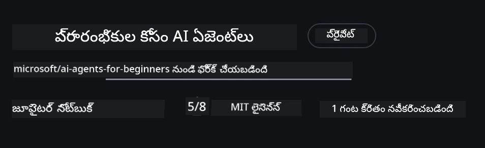
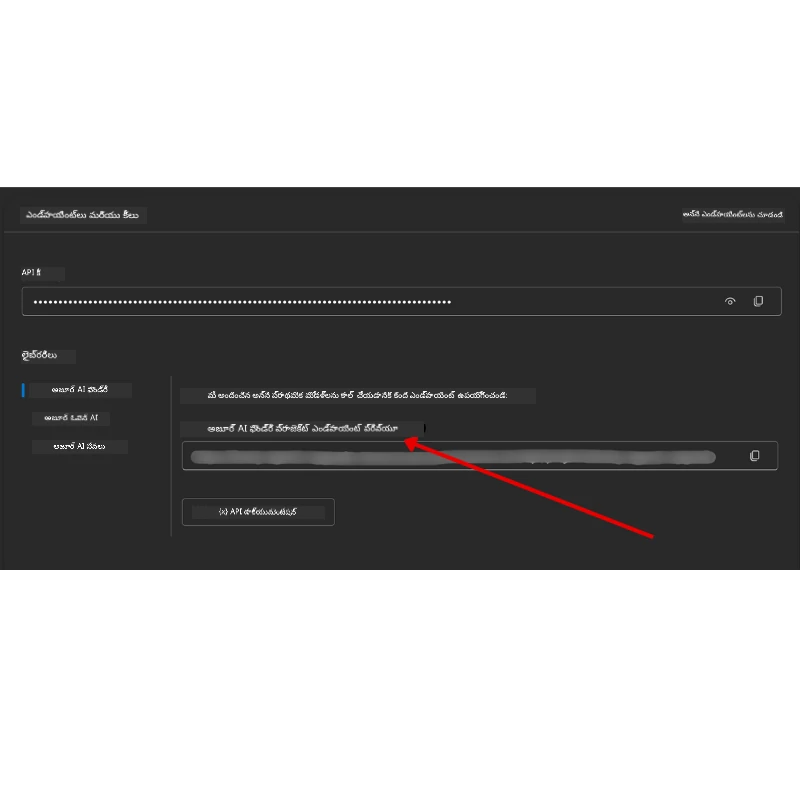

# కోర్స్ సెటప్

## పరిచయం

ఈ పాఠం ఈ కోర్సు యొక్క కోడ్ నమూనాలను ఎలా నడుపుదో వివరించనుంది.

## ఇతర అభ్యాసకులతో చేరి సహాయం పొందండి

మీరు మీ రెపోను క్లోన్ చేయడం ప్రారంభించే ముందే, సెటప్ సహాయం కోసం, కోర్స్ గురించి ఏమైనా ప్రశ్నల కోసం, లేదా ఇతర అభ్యాసకులతో కనెక్ట్ అవ్వడానికి [AI Agents For Beginners Discord channel](https://aka.ms/ai-agents/discord) లో చేరండి.

## ఈ రెపోను క్లోన్ చేయండి లేదా ఫోర్క్ చేయండి

ప్రారంభించడానికి, గిట్ హబ్ రిపాజిటరీని క్లోన్ చేయండి లేదా ఫోర్క్ చేయండి. దీని ద్వారా మీరు కోర్సు మెటీరియల్స్ మీ సొంత వెర్షన్‌ను సృష్టించి, కోడ్‌ను నడిపించవచ్చు, పరీక్షించవచ్చు మరియు సవరించవచ్చు!

ఇది <a href="https://github.com/microsoft/ai-agents-for-beginners/fork" target="_blank">ఫోర్క్ చేసేందుకు లింక్ పై క్లిక్ చేయడం</a> ద్వారా చేయవచ్చు

ఇప్పుడు ఈ కోర్సు యొక్క మీ సొంత ఫోర్క్ వెర్షన్ క్రింది లింక్ లో ఉండాలి:



### షాలో క్లోన్ (వర్క్‌షాప్ / కోడ్స్‌పేస్ కోసం సిఫార్సు)

  >పూర్తి రిపాజిటరీ డౌన్లోడ్ చేస్తే పెద్దదై ఉండొచ్చు (~3 GB), అంతా చరిత్ర మరియు ఫైళ్ళను డౌన్లోడ్ చేస్తే. మీరు కేవలం వర్క్‌షాప్ లేదా కొన్ని పాఠాల ఫోల్డర్లు మాత్రమే అవసరం అయితే, షాలో క్లోన్ (లేదా స్పార్స్ క్లోన్) చరిత్రను తక్కువ చేసి డౌన్లోడ్ ను తగ్గిస్తుంది.

#### త్వరిత షాలో క్లోన్ — సగటు చరిత్ర, అన్ని ఫైళ్లు

కింద ఇచ్చిన కమాండ్లలో `<your-username>` ను మీ ఫోర్క్ URL తో (లేదా మీరు ఇష్టపడ్డ upstream URL తో) మార్చండి.

కేవలం తాజాగా చేసిన కమిట్ చరిత్రను క్లోన్ చేయడానికి (సన్నని డౌన్లోడ్):

```bash|powershell
git clone --depth 1 https://github.com/<your-username>/ai-agents-for-beginners.git
```

ఒక ప్రత్యేక బ్రాంచ్‌ను క్లోన్ చేయడానికి:

```bash|powershell
git clone --depth 1 --branch <branch-name> https://github.com/<your-username>/ai-agents-for-beginners.git
```

#### భాగస్వామ్య (స్పార్స్) క్లోన్ — కనీస బ్లాబ్స్ + ఎంచుకున్న ఫోల్డర్లు మాత్రమే

ఇది పార్టియల్ క్లోన్ మరియు స్పార్స్-చెక్‌అవుట్ ఉపయోగిస్తుంది (Git 2.25+ అవసరం మరియు పార్టియల్ క్లోన్ మద్దతుతో మోడర్న్ Git సిఫార్సు):

```bash|powershell
git clone --depth 1 --filter=blob:none --sparse https://github.com/<your-username>/ai-agents-for-beginners.git
```

రెపో ఫోల్డర్ లోకి వెళ్ళండి:

```bash|powershell
cd ai-agents-for-beginners
```

తరువాత మీరు కావలసిన ఫోల్డర్లను ఎంచుకోండి (కింద ఉదాహరణలో రెండు ఫోల్డర్లు చూపించబడ్డాయి):

```bash|powershell
git sparse-checkout set 00-course-setup 01-intro-to-ai-agents
```

క్లోనింగ్ చేసి ఫైళ్లను ధృవీకరించిన తర్వాత, మీరు కేవలం ఫైల్స్ మాత్రమే కావాలనుకుంటే మరియు స్థలాన్ని ఖాళీ చేయాలనుకుంటే (గిట్ చరిత్ర అవసరం లేదు), దయచేసి రెపోజిటరీ మెటాడేటాను తొలగించండి (💀మించినది — మీరు అన్ని Git ఫంక్షనాలిటీని కోల్పోతారు: కమిట్లు, పుల్స్, పుష్‌లు లేదా చరిత్ర యాక్సెస్ ఉండదు).

```bash
# zsh/bash
rm -rf .git
```

```powershell
# పవర్‌షెల్
Remove-Item -Recurse -Force .git
```

#### GitHub Codespaces ఉపయోగించడం (స్థానికంగా భారీ డౌన్లోడ్లు తప్పించుకోవడానికి సిఫార్సు)

- ఈ రెపో కోసం కోడ్స్‌పేస్ క్రియేట్ చేయండి [GitHub UI](https://github.com/codespaces) ద్వారా.  

- క్రొత్త కోడ్స్‌పేస్ టెర్మినల్‌లో, పై షాలో/స్పార్స్ క్లోన్ కమాండ్లలో ఒకదాన్ని నడపండి, మీరు కావలసిన పాఠాల ఫోల్డర్లను కోడ్స్‌పేస్ వర్క్‌స్పేస్‌లో తీసుకువప్పించడానికి.
- ఐచ్ఛికం: కోడ్స్‌పేస్ లో క్లోన్ చేసిన తర్వాత, అదనపు స్థలం కోసం .git ని తీసివేయండి (పై తొలగింపు కమాండ్లు చూడండి).
- గమనిక: మీరు రెపోను డైరెక్ట్‌గా కోడ్స్‌పేస్‌లో తెరవాలనుకుంటే (అదనపు క్లోన్ లేకుండా), కోడ్స్‌పేస్ డెవ్కంటైనర్ ఎన్విరాన్‌మెంట్‌ను క్రియేట్ చేస్తుంది మరియు మీకు అవసరమున్నదానికంటే ఎక్కువ వనరులు ప్రొവിഷన్ చేయవచ్చు. తాజా కోడ్స్‌పేస్ లో షాలో కాపీ క్లోన్ చేయడం ద్వారా డిస్క్ వాడకాన్ని మీరు ఎక్కువగా నియంత్రించవచ్చు.

#### సూచనలు

- ఎప్పుడు మీరు ఎడిట్/కమిట్ చేయాలనుకుంటే, మీ ఫోర్క్ యొక్క క్లోన్ URL ను మార్చండి.
- మీరు తరువాత చరిత్ర లేదా ఫైళ్లు ఎక్కువగా కావాలంటే, వాటిని ఫెచ్ చేయవచ్చు లేదా స్పార్స్-చెక్‌అవుట్ సర్దుబాటు చేయవచ్చు అదనపు ఫోల్డర్ల కోసం.

## కోడ్ నడపడం

ఈ కోర్స్ చేత AI ఏజెంట్లు నిర్మించడంలో హ్యాండ్స్-ఆన్ అనుభవం పొందేందుకు మీరు నడపగల జుపిటర్ నోట్‌బుక్స్ సిరీస్ అందిస్తుంది.

కోడ్ ఉదాహరణలు **Microsoft Agent Framework (MAF)** తో `FoundryChatClient` ఉపయోగిస్తాయి, ఇది **Microsoft Foundry Agent Service V2** (Responses API) ద్వారా **Microsoft Foundry** కు కనెక్ట్ అవుతుంది.

అన్ని పైతాన్ నోట్‌బుక్స్ లకు `*-python-agent-framework.ipynb` అని లేబుల్ దీనికి ఉంది.

## అవసరాలు

- Python 3.12+
  - **గమనిక**: మీకు Python3.12 సంస్థాపనం చేయకపోతే, దయచేసి సంస్థాపించండి. తరువాత python3.12తో వర్చువల్ ఎన్విరాన్‌మెంట్ (venv) సృష్టించండి, తద్వారా సరైన వెర్షన్‌లు requirements.txt నుండి సంస్థాపితం అవుతాయి.
  
    >ఉదాహరణ

    Python venv డైరెక్టరీ సృష్టించండి:

    ```bash|powershell
    python -m venv venv
    ```

    తరువాత venv ఎన్విరాన్‌మెంట్ యాక్టివేట్ చేయండి:

    ```bash
    # జెడ్‌ఎస్ఎచ్/బాష్
    source venv/bin/activate
    ```
  
    ```dos
    # Command Prompt for Windows
    venv\Scripts\activate
    ```

- .NET 10+: .NET కోసం నమూనా కోడ్ కోసం, దయచేసి [.NET 10 SDK](https://dotnet.microsoft.com/download/dotnet/10.0) లేదా తర్వాతి వర్షన్ సంస్థాపించండి. తరువాత, మీ సంస్థాపించిన .NET SDK వెర్షన్ తనిఖీ చేసుకోండి:

    ```bash|powershell
    dotnet --list-sdks
    ```

- **Azure CLI** — ప్రామాణీకరణ కోసం అవసరం. [aka.ms/installazurecli](https://aka.ms/installazurecli) నుండి ఇన్‌స్టాల్ చేయండి.
- **Azure Subscription** — Microsoft Foundry మరియు Microsoft Foundry Agent Service కు యాక్సెస్ కోసం.
- **Microsoft Foundry ప్రాజెక్ట్** — డిప్లాయ్ చేసిన మోడల్ (ఉదా: `gpt-4o`) తో ఒక ప్రాజెక్ట్. క్రింద [దశ 1 ని](#దశ-1-microsoft-foundry-ప్రాజెక్టు-సృష్టించండి) చూడండి.

ఈ రిపోజిటరీ రూట్‌లో, కోడ్ నమూనాలను నడపడానికి అవసరమైన అన్ని పైథాన్ ప్యాకేజీలను కలిగిన `requirements.txt` ఫైల్ కలదు.

మీరు ఈ క్రింది కమాండ్‌ను రిపోజిటరీ రూట్ టెర్మినల్‌లో నడిచి వాటిని ఇన్‌స్టాల్ చేసుకోవచ్చు:

```bash|powershell
pip install -r requirements.txt
```

మీరు దోషాలు మరియు సమస్యలను తప్పించుకోవడానికి Python వర్చువల్ ఎన్విరాన్‌మెంట్ సృష్టించడం సిఫార్సు చేస్తాము.

## VSCode సెటప్

మీరు VSCode లో సరైన Python వెర్షన్ ఉపయోగిస్తున్నారా అని నిర్ధారించుకోండి.


## Microsoft Foundry మరియు Microsoft Foundry Agent Service సెటప్ చేయండి

### దశ 1: Microsoft Foundry ప్రాజెక్టు సృష్టించండి

నోట్‌బుక్స్ నడపడానికి, మీరు Microsoft Foundry **హబ్** మరియు **ప్రాజెక్ట్** మోడల్‌తో డిప్లాయ్ చేయబడినదాన్ని కలిగి ఉండాలి.

1. [ai.azure.com](https://ai.azure.com) కు వెళ్ళి, మీ Azure అకౌంట్ తో సైన్ ఇన్ అవ్వండి.
2. ఒక **హబ్** సృష్టించండి (లేదా ఇప్పటికే ఉన్నదాన్ని ఉపయోగించండి). చూడండి: [Hub resources overview](https://learn.microsoft.com/azure/ai-foundry/concepts/ai-resources).
3. హబ్ లో ఒక **ప్రాజెక్ట్** సృష్టించండి.
4. ఒక మోడల్ (ఉదా: `gpt-4o`) ని **Models + Endpoints** → **Deploy model** నుండి డిప్లాయ్ చేయండి.

### దశ 2: ప్రాజెక్ట్ ఎండ్పాయింట్ మరియు మోడల్ డిప్లాయ్‌మెంట్ పేరు పొందండి

Microsoft Foundry పోర్టల్‌లో మీరు సృష్టించిన ప్రాజెక్ట్ నుండి:

- **ప్రాజెక్ట్ ఎండ్పాయింట్** — **Overview** పేజీకి వెళ్లి ఎండ్పాయింట్ URL ని కాపీ చేయండి.



- **మోడల్ డిప్లాయ్‌మెంట్ పేరు** — **Models + Endpoints** కు వెళ్లి, మీరు డిప్లాయ్ చేసిన మోడల్ ను ఎంచుకుని, **Deployment name** (ఉదా: `gpt-4o`) గమనించండి.

### దశ 3: `az login` ద్వారా Azure లో సైన్ ఇన్ అవ్వండి

అన్ని నోట్‌బుక్స్ **`AzureCliCredential`** ఉపయోగించి ప్రామాణీకరణ చేస్తాయి — API కీలు అవసరం లేవు. దానికోసం Azure CLI తో మీరు సైన్ ఇన్ అయినా కావాలి.

1. **Azure CLI ని ఇన్‌స్టాల్ చేయండి** ఇప్పటివరకూ చేయకపోతే: [aka.ms/installazurecli](https://aka.ms/installazurecli)

2. **ఈ కమాండ్ ఆపండి** సైన్ ఇన్ కావడానికి:

    ```bash|powershell
    az login
    ```

    లేదా మీరు రిమోట్/కోడ్స్‌పేస్ వాతావరణంలో ఉంటే బ్రౌజర్ లేకుండా:

    ```bash|powershell
    az login --use-device-code
    ```

3. **మీ సబ్‌స్క్రిప్షన్ ఎంచుకోండి** అడిగితే — మీ Foundry ప్రాజెక్ట్ ఉన్నది ఎంచుకోండి.

4. **మీరు సైన్ ఇన్ అయి ఉన్నారో ధృవీకరించుకోండి**:

    ```bash|powershell
    az account show
    ```

> **`az login` ఎందుకు?** నోట్‌బుక్స్ `azure-identity` ప్యాకేజ్ నుండి `AzureCliCredential` తో ప్రామాణీకరణ చేస్తాయి. అంటే మీరు Azure CLI సెషన్ ద్వారా క్రెడెన్షియల్స్ పొందుతారు — API కీస్ లేదా సీక్రెట్స్ `.env`లో అవసరం లేవు. ఇది ఒక [సెక్యూరిటీ ఉత్తమ ఆచారం](https://learn.microsoft.com/azure/developer/ai/keyless-connections).

### దశ 4: మీ `.env` ఫైల్ సృష్టించండి

ఉదాహరణ ఫైల్ కాపీ చేయండి:

```bash
# zsh/bash
cp .env.example .env
```

```powershell
# పవర్‌షెల్
Copy-Item .env.example .env
```

`.env` ఓపెన్ చేసి ఈ రెండు విలువలు భర్తీ చేయండి:

```env
AZURE_AI_PROJECT_ENDPOINT=https://<your-project>.services.ai.azure.com/api/projects/<your-project-id>
AZURE_AI_MODEL_DEPLOYMENT_NAME=gpt-4o
```

| వరియబుల్ | ఈవిధంగా కనుగొనాలి |
|----------|-----------------|
| `AZURE_AI_PROJECT_ENDPOINT` | Foundry పోర్టల్ → మీ ప్రాజెక్ట్ → **Overview** పేజీ |
| `AZURE_AI_MODEL_DEPLOYMENT_NAME` | Foundry పోర్టల్ → **Models + Endpoints** → మీ డిప్లాయ్ చేసిన మోడల్ పేరు |

ఇంతకంటే ఎక్కువ పాఠాల కోసం ఇది సరిపోతుంది! నోట్‌బుక్స్ మీ `az login` సెషన్ ద్వారా ఆటోమేటిక్‌గా ప్రామాణీకరించబడతాయి.

### దశ 5: పython డిపెండెన్సీలు ఇన్‌స్టాల్ చేయండి

```bash|powershell
pip install -r requirements.txt
```

మీరు ఈ కమాండ్‌ను మీరు ముందుగా సృష్టించిన వర్చువల్ ఎన్విరాన్‌మెంట్ లో నడపాలని సిఫారసు చేస్తాము.

## అదనపు సెటప్ పాఠం 5 (Agentic RAG)

పాఠం 5 లో **Azure AI Search** ఉపయోగించబడుతుంది retrieval-augmented generation కోసం. మీరు ఆ పాఠం నడపాలని ఉంటే, ఈ వరియబుల్స్ ను `.env` ఫైల్‌లో జోడించండి:

| వరియబుల్ | ఈవిధంగా కనుగొనాలి |
|----------|-----------------|
| `AZURE_SEARCH_SERVICE_ENDPOINT` | Azure పోర్టల్ → మీ **Azure AI Search** వనరు → **Overview** → URL |
| `AZURE_SEARCH_API_KEY` | Azure పోర్టల్ → మీ **Azure AI Search** వనరు → **Settings** → **Keys** → ప్రాథమిక అడ్మిన్ కీ |

## Azure OpenAI ను నేరుగా పిలిచే పాఠాల కోసం అదనపు సెటప్ (పాఠాలు 6 మరియు 8)

కొన్ని నోట్‌బుక్స్ పాఠాలు 6 మరియు 8 లో నేరుగా **Azure OpenAI** (Responses API ఉపయోగించి) పిలుస్తాయి, Microsoft Foundry ప్రాజెక్ట్ ద్వారా కాకుండా. ఈ నమూనాలు మునుపటి GitHub Models ని ఉపయోగించేవి, అది డిప్రికేటెడ్ (జూలై 2026 లో రిటైర్ అవుతుంది) మరియు Responses API కి మద్దతు ఇవ్వదు. మీరు ఆ నమూనాలు నడపాలని ఉంటే, ఈ వరియబుల్స్ ను `.env` లో జోడించండి:

| వరియబుల్ | ఈవిధంగా కనుగొనాలి |
|----------|-----------------|
| `AZURE_OPENAI_ENDPOINT` | Azure పోర్టల్ → మీ **Azure OpenAI** వనరు → **Keys and Endpoint** → ఎండ్పాయింట్ (ఉదా: `https://<your-resource>.openai.azure.com`) |
| `AZURE_OPENAI_DEPLOYMENT` | మీ డిప్లాయ్ చేసిన మోడల్ పేరు (ఉదా: `gpt-4o-mini`) ఇది Responses API కి మద్దతు ఇస్తుంది |
| `AZURE_OPENAI_API_KEY` | ఐచ్ఛికం — మీరు `az login` / Entra ID ఉపయోగించకపోతే మాత్రమే కీ ఆధారిత ప్రామాణీకరణ కోసం |

> Responses API స్థిరమైన `/openai/v1/` ఎండ్పాయింట్ ఉపయోగిస్తుంది, కాబట్టి `api-version` అవసరం లేదు. keyless Entra ID ప్రామాణీకరణ కోసం `az login` తో సైన్ ఇన్ అవ్వండి.

## ప్రత్యామ్నాయ ప్రొవైడర్: MiniMax (OpenAI-సరిపోయే)

[MiniMax](https://platform.minimaxi.com/) పెద్ద పరిధి (204K టోకెన్లు వరకు) మోడల్స్‌ను OpenAI-సరిపోయే API ద్వారా అందిస్తుంది. Microsoft Agent Framework లో `OpenAIChatClient` ఏ OpenAI-సరిపోయే ఎండ్పాయింట్ తో పనిచేస్తుంది, కనుక మీరు MiniMax ను Azure OpenAI లేదా OpenAI కు ప్రత్యామ్నాయంగా ఉపయోగించవచ్చు.

ఈ వరియబుల్స్ ను `.env` లో జోడించండి:

| వరియబుల్ | ఈవిధంగా కనుగొనాలి |
|----------|-----------------|
| `MINIMAX_API_KEY` | [MiniMax Platform](https://platform.minimaxi.com/) → API కీస్ |
| `MINIMAX_BASE_URL` | `https://api.minimax.io/v1` (డిఫాల్ట్ విలువు) ఉపయోగించండి |
| `MINIMAX_MODEL_ID` | ఉపయోగించు మోడల్ పేరు (ఉదా: `MiniMax-M3`) |

**ఉదాహరణ మోడల్స్**: `MiniMax-M3` (సిఫార్సు), `MiniMax-M2.7`, `MiniMax-M2.7-highspeed` (వేగంగా ప్రతిస్పందనలు). మోడల్ పేర్లు మరియు అందుబాటు కాలంతో మారవచ్చు, మరియు మీ అకౌంట్ లేదా ప్రాంతం ఆధారంగా మోడల్ యాక్సెస్ అవ్వవచ్చు — ప్రస్తుత జాబితా కొరకు [MiniMax Platform](https://platform.minimaxi.com/) చూడండి. `MiniMax-M3` మీ అకౌంట్ కు అందుబాటులో లేకపోతే, మీరు యాక్సెస్ కలిగిన మోడల్ కు `MINIMAX_MODEL_ID` సెట్ చేయండి (ఉదా: `MiniMax-M2.7`).

కోడ్ నమూనాలు `OpenAIChatClient` ఉపయోగించే (ఉదా: పాఠం 14 హోటల్ బుకింగ్ వర్క్‌ఫ్లో) ఆటోమేటిక్‌గా మీ MiniMax కాన్ఫిగరేషన్‌ను గుర్తించి ఉపయోగిస్తాయి, `MINIMAX_API_KEY` సెట్ ఉన్నప్పుడు.

## ప్రత్యామ్నాయ ప్రొవైడర్: Foundry Local (ఆన్-డివైస్ మోడల్స్ నడపండి)

[Foundry Local](https://foundrylocal.ai) ఓ లైట్వెయిట్ రన్‌టైమ్, ఇది OpenAI-సరిపోయే API ద్వారా భాషా మోడల్స్ ని పూర్తిగా మీ స్వంత యంత్రమీద డౌన్లోడ్ చేసి, నిర్వహించి, సర్వ్ చేస్తుంది — క్లోడ్ లేడు, Azure సబ్‌స్క్రిప్షన్ లేదు, API కీసు లేవు. ఇది ఆఫ్లైన్ డెవలప్‌మెంట్, క్లౌడ్ ఖర్చులు లేకుండా ప్రయోగం చేయడం, లేదా డేటా ఆన్-డివైస్ ఉంచుకోవడం కోసం మంచి ఎంపిక.

Microsoft Agent Framework `OpenAIChatClient` ఏ OpenAI-సరిపోయే ఎండ్పాయింట్ తో పనిచేస్తున్నందున, Foundry Local Azure OpenAI కు స్థానిక ప్రత్యామ్నాయం.

**1. Foundry Local ఇన్‌స్టాల్ చేయండి**

```bash
# విండోస్
winget install Microsoft.FoundryLocal

# మెక్ ఒఎస్
brew install foundrylocal
```

**2. ఒక మోడల్ డౌన్లోడ్ చేసి నడపండి** (ఇది స్థానిక సర్వీసు కూడా ప్రారంభిస్తుంది):

```bash
foundry model list          # అందుబాటులో ఉన్న మోడళ్లను చూడండి
foundry model run phi-4-mini
```

**3. స్థానిక ఎండ్పాయింట్ కనుగొనటానికి ఉపయోగించే Python SDK ఇన్‌స్టాల్ చేయండి:**

```bash
pip install foundry-local-sdk
```

**4. Microsoft Agent Framework ను మీ స్థానిక మోడల్ వైపు చూపించండి:**

```python
from foundry_local import FoundryLocalManager
from agent_framework.openai import OpenAIChatClient

# అవసరం అయితే మోడల్‌ను డౌన్లోడ్ చేసి స్థానికంగా అందిస్తుంది, తర్వాత ఎండ్‌పాయింట్/పోర్ట్‌ను కనుగొంటుంది.
manager = FoundryLocalManager("phi-4-mini")

chat_client = OpenAIChatClient(
    base_url=manager.endpoint,      # ఉదా. http://localhost:<port>/v1
    api_key=manager.api_key,        # Foundry Local కోసం ఎప్పుడూ "అవసరం లేదు"
    model_id=manager.get_model_info("phi-4-mini").id,
)

agent = chat_client.as_agent(
    name="LocalAgent",
    instructions="You are a helpful assistant running fully on-device.",
)
```

> **గమనిక:** Foundry Local OpenAI-సరిపోయే **Chat Completions** ఎండ్పాయింట్ ను అందిస్తుంది. స్థానిక డెవలప్‌మెంట్ మరియు ఆఫ్లైన్ సందర్భాల కోసం దీన్ని ఉపయోగించండి. పూర్తి **Responses API** ఫీచర్ల కోసం (స్థితిస్థాపక సంభాషణలు, లోతైన టూల్ ఆర్కెస్ట్రేషన్, ఏజెంట్-స్టైల్ డెవలప్‌మెంట్) **Azure OpenAI** లేదా **Microsoft Foundry** ప్రాజెక్ట్ కు టార్గెట్ చేయండి. ప్రస్తుత మోడల్ క్యాటలాగ్ మరియు ప్లాట్‌ఫారమ్ మద్దతు కోసం [Foundry Local డాక్యుమెంటేషన్](https://foundrylocal.ai) చూడండి.

## అదనపు సెటప్ పాఠం 8 (Bing Grounding Workflow)


పాఠం 8లో ఉన్న షరతుWorkflow నోట్‌బుక్ Microsoft Foundry ద్వారా **Bing grounding** ఉపయోగిస్తుంది. మీరు ఆ సాంపుల్ ను నడపాలనుకుంటే, మీ `.env` ఫైల్‌లో ఈ వేరియబుల్‌ని చేర్చండి:

| వేరియబుల్ | దాన్ని ఎక్కడ చూడాలి |
|----------|-----------------|
| `BING_CONNECTION_ID` | Microsoft Foundry పోర్టల్ → మీ ప్రాజెక్ట్ → **Management** → **Connected resources** → మీ Bing కనెక్షన్ → కనెక్షన్ ID ను కాపీ చేసుకోండి |

## సమస్య పరిష్కారం

### macOSలో SSL سندత సర్టిఫికేట్ ధృవీకరణ లోపాలు

మీరు macOSలో ఉంటే మరియు ఈ క్రింది లోపం వస్తే:

```plaintext
ssl.SSLCertVerificationError: [SSL: CERTIFICATE_VERIFY_FAILED] certificate verify failed: self-signed certificate in certificate chain
```

ఇది macOSపై Python తో తెలిసిన ఒక సమస్య, అక్కడ సిస్టమ్ SSL సర్టిఫికెట్లు ఆటోమాటిక్‌గా నమ్మబడవు. దయచేసి ఈ క్రింద సూచించిన పరిష్కారాలను క్రమంగా ప్రయత్నించండి:

**ఎంపిక 1: Python యొక్క Install Certificates స్క్రిప్ట్ను నడిపించండి (శిఫారసు చేయబడింది)**

```bash
# మీ ఇన్స్టాల్ చేసిన Python వెర్షన్ (ఉదాహరణకు, 3.12 లేదా 3.13)తో 3.XX ను మార్చండి:
/Applications/Python\ 3.XX/Install\ Certificates.command
```

**ఎంపిక 2: మీ నోట్‌బుక్‌లో `connection_verify=False` ఉపయోగించండి (GitHub Models నోట్‌బుక్స్ కోసం మాత్రమే)**

పాఠం 6 నోట్‌బుక్‌లో (`06-building-trustworthy-agents/code_samples/06-system-message-framework.ipynb`), ఒక వ్యాఖ్య పెట్టిన పని పరిష్కారం ఇప్పటికే ఉంది. క్లయింట్ సృష్టిస్తున్నప్పుడు `connection_verify=False` ను వ్యాఖ్య తీసివేయండి:

```python
client = ChatCompletionsClient(
    endpoint=endpoint,
    credential=AzureKeyCredential(token),
    connection_verify=False,  # సర్టిఫికేట్ తప్పిదాలు వస్తే SSL ధృవీకరణను నిర్దేశించవద్దు
)
```

> **⚠️ హెచ్చరిక:** SSL ధృవీకరణను నిలిపివేయడం (`connection_verify=False`) సర్టిఫికెట్ ధ్రువీకరణను దాటవేసి భద్రత తగ్గిస్తుంది. దీన్ని అభివృద్ధి పరిసరాల్లో తాత్కాలిక పరిష్కారంగా మాత్రమే ఉపయోగించండి, ఉత్పత్తిలో ఎప్పుడూ ఉపయోగించకండి.

**ఎంపిక 3: `truststore` ను ఇన్‌స్టాల్ చేసి ఉపయోగించండి**

```bash
pip install truststore
```

ఆ తర్వాత నెట్‌వర్క్ కాల్స్ చేయక ముందు మీ నోట్‌బుక్ లేదా స్క్రిప్టు టాప్‌లో ఈ కింది కోడ్‌ను జత చేయండి:

```python
import truststore
truststore.inject_into_ssl()
```

## ఎక్కడైనా సట్లు పడారా?

ఈ సెటప్ నడపడంలో మీరు ఏ సమస్యైనా ఉంటే, మా <a href="https://discord.gg/kzRShWzttr" target="_blank">Azure AI Community Discord</a>లో చేరవచ్చు లేదా <a href="https://github.com/microsoft/ai-agents-for-beginners/issues?WT.mc_id=academic-105485-koreyst" target="_blank">ఇష్యూ సృష్టించండి</a>.

## తర్వాత పాఠం

మీరు ఇప్పుడు ఈ కోర్సు కోడ్‌ని నడపడానికి సిద్దంగా ఉన్నారు. AI ఏజెంట్ల ప్రపంచాన్ని మరింత తెలుసుకునేందుకు సంతోషంగా నేర్చుకోండి!

[AI ఏజెంట్లకి పరిచయం మరియు ఏజెంట్ వినియోగ కేసులు](../01-intro-to-ai-agents/README.md)

---

<!-- CO-OP TRANSLATOR DISCLAIMER START -->
**అస్వీకరణ**:
ఈ పత్రం AI అనువాద సేవ [Co-op Translator](https://github.com/Azure/co-op-translator) ఉపయోగించి అనువదించబడింది. మేము ఖచ్చితత్వానికి ప్రయత్నిస్తున్నప్పటికీ, ఆటోమేటెడ్ అనువాదాలు తప్పులు లేదా అసమగ్రతలను కలిగి ఉండవచ్చు. దాని స్వదేశ భాషలో ఉన్న అసలు పత్రాన్ని అధికారం కలిగిన మూలంగా పరిగణించాలి. కీలకమైన సమాచారం కోసం, ప్రొఫెషనల్ మానవ అనువాదాన్ని సిఫారసు చేస్తాము. ఈ అనువాదం ఉపయోగం వల్ల కలిగే ఏవైనా అపార్థాలు లేదా తప్పుదారులు కోసం మేము బాధ్యత వహించము.
<!-- CO-OP TRANSLATOR DISCLAIMER END -->