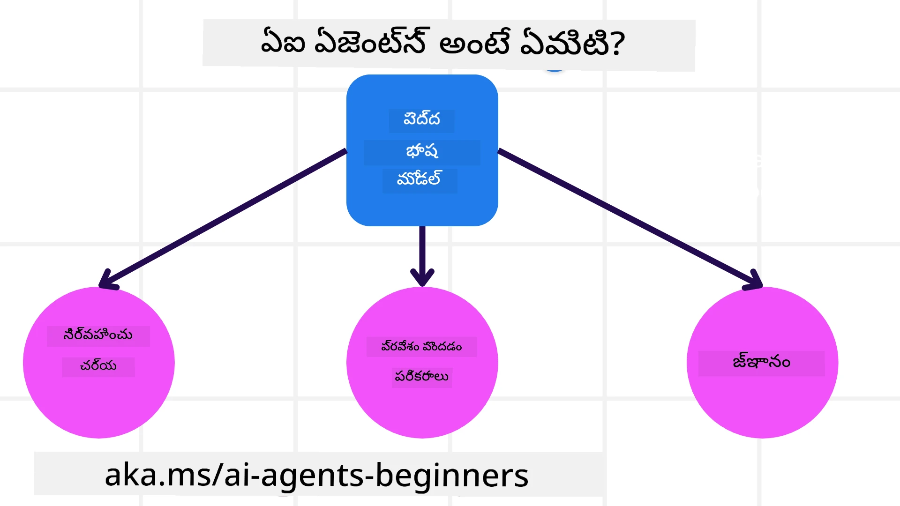
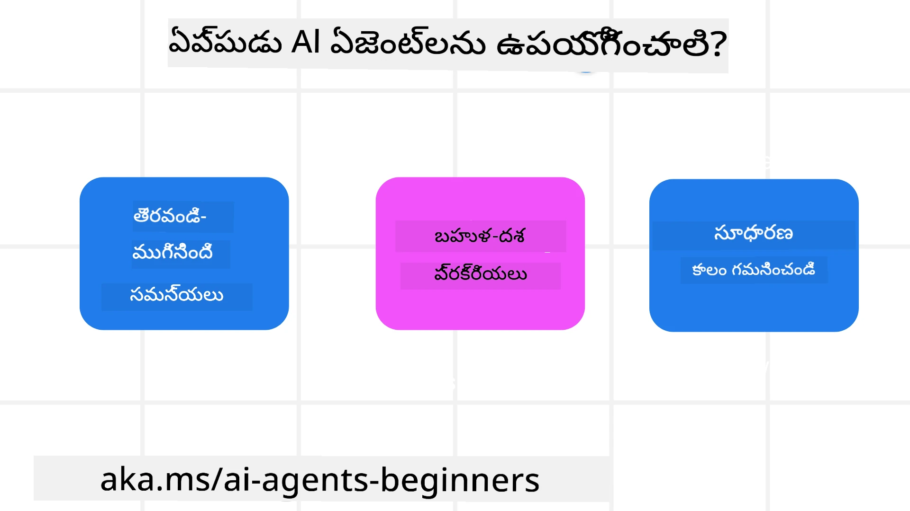

> _(ఈ పాఠానికి సంబంధించిన వీడియోను చూడడానికి పై చిత్రాన్ని క్లిక్ చేయండి)_

# AI ఏజెంట్ల పరిచయం మరియు వాటి ఉపయోగ కేసులు

"AI Agents for Beginners" కోర్సుకు స్వాగతం! ఈ కోర్స్ AI ఏజెంట్ల నిర్మాణానికి అవసరమైన ప్రాథమిక జ్ఞానం మరియు అన్వయ నమూనాలను అందిస్తుంది.

ఈ కోర్స్ గురించి ఏవైనా ప్రశ్నలు ఉంటే, ఇతర నేర్చుకునేవారిని మరియు AI ఏజెంట్ బిల్డర్లను కలుసుకోవడానికి మరియు ప్రశ్నలు అడగడానికి <a href="https://discord.gg/kzRShWzttr" target="_blank">Azure AI Discord కమ్యూనిటీ</a>లో చేరండి.

ఈ కోర్సును మొదలుపెట్టడానికి, మేము మొదటగా AI ఏజెంట్లు ఏమిటి మరియు మనం నిర్మించే అప్లికేషన్లలో మరియు వర్క్ఫ్లోలలో వాటిని ఎలా ఉపయోగించవచ్చో తెలుసుకుంటాము.

## పరిచయం

ఈ పాఠం కవర్ చేసే అంశాలు:

- AI ఏజెంట్లు ఏమిటి మరియు ఏవే భిన్న రకాల ఏజెంట్లు?
- ఏ ఉపయోగ ప్రసంగాలకు AI ఏజెంట్లు ఉత్తమం మరియు అవి మనకు ఎలా సహాయపడతాయి?
- ఏజెంటిక్ పరిష్కారాలను డిజైన్ చేసే సమయంలో కొన్ని ప్రాథమిక నిర్మాణ.Blocks ఏమిటి?

## అధ్యయన లక్ష్యాలు
ఈ పాఠాన్ని పూర్తిచేసిన తర్వాత, మీరు చేయగలిగేది:

- AI ఏజెంట్ భావనలను మరియు అవి ఇతర AI పరిష్కారాల నుండి ఎలా భిన్నంగా ఉన్నాయో అర్థం చేసుకోవడం.
- AI ఏజెంట్లు అత్యంత సమర్థవంతంగా ఎలా వర్తింపజేయాలో అన్వయించుకోవడం.
- వినియోగదారులకు మరియు ఖాతాదారులకు కోసం ఏజెంటిక్ పరిష్కారాలను ఉత్పాదకంగా రూపకల్పన చేయడం.

## AI ఏజెంట్ల నిర్వచనం మరియు రకాలు

### AI ఏజెంట్లు అంటే ఏమిటి?

AI ఏజెంట్లు అనేవి LLMsకి (Large Language Models(LLMs)) టూల్‌ల మరియు జ్ఞానానికి ప్రాప్తిని ఇస్తూ వాటి సామర్థ్యాలను విస్తరించడం ద్వారా చర్యలు చేపట్టగలిగే **వ్యవస్థలు**.

ఈ నిర్వచనాన్ని చిన్న భాగాలుగా విభజిద్దాం:

- **వ్యవస్థ** - ఏజెంట్లను ఒకే భాగంగా కాకుండా అనేక భాగాలుంటే ఒక వ్యవస్థగా భావించడం ముఖ్యము. ప్రాథమిక స్థాయిలో, AI ఏజెంట్ యొక్క భాగాలు:
  - **పరిసరాలు** - AI ఏజెంట్ పని చేస్తున్న నిర్వచించబడిన స్థలం. ఉదాహరణగా, ఒక ట్రావెల్ బుకింగ్ AI ఏజెంట్ ఉంటే, పరిసరాలు ఆ ఏజెంట్ పని చేయడానికి ఉపయోగించే ట్రావెల్ బుకింగ్ సిస్టమ్ కావచ్చు.
  - **సెన్సార్లు** - పరిసరాలకు సమాచారం ఉంటుంది మరియు ఫీడ్బ్యాక్ అందిస్తాయి. AI ఏజెంట్లు పరిసరాల ప్రస్తుత స్థితిని గురించి ఈ సమాచారాన్ని సేకరించడానికి మరియు వైన్యాసం చేయడానికి సెన్సార్లను ఉపయోగిస్తాయి. ప్రయాణ బుకింగ్ ఏజెంట్ ఉదాహరణలో, బుకింగ్ సిస్టమ్ హోటల్ లభ్యత లేదా ఫ్లైట్ ధరల వంటి సమాచారాన్ని అందించవచ్చు.
  - **ఆక్చ్యుటేటర్లు** - ఒకసారి AI ఏజెంట్ పరిసరాల ప్రస్తుత స్థితిని అందుకున్నాక, ప్రస్తుత పనికి పరిసరాలను మార్చడానికి ఏ చర్య తీసుకోవాలో ఏజెంట్ నిర్ణయిస్తుంది. ట్రావెల్ బుకింగ్ ఏజెంట్ కోసం, అది వినియోగదారుని కొరకు అందుబాటులో ఉన్న ఒక గదిని బుక్ చేయడం కావచ్చు.

**భారీ భాషా నమూనాలు** - ఏజెంట్‌ల భావన LLMs నిర్మాణం కాలంయందამდన్నీ ఉండేది. LLMsతో AI ఏజెంట్లు నిర్మించడంలో లాభం వాటి మనుష్య భాషను మరియు డేటాను అర్థం చేసుకునే సామర్థ్యం. ఈ సామర్థ్యం LLMsకి పరిసర సమాచారాన్ని అర్థం చేసుకుని, పరిసరాల్ని మార్చడానికి ఒక ప్రణాళికను నిర్వచించడానికి వీలుగా చేస్తుంది.

**చర్యలు చేపట్టడం** - AI ఏజెంట్ వ్యవస్థల‌కు వెలుపల, LLMs సాధారణంగా వినియోగదారుడి ప్రాంప్ట్ ఆధారంగా కంటెంట్ లేదా సమాచారాన్ని ఉత్పత్తి చేయడంలో పరిమితం. AI ఏజెంట్ వ్యవస్థలలో, LLMs వినియోగదారుడి అభ్యర్థనను అర్థం చేసుకుని, పరిసరాల్లో అందుబాటులో ఉన్న టూల్స్‌ను ఉపయోగించి పనులను పూర్తి చేయగలవు.

**టూల్స్‌కు ప్రాప్తి** - LLMకి ఏ టూల్స్‌కు ప్రాప్తి ఉంటుందో అది 1) అది పనిచేసే పరిసరాలు మరియు 2) AI ఏజెంట్ డెవలపర్ ద్వారా నిర్వచించబడుతుంది. మా ట్రావెల్ ఏజెంట్ ఉదాహరణలో, ఏజెంట్ టూల్స్ బుకింగ్ సిస్టమ్‌లో అందుబాటులో ఉన్న ఆపరేషన్లు ద్వారా పరిమితమవుతాయి, మరియు/లేదా డెవలపర్ ఏజెంట్ టూల్ ప్రాప్తిని ఫ్లైట్ల వరకు పరిమితం చేయవచ్చు.

**మెమరీ+జ్ఞానం** - మెమరీ సంభాషణ పరిసరంలో చురుకైన తాత్కాలికంగా ఉండవచ్చు. దీర్ఘకాలంగా, పరిసరాల ద్వారా అందించిన సమాచారానికి బయట, AI ఏజెంట్లు ఇతర సిస్టమ్‌లు, సేవలు, టూల్స్ మరియు ఇతర ఏజెంట్ల నుండి కూడా జ్ఞానం పొందగలవు. ట్రావెల్ ఏజెంట్ ఉదాహరణలో, ఈ జ్ఞానం వినియోగదారుల ప్రయాణ ప్రాధాన్యాలపై ఉండే కస్టమర్ డేటాబేస్‌లో ఉన్న సమాచారం కావచ్చు.

### వివిధ ఏజెంట్ రకాలు

ఇప్పుడైతే మనకు AI ఏజెంట్ల యొక్క సాధారణ నిర్వచనం ఉన్నది, వ్యక్తిగత ఏజెంట్ రకాలు మరియు అవి ట్రావెల్ బుకింగ్ AI ఏజెంట్‌కు ఎలా వర్తించనున్నాయో చూద్దాం.

| **ఏజెంట్ రకం**                | **వివరణ**                                                                                                                       | **ఉదాహరణ**                                                                                                                                                                                                                   |
| ----------------------------- | ------------------------------------------------------------------------------------------------------------------------------------- | ----------------------------------------------------------------------------------------------------------------------------------------------------------------------------------------------------------------------------- |
| **సింపుల్ రిఫ్లెక్స్ ఏజెంట్లు**      | నిర్ధరించబడిన నియమాల ఆధారంగా తక్షణ చర్యలను నిర్వహిస్తాయి.                                                                                  | ట్రావెల్ ఏజెంట్ ఇమెయిల్ యొక్క సాందర్భ్యాన్ని అర్థం చేసుకుని ప్రయాణ సంబంధమైన ఫిర్యాదులను కస్టమర్ సర్వీస్‌కు ఫార్వర్డ్ చేస్తుంది.                                                                                                                          |
| **మోడల్-బేస్డ్ రిఫ్లెక్స్ ఏజెంట్లు** | ప్రపంచం యొక్క ఒక మోడల్ మరియు ఆ మోడల్‌లోని మార్పుల ఆధారంగా చర్యలు తీసుకుంటాయి.                                                              | ట్రావెల్ ఏజెంట్ చారిత్రక ధరల డేటా యాక్సెస్ ఆధారంగా ధరలో గణనీయ మార్పులు ఉన్న రూట్లను ప్రాథమికత ఇస్తుంది.                                                                                                             |
| **లక్ష్య ఆధారిత ఏజెంట్లు**         | లక్ష్యాన్ని అర్థం చేసుకుని அதனை చేరుకోవడానికి చర్యలుగా ప్లాన్ రూపొందిస్తాయి.                                  | ట్రావెల్ ఏజెంట్ ప్రస్తుత స్థానం నుండీ గమ్యస్థానం వరకు అవసరమైన ప్రయాణ ఏర్పాట్లు (కారు, సామూహిక రవాణా, ఫ్లైట్లు) నిర్ణయించి ఒక యాత్రను బుక్ చేస్తుంది.                                                                                |
| **యుటిలిటీ-ఆధారిత ఏజెంట్లు**      | ప్రాధాన్యాలను పరిగణలోకి తీసుకుని లెక్కాసహితంగా ట్రేడ్-ఆఫ్స్‌ను తూచి లక్ష్యాలను సాధించే విధంగా నిర్ణయిస్తాయి.                                               | ట్రావెల్ ఏజెంట్ ప్రయాణ బుకింగ్ చేయడంలో సౌకర్యం మరియు ఖర్చు మధ్య బరువుల్ని విశ్లేషించి యుటిలిటీని గరిష్టం చేస్తుంది.                                                                                                                                          |
| **లర్నింగ్ ఏజెంట్లు**           | ఫీడ్బ్యాక్‌కు ప్రతిస్పందించి కాలక్రమంలో మెరుగుపడతాయి మరియు చర్యలను సవరించుకుంటాయి.                                                        | ట్రావెల్ ఏజెంట్ ట్రిప్ అనంతం సర్వేల నుండి 고객 ఫీడ్బ్యాక్ ఉపయోగించి భవిష్యత్తు బుకింగ్లలో సవరణలు చేస్తూ మెరుగుపడుతుంది.                                                                                                               |
| **హైరార్కికల్ ఏజెంట్లు**       | టియర్ చేసిన వ్యవస్థలో బహుళ ఏజెంట్లను కలిగి ఉంటాయి, పై స్థాయి ఏజెంట్లు పనులను ఉపపనులుగా విభజించి తక్కువ స్థాయి ఏజెంట్లను పూర్తి చేయించడానికి పంపిస్తాయ. | ట్రావెల్ ఏజెంట్ ఒక ప్రయాణాన్ని క్యాన్సెల్ చేయడానికి పనిని ఉపపనులుగా విభజించి (ఉదాహరణకు, నిర్దిష్ట బుకింగ్లను రద్దు చేయడం) తక్కువ స్థాయి ఏజెంట్లు వాటిని పూర్తి చేసి పై స్థాయి ఏజెంట్‌కు రిపోర్ట్ చేస్తాయి.                                     |
| **బహుళ-ఏజెంట్ సిస్టమ్స్ (MAS)** | ఏజెంట్లు స్వతంత్రంగా, సహకారపూర్వకంగా లేదా పోటీశీలంగా పనులను పూర్తి చేస్తాయి.                                                           | సహకారపూర్వక: బహుళ ఏజెంట్లు హోటల్స్, ఫ్లైట్స్ మరియు వినోదం వంటి నిర్దిష్ట ప్రయాణ సేవలను బుక్ చేస్తాయి. పోటీశీల: బహుళ ఏజెంట్లు ఒక κοιν హోటల్ బుకింగ్ క్యాలెండర్కు మీద నిర్వహించి మరియు పోటీగా ఖాతాదారులను హోటల్‌లో బుక్ చేసేందుకు పోటీ పడతాయి. |

## AI ఏజెంట్లను ఎప్పుడు ఉపయోగించాలి

మునుపటి విభాగంలో, ట్రావెల్ ఏజెంట్ ఉపయోగకేస్‌ను ఉపయోగించి ట్రావెల్ బుకింగ్ వివిధ పరిస్థితులలో ఏజెంట్ రకాలు ఎలా ఉపయోగించవచ్చో వివరించాము. ఈ అప్లికేషన్‌ను కోర్స్ అంతటా కొనసాగిస్తాము.

AI ఏజెంట్లు అత్యుత్తమంగా ఉపయోగపడే ఉపయోగ కేసుల రకాలను చూద్దాం:

- **ఓపెన్-ఎండెడ్ సమస్యలు** - పని పూర్తి చేయడానికి అవసరమైన దశలను LLM నిర్ణయించేలా వీలుగా చేయడం, ఎందుకంటే అవి ఎల్లప్పుడూ వర్క్‌ఫ్లోలో హార్డ్‌కోడ్ చేయబడలేవు.
- **బహుళ-దశా ప్రక్రియలు** - ఏజెంట్ టూల్స్ లేదా సమాచారాన్ని ఒకే సారి ఒకదానిలో కాకుండా బహుమార్గాలుగా ఉపయోగించవలసిన, ఒక స్థాయిలో క్లిష్టత అవసరమైన పనులు.
- **కాలానుగుణంగా మెరుగుదల** - ఏజెంట్ తన పరిసరాలనో లేదా వినియోగదారులనో నుండి ఫీడ్బ్యాక్ పొందుతూ కాలక్రమంలో మెరుగుపడగల పనులు, ముఖ్యంగా మరింత మంచి ఉపయోగకర్తా విలువను అందించడానికి.

AI ఏజెంట్లను ఉపయోగించేటప్పుడు మరిన్ని పరిగణనల గురించి మేము "Building Trustworthy AI Agents" పాఠంలో చర్చిస్తాము.

## ఏజెంటిక్ పరిష్కారాల ప్రాథమికాలు

### ఏజెంట్ అభివృద్ధి

AI ఏజెంట్ వ్యవస్థను డిజైన్ చేయడంలో మొదటి దశ టూల్స్, చర్యలు, మరియు ప్రవర్తనలను నిర్వచించడమే. ఈ కోర్సులో, మనం మన ఏజెంట్లను నిర్వచించడానికి **Azure AI Agent Service** ను ఉపయోగించే దానిపై కేంద్రీకరించబోతున్నాము. ఇది క్రింది సదుపాయాలను అందిస్తుంది:

- OpenAI, Mistral, మరియు Llama వంటి ఓపెన్ మోడల్స్ ఎంపిక
- Tripadvisor వంటి ప్రొవైడర్ల ద్వారా లైసెన్స్ పొందిన డేటా ఉపయోగం
- OpenAPI 3.0 వంటి ప్రమాణీకృత టూల్స్ వినియోగం

### ఏజెంటిక్ నమూనాలు

LLMs తో సంభాషణలు ప్రాంప్ట్‌ల ద్వారా జరుగుతాయి. ఏజెంట్ల యొక్క సున్నిత-స్వాయత్వం దృష్ట్యా, పరిసరంలో మార్పు వచ్చినప్పుడు LLMను మాన్యువల్‌గా తిరిగి ప్రాంప్ట్ చేయడం ఎల్లప్పుడూ సాధ్యమవ్వదు లేదా అవసరమవదు. మేము బహుళ దశలలో LLMని మరింత స్కేలబుల్‌గా ప్రాంప్ట్ చేయడానికి అనుమతించే **ఏజెంటిక్ నమూనాలు**ను ఉపయోగిస్తాము.

ఈ కోర్స్ ప్రస్తుత ప్రముఖ ఏజెంటిక్ నమూనాల కొన్ని భాగాలుగా విభజించబడింది.

### ఏజెంటిక్ ఫ్రేమ్‌వర్క్‌లు

ఏజెంటిక్ ఫ్రేమ్‌వర్క్‌లు డెవలపర్లకు కోడ్ ద్వారా ఏజెంటిక్ నమూనాలను అమలు చేయగలిగేలా చేస్తాయి. ఈ ఫ్రేమ్‌వర్క్‌లు టెంప్లేట్లు, ప్లగిన్లు మరియు మెరుగైన AI ఏజెంట్ సంయోజనానికి సాధనాలను అందిస్తాయి. ఈ ప్రయోజనాలు ఏజెంట్ వ్యవస్థల యొక్క మెరుగైన ఆబ్జర్వబిలిటీ మరియు ట్రబుల్‌షూటింగ్ సామర్థ్యాలను అందుతాయి.

ఈ కోర్సులో, ఉత్పత్తి-సిద్ధమైన AI ఏజెంట్లను నిర్మించడానికి Microsoft Agent Framework (MAF) ను అన్వేషీయబోతాము.

## నమూనా కోడ్లు

- Python: [Agent Framework](./code_samples/01-python-agent-framework.ipynb)
- .NET: [Agent Framework](./code_samples/01-dotnet-agent-framework.md)

## AI ఏజెంట్ల గురించి ఇంకా ప్రశ్నలున్నాయా?

ఇతర నేర్చుకునేవారిని కలవడానికి, ఆఫీస్ అవర్స్ లో పాల్గొనడానికి మరియు మీ AI ఏజెంట్ల ప్రశ్నలకు సమాధానాలు పొందడానికి [Microsoft Foundry Discord](https://aka.ms/ai-agents/discord)లో చేరండి.

## గత పాఠం

[Course Setup](../00-course-setup/README.md)

## తదుపరి పాఠం

[Exploring Agentic Frameworks](../02-explore-agentic-frameworks/README.md)

---

<!-- CO-OP TRANSLATOR DISCLAIMER START -->
అస్వీకరణ:
ఈ పత్రం AI అనువాద సేవ [Co-op Translator](https://github.com/Azure/co-op-translator) ఉపయోగించి అనువదించబడింది. మేము ఖచ్చితత్వానికి ప్రయత్నించినప్పటికీ, ఆటోమేటెడ్ అనువాదాల్లో తప్పులు లేదా అస్పష్టతలు ఉండవచ్చు. మూల పత్రాన్ని దాని స్థానిక భాషలోని ప్రతినే అధికారిక మూలంగా పరిగణించాలి. ముఖ్యమైన సమాచారం కోసం నిపుణులైన మానవ అనువాదాన్ని సిఫార్సు చేస్తాము. ఈ అనువాదాన్ని ఉపయోగించడంవలన ఏర్పడిన ఏవైనా అపార్థాలు లేదా తప్పుగా అర్థం చేసుకోవడాలపై మేము ఎటువంటి బాధ్యతను స్వీకరించము.
<!-- CO-OP TRANSLATOR DISCLAIMER END -->