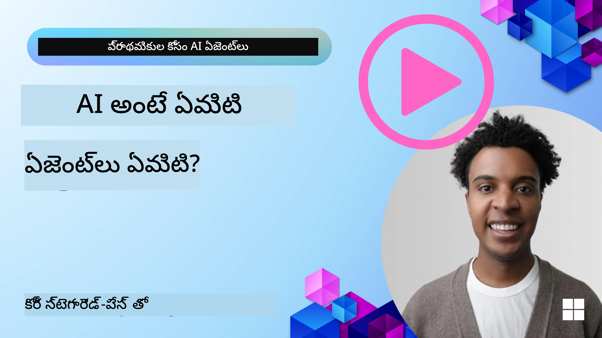
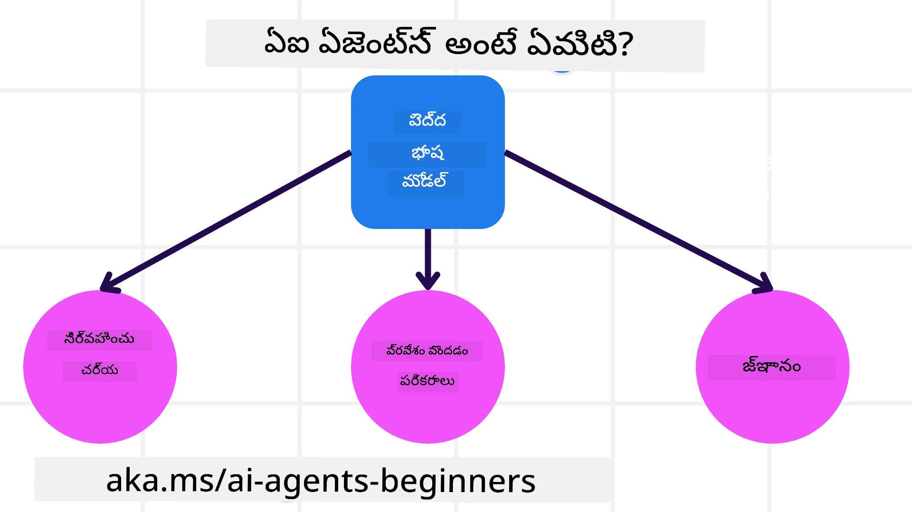
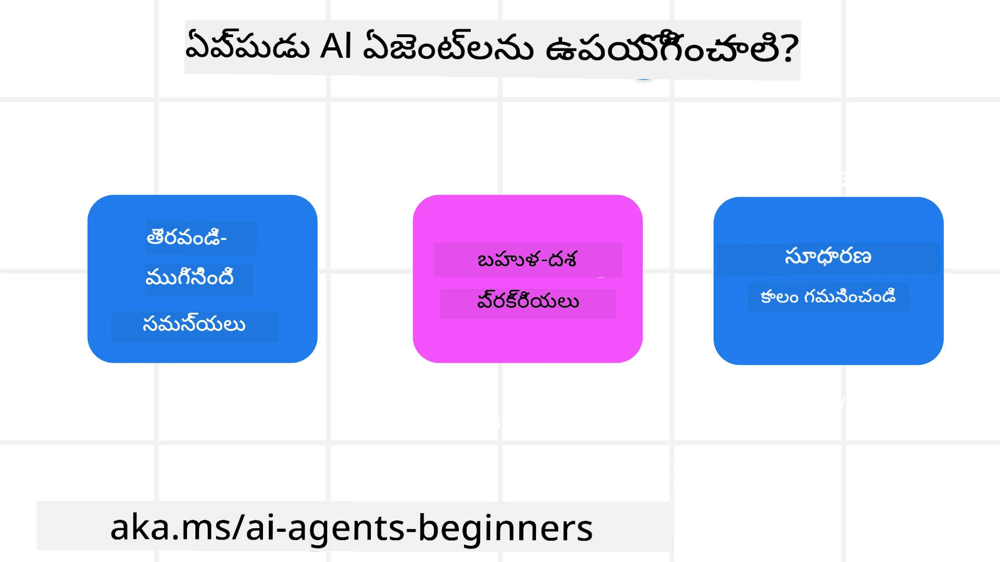

> _(ఈ పాఠం వీడియోను చూడడానికి పై చిత్రాన్ని క్లిక్ చేయండి)_

# AI ఏజెంట్లు మరియు ఏజెంట్ ఉపయోగాలు పరిచయం

**AI Agents for Beginners** కోర్స్కు స్వాగతం! ఈ కోర్సు మీకు మౌలిక జ్ఞానాన్ని — మరియు నిజమైన పని చేసే కోడ్‌ను — మొదలు పెట్టి AI ఏజెంట్లను నిర్మించేందుకు ఇస్తుంది.

<a href="https://discord.gg/kzRShWzttr" target="_blank">Azure AI Discord Community</a> లో హాయ్ చెప్పండి — ఇది విద్యార్థులు మరియు AI సృష్టికర్తలతో నిండి ఉంది, వారు ప్రశ్నలకు సంతోషంగా సమాధానం ఇస్తారు.

బిల్డింగ్ ప్రారంభించేముందు, నిజంగా ఏది AI ఏజెంట్ *అన్న*ది మరియు ఎప్పుడు ఒకటిని వాడటం సాఫీగా ఉండేదో తెలుసుకుందాం.

---

## పరిచయం

ఈ పాఠం కిందివి కవర్ చేస్తుంది:

- ఏంటి AI ఏజెంట్లు మరియు వేరే వేరే రకాలు ఏమిటి
- ఏ పనులకు AI ఏజెంట్లు ఉత్తమమవుతాయో
- ఏజెంటిక్ పరిష్కారాన్ని రూపొందించినప్పుడు ఉపయోగించే మూల రాళ్ల వివరాలు

## అభ్యాస లక్ష్యాలు

ఈ పాఠం ముగింపు వరకూ, మీరు చేయగలిగేది:

- AI ఏజెంట్ అంటే ఏమిటి మరియు సాధారణ AI పరిష్కారంనుంచి ఎలా వేరుగా ఉందో వివరించగలుగుతారు
- ఎప్పుడైతే AI ఏజెంట్ వాడాల్సిన అవసరం ఉందో (ఎప్పుడు లేదో కూడా) తెలుసుకోవాలి
- నిజమైన ప్రపంచ సమస్యకు ఒక ప్రాథమిక ఏజెంటిక్ పరిష్కారం డిజైన్ స్కెచ్ చేయగలుగుతారు

---

## AI ఏజెంట్ల నిర్వచనము మరియు రకాలు

### AI ఏజెంట్లు అంటే ఏమిటి?

దీన్ని ఇలా సులభంగా భావించవచ్చు:

> **AI ఏజెంట్లు అనేవి పెద్ద భాషా నమూనాలు (LLMs) నిజంగా *कार्यాలు* చేయడానికి అనుమతించే వ్యవస్థలు — వాటికి సాధనాలు మరియు జ్ఞానాన్ని ఇస్తూ, prompts కు మాత్రమే ప్రతిస్పందించకుండా ప్రపంచంపై చర్యలు తీసుకోగలవు.**

దీనిని ఆవృతం చేద్దాం:

- **వ్యవస్థ** — ఒక AI ఏజెంటు ఒక్కటే కాదు. ఇది కలిసి పనిచేసే భాగాల ఒక సంకలనం. ప్రాథమికంగా, ప్రతి ఏజెంట్ వద్ద మూడు భాగాలు ఉంటాయి:
  - **పరిసరాలు** — ఏజెంట్ పనిచేసే స్థలం. ఒక ట్రావెల్ బుకింగ్ ఏజెంట్‌కి ఇది బుకింగ్ ప్లాట్‌ఫారమ్.
  - **సెన్సార్లు** — ఏజెంట్ యొక్క పరిసరాల వర్తమాన స్థితిని ఎలా చదువుతారు. మా ట్రావెల్ ఏజెంట్ హోటల్ లభ్యత లేదా ఫ్లైట్ ధరలను చెక్ చేయవచ్చు.
  - **క్రియాపదాలు** — ఏజెంట్ చర్య ఎలా తీసుకుంటుంది. ట్రావెల్ ఏజెంట్ గదిని బుక్ చేయవచ్చు, ధృవీకరణ పంపవచ్చు లేదా రిజర్వేషన్ రద్దు చేయవచ్చు.

- **పెద్ద భాషా నమూనాలు** — ఏజెంట్లు LLMs ముందుగా ఉండేవాటే, కానీ LLMs ప్రస్తుతం ఏజెంట్లను శక్తివంతం చేస్తున్నారు. అవి సహజ భాషను అర్థం చేసుకుంటాయి, సందర్భాలను తర్కం చేస్తాయి మరియు సందేహాస్పద వినియోగదారు అభ్యర్థనను స్పష్టమైన కార్యచరణ యోజనగా మార్చగలవు.

- **చర్యలు నిర్వహించడం** — ఏజెంట్ వ్యవస్థ లేకపోతే, LLM కేవలం పాఠ్యాన్ని ఉత్పత్తి చేస్తుంది. ఏజెంట్ వ్యవస్థలో, LLM నిజంగా *నడిపే* దశలను అమలు చేయగలదు — డేటాబేస్ శోధన, API పిలుపు, సందేశ పంపడం.

- **సాధనాల ప్రాప్యత** — ఏ సాధనాలు ఏజెంట్ వాడగలదో (1) అది ఏ పరిసరంలో నడుస్తోంది మరియు (2) అభివృద్ధిపరుడు దానికి ఏమి ఇచ్చారు అనేదానిపై ఆధారపడి ఉంటుంది. ట్రావెల్ ఏజెంట్ విమానాలు శోధించగలడు కానీ కస్టమర్ రికార్డులు సవరించలేకపోచ్చు — ఇది మీరు ఏది తీసుసుకుంటారో ఆధారపడి ఉంటుంది.

- **స్మృతి + జ్ఞానం** — ఏజెంట్లకు తాత్కాలిక స్మృతి (ప్రస్తుత సంభాషణ) మరియు దీర్ఘకాలిక స్మృతి (కస్టమర్ డేటాబేస్, గత పరస్పర చర్యలు) ఉండొచ్చు. ట్రావెల్ ఏజెంట్ మీరు జన్నెలు సీట్లు ఇష్టపడతారని "గురతిస్తుంది".

---

### AI ఏజెంట్ల వివిధ రకాలు

అన్ని ఏజెంట్లు అదే విధంగా నిర్మించబడవు. ట్రావెల్ బుకింగ్ ఏజెంట్ పక్కన పెట్టుకుని ప్రధాన రకాల వివరణ:

| **ఏజెంట్ రకం** | **ఏం చేస్తుంది** | **ట్రావెల్ ఏజెంట్ ఉదాహరణ** |
|---|---|---|
| **సింపుల్ రీఫ్లెక్స్ ఏజెంట్లు** | హార్డ్ కోడెడ్ నియమాలు అనుసరిస్తాయి — స్మృతి లేకుండా, ప్రణాళిక లేకుండా. | ఫిర్యాదు ఇమెయిల్ చూసి → కస్టమర్ సర్వీస్ కు ఫార్వర్డ్ చేస్తుంది. అంతే. |
| **మోడల్-ఆధారిత రీఫ్లెక్స్ ఏజెంట్లు** | లోపల ప్రపంచ మోడల్ ను ఉంచి దాన్ని మార్పులు వచ్చినప్పుడు నవీకరిస్తుంది. | చరిత్రాత్మక ఫ్లైట్ ధరలను ట్రాక్ చేసి అకస్మాత్తుగా ఖరీదైన మార్గాలను గుర్తిస్తుంది. |
| **గోల్-ఆధారిత ఏజెంట్లు** | ఒక లక్ష్యాన్ని కలిగి దాన్ని దశలవారీగా చేరుకునే మార్గాన్ని కనుగొంటుంది. | మీ ప్రస్తుత స్థానం నుండి గమ్యస్థానానికి పూర్తి ప్రయాణం బుక్ చేస్తుంది (ఫ్లైట్‌లు, కారు, హోటల్). |
| **యుటిలిటీ-ఆధారిత ఏజెంట్లు** | కేవలం ఒక పరిష్కారాన్ని కాదు — అతి ఉత్తమదాన్ని ట్రేడ్ ఆఫ్లు బరువుచేసుకొని కనుగొంటుంది. | ఖర్చు మరియు సౌలభ్యాన్ని సమతుల్యం చేసి మీ ఇష్టాలకు అత్యున్నత స్కోరు లభించే ప్రయాణాన్ని వెతుకుతుంది. |
| **లెర్నింగ్ ఏజెంట్లు** | ఫీడ్‌బ్యాక్ ద్వారా కాలానుగుణంగా మెరుగుపడతాయి. | ప్రయాణం తర్వాత సర్వే ఫలితాల ఆధారంగా భవిష్యత్ బుకింగ్ సిఫార్సులను సర్దుబాటు చేస్తుంది. |
| **హెయిరార్కికల్ ఏజెంట్లు** | ఉన్నత స్థాయి ఏజెంట్ పని ఉప-పనులకు విభజించి దిగువ స్థాయి ఏజెంట్లకు అప్పగిస్తుంది. | "ప్రయాణం రద్దు" అభ్యర్థన: ఫ్లైట్ రద్దు, హోటల్ రద్దు, కారు రెంటల్ రద్దు — ప్రతిదీ ఉప ఏజెంట్ ద్వారా నిర్వహించబడుతుంది. |
| **మల్టీ-ఏజెంట్ సిస్టమ్స్ (MAS)** | అనేక స్వతంత్ర ఏజెంట్లు కలసి పనిచేస్తాయి (లేదా పోటీ పడతాయి). | సహకారం: వేర్వేరు ఏజెంట్లు హోటల్స్, ఫ్లైట్స్, వినోదమును నిర్వహిస్తాయి. పోటీ: అనేక ఏజెంట్లు ఉత్తమ ధరకు హోటల్ గదుల్ని బుకింగ్ కోసం పోటీ పడతాయి. |

---

## ఎప్పుడు AI ఏజెంట్లు వాడాలి

మీరు *పట్టుకుంటే* AI ఏజెంట్ ఉపయోగించవచ్చని మాత్రమే కాదు, ఎప్పుడూ *ఉపయోగించవలసిన* అవసరం ఉండదు. ఏజెంట్లు నిజంగా మెరుగ్గా పనిచేసే పరిస్థితులు:

- **ఓపెన్-ఎండెడ్ సమస్యలు** — సమస్య పరిష్కార దశలను ముందుగా ప్రోగ్రామ్ చేయలేము. LLM దిశాబోధనను డైనమిక్ గా కనుగొనాలి.
- **బహుది-దశాబ్ద ప్రాసెస్‌లు** — పలు దశల పాటు సాధనాలను ఉపయోగించాల్సిన పనులు, కేవలం ఒకటే లుకప్ లేదా ఉత్పత్తి కాదు.
- **కాలానుగుణంగా మెరుగుదల** — వినియోగదారు ఫీడ్‌బ్యాక్ లేదా పరిసర సంకేతాల ఆధారంగా వ్యవస్థ తెలివిగా తయారవ్వాలి.

ఈ కోర్సులో తర్వాతి పాఠం **Building Trustworthy AI Agents** లో ఎప్పుడు (మరియు ఎప్పుడు *కాదు*) AI ఏజెంట్లు వాడాలో మరింత లోతుగా చర్చిస్తాం.

---

## ఏజెంటిక్ పరిష్కారాల మౌలికాలు

### ఏజెంట్ అభివృద్ధి

ఏజెంట్ ని నిర్మిస్తున్నప్పుడు మీరు మొదట చేయాల్సింది *దాని చేయగల పనులు* ను నిర్వచించడం — దీని సాధనాలు, చర్యలు, మరియు ప్రవర్తనలు.

ఈ కోర్సులో, మేము ప్రధాన ప్లాట్‌ఫార్మ్ గా **Microsoft Foundry Agent Service** ను ఉపయోగిస్తాం. ఇది మద్దతు ఇస్తుంది:

- OpenAI, Mistral మరియు Meta (Llama) వంటి ప్రొవైడర్ల నుండి నమూనాలు
- Tripadvisor లాంటి ప్రొవైడర్ల నుండి లైసెన్స్ పొందిన డేటా
- ప్రామాణిక OpenAPI 3.0 సాధన నిర్వచనలు

### ఏజెంటిక్ ప్యాటర్న్లు

మీరు LLMs తో prompts ద్వారా సంబంధం కలుగుతారు. ఏజెంట్లతో, ప్రతీ prompt మానవీయంగా సృష్టించడం సాధ్యం కాదు — ఏజెంట్ చాలా దశలుగా చర్య తీసుకోవాలి. ఇక్కడ **Agentic Patterns** అవసరం. ఇవి LLMs prompting మరియు ఓర్కెస్ట్రేషన్ కోసం మళ్ళీ ఉపయోగించగల వ్యూహాలు.

ఈ కోర్సు అత్యంత సాధారణ మరియు ఉపయోగకరమైన ఏజెంటిక్ ప్యాటర్న్ల చుట్టూ నిర్మించబడింది.

### ఏజెంటిక్ ఫ్రేమ్‌వర్క్లు

ఏజెంటిక్ ఫ్రేమ్‌వర్క్లు అభివృద్ధిపరులకు ఏజెంట్ల నిర్మాణం కోసం సిద్ధంగా ఉన్న టెంప్లేట్లు, సాధనాలు, మౌలికచ్‌ర్యాలు ఇస్తాయి. ఇవి సులభం చేస్తాయి:

- సాధనాలు మరియు సామర్థ్యాలను వైర్ చేయడం
- ఏజెంట్ ఎంత పని చేస్తున్నాడో గమనించడం (మరియు తప్పులడగడం)
- అనేక ఏజెంట్ల మధ్య సహకారం

ఈ కోర్సులో, మేము ఉత్పాదకతా-సిద్ధం ఏజెంట్ల కోసం **Microsoft Agent Framework (MAF)** పై దృష్టి సారిస్తున్నాము.

---

## కోడ్ నమూనాలు

యాక్టివ్ గా చూడండి? ఈ పాఠానికి కోడ్ నమూనాలు ఇక్కడ ఉన్నాయి:

- 🐍 Python: [Agent Framework](./code_samples/01-python-agent-framework.ipynb)
- 🔷 .NET: [Agent Framework](./code_samples/01-dotnet-agent-framework.md)

---

## ప్రశ్నలు ఉన్నాయా?

ఇతర విద్యార్థులతో కలవడానికి, ఆఫీస్ గంటల్లో పాల్గొనడానికి, మరియు AI ఏజెంట్ గురించి మీ ప్రశ్నలకు సమాధానాలను పొందడానికి [Microsoft Foundry Discord](https://discord.com/invite/ATgtXmAS5D) చేరండి.

---

## గడిచిన పాఠం

[Course Setup](../00-course-setup/README.md)

## తదుపరి పాఠం

[Exploring Agentic Frameworks](../02-explore-agentic-frameworks/README.md)

---

<!-- CO-OP TRANSLATOR DISCLAIMER START -->
**అస్వీకరణ**:
ఈ పత్రం AI అనువాద సేవ [Co-op Translator](https://github.com/Azure/co-op-translator) ఉపయోగించి అనువదించబడింది. మేము ఖచ్చితత్వానికి ప్రయత్నిస్తున్నప్పటికీ, ఆటోమేటెడ్ అనువాదాలు తప్పులు లేదా అసమగ్రతలను కలిగి ఉండవచ్చు. దాని స్వదేశ భాషలో ఉన్న అసలు పత్రాన్ని అధికారం కలిగిన మూలంగా పరిగణించాలి. కీలకమైన సమాచారం కోసం, ప్రొఫెషనల్ మానవ అనువాదాన్ని సిఫారసు చేస్తాము. ఈ అనువాదం ఉపయోగం వల్ల కలిగే ఏవైనా అపార్థాలు లేదా తప్పుదారులు కోసం మేము బాధ్యత వహించము.
<!-- CO-OP TRANSLATOR DISCLAIMER END -->