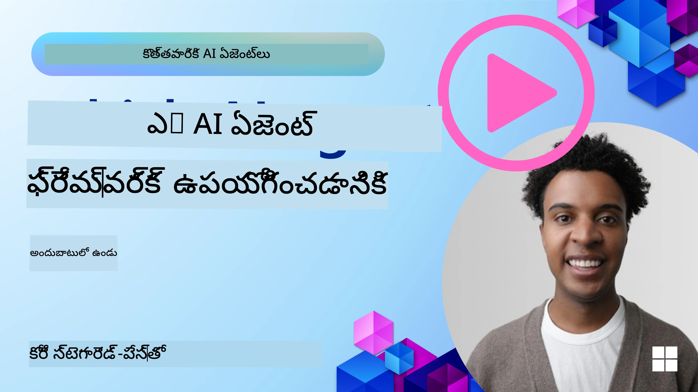

[](https://youtu.be/ODwF-EZo_O8?si=1xoy_B9RNQfrYdF7)

> _(ఈ పాఠం వీడియోను చూడటానికి పై చిత్రం క్లిక్ చేయండి)_

# AI ఏజెంట్ ఫ్రేమ్‌వర్క్‌ల అన్వేషణ

AI ఏజెంట్ ఫ్రేమ్‌వర్క్‌లు AI ఏజెంట్ల సృష్టి, పంపిణీ మరియు నిర్వహణను సులభతరం చేయడానికి రూపొందించబడ్డ సాఫ్ట్‌వేర్ ప్లాట్ఫారమ్‌లు. ఈ ఫ్రేమ్‌వర్క్‌లు డెవలపర్లకు ముందే నిర్మించిన భాగాలను, అభిస్మరణాలను మరియు సాధనాలను అందించడం ద్వారా సంక్లిష్ట AI వ్యవస్థల అభివృద్ధిని సరళతరం చేస్తాయి.

ఈ ఫ్రేమ్‌వర్క్‌లు AI ఏజెంట్ అభివృద్ధిలో సాధారణ సవాళ్లకు ప్రమాణీకృత దృశ్యాలను అందించడం ద్వారా డెవలపర్లను వారి అనువర్తనాల ప్రత్యేక అంశాలపై దృష్టి పెట్టడానికి సహాయం చేస్తాయి. ఇవి AI వ్యవస్థల నిర్మాణంలో వ్యాప్తి, అందుబాటు మరియు సామర్థ్యాన్ని పెంచుతాయి.

## పరిచయం 

ఈ పాఠం కిందివాటిని కవర్ చేస్తుంది:

- AI ఏజెంట్ ఫ్రేమ్‌వర్క్‌లు ఏమిటి మరియు అవి డెవలపర్లకు ఏమి సాధించడానికి అనుమతిస్తాయి?
- జట్లు వీటిని ఎలా ఉపయోగించి త్వరగా ప్రోటోటైప్ చేయగలవు, పునరావృతం చేయగలవు మరియు వారి ఏజెంట్ సామర్థ్యాలను మెరుగుపరచగలవు?
- Microsoft (<a href="https://aka.ms/ai-agents-beginners/ai-agent-service" target="_blank">Microsoft Foundry Agent Service</a> మరియు <a href="https://learn.microsoft.com/azure/ai-services/openai/how-to/responses" target="_blank">Microsoft Agent Framework</a>)భ్రమణాలు మరియు సాధనాల మధ్య వ్యత్యాసాలు ఏమిటి?
- నేను నా ఉన్న Azure ఎకోసిస్టమ్ సాధనాలను నేరుగా ఏకీకరించుకోవచ్చా లేదా నాకు స్వతంత్ర పరిష్కారాలు అవసరమా?
- Microsoft Foundry Agent Service ఏమిటి మరియు ఇది నాకు ఎలా సహాయపడుతోంది?

## నేర్చుకునే లక్ష్యాలు

ఈ పాఠం యొక్క లక్ష్యాలు మీకు సహాయం చేయడం:

- AI అభివృద్ధిలో AI ఏజెంట్ ఫ్రేమ్‌వర్క్‌ల పాత్ర.
- సమర్థవంతమైన ఏజెంట్లను నిర్మించడానికి AI ఏజెంట్ ఫ్రేమ్‌వర్క్‌లను ఎలా ఉపయోగించాలి.
- AI ఏజెంట్ ఫ్రేమ్‌వర్క్‌ల ద్వారా సాధ్యమైన కీలక సామర్థ్యాలు.
- Microsoft Agent Framework మరియు Microsoft Foundry Agent Service మధ్య వ్యత్యాసాలు.

## AI ఏజెంట్ ఫ్రేమ్‌వర్క్‌లు ఏమిటి మరియు అవి డెవలపర్లను ఏమి చేయమని అనుమతిస్తాయి?

సాంప్రదాయ AI ఫ్రేమ్‌వర్క్‌లు మీకు AIని మీ అనువర్తనాల్లో ఏకీకరించడంలో మరియు ఈ అనువర్తనాలను మెరుగుపరచడంలో ఈ క్రిందివిధంగా సహాయపడగలవు:

- **వ్యక్తిగతీకరణ**: AI యూజర్ ప్రవర్తన మరియు అభిరుచులను విశ్లేషించి వ్యక్తిగత సిఫార్సులు, కంటెంట్ మరియు అనుభవాలను అందిస్తుంది.
ఉదాహరణ: Netflix వంటి స్ట్రీమింగ్ సేవలు AIని ఉపయోగించి వీక్షణ చరిత్ర ఆధారంగా సినిమాలు, షోలను సూచిస్తాయి, ఇది యూజర్ భాగస్వామ్యం మరియు సంతృప్తిని పెంచుతుంది.
- **స్వయంచాలకత మరియు సామర్థ్యం**: AI పునరావృత పనులను ఆటోమేట్ చేస్తుంది, వర్క్‌ఫ్లోలను సరళతరం చేస్తుంది, మరియు కార్యకలాప సామర్థ్యాన్ని మెరుగుపరుస్తుంది.
ఉదాహరణ: కస్టమర్ సేవా అనువర్తనాలు AI ఆధారిత చాట్‌బాట్లు ఉపయోగించి సాధారణ ప్రశ్నలను నిర్వహిస్తాయి, స్పందన సమయాలను తగ్గిస్తూ, మానవ ఏజెంట్లను క్లిష్టమైన సమస్యలకు ఉపేక్షిస్తాయి.
- **మెరుగైన యూజర్ అనుభవం**: AI వాయిస్ గుర్తింపు, స్వాభావిక భాషా ప్రాసెసింగ్ మరియు ప్రిడిక్టివ్ టెక్స్ట్ వంటి తెలివైన లక్షణాలను అందిస్తూ మొత్తం యూజర్ అనుభవాన్ని మెరుగుపరుస్తుంది.
ఉదాహరణ: Siri మరియు Google సహాయకులు వాయిస్ కమాండ్లను అర్థం చేసుకుని ప్రతిస్పందించడానికి AI ఉపయోగిస్తారు, ఇది యూజర్లకు వారి పరికరాలతో తేలికగా పరస్పరం కలిగిస్తుంది.

### ఆ అన్ని గొప్పగా అనిపిస్తున్నాయి కదా, అప్పుడు AI Agent Framework ఎందుకు అవసరం?

AI ఏజెంట్ ఫ్రేమ్‌వర్క్‌లు కేవలం AI ఫ్రేమ్‌వర్క్‌ల కంటే ఎక్కువగా ఉంటాయి. వీటిని ప్రత్యేక లక్ష్యాలను సాధించడానికి యూజర్లు, ఇతర ఏజెంట్లు మరియు పరిసరాలతో పరస్పర చర్య చేయగల తెలివైన ఏజెంట్ల సృష్టిని అనుమతించడానికి రూపొంది ఉన్నాయి. ఈ ఏజెంట్లు స్వయంచాలక ప్రవర్తన చూపగలవు, నిర్ణయాలు తీసుకోగలవు, మరియు మారుతున్న పరిస్థితులకు అనుగుణంగా ఉండగలవు. AI ఏజెంట్ ఫ్రేమ్‌వర్క్‌ల ద్వారా సాధ్యమైన కొన్ని కీలక సామర్థ్యాలు ఇవి:

- **ఏజెంట్ సహకారం మరియు సమన్వయం**: సంక్లిష్ట పనులను పరిష్కరించడానికి కలిసి పనిచేయగలమని, మాట్లాడగలమని, మరియు సమన్వయం చేయగలమని అనేక AI ఏజెంట్ల సృష్టిని అనుమతిస్తుంది.
- **పని ఆటోమేషన్ మరియు నిర్వహణ**: బహుళ దశల వర్క్‌ఫ్లోలను ఆటోమేట్ చేయటానికి, పనుల కేటాయింపుల కోసం, మరియు ఏజెంట్ల మధ్య డైనమిక్ పనుల నిర్వహణకు విధానాలు అందిస్తుంది.
- **సందర్భపూర్వక అర్థం మరియు అనుగుణీకరణ**: ఏజెంట్లకు సందర్భాన్ని అర్థం చేసుకునే, మారుతున్న పరిసరాలకు అనుగుణమయ్యే, మరియు నిజ-సమయ సమాచారానికి ఆధారంగా నిర్ణయాలు తీసుకునే సామర్థ్యం అందిస్తుంది.

సారాంశంగా చెప్పాలంటే, ఏజెంట్లు మీరు మరింత ఎక్కువ చేయగలదని, ఆటోమేషన్‌ను తదుపరి స్థాయికి తీసుకెళ్లగలదని, మీ పరిసరంనుంచి నేర్చుకునే మరియు అనుగుణమయ్యే మరింత తెలివైన వ్యవస్థలను సృష్టించగలదని అనుమతిస్తాయి.

## ఏజెంట్ సామర్థ్యాలను త్వరగా ప్రోటోటైపు చేయడం, పునరావృతం చేయడం మరియు మెరుగుపర్చడం ఎలా?

ఇది ఒక వేగంగా మారే రంగం, కానీ చాలా AI ఏజెంట్ ఫ్రేమ్‌వర్క్‌లలో కొన్ని సాధారణ అంశాలు ఉన్నాయి, అవి మీరు త్వరగా ప్రోటోటైపు చేయడానికి మరియు పునరావృతం చేయడానికి সাহায్యపడతాయి, ముఖ్యంగా మాడ్యూలర్ భాగాలు, సహకార సాధనాలు, మరియు నిజ-సమయ శిక్షణ. వీటిని చూద్దాం:

- **మాడ్యూలర్ భాగాలు ఉపయోగించండి**: AI SDKలు AI మరియు మెమరీ కనెక్టర్లు, సహజ భాష లేదా కోడ్ ప్లగిన్లు ఉపయోగించి ఫంక్షన్ కాలింగ్, ప్రాంప్ట్ టెంప్లేట్లు, మరియు మరిన్ని పూర్వనిర్మిత భాగాలను అందిస్తాయి.
- **సహకార సాధనాలు వినియోగించండి**: నిర్దిష్ట పాత్రలతో మరియు పనులతో ఏజెంట్లను డిజైన్ చేయండి, అవి సహకార వర్క్‌ఫ్లోలను పరీక్షించి మెరుగుపరచడానికి వీలుగా.
- **నిజ సమయ శిక్షణ**: ఏజెంట్లు పరస్పర చర్యల నుండి నేర్చుకుని ప్రవర్తనను డైనమిక్‌గా సర్దుబాటు చేసే ఫీడ్‌బ్యాక్ లూప్‌లను అమలు చేయండి.

### మాడ్యూలర్ భాగాలు ఉపయోగించండి

Microsoft Agent Framework వంటి SDKలు AI కనెక్టర్లు, సాధన నిర్వచనాలు, మరియు ఏజెంట్ నిర్వహణ వంటి ముందుగా రూపొందించిన భాగాలను అందిస్తాయి.

**జట్లు వీటిని ఎలా ఉపయోగిస్తాయి**: జట్లు ఈ భాగాలను త్వరగా సమగ్రం చేసి ఒక పనికarryని ప్రోటోటైపు సృష్టించవచ్చు, ప్రారంభం నుండి సృష్టించకుండానే వేగవంతమైన ప్రయోగాలు మరియు పునరావృతం చేయడం చేస్తాయి.

**వినియోగంలో ఇది ఎలా పని చేస్తుంది**: మీరు వినియోగదారు ఇన్‌పుట్ నుండి సమాచారాన్ని వెలికితీయడానికి ఒక ముందుగా తయారుచేసిన పార్సర్, డేటాను నిల్వ మరియు తిరిగి పొందడానికి మెమరీ మాడ్యూల్, యూజర్లతో పరస్పరం చేయడానికి ప్రాంప్ట్ జనరేటర్ ఉపయోగించవచ్చు, ఇవన్నీ నిర్మాణం ప్రారంభం నుండీ అవసరం లేదు.

**ఉదాహరణ కోడ్**: మోడల్‌ను టూల్ కాలింగ్‌తో వినియోగదారుల ఇన్‌పుట్‌కు స్పందించడానికి Microsoft Agent Frameworkని `FoundryChatClient`తో ఎలా ఉపయోగించాలో చూద్దాం:

``` python
# మైక్రోసాఫ్ట్ ఏజెంట్ ఫ్రేమ్‌వర్క్ పైథాన్ ఉదాహరణ

import asyncio
import os

from agent_framework import tool
from agent_framework.foundry import FoundryChatClient
from azure.identity import AzureCliCredential


# ప్రయాణం బుక్ చేసుకోవడానికి స్యాంపుల్ టూల్ ఫంక్షన్‌ను నిర్వచించండి
@tool(approval_mode="never_require")
def book_flight(date: str, location: str) -> str:
    """Book travel given location and date."""
    return f"Travel was booked to {location} on {date}"


async def main():
    provider = FoundryChatClient(
        project_endpoint=os.environ["AZURE_AI_PROJECT_ENDPOINT"],
        model=os.environ["AZURE_AI_MODEL_DEPLOYMENT_NAME"],
        credential=AzureCliCredential(),
    )
    agent = provider.as_agent(
        name="travel_agent",
        instructions="Help the user book travel. Use the book_flight tool when ready.",
        tools=[book_flight],
    )

    response = await agent.run("I'd like to go to New York on January 1, 2025")
    print(response)
    # ఉదాహరణ అవుట్పుట్: 2025 జనవరి 1 న మీ న్యూయార్క్ ఫ్లైట్ విజయవంతంగా బుక్ అయ్యింది. సురక్షితమైన ప్రయాణం! ✈️🗽


if __name__ == "__main__":
    asyncio.run(main())
```

ఈ ఉదాహరణ నుంచి మీరు చూడగలరు ఎలా మీరు ఒక ముందే రూపొందించిన పార్సర్‌తో విమాన బుకింగ్ అభ్యర్థన ఒరిజిన్, గమ్యం, మరియు తేదీ వంటి కీలక సమాచారాన్ని వెలికితీయగలరు. ఈ మాడ్యూలర్ దృష్టికోణం ద్వారా మీరు ఉన్నత స్థాయి లాజిక్‌పై దృష్టి పెట్టవచ్చు.

### సహకార సాధనాలను వినియోగించండి

Microsoft Agent Framework వంటి ఫ్రేమ్‌వర్క్‌లు కూడికగా పనిచేయగల ఏజెంట్ల సృష్టిని సులభతరం చేస్తాయి.

**జట్లు వీటిని ఎలా ఉపయోగిస్తాయి**: జట్లు నిర్దిష్ట పాత్రలు మరియు పనులతో ఏజెంట్లను రూపొంది, సహకార వర్క్‌ఫ్లోలను పరీక్షించి మెరుగుపరిచే వీలుగా చేస్తాయి, మొత్తం వ్యవస్థ సామర్థ్యాన్ని పెంచుతాయి.

**వినియోగంలో ఇది ఎలా పని చేస్తుంది**: మీరు ఒక ఏజెంట్ల బృందాన్ని సృష్టించవచ్చు, ప్రతి ఏజెంట్ డేటా రిట్రీవల్, విశ్లేషణ లేదా నిర్ణయం తీసుకునేలా ప్రత్యేక ఫంక్షన్ కలిగి ఉంటుంది. ఈ ఏజెంట్లు కలిసి సంభాషణ పెరుగుదలను సాధించడానికి, యూజర్ ప్రశ్నలకు జవాబివ్వడానికి లేదా పనిని పూర్తిచేయడానికి సమాచారాన్ని షేర్ చేసుకునే వీలును కలిగి ఉంటాయి.

**ఉదాహరణ కోడ్ (Microsoft Agent Framework)**:

```python
# Microsoft Agent Framework ఉపయోగించి కలిసి పనిచేసే అనేక ఏజెంట్లను సృష్టించడం

import os
from agent_framework.foundry import FoundryChatClient
from azure.identity import AzureCliCredential

provider = FoundryChatClient(
    project_endpoint=os.environ["AZURE_AI_PROJECT_ENDPOINT"],
    model=os.environ["AZURE_AI_MODEL_DEPLOYMENT_NAME"],
    credential=AzureCliCredential(),
)

# డేటా పొందుపరిచే ఏజెంట్
agent_retrieve = provider.as_agent(
    name="dataretrieval",
    instructions="Retrieve relevant data using available tools.",
    tools=[retrieve_tool],
)

# డేటా విశ్లేషణ ఏజెంట్
agent_analyze = provider.as_agent(
    name="dataanalysis",
    instructions="Analyze the retrieved data and provide insights.",
    tools=[analyze_tool],
)

# ఒక పనిపై సీక్వెన్షియల్ గా ఏజెంట్లను నడపండి
retrieval_result = await agent_retrieve.run("Retrieve sales data for Q4")
analysis_result = await agent_analyze.run(f"Analyze this data: {retrieval_result}")
print(analysis_result)
```

మీరు ముందు ఇచ్చిన కోడ్‌లో ఒక బహుళ ఏజెంట్లు కలిసి పనిచేసే పని సృష్టించబడి డేటా విశ్లేషణ చేయడం చూపించారు. ప్రతి ఏజెంట్ ఒక ప్రత్యేక పనిని నిర్వహిస్తుంది, మరియు ఆ పని ఏజెంట్ల సమన్వయంతో గమ్యాన్ని చేరుతుంది. ప్రత్యేక పాత్రలతో సమర్పించిన ఏజెంట్లను సృష్టించడం వల్ల పని సామర్థ్యం మరియు పనితీరు మెరుగవుతుంది.

### నిజ-సమయంలో నేర్చుకోండి

అధునాతన ఫ్రేమ్‌వర్క్‌లు నిజ-సమయ సందర్భ అర్థం చేసుకోవడం మరియు అనుగుణీకరణ సామర్థ్యాలను అందిస్తాయి.

**జట్లు వీటిని ఎలా ఉపయోగిస్తాయి**: జట్లు ఏజెంట్లు పరస్పర చర్యల నుండి నేర్చుకునే, ప్రవర్తనను డైనమిక్‌గా సర్దుబాటు చేసే, తద్వారా నిరంతర మన్నింపు మరియు సామర్థ్యాల మెరుగుదల పొందే ఫీడ్‌బ్యాక్ లూప్‌లను అమలు చేయగలవు.

**వినియోగంలో ఇది ఎలా పని చేస్తుంది**: ఏజెంట్లు యూజర్ అభిప్రాయం, పరిసర డేటా, మరియు పనితీరు ఫలితాలను విశ్లేషించి తమ జ్ఞాన బేస్‌ను నవీకరించవచ్చు, నిర్ణయం తీసుకునే అల్గోరిథమ్లను సర్దుబాటు చేయవచ్చు, మరియు ప్రదర్శనను మెరుగుపరుచుకోవచ్చు. ఈ పునరావర్తనాత్మక అభ్యాసం ఏజెంట్లు మార్చుకునే పరిస్థితులకు మరియు యూజర్ అభిరుచులకు అనుగుణంగా ఉండటంలో సహాయపడుతుంది, మొత్తం వ్యవస్థ ప్రభావాన్ని పెంచుతుంది.

## Microsoft Agent Framework మరియు Microsoft Foundry Agent Service మధ్య వ్యత్యాసాలు ఏమిటి?

వీటిని పోల్చడానికి అనేక మార్గాలు ఉన్నా, వాటి డిజైన్, సామర్థ్యాలు, మరియు లక్ష్య వినియోగ సందర్భాలలో కొన్ని కీలక వ్యత్యాసాలను చూద్దాం:

## Microsoft Agent Framework (MAF)

Microsoft Agent Framework `FoundryChatClient` ఉపయోగించి AI ఏజెంట్లను సృష్టించడానికి సులభ SDKని అందిస్తుంది. ఇది డెవలపర్లకు టూల్ కాలింగ్, సంభాషణ నిర్వహణ, మరియు Azure గుర్తింపు ద్వారా ఎంటర్‌ప్రైజ్-గ్రేడ్ భద్రతతో Azure OpenAI మోడళ్లు ఉపయోగించే ఏజెంట్లను తయారు చేయడానికి సహాయం చేస్తుంది.

**వినియోగ సందర్భాలు**: టూల్ వినియోగం, బహుళ దశల వర్క్‌ఫ్లోలు, మరియు ఎంటర్‌ప్రైజ్ ఏకీకరణ పరిసరాలతో ఉత్పత్తి-సిద్ధ AI ఏజెంట్ల నిర్మాణం.

Microsoft Agent Framework యొక్క కొన్ని ముఖ్యమైన మూల కాన్సెప్ట్‌లు ఇవి:

- **ఏజెంట్లు**. ఏజెంట్ `FoundryChatClient` ద్వారా సృష్టించబడుతుంది, మరియు పేరు, సూచనలు, మరియు సాధనాలతో కాన్ఫిగర్ చేయబడుతుంది. ఏజెంట్ చేయగలిగేది:
  - **యూజర్ సందేశాలను ప్రాసెస్ చేయగలదు** మరియు Azure OpenAI మోడళ్లు ఉపయోగించి ప్రత్యుత్తరాలు రూపొందించగలదు.
  - **సంభాషణ సందర్భం ఆధారంగా సాధనాలను స్వయంచాలకంగా కాల్ చేయగలదు**.
  - **బహుళ పరస్పర చర్యల్లో సంభాషణ స్థితిని నిర్వహించగలదు**.

  ఏజెంట్ ఎలా సృష్టించాలో కోడ్ స్నిపెట్ ఇది:

    ```python
    import os
    from agent_framework.foundry import FoundryChatClient
    from azure.identity import AzureCliCredential

    provider = FoundryChatClient(
        project_endpoint=os.environ["AZURE_AI_PROJECT_ENDPOINT"],
        model=os.environ["AZURE_AI_MODEL_DEPLOYMENT_NAME"],
        credential=AzureCliCredential(),
    )
    agent = provider.as_agent(
        name="my_agent",
        instructions="You are a helpful assistant.",
    )

    response = await agent.run("Hello, World!")
    print(response)
    ```

- **సాధనాలు**. ఫ్రేమ్‌వర్క్ ఏజెంట్ స్వయంచాలకంగా కాల్ చేయగలిగే పython ఫంక్షన్లుగా సాధనాలను నిర్వచించడం అందిస్తుంది. ఏజెంట్ సృష్టించే సమయంలో సాధనాలు రిజిస్టర్ చేయబడతాయి:

    ```python
    def get_weather(location: str) -> str:
        """Get the current weather for a location."""
        return f"The weather in {location} is sunny, 72\u00b0F."

    agent = provider.as_agent(
        name="weather_agent",
        instructions="Help users check the weather.",
        tools=[get_weather],
    )
    ```

- **బహుళ ఏజెంట్ సమన్వయం**. వేరువేరు నైపుణ్యాలున్న అనేక ఏజెంట్లను సృష్టించి వారి పనిని సమన్వయ పరుచుకోవచ్చు:

    ```python
    planner = provider.as_agent(
        name="planner",
        instructions="Break down complex tasks into steps.",
    )

    executor = provider.as_agent(
        name="executor",
        instructions="Execute the planned steps using available tools.",
        tools=[execute_tool],
    )

    plan = await planner.run("Plan a trip to Paris")
    result = await executor.run(f"Execute this plan: {plan}")
    ```

- **Azure గుర్తింపు ఏకీకరణ**. ఫ్రేమ్‌వర్క్ `AzureCliCredential` (లేదా `DefaultAzureCredential`) ఉపయోగించి భద్రత మరియు కీ లేకుండా API యాక్సెస్ ఆలవోలు నిర్వహిస్తుంది.

## Microsoft Foundry Agent Service

Microsoft Foundry Agent Service Microsoft Ignite 2024లో పరిచయం అయిన కొత్త సేవ. ఇది Llama 3, Mistral, Cohere వంటి ఓపెన్ సోర్స్ LLMsను నేరుగా కాల్ చేయగలింత వంటి మరింత లچీలైన మోడళ్లతో AI ఏజెంట్ల అభివృద్ధి మరియు పంపిణీకి అనుమతిస్తుంది.

Microsoft Foundry Agent Service ఎంటర్‌ప్రైజ్ భద్రతా విధానాలు మరియు డేటా నిల్వ విధానాలను మరింత బలపరిచింది, కావున ఇది ఎంటర్‌ప్రైజ్ అనువర్తనాలకు తగినది.

ఇది Microsoft Agent Frameworkతో అవుట్-ఆఫ్-బాక్స్ అనుసంధానం చేస్తుంది, ఏజెంట్ల నిర్మాణం మరియు పంపిణీకి.

ఈ సేవ ప్రస్తుతానికి పబ్లిక్ ప్రివ్యూ లో ఉంది మరియు ఏజెంట్ల నిర్మాణానికి Python మరియు C# మద్దతు అందిస్తుంది.

Microsoft Foundry Agent Service Python SDK ఉపయోగించి, వినియోగదారు-నిర్దిష్ట సాధనంతో ఏజెంట్ సృష్టించవచ్చు:

```python
import asyncio
from azure.identity import DefaultAzureCredential
from azure.ai.projects import AIProjectClient

# టూల్ ఫంక్షన్లను నిర్వచించండి
def get_specials() -> str:
    """Provides a list of specials from the menu."""
    return """
    Special Soup: Clam Chowder
    Special Salad: Cobb Salad
    Special Drink: Chai Tea
    """

def get_item_price(menu_item: str) -> str:
    """Provides the price of the requested menu item."""
    return "$9.99"


async def main() -> None:
    credential = DefaultAzureCredential()
    project_client = AIProjectClient.from_connection_string(
        credential=credential,
        conn_str="your-connection-string",
    )

    agent = project_client.agents.create_agent(
        model="gpt-4o-mini",
        name="Host",
        instructions="Answer questions about the menu.",
        tools=[get_specials, get_item_price],
    )

    thread = project_client.agents.create_thread()

    user_inputs = [
        "Hello",
        "What is the special soup?",
        "How much does that cost?",
        "Thank you",
    ]

    for user_input in user_inputs:
        print(f"# User: '{user_input}'")
        message = project_client.agents.create_message(
            thread_id=thread.id,
            role="user",
            content=user_input,
        )
        run = project_client.agents.create_and_process_run(
            thread_id=thread.id, agent_id=agent.id
        )
        messages = project_client.agents.list_messages(thread_id=thread.id)
        print(f"# Agent: {messages.data[0].content[0].text.value}")


if __name__ == "__main__":
    asyncio.run(main())
```

### ప్రధాన కాన్సెప్ట్‌లు

Microsoft Foundry Agent Serviceకు క్రింద సూచించిన ప్రధాన కాన్సెప్ట్‌లు ఉన్నాయి:

- **ఏజెంట్**. Microsoft Foundry Agent Service Microsoft Foundryతో సమగ్రం అవుతుంది. Microsoft Foundryలో, AI ఏజెంట్ "స్మార్ట్" మైక్రోసర్వీస్‌గా పనిచేస్తుంది, ఇది ప్రశ్నలకు (RAG) జవాబులు ఇవ్వగలదు, చర్యలు చేపట్టగలదు లేదా వర్క్‌ఫ్లోలను పూర్తిగా ఆటోమేట్ చేయగలదు. ఇది జనరేటివ్ AI మోడళ్ల శక్తిని వినియోగించి టూల్స్ ద్వారా వాస్తవ-ప్రపంచ డేటా సూత్రాలతో యాక్సెస్ మరియు పరస్పర చర్య చేస్తుంది. నిదర్శనంగా ఒక ఏజెంట్:

    ```python
    agent = project_client.agents.create_agent(
        model="gpt-4o-mini",
        name="my-agent",
        instructions="You are helpful agent",
        tools=code_interpreter.definitions,
        tool_resources=code_interpreter.resources,
    )
    ```

    ఈ ఉదాహరణలో, మోడల్ `gpt-4o-mini`, పేరు `my-agent`, మరియు సూచనలు `You are helpful agent`తో ఏజెంట్ సృష్టించబడింది. ఏజెంట్ కోడ్ అనువాద పనులను నిర్వహించడానికి సాధనాలు మరియు వనరులతో సజ్జమ్.

- **ధార మరియు సందేశాలు**. ధార మరొక ముఖ్యమైన కాన్సెప్ట్, ఇది ఏజెంట్ మరియు యూజర్ మధ్య సంభాషణ లేదా పరస్పర చర్యను సూచిస్తుంది. ధారలను సంభాషణ పురోగతిని ట్రాక్ చేయడానికి, సందర్భ సమాచారాన్ని నిల్వ చేయడానికి మరియు పరస్పర చర్య స్థితిని నిర్వహించడానికి ఉపయోగిస్తారు. ఇప్పటికే ఉన్న ధార ఉదాహరణ:

    ```python
    thread = project_client.agents.create_thread()
    message = project_client.agents.create_message(
        thread_id=thread.id,
        role="user",
        content="Could you please create a bar chart for the operating profit using the following data and provide the file to me? Company A: $1.2 million, Company B: $2.5 million, Company C: $3.0 million, Company D: $1.8 million",
    )
    
    # ఏజెంట్‌ను థ్రెడ్‌పై పని చేయమని అడగండి
    run = project_client.agents.create_and_process_run(thread_id=thread.id, agent_id=agent.id)
    
    # ఏజెంట్ యొక్క స్పందనను చూడటానికి అన్ని సందేశాలను తీసుకుని లాగ్ చేయండి
    messages = project_client.agents.list_messages(thread_id=thread.id)
    print(f"Messages: {messages}")
    ```

    గత కోడ్‌లో, ఒక ధారను సృష్టించారు. అనంతరం ధారకు సందేశం పంపారు. `create_and_process_run`ని కాల్ చేయడం ద్వారా ఏజెంటును ధారపై పని చేయమని అడిగారు. చివరిగా, సందేశాలను దిగుమతి చేసి ఏజెంట్ యొక్క ప్రతిస్పందనను లాగ్ చేశారు. ఈ సందేశాలు యూజర్ మరియు ఏజెంట్ మధ్య సంభాషణ పురోగతిని సూచిస్తాయి. సందేశాలు వచనం, చిత్రం లేదా ఫైలు వంటి విъа రకాలుగా ఉండవచ్చు, అందువలన ఏజెంట్ పని ఫలితంగా ఉత్పన్నమైనవి. డెవలపర్‌గా, మీరు ఈ సమాచారాన్ని ప్రతిస్పందనను మరింత ప్రాసెస్ చేయడానికి లేదా యూజర్‌కు చూపించడానికి ఉపయోగించవచ్చు.

- **Microsoft Agent Frameworkతో సమగ్రత**. Microsoft Foundry Agent Service Microsoft Agent Frameworkతో సజావుగా పనిచేస్తుంది, అంటే మీరు `FoundryChatClient` ఉపయోగించి ఏజెంట్లను సృష్టించి ప్రొడక్షన్ కోసం ఏజెంట్ సర్వీస్ ద్వారా పంపిణీ చేయవచ్చు.

**వినియోగ సందర్భాలు**: Microsoft Foundry Agent Service భద్రత, వ్యాప్తి, మరియు లచీలైన AI ఏజెంట్ పంపిణీ అవసరమయ్యే ఎంటర్‌ప్రైజ్ అనువర్తనాల కొరకు రూపొంది ఉంది.

## ఈ రెండు దృశ్యాలలో వ్యత్యాసాలు ఏమిటి?
 
అది ఒకరినొకరు నెరవేర్చుతున్నట్లు అనిపిస్తేను, వాటి డిజైన్, సామర్థ్యాలు, మరియు లక్ష్య వినియోగ సందర్భాలలో ముఖ్య వ్యత్యాసాలు ఉన్నవి:
 
- **Microsoft Agent Framework (MAF)**: AI ఏజెంట్ల నిర్మాణానికి ఉత్పత్తి-సిద్ధ SDK. సాధన కాలింగ్, సంభాషణ నిర్వహణ, మరియు Azure గుర్తింపు ఏకీకరణతో సులభ API అందిస్తుంది.
- **Microsoft Foundry Agent Service**: Microsoft Foundryలో ఏజెంట్లకు ప్లాట్‌ఫారమ్ మరియు పంపిణీ సేవ. Azure OpenAI, Azure AI సెర్చ్, Bing సెర్చ్, మరియు కోడ్ ఎగ్జిక్యూషన్ వంటి సేవలకు అంతర్గత కనెక్టివిటీని అందిస్తుంది.
 
ఇంకా ఎంచుకోవాలో తెలియకపోతే?

### వినियोग సందర్భాలు
 
కొన్ని సాధారణ వినియోగ పరిస్థితులను చూద్దాం:
 
> ఏ: నేను ఉత్పత్తి AI ఏజెంట్ అనువర్తనాలు తయారుచేస్తున్నాను మరియు త్వరగా మొదలుపెట్టాలనుకుంటున్నాను
>

>ఉ: Microsoft Agent Framework మంచి ఎంపిక. ఇది `FoundryChatClient` ద్వారా సాధనలతో ఏజెంట్లను కొద్దిపాటి కోడ్‌లో నిర్వచించడానికి సులభ, పైథానిక్ API అందిస్తుంది.

>ప్ర: నాకు Azure ఇంటిగ్రేషన్లు వంటి సెర్చ్ మరియు కోడ్ ఎగ్జిక్యూషన్‌తో ఎంటర్‌ప్రైజ్-గ్రేడ్ పంపిణీ అవసరం
>
>ఉ: Microsoft Foundry Agent Service ఉత్తమం. ఇది బహుళ మోడళ్లకు, Azure AI సెర్చ్, Bing సెర్చ్ మరియు Azure ఫంక్షన్లకు అంతర్గత అనుసంధానం కలిగిన ప్లాట్‌ఫారమ్ సేవ. Foundry పోర్టల్‌లో మీ ఏజెంట్లను సులభంగా నిర్మించి, వ్యాప్తి చేయవచ్చు.
 
> ప్రశ్న: ఇంకా నాకు అర్ధం కాకపోతే, ఒక ఎంపిక చెప్పండి
>
>ఉ: Microsoft Agent Frameworkతో ప్రారంభించి, తర్వాత Microsoft Foundry Agent Serviceతో ప్రొడక్షన్‌లో పంపిణీ చేస్తూ స్కేలు చేయండి. ఈ విధానం మీ ఏజెంట్ లాజిక్‌పై త్వరగా పునరావృతం చేయటం మరియు ఎంటర్‌ప్రైజ్ పంపిణీకి సూటిగా మార్గం కలిగిస్తుంది.
 
ముఖ్య వ్యత్యాసాలను పట్టికలో సారాంశం చేద్దాం:

| ఫ్రేమ్‌వర్క్ | దృష్టి | ప్రధాన కాన్సెప్ట్‌లు | వినియోగ సందర్భాలు |
| --- | --- | --- | --- |
| Microsoft Agent Framework | సాధన కాలింగ్‌తో సరళ agent SDK | ఏజెంట్లు, సాధనాలు, Azure గుర్తింపు | AI ఏజెంట్లు, సాధన వినియోగం, బహుళ దశల వర్క్‌ఫ్లోలు నిర్మాణం |
| Microsoft Foundry Agent Service | లచీల మీడియా, ఎంటర్‌ప్రైజ్ భద్రత, కోడ్ ఉత్పత్తి, సాధన కాలింగ్ | మాడ్యులారిటీ, సహకారం, ప్రాసెస్ ఆర్కెస్ట్రేషన్ | భద్రత, వ్యాప్తి, మరియు లచీలైన AI ఏజెంట్ పంపిణీ |

## నేను నా ఉన్న Azure ఎకోసిస్టమ్ సాధనాలను నేరుగా ఏకీకరించుకోవచ్చా లేదా నాకు స్వతంత్ర పరిష్కారాలు అవసరమా?


సమాధానం అవును, మీరు మీ ఉన్న Azure వ్యవస్థా పరికరాలను నేరుగా Microsoft Foundry Agent Service తో సమగ్రముగా కలపవచ్చు, ముఖ్యంగా ఇది ఇతర Azure సేవలతో సాఫీగా పనిచేసేందుకు రూపొందించబడింది. ఉదాహరణకు మీరు Bing, Azure AI Search, మరియు Azure Functions ను కలపవచ్చు. Microsoft Foundry తో కూడా లోతైన సమగ్రత ఉంది.

Microsoft Agent Framework కూడా `FoundryChatClient` మరియు Azure గుర్తింపు ద్వారా Azure సేవలతో సమగ్రత కలిగి ఉంది, ఇది మీ ఏజెంట్ పరికరాల నుండే నేరుగా Azure సేవలను కాల్ చేయడానికి అనుమతిస్తుంది.

## నమూనా కోడ్లు

- Python: [Agent Framework (Microsoft Foundry)](./code_samples/02-python-agent-framework.ipynb)
- Python: [Agent Framework (Azure OpenAI Responses API)](./code_samples/02-python-agent-framework-azure-openai.ipynb)
- .NET: [Agent Framework](./code_samples/02-dotnet-agent-framework.md)

## AI ఏజెంట్ ఫ్రేమ్‌వర్క్ల గురించి మరిన్ని ప్రశ్నలు ఉన్నాయా?

ఇతర అభ్యాసులతో కలవడానికి, ఆఫీస్ అవర్స్ టెటెండడానికి మరియు మీ AI ఏజెంట్ల ప్రశ్నలకు సమాధానం పొందడానికి [Microsoft Foundry Discord](https://discord.com/invite/ATgtXmAS5D) లో చేరండి.

## సూత్రాలు

- <a href="https://techcommunity.microsoft.com/blog/azure-ai-services-blog/introducing-azure-ai-agent-service/4298357" target="_blank">Azure Agent Service</a>
- <a href="https://learn.microsoft.com/azure/ai-services/openai/how-to/responses" target="_blank">Microsoft Agent Framework - Azure OpenAI Responses</a>
- <a href="https://learn.microsoft.com/azure/ai-services/agents/overview" target="_blank">Microsoft Foundry Agent Service</a>

## గత పాఠం

[AI ఏజెంట్లు మరియు ఏజెంట్ వినియోగ సందర్భాలు పరిచయం](../01-intro-to-ai-agents/README.md)

## తదుపరి పాఠం

[Agentic డిజైన్ ప్యాటర్న్లను అర్థం చేసుకోవడం](../03-agentic-design-patterns/README.md)

---

<!-- CO-OP TRANSLATOR DISCLAIMER START -->
**అస్వీకరణ**:
ఈ పత్రం AI అనువాద సేవ [Co-op Translator](https://github.com/Azure/co-op-translator) ఉపయోగించి అనువదించబడింది. మేము ఖచ్చితత్వానికి ప్రయత్నిస్తున్నప్పటికీ, ఆటోమేటెడ్ అనువాదాలు తప్పులు లేదా అసమగ్రతలను కలిగి ఉండవచ్చు. దాని స్వదేశ భాషలో ఉన్న అసలు పత్రాన్ని అధికారం కలిగిన మూలంగా పరిగణించాలి. కీలకమైన సమాచారం కోసం, ప్రొఫెషనల్ మానవ అనువాదాన్ని సిఫారసు చేస్తాము. ఈ అనువాదం ఉపయోగం వల్ల కలిగే ఏవైనా అపార్థాలు లేదా తప్పుదారులు కోసం మేము బాధ్యత వహించము.
<!-- CO-OP TRANSLATOR DISCLAIMER END -->