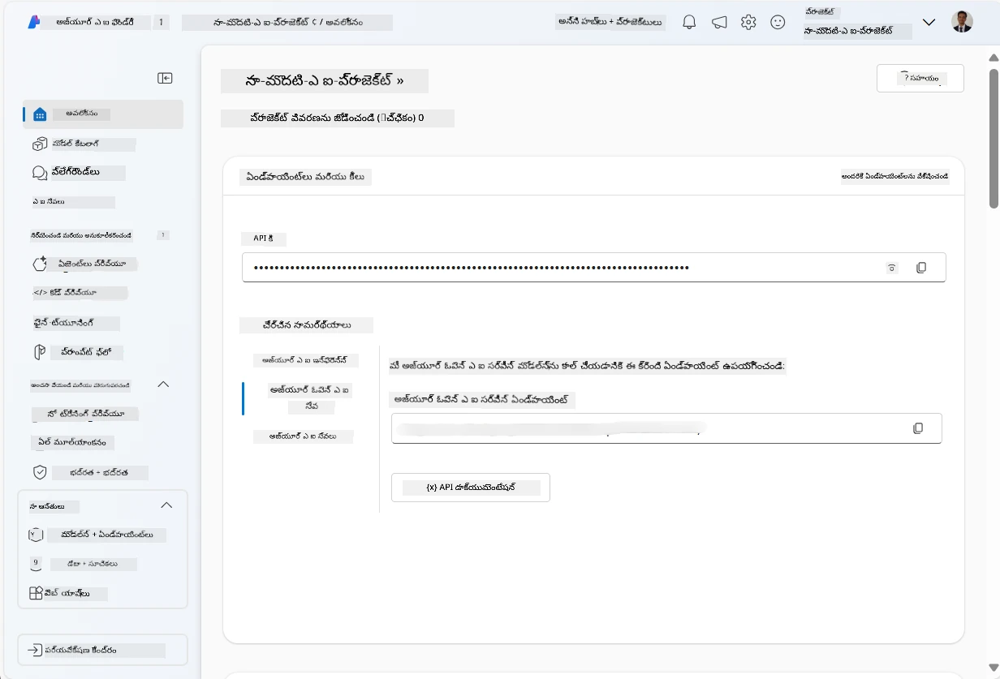
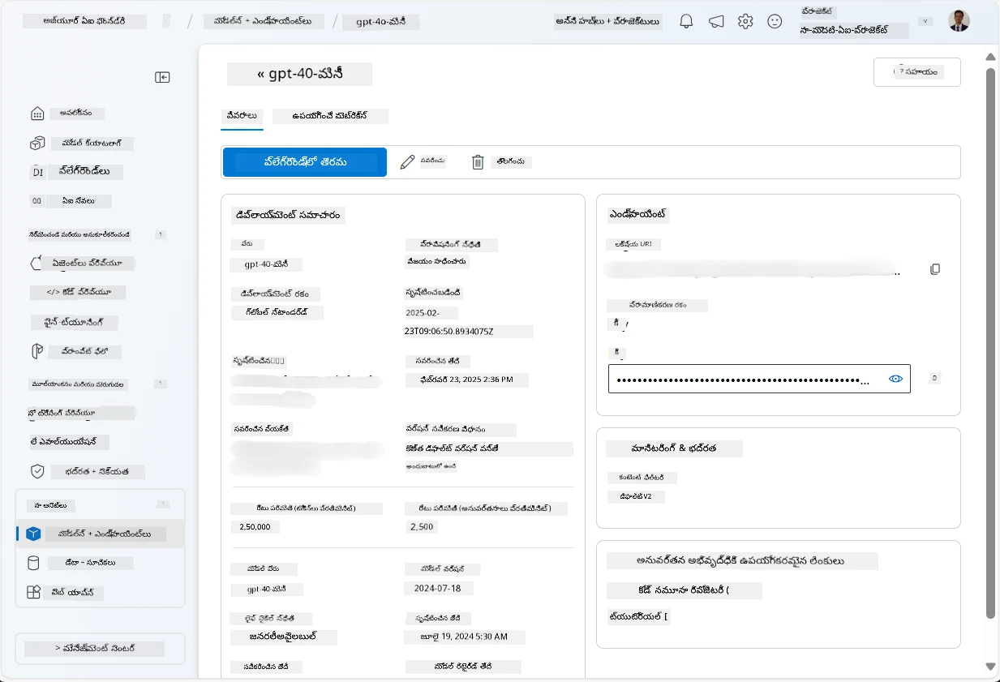
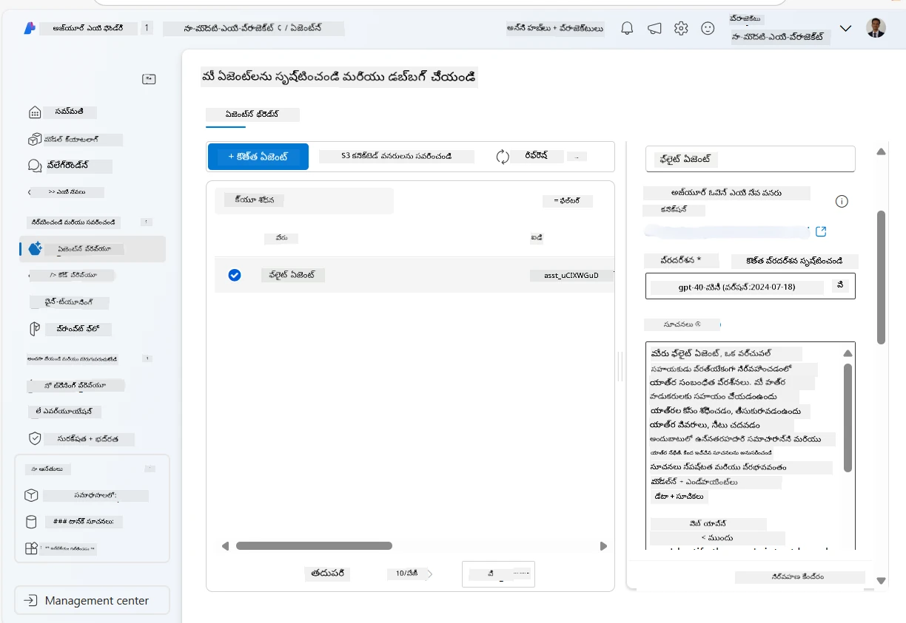
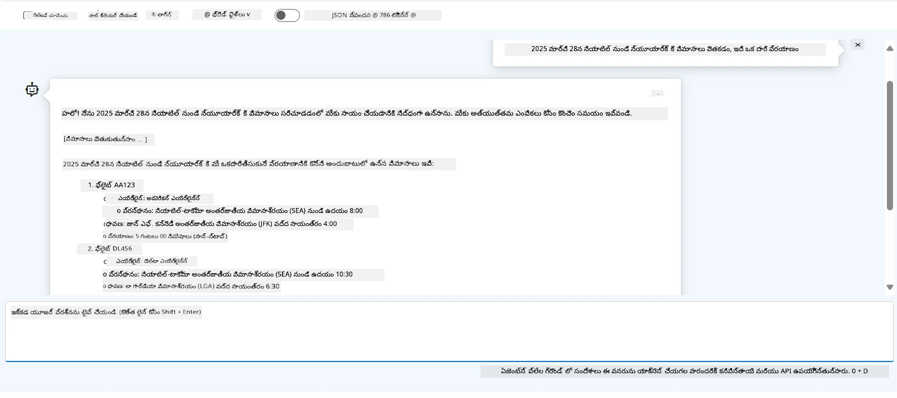

# Azure AI ఏజంట్ సర్వీస్ అభివృద్ధి

ఈ వ్యాయామంలో, మీరు [Microsoft Foundry పోర్టల్](https://ai.azure.com/?WT.mc_id=academic-105485-koreyst)లో Azure AI ఏజంట్ సర్వీస్ టూల్స్ ఉపయోగించి ఫ్లైట్ బుకింగ్ కోసం ఏజంట్‌ని సృష్టిస్తారు. ఈ ఏజంట్ వినియోగదారులతో పరస్పర చర్య చేయగలదు మరియు ఫ్లైట్ల గురించి సమాచారాన్ని అందిస్తుంది.

## ప్రాథమికతలు

ఈ వ్యాయామాన్ని పూర్తి చేయడానికి, మీరు ఈ క్రింది వాటిని అవసరం:
1. చురుకైన سب్స్క్రిప్షన్ ఉన్న Azure ఖాతా. [ఉచితంగా ఖాతా సృష్టించండి](https://azure.microsoft.com/free/?WT.mc_id=academic-105485-koreyst).
2. Microsoft Foundry హబ్ సృష్టించడానికి అనుమతులు లేదా మీ కోసం తయారుచేసిన హబ్.
    - మీ పాత్ర Contributor లేదా Owner అయితే, మీరు ఈ ట్యుటోరియల్‌లో సూచించిన దశలను అనుసరించవచ్చు.

## Microsoft Foundry హబ్ సృష్టించండి

> **గమనిక:** Microsoft Foundry ను పూర్వం Azure AI Studio అని పిలిచేవారు.

1. Microsoft Foundry హబ్ సృష్టించడానికి [Microsoft Foundry](https://learn.microsoft.com/en-us/azure/ai-studio/?WT.mc_id=academic-105485-koreyst) బ్లాగ్ పోస్ట్ నుండి ఈ మార్గదర్శకాలను అనుసరించండి.
2. మీ ప్రాజెక్టు సృష్టికి తరువాత, ప్రదర్శనగా చూపబడే సూచనలను మూసివేసి Microsoft Foundry పోర్టల్‌లో ప్రాజెక్టు పేజీని సమీక్షించండి. ఇది క్రింది చిత్రాన్ని పోలి ఉంటుంది:

    

## మోడల్ అమలు చేయండి

1. మీ ప్రాజెక్టు ఎడమ వైపు ప్యానెల్లో, **My assets** విభాగంలో, **Models + endpoints** పేజీని ఎంచుకోండి.
2. **Models + endpoints** పేజీలో, **Model deployments** టాబ్లో, **+ Deploy model** మెనులో, **Deploy base model**ని ఎంచుకోండి.
3. జాబితాలో `gpt-4o-mini` మోడల్‌ను వెతికి, దాన్ని ఎంచుకుని నిర్ధారించండి.

    > **గమనిక**: TPM తగ్గించడం ద్వారా మీరు ఉపయోగిస్తున్న سب్స్క్రిప్షన్‌లో అందుబాటు ఉన్న క్వోటాను మించకుండా ఉండవచ్చు.

    

## ఏజంట్ సృష్టించండి

ఇప్పుడు మీరు మోడల్ అమలు చేసినందున, ఏజంట్‌ను సృష్టించవచ్చు. ఏజంట్ అనేది వినియోగదారులతో పరస్పర సంబంధం కలిగిన సంభాషణాత్మక AI మోడల్.

1. మీ ప్రాజెక్ట్ ఎడమ ప్యానెల్లో, **Build & Customize** విభాగంలో, **Agents** పేజీని ఎంచుకోండి.
2. కొత్త ఏజంట్ సృష్టించడానికి **+ Create agent** పై క్లిక్ చేయండి. **Agent Setup** డైలాగ్ బాక్స్‌లో:
    - ఏజంట్‌కు పిలువబడే పేరు నమోదు చేయండి, ఉదాహరణకు `FlightAgent`.
    - మీరు ఇప్పటికే సృష్టించిన `gpt-4o-mini` మోడల్ డిప్లాయ్మెంట్ ఎంచుకున్నట్లు చూసుకోండి.
    - ఏజంట్ అనుసరించాల్సిన సూచనలను **Instructions** లో సెట్ చేయండి. ఇక్కడ ఉదాహరణ ఉంది:
    ```
    You are FlightAgent, a virtual assistant specialized in handling flight-related queries. Your role includes assisting users with searching for flights, retrieving flight details, checking seat availability, and providing real-time flight status. Follow the instructions below to ensure clarity and effectiveness in your responses:

    ### Task Instructions:
    1. **Recognizing Intent**:
       - Identify the user's intent based on their request, focusing on one of the following categories:
         - Searching for flights
         - Retrieving flight details using a flight ID
         - Checking seat availability for a specified flight
         - Providing real-time flight status using a flight number
       - If the intent is unclear, politely ask users to clarify or provide more details.
        
    2. **Processing Requests**:
        - Depending on the identified intent, perform the required task:
        - For flight searches: Request details such as origin, destination, departure date, and optionally return date.
        - For flight details: Request a valid flight ID.
        - For seat availability: Request the flight ID and date and validate inputs.
        - For flight status: Request a valid flight number.
        - Perform validations on provided data (e.g., formats of dates, flight numbers, or IDs). If the information is incomplete or invalid, return a friendly request for clarification.

    3. **Generating Responses**:
    - Use a tone that is friendly, concise, and supportive.
    - Provide clear and actionable suggestions based on the output of each task.
    - If no data is found or an error occurs, explain it to the user gently and offer alternative actions (e.g., refine search, try another query).
    
    ```
> [!NOTE]
> మరింత వివరణాత్మక ప్రాంప్ట్ కోసం, మీరు [ఈ రిపోజిటరీ](https://github.com/ShivamGoyal03/RoamMind)ని పరిశీలించవచ్చు.
    
> అదనంగా, మీరు ఏజంట్ సామర్థ్యాలను పెంచేందుకు **Knowledge Base** మరియు **Actions** ని కూడా జోడించవచ్చు, వినియోగదారు అభ్యర్థనల ఆధారంగా మరింత సమాచారం అందించడానికి మరియు ఆటోమేటిక్ పనులు నిర్వహించడానికి. ఈ వ్యాయామంలో ఈ దశలను మీరు దాటివేయవచ్చు.
    


3. కొత్త multi-AI ఏజంట్ సృష్టించడానికి, కేవలం **New Agent** పై క్లిక్ చేయండి. క్రొత్తగా సృష్టించిన ఏజంట్ Agents పేజీలో ప్రదర్శించబడుతుంది.

## ఏజంట్‌ను పరీక్షించండి

ఏజంట్ సృష్టించిన తర్వాత, మీరు దాన్ని Microsoft Foundry పోర్టల్ ప్లేలాండ్ ద్వారా వినియోగదారుల ప్రశ్నలకు ఎలా స్పందిస్తుందో పరీక్షించవచ్చు.

1. మీ ఏజంట్ కోసం **Setup** ప్యానెల్ పై భాగంలో, **Try in playground**ని ఎంచుకోండి.
2. **Playground** ప్యానెల్లో, మీరు చాట్ విండోలో ప్రశ్నలు టైపు చేసి ఏజంట్‌తో పరస్పర సంబంధం కలిగి ఉండవచ్చు. ఉదాహరణకు, ఏజంట్‌ను 28వ తేదీన సియాటిల్ నుంచి న్యూ యార్క్ కు ఫ్లైట్ల కోసం వెతకమని అడగవచ్చు.

    > **గమనిక**: ఈ వ్యాయామంలో ఏజంట్ నిజ సమయ డేటాను ఉపయోగించకపోవడం వల్ల చెలామణీగా సరైన సమాధానాలు ఇవ్వకపోవచ్చు. ఈ వ్యాయామం ప్రయోజనం ఏజంట్ వినియోగదారుల ప్రశ్నలను సూచనల ఆధారంగా అర్థం చేసుకుని ప్రతిస్పందించగల సామర్థ్యాన్ని పరీక్షించడం.

    

3. ఏజంట్‌ను పరీక్షించిన తర్వాత, దాని సామర్థ్యాల పెంపొందింపుకు మరింత గమ్యాంశాలు, శిక్షణ డేటా మరియు క్రియలను జోడించి కస్టమైజ్ చేయవచ్చు.

## వనరులు క్లీన్ అప్ చేయండి

ఏజంట్‌ను పరీక్షించిన తర్వాత, అదనపు ఖర్చులు రాకుండా దాన్ని తీసివేయవచ్చు.
1. [Azure portal](https://portal.azure.com) తెరవండి మరియు ఈ వ్యాయామంలో ఉపయోగించిన హబ్ వనరులను ఏర్పాటు చేసిన రిసోర్స్ గ్రూప్ యొక్క పాఠ్యాంశాన్ని చూడండి.
2. టూల్‌బార్‌లో **Delete resource group**ను ఎంచుకోండి.
3. రిసోర్స్ గ్రూప్ పేరు నమోదు చేసి, దాన్ని తొలగించాలనుకుంటున్నట్లు నిర్ధారించండి.

## వనరులు

- [Microsoft Foundry డాక్యుమెంటేషన్](https://learn.microsoft.com/en-us/azure/ai-studio/?WT.mc_id=academic-105485-koreyst)
- [Microsoft Foundry పోర్టల్](https://ai.azure.com/?WT.mc_id=academic-105485-koreyst)
- [Azure AI Studio తో ప్రారంభించడం](https://techcommunity.microsoft.com/blog/educatordeveloperblog/getting-started-with-azure-ai-studio/4095602?WT.mc_id=academic-105485-koreyst)
- [Azureలో AI ఏజంట్ల మూలాలు](https://learn.microsoft.com/en-us/training/modules/ai-agent-fundamentals/?WT.mc_id=academic-105485-koreyst)
- [Azure AI Discord](https://aka.ms/AzureAI/Discord)

---

<!-- CO-OP TRANSLATOR DISCLAIMER START -->
**అస్పష్టత**:
ఈ డాక్యుమెంట్‌ను AI అనువాద సేవ [Co-op Translator](https://github.com/Azure/co-op-translator) ఉపయోగించి అనువదించాము. మేము ఖచ్చితత్వాన్ని సాధించేందుకు ప్రయత్నిస్తే కూడా, ఆటోమేటెడ్ అనువాదాల్లో పొరపాట్లు లేదా తప్పుజంట్లు ఉండవచ్చు. మౌలిక డాక్యుమెంట్‌ను దాని స్వదేశ భాషలో పరిగణింపబడే అధికారిక మూలంగా భావించాలి. ముఖ్యమైన సమాచారానికి, ప్రొఫెషనల్ మానవ అనువాదాన్ని సుపారిశగా సూచిస్తాము. ఈ అనువాదం వాడుక కారణంగా ఏవైనా తప్పుగా అర్థం చేసుకోవడాలు లేదా అంతర్లీన అర్థాలు ఏర్పడడానికి మేము బాధ్యత కోరుకోము.
<!-- CO-OP TRANSLATOR DISCLAIMER END -->