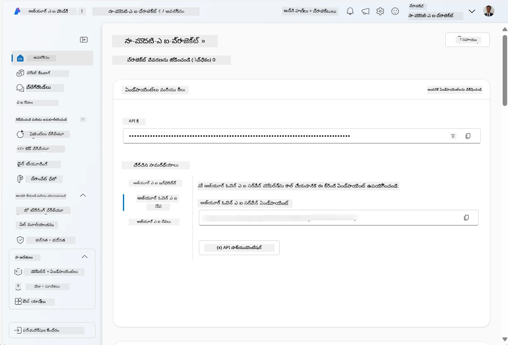
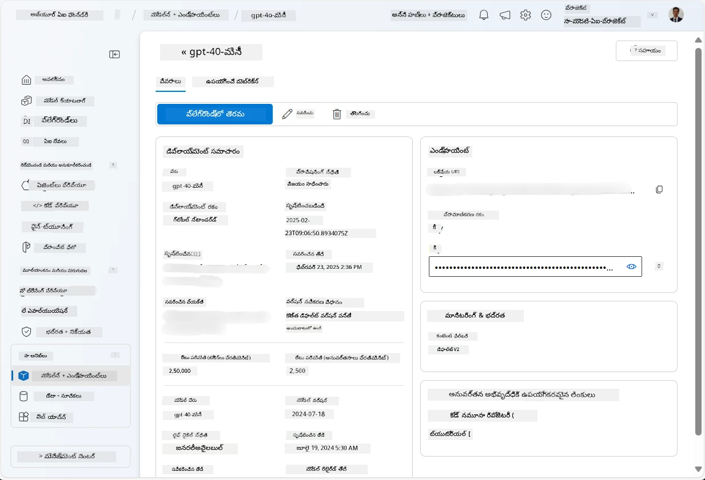
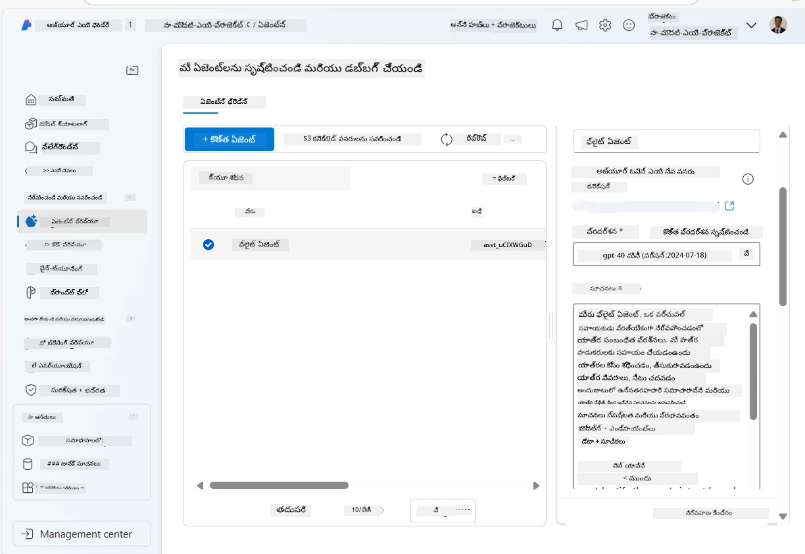
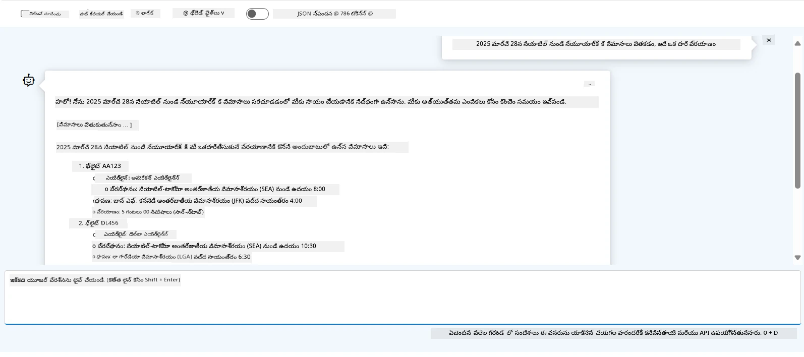

# మైక్రోసాఫ్ట్ ఫౌండ్రీ ఏజెంట్ సేవా అభివృద్ధి

ఈ వ్యాయామంలో, మీరు [Microsoft Foundry portal](https://ai.azure.com/?WT.mc_id=academic-105485-koreyst) లో Microsoft Foundry ఏజెంట్ సేవా సాధనాలను ఉపయోగించి Flight Booking కోసం ఏజెంట్‌ని సృష్టించడానికి ఉపయోగిస్తారు. ఆ ఏజెంట్ వినియోగదారులతో పరస్పర చర్య చేయగలదు మరియు విమానాలకు సంబంధించిన సమాచారాన్ని అందిస్తుంది.

## అవసరమైనరుఫలాలు

ఈ వ్యాయామాన్ని పూర్తి చేయడానికి, మీకు క్రింది వాటి అవసరం:
1. చురుకైన సబ్ స్క్రిప్షన్ ఉన్న ఒక Azure ఖాతా. [ఉచితంగా ఖాతాను సృష్టించండి](https://azure.microsoft.com/free/?WT.mc_id=academic-105485-koreyst).
2. మీరు Microsoft Foundry హబ్‌ని సృష్టించే అనుమతులు కలిగి ఉండాలి లేదా మీకు అది సృష్టించబడి ఉండాలి.
    - మీ పాత్ర Contributor లేదా Owner అయితే, మీరు ఈ ట్యూటోరియల్‌లో ఉన్న దశలను అనుసరించవచ్చు.

## Microsoft Foundry హబ్‌ని సృష్టించండి

> **గమనిక:** Microsoft Foundryని ముందు Azure AI Studio గా పిలిచేవారు.

1. Microsoft Foundry హబ్‌ని సృష్టించడానికి [Microsoft Foundry](https://learn.microsoft.com/en-us/azure/ai-studio/?WT.mc_id=academic-105485-koreyst) బ్లాగ్ పోస్ట్ నుండి ఈ మార్గదర్శకాలను అనుసరించండి.
2. మీ ప్రాజెక్టు సృష్టించిన తర్వాత, ప్రదర్శించబడ్డ సూచనలు ఎటువంటి ఉంటే అవి మూసివేయండి మరియు Microsoft Foundry పోర్టలులో ప్రాజెక్టు పేజీని సమీక్షించండి, ఇది క్రింది చిత్రం లాంటి ఉండాలి:

    

## ఒక మోడల్‌ను ఏర్పాటు చేయండి

1. మీ ప్రాజెక్ట్ కోసం ఎడమవైపు ప్యానెల్‌లో, **My assets** విభాగంలో, **Models + endpoints** పేజీని ఎంచుకోండి.
2. **Models + endpoints** పేజీలో, **Model deployments** ట్యాబ్‌లో, **+ Deploy model** మెనുവులో, **Deploy base model**ను ఎంచుకోండి.
3. జాబితాలో `gpt-4o-mini` మోడల్‌ను వెతకండి, మరియు దాన్ని ఎంచుకుని ధృవీకరించండి.

    > **గమనిక**: TPM తగ్గించడం సబ్ స్క్రిప్షన్‌లో లభ్యమయ్యే క్వోటాను అధికంగా వినియోగించడం నుంచి తప్పిస్తుంది.

    

## ఏజెంట్ సృష్టించండి

మీరు ఇప్పుడు మోడల్‌ని ఏర్పాటు చేసుకున్న తర్వాత, ఏజెంట్‌ని సృష్టించవచ్చు. ఏజెంట్ అనేది వినియోగదారులతో పరస్పర చర్య చేయగల సంభాషణ AI మోడల్.

1. మీ ప్రాజెక్ట్ కోసం ఎడమవైపు ప్యానెల్‌లో, **Build & Customize** విభాగంలో, **Agents** పేజీని ఎంచుకోండి.
2. కొత్త ఏజెంట్ సృష్టించడానికి **+ Create agent** క్లిక్ చేయండి. **Agent Setup** సంభాషణ బాక్సులో:
    - ఏజెంట్ కోసం పేరు నమోదు చేయండి, ఉదాహరణకు `FlightAgent`.
    - మీరు ముందుగా సృష్టించిన `gpt-4o-mini` మోడల్ ఏర్పాటు ఎంచుకోబడిందని నిర్ధారించుకోండి.
    - ఏజెంట్ అనుసరించాల్సిన ప్రాంప్ట్ ప్రకారం **Instructions** సెట్ చేయండి. ఉదాహరణ ఇక్కడ ఇచ్చాం:
    ```
    You are FlightAgent, a virtual assistant specialized in handling flight-related queries. Your role includes assisting users with searching for flights, retrieving flight details, checking seat availability, and providing real-time flight status. Follow the instructions below to ensure clarity and effectiveness in your responses:

    ### Task Instructions:
    1. **Recognizing Intent**:
       - Identify the user's intent based on their request, focusing on one of the following categories:
         - Searching for flights
         - Retrieving flight details using a flight ID
         - Checking seat availability for a specified flight
         - Providing real-time flight status using a flight number
       - If the intent is unclear, politely ask users to clarify or provide more details.
        
    2. **Processing Requests**:
        - Depending on the identified intent, perform the required task:
        - For flight searches: Request details such as origin, destination, departure date, and optionally return date.
        - For flight details: Request a valid flight ID.
        - For seat availability: Request the flight ID and date and validate inputs.
        - For flight status: Request a valid flight number.
        - Perform validations on provided data (e.g., formats of dates, flight numbers, or IDs). If the information is incomplete or invalid, return a friendly request for clarification.

    3. **Generating Responses**:
    - Use a tone that is friendly, concise, and supportive.
    - Provide clear and actionable suggestions based on the output of each task.
    - If no data is found or an error occurs, explain it to the user gently and offer alternative actions (e.g., refine search, try another query).
    
    ```
> [!NOTE]
> వివరమైన ప్రాంప్ట్ కోసం, మీరు [ఈ రిపాజిటరీ](https://github.com/ShivamGoyal03/RoamMind) ని చూడవచ్చు.
    
> అదనంగా, మీరు ఏజెంట్‌కు మరిన్ని సమాచారం మరియు వినియోగదారుల అభ్యర్థనలకు ఆధారంగా ఆటోమేటెడ్ పనులను చేసేందుకు **Knowledge Base** మరియు **Actions** ను జోడించవచ్చు. ఈ వ్యాయామంలో, మీరు ఈ దశలను వదులుకోవచ్చు.
    


3. కొత్త మల్టీ-AI ఏజెంట్ సృష్టించడానికి, కేవలం **New Agent** క్లిక్ చేయండి. కొత్తగా సృష్టించిన ఏజెంట్ Agents పేజీలో ప్రదర్శించబడుతుంది.


## ఏజెంట్‌ను పరీక్షించండి

ఏజెంట్‌ను సృష్టించిన తర్వాత, Microsoft Foundry పోర్టల్ ప్లేగ్రౌండ్లో వినియోగదారుల ప్రశ్నలకు ఏజెంట్ ఎలా స్పందిస్తుందో చూడటానికి పరీక్షించవచ్చు.

1. మీ ఏజెంట్ కోసం **Setup** ప్యానెల్ టాప్‌లో **Try in playground** ఎంచుకోండి.
2. **Playground** ప్యానెల్లో, చాట్ విండోలో ప్రశ్నలు టైప్ చేసి ఏజెంట్‌తో పరస్పర చర్య చేయవచ్చు. ఉదాహరణకి, ఏజెంట్‌ని సియాటిల్ నుండి న్యూయార్క్ కి 28వ తేదీకి విమానాలు వెతకమని అడగవచ్చు.

    > **గమనిక**: ఈ వ్యాయామంలో ఏజెంట్ యథార్థ సమాధానాలు అందించకపోవచ్చు, ఎందుకంటేLIBINT తోడ్పాటుగా వాస్తవకాల డేటా ఉపయోగించబడదు. ఈ వ్యాయామం ఉద్దేశం ఏజెంట్ ఇచ్చిన సూచనల ఆధారంగా వినియోగదారు ప్రశ్నలకు ఎలా అర్థం చేసుకొని ప్రతిస్పందించగలదో పరీక్షించడం.

    

3. ఏజెంట్‌ను పరీక్షించిన తర్వాత, దీని సామర్థ్యాలను మెరుగుపరచడానికి మరిన్ని ఇరుకలు, శిక్షణ డేటా మరియు చర్యలు జోడించడం ద్వారా మరింత అనుకూలీకరించవచ్చు.

## వనరులను శుభ్రం చేయండి

ఏజెంట్ పరీక్షించడం పూర్తి చేసినప్పుడు, అదనపు ఖర్చులు వచ్చే అవకాశం లేకుండా దాన్ని 삭제 చేయవచ్చు.
1. [Azure portal](https://portal.azure.com) తెరవండి మరియు మీరు ఈ వ్యాయామంలో ఉపయోగించిన హబ్ వనరులను అమర్చిన రిసోర్స్ గ్రూప్ యొక్క உள்ளటువంటి విషయాలను చూడండి.
2. టూల్‌బార్‌లో **Delete resource group** ఎంచుకోండి.
3. రిసోర్స్ గ్రూప్ పేరును నమోదు చేసి, దానిని తొలగించాలని నిర్ధారించండి.

## వనరులు

- [Microsoft Foundry డాక్యుమెంటేషన్](https://learn.microsoft.com/en-us/azure/ai-studio/?WT.mc_id=academic-105485-koreyst)
- [Microsoft Foundry పోర్టల్](https://ai.azure.com/?WT.mc_id=academic-105485-koreyst)
- [Microsoft Foundryతో ప్రారంభించడం](https://techcommunity.microsoft.com/blog/educatordeveloperblog/getting-started-with-azure-ai-studio/4095602?WT.mc_id=academic-105485-koreyst)
- [Azureపై AI ఏజెంట్‌ల మూలాలు](https://learn.microsoft.com/en-us/training/modules/ai-agent-fundamentals/?WT.mc_id=academic-105485-koreyst)
- [Azure AI Discord](https://aka.ms/AzureAI/Discord)

---

<!-- CO-OP TRANSLATOR DISCLAIMER START -->
**అస్వీకరణ**:
ఈ పత్రం AI అనువాద సేవ [Co-op Translator](https://github.com/Azure/co-op-translator) ఉపయోగించి అనువదించబడింది. మేము ఖచ్చితత్వానికి ప్రయత్నిస్తున్నప్పటికీ, ఆటోమేటెడ్ అనువాదాలు తప్పులు లేదా అసమగ్రతలను కలిగి ఉండవచ్చు. దాని స్వదేశ భాషలో ఉన్న అసలు పత్రాన్ని అధికారం కలిగిన మూలంగా పరిగణించాలి. కీలకమైన సమాచారం కోసం, ప్రొఫెషనల్ మానవ అనువాదాన్ని సిఫారసు చేస్తాము. ఈ అనువాదం ఉపయోగం వల్ల కలిగే ఏవైనా అపార్థాలు లేదా తప్పుదారులు కోసం మేము బాధ్యత వహించము.
<!-- CO-OP TRANSLATOR DISCLAIMER END -->