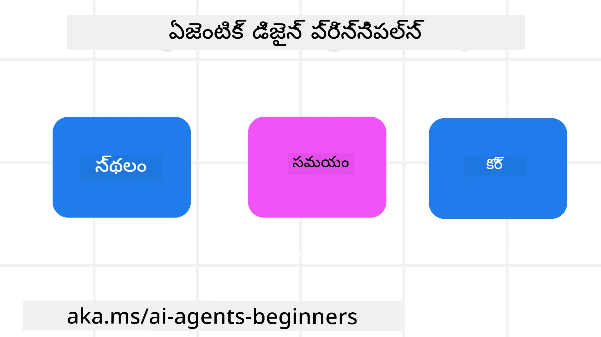

> _(పైన ఉన్న చిత్రాన్ని క్లిక్ చేసి ఈ పాఠం యొక్క వీడియోను చూడండి)_
# AI ఏజెంటిక్ డిజైన్ సూత్రాలు

## పరిచయం

AI ఏజెంటిక్ సిస్టమ్స్ నిర్మించడం గురించి ఆలోచించడానికి అనేక మార్గాలు ఉన్నాయి. జనరేటివ్ AI డిజైన్లో మబ్బుదారితనం (ambiguity) ఒక బగ్ కాకుండా ఒక ఫీచర్‌గా ఉండటం వల్ల ఇంజనీర్లకు ఎక్కడి నుంచే మొదలుపెట్టాలో నిర్ణయించడం కొంతకాలం కష్టం అవుతుంది. మేము డెవలపర్లకు వారి వ్యాపార అవసరాలను పరిష్కరించడానికి కస్టమర్-కేంద్రీయ ఏజెంటిక్ సిస్టమ్స్ నిర్మించేందుకు సహాయపడడానికి మానవకేంద్రీయ UX డిజైన్ సూత్రాల సెట్ రూపొందించారు. ఈ డిజైన్ సూత్రాలు ఒక నియంత్రక ఆర్కిటెక్చర్ కాకుండ, తప్పకుండా ఏజెంట్ అనుభవాలను నిర్వచించడానికి మరియు నిర్మించడానికి యజమానులైన టీమ్‌లకు ప్రారంభ బిందూ మాత్రమే.

సాధారణంగా, ఏజెంట్లు:

- మానవ సామర్థ్యాలను విస్తరించాలి మరియు స్కేలు చేయాలి (brainstorming, సమస్యా పరిష్కారం, ఆటోమేషన్ మొదలైనవి)
- జ్ఞాన లోపాలను పూర్తి చేయాలి (నాకు జ్ఞాన విభాగాలపై తెలుసుకోవడం, అనువాదం మొదలైనవి)
- వ్యక్తులుగా మేము ఇతరులతో పని చేయడానికి ఇష్టపడే విధానాల్లో సహకారం మరియు మద్దతు సులభతరం చేయాలి
- మమ్మల్ని మెరుగైన వ్యక్తులుగా మారుస్తాయి (ఉదాహరణకు, లైఫ్ కోచ్/టాస్క్ మాస్టర్, భావోద్వేగ నియంత్రణ మరియు మైండ్ఫుల్‌నెస్ నైపుణ్యాలను నేర్పించడం, స్థైర్యాన్ని నిర్మించడం మొదలైనవి)

## ఈ పాఠం ఏమి కవర్ చేస్తుంది

- ఏజెంటిక్ డిజైన్ సూత్రాలు ఏమిటి
- ఈ డిజైన్ సూత్రాలు అమలు చేసే సమయంలో అనుసరించవలసిన కొన్ని మార్గదర్శకాలు ఏమిటి
- డిజైన్ సూత్రాలు ఉపయోగించే కొన్ని ఉదాహరణలు ఏమిటి

## నేర్చుకోవాల్సిన లక్ష్యాలు

ఈ పాఠం పూర్తిచేసిన తర్వాత, మీరు చేయగలుగుతారు:

1. ఏజెంటిక్ డిజైన్ సూత్రాలు ఏమిటో వివరించగలగడం
2. ఏజెంటిక్ డిజైన్ సూత్రాలు ఉపయోగించడానికి మార్గదర్శకాలను వివరించగలగడం
3. ఏజెంటిక్ డిజైన్ సూత్రాలు ఉపయోగించి ఏజెంట్‌ను ఎలా నిర్మించాలో అర్థం చేసుకోవడం

## ఏజెంటిక్ డిజైన్ సూత్రాలు

### Agent (Space)

ఇది ఏజెంట్ పని చేసే పర్యావరణం. భౌతిక మరియు డిజిటల్ ప్రపంచాల్లో పాల్గొనడానికి ఏజెంట్‌లను ఎలా డిజైన్ చేయాలో ఈ సూత్రాలు సూచిస్తాయి.

- **సంబంధింపజేసటం, కుదించడం కాదు** – సహకారం మరియు కనెక్షన్ సులభతరం చేయటానికి మనుషులను ఇతర వ్యక్తులకు, ఈవెంట్‌లకు మరియు కార్యాచరణీయ జ్ఞానానికి కనెక్ట్ చేయడంలో సహాయపడటం.
- ఏజెంట్లు ఈవెంట్‌లు, జ్ఞానం మరియు వ్యక్తులను కనెక్ట్ చేయడంలో సహాయపడతాయి.
- ఏజెంట్లు వ్యక్తులను మరింత దగ్గరగా తీసుకొస్తాయి. అవి వ్యక్తుల్ని బదిలీ చేయడానికి లేదా అవమానించడానికి రూపొందించబడవు.
- **సులభంగా చేరుకునే కానీ సందర్భానుసారంగా కనిపించకపోవచ్చు** – ఏజెంట్ ఎక్కువగా బ్యాక్‌గ్రౌন্ড్‌లో పనిచేస్తుంది మరియు అది సంబంధితమైనప్పుడు మరియు అనుకూలమైనప్పుడు మాత్రమే మెలికలా సూచిస్తుంది.
  - ఏజెంట్ అధికృతులైన వినియోగదారులకు ఏ డివైస్ లేదా వేదికపై సులభంగా కనుగొనదగ్గది మరియు చేరుకోగలదిగా ఉండాలి.
  - ఏజెంట్ బహుమోడియల్ ఇన్‌పుట్‌లు మరియు అవుట్‌పుట్‌లను మద్దతు చేస్తుంది (శబ్దం, కౌంట్, వచనం మొదలైనవి).
  - ఏజెంట్ ముందు/పొరుగు (foreground/background) మధ్య; సాక్రియ (proactive) మరియు ప్రతిస్పందన (reactive) మధ్య నిరవధిగా మారవచ్చు, వినియోగదారు అవసరాలను అనుసరిస్తూ.
  - ఏజెంట్ కనిపించని రూపంలో పనిచేయవచ్చు, కానీ దాని బ్యాక్‌గ్రౌండ్ ప్రాసెస్ మార్గం మరియు ఇతర ఏజెంట్లతో సహకారం వినియోగదారుకు పారదర్శకంగా మరియు నియంత్రించదగినదిగా ఉండాలి.

### Agent (Time)

ఇది ఏజెంట్ కాలంతో ఎలా పనిచేస్తుంది అనే దానిని సూచిస్తుంది. గతం, వర్తమానం మరియు భవిష్యత్తునോട് మెలగుతున్న ఏజెంట్లతో మనం ఎలా డిజైన్ చేయాలో ఈ సూత్రాలు సూచిస్తాయి.

- **గతం**: స్థితి మరియు సందర్భాన్ని కలిగి ఉన్న చరిత్రపై ప్రతిబింబించడం.
  - ఏజెంట్ ఈవెంట్, వ్యక్తులు లేదా స్థితులపై మాత్రమే కాకుండా పుష్కలమైన పాతమైన డేటా విశ్లేషణ ఆధారంగా మరింత సంబంధిత ఫలితాలు అందిస్తుంది.
  - ఏజెంట్ గత ఈవెంట్‌ల నుండి సంబంధాలను సృష్టించి స్మృతి(మెమరీ)పై క్రియాశీలంగా ప్రతిబింబించి ప్రస్తుత పరిస్థితులతో జోరు పెట్టుకోవచ్చు.
- **ప్రస్తుతం (Now)**: నోటిఫైచేయడాన్ని మించి నడిపించడం (nudging).
  - ఏజెంట్ వ్యక్తులతో పరిపూర్ణ దృక్పథంతో వినిబంధన చేస్తుంది. ఒక ఈవెంట్ సంభవించినప్పుడు, ఏజెంట్ స్టాటిక్ నోటిఫికేషన్ లేదా ఇతర స్థిర రూపాలను మించి పోతుంది. ఏజెంట్ ప్రవాహాలను సరళీకృతం చేయగలదు లేదా వినియోగదారుని శ్రద్ధను సరైన సమయంపై నేరుచేసే తాత్కాలిక సంకేతాలను డైనమిక్‌గా ఉత్పత్తి చేయగలదు.
  - ఏజెంట్ పరిసరంగా ఉన్న సందర్భం, సామాజిక మరియు సాంస్కృతిక మార్పులు మరియు వినియోగదారు ఉద్దేశం ప్రకారం సమాచారాన్ని అందిస్తుంది.
  - ఏజెంట్ ఇంటరాక్షన్ స్థాయిగా స్థిరంగా ఉండకపోవచ్చు; తార్కికంగా అభివృద్ధి చెందుతూ/సంక్లిష్టతలో పెరుగుతూ దీర్ఘకాలంలో వినియోగదార్లను సాధ్యపడిద్దే విధంగా ఉంటుంది.
- **భవిష్యత్తు**: అనుకూలమవడం మరియు పరిణామం.
  - ఏజెంట్ వివిధ డివైస్‌లు, ప్లాట్‌ఫామ్‌లు మరియు మోడ్‌లిటీలకు అనుకూలమవుతుంది.
  - ఏజెంట్ వినియోగదారు ప్రవర్తన, యాక్సెసిబిలిటీ అవసరాలకు అనుకూలమవుతుంది మరియు స్వేచ్ఛగా కస్టమైజ్ చేయదగినది.
  - ఏజెంట్ నిరంతర వినియోగదారు పరస్పర చర్యల ద్వారా ఆకారాన్ని పొందగా, అభివృద్ధి చెందుతుంది.

### Agent (Core)

ఇవి ఏజెంట్ డిజైన్ కోర్‌లోని కీలక అంశాలు.

- **అనిశ్చితిని ఒప్పుకోవడం కానీ నమ్మకాన్ని స్థాపించడం**.
  - ఒక స్థాయి ఏజెంట్ అనిశ్చితి ఆశించదగ్గది. అనిశ్చితి ఏజెంట్ డిజైన్‌లో ఒక కీలక అంశం.
  - నమ్మకం మరియు పారదర్శకత ఏజెంట్ డిజైన్ యొక్క పునాది పొరలు.
  - ఏజెంట్ ఆన్/ఆఫ్ ఎప్పుడు ఉంటుందో కట్టుబడి ఉండటంలో మనుష్యులు నియంత్రణలో ఉండాలి మరియు ఏజెంట్ స్థితి ఎల్లప్పుడూ స్పష్టంగా కనిపించాలి.

## ఈ సూత్రాలను అమలు చేయడానికి మార్గదర్శకాలు

మీరు పై డిజైన్ సూత్రాలను ఉపయోగిస్తున్నపుడు, దిగువ సూచనాలను ఉపయోగించండి:

1. **పారదర్శకత**: వినియోగదారుకి AI సహకారం ఉందని, అది ఎలా పనిచేస్తుందో (గత చర్యలు సహా), ఫీడ్బ్యాక్ ఎలా ఇవ్వాలో మరియు సిస్టమ్‌ను ఎలా మార్చుకోవాలో తెలియజేయండి.
2. **నియంత్రణ**: వినియోగదారుకు కస్టమైజ్ చేయడానికి, ప్రాధాన్యతలను నిర్దేశించడానికి మరియు వ్యక్తిగతgifై చేయడానికి, అలాగే సిస్టమ్ మరియు దాని లక్షణములపై నియంత్రణ కలిగి ఉండేలా చేయండి (మరచిపోవటానికి సామర్థ్యం సహా).
3. **సమతుల్యత**: డివైస్‌లు మరియు ఎండ్పాయింట్లలో సక్రమమైన, బహుమోడియల్ అనుభవాలకు లక్ష్యమవ్వండి. సాధ్యమైన చోట్ల పరిచిత UI/UX అంశాలను ఉపయోగించండి (ఉదాహరణకు, వాయిస్ ఇంటరాక్షన్‌కి మైక్రోఫోన్ గుర్తు) మరియు వినియోగదారుని జ్ఞానభారం తగ్గించాలని ప్రయత్నించండి (ఉదాహరణకు, సంక్షిప్త ప్రత్యుత్తరాలు, విజువల్ సహాయాలు, మరియు 'ఇంకా తెలుసుకోండి' కంటెంట్).

## ఈ సూత్రాలు మరియు మార్గదర్శకాలతో ట్రావెల్ ఏజెంట్ ఎలా డిజైన్ చేయాలి

మీరు ఒక ట్రావెల్ ఏజెంట్ డిజైన్ చేస్తోన్నారు అనుకుంటే, ఇక్కడ మీరు డిజైన్ సూత్రాలు మరియు మార్గదర్శకాలను ఎలా ఉపయోగించవచ్చు అన్నది ఉంది:

1. **పారదర్శకత** – వినియోగదారుకు ట్రావెల్ ఏజెంట్ AI పరిజ్ఞానంతో నడిచే ఏజెంట్ అని తెలియజేయండి. ప్రారంభించడానికి కొన్ని ప్రాథమిక సూచనలు ఇవ్వండి (ఉదాహరణకు, ఒక "హలో" సందేశం, నమూనా ప్రాంప్‌లు). దీన్ని ఉత్పత్తి పేజీలో స్పష్టంగా డాక్యుమెంటు చేయండి. వినియోగదారు గతంలో అడిగిన ప్రాంప్‌ల జాబితాను చూపండి. ఫీడ్బ్యాక్ ఇవ్వడం ఎలా (థంబ్స్ అప్/డౌన్, Send Feedback బటన్ మొదలైనవి) స్పష్టం చేయండి. ఏజెంట్‌కు వాడుక లేదా అంశ పరిమితులు ఉంటే అది స్పష్టంగా తెలిపండి.
2. **నియంత్రణ** – ఏజెంట్ సృష్టించబడిన తర్వాత వినియోగదారు దాన్ని System Prompt వంటి అంశాలతో ఎలా మార్చుకోవచ్చో స్పష్టం చేయండి. ఏజెంట్ ఎంత విస్తృతంగా మాట్లాడాలో, దాని రచనా శైలి ఏంటో, ఏ విషయాలపై ఏజెంట్ మాట్లాడకూడదనే జాగ్రత్తలు ఏవో వినియోగదారుకు ఎంచుకునే విధంగా చేయండి. సొమ్ము సంబంధించిన ఫైల్స్ లేదా డేటా, ప్రాంప్‌లు, గత సంభాషణలను వీక్షించడం మరియు తొలగించడం వినియోగదారుకు అనుమతించండి.
3. **సమతుల్యత** – Share Prompt, ఫైల్ లేదా ఫోటో జోడించండి మరియు ఎవ్వరినైనా ట్యాగ్ చేయడానికి సంబంధించిన ఐకాన్లను ప్రామాణికంగా మరియు గుర్తించదగినట్లుగా చేయండి. ఫైల్ అప్లోడ్/షేరింగ్ సూచించడానికి పేపర్క్లిప్ ఐకాన్‌ను ఉపయోగించండి, గ్రాఫిక్స్ అప్లోడ్ సూచించడానికి ఒక ఇమేజ్ ఐకాన్‌ను ఉపయోగించండి.

## నమూనా కోడ్‌లు

- Python: [ఏజెంట్ ఫ్రేమ్‌వర్క్](./code_samples/03-python-agent-framework.ipynb)
- .NET: [ఏజెంట్ ఫ్రేమ్‌వర్క్](./code_samples/03-dotnet-agent-framework.md)

## AI ఏజెంటిక్ డిజైన్ నమూనాల గురించి ఇంకా ప్రశ్నలు ఉన్నయా?

ఇతర అభ్యాసులతో కలవడానికి, ఆఫీస్ గంటలకు హాజరుకావడానికి మరియు మీ AI ఏజెంట్లకు సంబంధించిన ప్రశ్నలకు సమాధానాలు పొందడానికి [Microsoft Foundry Discord](https://aka.ms/ai-agents/discord)లో చేరండి.

## అదనపు వనరులు

- <a href="https://openai.com" target="_blank">ఏజెంటిక్ AI సిస్టమ్స్‌ను పాలించడానికి ఆచరణలు | OpenAI</a>
- <a href="https://microsoft.com" target="_blank">The HAX Toolkit Project - Microsoft Research</a>
- <a href="https://responsibleaitoolbox.ai" target="_blank">Responsible AI Toolbox</a>

## Previous Lesson

[Exploring Agentic Frameworks](../02-explore-agentic-frameworks/README.md)

## Next Lesson

[Tool Use Design Pattern](../04-tool-use/README.md)

---

<!-- CO-OP TRANSLATOR DISCLAIMER START -->
బాధ్యత మినహాయింపు:
ఈ పత్రాన్ని AI అనువాద సేవ [Co-op Translator](https://github.com/Azure/co-op-translator) ఉపయోగించి అనువదించబడింది. మేము ఖచ్చితత్వానికి యత్నించినప్పటికీ, ఆటోమేటెడ్ అనువాదాలలో పొరపాట్లు లేదా అసమర్థతలు ఉండవచ్చు అని దయచేసి గమనించండి. మూల పత్రాన్ని దాని స్థానిక భాషలోని రూపాన్ని అధికారిక ఆధారంగా పరిగణించాలి. ముఖ్యమైన సమాచారం కోసం వృత్తిపరమైన మానవ అనువాదం చేయించుకోవాలని సూచిస్తున్నాము. ఈ అనువాదం ఉపయోగంతో కలిగే ఏవైనా అపార్థాలు లేదా తప్పుగా అనువదించబడుట వల్ల జరిగే తార్కికతల కోసం మేము బాధ్యత వహించము.
<!-- CO-OP TRANSLATOR DISCLAIMER END -->