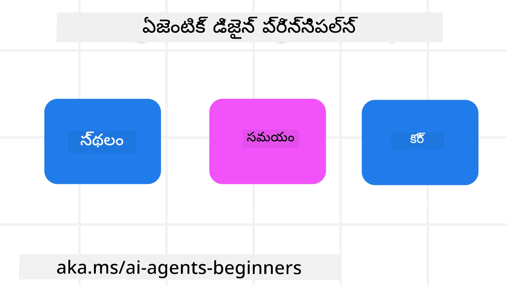

> _(ఈ పాఠాన్ని వీక్షించడానికి పై చిత్రం క్లిక్ చేయండి)_
# AI ఏజెంటిక్ డిజైన్ ప్రిన్సిపల్స్

## పరిచయం

AI ఏజెంటిక్ సిస్టమ్స్ నిర్మాణం గురించి అనేక మార్గాలు ఉన్నాయి. జనరేటివ్ AI డిజైన్‌లో అస్పష్టత ఒక లక్షణం మరియు లోపం కాదు కాబట్టి, ఇంజనీర్లకు ఎక్కడి నుండి ప్రారంభించాలో కనుగొనడం కొంత కష్టం. అభివృద్ధి దారులకు వారి వ్యాపార అవసరాలను పరిష్కరించేందుకు కస్టమర్-కేంద్రీకృత ఏజెంటిక్ సిస్టమ్స్ నిర్మించడానికి మానవ-కేంద్రీకృత UX డిజైన్ ప్రిన్సిపల్స్ సెట్‌ను మేము రూపొందించినాం. ఈ డిజైన్ ప్రిన్సిపల్స్ ఒక ఆదేశాత్మక వాస్తవిక శిల్పం కాదు, కానీ ఏజెంట్ అనుభవాలను నిర్వచిస్తూ మరియు నిర్మిస్తున్న జట్ల కోసం ఒక ప్రారంభ బిందువు.

సాధారణంగా, ఏజెంట్లు ఈ విధంగా ఉండాలి:

- మానవ సామర్థ్యాలను విస్తరించటం మరియు స్కేలు చేయటం (ఆలోచనల సృష్టి, సమస్య పరిష్కారం, ఆటోమేషన్ మొదలైనవి)
- జ్ఞాన లోపాలను భర్తీ చేయటం (జ్ఞాన రంగాలపై నన్ను త్వరిత గతిలో తీసుకోండి, అనువాదం, మొదలైనవి)
- మనం వ్యక్తిగతంగా ఇతరులతో పని చేయటానికి ఇష్టపడే విధానాలలో సహకారాన్ని సులభతరం చేయటం మరియు మద్దతు ఇవ్వటం
- మనలను మంచితనంగా మార్చటం (ఉదాహరణకు, జీవిత కోచ్/టాస్క్ మాస్టర్, భావ శాసన నియంత్రణ మరియు మైండ్ ఫుల్ నెస్ నైపుణ్యాలను నేర్పడం, సహనం నిర్మించడం, మొదలైనవి)

## ఈ పాఠం కవర్ చేసే అంశాలు

- ఏజెంటిక్ డిజైన్ ప్రిన్సిపల్స్ ఏమిటి
- ఈ డిజైన్ ప్రిన్సిపల్స్ అమలు చేయేటప్పుడు అనుసరించాల్సిన కొన్ని మార్గదర్శకాలు
- డిజైన్ ప్రిన్సిపల్స్ ఉపయోగించిన కొన్ని ఉదాహరణలు ఏమిటి

## శిక్షణ లక్ష్యాలు

ఈ పాఠం పూర్తిచేసిన తర్వాత, మీరు చేయగలరు:

1. ఏజెంటిక్ డిజైన్ ప్రిన్సిపల్స్ ఏమిటో వివరించగలగడం
2. ఏజెంటిక్ డిజైన్ ప్రిన్సిపల్స్ ఉపయోగించే మార్గదర్శకాలు వివరించగలగడం
3. ఏజెంటిక్ డిజైన్ ప్రిన్సిపల్స్ ఉపయోగించి ఏజెంట్ ఎలా తయారు చేయాలో అర్థం చేసుకోవటం

## ఏజెంటిక్ డిజైన్ ప్రిన్సిపల్స్

### ఏజెంట్ (స్థలం)

ఏజెంట్ పని చేసే పరిసరమే ఇది. ఈ ప్రిన్సిపల్స్ మాకు ఫిజికల్ మరియు డిజిటల్ ప్రపంచాల్లో పాల్గొనటానికి ఏజెంట్లను ఎలా డిజైన్ చేయాలో తెలియజేస్తాయి.

- **కనెక్ట్ చేయటం, కుదిపੇర్చటం కాదు** – సహకారం మరియు సంబంధాన్ని సులభం చేయడానికి వ్యక్తులను ఇతర వ్యక్తులు, సంఘటనలు మరియు ఆచరించదగిన జ్ఞానంతో కనెక్ట్ చేయండి.
- ఏజెంట్లు సంఘటనలు, జ్ఞానం మరియు వ్యక్తులను కనెక్ట్ చేయడంలో సహాయపడతాయి.
- ఏజెంట్లు వ్యక్తులను దగ్గరగా తెస్తాయి. వారు వ్యక్తులను భర్తీ చేయటానికి లేదా తక్కువగా చూపించటానికి రూపొందించబడలేదు.
- **సులభంగా 접근ించుకునే కానీ కొన్నిసార్లు కనబడని** – ఏజెంట్ ప్రధానంగా నేపథ్యంలో పనిచేస్తుంది మరియు అది ప్రాసంగికమైనప్పుడు మాత్రమే మనల్ని జాగ్రత్త పలుగుతుంది.
  - ఏజెంట్ అధీకృతులైన ఉపయోగదారులకు ఏ పరికరం లేదా వేదికపై సులభంగా కనుగొనదగినది మరియు 접근ించదగినది.
  - ఏజెంట్ బహుమాధ్యమ ఇన్‌పుట్లు మరియు అవుట్‌పుట్లను (శబ్ధం, స్వరం, టెక్స్ట్ మొదలైనవి) మద్దతు ఇస్తుంది.
  - ఏజెంట్ వినియోగదారుల అవసరాలను గుర్తించటం ఆధారంగా ముందుగా మరియు ప్రతిస్పందించే మధ్య సజీవంగా మారవచ్చు.
  - ఏజెంట్ కనిపించకుండా కూడా పనిచేయవచ్చు, అయితే దాని నేపథ్య ప్రక్రియ మార్గం మరియు ఇతర ఏజెంట్లతో సహకారం వినియోగదారుకు పారదర్శకంగా ఉంటుంది మరియు నియంత్రించదగినది.

### ఏజెంట్ (సమయం)

ఏజెంట్ సమయానుగుణంగా ఎలా పనిచేస్తుంది అంటే ఇదే. ఈ ప్రిన్సిపల్స్ మాకు గతం, వర్తమాన మరియు భవిష్యత్తుతో ఏజెంట్లు ఎలా సంభాషించాలో డిజైన్ చేయడంలో సహాయపడతాయి.

- **గతం**: పరిస్థితి మరియు సుందరాన్ని కలిగిన చరిత్రను ప్రతిబింబించడం.
  - ఏజెంట్ సంఘటన, వ్యక్తులు లేదా పరిస్థితుల కంటే అధికమైన పూర్వ చరిత్ర డేటాను విశ్లేషించి ప్రాసంగిక ఫలితాలు అందిస్తుంది.
  - ఏజెంట్ గత సంఘటనల నుండి సంబంధాలను సృష్టించి, ప్రస్తుత పరిస్థితులతో వ్యవహరించడానికి జ్ఞాపకాన్ని చురుకుగా ప్రతిబింబిస్తుంది.
- **వर्तमानం**: గమనించడం కంటే ఎక్కువగా ప్రేరేపించడం.
  - ఏజెంట్ వ్యక్తులతో ఇంతటితో మాత్రమే కాకుండా సమగ్ర పద్ధతిని ప్రతిబింబిస్తుంది. సంఘటన జరిగినప్పుడు ఏజెంట్ స్థిరమైన గౌరవాన్ని లేదా ఏ ఇతర స్థిరమైన ఆచరణను మించి ప్రయోగం చేస్తుంది. ఏజెంట్ పాఠాలు సులభతరం చేస్తుంది లేదా వినియోగదారుని గమనాన్ని సరైన క్షణంలో దారితీసే సంకేతాలను సృష్టిస్తుంది.
  - ఏజెంట్ సమాచారాన్ని సాందర్భిక వాతావరణం, సామాజిక మరియు సాంస్కృతిక మార్పుల ప్రకారం మరియు వినియోగదారుని ఉద్దేశ్యానికి అనుగుణంగా అందిస్తుంది.
  - ఏజెంట్ సంభాషణ విధానం దారిగా మారుతూ/వృద్ధి చెయ్యగలదు, దీర్ఘకాలం పాటు వినియోగదారులను శక్తివంతం చేస్తుంది.
- **భవిష్యత్తు**: అనుకూలంగా మారడం మరియు అభివృద్ధి చెందడం.
  - ఏజెంట్ వివిధ పరికరాలు, వేదికలు మరియు మాధ్యమాలకు అనుకూలిస్తుందని.
  - ఏజెంట్ వినియోగదారుల ప్రవర్తన, లభ్యత అవసరాలకు అనుగుణంగా మారుతుంది మరియు స్వేచ్ఛగా కస్టమైజ్ చేసుకోవచ్చు.
  - ఏజెంట్ నిరంతర వినియోగదారుల సంభాషణ ద్వారా ఆకారాన్ని స్వీకరిస్తూ మరియు అభివృద్ధి చెందుతుందని.

### ఏజెంట్ (కోర్)

ఏజెంట్ డిజైన్ లోని ప్రధాన అంశాలు ఇవి.

- **అనిశ్చితిని అంగీకరించండి కానీ విశ్వాసం నిర్మించండి**.
  - ఏజెంటులో ఒక స్థాయి అనిశ్చితి ఎదురుచూడవలసినదిగా ఉంటుంది. అనిశ్చితి ఏజెంట్ డిజైన్ లో ఒక కీలక అంశం.
  - విశ్వాసం మరియు పారదర్శకత ఏజెంట్ డిజైన్ యొక్క మౌలిక ఫలకాలుగా ఉంటాయి.
  - ఎంత వరకైనా ఏజెంట్ ఆన్/ఆఫ్ ఎప్పుడు ఉంటుంది అనేది మానవులు నియంత్రిస్తారు మరియు ఏజెంట్ స్థితి ఎప్పుడూ స్పష్టంగా కనిపిస్తుంది.

## ఈ ప్రిన్సిపల్స్ అమలు చేయడానికి మార్గదర్శకాలు

మీరు పై డిజైన్ ప్రిన్సిపల్స్ ఉపయోగిస్తున్నప్పుడు, తరువాతి మార్గదర్శకాలను అనుసరించండి:

1. **పారదర్శకత**: AI భాగస్వామ్యం ఉందని వినియోగదారునికి తెలియజేయండి, అది ఎలా పనిచేస్తుందో (గత చర్యలను సహా), ఫీడ్‌బ్యాక్ ఇవ్వటం మరియు సిస్టమ్ మార్చుకునే విధానాన్ని వివరించండి.
2. **నియంత్రణ**: వినియోగదారునికి వ్యవస్థను మరియు దాని లక్షణాలను (మర్చిపోయే సామర్థ్యాన్ని సహా) అనుకూలపరచుకునే, ఇష్టాలను పేర్కొనే, వ్యక్తిగతీకరించే సౌకర్యాన్ని ఇవ్వండి.
3. **అఖండత**: పరికరాల અને ఎండ్పాయింట్ల మధ్య స꾸లమైన, బహుమాధ్యమ అనుభవాలను లక్ష్యంగా ఉంచండి. సాధ్యమైన చోటు పరిచయ UI/UX అంశాలను ఉపయోగించండి (ఉదాహరణకు, స్వర పరస్పర చర్యకు మైక్రోఫోన్ చిహ్నం) మరియు వినియోగదారుని మానసిక లోడ్ను తగ్గించండి (ఉదాహరణకు, సంక్షిప్త సమాధానాలు, దృశ్య సహాయాలు, ‘మరింత నేర్చుకోండి’ కంటెంట్).

## ఈ ప్రిన్సిపల్స్ మరియు మార్గదర్శకాలను ఉపయోగించి ట్రావెల్ ఏజెంట్ ఎలా డిజైన్ చేయాలి

మీరు ఒక ట్రావెల్ ఏజెంట్ డిజైన్ చేస్తున్నట్టు ఊహించండి, ఇక్కడ మీరు డిజైన్ ప్రిన్సిపల్స్ మరియు మార్గదర్శకాలను ఎలా ఉపయోగించాలో ఆలోచించవచ్చు:

1. **పారదర్శకత** – వినియోగదారునికి ట్రావెల్ ఏజెంట్ AI ఆధారిత ఏజెంట్ అని తెలియజేయండి. ప్రారంభించటానికి కొన్ని ప్రాథమిక సూచనలు ఇవ్వండి (ఉదాహరణకు, “హలో” సందేశం, నమూనా ప్రాంప్ట్‌లు). దీనిని స్పష్టంగా ప్రొడక్ట్ పేజీలో డాక్యుమెంట్ చేయండి. వినియోగదారు గతంలో అడిగిన ప్రాంప్ట్‌ల జాబితాను చూపించండి. ఫీడ్‌బ్యాక్ ఎలా ఇవ్వాలో (థంబ్స్ అప్/డౌన్, Send Feedback బటన్ మొదలైనవి) స్పష్టంగా తెలియజేయండి. ఏజెంట్‌కు ఉపయోగం లేదా అంశ పరిమితులు ఉన్నాయో స్పష్టంగా వివరించండి.
2. **నియంత్రణ** – ఏజెంట్ సృష్టించిన తర్వాత వినియోగదారుని ఎలా మార్చుకోవచ్చో స్పష్టంగా ఉండాలి, ఉదాహరణకు సిస్టమ్ ప్రాంప్ట్ ద్వారా. ఏజెంట్ verbosity, రచనా శైలి, ఏ అంశాలపై మాట్లాడకూడదో సెలవు ఇవ్వాలన్నియాన్ని వినియోగదారుడు ఎంచుకోవచ్చు. సంబంధిత ఫైళ్లు, డేటా, ప్రాంప్ట్‌లు మరియు గత సంభాషణలను చూసి, తొలగించేందుకు అనుమతించండి.
3. **అఖండత** – షేర్ ప్రాంప్ట్, ఫైలు లేదా ఫోటో జోడించడం మరియు ఎవరిదైనా లేదా ఏదైనా ట్యాగ్ చేయడం కోసం చిహ్నాలు ప్రామాణికంగా మరియు గుర్తించదగినవి అయ్యేలా చూసుకోండి. ఏజెంట్‌తో ఫైలు అప్‌లోడ్/షేరింగ్ సూచించడానికి పేపర్‌క్లిప్ చిహ్నాన్ని, గ్రాఫిక్స్ అప్‌లోడ్ సూచించడానికి చిత్రం చిహ్నాన్ని ఉపయోగించండి.

## ఉదాహరణ కోడ్లు

- Python: [Agent Framework](./code_samples/03-python-agent-framework.ipynb)
- .NET: [Agent Framework](./code_samples/03-dotnet-agent-framework.md)

## AI ఏజెంటిక్ డిజైన్ ప్యాటర్న్ల గురించి మరిన్ని ప్రశ్నలు ఉన్నాయా?

ఇతర అభ్యసించేవారితో కలవటానికి, ఆఫీస్ గంటలలో పాల్గొనటానికి మరియు మీ AI ఏజెంట్ల ప్రశ్నలకు జవాబులు పొందటానికి [Microsoft Foundry Discord](https://discord.com/invite/ATgtXmAS5D)లో చేరండి.

## అదనపు వనరులు

- <a href="https://openai.com" target="_blank">ఏజెంటిక్ AI సిస్టమ్స్ పాలన కోసం ఆచారాలు | OpenAI</a>
- <a href="https://microsoft.com" target="_blank">HAX టూల్‌కిట్ ప్రాజెక్ట్ - Microsoft Research</a>
- <a href="https://responsibleaitoolbox.ai" target="_blank">జవాబుదారి AI టూల్‌బాక్స్</a>

## గత పాఠం

[ఏజెంటిక్ ఫ్రేమ్‌వర్క్‌లు అన్వేషించటం](../02-explore-agentic-frameworks/README.md)

## తరువాత పాఠం

[టూల్ వాడకం డిజైన్ ప్యాటర్న్](../04-tool-use/README.md)

---

<!-- CO-OP TRANSLATOR DISCLAIMER START -->
**అస్వీకరణ**:
ఈ పత్రం AI అనువాద సేవ [Co-op Translator](https://github.com/Azure/co-op-translator) ఉపయోగించి అనువదించబడింది. మేము ఖచ్చితత్వానికి ప్రయత్నిస్తున్నప్పటికీ, ఆటోమేటెడ్ అనువాదాలు తప్పులు లేదా అసమగ్రతలను కలిగి ఉండవచ్చు. దాని స్వదేశ భాషలో ఉన్న అసలు పత్రాన్ని అధికారం కలిగిన మూలంగా పరిగణించాలి. కీలకమైన సమాచారం కోసం, ప్రొఫెషనల్ మానవ అనువాదాన్ని సిఫారసు చేస్తాము. ఈ అనువాదం ఉపయోగం వల్ల కలిగే ఏవైనా అపార్థాలు లేదా తప్పుదారులు కోసం మేము బాధ్యత వహించము.
<!-- CO-OP TRANSLATOR DISCLAIMER END -->