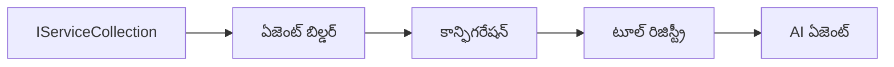

# 🎨 Azure OpenAI (Responses API)తో Agentic Design Patterns (.NET)

## 📋 అభ్యాస లక్ష్యాలు

ఈ ఉదాహరణ Microsoft Agent Frameworkని .NETలో Azure OpenAI (Responses API) ఇంటిగ్రేషన్‌తో బుద్ధಿವంతమైన ఏజెంట్లను నిర్మించడానికి ఎంటర్‌ప్రైజ్-గ్రేడ్ డిజైన్ ప్యాటర్న్స్‌ను చూపిస్తుంది. మీరు ఏజెంట్లను ప్రొడక్షన్-రెడీ, నిర్వహించదగిన మరియు పెరుగదగిన విధంగా చేస్తూ ప్రొఫెషనల్ ప్యాటర్న్స్ మరియు معماري దృక్పథాలను నేర్చుకుంటారు.

### ఎంటర్‌ప్రైజ్ డిజైన్ ప్యాటర్న్స్

- 🏭 **Factory Pattern**: డిపెండెన్సీ ఇంజెక్షన్‌తో ప్రమాణీకృత ఏజెంట్ సృష్టి  
- 🔧 **Builder Pattern**: ఫ్లూయెంట్ ఏజెంట్ కాన్ఫిగరేషన్ మరియు సెటప్  
- 🧵 **Thread-Safe Patterns**: సమకాలీన సంభాషణ నిర్వహణ  
- 📋 **Repository Pattern**: యంత్రాలు మరియు సామర్ధ్యాల కోసం వ్యవస్థీకృత నిర్వహణ  

## 🎯 .NET-కిష్టమైన معماري లాభాలు  

### ఎంటర్‌ప్రైజ్ ఫీచర్లు  

- **Strong Typing**: కంపైల్ టైమ్ ధృవీకరణ మరియు IntelliSense మద్దతు  
- **Dependency Injection**: అంతర్భాగంగా DI కంటెయినర్ ఇంటిగ్రేషన్  
- **Configuration Management**: IConfiguration మరియు Options ప్యాటర్న్స్  
- **Async/Await**: ప్రథమ-తరగతి అసింక్రోనస్ ప్రోగ్రామింగ్ మద్దతు  

### ప్రొడక్షన్-రెడీ ప్యాటర్న్స్  

- **Logging Integration**: ILogger మరియు నిర్మాణాత్మక లాగింగ్ మద్దతు  
- **Health Checks**: అంతర్భాగంగా మానిటరింగ్ మరియు డయాగ్నోస్టిక్స్  
- **Configuration Validation**: డేటా అనోటేషన్లతో బలమైన టైపింగ్  
- **Error Handling**: నిర్మాణాత్మక ఎక్స్‌సెప్షన్ నిర్వహణ  

## 🔧 సాంకేతిక معماري  

### కోర్ .NET భాగాలు  

- **Microsoft.Extensions.AI**: ఏకీకృత AI సేవ అభివృద్ధులు  
- **Microsoft.Agents.AI**: ఎంటర్‌ప్రైజ్ ఏజెంట్ సంచాలన ఫ్రేమ్‌వర్క్  
- **Azure OpenAI (Responses API)**: అధిక ప్రదర్శన API క్లయింట್ ప్యాటర్న్స్  
- **Configuration System**: appsettings.json మరియు పరిసర ఇంటిగ్రేషన్  

### డిజైన్ ప్యాటర్న్ అమలు  



## 🏗️ చూపించిన ఎంటర్‌ప్రైజ్ ప్యాటర్న్స్  

### 1. **సృష్ఠి ప్యాటర్న్స్**  

- **Agent Factory**: సారూప్య కాన్ఫిగరేషన్‌తో ఏజెంట్ సెంట్రలైజ్డ్ సృష్టి  
- **Builder Pattern**: సంక్లిష్ట ఏజెంట్ కాన్ఫిగరేషన్ కోసం ఫ్లూయెంట్ API  
- **Singleton Pattern**: పంచుకున్న వనరులు మరియు కాన్ఫిగరేషన్ నిర్వహణ  
- **Dependency Injection**: సడలించిన కలపడం మరియు పరీక్షనీయత  

### 2. **ప్రవర్తనా ప్యాటర్న్స్**  

- **Strategy Pattern**: మార్పిడి సాధ్యమైన టూల్ అమలు వ్యూహాలు  
- **Command Pattern**: అన్‌డూ/రెడూ ఉన్న ఏజెంట్ ఆపరేషన్ల సంకలనం  
- **Observer Pattern**: ఈవెంట్-ఆధారిత ఏజెంట్ జీవచక్ర నిర్వహణ  
- **Template Method**: ప్రమాణీకృత ఏజెంట్ అమలు వర్క్‌ఫ్లోలు  

### 3. **సంరచనాత్మక ప్యాటర్న్స్**  

- **Adapter Pattern**: Azure OpenAI (Responses API) ఇంటిగ్రేషన్ లేయర్  
- **Decorator Pattern**: ఏజెంట్ సామర్ధ్య పెంపు  
- **Facade Pattern**: సులభతర ఏజెంట్ ఇంటరాక్షన్ ఇంటర్‌ఫేసులు  
- **Proxy Pattern**: పనితీరు కోసం ఆలస్యం లోడింగ్ మరియు క్యాచింగ్  

## 📚 .NET డిజైన్ సిద్దాంతాలు  

### SOLID సిద్దాంతాలు  

- **Single Responsibility**: ప్రతి భాగానికి ఒక స్పష్టమైన ప్రయోజనం  
- **Open/Closed**: మార్పు లేకుండానే విస్తరించదగినది  
- **Liskov Substitution**: ఇంటర్‌ఫేస్ ఆధారిత టూల్ అమలులు  
- **Interface Segregation**: లక్ష్యంతో కూడిన, ఏకత తత్వ ఇంటర్‌ఫేసులు  
- **Dependency Inversion**: నిజ పరిస్థితులకేమి కాదు, అభివృద్ధులపై ఆధారపడుట  

### శుభ్రమైన معماري  

- **Domain Layer**: కోర్ ఏజెంట్ మరియు టూల్ అభివృద్ధులు  
- **Application Layer**: ఏజెంట్ సంచాలన మరియు వర్క్‌ఫ్లోలు  
- **Infrastructure Layer**: Azure OpenAI (Responses API) ఇంటిగ్రేషన్ మరియు బాహ్య సేవలు  
- **Presentation Layer**: వినియోగదారుల ఇంటరాక్షన్ మరియు ప్రతిస్పందన ఆకృతీకరణ  

## 🔒 ఎంటర్‌ప్రైజ్ పరిశీలనలు  

### భద్రత  

- **Credential Management**: IConfigurationతో సురక్షిత API కీ నిర్వహణ  
- **Input Validation**: బలమైన టైపింగ్ మరియు డేటా అనోటేషన్ ధృవీకరణ  
- **Output Sanitization**: సురక్షిత స్పందన ప్రాసెసింగ్ మరియు ఫిల్టరింగ్  
- **Audit Logging**: సమగ్ర ఆపరేషన్ ట్రాకింగ్  

### పనితీరు  

- **Async Patterns**: అడ్డుకోకుండా I/O ఆపరేషన్లు  
- **Connection Pooling**: సమర్థవంతమైన HTTP క్లయింట్ నిర్వహణ  
- **Caching**: మెరుగుపడిన పనితీరకు స్పందన క్యాచింగ్  
- **Resource Management**: సరైన విడదీయడం మరియు శుభ్రపరిచే పద్ధతులు  

### పెరుగుదల  

- **Thread Safety**: సమకాలీన ఏజెంట్ అమలు మద్దతు  
- **Resource Pooling**: సమర్థ వనరు వినియోగం  
- **Load Management**: రేటు పరిమితి మరియు బ్యాక్‌ప్రెషర్ నిర్వహణ  
- **Monitoring**: పనితీరు గణాంకాలు మరియు ఆరోగ్య తనిఖీలు  

## 🚀 ప్రొడక్షన్ డిప్లాయ్‌మెంట్  

- **Configuration Management**: పరిమితి-నిర్దిష్ట సెట్టింగులు  
- **Logging Strategy**: సంబంధిత IDలతో నిర్మాణాత్మక లాగింగ్  
- **Error Handling**: సరైన పునరుద్ధరణతో గ్లోబల్ ఎక్స్‌సెప్షన్ నిర్వహణ  
- **Monitoring**: అప్లికేషన్ ఇన్‌సైట్స్ మరియు పనితీరు కౌంటర్లు  
- **Testing**: యూనిట్ పరీక్షలు, ఇంటిగ్రేషన్ పరీక్షలు, మరియు లోడ్ పరీక్ష ప్యాటర్న్స్  

.NETతో ఎంటర్‌ప్రైజ్-గ్రేడ్ బుద్ధి ఏజెంట్లను నిర్మించేందుకు సిద్ధం? మనం బలమైనది معماري చేద్దాం! 🏢✨

## 🚀 ప్రారంభించండి  

### ముందస్తు అవసరాలు  

- [.NET 10 SDK](https://dotnet.microsoft.com/download/dotnet/10.0) లేదా అంతకు పైగా  
- Azure OpenAI వనరు మరియు మోడల్ అమలు ఉన్న [Azure సబ్‌స్క్రిప్షన్](https://azure.microsoft.com/free/)  
- [Azure CLI](https://learn.microsoft.com/cli/azure/install-azure-cli) — `az login`తో సైన్ ఇన్ చేయండి  

### అవసరమైన పర్యావరణ చరాలు  

```bash
# zsh/bash
export AZURE_OPENAI_ENDPOINT=https://<your-resource>.openai.azure.com
export AZURE_OPENAI_DEPLOYMENT=gpt-4o-mini
# అప్పుడే AzureCliCredential టోకెన్ పొందడానికి సైన్ ఇన్ అవండి
az login
```

```powershell
# పవర్‌షెల్
$env:AZURE_OPENAI_ENDPOINT = "https://<your-resource>.openai.azure.com"
$env:AZURE_OPENAI_DEPLOYMENT = "gpt-4o-mini"
# ఆ తరువాత సైన్ ఇన్ అవ్వండి తద్వారా AzureCliCredential టోకెన్ పొందగలదు
az login
```

### నమూనా కోడ్  

కోడ్ ఉదాహరణను నడిపించడానికి,

```bash
# జెడ్‌ఎస్‌హెచ్/బాష్
chmod +x ./03-dotnet-agent-framework.cs
./03-dotnet-agent-framework.cs
```

లేక dotnet CLI ఉపయోగించి:

```bash
dotnet run ./03-dotnet-agent-framework.cs
```

పూర్తి కోడ్ కోసం [`03-dotnet-agent-framework.cs`](../../../../03-agentic-design-patterns/code_samples/03-dotnet-agent-framework.cs) చూడండి.  

```csharp
#!/usr/bin/dotnet run

#:package Microsoft.Extensions.AI@10.*
#:package Microsoft.Agents.AI.OpenAI@1.*-*
#:package Azure.AI.OpenAI@2.1.0
#:package Azure.Identity@1.13.1

using System.ComponentModel;

using Microsoft.Agents.AI;
using Microsoft.Extensions.AI;

using Azure.AI.OpenAI;
using Azure.Identity;

// Tool Function: Random Destination Generator
// This static method will be available to the agent as a callable tool
// The [Description] attribute helps the AI understand when to use this function
// This demonstrates how to create custom tools for AI agents
[Description("Provides a random vacation destination.")]
static string GetRandomDestination()
{
    // List of popular vacation destinations around the world
    // The agent will randomly select from these options
    var destinations = new List<string>
    {
        "Paris, France",
        "Tokyo, Japan",
        "New York City, USA",
        "Sydney, Australia",
        "Rome, Italy",
        "Barcelona, Spain",
        "Cape Town, South Africa",
        "Rio de Janeiro, Brazil",
        "Bangkok, Thailand",
        "Vancouver, Canada"
    };

    // Generate random index and return selected destination
    // Uses System.Random for simple random selection
    var random = new Random();
    int index = random.Next(destinations.Count);
    return destinations[index];
}

// Azure OpenAI with the Responses API (stable v1 endpoint). Sign in with `az login`.
var azureEndpoint = Environment.GetEnvironmentVariable("AZURE_OPENAI_ENDPOINT")
    ?? throw new InvalidOperationException("AZURE_OPENAI_ENDPOINT is not set.");
var deployment = Environment.GetEnvironmentVariable("AZURE_OPENAI_DEPLOYMENT") ?? "gpt-4o-mini";

var azureClient = new AzureOpenAIClient(new Uri(azureEndpoint), new AzureCliCredential());

// Define Agent Identity and Comprehensive Instructions
// Agent name for identification and logging purposes
var AGENT_NAME = "TravelAgent";

// Detailed instructions that define the agent's personality, capabilities, and behavior
// This system prompt shapes how the agent responds and interacts with users
var AGENT_INSTRUCTIONS = """
You are a helpful AI Agent that can help plan vacations for customers.

Important: When users specify a destination, always plan for that location. Only suggest random destinations when the user hasn't specified a preference.

When the conversation begins, introduce yourself with this message:
"Hello! I'm your TravelAgent assistant. I can help plan vacations and suggest interesting destinations for you. Here are some things you can ask me:
1. Plan a day trip to a specific location
2. Suggest a random vacation destination
3. Find destinations with specific features (beaches, mountains, historical sites, etc.)
4. Plan an alternative trip if you don't like my first suggestion

What kind of trip would you like me to help you plan today?"

Always prioritize user preferences. If they mention a specific destination like "Bali" or "Paris," focus your planning on that location rather than suggesting alternatives.
""";

// Create AI Agent with Advanced Travel Planning Capabilities
// Get the Responses client for the deployment and create the AI agent
// Configure agent with name, detailed instructions, and available tools
// This demonstrates the .NET agent creation pattern with full configuration
AIAgent agent = azureClient
    .GetOpenAIResponseClient(deployment)
    .CreateAIAgent(
        name: AGENT_NAME,
        instructions: AGENT_INSTRUCTIONS,
        tools: [AIFunctionFactory.Create(GetRandomDestination)]
    );

// Create New Conversation Thread for Context Management
// Initialize a new conversation thread to maintain context across multiple interactions
// Threads enable the agent to remember previous exchanges and maintain conversational state
// This is essential for multi-turn conversations and contextual understanding
AgentThread thread = agent.GetNewThread();

// Execute Agent: First Travel Planning Request
// Run the agent with an initial request that will likely trigger the random destination tool
// The agent will analyze the request, use the GetRandomDestination tool, and create an itinerary
// Using the thread parameter maintains conversation context for subsequent interactions
await foreach (var update in agent.RunStreamingAsync("Plan me a day trip", thread))
{
    await Task.Delay(10);
    Console.Write(update);
}

Console.WriteLine();

// Execute Agent: Follow-up Request with Context Awareness
// Demonstrate contextual conversation by referencing the previous response
// The agent remembers the previous destination suggestion and will provide an alternative
// This showcases the power of conversation threads and contextual understanding in .NET agents
await foreach (var update in agent.RunStreamingAsync("I don't like that destination. Plan me another vacation.", thread))
{
    await Task.Delay(10);
    Console.Write(update);
}
```

---

<!-- CO-OP TRANSLATOR DISCLAIMER START -->
**అస్వీకరణ**:
ఈ పత్రం AI అనువాద సేవ [Co-op Translator](https://github.com/Azure/co-op-translator) ఉపయోగించి అనువదించబడింది. మేము ఖచ్చితత్వానికి ప్రయత్నిస్తున్నప్పటికీ, ఆటోమేటెడ్ అనువాదాలు తప్పులు లేదా అసమగ్రతలను కలిగి ఉండవచ్చు. దాని స్వదేశ భాషలో ఉన్న అసలు పత్రాన్ని అధికారం కలిగిన మూలంగా పరిగణించాలి. కీలకమైన సమాచారం కోసం, ప్రొఫెషనల్ మానవ అనువాదాన్ని సిఫారసు చేస్తాము. ఈ అనువాదం ఉపయోగం వల్ల కలిగే ఏవైనా అపార్థాలు లేదా తప్పుదారులు కోసం మేము బాధ్యత వహించము.
<!-- CO-OP TRANSLATOR DISCLAIMER END -->