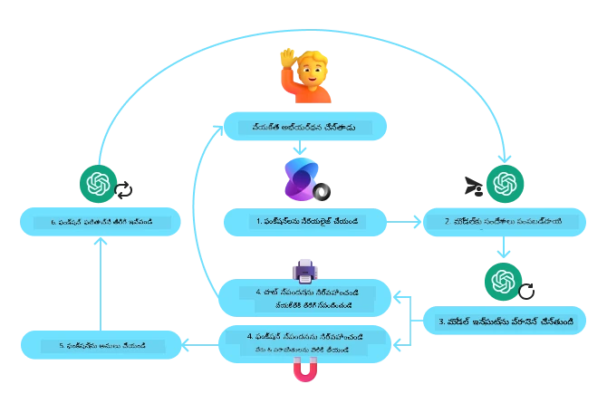
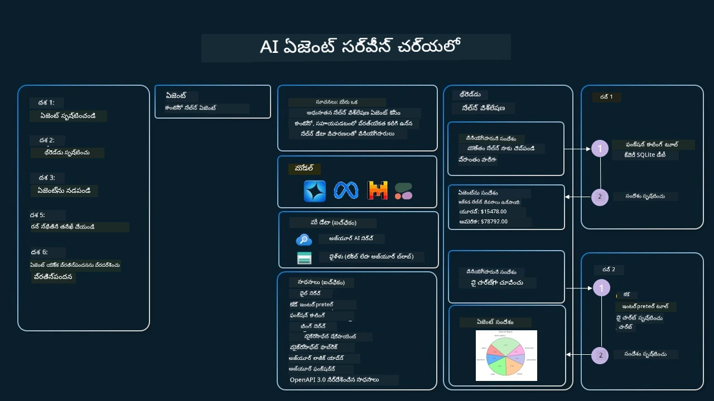

[](https://youtu.be/vieRiPRx-gI?si=cEZ8ApnT6Sus9rhn)

> _(ఈ పాఠం వీడియోను వీక్షించడానికి పై చిత్రాన్ని క్లిక్ చేయండి)_

# టూల్ వాడుక డిజైన్ నమూనా

టూల్స్ ఆసక్తికరం ఎందుకంటే అవి AI ఏజెంట్లకు విస్తృత పరిధి సామర్థ్యాలను అందిస్తాయి. ఏజెంట్ నిర్వర్తించగల పరిమిత చర్యల సమితి ఉండటం బదులు, టూల్‌ని జోడించడం ద్వారా ఏజెంట్ ఇప్పుడు విస్తృత ఛాయిస్‌ల చర్యలను చేయగలడు. ఈ అధ్యాయంలో, AI ఏజెంట్లు తమ లక్ష్యాలను సాధించడానికి ప్రత్యేక టూల్స్‌ను ఎలా ఉపయోగించగలరో వివరిస్తున్న టూల్ వాడుక డిజైన్ నమూనాను పరిశీలిస్తాము.

## పరిచయం

ఈ పాఠంలో, మేము క్రింది ప్రశ్నలకు సమాధానం వెతుకుదాము:

- టూల్ వాడుక డిజైన్ నమూనా అంటే ఏమిటి?
- దాన్ని ఏవైన వినియోగాలు వర్తిస్తాయి?
- డిజైన్ నమూనా అమలుకు కావలసిన మూలకాలు/నిర్మాణ బ్లాకులు ఏమిటి?
- నమ్మదగిన AI ఏజెంట్లను నిర్మించడానికి టూల్ వాడుక డిజైన్ నమూనా వినియోగంలో ప్రత్యేక పరిశీలనలు ఏమిటి?

## నేర్చుకునే లక్ష్యాలు

ఈ పాఠం పూర్తిచేసిన తర్వాత, మీరు చేయగలరును:

- టూల్ వాడుక డిజైన్ నమూనా మరియు దాని ప్రయోజనాన్ని నిర్వచించండి.
- టూల్ వాడుక డిజైన్ నమూనా వర్తించే వినియోగాలు గుర్తించండి.
- డిజైన్ నమూనా అమలుకు కావలసిన ముఖ్య మూలకాలు అర్థం చేసుకోండి.
- ఈ డిజైన్ నమూనా ఉపయోగించి AI ఏజెంట్ల నమ్మకాన్ని నిర్ధారించడానికి పరిశీలనలు గుర్తించండి.

## టూల్ వాడుక డిజైన్ నమూనా అంటే ఏమిటి?

**టూల్ వాడుక డిజైన్ నమూనా** LLMలను ప్రత్యేక లక్ష్యాలను సాధించడానికి బాహ్య టూల్స్‌తో పరస్పరం చేయగల సామర్థ్యాన్ని అందించడంపై కేంద్రీకృతమైంది. టూల్స్ అనేవి ఏజెంట్ చర్యలు చేయడానికి అమలు చేయగల కోడ్. ఒక టూల్ సాధారణ గణన యంత్రం వంటి ఫంక్షన్ కావచ్చు, లేదా స్టాక్ ధరల శోధన లేదా వాతావరణ పూర్వاڻుకూలంగా ఉండే మూడవపక్ష సేవకు API కాల్ కావచ్చు. AI ఏజెంట్ల సందర్భంలో, టూల్స్ **మోడల్-సృష్టించిన ఫంక్షన్ కాల్స్**కు స్పందిస్తూ ఏజెంట్ల ద్వారా అమలు చేయడానికి రూపొందించబడ్డాయి.

## దానిని ఏవైన వినియోగాలపై పాటించవచ్చు?

AI ఏజెంట్లు జటిలమైన పనులను పూర్తి చేయడానికి, సమాచారాన్ని పొందడానికి లేదా నిర్ణయాలు తీసుకోవడానికి టూల్స్‌ని ఉపయోగించవచ్చు. టూల్ వాడుక డిజైన్ నమూనా తరచుగా డేటాబేసులు, వెబ్ సర్వీసులు, కోడ్ ఇంటర్‌ప్రిటర్లు వంటి బాహ్య వ్యవస్థలతో సజీవ పరస్పరం అవసరమయ్యే సందర్భాలలో ఉపయోగిస్తారు. ఈ సామర్థ్యం అనేక విభిన్న వినియోగాల కోసం ఉపయోగపడుతుంది, అందులో:

- **డైనమిక్ సమాచారం విలీనం:** ఏజెంట్లు బాహ్య API లను లేదా డేటాబేసులను అడిగి తాజా డేటా పొందవచ్చు (ఉదా: డేటా విశ్లేషణతో SQLite డేటాబేసు, స్టాక్ ధరలు లేదా వాతావరణ సమాచారం).
- **కోడ్ అమలు మరియు అర్థం చేయడం:** ఏజెంట్లు గణిత సమస్యలను పరిష్కరించడానికి, నివేదికలు రూపొందించుకోవడానికి లేదా అనుకరణలు చేయడానికి కోడ్ లేదా స్క్రిప్టులను అమలు చేయవచ్చు.
- **వర్క్‌ఫ్లో ఆటోమేషన్:** పనితీరు దశల లేదా పలు దశల ఆటోమేషన్‌ను టాస్క్ షెడ్యూలర్లు, ఇమెయిల్ సేవలు లేదా డేటా పైప్‌లైన్లను అనుసంధానించడం ద్వారా చేయగలదు.
- **కస్టమర్ సపోర్ట్:** ఏజెంట్లు CRM వ్యవస్థలు, టికెటింగ్ ప్లాట్‌ఫారమ్‌లు లేదా నాలెడ్జ్ బేస్‌లతో పరస్పరం చేసి వినియోగదారు ప్రశ్నలను పరిష్కరించగలరు.
- **విషయ సృజన మరియు సవరింపు:** ఏజెంట్లు వ్యాకరణ తనిఖీదారులు, పాఠ్ సంక్షిప్తకర్తలు లేదా కంటెంట్ భద్రతా మూల్యాంకకులను ఉపయోగించి కంటెంట్ సృష్టి పనులను సహాయం చేయగలరు.

## టూల్ వాడుక డిజైన్ నమూనా అమలుకు కావలసిన మూలకాలు/నిర్మాణ బ్లాకులు ఏమిటి?

ఈ నిర్మాణ బ్లాకులు AI ఏజెంట్ వివిధ పనులు నిర్వహించడానికి సహాయపడతాయి. టూల్ వాడుక డిజైన్ నమూనా అమలు కోసం కావలసిన ముఖ్య మూలకాలు:

- **ఫంక్షన్/టూల్ స్కీమాలు**: అందుబాటులో ఉన్న టూల్స్ యొక్క వివరమైన నిర్వచనాలు, ఫంక్షన్ పేరు, ప్రయోజనం, కావాల్సిన పారామితులు, ఆశించిన అవుట్‌ఫుట్‌లు. ఈ స్కీమాలు LLMకు ఏ టూల్స్ అందుబాటులో ఉన్నాయో, సరైన అభ్యర్థనలను ఎలా రూపొందించాలో అర్థం చేసుకోవడానికి సహాయపడతాయి.

- **ఫంక్షన్ అమలైన లాజిక్**: వాడుకరి ఉద్దేశం మరియు సంభాషణ సందర్భంపై ఆధారపడి టూల్స్ ఎప్పుడు, ఎలా పిలవబడతాయో నియంత్రిస్తుంది. ఇది ప్లానర్ మాడ్యూల్‌లు, రూటింగ్ యంత్రాంగం లేదా షరతుపాటుల ప్రవాహాలను ഉൾపరిచే అవకాశం ఉంది.

- **సందేశం నిర్వహణ వ్యవస్థ**: వాడుకరి ఇన్పుట్లు, LLM స్పందనలు, టూల్ కాల్స్ మరియు టూల్ అవుట్‌పుట్‌ల మధ్య సంభాషణ ప్రవాహం నిర్వహించే భాగాలు.

- **టూల్ ఇంటిగ్రేషన్ ఫ్రేమ్‌వర్క్**: ఏజెంట్ను వివిధ టూల్స్ (సాదారణ ఫంక్షన్లు లేదా క్లిష్ట బాహ్య సేవలు)కి కనెక్ట్ చేసే మౌలిక సదుపాయాలు.

- **లోప నిర్వహణ & ధ్రువీకరణ**: టూల్ అమలులో వైఫల్యాలు నిర్వహించడం, పారామితుల ధ్రువీకరణ, ఆశించని స్పందనలు చూసుకోవడానికి మెకానిజాలు.

- **స్థితి నిర్వహణ**: సంభాషణ సందర్భం, పూర్వ టూల్ పరస్పర చర్యలు మరియు బహుళ తٔరల ఇంటరాక్షన్లలో సౌకర్యం కోసం స్థిరపడే డేటాను ట్రాక్ చేయడం.

తర్వాత, ఫంక్షన్/టూల్ కాలింగ్‌ను మరింత వివరంగా చూద్దాము.

### ఫంక్షన్/టూల్ కాలింగ్

ఫంక్షన్ కాలింగ్ అనేది LLMలను టూల్స్‌తో పనిచేయంచుటకు ప్రధాన మార్గం. మీరు తరచుగా 'Function' మరియు 'Tool' పదాలను మార్చి ఉపయోగిస్తారు, ఎందుకంటే 'ఫంక్షన్లు' ( పునఃఉపయోగించగల కోడ్ బ్లాకులు) అవి ఏజెంట్లు పనులు చేయడానికి ఉపయోగించే 'టూల్స్'. ఒక ఫంక్షన్ కోడ్‌ను పిలవడానికి, LLM వాడుకరి అభ్యర్థనను ఆ ఫంక్షన్ల వివరాలతో పోల్చాలి. అందుకోసం అన్ని అందుబాటులో ఉన్న ఫంక్షన్ల వివరణలతో కూడిన స్కీమా LLMకి పంపబడుతుంది. LLM ఆ పనికి సరిపోయే ఫంక్షన్‌ను ఎంచుకొని దాని పేరు మరియు ఆర్గుమెంట్లను తిరిగి ఇస్తుంది. ఆ ఎంచుకున్న ఫంక్షన్ పిలవబడుతుంది, దాని స్పందన LLMకి తీసుకెళ్లబడుతుంది, LLM ఆ సమాచారంతో వాడుకరి అభ్యర్థనకు స్పందిస్తుంది.

డెవలపర్లకు ఏజెంట్ల కోసం ఫంక్షన్ కాలింగ్ అమలుచేయడానికి కావలసినవి:

1. ఫంక్షన్ కాలింగ్‌ను మద్దతు చేస్తున్న LLM మోడల్
2. ఫంక్షన్ వివరణలతో కూడిన స్కీమా
3. వివరిస్తున్న ప్రతీ ఫంక్షన్ కోసం కోడ్

సిటీ లో ప్రస్తుత సమయాన్ని పొందే ఉదాహరణ చూసుదాం:

1. **ఫంక్షన్ కాలింగ్‌ను మద్దతు చేసే LLMను ప్రారంభించండి:**

    అన్ని మోడల్స్ ఫంక్షన్ కాలింగ్ మద్దతు ఇవ్వవు, అందుకని మీరు ఉపయోగించే LLM అది మద్దతు ఇవ్వుతుందో చూడాలి. <a href="https://learn.microsoft.com/azure/ai-services/openai/how-to/function-calling" target="_blank">Azure OpenAI</a> ఫంక్షన్ కాలింగ్ మద్దతు ఇస్తుంది. మేము Azure OpenAI క్లయింట్ ప్రారంభించవచ్చు.

    ```python
    # Azure OpenAI క్లయింట్‌ను ప్రారంభించండి
    client = AzureOpenAI(
        azure_endpoint = os.getenv("AZURE_AI_PROJECT_ENDPOINT"), 
        api_key=os.getenv("AZURE_OPENAI_API_KEY"),  
        api_version="2024-05-01-preview"
    )
    ```

1. **ఫంక్షన్ స్కీమా సృష్టించండి**:

    తరువాత మేము JSON స్కీమాను నిర్వచిస్తాము, ఇది ఫంక్షన్ పేరు, ఫంక్షన్ ఏం చేస్తుందో వివరణ, మరియు ఫంక్షన్ పారామితుల పేర్లు మరియు వివరణలను కలిగి ఉంటుంది.
    ఈ స్కీమాను క్రింద సృష్టించిన క్లయింట్‌కు మరియు వాడుకరి అభ్యర్థన‌తో (సాన్ ఫ్రాన్సిస్కో సమయం తెలుసుకోవడానికి) పంపిస్తాము. ముఖ్యంగా గమనించవలసిన విషయం ఏమంటే **టూల్ కాల్** తిరిగి వస్తుంది, ప్రశ్నకు తుది సమాధానం కాదు. ముందు తెలపబడినట్లు, LLM ఆ పనికి ఎంచుకున్న ఫంక్షన్ పేరిట మరియు అందులో పంపే ఆర్గుమెంట్లు తిరిగి ఇస్తుంది.

    ```python
    # మోడల్ చదవడానికి ఫంక్షన్ వివరణ
    tools = [
        {
            "type": "function",
            "function": {
                "name": "get_current_time",
                "description": "Get the current time in a given location",
                "parameters": {
                    "type": "object",
                    "properties": {
                        "location": {
                            "type": "string",
                            "description": "The city name, e.g. San Francisco",
                        },
                    },
                    "required": ["location"],
                },
            }
        }
    ]
    ```
   
    ```python
  
    # ప్రారంభ వినియోగదారుడు సందేశం
    messages = [{"role": "user", "content": "What's the current time in San Francisco"}] 
  
    # మొదటి API కాల్: మోడల్‌ను ఫంక్షన్‌ను ఉపయోగించాలని అడగండి
      response = client.chat.completions.create(
          model=deployment_name,
          messages=messages,
          tools=tools,
          tool_choice="auto",
      )
  
      # మోడల్ స్పందనను ప్రక్రియ చేయండి
      response_message = response.choices[0].message
      messages.append(response_message)
  
      print("Model's response:")  

      print(response_message)
  
    ```

    ```bash
    Model's response:
    ChatCompletionMessage(content=None, role='assistant', function_call=None, tool_calls=[ChatCompletionMessageToolCall(id='call_pOsKdUlqvdyttYB67MOj434b', function=Function(arguments='{"location":"San Francisco"}', name='get_current_time'), type='function')])
    ```
  
1. **పని చేయడానికి కావలసిన ఫంక్షన్ కోడ్:**

    ఇప్పుడు LLM ఎంచుకున్న ఫంక్షన్ అమలు చేయాల్సిన భాగమైనందున, ఆ కోడ్ అమలు చేయాలి.
    Pythonలో ప్రస్తుత సమయాన్ని పొందడానికి కోడ్ అమలు చేయవచ్చు. చివరి ఫలితాన్ని పొందడానికి రిస్పాన్స్ నుంచి పేరు మరియు ఆర్గుమెంట్లను తీసుకునే కోడ్ కూడా రాయాలి.

    ```python
      def get_current_time(location):
        """Get the current time for a given location"""
        print(f"get_current_time called with location: {location}")  
        location_lower = location.lower()
        
        for key, timezone in TIMEZONE_DATA.items():
            if key in location_lower:
                print(f"Timezone found for {key}")  
                current_time = datetime.now(ZoneInfo(timezone)).strftime("%I:%M %p")
                return json.dumps({
                    "location": location,
                    "current_time": current_time
                })
      
        print(f"No timezone data found for {location_lower}")  
        return json.dumps({"location": location, "current_time": "unknown"})
    ```

     ```python
     # ఫంక్షన్ కాల్స్‌ను నిర్వహించండి
      if response_message.tool_calls:
          for tool_call in response_message.tool_calls:
              if tool_call.function.name == "get_current_time":
     
                  function_args = json.loads(tool_call.function.arguments)
     
                  time_response = get_current_time(
                      location=function_args.get("location")
                  )
     
                  messages.append({
                      "tool_call_id": tool_call.id,
                      "role": "tool",
                      "name": "get_current_time",
                      "content": time_response,
                  })
      else:
          print("No tool calls were made by the model.")  
  
      # రెండవ API కాల్: మోడల్ నుండి తుది ప్రతిస్పందనను పొందండి
      final_response = client.chat.completions.create(
          model=deployment_name,
          messages=messages,
      )
  
      return final_response.choices[0].message.content
     ```

     ```bash
      get_current_time called with location: San Francisco
      Timezone found for san francisco
      The current time in San Francisco is 09:24 AM.
     ```

ఫంక్షన్ కాలింగ్ చాలా ఏజెంట్ టూల్ వాడుక డిజైన్ హృదయంలో ఉంది, కాని అది సరళంగా అమలు చేయడం కొన్నిసార్లు కష్టం అయివుంటుంది.
[Lesson 2](../../../02-explore-agentic-frameworks)లో నేర్చుకున్నట్టు, ఏజెంటిక్ ఫ్రేమ్‌వర్క్లు మనకు ముందుగా రూపొందించిన నిర్మాణ బ్లాకులు ఇస్తాయి.

## ఏజెంటిక్ ఫ్రేమ్‌వర్క్లతో టూల్ వాడుక ఉదాహరణలు

వివిధ ఏజెంటిక్ ఫ్రేమ్‌వర్క్లు ఉపయోగించి టూల్ వాడుక డిజైన్ నమూనాను ఎలా అమలు చేయాలో కొన్ని ఉదాహరణలు ఇక్కడ ఉన్నాయి:

### Microsoft Agent Framework

<a href="https://learn.microsoft.com/azure/ai-services/agents/overview" target="_blank">Microsoft Agent Framework</a> AI ఏజెంట్లు నిర్మించడానికి ఓపెన్-సోర్స్ ఫ్రేమ్‌వర్క్. ఇది ఫంక్షన్ కాలింగ్ ప్రాసెస్‌ను సరళతరం చేస్తుంది, మీరు Python ఫంక్షన్లను `@tool` డెకొరేటర్‌తో నిర్వచించవచ్చు. ఫ్రేమ్‌వర్క్ మోడల్ మరియు కోడ్ మధ్య వెనుక ఫ్రంట్ కమ్యూనికేషన్‌ను నిర్వహిస్తుంది. ఇంకా `AzureAIProjectAgentProvider` ద్వారా ముందుగా తయారయ్యిన ఫైల్ సర్చ్, కోడ్ ఇంటర్ప్రెటర్ వంటి టూల్స్‌కి యాక్సెస్ ఇస్తుంది.

క్రింది చిత్రం Microsoft Agent Framework తో ఫంక్షన్ కాలింగ్ ప్రాసెస్‌ను చూపిస్తుంది:



Microsoft Agent Frameworkలో టూల్స్ డెకొరేటర్ ఫంక్షన్లుగా నిర్వచిస్తారు. ముందుగా చూసిన `get_current_time` ఫంక్షన్‌ను `@tool` డెకొరేటర్ ఉపయోగించి టూల్‌గా మార్చవచ్చు. ఫ్రేమ్‌వర్క్ ఆటోమేటిక్‌గా ఫంక్షన్, పారామితులను సీరియలైజ్ చేసి LLMకి పంపే స్కీమాను తయారు చేస్తుంది.

```python
from agent_framework import tool
from agent_framework.azure import AzureAIProjectAgentProvider
from azure.identity import AzureCliCredential

@tool
def get_current_time(location: str) -> str:
    """Get the current time for a given location"""
    ...

# క్లయింట్‌ను సృష్టించండి
provider = AzureAIProjectAgentProvider(credential=AzureCliCredential())

# ఏజెంట్‌ని సృష్టించి టూల్‌తో నడపండి
agent = await provider.create_agent(name="TimeAgent", instructions="Use available tools to answer questions.", tools=get_current_time)
response = await agent.run("What time is it?")
```
  
### Azure AI Agent Service

<a href="https://learn.microsoft.com/azure/ai-services/agents/overview" target="_blank">Azure AI Agent Service</a> మించిపోయిన ఏజెంటిక్ ఫ్రేమ్‌వర్క్, డెవలపర్లకు సురక్షితంగా, హై-క్వాలిటీ, విస్తరించగల AI ఏజెంట్లు నిర్మించడానికి, డిప్లో చేయడానికి, స్కేల్ చేయడానికి సౌకర్యం ఇస్తుంది. ఇది ముఖ్యంగా ఎంటర్ప్రైజ్ అప్లికేషన్ల కోసం ఉపయోగకరము, ఎందుకంటే ఇది పూర్తిగా నిర్వహించిన సేవ మరియు ఎంటర్ప్రైజ్ గ్రేడ్ సెక్యూరిటీతో కూడుకున్నది.

LLM API నేరుగా డెవలప్ చేయటానికి సరిపోల్చితే, Azure AI Agent Service కొన్ని ప్రయోజనాలు ఇస్తుంది, వాటిలో:

- ఆటోమేటిక్ టూల్ కాలింగ్ – టూల్ కాల్ విశ్లేషించాల్సిన అవసరం లేదు, టూల్ పిలవడం, స్పందన నిర్వహించడం అందరిని సర్వర్-సైడ్ చేస్తుంది
- సురక్షితంగా నిర్వహించిన డేటా – మీ సంభాషణ స్థితిని మీరు నిర్వహించాల్సిన అవసరం లేకుండా, థ్రీడ్స్ అన్ని సమాచారాన్ని నిల్వ చేస్తాయి
- బయటకు అందించిన టూల్స్ – Bing, Azure AI Search, Azure Functions వంటి డేటా మూలాలతో పరస్పరం చేసే టూల్స్

Azure AI Agent Serviceలో అందుబాటులో ఉన్న టూల్స్ రెండు వర్గాలుగా విభజించబడతాయి:

1. నాలెడ్జ్ టూల్స్:
    - <a href="https://learn.microsoft.com/azure/ai-services/agents/how-to/tools/bing-grounding?tabs=python&pivots=overview" target="_blank">Bing Searchతో గ్రౌండింగ్</a>
    - <a href="https://learn.microsoft.com/azure/ai-services/agents/how-to/tools/file-search?tabs=python&pivots=overview" target="_blank">ఫైల్ సర్చ్</a>
    - <a href="https://learn.microsoft.com/azure/ai-services/agents/how-to/tools/azure-ai-search?tabs=azurecli%2Cpython&pivots=overview-azure-ai-search" target="_blank">Azure AI Search</a>

2. చర్య టూల్స్:
    - <a href="https://learn.microsoft.com/azure/ai-services/agents/how-to/tools/function-calling?tabs=python&pivots=overview" target="_blank">ఫంక్షన్ కాలింగ్</a>
    - <a href="https://learn.microsoft.com/azure/ai-services/agents/how-to/tools/code-interpreter?tabs=python&pivots=overview" target="_blank">కోడ్ ఇంటర్ప్రెటర్</a>
    - <a href="https://learn.microsoft.com/azure/ai-services/agents/how-to/tools/openapi-spec?tabs=python&pivots=overview" target="_blank">OpenAPI నిర్వచించిన టూల్స్</a>
    - <a href="https://learn.microsoft.com/azure/ai-services/agents/how-to/tools/azure-functions?pivots=overview" target="_blank">Azure Functions</a>

Agent Service మాకు ఈ టూల్స్‌ని `toolset`గా కలిపి ఉపయోగించేందుకు వీలు ఇస్తుంది. ఇది `threads`ని కూడా ఉపయోగిస్తుంది, అవి ఒక ప్రత్యేక సంభాషణ నుండి సందేశాల చరిత్రను ట్రాక్ చేస్తాయి.

మీరు Contoso అనే సంస్థలో సేల్స్ ఏజెంట్‌గా ఉన్నారని ఊహించండి. మీ సేల్స్ డేటా గురించి ప్రశ్నలకు సమాధానం ఇవ్వగల సంభాషణ ఏజెంట్ రూపొందించాలని ఉంటుంది.

క్రింది చిత్రం మీరు Azure AI Agent Service ఉపయోగించి మీ సేల్స్ డేటాను విశ్లేషించవచ్చు అని చూపిస్తుంది:



ఈ టూల్స్ ఏవైనా సర్వీస్‌తో ఉపయోగించేందుకు క్లయింట్ సృష్టించి టూల్ లేదా టూల్‌సెట్ నిర్వచించవచ్చు. ప్రాక్టికల్‌గా దీన్ని క్రింది Python కోడ్‌తో ఉపయోగించవచ్చు. LLM టూల్‌సెట్‌ను చూసి వాడుకరి అభ్యర్థన ఆధారంగా ముందు సృష్టించిన `fetch_sales_data_using_sqlite_query` ఫంక్షన్ లేదా ముందుగా అందించిన కోడ్ ఇంటర్ప్రెటర్ ఎంచుకుంటుంది.

```python 
import os
from azure.ai.projects import AIProjectClient
from azure.identity import DefaultAzureCredential
from fetch_sales_data_functions import fetch_sales_data_using_sqlite_query # fetch_sales_data_using_sqlite_query ఫంక్షన్ fetch_sales_data_functions.py ఫైల్‌లో కనుగొనవచ్చు.
from azure.ai.projects.models import ToolSet, FunctionTool, CodeInterpreterTool

project_client = AIProjectClient.from_connection_string(
    credential=DefaultAzureCredential(),
    conn_str=os.environ["PROJECT_CONNECTION_STRING"],
)

# టూల్‌సెట్ ప్రారంభించండి
toolset = ToolSet()

# fetch_sales_data_using_sqlite_query ఫంక్షన్‌తో పాటు ఫంక్షన్ కాలింగ్ ఏజెంట్‌ను ప్రారంభించి టూల్‌సెట్‌లో చేర్చండి
fetch_data_function = FunctionTool(fetch_sales_data_using_sqlite_query)
toolset.add(fetch_data_function)

# కోడ్ ఇంటర్‌ప్రిటర్ టూల్‌ను ప్రారంభించి టూల్‌సెట్‌లో చేర్చండి.
code_interpreter = code_interpreter = CodeInterpreterTool()
toolset.add(code_interpreter)

agent = project_client.agents.create_agent(
    model="gpt-4o-mini", name="my-agent", instructions="You are helpful agent", 
    toolset=toolset
)
```

## నమ్మదగిన AI ఏజెంట్లు నిర్మించడానికి టూల్ వాడుక డిజైన్ నమూనా ఉపయోగంలో ప్రత్యేక పరిశీలనలు ఏమిటి?

LLMల ద్వారా డైనమిక్‌గా రూపొందించబడిన SQLతో సాధారణ ఆందోళన భద్రత పై ఉంటుంది, ముఖ్యంగా SQL ఇంజెక్షన్ లేదా దుష్ట చర్యల రిస్క్, ఉదాహరణకు డేటాబేసును డ్రాప్ చేయడం లేదా చెడిపోతుందంటూ. ఈ చింతనలు సరైనవి అయినా, డేటాబేస్ యాక్సెస్ అనుమతులను సరిగా కట్టుబడితే ప్రభావవంతంగా తగ్గింపచేయవచ్చు. ఎక్కువ డేటాబేసులకు ఇది చదవ-only (read-only)గా డేటాబేస్ కాన్ఫిగర్ చేయడం అవసరం. PostgreSQL లేదా Azure SQL వంటి డేటాబేస్ సేవలకు, యాప్‌ను చదవ-మాత్రమే (SELECT) పాత్ర అప్పగించాలి.

యాప్‌ను సురక్షిత వాతావరణంలో నడిపించడం రక్షణను మరింత పెంచుతుంది. ఎంటర్ప్రైజ్ సందర్భాలలో, డేటాను సాధారణంగా ఆపరేషనల్ సిస్టమ్‌ల నుండి పిలవబడే వాడుకరికి సౌకర్యవంతమైన స్కీమాతో శుభ్రపరిచి, చదవ-మాత్రమే డేటాబేస్ లేదా డేటా గోదాములోకి తీసుకెళ్తారు. ఈ విధానం డేటాను సురక్షితం, పనితీరు మరియు యాక్సెసిబిలిటిని ఆప్టిమైజ్ చేస్తుంది, అలాగే యాప్‌కు పరిమిత, చదవ-మాత్రమే యాక్సెస్ ఉంటుంది.

## ఉదాహరణ కోడ్స్

- Python: [Agent Framework](./code_samples/04-python-agent-framework.ipynb)
- .NET: [Agent Framework](./code_samples/04-dotnet-agent-framework.md)

## టూల్ వాడుక డిజైన్ నమూనాల గురించి మీకు ఇంకా ప్రశ్నలు ఉన్నాయా?

[Microsoft Foundry Discord](https://aka.ms/ai-agents/discord)లో చేరి ఇతర అభ్యర్థులతో కలుసుకోండి, ఆఫీస్ గంటలు సందర్శించి, మీ AI ఏజెంట్ల ప్రశ్నలకు సమాధానాలు పొందండి.

## అదనపు వనరులు

- <a href="https://microsoft.github.io/build-your-first-agent-with-azure-ai-agent-service-workshop/" target="_blank">Azure AI Agents Service వర్క్‌షాప్</a>
- <a href="https://github.com/Azure-Samples/contoso-creative-writer/tree/main/docs/workshop" target="_blank">Contoso Creative Writer Multi-Agent వర్క్‌షాప్</a>
- <a href="https://learn.microsoft.com/azure/ai-services/agents/overview" target="_blank">Microsoft Agent Framework అవలోకనం</a>

## గత పాఠం

[Agentic డిజైన్ నమూనాల అర్థం చేసుకోవడం](../03-agentic-design-patterns/README.md)

## తదుపరి పాఠం
[ఏజెంటిక్ RAG](../05-agentic-rag/README.md)

---

<!-- CO-OP TRANSLATOR DISCLAIMER START -->
**అస్పష్టీకరణ**:  
ఈ డాక్యుమెంట్‌ను AI అనువాద సేవ [Co-op Translator](https://github.com/Azure/co-op-translator) ద్వారా అనువదించబడింది. మేము ఖచ్చితత్వం కోసం ప్రయత్నించినప్పటికీ, ఆటోమేటెడ్ అనువాదాలలో తప్పులు లేదా అసమర్థతలు ఉండొచ్చు అని దృష్టిలో ఉంచుకోండి. మూల భాషలో ఉండే అంకితమైన డాక్యుమెంట్‌ను అధికారిక మూలంగా తీసుకోవాలి. ముఖ్యమైన సమాచారం కోసం, వృత్తిపరమైన మనిషి అనువాదాన్ని ఉపయోగించుట గాను సిఫారసు చేయబడుతుంది. ఈ అనువాదం వాడుకలో ఏర్పడగల అర్థం తప్పులను లేదా అవగాహనా లోపాలను మేము బాధ్యతలు తీసుకోము.
<!-- CO-OP TRANSLATOR DISCLAIMER END -->