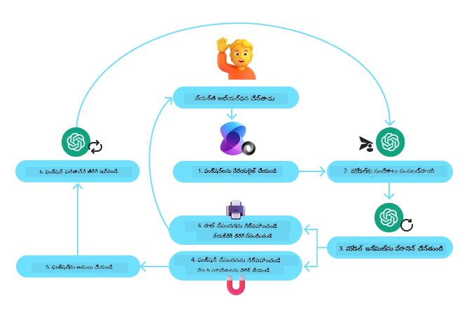
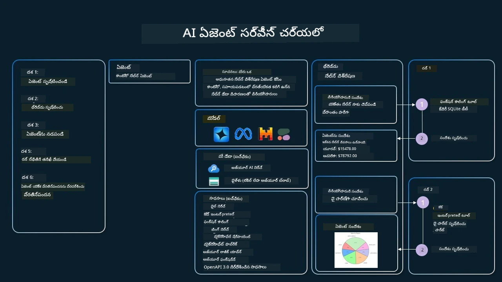

[](https://youtu.be/vieRiPRx-gI?si=cEZ8ApnT6Sus9rhn)

> _(ఈ పాఠం వీడియోను వీక్షించడానికి పై చిత్రంపై క్లిక్ చేయండి)_

# టూల్ వాడకం డిజైన్ ప్యాటర్న్

టూల్స్ ఆసక్తికరమైనవి ఎందుకంటే అవి AI ఏజెంట్లకు విస్తృత పరిధిలో సామర్థ్యాలను ఇవ్వగలవు. ఏజెంట్ పనితీరుకు పరిమితం గానే ఉండే చర్యల సెట్ ని కలిగి ఉండటం కాకుండా, ఒక టూల్ ను చేర్చడం వల్ల ఏజెంట్ ఇప్పుడు విస్తృత పరిధిలో చర్యలను చేయగలుగుతుంది. ఈ అధ్యాయంలో, టూల్ వాడకం డిజైన్ ప్యాటర్న్ గురించి చూద్దాం, ఇది AI ఏజెంట్లు తమ లక్ష్యాలను సాధించడానికి ప్రత్యేక టూల్స్ ను ఎలా ఉపయోగించగలరో వివరిస్తుంది.

## పరిచయం

ఈ పాఠంలో మేము క్రింది ప్రశ్నలకు సమాధానం ఇవ్వాలని చూస్తున్నాం:

- టూల్ వాడకం డిజైన్ ప్యాటర్న్ అంటే ఏమిటి?
- దానికి వర్తించే వినియోగ దృශ්యాలు ఏమిటి?
- డిజైన్ ప్యాటర్న్ ను అమలు చేయడానికి అవసరమైన మూలకాలు/నిర్మాణ బ్లాకులు ఏమిటి?
- విశ్వసనీయ AI ఏజెంట్లను తయారుచేసేందుకు టూల్ వాడకం డిజైన్ ప్యాటర్న్ ఉపయోగించే ప్రత్యేక సూచనలు ఏమిటి?

## నేర్చుకోవాల్సిన లక్ష్యాలు

ఈ పాఠం పూర్తిచేసిన తర్వాత, మీరు చేయగలుగుతారు:

- టూల్ వాడకం డిజైన్ ప్యాటర్న్ మరియు దాని ఉద్దేశాన్ని నిర్వచించండి.
- టూల్ వాడకం డిజైన్ ప్యాటర్న్ వర్తించే వినియోగ దృశ్యాలు గుర్తించండి.
- డిజైన్ ప్యాటర్న్ అమలు చేయడానికి అవసరమైన ముఖ్య మూలకాలు అర్థం చేసుకోండి.
- ఈ డిజైన్ ప్యాటర్న్ ఉపయోగించే AI ఏజెంట్లలో విశ్వసనీయతను నిర్ధారించేందుకు సూచనలు గుర్తించండి.

## టూల్ వాడకం డిజైన్ ప్యాటర్న్ అంటే ఏమిటి?

**టూల్ వాడకం డిజైన్ ప్యాటర్న్** LLMలకు ప్రత్యేక లక్ష్యాలను సాధించేందుకు బాహ్య టూల్స్‌తో పరస్పరం జరిగే సామర్థ్యాన్ని ఇస్తుంది. టూల్స్ అనేవి ఏజెంట్ ద్వారా అమలు చేయగల కోడ్‌లు, అవి చర్యలను నిర్వహించేందుకు ఉపయోగిస్తారు. ఒక టూల్ సాదా ఫంక్షన్ (ఉదా: కేల్క్యులేటర్) కావచ్చు, లేదా స్టాక్ ధరక алу లేదా వాతావరణ సూచన వంటి మూడవ పార్టీ సర్వీసులకు API కాల్ కావచ్చు. AI ఏజెంట్ల సందర్భంలో, టూల్స్ మోడల్-సృష్టించిన ఫంక్షన్ కాల్స్ ప్రత్యుత్తరంగా ఏజెంట్లు అమలుచేయడానికి డిజైన్ చేయబడ్డాయి.

## దానికి వర్తించే వినియోగ దృశ్యాలు ఏమిటి?

AI ఏజెంట్లకు కాంప్లెక్స్ పనులు పూర్తిచేయడానికి, సమాచారం పొందడానికి లేదా నిర్ణయాలు తీసుకోవడానికి టూల్స్ ఉపయోగించుకోవచ్చు. టూల్ వాడకం డిజైన్ ప్యాటర్న్ బాహ్య వ్యవస్థలతో డైనమిక్ పరస్పర చర్య అవసరం ఉన్న సందర్భాలలో ఉదాహరణకు డేటాబేసులు, వెబ్ సర్వీసులు లేదా కోడ్ ఇంటర్ప్రెటర్లు వంటి సందర్భాల్లో తరచుగా ఉపయోగిస్తారు. ఈ సామర్థ్యం క్రింది వినియోగ దృశ్యాలకు ఉపయోగకరంగా ఉంటుంది:

- **డైనమిక్ సమాచారం పొందడం:** ఏజెంట్లు బాహ్య APIs లేదా డేటాబేసులను ప్రశ్నించి తాజా డేటాను పొందగలవు (ఉదా: డేటా విశ్లేషణకు SQLite డేటాబేస్‌ను ప్రశ్నించడం, స్టాక్ ధరలు లేదా వాతావరణ సమాచారాన్ని తీసుకోవడం).
- **కోడ్ అమలు మరియు అనువాదం:** ఏజెంట్లు గణిత సమస్యలను పరిష్కరించడానికి, నివేదికలు తయారు చేయడానికి లేదా సిమ్యులేషన్లు నిర్వహించడానికి కోడ్ లేదా స్క్రిప్ట్స్ అమలుచేయగలవు.
- **వర్క్ ఫ్లో ఆటోమేషన్:** టాస్క్ షెడ్యూలర్స్, ఇమెయిల్ సేవలు లేదా డేటా పైప్లైన్ల వంటి టూల్స్‌ను సమగ్రపరచడం ద్వారా పునరావృత లేదా బహుళ-దశ వర్క్‌ఫ్లోలను ఆటోమేట్ చేయడం.
- **గ్రాహక మద్దతు:** ఏజెంట్లు CRM వ్యవస్థలు, టికెటింగ్ ప్లాట్‌ఫారమ్‌లు లేదా నోలెడ్జ్ బేస్‌లతో పరస్పరం చేసి వినియోగదారుల ప్రశ్నలను పరిష్కరించగలవు.
- **కంటెంట్ సృష్టి మరియు ఎడిటింగ్:** ఏజెంట్లు వ్యాకరణ శాస్త్రకులు, టెక్స్ట్ సమారాంశకులు లేదా కంటెంట్ భద్రత వాలిడేటర్ల వంటి టూల్స్‌ను ఉపయోగించి కంటెంట్ సృష్టి పనులకు సహాయం చేయగలవు.

## టూల్ వాడకం డిజైన్ ప్యాటర్న్ అమలు చేయడానికి అవసరమైన మూలకాలు/నిర్మాణ బ్లాకులు ఏమిటి?

ఈ నిర్మాణ బ్లాకులు AI ఏజెంట్‌కి విస్తృత పరిధిలో పనులు చేయడానికి వీలుగా ఉంటాయి. టూల్ వాడకం డిజైన్ ప్యాటర్న్ అమలు చేయడానికి అవసరమైన కీలక మూలకాల గురించి చూద్దాం:

- **ఫంక్షన్/టూల్ స్కీమాలు**: అందుబాటులో ఉన్న టూల్స్ యొక్క వివరమైన నిర్వచనాలు, ఇందులో ఫంక్షన్ పేరు, ఉద్దేశ్యం, అవసరమైన పారామీటర్లు మరియు ఆశించిన అవుట్పుట్లు ఉంటాయి. ఈ స్కీమాలు LLMకు ఏ టూల్స్ అందుబాటులో ఉన్నాయో, చెలామణి కావాల్సిన సరైన అభ్యర్థనలను ఎలా నిర్మించాలో అర్థం చేసుకోవడానికి సహాయపడతాయి.

- **ఫంక్షన్ అమలు తర్కం**: వినియోగదారు ఉద్దేశ్యం మరియు సంభాషణ సందర్భాల ఆధారంగా టూల్స్ ఎప్పుడు మరియు ఎలా పిలవబడతాయో నియంత్రిస్తుంది. ఇందులో ప్లానర్ మాడ్యూల్స్, రౌటింగ్ మెకానిజంలు లేదా పరిస్థితుల ఆధారంగా మారే స్రవంతులు ఉండవచ్చు.

- **సందేశాల నిర్వహణ వ్యవస్థ**: వినియోగదారుల ఇన్‌పుట్స్, LLM ప్రతిస్పందనలు, టూల్ కాల్స్ మరియు అవుట్పుట్ల మధ్య సంభాషణ ప్రవాహాన్ని నిర్వహించే భాగాలు.

- **టూల్ ఇంటిగ్రేషన్ ఫ్రేమ్‌వర్క్**: ఏజెంట్ ను వివిధ టూల్స్ తో కలిపే మౌలిక సదుపాయం, అవి సాధారణ ఫంక్షన్లు కావచ్చు లేదా సంక్లిష్ట బాహ్య సేవలు కావచ్చు.

- **లోపాలు నిర్వహణ & ధృవీకరణ**: టూల్ అమలులో విఫలమయ్యే పరిస్థితుల నిర్వహణ, పారామీటర్ల ధృవీకరణ, ఆశ్చర్యకరమైన స్పందనల నిర్వహణ యంత్రాంగాలు.

- **స్టేట్ మేనేజ్‌మెంట్**: సంభాషణ సందర్భాన్ని, మునుపటి టూల్ పరస్పర చర్యలను, మరియు పర్సిస్టెంట్ డేటాను ట్రాక్ చేస్తుంది, బహుళ-తొరల పరస్పర చర్యలపై సంతులనం ఉండేలా చేస్తుంది.

తరువాత, ఫంక్షన్/టూల్ కాలింగ్ గురించి మరింత వివరంగా చూద్దాం.
 
### ఫంక్షన్/టూల్ కాలింగ్

ఫంక్షన్ కాలింగ్ అనేది మేము పెద్ద భాషా నమూనాలు (LLMs) ను టూల్స్ తో పరస్పరం చేసేందుకు ప్రధాన మార్గం. మీరు తరచుగా 'ఫంక్షన్' మరియు 'టూల్' అనే పదాలను సమానార్థకంగా ఉపయోగిస్తారని చూడవచ్చు, ఎందుకంటే 'ఫంక్షన్లు'(పునర్వినియోగనీయ కోడ్ బ్లాకులు) ఏజెంట్లు పనులు చేయడానికి ఉపయోగించే 'టూల్' లు. ఒక ఫంక్షన్ కోడ్ ను పిలవడానికి LLM వినియోగదారు అభ్యర్థనను ఫంక్షన్స్ వివరణతో పోల్చాలి. దీని కోసం అందుబాటులో ఉన్న అన్ని ఫంక్షన్లు వివరణలతో కూడిన స్కీమా LLMకి పంపబడుతుంది. ఆ తరువాత LLM పని కోసం సరైన ఫంక్షన్ ఎంచుకుని దాని పేరు మరియు ఆర్గ్యుమెంట్లను తిరిగి ఇస్తుంది. ఆ ఫంక్షన్ పిలవబడుతుంది, దాని స్పందన LLMకి తిరిగి పంపబడుతుంది, ఆ సమాచారంతో LLM వినియోగదారుడి అభ్యర్థనకు ప్రతిస్పందిస్తుంది.

డెవలపర్లకు ఏజెంట్ల కోసం ఫంక్షన్ కాలింగ్ ను అమలు చేయడానికి, మీకు అవసరం:

1. ఫంక్షన్ కాలింగ్ ను మద్దతిచ్చే LLM మోడల్
2. ఫంక్షన్ల వివరణలతో కూడిన స్కీమా
3. వివరణ ఇచ్చిన ప్రతి ఫంక్షన్‌కు కోడ్

నగరంలో ప్రస్తుత సమయం పొందడం ఉదాహరణగా తీసుకుని చూద్దాం:

1. **ఫంక్షన్ కాలింగ్ మద్దతు ఉన్న LLM ను ప్రారంభించండి:**

    అన్ని మోడల్స్ ఫంక్షన్ కాలింగ్ మద్దతు ఇవ్వవు, అందువల్ల మీరు ఉపయోగిస్తున్న LLM ఇదేం మద్దతు ఇస్తుందో పరిశీలించడం ముఖ్యం.     <a href="https://learn.microsoft.com/azure/ai-services/openai/how-to/function-calling" target="_blank">Azure OpenAI</a> ఫంక్షన్ కాలింగ్ మద్దతు ఇస్తుంది. మేము OpenAI క్లయింట్‌ను Azure OpenAI **Responses API** (స్థిరమైన `/openai/v1/` ఎండ్‌పాయింట్ — `api_version` అవసరం లేదు) పై ప్రారంభించడం మొదలుపెట్టవచ్చు.

    ```python
    # Azure OpenAI (ప్రతిస్పందనలు API, v1 ఎండ్‌పాయింట్) కోసం OpenAI క్లయింట్‌ను ప్రారంభించండి
    client = OpenAI(
        base_url=f"{os.environ['AZURE_OPENAI_ENDPOINT'].rstrip('/')}/openai/v1/",
        api_key=os.environ["AZURE_OPENAI_API_KEY"],
    )
    deployment_name = os.environ["AZURE_OPENAI_DEPLOYMENT"]
    ```

1. **ఫంక్షన్ స్కీమా సృష్టించండి**:

    ఫంక్షన్ పేరు, ఫంక్షన్ ఏమి చేస్తుంది అనే వివరణ, ఫంక్షన్ పారామీటర్ల పేర్లు మరియు వివరణలు ఉన్న JSON స్కీమాను ఇప్పుడు నిర్వచించబడుతుంది.
    ఆ స్కీమాను మరియు వినియోగదారుడి అభ్యర్థన (సాన్ ఫ్రాన్సిస్కోలో సమయం తెలుసుకోవడం) క్లయింట్ కు పంపబడుతుంది. ముఖ్యమైన విషయం ఏమిటంటే, **టూల్ కాల్** ప్రత్యుత్తరం గా వస్తుంది, ప్రశ్నకు తుది సమాధానం కాదు. మునుపటి ప్రకారం, LLM పని కోసం ఎంచుకున్న ఫంక్షన్ పేరు మరియు దానికి ఇచ్చే ఆర్గ్యుమెంట్లు తిరిగి పంపుతుంది.

    ```python
    # మోడల్ కోసం ఫంక్షన్ వివరణ చదవడానికి (Responses API ఫ్లాట్ టూల్ ఫార్మాట్)
    tools = [
        {
            "type": "function",
            "name": "get_current_time",
            "description": "Get the current time in a given location",
            "parameters": {
                "type": "object",
                "properties": {
                    "location": {
                        "type": "string",
                        "description": "The city name, e.g. San Francisco",
                    },
                },
                "required": ["location"],
            },
        }
    ]
    ```
   
    ```python
  
    # ప్రారంభ వినియోగదారు సందేశం
    messages = [{"role": "user", "content": "What's the current time in San Francisco"}]

    # మొదటి API కాల్: మోడల్‌ను ఫంక్షన్‌ను ఉపయోగించమని అడుగు
    response = client.responses.create(
        model=deployment_name,
        input=messages,
        tools=tools,
        tool_choice="auto",
        store=False,
    )

    # స్పందన API ఫంక్షన్_కాల్ అంశాలను response.output లోని టూల్ కాల్స్ గా తిరిగి ఇస్తుంది.
    # వాటిని సవాల్‌లో జతచేయండి కాబట్టి మోడల్ కి తదుపరి మలుపులో పూర్తి సందర్భం ఉంటుంది.
    messages += response.output

    print("Model's response:")
    print(response.output)
  
    ```

    ```bash
    Model's response:
    [ResponseFunctionToolCall(arguments='{"location":"San Francisco"}', call_id='call_pOsKdUlqvdyttYB67MOj434b', name='get_current_time', type='function_call')]
    ```
  
1. **పని చేసే ఫంక్షన్ కోడ్**:

    ఇప్పుడు LLM ఎంచుకున్న ఫంక్షన్ అమలు చేయాల్సిన కోడ్‌ను పూర్తి చేసి అమలుచేయాలి.
    మనం సాంకేతికంగా ప్రస్తుత సమయం పొందడానికి Python కోడ్ కూడా తయారు చేయాలి. అలాగే response_message నుండి పేరును మరియు ఆర్గ్యుమెంట్లను తీసుకోవడం కోసం కుడా కోడ్ రాయాలి.

    ```python
      def get_current_time(location):
        """Get the current time for a given location"""
        print(f"get_current_time called with location: {location}")  
        location_lower = location.lower()
        
        for key, timezone in TIMEZONE_DATA.items():
            if key in location_lower:
                print(f"Timezone found for {key}")  
                current_time = datetime.now(ZoneInfo(timezone)).strftime("%I:%M %p")
                return json.dumps({
                    "location": location,
                    "current_time": current_time
                })
      
        print(f"No timezone data found for {location_lower}")  
        return json.dumps({"location": location, "current_time": "unknown"})
    ```

     ```python
    # ఫంక్షన్ కాల్స్‌ను నిర్వహించండి
    tool_calls = [item for item in response.output if item.type == "function_call"]
    if tool_calls:
        for tool_call in tool_calls:
            if tool_call.name == "get_current_time":

                function_args = json.loads(tool_call.arguments)

                time_response = get_current_time(
                    location=function_args.get("location")
                )

                # టూల్ ఫలితాన్ని function_call_output అంశంగా తిరిగి ఇవ్వండి
                messages.append({
                    "type": "function_call_output",
                    "call_id": tool_call.call_id,
                    "output": time_response,
                })
    else:
        print("No tool calls were made by the model.")

    # రెండవ API కాల్: మోడల్ నుండి తుది ప్రతిస్పందన పొందండి
    final_response = client.responses.create(
        model=deployment_name,
        input=messages,
        tools=tools,
        store=False,
    )

    return final_response.output_text
     ```

     ```bash
      get_current_time called with location: San Francisco
      Timezone found for san francisco
      The current time in San Francisco is 09:24 AM.
     ```

ఫంక్షన్ కాలింగ్ అనేది ఎక్కువ భాగం లేదా అన్ని ఏజెంట్ టూల్ వాడకం డిజైన్‌కి యదార్థమవు హృదయభాగం, అయితే దీన్ని ప్రారంభం నుండి అమలు చేయడం కొన్నిసార్లు సవాలు కావచ్చు.
మనం [పాఠం 2](../../../02-explore-agentic-frameworks) లో నేర్చుకున్నట్టు ఏజెంటిక్ ఫ్రేమ్‌వర్క్స్ ముందు-నిర్మిత నిర్మాణ బ్లాకులను అందజేస్తాయి, వాటి ద్వారా టూల్ వాడకాన్ని అమలు చేయడం సులభమవుతుంది.
 
## ఏజెంటిక్ ఫ్రేమ్‌వర్క్స్ తో టూల్ వాడకం ఉదాహరణలు

వివిధ ఏజెంటిక్ ఫ్రేమ్‌వర్క్స్ ఉపయోగించి టూల్ వాడకం డిజైన్ ప్యాటర్న్ ఎలా అమలు చేయవచ్చో కొన్ని ఉదాహరణలు ఇక్కడ ఉన్నాయి:

### Microsoft ఏజెంట్ ఫ్రేమ్‌వర్క్

<a href="https://learn.microsoft.com/azure/ai-services/agents/overview" target="_blank">Microsoft ఏజెంట్ ఫ్రేమ్‌వర్క్</a> AI ఏజెంట్లు నిర్మించడానికి ఓపెన్-సోర్స్ ఫ్రేమ్‌వర్క్. ఇది పని కోసం ఫంక్షన్ కాలింగ్‌ను సులభతరం చేస్తుంది, మీరు టూల్స్‌ను Python ఫంక్షన్లుగా `@tool` డెకొరేటర్‌తో నిర్వచించవచ్చు. ఈ ఫ్రేమ్‌వర్క్ మోడల్ మరియు మీ కోడ్ మధ్య కమ్యూనికేషన్ నిర్వహిస్తుంది. ఇది `FoundryChatClient` ద్వారా ఫైల్ సర్చ్ మరియు కోడ్ ఇంటర్ప్రెటర్ వంటి ముందుగానే తయారు చేసిన టూల్స్‌కు యాక్సెస్ కూడా ఇస్తుంది.

క్రింది డయాగ్రామ్ Microsoft ఏజెంట్ ఫ్రేమ్‌వర్క్‌తో ఫంక్షన్ కాలింగ్ ప్రక్రియను చూపిస్తుంది:



Microsoft ఏజెంట్ ఫ్రేమ్‌వర్క్‌లో, టూల్స్ ను డెకొరేటెడ్ ఫంక్షన్స్ గా నిర్వచిస్తారు. మునుపు చూశిన `get_current_time` ఫంక్షన్‌ను `@tool` డెకొరేటర్ ఉపయోగించి టూల్‌గా మార్చవచ్చు. ఫ్రేమ్‌వర్క్ ఆటోమేటిక్‌గా ఫంక్షన్ మరియు దాని పారామీటర్లను సీరియలైజ్ చేసి, LLMకి పంపించేందుకు స్కీమాను సృష్టిస్తుంది.

```python
import os
from agent_framework import tool
from agent_framework.foundry import FoundryChatClient
from azure.identity import AzureCliCredential

@tool(approval_mode="never_require")
def get_current_time(location: str) -> str:
    """Get the current time for a given location"""
    ...

# క్లయింట్‌ను సృష్టించండి
provider = FoundryChatClient(
    project_endpoint=os.environ["AZURE_AI_PROJECT_ENDPOINT"],
    model=os.environ["AZURE_AI_MODEL_DEPLOYMENT_NAME"],
    credential=AzureCliCredential(),
)

# ఏజెంట్‌ను సృష్టించండి మరియు ఉపకరణంతో నడపండి
agent = provider.as_agent(name="TimeAgent", instructions="Use available tools to answer questions.", tools=get_current_time)
response = await agent.run("What time is it?")
```
  
### Microsoft Foundry ఏజెంట్ సర్వీస్

<a href="https://learn.microsoft.com/azure/ai-services/agents/overview" target="_blank">Microsoft Foundry ఏజెంట్ సర్వీస్</a> అభివృద్ధికర్తలకు ఆధారభూత కంప్యూట్ మరియు స్టోరేజ్ వనరులను నిర్వహించాల్సిన అవసరం లేకుండా సురక్షితంగా, నాణ్యతగల, విస్తరించదగిన AI ఏజెంట్లను నిర్మించడానికి, పంపిణీ చేయడానికి, స్కేలు చేయడానికి రూపొందించిన నూతన ఏజెంటిక్ ఫ్రేమ్‌వర్క్. ఇది ఎన్టర్ప్రైజ్ అప్లికేషన్లక particularlyా ఉపయోగకరం, ఎందుకంటే ఇది పూర్తి నిర్వహణ సర్వీస్ తో ఎంటర్ప్రైజ్ గ్రేడ్ సెక్యూరిటీని అందిస్తుంది.

LLM API ని నేరుగా ఉపయోగించడంకంటే Microsoft Foundry Agent Service కొన్ని లాభాలను ఇస్తుంది, అందులో:

- ఆటోమేటిక్ టూల్ కాలింగ్ – టూల్ కాల్ ని అనలైజ్ చేసి, పిలిచి, స్పందన నిర్వహించే అవసరం లేదు; ఇది ఇప్పుడు సర్వర్-వైపు జరుగుతుంది
- సురక్షితంగా నిర్వహింపబడిన డేటా – మీ స్వంత సంభాషణ స్థితిని నిర్వహించడానికి బదులు, మీరు థ్రెడ్‌లపై మెసేజ్ హిస్టరీని సేకరించవచ్చు
- అవుట్-ఆఫ్-బాక్స్ టూల్స్ – Bing, Azure AI Search, Azure Functions లాంటి డేటా మూలాలతో పరస్పరం కావడానికి టూల్స్.

Microsoft Foundry Agent Service‌లో లభ్యమయ్యే టూల్స్ రెండు వర్గాలుగా విభజించవచ్చు:

1. జ్ఞాన టూల్స్:
    - <a href="https://learn.microsoft.com/azure/ai-services/agents/how-to/tools/bing-grounding?tabs=python&pivots=overview" target="_blank">Bing Search‌తో గ్రాండింగ్</a>
    - <a href="https://learn.microsoft.com/azure/ai-services/agents/how-to/tools/file-search?tabs=python&pivots=overview" target="_blank">ఫైల్ సర్చ్</a>
    - <a href="https://learn.microsoft.com/azure/ai-services/agents/how-to/tools/azure-ai-search?tabs=azurecli%2Cpython&pivots=overview-azure-ai-search" target="_blank">Azure AI Search</a>

2. క్రియాత్మక టూల్స్:
    - <a href="https://learn.microsoft.com/azure/ai-services/agents/how-to/tools/function-calling?tabs=python&pivots=overview" target="_blank">ఫంక్షన్ కాలింగ్</a>
    - <a href="https://learn.microsoft.com/azure/ai-services/agents/how-to/tools/code-interpreter?tabs=python&pivots=overview" target="_blank">కోడ్ ఇంటర్ప్రెటర్</a>
    - <a href="https://learn.microsoft.com/azure/ai-services/agents/how-to/tools/openapi-spec?tabs=python&pivots=overview" target="_blank">OpenAPI నిర్వచించిన టూల్స్</a>
    - <a href="https://learn.microsoft.com/azure/ai-services/agents/how-to/tools/azure-functions?pivots=overview" target="_blank">Azure Functions</a>

ఏజెంట్ సర్వీస్ ఈ టూల్స్ ను `toolset` గా కలిపి ఉపయోగించడానికి సహాయపడుతుంది. ఇది సంభాషణ నుండి వచ్చిన సందేశాల చరిత్రను ట్రాక్ చేసే `threads` ను కూడా ఉపయోగిస్తుంది.

మీరు Contoso అనే కంపెనీలో సేల్స్ ఏజెంట్ అని ఊహించుకోండి. మీరు మీ సేల్స్ డేటా గురించి ప్రశ్నలకు సమాధానం చెప్పగల సంభాషణాత్మక ఏజెంట్ తయారు చేయాలనుకుంటున్నారు.

క్రింది చిత్రం Microsoft Foundry Agent Service ఉపయోగించి మీ సేల్స్ డేటాను విశ్లేషించే విధానాన్ని చూపిస్తుంది:



సర్వీస్ తో ఈ టూల్స్ ను ఉపయోగించడానికి క్లయింట్ సృష్టించి టూల్ లేదా టూల్‌సెట్ ను నిర్దేశించవచ్చు. అలాంటి అమలు కొరకు క్రింది Python కోడ్ ఉపయోగించవచ్చు. LLM ఈ టూల్సెట్ ను చూసి వినియోగదారు సృష్టించిన ఫంక్షన్ `fetch_sales_data_using_sqlite_query` లేదా ముందుగా తయారు చేసిన కోడ్ ఇంటర్ప్రెటర్ ను వినియోగదారి అభ్యర్థన ఆధారంగా ఎంచుకుంటుంది.

```python 
import os
from azure.ai.projects import AIProjectClient
from azure.identity import DefaultAzureCredential
from fetch_sales_data_functions import fetch_sales_data_using_sqlite_query # fetch_sales_data_using_sqlite_query ఫంక్షన్‌ను fetch_sales_data_functions.py ఫైల్‌లో కనుగొనవచ్చు.
from azure.ai.projects.models import ToolSet, FunctionTool, CodeInterpreterTool

project_client = AIProjectClient.from_connection_string(
    credential=DefaultAzureCredential(),
    conn_str=os.environ["PROJECT_CONNECTION_STRING"],
)

# టూల్‌సెట్‌ను ప్రారంభించండి
toolset = ToolSet()

# fetch_sales_data_using_sqlite_query ఫంక్షన్‌తో ఫంక్షన్ కాలింగ్ ఏజెంట్‌ను ప్రారంభించి దీని‌ను టూల్‌సెట్‌లో చేర్చండి
fetch_data_function = FunctionTool(fetch_sales_data_using_sqlite_query)
toolset.add(fetch_data_function)

# కోడ్ ఇంటర్ప్రెటర్ టూల్‌ను ప్రారంభించి దీన్ని టూల్‌సెట్‌లో చేర్చండి.
code_interpreter = CodeInterpreterTool()toolset.add(code_interpreter)

agent = project_client.agents.create_agent(
    model="gpt-4o-mini", name="my-agent", instructions="You are helpful agent", 
    toolset=toolset
)
```

## విశ్వసనీయ AI ఏజెంట్లను నిర్మించడానికి టూల్ వాడకం డిజైన్ ప్యాటర్న్ ఉపయోగించేటప్పుడు ప్రత్యేక సూచనలు ఏమిటి?

LLMలచే డైనమిక్‌గా రూపొందించబడే SQLపై సాధారణమైన ఆందోళన సెక్యూరిటీ సంబంధిపడింది, ముఖ్యంగా SQL ఇంజెక్షన్ లేదా దుష్ట చర్యల ప్రమాదం, ఉదా: డేటాబేస్‌ను డ్రాప్ చేయడం లేదా దాన్ని మార్చడము. ఈ ఆందోళనలను సక్రమంగా డేటాబేస్ యాక్సెస్ అనుమతులను సెట్టింగ్ చేసાવી తగ్గించవచ్చు. చాలా డేటాబేసులలో ఇది డేటాబేస్‌ను రీడ్-ఒన్లీగా నియంత్రించడం ద్వారా జరుగుతుంది. PostgreSQL లేదా Azure SQL వంటి డేటాబేస్ సేవల కోసం యాప్ కి రీడ్-ఒన్లీ (SELECT) రోల్ ఇవ్వాలి.

యాప్ ను సురక్షిత వాతావరణంలో నడపడం మరింత రక్షణను పెంపొందిస్తుంది. ఎంటర్ప్రైజ్ పరిస్థితులలో, డేటాను ఆపరేషనల్ సిస్టమ్స్ నుండి రీడ్-ఒన్లీ డేటాబేస్ లేదా డేటా వెరహౌస్‌లోకి ఎక్స్‌ట్రాక్ట్ చేసి మార్పిడి చేస్తారు, సులభమైన స్కీమాతో. ఈ విధానం డేటా సురక్షితంగా ఉండటానికి, పనితీరు మరియు ప్రాప్యత కోసం ఆప్టిమైజ్ చేయబడటానికి మరియు యాప్ కి పరిమితం చేసిన, రీడ్-ఒన్లీ యాక్సెస్ ఉండటానికి హామీ ఇస్తుంది.

## నమూనా కోడ్లు

- Python: [ఏజెంట్ ఫ్రేమ్‌వర్క్](./code_samples/04-python-agent-framework.ipynb)
- .NET: [ఏజెంట్ ఫ్రేమ్‌వర్క్](./code_samples/04-dotnet-agent-framework.md)

## టూల్ వాడకం డిజైన్ ప్యాటర్న్ల గురించి మరిన్ని ప్రశ్నలున్నాయా?

ఇతర అధ్యయనార్థులతో కలసి Microsoft Foundry Discord లో చేరండి, ఆఫీస్ గంటలకు హాజరు అవ్వండి, మరియు మీ AI ఏజెంట్ల ప్రశ్నలకు సమాధానం పొందండి.

## అదనపు వనరులు

- <a href="https://microsoft.github.io/build-your-first-agent-with-azure-ai-agent-service-workshop/" target="_blank">Azure AI ఏజెంట్లు సర్వీస్ వర్క్‌షాప్</a>
- <a href="https://github.com/Azure-Samples/contoso-creative-writer/tree/main/docs/workshop" target="_blank">Contoso క్రియేటివ్ రైటర్ మల్టీ-ఏజెంట్ వర్క్‌షాప్</a>
- <a href="https://learn.microsoft.com/azure/ai-services/agents/overview" target="_blank">Microsoft ఏజెంట్ ఫ్రేమ్‌వర్క్ అవలోకనం</a>


## క్రింది పాఠం

[ఎజెంటిక్ డిజైన్ ప్యాటర్న్స్‌ని అర్థం చేసుకోవడం](../03-agentic-design-patterns/README.md)

## తదుపరి పాఠం

[ఎజెంటిక్ RAG](../05-agentic-rag/README.md)

---

<!-- CO-OP TRANSLATOR DISCLAIMER START -->
**అస్వీకరణ**:
ఈ పత్రం AI అనువాద సేవ [Co-op Translator](https://github.com/Azure/co-op-translator) ఉపయోగించి అనువదించబడింది. మేము ఖచ్చితత్వానికి ప్రయత్నిస్తున్నప్పటికీ, ఆటోమేటెడ్ అనువాదాలు తప్పులు లేదా అసమగ్రతలను కలిగి ఉండవచ్చు. దాని స్వదేశ భాషలో ఉన్న అసలు పత్రాన్ని అధికారం కలిగిన మూలంగా పరిగణించాలి. కీలకమైన సమాచారం కోసం, ప్రొఫెషనల్ మానవ అనువాదాన్ని సిఫారసు చేస్తాము. ఈ అనువాదం ఉపయోగం వల్ల కలిగే ఏవైనా అపార్థాలు లేదా తప్పుదారులు కోసం మేము బాధ్యత వహించము.
<!-- CO-OP TRANSLATOR DISCLAIMER END -->