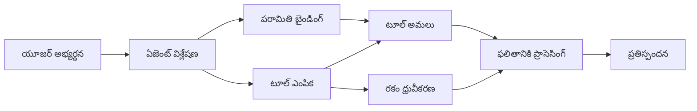

# 🛠️ Azure OpenAI (Responses API) తో అభివృద్ధి చెందిన టూల్ ఉపయోగం (.NET)

## 📋 అభ్యాస లక్ష్యాలు

ఈ నోట్‌బుక్ Microsoft Agent Framework ను .NET లో Azure OpenAI (Responses API) తో ఉపయోగించి ఎంటర్‌ప్రైజ్-స్థాయి టూల్ సమ్మేళన నమూనాలను ప్రదర్శిస్తుంది. మీరు C# యొక్క బలమైన టైపింగ్ మరియు .NET యొక్క ఎంటర్‌ప్రైజ్ లక్షణాలను ఉపయోగించి అనేక నిపుణత కలిగిన టూల్స్ కలిగిన కాంప్లెక్స్ ఏజెంట్లు నిర్మించటం నేర్చుకుంటారు.

### మీరు అర్ధం చేసుకునే అభివృద్ధి చెందిన టూల్ సామర్థ్యాలు

- 🔧 **బహుళ-టూల్ నిర్మాణం**: అనేక నిపుణత కలిగిన సామర్థ్యాలతో ఏజెంట్లను నిర్మించడం
- 🎯 **టైప్-సేఫ్ టూల్ నడపడం**: C# కంపైల్-టైమ్ ధృవీకరణను ఉపయోగించడం
- 📊 **ఎంటర్‌ప్రైజ్ టూల్ నమూనాలు**: ఉత్పత్తి-తయారైన టూల్ డిజైన్ మరియు లోప నిర్వహణ
- 🔗 **టూల్ సంయోజనము**: సంక్లిష్ట వ్యాపార పని ప్రవాహాలకు టూల్స్ కలపడం

## 🎯 .NET టూల్ నిర్మాణం ప్రయోజనాలు

### ఎంటర్‌ప్రైజ్ టూల్ లక్షణాలు

- **కంపైల్-టైమ్ ధ్రువీకరణ**: బలమైన టైపింగ్ ద్వారా టూల్ పరామితుల సరిగా ఉండటం
- **డిపెండెన్సీ ఇంజెక్షన్**: టూల్ నిర్వహణ కోసం IoC కంటెయినర్ సమ్మేళనం
- **Async/Await నమూనాలు**: సరైన వనరుల నిర్వహణతో నిరోధించని టూల్ నడిపించటం
- **సంఘటిత లాగింగ్**: టూల్ నడుపు శ్రద్ధ కోసం బిల్ట్-ఇన్ లాగింగ్ సమ్మేళనం

### ఉత్పత్తి-తయారైన నమూనాలు

- **వ్యత్యాస నిర్వహణ**: టైప్ చేయబడిన వ్యత్యాసాలతో సమగ్ర లోప నిర్వహణ
- **వనరు నిర్వహణ**: సరైన విడదీయడం మరియు మెమరీ నిర్వహణ నమూనాలు
- **ప్రదర్శన పరిశీలన**: బిల్ట్-ఇన్ మెట్రిక్స్ మరియు పనితీరు కట్ల పరికరాలు
- **రూపకల్పన నిర్వహణ**: ధృవీకరణతో టైప్-సేఫ్ రూపకల్పన

## 🔧 సాంకేతిక నిర్మాణం

### కోర్ .NET టూల్ అవయవాలు

- **Microsoft.Extensions.AI**: ఏకీకృత టూల్ అభ్యాసం స్థరము
- **Microsoft.Agents.AI**: ఎంటర్‌ప్రైజ్-స్థాయి టూల్ సేకరణ
- **Azure OpenAI (Responses API)**: కనెక్షన్ పూలింగ్ తో అధిక పనితీరు API క్లయింట్

### టూల్ నడపుట పైప్‌లైన్



## 🛠️ టూల్ వర్గాలు & నమూనాలు

### 1. **డేటా ప్రాసెసింగ్ టూల్స్**

- **ఇన్పుట్ ధృవీకరణ**: డేటా సూచనలతో బలమైన టైపింగ్
- **మార్పిడి ఆపరేషన్లు**: టైప్-సేఫ్ డేటా మార్పు మరియు ఆకృతీకరణ
- **వ్యాపార తర్కం**: డొమైన్-స్పెసిఫిక్ లెక్కలు మరియు విశ్లేషణ టూల్స్
- **అవుట్‌పుట్ ఆకృతీకరణ**: నిర్మిత ప్రతిస్పందన సృష్టి

### 2. **సమ్మిళితం టూల్స్**

- **API కనెక్టర్లు**: HttpClient తో RESTful సేవ సమ్మేళనం
- **డేటాబేస్ టూల్స్**: డేటా యాక్సెస్ కోసం Entity Framework సమ్మేళనం
- **ఫైల్ ఆపరేషన్లు**: ధృవీకరణతో భద్రతగల ఫైల్ సిస్టమ్ ఆపరేషన్లు
- **బాహ్య సేవలు**: మూడవ పార్టీ సేవ సమ్మేళన నమూనాలు

### 3. **ఉపయోగకర టూల్స్**

- **పాఠ్య ప్రాసెసింగ్**: స్ట్రింగ్ మానిప్యులేషన్ మరియు ఆకృతీకరణ ఉపకరణలు
- **తేది/సమయం ఆపరేషన్లు**: సంస్కృతికి అనుగుణమైన తేది/సమయం లెక్కలు
- **గణిత టూల్స్**: ఖచ్చితమైన లెక్కలు మరియు గణాంక ఆపరేషన్లు
- **ధృవీకరణ టూల్స్**: వ్యాపార నియమ ధృవీకరణ మరియు డేటా పరిశీలన

శక్తివంతమైన, టైప్-సేఫ్ టూల్ సామర్థ్యాలతో .NET లో ఎంటర్‌ప్రైజ్-స్థాయి ఏజెంట్లు నిర్మించేందుకు సిద్ధమా? మరి ప్రొఫెషనల్-గ్రేడ్ పరిష్కారాలను రూపకల్పన చేద్దాం! 🏢⚡

## 🚀 ప్రారంభించే విధానం

### ముందస్తు నిబంధనలు

- [.NET 10 SDK](https://dotnet.microsoft.com/download/dotnet/10.0) లేదా అంతకంటే ఎక్కువ
- Azure OpenAI వనరుతో Azure సబ్‌స్క్రిప్షన్ మరియు మోడల్ డిప్లాయ్‌మెంట్ కలిగి ఉన్నది
- [Azure CLI](https://learn.microsoft.com/cli/azure/install-azure-cli) — `az login` తో సైన్ ఇన్ అవ్వండి

### అవసరమైన పర్యావరణ వేరియబుల్‌లు

```bash
# zsh/bash
export AZURE_OPENAI_ENDPOINT=https://<your-resource>.openai.azure.com
export AZURE_OPENAI_DEPLOYMENT=gpt-4o-mini
# ఆపై AzureCliCredential టోకెన్ ను పొందడానికి సైన్ ఇన్ చేయండి
az login
```

```powershell
# పవర్‌షెల్
$env:AZURE_OPENAI_ENDPOINT = "https://<your-resource>.openai.azure.com"
$env:AZURE_OPENAI_DEPLOYMENT = "gpt-4o-mini"
# తరువాత AzureCliCredential టోకెన్ పొందడానికి సైన్ ఇన్ అవ్వండి
az login
```

### నమూనా కోడ్

ఉదాహరణ కోడ్ నడపడానికి,

```bash
# జెడ్‌శ్/బాష్
chmod +x ./04-dotnet-agent-framework.cs
./04-dotnet-agent-framework.cs
```

లేదా dotnet CLI ఉపయోగించి:

```bash
dotnet run ./04-dotnet-agent-framework.cs
```

పూర్తి కోడ్ కోసం [`04-dotnet-agent-framework.cs`](../../../../04-tool-use/code_samples/04-dotnet-agent-framework.cs) చూడండి.

```csharp
#!/usr/bin/dotnet run

#:package Microsoft.Extensions.AI@10.*
#:package Microsoft.Agents.AI.OpenAI@1.*-*
#:package Azure.AI.OpenAI@2.1.0
#:package Azure.Identity@1.13.1

using System.ComponentModel;

using Microsoft.Agents.AI;
using Microsoft.Extensions.AI;

using Azure.AI.OpenAI;
using Azure.Identity;

// Tool Function: Random Destination Generator
// This static method will be available to the agent as a callable tool
// The [Description] attribute helps the AI understand when to use this function
// This demonstrates how to create custom tools for AI agents
[Description("Provides a random vacation destination.")]
static string GetRandomDestination()
{
    // List of popular vacation destinations around the world
    // The agent will randomly select from these options
    var destinations = new List<string>
    {
        "Paris, France",
        "Tokyo, Japan",
        "New York City, USA",
        "Sydney, Australia",
        "Rome, Italy",
        "Barcelona, Spain",
        "Cape Town, South Africa",
        "Rio de Janeiro, Brazil",
        "Bangkok, Thailand",
        "Vancouver, Canada"
    };

    // Generate random index and return selected destination
    // Uses System.Random for simple random selection
    var random = new Random();
    int index = random.Next(destinations.Count);
    return destinations[index];
}

// Azure OpenAI with the Responses API (stable v1 endpoint). Sign in with `az login`.
var azureEndpoint = Environment.GetEnvironmentVariable("AZURE_OPENAI_ENDPOINT")
    ?? throw new InvalidOperationException("AZURE_OPENAI_ENDPOINT is not set.");
var deployment = Environment.GetEnvironmentVariable("AZURE_OPENAI_DEPLOYMENT") ?? "gpt-4o-mini";

var azureClient = new AzureOpenAIClient(new Uri(azureEndpoint), new AzureCliCredential());

// Define Agent Identity and Comprehensive Instructions
// Agent name for identification and logging purposes
var AGENT_NAME = "TravelAgent";

// Detailed instructions that define the agent's personality, capabilities, and behavior
// This system prompt shapes how the agent responds and interacts with users
var AGENT_INSTRUCTIONS = """
You are a helpful AI Agent that can help plan vacations for customers.

Important: When users specify a destination, always plan for that location. Only suggest random destinations when the user hasn't specified a preference.

When the conversation begins, introduce yourself with this message:
"Hello! I'm your TravelAgent assistant. I can help plan vacations and suggest interesting destinations for you. Here are some things you can ask me:
1. Plan a day trip to a specific location
2. Suggest a random vacation destination
3. Find destinations with specific features (beaches, mountains, historical sites, etc.)
4. Plan an alternative trip if you don't like my first suggestion

What kind of trip would you like me to help you plan today?"

Always prioritize user preferences. If they mention a specific destination like "Bali" or "Paris," focus your planning on that location rather than suggesting alternatives.
""";

// Create AI Agent with Advanced Travel Planning Capabilities
// Get the Responses client for the deployment and create the AI agent
// Configure agent with name, detailed instructions, and available tools
// This demonstrates the .NET agent creation pattern with full configuration
AIAgent agent = azureClient
    .GetOpenAIResponseClient(deployment)
    .CreateAIAgent(
        name: AGENT_NAME,
        instructions: AGENT_INSTRUCTIONS,
        tools: [AIFunctionFactory.Create(GetRandomDestination)]
    );

// Create New Conversation Thread for Context Management
// Initialize a new conversation thread to maintain context across multiple interactions
// Threads enable the agent to remember previous exchanges and maintain conversational state
// This is essential for multi-turn conversations and contextual understanding
AgentThread thread = agent.GetNewThread();

// Execute Agent: First Travel Planning Request
// Run the agent with an initial request that will likely trigger the random destination tool
// The agent will analyze the request, use the GetRandomDestination tool, and create an itinerary
// Using the thread parameter maintains conversation context for subsequent interactions
await foreach (var update in agent.RunStreamingAsync("Plan me a day trip", thread))
{
    await Task.Delay(10);
    Console.Write(update);
}

Console.WriteLine();

// Execute Agent: Follow-up Request with Context Awareness
// Demonstrate contextual conversation by referencing the previous response
// The agent remembers the previous destination suggestion and will provide an alternative
// This showcases the power of conversation threads and contextual understanding in .NET agents
await foreach (var update in agent.RunStreamingAsync("I don't like that destination. Plan me another vacation.", thread))
{
    await Task.Delay(10);
    Console.Write(update);
}
```

---

<!-- CO-OP TRANSLATOR DISCLAIMER START -->
**అస్వీకరణ**:
ఈ పత్రం AI అనువాద సేవ [Co-op Translator](https://github.com/Azure/co-op-translator) ఉపయోగించి అనువదించబడింది. మేము ఖచ్చితత్వానికి ప్రయత్నిస్తున్నప్పటికీ, ఆటోమేటెడ్ అనువాదాలు తప్పులు లేదా అసమగ్రతలను కలిగి ఉండవచ్చు. దాని స్వదేశ భాషలో ఉన్న అసలు పత్రాన్ని అధికారం కలిగిన మూలంగా పరిగణించాలి. కీలకమైన సమాచారం కోసం, ప్రొఫెషనల్ మానవ అనువాదాన్ని సిఫారసు చేస్తాము. ఈ అనువాదం ఉపయోగం వల్ల కలిగే ఏవైనా అపార్థాలు లేదా తప్పుదారులు కోసం మేము బాధ్యత వహించము.
<!-- CO-OP TRANSLATOR DISCLAIMER END -->