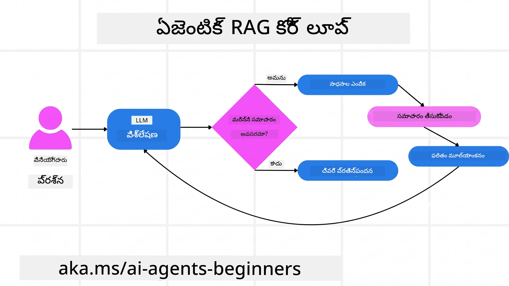
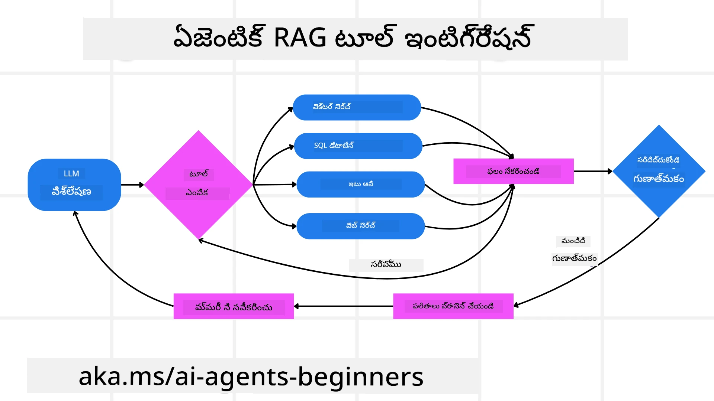
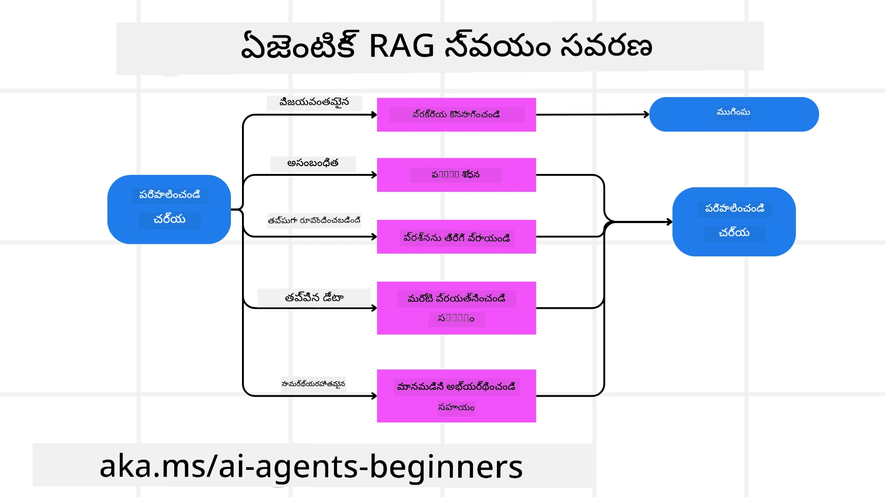
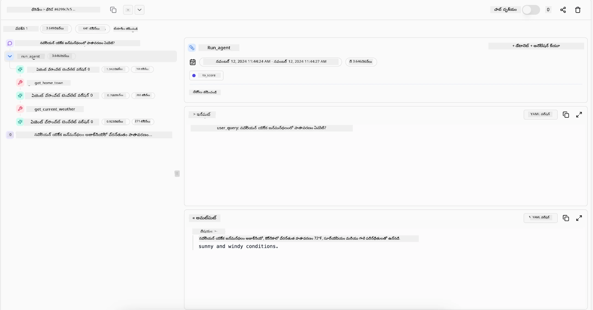

> _(ఈ పాఠం యొక్క వీడియోని చూడడానికి పై చిత్రాన్ని క్లిక్ చేయండి)_

# Agentic RAG

ఈ పాఠం Agentic Retrieval-Augmented Generation (Agentic RAG) యొక్క సమగ్ర అవగాహనను అందిస్తుంది, ఇది పెద్ద భాషా నమూనాలు (LLMs) స్వయం ప్రేరితంగా తమ తదుపరి చర్యలను ప్రణాళిక చేసుకునే కొత్త AI నమూనా, కాగా అవి బాహ్య వనరుల నుండి సమాచారం తీసుకుంటాయి. స్థిరమైన retrieval-తర్వాత-చదవడం నమూనాల కంటే భిన్నంగా, Agentic RAG LLM కి పునరావృత కాలింగ్‌లు, టూల్ లేదా ఫంక్షన్ కాల్‌లు మరియు నిర్మిత అవుట్పుట్స్ కలిసిన ఒక చక్రవర్తనం కలిగి ఉంటుంది. సిస్టమ్ ఫలితాలను మూల్యాంకనం చేసి, ప్రశ్నలను మెరుగుపరిచి, అవసరమైనట్లయితే అదనపు టూల్‌లు ఉపయోగించి, ఈ చక్రాన్ని తృప్తికరమైన పరిష్కారం అందుతున్నంత వరకు కొనసాగిస్తుంది.

## పరిచయం

ఈ పాఠం కవర్ చేస్తుంది

- **Agentic RAG ని అర్థం చేసుకోండి:** పెద్ద భాషా నమూనాలు (LLMs) బాహ్య డేటా వనరుల నుండి సమాచారాన్ని స్వయం ప్రేరితంగా తీసుకుని తదుపరి చర్యలను ప్రణాళిక చేసుకునే కొత్త AI నమూనాను తెలుసుకోండి.
- **Iterative Maker-Checker శైలిని అర్థం చేసుకోండి:** LLM కి పునరావృత కాలింగ్‌లు, టూల్ లేదా ఫంక్షన్ కాలింగ్‌లు, నిర్మిత అవుట్పుట్స్ కలిసిన లూప్ ఆధారంగా సరైనతను మెరుగుపరిచి తప్పుగా మెలికలేని ప్రశ్నలను నిర్వహించడం.
- **ప్రಾಯోగిక అనువర్తనాలను అన్వేషించండి:** సరైనత-మొదలైన వాతావరణాలు, సంక్లిష్ట డేటాబేస్ పరస్పర చర్యలు, విస్తృత వర్క్‌ఫ్లోల వంటి సందర్భాలలో Agentic RAG ఎలా మెరుగ్గా పనిచేస్తుందో తెలుసుకోండి.

## అభ్యాస లక్ష్యం

ఈ పాఠాన్ని పూర్తిచేసిన తర్వాత, మీరు ఎలా చేయాలో/అర్థం చేసుకోగలుగుతారు:

- **Agentic RAG అర్థం చేసుకోవడం:** పెద్ద భాషా నమూనాలు (LLMs) బాహ్య డేటా వనరుల నుండి స్వయం ప్రేరితంగా సమాచారాన్ని తీసుకుంటూ తదుపరి చర్యలను ప్రణాళిక చేసుకునే కొత్త AI నమూనాను తెలుసుకోవడం.
- **Iterative Maker-Checker శైలిని అర్థం చేసుకోవడం:** LLM కి పునరావృత కాలింగ్‌లు, టూల్ లేదా ఫంక్షన్ కాలింగ్‌లు మరియు నిర్మిత అవుట్పుట్స్ తో కూడిన లూప్ ఆకృతిని గ్రహించడం, సరైనతను మెరుగుపరచడానికి మరియు తప్పుగా నిర్మించిన ప్రశ్నలను నిర్వహించడానికి.
- **తార్కిక ప్రక్రియను స్వంతం చేసుకోవడం:** ప్రీ-నిర్వచించబడిన మార్గాలపై ఆధారపడకుండా సమస్యలను ఎలా పరిష్కరించాలో నిర్ణయించుకునే వ్యవస్థ సామర్థ్యాన్ని అర్థం చేసుకోవడం.
- **వర్క్‌ఫ్లో:** ఎజెంటిక్ మోడల్ స్వయంగా మార్కెట్ ట్రెండ్ రిపోర్టులను పరిగణలోకి తీసుకుని, పోటీదారుల డేటాను గుర్తించి, అంతర్గత సేల్స్ మెట్రిక్స్‌లను సమన్వయనం చేసి, ఫలితాలను సంకలనం చేసి వ్యూహాన్ని మూల్యాంకనం చేయడాన్ని అర్థం చేసుకోవడం.
- **Iterative లూప్‌లు, టూల్ సంయోజనం, మరియు మెమరీ:** పునరావృత పరస్పరం చర్య నమూనాపై ఆధారపడే వ్యవస్థ, దశలలో స్థితి మరియు స్మృతిని నిర్వహించి మళ్లీ మళ్లీ లూప్ అయ్యే పరిస్థితులను నివారించి, జ్ఞానపూర్వక నిర్ణయాలు తీసుకోవడం.
- **విఫలం మోడ్‌లను నిర్వహించడం మరియు స్వీయ సవరణ:** పునరావృత పరిశీలనలతో పాటు సేవలను సరిచేయడం, డయాగ్నోస్టిక్ టూల్‌లు ఉపయోగించడం, మరియు మానవ పరిశీలనలోకి తిరిగి వస్తూ శక్తివంతమైన స్వీయ-సవరణ యంత్రాంగాలను పరిశీలించడం.
- **ఏజెన్సీ పరిమితులు:** Agentic RAG యొక్క పరిమితులను అర్థం చేసుకోవడం: డొమైన్-స్పెసిఫిక్ స్వతంత్రత, ఇన్ఫ్రాస్ట్రక్చర్ ఆధారత, మరియు గార్డురేల్స్ గౌరవించడం.
- **ప్రాక్టికల్ ఉపయోగ సందర్భాలు మరియు విలువ:** సరైనత-మొదలైన వాతావరణాలు, సంక్లిష్ట డేటాబేస్ పరస్పర చర్యలు, విస్తృత వర్క్‌ఫ్లోల వంటి సందర్భాలలో Agentic RAG ఎలా మెరుగ్గా పనిచేస్తుందో తెలుసుకోవడం.
- **పాలన, పారదర్శకత, మరియు విశ్వాసం:** వివరణాత్మక తార్కికత్వం, పక్షపాతం నియంత్రణ, మరియు మానవ పరిశీలన వంటి పాలన మరియు పారదర్శకత తత్వాలు గురించి తెలుసుకోవడం.

## Agentic RAG అంటే ఏమిటి?

Agentic Retrieval-Augmented Generation (Agentic RAG) అనేది పెద్ద భాషా నమూనాలు (LLMs) తమ తదుపరి చర్యలను స్వయం ప్రేరితంగా ప్రణాళిక చేసుకునే, బాహ్య వనరుల నుండి సమాచారాన్ని తీసుకునే కొత్త AI నమూనా. స్థిరమైన retrieval-తర్వాత-చదవడం నమూనాల కంటే భిన్నంగా, Agentic RAG LLMకి పునరావృత కాలింగ్‌లు, టూల్ లేదా ఫంక్షన్ కాలింగ్‌లు మరియు నిర్మిత అవుట్పుట్స్ కలిగిన చక్రవర్తనం కలిగి ఉంటుంది. సిస్టమ్ ఫలితాలను మూల్యాంకనం చేసి, ప్రశ్నలను మెరుగుపరిచి, అవసరమైతే అదనపు టూల్‌లను ఉపయోగించి ఈ చక్రాన్ని తృప్తికరమైన పరిష్కారం వరకు కొనసాగిస్తుంది. ఈ పునరావృత "maker-checker" శైలి సరైనత పెంచుతుంది, తప్పుగా నిర్మిత ప్రశ్నలను నిర్వహించి, ఉన్నత-నాణ్యత ఫలితాలను నిర్ధారిస్తుంది.

సిస్టమ్ తన తార్కిక ప్రక్రియను స్వయంగా నిర్వహిస్తుంది, విఫలమైన ప్రశ్నలను పునఃరాయించటం, వేరే retrieval పద్ధతులను ఎంచుకోవడం, Azure AI Search లో వెక్టర్ సెర్చ్, SQL డేటాబేస్‌లు లేదా కస్టమ్ API లాంటి పలు టూల్‌లను ఏకీకృతం చేయడం ద్వారా సమాధానం నిర్ణయించుకొంటుంది. Agentic సిస్టమ్ ప్రత్యేకత అనేది తన తార్కిక ప్రక్రియను స్వంతం చేసుకోవడమే. సాంప్రదాయ RAG అమలు ప్రత్యక్ష మార్గాలపై ఆధారపడే ప్రమాణాలతో ఉన్నప్పటికీ, Agentic సిస్టమ్ సమాచార నాణ్యత ఆధారంగా చర్యల క్రమాన్ని స్వయంగా నిర్ణయిస్తుంది.

## Agentic Retrieval-Augmented Generation (Agentic RAG) నిర్వచనం

Agentic Retrieval-Augmented Generation (Agentic RAG) అనేది AI అభివృద్ధిలో కొత్త నమూనా, దీనిలో LLMలు కేవలం బాహ్య డేటా వనరుల నుండి సమాచారాన్ని తీసుకోలేదు, తమ తదుపరి చర్యలను స్వయంగా ప్రణాళిక చేసుకుంటాయి. retrieval-తర్వాత-చదవడం శైలులు లేదా/scripted ప్రాంప్ట్ సీక్వెన్స్‌ల కంటే భిన్నంగా, Agentic RAG LLMకి పునరావృత కాలింగ్‌లు, టూల్ లేదా ఫంక్షన్ కాలింగ్‌లు మరియు నిర్మిత అవుట్పుట్స్ కలిగిన చక్రభ్యాసాన్ని కలిగి ఉంటుంది. ప్రతి దశలో సిస్టమ్ ఫలితాలను మూల్యాంకనం చేసి, ప్రశ్నలను మెరుగుపరిచి, అవసరమైతే అదనపు టూల్‌లను పిలిచి, తృప్తికర పరిష్కారం సాధించేవరకు ఈ చక్రాన్ని కొనసాగిస్తుంది.

ఈ పునరావృత "maker-checker" శైలి సరైనతను మెరుగుపరిచి, తప్పుగా నిర్మిత structured డేటాబేస్ ప్రశ్నలను (ఉదా: NL2SQL) నిర్వహించి, సమతుల్యమైన, ఉన్నత నాణ్యత ఫలితాలను నిర్ధారిస్తుంది. జాగ్రత్తగా రూపొందించిన ప్రాంప్ట్ చైన్‌లపై మాత్రమే ఆధారపడకుండా, సిస్టమ్ తన తార్కిక ప్రక్రియను స్వయంగా నిర్వహిస్తుంది. విఫలమైన ప్రశ్నలను పునఃరాయించి, వేరే retrieval పద్ధతులను ఎంచుకుని, Azure AI Searchలో వెక్టర్ సెర్చ్, SQL డేటాబేస్‌లు, లేదా కస్టమ్ API లాంటి పలు టూల్‌లను ఏకీకృతం చేసి సమాధానం నిర్ణయిస్తుంది. ఇది అధిక సాంకేతిక పరిజ్ఞానం అవసరమైన అలంకరణ చట్రాల అవసరాన్ని తొలగిస్తుంది. comparatively సింపుల్ "LLM కాల్ → టూల్ ఉపయోగం → LLM కాల్ → …" చక్రం సుద్దిగా మరియు పటిష్టంగా అవుట్పుట్‌లను ఇస్తుంది.

## తార్కిక ప్రక్రియను స్వంతం చేసుకోవడం

ఒక సిస్టమ్‌ను “agentic” గా మార్చేది దాని తార్కిక ప్రక్రియను స్వంతం చేసుకునే సామర్థ్యం. సాంప్రదాయ RAG అమలు తరచుగా మానవులు నమూనాకు ప్రీ-నిర్వచించిన మార్గంపై ఆధారపడి ఉంటుంది: ఏది తీసుకోవాలో మరియు ఎప్పుడు తీసుకోవాలో chain-of-thought. కానీ నిజంగా agentic సిస్టమ్ మొత్తంగా సమస్యను ఎలా ముందుకు తీసుకొనేదో స్వతంత్రంగా నిర్ణయిస్తుంది. ఇది కేవలం script అమలు చేయడం కాదు; అది స్వయం నిర్ణయంతో సమాచార నాణ్యత ఆధారంగా చర్యల క్రమాన్ని ఏర్పరుస్తుంది.

ఉదాహరణకు, ఒక ప్రొడక్ట్ ఫలానికి వ్యూహం సృష్టించమని అడిగితే, అది మొత్తం పరిశోధన మరియు నిర్ణయాక సంజ్ఞలపై ఆధారపడదు. దాని బదులుగా agentic మోడల్ స్వతంత్రంగా నిర్ణయిస్తుంది:

1. Bing Web Grounding ద్వారా ప్రస్తుత మార్కెట్ ట్రెండ్ రిపోర్టులు సేకరించడం
2. Azure AI Search ఉపయోగించి సంబంధిత పోటీదారుల డేటాను గుర్తించడం
3. Azure SQL Database రూపంలో అంతర్గత సేల్స్ మెట్రిక్స్‌లను సమన్వయించడం
4. Azure OpenAI Service ద్వారా సమగ్ర వ్యూహంగా ఫలితాలను సంకలనం చేయడం
5. వ్యూహంలో లోపాలు లేదా అసామరస్యాలు ఉన్నాయా అని మళ్లీ retrieval కలిగి మూల్యాంకనం చేయడం

ఈ అన్ని దశలు—ప్రశ్నలను మెరుగుపరచడం, వనరులను ఎంచుకోవడం, సమాధానం “happy” అయినప్పుడు వరకు పునరావృతం చేయడం—మోడల్ నిర్ణయిస్తుందీ, మానవుల ద్వారా ముందుగా script చేయబడలేదు.

## Iterative లూప్‌లు, టూల్ సంయోజనం, మరియు మెమరీ

Agentic సిస్టమ్ ఒక లూప్ పరస్పర చర్య నమూనాపై ఆధారపడుతుంది:

- **ప్రాథమిక కాల్:** వినియోగదారుడి లక్ష్యం (అంటే వినియోగదారుడి ప్రాంప్ట్) LLMకి అందించబడుతుంది.
- **టూల్ ఆహ్వానం:** నమూనా కొంత సమాచారం లేకపోవడాన్ని గమనించినప్పుడు లేదా అర్థంకాకపోయిన సూచనలు ఉన్నప్పుడు, మరింత సందర్భం సేకరించేందుకు టూల్ లేదా retrieval పద్ధతిని ఎంచుకుంటుంది – ఉదాహరణకి Azure AI Search Hybrid సెర్చ్ లేదా నిర్మిత SQL కాల్.
- **మూల్యాంకనం మరియు మెరుగుదల:** తిరిగి వచ్చిన డేటాను సమీక్షించిన తర్వాత, నమూనా సమాచారం సరిపోతుందా అని నిర్ణయిస్తుంది. సరిపోదని భావిస్తే ప్రశ్నను మెరుగుపరచు, వేరే టూల్ ప్రయత్నించు లేదా దృక్పథాన్ని సరిచేసుకొంటుంది.
- **తృప్తికరమైనదిగా ఎప్పుడու వరకూ పునరావృతం:** నమూనా తుది, పటిష్టమైన సమాధానం ఇస్తుందనుకుంటు వరకు ఈ చక్రం కొనసాగుతుంది.
- **మెమరీ మరియు స్థితి:** వ్యవస్థ దశలు మధ్యలో స్థితి మరియు జ్ఞాపకశక్తిని నిర్వహిస్తుంది, కాబట్టి పునరావృత లూప్‌లు ఎదుర్కోవడానికి ముందు ప్రయత్నాలను గుర్తుపెట్టుకొని, వాటి ఫలితాల ఆధారంగా మెరుగైన నిర్ణయాలు తీసుకుంటుంది.

కాలక్రమేణా, ఇది అభివృద్ధి చెందుతున్న అవగాహన భావనను సృష్టిస్తుంది, మోడల్ సంక్లిష్టమైన, బహుళ దశల పనులను నిర్వహించగలుగుతుంది, ఎప్పటికప్పుడు మనుషుల జోక్యం లేకుండా లేదా ప్రాంప్ట్ మార్చాల్సిన అవసరం లేకుండా.

## విఫలం మోడ్‌లు మరియు స్వీయ సవరణను నిర్వహించడం

Agentic RAG స్వాతంత్ర్యం పటిష్టమైన స్వీయ సవరణ యంత్రాంగాలతో కూడియుంది. సిస్టమ్ బ్లాక్ అయ్యే సందర్భాల్లో—సంబంధం లేనివి ఉన్న పత్రాలు తీసుకునేటప్పుడు లేదా తప్పుగా నిర్మిత ప్రశ్నలు వస్తే:

- **పునరావృతం మరియు పునఃప్రశ్న నాళిక:** తక్కువ విలువ కలిగిన సమాధానాలింటి కాకుండా, నమూనా కొత్త శోధన వ్యూహాలను ప్రయత్నిస్తుంది, డేటాబేస్ ప్రశ్నలను సవరించుకుంటుంది, లేదా ప్రత్యామ్నాయ డేటా సెట్‌లను పరిశీలిస్తుంది.
- **డయాగ్నోస్టిక్ టూల్‌లు ఉపయోగించడం:** సిస్టమ్ తార్కిక దశలను డీబగ్ చేసుకోవడానికి లేదా తిరిగి తీసుకున్న సమాచార సరైనతను ధృవీకరించేందుకు అదనపు ఫంక్షన్‌లు పిలవవచ్చు. Azure AI Tracing వంటి టూల్‌లు పటిష్టమైన అధ్యయనశీలత మరియు పర్యవేక్షణను అందిస్తాయి.
- **మానవ పరిశీలనపై దృష్టిపెట్టడం:** అధిక-స్టేక్ లేదా పునరావృత విఫల పరిస్థితులలో, నమూనా అనిశ్చితిని గుర్తించి మానవ మార్గనిర్దేశం కోరవచ్చు. మానవుల సరిచూసిన ప్రతిక్రియలు అందిన తర్వాత, నమూనా ఆ పాఠాలు మళ్లీ ఉపయోగించుకొని ముందుకు పోతుంది.

ఈ పునరావృత, డైనమిక్ దృష్టికోణం నమూనాకు నిరంతర అభివృద్ధి అవకాశాన్ని ఇస్తుంది, ఇది వనరు తప్పిదాల నుండి నేర్చుకుని మరింత నిబద్ధతగా పనిచేస్తుంది.

## ఏజెన్సీ పరిమితులు

పని లోపల స్వాతంత్ర్యం కలిగినప్పటికీ, Agentic RAG అసలు ఆర్టిఫీషియల్ జనరల్ ఇంటెలిజెన్స్ (AGI) కాదు. దాని “agentic” సామర్థ్యాలు మానవ అభివృద్ధి చేసిన టూల్‌లు, డేటా వనరులు మరియు విధానాలకు పరిమితమైనవి. అది తన టూల్‌లను ఆవిష్కరించలేని, లేదా నిర్దేశిత డొమైన్ సరిహద్దుల బయటకు అడుగు వేయలేని సామర్థ్యం కలదు. దాని బలం ప్రస్తుత వనరులను సక్రమంగా సమన్వయం చేయడంలోనే.

మరింత అభివృద్ధి చెందిన AI రూపాల నుండి ముఖ్యమైన తేడాలు:

1. **డొమైన్-విశిష్ట స్వతంత్రత:** Agentic RAG సిస్టమ్‌లు తెలిసిన డొమైన్‌లో వినియోగదారుడి లక్ష్యాలను సాధించేందుకు ప్రశ్న పునఃరాయింపు లేదా టూల్ ఎంపిక వంటి వ్యూహాలను వినియోగిస్తాయి.
2. **ఇన్ఫ్రాస్ట్రక్చర్ ఆధారితత:** సిస్టమ్ సామర్థ్యాలు అభివృద్ధి చేసిన టూల్‌లు మరియు డేటా సమీకరణలపై ఆధారపడతాయి. మానవ జోక్యం లేకుండా ఈ పరిమితులను దాటి వెళ్లలేదు.
3. **గార్డురేల్స్ గౌరవించడం:** నైతిక మార్గదర్శకాలు, పాటింపు నియమాలు మరియు వ్యాపార విధానాలు చాలా ముఖ్యం. ఏజెంట్ యొక్క స్వేచ్ఛ అన్ని సమయంలో భద్రతా చర్యలు మరియు పర్యవేక్షణ నియమాలచే పరిమితమవుతుంది (అవునా?).

## ప్రాక్టికల్ ఉపయోగ సందర్భాలు మరియు విలువ

Agentic RAG పునరావృత మెరుగుదల మరియు ఖచ్చితత్వం అవసరమైన సందర్భాలలో మెరుగ్గా పనిచేస్తుంది:

1. **సరైనత-ప్రధాన వాతావరణాలు:** పాటింపు పరిశీలనలు, నియంత్రణ విశ్లేషణలు లేదా చట్ట పరిశోధనా సందర్భాలలో, agentic మోడల్ వాస్తవాలు పునరాదర్శించగలదు, అనేక వనరులు సంప్రదించగలదు, మరియు ప్రశ్నలను పునఃరాయించి పూర్తిగా సమీక్షించిన సమాధానాన్ని అందిస్తుంది.
2. **సంక్లిష్ట డేటాబేస్ పరస్పర చర్యలు:** నిర్మిత డేటా పై ప్రశ్నలు తరచుగా విఫలమవ్వడం లేదా సవరణ అవసరం ఉన్నప్పుడు, Azure SQL లేదా Microsoft Fabric OneLake ఉపయోగించి హోస్తొగా ప్రశ్నలను స్వయంగా మెరుగుపరచి వినియోగదారుడి కావడాన్ని తుది retrieval లో అనుసరిస్తుంది.
3. **విస్తృత వర్క్‌ఫ్లోలు:** ఎక్కువ కాలం సాగే సెషన్లు కొత్త సమాచారం వెలుగులోకి వచ్చిన కొద్దీ అభివృద్ధి చెందవచ్చు. Agentic RAG నిరంతరం కొత్త డేటాను చేర్చి వ్యూహాలను మారుస్తూ సమస్య ప్రాంతం గురించి మరింత తెలుసుకుంటుంది.

## పాలన, పారదర్శకత, మరియు విశ్వాసం

ఈ వ్యవస్థలు తార్కిక ప్రక్రియలో మరింత స్వతంత్రమైనప్పుడు, పాలన మరియు పారదర్శకత ముఖ్యంగా అవసరం:

- **వివరణాత్మక తార్కికత్వం:** నమూనా తయారుచేసిన ప్రశ్నల ఆడిట్ ట్రైల్, సంప్రదించిన వనరులు, మరియు తార్కిక దశలను అందించగలదు. Azure AI Content Safety మరియు Azure AI Tracing / GenAIOps వంటి టూల్‌లు పారదర్శకతని కాపాడటంలో మరియు ప్రమాదాలను తగ్గించడంలో సహాయపడతాయి.
- **పక్షపాతం నియంత్రణ మరియు సమతుల్య retrieval:** అభివృద్ధి దారులు retrieval వ్యూహాలను సర్దుబాటు చేసి సమతుల్యమైన, ప్రతినిధి డేటా వనరులు పరిగణలోకి తీసుకోవాలి మరియు Azure Machine Learning ఉపయోగించి అధునాతన డేటా సైన్స్ సంస్థల కోసం అలవాటు చేసిన నమూనాలను ఉపయోగించి పక్షపాతం లేదా వక్రీకరణ మాదిరులు తెలుసుకోవాలి.
- **మానవ పర్యవేక్షణ మరియు పాటింపు:** సున్నితమైన పనుల కోసం, మానవ సమీక్ష కీలకం. Agentic RAG అధిక-స్టేక్ నిర్ణయాలలో మానవ తీర్పును భర్తీ చేయదు—అదును మెరుగుపరచుతుంది మరింత పరిక్షించిన ఎంపికలు అందిస్తూ.

చర్యల స్పష్టమైన రికార్డులను అందించే టూల్‌లు అవసరం. లేకపోతే బహుళ దశల ప్రక్రియలను డీబగ్ చేయటం చాలా కష్టం. దిగువ Literal AI నుండి Agent రన్ ఉదాహరణ చూడండి:

## ముగింపు

Agentic RAG అనేది AI వ్యవస్థలు సంక్లిష్ట, డేటా-సాంద్రత పనులను ఎలా నిర్వహిస్తాయో సహజ అభివృద్ధిని సూచిస్తుంది. లూప్ పరస్పర చర్య నమూనా స్వీకరించడం, స్వతంత్రంగా టూల్‌లను ఎంచుకోవడం, ప్రశ్నలను మెరుగుపరిచి ఉన్నత నాణ్యత ఫలితాన్ని సాధించడం ద్వారా, సిస్టమ్ స్థిరమైన ప్రాంప్ట్ అనుసరణ కంటే మరింత అనుకూలమైన, సందర్భాన్ని బట్టి నిర్ణయాల త్రిభాగ్యకారుడిగా మారుతుందని చూపిస్తుంది. మానవ నిర్మిత ఇన్ఫ్రాస్ట్రక్చర్లు మరియు నైతిక మార్గదర్శకాలతో పరిమితమై ఉన్నా, ఈ agentic సామర్థ్యాలు సంస్థలు మరియు వినియోగదారులకు సమృద్ధిగా, సజీవంగా మరియు చాలా ఉపయోగకరంగా AI పరస్పర చర్యలను అందించగలవు.

### Agentic RAG గురించి మరిన్ని ప్రశ్నలు ఉన్నాయా?

ఇతర అభ్యాసకులతో సమావేశమవడానికి, ఆఫీస్ గంటల సందర్శించేందుకు మరియు మీ AI ఏజెంట్స్ ప్రశ్నలకు సమాధానాలు పొందేందుకు [Microsoft Foundry Discord](https://aka.ms/ai-agents/discord) లో చేరండి.

## అదనపు వనరులు
- <a href="https://learn.microsoft.com/training/modules/use-own-data-azure-openai" target="_blank">Azure OpenAI సేవతో రికవరీ ఆగ్మెంటెడ్ జనరేషన్ (RAG) ను అమలు చేయండి: Azure OpenAI సేవతో మీ స్వంత డేటాను ఎలా ఉపయోగించాలో తెలుసుకోండి. ఈ Microsoft Learn మాడ్యూల్ RAG అమలుపై సంపూర్ణ గైడ్ అందిస్తుంది</a>
- <a href="https://learn.microsoft.com/azure/ai-studio/concepts/evaluation-approach-gen-ai" target="_blank">Microsoft Foundryతో జనరేటివ్ AI అప్లికేషన్లను మూల్యాంకనం: ఈ వ్యాసం Agentic AI అప్లికేషన్లు మరియు RAG ఆర్కిటెక్చర్స్ సహా, ప్రజలకు అందుబాటులో ఉన్న డేటాసెట్‌లపై మోడళ్లను మూల్యాంకనం మరియు పోలిక చేస్తుంది</a>
- <a href="https://weaviate.io/blog/what-is-agentic-rag" target="_blank">Agentic RAG అంటే ఏమిటి | Weaviate</a>
- <a href="https://ragaboutit.com/agentic-rag-a-complete-guide-to-agent-based-retrieval-augmented-generation/" target="_blank">Agentic RAG: ఏజెంట్ ఆధారిత రికవరీ ఆగ్మెంటెడ్ జనరేషన్‌కు సంపూర్ణ మార్గదర్శి – జనరేషన్ RAG నుండి వార్తలు</a>
- <a href="https://huggingface.co/learn/cookbook/agent_rag" target="_blank">Agentic RAG: క్వెరీ రిఫార్మ్యులేషన్ మరియు స్వయం-క్వెరీతో మీ RAG కు టర్బోచార్జ్ ఇవ్వండి! Hugging Face ఓపెన్-సోర్స్ AI వంటపుస్తకం</a>
- <a href="https://youtu.be/aQ4yQXeB1Ss?si=2HUqBzHoeB5tR04U" target="_blank">RAGకి Agentic పొరల్ని జోడించడం</a>
- <a href="https://www.youtube.com/watch?v=zeAyuLc_f3Q&t=244s" target="_blank">జ్ఞాన సహాయకుల భవిష్యత్తు: జెర్రీ ల్యూ</a>
- <a href="https://www.youtube.com/watch?v=AOSjiXP1jmQ" target="_blank">Agentic RAG సిస్టమ్‌లను ఎలా నిర్మించాలి</a>
- <a href="https://ignite.microsoft.com/sessions/BRK102?source=sessions" target="_blank">మీ AI ఏజెంట్లను స్కేల్ చేయడానికి Microsoft Foundry ఏజెంట్ సేవను ఉపయోగించడం</a>

### అకాడమిక్ పేపర్లు

- <a href="https://arxiv.org/abs/2303.17651" target="_blank">2303.17651 స్వయంసవరణ: స్వీయ-ప్రతిస్పందనతో పునర్విచారం</a>
- <a href="https://arxiv.org/abs/2303.11366" target="_blank">2303.11366 రిఫ్లెక్షన్: మౌఖిక వర్తనాత్మక నేర్చుకునే భాషా ఏజెంట్లు</a>
- <a href="https://arxiv.org/abs/2305.11738" target="_blank">2305.11738 CRITIC: పెద్ద భాషా మోడళ్లు సాధన అనుసంధాన సమీక్షతో స్వయంగా సవరణ చేయగలవు</a>
- <a href="https://arxiv.org/abs/2501.09136" target="_blank">2501.09136 Agentic Retrieval-Augmented Generation: Agentic RAG పై సర్వే</a>

## గత పాఠం

[టూల్ ఉపయోగ డిజైన్ నమూనా](../04-tool-use/README.md)

## తదుపరి పాఠం

[నమ్మకమయిన AI ఏజెంట్లను నిర్మించడం](../06-building-trustworthy-agents/README.md)

---

<!-- CO-OP TRANSLATOR DISCLAIMER START -->
**నూలెడింపు**:
ఈ పత్రాన్ని AI అనువాద సేవ [Co-op Translator](https://github.com/Azure/co-op-translator) ఉపయోగించి అనువదించారు. మనం ఖచ్చితత్వానికి ప్రయత్నించినప్పటికీ, స్వయంచాలక అనువాదాలలో తప్పిదాలు లేదా అసమర్థతలు ఉన్నప్పుండచ్చు. మౌలిక పత్రాన్ని దాని స్థానిక భాషలో ప్రామాణిక మూలంగా పరిగణించాలి. కీలకమైన సమాచారం కోసం, నిపుణుల చేతి అనువాదం చేయవలసినది. ఈ అనువాదం ఉపయోగించడం వల్ల ఏర్పడిన ఏదైనా అపార్థాలు లేదా తప్పు అర్థం చేసుకోవడానికి మేము బాధ్యత వహించము.
<!-- CO-OP TRANSLATOR DISCLAIMER END -->