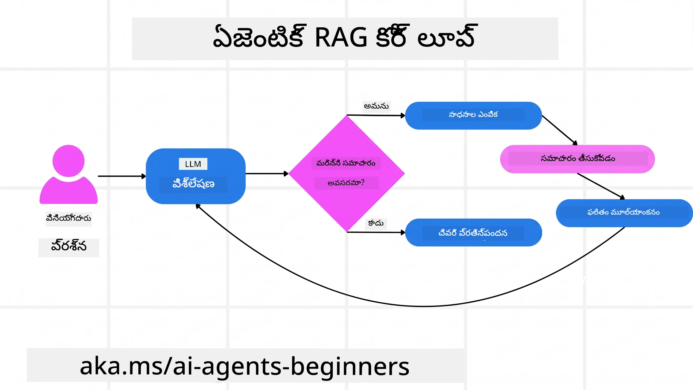
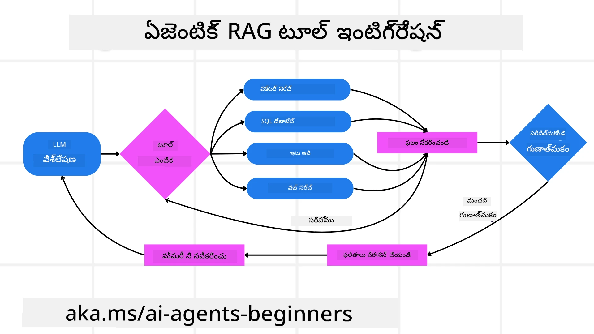
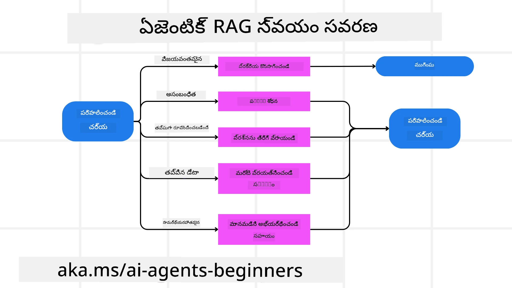
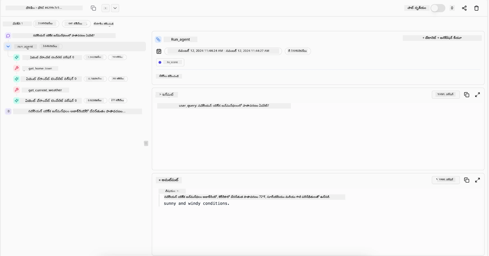

> _(ఈ పాఠం వీడియోని చూడటానికి పై చిత్రాన్ని క్లిక్ చేయండి)_

# ఏజెంటిక్ RAG

ఈ పాఠం ఏజెంటిక్ రిట్రీవల్-ఆగ్మెంటెడ్ జనరేషన్ (Agentic RAG) గురించి సమగ్ర దృష్టికోణాన్ని అందిస్తుంది, ఇది పెద్ద భాషా నమూనాలు (LLMs) స్వతంత్రంగా తదుపరి దశలను ప్లాన్ చేయడం మరియు బయటి మూలాల నుండి సమాచారం పొందడం చేసే అభివృద్ధి చెందుతున్న AI పరిమాణం. స్థిర retrieval-తర్వాత-చదవడపు పద్ధతుల నుండి భిన్నంగా, Agentic RAG LLM కు పునరావృత కాల్స్, టూల్ లేదా ఫంక్షన్ కాల్స్ మరియు నిర్మిత అవుట్పుట్లతో కలిపి జరుగుతుంది. సిస్టమ్ ఫలితాలను అంచనా వేస్తుంది, ప్రశ్నలను మెరుగుపరుస్తుంది, అవసరమైతే అదనపు టూల్స్‌ను పిలుస్తుంది, మరియు ఈ చక్రాన్ని అవసరమైనంత వరకు కొనసాగించి తృప్తికరమైన పరిష్కారాన్ని సాధిస్తుంది.

## పరిచయం

ఈ పాఠం కిందనున్న విషయాలను కవర్ చేస్తుంది

- **ఏజెంటిక్ RAG ని అర్థం చేసుకోండి:** పెద్ద భాషా నమూనాలు (LLMs) స్వతంత్రంగా తమ తదుపరి దశలను ప్లాన్ చేస్తూ బయటి డేటా మూలాల నుండి సమాచారాన్ని పొందే అభివృద్ధి చెందుతున్న AI పరిమాణం గురించిన అధ్యయనం.
- **పునరావృత మేకర్-చెక్కర్ శైలిని గ్రహించండి:** LLM కు పునరావృత కాల్స్ తో పాటు, టూల్ లేదా ఫంక్షన్ కాల్స్ మరియు నిర్మిత అవుట్పుట్ల చక్రాలను అర్థం చేసుకోండి, ఇవి సరిగా పనిచేయడాన్ని మెరుగుపరుస్తాయి మరియు తప్పు రూపంలో వచ్చిన ప్రశ్నలను హ్యాండిల్ చేస్తాయి.
- **వాస్తవ ఉపయోగాలని అన్వేషించండి:** Agentic RAG మెరవడిన సందర్భాలు గుర్తించండి, ఉదాహరణకి సరైనతను తొలి ప్రాధాన్యతగా పెట్టే వాతావరణాలు, సంక్లిష్ట డేటాబేస్ ఇంటరాక్షన్స్ మరియు విస్తృత వర్క్‌ఫ్లోలు.

## నేర్చుకునే లక్ష్యాలు

ఈ పాఠం పూర్తి చేసిన తరువాత, మీరు ఈ క్రింది విషయాలను తెలుసుకోగలుగుతారు/అర్థం చేసుకోగలుగుతారు:

- **ఏజెంటిక్ RAG అర్థం చేసుకోవడం:** పెద్ద భాషా నమూనాలు (LLMs) స్వతంత్రంగా తమ తదుపరి దశలను ప్లాన్ చేస్తూ బయటి డేటా మూలాల నుండి సమాచారాన్ని పొందే అభివృద్ధి చెందిన AI పరిధి.
- **పునరావృత మేకర్-చెక్కర్ శైలి:** LLM కు పునరావృత కాల్స్, టూల్ లేదా ఫంక్షన్ కాల్స్ మరియు నిర్మిత అవుట్పుట్ల యొక్క చక్రాన్ని అర్థం చేసుకోవడం, ఇది సరైనతను మెరుగుపరుస్తుంది మరియు తప్పు రూపంలో వచ్చిన ప్రశ్నలను నిర్వహిస్తుంది.
- **తరువాత చేసే తర్క ప్రక్రియను ఏజెంట్ స్వంతంగా నిర్వర్తించడం:** సిస్టమ్ తన తర్క ప్రక్రియను స్వంతంగా నిర్వహించే సామర్ధ్యాన్ని గ్రహించడం, ఇంగితం లేని మార్గాల మీద ఆధారపడకుండా సమస్యలను పరిష్కరించడానికి నిర్ణయాలు తీసుకోవడం.
- **వర్క్‌ఫ్లో:** ఏజెంటిక్ మోడెల్ స్వతంత్రంగా మార్కెట్ ట్రెండ్ రిపోర్టులను రిటీవ్ చేయడం, పోటీదారుల డేటాను గుర్తించడం, అంతర్గత అమ్మకాల గణాంకాలను సమ్మీలితం చేయడం, కన్సిస్టెంట్ స్ట్రాటజీని సిద్ధం చేయడం మరియు ఆ వ్యూహాన్ని అంచనా వేయడం ఎలా చేసుకుంటుందో అర్థం చేసుకోవడం.
- **పునరావృత చక్రాలు, టూల్ సమ్మేళనం మరియు స్మృతి:** ఒక లూప్‌డ్ ఇంటరాక్షన్ ప్యాటర్న్ మీద ఆధారపడటం, దశలలో స్తితి మరియు స్మృతి నిర్వహించడం, పునరావృత లూపులను నివారించడం మరియు సమర్థ నిర్ణయాలు తీసుకోవడం గురించి నేర్చుకోవడం.
- **విఫలమవుతున్న మోడ్‌లు మరియు స్వీయ సవరణ:** తిరుగులేని మోడ్‌లలో robust self-correction యంత్రాంగాలు, పునర్విశ్లేషించడం, డయాగ్నోస్టిక్ టూల్‌లు ఉపయోగించడం మరియు మానవ పర్యవేక్షణతో fallback అవడం.
- **ఏజెన్సీ పరిమితులు:** ఏజెంటిక్ RAG పరిమితులు, డొమైన్-స్పెసిఫిక్ స్వతంత్రత్వం, ఇన్‌ఫ్రాస్ట్రక్చర్ ఆధారితత్వం మరియు గార్డ్‌రైల్స్ పేరుకుంటూ పర్యవేక్షణ.
- **ప్రాక్టికల్ యూజ్ కాసెస్ మరియు విలువ:** Agentic RAG మెరవిన సందర్భాలు గుర్తించడం, సరైనత ప్రధాని వాతావరణాలు, సంక్లిష్ట డేటాబేస్ ఇంటరాక్షన్స్, మరియు విస్తృత వర్క్‌ఫ్లోలు.
- **పాలన, పారదర్శకత మరియు విశ్వాసం:** పాలన మరియు పారదర్శకత యొక్క ప్రాముఖ్యత, వివరణాత్మక తర్కం, పక్షపాత నియంత్రణ మరియు మానవ పర్యవేక్షణ.

## Agentic RAG అంటే ఏమిటి?

ఏజెంటిక్ రిట్రీవల్-ఆగ్మెంటెడ్ జనరేషన్ (Agentic RAG) అనేది పెద్ద భాషా నమూనాలు (LLMs) స్వతంత్రంగా తమ తదుపరి దశలను ప్లాన్ చేయడం మరియు బయటి మూలాల నుండి సమాచారం పొందడం చేసే అభివృద్ధి చెందుతున్న AI పరిమాణం. సాధారణ retrieval-తర్వాత-చదవడం పద్ధతుల కంటే వేరుగా, Agentic RAG LLM కు పునరావృత కాల్స్, టూల్స్ లేదా ఫంక్షన్ కాల్స్ మరియు నిర్మిత అవుట్పుట్లతో కలిపి అనుసరిస్తుంది. సిస్టమ్ ఫలితాలను అంచనా వేస్తుంది, ప్రశ్నలను మెరుగుపరుస్తుంది, అవసరమైతే అదనపు టూల్స్‌ను పిలుస్తుంది, మరియు తృప్తికరమైన పరిష్కారం వచ్చేవరకు ఈ చెక్ లూప్ కొనసాగుతుంది. ఈ పునరావృత "మేకర్-చెక్కర్" శైలి సరైనతను మెరుగుపరుస్తుంది, తప్పు రూపంలో వచ్చిన ప్రశ్నలను మరియు అధిక-నాణ్యత ఫలితాలను హ్యాండిల్ చేస్తుంది.

సిస్టమ్ తన తర్క ప్రక్రియను స్వతంత్రంగా నిర్వహిస్తుంది, విఫలమైన ప్రశ్నలను తిరిగి రాస్తుంది, వేరే రిట్రీవల్ పద్ధతులను ఎంచేస్తుంది, మరియు Azure AI Search లో వెక్టర్ శోధన, SQL డేటాబేస్‌లు లేదా కస్టమ్ API లాంటివి సహా బహుళ టూల్స్‌లను ఏకం చేస్తుంది, తరువాత దాని సమాధానాన్ని తుది రూపంలో ఇస్తుంది. ఏజెంటిక్ సిస్టమ్ యొక్క ముఖ్య గుణం అది తన తర్క ప్రక్రియను స్వంతంగా ఆగుకునే సామర్ధ్యం. సాంప్రదాయ RAG అమలులు ముందే నిర్ణయించిన మార్గాలపై ఆధారపడతాయి, కానీ ఏజెంటిక్ సిస్టమ్ స్వతంత్రంగా దశల క్రమాన్ని తనకు లభించిన సమాచార నాణ్యత ఆధారంగా నిర్ణయిస్తుంది.

## ఏజెంటిక్ రిట్రీవల్-ఆగ్మెంటెడ్ జనరేషన్ (Agentic RAG) నిర్వచనం

Agentic RAG అనేది AI అభివృద్ధిలో ఒక అభివృద్ధి చెందిన పరిమాణం, అందులో LLMs మాత్రమే బయటి డేటా మూలాల నుండి సమాచారాన్ని పొందటం కాకుండా, తమ తదుపరి దశలను స్వతంత్రంగా ప్లాన్ చేస్తాయి. స్థిర retrieval-తర్వాత-చదవడం లేదా జాగ్రత్తగా రచించిన ప్రాంప్ట్ సీక్వెన్స్‌ల కంటే భిన్నంగా, Agentic RAG LLM కు పునరావృత కాల్స్ లూప్ ను కలిగి ఉంటుంది, టూల్ లేదా ఫంక్షన్ కాల్స్ మరియు నిర్మిత అవుట్పుట్లతో. ప్రతి దశలో సిస్టమ్ తన ఫలితాలను అంచనా వేసి, ప్రశ్నలను మెరుగుపరచాలో లేదో నిర్ణయించి, అవసరమైతే అదనపు టూల్స్‌ను పిలిచి, తృప్తికర పరిష్కారం వచ్చేవరకు ఈ సరళి కొనసాగుతుంది.

ఈ పునరావృత "మేకర్-చెక్కర్" శైలి సరిగా పనిచేయడాన్ని మెరుగుపరచడం, నిర్మిత డేటాబేస్‌లకు తప్పు రూపంలో వచ్చిన ప్రశ్నలను (ఉదాహరణకు NL2SQL) నిర్వహించడం మరియు సమతుల్యమైన, అధిక నాణ్యత ఫలితాలను నిర్ధారించడం కోసం రూపొందించబడింది. జాగ్రత్తగా రూపొందించిన ప్రాంప్ట్ శ్రేణులపై మాత్రమే ఆధారపడటంలేదు, సిస్టమ్ తన తర్క ప్రక్రియను స్వతంత్రంగా చేపట్టి, విఫలమైన ప్రశ్నలను తిరిగి రాయగలదు, వేరే రిట్రీవల్ పద్ధతులను ఎంచుకొనగలదు, Azure AI Search లో వెక్టర్ శోధన, SQL డేటాబేస్‌లు లేదా కస్టమ్ API లాంటిటూల్స్‌తో ఏకీకృతంగా పని చేయగలదు. ఇది అధిక సంక్లిష్టత కలిగిన ఆర్కెస్ట్రేషన్ ఫ్రేమ్‌వర్క్‌ల అవసరాన్ని తగ్గిస్తుంది. దీనికి మరుగుదొడ్లు లేనిది "LLM కాల్ → టూల్ ఉపయోగం → LLM కాల్ → …" లూప్‌తో సఫలమైన మరియు బలమైన అవుట్పుట్లను పొందవచ్చు.

## తర్క ప్రక్రియపై స్వంత హక్కు

ఒక సిస్టమ్ "ఏజెంటిక్" గా గుర్తింపు పొందడానికి ముఖ్యమైన లక్షణం దాని తర్క ప్రక్రియపై స్వంత హక్కు కలిగి ఉండటం. సంప్రదాయ RAG అమలులు తరచూ మానవులు నమూనాకు ముందుగా ఒక మార్గాన్ని నిర్వచించడం మీద ఆధారపడతాయి: ఏది ఎప్పుడు రిట్రీవ్ చేయాలో అర్ధం చేసుకునే ఒక పంథా.
కానీ ఒక సిస్టమ్ నిజంగా ఏజెంటిక్ అయితే, అది సమస్యను ఎలా ఎదుర్కోవాలో లోపలనే నిర్ణయిస్తుంది. ఇది కేవలం ఒక స్క్రిప్ట్‌ని అమలుచేయటం కాదు; అది స్వతంత్రంగా సమాచార నాణ్యత ఆధారంగా దశల క్రమాన్ని నిర్ణయిస్తుంది.
ఉదాహరణకు, ఉత్పత్తి ప్రయోగ వ్యూహం తయారుచేయమని అడిగితే, మొత్తం పరిశోధన మరియు నిర్ణయ ప్రక్రియను వివరించే ఒక ప్రాంప్ట్ పై ఆధారపడదు. బదులుగా, ఏజెంటిక్ మోడల్ స్వతంత్రంగా నిర్ణయిస్తుంది:

1. Bing Web Grounding ఉపయోగించి ప్రస్తుత మార్కెట్ ట్రెండ్ రిపోర్టులను తెకు
2. Azure AI Search ఉపయోగించి సంబంధిత పోటీదారుల డేటాను గుర్తించు
3. Azure SQL డేటాబేస్ ఉపయోగించి పూర్వపు అంతర్గత అమ్మకాలు గణాంకాలు సమ్మీలితం చేయు
4. Azure OpenAI సేవ ద్వారా సమన్వయపూర్వక వ్యూహాన్ని సంశ్లేషించు
5. వ్యూహంలో లోపాలు లేదా అసమ్మతులు నిర్ధారించుకుని, అవసరమైతే మళ్ళీ రిట్రీవల్ రౌండ్‌ను ప్రాంప్ట్ చేయుడు
ఈ అన్ని దశలు - ప్రశ్నల మెరుగుపరచటం, మూలాలు ఎంచుకోవటం మరియు సమాధానంతో "సంతోషపడేవరకు" పునరావృతం చేయటం - నమూనా నిర్ణయిస్తుంది, మానవులు ముందుగా స్క్రిప్ట్ చేయరు.

## పునరావృత లూపులు, టూల్ సంయోజన మరియు స్మృతి

ఏజెంటిక్ సిస్టమ్ ఒక లూపడ్ ఇంటరాక్షన్ నమూనాను ఆధారపడి ఉంది:

- **ప్రాథమిక కాల్:** వాడుకరి లక్ష్యం (అంటే వాడుకరి ప్రాంప్ట్) LLM కు అందించబడుతుంది.
- **టూల్ పిలుపు:** మోడల్ కనీస సమాచారం లేదా అస్పష్ట సూచనలున్నా, అదనపు సందర్భాన్ని సేకరించడానికి ఒక వక్టర్ డేటాబేస్ ప్రశ్న (ఉదా. Azure AI Search హైబ్రిడ్ శోధన) లేదా నిర్మిత SQL కాల్ వంటి టూల్ లేదా రిట్రీవల్ పద్ధతిని ఎంచుకొంటుంది.
- **మూల్యాంకనం మరియు మెరుగుపరచడం:** తిరిగి వచ్చిన డేటాను సమీక్షించి, సమాచారం సరిపోయిందా అని మోడల్ నిర్ణయిస్తుంది. సరిపోకపోతే, ప్రశ్నను మెరుగుపరుస్తుంది, వేరే టూల్ ప్రయత్నిస్తుంది, లేదా దాని దృష్టికోణాన్ని సరిచేస్తుంది.
- **తృప్తికరంగా ఉండేవరకూ పునరావృతం:** ఈ చక్రం మోడల్ తుది విధమైన, బాగా తర్కబద్ధమైన సమాధానం ఇవ్వడానికి తగిన స్పష్టత మరియు సాక్ష్యం ఉన్నట్టు భావించే దాకా కొనసాగుతుంది.
- **స్మృతి & స్థితి:** సిస్టమ్ దశల మధ్య స్థితి మరియు స్మృతిని నిర్వహిస్తుండటంతో, మునుపటి ప్రయత్నాలు మరియు వాటి ఫలితాలను గుర్తుపట్టగలదు, పునరావృత లూపులను నివారించి, మెరుగైన నిర్ణయాలు తీసుకోగలదు.

కాలక్రమేణా, ఇది అభివృద్ధి చెందుతున్న అవగాహన భావనను సృష్టిస్తుంది, ఈ మోడల్ సంక్లిష్ట, బహుళ దశల పనులను మానవులు నిరంతరం జోక్యం లేకుండా లేదా ప్రాంప్ట్‌ను మార్చకుండా సులభంగా నిర్వహించగలుగుతుంది.

## విఫలమయ్యే మోడ్‌లను నిర్వహించడం మరియు స్వీయ సవరణ

ఏజెంటిక్ RAG యొక్క స్వేచ్ఛామయ స్వతంత్రత్వం శక్తివంతమైన స్వీయ సవరణ యంత్రాంగాలను కలిగి ఉంది. సిస్టమ్ మరీ విఫలమైనప్పుడు - సంబంధంలేని డాక్యుమెంట్లను రిట్రీవ్ చేయడం లేదా తప్పు రూపంలోని ప్రశ్నలు రావడం వంటి పరిస్థితులలో - ఇది:

- **పునరావృతం మరియు మళ్ళీ ప్రశ్నించడం:** తక్కువ విలువైన సమాధానాలు ఇవ్వడం కాకుండా, మోడల్ కొత్త శోధనా విధానాలు ప్రయత్నించగలదు, డేటాబేస్ ప్రశ్నలను తిరిగి రాయగలదు, లేదా ప్రత్యామ్నాయ డేటాసెట్స్‌ను పరిశీలించగలదు.
- **డయాగ్నోస్టిక్ టూల్స్ ఉపయోగించడం:** సిస్టమ్ తర్క దశలను డీ బగ్గింగ్ చేయడానికి లేదా రిట్రీవ్ చేసిన డేటా సరైనదని నిర్ధారించుకునేందుకు అదనపు ఫంక్షన్లు పిలవగలదు. Azure AI Tracing లాంటి టూల్స్ పర్యవేక్షణకు మరియు గమతీయతకు కీలకమవుతాయి.
- **మానవ పర్యవేక్షణపై fallback అవడం:** అత్యంత సున్నితమైన లేదా పునరుకాల్పనావంతమైన పరిస్థితులలో, మోడల్ అనిశ్చితిని ప్రకటించి మానవ మార్గదర్శకత కోరవచ్చు. మానవుడు సవరణ సూచన ఇచ్చిన తర్వాత, మోడల్ ఆ పాఠాన్ని తన సంబంధిత సందర్భాల్లో అనుసరించగలదు.

ఈ పునరావృతమూ, డైనమిక్ విధానం మోడల్‌ను నిరంతరం మెరుగుపర్చేలా చేస్తుంది, ఇది ఒక్కసారిగా పనిచేయదనే విధానమేమీ కాకుండా, ఇచ్చిన సెషన్‌లో తన తప్పుల నుంచి నేర్చుకునే విధానం.

## ఏజెన్సీ పరిమితులు

పనిలో కూడా స్వతంత్రత్వం ఉన్నప్పటికీ, Agentic RAG కళాకారిక సార్వత్రిక మేధస్సు (Artificial General Intelligence) కి తత్భా కాదు. దాని "ఏజెంటిక్" సామర్ధ్యాలు మానవ అభివృద్ధిదారులు అందించిన టూల్స్, డేటా మూలాలు, మరియు విధానాల వరకు పరిమితం. అది తన స్వంత టూల్స్ ను తయారు చేయలేడు లేదా ముందే నిర్ణయించిన డొమైన్ల పరిధిని మించలేడు. అయితే, చేతిలో ఉన్న వనరులను చురుకుగా సమన్వయం చేయడంలో ఇది మేటి.
ముఖ్య తేడాలు అధునాతన AI రూపాల నుండి:

1. **డొమైన్-స్పెసిఫిక్ స్వతంత్రత్వం:** Agentic RAG సిస్టమ్స్ గుర్తింపు చేసిన డొమైన్లో వాడుకరి నిర్దేశించిన లక్ష్యాలను సాధించడంలో పైబడి ఉంటాయి, ప్రశ్నలను తిరిగి రాయడం లేదా టూల్ ఎంచుకోవడం వంటి వ్యూహాలను ఉపయోగించి ఫలితాలు మెరుగుపరుస్తాయి.
2. **ఇన్‌ఫ్రాస్ట్రక్చర్ ఆధారితం:** సిస్టమ్ సామర్ధ్యాలు అభివృద్ధిదారులు ఏ టూల్స్ మరియు డేటాను ఏకీకృతం చేసారో దానికి ఆధారపడి ఉంటాయి. మానవ జోక్యం లేకుండా ఈ పరిధిని దాటలేవు.
3. **గార్డ్‌రైల్స్ పై గౌరవం:** నైతిక మార్గదర్శకాలు, ఆడిట్ నియమాలు, వ్యాపార విధానాలు చాలా ముఖ్యం. ఏజెంట్ స్వేచ్ఛ ఎప్పుడూ భద్రతా చర్యలు మరియు పర్యవేక్షణ యంత్రాంగాలతో పరిమితి.

## వాస్తవ ఉపయోగ సందర్భాలు మరియు విలువ

Agentic RAG పునరావృత మెరుగుదల మరియు ఖచ్చితత్వం అవసరమైన సందర్భాలలో మెరిసిపోతుంది:

1. **ఖచ్చితత్వ-ప్రధాన వాతావరణాలు:** అనుగుణత తనిఖీలు, నియంత్రణ విశ్లేషణలు, లేదా చట్ట పరిశోధనలలో, ఏజెంటిక్ మోడల్ తరచూ వాస్తవాలను తనిఖీ చేయగలదు, బహుళ మూలాలను సంప్రదించగలదు, మరియు ప్రశ్నలను తిరిగి రాశి పూర్తిగా పరిశీలించిన సమాధానాన్ని అందిస్తుంది.
2. **సంక్లిష్ట డేటాబేస్ ఇంటరాక్షన్స్:** నిర్మిత డేటాను నిర్వహించే సందర్భాల్లో ప్రశ్నలు తరచుగా తప్పవు లేదా సవరించాల్సిన అవసరం ఉంటే, సిస్టమ్ స్వతంత్రంగా తన ప్రశ్నలను Azure SQL లేదా Microsoft Fabric OneLake ఉపయోగించి మెరుగుపరుస్తుంది, తద్వారా తుది రిట్రీవల్ వాడుకరి ఉద్దేశానికి సరిగ్గా సరిపోతుంది.
3. **విస్తృత వర్క్‌ఫ్లోలు:** పొడవైన సెషన్లు కొత్త సమాచారం కనిపించగానే అభివృద్ధి చెందే అవకాశముంది. Agentic RAG కొత్త డేటాను నిరంతరం జోడించి, సమస్య స్థలం గురించి ఎక్కువగా తెలుసుకోవటంతో వ్యూహాలను మారుస్తుంది.

## పాలన, పారదర్శకత మరియు విశ్వాసం

ఈ సిస్టమ్స్ తమ తర్క ప్రక్రియలో మరింత స్వతంత్రంగా మారినప్పుడు, పాలన మరియు పారదర్శకత చాలా ముఖ్యమైనవి:

- **వివరణాత్మక తర్కం:** మోడల్ చేసిన ప్రశ్నలు, సంప్రదించిన మూలాలు మరియు తర్క దశలను అందించే ఆడిట్ ట్రైల్ ఇవ్వగలదు. Azure AI Content Safety మరియు Azure AI Tracing / GenAIOps వంటి టూల్స్ పారదర్శకతను నిలబెట్టడానికి మరియు ప్రమాదాలను తగ్గించడానికి సహాయపడతాయి.
- **పక్షపాత నియంత్రణ మరియు సమతుల్యమైన రిట్రీవల్:** అభివృద్ధిదారులు సమతుల్యమైన, ప్రతినిధి డేటా మూలాలు పరిగణించబడి ఉన్నాయో లేదో శోధనా వ్యూహాలను సరిపరచగలరు, మరియు Azure Machine Learning ఉపయోగించి అభివృద్ధి చెందిన డేటా సైన్స్ సంస్థల కోసం సొంత మోడల్స్‌తో అవుట్పుట్‌లను తరచుగా ఆడిట్ చేస్తారు.
- **మానవ పర్యవేక్షణ మరియు అనుగుణత:** సున్నితమైన పనుల కోసం మానవ సమీక్ష కీలకమైనది. Agentic RAG మానవ తీర్పుని ప్రత్యామ్నాయంచేయదు, అయితే తగినంత పరిశీలన చేయబడిన ఎంపికలను అందిస్తోంది.

చర్యల స్పష్టమైన రికార్డ్‌ను అందించే టూల్స్ ఉండటం అత్యవసరం. లేకపోతే, బహుళ దశల ప్రాసెస్‌ను డీ బగ్గింగ్ చేయడం చాలా కష్టం. Agent runకి Literal AI (Chainlit వెనుక కంపెనీ) నుండి ఈ క్రింది ఉదాహరణ చూడండి:

## ముగింపు

ఏజెంటిక్ RAG AI సిస్టమ్స్ సంక్లిష్ట, డేటా-భరిత పనులను ఎలా నిర్వహిస్తాయో సహజ పరిణామాన్ని సూచిస్తుంది. లూప్డ్ ఇంటరాక్షన్ నమూనాను అందించి, స్వతంత్రంగా టూల్స్ ఎంచుకుని, ప్రశ్నలను మెరుగుపర్చడంతో అధిక నాణ్యత ఫలితాలను సాధిస్తుందీ, స్ధిరమైన ప్రాంప్ట్ అనుసరింపుల కన్నా తగిన సహజ, సానుకూల, సందర్భ జ్ఞానంతో కూడిన నిర్ణయదారుగా మారుతుంది. ఇంకా మానవ నిర్వచిత ఇన్‌ఫ్రాస్ట్రక్చర్స్ మరియు నైతిక మార్గదర్శకాల పరిధిలో ఉండినా, ఈ ఏజెంటిక్ సామర్ధ్యాలు సంస్థలు మరియు అంతిమ వినియోగదారుల కోసం అధిక విలువగల, మరింత సృజనాత్మక AI ఇంటరాక్షన్లను సాధ్యం చేస్తాయి.

### ఏజెంటిక్ RAG గురించి మరిన్ని ప్రశ్నలు ఉన్నాయా?

ఇతర నేర్చుకొనే వారితో కలుసుకోవడానికి, ఆఫీస్ అవర్స్ లో పాల్గొనడానికి మరియు మీ AI ఏజెంట్స్ సంబంధిత ప్రశ్నలకు సమాధానాలు పొందడానికి [Microsoft Foundry Discord](https://discord.com/invite/ATgtXmAS5D) లో చేరండి.

## అదనపు వనరులు

- <a href="https://learn.microsoft.com/training/modules/use-own-data-azure-openai" target="_blank">Azure OpenAI Service తో Retrieval Augmented Generation (RAG) నిర్వహణ: మీ స్వంత డేటాను Azure OpenAI Service తో ఎలా ఉపయోగించాలో తెలుసుకోండి. ఈ Microsoft Learn మాడ్యూల్ RAG అమలుపరచడంపై సమగ్ర గైడ్ అందిస్తుంది</a>
- <a href="https://learn.microsoft.com/azure/ai-studio/concepts/evaluation-approach-gen-ai" target="_blank">Microsoft Foundry తో జనరటివ్ AI అప్లికేషన్ల అంచనా: ఈ ఆర్టికల్ Agentic AI అప్లికేషన్లు మరియు RAG ఆర్కిటెక్చర్లపై ప్రజాస్వామ్య డేటాసెట్లపై మోడల్స్ అంచనా మరియు పోలికలు చేసేందుకు వివరిస్తుంది</a>
- <a href="https://weaviate.io/blog/what-is-agentic-rag" target="_blank">ఏజెంటిక్ RAG అంటే ఏమిటి | Weaviate</a>
- <a href="https://ragaboutit.com/agentic-rag-a-complete-guide-to-agent-based-retrieval-augmented-generation/" target="_blank">Agentic RAG: ఏజెంట్ ఆధారిత Retrieval Augmented Generation పూర్తి గైడ్ – Generation RAG నుండి న్యూస్</a>

- <a href="https://huggingface.co/learn/cookbook/agent_rag" target="_blank">ఏజెంటిక్ RAG: మీ RAG ను క్వరీ రిఫార్ములేషన్ మరియు స్వీయ-క్వరీతో టర్బోచార్జ్ చేయండి! హగ్గింగ్ ఫేస్ ఓపెన్-సోర్స్ AI కుక్బుక్</a>
- <a href="https://youtu.be/aQ4yQXeB1Ss?si=2HUqBzHoeB5tR04U" target="_blank">RAG కు ఏజెంటిక్ షరతులు జోడించడం</a>
- <a href="https://www.youtube.com/watch?v=zeAyuLc_f3Q&t=244s" target="_blank">జ్ఞాన సహాయకుల భవిష్యత్తు: జెర్రీ లియూ</a>
- <a href="https://www.youtube.com/watch?v=AOSjiXP1jmQ" target="_blank">ఏజెంటిక్ RAG వ్యవస్థలను నిర్మించటం ఎలా</a>
- <a href="https://ignite.microsoft.com/sessions/BRK102?source=sessions" target="_blank">మీ AI ఏజెంట్లను పెంచుకోడానికి Microsoft Foundry ఏజెంట్ సర్వీస్ ఉపయోగించడం</a>

### విద్యా పత్రాలు

- <a href="https://arxiv.org/abs/2303.17651" target="_blank">2303.17651 స్వీయ-సున్నితమైన స్వీయ-ఫీడ్బ్యాక్ తో ఇటరేటివ్ సున్నితత</a>
- <a href="https://arxiv.org/abs/2303.11366" target="_blank">2303.11366 రిఫ్లెక్షన్: మౌఖిక బలపరిచే నేర్చుకోవుతో కూడిన భాషా ఏజెంట్లు</a>
- <a href="https://arxiv.org/abs/2305.11738" target="_blank">2305.11738 CRITIC: టూల్-ఇంటరాక్టివ్ విమర్శలతో స్వీయ సరిదిద్దగల పెద్ద భాషా మోడళ్లు</a>
- <a href="https://arxiv.org/abs/2501.09136" target="_blank">2501.09136 ఏజెంటిక్ రిట్రీవల్-ఆగ్మెంటెడ్ జనరేషన్: ఏజెంటిక్ RAG పై సమీక్ష</a>

## మునుపటి పాఠం

[టూల్ ఉపయోగ డిజైన్ నమూనా](../04-tool-use/README.md)

## తరువాత పాఠం

[నమ్మకమైన AI ఏజెంట్లను నిర్మించడం](../06-building-trustworthy-agents/README.md)

---

<!-- CO-OP TRANSLATOR DISCLAIMER START -->
**అస్వీకరణ**:
ఈ పత్రం AI అనువాద సేవ [Co-op Translator](https://github.com/Azure/co-op-translator) ఉపయోగించి అనువదించబడింది. మేము ఖచ్చితత్వానికి ప్రయత్నిస్తున్నప్పటికీ, ఆటోమేటెడ్ అనువాదాలు తప్పులు లేదా అసమగ్రతలను కలిగి ఉండవచ్చు. దాని స్వదేశ భాషలో ఉన్న అసలు పత్రాన్ని అధికారం కలిగిన మూలంగా పరిగణించాలి. కీలకమైన సమాచారం కోసం, ప్రొఫెషనల్ మానవ అనువాదాన్ని సిఫారసు చేస్తాము. ఈ అనువాదం ఉపయోగం వల్ల కలిగే ఏవైనా అపార్థాలు లేదా తప్పుదారులు కోసం మేము బాధ్యత వహించము.
<!-- CO-OP TRANSLATOR DISCLAIMER END -->