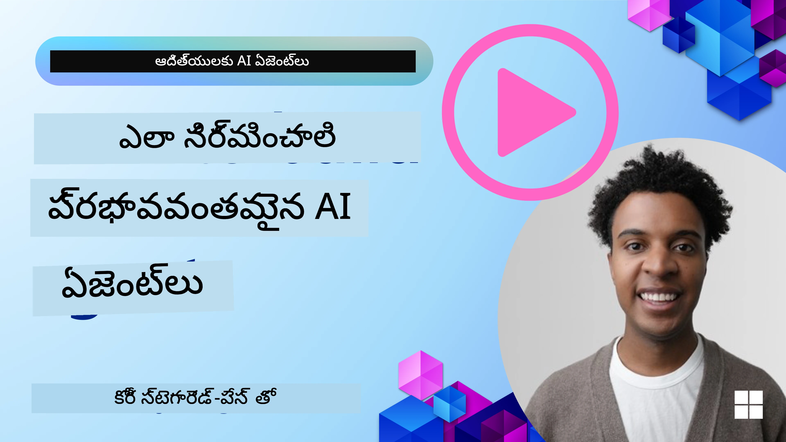
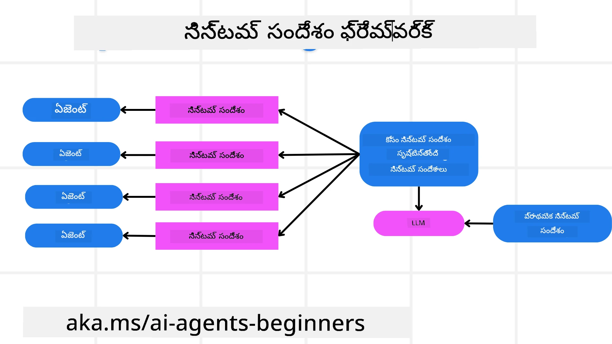
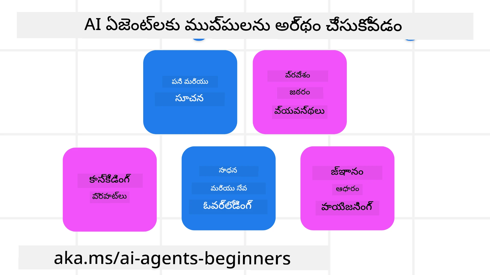
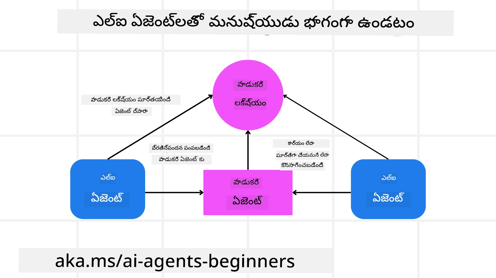

[](https://youtu.be/iZKkMEGBCUQ?si=Q-kEbcyHUMPoHp8L)

> _(ఈ పాఠం వీడియోను వీక్షించడానికి పై చిత్రాన్ని క్లిక్ చేయండి)_

# విశ్వసనీయ AI ఏజెంట్ల నిర్మాణం

## పరిచయం

ఈ పాఠం కవర్ చేస్తుంది:

- సురక్షితమైన మరియు సమర్థవంతమైన AI ఏజెంట్లను ఎలా నిర్మించాలి మరియు నిఘన చేయాలి
- AI ఏజెంట్లను అభివృద్ధి చేస్తోందప్పుడు ముఖ్యమైన భద్రతా విషయాలు.
- AI ఏజెంట్ల అభివృద్ధి సమయంలో డేటా మరియు యూజర్ గోప్యతను ఎలా నిలిపి ఉంచాలి.

## నేర్చుకునే లక్ష్యాలు

ఈ పాఠం పూర్తిచేసిన తర్వాత, మీరు తెలుసుకుంటారు:

- AI ఏజెంట్లను సృష్టించేటప్పుడు ప్రమాదాలను గుర్తించి తగ్గించడం ఎలా.
- డేటా మరియు యాక్సెస్ సక్రమంగా నిర్వహించబడుతున్నాయని నిర్ధారించడానికి భద్రతా చర్యలను అమలు చేయడం.
- డేటా గోప్యతను కాపాడుతూ, ఉత్తమమైన యూజర్ అనుభవం కలిగించే AI ఏజెంట్లను సృష్టించడం.

## భద్రత

ముందుగా సురక్షితమైన ఏజెంటిక్ అప్లికేషన్లను నిర్మించడాన్ని చూద్దాం. భద్రత అంటే AI ఏజెంట్ డిజైన్ చేయబడిన విధంగా పనిచేయడం. ఏజెంటిక్ అప్లికేషన్ల నిర్మాణకర్తలుగా, భద్రతను గరిష్టస్థాయికి తీసుకెళ్లేందుకు మేము పద్ధతులు మరియు సాధనాలు కలిగి ఉన్నాము:

### సిస్టమ్ మెసేజ్ ఫ్రేమ్‌వర్క్ నిర్మాణం

మీరు LLMలను ఉపయోగించి AI అప్లికేషన్ నిర్మించినట్లయితే, ఒక బలమైన సిస్టమ్ ప్రాంప్ట్ లేదా సిస్టమ్ మెసేజ్ డిజైన్ యొక్క ప్రాముఖ్యత మీరు తెలుసు. ఈ ప్రాంప్ట్‌లు LLM యూజర్ మరియు డేటా తో ఎలా పరిచయం అవుతుందో నిర్దేశించే మెటా నియమాలు, సూచనలు, మార్గదర్శకాలుగా ఉంటాయి.

AI ఏజెంట్ల కోసం, సిస్టమ్ ప్రాంప్ట్ మరింత ప్రాధాన్యం కలిగి ఉంటుంది, ఎందుకంటే AI ఏజెంట్లు మేము రూపకల్పన చేసిన పనులకు ఖచ్చితమైన సూచనలను అవసరం పడతాయి.

స్కేలబుల్ సిస్టమ్ ప్రాంప్ట్‌లను సృష్టించడానికి, మేము మా అప్లికేషన్‌లో ఒక లేదా ఎక్కువ ఏజెంట్లను నిర్మించేందుకు సిస్టమ్ మెసేజ్ ఫ్రేమ్‌వర్క్ ఉపయోగించవచ్చు:



#### దశ 1: మెటా సిస్టమ్ మెసేజ్ సృష్టించండి

మెటా ప్రాంప్ట్ LLM ఉపయోగించి మేము సృష్టించే ఏజెంట్ల కోసం సిస్టమ్ ప్రాంప్ట్‌లను తయారు చేయడానికి ఉపయోగపడుతుంది. ఇది ఒక టెంప్లేట్‌గా రూపొందించి, అవసరమైతే అనేక ఏజెంట్లను సమర్ధవంతంగా సృష్టించడానికి సహాయపడుతుంది.

ఇది LLM కి ఇస్తే మెటా సిస్టమ్ మెసేజ్ ఉదాహరణ:

```plaintext
You are an expert at creating AI agent assistants. 
You will be provided a company name, role, responsibilities and other
information that you will use to provide a system prompt for.
To create the system prompt, be descriptive as possible and provide a structure that a system using an LLM can better understand the role and responsibilities of the AI assistant. 
```

#### దశ 2: ప్రాథమిక ప్రాంప్ట్ సృష్టించండి

తదుపరి దశ, AI ఏజెంట్ ను వివరించే ప్రాథమిక ప్రాంప్ట్ సృష్టించడం. ఇందులో ఏజెంట్ యొక్క పాత్ర, ఏజెంట్ పూర్తి చేయబోయే పనులు మరియు ఏజెంట్ యొక్క ఇతర బాధ్యతలను చేర్చాలి.

ఇది ఒక ఉదాహరణ:

```plaintext
You are a travel agent for Contoso Travel that is great at booking flights for customers. To help customers you can perform the following tasks: lookup available flights, book flights, ask for preferences in seating and times for flights, cancel any previously booked flights and alert customers on any delays or cancellations of flights.  
```

#### దశ 3: ప్రాథమిక సిస్టమ్ మెసేజ్‌ను LLMకి అందించండి

ఇప్పుడు మేము మెటా సిస్టమ్ మెసేజ్‌ను సిస్టమ్ మెసేజ్‌గా మరియు మా ప్రాథమిక సిస్టమ్ మెసేజ్ కూడా అందించి ఈ సిస్టమ్ మెసేజ్‌ను మెరుగు పరచవచ్చు.

దీనితో, మా AI ఏజెంట్లను మార్గనిర్దేశం చేయడానికి మెరుగైన సిస్టమ్ మెసేజ్ రూపొందుతుంది:

```markdown
**Company Name:** Contoso Travel  
**Role:** Travel Agent Assistant

**Objective:**  
You are an AI-powered travel agent assistant for Contoso Travel, specializing in booking flights and providing exceptional customer service. Your main goal is to assist customers in finding, booking, and managing their flights, all while ensuring that their preferences and needs are met efficiently.

**Key Responsibilities:**

1. **Flight Lookup:**
    
    - Assist customers in searching for available flights based on their specified destination, dates, and any other relevant preferences.
    - Provide a list of options, including flight times, airlines, layovers, and pricing.
2. **Flight Booking:**
    
    - Facilitate the booking of flights for customers, ensuring that all details are correctly entered into the system.
    - Confirm bookings and provide customers with their itinerary, including confirmation numbers and any other pertinent information.
3. **Customer Preference Inquiry:**
    
    - Actively ask customers for their preferences regarding seating (e.g., aisle, window, extra legroom) and preferred times for flights (e.g., morning, afternoon, evening).
    - Record these preferences for future reference and tailor suggestions accordingly.
4. **Flight Cancellation:**
    
    - Assist customers in canceling previously booked flights if needed, following company policies and procedures.
    - Notify customers of any necessary refunds or additional steps that may be required for cancellations.
5. **Flight Monitoring:**
    
    - Monitor the status of booked flights and alert customers in real-time about any delays, cancellations, or changes to their flight schedule.
    - Provide updates through preferred communication channels (e.g., email, SMS) as needed.

**Tone and Style:**

- Maintain a friendly, professional, and approachable demeanor in all interactions with customers.
- Ensure that all communication is clear, informative, and tailored to the customer's specific needs and inquiries.

**User Interaction Instructions:**

- Respond to customer queries promptly and accurately.
- Use a conversational style while ensuring professionalism.
- Prioritize customer satisfaction by being attentive, empathetic, and proactive in all assistance provided.

**Additional Notes:**

- Stay updated on any changes to airline policies, travel restrictions, and other relevant information that could impact flight bookings and customer experience.
- Use clear and concise language to explain options and processes, avoiding jargon where possible for better customer understanding.

This AI assistant is designed to streamline the flight booking process for customers of Contoso Travel, ensuring that all their travel needs are met efficiently and effectively.

```

#### దశ 4: పునరావృతం చేసి మెరుగుపరచు

ఈ సిస్టమ్ మెసేజ్ ఫ్రేమ్‌వర్క్ విలువ అనేక ఏజెంట్ల నుండి సిస్టమ్ మెసేజ్‌లను సులభంగా సృష్టించడం మరియు మీ సిస్టమ్ మెసేజ్‌లను సమయానుకూలంగా మెరుగుపరచటం. మీ పూర్తయిన అవసరానికి మొదటి సారి పని చేసే సిస్టమ్ మెసేజ్ ఉండటం అరుదు. ప్రాథమిక సిస్టమ్ మెసేజ్ మార్చి, దాన్ని సిస్టమ్ ద్వారా నడిపించి చిన్న సవరణలు చేయగలగటం ఫలితాల్ని పోల్చి మదింపు చేయడానికి సహాయపడుతుంది.

## ప్రమాదాలు అర్థం చేసుకోవడం

విశ్వసనీయ AI ఏజెంట్లను నిర్మించడానికి, మీ AI ఏజెంట్ విషయంలో ఉన్న ప్రమాదాలు మరియు ముప్పులను అర్థం చేసుకుని వాటిని తగ్గించడం చాలా అవసరం. AI ఏజెంట్లకు ఉన్న విభిన్న రకాల ముప్పులలో కొంతమేరను మరియు వాటిని ఎలా మెరుగుపరచుకోవచ్చో చూద్దాం.



### పని మరియు సూచనలు

**వివరణ:** దాడీకర్తలు AI ఏజెంట్ యొక్క సూచనలు లేదా లక్ష్యాలను ప్రాంప్ట్ చేయడం లేదా ఇన్‌పుట్‌లను మానిపులేట్ చేయడం ద్వారా మార్చడానికి ప్రయత్నిస్తారు.

**తగ్గింపు**: AI ఏజెంట్ ప్రాసెస్ చేసే ముందు ప్రమాదకరమైన ప్రాంప్ట్‌లను గుర్తించడం కోసం ధృవీకరణ పరీక్షలు మరియు ఇన్‌పుట్ ఫిల్టర్స్ అమలు చేయండి. ఈ దాడులు సాధారణంగా ఏజెంట్‌తో తరచు పరస్పర చర్య అవసరం ఉన్నందున, సంభాషణలో టర్న్ల సంఖ్యను పరిమితం చేయడం ఇతర ముఖ్యమైన ఆపద్ధర్మ.

### కీలకమైన సిస్టమ్‌లకు యాక్సెస్

**వివరణ:** AI ఏజెంట్ సున్నితమైన డేటాను నిల్వ చేసే సిస్టమ్‌లు మరియు సేవలకి యాక్సెస్ కలిగి ఉన్నట్లయితే, దాడీకర్తలు ఏజెంట్ మరియు ఈ సేవల మధ్య కమ్యూనికేషన్‌ను దాడి చేయవచ్చు. వీటికి ప్రత్యక్ష దాడులు లేదా ఏజెంట్ ద్వారా ఈ సిస్టమ్‌ల గురించి సమాచారం పొందేందుకు పరోక్ష ప్రయత్నాలు కూడా ఉంటాయి.

**తగ్గింపు:** AI ఏజెంట్‌లు అవసరమైన సమయంలో మాత్రమే సిస్టమ్‌లకు యాక్సెస్ కలిగి ఉండాలి. ఏజెంట్ మరియు సిస్టమ్ మధ్య కమ్యూనికేషన్ కూడా సురక్షితంగా ఉండాలి. గుర్తింపు మరియు యాక్సెస్ నియంత్రణ అమలు చేయటం మరొక రక్షణ.

### వనరులు మరియు సేవల ఓవర్‌లోడ్

**వివరణ:** AI ఏజెంట్లు పనులు పూర్త చేయడానికి వివిధ టూల్స్ మరియు సేవలను ఉపయోగిస్తాయి. దాడీకర్తలు ఈ సామర్థ్యాన్ని ఉపయోగించి AI ఏజెంట్ ద్వారా అధిక సంఖ్యలో అభ్యర్థనలు పంపి ఈ సేవలపై దాడి చేయవచ్చు, ఇది సిస్టమ్ వైఫల్యాలు లేదా అధిక ఖర్చులతో ముగియచ్చు.

**తగ్గింపు:** ఏజెంట్ ఒక సేవకు చేసే అభ్యర్థనల సంఖ్యను పరిమితం చేసే విధానాలను అమలు చేయండి. AI ఏజెంట్‌కు సంభాషణ టర్న్స్ మరియు అభ్యర్థనల సంఖ్యను పరిమితం చేయడం ఇదే రకమైన దాడులను నివారించడానికి మరో మార్గం.

### జ్ఞాన మౌళికస్తంభం విషజననం

**వివరణ:** ఈ రకం దాడి నేరుగా AI ఏజెంట్‌పై కాదు, కానీ AI ఏజెంట్ ఉపయోగించే జ్ఞాన మౌళికస్తంభం మరియు ఇతర సేవలపై లక్ష్యం పెట్టుతుంది. ఇది డేటాని బిగార్చడం లేదా AI ఏజెంట్ పనిని పూర్తిచేయడానికి ఉపయోగించే సమాచారాన్ని దుష్ప్రభావితం చేయవచ్చు, దాని వలన బైనస్డ్ లేదా అనారక్త సమాధానాలు వస్తాయి.

**తగ్గింపు:** AI ఏజెంట్ ఉపయోగించే డేటాను తరచుగా ధృవీకరించండి. ఈ డేటాపై యాక్సెస్ సురక్షితంగా ఉన్నదని మరియు ఇది నమ్మకమైన వ్యక్తులు మాత్రమే మార్చుతారని ఎప్పుడూ నిర్ధారించండి.

### కాస్కేడింగ్ లోపాలు

**వివరణ:** AI ఏజెంట్లు వివిధ టూల్స్ మరియు సేవలను ఉపయోగించి పనులు పూర్తి చేస్తాయి. దాడీకర్తల కారణంగా వచ్చే లోపాలు ఇతర సిస్టమ్‌ల వైఫల్యాలకు దారితీయవచ్చు, దాని వలన దాడి విస్తరించి మరింత కష్టతరంగా మారుతుంది.

**తగ్గింపు:** ఒక పద్ధతి AI ఏజెంట్‌ను పరిమిత వాతావరణంలో నడిపించడం, ఉదాహరణకు Docker కంటెయినర్ లో పనులు చేయించడం, ఇది ప్రత్యక్ష సిస్టమ్ దాడులను నివారించగలదు. కొన్ని సిస్టమ్‌లు లోపం ఇచ్చినప్పుడు ఫాల్‌బ్యాక్ మెకానిజం మరియు రిట్రై లాజిక్ సృష్టించడం పెద్ద సిస్టమ్ వైఫల్యాలను నివారించేందుకు మరో మార్గం.

## మనిషి-లో-లూప్

విశ్వసనీయ AI ఏజెంట్ సిస్టమ్‌లను నిర్మించడానికి మరొక సమర్థవంతమైన పద్ధతి మనిషి-లో-లూప్ ఉపయోగించడం. ఇది ఒక ఫ్లో సృష్టిస్తుంది, ఇందులో వినియోగదారులు ఆగిపోకుండా ఏజెంట్లకు స్పందనలు ఇస్తారు. వినియోగదారులు బహుళ ఏజెంట్ సిస్టమ్‌లో ఏజెంట్లుగా వ్యవహరిస్తారు మరియు నడుస్తున్న ప్రక్రియకు అనుమతి లేదా ముగింపు ఇస్తారు.



ఈ భావనను Microsoft Agent Framework ను ఉపయోగించి ఎలా అమలు చేస్తున్నామో చూపించే కోడ్ స్నిపెట్ ఇక్కడ ఉంది:

```python
import os
from agent_framework.azure import AzureAIProjectAgentProvider
from azure.identity import AzureCliCredential

# మానవ-ఇన్-ది-loop ఆమోదంతో ప్రొవైడర్ ను సృష్టించండి
provider = AzureAIProjectAgentProvider(
    credential=AzureCliCredential(),
)

# మానవ ఆమోద దశతో ఏజెంట్ ను సృష్టించండి
response = provider.create_response(
    input="Write a 4-line poem about the ocean.",
    instructions="You are a helpful assistant. Ask for user approval before finalizing.",
)

# వినియోగదారు స్పందనను సమీక్షించి ఆమోదించవచ్చు
print(response.output_text)
user_input = input("Do you approve? (APPROVE/REJECT): ")
if user_input == "APPROVE":
    print("Response approved.")
else:
    print("Response rejected. Revising...")
```

## ముగింపు

విశ్వసనీయ AI ఏజెంట్లను నిర్మించడమంటే జాగ్రత్తగా డిజైన్ చేయడం, బలమైన భద్రతా చర్యలు, మరియు నిరంతరం పునరావృతం చేయడం. నిర్మిత మెటా ప్రాంప్టింగ్ సిస్టమ్‌లను అమలు చేయడం, భావ్య ప్రమాదాలను అర్థం చేసుకోవడం, మరియు తగ్గింపు వ్యూహాలను ఉపయోగించడం ద్వారా అభివృద్ధి చెందేవారు సురక్షితమైన మరియు సమర్థవంతమైన AI ఏజెంట్లను సృష్టించవచ్చు. అదనంగా, మనిషి-లో-లూప్ విధానాన్ని చేర్చడం ద్వారా AI ఏజెంట్లు యూజర్ అవసరాలతో సరిపోలినవిగా ఉండి, ప్రమాదాలను తగ్గిస్తుంది. AI అభివృద్ధి కొనసాగుతున్నప్పటికీ, భద్రత, గోప్యత మరియు నైతిక అంశాలపై ముందస్తుగా చర్య తీసుకోవడం AI ఆధారిత సిస్టమ్‌లలో నమ్మకం మరియు విశ్వసనీయతను పెంచడం కీలకం.

### విశ్వసనీయ AI ఏజెంట్లను నిర్మించడం గురించి మీకు మరిన్ని ప్రశ్నలు ఉన్నాయా?

ఇతర అభ్యసకుల్ని కలవటానికి, ఆఫీసు గంటలు హాజరుకావడానికి మరియు మీ AI ఏజెంట్ల ప్రశ్నలకు సమాధానాలు పొందడానికి [Microsoft Foundry Discord](https://aka.ms/ai-agents/discord) లో చేరండి.

## అదనపు వనరులు

- <a href="https://learn.microsoft.com/azure/ai-studio/responsible-use-of-ai-overview" target="_blank"> బాధ్యతాయుతమైన AI పరిచయం</a>
- <a href="https://learn.microsoft.com/azure/ai-studio/concepts/evaluation-approach-gen-ai" target="_blank"> జనరేటివ్ AI మోడల్స్ మరియు AI అప్లికేషన్ల మూల్యాంకనం</a>
- <a href="https://learn.microsoft.com/azure/ai-services/openai/concepts/system-message?context=%2Fazure%2Fai-studio%2Fcontext%2Fcontext&tabs=top-techniques" target="_blank"> భద్రతా సిస్టమ్ మెసేజ్‌లు</a>
- <a href="https://blogs.microsoft.com/wp-content/uploads/prod/sites/5/2022/06/Microsoft-RAI-Impact-Assessment-Template.pdf?culture=en-us&country=us" target="_blank"> ప్రమాద మూల్యాంకన టెంప్లెట్</a>

## గత పాఠం

[Agentic RAG](../05-agentic-rag/README.md)

## తదుపరి పాఠం

[Planning Design Pattern](../07-planning-design/README.md)

---

<!-- CO-OP TRANSLATOR DISCLAIMER START -->
**నెలకూరు**:  
ఈ పత్రాన్ని AI అనువాద సేవ [Co-op Translator](https://github.com/Azure/co-op-translator) ఉపయోగించి అనువదించబడింది. మేము ఖచ్చితత్వానికి ప్రయత్నించినప్పటికీ, ఆటోమేటెడ్ అనువాదాల్లో పొరపాట్లు ఉండే అవకాశం ఉందని దయచేసి గమనించండి. అసలు పత్రం దాని సొంత భాషలో అత్యంత నమ్మకమైన మూలం గా పరిగణించబడాలి. ముఖ్యమైన సమాచారం కోసం, నిపుణుల చేతి అనువాదాన్ని సలహా ఇస్తాము. ఈ అనువాదం ఉపయోగిస్తుండగా సంభవించే ఏవైనా అపార్థాలు లేదా పొరపాటులకు మేము బాధ్యత వహించము.
<!-- CO-OP TRANSLATOR DISCLAIMER END -->