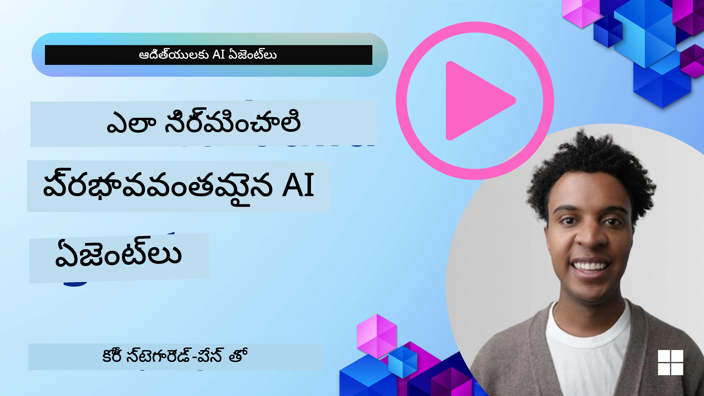
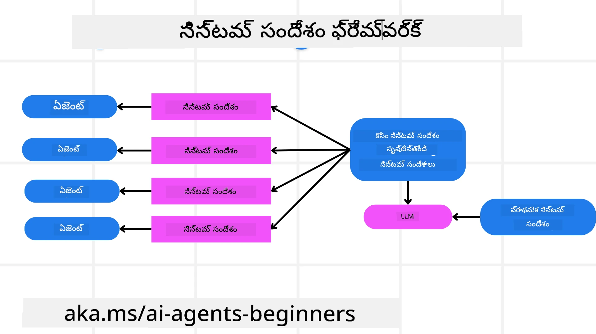
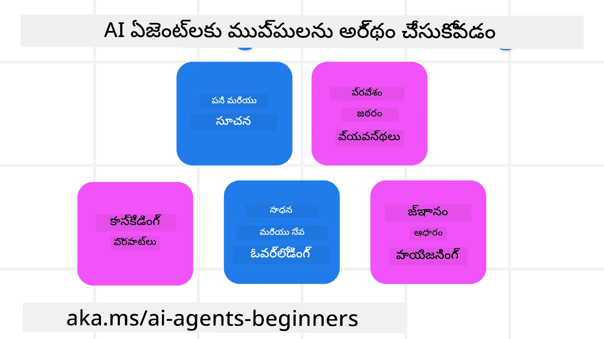
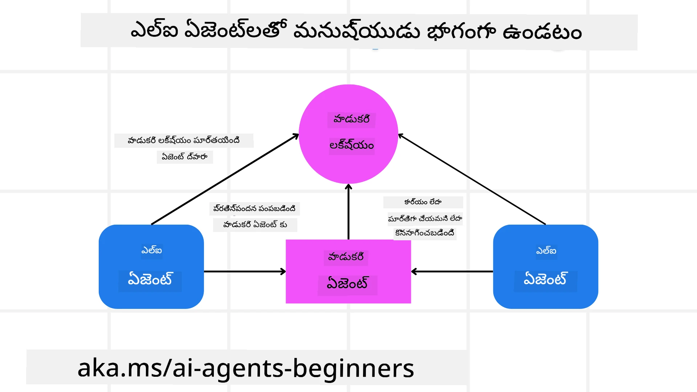

[](https://youtu.be/iZKkMEGBCUQ?si=Q-kEbcyHUMPoHp8L)

> _(ఈ బోధన వీడియో చూడటానికి పై చిత్రాన్ని క్లిక్ చేయండి)_

# నమ్మకమైన AI ఏజెంట్ల నిర్మాణం

## పరిచయం

ఈ బోధనల్లో కవర్ చేయబడే విషయాలు:

- సురక్షితమైన మరియు సమర్థవంతమైన AI ఏజెంట్లను ఎలా రూపొందించి అమలు చేయాలి
- AI ఏజెంట్లు అభివృద్ధి చేస్తే గమనించవలసిన ప్రధాన భద్రతా అంశాలు.
- AI ఏజెంట్లు అభివృద్ధి సమయంలో డేటా మరియు వినియోగదారు గోప్యతను ఎలా నిర్వహించాలి.

## అభ్యాస లక్ష్యాలు

ఈ బోధన పూర్తయిన తర్వాత, మీరు తెలుసుకునే విషయాలు:

- AI ఏజెంట్లను సృష్టించే సమయానికి ప్రమాదాలను గుర్తించి నియంత్రించటం.
- డేటా మరియు యాక్సెస్ సక్రమంగా నిర్వహింపబడుతున్నట్లు నిర్ధారించేందుకు భద్రతా చర్యలను అమలు చేయటం.
- డేటా గోప్యత్వాన్ని కాపాడే, గొప్ప వినియోగదారు అనుభవాన్ని అందించే AI ఏజెంట్లను సృష్టించడం.

## భద్రత

ముందుగా, సురక్షితమైన ఏజెంటిక్ అనువర్తనాలను నిర్మించడం గురించి చూడండి. భద్రత అంటే AI ఏజెంట్ ఆకాంక్షించిన విధంగా పనితీరు చూపడం. ఏజెంటిక్ అనువర్తనాల నిర్మాణకర్తలుగా, భద్రతను గరిష్ట పరిమాణంలో ఉంచేందుకు మనకు పద్ధతులు మరియు సాధనాలు ఉన్నాయి:

### సిస్టమ్ మెసేజ్ ఫ్రేమ్‌వర్క్ నిర్మాణం

మీరు LLM (లార్జ్ లాంగ్వేజ్ మోడల్స్) ఉపయోగించి AI అనువర్తనం నిర్మించిన ఉంటే, బలమైన సిస్టమ్ ప్రాంప్ట్ లేదా సిస్టమ్ మెసేజ్ డిజైన్ ముఖ్యం అనేది మీకు తెలిసిఉంటుంది. ఈ ప్రాంప్ట్లు LLM వినియోగదారునితో మరియు డేటాతో ఎలా సంభాషించాలో మెటా నియమాలు, సూచనలు, మార్గదర్శకాలను స్థాపిస్తాయి.

AI ఏజెంట్ల కోసం, సిస్టమ్ ప్రాంప్ట్ మరింత ముఖ్యమైనది ఎందుకంటే AI ఏజెంట్లు మనం రూపకల్పన చేసిన పనులను పూర్తి చేసేేటప్పుడు చాలా స్పష్టమైన సూచనలు అవసరం అవుతాయి.

స్కేలబుల్ సిస్టమ్ ప్రాంప్ట్లను సృష్టించడానికి, మన అనువర్తనంలో ఒకటి లేదా ఎక్కువ ఏజెంట్లను నిర్మించడానికి సిస్టమ్ మెసేజ్ ఫ్రేమ్‌వర్క్ ఉపయోగించవచ్చు:



#### దశ 1: మెటా సిస్టమ్ మెసేజ్ సృష్టించండి

మెటా ప్రాంప్ట్ LLM ద్వారా సృష్టించబడే ఏజెంట్ల సిస్టమ్ ప్రాంప్ట్‌లకు ఉపయోగించబడుతుంది. ఇది ఒక టెంప్లేట్‌గా రూపకల్పన చేయబడుతుంది, కావలసిన సేపు బహుళ ఏజెంట్లు సులభంగా సృష్టించడానికి వీలు కల్పిస్తుంది.

ఇక్కడ LLM కు ఇస్తున్న ఒక మెటా సిస్టమ్ మెసేజ్ ఉదాహరణ ఉంది:

```plaintext
You are an expert at creating AI agent assistants. 
You will be provided a company name, role, responsibilities and other
information that you will use to provide a system prompt for.
To create the system prompt, be descriptive as possible and provide a structure that a system using an LLM can better understand the role and responsibilities of the AI assistant. 
```

#### దశ 2: ప్రాథమిక ప్రాంప్ట్ సృష్టించండి

తదుపరి దశ AI ఏజెంట్ గురించి వివరణ ఇచ్చే ప్రాథమిక ప్రాంప్ట్ సృష్టించడం. ఏజెంట్ పాత్ర, నిర్వర్తించబోయే పనులు మరియు ఏ ఇతర బాధ్యతలను కూడా చేర్చాలి.

ఇక్కడ ఒక ఉదాహరణ ఉంది:

```plaintext
You are a travel agent for Contoso Travel that is great at booking flights for customers. To help customers you can perform the following tasks: lookup available flights, book flights, ask for preferences in seating and times for flights, cancel any previously booked flights and alert customers on any delays or cancellations of flights.  
```

#### దశ 3: ప్రాథమిక సిస్టమ్ మెసేజ్ LLM కు ఇవ్వండి

ఇప్పుడు, మెటా సిస్టమ్ మెసేజ్ మరియు ప్రాథమిక సిస్టమ్ మెసేజ్ ఇస్తూ ఈ సిస్టమ్ మెసేజ్‌ను మెరుగుపరచవచ్చు.

ఇది మన AI ఏజెంట్లకు మార్గనిర్దేశం చెయ్యడానికి మెరుగైన సిస్టమ్ మెసేజ్‌ను ఉత్పత్తి చేస్తుంది:

```markdown
**Company Name:** Contoso Travel  
**Role:** Travel Agent Assistant

**Objective:**  
You are an AI-powered travel agent assistant for Contoso Travel, specializing in booking flights and providing exceptional customer service. Your main goal is to assist customers in finding, booking, and managing their flights, all while ensuring that their preferences and needs are met efficiently.

**Key Responsibilities:**

1. **Flight Lookup:**
    
    - Assist customers in searching for available flights based on their specified destination, dates, and any other relevant preferences.
    - Provide a list of options, including flight times, airlines, layovers, and pricing.
2. **Flight Booking:**
    
    - Facilitate the booking of flights for customers, ensuring that all details are correctly entered into the system.
    - Confirm bookings and provide customers with their itinerary, including confirmation numbers and any other pertinent information.
3. **Customer Preference Inquiry:**
    
    - Actively ask customers for their preferences regarding seating (e.g., aisle, window, extra legroom) and preferred times for flights (e.g., morning, afternoon, evening).
    - Record these preferences for future reference and tailor suggestions accordingly.
4. **Flight Cancellation:**
    
    - Assist customers in canceling previously booked flights if needed, following company policies and procedures.
    - Notify customers of any necessary refunds or additional steps that may be required for cancellations.
5. **Flight Monitoring:**
    
    - Monitor the status of booked flights and alert customers in real-time about any delays, cancellations, or changes to their flight schedule.
    - Provide updates through preferred communication channels (e.g., email, SMS) as needed.

**Tone and Style:**

- Maintain a friendly, professional, and approachable demeanor in all interactions with customers.
- Ensure that all communication is clear, informative, and tailored to the customer's specific needs and inquiries.

**User Interaction Instructions:**

- Respond to customer queries promptly and accurately.
- Use a conversational style while ensuring professionalism.
- Prioritize customer satisfaction by being attentive, empathetic, and proactive in all assistance provided.

**Additional Notes:**

- Stay updated on any changes to airline policies, travel restrictions, and other relevant information that could impact flight bookings and customer experience.
- Use clear and concise language to explain options and processes, avoiding jargon where possible for better customer understanding.

This AI assistant is designed to streamline the flight booking process for customers of Contoso Travel, ensuring that all their travel needs are met efficiently and effectively.

```

#### దశ 4: పునరావృతం చేసి మెరుగుపరచుకోండి

ఈ సిస్టమ్ మెసేజ్ ఫ్రేమ్‌వర్క్ యొక్క విలువ ఏమిటంటే, బహుళ ఏజెంట్లకు సిస్టమ్ మెసేజ్ సృష్టించడం సులభం అవుతుంది అలాగే మీ సిస్టమ్ మెసేజ్‌లను కాలక్రమేణా మెరుగుపరచడం సైతం. మీ పూర్తి వినియోగ దృష్టాంతానికి మొదటి సారి పనిచేసే సిస్టమ్ మెసేజ్ దొరకడం అరుదుగా ఉంటుంది. ప్రాథమిక సిస్టమ్ మెసేజ్‌ను మారుస్తూ, ప్రణాళికకు గమనికలు చేసి, ఫలితాలను పోల్చి విశ్లేషించటం ద్వారా చిన్న సవరణలు మరియు మెరుగుదలలు చేయవచ్చు.

## బెదిరింపులను అర్థం చేసుకోవడం

నమ్మకమైన AI ఏజెంట్లు నిర్మించాలంటే, మీ AI ఏజెంట్‌కు ఉన్న ప్రమాదాలు మరియు బెదిరింపులను అర్థం చేసుకుని వాటిని నియంత్రించడం ముఖ్యం. కేవలం కొన్ని AI ఏజెంట్లపై దాడులు లేవు అనే బెదిరింపులను మాత్రమే చూడదాం మరియు మీరు వాటికి ఎలా మెరుగ్గా సిద్ధమవ్వాలో తెలుసుకోండి.



### పని మరియు సూచనలు

**వివరణ:** దాడిమార్లు AI ఏజెంట్ యొక్క సూచనలు లేదా లక్ష్యాలను ప్రాంప్టింగ్ లేదా ఇన్పుట్లను మానిప్యులేట్ చేయడం ద్వారా మార్చడానికి ప్రయత్నిస్తారు.

**నియంత్రణ**: AI ఏజెంట్ వద్ద ఆ ప్రాంప్ట్లు ప్రాసెస్ చేయాల్సిన ముందు వాటిని గుర్తించడానికి ధృవీకరణ పరీక్షలు మరియు ఇన్పుట్ ఫిల్టర్లు అమలు చేయండి. ఈ తరం దాడులకు ఏజెంట్ తో తరచుగా సంభాషణ ఉంది కాబట్టి సంభాషణ పనుల సంఖ్యను పరిమితం చేయడం కూడా శ్రేయస్సు.

### కీలకమైన సిస్టమ్‌లకు ప్రాప్యత

**వివరణ:** AI ఏజెంట్ సున్నితమైన డేటా నిల్వ చేసే సిస్టమ్‌లు మరియు సేవలకు ప్రాప్యత కలిగి ఉంటే, దాడిమార్లు ఏజెంట్ మరియు ఈ సేవల మధ్య సంభాషణను రద్దు చేయవచ్చు. ఇది ప్రత్యక్ష దాడులు కావచ్చు లేదా ఏజెంట్ ద్వారా ఈ సిస్టమ్‌లు గురించి సమాచారం పొందడానికి నేరోపాయాలు కావచ్చు.

**నియంత్రణ:** ఏజెంట్లు అవసరమైన సందర్భాల్లోనే ఈ సిస్టమ్‌లకు ప్రాప్తి కలిగి ఉండాలి. ఏజెంట్ మరియు సిస్టమ్ మధ్య సంభాషణ కూడా భద్రంగా ఉండాలి. ధృవీకరణ మరియు యాక్సెస్ నియంత్రణ అమలు చేయడం మరొక రక్షణా విధానం.

### వనరు మరియు సేవల దర్నోలిక

**వివరణ:** AI ఏజెంట్లు విభిన్న సాధనాలు మరియు సేవలను కార్యకలాపాలకు ఉపయోగిస్తాయి. దాడిమార్లు ఈ సామర్థ్యం ఉపయోగించి, AI ఏజెంట్ ద్వారా ఏ సేవలకు అధిక సంఖ్యలో అభ్యర్థనలు పంపించి, సిస్టమ్ విఫలమవ్వటం లేదా అధిక ఖర్చులు రావడానికి దాడి చేయవచ్చు.

**నియంత్రణ:** ఏజెంట్ ఒక సేవకు చేసే అభ్యర్థనల సంఖ్యను పరిమితం చేసే విధానాలు అమలు చేయండి. సంభాషణ టర్న్స్ మరియు అభ్యర్థనల పరిమితి కూడా ఈ దాడులను నివారించడంలో సహాయపడుతుంది.

### జ్ఞాన భాండారం విషపూరణ

**వివరణ:** ఈ రకం దాడి AI ఏజెంట్ ను ప్రత్యక్షంగా లక్ష్యం చేసుకోదు, కానీ ఏజెంట్ ఉపయోగించే జ్ఞాన భాండారం మరియు ఇతర సేవలను లక్ష్యం చేస్తుంది. డేటా లేదా సమాచారం దెబ్బతినడం, దీనివల్ల AI ఏజెంట్ పరోక్షంగా పక్షపాతమైన లేదా ఆశించని ప్రతిస్పందనలు ఇవ్వవచ్చు.

**నియంత్రణ:** ఏజెంట్ ఉపయోగించే డేటాను నియమితంగా ధృవీకరించండి. ఈ డేటాకు ప్రాప్యత మాత్రమే నమ్మకమైన వ్యక్తులదే ఉండేట్లు నిర్ధారించండి.

### కాస్కేడింగ్ లోపాలు

**వివరణ:** AI ఏజెంట్లు వివిధ సాధనాలు మరియు సేవలను పనులు పూర్తి చేయడానికి ఉపయోగిస్తాయి. దాడిమారుల కారణంగా లోపాలు ఏర్పడటం వల్ల ఈ ఏజెంట్ కనెక్ట్ అయిన ఇతర సిస్టమ్‌లు కూడా దెబ్బతినటం సోపానం విస్తరించి మరింత క్లిష్టమైన సమస్యలు ఏర్పడవచ్చు.

**నియంత్రణ:** దీన్ని నివారించడానికి ఒక విధానంగా ఏజెంట్‌ని పరిమిత వాతావరణంలో (ఉదా: Docker కంటైనర్‌లో) నడపడం, ప్రత్యక్ష సిస్టమ్ దాడులను నిరోధిస్తుంది. కొన్ని సిస్టమ్‌లు లోపాలతో స్పందిస్తే ఫాల్‌బ్యాక్ విధానాలు, నివృత్తి లాజిక్ నిర్మించడం ఇతర పెద్ద సిస్టమ్ వైఫల్యాలను నివారించేందుకు సహాయపడుతుంది.

## హ్యూమన్-ఇన్-ది-లూప్

నమ్మకమైన AI ఏజెంట్ సిస్టమ్‌లను రూపొందించడంలో మరో సమర్ధవంతమైన విధానం హ్యూమన్-ఇన్-ది-లూప్ ఉపయోగించడం. ఇది వినియోగదారులు ఏజెంట్‌లు పనిచేసేటప్పుడు ఫీడ్బ్యాక్ ఇవ్వగలిగే ప్రవాహాన్ని సృష్టిస్తుంది. వినియోగదారులు బహుళ ఏజెంట్ సిస్టమ్‌లో ఏజెంట్లుగా వ్యవహరిస్తూ పరమాణు ఆమోదం లేదా ఆపివేత చేస్తారు.



ఈ భావన ఎలా అమలు అవుతుందో చూపించేందుకు మైక్రోసాఫ్ట్ ఏజెంట్ ఫ్రేమ్‌వర్క్ ఉపయోగించి ఉదాహరణ కోడ్:

```python
import os
from agent_framework.foundry import FoundryChatClient
from azure.identity import AzureCliCredential

# మానవ-ఇన్-ది-లూప్ ఆమోదంతో ప్రొవైడర్‌ను సృష్టించండి
provider = FoundryChatClient(
    project_endpoint=os.environ["AZURE_AI_PROJECT_ENDPOINT"],
    model=os.environ["AZURE_AI_MODEL_DEPLOYMENT_NAME"],
    credential=AzureCliCredential(),
)

# మానవ ఆమోదం దశతో ఏజెంట్‌ను సృష్టించండి
response = provider.create_response(
    input="Write a 4-line poem about the ocean.",
    instructions="You are a helpful assistant. Ask for user approval before finalizing.",
)

# వినియోగదారు ప్రతిస్పందనను సమీక్షించి ఆమోదించవచ్చు
print(response.output_text)
user_input = input("Do you approve? (APPROVE/REJECT): ")
if user_input == "APPROVE":
    print("Response approved.")
else:
    print("Response rejected. Revising...")
```

## ముగింపు

నమ్మకమైన AI ఏజెంట్లు నిర్మించేందుకు జాగ్రత్తగా డిజైన్ చేయడం, బలమైన భద్రతా చర్యలు మరియు నిరంతర పునరావృతం అవసరం. నిర్మితమైన మెటా ప్రాంప్ట్ సిస్టమ్‌లు అమలు చేయడం, సంభావ్య బెదిరింపులను అర్థం చేసుకోవడం మరియు నియంత్రణ వ్యూహాలను వర్తించడం ద్వారా అభివృద్ధికర్తలు సురక్షితమైన, సమర్థవంతమైన AI ఏజెంట్లను సృష్టించగలరు. అదనంగా, హ్యూమన్-ఇన్-ది-లూప్ దృష్టికోణాన్ని చేర్చడం AI ఏజెంట్లు వినియోగదారుల అవసరాలతో సమర్పకంగా ఉండటానికి సహాయపడుతుంది మరియు ప్రమాదాలను తగ్గిస్తుంది. AI కొనసాగుతున్న ప్రగతి, భద్రత, గోప్యత మరియు నైతిక ఆలోచనలపై చురుకుగా ఉండటం AI ఆధారిత సిస్టమ్‌లలో నమ్మకాన్ని మరియు విశ్వసనీయతను పెంచడానికి కీలకం.

## కోడ్ నమూనాలు

- [`code_samples/06-system-message-framework.ipynb`](code_samples/06-system-message-framework.ipynb): మెటా-ప్రాంప్ట్ సిస్టమ్-మెసేజ్ ఫ్రేమ్‌వర్క్ యొక్క దశల వారీ ప్రదర్శన.
- [`code_samples/06-human-in-the-loop.ipynb`](code_samples/06-human-in-the-loop.ipynb): నమ్మకమైన ఏజెంట్స్ కోసం ప్రీ-యాక్షన్ ఆమోద గేట్లు, రిస్క్ స్థాయిలు, అండ్ ఆడిట్ లాగింగ్.

### నమ్మకమైన AI ఏజెంట్ల నిర్మాణం పై మీకు మరిన్ని ప్రశ్నలున్నాయా?

మరిన్ని అభ్యాసుల తో కలుసుకోవడానికి, ఆఫీస్ గంటలలో పాల్గొనడానికి మరియు మీ AI ఏజెంట్లు సంబంధిత ప్రశ్నలకు సమాధానాలు పొందడానికి [Microsoft Foundry Discord](https://discord.com/invite/ATgtXmAS5D) లో చేరండి.

## అదనపు వనరులు

- <a href="https://learn.microsoft.com/azure/ai-studio/responsible-use-of-ai-overview" target="_blank">పర్యవేక్షణీయ AI సమీక్ష</a>
- <a href="https://learn.microsoft.com/azure/ai-studio/concepts/evaluation-approach-gen-ai" target="_blank">సృష్టించబడే AI మోడళ్లు మరియు AI అనువర్తనాల మూల్యాంకనం</a>
- <a href="https://learn.microsoft.com/azure/ai-services/openai/concepts/system-message?context=%2Fazure%2Fai-studio%2Fcontext%2Fcontext&tabs=top-techniques" target="_blank">సురక్షిత సిస్టమ్ మెసేజ్‌లు</a>
- <a href="https://blogs.microsoft.com/wp-content/uploads/prod/sites/5/2022/06/Microsoft-RAI-Impact-Assessment-Template.pdf?culture=en-us&country=us" target="_blank">రిస్క్ అసెస్‌మెంట్ టెంప్లేట్</a>

## ముందటి బోధన

[Agentic RAG](../05-agentic-rag/README.md)

## తదుపరి బోధన

[ప్లానింగ్ డిజైన్ పేటర్న్](../07-planning-design/README.md)

---

<!-- CO-OP TRANSLATOR DISCLAIMER START -->
**అస్వీకరణ**:
ఈ పత్రం AI అనువాద సేవ [Co-op Translator](https://github.com/Azure/co-op-translator) ఉపయోగించి అనువదించబడింది. మేము ఖచ్చితత్వానికి ప్రయత్నిస్తున్నప్పటికీ, ఆటోమేటెడ్ అనువాదాలు తప్పులు లేదా అసమగ్రతలను కలిగి ఉండవచ్చు. దాని స్వదేశ భాషలో ఉన్న అసలు పత్రాన్ని అధికారం కలిగిన మూలంగా పరిగణించాలి. కీలకమైన సమాచారం కోసం, ప్రొఫెషనల్ మానవ అనువాదాన్ని సిఫారసు చేస్తాము. ఈ అనువాదం ఉపయోగం వల్ల కలిగే ఏవైనా అపార్థాలు లేదా తప్పుదారులు కోసం మేము బాధ్యత వహించము.
<!-- CO-OP TRANSLATOR DISCLAIMER END -->