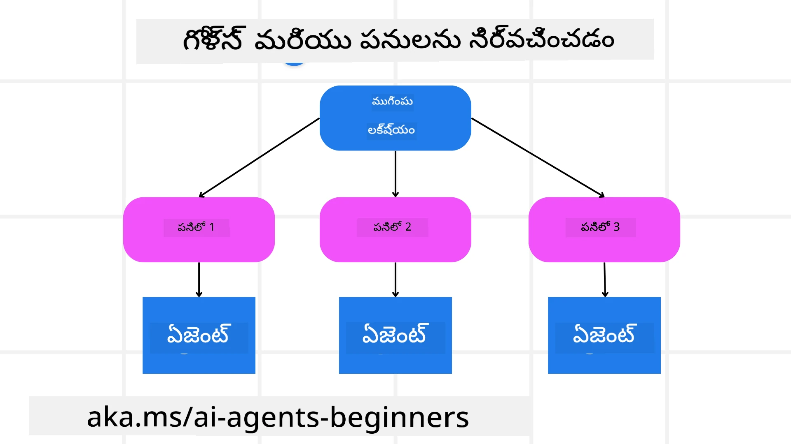

[](https://youtu.be/kPfJ2BrBCMY?si=9pYpPXp0sSbK91Dr)

> _(ఈ పాఠంలోని వీడియోను చూడటానికి పై చిత్రాన్ని క్లిక్ చేయండి)_

# ప్లానింగ్ డిజైన్

## పరిచయం

ఈ పాఠం కిందివి ఇస్తుంది

* ఒక స్పష్టమైన మొత్తం లక్ష్యాన్ని నిర్వచించడం మరియు సంక్లిష్ట పనిని నిర్వహించదగిన పనులుగా విభజించడం.
* మరింత నమ్మకమైన మరియు యంత్రం-అర్థం చేసుకునే ప్రతిస్పందనల కోసం నిర్మిత అవుట్పుట్‌ను వినియోగించడం.
* డైనమిక్ పనులు మరియు అనుకోని ఇన్‌పుట్లను నిర్వహించడానికి ఈవెంట్-చాలిత విధానాన్ని వర్తించటం.

## అభ్యాస లక్ష్యాలు

ఈ పాఠం పూర్తి చేసిన తర్వాత, మీరు ఈ విషయాలను అర్థం చేసుకుంటారు:

* ఒక AI ఏజెంట్ కోసం మొత్తం లక్ష్యాన్ని గుర్తించడం మరియు సెట్ చేయడం, అది సరైన ఫలితాన్ని సాధించడానికి స్పష్టంగా తెలుసుకోవడాన్ని చూస్తుంది.
* ఒక సంక్లిష్ట పనిని నిర్వహించదగిన ఉపపని పనులుగా విభజించి, వాటిని తార్కిక క్రమంలో క్రమబద్ధీకరించడం.
* ఏజెంట్లకు సరైన పరికరాలు (దరఖాస్తు ప్రకారం శోధన పరికరాలు లేదా డేటా విశ్లేషణ పరికరాలు) అందించడం, అవి ఎప్పుడు మరియు ఎలా ఉపయోగించాలో నిర్ణయించడం, మరియు అనుకోని పరిస్థితులను పరిగణలోకి తీసుకోవడం.
* ఉపపని పనుల ఫలితాలను విలయనం చేయడం, పనితీరు మాపడం, మరియు తుది అవుట్పుట్ మెరుగుపరచడానికి చర్యలను పునరావృతంగా అమలు చేయడం.

## మొత్తం లక్ష్యాన్ని నిర్వచించడం మరియు పని విభజన



బహుళ వాస్తవ ప్రపంచ పనులు ఒకటి చేసే దశలోనే సృష్టించడానికి చాలా సంక్లిష్టమైనవి. ఒక AI ఏజెంట్ తన ప్లానింగ్ మరియు చర్యలకు గైడ్ చేసే సంక్షిప్త లక్ష్యాన్ని అవసరం చేసుకుంటుంది. ఉదాహరణకు, కింది లక్ష్యాన్ని పరిగణించండి:

    "3-రోజుల ప్రయాణ యోజనని సృష్టించండి."

ఇది చెప్పడమేగా సరళంగా ఉన్నా, ఇంకా దాన్ని క్షద్రంగా మార్చాలి. లక్ష్యం ఎంత స్పష్టంగా ఉంటే, ఏజెంట్ (మరియు ఏదైన మానవ సహకారులు) సరైన ఫలితాన్ని సాధించడానికి మరింత దృష్టి పెట్టగలుగుతారు, ఉదాహరణకు విమానాల ఎంపికలు, హోటల్ సిఫార్సులు, మరియు కార్యకలాప సూచనలను కలిగిన సంపూర్ణ యోజనని సృష్టించడం.

### పని విభజనం

పెద్ద లేదా సంక్లిష్ట పనులు చిన్న, లక్ష్య-గతి ఉపపని పనులుగా విడగొట్టబడినప్పుడు మరింత నిర్వహించదగినవి అవుతాయి.
ప్రయాణ యోజన ఉదాహరణకు, మీరు లక్ష్యాన్ని కింది విధంగా విభజించవచ్చు:

* విమాన బుకింగ్
* హోటల్ బుకింగ్
* కార్ అద్దెక
* వ్యక్తిగతీకరణ

ప్రతి ఉపపని పని ప్రత్యేక ఏజెంట్లు లేదా ప్రాసెస్‌లతో నిర్వహించవచ్చు. ఒక ఏజెంట్ ఉత్తమ విమాన ఒడిళ్ళ కోసం శోధించడంలో నిపుణులు కావచ్చు, మరొక హోటల్ బుకింగ్‌లపైన దృష్టి కేంద్రీకరించవచ్చు, మరియు తదితరాలు. ఒక సమన్వయకరించే లేదా "డౌన్‌స్ట్రీమ్" ఏజెంట్ తర్వాత ఈ ఫలితాలను ఒక్క సమగ్ర యోజనలో చివరి వినియోగదారుకు సమర్పించవచ్చు.

ఈ మాడ్యులర్ 접근ం సమీక్రతమైన అభివృద్ధులకు కూడా అనుమతిస్తుంది. ఉదాహరణకు, మీరు ఆహార సూచనలు లేదా స్థానిక కార్యక్రమ సూచనలు కోసం ప్రత్యేక ఏజెంట్లను జోడించి, యోజనను కాలక్రమేణా మెరుగుపరచవచ్చు.

### నిర్మిత అవుట్పుట్

పెద్ద భాషా నమూనాలు (LLMs) నిర్మిత అవుట్పుట్ (ఉదా: JSON) సృష్టించగలవు, ఇది డౌన్‌స్ట్రీమ్ ఏజెంట్లు లేదా సర్వీసులకు పార్స్ చేసి ప్రాసెస్ చేయడం సులభం చేస్తుంది. ఇది ప్రత్యేకంగా బహుళ ఏజెంట్ సందర్భంలో సహాయకరం, ఇక్కడ ప్లానింగ్ అవుట్పుట్ అందిన తర్వాతనే మనం ఈ పనులను అమలు చేయవచ్చు.

కింద ఇచ్చిన Python ఉదాహరణ ఒక సింపుల్ ప్లానింగ్ ఏజెంట్ లక్ష్యాన్ని ఉపపని పనులుగా విభజించి, నిర్మితమైన ప్లాన్ సృష్టించడం చూపిస్తుంది:

```python
from pydantic import BaseModel
from enum import Enum
from typing import List, Optional, Union
import json
import os
from typing import Optional
from pprint import pprint
from agent_framework.azure import AzureAIProjectAgentProvider
from azure.identity import AzureCliCredential

class AgentEnum(str, Enum):
    FlightBooking = "flight_booking"
    HotelBooking = "hotel_booking"
    CarRental = "car_rental"
    ActivitiesBooking = "activities_booking"
    DestinationInfo = "destination_info"
    DefaultAgent = "default_agent"
    GroupChatManager = "group_chat_manager"

# ప్రయాణ ఉపకర్త మోడల్
class TravelSubTask(BaseModel):
    task_details: str
    assigned_agent: AgentEnum  # మేము కార్యాన్ని ఏజెంట్ కు నియమించాలనుకుంటున్నాము

class TravelPlan(BaseModel):
    main_task: str
    subtasks: List[TravelSubTask]
    is_greeting: bool

provider = AzureAIProjectAgentProvider(credential=AzureCliCredential())

# వినియోగదారు సందేశాన్ని నిర్వచించండి
system_prompt = """You are a planner agent.
    Your job is to decide which agents to run based on the user's request.
    Provide your response in JSON format with the following structure:
{'main_task': 'Plan a family trip from Singapore to Melbourne.',
 'subtasks': [{'assigned_agent': 'flight_booking',
               'task_details': 'Book round-trip flights from Singapore to '
                               'Melbourne.'}
    Below are the available agents specialised in different tasks:
    - FlightBooking: For booking flights and providing flight information
    - HotelBooking: For booking hotels and providing hotel information
    - CarRental: For booking cars and providing car rental information
    - ActivitiesBooking: For booking activities and providing activity information
    - DestinationInfo: For providing information about destinations
    - DefaultAgent: For handling general requests"""

user_message = "Create a travel plan for a family of 2 kids from Singapore to Melbourne"

response = client.create_response(input=user_message, instructions=system_prompt)

response_content = response.output_text
pprint(json.loads(response_content))
```

### బహుళ ఏజెంట్ సమన్వయంతో ప్లానింగ్ ఏజెంట్

ఈ ఉదాహరణలో, Semantic Router Agent ఒక వినియోగదారు అభ్యర్థనను అందుకుంటుంది (ఉదా: "నా ప్రయాణానికి హోటల్ ప్లాన్ కావాలి.").

ప్లానర్ తరువాత:

* హోటల్ ప్లాన్‌ను అందుకుంటుంది: ప్లానర్ వినియోగదారి సందేశాన్ని తీసుకొని, సిస్టమ్ ప్రాంప్ట్ ( అందుబాటులో ఉన్న ఏజెంట్ వివరాల‌తో సహా) ఆధారంగా, నిర్మితమైన ప్రయాణ ప్లాన్ సృష్టిస్తుంది.
* ఏజెంట్లు మరియు వారి సాధనాలను జాబితా చేస్తుంది: ఏజెంట్ రిజిస్ట్రీలో విమాన, హోటల్, కార్ అద్దెక, మరియు కార్యకలాపాల కోసం ఏజెంట్లు మరియు వారి విధులు లేదా సాధనాలు ఉంటాయి.
* ప్లాన్‌ను సంబంధిత ఏజెంట్లకు మార్గం చేస్తుంది: ఉపపని పనుల సంఖ్య ఆధారంగా, ప్లానర్ సందేశాన్ని నేరుగా ప్రత్యేక ఏజెంట్‌కి పంపవచ్చు (ఒక్క పనికి పరిస్థితుల్లో) లేదా బహుళ ఏజెంట్ సహకారానికి గుంపు చాట్ మేనేజర్ ద్వారా సమన్వయంచేస్తుంది.
* ఫలితాన్ని సంక్షిప్తం చేస్తుంది: చివరగా, ప్లానర్ స్పష్టత కోసం రూపొందించిన ప్లాన్‌ను సంక్షిప్తంగా ప్రదర్శిస్తుంది.
కింద Python కోడ్ ఉదాహరణ ఈ దశలను చూపిస్తుంది:

```python

from pydantic import BaseModel

from enum import Enum
from typing import List, Optional, Union

class AgentEnum(str, Enum):
    FlightBooking = "flight_booking"
    HotelBooking = "hotel_booking"
    CarRental = "car_rental"
    ActivitiesBooking = "activities_booking"
    DestinationInfo = "destination_info"
    DefaultAgent = "default_agent"
    GroupChatManager = "group_chat_manager"

# ప్రయాణ సబ్‌టాస్క్ మోడల్

class TravelSubTask(BaseModel):
    task_details: str
    assigned_agent: AgentEnum # మేము టాస్క్‌ని ఏజెంట్కి అప్పగించాలనుకుంటున్నాము

class TravelPlan(BaseModel):
    main_task: str
    subtasks: List[TravelSubTask]
    is_greeting: bool
import json
import os
from typing import Optional

from agent_framework.azure import AzureAIProjectAgentProvider
from azure.identity import AzureCliCredential

# క్లయింట్‌ను సృష్టించండి

provider = AzureAIProjectAgentProvider(credential=AzureCliCredential())

from pprint import pprint

# యూజర్ సందేశాన్ని నిర్వచించండి

system_prompt = """You are a planner agent.
    Your job is to decide which agents to run based on the user's request.
    Below are the available agents specialized in different tasks:
    - FlightBooking: For booking flights and providing flight information
    - HotelBooking: For booking hotels and providing hotel information
    - CarRental: For booking cars and providing car rental information
    - ActivitiesBooking: For booking activities and providing activity information
    - DestinationInfo: For providing information about destinations
    - DefaultAgent: For handling general requests"""

user_message = "Create a travel plan for a family of 2 kids from Singapore to Melbourne"

response = client.create_response(input=user_message, instructions=system_prompt)

response_content = response.output_text

# JSONగా లోడ్ చేసిన తర్వాత ప్రతిస్పందనలు విషయం ప్రింట్ చేయండి

pprint(json.loads(response_content))
```

వేసిన కోడ్ నుండి ఫలితాన్ని ఈ క్రింది భాగం చూపిస్తుంది, తరువాత మీరు ఈ నిర్మిత అవుట్పుట్ ద్వారా `assigned_agent` కి మార్గం చేసి, ప్రయాణ యోజనని చివరి వినియోగదారుకు సంక్షిప్తం చేయవచ్చు.

```json
{
    "is_greeting": "False",
    "main_task": "Plan a family trip from Singapore to Melbourne.",
    "subtasks": [
        {
            "assigned_agent": "flight_booking",
            "task_details": "Book round-trip flights from Singapore to Melbourne."
        },
        {
            "assigned_agent": "hotel_booking",
            "task_details": "Find family-friendly hotels in Melbourne."
        },
        {
            "assigned_agent": "car_rental",
            "task_details": "Arrange a car rental suitable for a family of four in Melbourne."
        },
        {
            "assigned_agent": "activities_booking",
            "task_details": "List family-friendly activities in Melbourne."
        },
        {
            "assigned_agent": "destination_info",
            "task_details": "Provide information about Melbourne as a travel destination."
        }
    ]
}
```

పూర్వపు కోడ్ ఉదాహరణతో నోట్బుక్ ఒక ఉదాహరణ ఇక్కడ అందుబాటులో ఉంది [ఇక్కడ](07-python-agent-framework.ipynb).

### పునరావృత ప్లానింగ్

కొన్ని పనులు వెనక్కి ముందుకు లేదా మళ్ళీ ప్లానింగ్ అవసరం, ఇక్కడ ఒక ఉపపని పనీల ఫలితం తదుపరి పనిపై ప్రభావం చూపగలదు. ఉదాహరణకు, ఏజెంట్ విమాన బుకింగ్ సమయంలో అనుకోని డేటా ఫార్మాట్ కనుగొనినప్పుడు, హోటల్ బుకింగ్‌లకు మునుపటి కంక్షణంట పథకాన్ని మార్చుకోవాల్సి ఉండవచ్చు.

మరింతగా, వినియోగదారి అభిప్రాయం (ఉదా: ఒక మానవుడు ముందస్తు విమానాన్ని ఇష్టపడుతున్నట్లు నిర్ణయించడం) భాగిక పునఃపథకం ఆలోచనను ప్రేరేపించవచ్చు. ఈ డైనమిక్, పునరావృత విధానం తుది పరిష్కారం వాస్తవ ప్రపంచ పరిమితులు మరియు అభివృద్ధి చెందుతున్న వినియోగదారి ఇష్టాలకు అనుగుణంగా ఉంచుతుంది.

ఉదా: కోడ్

```python
from agent_framework.azure import AzureAIProjectAgentProvider
from azure.identity import AzureCliCredential
#.. గత కోడ్‌లాగా మరియు వినియోగదారు చరిత్ర, ప్రస్తుత ప్రణాళికను పంపండి

system_prompt = """You are a planner agent to optimize the
    Your job is to decide which agents to run based on the user's request.
    Below are the available agents specialized in different tasks:
    - FlightBooking: For booking flights and providing flight information
    - HotelBooking: For booking hotels and providing hotel information
    - CarRental: For booking cars and providing car rental information
    - ActivitiesBooking: For booking activities and providing activity information
    - DestinationInfo: For providing information about destinations
    - DefaultAgent: For handling general requests"""

user_message = "Create a travel plan for a family of 2 kids from Singapore to Melbourne"

response = client.create_response(
    input=user_message,
    instructions=system_prompt,
    context=f"Previous travel plan - {TravelPlan}",
)
# .. మళ్లీ ప్రణాళిక చేసి, పనులను సంబంధిత ఏజెంట్లకు పంపండి
```

సమగ్రమైన ప్లానింగ్ కోసం Magnetic One <a href="https://www.microsoft.com/research/articles/magentic-one-a-generalist-multi-agent-system-for-solving-complex-tasks" target="_blank">బ్లాగ్ పోస్ట్</a> చూడండి, ఇది సంక్లిష్ట పనులను పరిష్కరించేందుకు ఉద్దేశించబడింది.

## సారాంశం

ఈ వ్యాసంలో, అలాగే ఉపయోగపరచదగిన ఏజెంట్లను డైనమిక్‌గా ఎంచుకునే ప్లానర్ సృష్టించే విధానం చూపించాము. ప్లానర్ అవుట్పుట్ పనులను విభజించి, ఏజెంట్‌లకు అప్పగిస్తుంది తద్వారా అవి అమలు చేయబడగలవు. ఏజెంట్లు ఆ పనులు చేయడానికి అవసరమైన ఫంక్షన్లు/సాధనాలకు యాక్సెస్ కలిగి ఉందని పరిగణించవచ్చు. ఏజెంట్లకు అదనంగా మీరు అనుకున్నారు, రిఫ్లెక్షన్, సంక్షిప్తం, మరియు రౌండ్ రాబిన్ చాట్ వంటి ఇతర నమూనాలను కూడా చేర్చవచ్చు.

## అదనపు వనరులు

Magentic One - సంక్లిష్ట పనులను పరిష్కరించడానికి రూపొందించిన ఒక జనరలిస్ట్ బహుళ ఏజెంట్ వ్యవస్థ, ఇది అనేక క్లిష్ట ఏజెంటిక్ బెంచ్‌మార్క్‌లపై అద్భుత ఫలితాలు సాధించింది. సూచన: <a href="https://www.microsoft.com/research/articles/magentic-one-a-generalist-multi-agent-system-for-solving-complex-tasks" target="_blank">Magentic One</a>. ఈ అమలులో, ఆర్కెస్ట్రేటర్ పనికి నిర్దిష్టమైన ప్లాన్‌లను సృష్టించి, అందుబాటులో ఉన్న ఏజెంట్లకు అప్పగిస్తుంది. ప్లానింగ్‌తో పాటు ఆర్కెస్ట్రేటర్ పనిని ట్రాక్ చేసే యంత్రాంగాన్ని కూడా ఉపయోగించి, అవసరమైతే పునఃపథనం చేస్తుంది.

### ప్లానింగ్ డిజైన్ నమూనా గురించి మరింత ప్రశ్నలున్నాయా?

[Microsoft Foundry Discord](https://aka.ms/ai-agents/discord)లో చేరి ఇతర అభ్యాసకులతో కలుసుకోండి, కార్యాలయ సమయాల్లో పాల్గొనండి మరియు మీ AI ఏజెంట్ల ప్రశ్నలకు సమాధానములు పొందండి.

## మునుపటి పాఠం

[నమ్మదగిన AI ఏజెంట్లను నిర్మించడం](../06-building-trustworthy-agents/README.md)

## తదుపరి పాఠం

[బహుళ ఏజెంట్ డిజైన్ నమూనా](../08-multi-agent/README.md)

---

<!-- CO-OP TRANSLATOR DISCLAIMER START -->
**అస్పష్టత**:
ఈ పత్రం AI అనువాద సేవ [Co-op Translator](https://github.com/Azure/co-op-translator) ఉపయోగించి అనువదించబడింది. మేము ఖచ్చితత్వానికి శ్రద్ధ పెట్టితేనూ, స్వయంచాలిత అనువాదాల్లో పొరపాట్లు లేదా అసత్యతలు ఉండవచ్చు అని దయచేసి గమనించండి. తేజస్వి భాషలోని అసలు పత్రం అధికారిక మూలంగా పరిగణించబడాలి. ముఖ్యమైన సమాచారానికి, ప్రొఫెషనల్ మానవ అనువాదాన్ని సూచిస్తున్నాం. ఈ అనువాదం వాడుక కారణంగా జరిగే ఏ వ్వాఖ్యాన లోపం లేదా అసమాజ్ఞతలకు మేము బాధ్యులు కాలని తెలియజేస్తాము.
<!-- CO-OP TRANSLATOR DISCLAIMER END -->