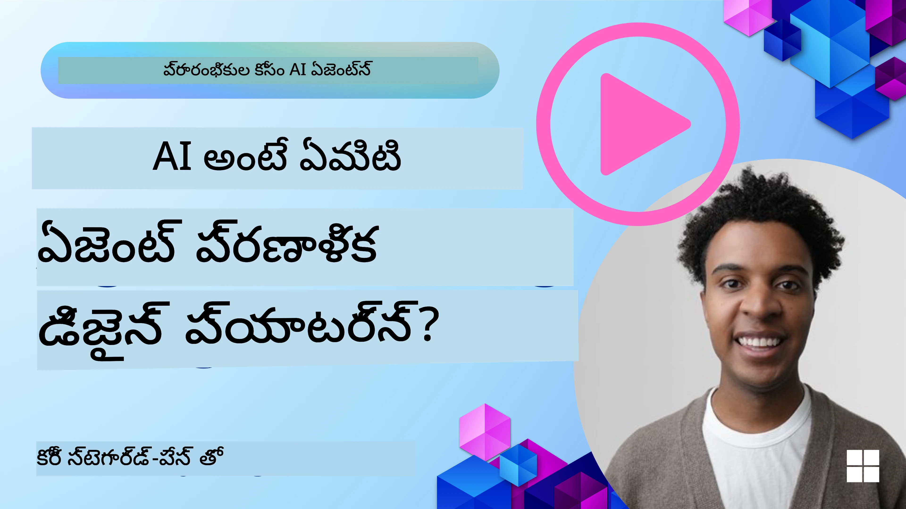
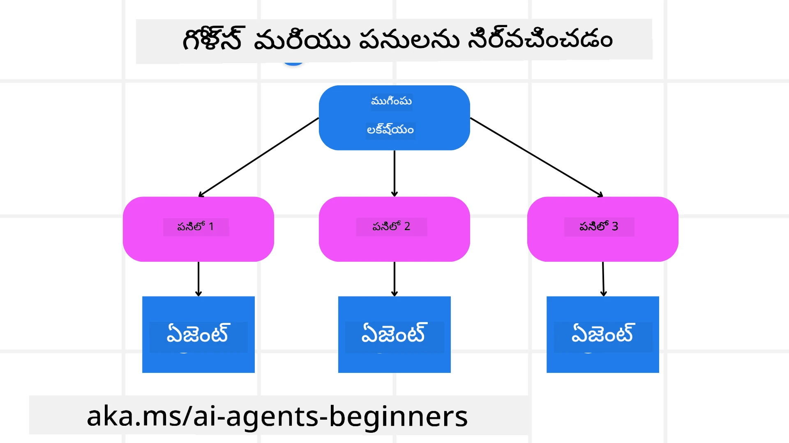

[](https://youtu.be/kPfJ2BrBCMY?si=9pYpPXp0sSbK91Dr)

> _(ఈ పాఠానికి సంబంధించిన వీడియోను చూడటానికి పై చిత్రాన్ని క్లిక్ చేయండి)_

# ప్రణాళిక రూపకల్పన

## పరిచయం

ఈ పాఠం కింద పేర్కొన్న విషయాలు ఉంటాయి

* స్పష్టమైన మొత్తం లక్ష్యాన్ని నిర్వచించడం మరియు సంక్లిష్ట పనిని నిర్వహించదగిన పనులుగా విభజించడం.
* మరింత విశ్వసనీయమైన మరియు యంత్రం చదవగలిగే స్పందనల కోసం నిర్మిత అవుట్పుట్‌ను ఉపయోగించడం.
* డైనమిక్ పనులను మరియు ఆకస్మిక ఇన్‌ పుట్‌లను నిర్వహించడానికి ఈవెంట్-డ్రైమెమైన విధానాన్ని వర్తించటం.

## నేర్చుకునే లక్ష్యాలు

ఈ పాఠం పూర్తయితే, మీరు ఈ విషయాలను అర్థం చేసుకోవచ్చు:

* AI ఏజెంట్ కోసం మొత్తం లక్ష్యాన్ని గుర్తించటం మరియు సెట్ చేయటం, దాని చేత సాధించవలసినది స్పష్టంగా తెలుసుకోవడం.
* సంక్లిష్ట పనిని నిర్వహించదగిన ఉపపనులుగా విభజించి, వాటిని తర్కానుగుణమైన క్రమంలో ఏర్పాటు చేయడం.
* ఏజెంట్లను సరైన పరికరాలతో (ఉదా: శೋಧన పరికరాలు లేదా డేటా విశ్లేషణ పరికరాలు) సమకూర్చటం, అవి ఎప్పుడు మరియు ఎలా ఉపయోగించబడతాయి నిర్ణయించటం, మరియు ఆశ్చర్యకరమైన పరిస్థితులను నియంత్రించటం.
* ఉపపనుల ఫలితాలను మూల్యాంకనం, పనితీరు గమనిస్తూ, చివరి అవుట్పుట్ను మెరుగుపరచడానికి చర్యలను పునరావృతం చేయడం.

## మొత్తం లక్ష్యాన్ని నిర్వచించడం మరియు పనిని విభజించడం



చాలా రియల్ వరల్డ్ పనులు ఒక్కో దశలోనే పరిష్కరించడానికి చాలా సంక్లిష్టమైనవి. AI ఏజెంట్ కు దాని ప్రణాళికకు మరియు చర్యలకు మార్గదర్శకంగా ఒక సంక్షిప్త లక్ష్యం అవసరం. ఉదాహరణకు, ఈ లక్ష్యాన్ని పరిశీలించండి:

    "ఒక 3-రోజుల ప్రయాణం రొటు పథకం సృష్టించండి."

ఇది సులభంగా పేర్కొనవచ్చినది కాని ఇంకా మెరుగుదల అవసరం. లక్ష్యం స్పష్టంగా ఉంటే, ఏజెంట్ (మరియు ఏమైనా మనవీ సహాయగార్లు) సరైన ఫలితాన్ని సాధించడంలో మరింత దృష్టి పెట్టగలుగుతారు, ఉదాహరణకు విమానాల ఎంపికలు, హోటల్ సిఫారసులు, మరియు క్రియాశీలత సూచనలతో సమగ్ర రొటు పథకం తయారు చేయడం.

### పనుల విభజన

పెద్ద లేదా సంక్లిష్ట పనులు చిన్న, లక్ష్యంతో కూడిన ఉప పనులుగా విభజించబడితే నిర్వహించడం సులభమౌతుంది.
ప్రయాణం రొటు పథకం ఉదాహరణకు, లక్ష్యాన్ని ఇలా విభజించవచ్చు:

* విమాన బుకింగ్
* హోటల్ బుకింగ్
* కారు అద్దె
* వ్యక్తిగతీకరణ

ప్రతి ఉపపని ప్రత్యేక ఏజెంట్లు లేదా ప్రక్రియల చేత నిర్వహించబడవచ్చు. ఒక ఏజెంట్ ఉత్తమ విమాన డీల్స్ కోసం శోధించడానికి ప్రత్యేకత కలిగి ఉండవచ్చు, మరొకటి హోటల్ బుకింగ్స్ పై దృష్టి పెట్టవచ్చు, తదాబితి. ఒక సమన్వయ లేదా “డౌన్‌స్ట్రీమ్” ఏజెంట్ ఈ ఫలితాలను ఒక సమగ్ర రొటు పథకంగా చివరి వినియోగదారుకి సమర్పించవచ్చు.

ఈ మాడ్యులర్ విధానం కూడా దశల వారీ మెరుగుదలలకు అనుకూలంగా ఉంటుంది. ఉదా: మీరు ఫుడ్ సిఫారసులు లేదా స్థానిక కార్యకలాప సూచనలు కోసం ప్రత్యేక ఏజెంట్లను చేర్చవచ్చు మరియు సమయానుకూలంగా రొటు పథకాన్ని మెరుగుపరిచే అవకాశం ఉంటుంది.

### నిర్మిత అవుట్పుట్

పెద్ద భాషా నమూనాలు (LLMs) నిర్మిత అవుట్పుట్ (ఉదా: JSON) సృష్టించగలవు, ఇది డౌన్‌స్ట్రీమ్ ఏజెంట్లు లేదా సేవలచే విశ్లేషించడానికి మరియు ప్రాసెస్ చేసుకోవడానికి సులభంగా ఉంటుంది. ఇది ప్రధానంగా బహుళ-ఏజెంట్ పరిణామంలో ఉపయోగకరమే, ఎప్పుడు మనం ప్రణాళిక నుండి వచ్చిన అవుట్పుట్‌ను తీసుకొని ఆ పనులను నమోదు చేయవచ్చు.

క్రింది Python కోడ్ ఒక సాధారణ ప్రణాళిక ఏజెంట్ యొక్క లక్ష్యాన్ని ఉపపనులుగా విభజించి నిర్మిత ప్రణాళిక రూపొందించే విధానాన్ని చూపిస్తోంది:

```python
from pydantic import BaseModel
from enum import Enum
from typing import List, Optional, Union
import json
import os
from typing import Optional
from pprint import pprint
from agent_framework.foundry import FoundryChatClient
from azure.identity import AzureCliCredential

class AgentEnum(str, Enum):
    FlightBooking = "flight_booking"
    HotelBooking = "hotel_booking"
    CarRental = "car_rental"
    ActivitiesBooking = "activities_booking"
    DestinationInfo = "destination_info"
    DefaultAgent = "default_agent"
    GroupChatManager = "group_chat_manager"

# ప్రయాణ ఉపకార్య నమూనా
class TravelSubTask(BaseModel):
    task_details: str
    assigned_agent: AgentEnum  # మేము టాస్క్ ను ఏజెంట్ కు కేటాయించాలనుకుంటున్నాము

class TravelPlan(BaseModel):
    main_task: str
    subtasks: List[TravelSubTask]
    is_greeting: bool

provider = FoundryChatClient(
    project_endpoint=os.environ["AZURE_AI_PROJECT_ENDPOINT"],
    model=os.environ["AZURE_AI_MODEL_DEPLOYMENT_NAME"],
    credential=AzureCliCredential(),
)

# యూజర్ సందేశాన్ని నిర్వచించండి
system_prompt = """You are a planner agent.
    Your job is to decide which agents to run based on the user's request.
    Provide your response in JSON format with the following structure:
{'main_task': 'Plan a family trip from Singapore to Melbourne.',
 'subtasks': [{'assigned_agent': 'flight_booking',
               'task_details': 'Book round-trip flights from Singapore to '
                               'Melbourne.'}
    Below are the available agents specialised in different tasks:
    - FlightBooking: For booking flights and providing flight information
    - HotelBooking: For booking hotels and providing hotel information
    - CarRental: For booking cars and providing car rental information
    - ActivitiesBooking: For booking activities and providing activity information
    - DestinationInfo: For providing information about destinations
    - DefaultAgent: For handling general requests"""

user_message = "Create a travel plan for a family of 2 kids from Singapore to Melbourne"

response = client.create_response(input=user_message, instructions=system_prompt)

response_content = response.output_text
pprint(json.loads(response_content))
```

### బహుళ-ఏజెంట్ సమన్వయంతో ప్రణాళిక ఏజెంట్

ఈ ఉదాహరణలో, ఒక సెమెంటిక్ రౌటర్ ఏజెంట్ వినియోగదారు అభ్యర్థన (ఉదా: "నా ప్రయాణానికి హోటల్ ప్రణాళిక కావాలి.") స్వీకరిస్తుంది.

ఆ తర్వాత ప్రణాళికకర్త:

* హోటల్ ప్రణాళికను స్వీకరిస్తుంది: ప్రణాళికకర్త వినియోగదారు సందేశాన్ని తీసుకుని, సిస్టమ్ ప్రాంప్ట్ ఆధారంగా (అందుబాటులో ఉన్న ఏజెంట్ వివరాలతో సహా), నిర్మిత ప్రయాణ ప్రణాళికను సృష్టిస్తుంది.
* ఏజెంట్లు మరియు వారి పరికరాల జాబితాను చూపిస్తుంది: ఏజెంట్ రిజిస్ట్రీ లో ఏజెంట్ల జాబితా ఉంటుంది (ఉదా: విమాన, హోటల్, కారు అద్దె మరియు కార్యకలాపాల కోసం) మరియు అవి అందించే ఫంక్షన్లు లేదా పరికరాలు.
* ప్రణాళికను సంబంధిత ఏజెంట్లకు పంపిస్తుంది: ఉప పనుల సంఖ్యపై ఆధారపడి, ప్రణాళికకర్త సందేశాన్ని ఒక ప్రత్యేక ఏజెంట్ కు (ఒక్క పని సందర్భాలలో) లేదా బహుళ ఏజెంట్ల సహకారానికి గ్రూప్ చాట్ మేనేజర్ ద్వారా సమన్వయం చేస్తుంది.
* ఫలితాన్ని సారాంశం చేస్తుంది: చివరికి, సమగ్రత కోసం ప్రణాళిక సమ్మరీ చేస్తుంది.
క్రింది Python కోడ్ ఉదాహరణ ఈ దశలను చూపిస్తుంది:

```python

from pydantic import BaseModel

from enum import Enum
from typing import List, Optional, Union

class AgentEnum(str, Enum):
    FlightBooking = "flight_booking"
    HotelBooking = "hotel_booking"
    CarRental = "car_rental"
    ActivitiesBooking = "activities_booking"
    DestinationInfo = "destination_info"
    DefaultAgent = "default_agent"
    GroupChatManager = "group_chat_manager"

# ప్రయాణ ఉపకార్యం మోడల్

class TravelSubTask(BaseModel):
    task_details: str
    assigned_agent: AgentEnum # మేము ఈ టాస్క్‌ను ఏజెంట్‌కు కేటాయించాలని కోరుకుంటున్నాం

class TravelPlan(BaseModel):
    main_task: str
    subtasks: List[TravelSubTask]
    is_greeting: bool
import json
import os
from typing import Optional

from agent_framework.foundry import FoundryChatClient
from azure.identity import AzureCliCredential

# క్లయింట్‌ను సృష్టించండి

provider = FoundryChatClient(
    project_endpoint=os.environ["AZURE_AI_PROJECT_ENDPOINT"],
    model=os.environ["AZURE_AI_MODEL_DEPLOYMENT_NAME"],
    credential=AzureCliCredential(),
)

from pprint import pprint

# వినియోగదారు సందేశాన్ని నిర్వచించండి

system_prompt = """You are a planner agent.
    Your job is to decide which agents to run based on the user's request.
    Below are the available agents specialized in different tasks:
    - FlightBooking: For booking flights and providing flight information
    - HotelBooking: For booking hotels and providing hotel information
    - CarRental: For booking cars and providing car rental information
    - ActivitiesBooking: For booking activities and providing activity information
    - DestinationInfo: For providing information about destinations
    - DefaultAgent: For handling general requests"""

user_message = "Create a travel plan for a family of 2 kids from Singapore to Melbourne"

response = client.create_response(input=user_message, instructions=system_prompt)

response_content = response.output_text

# JSONగా లోడ్ చేసిన తర్వాత ప్రతిస్పందన కంటెంట్‌ను ముద్రించండి

pprint(json.loads(response_content))
```

తర్వాత కోడ్ కార్యాచరణ ఫలితాన్ని మరియు మీరు ఆ నిర్మిత అవుట్పుట్ ను `assigned_agent` కు పంపి, ప్రయాణ ప్రణాళికని చివరి వినియోగదారుకు సారాంశం చేయవచ్చు.

```json
{
    "is_greeting": "False",
    "main_task": "Plan a family trip from Singapore to Melbourne.",
    "subtasks": [
        {
            "assigned_agent": "flight_booking",
            "task_details": "Book round-trip flights from Singapore to Melbourne."
        },
        {
            "assigned_agent": "hotel_booking",
            "task_details": "Find family-friendly hotels in Melbourne."
        },
        {
            "assigned_agent": "car_rental",
            "task_details": "Arrange a car rental suitable for a family of four in Melbourne."
        },
        {
            "assigned_agent": "activities_booking",
            "task_details": "List family-friendly activities in Melbourne."
        },
        {
            "assigned_agent": "destination_info",
            "task_details": "Provide information about Melbourne as a travel destination."
        }
    ]
}
```

క్రింది ఉదాహరణ నోట్‌బుక్ ఇక్కడ నుండి పొందవచ్చు [here](./code_samples/07-python-agent-framework.ipynb).

### పునరావృత ప్రణాళిక

కొంతపని తిరిగి తిరిగి లేదా పున: ప్రణాళిక అవసరం అవుతుంది, ఒక ఉప పని ఫలితం తరువాత పనిని ప్రభావితం చేస్తుంది. ఉదాహరణకు, ఏజెంట్ విమానాలను బుక్ చేస్తున్నప్పుడు ఒక అనూహ్యమైన డేటా ఫార్మాట్ కనుగొంటే, హోటల్ బుకింగ్స్ కు ముందుకు కుందానికి ముందుగా తన వ్యూహాన్ని మార్చుకోవాల్సి ఉంటుంది.

అదనంగా, వినియోగదారు ప్రతిస్పందన (ఉదా: ఒక మనిషి ముందే విమానం తీసుకోవాలని నిర్ణయించడంతో) పాక్షిక పున: ప్రణాళికను ప్రారంభిస్తుంది. ఈ డైనమిక్, పునరావృత విధానం చివరి పరిష్కారం వాస్తవిక పరిమితులు మరియు అభివృద్ధి చెందుతున్న వినియోగదారు అభిరుచులకు సరిపోయేలా చేస్తుంది.

ఉదాహరణ కోడ్

```python
import os
from agent_framework.foundry import FoundryChatClient
from azure.identity import AzureCliCredential
#.. మునుపటి కోడ్‌లాగే మరియు వాడుకరి చరిత్ర, ప్రస్తుత ప్రణాళికను అందించండి

system_prompt = """You are a planner agent to optimize the
    Your job is to decide which agents to run based on the user's request.
    Below are the available agents specialized in different tasks:
    - FlightBooking: For booking flights and providing flight information
    - HotelBooking: For booking hotels and providing hotel information
    - CarRental: For booking cars and providing car rental information
    - ActivitiesBooking: For booking activities and providing activity information
    - DestinationInfo: For providing information about destinations
    - DefaultAgent: For handling general requests"""

user_message = "Create a travel plan for a family of 2 kids from Singapore to Melbourne"

response = client.create_response(
    input=user_message,
    instructions=system_prompt,
    context=f"Previous travel plan - {TravelPlan}",
)
# .. తిరిగి ప్రణాళిక చేయండి మరియు సంబంధిత ఏజెంట్లకు పనులను పంపండి
```

సంక్లిష్ట పనులు పరిష్కరించడానికి Magnetic One <a href="https://www.microsoft.com/research/articles/magentic-one-a-generalist-multi-agent-system-for-solving-complex-tasks" target="_blank">బ్లాగ్ పోస్ట్</a> ను మరింత పూర్తిగా ప్రణాళిక కోసం చూడండి.

## సారాంశం

ఈ వ్యాసంలో మేము అందుబాటులో ఉన్న ఏజెంట్లను డైనమిక్ గా ఎంచుకునే ప్రణాళికను ఎలా సృష్టించాలో చూశాము. ప్రణాళిక ఏజెంట్ పనులను విభజించి ఏజెంట్లకు కేటాయిస్తుంది తద్వారా అవి అమలు చేయబడతాయి. ఏజెంట్లు పనిని నిర్వహించడానికి అవసరమైన ఫంక్షన్లు/పరికరాలను ప్రాప్తించగలుగుతాయని అనుకుంటారు. ఏజెంట్లకు తోడు ప్రతిబింబం, సారాంశకర్త, మరియు రౌండ్ రోబిన్ చాట్ వంటి ఇతర నమూనాలను కూడా చేర్చుకోవచ్చు మరింత అనుకూలీకరించేందుకు.

## అదనపు వనరులు

Magentic One - సంక్లిష్ట పనులను పరిష్కరించడానికి సాధారణ బహుళ ఏజెంట్ వ్యవస్థ మరియు బహుళ సవాలు ఏజెంటిక్ బెంచుమార్క్స్ లో అద్భుత ఫలితాలను సాధించింది. సూచన: <a href="https://www.microsoft.com/research/articles/magentic-one-a-generalist-multi-agent-system-for-solving-complex-tasks" target="_blank">Magentic One</a>. ఈ అమలు లో ఆర్కెస్ట్రేటర్ పని ప్రత్యేక ప్రణాళికలను సృష్టించి అందుబాటులో ఉన్న ఏజెంట్లకు ఆ పనులను కేటాయిస్తుంది. ప్రణాళికతో పాటు ఆర్కెస్ట్రేటర్ పని పురోగతిని పర్యవేక్షించడానికి ట్రాకింగ్ విధానాన్ని కూడా ఉపయోగించి, అవసరమైతే తిరిగి ప్రణాళిక చేస్తుంది.

### ప్రణాళిక రూపకల్పన నమూనా గురించి మరిన్ని ప్రశ్నలున్నాయా?

ఇతర అభ్యర్థులతో కలుసుకోవడానికి, కార్యాలయ గంటల్లో పాల్గొనడానికి మరియు మీ AI ఏజెంట్స్ కు సంబంధించిన ప్రశ్నలకు సమాధానం పొందడానికి [Microsoft Foundry Discord](https://discord.com/invite/ATgtXmAS5D) లో చేరండి.

## ఇటీవల పాఠం

[నమ్మకమైన AI ఏజెంట్స్ నిర్మించడం](../06-building-trustworthy-agents/README.md)

## తదుపరి పాఠం

[బహుళ ఏజెంట్ రూపకల్పన నమూనా](../08-multi-agent/README.md)

---

<!-- CO-OP TRANSLATOR DISCLAIMER START -->
**అస్వీకరణ**:
ఈ పత్రం AI అనువాద సేవ [Co-op Translator](https://github.com/Azure/co-op-translator) ఉపయోగించి అనువదించబడింది. మేము ఖచ్చితత్వానికి ప్రయత్నిస్తున్నప్పటికీ, ఆటోమేటెడ్ అనువాదాలు తప్పులు లేదా అసమగ్రతలను కలిగి ఉండవచ్చు. దాని స్వదేశ భాషలో ఉన్న అసలు పత్రాన్ని అధికారం కలిగిన మూలంగా పరిగణించాలి. కీలకమైన సమాచారం కోసం, ప్రొఫెషనల్ మానవ అనువాదాన్ని సిఫారసు చేస్తాము. ఈ అనువాదం ఉపయోగం వల్ల కలిగే ఏవైనా అపార్థాలు లేదా తప్పుదారులు కోసం మేము బాధ్యత వహించము.
<!-- CO-OP TRANSLATOR DISCLAIMER END -->