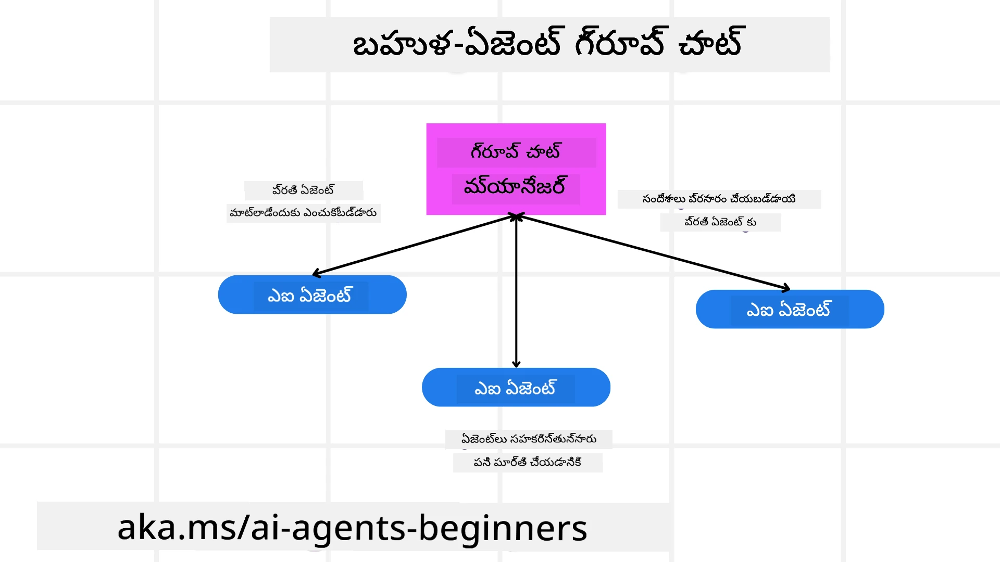
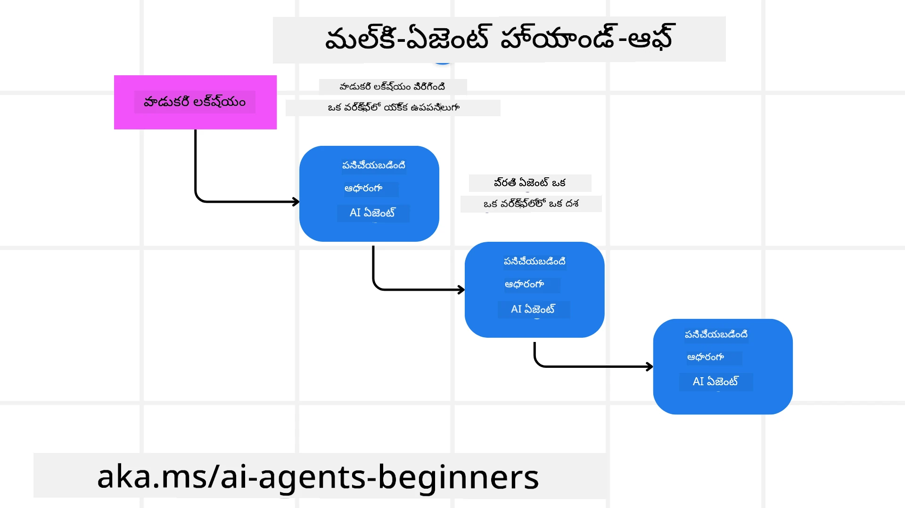
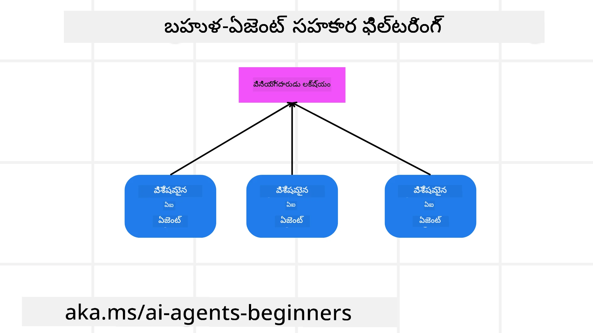

> _(ఈ పాఠానికి సంబంధించిన వీడియోను చూడటానికి పై చిత్రం‌పై క్లిక్ చేయండి)_

# బహుళ ఏజెంట్ల డిజైన్ నమూనాలు

మీరు బహుళ ఏజెంట్లను కలిగిన ప్రాజెక్టుపై పనిచేయడం ప్రారంభిస్తే వెంటనే, బహుళ ఏజెంట్ల డిజైన్ నమూనా గురించి ఆలోచించవలసి ఉంటుంది. అయితే, ఎప్పుడు బహుళ ఏజెంట్లకు మారాలి మరియు వాటి ప్రయోజనాలు ఏమిటి అనే విషయం వెంటనే అర్థంకావచ్చు కాదు.

## పరిచయం

ఈ పాఠంలో మేము క్రింది ప్రశ్నలకు ఉత్తరాలు చూడాలనుకుంటున్నాము:

- బహుళ ఏజెంట్లు వర్తించదగిన పరిస్థితులేమిటి?
- ఒక ఏజెంట్ బహుళ పనులు చేయడం కన్నా బహుళ ఏజెంట్లు ఉపయోగించే లాభాలు ఏమిటి?
- బహుళ ఏజెంట్ల డిజైన్ నమూనా అమలులో కావలసిన నిర్మాణ భాగాలు ఏమిటి?
- బహుళ ఏజెంట్లు ఒకరికొకరు ఎలా పరస్పరం చర్యలలో ఉంటున్నాయో ఎలా చూడగలం?

## నేర్చుకునే లక్ష్యాలు

ఈ పాఠం ముగిసిన తర్వాత, మీరు చేయగలిగేది:

- బహుళ ఏజెంట్లు వర్తించదగిన పరిస్థితులను గుర్తించడం
- ఒక్క ఏజెంట్ కంటే బహుళ ఏజెంట్ల ఉపయోగాన్ని గుర్తించడం
- బహుళ ఏజెంట్ల డిజైన్ నమూనా అమలులో నిర్మాణ భాగాల అర్థం చేసుకోవడం

పెద్ద చిత్రమేమిటి?

*బహుళ ఏజెంట్లు అనేవి అనేక ఏజెంట్లు కలిసి ఒక సాధారణ లక్ష్యాన్ని చేరుకోవడానికి సహకరించే డిజైన్ నమూనా*.

ఈ నమూనా రొబోటిక్స్, స్వయంచాలక వ్యవస్థలు మరియు పంపిణీ కంప్యూటింగ్ వంటి విభిన్న రంగాల్లో విస్తృతంగా ఉపయోగించబడుతుంది.

## బహుళ ఏజెంట్లు వర్తించదగిన పరిస్థితులు

ఇప్పుడు ఏ సందర్భాల్లో బహుళ ఏజెంట్లను ఉపయోగించడం మంచిది అన్న విషయం చూద్దాం. ముఖ్యంగా క్రింది సందర్భాల్లో బహుళ ఏజెంట్లను ఉపయోగించడం లాభదాయకమే:

- **ప్రచండ పని భారం**: పెద్ద పనులను చిన్న పాక్షికాలుగా విభజించి, వాటిని వేరు వేరు ఏజెంట్లకు కేటాయించడం తో సమాంతరంగా ప్రాసెసింగ్ చేసి వేగంగా పూర్తి చేయవచ్చు. ఉదాహరణకు, భారీ డేటా ప్రాసెసింగ్ పని కేసు.
- **సంక్లిష్ట పనులు**: పెద్ద పని భారముల్లా, సంక్లిష్ట పనులను చిన్న భాగాలుగా విభజించి వాటిని ప్రత్యేక అంశాలలో నిపుణులు ఏజెంట్లకు కేటాయించవచ్చు. ఉదాహరణకు, ఆటోనమస్ వాహనాల్లో వేరు ఏజెంట్లు నావిగేషన్, అడ్డంకులు గుర్తింపు, వాహనాల మధ్య సంబంధం నిర్వహణ చేస్తాయి.
- **వివిధ నైపుణ్యాలు**: వేరు ఏజెంట్లు వివిధ నైపుణ్యాలతో ఉండొచ్చు, అందువల్ల ఒక ఏజెంట్ కంటే తన సహకారంతో పనిని మెరుగ్గా చేయగలుగుతారు. ఉదాహరణకు, ఆరోగ్య పరిరక్షణలో ఏజెంట్లు డయాగ్నోస్టిక్స్, చికిత్సా ప్రణాళికలు, రోగి పర్యవేక్షణ నిర్వహిస్తుంటారు.

## ఒక ఏజెంట్ కంటే బహుళ ఏజెంట్ల ఉపయోగాల లాభాలు

ఒక ఏజెంట్ వ్యవస్థ సులభమైన పనులకోసం బాగుంటుంది, కాని సంక్లిష్ట పనుల కోసం బహుళ ఏజెంట్లు ఉపయోగించడం అనేక ప్రయోజనాలు ఇస్తుంది:

- **ప్రత్యేకత**: ప్రతి ఏజెంట్ ఒక నిర్దిష్ట పనిలో ప్రత్యేకత కలిగి ఉంటుంది. ఒక ఏజెంట్ ప్రత్యేకత లేకపోవడం అంటే అన్ని పనులు చేయగలనంటూ అయిపోతుంది కానీ సంక్లిష్ట పనులు వచ్చినప్పుడు ఏ పని చేయాలో గందరగోళ పడుతుంది. ఫలితంగా తగిన పనిని చేయకపోవచ్చు.
- **ప్రామాణికత**: ఒక ఏజెంట్ కు బదులు మరిన్ని ఏజెంట్లు జోడించడం వల్ల వ్యవస్థలను పెంచడం సులభం.
- **పగగొట్టడం సహనం**: ఒక ఏజెంట్ విఫలమైతే, ఇతర ఏజెంట్లు పని కొనసాగించగలరు, ఇది వ్యవస్థ విశ్వసనీయత నిర్ధారిస్తుంది.

ఉదాహరణకు, ఒక యూజర్ కోసం ప్రయాణం బుక్ చేసుకుందాం. ఒక ఏజెంట్ వ్యవస్థ అన్ని పనులను చూసుకోవాలి: విమానాలు కనుగొనడం, హోటల్లు మరియు రెంటల్ కార్ల బుకింగ్. ఒక ఏజెంట్‌తో ఈ పనులు నిర్వహించాలి అంటే ఆ ఏజెంట్‌కు ఇవి అన్నీ చేసేందుకు కౌశలాలు అవసరం. ఇది ఒక క్లిష్టమైన, పెద్ద ఐక్య వ్యవస్థ అవుతుంది, నిర్వహించడం మరియు పెంచడం క్లిష్టం. ఇదే పని బహుళ ఏజెంట్లతో చేయాలంటే వేరు వేరు ఏజెంట్లు విమానాలు అందించడం, హోటల్లు బుక్ చేయడం, రెంటల్ కార్లు బుక్ చేయడం చేయగలుగుతాయి. ఇది వ్యవస్థను మాడ్యూలర్ గా, నిర్వహించడానికి సులభంగా, పెంచిపెట్టడానికి అనుకూలంగా చేస్తుంది.

ఇది ఒక ట్రావెల్ ఏజెన్సీ—మామ్-అండ్-పాప్ స్టోర్ వలె నడిపించబడిన సంస్థ (ఒక్క ఏజెంట్) మరియు ఫ్రాంచైజీ లాగా నడిపించబడిన సంస్థ మధ్య తేడా ఉంది. మామ్-అండ్-పాప్ స్టోర్లో అన్ని పలు పనులను ఒక ఏజెంట్ చూసుకుంటుంది, కానీ ఫ్రాంచైజీలో వేరు ఏజెంట్లు వేరు పనులు చూసుకుంటారు.

## బహుళ ఏజెంట్ల డిజైన్ నమూనా అమలులో నిర్మాణ భాగాలు

బహుళ ఏజెంట్ల డిజైన్ నమూనా అమలు చేసే ముందు, దీని నిర్మాణ భాగాలను అర్థం చేసుకోవాలి.

మళ్ళీ ఒక యూజర్ ప్రయాణం బుక్ చేసుకోవడాన్ని ఉదాహరణగా తీసుకుందాము. ఈ సందర్భంలో నిర్మాణ భాగాలు:

- **ఏజెంట్ కమ్యూనికేషన్**: విమానాలు కనుగొనే ఏజెంట్, హోటల్లు బుక్ చేసే ఏజెంట్, రెంటల్ కార్లు బుక్ చేసే ఏజెంట్ మధ్య యూజర్ ఇష్టాలు, పరిమితుల గురించి సమాచారాన్ని పంచుకోవాలి. ఈ కమ్యూనికేషన్ కోసం గాని ప్రోటోకాల్‌లు, గాని పద్ధతులు నిర్ణయించాలి. ఉదాహరణకు, విమానాలు కనుగొనే ఏజెంట్ హోటల్ బుక్ చేసే ఏజెంట్‌తో చర్చించి, హోటల్ కూడా విమానం ప్రయాణ తేదీలకు అనుగుణంగా బుక్ అయ్యేలా చూసుకోవాలి. అంటే ఏ ఏజెంట్లు సమాచారం పంచుకుంటున్నారో, ఎలా పంచుకుంటున్నారో నిర్ణయించాలి.
- **సమన్వయ యంత్రాంగాలు**: ఏజెంట్లు యూజర్ ఇష్టాలు మరియు పరిమితులను పాటించాలని సమన్వయం కావాలి. ఉదాహరణకు, యూజర్ ఏయిర్‌పోర్ట్ దగ్గర హోటల్ కావాలనే ఇష్టం ఉంటే, రెంటల్ కార్లు మాత్రం కేవలం ఏయిర్‌పోర్ట్ వద్ద లభించాలి వంటి పరిమితి ఉన్నప్పుడు హోటల్లు బుక్ చేసే ఏజెంట్, రెంటల్ కార్లు బుక్ చేసే ఏజెంట్ సమన్వయం అవసరం. అంటే ఏజెంట్లు తమ చర్యల సమన్వయాన్ని ఎలా నిర్వహిస్తాయో నిర్ణయించాలి.
- **ఏజెంట్ నిర్మాణం**: ఏజెంట్లకు నిర్ణయాలు తీసుకోవడానికీ, యూజర్ ఇంటరాక్షన్స్ ఆధారంగా నేర్చుకోవడానికీ అంతర్గత నిర్మాణం అవసరం. ఉదాహరణకు, విమానాలు కనుగొనే ఏజెంట్ ఎంత బాగా ఎటువంటి విమానాలు సిఫార్సు చేయాలో నిర్ణయించాలి. అంటే ఏజెంట్లు ఎలా నిర్ణయాలు తీసుకుంటున్నారో, ఎలా నేర్చుకుంటున్నారో నిర్ణయించాలి. ఉదాహరణకు ఒక ఏజెంట్ పూర్వపు ఇష్టాల ఆధారంగా యంత్ర అభ్యాస మోడల్ ఉపయోగించి విమానాలను సిఫార్సు చేయవచ్చు.
- **బహుళ ఏజెంట్ పరస్పర చర్యల లో దర్శనం**: ఏజెంట్లు ఒకరినొకరు ఎలా పరస్పరం చర్యలలో ఉన్నారో చూడగలవలసి ఉంటుంది. దీని కొరకు ఏజెంట్ కార్యకలాపాలు మరియు పరస్పర చర్యలు ట్రాక్ చేయడానికి సాధనాలు, సాంకేతికతలు అవసరం. ఎలాంటి సాధనాలు అంటే లాగింగ్, మానిటరింగ్, విజువలైజేషన్, పనితీరు మెట్రిక్స్ వంటివి.
- **బహుళ ఏజెంట్ నమూనాలు**: బహుళ ఏజెంట్ వ్యవస్థలను అమలు చేయడానికి సెంట్రలైజ్డ్, డీసెంట్రలైజ్డ్, హైబ్రిడ్ నిర్మాణాల వంటివి వేర్వేరు నమూనాలు ఉన్నాయి. మీ వినియోగానికి అనుగుణంగా సరైన నమూనా ఎంచుకోవాలి.
- **మనిషి భాగస్వామ్యం**: చాలా సందర్భాల్లో మనిషి భాగస్వామ్యం ఉంటుంది. ఏజెంట్లు ఎప్పుడు మానవ జోక్యం కావాలని అడగాలో సూచనలు ఇవ్వాలి. ఉదాహరణకు, యూజర్ నిర్దిష్ట హోటల్ లేదా విమానం అడిగితే లేదా బుకింగ్ ముందు నిర్ధారణ కోరితే.

## బహుళ ఏజెంట్ పరస్పర చర్యల లో దర్శనం

ఏజెంట్లు ఒకదానితో ఒకటి ఎలా చర్యలలో ఉన్నదో అధ్యయనం చేయడం, డీబగ్గింగ్, ఆప్టిమైజేషన్, మొత్తం వ్యవస్థ పనితీరును పాటించడానికి ముఖ్యం. అందుకోసం ఏజెంట్ కార్యకలాపాలు, పరస్పర చర్యలు ట్రాక్ చేసేందుకు లాగింగ్, మానిటరింగ్, విజువలైజేషన్, పనితీరు మెట్రిక్స్ వంటివి అవసరం.

ఉదాహరణకు, ప్రయాణం బుక్ చేసే వ్యవస్థలో ప్రతి ఏజెంట్ స్థితిని, యూజర్ ఇష్టాలు మరియు పరిమితులు, ఏజెంట్ల మధ్య చర్యలను చూపే డాష్‌బోర్డ్ ఉండొచ్చు. ఇందులో యూజర్ ప్రయాణ తేదీలు, విమాన సిఫార్సులు, హోటల్ సిఫార్సులు, రెంటల్ కార్లు సిఫార్సులు కనిపిస్తాయి. ఇది ఏజెంట్లు ఎలా పరస్పరం చర్యలలో ఉన్నాయో అర్థం చేసుకోవటానికి సహాయకం.

ఇవి కావాలంటే క్రింది అంశాలను మరింత వివరంగా చూద్దాం:

- **లాగింగ్ మరియు మానిటరింగ్ సాధనాలు**: ప్రతి ఏజెంట్ చేసిన చర్య ఒక లాగ్‌గా నమోదు చేయాలి. ఇందులో ఏ ఏజెంట్ చర్య చేసింది, ఏ చర్య చేసింది, ఎప్పుడు చేసింది, ఫలితం ఏంటి వంటి సమాచారాలు ఉంటాయి. దీని ద్వారా డీబగ్గింగ్, ఆప్టిమైజేషన్ జరగవచ్చు.
- **విజువలైజేషన్ సాధనాలు**: ఏజెంట్ల మధ్య సమాచార ప్రవాహాన్ని గ్రాఫ్ రూపంలో చూడటం ద్వారా సులభంగా అవగాహన పొందవచ్చు. దీనివల్ల వ్యవస్థలోని ఇబ్బందులు, అకస్మాత్తులు గుర్తించవచ్చు.
- **పనితీరు మెట్రిక్స్**: వ్యవస్థ పనితీరును కొలవడానికి వివిధ సూచికలు ఉపయోగించాలి. ఉదాహరణకు, పని పూర్తి కావడానికి తీసుకున్న సమయం, యూనిట్ సమయానికి పూర్తయ్యే పనుల సంఖ్య, ఏజెంట్ల ఇచ్చే సిఫార్సుల ఖచ్చితత్వం. ఈ సమాచారంతో వ్యవస్థ మెరుగుపరుచుకోవచ్చు.

## బహుళ ఏజెంట్ నమూనాలు

బహుళ ఏజెంట్ యాప్స్ రూపొందించడానికి ఉపయోగించే కొన్ని నమూనాలతో పరిచయం చేద్దాం. ఆసక్తికరమైన నమూనాలు:

### గ్రూప్ చాట్

ఈ నమూనా అనేక ఏజెంట్లు పరస్పరం చర్చించాలనుకున్నప్పుడు ఉపయోగపడుతుంది. టీం సహకారం, కస్టమర్ సపోర్ట్, సోషల్ నెట్‌వర్కింగ్ వంటివి సాధారణ సందర్భాలు.

ప్రతి ఏజెంట్ గ్రూప్ చాట్‌లో ఒక యూజర్‌ను ప్రతిబింబిస్తుంది, మెసేజ్‌లు messaging ప్రోటోకాల్ ద్వారా మార్పిడి అవుతాయి. ఏజెంట్లు గ్రూప్ చాట్‌కు సందేశాలు పంపగలరు, గ్రూప్ చాట్ నుండి సందేశాలు అందుకోగలరు, ఇతర ఏజెంట్ల సందేశాలకు స్పందించగలరు.

దీన్ని centralized నిర్మాణంలో అన్నీ సందేశాలు సెంట్రల్ సర్వర్ ద్వారా వెళ్లేవిధంగా, లేదా decentralized నిర్మాణంలో ప్రత్యక్షంగా సందేశాలు మార్పిడి జరుగుతున్న విధంగా అమలు చేయవచ్చు.

### హ్యాండ్- ఆఫ్

ఈ నమూనాలో ఏజెంట్లు ఒకదానికి ఒకటి పనులను అప్పగించగలుగుతాయి.

కస్టమర్ సపోర్ట్, పని నిర్వహణ, వర్క్‌ఫ్లో ఆటోమేషన్ వంటివి సాధారణ ఉపయోగాలు.

ప్రతి ఏజెంట్ వర్క్‌ఫ్లోలో ఒక పని లేదా దశను సూచిస్తుంది, అనంతర ఏజెంట్లకు పనులను కుదిపేందుకు నియమాలు ఆధారంగా నిర్ణయాలు తీసుకోవచ్చు.

### సహకార వడపోత (Collaborative filtering)

ఐతే, బహుళ ఏజెంట్లు కలిసి యూజర్లకు సిఫార్సులు ఇవ్వడానికి ఉపయోగపడుతుంది.

ప్రతి ఏజెంట్ వేర్వేరు నైపుణ్యాలు కలిగి ఉంటూ సిఫార్సుల ప్రక్రియలో విభిన్నంగా తోడ్పడతారు.

ఉదాహరణగా, స్టాక్ మార్కెట్లో ఉత్తమ స్టాక్ కొనుగోలు సిఫార్సు కావాలనుకుంటే:

- **ఇండస్ట్రీ నిపుణుడు**: ఒక ఏజెంట్ ఒక ప్రత్యేక ఇండస్ట్రీ నిపుణుడవచ్చు.
- **టెక్నికల్ అనాలిసిస్**: మరో ఏజెంట్ టెక్నికల్ విశ్లేషణలో నిపుణుడు.
- **ఫండమెంటల్ అనాలిసిస్**: మరో ఏజెంట్ ఫండమెంటల్ విశ్లేషణలో నిపుణుడు.

ఈ ఏజెంట్లు కలిసి సమగ్రమైన సిఫార్సు ఇవ్వగలుగుతాయి.

## సన్నివేశం: రీఫండ్ ప్రక్రియ

ఒక కస్టమర్ ఉత్పత్తికి రీఫండ్ పొందాలనుకున్న సందర్భంలో, చాలా ఏజెంట్లు పాల్గొనవచ్చు. ఈ చర్య కోసం ప్రత్యేక ఏజెంట్లు మరియు ఇతర సర్వసాధారణ ఏజెంట్లుగా విభజిద్దాం.

**రీఫండ్ ప్రక్రియ కోసం ప్రత్యేక ఏజెంట్లు**:

- **కస్టమర్ ఏజెంట్**: కస్టమర్ పక్షాన్ని ప్రతిబింబిస్తూ రీఫండ్ ప్రక్రియ మొదలుపెడుతుంది.
- **వिक्रేత ఏజెంట్**: రీఫండ్ ప్రాసెస్ నిర్వహిస్తుంది.
- **పేమెంట్ ఏజెంట్**: కస్టమర్ చెల్లింపును తిరిగి ఇస్తుంది.
- **రిజల్యూషన్ ఏజెంట్**: సమస్యలు పరిష్కరిస్తుంది.
- **కంప్లయన్స్ ఏజెంట్**: రీఫండ్ ప్రక్రియ నియమాలను పాటిస్తున్నదో చూసుకుంటుంది.

**సర్వసాధారణ ఏజెంట్లు**:

మీకున్న వ్యాపారానికి ఇతర భాగాల్లో ఉపయోగించవచ్చు.

- **షిప్పింగ్ ఏజెంట్**: ఉత్పత్తిని తిరిగి విక్రేతకు పంపుతుంది. రీఫండ్, సాధారణ షిప్పింగ్ ఇద్దరికీ ఉపయోగపడుతుంది.
- **ఫీడ్‌బ్యాక్ ఏజెంట్**: కస్టమర్ నుండి ఫీడ్‌బ్యాక్ సేకరిస్తుంది. ఇది ఎప్పుడైనా పని చేయవచ్చు.
- **ఎస్కలేషన్ ఏజెంట్**: సమస్యలను ఉన్నత మద్దతు స్థాయికి బోధిస్తుంది. ఏ ప్రక్రియలోనూ ఉపయోగించవచ్చు.
- **నోటిఫికేషన్ ఏజెంట్**: రీఫండ్ ప్రక్రియ యుధ్ధానెల్లో కస్టమర్‌కు సమాచారం పంపిస్తుంది.
- **అనలిటిక్స్ ఏజెంట్**: రీఫండ్ డేటాను విశ్లేషిస్తుంది.
- **ఆడిట్ ఏజెంట్**: రీఫండ్ ప్రక్రియ సరిగా నడిచిపోతుందో తనిఖీ చేస్తుంది.
- **రిపోర్టింగ్ ఏజెంట్**: రీఫండ్ ప్రక్రియపై నివేదికలు తయారు చేస్తుంది.
- **జ్ఞాన ఏజెంట్**: రీఫండ్ మరియు వ్యాపార సమాచార జ్ఞాన భాండాగారం నిర్వహణ.
- **భద్రత ఏజెంట్**: రీఫండ్ ప్రక్రియ భద్రతకు బాధ్యుడు.
- **నాణ్యత ఏజెంట్**: రీఫండ్ ప్రక్రియ నాణ్యత కోసం.

ఇతర సాధారణ ఏజెంట్లతో పాటు ప్రత్యేక రీఫండ్ ఏజెంట్ల వివరణ అందించబడింది. దీనివల్ల మీరు మీ బహుళ ఏజెంట్ వ్యవస్థలో ఏ ఏజెంట్లను ఉపయోగించాలో ఊహించవచ్చు.

## అసైన్మెంట్

కస్టమర్ సపోర్ట్ ప్రక్రియకు బహుళ ఏజెంట్ వ్యవస్థ రూపకల్పన చేయండి. ఈ ప్రక్రియలో ఉన్న ఏజెంట్లను గుర్తించండి, వారి పాత్రలు మరియు బాధ్యతలు, మరియు వారు పరస్పరం ఎలా చర్యలలో ఉంటారో వివరించండి. కస్టమర్ సపోర్ట్ ప్రక్రియకు సంబంధించిన ఏజెంట్లతో పాటు మీ వ్యాపారంలోని ఇతర భాగాల్లో ఉపయోగపడే సాధారణ ఏజెంట్లను కూడా పరిగణించండి.
> మీరు క్రింది పరిష్కారాన్ని చదవక ముందు ఆలోచించండి, మీరు భావించిందే కంటే ఎక్కువ ఏజెంట్లు అవసరం కావచ్చు.

> TIP: కస్టమర్ సపోర్ట్ ప్రక్రియ యొక్క వివిధ దశలను ఆలోచించండి మరియు ఏదైనా సిస్టమ్ కోసం అవసరమైన ఏజెంట్లను కూడా పరిగణించండి.

## పరిష్కారం

[Solution](./solution/solution.md)

## జ్ఞాన పరీక్షలు

ప్రశ్న: మల్టీ-ఏజెంట్లను ఎప్పుడు ఉపయోగించాలనుకునాలి?

- [ ] A1: మీకు చిన్న పని భారం మరియు సాదాసిద్దా పని ఉన్నప్పుడు.
- [ ] A2: మీకు పెద్ద పని భారం ఉన్నప్పుడు
- [ ] A3: మీకు సాదాసిద్దా పని ఉన్నప్పుడు.

[Solution quiz](./solution/solution-quiz.md)

## సారాంశం

ఈ పాఠంలో, మల్టీ-ఏజెంట్ డిజైన్ పరంపరను చూశాం, మల్టీ-ఏజెంట్లు అందుబాటులో ఉండే పరిస్థితులు, ఏకఏజెంట్ కన్నా మల్టీ-ఏజెంట్ల ఉపయోగంలో లాభాలు, మల్టీ-ఏజెంట్ డిజైన్ పరంపరను అమలు చేయడంలో నిర్మాణ 블ాక్లు, మరియు బహుళ ఏజెంట్లు ఒకరితో ఒకరు ఎలా ఇంటరాక్ట్ అవుతాయనే దానిపై స్పష్టత ఎలా పొందాలి అనే విషయాలు ఉన్నాయి.

### మల్టీ-ఏజెంట్ డిజైన్ పరంపర గురించి మరింత ప్రశ్నలు ఉన్నాయా?

ఇతర అభ్యర్థులతో కలుసుకోవడానికి, ఆఫీస్ గంటలకు హాజరు కావడానికి మరియు మీ AI ఏజెంట్ల ప్రశ్నలకు సమాధానం పొందడానికి [Microsoft Foundry Discord](https://aka.ms/ai-agents/discord)లో చేరండి.

## అదనపు వనరులు

- <a href="https://learn.microsoft.com/azure/ai-services/agents/overview" target="_blank">Microsoft Agent Framework డాక్యుమెంటేషన్</a>
- <a href="https://www.analyticsvidhya.com/blog/2024/10/agentic-design-patterns/" target="_blank">Agentic డిజైన్ పరంపరలు</a>

## పూర్వ పాఠం

[Planning Design](../07-planning-design/README.md)

## తదుపరి పాఠం

[Metacognition in AI Agents](../09-metacognition/README.md)

---

<!-- CO-OP TRANSLATOR DISCLAIMER START -->
**అస్వీకరణ**:
ఈ డాక్యుమెంటును AI అనువాద సేవ [Co-op Translator](https://github.com/Azure/co-op-translator) ఉపయోగించి అనువాదం చేయబడింది. మేము ఖచ్చితత్వానికి ప్రయత్నించినప్పటికీ, ఆర్టోమేటెడ్ ట్రాన్స్‌లేషన్లలో పొరపాట్లు లేదా తప్పులు ఉండవచ్చు. మూల డాక్యుమెంట్ స్థానిక భాషలో నిబంధిత మూలంగా పరిగణించబడాలి. ముఖ్యమైన సమాచారానికి, ప్రొఫెషనల్ మానవ అనువాదం సూచించబడుతుంది. ఈ అనువాద వాడుక ద్వారా కలిగే ఏ పక్షపాతాలు లేదా తప్పుగా అర్థం చేసుకోవడాలకు మేము బాధ్యులు కాదు.
<!-- CO-OP TRANSLATOR DISCLAIMER END -->