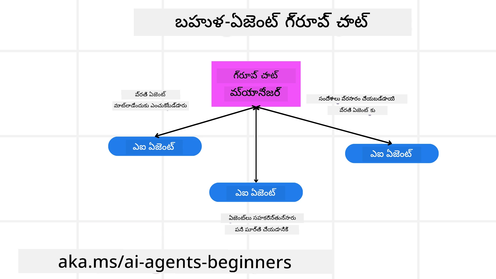
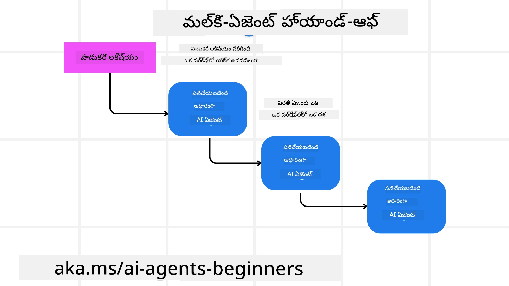
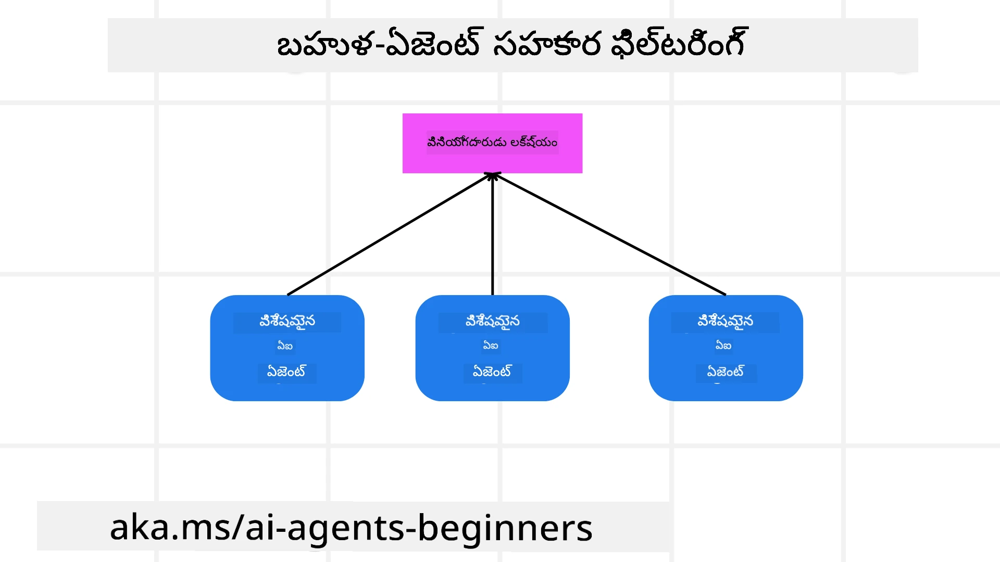

> _(ఈ పాఠం వీడియోను చూడడానికి పై చిత్రం పై క్లిక్ చేయండి)_

# బహుళ ఏజెంట్ డిజైన్ మాడెల్స్

మీరు బహుళ ఏజెంట్లు涉రకురించే ప్రాజెక్ట్‌పై పనిచేస్తుండగానే, మీరు బహుళ ఏజెంట్ డిజైన్ మాడెల్‌ను పరిశీలించాల్సి ఉంటుంది. అయితే, బహుళ ఏజెంట్లకు ఎప్పుడు మారాలి మరియు వాటి లాభాలు ఏమిటి అన్నది తక్షణమే స్పష్టంగా ఉండకపోవచ్చు.

## పరిచయం

ఈ పాఠంలో, మేము ఈ క్రింది ప్రశ్నలకు సమాధానం ఇవ్వాలని చూస్తున్నాము:

- బహుళ ఏజెంట్లు ఏ పరిస్థితులలో వర్తించు?
- ఒక్క ఏజెంట్ కన్నా బహుళ ఏజెంట్లను ఉపయోగించడానికి లాభాలు ఏమిటి?
- బహుళ ఏజెంట్ డిజైన్ మాడెల్ అమలు చేయడానికి అవసరమైన నిర్మాణ భాగాలు ఏమిటి?
- బహుళ ఏజెంట్లు పరస్పర చర్యలు ఎలా చేస్తున్నారో దాని పై మనకి లోతైన అవగాహనను ఎలా కల్గించగలము?

## అభ్యాస లక్ష్యాలు

ఈ పాఠం తరువాత మీరు చిత్తగించగలరు:

- బహుళ ఏజెంట్లు వర్తించే పరిస్థితులను గుర్తించడం
- ఒక ఏజెంట్ కన్నా బహుళ ఏజెంట్ల ఉపయోగసాధ్యతలను గుర్తించడం
- బహుళ ఏజెంట్ డిజైన్ మాడెల్ అమల్లో ఉన్న నిర్మాణ భాగాలను అర్థం చేసుకోవడం

పెద్ద దృశ్యం ఏమిటి?

*బహుళ ఏజెంట్లు ఒక డిజైన్ మాడెల్ ఇది అనేక ఏజెంట్లు కలిసి సాధించదలచిన సాధారణ లక్ష్యాన్ని చేరుకోడానికి సహకరిస్తాయి*.

ఈ మాడెల్ రోబొటిక్స్, స్వయంప్రేరిత వ్యవస్థలు మరియు పంపిణీ కంప్యూటింగ్ వంటి వివిధ రంగాలలో విస్తృతంగా ఉపయోగించబడుతుంది.

## బహుళ ఏజెంట్లు వర్తించే పరిస్థితులు

అప్పుడు, బహుళ ఏజెంట్లను ఉపయోగించడానికి సరైన సందర్భాలు ఏవిటి? సమాధానం ఏమిటంటే అనేక పరిస్థితులున్నాయి, ముఖ్యంగా క్రింది సందర్భాలలో బహుళ ఏజెంట్లను ఉపయోగించడం లాభదాయకం:

- **పెద్ద పనిభారం**: పెద్ద పనిభారంని చిన్న చిన్న టాస్కులుగా విభజించి భిన్న ఏజెంట్లు వాటిని పొందగలవు, ఇది సమాంతర ప్రాసెసింగ్ మరియు వేగవంతమైన పూర్తి చేయడానికీ సహాయపడుతుంది. దీనికి ఉదాహరణగా పెద్ద డేటా ప్రాసెసింగ్ టాస్క్ తీసుకోవచ్చు.
- **సంక్లిష్ట పనులు**: పెద్ద పనులు లాంటివే, సంక్లిష్ట పనులు కూడా చిన్న ఉపపనులుగా విభజించి, ఆప్షనల్ ఏజెంట్లకు అప్పగించవచ్చు, ప్రతి ఏజెంట్ ఒక నిర్దిష్ట అంశాన్ని నిశ్చితంగా చూసుకుంటుంది. ఉదాహరణకు స్వయంచాలక వాహనంలో నావిగేషన్, అడ్డంకి గుర్తింపు, వాహనాల మధ్య కమ్యూనికేషన్ వంటివి వేర్వేరు ఏజెంట్లు నిర్వహిస్తాయి.
- **వివిధ నైపుణ్యాలు**: వేర్వేరు ఏజెంట్లకు వేర్వేరు నైపుణ్యాలున్నాయి, ఒకే ఏజెంట్తో కంటే ఈ విధంగా పని చేయడం ఎక్కువ సమర్థవంతంగా ఉంటుంది. దీనికి మంచి ఉదాహరణ ఆరోగ్య సంరక్షణ వ్యవస్థ, దీనిలో ఏజెంట్లు డయాగ్నోస్టిక్స్, చికిత్సా ప్రణాళికలు మరియు రోగి మానిటరింగ్ నిర్వహిస్తాయి.

## ఒక్క ఏజెంట్ కంటే బహుళ ఏజెంట్ల ఉపయోగం లాభాలు

ఒక ఏజెంట్ వ్యవస్థ సరళమైన పనుల కోసం బాగా పనిచేయవచ్చు, కానీ సంక్లిష్ట పనుల కోసం బహుళ ఏజెంట్లు ఉపయోగించటం వల్ల పలు లాభాలు ఉంటాయి:

- **నిపుణత**: ప్రతి ఏజెంట్ ఒక నిర్దిష్ట పనికి నిపుణుడిగా ఉండవచ్చు. ఒక్క ఏజెంట్ నిపుణత లేకపోవటం వల్ల ఆ ఏజెంట్ ఏ పని చేయాలో గందరగోళమే, అది సరైన పనిని చేయకపోవచ్చు.
- **పరిధి పెంపు**: ఒక్క ఏజెంట్ని ఓవర్ లోడ్ చేయడం కంటే బహుళ ఏజెంట్లను చేర్చి వ్యవస్థని సులభంగా పెంచుకోవచ్చు.
- **లోప నిరోధకత**: ఒక ఏజెంట్ విఫలమైతే, ఇతర ఏజెంట్లు పని కొనసాగిస్తాయి, అందుచేత వ్యవస్థ నమ్మకదరుగుతుంది.

ఉదాహరణకి, ఒక వినియోగదారుకి ట్రిప్ బుక్ చేయడం తీసుకుందాం. ఒక్క ఏజెంట్ అన్ని పనులను నిర్వర్తించాల్సి ఉంటుంది, విమానాలు కనుగొనడం నుంచి హోటళ్లు, కారు రెంటల్ బుక్ చేయడం వరకు. ఒక్క ఏజెంట్‌కి ఇవన్నీ చేయడానికి పరికరాలు అవసరం, ఇది నిషేద మరియు నిర్వహణలో కష్టం. కానీ బహుళ ఏజెంట్లు వుంటే, ఒక్కో ఏజెంట్ ప్రత్యేకంగా విమానాలు కనుగొనడం, హోటళ్లు బుక్ చేయడం, కారు రెంటల్ చేయడం చేస్తుంది. ఇది వ్యవస్థను మోడ్యూలర్, నిర్వహించడానికి సులభం మరియు స్కేలబుల్‌గా చేస్తుంది.

ఇది మం-ఆండ్-పాప్ స్టోర్ (స్వంత సంస్థ) ద్వారా నడిపే ప్రయాణ సంస్థో ప్రత్యక్కి, ఫ్రాంచైజీ గా నడిపే ప్రయాణ సంస్థో తో పోల్చండి. ముందొకేసారి అన్ని పనులు చేసే ఏజెంట్ ఉన్నప్పుడు, తర్వాత వేరువేరు ఏజెంట్లు వేరువేరు సమస్యల్ని నిర్వహిస్తారు.

## బహుళ ఏజెంట్ డిజైన్ మాడెల్ అమలులో నిర్మాణ భాగాలు

బహుళ ఏజెంట్ డిజైన్ మాడెల్ అమలు చేయడానికి ముందు, మాడెల్ యొక్క నిర్మాణ భాగాలను అర్థం చేసుకోవాలి.

మళ్ళీ వినియోగదారుకు ట్రిప్ బుక్ చేసే ఉదాహరణ తీసుకుంటే, నిర్మాణ భాగాలు ఇలా ఉంటాయి:

- **ఏజెంట్ కమ్యూనికేషన్**: విమానాలు కనుగొనే ఏజెంట్, హోటళ్లు బుక్ చేసే ఏజెంట్ మరియు కారు రెంటల్ ఏజెంట్ వినియోగదారుడి అభిరుచులు మరియు పరిమితులపై సమాచారాన్ని పంచుకోవాలి. ఇది ఎలా జరుగుతుందో నిర్ణయించాలి. ఉదాహరణకు, విమానాల ఏజెంట్ హోటల్ ఏజెంట్ తో డేట్లు పంచుకుంటూ, ఒకే తేదీలకు బుక్ చెయ్యడం నిర్ధారించాలి.
- **సమన్వయ వ్యవస్థలు**: ఏజెంట్లు వినియోగదారు అభిరుచులు మరియు పరిమితులను అందుబాటులో పెట్టేందుకు తమ చర్యలను సమన్వయించాలి. ఉదాహరణకి హోటల్ ఏజెంట్ మరియు కారు రెంటల్ ఏజెంట్ సమన్వయ صفతి అవసరం ఉంటుంది.
- **ఏజెంట్ నిర్మాణం**: ఏజెంట్లు నిర్ణయాలు తీసుకోవడం మరియు వినియోగదారుతో పరస్పరం నుండి నేర్చుకోవడం కోసం అంతర్గత నిర్మాణాలుంటాయి. ఉదాహరణకి, విమానాల ఏజెంట్ యంత్ర అభ్యాస మోడల్ ఉపయోగించి గత అభిరుచుల ఆధారంగా విమానాలు సూచింప చేయవచ్చు.
- **బహుళ ఏజెంట్ పరస్పరం లో అవగాహన**: ఏజెంట్లు పరస్పరం ఎలా కమ్యూనికేట్ చేస్తున్నారో తెలుసుకోవడం అవసరం. ఇది లాగింగ్, మానిటరింగ్, విజువలైజేషన్, పనితీరు పట్టీలు రూపంలో ఉండవచ్చు.
- **బహుళ ఏజెంట్ నమూనాలు**: కేంద్రికృత, వైకేంద్రీకృత, హైబ్రిడ్ ఆర్కిటెక్చర్లు వంటి బహుళ ఏజెంట్ వ్యవస్థల అమలుకు వివిధ నమూనాలు ఉండవచ్చు. మీ వినియోగానికి సరిపడే నమూనాను ఎంచుకోవాలి.
- **మానవ హస్తক্ষেপం**: చాలా సందర్భాలలో మానవుడి భాగస్వామ్యం ఉంటుందని ఏజెంట్లు ఎప్పుడు మానవ హస్తক্ষেপం కోరాలో సూచించాలి. ఉదాహరణకి వినియోగదారు కోరిన ప్రత్యేక హోటల్ లేదా విమానం సిఫార్సు లేనప్పుడు లేదా బుకింగ్‌కి ముందుగా నిర్ధారణ కోరినప్పుడు.

## బహుళ ఏజెంట్ పరస్పరం లో అవగాహన

ఏజెంట్లు ఎలా పరస్పరం కార్యాచరణలు చేస్తున్నారో అవగాహన ఉండటం చాలా ముఖ్యంఅని ఆ దృష్టితో లాగింగ్, మానిటరింగ్, విజువలైజేషన్, పనితీరు పట్టీలు వంటి పరికరాలు మరియు విధానాలు అవసరం.

ఉదాహరణకి, వినియోగదారుకు ట్రిప్ బుక్ చేస్తుండగా, ఒక డాష్‌బోర్డ్ ఉండగా, ఏ ఏజెంట్ ఏ స్థితిలో ఉందో, వినియోగదారుడి అభిరుచులు మరియు పరిమితులు, ఏజెంట్ల పరస్పరం చర్యలు కన్పిస్తే బాగుంటుంది. ఇది ఏజెంట్లు ఎలా పనిచేస్తున్నాయో స్పష్టంగా చూపిస్తుంది.

ఆ విషయాలను మరింత వివరంగా చూడండి.

- **లాగింగ్ మరియు మానిటరింగ్ పరికరాలు**: ప్రతి ఏజెంట్ చేసిన చర్యలను లాగ్ చేయాలి. లాగ్‌లో ఏ ఏజెంట్ పనిచేసింది, ఏమి చేశారు, ఎప్పుడూ చేశారు, ఫలితమేం వచ్చిందో డేటా వుండాలి. దీని వలన బగ్గా, ఆప్టిమైజ్ చేసుకోవచ్చు.

- **విజువలైజేషన్ పరికరాలు**: ఏజెంట్ల పరస్పర చర్యలను మరింత స్పష్టంగా చూడటానికి విజువలైజేషన్ సహకరిస్తుంది. ఉదాహరణకి, ఏజెంట్ల మధ్య సమాచార ప్రవాహం చూపించే గ్రాఫ్.

- **పనితీరు కొలమానాలు**: బహుళ ఏజెంట్ వ్యవస్థ యొక్క పనితీరును కొలవడానికి సమయం, పూర్తి కాలం, సిఫార్సుల ఖచ్చితత్వం వంటి కొలమానాలు ట్రాక్ చేయవచ్చు.

## బహుళ ఏజెంట్ నమూనాలు

బహుళ ఏజెంట్ అప్లికేషన్లను సృష్టించడానికి పలు నమూనాలు చూద్దాం. వీటి లో ఆసక్తికరమైన ప్యాటర్న్స్ ఉన్నాయి:

### గుంపు చాట్

చాల ఏజెంట్లు పరస్పరం సంభాషించాలో మీరు గుంపు చాట్ అప్లికేషన్ సృష్టించాలనుకుంటే ఈ నమూనా ఉపయోగపడుతుంది. వ్యాపార సంభాషణ, కస్టమర్ సపోర్ట్, సోషల్ నెట్‌వర్కింగ్ వంటివి సాధారణ ఉపయోగాలు.

ఈ మోడల్ లో ప్రతి ఏజెంట్ గుంపు చాట్ లో ఒక యూజర్‌ను సూచిస్తుంది, మరియు సందేశాలు ఏజెంట్ల మధ్య మెసేజింగ్ ప్రోటోకాల్ ద్వారా మారుతాయి. ఏజెంట్లు సందేశాలు పంపడం, స్వీకరించడం, ప్రతిస్పందించడం చేస్తాయి.

ఈ నమూనా కేంద్రియకృత ఆర్కిటెక్చర్ లో మొత్తం సందేశాలు సర్వర్ ద్వారా రూట్ చేయడం లేదా వైకేంద్రీకృత ఆర్కిటెక్చర్ లో ప్రత్యక్ష సందేశ మార్పిడి చేయడం ద్వారా అమలు చేయవచ్చు.

### చేతులు మార్చడం

ఒక అప్లికేషన్ లో బహుళ ఏజెంట్లు పనులను పరస్పరం అప్పగించుకోవడం కోసం ఈ నమూనా ఉపయోగపడుతుంది.

సాధారణ ఉపయోగాలు: కస్టమర్ సపోర్ట్, పనుల నిర్వహణ, వర్క్‌ఫ్లో ఆటోమేషన్.

ప్రతి ఏజెంట్ ఒక పనిని లేదా వర్క్‌ఫ్లోలో ఒక దశను సూచిస్తుంది, మరియు ఏజెంట్లు నిర్దిష్ట నియమాల ప్రకారం పనులను ఇతర ఏజెంట్లకు అప్పగిస్తాయి.

### సంయుక్త ఫిల్టర్

బహుళ ఏజెంట్లు కలిసి వినియోగదారుకు సిఫార్సులు ఇవ్వడానికి ఈ నమూనా ఉపయోగపడుతుంది.

ఎందుకు బహుళ ఏజెంట్లు కలిసి పనిచేయాలి అంటే ప్రతి ఏజెంట్ వేర్వేరు నైపుణ్యాలతో వ్యవహరిస్తూ సిఫార్సు ప్రక్రియలో విభిన్న విధాలుగా సహకరిస్తాయి.

ఉదాహరణకి, ఒక వినియోగదారు స్టాక్ మార్కెట్ లో ఉత్తమ స్టాక్ కొనుగోలు కోసం సిఫార్సు కోరుకున్నట్లు తీసుకుందాం.

- **పరిశ్రమ నిపుణుడు**: ఒక ఏజెంట్ ఒక నిర్దిష్ట పరిశ్రమలో నిపుణుడై ఉండవచ్చు.
- **సాంకేతిక విశ్లేషణ**: మరొక ఏజెంట్ సాంకేతిక విశ్లేషణలో నిపుణుడు.
- **ప్రాథమిక విశ్లేషణ**: ఇంకో ఏజెంట్ ప్రాథమిక విశ్లేషణలో నిపుణుడు. కలిసి పనిచేస్తూ ఈ ఏజెంట్లు వినియోగదారుకు సమగ్ర సిఫార్సు ఇస్తాయి.

## దృశ్యం: రిఫండ్ ప్రక్రియ

ఒక వినియోగదారుడి ఉత్పత్తికి రిఫండ్ పొందడానికి ప్రయత్నం చేస్తున్న సందర్భం గుర్తించండి, ఇందులో అనేక ఏజెంట్లు ఉంటాయి. ఈ ఏజెంట్లను రిఫండ్ ప్రక్రియ కోసం ప్రత్యేక ఏజెంట్లుగా మరియు ఇతర వ్యాపార భాగాల కోసం సాధారణ ఏజెంట్లుగా విభజిద్దాం.

**రిఫండ్ ప్రక్రియకు ప్రత్యేక ఏజెంట్లు**:

క్రింది ఏజెంట్లు రిఫండ్ ప్రక్రియలో పాల్గొనవచ్చు:

- **కస్టమర్ ఏజెంట్**: ఈ ఏజెంట్ కస్టమర్ ని సూచిస్తుంది మరియు రిఫండ్ ప్రారంభించడానికి బాధ్యత వహిస్తుంది.
- **సెల్లర్ ఏజెంట్**: విక్రేతను సూచించే ఈ ఏజెంట్ రిఫండ్ ప్రక్రియను నిర్వహిస్తుంది.
- **చెల్లింపు ఏజెంట్**: చెల్లింపు ప్రక్రియను సూచించే ఈ ఏజెంట్ కస్టమర్ కి వాపसी చెల్లింపును భరించటం చేస్తుంది.
- **తీర్మానం ఏజెంట్**: సమస్యలను పరిష్కరిస్తూ రిఫండ్ ప్రక్రియను సజావుగా నడిపేది.
- **నిబంధన ఏజెంట్**: రిఫండ్ ప్రక్రియ విధానాలు, నియమ నిబంధనలకు అనుగుణంగా ఉందో లేదో చూసేవారు.

**సాధారణ ఏజెంట్లు**:

ఈ ఏజెంట్లు వ్యాపారంలోని ఇతర భాగాలలో ఉపయోగించవచ్చు.

- **షిప్పింగ్ ఏజెంట్**: ఉత్పత్తిని విక్రేతకి తిరిగి పంపడం చూసేది. ఇది రిఫండ్ మరియు సాధారణ షిప్పింగ్ కోసం ఉపయోగించవచ్చు.
- **ఫీడ్బాక్ ఏజెంట్**: వినియోగదారుల నుండి అభిప్రాయాలు సేకరించడం చేస్తుంది, ఇది రిఫండ్ సమయంలో మాత్రమే కాకుండా ఎప్పుడైనా ఉండొచ్చు.
- **ఎస్కలేషన్ ఏజెంట్**: సమస్యలను ఉన్నత స్థాయికి మళ్లించడం చేస్తుంది. ఏ ప్రక్రియలో అయినా ఈ రకం ఏజెంట్ ఉపయోగించవచ్చు.
- **నోటిఫికేషన్ ఏజెంట్**: రిఫండ్ ప్రక్రియలో వివిధ దశల్లో వినియోగదారుకు సమాచారాలు పంపుతుంది.
- **అనాలిటిక్స్ ఏజెంట్**: రిఫండ్ దత్తాంశాన్ని విశ్లేషిస్తుంది.
- **ఆడిట్ ఏజెంట్**: రిఫండ్ ప్రక్రియ సరిగా జరుగుతుందో లేదో పరిశీలిస్తుంద.
- **పరిశీలన ఏజెంట్**: రిఫండ్ ప్రక్రియపై నివేదికలు తయారుచేస్తుంది.
- **జ్ఞానం ఏజెంట్**: రిఫండ్ మరియు ఇతర వ్యాపార అంశాలపై సమాచారాన్ని నిర్వహిస్తుంది.
- **భద్రత ఏజెంట్**: రిఫండ్ ప్రక్రియ భద్రతకు బాధ్యత వహిస్తుంది.
- **నాణ్యత ఏజెంట్**: రిఫండ్ ప్రక్రియ నాణ్యతను నిర్ధారిస్తుంది.

ముందు పేర్కొన్న ఏజెంట్లలో రిఫండ్ ప్రక్రియకు ప్రత్యేక మరియు సాధారణ ఏజెంట్లు ఉన్నాయి. ఇవి మీ బహుళ ఏజెంట్ వ్యవస్థలో ఏ ఏజెంట్లు వాడుకోవాలో నేర్పుతాయి.

## అసైన్మెంట్

ఒక కస్టమర్ సపోర్ట్ ప్రక్రియ కోసం బహుళ ఏజెంట్ వ్యవస్థ డిజైన్ చేయండి. ప్రాసెస్ లో భాగమైన ఏజెంట్లు, వారి పాత్రలు, బాధ్యతలు, మరియు పరస్పరం ఎలా ప్రవర్తిస్తారో గుర్తించండి. కస్టమర్ సపోర్ట్ కి ప్రత్యేక ఏజెంట్లు మరియు ఇతర వ్యాపార భాగాలతో పని చేసే సాధారణ ఏజెంట్లను అభిప్రాయించండి.

> క్రింది పరిష్కారాన్ని చదువక ముందు ఆలోచించండి, మీరు ఊహించిన కన్నా ఎక్కువ ఏజెంట్లు అవసరం కావచ్చు.

> సూచన: కస్టమర్ సపోర్ట్ ప్రక్రియ యొక్క వివిధ దశల గురించి ఆలోచించండి, అలాగే ఏ సిస్టమ్ కోసం ఏజెంట్లు అవసరమో పరిగణించండి.

## పరిష్కారం

[పరిష్కారం](./solution/solution.md)

## జ్ఞాన సవాళ్లు

### ప్రశ్న 1

ఏ పరిస్థితి బహుళ ఏజెంట్ సిస్టమ్‌కు అత్యంత తగినది?

- [ ] A1: ఒక సపోర్ట్ బోట్ ఒక జ్ఞాన ఆధారాన్ని మరియు కొన్ని సాధనాలు ఉపయోగించి సాధారణ ప్రశ్నలకు సమాధానమిస్తుంది.
- [ ] A2: ఒక రీఫండ్ వర్క్ఫ్లోకి వేరువేరు ఫ్రాడ్, పేమెంట్, మరియు కంప్లయిన్స్ పాత్రలు అవసరం, ప్రతి ఒక్కరిధట‌కు వారి స్వంత సాధనాలు ఉండాలి మరియు వారి ఫలితాలను సమన్వయం చేయాలి.
- [ ] A3: అదే సాదారణ వర్గీకరణ అభ్యర్థన గంటకు వేల సార్లు వస్తోంది.

### ప్రశ్న 2

సాధారణంగా ఎప్పుడు ఒక ఏజెంట్ ఉత్తమ ఎంపిక అవుతుంది?

- [ ] A1: కార్యం ఒక సాధనాల సమాహారం మరియు సూచనలతో నిర్వహించవచ్చు, ప్రత్యేక నిపుణుల మార్పిడి లేకుండా.
- [ ] A2: ఏజెంట్‌కు ఒకటి కంటే ఎక్కువ సాధనాల యాక్సెస్ ఉంది.
- [ ] A3: వర్క్ఫ్లో వేరే పాత్రలు, వేరే అనుమతులు మరియు స్వతంత్ర అటెస్ట్ ట్రయిల్స్ అవసరం.

[పరిష్కారం క్విజ్](./solution/solution-quiz.md)

## సారాంశం

ఈ పాఠంలో, మేము బహుళ ఏజెంట్ డిజైన్ నమూనా గురించి, బహుళ ఏజెంట్లు సంబంధం ఉన్న పరిస్థితులు, ఒక ఏజెంట్ సరిపోల్చుకుంటే బహుళ ఏజెంట్ల వాడకం ప్రయోజనాలు, మల్టీ ఏజెంట్ డిజైన్ నమూనా అమలు చేసే మూలభాగాలు, మరియు బహుళ ఏజెంట్లు పరస్పరం ఎలా పరస్పర చర్యలు కలిగి ఉంటాయో దానికి ఎలా స్పష్టం ఉంటుంది అనే అంశాలను పరిశీలించాము.

### మల్టీ ఏజెంట్ డిజైన్ నమూనా గురించి ఇంకా ప్రశ్నలున్నాయా?

[Microsoft Foundry Discord](https://discord.com/invite/ATgtXmAS5D) లో చేరండి, ఇతర అభ్యాసకులతో కలుసుకోండి, కార్యాలయ సమయాల్లో పాల్గొనండి, మరియు మీ AI ఏజెంట్లు సంబంధించిన ప్రశ్నలకు సమాధానాలు పొందండి.

## అదనపు వనరులు

- <a href="https://learn.microsoft.com/azure/ai-services/agents/overview" target="_blank">Microsoft Agent Framework డాక్యుమెంటేషన్</a>
- <a href="https://www.analyticsvidhya.com/blog/2024/10/agentic-design-patterns/" target="_blank">Agentic డిజైన్ నమూనాలు</a>

## గత పాఠం

[ప్లానింగ్ డిజైన్](../07-planning-design/README.md)

## తదుపరి పాఠం

[AI ఏజెంట్లలో మెటాకాగ్నిషన్](../09-metacognition/README.md)

---

<!-- CO-OP TRANSLATOR DISCLAIMER START -->
**అస్వీకరణ**:
ఈ పత్రం AI అనువాద సేవ [Co-op Translator](https://github.com/Azure/co-op-translator) ఉపయోగించి అనువదించబడింది. మేము ఖచ్చితత్వానికి ప్రయత్నిస్తున్నప్పటికీ, ఆటోమేటెడ్ అనువాదాలు తప్పులు లేదా అసమగ్రతలను కలిగి ఉండవచ్చు. దాని స్వదేశ భాషలో ఉన్న అసలు పత్రాన్ని అధికారం కలిగిన మూలంగా పరిగణించాలి. కీలకమైన సమాచారం కోసం, ప్రొఫెషనల్ మానవ అనువాదాన్ని సిఫారసు చేస్తాము. ఈ అనువాదం ఉపయోగం వల్ల కలిగే ఏవైనా అపార్థాలు లేదా తప్పుదారులు కోసం మేము బాధ్యత వహించము.
<!-- CO-OP TRANSLATOR DISCLAIMER END -->