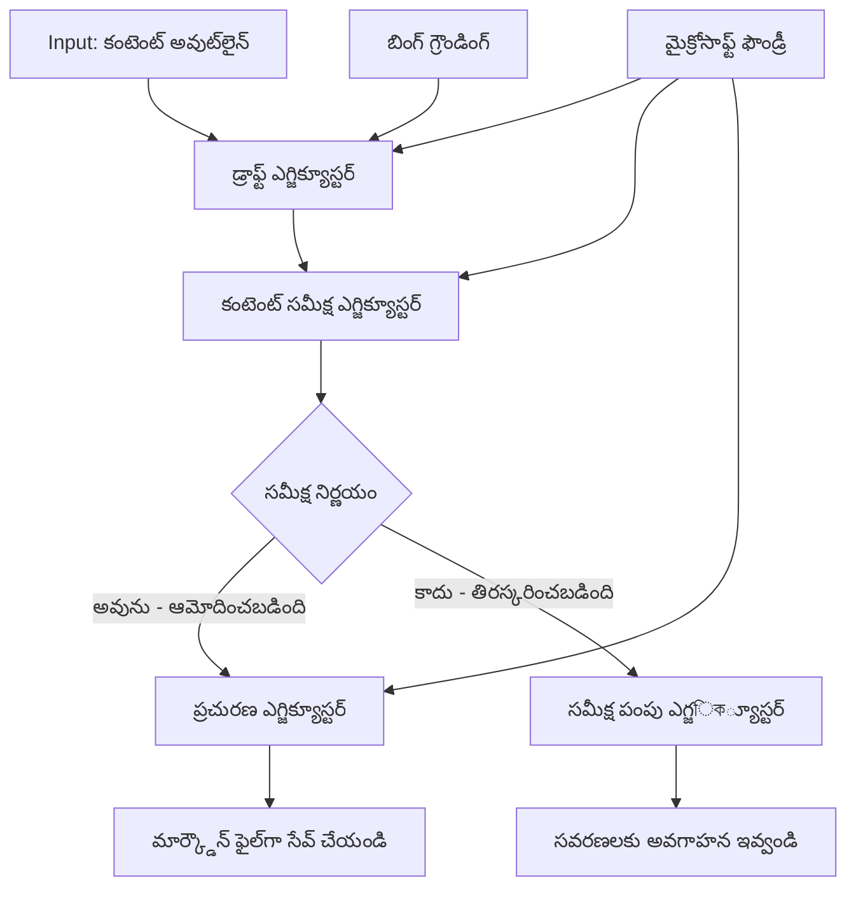

# 🔀 Microsoft Foundry (.NET) తో షరతు ఆధారిత ఏజెంట్ వర్క్‌ఫ్లోలు

## 📋 తెలివైన నిర్ణయం ఆధారిత వర్క్‌ఫ్లో ట్యుటోరియల్

ఈ నోట్‌బుక్ Microsoft Foundry మరియు మైక్రోసాఫ్ట్ ఏజెంట్ ఫ్రేమ్‌వర్క్ ను ఉపయోగించి **షరతు ఆధారిత వర్క్‌ఫ్లో నమూనాలు**ని చూపిస్తుంది. మీరు AI విశ్లేషణ, వ్యాపార నియమాలు మరియు డైనమిక్ షరతుల ఆధారంగా ప్రాసెసింగ్‌ను తెలివిగా మార్గదర్శకం చేసే సూత్రబద్ధమైన, నిర్ణయంపై ఆధారపడి వర్క్‌ఫ్లోలను ఎలా నిర్మించాలో నేర్చుకుంటారు.

## 🎯 నేర్చుకోవడానికి లక్ష్యాలు

### 🧠 **తెలివైన నిర్ణయ నిర్మాణం**
- **షరతు లాజిక్ అమలుబెట్టు**: కొన్ని విభాగాలతో సంక్లిష్ట నిర్ణయం వృక్షాలను నిర్మించండి
- **AI-ఆధారిత మార్గదర్శనం**: తెలివైన మార్గదర్శక నిర్ణయాలు తీసుకునేందుకు Microsoft Foundry మోడల్స్ ఉపయోగించండి
- **డైనమిక్ వర్క్‌ఫ్లో అనుసరణ**: రన్‌టైమ్ విశ్లేషణ మరియు షరతుల ఆధారంగా వర్క్‌ఫ్లో ప్రవర్తనను సవరిస్తుంది
- **ఎంటర్ప్రైజ్ నియమ ప్రవేశపెట్టడం**: వ్యాపార లాజిక్ మరియు అనుకూలత అవసరాలను వర్క్‌ఫ్లోలలో చేర్చండి

### 🔀 **అత్యాధునిక షరతు నమూనాలు**
- **బహుళ-ధరల నిర్ణయం తీసుకోవడం**: మార్గదర్శక నిర్ణయాల కోసం బహుళ కారణాలను విశ్లేషించండి
- **సందర్భ-గమనించిన ప్రాసెసింగ్**: సంకలిత వర్క్‌ఫ్లో సందర్భం మరియు చరిత్ర ఆధారంగా నిర్ణయాలు తీసుకోండి
- **అనుకూల వర్క్‌ఫ్లో సవరణ**: ప్రత్యక్ష పరిస్థితుల ఆధారంగా ప్రాసెసింగ్ మార్గాలను డైనమిక్‌గా సర్దుబాటు చేయండి
- **నియమ ఇంజిన్ ప్రవేశపెట్టడం**: వర్క్‌ఫ్లోలలో సూత్రబద్ధమైన వ్యాపార నియమ ఇంజిన్లను అమలు చేయండి

### 🏢 **ఎంటర్ప్రైజ్ షరతు అప్లికేషన్లు**
- **డాక్యుమెంట్ వర్గీకరణ & మార్గదర్శకం**: డాక్యుమెంట్లను ఆటోమేటిక్‌గా వర్గీకరించి సరియైన వర్క్‌ఫ్లోలకు మార్గనిర్దేశం చేయండి
- **గ్రాహక సేవ త్రియాజ్**: కస్టమర్ విచారణలను ప్రత్యేక హ్యాండ్లింగ్ జట్లకు తెలివైన మార్గనిర్దేశం
- **అనువర్తన & రిస్క్ ప్రాసెసింగ్**: రిస్క్ అంచనాపై ఆధారపడి వేర్వేరు ధృవీకరణ మరియు సమీక్ష ప్రక్రియలు వర్తింపజేయండి
- **నాణ్యత నిర్ధారణ వర్క్‌ఫ్లోలు**: నాణ్యత కొలతల ఆధారంగా కంటెంట్‌ను సరియైన సమీక్ష ప్రక్రియల ద్వారా పంపండి

## ⚙️ ముందస్తు అవసరాలు & సెటప్

### 📦 **అవసరమైన NuGet ప్యాకేజీలు**

షరతు వర్క్‌ఫ్లో ప్రాసెసింగ్ కోసం అభివృద్ధి చేసిన ప్యాకేజీలు:

```xml
<!-- Core AI Framework -->
<PackageReference Include="Microsoft.Extensions.AI" Version="9.9.0" />

<!-- Azure AI Agents with Persistent State -->
<PackageReference Include="Azure.AI.Agents.Persistent" Version="1.2.0-beta.5" />

<!-- Azure Identity and Utilities -->
<PackageReference Include="Azure.Identity" Version="1.15.0" />
<PackageReference Include="System.Linq.Async" Version="6.0.3" />
<PackageReference Include="DotNetEnv" Version="3.1.1" />

<!-- Local Workflow Framework References -->
<!-- Microsoft.Agents.Workflows.dll - Advanced workflow orchestration -->
<!-- Microsoft.Agents.AI.AzureAI.dll - Microsoft Foundry integration -->
<!-- Microsoft.Agents.AI.dll - Core agent abstractions -->
```

### 🔑 **Microsoft Foundry సెటప్**

**అవసరమైన Azure వనరులు:**
- షరతు ప్రాసెసింగ్ మోడల్స్‌తో Microsoft Foundry వర్క్‌స్పేస్
- సరైన కంప్యూట్ క్వోటాలు మరియు అనుమతులు గల Azure సబ్స్‌క్స్రిప్షన్
- నిర్ణయాలు తీసుకోవడం మరియు కంటెంట్ విశ్లేషణకు AI మోడల్స్ పై అమలు చేసినవి
- (ఐచ్ఛిక) Bing Search API కనెక్షన్ గ్రౌండింగ్ సామర్థ్యాల కోసం

**పరిసరాల సెటప్ (.env ఫైల్):**
```env
# Microsoft Foundry Configuration
AZURE_AI_PROJECT_ENDPOINT=https://your-project.cognitiveservices.azure.com/
BING_CONNECTION_ID=your-bing-connection-id
```

**ఆథెంటికేషన్ సెటప్:**
```csharp
// Azure CLI or Managed Identity authentication
using Azure.Identity;
var credential = new AzureCliCredential();

// Load environment configuration
DotNetEnv.Env.Load("../../../.env");
```

### 🏗️ **షరతు వర్క్‌ఫ్లో నిర్మాణం**



**ప్రధాన భాగాలు:**
- **డ్రాఫ్ట్ ఎగ్జిక్యూటర్**: అవుట్‌లైన్‌ల నుండి ప్రారంభ కంటెంట్ డ్రాఫ్ట్‌లను సృష్టించే AI ఏజెంట్
- **కంటెంట్ సమీక్ష ఎగ్జిక్యూటర్**: డ్రాఫ్ట్ నాణ్యత మరియు అనుగుణతను ఆప్తించే AI ఏజెంట్
- **షరతు మార్గదర్శనం**: సమీక్ష ఫలితాల ఆధారంగా మార్గాన్ని నిర్ణయించే లాజిక్
- **ప్రచురణ/సమీక్ష మార్గాలు**: ఆమోదించిన మరియు తిరస్కరించిన కంటెంట్ కోసం వివిధ ప్రాసెసింగ్ మార్గాలు
- **స్టేట్ మేనేజ్‌మెంట్**: వర్క్‌ఫ్లో సమయంలో కంటెంట్ మరియు సమీక్ష సందర్భాన్ని నిర్వహించడం

## 🎨 **షరతు వర్క్‌ఫ్లో డిజైన్ నమూనాలు**

### 📋 **నాణ్యత గేట్లతో కంటెంట్ ఉత్పత్తి**
```
Outline → Draft Creation → Quality Review → {Approve: Publish | Reject: Revise}
```

### 🎯 **రిస్క్ ఆధారిత డాక్యుమెంట్ ప్రాసెసింగ్**
```
Document → Risk Assessment → {Low: Standard | High: Enhanced Review}
```

### 🔍 **తెలివైన కస్టమర్ సర్వీస్ మార్గదర్శనం**
```
Customer Query → Analysis → {Simple: FAQ Bot | Complex: Human Agent}
```

### 💼 **అనువర్తన ఆధారిత వర్క్‌ఫ్లోలు**
```
Content → Compliance Check → {Pass: Publish | Fail: Legal Review}
```

## 🏢 **ఎంటర్ప్రైజ్ షరతు లాభాలు**

### 🎯 **తెలివైన ఆటోమేషన్**
- **స్మార్ట్ నిర్ణయం తీసుకోవడం**: కంటెంట్ విశ్లేషణ మరియు సందర్భం ఆధారంగా AI-ఆధారిత మార్గదర్శక నిర్ణయాలు
- **అనుకూల ప్రాసెసింగ్**: మార్త్రమైన షరతుల ఆధారంగా ఆటోమేటిక్‌గా తగిన విధంగా వర్క్‌ఫ్లోలు సర్దుబాటు అవుతాయి
- **వ్యాపార నియమాలు అమలులో పెట్టడం**: సంక్లిష్ట వ్యాపార లాజిక్ మరియు విధానాల ఆటోమేటిక్ అభ్యాసం
- **సందర్భ-గమనించిన మార్గదర్శనం**: పూర్తి వర్క్‌ఫ్లో చరిత్ర మరియు సంకలిత సందర్భం ఆధారంగా నిర్ణయాలు

### 📈 **ఆపరేషనల్ ఎక్సలెన్స్**
- **అత్యుత్తమ వనరుల కేటాయింపు**: పనిని అత్యంత సరియైన నిపుణులు మరియు ప్రక్రియలకు మార్గనిర్దేశం చేయండి
- **కలిపిన మానవ జోక్యం తగ్గింపు**: ఆటోమేటిక్ నిర్ణయాలు మానవ మార్గదర్శకత అవసరాన్ని తగ్గిస్తాయి
- **త్వరిత పరిష్కారం సమయాలు**: సరైన నైపుణ్యం మరియు ప్రాసెసింగ్ సామర్ధ్యాలకు ప్రత్యక్ష మార్గనిర్దేశం
- **సమానమైన చర్యలు**: వ్యాపార నియమాలు మరియు నిర్ణయ ప్రమాణాల సమానంగా అన్వయం

### 🛡️ **రిస్క్ నిర్వహణ & అనువర్తన**
- **ఆటోమేటిక్ రిస్క్ అంచనా**: కంటెంట్ మరియు పరిస్థితి రిస్క్ స్థాయిల AI ఆధారిత విలువైన మూల్యాంకనం
- **అనువర్తన అమలు**: అవసరమైన నియంత్రణ ప్రక్రియల ద్వారా ఆటోమేటిక్ మార్గనిర్దేశం
- **భద్రతా ప్రోటోకాల్ అన్వయం**: రిస్క్ మూల్యాంకన కార్యక్రమా ఆధారంగా మెరుగైన భద్రతా చర్యలు
- **ఆడిట్ ట్రెయిల్ నిర్వహణ**: మార్గదర్శక నిర్ణయాలు మరియు కారణాల పూర్తి డాక్యుమెంటేషన్

### 📊 **విశ్లేషణలు & నిరంతర మెరుగుదల**
- **నిర్ణయ విశ్లేషణలు**: మార్గదర్శక నిర్ణయాల సమర్థత మరియు ఖచ్చితత్వం ట్రాక్ చేయండి
- **నమూనా గుర్తింపు**: సమయానుగుణ మార్గదర్శక నిర్ణయాల్లో ధోరణులు మరియు నమూనాలను కనుగొనండి
- **ప్రదర్శన మెరుగుదల**: నిర్ణయ ప్రమాణాలు మరియు మార్గదర్శక సామర్థ్యాన్ని నిరంతరం మెరుగుపరుచుకోండి
- **వ్యాపార బుధిమత్త**: కంటెంట్ లక్షణాలు మరియు ప్రాసెసింగ్ అవసరాలపై అవగాహన

### 🔧 **సాంకేతిక నైపుణ్యం**
- **పర్సిస్టెంట్ స్టేట్ మేనేజ్‌మెంట్**: వర్క్‌ఫ్లో అమలులో సంక్లిష్ట స్థితిని నిర్వహించండి
- **స్కేలబుల్ నిర్మాణం**: అధిక పరిమాణంలో ఉన్న షరతు ప్రాసెసింగ్ అవసరాలు నిర్వహించండి
- **ఇంటిగ్రేషన్ సామర్థ್ಯాలు**: ఇప్పటికే ఉన్న వ్యాపార వ్యవస్థలు మరియు ప్రక్రియలతో సులభంగా అనుసంధానం
- **మానిటరింగ్ & ఆబ్జర్వబిలిటీ**: వర్క్‌ఫ్లో ప్రదర్శన మరియు నిర్ణయాల సమగ్ర ట్రాకింగ్

.NET తో తెలివైన, నిర్ణయ ఆధారిత ఎంటర్ప్రైజ్ వర్క్‌ఫ్లోలను మనం నిర్మిద్దాం! 🚀

## 💻 కోడ్ నడిపించడం

పూర్తి అమలు `04.dotnet-agent-framework-workflow-aifoundry-condition.cs` లో కేటాయించబడింది. ఇది **నాణ్యత గేట్లంతో కంటెంట్ ఉత్పత్తి వర్క్‌ఫ్లో**ని చూపిస్తుంది:

### 🏗️ **వర్క్‌ఫ్లో నిర్మాణం**

```
Content Outline → Draft Creation → Quality Review → Conditional Routing:
                                                      ├─ Approved (>200 words) → Publish
                                                      └─ Rejected (<200 words) → Review Notification
```

**వర్క్‌ఫ్లోలో ఏజెంట్లు:**
1. **ఎవంజెలిస్ట్ ఏజెంట్**: Bing గ్రౌండింగ్ తో అవుట్‌లైన్‌ల నుంచి ట్యుటోరియల్ డ్రాఫ్ట్‌లను సృష్టిస్తుంది
2. **కంటెంట్ రివ్యూవర్ ఏజెంట్**: డ్రాఫ్ట్ నాణ్యత (పదాల సంఖ్య, సంపూర్ణత) ను అంచనా వేస్తుంది
3. **పబ్లిషర్ ఏజెంట్**: ఆమోదించిన కంటెంట్‌ను టైమ్‌స్టాంప్ చేసిన Markdown ఫైళ్లుగా సేవ్ చేస్తుంది

**అనుకూల ఎగ్జిక్యూటర్లు:**
1. **డ్రాఫ్ట్ ఎగ్జిక్యూటర్**: డ్రాఫ్ట్ సృష్టి నిర్వహణ
2. **కంటెంట్ రివ్యూ ఎగ్జిక్యూటర్**: నాణ్యత మూల్యాంకనం నిర్వహణ
3. **పబ్లిష్ ఎగ్జిక్యూటర్**: ఆమోదించిన కంటెంట్ ప్రచురణ నిర్వహణ
4. **సెండ్ రివ్యూ ఎగ్జిక్యూటర్**: తిరస్కరించిన కంటెంట్ నోటిఫికేషన్ల నిర్వహణ

### 🚀 ఉదాహరణ నడిపించడం

**ముందస్తు అవసరాలు:**
- Microsoft Foundry వర్క్‌స్పేస్ సెటప్ చేసినవి
- Azure CLI సాక్షాత్కరణ (`az login`)
- (ఐచ్ఛికం) Bing Search కనెక్షన్ గ్రౌండింగ్ కోసం

```bash
# స్క్రిప్ట్ను అమలు చేయదగిన విధంగా మార్చండి (యూనిక్స్/లినక్స్/macos)
chmod +x 04.dotnet-agent-framework-workflow-aifoundry-condition.cs

# పరిస్థితి ప్రాధాన్యత పనితీరు నడపండి
./04.dotnet-agent-framework-workflow-aifoundry-condition.cs
```

లేదా Windows లో:
```powershell
dotnet run 04.dotnet-agent-framework-workflow-aifoundry-condition.cs
```

### 📝 అంచనా వేయబడిన అవుట్‌పుట్

వర్క్‌ఫ్లో:
1. **ఏజెంట్లను సృష్టిస్తుంది**: మూడు ప్రత్యేక Microsoft Foundry ఏజెంట్లను ప్రారంభిస్తుంది
2. **డ్రాఫ్ట్ను రూపొందిస్తుంది**: ఎవంజెలిస్టు ఏజెంట్ అవుట్‌లైన్ నుంచి ట్యుటోరియల్ డ్రాఫ్ట్ సృష్టిస్తుంది
3. **కంటెంట్‌ను సమీక్షిస్తుంది**: కంటెంట్ రివ్యూవర్ డ్రాఫ్ట్ నాణ్యతను అంచనా వేస్తుంది
4. **షరతు మార్గదర్శనం**:
   - **ఆమోదిస్తే (>200 పదాలు)**: పబ్లిష్ ఎగ్జిక్యూటర్ Markdown ఫైల్‌గా సేవ్ చేస్తుంది
   - **తిరస్కరిస్తే (<200 పదాలు)**: రివ్యూకి పంపే నోటిఫికేషన్
5. **ఫలితాలను ప్రదర్శిస్తుంది**: తుది వర్క్‌ఫ్లో ఫలితాన్ని చూపిస్తుంది

### 🔧 అనుకూలీకరణ ఎంపికలు

**సమీక్ష ప్రమాణాలను సవరించండి:**
```csharp
const string ContentReviewerInstructions = @"
You are a content reviewer...
1. Check if content is more than 500 words (instead of 200)
2. Verify technical accuracy
3. Ensure proper formatting
...";
```

**చాలా షరతు మార్గాలను జోడించండి:**
```csharp
var workflow = new WorkflowBuilder(draftExecutor)
    .AddEdge(draftExecutor, contentReviewerExecutor)
    .AddEdge(contentReviewerExecutor, publishExecutor, condition: GetCondition("Excellent"))
    .AddEdge(contentReviewerExecutor, editExecutor, condition: GetCondition("Good"))
    .AddEdge(contentReviewerExecutor, sendReviewerExecutor, condition: GetCondition("Poor"))
    .Build();
```

**కంటెంట్ అవసరాలను మార్చండి:**
```csharp
string OUTLINE_Content = @"
# Your Custom Topic
## Section 1
https://your-reference-url
## Section 2
...
";
```

### 🎯 వాస్తవ ప్రపంచ అనువర్తనాలు

ఈ షరతు వర్క్‌ఫ్లో నమూనా ఉచితంగా సరిపోయేది:
- **కంటెంట్ నిర్వహణ వ్యవస్థలు**: నాణ్యత గేట్లతో ఆటోమేటెడ్ ఎడిటోరియల్ వర్క్‌ఫ్లోలు
- **డాక్యుమెంట్ ప్రాసెసింగ్**: వర్గీకరణ మరియు అనువర్తన ఆధారంగా డాక్యుమెంట్ల మార్గదర్శనం
- **కస్టమర్ సపోర్ట్**: సాంకేతికత మరియు అత్యవసరత ఆధారంగా తెలివైన టికెట్ మార్గదర్శనం
- **న్యాయ సమీక్ష**: రిస్క్ అంచనాపై ఆధారపడి కాంట్రాక్టులను మార్గనిర్దేశం చేయడం
- **HR ప్రక్రియలు**: సరియైన స్క్రీనింగ్ వర్క్‌ఫ్లోల ద్వారా దరఖాస్తులను పంపడం

### 🔍 షరతు లాజిక్ అర్థం చేసుకోవడం

**షరతు ఫంక్షన్:**
```csharp
public Func<object?, bool> GetCondition(string expectedResult) =>
    reviewResult => reviewResult is ReviewResult review && review.Result == expectedResult;
```

ఈ ఫంక్షన్ క్రింది విధంగా పనిచేస్తుంది:
1. ఫలితం `ReviewResult` రకం ఉన్నదా లేదా అని తనిఖీ చేస్తుంది
2. `Result` ప్రాపర్టీని అంచనా వాల్యూతో పోలిక చేస్తుంది
3. మార్గదర్శకం నిర్ణయించడానికి నిజం/వముకును తిరిగి ఇస్తుంది

**షరతు ఉన్న వర్క్‌ఫ్లో అంచులు:**
```csharp
.AddEdge(contentReviewerExecutor, publishExecutor, condition: GetCondition("Yes"))
.AddEdge(contentReviewerExecutor, sendReviewerExecutor, condition: GetCondition("No"))
```

### 📊 అధునాతన లక్షణాలు

**JSON స్కీమా ధృవీకరణ:**
వర్క్‌ఫ్లో నిర్మిత సమాధానాలను నిర్ధారించడానికి JSON స్కీమాలు ఉపయోగిస్తుంది:

```csharp
// Define response structure
public class ReviewResult
{
    [JsonPropertyName("review_result")]
    public string Result { get; set; } = string.Empty;
    
    [JsonPropertyName("reason")]
    public string Reason { get; set; } = string.Empty;
    
    [JsonPropertyName("draft_content")]
    public string DraftContent { get; set; } = string.Empty;
}

// Apply to agent
ResponseFormat = ChatResponseFormat.ForJsonSchema(
    AIJsonUtilities.CreateJsonSchema(typeof(ReviewResult)), 
    "ReviewResult", 
    "Review Result From DraftContent"
)
```

**Bing గ్రౌండింగ్ ఇంటిగ్రేషన్:**
ఎవంజెలిస్టు ఏజెంట్ Bing గ్రౌండింగ్ ఉపయోగించి ప్రత్యక్ష సమాచారాన్ని అందుకుంటుంది:

```csharp
var bingGroundingConfig = new BingGroundingSearchConfiguration(bing_conn_id);
BingGroundingToolDefinition bingGroundingTool = new(
    new BingGroundingSearchToolParameters([bingGroundingConfig])
);
```

ఇది ఏజెంట్‌ను అవుట్‌లైన్‌లో URLలను అనుసరిస్తూ ప్రస్తుత సమాచారాన్ని తీసుకొనుటకు చేయును.

### 🛡️ ఎర్రర్ హ్యాండ్లింగ్

వర్క్‌ఫ్లో తిరస్కరించిన కంటెంట్ కోసం దృఢమైన ఎర్రర్ హ్యాండ్లింగ్ కలిగి ఉంది:
- సమీక్ష వైఫల్యాలు ప్రత్యామ్నాయ మార్గాన్ని ప్రారంభిస్తాయ్
- నోటిఫికేషన్లు తిరస్కరణ కారణాలను స్పష్టంగా అందిస్తాయి
- కంటెంట్ సవరణ కోసం దాచబడుతుంది

### 🔄 వర్క్‌ఫ్లో విస్తరణ

**సవరణ లూప్ జోడించండి:**
ఆటోమేటిక్‌గా కంటెంట్‌ను తిరిగి డ్రాఫ్ట్ చేస్తూ ఫీడ్బ్యాక్ లూప్ సృష్టించండి:

```csharp
.AddEdge(contentReviewerExecutor, publishExecutor, condition: GetCondition("Yes"))
.AddEdge(contentReviewerExecutor, draftExecutor, condition: GetCondition("No")) // Loop back
```

**బహుళ-స్థాయి సమీక్ష అమలు చేయండి:**
వేర్వేరు ప్రమాణాలతో బహుళ సమీక్ష దశలను జోడించండి:

```csharp
.AddEdge(draftExecutor, technicalReviewer)
.AddEdge(technicalReviewer, editorialReviewer, condition: GetCondition("TechPass"))
.AddEdge(editorialReviewer, publishExecutor, condition: GetCondition("EditPass"))
```

ఈ షరతు వర్క్‌ఫ్లో నమూనా సూత్రబద్ధమైన, తెలివైన ఎంటర్ప్రైజ్ ఆటోమేషన్ వ్యవస్థల నిర్మాణానికి పెట్టుబడి ఇస్తుంది! 🚀

---

<!-- CO-OP TRANSLATOR DISCLAIMER START -->
**అస్వీకరణ**:
ఈ పత్రం AI అనువాద సేవ [Co-op Translator](https://github.com/Azure/co-op-translator) ఉపయోగించి అనువదించబడింది. మేము ఖచ్చితత్వానికి ప్రయత్నిస్తున్నప్పటికీ, ఆటోమేటెడ్ అనువాదాలు తప్పులు లేదా అసమగ్రతలను కలిగి ఉండవచ్చు. దాని స్వదేశ భాషలో ఉన్న అసలు పత్రాన్ని అధికారం కలిగిన మూలంగా పరిగణించాలి. కీలకమైన సమాచారం కోసం, ప్రొఫెషనల్ మానవ అనువాదాన్ని సిఫారసు చేస్తాము. ఈ అనువాదం ఉపయోగం వల్ల కలిగే ఏవైనా అపార్థాలు లేదా తప్పుదారులు కోసం మేము బాధ్యత వహించము.
<!-- CO-OP TRANSLATOR DISCLAIMER END -->