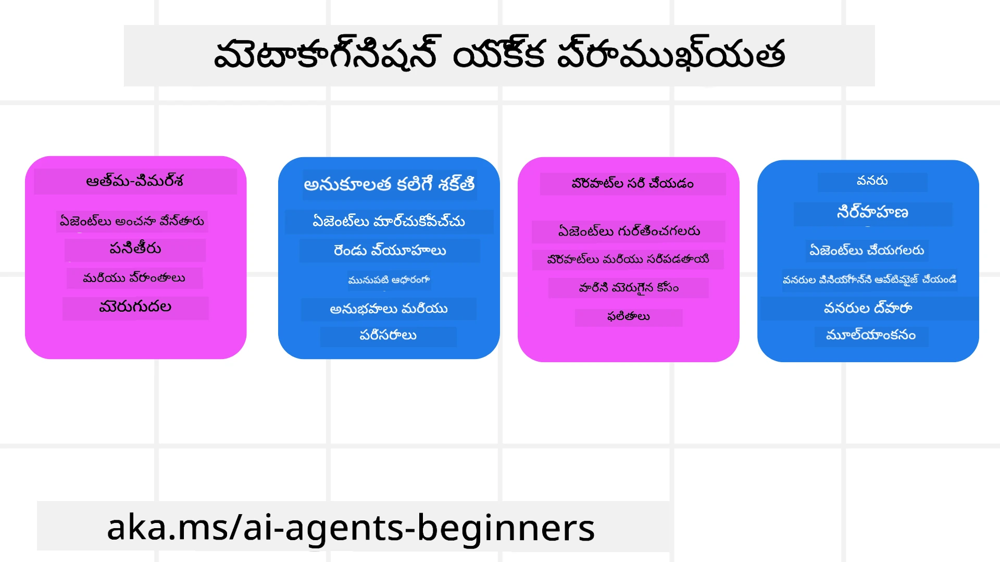
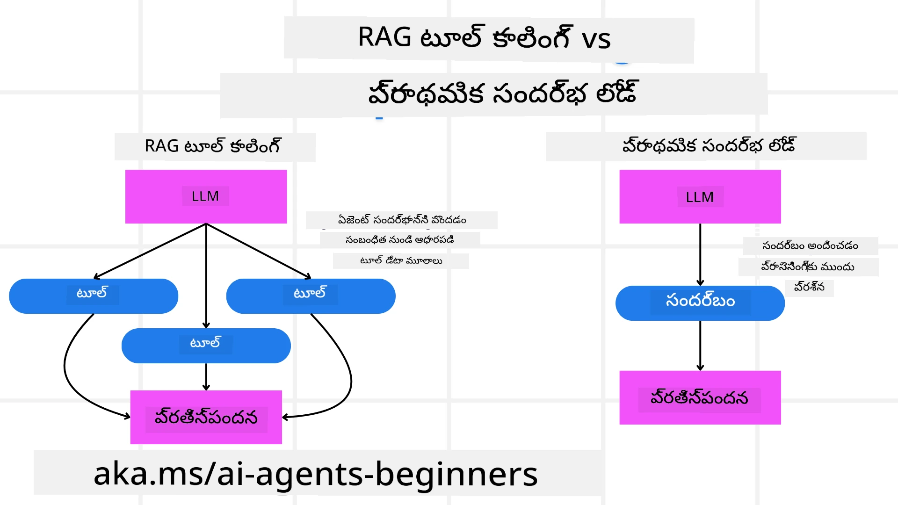

[](https://youtu.be/His9R6gw6Ec?si=3_RMb8VprNvdLRhX)

> _(ఈ పాఠం వీడియో ని వీక్షించడానికి పై చిత్రం క్లిక్ చేయండి)_
# AI ఏజెంట్‌లలో మెటాకాగ్నిషన్

## పరిచయం

AI ఏజెంట్‌లలో మెటాకాగ్నిషన్ పాఠానికి స్వాగతం! ఈ అధ్యాయం, AI ఏజెంట్‌లు తమ స్వంత ఆలోచనా ప్రక్రియల గురించి ఎలా ఆలోచించగలరో ఆసక్తి ఉన్న ప్రారంభికుల కోసం రూపొందించబడింది. ఈ పాఠం చివరకు, మీరు ముఖ్యమైన భావాలను అర్థం చేసుకుని, AI ఏజెంట్ డిజైనులో మెటాకాగ్నిషన్‌ను ప్రయోగించడానికి ప్రాక్టికల్ ఉదాహరణలతో సన్నద్ధం అవుతారు.

## అభ్యాస లక్ష్యాలు

ఈ పాఠాన్ని పూర్తి చేసిన తర్వాత, మీరు:

1. ఏజెంట్ నిర్వచనాల్లో కారణ నిరంతర (reasoning loops) ప్రభావాలను అర్థం చేసుకుంటారు.
2. స్వ-సవరణ (self-correcting) ఏజెంట్‌లకు సహాయపడేందుకు ప్రణాళిక మరియు మౌల్యాంకన పద్ధతులను ఉపయోగిస్తారు.
3. పనులు సాధించేందుకు కోడ్‌ను మార్చగల మీ స్వంత ఏజెంట్లను సృష్టిస్తారు.

## మెటాకాగ్నిషన్ కు పరిచయం

మెటాకాగ్నిషన్ అంటే మన స్వయంస్వాభావ ఆలోచనలను గురించి ఆలోచించే ఉన్నత-స్థాయి జ్ఞాన ప్రక్రియలు. AI ఏజెంట్‌లకు ఇది అంటే, తమ చర్యలను స్వీయ అవగాహన మరియు గత అనుభవాల ఆధారంగా విలువల졌ి, సర్దుబాటు చేయగలగటం. "ఆలోచనపై ఆలోచన" అనే భావన, ఏజెంటిక్ AI వ్యవస్థా అభివృద్ధిలో ముఖ్యమైన విషయం. ఇది AI వ్యవస్థలు తమ అంతర్గత ప్రక్రియలపై అవగాహన కలిగి, తమ ప్రవర్తనను గమనించి, నియంత్రించి, తగినట్లుగా మరింత మెరుగుపర్చుకోవడానికి సహాయపడుతుంది. మనం ఒక సందర్భాన్ని చదవగానే లేదా సమస్యను చూడగానే చేస్తూ ఉంటాము అలాగే. ఈ స్వీయ అవగాహన AI వ్యవస్థలకు మంచి నిర్ణయాలు తీసుకోవడంలో, పొరపాట్లను గుర్తించడంలో, సమయం క్రమంలో వారి పనితీరును మెరుగుపరచడంలో సహాయపడుతుంది—ఇది తిరిగి టూరింగ్ టెస్ట్ మరియు AI ఎలా ప్రబలుతోందనే చర్చకు సంబంధిస్తుంటుంది.

ఏజెంటిక్ AI వ్యవస్థల సందర్భంలో, మెటాకాగ్నిషన్ కూడా కొన్ని సవాళ్లను పరిష్కరించడంలో సహాయపడుతుంది, ఉదాహరణకు:
- పారదర్శకత: AI వ్యవస్థలు తమ తర్క మరియు నిర్ణయాలను వివరించగలగడం.
- తర్కశక్తి: AI వ్యవస్థలలో సమాచారాన్ని ఓమించడంతో ఉత్తమ నిర్ణయాలు తీసుకోవడాన్ని పెంపొందించడం.
- అనుకూలత: AI వ్యవస్థలు కొత్త పరిసరాలు మరియు మారుతున్న పరిస్థితులకు సమాయోజితం కావడం.
- గ్రహణశక్తి: AI వ్యవస్థలు తమ పరిసరాల నుంచి డేటాను గుర్తించి, అర్థం చేసుకోవడంలో మరింత ఖచ్చితత్వం.

### మెటాకాగ్నిషన్ అంటే ఏమిటి?

మెటాకాగ్నిషన్ లేదా "ఆలోచనపై ఆలోచన" అనేది ఉన్నత స్థాయి జ్ఞానాత్మక ప్రక్రియ, ఇది స్వీయ-అవగాహన మరియు జ్ఞాన ప్రక్రియల స్వీయ నియంత్రణను కలిగి ఉంటుంది. AI లో, మెటాకాగ్నిషన్ ఏజెంట్‌లను తమ వ్యూహాలు మరియు చర్యలను విలువలాడి, మార్చుకొని మెరుగైన సమస్య పరిష్కరణ మరియు నిర్ణయ మేకింగ్ సామర్థ్యాన్ని సాధించడానికి సపూర్తి చేస్తుంది. మెటాకాగ్నిషన్ అర్థం చేసుకుంటే, మీరు కేవలం తెలివైన AI ఏజెంట్‌లను కాకుండా, అవగాహన గల, మరింత అనుకూలంగా మరియు ఫలప్రదంగా ఉండే ఏజెంట్‌లను రూపొందించవచ్చు. నిజమైన మెటాకాగ్నిషన్ లో, AI తన తర్కాన్ని స్పష్టంగా తర్కిస్తుంది.

ఉదాహరణ: “నేను తక్కువ ఖర్చు లో విమాన టికెట్లు ప్రాధాన్యం ఇచ్చాను ఎందుకంటే… తప్పకుండా నేరుగా విమానాలు మిస్ అవుతుంటాయో కాబట్టిందీ, కాబట్టి తిరిగి తనిఖీ చేస్తున్నాను.”
ఎందుకు ఏ మార్గాన్ని ఎంచుకున్నదో గమనిస్తూ ఉండటం.
- తప్పులు చేశానని గమనించడం, ఎందుకంటే గత సారి వినియోగదారు అభిరుచులపై అధికంగా ఆధారపడి ఉండటం వల్ల, కనుక తుది సిఫారసు కంటే కాకుండా నిర్ణయ మేకింగ్ వ్యూహాన్ని సరిదిద్దడం.
- "వినియోగదారు ‘చెదురు’ని ఎక్కువగా చెప్పినప్పుడు, నేను కేవలం కొన్ని ఆకర్షణలను తీసివేయకుండా లేకుండా, 'టాప్ ఆకర్షణలు' ఎంచుకునే పద్ధతి లో లోపాన్ని కూడా గుర్తించాలి" అనే ప్యాటర్న్‌లను నిర్ధారణ.

### AI ఏజెంట్‌లలో మెటాకాగ్నిషన్ ప్రాముఖ్యత

మెటాకాగ్నిషన్ AI ఏజెంట్ డిజైన్లో ముఖ్య పాత్ర పోషిస్తుంది:



- స్వీయ-పరిశీలన: ఏజెంట్‌లు తమ పనితీరు ఆలోచించి మెరుగుదల అవసరాలను గుర్తిస్తాయి.
- అనుకూలత: గత అనుభవాలు మరియు మారుతున్న పరిసరాలను ఆధారంగా వ్యూహాలను మార్చుకుంటాయి.
- పొరపాటు సవరణ: ఏజెంట్‌లు పొరపాట్లను స్వయంచాలకంగా గుర్తించి సరిదిద్దుతాయి, ఫలితాలు మరింత ఖచ్చితంగా ఉంటాయి.
- వనరుల నిర్వహణ: ఏజెంట్‌లు తమ చర్యలను ప్రణాళిక చేసి మరియు మూల్యాంకనం చేసి సమయం, గణన శక్తి వంటి వనరుల వినియోగాన్ని మెరుగుపరుస్తాయి.

## AI ఏజెంట్ యొక్క భాగాలు

మెటాకాగ్నిటివ్ ప్రక్రియలలో దిగే ముందు, AI ఏజెంట్ యొక్క ప్రాథమిక భాగాలు అర్థం చేసుకోవటం అవసరం. ఒక AI ఏజెంట్ సాదారణంగా:

- వ్యక్తిత్వం (Persona): ఏజెంట్ యొక్క వ్యక్తిత్వం మరియు లక్షణాలు, ఇది యూజర్లతో ఎటువంటి అంతర్ర చర్యలు జరుపుతానో నిర్వచిస్తుంది.
- సాధనాలు (Tools): ఏజెంట్ చేయగల సామర్థ్యాలు మరియు ఫంక్షన్లు.
- నైపుణ్యాలు (Skills): ఏజెంట్ కలిగిన పరిజ్ఞానం మరియు నైపుణ్యం.

ఈ భాగాలు కలిసి ఒక "ప్రావీణ్యత యూనిట్"ను సృష్టిస్తాయి, ఇది నిర్దిష్ట పనులు చేయగలదు.

**ఉదాహరణ**:
మీ సెలవులు ప్రణాళిక చేయడమే కాకుండా, యథార్థ స‌మ‌య డేటా మరియు గత కస్టమర్ ప్రయాణ అనుభవాల ఆధారంగా మార్పులు చేసే ట్రావెల్ ఏజెంట్ సేవలు.

### ఉదాహరణ: ఒక ట్రావెల్ ఏజెంట్ సేవలో మెటాకాగ్నిషన్

మీరు AI శక్తి ఉన్న ట్రావెల్ ఏజెంట్ సేవను రూపకల్పన చేస్తున్నారని ఊహించండి. ఈ ఏజెంట్, "ట్రావెల్ ఏజెంట్", వినియోగదారుల సెలవుల ప్లానింగ్ లో సహాయం చేస్తుంది. మెటాకాగ్నిషన్ చేర్చేందుకు, ట్రావెల్ ఏజెంట్ తన చర్యలను స్వీయ అవగాహన మరియు గత అనుభవాల ఆధారంగా మూల్యాంకనం చేసి సర్దుబాటు చేయాల్సి ఉంటుంది. ఇక్కడ మెటాకాగ్నిషన్ ఎలా సహాయపడగలదో చూడండి:

#### ప్రస్తుత పని

వినియోగదారుని ప్యారిస్ కు ట్రిప్ ప్లాన్ చేయడంలో సహాయం చేయడమే ప్రస్తుత పని.

#### పని పూర్తి చేసే దశలు

1. **వినియోగదారు అభిరుచులు సేకరించడం**: ప్రయాణ తేదీలు, బడ్జెట్, అభిరుచులు (ఉదా: మ్యూజియములు, వంటకాల రుచులు, షాపింగ్) మరియు ప్రత్యేక అవసరాలు అడగడం.
2. **సమాచారం శోధన**: విమానాలు, వసతులు, ఆకర్షణలు, రెస్టారెంట్లు వినియోగదారు అభిరుచులకు అనుకూలంగా శోధించడం.
3. **సిఫారసులు తయారు చేయడం**: కనెక్ట్ వివరాలు, హోటల్ బుకింగ్‌లు, సూచించిన కార్యకలాపాలతో వ్యక్తిగత యాత్రా ప్రణాళిక అందించడం.
4. **అభిప్రాయం ప్రకారం సర్దుబాటు**: వినియోగదారుని నుండి అభిప్రాయం తీసుకుని అవసరమైన మార్పులు చేయడం.

#### కావాల్సిన వనరులు

- విమానాలు మరియు హోటల్ బుకింగ్ డేటాబేసులకు ప్రాప్తి.
- ప్యారిస్ ఆకర్షణలు మరియు రెస్టారెంట్ల సమాచారం.
- గత సంభాషణల నుండి వినియోగదారు అభిప్రాయం డేటా.

#### అనుభవం మరియు స్వీయ-పరిశీలన

ట్రావెల్ ఏజెంట్ తన పనితీరు మూల్యాంకనం చేయడానికి మెటాకాగ్నిషన్ ఉపయోగిస్తుంది మరియు గత అనుభవాల నుంచి నేర్చుకుంటుంది. ఉదాహరణకు:

1. **వినియోగదారు అభిప్రాయ విశ్లేషణ**: ఏ సిఫారసులు బాగున్నాయో, ఏవి కాకపోయాయో తెలుసుకోవడానికి వినియోగదారు అభిప్రాయం సమీక్షిస్తుంది. భవిష్యత్తులో సూచనలను మార్చుతుంది.
2. **అనుకూలత**: వినియోగదారు గుడ్డ స్థలాలు ఇష్టపడనని చెప్పినట్లయితే, భవిష్యత్తులో జనప్రియమైన ప్రదేశాలను సూచించటం మానేస్తుంది.
3. **పొరపాటు సవరణ**: గతం లో హోటల్ పూర్తిగా బుక్ అయింది అని సూచించటం ఎప్పుడు జరిగితే, తదుపరి సిఫారసులకు ముందు లభ్యతను కరెక్ట్‌గా తనిఖీ చేస్తుంది.

#### ప్రాక్టికల్ డెవలపర్ ఉదాహరణ

మెటాకాగ్నిషన్ చేర్చిన ట్రావెల్ ఏజెంట్ కోడ్ ఉదాహరణ:

```python
class Travel_Agent:
    def __init__(self):
        self.user_preferences = {}
        self.experience_data = []

    def gather_preferences(self, preferences):
        self.user_preferences = preferences

    def retrieve_information(self):
        # అభిరుచుల ఆధారంగా విమానాలు, హోటल్లు, మరియు ఆకర్షణలను వెతకండి
        flights = search_flights(self.user_preferences)
        hotels = search_hotels(self.user_preferences)
        attractions = search_attractions(self.user_preferences)
        return flights, hotels, attractions

    def generate_recommendations(self):
        flights, hotels, attractions = self.retrieve_information()
        itinerary = create_itinerary(flights, hotels, attractions)
        return itinerary

    def adjust_based_on_feedback(self, feedback):
        self.experience_data.append(feedback)
        # అభిప్రాయాలను విశ్లేషించి భవిష్యత్ సూచనలను సవరించండి
        self.user_preferences = adjust_preferences(self.user_preferences, feedback)

# ఉదాహరణ ఉపయోగం
travel_agent = Travel_Agent()
preferences = {
    "destination": "Paris",
    "dates": "2025-04-01 to 2025-04-10",
    "budget": "moderate",
    "interests": ["museums", "cuisine"]
}
travel_agent.gather_preferences(preferences)
itinerary = travel_agent.generate_recommendations()
print("Suggested Itinerary:", itinerary)
feedback = {"liked": ["Louvre Museum"], "disliked": ["Eiffel Tower (too crowded)"]}
travel_agent.adjust_based_on_feedback(feedback)
```

#### మెటాకాగ్నిషన్ ప్రాముఖ్యత

- **స్వీయ-పరిశీలన**: ఏజెంట్‌లు తమ పనితీరును విశ్లేషించి మెరుగుదల అవసరాలను గుర్తిస్తాయి.
- **అనుకూలత**: అభిప్రాయం మరియు మారుతున్న పరిస్థితుల ఆధారంగా వ్యూహాలను మార్చుకుంటాయి.
- **పొరపాటు సవరణ**: ఏజెంట్‌లు స్వయంచాలకంగా తప్పులను గుర్తించి సరిదిద్దుతాయి.
- **వనరు నిర్వహణ**: సమయం మరియు గణన శక్తిలాంటి వనరుల వినియోగాన్ని మెరుగుపరిచే ప్రయత్నం.

మెటాకాగ్నిషన్ చేర్చడంతో, ట్రావెల్ ఏజెంట్ మరింత వ్యక్తిగత మరియు ఖచ్చితమైన ట్రావెల్ సిఫారసులు ఇస్తుంది, మొత్తం యూజర్ అనుభవాన్ని మెరుగుపరుస్తుంది.

---

## 2. ఏజెంట్‌లలో ప్రణాళిక

ప్రణాళిక AI ఏజెంట్ ప్రవర్తనలో కీలక భాగం. ఒక లక్ష్యం సాధించడానికి అవసరమయ్యే దశలను ఏర్పరచడం, ప్రస్తుత పరిస్థితిని, వనరులను, సాద్యమైన అడ్డంకులను పరిగణలోకి తీసుకోవడం ఇందులో ఉంటుంది.

### ప్రణాళిక అంశాలు

- **ప్రస్తుత పని**: పనిని స్పష్టంగా నిర్వచించండి.
- **పని పూర్తి చేయడానికి దశలు**: పనిని నిర్వహించదగిన దశలుగా విభజించండి.
- **కావాల్సిన వనరులు**: అవసరమైన వనరులను గుర్తించండి.
- **అనుభవం**: గత అనుభవాలను ప్రణాళికలో ఉపయోగించండి.

**ఉదాహరణ**:
ట్రావెల్ ఏజెంట్ ఒక వినియోగదారుని వారి ప్రయాణం గడపటానికి తీసుకోవాల్సిన దశలు:

### ట్రావెల్ ఏజెంట్ దశలు

1. **వినియోగదారుని అభిరుచులు సేకరించండి**
   - ప్రయాణ తేదీలు, బడ్జెట్, అభిరుచులు మరియు ప్రత్యేక అవసరాల గురించి అడగండి.
   - ఉదా: "మీరు ఎప్పుడు ప్రయాణం చేయనున్నారు?" "మీ బడ్జెట్ ఎంత?" "మీకు ఎలాంటి కార్యకలాపాలు ఇష్టమయ్యాయి?"

2. **సమాచారం శోధించండి**
   - వినియోగదారు అభిరుచుల ఆధారంగా సంబంధిత ప్రయాణ ఎంపికలను వెతకండి.
   - **విమానాలు**: వినియోగదారుని బడ్జెట్ మరియు ప్రాముఖ్యతలకు తగిన విమానాలు.
   - **వసతులు**: ప్రదేశం, ధర మరియు సౌకర్యాల ప్రకారం హోటళ్లు లేదా అద్దె గృహాలు.
   - **ఆకర్షణలు మరియు రెస్టారెంట్లు**: వినియోగదారుల అభిరుచులకు అనుగుణమైన ప్రదేశాలు, కార్యక్రమాలు, భోజనాల ఆప్షన్స్.

3. **సిఫారసులు తయారు చేయండి**
   - సేకరించిన సమాచారంతో వ్యక్తిగతీకరించిన యాత్రా ప్రణాళికను రూపొందించండి.
   - విమాన వివరాలు, హోటల్ బుకింగ్, సూచించిన కృత్యాలు ఇత్యాది వివరాలు అందించండి.

4. **వినియోగదారుని కి ప్రణాళికను చూపించండి**
   - అభిప్రాయం కోసం యాత్రా ప్రణాళికను వినియోగదారుని తో పంచుకోండి.
   - ఉదా: "ఇదిగో మీ ప్యారిస్ ట్రిప్ కోసం సూచించిన ప్రణాళిక. ఇది విమానాలు, హోటల్ బుకింగ్‌లు మరియు కార్యకలాపాల జాబితాను కలిగి ఉంది. మీ అభిప్రాయాలు చెప్పండి!"

5. **అభిప్రాయం సేకరించండి**
   - యూజర్ నుంచి ప్రణాళికపై అభిప్రాయం అడగండి.
   - ఉదా: "విమాన ఎంపికలు మీకు నచ్చాయా?" "హోటల్ మీ అవసరాలకు సరిపోతుందా?" "ఎలాంటి కార్యాలాపాలు చేర్చాలనుకుంటున్నారు?"

6. **అభిప్రాయం ప్రకారం సర్దుబాటు చేయండి**
   - యూజర్ ఫీడ్బ్యాక్ ఆధారంగా ప్రణాళికను సవరించండి.
   - విమానాలు, వసతులు, కార్యాలాపాల సూచనలను మార్పులు చేయండి.

7. **తుది కన్ఫర్మేషన్**
   - సవరించిన ప్రణాళికను వినియోగదారుని దృష్టికి తీసుకెళ్లండి.
   - ఉదా: "మీ అభిప్రాయం ప్రకారం మార్పులు చేశాను. ఈ ప్రణాళిక మీరు సరిపోతుందా?"

8. **బుకింగ్ మరియు కన్ఫర్మేషన్**
   - వినియోగదారుని ఆమోదం వచ్చిన తర్వాత, విమానాలు, వసతులు, మరియు పూర్వ-నిర్దేశిత కార్యాలాపాలను బుక్ చేయండి.
   - కన్ఫర్మేషన్ వివరాలు పంపండి.

9. **ప్రముఖమైన మద్దతు అందించండి**
   - ప్రయాణ సమయంలో లేదా ముందుగా యూజర్ అవసరాలకు సహాయం అందించడానికి సిద్ధంగా ఉండండి.
   - ఉదా: "మీ ప్రయాణ సమయంలో ఏవైనా సాయం అవసరమైతే ఎప్పుడైనా నాకు సంప్రదించండి!"

### ఉదాహరణ సంభాషణ

```python
class Travel_Agent:
    def __init__(self):
        self.user_preferences = {}
        self.experience_data = []

    def gather_preferences(self, preferences):
        self.user_preferences = preferences

    def retrieve_information(self):
        flights = search_flights(self.user_preferences)
        hotels = search_hotels(self.user_preferences)
        attractions = search_attractions(self.user_preferences)
        return flights, hotels, attractions

    def generate_recommendations(self):
        flights, hotels, attractions = self.retrieve_information()
        itinerary = create_itinerary(flights, hotels, attractions)
        return itinerary

    def adjust_based_on_feedback(self, feedback):
        self.experience_data.append(feedback)
        self.user_preferences = adjust_preferences(self.user_preferences, feedback)

# బుకింగ్ అభ్యర్థనలో ఉదాహరణ వాడకం
travel_agent = Travel_Agent()
preferences = {
    "destination": "Paris",
    "dates": "2025-04-01 to 2025-04-10",
    "budget": "moderate",
    "interests": ["museums", "cuisine"]
}
travel_agent.gather_preferences(preferences)
itinerary = travel_agent.generate_recommendations()
print("Suggested Itinerary:", itinerary)
feedback = {"liked": ["Louvre Museum"], "disliked": ["Eiffel Tower (too crowded)"]}
travel_agent.adjust_based_on_feedback(feedback)
```

## 3. సవరణాత్మక RAG వ్యవస్థ

మొదట RAG టూల్ మరియు ముందస్తు కంటెక్స్ట్ లోడింగ్ మధ్య తేడాను అర్థం చేసుకోండి



### రిట్రీవల్-ఆగ్మెంటెడ్ జనరేషన్ (RAG)

RAG ఒక రిట్రీవల్ వ్యవస్థను జనరేటివ్ మోడల్‌తో కలిపిస్తుంది. ప్రశ్న వచ్చినప్పుడు, రిట్రీవల్ వ్యవస్థ సంబంధిత డాక్యుమెంట్లు లేదా డేటాను బాహ్య మూలం నుండి తెస్తుంది, ఆ సమాచారం జనరేటివ్ మోడల్ లోపల చేర్పించబడుతుంది. ఇది మోడల్ మరింత ఖచ్చితమైన, సందర్భానుకూలమైన స్పందనలు ఇవ్వటానికి సహాయపడుతుంది.

RAG వ్యవస్థలో ఏజెంట్ జ్ఞానపు బ్యాక్బేస్ నుంచి సంబంధిత సమాచారాన్ని తెచ్చుకుని, సరైన స్పందనలు లేదా చర్యల జనరేషన్ కోసం ఉపయోగిస్తుంది.

### సవరణాత్మక RAG పদ্ধతి

సవరణాత్మక RAG పద్ధతి తప్పులను సరిచేసి AI ఏజెంట్‌ల ఖచ్చితత్వాన్ని మెరుగుపరిచేందుకు RAG సాంకేతికతలను ఉపయోగిస్తుంది. ఇది:

1. **ప్రాంప్ట్ పద్ధతి**: ఏజెంటుకి సంబంధిత సమాచారాన్ని తెచ్చీడునుకు నిర్దేశిత ప్రాంప్ట్స్ ఉపయోగించడం.
2. **సాధనం (టూల్)**: పొందిన సమాచారం ప్రాముఖ్యతను అంచనా వేసి సరైన స్పందనలు త генераٹنگ్ లో పాల్గొనే ఆకలి అల్గోరిథమ్స్.
3. **మూల్యాంకనం**: ఏజెంట్లు ఎలా పనిచేస్తున్నాలో నిరంతరం తనిఖీ చేసి ఖచ్చితత్వం మరియు సమర్థత మెరుగుపరుచుకోవడం.

#### ఉదాహరణ: శోధనా ఏజెంట్ లో సవరణాత్మక RAG

వినియోగదారు ప్రశ్నలకు జవాబివ్వడానికి వెబ్ నుంచి సమాచారం తేవడంలో శోధనా ఏజెంట్‌ను పరిగణించండి. సవరణాత్మక RAG లోపల:

1. **ప్రాంప్ట్ పద్ధతి**: వినియోగదారుని ఇన్‌పుట్ ఆధారంగా శోధనా ప్రశ్నలు రూపొందించడం.
2. **సాధనం**: సహజ భాష ప్రాసెసింగ్ మరియు మెషీన్ లెర్నింగ్ అల్గోరిథమ్స్ ఉపయోగించి శోధన ఫలితాలు ర్యాంక్ చేసి ఫిల్టర్ చేయడం.
3. **మూల్యాంకనం**: వినియోగదారు అభిప్రాయం విశ్లేషించి పొందిన సమాచారంలో పొరపాట్లను సవరిస్తూ ఉండటం.

### ట్రావెల్ ఏజెంట్ లో సవరణాత్మక RAG

సవరణాత్మక RAG (Retrieval-Augmented Generation) AI కి సమాచారాన్ని కొనసాగే సామర్థ్యాన్ని మెరుగుపర్చుతూ పొరపాట్లను సరిచేస్తుంది. ట్రావెల్ ఏజెంట్ ఇది ఉపయోగించి మరింత ఖచ్చితమైన, సంబంధిత ట్రావెల్ సిఫారసులు ఎలా ఇస్తుందో చూద్దాం.

ఇది గురించి:

- **ప్రాంప్ట్ పద్ధతి:** ఏజెంట్‌కు సంబంధిత సమాచారాన్ని తెచ్చేందుకు నిర్దేశిత ప్రాంప్ట్స్ ఉపయోగించడం.
- **సాధనం:** పొందిన సమాచారాన్ని అర్హత ఆధారంగా అంచనా వేసి సరైన స్పందనలు ఇవ్వటానికి అల్గోరిథమ్స్ అమలుచేయడం.
- **మూల్యాంకనం:** ఏజెంట్ పనితీరును నిరంతరం గమనించి ఖచ్చితత్వం మరియు సమర్థత పెంపొందించడం.

#### ట్రావెల్ ఏజెంట్ లో సవరణాత్మక RAG అమలు దశలు

1. **ప్రాథమిక వినియోగదారు పరస్పరం**
   - గమ్యం, ప్రయాణ తేదీలు, బడ్జెట్, అభిరుచులు వంటి ప్రాథమిక ఎంపికలను ట్రావెల్ ఏజెంట్ సేకరిస్తుంది.
   - ఉదాహరణ:

     ```python
     preferences = {
         "destination": "Paris",
         "dates": "2025-04-01 to 2025-04-10",
         "budget": "moderate",
         "interests": ["museums", "cuisine"]
     }
     ```

2. **సమాచారం రిట్రీవల్**
   - వినియోగదారు అభిరుచుల ఆధారంగా విమానాలు, వసతులు, ఆకర్షణలు, రెస్టారెంట్లు సంబంధిత సమాచారాన్ని ట్రావెల్ ఏజెంట్ తెస్తుంది.
   - ఉదాహరణ:

     ```python
     flights = search_flights(preferences)
     hotels = search_hotels(preferences)
     attractions = search_attractions(preferences)
     ```

3. **ప్రాథమిక సిఫారసులు తయారీ**
   - సేకరించిన సమాచారం ఆధారంగా వ్యక్తిగత యాత్రా ప్రణాళికను రూపొందించడం.
   - ఉదాహరణ:

     ```python
     itinerary = create_itinerary(flights, hotels, attractions)
     print("Suggested Itinerary:", itinerary)
     ```

4. **వినియోగదారుని అభిప్రాయం సేకరణ**
   - తొలుత చేసిన సిఫారసులపై అభిప్రాయం అడగడం.
   - ఉదాహరణ:

     ```python
     feedback = {
         "liked": ["Louvre Museum"],
         "disliked": ["Eiffel Tower (too crowded)"]
     }
     ```

5. **సవరణాత్మక RAG ప్రక్రియ**
   - **ప్రాంప్ట్ పద్ధతి**: వినియోగదారుని అభిప్రాయం ఆధారంగా కొత్త శోధన ప్రశ్నలు రూపొందించడం.
     - ఉదాహరణ:

       ```python
       if "disliked" in feedback:
           preferences["avoid"] = feedback["disliked"]
       ```

   - **సాధనం**: కొత్త శోధన ఫలితాలను ర్యాంక్ చేసి, వినియోగదారుని అభిప్రాయం ప్రకారం సంబంధిత దత్తాంశాలు ఫిల్టర్ చేయడం.
     - ఉదాహరణ:

       ```python
       new_attractions = search_attractions(preferences)
       new_itinerary = create_itinerary(flights, hotels, new_attractions)
       print("Updated Itinerary:", new_itinerary)
       ```

   - **మూల్యాంకనం**: వినియోగదారుని అభిప్రాయం విశ్లేషించి, సిఫారసుల ఖచ్చితత్వం మరియు సంబంధితత నిరంతరం మెరుగుపరచడం.
     - ఉదాహరణ:

       ```python
       def adjust_preferences(preferences, feedback):
           if "liked" in feedback:
               preferences["favorites"] = feedback["liked"]
           if "disliked" in feedback:
               preferences["avoid"] = feedback["disliked"]
           return preferences

       preferences = adjust_preferences(preferences, feedback)
       ```

#### ప్రాక్టికల్ ఉదాహరణ

ట్రావెల్ ఏజెంట్ లో సవరణాత్మక RAG పద్ధతిని చేర్చిన సాదారణ Python కోడ్ ఉదాహరణ:

```python
class Travel_Agent:
    def __init__(self):
        self.user_preferences = {}
        self.experience_data = []

    def gather_preferences(self, preferences):
        self.user_preferences = preferences

    def retrieve_information(self):
        flights = search_flights(self.user_preferences)
        hotels = search_hotels(self.user_preferences)
        attractions = search_attractions(self.user_preferences)
        return flights, hotels, attractions

    def generate_recommendations(self):
        flights, hotels, attractions = self.retrieve_information()
        itinerary = create_itinerary(flights, hotels, attractions)
        return itinerary

    def adjust_based_on_feedback(self, feedback):
        self.experience_data.append(feedback)
        self.user_preferences = adjust_preferences(self.user_preferences, feedback)
        new_itinerary = self.generate_recommendations()
        return new_itinerary

# ఉదాహరణ ఉపయోగం
travel_agent = Travel_Agent()
preferences = {
    "destination": "Paris",
    "dates": "2025-04-01 to 2025-04-10",
    "budget": "moderate",
    "interests": ["museums", "cuisine"]
}
travel_agent.gather_preferences(preferences)
itinerary = travel_agent.generate_recommendations()
print("Suggested Itinerary:", itinerary)
feedback = {"liked": ["Louvre Museum"], "disliked": ["Eiffel Tower (too crowded)"]}
new_itinerary = travel_agent.adjust_based_on_feedback(feedback)
print("Updated Itinerary:", new_itinerary)
```

### ముందస్తుగా కంటెక్స్ట్ లోడ్ చేయడం  

Pre-emptive Context Load అనేది క్వెరీని ప్రాసెస్ చేయడం ప్రారంభించే ముందు సంబంధిత సందర్భం లేదా నేపథ్య సమాచారాన్ని మోడల్ లో లోడ్ చేయడం. దీనితో, మోడల్ ఆ సమాచారాన్ని ప్రారంభం నుండి అందుబాటులో ఉంచుతుంది, తద్వారా ఇది అదనపు డేటాను రీట్రీవ్ చేయాల్సిన అవసరం లేకుండా మరింత సమాచారంతో కూడిన ప్రతిస్పందనలు సృష్టించగలదు.

Python లో ట్రావెల్ ఏజెంట్ అప్లికేషన్ కోసం ప్రీ-ఎంప్టివ్ కాంటెక్స్ట్ లోడ్ ఎలా ఉండొచ్చో సరళీకృత ఉదాహరణ ఇక్కడ ఉంది:

```python
class TravelAgent:
    def __init__(self):
        # ప్రముఖ గమనించదగిన గమ్యస్థానాలు మరియు వాటి సమాచారం ప్రీ-లోడ్ చేయండి
        self.context = {
            "Paris": {"country": "France", "currency": "Euro", "language": "French", "attractions": ["Eiffel Tower", "Louvre Museum"]},
            "Tokyo": {"country": "Japan", "currency": "Yen", "language": "Japanese", "attractions": ["Tokyo Tower", "Shibuya Crossing"]},
            "New York": {"country": "USA", "currency": "Dollar", "language": "English", "attractions": ["Statue of Liberty", "Times Square"]},
            "Sydney": {"country": "Australia", "currency": "Dollar", "language": "English", "attractions": ["Sydney Opera House", "Bondi Beach"]}
        }

    def get_destination_info(self, destination):
        # ప్రీ-లోడ్ చేసిన సందర్భం నుండి గమ్యస్థానం సమాచారం తీసుకోండి
        info = self.context.get(destination)
        if info:
            return f"{destination}:\nCountry: {info['country']}\nCurrency: {info['currency']}\nLanguage: {info['language']}\nAttractions: {', '.join(info['attractions'])}"
        else:
            return f"Sorry, we don't have information on {destination}."

# ఉదాహరణ ఉపయోగం
travel_agent = TravelAgent()
print(travel_agent.get_destination_info("Paris"))
print(travel_agent.get_destination_info("Tokyo"))
```
  
#### వివరణ

1. **ప్రారంభం (`__init__` మెథడ్)**: `TravelAgent` క్లాస్ లో ప్రముఖ గమ్యస్థానాలైన పారిస్, టోక్యో, న్యూయార్క్, సిడ్నీ వంటి గమ్యస్థానాల సమాచారం కలిగిన డిక్షనరీని ముందుగానే లోడ్ చేస్తుంది. ఈ డిక్షనరీలో ప్రతీ గమ్యస్థానం యొక్క దేశం, కరెన్సీ, భాష, ప్రధాన ఆకర్షణల వంటి వివరాలు ఉంటాయి.

2. **సమాచారం పొందడం (`get_destination_info` మెథడ్)**: వినియోగదారు ఒక నిర్దిష్ట గమ్యస్థానం గురించి అడిగినప్పుడు, `get_destination_info` మెథడ్ ముందుగానే లోడ్ చేసిన డిక్షనరీ నుంచి సంబంధిత సమాచారాన్ని తీసుకుంటుంది.

కాంటెక్స్ట్ ను ముందుగా లోడ్ చేయడం ద్వారా, ట్రావెల్ ఏజెంట్ అప్లికేషన్ ఆ వెంటనే వినియోగదారు ప్రశ్నలకు సమాధానాలు అందించగలదు, బాహ్య వనరులోంచి రియల్ టైంలో డేటాను తెచ్చుకోవాల్సిన అవసరం లేకుండా. ఇది అప్లికేషన్ యొక్క సామర్థ్యాన్ని మరియు ప్రతిస్పందన దక్షతను పెంచుతుంది.

### లక్ష్యంతో ప్రారంభించి ఆ తరువాత పునరావృతం చేయడం

లక్ష్యంతో ప్లాన్ ను మొదలు పెట్టడం అనగా మనసులో స్పష్టమైన లక్ష్యం లేదా గమ్యం ఉంచుకొని ప్రారంభించడం. ఈ లక్ష్యం ముందే నిర్వచించడం ద్వారా, మోడల్ ఐటరేషన్ సందర్బంగా దానిని మార్గదర్శక సూత్రంగా ఉపయోగిస్తుంది. దీని వలన ప్రతి పునరావృతం కోరిక గమ్యంతో మరింత సన్నిహితంగా కదలుతుంది, తద్వారా ప్రాసెస్ మరింత సమర్థవంతమయినది అవుతుంది.

Python లో ట్రావెల్ ఏజెంట్ కోసం లక్ష్యంతో ప్లాన్ ను ప్రారంభించి ఆ తర్వాత పునరావృతం చేసే విధానం ఇక్కడ ఉంది:

### సన్నివేశం

ఒక ట్రావెల్ ఏజెంట్ కస్టమర్ కోసం ప్రత్యేకమైన సెలవుల ప్రణాళిక రూపొందించాలనుకుంటున్నాడు. లక్ష్యం కస్టమర్ ప్రాధాన్యతలు మరియు బడ్జెట్ ఆధారంగా అత్యంత తృప్తికరమైన ప్రయాణ రచనను సృష్టించడం.

### దశలు

1. కస్టమర్ ప్రాధాన్యతలు మరియు బడ్జెట్ నిర్ధారించండి.
2. ఈ ప్రాధాన్యతల ఆధారంగా ప్రారంభ ప్రణాళికను రూపొందించండి.
3. కస్టమర్ సంతృప్తి కోసం ప్రణాళికను ఆవృతంగా మెరుగుపరచండి.

#### Python కోడు

```python
class TravelAgent:
    def __init__(self, destinations):
        self.destinations = destinations

    def bootstrap_plan(self, preferences, budget):
        plan = []
        total_cost = 0

        for destination in self.destinations:
            if total_cost + destination['cost'] <= budget and self.match_preferences(destination, preferences):
                plan.append(destination)
                total_cost += destination['cost']

        return plan

    def match_preferences(self, destination, preferences):
        for key, value in preferences.items():
            if destination.get(key) != value:
                return False
        return True

    def iterate_plan(self, plan, preferences, budget):
        for i in range(len(plan)):
            for destination in self.destinations:
                if destination not in plan and self.match_preferences(destination, preferences) and self.calculate_cost(plan, destination) <= budget:
                    plan[i] = destination
                    break
        return plan

    def calculate_cost(self, plan, new_destination):
        return sum(destination['cost'] for destination in plan) + new_destination['cost']

# ఉదాహరణ ఉపయోగం
destinations = [
    {"name": "Paris", "cost": 1000, "activity": "sightseeing"},
    {"name": "Tokyo", "cost": 1200, "activity": "shopping"},
    {"name": "New York", "cost": 900, "activity": "sightseeing"},
    {"name": "Sydney", "cost": 1100, "activity": "beach"},
]

preferences = {"activity": "sightseeing"}
budget = 2000

travel_agent = TravelAgent(destinations)
initial_plan = travel_agent.bootstrap_plan(preferences, budget)
print("Initial Plan:", initial_plan)

refined_plan = travel_agent.iterate_plan(initial_plan, preferences, budget)
print("Refined Plan:", refined_plan)
```
  
#### కోడ్ వివరణ

1. **ప్రారంభం (`__init__` మెథడ్)**: `TravelAgent` క్లాస్ ను పలు గమ్యస్థానాల జాబితాతో ప్రారంభిస్తారు, ఇవి పేరు, ఖర్చు, మరియు కార్యాచరణ రకాలు వంటి లక్షణాలు కలిగి ఉంటాయి.

2. **ప్లాన్ బూట్‌స్ట్రాపింగ్ (`bootstrap_plan` మెథడ్)**: ఈ మెథడ్ కస్టమర్ పెట్టిన ప్రాధాన్యతలు మరియు బడ్జెట్ ఆధారంగా ప్రారంభ ప్రయాణ ప్రణాళికను తయారుచేస్తుంది. ఇది గమ్యస్థానాల జాబితా పరిచయించి, ప్రాధాన్యతలకు తగినట్లయితే మరియు బడ్జెట్ లోనుంటే వాటిని ప్రణాళికలో చేర్చుతుంది.

3. **ప్రాధాన్యతల సరిపోలిక (`match_preferences` మెథడ్)**: ఈ మెథడ్ గమ్యస్థానం కస్టమర్ ప్రాధాన్యతలకు సరిపోతుందో లేదో తనిఖీ చేస్తుంది.

4. **ప్లాన్ పునరావృతం (`iterate_plan` మెథడ్)**: ఈ మెథడ్ ప్రణాళికలోని ప్రతి గమ్యస్థానాన్ని కస్టమర్ ప్రాధాన్యతలు మరియు బడ్జెట్ కు అనుగుణంగా మెరుగైన ప్రత్యామ్నాయం తో మార్చడంతో ప్రారంభ ప్రణాళికను సవరిస్తుంది.

5. **ఖర్చు లెక్కింపు (`calculate_cost` మెథడ్)**: ప్రస్తుత ప్రణాళికలో ఒకటి చేర్చినపుడు మొత్తం ఖర్చుని గణిస్తుంది.

#### ఉదాహరణ వాడకం

- **ప్రాథమిక ప్రణాళిక**: ట్రావెల్ ఏజెంట్ కస్టమర్ ప్రాధాన్యతలకు అనుగుణంగా Sightseeing కి $2000 బడ్జెట్ తో ప్రాథమిక ప్రణాళికను తయారు చేస్తుంది.
- **పునరావృత ప్రణాళిక**: ట్రావెల్ ఏజెంట్ ప్రణాళికను పునరావృతం చేసి, కస్టమర్ ప్రాధాన్యతలు మరియు బడ్జెట్ కు అనుగుణంగా వృద్దిచేస్తుంది.

లక్ష్యం (ఉదా: కస్టమర్ సంతృప్తిని గరిష్టం చేసుకోవడం) తో ప్లాన్ బూట్‌స్ట్రాపింగ్ చేసి, ఆ తర్వాత దానిని పునరావృతం చేయడం ద్వారా, ట్రావెల్ ఏజెంట్ కస్టమర్ కు ప్రత్యేకీకరించిన మరియు సమర్థవంతమైన ప్రయాణ ప్రణాళికను రూపొందించగలడు. ఇది ప్రారంభం నుండే కస్టమర్ ప్రాధాన్యతలు మరియు బడ్జెట్ కు అనుగుణంగా ఉండేందుకు, మరియు ప్రతి ఇరవైటేషన్ తో మెరుగ్గా ఉండేందుకు సహాయపడుతుంది.

### LLM ను రీర్యాంకింగ్ మరియు స్కోరింగ్ కోసం ఉపయోగించడం

లార్జ్ లాంగ్వేజ్ మోడల్స్ (LLMs) తిరిగి ర్యాంక్ చేయడం మరియు స్కోరింగ్ కోసం ఉపయోగించవచ్చు, ఇది రీట్రీవ్ చేసిన డాక్యుమెంట్లు లేదా సృష్టించిన ప్రతిస్పందనల ప్రాముఖ్యత మరియు నాణ్యతను అంచనా వేస్తుంది. ఇది ఎలా పనిచేస్తుంది:

**రీట్రీవల్:** ప్రారంభ రీట్రీవల్ దశలో క్వెరీ ఆధారంగా అభ్యర్థి డాక్యుమెంట్లు లేదా ప్రతిస్పందనల సమూహం తీసుకుంటారు.

**రీర్యాంకింగ్:** LLM అవి పరిశీలించి, సంబంధితత మరియు నాణ్యత ఆధారంగా వాటిని మళ్లీ ర్యాంక్ చేస్తుంది. ఈ దశ అత్యంత సంబంధిత మరియు ఉన్నత-నాణ్యత సమాచారం ముందుగా అందిస్తూ బృందం చేస్తుంది.

**స్కోరింగ్:** ప్రతి అభ్యర్థికి LLM అంచనా స్కోర్ ఇస్తుంది, అవి సంబంధితత మరియు నాణ్యతను ప్రతిబింబిస్తాయి. దీని ద్వారా ఉత్తమ ప్రతిస్పందన లేదా డాక్యుమెంట్ను ఎంచుకోవచ్చు.

LLMs ను రీర్యాంకింగ్ మరియు స్కోరింగ్ కోసం ఉపయోగించడం ద్వారా, సిస్టమ్ మరింత ఖచ్చితమైన మరియు సందర్భోచిత సమాచారం అందించగలదు, ఇది మొత్తం వినియోగదారు అనుభవాన్ని మెరుగుపరుస్తుంది.

Python లో, వినియోగదారు ప్రాధాన్యతల ఆధారంగా ప్రయాణ గమ్యస్థానాలను రీర్యాంక్ మరియు స్కోర్ చేయడానికి LLM ను ఒక ట్రావెల్ ఏజెంట్ ఎలా ఉపయోగించవచ్చో ఉదాహరణ ఇక్కడ ఉంది:

#### సన్నివేశం - ప్రాధాన్యతల ఆధారంగా ప్రయాణం

ఒక ట్రావెల్ ఏజెంట్ కస్టమర్ ప్రాధాన్యతల ఆధారంగా అత్యుత్తమ ప్రయాణ గమ్యస్థానాలను సిఫార్సు చేయాలనుకుంటున్నాడు. LLM గమ్యస్థానాలను మళ్లీ ర్యాంక్ చేసి స్కోర్ చేయడంలో సహాయం చేస్తుంది, తద్వారా అత్యంత సంబంధిత ఎంపికలు అందుతాయ్.

#### దశలు:

1. వినియోగదారుడి ప్రాధాన్యతలను సేకరించండి.
2. సంబంధిత గమ్యస్థానాల జాబితాను రీట్రీవ్ చేయండి.
3. LLM ను ఉపయోగించి ప్రాధాన్యతల ఆధారంగా గమ్యస్థానాలు రీరanking మరియు స్కోర్ చేయండి.

మునుపటి ఉదహరణను Azure OpenAI సేవలతో ఎలా నవీకరించాలో ఇక్కడ ఉంది:

#### అవసరాలు

1. మీకు Azure సభ్యత్వం ఉండాలి.
2. Azure OpenAI వనరును సృష్టించి API కీ పొందాలి.

#### Python కోడ్ ఉదాహరణ

```python
import requests
import json

class TravelAgent:
    def __init__(self, destinations):
        self.destinations = destinations

    def get_recommendations(self, preferences, api_key, endpoint):
        # Azure OpenAI కోసం ప్రాంప్ట్ సృష్టించండి
        prompt = self.generate_prompt(preferences)
        
        # అభ్యర్థన కోసం హెడ్డర్లు మరియు లోడ్‌ను నిర్వచించండి
        headers = {
            'Content-Type': 'application/json',
            'Authorization': f'Bearer {api_key}'
        }
        payload = {
            "prompt": prompt,
            "max_tokens": 150,
            "temperature": 0.7
        }
        
        # తిరిగి ర్యాంక్ చేసిన మరియు స్కోరు పొందిన గమ్యస్థానాలను పొందడానికి Azure OpenAI APIని కాల్ చేయండి
        response = requests.post(endpoint, headers=headers, json=payload)
        response_data = response.json()
        
        # సిఫార్సులను తీసుకురండి మరియు తిరిగి ఇవ్వండి
        recommendations = response_data['choices'][0]['text'].strip().split('\n')
        return recommendations

    def generate_prompt(self, preferences):
        prompt = "Here are the travel destinations ranked and scored based on the following user preferences:\n"
        for key, value in preferences.items():
            prompt += f"{key}: {value}\n"
        prompt += "\nDestinations:\n"
        for destination in self.destinations:
            prompt += f"- {destination['name']}: {destination['description']}\n"
        return prompt

# ఉదాహరణ ఉపయోగం
destinations = [
    {"name": "Paris", "description": "City of lights, known for its art, fashion, and culture."},
    {"name": "Tokyo", "description": "Vibrant city, famous for its modernity and traditional temples."},
    {"name": "New York", "description": "The city that never sleeps, with iconic landmarks and diverse culture."},
    {"name": "Sydney", "description": "Beautiful harbour city, known for its opera house and stunning beaches."},
]

preferences = {"activity": "sightseeing", "culture": "diverse"}
api_key = 'your_azure_openai_api_key'
endpoint = 'https://your-endpoint.com/openai/deployments/your-deployment-name/completions?api-version=2022-12-01'

travel_agent = TravelAgent(destinations)
recommendations = travel_agent.get_recommendations(preferences, api_key, endpoint)
print("Recommended Destinations:")
for rec in recommendations:
    print(rec)
```
  
#### కోడ్ వివరణ - ప్రిఫరెన్స్ బుకర్

1. **ప్రారంభం**: `TravelAgent` క్లాస్ పేరుతో, వివరణతో కూడిన అనేక గమ్యస్థానాలతో ప్రారంభించబడుతుంది.

2. **సిఫారసుల పొందడం (`get_recommendations` మెథడ్)**: వినియోగదారు ప్రాధాన్యతల ఆధారంగా Azure OpenAI సేవకు ప్రాంప్ట్ రూపొందించి HTTP POST అభ్యర్థన పంపుతుంది, గమ్యస్థానాలను మళ్లీ ర్యాంక్ చేసి స్కోర్ చేయడానికి.

3. **ప్రాంప్ట్ జనరేషన్ (`generate_prompt` మెథడ్)**: ఈ మెథడ్ వినియోగదారు ప్రాధాన్యతలు మరియు గమ్యస్థానాల జాబితాతో Azure OpenAI కోసం ప్రాంప్ట్ ని సృష్టిస్తుంది. ప్రాంప్ట్ మోడల్ ని గమ్యస్థానాలను ప్రాధాన్యతల దృష్ట్యా రీర్యాంక్ చేసి స్కోర్ చేయగలిఞ్చడానికి మార్గనిర్దేశం చేస్తుంది.

4. **API కాల్**: `requests` లైబ్రరీని ఉపయోగించి Azure OpenAI API ఎండ్పాయింట్ కు HTTP POST అభ్యర్థన చేస్తారు. సమాధానం మళ్లీ ర్యాంక్ చేయబడిన మరియు స్కోర్ చేయబడిన గమ్యస్థానాలను కలిగి ఉంటుంది.

5. **ఉదాహరణ వాడకం**: ట్రావెల్ ఏజెంట్ వినియోగదారు ప్రాధాన్యతలతో, ఉదాహరణకు Sightseeing మరియు వైవిధ్యభరిత సంస్కృతిలో ఆసక్తి చూపిస్తూ Azure OpenAI సేవ నుండి మళ్లీ ర్యాంక్డ్ మరియు స్కోర్ చేయబడిన సూచనలు పొందుతుంది.

`your_azure_openai_api_key` ను మీ వాస్తవ Azure OpenAI API కీతో, మరియు `https://your-endpoint.com/...` ని మీ Azure OpenAI పథకం URL తో మార్పిడి చేయడం జాగ్రత్తగా చేయండి.

LLM ద్వారా రీర్యాంకింగ్ మరియు స్కోరింగ్ చేయడం ద్వారా, ట్రావెల్ ఏజెంట్ కస్టమర్లకు మరింత వ్యక్తిగతీకరించబడిన మరియు సంబంధిత ప్రయాణ సూచనలను అందించగలుగుతాడు, దీనివల్ల మొత్తం అనుభవం మెరుగుపడుతుంది.

### RAG: ప్రాంప్టింగ్ సాంకేతికత vs టూల్

Retrieval-Augmented Generation (RAG) అనేది AI ఏజెంట్ల అభివృద్ధిలో ప్రాంప్టింగ్ సాంకేతికత మరియు టూల్ రెండింటినీ సూచిస్తుంది. వీరి మధ్య తేడాను అర్థం చేసుకోవడం ద్వారా మీరు RAG ను మీ ప్రాజెక్ట్‌లలో సమర్థవంతంగా వినియోగించుకోవచ్చు.

#### RAG ప్రాంప్టింగ్ సాంకేతికతగా

**అర్థం ఏమిటి?**

- ప్రాంప్టింగ్ సాంకేతికతగా, RAG అనగా ఒక పెద్ద గుడిసేడు లేదా డేటాబేస్ నుండీ సంబంధిత సమాచారాన్ని తీసుకునే స్పష్టమైన ప్రశ్నలు లేదా ప్రాంప్టులను రూపొందించడం. ఆ సమాచారం తర్వాత ప్రతిస్పందనలకు లేదా చర్యలకు ఉపయోగిస్తారు.

**ఎలా పనిచేస్తుంది:**

1. **ప్రాంప్టులు రూపొందించు**: పని లేదా వినియోగదారుడి ఇన్‌పుట్ ఆధారంగా బాగా నిర్మించిన ప్రాంప్టులు లేదా ప్రశ్నలు సృష్టించండి.
2. **సమాచారం రీట్రీవ్ చేయండి**: ప్రాంప్టుల ఆధారంగా ముందుగానే ఉన్న జ్ఞానములు లేదా డేటాసెట్ నుండి సంబంధిత డేటాను అన్వేషించండి.
3. **ప్రతిస్పందన సృష్టించండి**: రీట్రీవ్ చేసిన సమాచారంతో జనరేటివ్ AI మోడల్స్ కలిపి సమగ్ర, సమన్వయ ప్రతిస్పందన సృష్టించండి.

**ట్రావెల్ ఏజెంట్ లో ఉదాహరణ**:

- వినియోగదారి ఇన్‌పుట్: "నేను పారిస్ లో మ్యూజియంలు సందర్శించాలంటున్నాను."
- ప్రాంప్ట్: "పారిస్ లో టాప్ మ్యూజియంలను కనుగొ‌ని."
- రీట్రీవ్ చేసిన సమాచారం: Louvre మ్యూజియం, Musée d'Orsay వివరాలు.
- సృష్టించిన ప్రతిస్పందన: "పారిస్ లో టాప్ మ్యూజియంలు ఇవి: Louvre మ్యూజియం, Musée d'Orsay, మరియు Centre Pompidou."

#### RAG టూల్ గా

**అర్థం ఏమిటి?**

- టూల్ గా, RAG అనేది ఏజెంట్ ఆర్కిటెక్చర్ లో ఒక సమగ్ర వ్యవస్థ, ఇది రీట్రీవల్ మరియు జనరేషన్ ప్రక్రియలను ఆటోమేటిక్ గా నిర్వహిస్తుంది. దీనివల్ల డెవలపర్లు ప్రతి ప్రశ్నకు ప్రాంప్ట్ లను చేతితో తయారు చేయకుండా సంక్లిష్ట AI ఫంక్షనాలిటీలను అమలుచేయవచ్చు.

**ఎలా పనిచేస్తుంది:**

1. **ఇంటిగ్రేషన్**: AI ఏజెంట్లో RAG ని చేర్చి, రీట్రీవల్ మరియు జనరేషన్ పనులను ఆటోమేటిక్ గా నిర్వహించండి.
2. **ఆటోమేటన్**: వినియోగదారి ఇన్‌పుట్ నుండి చివరి సమాధానం సృష్టించే వరకు మొత్తం ప్రక్రియను నియంత్రిస్తుంది, ప్రతి దశకి స్పష్టమైన ప్రాంప్ట్ అవసరమా లేకుండా.
3. **సామర్థ్యం**: రీట్రీవల్ మరియు జనరేషన్ ప్రక్రియలను సమర్థవంతంగా నిర్వహించడం వలన ఏజెంట్ పనితీరును మెరుగుపరుస్తుంది మరియు వేగంగా ఆ పుట్తుతగలదు.

**ట్రావెల్ ఏజెంట్ లో ఉదాహరణ**:

- వినియోగదారు ఇన్‌పుట్: "నేను పారిస్ లో మ్యూజియంలు సందర్శించాలంటున్నాను."
- RAG టూల్: స్వయంచాలకంగా మ్యూజియంల గురించి సమాచారం తీసుకుని ప్రతిస్పందనను సృష్టిస్తుంది.
- Generated Response: "ఇవి పారిస్ లో టాప్ మ్యూజియంలు: Louvre మ్యూజియం, Musée d'Orsay, మరియు Centre Pompidou."

### పోల్యామితి

| అంశం                       | ప్రాంప్టింగ్ సాంకేతికత                                | టూల్                                                    |
|----------------------------|----------------------------------------------------|--------------------------------------------------------|
| **Manual vs Automated**    | ప్రతి క్వెరీకి చేతితో ప్రాంప్ట్ రూపొందించడం.           | రీట్రీవల్ మరియు జనరేషన్ ప్రక్రియ ఆటోమేటిక్.             |
| **నియంత్రణ**               | రీట్రీవల్ ప్రక్రియపై ఎక్కువ నియంత్రణ కల్పిస్తుంది.          | రీట్రీవల్ మరియు జనరేషన్ పనులను సులభం చేస్తుంది.            |
| **అడపాదడపాలు**            | ప్రత్యేక అవసరాల ప్రకారం అనుకూల ప్రాంప్టులను అనుమతిస్తుంది. | పెద్దస్థాయి అమలుల కోసం సమర్థవంతం.                        |
| **కుదురుకుదురు**           | ప్రాంప్ట్‌ల రూపకల్పన మరియు సవరణ అవసరం.               | AI ఏజెంట్ నిర్మాణంలో సులభంగా ఇంటిగ్రేట్ చేయగలదు.         |

### వాస్తవిక ఉదాహరణలు

**ప్రాంప్టింగ్ సాంకేతికత ఉదాహరణ:**

```python
def search_museums_in_paris():
    prompt = "Find top museums in Paris"
    search_results = search_web(prompt)
    return search_results

museums = search_museums_in_paris()
print("Top Museums in Paris:", museums)
```
  
**టూల్ ఉదాహరణ:**

```python
class Travel_Agent:
    def __init__(self):
        self.rag_tool = RAGTool()

    def get_museums_in_paris(self):
        user_input = "I want to visit museums in Paris."
        response = self.rag_tool.retrieve_and_generate(user_input)
        return response

travel_agent = Travel_Agent()
museums = travel_agent.get_museums_in_paris()
print("Top Museums in Paris:", museums)
```
  
### సంబంధితత (Relevancy) అంచనా

సంబంధితత అంచనా AI ఏజెంట్ పనితీరు యొక్క కీలక అంశం. ఇది ఏజెంట్ తీయిన సమాచారము మరియు సృష్టించిన ప్రతిస్పందన వినియోగదారుకు సరిపోయే, ఖచ్చితమైన మరియు ఉపయోగకరమైనదిగా ఉండాలని నిర్ధారిస్తుంది. AI ఏజెంట్లలో సంబంధితతను ఎలా అంచనా వేయాలో, వాస్తవిక ఉదాహరణలు మరియు సాంకేతికతలతో మనం పరిశీలిద్దాం.

#### సంబంధితత అంచనా లో కీలక భావనలు

1. **ప్రాంతం అవగాహన**:
   - ఏజెంట్ వినియోగదారు ప్రశ్న సందర్భాన్ని అర్థం చేసుకోవాలి, తద్వారా సంబంధిత సమాచారాన్ని తిరిగి తెచ్చుకోగలగడం మరియు సృష్టించగలగడం సాధ్యం అవుతుంది.
   - ఉదాహరణ: "పారిస్ లో అత్యుత్తమ రెస్టారెంట్లు ఏమిటి?" అని అడిగితే, ఏజెంట్ వినియోగదారి ప్రాధమిక ఆహారం రకం మరియు బడ్జెట్ వంటి ప్రాధాన్యతలను పరిగణలోకి తీసుకోవాలి.

2. **ఖచ్చితత్వం**:
   - ఏజెంట్ అందించే సమాచారం వాస్తవానికి సరిగ్గా సరిపోయే, తాజా కావాలి.
   - ఉదాహరణ: ప్రస్తుతం తెరిచి ఉన్న, మంచి సమీక్షలున్న రెస్టారెంట్లను సూచించాలి, పాత లేదా మూసిన వాటిని కాదు.

3. **వినియోగదారుడి ఉద్దేశం**:
   - ఏజెంట్ వినియోగదారి ప్రశ్న వెనుక ఉద్దేశ్యాన్ని అర్థం చేసుకుని అత్యంత సంబంధిత సమాచారాన్ని అందించాలి.
   - ఉదాహరణ: "బడ్జెట్ ఫ్రెండ్లీ హోటల్స్" అంటే తగ్గిన ఖర్చు ఉన్న ఎంపికలను ప్రాధాన్యం ఇవ్వడం.

4. **ఫీడ్బ్యాక్ లూప్**:
   - వినియోగదారు అభిప్రాయాలను కొనసాగింపు గా సేకరిస్తూ, సంబంధితత అంచనాను మెరుగుపరచాలి.
   - ఉదాహరణ: గత సిఫారసులపై వినియోగదారు రేటింగ్స్లను పరిగణనలోకి తీసుకుని భవిష్యత్ము ప్రతిస్పందనను మెరుగుపరచడం.

#### సంబంధితత అంచనా కోసం ప్రీయోగ సాంకేతికతలు

1. **సంబంధితత స్కోరింగ్**:
   - ప్రతీ రీట్రీవ్ అయిన అంశానికి అది వినియోగదారు ప్రశ్నతో మరియు ప్రాధాన్యతలతో ఎంతవరకు సరిపోతోందో ఆధారంగా స్కోర్ ఇవ్వడం.
   - ఉదాహరణ:

     ```python
     def relevance_score(item, query):
         score = 0
         if item['category'] in query['interests']:
             score += 1
         if item['price'] <= query['budget']:
             score += 1
         if item['location'] == query['destination']:
             score += 1
         return score
     ```
  
2. **ఫిల్టరింగ్ మరియు ర్యాంకింగ్**:
   - సంబంధం లేని అంశాలను తొలగించి, మిగిలిన వాటిని సంబంధితత స్కోర్ల ఆధారంగా ర్యాంక్ చేయడం.
   - ఉదాహరణ:

     ```python
     def filter_and_rank(items, query):
         ranked_items = sorted(items, key=lambda item: relevance_score(item, query), reverse=True)
         return ranked_items[:10]  # టాప్ 10 సంబంధిత అంశాలను తిరిగి ఇవ్వండి
     ```
  
3. **Natural Language Processing (NLP)**:
   - వినియోగదారి ప్రశ్నను అర్థం చేసుకుని సంబంధిత సమాచారాన్ని తిరిగి తీసుకోవడానికి NLP సాంకేతికతలు ఉపయోగించడం.
   - ఉదాహరణ:

     ```python
     def process_query(query):
         # వినియోగదారుడి ప్రశ్న నుండి ప్రధాన సమాచారం తీసుకోవడానికి NLP ని ఉపయోగించండి
         processed_query = nlp(query)
         return processed_query
     ```
  
4. **వినియోగదారు ఫీడ్‌బ్యాక్ ఇన్‌టిగ్రేషన్**:
   - అందించిన సూచనలపై వినియోగదారు అభిప్రాయాలను సేకరించి భవిష్యత్ సంబంధితత అంచనాల్లో ఉపయోగించడం.
   - ఉదాహరణ:

     ```python
     def adjust_based_on_feedback(feedback, items):
         for item in items:
             if item['name'] in feedback['liked']:
                 item['relevance'] += 1
             if item['name'] in feedback['disliked']:
                 item['relevance'] -= 1
         return items
     ```
  
#### ఉదాహరణ: ట్రావెల్ ఏజెంట్ లో సంబంధితత అంచనా

ఇక్కడ ట్రావెల్ ఏజెంట్ ప్రయాణ సూచనల సంబంధితతను అంచనా వేయడం కోసం ఒక ప్రాక్టికల్ ఉదాహరణ ఉంది:

```python
class Travel_Agent:
    def __init__(self):
        self.user_preferences = {}
        self.experience_data = []

    def gather_preferences(self, preferences):
        self.user_preferences = preferences

    def retrieve_information(self):
        flights = search_flights(self.user_preferences)
        hotels = search_hotels(self.user_preferences)
        attractions = search_attractions(self.user_preferences)
        return flights, hotels, attractions

    def generate_recommendations(self):
        flights, hotels, attractions = self.retrieve_information()
        ranked_hotels = self.filter_and_rank(hotels, self.user_preferences)
        itinerary = create_itinerary(flights, ranked_hotels, attractions)
        return itinerary

    def filter_and_rank(self, items, query):
        ranked_items = sorted(items, key=lambda item: self.relevance_score(item, query), reverse=True)
        return ranked_items[:10]  # టాప్ 10 సంబంధిత అంశాలను తిరిగి ఇవ్వండి

    def relevance_score(self, item, query):
        score = 0
        if item['category'] in query['interests']:
            score += 1
        if item['price'] <= query['budget']:
            score += 1
        if item['location'] == query['destination']:
            score += 1
        return score

    def adjust_based_on_feedback(self, feedback, items):
        for item in items:
            if item['name'] in feedback['liked']:
                item['relevance'] += 1
            if item['name'] in feedback['disliked']:
                item['relevance'] -= 1
        return items

# ఉదాహరణ ఉపయోగం
travel_agent = Travel_Agent()
preferences = {
    "destination": "Paris",
    "dates": "2025-04-01 to 2025-04-10",
    "budget": "moderate",
    "interests": ["museums", "cuisine"]
}
travel_agent.gather_preferences(preferences)
itinerary = travel_agent.generate_recommendations()
print("Suggested Itinerary:", itinerary)
feedback = {"liked": ["Louvre Museum"], "disliked": ["Eiffel Tower (too crowded)"]}
updated_items = travel_agent.adjust_based_on_feedback(feedback, itinerary['hotels'])
print("Updated Itinerary with Feedback:", updated_items)
```
  
### ఉద్దేశ్యంతో శోధన (Search with Intent)

ఉద్దేశ్యంతో శోధన అనగా వినియోగదారుడి ప్రశ్న వెనుక ఉన్న గమ్యం లేదా లక్ష్యాన్ని అన్వయించి అర్థంచేసుకొని అత్యంత సంబంధిత, ఉపయోగకరమైన సమాచారాన్ని రిట్రీవ్ చేసి సృష్టించడం. ఇది కేవలం కీవర్డ్లను మ్యాచ్ చేయడం కాకుండా వినియోగదారి అసలైన అవసరాలను, సందర్భాన్ని గ్రహించడం.

#### ఉద్దేశ్యంతో శోధనలో కీలక భావనలు

1. **వినియోగదారుడి ఉద్దేశం అర్థం చేసుకోవడం**:
   - వినియోగదారుడి ఉద్దేశాన్ని మూడు ప్రధాన రకాలుగా విభజించవచ్చు: సమాచారార్ధకం, నావిగేషన్, మరియు లావాదేవీ.
     - **సమాచారార్ధకం ఉద్దేశం**: వినియోగదారు ఏదైనా విషయం గురించిన సమాచారం వెతుకుతున్నాడు (ఉదా: "పారిస్ లో బెస్ట్ మ్యూజియంలు ఏమిటి?").
     - **నావిగేషన్ ఉద్దేశం**: వినియోగదారు నిర్దిష్ట వెబ్‌సైట్ లేదా పేజీకి వెళ్లదలుచుకున్నాడు (ఉదా: "లూవ్రే మ్యూజియం అధికారిక వెబ్‌సైట్").
     - **లావాదేవీ ఉద్దేశం**: వినియోగదారు బుకింగ్ చేయడం లేదా కొనుగోలు నిర్వహించడం (ఉదా: "పారిస్ కి ఫ్లైట్ బుక్ చేయండి").

2. **సందర్భ అవగాహన**:
   - వినియోగదారి ప్రశ్న సందర్భాన్ని విశ్లేషించడం దానిలోని ఉద్దేశాన్ని ఖచ్చితంగా కనుగొనడంలో సహాయపడుతుంది. ఇందులో పూర్వ నిముషాల సంభాషణలు, ప్రాధాన్యతలు, మరియు ప్రస్తుత వివరాలు పరిగణనలోకి తీసుకోవాలి.

3. **Natural Language Processing (NLP)**:
   - వినియోగదారుల సహజ భాష ప్రశ్నలను అర్థం చేసుకోవడానికి NLP సాంకేతికతలు ఉపయోగిస్తారు. ఇందులో ఎంటిటీ గుర్తింపు, భావ విశ్లేషణ, ప్రశ్ణ విశ్లేషణ వంటి పనులు ఉంటాయి.

4. **వ్యక్తిగతీకరణ**:
   - వినియోగదారీ చరిత్ర, ప్రాధాన్యతలు, అభిప్రాయాల ఆధారంగా శోధన ఫలితాలను వ్యక్తిగతీకరించడం ద్వారా సంబంధితత పెరిగిపోతుంది.

#### వాస్తవిక ఉదాహరణ: ట్రావెల్ ఏజెంట్ లో ఉద్దేశ్యంతో శోధన

ట్రావెల్ ఏజెంట్ ను నమూనాగా తీసుకుని ఉద్దేశ్యంతో శోధన ఎలా అమలు చేస్తారో చూడండి.

1. **వినియోగదారి ప్రాధాన్యతలు సేకరణ**

   ```python
   class Travel_Agent:
       def __init__(self):
           self.user_preferences = {}

       def gather_preferences(self, preferences):
           self.user_preferences = preferences
   ```
  
2. **వినియోగదారుడి ఉద్దేశం అర్థం చేసుకోవడం**

   ```python
   def identify_intent(query):
       if "book" in query or "purchase" in query:
           return "transactional"
       elif "website" in query or "official" in query:
           return "navigational"
       else:
           return "informational"
   ```
  
3. **సందర్భ అవగాహన**


   ```python
   def analyze_context(query, user_history):
       # ప్రస్తుత ప్రశ్నను వినియోగదారు చరిత్రతో కలపండి تاکہ సందర్భం అర్థమవుతుంది
       context = {
           "current_query": query,
           "user_history": user_history
       }
       return context
   ```

4. **ఫలితాలను శోధించండి మరియు వ్యక్తిగతీకరించండి**

   ```python
   def search_with_intent(query, preferences, user_history):
       intent = identify_intent(query)
       context = analyze_context(query, user_history)
       if intent == "informational":
           search_results = search_information(query, preferences)
       elif intent == "navigational":
           search_results = search_navigation(query)
       elif intent == "transactional":
           search_results = search_transaction(query, preferences)
       personalized_results = personalize_results(search_results, user_history)
       return personalized_results

   def search_information(query, preferences):
       # సమాచార ఉద్ధేశ్యానికి ఉదాహరణ శోధన తర్కం
       results = search_web(f"best {preferences['interests']} in {preferences['destination']}")
       return results

   def search_navigation(query):
       # నావిగేషనల్ ఉద్ధేశ్యానికి ఉదాహరణ శోధన తర్కం
       results = search_web(query)
       return results

   def search_transaction(query, preferences):
       # లావాదేవీ ఉద్ధేశ్యానికి ఉదాహరణ శోధన తర్కం
       results = search_web(f"book {query} to {preferences['destination']}")
       return results

   def personalize_results(results, user_history):
       # వ్యక్తిగతీకరణ తర్కానికి ఉదాహరణ
       personalized = [result for result in results if result not in user_history]
       return personalized[:10]  # టాప్ 10 వ్యక్తిగత ఫలితాలను అందించడం
   ```

5. **ఉదాహరణ ఉపయోగం**

   ```python
   travel_agent = Travel_Agent()
   preferences = {
       "destination": "Paris",
       "interests": ["museums", "cuisine"]
   }
   travel_agent.gather_preferences(preferences)
   user_history = ["Louvre Museum website", "Book flight to Paris"]
   query = "best museums in Paris"
   results = search_with_intent(query, preferences, user_history)
   print("Search Results:", results)
   ```

---

## 4. ఒక పరికరంగా కోడ్ సృష్టించడం

కోడ్ సృష్టించే ఏజెంట్లు AI మోడల్స్‌ను ఉపయోగించి కోడ్ రాయడం మరియు అమలు చేయడం ద్వారా సంక్లిష్ట సమస్యలను పరిష్కరించి, పనులను స్వీయచालितం చేస్తారు.

### కోడ్ సృష్టించే ఏజెంట్లు

కోడ్ సృష్టించే ఏజెంట్లు ఆవిర్భావ AI మోడల్స్‌ను ఉపయోగించి కోడ్ రాయడం మరియు అమలు చేస్తాయి. ఈ ఏజెంట్లు వివిధ ప్రోగ్రామింగ్ భాషల్లో కోడ్‌ను సృష్టించి అమలుచేయడం ద్వారా సంక్లిష్ట సమస్యలను పరిష్కరించవచ్చు, పనులను స్వయంచాలకంగా చేయవచ్చు మరియు విలువైన అవగాహనలు అందించగలవు.

#### ప్రాయోగిక అనువర్తనాలు

1. **స్వయంచాలక కోడ్ ఉత్పత్తి**: డేటా విశ్లేషణ, వెబ్ స్క్రాపింగ్ లేదా మెషీన్ లెర్నింగ్ వంటి ప్రత్యేక పనుల కోసం కోడ్ టుకڑ్లు సృష్టించండి.
2. **SQLను RAGగా ఉపయోగించడం**: డేటాబేసుల నుంచి డేటాను తీసుకోవడం మరియు మార్పులు చేయడానికి SQL క్వెరీలను ఉపయోగించండి.
3. **సమస్య పరిష్కారం**: అల్గోరిథమ్లు ఆప్టిమైజ్ చేయడం లేదా డేటా విశ్లేషణ వంటి ప్రత్యేక సమస్యలను పరిష్కరించడానికి కోడ్ సృష్టించి అమలు చేయండి.

#### ఉదాహరణ: డేటా విశ్లేషణ కోసం కోడ్ సృష్టించే ఏజెంట్

మీరు ఒక కోడ్ సృష్టించే ఏజెంట్ రూపొందిస్తున్నట్లుగా ఊహించండి. ఇది ఇలా పనిచేయవచ్చు:

1. **పని**: ట్రెండ్‌లు మరియు నమూనాలను గుర్తించడానికి డేటాసెట్టును విశ్లేషించండి.
2. **దశలు**:
   - డేటాసెట్టును డేటా విశ్లేషణ పరికరంలో లోడ్ చేయండి.
   - డేటాను ఫిల్టర్ చేయడానికి మరియు సమాహరించడానికి SQL క్వెరీలను రూపొందించండి.
   - క్వెరీలను అమలు చేసి ఫలితాలను తీసుకోండి.
   - ఫలితాలను గ్రాఫికల్ ప్రదర్శనలకు మరియు అవగాహనలకు ఉపయోగించండి.
3. **అవసర వనరులు**: డేటాసెట్‌కు ప్రాప్యత, డేటా విశ్లేషణ పరికరాలు మరియు SQL సామర్థ్యాలు.
4. **అనుభవం**: భవిష్యత్తు విశ్లేషణల ఖచ్చితత్వం మరియు సంబంధితతను మెరుగుపరచడానికి గత విశ్లేషణ ఫలితాలను ఉపయోగించండి.

### ఉదాహరణ: ట్రావెల్ ఏజెంట్ కోసం కోడ్ సృష్టించే ఏజెంట్

ఈ ఉదాహరణలో, వినియోగదారులను వారి ప్రయాణాన్ని అనుసరించడానికి మరియు నిర్వాహనానికి సహాయం చేయగల గడిచిన కోడ్ సృష్టించే ఏజెంట్ 'ట్రావెల్ ఏజెంట్' రూపకల్పన చేస్తాము. ఈ ఏజెంట్ గడిచిన AI ఉపయోగించి ప్రయాణ ఎంపికలను పొందడం, ఫలితాలను కొలిచి పరీక్షించడం మరియు యాత్రానుకూల పథకం రూపొందించడం వంటి పనులను నిర్వహించగలు.

#### కోడ్ సృష్టించే ఏజెంట్ అవలోకనం

1. **వినియోగదారుల నచ్చికలను సేకరించడం**: గమ్యం, ప్రయాణ తేది, బడ్జెట్, ఆసక్తుల వంటి వినియోగదారుల ఇన్‌పుట్‌లను సేకరిస్తుంది.
2. **డేటా పొందడానికి కోడ్ సృష్టించడం**: విమానాలు, హోటళ్లు మరియు ఆకర్షణల గురించి డేటాను పొందేందుకు కోడ్ టుకڑ్లను సృష్టిస్తుంది.
3. **సృష్టించిన కోడ్‌ను అమలు చేయడం**: రియల్-టైమ్ సమాచారం పొందేందుకు సృష్టించిన కోడ్‌ను నడుపుతుంది.
4. **యాత్రా పథకం సృష్టించడం**: సేకరించిన డేటా ఆధారంగా వ్యక్తిగతీకరించిన ప్రయాణ పథకాన్ని తయారు చేస్తుంది.
5. **ప్రతిస్పందన ఆధారంగా సవరించడం**: వినియోగదారుల అభిప్రాయాన్ని స్వీకరించి అవసరమైనట్లైతే కోడ్‌ని తిరిగి సృష్టించి ఫలితాలను మెరుగుపరుస్తుంది.

#### దశల వారీ అమలు

1. **వినియోగదారుల నచ్చికలను సేకరించడం**

   ```python
   class Travel_Agent:
       def __init__(self):
           self.user_preferences = {}

       def gather_preferences(self, preferences):
           self.user_preferences = preferences
   ```

2. **డేటా పొందడానికి కోడ్ సృష్టించడం**

   ```python
   def generate_code_to_fetch_data(preferences):
       # ఉదాహరణ: వినియోగదారు ఇష్టాల ఆధారంగా విమాన ప్రయాణాలను వెతకడానికి కోడ్ రూపొందించండి
       code = f"""
       def search_flights():
           import requests
           response = requests.get('https://api.example.com/flights', params={preferences})
           return response.json()
       """
       return code

   def generate_code_to_fetch_hotels(preferences):
       # ఉదాహరణ: హోటెల్స్ కోసం వెతకడానికి కోడ్ రూపొందించండి
       code = f"""
       def search_hotels():
           import requests
           response = requests.get('https://api.example.com/hotels', params={preferences})
           return response.json()
       """
       return code
   ```

3. **సృష్టించిన కోడ్‌ను అమలు చేయడం**

   ```python
   def execute_code(code):
       # exec ఉపయోగించి సృష్టించిన కోడ్‌ను అమలు చేయండి
       exec(code)
       result = locals()
       return result

   travel_agent = Travel_Agent()
   preferences = {
       "destination": "Paris",
       "dates": "2025-04-01 to 2025-04-10",
       "budget": "moderate",
       "interests": ["museums", "cuisine"]
   }
   travel_agent.gather_preferences(preferences)
   
   flight_code = generate_code_to_fetch_data(preferences)
   hotel_code = generate_code_to_fetch_hotels(preferences)
   
   flights = execute_code(flight_code)
   hotels = execute_code(hotel_code)

   print("Flight Options:", flights)
   print("Hotel Options:", hotels)
   ```

4. **యాత్రా పథకం సృష్టించడం**

   ```python
   def generate_itinerary(flights, hotels, attractions):
       itinerary = {
           "flights": flights,
           "hotels": hotels,
           "attractions": attractions
       }
       return itinerary

   attractions = search_attractions(preferences)
   itinerary = generate_itinerary(flights, hotels, attractions)
   print("Suggested Itinerary:", itinerary)
   ```

5. **ప్రతిస్పందన ఆధారంగా సవరించడం**

   ```python
   def adjust_based_on_feedback(feedback, preferences):
       # వినియోగదారు అభిప్రాయాల ఆధారంగా ప్రాధాన్యాలను సవరించండి
       if "liked" in feedback:
           preferences["favorites"] = feedback["liked"]
       if "disliked" in feedback:
           preferences["avoid"] = feedback["disliked"]
       return preferences

   feedback = {"liked": ["Louvre Museum"], "disliked": ["Eiffel Tower (too crowded)"]}
   updated_preferences = adjust_based_on_feedback(feedback, preferences)
   
   # నవీకరించబడిన ప్రాధాన్యాలతో కోడ్‌ను మళ్ళీ సృష్టించి అమలు చేయండి
   updated_flight_code = generate_code_to_fetch_data(updated_preferences)
   updated_hotel_code = generate_code_to_fetch_hotels(updated_preferences)
   
   updated_flights = execute_code(updated_flight_code)
   updated_hotels = execute_code(updated_hotel_code)
   
   updated_itinerary = generate_itinerary(updated_flights, updated_hotels, attractions)
   print("Updated Itinerary:", updated_itinerary)
   ```

### పర్యావరణ అవగాహన మరియు తార్కికత వినియోగం

పట్టిక యొక్క స్కీమాపై ఆధారపడి ప్రశ్నలను సృష్టించే ప్రక్రియ పర్యావరణ అవగాహన మరియు తార్కికతను వినియోగించి మెరుగుపరచవచ్చు.

ఇదీ విధంగా చేయవచ్చు:

1. **స్కీమా అర్థం చేసుకోగలగడం**: వ్యవస్థ పట్టిక యొక్క స్కీమాను అర్థం చేసుకుని, ఈ సమాచారాన్ని ప్రశ్నలను సృష్టించడానికి ఉపయోగిస్తుంది.
2. **ప్రతిస్పందన ఆధారంగా సవరించడం**: వ్యవస్థ వినియోగదారుల నచ్చికలను ప్రత్యుత్తరాల్లో ఆధారపడి సవరించి, స్కీమా లో ఏ ఫీల్డులను అప్‌డేట్ చేయాల్సిందో తార్కికతతో నిర్ణయిస్తుంది.
3. **క్వెరీలను సృష్టించి అమలు చేయడం**: వినియోగదారుల కొత్త నచ్చికల ఆధారంగా నవీకరించిన విమానాలు మరియు హోటల్స్ డేటాను పొందేందుకు ప్రశ్నలను సృష్టించడంతో పాటు అమలు చేస్తుంది.

ఈ భావాలను కలిపిన అప్‌డేటెడ్ Python కోడ్ ఉదాహరణ:

```python
def adjust_based_on_feedback(feedback, preferences, schema):
    # వినియోగదారు అభిప్రాయం ఆధారంగా అభిరుచులను సర్దుబాటు చేయండి
    if "liked" in feedback:
        preferences["favorites"] = feedback["liked"]
    if "disliked" in feedback:
        preferences["avoid"] = feedback["disliked"]
    # ఇతర సంభందిత అభిరుచులను సర్దుబాటు చేయడానికి స్కీమాపై తర్కం
    for field in schema:
        if field in preferences:
            preferences[field] = adjust_based_on_environment(feedback, field, schema)
    return preferences

def adjust_based_on_environment(feedback, field, schema):
    # స్కీమా మరియు ఫీడ్‌బ్యాక్ ఆధారంగా అభిరుచులను సర్దుబాటు చేయడానికి అనుకూల లాజిక్
    if field in feedback["liked"]:
        return schema[field]["positive_adjustment"]
    elif field in feedback["disliked"]:
        return schema[field]["negative_adjustment"]
    return schema[field]["default"]

def generate_code_to_fetch_data(preferences):
    # నవీకరించిన అభిరుచుల ఆధారంగా విమాన డేటా సేకరించడానికి కోడ్ రూపొందించండి
    return f"fetch_flights(preferences={preferences})"

def generate_code_to_fetch_hotels(preferences):
    # నవీకరించిన అభిరుచుల ఆధారంగా హోటల్ డేటా సేకరించడానికి కోడ్ రూపొందించండి
    return f"fetch_hotels(preferences={preferences})"

def execute_code(code):
    # కోడ్ అమలును అనుకరించి మాక్ డేటాను తిరిగి ఇవ్వండి
    return {"data": f"Executed: {code}"}

def generate_itinerary(flights, hotels, attractions):
    # విమానాలు, హోటల్లు, ఆకర్షణల ఆధారంగా పర్యటన ప్రణాళిక రూపొందించండి
    return {"flights": flights, "hotels": hotels, "attractions": attractions}

# ఉదాహరణ స్కీమా
schema = {
    "favorites": {"positive_adjustment": "increase", "negative_adjustment": "decrease", "default": "neutral"},
    "avoid": {"positive_adjustment": "decrease", "negative_adjustment": "increase", "default": "neutral"}
}

# ఉదాహరణ ఉపయోగం
preferences = {"favorites": "sightseeing", "avoid": "crowded places"}
feedback = {"liked": ["Louvre Museum"], "disliked": ["Eiffel Tower (too crowded)"]}
updated_preferences = adjust_based_on_feedback(feedback, preferences, schema)

# నవీకరించిన అభిరుచులతో కోడ్ మళ్లీ రూపొందించి అమలు చేయండి
updated_flight_code = generate_code_to_fetch_data(updated_preferences)
updated_hotel_code = generate_code_to_fetch_hotels(updated_preferences)

updated_flights = execute_code(updated_flight_code)
updated_hotels = execute_code(updated_hotel_code)

updated_itinerary = generate_itinerary(updated_flights, updated_hotels, feedback["liked"])
print("Updated Itinerary:", updated_itinerary)
```

#### వివరణ - అభిప్రాయంపై ఆధారపడి బుకింగ్

1. **స్కీమా అవగాహన**: `schema` డిక్షనరీ వినియోగదారుల అభిప్రాయాన్ని ఆధారపడి నచ్చికలను ఎలా సవరించాలో నిర్వచిస్తుంది. ఇది `favorites` మరియు `avoid` వంటి ఫీల్డ్లను, సంబంధిత సవరింపులు కలిగి ఉంటుంది.
2. **ప్రతిస్పందన ఆధారంగా సవరించడం (adjust_based_on_feedback పద్ధతి)**: ఈ పద్ధతి వినియోగదారుని అభిప్రాయాన్ని మరియు స్కీమాను ఆధారపడి నచ్చికలను సవరిస్తుంది.
3. **పర్యావరణ ఆధారిత సవరింపులు (adjust_based_on_environment పద్ధతి)**: ఈ పద్ధతి స్కీమా మరియు అభిప్రాయంపై ఆధారపడి సవరింపులను అనుకూలీకరిస్తుంది.
4. **క్వెరీలను సృష్టించి అమలు చేయడం**: సవరించిన నచ్చికల ఆధారంగా నవీకరించిన విమాన, హోటల్ డేటాను పొందడానికి కోడ్ సృష్టించి, అమలుని అనుకరించి చూపిస్తుంది.
5. **యాత్రా పథకం సృష్టించడం**: కొత్త విమానాలు, హోటల్‌లు మరియు ఆకర్షణ డేటా ఆధారంగా నవీకరించిన యాత్రా పథకాన్ని సృష్టిస్తుంది.

వ్యవస్థను పర్యావరణ అవగాహన కలిగినదిగా మరియు స్కీమాపై తార్కికతతో రూపకల్పన చేసి, ఇది ఖచ్చితమైన, సంబంధిత ప్రశ్నలను సృష్టించి మెరుగైన ప్రయాణ సూచనలను మరియు మరింత వ్యక్తిగత అనుభవాన్ని అందించగలుగుతుంది.

### SQLను Retrieval-Augmented Generation (RAG) సాంకేతికంగా వినియోగించడం

SQL (స్ట్రక్చర్డ్ క్వెరీ భాష) డేటాబేసులతో వ్యవహరించడానికి బలమైన సాధనము. Retrieval-Augmented Generation (RAG) దృష్టికోణంలో ఉపయోగించినప్పుడు, SQL డేటాబేసులలోని సంబంధిత డేటాను తీసుకుని AI ఏజెంట్స్‌లో ప్రత్యుత్తరాలు లేదా చర్యలను సృష్టించడంలో సహాయపడుతుంది. ట్రావెల్ ఏజెంట్ సందర్భంలో SQLని RAGగా ఎలా ఉపయోగించవచ్చో చూద్దాం.

#### కీలక భావనలు

1. **డేటాబేస్ ఇంటరాక్షన్**:
   - SQL డేటాబేసులకు ప్రశ్నలు వేయడానికి, సంబంధిత సమాచారాన్ని పొందడానికి మరియు డేటాను మార్చడానికి ఉపయోగిస్తారు.
   - ఉదాహరణ: ప్రయాణ డేటాబేస్ నుంచి విమాన వివరాలు, హోటల్ సమాచారం మరియు ఆకర్షణలను పొందడం.

2. **RAGతో సమవాయింపు**:
   - వినియోగదారుల ఇన్‌పుట్ మరియు నచ్చికల ఆధారంగా SQL ప్రశ్నల్ని రూపొందిస్తారు.
   - పొందిన డేటా వ్యక్తిగతీకరించిన సూచనలు లేదా చర్యలను సృష్టించడానికి ఉపయోగిస్తారు.

3. **డైనమిక్ ప్రశ్నల సృష్టి**:
   - AI ఏజెంట్ సందర్భం మరియు వినియోగదారుల అవసరాల ఆధారంగా డైనమిక్ SQL ప్రశ్నలను సృష్టిస్తుంది.
   - ఉదాహరణ: బడ్జెట్, తేదీలు మరియు ఆసక్తుల ఆధారంగా ఫలితాలను ఫిల్టర్ చేయడానికి SQL ప్రశ్నలను అనుకూలీకరించటం.

#### అనువర్తనలు

- **స్వయంచాలక కోడ్ సృష్టి**: నిర్దిష్ట పనుల కోసం కోడ్ టుకడ్లు రూపొందించడం.
- **SQLను RAGగా ఉపయోగించడం**: డేటాను మార్చడానికి SQL ప్రశ్నలను ఉపయోగించడం.
- **సమస్య పరిష్కారం**: సమస్యలను పరిష్కరించేందుకు కోడ్ సృష్టించి అమలు చేయడం.

**ఉదాహరణ**:
డేటా విశ్లేషణ ఏజెంట్:

1. **పని**: ట్రెండ్లను కనుగొనటానికి డేటాసెట్ విశ్లేషణ.
2. **దశలు**:
   - డేటాసెట్ లోడ్ చేయండి.
   - డేటాను ఫిల్టర్ చేయడానికి SQL ప్రశ్నలను సృష్టించండి.
   - ప్రశ్నలను అమలు చేసి ఫలితాలు పొందండి.
   - గ్రాఫికల్ ప్రదర్శనలు మరియు అవగాహనలను సృష్టించండి.
3. **వనరులు**: డేటాసెట్ ప్రాప్యత, SQL సామర్థ్యాలు.
4. **అనుభవం**: భవిష్యత యొక్క విశ్లేషణలను మెరుగుపరచడానికి గత ఫలితాలను వినియోగించండి.

#### ప్రాయోగిక ఉదాహరణ: ట్రావెల్ ఏజెంట్ లో SQL వినియోగం

1. **వినియోగదారుల నచ్చికలను సేకరించడం**

   ```python
   class Travel_Agent:
       def __init__(self):
           self.user_preferences = {}

       def gather_preferences(self, preferences):
           self.user_preferences = preferences
   ```

2. **SQL ప్రశ్నల సృష్టి**

   ```python
   def generate_sql_query(table, preferences):
       query = f"SELECT * FROM {table} WHERE "
       conditions = []
       for key, value in preferences.items():
           conditions.append(f"{key}='{value}'")
       query += " AND ".join(conditions)
       return query
   ```

3. **SQL ప్రశ్నలను అమలు చేయడం**

   ```python
   import sqlite3

   def execute_sql_query(query, database="travel.db"):
       connection = sqlite3.connect(database)
       cursor = connection.cursor()
       cursor.execute(query)
       results = cursor.fetchall()
       connection.close()
       return results
   ```

4. **సవివర సూచనలు సృష్టించడం**

   ```python
   def generate_recommendations(preferences):
       flight_query = generate_sql_query("flights", preferences)
       hotel_query = generate_sql_query("hotels", preferences)
       attraction_query = generate_sql_query("attractions", preferences)
       
       flights = execute_sql_query(flight_query)
       hotels = execute_sql_query(hotel_query)
       attractions = execute_sql_query(attraction_query)
       
       itinerary = {
           "flights": flights,
           "hotels": hotels,
           "attractions": attractions
       }
       return itinerary

   travel_agent = Travel_Agent()
   preferences = {
       "destination": "Paris",
       "dates": "2025-04-01 to 2025-04-10",
       "budget": "moderate",
       "interests": ["museums", "cuisine"]
   }
   travel_agent.gather_preferences(preferences)
   itinerary = generate_recommendations(preferences)
   print("Suggested Itinerary:", itinerary)
   ```

#### SQL ప్రశ్నల ఉదాహరణలు

1. **విమాన ప్రశ్న**

   ```sql
   SELECT * FROM flights WHERE destination='Paris' AND dates='2025-04-01 to 2025-04-10' AND budget='moderate';
   ```

2. **హోటల్ ప్రశ్న**

   ```sql
   SELECT * FROM hotels WHERE destination='Paris' AND budget='moderate';
   ```

3. **ఆకర్షణ ప్రశ్న**

   ```sql
   SELECT * FROM attractions WHERE destination='Paris' AND interests='museums, cuisine';
   ```

Retrieval-Augmented Generation (RAG) సాంకేతికంగా SQLని ఉపయోగించడం ద్వారా, ట్రావెల్ ఏజెంట్ వంటి AI ఏజెంట్లు డైనమిక్‌గా సంబంధిత డేటాను తీసుకుని ఖచ్చితమైన, వ్యక్తిగతీకరించిన సూచనలను అందించగలవు.

### Metacognition (అంతఃపరిశీలన) ఉదాహరణ

అంతఃపరిశీలన యొక్క అమలుని చూపించడానికి, ఒక సులభమైన ఏజెంట్‌ను సృష్టిద్దాం, ఇది సమస్యని పరిష్కరిసేప్పుడు తన నిర్ణయాల ప్రక్రియపై *విమర్శాత్మకంగా పరిగణించును*. ఈ ఉదాహరణలో, ఏజెంట్ హోటలును ధర మరియు నాణ్యత కలయిక ఆధారంగా ఎంచుకుంటుంది, కానీ తన తార్కికతను స్వయంగా పర్యవేక్షించి తప్పులుంటే లేదా తక్కువ నాణ్యత గల ఎంపిక చేస్తే తన వ్యూహాన్ని సవరిస్తుంది.

మనం ఇలాంటి వాస్తవాత్మక ఉదాహరణను సృష్టిస్తాము, ఇందులో ఏజెంట్ తన నిర్ణయాలను ప్రతిబింబింపజేసుకుని సరైన మార్పులు చేస్తుంది.

#### ఇదే విధంగా అంతఃపరిశీలన ఎలా చెప్పబడుతుంది:

1. **ప్రాథమిక నిర్ణయం**: ఏజెంట్ అత్యంత చచ్చిన హోటల్ని ఎంచుకుంటుంది, నాణ్యత ప్రభావం అర్థం కాకుండా.
2. **విమర్శ మరియు మూల్యాంకన**: మొదటి ఎంపిక తర్వాత, వినియోగదారుల అభిప్రాయం ద్వారా హోటల్ "తగ్గిన" ఎంపికనా లేదా చెక్ చేస్తుంది. తక్కువ నాణ్యత ఉన్నట్టు కనుక తన తార్కికతను పునఃపరిశీలిస్తుంది.
3. **వ్యూహ సవరణ**: విమర్శ ఆధారంగా వ్యూహాన్ని సవరించి, "అత్యంత చౌకగా" నుండి "అధిక నాణ్యత"కి మార్చి భవిష్యత్తులో మెరుగైన నిర్ణయాలను తీసుకోవడానికి తయారవుతుంది.

ఇది ఒక ఉదాహరణ:

```python
class HotelRecommendationAgent:
    def __init__(self):
        self.previous_choices = []  # గతంలో ఎంచుకున్న హోటళ్లను నిల్వ చేస్తుంది
        self.corrected_choices = []  # సరిచేసిన ఎంపికలను నిల్వ చేస్తుంది
        self.recommendation_strategies = ['cheapest', 'highest_quality']  # అందుబాటులో ఉన్న వ్యూహాలు

    def recommend_hotel(self, hotels, strategy):
        """
        Recommend a hotel based on the chosen strategy.
        The strategy can either be 'cheapest' or 'highest_quality'.
        """
        if strategy == 'cheapest':
            recommended = min(hotels, key=lambda x: x['price'])
        elif strategy == 'highest_quality':
            recommended = max(hotels, key=lambda x: x['quality'])
        else:
            recommended = None
        self.previous_choices.append((strategy, recommended))
        return recommended

    def reflect_on_choice(self):
        """
        Reflect on the last choice made and decide if the agent should adjust its strategy.
        The agent considers if the previous choice led to a poor outcome.
        """
        if not self.previous_choices:
            return "No choices made yet."

        last_choice_strategy, last_choice = self.previous_choices[-1]
        # చివరి ఎంపిక మంచిది కాదో కాదో అని మనకు తెలియచేసే యూజర్ ఫీడ్బ్యాక్ ఉందని అనుకుందాం
        user_feedback = self.get_user_feedback(last_choice)

        if user_feedback == "bad":
            # గత ఎంపిక సంతృప్తికరంగా లేనిదైతే వ్యూహాన్ని సర్దుబాటు చేయండి
            new_strategy = 'highest_quality' if last_choice_strategy == 'cheapest' else 'cheapest'
            self.corrected_choices.append((new_strategy, last_choice))
            return f"Reflecting on choice. Adjusting strategy to {new_strategy}."
        else:
            return "The choice was good. No need to adjust."

    def get_user_feedback(self, hotel):
        """
        Simulate user feedback based on hotel attributes.
        For simplicity, assume if the hotel is too cheap, the feedback is "bad".
        If the hotel has quality less than 7, feedback is "bad".
        """
        if hotel['price'] < 100 or hotel['quality'] < 7:
            return "bad"
        return "good"

# హోటళ్ల జాబితాను అనుకరించండి (ధర మరియు నాణ్యత)
hotels = [
    {'name': 'Budget Inn', 'price': 80, 'quality': 6},
    {'name': 'Comfort Suites', 'price': 120, 'quality': 8},
    {'name': 'Luxury Stay', 'price': 200, 'quality': 9}
]

# ఒక ఏజెంట్ సృష్టించండి
agent = HotelRecommendationAgent()

# దశ 1: ఏజెంట్ "అత్యల్ప ధర" వ్యూహం ఉపయోగించి హోటల్ సిఫారు చేస్తుంది
recommended_hotel = agent.recommend_hotel(hotels, 'cheapest')
print(f"Recommended hotel (cheapest): {recommended_hotel['name']}")

# దశ 2: ఏజెంట్ ఎంపికపై విచారించి అవసరమైతే వ్యూహాన్ని సరిచేస్తుంది
reflection_result = agent.reflect_on_choice()
print(reflection_result)

# దశ 3: ఏజెంట్ సారాన్ని మార్చిన వ్యూహంతో మళ్లీ సిఫారు చేస్తుంది
adjusted_recommendation = agent.recommend_hotel(hotels, 'highest_quality')
print(f"Adjusted hotel recommendation (highest_quality): {adjusted_recommendation['name']}")
```

#### ఏజెంట్స్ అంతఃపరిశీలన సామర్థ్యాలు

ఇక్కడ కీలకం ఏజెంట్ సామర్థ్యం:

- పూర్వపు ఎంపికలు మరియు నిర్ణయ ప్రక్రియను మూల్యాంకించగలగటం.
- ఆ విమర్శ ఆధారంగా వ్యూహాన్ని సవరించడం, అంటే అంతఃపరిశీలన చర్యలో.

ఇది అంతఃపరిశీలన యొక్క సరళ రూపం, అందులో వ్యవస్థ అంతర్గత ప్రతిస్పందన ద్వారా తార్కికతను సవరించగలదు.

### ముగింపు

అంతఃపరిశీలన శక్తివంతమైన పరికరం, ఇది AI ఏజెంట్ల సామర్థ్యాలను గణనీయంగా పెంచుతుంది. అంతఃపరిశీలన ప్రక్రియలను చేర్చడం ద్వారా, మీరు మరింత తెలివైన, అనుకూలమైన, సమర్థవంతమైన ఏజెంట్లను రూపకల్పన చేయవచ్చు. అంతఃపరిశీలన యొక్క చక్కటి ప్రపంచాన్ని మరింత అన్వేషించడానికి అదనపు వనరులను ఉపయోగించండి.

### అంతఃపరిశీలన రూపకల్పన నమూనా గురించి మరిన్ని ప్రశ్నలు ఉన్నాయా?

ఇతర విద్యార్థులతో కలవటానికి, ఆఫీస్ గంటలకు హాజరుకావడానికి మరియు మీ AI ఏజెంట్ల ప్రశ్నలకు సమాధానాలు పొందడానికి [Microsoft Foundry Discord](https://aka.ms/ai-agents/discord) లో చేరండి.

## ముందటి పాఠం

[మల్టీ-ఏజెంట్ రూపకల్పన నమూనా](../08-multi-agent/README.md)

## తరువాతి పాఠం

[ప్రొడక్షన్‌లో AI ఏజెంట్లు](../10-ai-agents-production/README.md)

---

<!-- CO-OP TRANSLATOR DISCLAIMER START -->
**అస్పష్టం**:  
ఈ పత్రాన్ని AI అనువాద సేవ అయిన [Co-op Translator](https://github.com/Azure/co-op-translator) ద్వారా అనువదించబడింది. మా ప్రయత్నం సరిగా ఉండేలా చూడటం గానీ, ఆటోమేటిక్ అనువాదాలలో లోపాలు లేదా తప్పులుండవచ్చు అని దయచేసి గమనించండి. అసలు పత్రం స్థానిక భాషలోనే అధికారిక మూలంగా పరిగణించాలి. అత్యవసరమైన సమాచారానికి, ప్రొఫెషనల్ మానవ అనువాదం చేసుకోవటం ఉత్తమం. ఈ అనువాదం వలన ఏ విధమైన పొరపాటులు లేదా తప్పు అర్థాలు వచ్చేవన్నీ నిన్నటివరకు బాధ్యత భరిస్తాము కాదు.
<!-- CO-OP TRANSLATOR DISCLAIMER END -->