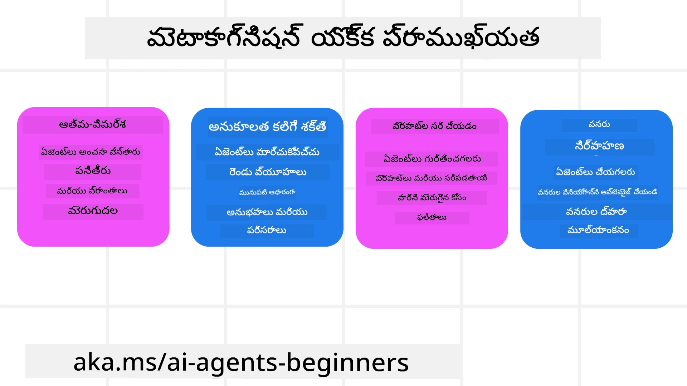
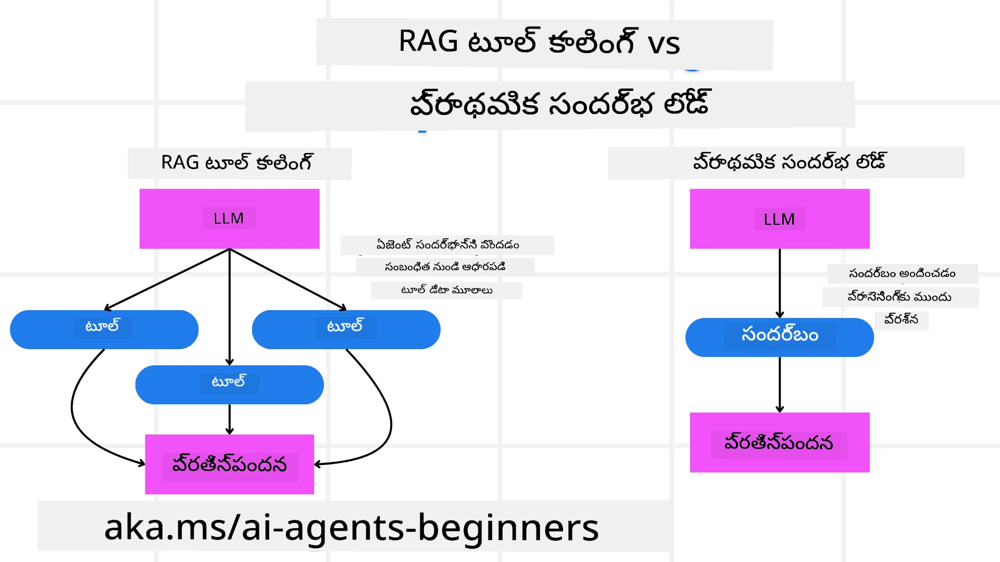

[](https://youtu.be/His9R6gw6Ec?si=3_RMb8VprNvdLRhX)

> _(ఈ పాఠం వీడియోను చూడడానికి పై చిత్రం మీద క్లిక్ చేయండి)_
# AI ఏజెంట్లలో మెటాకాగ్నిషన్

## పరిచయం

AI ఏజెంట్లలో మెటాకాగ్నిషన్ పాఠానికి స్వాగతం! ఈ అధ్యాయం, AI ఏజెంట్లు వారి స్వంత ఆలోచన ప్రక్రియల గురించి ఎలా ఆలోచించగలవో తెలుసుకోవాలనుకునే ప్రారంభకులకు రూపొందించబడింది. ఈ పాఠం ముగింపులో, మీరు ముఖ్యమైన సూత్రాలను అర్థం చేసుకుంటారు మరియు AI ఏజెంట్ డిజైన్లో మెటాకాగ్నిషన్‌ను ప్రయోగించడానికి 实用 ఉదాహరణలతో శక్తివంతులవుతారు.

## నేర్చుకునే లక్ష్యాలు

ఈ పాఠాన్ని పూర్తిచేసిన తరువాత, మీరు వీటిని చేయగలరని:

1. ఏజెంట్ నిర్వచనాలలో న్యాయ తంత్రముల ప్రభావాలను అర్థం చేసుకోండి.
2. స్వయం సరి చేసిన ఏజెంట్లను సహాయపడటానికి ప్రణాళిక మరియు మూల్యాంకన సాంకేతికతలను ఉపయోగించండి.
3. పనులను పూర్తి చేయడానికి కోడ్‌ను నియంత్రించగల స్వంత ఏజెంట్లను సృష్టించండి.

## మెటాకాగ్నిషన్ కు పరిచయం

మెటాకాగ్నిషన్ అనగా మన స్వంత ఆలోచనలను గురించి ఆలోచించే ఉన్నతస్థాయి జ్ఞాన ప్రక్రియలు. AI ఏజెంట్ల కోసం, ఇది వారి చర్యలను స్వీయ అవగాహన మరియు గత అనుభవాల ఆధారంగా మూల్యాంకనం చేసి సవరించగలగడం. "ఆలోచన గురించి ఆలోచన" అనే మెటాకాగ్నిషన్, ఏజెంటిక్ AI వ్యవస్థల అభివృద్ధిలో ఒక ముఖ్యమైన భావన. ఇది AI వ్యవస్థలు తమలోపల జరిగే ప్రక్రియలను తెలుసుకుని, తన ప్రవర్తనను పర్యవేక్షించి, నియంత్రించి, అనుకూలించగలగడం కలిగి ఉండటం. మనం ఒక సమస్యను గమనించడం లేదా అధ్యయనం చేయడం వంటి సమజేసుకున్న ప్రవర్తనలు. ఈ స్వీయ అవగాహన AI వ్యవస్థలు మెరుగైన నిర్ణయాలు తీసుకోవడానికి, లోపాలను గుర్తించడానికి, మరియు కాలక్రమేణా వారి ప్రదర్శనను మెరుగుపరచడానికి సహాయపడుతుంది - ఇది తిరున్ పరీక్షకు మరియు AI takeover కి సంబంధించిన చర్చకు తిరిగి సంబంధించినది.

ఏజెంటిక్ AI వ్యవస్థల సందర్భంలో, మెటాకాగ్నిషన్ ఈ కింది సవాళ్లను ఎదుర్కొనడంలో సహాయపడుతుంది:
- పారదర్శకత: AI వ్యవస్థలు తమ న్యాయమూర్తిని మరియు నిర్ణయాలను వివరించగలగడం నిర్ధారించటం.
- న్యాయం: AI వ్యవస్థలు సమాచారాన్ని సమగ్రపరచి, సరైన నిర్ణయాలు తీసుకునే సామర్థ్యాన్ని పెంపొందించడం.
- అనుకూలత: AI వ్యవస్థలు కొత్త వాతావరణాలకు మరియు మారుతున్న పరిస్థితులకు అనుకూలించుకోవడం.
- గ్రహణశక్తి: AI వ్యవస్థలు తమ పర్యావరణం నుండి డేటాను గుర్తించడం మరియు అర్థం చేసుకోవడంలో ఖచ్చితత్వాన్ని పెంపొందించడం.

### మెటాకాగ్నిషన్ అంటే ఏమిటి?

మెటాకాగ్నిషన్ లేదా "ఆలోచన గురించి ఆలోచన" అనేది ఉన్నతస్థాయి జ్ఞాన ప్రక్రియ, ఇది వ్యక్తిగత జ్ఞాన ప్రక్రియల స్వీయ అవగాహన మరియు నియంత్రణను కలిగి ఉంటుంది. AI రంగంలో, మెటాకాగ్నిషన్ ఏజెంట్లను తమ వ్యూహాలు మరియు చర్యలను మూల్యాంకనం చేసి, అనుకూలపరిచి, మెరుగైన సమస్య పరిష్కార మరియు నిర్ణయ తీసుకునే సామర్థ్యాలను కల్పిస్తుంది. మెటాకాగ్నిషన్ అర్థం చేసుకోవడం ద్వారా, మీరు కేవలం తెలివైనే కాకుండా, మరింత అనుకూలించగల మరియు సమర్థవంతమైన AI ఏజెంట్లను రూపకల్పన చేయగలుగుతారు. నిజమైన మెటాకాగ్నిషన్‌లో, AI తన స్వంత న్యాయాన్ని నిర్ధారిస్తుందని చూడగలుగుతారు.

ఉదాహరణ: “నేను చౌకగా ఉన్న విమాన టిక్కెట్లపై ప్రాధాన్యం ఇచ్చాను ఎందుకంటే... నేరుగా విమానాలు మిస్ అవుతున్నట్లుంది, కాబట్టి నేను మళ్లీ తనిఖీ చేద్దాను.”
ఇది ఎలాచేసిందో లేదా ఏ మార్గం ఎంచుకున్నదో గమనించడం.
- ఇది తప్పు చేసింది ఎందుకంటే గత సమయంలో వినియోగదారుల ప్రాధాన్యాలపై అధికంగా ఆధారపడింది, అందువల్ల ఇది తుది సిఫారసు కాకుండా నిర్ణయ తీసుకునే వ్యూహాన్ని సవరిస్తుంది.
- “ఎప్పుడైతే వినియోగదారు ‘చాలా గందరగోళంగా ఉంది’ అని తెలియజేస్తే, నేను కొన్ని ఆకర్షణలను మాత్రమే తొలగించడం కాకుండా, ‘అగ్రస్థాన ఆకర్షణలు’ ఎంచుకునే విధానం లో లోపం ఉందని ప్రతిబింబించాలి” అనే నమూనాలను నిర్ధారణ చేసుకోవడం.

### AI ఏజెంట్లలో మెటాకాగ్నిషన్ ప్రాధాన్యత

మెటాకాగ్నిషన్ AI ఏజెంట్ రూపకల్పనలో అనేక కారణాల వలన కీలక పాత్ర వహిస్తుంది:



- స్వీయ-పరిశీలన: ఏజెంట్‌లు తమ ప్రదర్శనను అంచనా వేసుకుని మెరుగుదల ప్రాంతాలను గుర్తించగలవు.
- అనుకూలత: ఏజెంట్‌లు గత అనుభవాలు మరియు మారుతున్న వాతావరణాల ఆధారంగా తమ వ్యూహాలను సవరించగలవు.
- లోప సవరణ: ఏజెంట్‌లు స్వతంత్రంగా లోపాలను గుర్తించి సరిచేసుకోవచ్చు, తద్వారా ఖచ్చితమైన ఫలితాలు వస్తాయి.
- వనరు నిర్వహణ: ఏజెంట్‌లు సమయం మరియు కంప్యూటేషన్ శక్తి వంటి వనరుల ఉపయోగాన్ని ప్రణాళిక చేసి, మూల్యాంకనం చేసి ఆప్టిమైజు చేయగలవు.

## AI ఏజెంట్ యొక్క భాగాలు

మెటాకాగ్నిటివ్ ప్రక్రియలకు ప్రవేశించే ముందు, AI ఏజెంట్ యొక్క ప్రాథమిక భాగాలను అర్థం చేసుకోవడం అవసరం. AI ఏజెంట్ సాధారణంగా కలిగి ఉంటుంది:

- వ్యక్తిత్వం: ఏజెంట్ యొక్క వ్యక్తిత్వం మరియు లక్షణాలు, ఇవి వినియోగదారులతో ఎలా వ్యవహరిస్తుందో నిర్వచిస్తాయి.
- సాధనాలు: ఏజెంట్ చేయగల సామర్థ్యాలు మరియు విధులు.
- నైపుణ్యాలు: ఏజెంట్ కలిగిన జ్ఞానము మరియు నైపుణ్యాలు.

ఈ భాగాలు కలిసి నిర్దిష్ట పనులను నిర్వహించగల "దక్షత యూనిట్" ను సృష్టిస్తాయి.

**ఉదాహరణ**:
ఒక ప్రయాణ ఏజెంట్‌ను పరిగణించండి, ఇది కేవలం మీ సెలవులను ప్రణాళిక చేయడమే కాకుండా, వాస్తవ కాల డేటా మరియు గత కస్టమర్ ప్రయాణ అనుభవాల ఆధారంగా దాని మార్గాన్ని సవరిస్తుంది.

### ఉదాహరణ: ప్రయాణ ఏజెంట్ సర్వీసులో మెటాకాగ్నిషన్

మీరు AI శక్తితో నడిచే ప్రయాణ ఏజెంట్ సర్వీస్‌ను రూపకల్పన చేయిస్తున్నట్లు ఊహించుకోండి. "ప్రయాణ ఏజెంట్" వినియోగదారులకు వారి సెలవులు ప్రణాళిక చేయడంలో సహాయం చేస్తుంది. మెటాకాగ్నిషన్‌ను చేర్చడానికి, ప్రయాణ ఏజెంట్ తన చర్యలను స్వీయ అవగాహన మరియు గత అనుభవాల ఆధారంగా మూల్యాంకనం చేసి సవరించాలి. ఇక్కడ మెటాకాగ్నిషన్ ఎలా పాత్ర పోషిస్తుంది:

#### ప్రస్తుత పని

ప్రస్తుత పని ఒక వినియోగదారుకు ప్యారిస్‌కి పయనం ప్రణాళిక చేయడంలో సహాయం చేయడం.

#### పనిని పూర్తి చేయడానికి దశలు

1. **వినియోగదారుని ప్రాధాన్యాలు సేకరించండి**: వయన్ తేదీలు, బడ్జెట్, ఆసక్తులు (ఉదా: మ్యూజియంలు, వంటకాలు, షాపింగ్) మరియు ఏవైనా ప్రత్యేక అవసరాలు గురించి వినియోగదారుని అడగండి.
2. **వివరాలను పొందండి**: వినియోగదారుని ప్రాధాన్యాలకు అనుగుణంగా విమానాలు, వసతులు, ఆకర్షణలు, మరియు రెస్టారెంట్ల కి వెతకండి.
3. **సిఫారసులు సృష్టించండి**: విమాన వివరాలు, హోటల్ రిజర్వేషన్లు, మరియు సూచించిన కార్యాచరణలతో ప్రత్యేకమైన ప్రయాణ వివరాలను అందించండి.
4. **మూల్యాంకన ఆధారంగా సవరించండి**: సూచనలపై వినియోగదారుని నుండి అభిప్రాయం తీసుకుని అవసరమైన సవరణలు చేయండి.

#### అవసరమైన వనరులు

- విమాన మరియు హోటల్ బుకింగ్ డేటాబేసులకు ప్రాప్తి.
- ప్యారిస్ ఆకర్షణలు మరియు రెస్టారెంట్లపై సమాచారం.
- గత పరస్పరక్రియల నుండి వినియోగదారుని అభిప్రాయ డేటా.

#### అనుభవం మరియు స్వీయ-పరిశీలన

ప్రయాణ ఏజెంట్ తన ప్రదర్శనను మూల్యాంకనం చేసి, గత అనుభవాల నుండి నేర్చుకుంటుంది. ఉదాహరణకు:

1. **వినియోగదారుల అభిప్రాయ విశ్లేషణ**: ప్రయాణ ఏజెంట్ అభిప్రాయాలను సమీక్షించి, ఏ సూచనలు బాగా స్వీకరించబడ్డాయో, ఏవంతేకాకపోయాయో నిర్ణయిస్తుంది. భవిష్య సిఫారసులని అందుకు అనుగుణంగా సవరిస్తుంది.
2. **అనుకూలత**: ఒక వినియోగదారు గందరగోళ ప్రదేశాలను ఇష్టపడనిట్లు ముందు చెప్పినట్లయితే, ప్రయాణ ఏజెంట్ భవిష్యత్తులో ప్రముఖ టూరిస్ట్ ప్రదేశాలను పీక్ టైమ్లో సూచించడానికి తప్పుతుంది.
3. **లోప సవరణ**: ఒక గత బుకింగ్ లో ప్రయాణ ఏజెంట్ పొరపాటు చేసినట్లయితే — ఉదా: పూర్తిగా బుక్ అయిన హోటల్ సూచించడం — సిఫారసులు ఇచ్చే ముందు లభ్యతను మరింత కఠినంగా తనిఖీ చేయటం నేర్చుకుంటుంది.

#### ప్రాక్టికల్ డెవలపర్ ఉదాహరణ

మెటాకాగ్నిషన్ చేర్చినప్పుడు ప్రయాణ ఏజెంట్ కోడ్ ఎలా కనిపించవచ్చు అనేది ఒక సరళీకృత ఉదాహరణ ఇక్కడ ఉంది:

```python
class Travel_Agent:
    def __init__(self):
        self.user_preferences = {}
        self.experience_data = []

    def gather_preferences(self, preferences):
        self.user_preferences = preferences

    def retrieve_information(self):
        # ఇష్టాల ఆధారంగా విమానాలు, హోటల్స్ మరియు ఆకర్షణలను శోధించండి
        flights = search_flights(self.user_preferences)
        hotels = search_hotels(self.user_preferences)
        attractions = search_attractions(self.user_preferences)
        return flights, hotels, attractions

    def generate_recommendations(self):
        flights, hotels, attractions = self.retrieve_information()
        itinerary = create_itinerary(flights, hotels, attractions)
        return itinerary

    def adjust_based_on_feedback(self, feedback):
        self.experience_data.append(feedback)
        # అభిప్రాయాలను విశ్లేషించి భవిష్యత్ సిఫారసులను సర్దుబాటు చేయండి
        self.user_preferences = adjust_preferences(self.user_preferences, feedback)

# ఉదాహరణ వినియోగం
travel_agent = Travel_Agent()
preferences = {
    "destination": "Paris",
    "dates": "2025-04-01 to 2025-04-10",
    "budget": "moderate",
    "interests": ["museums", "cuisine"]
}
travel_agent.gather_preferences(preferences)
itinerary = travel_agent.generate_recommendations()
print("Suggested Itinerary:", itinerary)
feedback = {"liked": ["Louvre Museum"], "disliked": ["Eiffel Tower (too crowded)"]}
travel_agent.adjust_based_on_feedback(feedback)
```

#### ఎందుకు మెటాకాగ్నిషన్ ముఖ్యమే

- **స్వీయ-పరిశీలన**: ఏజెంట్‌లు తమ ప్రదర్శనను విశ్లేషించి మెరుగుదల ప్రాంతాలను గుర్తించగలవు.
- **అనుకూలత**: ఏజెంట్‌లు అభిప్రాయం మరియు మారుతున్న పరిస్థితుల ఆధారంగా వ్యూహాలను సవరించగలవు.
- **లోప సవరణ**: ఏజెంట్‌లు స్వతంత్రంగా లోపాలను గుర్తించి సరిచేసుకోవచ్చు.
- **వనరు నిర్వహణ**: ఏజెంట్‌లు సమయం మరియు కంప్యూటింగ్ సామర్థ్యం వంటి వనరుల వినియోగాన్ని ఆప్టిమైజ్ చేయగలవు.

మెటాకాగ్నిషన్ చేర్చడం ద్వారా, ప్రయాణ ఏజెంట్ మరింత వ్యక్తిగతీకృతమైన మరియు ఖచ్చితమైన ప్రయాణ సిఫారసులను అందించగలుగుతుంది, దీంతో మొత్తం వినియోగదారుని అనుభవం మెరుగుపడుతుంది.

---

## 2. ఏజెంట్లలో ప్రణాళిక


ప్లానింగ్ అనేది AI ఏజెంట్ ప్రవర్తనలో ఒక కీలక అంశం. ఇది లక్ష్యాన్ని సాధించడానికి అవసరమైన దశలను రూపకల్పన చేయడం, ప్రస్తుత స్థితి, వనరులు, మరియు సంభవించే అడ్డంకులను పరిగణలోకి తీసుకోవడం వంటి పనులను కలిగి ఉంటుంది.

### ప్లానింగ్ యొక్క అంశాలు

- **ప్రస్తుత పని**: పనిని స్పష్టంగా నిర్వచించండి.
- **పనిని పూర్తి చేయుటకు దశలు**: పనిని నిర్వహించదగిన దశలుగా విభజించండి.
- **అవసరమైన వనరులు**: అవసరమైన వనరులను గుర్తించండి.
- **అనుభవం**: ప్లానింగ్ కోసం గత అనుభవాలను ఉపయోగించండి.

**ఉదాహరణ**:
యూజర్ తన ప్రయాణాన్ని సమర్థవంతంగా ప్లాన్ చేసుకోవడానికి సహాయం చేసే దశలను ట్రావెల్ ఏజెంట్ తీసుకోవాల్సినవి ఇది:

### ట్రావెల్ ఏజెంట్ కోసం దశలు

1. **యూజర్ యొక్క ఇష్టాలను సేకరించడం**
   - యూజర్ నుండి వారి ప్రయాణ తేదీలు, బడ్జెట్, ఆసక్తులు, మరియు ఏవైనా ప్రత్యేక అవసరాలు గురించి వివరాలు అడగండి.
   - ఉదాహరణలు: "మీరు ఎప్పుడు ప్రయాణం చేయాలనుకుంటున్నారు?" "మీ బడ్జెట్ శ్రేణి ఎంత?" "మీరు సెలవుల్లో ఏ క్రియల్ని ఆస్వాదిస్తారు?"

2. **సమాచారం సేకరణ**
   - యూజర్ ఇష్టాల ఆధారంగా సంబంధిత ప్రయాణ ఎంపికలను శోధించండి.
   - **ఫ్లైట్ల**: యూజర్ బడ్జెట్ మరియు ఇష్టపడే ప్రయాణ తేదీలలో అందుబాటులో ఉన్న ఫ్లైట్ల కోసం చూడండి.
   - **తగ్గించుకునే చోటులు**: యూజర్ ప్రాధాన్యాలకు అనుగుణంగా స్థానానికత, ధర, సౌకర్యాలు కలిగిన హోటల్స్ లేదా అద్దెకొనే ప్రాపర్టీలను కనుగొనండి.
   - **ఆకర్షణలు మరియు భోజనాల స్థలాలు**: యూజర్ ఆసక్తులకు అనుగుణంగా ప్రసిద్ధ ఆకర్షణలు, చర్యలు, మరియు భోజన శైలి ఎంపికలను గుర్తించండి.

3. **సూచనలు రూపొందించు**
   - సేకరించిన సమాచారం ఆధారంగా వ్యక్తిగత దినచర్యను తయారు చేయండి.
   - ఫ్లైట్ ఎంపికలు, హోటల్ రిజర్వేషన్లు, సూచించిన కార్యకలాపాలు వంటి వివరాలను అందజేయండి, మరు సార్వత్రికంగా యూజర్ ఇష్టాలకు సరిపడేలా సవరించండి.

4. **యూజర్‌కు దినచర్యను సమర్పించండి**
   - యూజర్ సమీక్ష కోసం ప్రతిపాదించిన దినచర్యను పంచుకోండి.
   - ఉదాహరణ: "మీ ప్యారిస్ ప్రయాణానికి ఇది సూచించిన దినచర్య. దీంట్లో ఫ్లైట్ వివరాలు, హోటల్ బుకింగ్స్, మరియు సూచించిన కార్యకలాపాలు మరియు రెస్టారెంట్లు ఉన్నాయి. మీ అభిప్రాయమేమిటో చెప్పండి!"

5. **జవాబుదారీతనం సేకరణ**
   - ప్రతిపాదించిన దినచర్యపై యూజర్ నుండి అభిప్రాయాన్ని అడగండి.
   - ఉదాహరణలు: "ఫ్లైట్ ఎంపికలు మీకు నచ్చినవా?" "హోటల్ మీ అవసరాలకి సరిపడుతుందా?" "ఏదైనా కార్యకలాపాలు మీరు చేర్చాలనుకుంటున్నారా లేదా తొలగించాలనుకుంటున్నారా?"

6. **జవాబుదారీతనంపై ఆధారపడి సవరణలు చేయండి**
   - యూజర్ అభిప్రాయం ప్రకారం దినచర్యను మార్చండి.
   - యూజర్ ఇష్టాలకు మరింత సరిపడముగా ఫ్లైట్, నివాసం, మరియు కార్యకలాప సూచనలను సవరిం చండి.

7. **చివరి ధృవీకరణ**
   - నవీకరించిన దినచర్యను యూజర్‌కు చివరి ధృవీకరణ కోసం సమర్పించండి.
   - ఉదాహరణ: "మీ అభిప్రాయం ఆధారంగా నేను మార్పులు చేశాను. ఇది నవీకరించిన దినచర్య. ఇది మీకు మొత్తం బాగున్నదిగా ఉందా?"

8. ** బుకింగ్ మరియు ధృవీకరణ**
   - యూజర్ దినచర్యను ఆమోదించిన తరువాత, ఫ్లైట్లు, నివాసాలు మరియు ముందుగా ప్లాన్ చేసిన కార్యకలాపాలను బుక్ చేయండి.
   - ధృవీకరణ వివరాలను యూజర్కి పంపండి.

9. **ప్రముఖ మద్దతు అందించండి**
   - యూజర్ ప్రయాణం మొదలయ్యే సమయం మరియు ప్రయాణ సమయంలో ఏవైనా మార్పులు లేదా అదనపు అభ్యర్థనలు ఉన్నప్పుడు సహాయం అందించేందుకు అందుబాటులో ఉండండి.
   - ఉదాహరణ: "మీ ప్రయాణ సమయంలో ఇంకేమన్నా సహాయం కావాలంటే, ఎప్పుడైన నన్ను సంప్రదించొచ్చు!"

### ఉదాహరణ సంబంధం

```python
class Travel_Agent:
    def __init__(self):
        self.user_preferences = {}
        self.experience_data = []

    def gather_preferences(self, preferences):
        self.user_preferences = preferences

    def retrieve_information(self):
        flights = search_flights(self.user_preferences)
        hotels = search_hotels(self.user_preferences)
        attractions = search_attractions(self.user_preferences)
        return flights, hotels, attractions

    def generate_recommendations(self):
        flights, hotels, attractions = self.retrieve_information()
        itinerary = create_itinerary(flights, hotels, attractions)
        return itinerary

    def adjust_based_on_feedback(self, feedback):
        self.experience_data.append(feedback)
        self.user_preferences = adjust_preferences(self.user_preferences, feedback)

# బుకింగ్ అభ్యర్థనలో ఉదాహరణ వినియోగం
travel_agent = Travel_Agent()
preferences = {
    "destination": "Paris",
    "dates": "2025-04-01 to 2025-04-10",
    "budget": "moderate",
    "interests": ["museums", "cuisine"]
}
travel_agent.gather_preferences(preferences)
itinerary = travel_agent.generate_recommendations()
print("Suggested Itinerary:", itinerary)
feedback = {"liked": ["Louvre Museum"], "disliked": ["Eiffel Tower (too crowded)"]}
travel_agent.adjust_based_on_feedback(feedback)
```

## 3. సరిదిద్దు RAG సిస్టమ్

మొదటగా మనం RAG టూల్ మరియు ప్రీ-ఎంప్టివ్ కాంటెక్స్ట్ లోడ్ మధ్య తేడా తెలుసుకుందాం



### రిట్రీవల్-ఆగ్మెంటెడ్ జనరేషన్ (RAG)

RAG అనేది రిట్రీవల్ సిస్టమ్‌ను జనరేటివ్ మోడల్‌తో కలిపిన వ్యూహం. ఒక ప్రశ్న అడిగినపుడు, రిట్రీవల్ సిస్టమ్ సంబంధిత డాక్యుమెంట్లు లేదా డేటాను బయటి మూలం నుండి తెస్తుంది, మరియు ఈ పొందిన సమాచారం జనరేటివ్ మోడల్ ఇన్‌పుట్‌ను పెంపొందించడంలో ఉపయోగపడుతుంది. ఇది మోడల్‌ను మరింత ఖచ్చితంగా, ప్రాసంగికంగా సంబంధించిన ప్రతిస్పందనలు ఇవ్వగలుగుతుంది.

RAG సిస్టమ్‌లో ఏజెంట్ ఓ జ్ఞాన ఆధారిని అడిగి సంబంధిత సమాచారం తీసుకుని, సరైన ప్రతిస్పందనలు లేదా చర్యలు తీయడానికి ఉపయోగిస్తుంది.

### సరిదిద్దు RAG దృష్టికోణం

సరిదిద్దు RAG దృష్టికోణం AI ఏజెంట్ల లోపాలను సరిదిద్దడానికి మరియు ఖచ్చితత్వాన్ని అభివృద్ధి చేయడానికి RAG టెక్నిక్లను ఉపయోగించడంలో కేంద్రీకృతమై ఉంటుంది. దీంట్లో:

1. **ప్రాంప్టింగ్ సాంకేతికత**: సంబంధిత సమాచారాన్ని తీసుకోవడానికి ఏజెంట్‌ను మార్గనిర్దేశం చేసే ప్రత్యేక ప్రాంప్టులను ఉపయోగించడం.
2. **టూల్**: పొందిన సమాచార సారాంశాన్ని అంచనా వేసి, ఖచ్చితమైన ప్రతిస్పందనలు తెచ్చే అల్గోరిథములు మరియు యంత్రాంగులను అమలు చేయడం.
3. **మూల్యాంకన**: ఏజెంట్ పనితీరు నిరంతరంగా పరిశీలించి, దాని ఖచ్చితత్వం మరియు సమర్థతను మెరుగుపరచడానికి సవరణలు చేయడం.

#### ఉదాహరణ: సర్చ్ ఏజెంట్‌లో సరిదిద్దు RAG

యూజర్ ప్రశ్నలకు సమాధానమివ్వటానికి వెబ్ నుంచి సమాచారాన్ని సేకరించే ఒక సర్చ్ ఏజెంట్‌ను పరిగణించండి. సరిదిద్దు RAG దృష్టికోణం ఇవి కలిగి ఉండవచ్చు:

1. **ప్రాంప్టింగ్ సాంకేతికత**: యూజర్ ఇన్పుట్ ఆధారంగా శోధన ప్రశ్నలను తయారు చేయడం.
2. **టూల్**: సహజ భాషా ప్రాసెసింగ్ మరియు మెషీన్ లెర్నింగ్ అల్గోరిథమ్లను ఉపయోగించి శోధన ఫలితాలను ర్యాంక్ చేసి ఫిల్టర్ చేయడం.
3. **మూల్యాంకన**: యూజర్ అభిప్రాయాలను విశ్లేషించి, పొందిన సమాచారంలో లోపాలను గుర్తించి సరిదిద్దడం.

### ట్రావెల్ ఏజెంట్‌లో సరిదిద్దు RAG

సరిదిద్దు RAG (రిట్రీవల్-ఆగ్మెంటెడ్ జనరేషన్) AIకి సమాచారాన్ని సరైనదిగా పునఃప్రమాణీకరించి, ఉత్పత్తి చేయడంలో మెరుగుదల కలిగిస్తుంది. ట్రావెల్ ఏజెంట్ సరిదిద్దు RAG దృష్టికోణాన్ని ఎలా ఉపయోగించి మరింత ఖచ్చితమైన, సంబంధప్రధమైన ప్రయాణ సిఫార్సులను అందించగలదో చూద్దాం.

దీంట్లో ఈ క్రింది విషయాలు ఉంటాయి:

- **ప్రాంప్టింగ్ సాంకేతికత:** సంబంధిత సమాచారాన్ని తీసుకోవడానికి ఏజెంట్ మార్గనిర్దేశం చేసే ప్రత్యేక ప్రాంప్టులను ఉపయోగించడం.
- **టూల్:** పొందిన సమాచార సారాంశాన్ని అంచనా వేసి, ఖచ్చితమైన ప్రతిస్పందనలు తెచ్చే అల్గోరిథములు మరియు యంత్రాంగాలను అమలు చేయడం.
- **మూల్యాంకన:** ఏజెంట్ పనితీరు నిరంతరంగా పరిశీలించి, దాని ఖచ్చితత్వం మరియు సమర్థతను మెరుగుపరచడానికి సవరణలు చేయడం.

#### ట్రావెల్ ఏజెంట్‌లో సరిదిద్దు RAG అమలు దశలు

1. **ప్రాథమిక యూజర్ సంబంధం**
   - ట్రావెల్ ఏజెంట్ యూజర్ నుండి ప్రారంభ ఇష్టాలను సేకరిస్తుంది, ఉదా: గమ్యం, ప్రయాణ తేదీలు, బడ్జెట్, ఆసక్తులు.
   - ఉదాహరణ:

     ```python
     preferences = {
         "destination": "Paris",
         "dates": "2025-04-01 to 2025-04-10",
         "budget": "moderate",
         "interests": ["museums", "cuisine"]
     }
     ```

2. **సమాచారం సేకరణ**
   - ట్రావెల్ ఏజెంట్ యూజర్ ఇష్టాల ఆధారంగా ఫ్లైట్లు, నివాసాలు, ఆకర్షణలు మరియు రెస్టారెంట్ల గురించి సమాచారాన్ని సేకరిస్తుంది.
   - ఉదాహరణ:

     ```python
     flights = search_flights(preferences)
     hotels = search_hotels(preferences)
     attractions = search_attractions(preferences)
     ```

3. **ప్రాథమిక సిఫార్సులు ఉత్పత్తి చేయడం**
   - ట్రావెల్ ఏజెంట్ సేకరించిన సమాచారంతో వ్యక్తిగత దినచర్యను తయారు చేస్తుంది.
   - ఉదాహరణ:

     ```python
     itinerary = create_itinerary(flights, hotels, attractions)
     print("Suggested Itinerary:", itinerary)
     ```

4. **యూజర్ అభిప్రాయం సేకరణ**
   - ట్రావెల్ ఏజెంట్ ప్రారంభ సిఫార్సులపై యూజర్ నుండి అభిప్రాయం అడుగుతుంది.
   - ఉదాహరణ:

     ```python
     feedback = {
         "liked": ["Louvre Museum"],
         "disliked": ["Eiffel Tower (too crowded)"]
     }
     ```

5. **సరిదిద్దు RAG ప్రక్రియ**
   - **ప్రాంప్టింగ్ సాంకేతికత:** యూజర్ అభిప్రాయాన్ని అనుసరించి ట్రావెల్ ఏజెంట్ కొత్త శోధన ప్రశ్నలను తయారు చేస్తుంది.
     - ఉదాహరణ:

       ```python
       if "disliked" in feedback:
           preferences["avoid"] = feedback["disliked"]
       ```

   - **టూల్**: యూజర్ అభిప్రాయంపై ఆధారపడి ర్యాంక్ చేసి కొత్త శోధన ఫలితాలను ఫిల్టర్ చేయడానికి అల్గోరిథమ్స్‌ను ఉపయోగిస్తుంది.
     - ఉదాహరణ:

       ```python
       new_attractions = search_attractions(preferences)
       new_itinerary = create_itinerary(flights, hotels, new_attractions)
       print("Updated Itinerary:", new_itinerary)
       ```

   - **మూల్యాంకన**: యూజర్ అభిప్రాయాలను విశ్లేషించి, సిఫార్సుల సరైనదని నిర్ధారించడానికి నిరంతరం పనితీరును పరీక్షిస్తుంది మరియు మార్పులు చేస్తుంది.
     - ఉదాహరణ:

       ```python
       def adjust_preferences(preferences, feedback):
           if "liked" in feedback:
               preferences["favorites"] = feedback["liked"]
           if "disliked" in feedback:
               preferences["avoid"] = feedback["disliked"]
           return preferences

       preferences = adjust_preferences(preferences, feedback)
       ```

#### ఉపయోగకరమైన ఉదాహరణ

ట్రావెల్ ఏజెంట్‌లో సరిదిద్దు RAG దృష్టికోణం కలిగి ఉన్న సరళమైన ఒక పైథాన్ కోడ్ ఉదాహరణ ఇదిగో:

```python
class Travel_Agent:
    def __init__(self):
        self.user_preferences = {}
        self.experience_data = []

    def gather_preferences(self, preferences):
        self.user_preferences = preferences

    def retrieve_information(self):
        flights = search_flights(self.user_preferences)
        hotels = search_hotels(self.user_preferences)
        attractions = search_attractions(self.user_preferences)
        return flights, hotels, attractions

    def generate_recommendations(self):
        flights, hotels, attractions = self.retrieve_information()
        itinerary = create_itinerary(flights, hotels, attractions)
        return itinerary

    def adjust_based_on_feedback(self, feedback):
        self.experience_data.append(feedback)
        self.user_preferences = adjust_preferences(self.user_preferences, feedback)
        new_itinerary = self.generate_recommendations()
        return new_itinerary

# ఉదాహరణ ఉపయోగం
travel_agent = Travel_Agent()
preferences = {
    "destination": "Paris",
    "dates": "2025-04-01 to 2025-04-10",
    "budget": "moderate",
    "interests": ["museums", "cuisine"]
}
travel_agent.gather_preferences(preferences)
itinerary = travel_agent.generate_recommendations()
print("Suggested Itinerary:", itinerary)
feedback = {"liked": ["Louvre Museum"], "disliked": ["Eiffel Tower (too crowded)"]}
new_itinerary = travel_agent.adjust_based_on_feedback(feedback)
print("Updated Itinerary:", new_itinerary)
```

### ప్రీ-ఎంప్టివ్ కాంటెక్స్ట్ లోడ్


ప్రీ-ఎంప్టివ్ కాంటెక్స్ట్ లోడ్ అనగా శోధనను ప్రోసెస్ చేయగలిగే ముందు సంబంధిత సందర్భం లేదా నేపథ్య సమాచారాన్ని మోడల్‌లో లోడ్ చేయడం. దీని అర్థం మోడల్ ప్రారంభం నుండి ఈ సమాచారం ప్రవేశించగలిగి ఉంటుంది, తద్వారా అదనపు డేటాను పూర్తిచేయాల్సిన అవసరం లేకుండా మరింత సమాచారంతో కూడిన సమాధానాలను సృష్టించడంలో సహాయపడుతుంది.

ఇక్కడ ఒక సులభీకరించిన ఉదాహరణ ఉంది, ప్రీ-ఎంప్టివ్ కాంటెక్స్ట్ లోడ్ ఒక ట్రావెల్ ఏజెంట్ అప్లికేషన్ కోసం పైన ఉపయోగించబడిన విధానం:

```python
class TravelAgent:
    def __init__(self):
        # ప్రజాదరణ పొందిన గమ్యస్థానాలు మరియు వాటి సమాచారాన్ని ముందుగానే లోడ్ చేయండి
        self.context = {
            "Paris": {"country": "France", "currency": "Euro", "language": "French", "attractions": ["Eiffel Tower", "Louvre Museum"]},
            "Tokyo": {"country": "Japan", "currency": "Yen", "language": "Japanese", "attractions": ["Tokyo Tower", "Shibuya Crossing"]},
            "New York": {"country": "USA", "currency": "Dollar", "language": "English", "attractions": ["Statue of Liberty", "Times Square"]},
            "Sydney": {"country": "Australia", "currency": "Dollar", "language": "English", "attractions": ["Sydney Opera House", "Bondi Beach"]}
        }

    def get_destination_info(self, destination):
        # ముందుగానే లోడ్ చేసిన సందర్భం నుండి గమ్యస్థాన సమాచారం తీసుకోండి
        info = self.context.get(destination)
        if info:
            return f"{destination}:\nCountry: {info['country']}\nCurrency: {info['currency']}\nLanguage: {info['language']}\nAttractions: {', '.join(info['attractions'])}"
        else:
            return f"Sorry, we don't have information on {destination}."

# ఉదాహరణ ఉపయోగం
travel_agent = TravelAgent()
print(travel_agent.get_destination_info("Paris"))
print(travel_agent.get_destination_info("Tokyo"))
```

#### వివరణ

1. **ఆరంభం (`__init__` విధానం)**: `TravelAgent` క్లాస్ లో ప్యారిస్, టోక్యో, న్యూయార్క్, మరియు సిడ్నీ వంటి ప్రజాదరణ గల డెస్టినేషన్‌ల సమాచారం యొక్క డిక్షనరీని ముందుగానే లోడ్ చేస్తుంది. ఈ డిక్షనరీ ప్రతి ప్రదేశానికి దేశం, కరెన్సీ, భాష మరియు ముఖ్య ఆకర్షణల వివరాలను కలిగి ఉంటుంది.

2. **సమాచారం పొందడం (`get_destination_info` విధానం)**: ఉపయోగకర్త ఒక నిర్దిష్ట గమ్యస్థానం గురించి ప్రశ్నించినప్పుడు, `get_destination_info` విధానం ఈ ప్రీ-లోడ్ చేసిన కాంటెక్స్ట్ డిక్షనరీ నుండి సంబంధిత సమాచారాన్ని పొందుతుంది.

కాంటెక్స్ట్‌ను ముందుగానే లోడ్ చేయడం ద్వారా, ట్రావెల్ ఏజెంట్ అప్లికేషన్ వేగంగా ఉపయోగకర్త ప్రశ్నలకు స్పందించగలదు, ఈ సమాచారం రెయల్-టైమ్లో బాహ్య మూలం నుండి తిరిగి తీసుకోవాల్సిన అవసరం లేకుండా. ఇది అప్లికేషన్‌ను మరింత సమర్థవంతంగా మరియు స్పందనశీలంగా చేస్తుంది.

### లూప్ ముందు లక్ష్యంతో ప్లాన్ బూట్‌స్ట్రాపింగ్

లక్ష్యంతో ఒక ప్రణాళికను బూట్‌స్ట్రాప్ చేయడం అనగా స్పష్టమైన ఉద్దేశ్యాన్ని లేదా లక్ష్య ఫలితాన్ని ముందుగానే నిర్ణయించడం. ఈ లక్ష్యాన్ని ముందుగా నిర్వచించడం ద్వారా, మోడల్ దీనిని ప్రేరణగా ఉపయోగించి ప్రతీ పునరావృతదశలో దాని మార్గదర్శక సూత్రంగా పరిగణిస్తుంది. ఇది ప్రతి పునరావృత దశకు లక్ష్యం సాధించడానికి దగ్గర కావడంలో సహాయపడుతుంది, ప్రక్రియను మరింత సమర్థవంతం మరియు కేంద్రీకృతం చేస్తుంది.

క్రింద ఒక ఉదాహరణ ఉంది, ఒక ట్రావెల్ ఏజెంట్ కోసం Pythonలో ప్రయాణ ప్రణాళికను లక్ష్యంతో బూట్‌స్ట్రాప్ చేసే విధానం:

### పరిస్థితి

ఒక ట్రావెల్ ఏజెంట్ తన క్లయింట్ కోసం అనుకూలీకరించిన సెలవుల ప్రణాళిక చేయాలనుకుంటున్నాడు. లక్ష్యం క్లయింట్ యొక్క అభిరుచులు మరియు బడ్జెట్ ఆధారంగా గరిష్ట సంతృప్తిని కలిగించే ప్రయాణ సూచీకాన్ని సృష్టించడం.

### దశలు

1. క్లయింట్ యొక్క అభిరుచులు మరియు బడ్జెట్ నిర్వచించండి.
2. ఈ అభిరుచుల ఆధారంగా ప్రారంభ ప్రణాళికను బూట్‌స్ట్రాప్ చేయండి.
3. క్లయింట్ సంతృప్తికోసం ప్రణాళికను పునరావృతదశల ద్వారా మెరుగుపరచండి.

#### Python కోడ్

```python
class TravelAgent:
    def __init__(self, destinations):
        self.destinations = destinations

    def bootstrap_plan(self, preferences, budget):
        plan = []
        total_cost = 0

        for destination in self.destinations:
            if total_cost + destination['cost'] <= budget and self.match_preferences(destination, preferences):
                plan.append(destination)
                total_cost += destination['cost']

        return plan

    def match_preferences(self, destination, preferences):
        for key, value in preferences.items():
            if destination.get(key) != value:
                return False
        return True

    def iterate_plan(self, plan, preferences, budget):
        for i in range(len(plan)):
            for destination in self.destinations:
                if destination not in plan and self.match_preferences(destination, preferences) and self.calculate_cost(plan, destination) <= budget:
                    plan[i] = destination
                    break
        return plan

    def calculate_cost(self, plan, new_destination):
        return sum(destination['cost'] for destination in plan) + new_destination['cost']

# ఉదాహరణ వాడకం
destinations = [
    {"name": "Paris", "cost": 1000, "activity": "sightseeing"},
    {"name": "Tokyo", "cost": 1200, "activity": "shopping"},
    {"name": "New York", "cost": 900, "activity": "sightseeing"},
    {"name": "Sydney", "cost": 1100, "activity": "beach"},
]

preferences = {"activity": "sightseeing"}
budget = 2000

travel_agent = TravelAgent(destinations)
initial_plan = travel_agent.bootstrap_plan(preferences, budget)
print("Initial Plan:", initial_plan)

refined_plan = travel_agent.iterate_plan(initial_plan, preferences, budget)
print("Refined Plan:", refined_plan)
```

#### కోడ్ వివరణ

1. **ఆరంభం (`__init__` విధానం)**: `TravelAgent` క్లాస్ ప్రారంభంలో పలు గమ్యస్థానాల జాబితాతో ఇనిషియలైజ్ అవుతుంది, వాటికి పేరు, ఖర్చు, మరియు చట్రం రకం వంటి లక్షణాలు ఉంటాయి.

2. **బూట్‌స్ట్రాపింగ్ ప్లాన్ (`bootstrap_plan` విధానం)**: ఈ విధానం క్లయింట్ అభిరుచులు మరియు బడ్జెట్ ఆధారంగా ఒక ప్రారంభ ప్రయాణ ప్రణాళికను తయారు చేస్తుంది. ఇది గమ్యస్థానాల జాబితాను పరిగణించి, అవి క్లయింట్ అభిరుచులకు సరిపోతాయా, బడ్జెట్ లోపల ఉన్నాయా అని తనిఖీ చేసి ప్రణాళికలో జోడిస్తుంది.

3. **అభిరుచులు సరిపోవడం (`match_preferences` విధానం)**: ఈ విధానం గమ్యస్థానం క్లయింట్ అభిరుచులకు సరిపోతుందా లేదో తనిఖీ చేస్తుంది.

4. **ప్రణాళికను పునరావృతదశ చేయడం (`iterate_plan` విధానం)**: ఈ విధానం ప్రణాళికను మెరుగుపరచడానికి ప్రణాళికలో ఉన్న ప్రతి గమ్యస్థానాన్ని మరింత మంచిదైన సరిపోయే గమ్యస్థానంతో మార్చాలని ప్రయత్నిస్తుంది, క్లయింట్ అభిరుచులు మరియు బడ్జెట్ పరిమితులను పరిగణిస్తుంది.

5. **ఖర్చు లెక్కింపు (`calculate_cost` విధానం)**: ఈ విధానం ప్రస్తుత ప్రణాళిక మొత్తం ఖర్చును, ఒక కొత్త గమ్యస్థానాన్ని కూడా కలిపి లెక్కిస్తుంది.

#### ఉదాహరణ వాడకం

- **ప్రారంభ ప్రణాళిక**: ట్రావెల్ ఏజెంట్ క్లయింట్ అభిరుచుల కోసం పర్యటన మరియు $2000 బడ్జెట్ ఆధారంగా ప్రారంభ ప్రణాళికను సృష్టిస్తాడు.
- **మెరుగుపరచిన ప్రణాళిక**: ట్రావెల్ ఏజెంట్ ప్రణాళికను పునరావృత దశల్లో మెరుగుపరుస్తూ క్లయింట్ అభిరుచులు మరియు బడ్జెట్ కోసం ఆప్టిమైజ్ చేస్తాడు.

లక్ష్యంతో ప్లాన్‌ను బూట్‌స్ట్రాప్ చేసి, పునరావృతదశలు ద్వారా మెరుగుపర్చడం ద్వారా, ట్రావెల్ ఏజెంట్ తన క్లయింట్ కోసం అనుకూలీకరించిన, ఆప్టిమైజ్ చేసిన ప్రయాణ సూచికని సృష్టించగలడు. ఈ విధానం ప్రణాళిక క్లయింట్ అభిరుచులు మరియు బడ్జెట్ కు ప్రారంభంలో కట్టుబడి ఉండటానికి మరియు ప్రతి పునరావృత దశతో మెరుగుపడటానికి సహాయపడుతుంది.

### రీ-ర్యాంకింగ్ మరియు స్కోరింగ్ కోసం LLM ఉపయోగించడం

పెద్ద భాషా మోడల్స్ (LLMs) రీ-ర్యాంకింగ్ మరియు స్కోరింగ్ కోసం ఉపయోగించవచ్చు, ఆ సంపాదించిన డాక్యుమెంట్లు లేదా జనరేట్ చేసిన ప్రతిస్పందనల ప్రాముఖ్యత మరియు నాణ్యతను అంచనా వేయడం ద్వారా. ఇది ఇలా పనిచేస్తుంది:

**షోధన**: ప్రారంభ ఫెచింగ్ స్టెప్ కోరిక ఆధారంగా అభ్యర్థిత డాక్యుమెంట్లు లేదా ప్రత్యుత్తరాల సమూహాన్ని తెస్తుంది.

**రీ-ర్యాంకింగ్**: LLM ఆ అభ్యర్థితులను నవీనంగా మరియు నాణ్యతా ప్రమాణాల ఆధారంగా మళ్ళీ క్రమపద్ధతిలో అమర్చుతుంది. ఇది అత్యంత సంబంధిత మరియు అధిక నాణ్యత సమాచారాన్ని ముందుగా చూపించేలా చేస్తుంది.

**స్కోరింగ్**: LLM ప్రతి అభ్యర్థితకు స్కోర్లు కేటాయిస్తుంది, అవి వారి సంబంధితత మరియు నాణ్యతను సూచిస్తాయి. ఇది ఉపయోగకర్తకు సరైన ప్రత్యుత్తరాన్ని లేదా డాక్యుమెంట్ను ఎంచుకోవడంలో సహాయపడుతుంది.

LLMలను రీ-ర్యాంకింగ్ మరియు స్కోరింగ్ కోసం ఉపయోగించడం ద్వారా, వ్యవస్థ మరింత ఖచ్చితమైన మరియు సందర్భానుగుణ సమాచారాన్ని అందించగలదు, మొత్తం ఉపయోగదారుడి అనుభవం మెరుగుదల పొందుతుంది.

ఇక్కడ ఒక ఉదాహరణ ఉంది, ఎట్లా ఒక ట్రావెల్ ఏజెంట్ LLM ఉపయోగించి వాడుకరి అభిరుచుల ప్రకారం ప్రయాణ గమ్యస్థానాలను రీ-ర్యాంక్ చేసి స్కోర్ చేయవచ్చు Pythonలో:

#### పరిస్థితి - అభిరుచుల ఆధారమైన ప్రయాణం

ఒక ట్రావెల్ ఏజెంట్ తన క్లయింట్ అభిరుచుల ఆధారంగా ఉత్తమ ప్రయాణ గమ్యస్థానాలను సిఫారసు చేయాలనుకుంటున్నాడు. LLM రీ-ర్యాంక్ చేసి స్కోర్ చేయడంలో సహాయపడుతుంది, తద్వారా అత్యంత సంబంధిత ఎంపికలు ముందుగా ఉంటాయి.

#### దశలు:

1. వాడుకరి అభిరుచులను సేకరించండి.
2. అవకాశమున్న ప్రయాణ గమ్యస్థానాల జాబితాను రిట్రీవ్ చేయండి.
3. LLM ఉపయోగించి వాడుకరి అభిరుచుల ఆధారంగా గమ్యస్థానాలను రీ-ర్యాంక్ చేసి స్కోర్ చేయండి.

మీరు పూర్వ ఉదాహరణను అప్డేట్ చేసి Azure OpenAI సేవలను ఉపయోగించవచ్చు ఇలా:

#### అవసరాలు

1. మీకు Azure సభ్యత్వం ఉండాలి.
2. Azure OpenAI వనరును సృష్టించి మీ API కీ పొందండి.

#### ఉదాహరణ Python కోడ్

```python
import requests
import json

class TravelAgent:
    def __init__(self, destinations):
        self.destinations = destinations

    def get_recommendations(self, preferences, api_key, endpoint):
        # Azure OpenAI కోసం ప్రాంప్ట్‌ను జనరేట్ చేయండి
        prompt = self.generate_prompt(preferences)
        
        # అభ్యర్థనకు హెడర్లు మరియు పేలొడ్‌ను నిర్వచించండి
        headers = {
            'Content-Type': 'application/json',
            'Authorization': f'Bearer {api_key}'
        }
        payload = {
            "prompt": prompt,
            "max_tokens": 150,
            "temperature": 0.7
        }
        
        # రీ-ర్యాంక్ చేయబడిన మరియు స్కోరు చేయబడిన గమ్యస్థానాలను పొందడానికి Azure OpenAI APIని కాల్ చేయండి
        response = requests.post(endpoint, headers=headers, json=payload)
        response_data = response.json()
        
        # సిఫార్సులు తీసుకుని తిరిగి ఇవ్వండి
        recommendations = response_data['choices'][0]['text'].strip().split('\n')
        return recommendations

    def generate_prompt(self, preferences):
        prompt = "Here are the travel destinations ranked and scored based on the following user preferences:\n"
        for key, value in preferences.items():
            prompt += f"{key}: {value}\n"
        prompt += "\nDestinations:\n"
        for destination in self.destinations:
            prompt += f"- {destination['name']}: {destination['description']}\n"
        return prompt

# ఉదాహరణ ఉపయోగం
destinations = [
    {"name": "Paris", "description": "City of lights, known for its art, fashion, and culture."},
    {"name": "Tokyo", "description": "Vibrant city, famous for its modernity and traditional temples."},
    {"name": "New York", "description": "The city that never sleeps, with iconic landmarks and diverse culture."},
    {"name": "Sydney", "description": "Beautiful harbour city, known for its opera house and stunning beaches."},
]

preferences = {"activity": "sightseeing", "culture": "diverse"}
api_key = 'your_azure_openai_api_key'
endpoint = 'https://your-endpoint.com/openai/deployments/your-deployment-name/completions?api-version=2022-12-01'

travel_agent = TravelAgent(destinations)
recommendations = travel_agent.get_recommendations(preferences, api_key, endpoint)
print("Recommended Destinations:")
for rec in recommendations:
    print(rec)
```

#### కోడ్ వివరణ - అభిరుచి బుక్‌ర్

1. **ఆరంభం**: `TravelAgent` క్లాస్ అవకాశ గమ్యస్థానాల జాబితాతో ఇనిషియలైజ్ అవుతుంది, వాటికి పేరు మరియు వివరణ వంటి లక్షణాలు ఉంటాయి.

2. **సిఫారసులను పొందడం (`get_recommendations` విధానం)**: ఈ విధానం వాడుకరి అభిరుచుల ఆధారంగా Azure OpenAI సేవకు ప్రాంప్ట్ తయారు చేస్తుంది మరియు Azure OpenAI APIకి HTTP POST అభ్యర్థన పంపించి రీ-ర్యాంక్ చేయబడిన మరియు స్కోర్ చేయబడిన గమ్యస్థానాలను పొందుతుంది.

3. **ప్రాంప్ట్ తయారీ (`generate_prompt` విధానం)**: ఈ విధానం వాడుకరి అభిరుచులు మరియు గమ్యస్థానాల జాబితాను పరిగణించి Azure OpenAI కియొక్క ప్రాంప్ట్ తయారు చేస్తుంది. ఈ ప్రాంప్ట్ నమూనా సంబంధితత మరియు ప్రాధాన్యత ఆధారంగా గమ్యస్థానాలను రీ-ర్యాంక్ మరియు స్కోర్ చేయడాన్ని మార్గనిర్దేశం చేస్తుంది.

4. **API కాల్**: `requests` లైబ్రరీ ఉపయోగించి Azure OpenAI API ఎండ్‌పాయింట్‌కు HTTP POST అభ్యర్థన చేస్తుంది. ప్రతిస్పందనలో రీ-ర్యాంక్ చేయబడిన మరియు స్కోర్ చేయబడిన గమ్యస్థానాలు ఉంటాయి.

5. **ఉదాహరణ వాడకం**: ట్రావెల్ ఏజెంట్ వాడుకరి అభిరుచులు (ఉదా: పర్యటన మరియు సాంస్కృతిక వైవిధ్యం) సేకరించి Azure OpenAI సేవ ఉపయోగించి పునర్ర్యాంక్ మరియు స్కోర్ చేసిన సూచనలు పొందుతాడు.

మీ అసలు Azure OpenAI API కీ `your_azure_openai_api_key` స్థానంలో భర్తీ చేయడం మరియు `https://your-endpoint.com/...` స్థానంలో మీ Azure OpenAI డిప్లాయ్‌మెంట్ నిజమైన ఎండ్‌పాయింట్ URL ఉంచండి.

LLM ద్వారా రీ-ర్యాంకింగ్ మరియు స్కోరింగ్ ఉపయోగించడం ద్వారా, ట్రావెల్ ఏజెంట్ క్లయింట్‌లకు మరింత వ్యక్తిగతీకరించిన మరియు సంబంధిత ప్రయాణ సూచనలను అందించడం ద్వారా వారి మొత్తం అనుభవాన్ని మెరుగుపరుస్తాడు.

### RAG: ప్రాంప్టింగ్ సాంకేతికత vs టూల్

Retrieval-Augmented Generation (RAG) AI ఏజెంట్ల అభివృద్ధిలో ఒకే మార్గం కాకుండా ఒక ప్రాంప్టింగ్ సాంకేతికత మరియు ఒక టూల్ రెండు రూపాల్లో ఉండొచ్చు. ఈ రెండు మధ్య తేడా మీ ప్రాజెక్టుల్లో RAGని మరింత సమర్థవంతంగా ఉపయోగించడానికి సహాయపడుతుంది.

#### RAG ఒక ప్రాంప్టింగ్ సాంకేతికతగా

**అది ఏమిటి?**

- ఒక ప్రాంప్టింగ్ సాంకేతికతగా, RAG అనగా ఒక పెద్ద కార్పస్ లేదా డేటాబేస్ నుండి సంబంధిత సమాచారాన్ని పొందడానికి ప్రత్యేకమైన ప్రశ్నలు లేదా ప్రాంప్ట్‌లను రూపొందించడం. ఈ సమాచారం తర్వాత ప్రత్యుత్తరాలు లేదా చర్యలు రూపొందించడానికి ఉపయోగించబడుతుంది.

**ఇది ఎలా పనిచేస్తుంది:**

1. **ప్రాంప్ట్‌లు రూపకల్పన**: పని లేదా వాడుకరి ఇన్‌పుట్ ఆధారంగా బాగా నిర్మితమైన ప్రాంప్ట్లు లేదా ప్రశ్నలను సృష్టించండి.
2. **సమాచారం తిరిగి పొందడం**: ఇప్పటికే ఉన్న జ్ఞాన బేస్ లేదా డేటాసెట్ నుండి సంబంధిత డేటాను శోధించడానికి ప్రాంప్ట్‌లను ఉపయోగించండి.
3. **ప్రత్యుత్తర నిర్మాణం**: పొందిన సమాచారాన్ని జనరేటివ్ AI మోడలులతో కలిపి సమగ్ర మరియు సారగర్భితమైన ప్రత్యుత్తరాన్ని తయారు చేయండి.

**ట్రావెల్ ఏజెంట్‌లో ఉదాహరణ**:

- వాడుకరి ఇన్‌పుట్: "నేను ప్యారిస్‌లో మ్యూజియమ్స్ సందర్శించాలనుకుంటున్నాను."
- ప్రాంప్ట్: "ప్యారిస్‌లో ఉత్తమ మ్యూజియములను కనుగొనండి."
- పొందిన సమాచారం: లూవ్రే మ్యూజియం, మ్యూజీ డార్సే మొదలైన వివరాలు.
- రూపొందించిన ప్రత్యుత్తరం: "ప్యారిస్‌లో కొన్ని ప్రముఖ మ్యూజియమ్స్ ఇక్కడ ఉన్నాయి: లూవ్రే మ్యూజియం, మ్యూజీ డార్సే, మరియు సెంట్రే పొంపిడూ."

#### RAG ఒక టూల్‌గా

**అది ఏమిటి?**

- ఒక టూల్‌గా, RAG అనేది retrieval మరియు generation ప్రక్రియను ఆటోమేటెడ్ గా నిర్వహించే సమగ్ర వ్యవస్థ, దీని వల్ల డెవలపర్లకు ప్రతి ప్రశ్నకు ప్రాంప్ట్‌లను కస్టమ్‌గా తయారు చేయకుండా క్లిష్టమైన AI ఫంక్షనాలిటీలను అమలు చేయడమే సులభమవుతుంది.

**ఇది ఎలా పనిచేస్తుంది:**

1. **ఇంటిగ్రేషన్**: RAGని AI ఏజెంట్ల నిర్మాణంలో చేర్చడం ద్వారా అది retrieval మరియు generation కారం ఆటోమేటిక్గా నిర్వహిస్తుంది.
2. **ఆటోమేషన్**: టూల్ పూర్తిస్థాయి ప్రక్రియను నిర్వహిస్తుంది, వాడుకరి ఇన్‌పుట్‌ను స్వీకరించి తుది ప్రత్యుత్తరం సృష్టించే వరకు, ప్రతి దశకు స్పష్టమైన ప్రాంప్ట్ అవసరం లేకుండా.
3. **సమర్థత**: retrieval మరియు generation ప్రక్రియను సులభతరం చేయడం ద్వారా ఏజెంట్ పనితీరును మెరుగుపరుస్తుంది, వేగంగా మరియు ఖచ్చితమైన ప్రతిస్పందనలు అందిస్తుంది.

**ట్రావెల్ ఏజెంట్‌లో ఉదాహరణ**:

- వాడుకరి ఇన్‌పుట్: "నేను ప్యారిస్‌లో మ్యూజియమ్స్ సందర్శించాలి."
- RAG టూల్: ఆటోమేటిక్గా మ్యూజియమ్స్ గురించి సమాచారం తిరిగి తెస్తుంది మరియు ప్రత్యుత్తరాన్ని రూపొందిస్తుంది.
- రూపొందించిన ప్రత్యుత్తరం: "ప్యారిస్‌లో కొన్ని ప్రముఖ మ్యూజియమ్స్ ఇక్కడ ఉన్నాయి: లూవ్రే మ్యూజియం, మ్యూజీ డార్సే, మరియు సెంట్రే పొంపిడూ."

### పోలిక

| అంశం                 | ప్రాంప్టింగ్ సాంకేతికత                                          | టూల్                                                  |
|------------------------|-------------------------------------------------------------|-------------------------------------------------------|
| **మాన్యువల్ vs ఆటోమేటిక్**| ప్రతి ప్రశ్నకి మాన్యువల్‌గా ప్రాంప్ట్ రూపకల్పన చేయడం.           | retrieval మరియు generation ఆటోమేటిక్ ప్రక్రియ.         |
| **నియంత్రణ**            | retrieval ప్రక్రియపై మరింత నియంత్రణ అందిస్తుంది.                   | retrieval మరియు generationని సులభతరం చేసి ఆటోమేటిక్‌గా చేస్తుంది.|
| **సౌలభ్యం**            | నిర్దిష్ట అవసరాలకు మరింత అనుకూల ప్రాంప్ట్‌లు.                   | పెద్ద స్థాయి అమలు కోసం సమర్థవంతం.                      |
| **సంక్లిష్టత**           | ప్రాంప్ట్‌లను రూపకల్పన చేసి మార్చుకోవాల్సిన అవసరం.              | AI ఏజెంట్ నిర్మాణంలో సులభంగా సదస్సు చేయగలదు.         |

### ప్రాక్టికల్ ఉదాహరణలు

**ప్రాంప్టింగ్ సాంకేతికత ఉదాహరణ:**

```python
def search_museums_in_paris():
    prompt = "Find top museums in Paris"
    search_results = search_web(prompt)
    return search_results

museums = search_museums_in_paris()
print("Top Museums in Paris:", museums)
```

**టూల్ ఉదాహరణ:**

```python
class Travel_Agent:
    def __init__(self):
        self.rag_tool = RAGTool()

    def get_museums_in_paris(self):
        user_input = "I want to visit museums in Paris."
        response = self.rag_tool.retrieve_and_generate(user_input)
        return response

travel_agent = Travel_Agent()
museums = travel_agent.get_museums_in_paris()
print("Top Museums in Paris:", museums)
```

### సంబంధితత‌ను మదింపుచేసే విధానం

సంబంధితత అంచనా AI ఏజెంట్ పనితీరు లో కీలక అంశం. ఇది ఏజెంట్ పొందిన మరియు రూపొందించిన సమాచారం సరైనదిగా, ఖచ్చితంగా, మరియు వాడుకరి కోసం ఉపయోగకరంగా ఉందని నిర్ధారిస్తుంది. సంబంధితతను అంచనా వేయడంలో ఉపయోగకరమైన ఉదాహరణలు మరియు సాంకేతికతలను చూస్తాం.

#### సంబంధితత మదింపులో ముఖ్య భావనలు

1. **సందర్భ అవగాహన**:
   - ఏజెంట్ వాడుకరి ప్రశ్న యొక్క సందర్భం అర్థం చేసుకుని సంబంధిత సమాచారాన్ని తిరిగి తెచ్చుకోవాలి.
   - ఉదా: ఒక వాడుకరి "ప్యారిస్‌లో అత్యుత్తమ రెస్టారెంట్లు ఏమిటి?" అని అడిగితే, ఏజెంట్ వాడుకరి అభిరుచులు, వంటకం రకం మరియు బడ్జెట్ వంటి అంశాలను పరిగణించాలి.

2. **ఖచ్చితత్వం**:
   - ఏజెంట్ అందించే సమాచారం వాస్తవానికి సరైనదిగా మరియు తాజా సమాచారం తో ఉండాలి.
   - ఉదా: ఇప్పుడే తెరిచి ఉన్న, మంచి పరిషీలనలను పొందిన రెస్టారెంట్లను సిఫారసు చేయాలి, మూసిన లేదా పాత సమాచారం లేని వాటిని కాకుండా.

3. **వాడుకరి ఉద్దేశ్యం**:
   - ఏజెంట్ వాడుకరి ప్రశ్న వెనుక ఉన్న ఉద్దేశాన్ని అర్థం చేసుకుని అత్యంత సంబంధించిన సమాచారాన్ని ఇవ్వాలి.
   - ఉదా: వాడుకరి "సౌకర్యవంతమైన హోటల్స్" అడిగితే, ఏజెంట్ చవిచూసే ఎంపికలకే ప్రాధాన్యత ఇవ్వాలి.

4. **ఫీడ్‌బ్యాక్ లూప్**:
   - వాడుకరి ఫీడ్‌బ్యాక్ ను కొనసాగింపుగా సేకరించి విశ్లేషించడం ద్వారా ఏజెంట్ తన సంబంధితత అంచనాను మెరుగుపరుస్తుంది.
   - ఉదా: గత సిఫారసులపై వాడుకరి రేటింగ్ మరియు ఫీడ్‌బ్యాక్‌ను తీసుకొని భవితవ్య ప్రత్యుత్తరాల నాణ్యత పెంచడం.

#### సంబంధితత మదింపులో ప్రాక్టికల్ సాంకేతికతలు

1. **సంబంధితత స్కోరింగ్**:
   - వాడుకరి ప్రశ్న మరియు అభిరుచులతో ఎంతగానో సరిపోతున్నదో అనుసరించి ప్రతి పొందిన అంశానికి సంబంధితత స్కోర్ కేటాయించండి.
   - ఉదా:

     ```python
     def relevance_score(item, query):
         score = 0
         if item['category'] in query['interests']:
             score += 1
         if item['price'] <= query['budget']:
             score += 1
         if item['location'] == query['destination']:
             score += 1
         return score
     ```

2. **తదుపరి వ్రేళ్ళతో శ్రేణీకరణ**:
   - సంబంధం లేని అంశాలను తొలగించి, మిగిలిన వాటిని సంబంధితత స్కోర్లు ఆధారంగా క్రమపద్ధతిలో అమర్చండి.
   - ఉదా:

     ```python
     def filter_and_rank(items, query):
         ranked_items = sorted(items, key=lambda item: relevance_score(item, query), reverse=True)
         return ranked_items[:10]  # టాప్ 10 సంబంధిత అంశాలను తిరిగి ఇవ్వండి
     ```

3. **సహజ భాషా ప్రాసెసింగ్ (NLP)**:
   - వాడుకరి ప్రశ్నను అర్థం చేసుకోవడానికి మరియు సంబంధిత సమాచారాన్ని తిరిగి తెచ్చుకోవడానికి NLP సాంకేతికతలను ఉపయోగించండి.
   - ఉదా:

     ```python
     def process_query(query):
         # వినియోగదారు ప్రశ్న నుండి కీలక సమాచారాన్ని పొందడానికి NLP ను ఉపయోగించండి
         processed_query = nlp(query)
         return processed_query
     ```

4. **వాడుకరి ఫీడ్‌బ్యాక్ ఇన్టగ్రేషన్**:
   - అందించిన సిఫారసులపై వాడుకరి ఫీడ్‌బ్యాక్ సేకరించి, భవిష్యత్తులో సంబంధితత అంచనాలను సర్దుబాటు చేయడానికి ఉపయోగించండి.
   - ఉదా:

     ```python
     def adjust_based_on_feedback(feedback, items):
         for item in items:
             if item['name'] in feedback['liked']:
                 item['relevance'] += 1
             if item['name'] in feedback['disliked']:
                 item['relevance'] -= 1
         return items
     ```

#### ఉదాహరణ: ట్రావెల్ ఏజెంట్‌లో సంబంధితత అంచనా

ఇక్కడ ఒక ప్రాక్టికల్ ఉదాహరణ ఉంది, ట ravెల్ ఏజెంట్ ఎలా ప్రయాణ సూచనల సంబంధితతను అంచనా వేయగలడో:

```python
class Travel_Agent:
    def __init__(self):
        self.user_preferences = {}
        self.experience_data = []

    def gather_preferences(self, preferences):
        self.user_preferences = preferences

    def retrieve_information(self):
        flights = search_flights(self.user_preferences)
        hotels = search_hotels(self.user_preferences)
        attractions = search_attractions(self.user_preferences)
        return flights, hotels, attractions

    def generate_recommendations(self):
        flights, hotels, attractions = self.retrieve_information()
        ranked_hotels = self.filter_and_rank(hotels, self.user_preferences)
        itinerary = create_itinerary(flights, ranked_hotels, attractions)
        return itinerary

    def filter_and_rank(self, items, query):
        ranked_items = sorted(items, key=lambda item: self.relevance_score(item, query), reverse=True)
        return ranked_items[:10]  # టాప్ 10 సంబంధిత అంశాలను తిరిగి ఇవ్వండి

    def relevance_score(self, item, query):
        score = 0
        if item['category'] in query['interests']:
            score += 1
        if item['price'] <= query['budget']:
            score += 1
        if item['location'] == query['destination']:
            score += 1
        return score

    def adjust_based_on_feedback(self, feedback, items):
        for item in items:
            if item['name'] in feedback['liked']:
                item['relevance'] += 1
            if item['name'] in feedback['disliked']:
                item['relevance'] -= 1
        return items

# ఉదాహరణ ఉపయోగం
travel_agent = Travel_Agent()
preferences = {
    "destination": "Paris",
    "dates": "2025-04-01 to 2025-04-10",
    "budget": "moderate",
    "interests": ["museums", "cuisine"]
}
travel_agent.gather_preferences(preferences)
itinerary = travel_agent.generate_recommendations()
print("Suggested Itinerary:", itinerary)
feedback = {"liked": ["Louvre Museum"], "disliked": ["Eiffel Tower (too crowded)"]}
updated_items = travel_agent.adjust_based_on_feedback(feedback, itinerary['hotels'])
print("Updated Itinerary with Feedback:", updated_items)
```

### ఉద్దేశ్యంతో శోధన

ఉద్దేశ్యంతో శోధన అంటే వాడుకరి ప్రశ్న వెనుక ఉన్న అసలు ఉద్దేశ్యాన్ని అర్థం చేసుకుని సంబంధిత మరియు ఉపయోగకరమైన సమాచారాన్ని తిరిగి తెచ్చుకోవడానికి ప్రయత్నించడం. ఇది కీవర్డ్స్ సరిపోలిక కంటే దాటిపోయి వాడుకరి నిజమైన అవసరాలు మరియు సందర్భాన్ని గ్రహించడంపై దృష్టి సారిస్తుంది.

#### ఉద్దేశ్యంతో శోధనలో ముఖ్య భావనలు

1. **వాడుకరి ఉద్దేశం అర్థం చేసుకోవడం**:
   - వాడుకరి ఉద్దేశాన్ని మూడు ప్రధాన రకాల్లో వర్గీకరించవచ్చు: సమాచారాత్మక, మార్గదర్శక, మరియు లావాదేవీ సంబంధమైనది.
     - **సమాచారాత్మక ఉద్దేశం**: వాడుకరి ఒక విషయం గురించి వివరాలు తెలుసుకోవాలనుకుంటుంది (ఉదా: "ప్యారిస్‌లో ఉత్తమ మ్యూజియంలు ఏవి?").
     - **మార్గదర్శక ఉద్దేశం**: వాడుకరి ఒక నిర్దిష్ట వెబ్‌సైట్ లేదా పేజీకి చేరుకోవాలనుకుంటుంది (ఉదా: "లూవ్రే మ్యూజియం అధికారిక వెబ్‌సైట్").
     - **లావాదేవీ ఉద్దేశం**: వాడుకరి ఒక లావాదేవీ అమలు చేయాలనుకుంటుంది, పైన విమాన టికెట్లు బుక్ చేయడం లేదా కొనుగోలు చేయడం (ఉదా: "ప్యారిస్‌కు విమానం బుక్ చేయండి").

2. **సందర్భ అవగాహన**:
   - వాడుకరి ప్రశ్న సందర్భాన్ని విశ్లేషించడం వారి ఉద్దేశాన్ని ఖచ్చితంగా గుర్తించడంలో సహాయపడుతుంది. దీనిలో మునుపటి సంప్రదింపులు, వాడుకరి అభిరుచులు మరియు ప్రస్తుత ప్రశ్నకు సంబంధించిన వివరాలు ఉన్నాయి.

3. **సహజ భాషా ప్రాసెసింగ్ (NLP)**:
   - వాడుకరి అందించిన సహజ భాషా ప్రశ్నలను అర్థం చేసుకోవడానికి NLP సాంకేతికతలను వినియోగించండి. దీనిలో ఎంటిటీ గుర్తింపు, భావ విశ్లేషణ, మరియు ప్రశ్న పార్సింగ్ వంటి పనులు ఉంటాయి.

4. **వ్యక్తిగతీకరణ**:
   - వాడుకరి చరిత్ర, అభిరుచులు మరియు ఫీడ్‌బ్యాక్ ఆధారంగా శోధన ఫలితాలను వ్యక్తిగతీకరించడం ద్వారా సంబంధితత పెరుగుతుంది.

#### ప్రాక్టికల్ ఉదాహరణ: ట్రావెల్ ఏజెంట్‌లో ఉద్దేశ్యంతో శోధన

ట్రావెల్ ఏజెంట్ ఉదాహరణగా తీసుకుని ఉద్దేశ్యంతో శోధన ఎలా అమలు చేయవచ్చో చూద్దాం.

1. **వాడుకరి అభిరుచులు సేకరణ**

   ```python
   class Travel_Agent:
       def __init__(self):
           self.user_preferences = {}

       def gather_preferences(self, preferences):
           self.user_preferences = preferences
   ```

2. **వాడుకరి ఉద్దేశం అర్ధం చేసుకోవడం**

   ```python
   def identify_intent(query):
       if "book" in query or "purchase" in query:
           return "transactional"
       elif "website" in query or "official" in query:
           return "navigational"
       else:
           return "informational"
   ```

3. **సందర్భ అవగాహన**


   ```python
   def analyze_context(query, user_history):
       # ప్రస్తుత ప్రశ్నను వినియోగదారుడి చరిత్రతో కలిపి సందర్భాన్ని అర్థం చేసుకోండి
       context = {
           "current_query": query,
           "user_history": user_history
       }
       return context
   ```

4. **ఫలితాలను శోధించడం మరియు వ్యక్తిగతీకరించడం**

   ```python
   def search_with_intent(query, preferences, user_history):
       intent = identify_intent(query)
       context = analyze_context(query, user_history)
       if intent == "informational":
           search_results = search_information(query, preferences)
       elif intent == "navigational":
           search_results = search_navigation(query)
       elif intent == "transactional":
           search_results = search_transaction(query, preferences)
       personalized_results = personalize_results(search_results, user_history)
       return personalized_results

   def search_information(query, preferences):
       # సమాచార ఉద్దేశ్యానికి ఉదాహరణ శోధన తర్కం
       results = search_web(f"best {preferences['interests']} in {preferences['destination']}")
       return results

   def search_navigation(query):
       # నావిగేషనల్ ఉద్దేశ్యానికి ఉదాహరణ శోధన తర్కం
       results = search_web(query)
       return results

   def search_transaction(query, preferences):
       # లావాదేవీ ఉద్దేశ్యానికి ఉదాహరణ శోధన తర్కం
       results = search_web(f"book {query} to {preferences['destination']}")
       return results

   def personalize_results(results, user_history):
       # ఉదాహరణ వ్యక్తిగతీకరణ తర్కం
       personalized = [result for result in results if result not in user_history]
       return personalized[:10]  # టాప్ 10 వ్యక్తిగతీకరించిన ఫలితాలను తిరిగి ఇచ్చు
   ```

5. **ఉదాహరణ వాడకం**

   ```python
   travel_agent = Travel_Agent()
   preferences = {
       "destination": "Paris",
       "interests": ["museums", "cuisine"]
   }
   travel_agent.gather_preferences(preferences)
   user_history = ["Louvre Museum website", "Book flight to Paris"]
   query = "best museums in Paris"
   results = search_with_intent(query, preferences, user_history)
   print("Search Results:", results)
   ```

---

## 4. సాధనంగా కోడ్ ఉత్పత్తి చేయడం

కోడ్ ఉత్పత్తి చేసే ఏజెంట్లు AI మోడల్స్ ను ఉపయోగించి కోడ్ వ్రాసి అమలు చేస్తారు, క్లిష్టమైన సమస్యలను పరిష్కరించి పనులను ఆటోమేటిక్ చేస్తారు.

### కోడ్ ఉత్పత్తి చేసే ఏజెంట్లు

కోడ్ ఉత్పత్తి చేసే ఏజెంట్లు జనరేటివ్ AI మోడల్స్ ఉపయోగించి కోడ్ వ్రాసి అమలు చేస్తారు. ఈ ఏజెంట్లు వివిధ ప్రోగ్రామింగ్ భాషల్లో కోడ్ రూపొందించి, క్లిష్టమైన సమస్యలను పరిష్కరించగలరు, పనులను ఆటోమేటిక్ చేయగలరు, మరియు విలువైన అవగాహనలను అందించగలరు.

#### ఉపయోగాలు

1. **ఆటోమేటెడ్ కోడ్ ఉత్పత్తి**: డేటా విశ్లేషణ, వెబ్ స్క్రాపింగ్, లేదా మెషీన్ లర్నింగ్ వంటి ప్రత్యేక పనుల కోసం కోడ్ స్నిపెట్లను ఉత్పత్తి చేయడం.
2. **SQL ను RAG గా ఉపయోగించటం**: డేటాబేస్‌ల నుండి డేటాను పొందడం మరియు నిర్వహించడానికి SQL ప్రశ్నలను ఉపయోగించడం.
3. **సమస్య పరిష్కారం**: ఆల్గోరిథమ్‌లను ఆప్టిమైజ్ చేయడం లేదా డేటాను విశ్లేషించడం వంటి నిర్దిష్ట సమస్యలను పరిష్కరించడానికి కోడ్ సృష్టించి అమలు చేయడం.

#### ఉదాహరణ: డేటా విశ్లేషణ కోసం కోడ్ ఉత్పత్తి ఏజెంట్

మీరు ఒక కోడ్ ఉత్పత్తి ఏజెంట్ రూపకల్పన చేస్తున్నట్టు అనుకోండి. ఇది ఇలా ఫంక్షన్ చేస్తుంది:

1. **పని**: ఒక డataset లోని ధోరణులు మరియు నమూనాలను గుర్తించడం కోసం విశ్లేషించడం.
2. **దశలు**:
   - డataset ను డేటా విశ్లేషణ సాధనంలో లోడ్ చేయండి.
   - డేటాను ఫిల్టర్ చేయడానికి మరియు సమూహీకరించడానికి SQL ప్రశ్నలను ఉత్పత్తి చేయండి.
   - ప్రశ్నలను అమలు చేసి ఫలితాలను పొందండి.
   - ఫలితాలను ఉపయోగించి దృశ్యీకరణలు మరియు అవగాహనలను సృష్టించండి.
3. **అవసరమైన వనరులు**: డataset అందుబాటు, డేటా విశ్లేషణ సాధనాలు, మరియు SQL సామర్థ్యాలు.
4. **అనుభవం**: భవిష్యత్ విశ్లేషణలకు ఖచ్చితత్వం మరియు సంబంధితతను మెరుగుపరచడానికి గత విశ్లేషణ ఫలితాలను ఉపయోగించాలి.

### ఉదాహరణ: ట్రావెల్ ఏజెంట్ కోసం కోడ్ ఉత్పత్తి ఏజెంట్

ఈ ఉదాహరణలో, ట్రావెల్ ఏజెంట్ అనే కోడ్ ఉత్పత్తి ఏజెంట్ రూపకల్పన చేద్దాం, ఇది వినియోగదారుల యాత్రను గణరహితంగా సాయం చేస్తూ కోడ్‌ను సృష్టించి అమలు చేస్తుంది. ఈ ఏజెంట్ ప్రయాణ ఎంపికలను పొందడం, ఫలితాలను ఫిల్టర్ చేయడం, మరియు జనరేటివ్ AI ఉపయోగించి యాత్ర పథకాన్ని తయారుచేయడం వంటి పనులను నిర్వహించగలదు.

#### కోడ్ ఉత్పత్తి ఏజెంట్ యొక్క అవలోకనం

1. **వినియోగదారుడి అభిరుచులను సేకరించడం**: గమ్యం, ప్రయాణ తేదీలు, బడ్జెట్, మరియు ఆసక్తులను సేకరిస్తుంది.
2. **డేటాను పొందడానికి కోడ్ ఉత్పత్తి చేయడం**: విమానాలు, హోటల్లు, ఆకర్షణల అంశాల గురించి డేటాను తీసుకునే కోడ్ స్నిపెట్లను ఉత్పత్తి చేస్తుంది.
3. **ఉత్పత్తి చేసిన కోడ్ అమలు**: రియల్-టైం సమాచారాన్ని పొందడానికి కోడ్‌ను అమలు చేస్తుంది.
4. **యాటినరరీ తయారీ**: సేకరించిన డేటాను వ్యక్తిగతీకరించిన ప్రయాణ ప్రణాళికగా సంకలనం చేస్తుంది.
5. **ప్రతిస్పందన ఆధారంగా సవరించటం**: వినియోగదారుని ప్రతిస్పందనను అందుకుని, అవసరమైతే ఫలితాలను మెరుగుపరచడానికి కోడ్‌ను పునః ఉత్పత్తి చేస్తుంది.

#### దశల వారీ అమలు

1. **వినియోగదారుడి అభిరుచులను సేకరించడం**

   ```python
   class Travel_Agent:
       def __init__(self):
           self.user_preferences = {}

       def gather_preferences(self, preferences):
           self.user_preferences = preferences
   ```

2. **డేటాను పొందడానికి కోడ్ ఉత్పత్తి చేయడం**

   ```python
   def generate_code_to_fetch_data(preferences):
       # ఉదాహరణ: వినియోగదారుడి అభిరుచుల ఆధారంగా విమానాలు శోధించడానికి కోడ్ రూపొందించండి
       code = f"""
       def search_flights():
           import requests
           response = requests.get('https://api.example.com/flights', params={preferences})
           return response.json()
       """
       return code

   def generate_code_to_fetch_hotels(preferences):
       # ఉదాహరణ: హోటల్స్ కోసం శోధించడానికి కోడ్ రూపొందించండి
       code = f"""
       def search_hotels():
           import requests
           response = requests.get('https://api.example.com/hotels', params={preferences})
           return response.json()
       """
       return code
   ```

3. **ఉత్పత్తి చేసిన కోడ్ అమలు**

   ```python
   def execute_code(code):
       # ఉత్పత్తి చేసిన కోడ్‌ను exec ఉపయోగించి అమలు చేయండి
       exec(code)
       result = locals()
       return result

   travel_agent = Travel_Agent()
   preferences = {
       "destination": "Paris",
       "dates": "2025-04-01 to 2025-04-10",
       "budget": "moderate",
       "interests": ["museums", "cuisine"]
   }
   travel_agent.gather_preferences(preferences)
   
   flight_code = generate_code_to_fetch_data(preferences)
   hotel_code = generate_code_to_fetch_hotels(preferences)
   
   flights = execute_code(flight_code)
   hotels = execute_code(hotel_code)

   print("Flight Options:", flights)
   print("Hotel Options:", hotels)
   ```

4. **యాటినరరీ తయారీ**

   ```python
   def generate_itinerary(flights, hotels, attractions):
       itinerary = {
           "flights": flights,
           "hotels": hotels,
           "attractions": attractions
       }
       return itinerary

   attractions = search_attractions(preferences)
   itinerary = generate_itinerary(flights, hotels, attractions)
   print("Suggested Itinerary:", itinerary)
   ```

5. **ప్రతిస్పందన ఆధారంగా సవరించటం**

   ```python
   def adjust_based_on_feedback(feedback, preferences):
       # వినియోగదారు అభిప్రాయాల ఆధారంగా ప్రాధాన్యతలను సర్దుబాటు చేయండి
       if "liked" in feedback:
           preferences["favorites"] = feedback["liked"]
       if "disliked" in feedback:
           preferences["avoid"] = feedback["disliked"]
       return preferences

   feedback = {"liked": ["Louvre Museum"], "disliked": ["Eiffel Tower (too crowded)"]}
   updated_preferences = adjust_based_on_feedback(feedback, preferences)
   
   # నవీకరించిన ప్రాధాన్యతలతో కోడ్‌ను మళ్లీ ఉత్పత్తి చేసి అమలు చేయండి
   updated_flight_code = generate_code_to_fetch_data(updated_preferences)
   updated_hotel_code = generate_code_to_fetch_hotels(updated_preferences)
   
   updated_flights = execute_code(updated_flight_code)
   updated_hotels = execute_code(updated_hotel_code)
   
   updated_itinerary = generate_itinerary(updated_flights, updated_hotels, attractions)
   print("Updated Itinerary:", updated_itinerary)
   ```

### పర్యావరణ అవగాహన మరియు తర్కాన్ని ఉపయోగించడం

పట్టిక యొక్క స్కీమాకు ఆధారంగా ఇది వాస్తవానికి ప్రశ్న ఉత్పత్తి ప్రక్రియను పర్యావరణ అవగాహన మరియు తర్కంతో మెరుగుపరచగలదు.

దీన్ని ఎలా చేయవచ్చో ఒక ఉదాహరణ ఇక్కడ ఉంది:

1. **స్కీమా అర్థం చేసుకోవడం**: వ్యవస్థ పట్టిక స్కీమాను అర్థం చేసుకుని, ప్రశ్న ఉత్పత్తికి ఈ సమాచారాన్ని ఉపయోగిస్తుంది.
2. **ప్రతిస్పందన ఆధారంగా సవరించటం**: వినియోగదారుల అభిరుచులను ప్రతిస్పందన ఆధారంగా సవరించి, స్కీమాలో ఎలాంటి ఫీల్డ్‌లను నవీకరించాలో తర్కం చేస్తుంది.
3. **ప్రశ్నలను ఉత్పత్తి చేసి అమలు చేయడం**: కొత్త అభిరుచుల ఆధారంగా విమానాలు మరియు హోటల్లు డేటా పొందడానికి ప్రశ్నలను ఉత్పత్తి చేసి అమలు చేస్తుంది.

ఈ భావనలను చేర్చిన Python కోడ్ ఉదాహరణ ఇక్కడ ఉంది:

```python
def adjust_based_on_feedback(feedback, preferences, schema):
    # వినియోగదారు అభిప్రాయం ఆధారంగా ప్రాధాన్యాలను సర్దుబాటు చేయండి
    if "liked" in feedback:
        preferences["favorites"] = feedback["liked"]
    if "disliked" in feedback:
        preferences["avoid"] = feedback["disliked"]
    # ఇతర సంబంధిత ప్రాధాన్యాలను సర్దుబాటు చేయడానికి స్కీమా ఆధారిత తర్కం
    for field in schema:
        if field in preferences:
            preferences[field] = adjust_based_on_environment(feedback, field, schema)
    return preferences

def adjust_based_on_environment(feedback, field, schema):
    # స్కీమా మరియు అభిప్రాయం ఆధారంగా ప్రాధాన్యాలను సర్దుబాటు చేయడానికి కస్టమ్ లాజిక్
    if field in feedback["liked"]:
        return schema[field]["positive_adjustment"]
    elif field in feedback["disliked"]:
        return schema[field]["negative_adjustment"]
    return schema[field]["default"]

def generate_code_to_fetch_data(preferences):
    # నవీకరించిన ప్రాధాన్యాల ఆధారంగా విమాన ప్రయాణాల డేటా పొందడానికి కోడ్ సృష్టించండి
    return f"fetch_flights(preferences={preferences})"

def generate_code_to_fetch_hotels(preferences):
    # నవీకరించిన ప్రాధాన్యాల ఆధారంగా హోటల్ డేటా పొందడానికి కోడ్ సృష్టించండి
    return f"fetch_hotels(preferences={preferences})"

def execute_code(code):
    # కోడ్ నడిపినట్లుగా అనుకరణ చేసి మాక్ డేటాను ఇవ్వండి
    return {"data": f"Executed: {code}"}

def generate_itinerary(flights, hotels, attractions):
    # విమానాలు, హోటల్స్ మరియు ఆకర్షణల ఆధారంగా ప్రయాణ పథకం తయారు చేయండి
    return {"flights": flights, "hotels": hotels, "attractions": attractions}

# ఉదాహరణ స్కీమా
schema = {
    "favorites": {"positive_adjustment": "increase", "negative_adjustment": "decrease", "default": "neutral"},
    "avoid": {"positive_adjustment": "decrease", "negative_adjustment": "increase", "default": "neutral"}
}

# ఉదాహరణ ఉపయోగం
preferences = {"favorites": "sightseeing", "avoid": "crowded places"}
feedback = {"liked": ["Louvre Museum"], "disliked": ["Eiffel Tower (too crowded)"]}
updated_preferences = adjust_based_on_feedback(feedback, preferences, schema)

# నవీకరించిన ప్రాధాన్యాలతో కోడ్‌ను మళ్ళీ సృష్టించి నడపండి
updated_flight_code = generate_code_to_fetch_data(updated_preferences)
updated_hotel_code = generate_code_to_fetch_hotels(updated_preferences)

updated_flights = execute_code(updated_flight_code)
updated_hotels = execute_code(updated_hotel_code)

updated_itinerary = generate_itinerary(updated_flights, updated_hotels, feedback["liked"])
print("Updated Itinerary:", updated_itinerary)
```

#### వివరణ - ప్రతిస్పందన ఆధారంగా బుకింగ్

1. **స్కీమా అవగాహన**: `schema` డిక్షనరీ క్యాప్చర్ చేస్తుంది ఎలా అభిరుచులను ప్రతిస్పందన ఆధారంగా సవరించాలో. ఇందులో `favorites` మరియు `avoid` లాంటి ఫీల్డ్‌లు ఉంటాయి, వాటికి అనుగుణంగా సవరణలు ఉంటాయి.
2. **అభిరుచి సవరణ (`adjust_based_on_feedback` విధానం)**: ఈ విధానం వినియోగదారుల ప్రతిస్పందన మరియు స్కీమా ఆధారంగా అభిరుచులను సవరిస్తుంది.
3. **పర్యావరణ ఆధారిత సవరణలు (`adjust_based_on_environment` విధానం)**: ఈ విధానం స్కీమా మరియు ప్రతిస్పందన ఆధారంగా సవరణలను వ్యక్తిగతీకరిస్తుంది.
4. **ప్రశ్నలు ఉత్పత్తి చేసి అమలు చేయడం**: సవరించిన అభిరుచుల ఆధారంగా కొత్త విమానాలు మరియు హోటల్ డేటా పొందడానికి ప్రశ్నలు ఉత్పత్తి చేసి అమలు చేస్తుంది.
5. **యాటినరరీ ఉత్పత్తి చేయడం**: కొత్త విమానాలు, హోటల్లు, మరియు ఆకర్షణల డేటా ఆధారంగా నూతన యాటినరరీని సృష్టిస్తుంది.

ఈ విధంగా పర్యావరణ-ఆధ్యాత్మిక అవగాహన మరియు స్కీమా ఆధారిత తర్కం వల్ల, వ్యవస్థ మరింత ఖచ్చితమైన మరియు సంబంధిత ప్రశ్నలను తయారు చేయగలదు, తద్వారా మెరుగైన ప్రయాణ సిఫార్సులు మరియు మరింత వ్యక్తిగతీయమైన వినియోగదారుల అనుభవం కలుగుతుంది.

### SQL ను Retrieval-Augmented Generation (RAG) సాంకేతికంగా ఉపయోగించడం

SQL (స్ట్రక్చర్డ్ క్వెరీ లాంగ్వేజ్) డేటాబేస్‌లతో పుష్కలంగా వ్యవహరించే సాధనం. Retrieval-Augmented Generation (RAG) సాంకేతిక భాగంగా ఉపయోగించినప్పుడు, SQL డేటాబేస్‌ల నుండి సంబంధిత డేటాను ఫెచ్ చేసి AI ఏజెంట్లలో ప్రతిస్పందనలు లేదా చర్యలను సృష్టించడానికి ఉపయోగపడుతుంది. ట్రావెల్ ఏజెంట్ సందర్భంలో SQL RAG సాంకేతికంగా ఎలా ఉపయోగించవచ్చో పరిశీలిద్దాం.

#### ముఖ్య భావనలు

1. **డేటాబేస్ తో వ్యవహారం**:
   - డేటాబేస్‌లను ప్రశ్నించడం, సంబంధిత సమాచారాన్ని పొందడం, మరియు డేటాను నిర్వహించడానికి SQL ఉపయోగిస్తారు.
   - ఉదాహరణ: ప్రయాణ డేటాబేస్ నుండి విమాన వివరాలు, హోటల్ సమాచారము, ఆకర్షణలను పొందడం.

2. **RAG తో సమగ్రం**:
   - వినియోగదారుని ఇన్‌పుట్ మరియు అభిరుచుల ఆధారంగా SQL ప్రశ్నలను ఉత్పత్తి చేయడం.
   - పొందిన డేటాను వ్యక్తిగతీకరించిన సిఫార్సులు లేదా చర్యలు సృష్టించేందుకు ఉపయోగించడం.

3. **డైనమిక్ ప్రశ్న ఉత్పత్తి**:
   - AI ఏజెంట్ సందర్భాన్ని మరియు వినియోగదారుని అవసరాలను బట్టి డైనమిక్ SQL ప్రశ్నలను తయారు చేస్తుంది.
   - ఉదాహరణ: బడ్జెట్, తేదీలు, ఆసక్తుల ఆధారంగా ఫలితాలను ఫిల్టర్ చేయడానికి SQL ప్రశ్నలను అనుకూలీకరించడం.

#### అనువర్తనాలు

- **ఆటోమేటెడ్ కోడ్ ఉత్పత్తి**: ప్రత్యేక పనుల కోసం కోడ్ స్నిపెట్లను ఉత్పత్తి చేయడం.
- **SQL ను RAG గా ఉపయోగించడం**: డేటా నిర్వహణ కోసం SQL ప్రశ్నలను ఉపయోగించడం.
- **సమస్య పరిష్కారం**: సమస్యలను పరిష్కరించడానికి కోడ్ సృష్టించి అమలు చేయడం.

**ఉదాహరణ**:
డేటా విశ్లేషణ ఏజెంట్:

1. **పని**: ధోరణులను కనుగొనడానికి డataset ను విశ్లేషించడం.
2. **దశలు**:
   - డataset ని లోడ్ చేయండి.
   - డేటాను ఫిల్టర్ చేయడానికి SQL ప్రశ్నలను తయారు చేయండి.
   - ప్రశ్నలను అమలు చేసి ఫలితాలు పొందండి.
   - దృశ్యీకరణలు మరియు అవగాహనలను సృష్టించండి.
3. **వనరులు**: డataset ప్రాప్తి, SQL సామర్థ్యాలు.
4. **అనుభవం**: భవిష్యత్ విశ్లేషణలను మెరుగుపరచడానికి గత ఫలితాలను ఉపయోగించండి.

#### ప్రాక్టికల్ ఉదాహరణ: ట్రావెల్ ఏజెంట్లో SQL ఉపయోగించడం

1. **వినియోగదారుడి అభిరుచులను సేకరించడం**

   ```python
   class Travel_Agent:
       def __init__(self):
           self.user_preferences = {}

       def gather_preferences(self, preferences):
           self.user_preferences = preferences
   ```

2. **SQL ప్రశ్నల తయారీ**

   ```python
   def generate_sql_query(table, preferences):
       query = f"SELECT * FROM {table} WHERE "
       conditions = []
       for key, value in preferences.items():
           conditions.append(f"{key}='{value}'")
       query += " AND ".join(conditions)
       return query
   ```

3. **SQL ప్రశ్నల అమలుపరచడం**

   ```python
   import sqlite3

   def execute_sql_query(query, database="travel.db"):
       connection = sqlite3.connect(database)
       cursor = connection.cursor()
       cursor.execute(query)
       results = cursor.fetchall()
       connection.close()
       return results
   ```

4. **సిఫార్సులు ఉత్పత్తి చేయడం**

   ```python
   def generate_recommendations(preferences):
       flight_query = generate_sql_query("flights", preferences)
       hotel_query = generate_sql_query("hotels", preferences)
       attraction_query = generate_sql_query("attractions", preferences)
       
       flights = execute_sql_query(flight_query)
       hotels = execute_sql_query(hotel_query)
       attractions = execute_sql_query(attraction_query)
       
       itinerary = {
           "flights": flights,
           "hotels": hotels,
           "attractions": attractions
       }
       return itinerary

   travel_agent = Travel_Agent()
   preferences = {
       "destination": "Paris",
       "dates": "2025-04-01 to 2025-04-10",
       "budget": "moderate",
       "interests": ["museums", "cuisine"]
   }
   travel_agent.gather_preferences(preferences)
   itinerary = generate_recommendations(preferences)
   print("Suggested Itinerary:", itinerary)
   ```

#### ఉదాహరణ SQL ప్రశ్నలు

1. **ఫ్లైట్ ప్రశ్న**

   ```sql
   SELECT * FROM flights WHERE destination='Paris' AND dates='2025-04-01 to 2025-04-10' AND budget='moderate';
   ```

2. **హోటల్ ప్రశ్న**

   ```sql
   SELECT * FROM hotels WHERE destination='Paris' AND budget='moderate';
   ```

3. **ఆకర్షణ ప్రశ్న**

   ```sql
   SELECT * FROM attractions WHERE destination='Paris' AND interests='museums, cuisine';
   ```

Retrieval-Augmented Generation (RAG) సాంకేతిక భాగంగా SQL ను ఉపయోగించడం ద్వారా, ట్రావెల్ ఏజెంట్ వంటి AI ఏజెంట్లు సంబంధిత డేటాను డైనమిక్‌ గా పొందగలవు మరియు ఖచ్చితమైన, వ్యక్తిగతీకరించిన సిఫార్సులను అందించగలవు.

### మెటాకాగ్నిషన్ యొక్క ఉదాహరణ

కాబట్టి మెటాకాగ్నిషన్ అమలు చూపించడానికి, ఇక్కడ ఒక సరళ ఏజెంట్ సృష్టిద్దాం, ఇది సమస్య పరిష్కరించినప్పుడు తన నిర్ణయ ప్రక్రియను *పునరावलోకనం* చేస్తుంది. ఈ ఉదాహరణకు, ఏజెంట్ ఒక హోటల్ ఎంపికని ఆప్టిమైజ్ చేయాలని ప్రయత్నిస్తాడు, కానీ అతను తన తార్కికతను స్వయంగా మూల్యాంకనం చేసి తప్పులు లేదా కనీసమైన ఎంపికలను చేసినప్పుడు తన వ్యూహాన్ని సవరిస్తాడు.

ఈ అంశాన్ని సులభంగా చూపించడానికి, ఏజెంట్ ధర మరియు నాణ్యత ఆధారంగా హోటల్స్ ఎంపిక చేస్తారు, కానీ తన నిర్ణయాలను పునరాలోకనం చేసి దానికి అనుగుణంగా సవరిస్తుంది.

#### ఇది మెటాకాగ్నిషన్‌ను ఎలా చూపిస్తుంది:

1. **ప్రారంభ నిర్ణయం**: ఏజెంట్ నాణ్యత ప్రభావాన్ని అర్థం చేసుకోకుండా అత్యంత తక్కువ ధర గల హోటల్‌ను ఎంచుకుంటుంది.
2. **పునరాలోకనం మరియు మూల్యాంకనం**: మొదటి ఎంపిక తర్వాత, వినియోగదారుల ఫీడ్బ్యాక్ ఆధారంగా హోటల్ "చెడు" ఎంపికగా ఉన్నదా అని చెక్ చేస్తుంది. నాణ్యత తక్కువగా ఉంటే, తన తార్కికతపై పునరాలోకనం చేస్తుంది.
3. **వ్యూహాన్ని సవరించడం**: ఈ పునరాలోకన ఆధారంగా వ్యూహాన్ని సవరించి "చౌకగా" కాకుండా "అత్యున్నత_నాణ్యత" దిశగా మారుస్తుంది, తద్వారా భవిష్యత్తులో నిర్ణయ ప్రక్రియ మెరుగుపడుతుంది.

ఇదినీ ఉదాహరణగా చూపించి:

```python
class HotelRecommendationAgent:
    def __init__(self):
        self.previous_choices = []  # పూర్వంగా ఎన్నుకున్న హోటల్స్ ను నిల్వ చేస్తుంది
        self.corrected_choices = []  # సరి చేసుకున్న ఎంపికలను నిల్వ చేస్తుంది
        self.recommendation_strategies = ['cheapest', 'highest_quality']  # అందుబాటులో ఉన్న వ్యూహాలు

    def recommend_hotel(self, hotels, strategy):
        """
        Recommend a hotel based on the chosen strategy.
        The strategy can either be 'cheapest' or 'highest_quality'.
        """
        if strategy == 'cheapest':
            recommended = min(hotels, key=lambda x: x['price'])
        elif strategy == 'highest_quality':
            recommended = max(hotels, key=lambda x: x['quality'])
        else:
            recommended = None
        self.previous_choices.append((strategy, recommended))
        return recommended

    def reflect_on_choice(self):
        """
        Reflect on the last choice made and decide if the agent should adjust its strategy.
        The agent considers if the previous choice led to a poor outcome.
        """
        if not self.previous_choices:
            return "No choices made yet."

        last_choice_strategy, last_choice = self.previous_choices[-1]
        # గత ఎంపిక మంచి ఉందో లేదో తెలుస్తున్న యూజర్ ఫీడ్బ్యాక్ ఉందని అనుకుందాం
        user_feedback = self.get_user_feedback(last_choice)

        if user_feedback == "bad":
            # గత ఎంపిక అసంతృప్తికరంగా ఉంటే వ్యూహాన్ని సర్దుబాటు చేయండి
            new_strategy = 'highest_quality' if last_choice_strategy == 'cheapest' else 'cheapest'
            self.corrected_choices.append((new_strategy, last_choice))
            return f"Reflecting on choice. Adjusting strategy to {new_strategy}."
        else:
            return "The choice was good. No need to adjust."

    def get_user_feedback(self, hotel):
        """
        Simulate user feedback based on hotel attributes.
        For simplicity, assume if the hotel is too cheap, the feedback is "bad".
        If the hotel has quality less than 7, feedback is "bad".
        """
        if hotel['price'] < 100 or hotel['quality'] < 7:
            return "bad"
        return "good"

# హోటల్స్ జాబితాను అనుకరిస్తుంది (ధర మరియు నాణ్యత)
hotels = [
    {'name': 'Budget Inn', 'price': 80, 'quality': 6},
    {'name': 'Comfort Suites', 'price': 120, 'quality': 8},
    {'name': 'Luxury Stay', 'price': 200, 'quality': 9}
]

# ఒక ఏజెంట్ను సృష్టించండి
agent = HotelRecommendationAgent()

# దశ 1: ఏజెంట్ "చీపెస్ట్" వ్యూహాన్ని ఉపయోగించి హోటల్ సలహాతో ఉంటుంది
recommended_hotel = agent.recommend_hotel(hotels, 'cheapest')
print(f"Recommended hotel (cheapest): {recommended_hotel['name']}")

# దశ 2: ఏజెంట్ ఎంపికపై పునఃచింతన చేసి అవసరమైతే వ్యూహాన్ని సర్దుబాటు చేస్తుంది
reflection_result = agent.reflect_on_choice()
print(reflection_result)

# దశ 3: ఏజెంట్ సవరించిన వ్యూహం ఉపయోగించి మళ్లీ సలహా ఇస్తుంది
adjusted_recommendation = agent.recommend_hotel(hotels, 'highest_quality')
print(f"Adjusted hotel recommendation (highest_quality): {adjusted_recommendation['name']}")
```

#### ఏజెంట్ల మెటాకాగ్నిషన్ సామర్థ్యాలు

ఇక్కడ ముఖ్యమైనది ఏజెంట్ సామర్థ్యం:
- తన గత ఎంపికలు మరియు నిర్ణయ ప్రక్రియను మూల్యాంకనం చేయడం.
- ఆ పునరాలోకనం ఆధారంగా వ్యూహాన్ని సవరించడం అంటే, అమలు లో మెటాకాగ్నిషన్.

ఇది ఒక సాధారణ మెటాకాగ్నిషన్ రూపం, దీనివల్ల వ్యవస్థ స్వీయ-ఫీడ్బ్యాక్ ఆధారంగా తన తార్కిక ప్రక్రియను సవరించగలదు.

### ముగింపు

మెటాకాగ్నిషన్ ఒక శక్తివంతమైన సాధనం, ఇది AI ఏజెంట్ల సామర్థ్యాలను చాలా మెరుగుపరుస్తుంది. మెటాకాగ్నిటివ్ ప్రక్రియలను చేర్చడం ద్వారా, మీరు మరింత తెలివైన, అనుకూలమైన మరియు సమర్థవంతమైన ఏజెంట్లను రూపకల్పన చేయవచ్చు. ఈ అదనపు వనరులను ఉపయోగించి AI ఏజెంట్లలో మెటాకాగ్నిషన్ యొక్క ఆసక్తికర ప్రపంచంలో మరింత విశ్లేషించండి.

### మెటాకాగ్నిషన్ డిజైన్ ప్యాటర్న్ పై మరిన్ని ప్రశ్నలు ఉన్నాయా?

[Microsoft Foundry Discord](https://discord.com/invite/ATgtXmAS5D)తో చేరండి, ఇతర అధ్యయనార్ధులతో కలుసుకోండి, ఆఫీస్ గంటల్లో పాల్గొనండి మరియు మీ AI ఏజెంట్లు సంబంధించిన ప్రశ్నలకు సమాధానాలు పొందండి.

## మునుపటి పాఠం

[మల్టీ-ఏజెంట్ డిజైన్ ప్యాటర్న్](../08-multi-agent/README.md)

## తదుపరి పాఠం

[ఉత్పత్తిలో AI ఏజెంట్లు](../10-ai-agents-production/README.md)

---

<!-- CO-OP TRANSLATOR DISCLAIMER START -->
**అస్వీకరణ**:
ఈ పత్రం AI అనువాద సేవ [Co-op Translator](https://github.com/Azure/co-op-translator) ఉపయోగించి అనువదించబడింది. మేము ఖచ్చితత్వానికి ప్రయత్నిస్తున్నప్పటికీ, ఆటోమేటెడ్ అనువాదాలు తప్పులు లేదా అసమగ్రతలను కలిగి ఉండవచ్చు. దాని స్వదేశ భాషలో ఉన్న అసలు పత్రాన్ని అధికారం కలిగిన మూలంగా పరిగణించాలి. కీలకమైన సమాచారం కోసం, ప్రొఫెషనల్ మానవ అనువాదాన్ని సిఫారసు చేస్తాము. ఈ అనువాదం ఉపయోగం వల్ల కలిగే ఏవైనా అపార్థాలు లేదా తప్పుదారులు కోసం మేము బాధ్యత వహించము.
<!-- CO-OP TRANSLATOR DISCLAIMER END -->