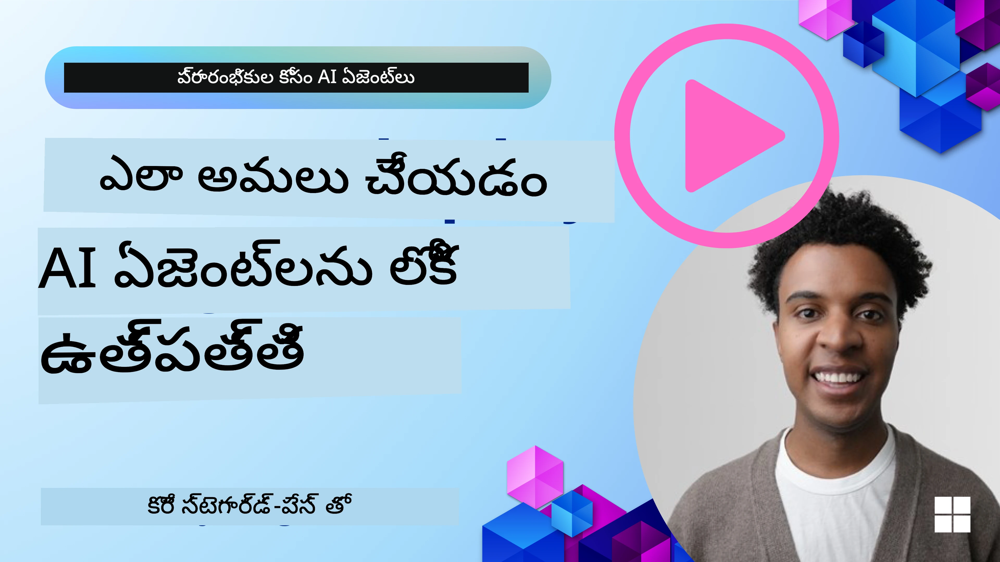

# AI ఏజెంట్లు ప్రొడక్షన్‌లో: ఆబ్జర్వబిలిటీ & మూల్యాంకనం

[](https://youtu.be/l4TP6IyJxmQ?si=reGOyeqjxFevyDq9)

AI ఏజెంట్లు ప్రయోగాత్మక నమూనాల నుండి వాస్తవ ప్రపంచ అనువర్తనాల వరకు సాగిపోతుండడంతో, వారి ప్రవర్తనను అర్థం చేసుకోవడం, వారి పనితీరును పర్యవేక్షించడం, మరియు వారి ఔట్‌పుట్‌లను శ్రేణిగా మూల్యాంకనం చేయడం అవసరం అవుతుంది.

## నేర్చుకోవాల్సిన లక్ష్యాలు

ఈ పాఠం పూర్తిచేసుకున్న తర్వాత, మీరు తెలుసుకుంటారు/అర్థం చేసుకుంటారు:
- ఏజెంట్ ఆబ్జర్వబిలిటీ మరియు మూల్యాంకన యొక్క మూల సూత్రాలు
- ఏజెంట్ల పనితీరు, ఖర్చులు, మరియు ప్రభావవంతతను మెరుగుపరచడానికి కৌশలాలు
- మీ AI ఏజెంట్లను పద్ధతిగల రీతిలో ఏ విధంగా మరియు ఏమి మూల్యాంకనం చేయాలో
- AI ఏజెంట్లను ప్రొడక్షన్‌లో విడదీయేటప్పుడు ఖర్చులను ఎలా నియంత్రించాలో
- Microsoft Agent Framework తో నిర్మించిన ఏజెంట్లకు ఇనిస్ట్రుమెంటేషన్ ఎలా చేయాలో

మీ "బ్లాక్ బాక్స్" ఏజెంట్లను పారదర్శక, నిర్వహించగల మరియు విశ్వసనీయ వ్యవస్థలుగా మార్చడానికి మీరు కావలసిన జ్ఞానంతో తయారుచేయడం లక్ష్యం.

_**గమనిక:** భద్రత మరియు విశ్వసనీయమైన AI ఏజెంట్లను విడదీయడం ముఖ్యమైనది. [Building Trustworthy AI Agents](../06-building-trustworthy-agents/README.md) పాఠం కూడా చూడండి._

## ట్రేసులు మరియు స్పాన్లు

[Langfuse](https://langfuse.com/) లేదా [Microsoft Foundry](https://learn.microsoft.com/en-us/azure/ai-foundry/what-is-azure-ai-foundry) వంటి ఆబ్జర్వబిలిటీ టూల్స్ సాధారణంగా ఏజెంట్ రన్స్‌ను ట్రేసులు మరియు స్పాన్లుగా ప్రదర్శిస్తాయి.

- **ట్రేస్** అనేది ప్రారంభం నుండి ముగింపు వరకు పూర్తి ఏజెంట్ పని (ఉదా: ఒక యూజర్ ప్రశ్నను నిర్వహించడం).
- **స్పాన్లు** అనేవి ఆ ట్రేస్‌లోని వ్యక్తిగత దశలు (ఉదా: భాషా నమూనా కాల్ చేయటం లేదా డేటా తీసుకోవడం).


<!-- Image URL retained for illustration purposes -->

ఆబ్జర్వబిలిటీ లేకపోతే, AI ఏజెంట్ "బ్లాక్ బాక్స్" కాబట్టే అనిపిస్తుంది - అంతర్గత స్థితి మరియు తర్కం గోప్యంగా ఉండి సమస్యలను గుర్తించటానికి లేదా పనితీరును మెరుగుపర్చటానికి కష్టం. ఆబ్జర్వబిలిటీ ద్వారా, ఏజెంట్లు "గ్లాస్ బాక్సులు" అవుతాయి, ఇవి పారదర్శకతను అందించి విశ్వాసం నిర్మించడానికి మరియు వారు ఆశించిన విధంగా పనిచేస్తున్నారనే నిర్ధారణకు అవసరమైనవి.

## ప్రొడక్షన్ పరిసరాల్లో ఆబ్జర్వబిలిటీ ఎందుకు ముఖ్యం

AI ఏజెంట్లను ప్రొడక్షన్ పరిసరాలకు మార్చడం కొత్త సవాళ్లు మరియు అవసరాలను తీసుకొస్తుంది. ఆబ్జర్వబిలిటీ ఇక "ఉండడం మంచిది" కాదు, కానీ కీలక సామర్థ్యం:

*   **డిబగ్గింగ్ మరియు మూలకారణ విశ్లేషణ:** ఏజెంట్ విజయం సాధించకపోతే లేదా అనుకోని ఔట్‌పుట్ ఇచ్చినప్పుడు, ఆబ్జర్వబిలిటీ టూల్స్ తప్పు మూలాన్ని గుర్తించడానికి ట్రేసులు అందిస్తాయి. ఇది అనేక LLM కాల్స్, టూల్ ఇంటరాక్షన్లు మరియు షరతు తర్కాలను కలిగిన క్లిష్ట ఏజెంట్లలో ముఖ్యమైనది.
*   **లేటెన్సీ మరియు ఖర్చుల నిర్వహణ:** AI ఏజెంట్లు సాధారణంగా టోకెన్ లేదా కాల్ అయిపోయే LLM మరియు ఇతర APIs పై ఆధారపడతాయి. ఆబ్జర్వబిలిటీ ఈ కాల్స్‌ను ఖచ్చగా ట్రాక్ చేయడం సాయపడుతుంది, చాలా మందగియె లేదా ఖరీదైన ఆపరేషన్లను గుర్తించడానికి. ఇది టీమ్‌లకు ప్రాంప్ట్‌లను మెరుగుపరచేందుకు, మరింత సమర్థవంతమైన నమూనాలను ఎంచుకోవడానికి లేదా కార్యప్రవాహాలను పునర్నిర్మించేందుకు సహాయపడుతుంది, తద్వారా ఆపరేషనల్ ఖర్చులు తగ్గి మంచి యూజర్ అనుభవం వస్తుంది.
*   **విశ్వాసం, భద్రత మరియు అనుగుణత:** చాలా అనువర్తనాల్లో ఏజెంట్లు భద్రతగల మరియు నైతికంగా నడవడం ముఖ్యమే. ఆబ్జర్వబిలిటీ ఏజెంట్ చర్యలు మరియు నిర్ణయాల ఆడిట్ ట్రయిల్ అందిస్తుంది. ఇది ప్రాంప్ట్ ఇంజెక్షన్, హానికరమైన విషయాల సృష్టి, లేదా వ్యక్తిగత గుర్తింపు సమాచారాన్ని దుర్వినియోగం వంటి సమస్యలను గుర్తించి నివారించేందుకు ఉపయోగపడుతుంది. ఉదాహరణకు, మీరు ట్రేసులను సమీక్షించి ఏజెంట్ ఎందుకు ఒక నిర్దిష్ట ప్రతిస్పందన ఇచ్చింది లేదా ఏ టూల్ ఉపయోగించింది అనే విషయం అర్థం చేసుకోవచ్చు.
*   **కొనసాగుతున్న మెరుగుదల చక్రాలు:** ఆబ్జర్వబిలిటీ డేటా పునరావృత అభివృద్ధి ప్రక్రియకు పునాది. ఏజెంట్లు నిజ జీవితం లో ఎలా పనిబాబుతున్నాయో పర్యవేక్షిస్తూ టీమ్‌లు మెరుగుదల ప్రాంతాలను గుర్తించి, నమూనాలను ఫైన్-ట్యూన్ చేయడానికి డేటా సేకరించి, మార్పుల ప్రభావాన్ని నిర్ధారిస్తాయి. ఇది ప్రతిస్పందన శ్రేణి నుండి ఆన్‌లైన్ మూల్యాంకనతో ప్రొడక్షన్ లో పొందిన అవగాహనలు ఆఫ్‌లైన్ ప్రయోగానికి సూచనగా ఉండే తిరుగుబాటు చక్రాన్ని సృష్టిస్తుంది, తద్వారా ఏజెంట్ పనితీరు క్రమశిక్షణగా మెరుగవుతుంది.

## కనీసం ట్రాక్ చేయవలసిన ముఖ్యమైన మెట్రిక్స్

ఏజెంట్ ప్రవర్తనను పర్యవేక్షించటానికి, వివిధ మెట్రిక్స్ మరియు సంకేతాలను ట్రాక్ చేయాలి. ఏజెంట్ ఉద్దేశ్యం ఆధారంగా మెట్రిక్స్ మారొచ్చు కానీ కొన్ని సర్వత్రా ముఖ్యమైనవి.

ఆబ్జర్వబిలిటీ టూల్స్ పర్యవేక్షించే కొన్ని సాధారణ మెట్రిక్స్ ఇవే:

**లేటెన్సీ:** ఏజెంట్ ఎంత త్వరగా స్పందించగలడు? ఎక్కువ వేచివౌ తగినంతగా యూజర్ అనుభవాన్ని హానిచేస్తుంది. మీరు ఏజెంట్ రన్స్ ట్రేసింగ్ ద్వారా పనులు మరియు వ్యక్తిగత దశలల లేటెన్సీని కొలవాలి. ఉదా: అన్ని మోడల్ కాల్స్‌కి మొత్తం 20 సెకన్లు తీసుకునే ఏజెంట్‌ను వేగవంతమైన మోడల్ ఉపయోగించి లేదా సమాంతరంగా నడిపించడం ద్వారా వేగం పెంపొందించవచ్చు.

**ఖర్చులు:** ఒక్క ఏజెంట్ రన్‌కు ఖర్చు ఎంత? AI ఏజెంట్లు LLM కాల్స్ మరియు బాహ్య APIs పై ఆధారపడతాయి, ఇవి టోకెన్ లేదా కాల్ ఆధారంగా బిల్ అవుతాయి. తరచూ టూల్ వినియోగం లేదా బహుళ ప్రాంప్ట్‌లు ఖర్చులను వేగంగా పెంచవచ్చు. ఉదాహరణకు, ఏజెంట్ ఐదు సార్లు LLM కాల్ చేసి తక్కువ మెరుగుదల పొందితే, ఖర్చు సమంజసం కాని లేదా కాల్స్ నివారించటం లేదా తక్కువ ఖర్చు మోడల్ వాడటం అవసరమైతే ఆలోచించాలి. రియల్-టైమ్ పర్యవేక్షణ అనుకోని ఖర్చుల పెరుగుదలలను గుర్తించడంలో సహాయపడుతుంది (ఉదా: బగ్స్ వల్ల అతి ఎక్కువ API కాల్స్).

**రిక్వెస్ట్ పొరపాట్లు:** ఏజెంట్లు ఎన్ని రిక్వెస్ట్‌లను విఫలంచేశాయి? ఇందులో API లోపాలు లేదా టూల్ కాల్ వైఫల్యాలు ఉండవచ్చు. ప్రొడక్షన్‌లో బలంగా ఉండడానికి, మీరు ఫాల్బ్యాక్స్ లేదా రిట్రయిలను అమలు చేయొచ్చు. ఉదా: LLM ప్రొవైడర్ A ఇంటర్నెట్ దొరకపోతే, మీరు బ్యాకప్‌గా LLM ప్రొవైడర్ B ఉపయోగించవచ్చు.

**యూజర్ ఫీడ్‌బ్యాక్:** ప్రత్యక్ష యూజర్ మూల్యాంకనాలు విలువను చేకూర్చతాయి. వీటిలో స్పష్టమైన రేటింగ్స్ (👍thumbs-up/👎down, ⭐1-5 నక్షత్రాలు) లేదా వాచిక వ్యాఖ్యలు ఉండవచ్చు. క్రమంగా మినహాయింపులు వచ్చినప్పుడు ఏజెంట్ ఆశించిన విధంగా పనిచేయడం లేదు అనుకోవాలి.

**నిర్వచిత యూజర్ ఫీడ్‌బ్యాక్:** యూజర్ ప్రవర్తనలు ప్రత్యక్ష రేటింగ్స్ లేకుండా కూడా సూచనలుగా ఉంటాయి. వీటిలో వెంటనే ప్రశ్నను తిరిగి చెప్తున్నది, మళ్లీ ప్రశ్నించడం లేదా_retry_ బటన్‌ నొక్కడం ఉండవచ్చు. ఉదా: ఒకే ప్రశ్నను యూజర్లు పునరావృతంగా అడుగుతున్నారంటే ఏజెంట్ పని తగినట్లు లేదు అనుకోవచ్చును.

**ఖచ్చితత్వం:** ఏజెంట్ ఎన్ని సార్లు సరైన లేదా కోరుకున్న ఔట్‌పుట్ ఇస్తున్నాడో? ఖచ్చితత్వ నిర్వచనలు మారవు (ఉదా: సమస్య పరిష్కార సరైనత, సమాచారం పొందడంలో ఖచ్చితత్వం, యూజర్ సంతృప్తి). మొదట మీరు ఏజెంట్ విజయానికి నిర్వచనాన్ని సపష్టంగా చేయాలి. ఆటోమేటిక్ చెక్కులు, మూల్యాంకన స్కోర్లు లేదా టాస్క్ పూర్తి లేబుల్స్ ద్వారా ఖచ్చితత్వాన్ని ట్రాక్ చేయొచ్చు. ఉదా: ట్రేసులను "విజయం" లేదా "విఫలం" గా గుర్తించటం.

**ఆటోమేటిక్ మూల్యాంకన మెట్రిక్స్:** ఆటోమేటిక్ మూల్యాంకనాలు కూడా సెట్ చేయొచ్చు. ఉదా: ఏ ఆంఎల్‌ను ఉపయోగించి ఏజెంట్ ఔట్‌పుట్ మీకు ఉపయోగకరమైనది, ఖచ్చితమైనదా లేదా కాదు అనే స్కోరు ఇవ్వండి. కూడా పలు ఓపెన్ సోర్స్ లైబ్రరీలు వున్నాయి, ఇవి ఏజెంట్ వివిధ అంశాలకు స్కోరు ఇవ్వడంలో సహాయపడతాయి. ఉదా: RAG ఏజెంట్ల కొరకు [RAGAS](https://docs.ragas.io/), హానికర భాష లేదా ప్రాంప్ట్ ఇంజెక్షన్ గుర్తించేందుకు [LLM Guard](https://llm-guard.com/).

వాస్తవానికి, ఈ మెట్రిక్స్ యొక్క సమ్మేళనం ఒక AI ఏజెంట్ ఆరోగ్యానికి మంచి తనిఖీ ఇస్తుంది. ఈ అధ్యాయం [ఉదాహరణ నోట్‌బుక్](./code_samples/10-expense_claim-demo.ipynb) లో ఈ మెట్రిక్స్ వాస్తవ ఉదాహరణలలో ఎలా ఉంటాయో చూపించబడ్డాయి, కానీ ముందుగా ఒక సాధారణ మూల్యాంకన పని ప్రవాహం ఎలా ఉండాలో నేరిద్దాం.

## మీ ఏజెంట్‌కు ఇనిస్ట్రుమెంట్ చేయండి

ట్రేసింగ్ డేటా సేకరించడానికి, మీరు మీ కోడ్‌ను ఇనిస్ట్రుమెంట్ చేయాలి. లక్ష్యం ఏజెంట్ కోడ్‌ను ఇనిస్ట్రుమెంట్ చేయడం, తద్వారా ట్రేసులు మరియు మెట్రిక్స్ విడుదల చేయడంతోపాటు అవి ఒక ఆబ్జర్వబిలిటీ ప్లాట్ఫారమ్ ద్వారా సేకరింపబడగలవు, ప్రాసెస్ చేయబడగలవు, విజువలైజ్ చేయబడగలవు.

**OpenTelemetry (OTel):** [OpenTelemetry](https://opentelemetry.io/) LLM ఆబ్జర్వబిలిటీకి పరిశ్రమ ప్రమాణంగా అభివృద్ధి చెందుతోంది. ఇది APIలు, SDKలు, అంతःకరణ పరికరాలు మరియు టెలిమెట్రీ డేటా జనరేట్ చేయడం, సేకరించడం, ఎగుమతి చేయడం కోసం టూల్స్ అందిస్తుంది.

చాలా ఇనిస్ట్రుమెంటేషన్ లైబ్రరీలు ఉన్నవీ, ఇవి ఉన్న ఏజెంట్ ఫ్రేమ్‌వర్క్‌లను చుట్టి ముప్పై OpenTelemetry స్పాన్లను ఆబ్జర్వబిలిటీ టూల్‌కు ఎగుమతి చేయడం సులభంగా చేస్తాయి. Microsoft Agent Framework స్వయంగా OpenTelemetry తో సమ్మిళితం అవుతుంది. కింద MAF ఏజెంట్ ఇనిస్ట్రుమెంటింగ్ ఉదాహరణ ఉంది:

```python
from agent_framework.observability import get_tracer, get_meter

tracer = get_tracer()
meter = get_meter()

with tracer.start_as_current_span("agent_run"):
    # ఏజెంట్ అమలు ఆటోమేటిక్‌గా ట్రేస్ చేయబడుతుంది
    pass
```

ఈ అధ్యాయంలోని [ఉదాహరణ నోట్‌బుక్](./code_samples/10-expense_claim-demo.ipynb) మీ MAF ఏజెంట్‌ను ఎలా ఇనిస్ట్రుమెంట్ చేయాలో చూపిస్తుంది.

**మాన్యువల్ స్పాన్ సృష్టి:** ఇనిస్ట్రుమెంటేషన్ లైబ్రరీలు మంచి మౌలికాలను అందిస్తాయనే తమ, మరిన్ని వివరణ లేదా అనుకూల సమాచార అవసరమైతే మాన్యువల్‌గా స్పాన్లు సృష్టించవచ్చు. ముఖ్యంగా, ఆటోమేటిక్ లేదా మాన్యువల్ సృష్టించిన స్పాన్లలో అనుకూల గుణలతో (టాగ్లు లేదా మెటాడేటా అంటారు) పుష్కలంగా నింపవచ్చు. ఈ గుణాలలో వ్యాపార-సంబంధిత డేటా, మధ్యస్థ గణనల, లేదా డిబగ్గింగ్ లేదా విశ్లేషణకు ఉపయోగపడే ఇతర సందర్భాలు ఉండవచ్చు, ఉదా `user_id`, `session_id`, లేదా `model_version`.

[Langfuse Python SDK](https://langfuse.com/docs/sdk/python/sdk-v3) తో మాన్యువల్‌గా ట్రేసులు మరియు స్పాన్లు సృష్టించే ఉదాహరణ:

```python
from langfuse import get_client
 
langfuse = get_client()
 
span = langfuse.start_span(name="my-span")
 
span.end()
```

## ఏజెంట్ మూల్యాంకనం

ఆబ్జర్వబిలిటీ మాకు మెట్రిక్స్ ఇస్తుంది, కానీ మూల్యాంకనం అనేది ఆ డేటాను విశ్లేషించడం (పరీక్షలు నిర్వహించడం) మరియు ఏజెంట్ ఎంత బాగా పనిచేస్తోందని, అది ఎలా మెరుగుపర్చవచ్చో నిర్ణయించటం. అంటే, మీరు ఆ ట్రేసులు మరియు మెట్రిక్స్ కలిగి ఉన్న వెంటనే, వాటిని ఎలా ఉపయోగించి ఏజెంట్‌ను తీర్పు చేయాలి మరియు నిర్ణయాలు తీసుకోవాలి?

రెగ్యులర్ మూల్యాంకనం అవసరం ఎందుకంటే AI ఏజెంట్లు సాధారణంగా నిర్దిష్టం కానివి మరియు అభివృద్ధి చెందుతాయి (నవీకరణల ద్వారా లేదా నమూనా ప్రవర్తన మార్పులతో) – మూల్యాంకనం లేకుండా, మీ "స్మార్ట్ ఏజెంట్" నిజంగా బాగా పనిచేస్తోందా లేదా అవాంతరం చెందిందా తెలియదు.

AI ఏజెంట్లకు రెండు రకాల మూల్యాంకనలు ఉంటాయి: **ఆన్‌లైన్ మూల్యాంకనం** మరియు **ఆఫ్‌లైన్ మూల్యాంకనం**. రెండూ విలువైనవి మరియు పరస్పరం పరిపూరకంగా ఉంటాయి. సాధారణంగా ఆఫ్‌లైన్ మూల్యాంకనం తో ప్రారంభిస్తాము, ఇది ఏజెంట్ విడదీయడం ముందు తప్పనిసరి మెట్లు.

### ఆఫ్‌లైన్ మూల్యాంకనం


ఇది ఏజెంట్‌ను నియంత్రిత పరిసరాల్లో మూల్యాంకనం చేయడం, సాధారణంగా పరీక్షా డేటాసెట్టుల ఉపయోగంతో, ప్రత్యక్ష యూజర్ ప్రశ్నలు ఉపయోగించకుండా. మీరు గుర్తించిన అంచనా ఔట్‌పుట్ లేదా సరైన ప్రవర్తనతో కూడిన క్యూవ్ ఉన్న కూర్చిన డేటా సెట్స్ ఉపయోగిస్తారు, మరియు ఆ డేటా మీద ఏజెంట్‌ను నడపగలవు.

ఉదాహరణకు, మీరు ఒక గణిత శబ్ద సమస్య ఏజెంట్‌ను తయారు చేస్తే, మీకు 100 ప్రశ్నలతో కూడిన [పరీక్షా డేటా సెట్](https://huggingface.co/datasets/gsm8k) ఉండవచ్చు, వాటికి సరైన జవాబులు ముందే తెలుసు. ఆఫ్‌లైన్ మూల్యాంకనం అభివృద్ధి సమయంలో (CI/CD పైప్‌లైన్లలో భాగంగా) మెరుగుదలలు లేదా దెబ్బతిన్న పాయింట్లను తనిఖీ చేయడానికి జరుగుతుంది. లాభం ఏమిటంటే, ఇది **పునరావృతం చేయదగినది మరియు మీరు స్పష్టమైన ఖచ్చితత్వ మెట్రిక్స్ పొందగలరు, ఎందుకంటే మీరు గ్రౌండ్‌ ట్రూత్ కలిగి ఉంటారు**. మీరు యూజర్ ప్రశ్నలను సిమ్యులేట్ చేసి ఏజెంట్ స్పందనలను ఐడియల్ జవాబులతో పోల్చవచ్చు లేదా తాజాగా చెప్పిన ఆటోమేటిక్ మెట్రిక్స్‌లను ఉపయోగించవచ్చు.

ఆఫ్‌లైన్ మూల్యాంకన ప్రధాన సవాల్ మీ పరీక్షా డేటా సెట్ సమగ్రంగా ఉండటం మరియు సంబంధితంగా ఉండటం. ఏజెంట్ ఒక నిర్దిష్ట పరీక్షా సెట్ పై బాగా పనిచేయవచ్చు గానీ ప్రొడక్షన్‌లో పూర్తిగా వైవిధ్యమైన ప్రశ్నలు ఎదుర్కొంటుంది. కాబట్టి మీరు పరీక్షా సెట్‌లను కొత్త ఎడ్జ్ కేసులు మరియు నిజ ప్రపంచ పరిస్థితులను ప్రతిబింబించే ఉదాహరణలతో నవీకరించాలి. చిన్న "స్మోక్ టెస్ట్" కేసులు మరియు పెద్ద మూల్యాంకన సెట్‌లు మిక్స్ చేయడం ఉపయోగకరం: చిన్నవి త్వరిత తనిఖీలు, పెద్దవి విస్తార పనితీరు మెట్రిక్స్ కోసం.

### ఆన్‌లైన్ మూల్యాంకనం


ఇది ఏజెంట్‌ను ప్రత్యక్ష, నిజ జీవిత వాతావరణంలో మూల్యాంకనం చేయడం, అంటే ప్రొడక్షన్‌లో వాడకం సమయంలో. ఆన్‌లైన్ మూల్యాంకనం నిజ యూజర్ ఇన్‌టరాక్షన్లపై ఏజెంట్ పనితీరును పర్యవేక్షించడం మరియు ఫలితాలను నిరంతరం విశ్లేషించడం.

ఉదాహరణకు, మీరు విజయాల రేట్లు, యూజర్ సంతృప్తి స్కోర్లు లేదా ఇతర మెట్రిక్స్‌ను ప్రత్యక్ష ట్రాఫిక్‌పై ట్రాక్ చేయవచ్చు. ఆన్‌లైన్ మూల్యాంకనం ల్యాబ్ సెట్టింగ్‌లో ఊహించని విషయాలను **గుర్తిస్తుంటుంది** - మీరు నమూనా డ్రీఫ్‌ను గమనించవచ్చు (ఏజెంట్ పనితీరులో తక్కువతనం ఇన్పుట్ నమూనాల మార్పుతో) మరియు పరీక్షా డేటాలో లేని అనుకోని ప్రశ్నలు లేదా పరిస్థితులు పట్టుకోవచ్చు. ఇది ఏజెంట్ వనదా ప్రవర్తన యొక్క నిజమైన చిత్రాన్ని అందిస్తుంది.

ఆన్‌లైన్ మూల్యాంకనం తరచూ అవయవాత్మక మరియు ప్రత్యక్ష యూజర్ ఫీడ్‌బ్యాక్‌ను సేకరించడం, అలాగే షాడో టెస్టులు లేదా A/B టెస్టులు నిర్వహించడం (కొత్త వెర్షన్‌ను పాతదితో సరిపోల్చుట) చేస్తుంది. సవాల్ ఏమిటంటే ప్రత్యక్ష ఇన్‌టరాక్షన్లకు నమ్మదగిన లేబుల్స్ లేదా స్కోర్లు పొందటం కష్టం – మీరు యూజర్ ఫీడ్‌బ్యాక్ లేదా దిగువ మెట్రిక్స్ (ఉదా: యూజర్ ఫలితాన్ని క్లిక్ చేశాడా) పై ఆధారపడవచ్చు.

### ఇద్దాన్ని కలుపుట

ఆన్‌లైన్ మరియు ఆఫ్‌లైన్ మూల్యాంకనలు పరస్పరం వ్యతిరేకంగానే ఉండవు; అవి పరస్పరం పూరకంగా ఉంటాయి. ఆన్‌లైన్ పర్యవేక్షణ (ఉదా: ఏజెంట్ తక్కువ పనితీరుతో ఉన్న కొత్త రకాల యూజర్ ప్రశ్నలు) నుండి వచ్చిన అవగాహనలు ఆఫ్‌లైన్ పరీక్షా డేటా సెట్‌లను అభివృద్ధి చేయడానికి ఉపయోగపడతాయి. మారగా, ఆఫ్‌లైన్ పరీక్షల్లో బాగా పనిచేసిన ఏజెంట్లు ఆన్‌లైన్‌లో మరింత విశ్వసనీయంగా విడదీయబడతాయి మరియు పర్యవేక్షించబడతాయి.

వాస్తవానికి, చాల టీమ్‌లు ఈ చక్రాన్ని అనుసరిస్తాయి:

_ఆఫ్‌లైన్ మూల్యాంకనం -> విడదీయడం -> ఆన్‌లైన్ పర్యవేక్షణ -> కొత్త విఫల కేసులు సేకరణ -> ఆఫ్‌లైన్ డేటాసెట్‌లో చేర్చడం -> ఏజెంట్ మెరుగుదల -> పునరావృతం_.

## సాధారణ సమస్యలు

AI ఏజెంట్లను ప్రొడక్షన్‌లో విడదీయేటప్పుడు, మీరు వివిధ సవాళ్లను ఎదుర్కొనవచ్చు. ఇక్కడ కొన్ని సాధారణ సమస్యలు మరియు వాటి గల పరిష్కారాలు ఉన్నాయి:

| **సమస్య**    | **సంభావ్య పరిష్కారం**   |
| ------------- | ------------------ |
| AI ఏజెంట్ నిరంతరంగా పనులు చేయడం లేదని | - AI ఏజెంట్‌కు ఇచ్చే ప్రాంప్ట్‌ను మెరుగుపరచండి; లక్ష్యాలపై స్పష్టంగా ఉండండి.<br>- పనులను సబ్టాస్కులకు విభజించి బహుళ ఏజెంట్ల ద్వారా నిర్వహిస్తే సహాయం అవుతుంది అని గుర్తించండి. |
| AI ఏజెంట్లు నిరంతర లూపుల్లో చిక్కుకున్నాయి | - మీరు స్పష్టమైన ముగింపు పద్ధతులు మరియు షరతులు ఉన్నాయని నిర్ధారించండి, తద్వారా ఏజెంట్ ఎప్పుడు ప్రాసెస్ ఆపాలో తెలుసుకుంటుంది.<br>- తర్కం మరియు ప్రణాళిక అవసరమయ్యే క్లిష్ట పనులకు, ఆ పనుల కొరకు ప్రత్యేకీకరించబడిన పెద్ద నమూనా ఉపయోగించండి. |
| AI ఏజెంట్ టూల్ కాల్స్ సరిగ్గా పనిచేయడం లేదు | - టూల్ అవుట్‌పుట్‌ను ఏజెంట్ వ్యవస్థకు బయట నుండి పరీక్షించి ధృవీకరించండి.<br>- నిర్వచించిన పారామీటర్లను, ప్రాంప్ట్‌లను, మరియు టూల్‌ల పేరింగ్‌ను మెరుగుపరచండి.  |
| బహుళ ఏజెంట్ వ్యవస్థ సదా సాఫీగా పని చేయడం లేదు | - ప్రతి ఏజెంట్‌కు ఇచ్చే ప్రాంప్ట్‌లు ప్రత్యేకంగా మరియు స్పష్టంగా ఉండేలా మెరుగుపరచండి.<br>- ఏ ఏజెంట్ సరైనదో నిర్ణయించడానికి "రౌటింగ్" లేదా కంట్రోలర్ ఏజెంట్ ఉపయోగించి హైరార్కికల్ వ్యవస్థ నిర్మించండి. |

ఈ సమస్యల చాలవన్నీ ఆబ్జర్వబిలిటీ ఉండడం ద్వారా మరింత సులభంగా గుర్తించబడవచ్చు. ముందుగా చర్చించిన ట్రేసులు మరియు మెట్రిక్స్ ఏజెంట్ పనితీరు లోపాలు ఎక్కడ ఉన్నాయో ఖచ్చితంగా చూపించి డిబగ్గింగ్ మరియు ఆప్టిమైజేషన్ మరింత సమర్థవంతం చేస్తాయి.

## ఖర్చులు నిర్వహణ


AI ఏజెంట్లను ఉత్పత్తిలో అమలు చేసే ఖర్చులను నిర్వహించేందుకు కొన్ని వ్యూహాలు ఇవీ:

**చిన్న మోడల్స్ ఉపయోగించడం:** చిన్న భాషా మోడల్స్ (SLMs) కొన్ని ఏజెంటిక్ వినియోగకారక సందర్భాల్లో బాగా పనితీరు చూపుతాయి మరియు ఖర్చులను గణనీయంగా తగ్గిస్తాయి. ముందు చెప్పినట్టుగా, పనితీరు మరియు పెద్ద మోడల్స్‌తో పోల్చుకునే మూల్యాంకన వ్యవస్థను నిర్మించడం మీ వినియోగ సందర్భంలో SLM ఎంత బాగా పనిచేస్తుందో అర్థం చేసుకోవడానికి ఉత్తమ మార్గం. సులభ పనుల కోసం, ఉదాహరణకు ఉద్దేశ్య విభజన లేదా పారామితి పొందింపు కోసం SLMలను ఉపయోగించడం, సంక్లిష్ట తర్కాలకు పెద్ద మోడల్స్‌ను వదిలివ్వడం పక్కాగా పరిగణించండి.

**రౌటర్ మోడల్ ఉపయోగించడం:** ఒక సమాన వ్యూహం అనేక మోడల్స్ మరియు పరిమాణాల వైవిధ్యాన్ని ఉపయోగించడం. మీరు LLM/SLM లేదా సర్వర్ లెస్ ఫంక్షన్ ఉపయోగించి సమస్య కఠినత ఆధారంగా అనువైన మోడల్స్‌కు అభ్యర్థనలను రూట్ చేయవచ్చు. ఇది ఖర్చులను తగ్గించడంలో సహాయపడుతుంది మరియు కచ్చితమైన పనులపై పనితీరు యథాతథంగా ఉంటుంది. ఉదాహరణకు, సులభమైన ప్రశ్నలను చిన్న, వేగవంతమైన మోడల్స్‌కు రూట్ చేయి, మరియు కేవలం సంక్లిష్ట తర్కాల కోసం ప్రత్యేక ఖరీదైన పెద్ద మోడల్స్ ఉపయోగించు.

**ప్రతిస్పందనలు క్యాష్ చేయడం:** సాధారణ అభ్యర్థనలు మరియు పనుల‌ను గుర్తించి ఏజెంటిక్ సిస్టమ్ ద్వారా వెళ్ళేముందు ప్రతిస్పందనలను అందించడం అనేది సమాన అభ్యర్థనల పరిమాణం తగ్గించడానికి మంచి మార్గం. మీరు మరింత ప్రాథమిక AI మోడల్స్ ఉపయోగించి ఒక అభ్యర్థనం మీ క్యాష్ చేసిన అభ్యర్థనలకు ఎంత సమానమో కనుగొనే ఒక ప్రవాహాన్ని కూడా అమలు చేయవచ్చు. ఇది తరచుగా అడిగే ప్రశ్నల కోసం లేదా సాధారణ వర్క్‌ఫ్లోలకు ఖర్చులను గణనీయంగా తగ్గించగలదు.

## ప్రాక్టీసులో ఇది ఎలా పనిచేస్తుందో చూద్దాం

[ఈ విభాగం యొక్క ఉదాహరణ నోటుబుక్](./code_samples/10-expense_claim-demo.ipynb) లో, మనం ఎలా మన ఏజెంట్‌ను గమనించి, మూల్యాంకనం చేయగలమో ఉదాహరణల ద్వారా చూద్దాం.


### ఉత్పత్తిలో AI ఏజెంట్ల గురించి మరిన్ని ప్రశ్నలు ఉన్నాయా?

ఇతర అభ్యాసకులతో కలవడానికి, ఆఫీస్ అవర్స్ లో పాల్గొనడానికి మరియు మీ AI ఏజెంట్ ప్రశ్నలకు సమాధానం పొందడానికి [Microsoft Foundry Discord](https://discord.com/invite/ATgtXmAS5D) లో చేరండి.

## మున్ముందటి పాఠం

[మెటాకాగ్నిషన్ డిజైన్ ప్యాటర్న్](../09-metacognition/README.md)

## తదుపరి పాఠం

[ఏజెంటిక్ ప్రోటోకాల్‌లు](../11-agentic-protocols/README.md)

---

<!-- CO-OP TRANSLATOR DISCLAIMER START -->
**అస్వీకరణ**:
ఈ పత్రం AI అనువాద సేవ [Co-op Translator](https://github.com/Azure/co-op-translator) ఉపయోగించి అనువదించబడింది. మేము ఖచ్చితత్వానికి ప్రయత్నిస్తున్నప్పటికీ, ఆటోమేటెడ్ అనువాదాలు తప్పులు లేదా అసమగ్రతలను కలిగి ఉండవచ్చు. దాని స్వదేశ భాషలో ఉన్న అసలు పత్రాన్ని అధికారం కలిగిన మూలంగా పరిగణించాలి. కీలకమైన సమాచారం కోసం, ప్రొఫెషనల్ మానవ అనువాదాన్ని సిఫారసు చేస్తాము. ఈ అనువాదం ఉపయోగం వల్ల కలిగే ఏవైనా అపార్థాలు లేదా తప్పుదారులు కోసం మేము బాధ్యత వహించము.
<!-- CO-OP TRANSLATOR DISCLAIMER END -->