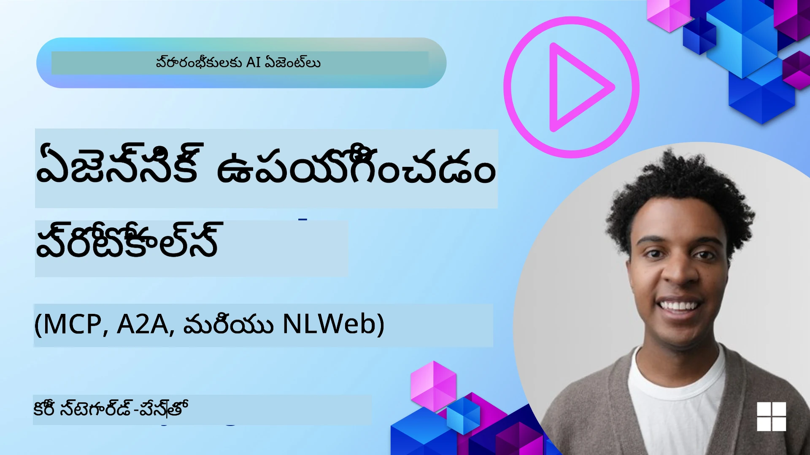
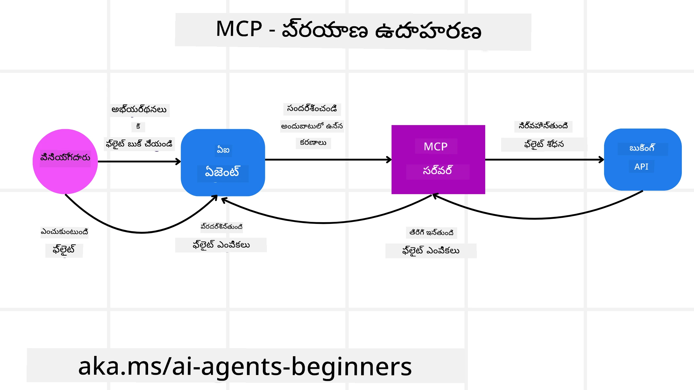
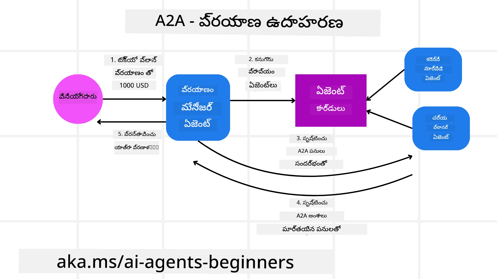
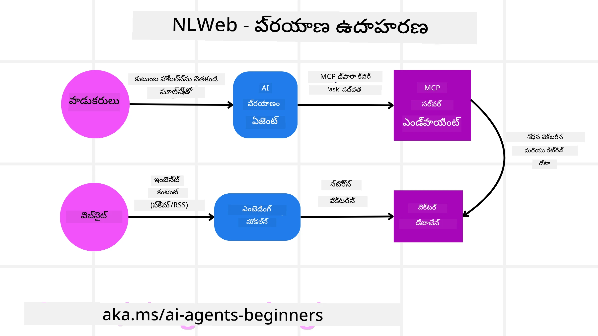

# ఏజెంటిక్ ప్రోటోకాల్స్ ఉపయోగించడం (MCP, A2A మరియు NLWeb)

> _(ఈ పాఠానికి సంబంధించిన వీడియో చూడడానికి పై చిత్రాన్ని క్లిక్ చేయండి)_

AI ఏజెంట్ల వినియోగం పెరుగుదలకు అనుగుణంగా, ప్రమాణీకరణం, భద్రత మరియు ఓపెన్ ఇన్నొవేషన్‌ను ప్రోత్సహించే ప్రోటోకాల్స్ అవసరం కూడా పెరుగుతుంది. ఈ పాఠంలో, ఈ అవసరాన్ని తీర్చేందుకు ప్రయత్నిస్తున్న 3 ప్రోటోకాల్స్ — Model Context Protocol (MCP), Agent to Agent (A2A) మరియు Natural Language Web (NLWeb) — గురించి చర్చిస్తాం.

## పరిచయం

ఈ పాఠంలో మేము కవర్ చేస్తాము:

• ఎలా **MCP** AI ఏజెంట్స్‌కు బాహ్య టూల్స్ మరియు డేటాకు ప్రాప్తి కల్పించి యూజర్ పనులను పూర్తి చేయటానికి సహాయపడుతుంది.

•  ఎలా **A2A** వేర్వేరు AI ఏజెంట్ల మధ్య కమ్యూనికేషన్ మరియు సహకారాన్ని సాధ్యమ చేస్తుంది.

• ఎలా **NLWeb** ఏవైనా వెబ్సైట్లకు సహజ భాషా ఇంటర్‌ఫేస్‌లు తీసుకురాగలదు, AI ఏజెంట్లకు కంటెంట్‌ను కనువిందు చేసి అంతతో సంబంధంచిపోడానికి వీలుగా చేస్తుంది.

## అభ్యాస లక్ష్యాలు

• **గుర్తించండి** AI ఏజెంట్ల సందర్భంలో MCP, A2A, మరియు NLWeb యొక్క ప్రధాన ఉద్దేశ్యాలు మరియు లాభాలను.

• **వివరిం చండి** ప్రతి ప్రోటోకాల్ ఎలా LLMలు, టూల్స్ మరియు ఇతర ఏజెంటల మధ్య కమ్యూనికేషన్ మరియు ఇంటరాక్షన్‌ను సులభతరముకుంటుందో.

• **గమనించండి** సంక్లిష్ట ఏజెంటిక్ వ్యవస్థలు నిర్మించడంలో ప్రతి ప్రోటోకాల్ ప్లే చేసే ప్రత్యేక బాధ్యతలను.

## Model Context Protocol

**Model Context Protocol (MCP)** అనేది అప్లికేషన్లు LLMలకు కాన్టెంట్ మరియు టూల్స్ అందించడానికి ఒక ప్రమాణీకరించిన పద్దతిని అందించే ఓపెన్ స్టాండర్డ్. ఇది AI ఏజెంట్లు స్థిరమైన విధంగా కనెక్ట్ చేయగల "యూనివర్సల్ అడాప్టర్"గా వివిధ డేటా మూలాల మరియు టూల్స్‌కు అనుకూలత కల్పిస్తుంది.

నాలుకొనుక MCP యొక్క కంపోనెంట్లను, ప్రత్యక్ష API వినియోగంతో పోల్చినప్పుడు లాభాలను, మరియు AI ఏజెంట్లు MCP సర్వర్‌ను ఎలా ఉపయోగించవచ్చో ఒక ఉదాహరణను చూద్దాం.

### MCP కోర్ కంపోనెంట్స్

MCP ఒక **క్లయెంట్-సర్వర్ ఆర్కిటెక్చర్** మీద పనిచేస్తుంది మరియు కోర్ కంపోనెంట్స్ ఇవి:

• **Hosts** ఆ MCP సర్వర్‌కు కనెక్షన్స్ మొదలు పెట్టే LLM అప్లికేషన్లు (ఉదాహరణకి VSCode వంటి కోడ్ ఎడిటర్) అవుతాయి.

• **Clients** హోస్ట్ అప్లికేషన్‌లోని కంపోనెంట్లు, ఇవి సర్వర్లతో ఒక్కో ఒకటి కానెక్షన్లను నిర్వహిస్తాయి.

• **Servers** నిర్దిష్ట సామర్థ్యాలను ఎక్స్‌పోజ్ చేసే లైట్‌వెయిట్ ప్రోగ్రామ్లు.

ప్రోటోకాల్‌లో మూడు కోర్ ప్రిమిటివ్‌లు ఉంటాయి, ఇవి MCP సర్వర్ యొక్క సామర్థ్యాలు:

• **Tools**: ఇవి AI ఏజెంట్ ఒక చర్యను నిర్వహించడానికి కాల్ చేయగల ప్రత్యేక చర్యలు లేదా ఫంక్షన్లు. ఉదాహరణకు, వాతావరణ సేవ ఒక "get weather" టూల్‌ను, లేదా ఒక ఇ-కామర్స్ సర్వర్ "purchase product" టూల్‌ను ఎక్స్‌పోజ్ చేయవచ్చు. MCP సర్వర్లు ప్రతి టూల్ పేరు, వివరణ, మరియు ఇన్‌పుట్/ఔట్‌పుట్ స్కీమాను తమ capabilities లిస్టింగ్‌లో ప్రకటిస్తాయి.

• **Resources**: ఇవి MCP సర్వర్ అందించగల రీడ్-ఒన్లీ డేటా ఐటెమ్స్ లేదా డాక్యుమెంట్లు, మరియు క్లయింట్స్ అవి డిమాండ్‌పై రిక్వెస్ట్ చేయవచ్చు. ఉదాహరణలకు ఫైల్ కంటెంట్లు, డేటాబేస్ రికార్డులు లేదా లాగ్ ఫైల్స్ ఉన్నాయి. Resources టెక్స్ట్ (కోడ్ లేదా JSON లాగా) లేదా బైనరీ (చిత్రాలు లేదా PDFల వంటి) కావచ్చు.

• **Prompts**: ఇవి ముందుగా నిర్వచించిన టెంప్లేట్లు, సూచించిన ప్రాంప్ట్స్‌ని అందిస్తాయి, మరింత సంక్లిష్ట వర్క్‌ఫ్లోలకు అనుమతి ఇస్తాయి.

### MCP లాభాలు

MCP AI ఏజెంట్లకు ప్రధానంగా ఈ లాభాలను అందిస్తుంది:

• **డైనమిక్ టూల్ కనుగొనడం**: ఏజెంట్లు సర్వర్ నుండి అందుబాటులో ఉన్న టూల్స్ జాబితాను వివరణలతో డైనమిక్ గా పొందవచ్చు. ఇది తరచుగా సమీకరణల కోసం స్థాజీ కోడింగ్ అవసరం అయ్యే సాంప్రదాయ APIలతో విరుద్ధంగా ఉంటుంది; APIలో ఏదైనా మార్పు అయితే కోడ్ నవీకరణలు అవసరం అవుతాయి. MCP "ఒక్కసారి ఇంటిగ్రేట్ చేయండి" దృష్టికోణాన్ని అందించి ఎక్కువ అనుకూలతను ఇస్తుంది.

• **విభిన్న LLMల మధ్య ఇంటర్‌ఓపరబిలిటీ**: MCP వేర్వేరు LLMలతో పనిచేస్తుంది, మెరుగైన పనితీరును అంచనా వేయడానికి కోర్ మోడల్స్ మార్చుకోవడానికి అనువుగా ఉంటుంది.

• **ప్రామాణీకృత భద్రత**: MCP ఒక స్టాండర్డ్ ఆటентиకేషన్ విధానాన్ని కలిగి ఉంటుంది, అదనపు MCP సర్వర్లకు యాక్సెస్ జోడించే సమయంలో స్కేలబిలిటీ మెరుగుపడుతుంది. ఇది వివిధ సాంప్రదాయ APIల కోసం వేర్వేరు కీలు మరియు ఆటెంటికేషన్ రకాలను నిర్వహించే కష్టాన్ని తక్కువ చేస్తుంది.

### MCP ఉదాహరణ

ఒక వినియోగదారు MCPతో పనిచేసే AI అసిస్టెంట్ ఉపయోగించి ఫ్లైట్ బుక్ చేయాలనుకుంటున్నట్లు ఊహించండి.

1. **కనెక్షన్**: AI అసిస్టెంట్ (MCP క్లయెంట్) ఒక ఎయిర్లైన్ అందించిన MCP సర్వర్‌కు కనెక్ట్ అవుతుంది.

2. **టూల్ కనుగొనడం**: క్లయెంట్ ఎయిర్లైన్ యొక్క MCP సర్వర్‌ను అడుగుతుంది, "మీ వద్ద ఏ టూల్స్ అందుబాటులో ఉన్నాయి?" సర్వర్ "search flights" మరియు "book flights" వంటివి వంటి టూల్స్‌తో స్పందిస్తుంది.

3. **టూల్ పిలుపు**: మీరు AI అసిస్టెంట్‌ను అడుగుతారంటాం, "దయచేసి Portland నుండి Honolulu కు ఫ్లైట్ కోసం శోధించండి." AI అసిస్టెంట్, దాని LLM ఉపయోగించి, "search flights" టూల్‌ను కాల్ చేయాల్సిన అవసరం ఉందని గుర్తించి సంబంధిత పారామీటర్లు (origin, destination) MCP సర్వర్‌కు పంపుతుంది.

4. **నిర్వహణ మరియు ప్రతిస్పందనం**: MCP సర్వర్ ఒక రాపర్‌గా వ్యవహరిస్తుంది, నిజమైన ఎయిర్లైన్ అంతర్గత బుకింగ్ APIకి కాల్ చేస్తుంది. అది ఫ్లైట్ సమాచారాన్ని (ఉదాహరణకు JSON డేటా) అందుకొని AI అసిస్టెంట్‌కు తిరిగి పంపిస్తుంది.

5. **మరింత పరస్పర చర్య**: AI అసిస్టెంట్ ఫ్లైట్ ఎంపికలను చూపుతుంది. మీరు ఒక ఫ్లైట్‌ను ఎంచుకున్న తర్వాత, అసిస్టెంట్ అదే MCP సర్వర్‌పై "book flight" టూల్‌ను కాల్ చేసి బుకింగ్ పూర్తి చేయవచ్చు.

## ఏజెంట్-టు-ఏజెంట్ ప్రోటోకాల్ (A2A)

MCP LLMలను టూల్స్‌తో కనెక్ట్ చేయడంపై ఫోకస్ చేసే సమయంలో, **Agent-to-Agent (A2A) ప్రోటోకాల్** దాన్ని మరింత ముందుకు తీసుకెళ్తుంది మరియు వేర్వేరు AI ఏజెంట్ల మధ్య కమ్యూనికేషన్ మరియు సహకారాన్ని సాధ్యం చేస్తుంది. A2A వేర్వేరు సంస్థలు, పరిసరాలు మరియు టెక్ స్టాక్‌లలోని AI ఏజెంట్లను ఒక సంయుక్త పనిని పూర్తి చేయడానికి క్రాస్-కనెక్ట్ చేస్తుంది.

మీటింగ్‌లోని భాగాలు మరియు A2A యొక్క లాభాలు, అలాగే ట్రావెల్ అప్లికేషన్‌లో దీన్ని ఎలా వర్తింపజేయవచ్చో ఒక ఉదాహరణను పరిశీలిస్తాం.

### A2A కోర్ కంపోనెంట్స్

A2A ఏజెంట్ల మధ్య కమ్యూనికేషన్‌ను సాధ్యముగా చేస్తుంది మరియు అవి యూజర్ ఉపపనికి( subtask) పూర్తి చేయడానికి కలిసి పనిచేసేము అని లక్ష్యం. ప్రతీ కంపోనెంట్ ఈలోని పాత్రను పోషిస్తుంది:

#### Agent Card

MCP సర్వర్ టూల్స్ జాబితాను షేర్ చేసే విధానం వంటి, ఒక Agent Card లో ఉండేది:
- ఏజెంట్ యొక్క పేరు .
- అది సాధారణంగా పూర్తి చేసే పనుల యొక్క **వివరణ**.
- ఇతర ఏజెంట్లు (లేదా మానవ వినియోగదారులు) ఆ ఏజెంట్‌ను ఎప్పుడు మరియు ఎందుకు కాల్ చేయవలసిందో అర్థం చేసుకునేందుకు సహాయపడే **నిర్దిష్ట నైపుణ్యాల జాబితా** వివరణలతో.
- ఏజెంట్ యొక్క **ప్రస్తుత Endpoint URL**
- ఏజెంట్ యొక్క **వెర్షన్** మరియు **సామర్థ్యాలు** వంటి స్ట్రీమింగ్ ప్రతిస్పందనలు మరియు పుష్ నోటిఫికేషన్లు.

#### Agent Executor

Agent Executor దాని బాధ్యత ఏమిటంటే **యూజర్ చాట్ యొక్క కాన్టెక్స్ట్‌ను రిమోట్ ఏజెంట్‌కు పంపించడం**, రిమోట్ ఏజెంట్‌కు ఇది పూర్తి చేయవలసిన టాస్క్‌ను అర్థం చేసుకోవడానికి అవసరం. ఒక A2A సర్వర్‌లో, ఏజెంట్ తనకంటె ఉన్న Large Language Model (LLM) ను ఉపయోగించి ఇన్కమింగ్ అభ్యర్థనలను పార్స్ చేసి తన అంతర్గత టూల్స్ ఉపయోగించి టాస్కులను ఎక్సిక్యూట్ చేస్తుంది.

#### Artifact

రిమోట్ ఏజెంట్ అభ్యర్థన చేసిన టాస్క్ పూర్తి చేసిన వెంటనే, దాని పని ఉత్పత్తి ఒక ఆర్టిఫాక్ట్ రూపంలో సృష్టించబడుతుంది. ఒక ఆర్టిఫాక్ట్‌లో ఆ ఏజెంట్ పనిలో వచ్చిన ఫలితం, పూర్తి చేసిన工作的 వివరణ, మరియు ప్రోటోకాల్ ద్వారా పంపబడిన టెక్స్ట్ కాన్టెక్స్ట్ ఉంటుంది. ఆ ఆర్టిఫాక్ట్ పంపిన తర్వాత, రిమోట్ ఏజెంట్‌తో కనెక్షన్ అవసరమయ్యే వరకు మూసివేయబడుతుంది.

#### Event Queue

ఈ కంపోనెంట్ **అప్డేట్లు మరియు సందేశాల పంపిణీ** కొరకు ఉపయోగించబడుతుంది. టాస్క్ పూర్తయ్యే వరకు ఏజెంట్ల మధ్య కనెక్షన్ బైండ్ తీయకుండా ఉంచడానికి ఇది ప్రొడక్షన్‌లో ముఖ్యమైనది, ముఖ్యంగా టాస్క్ పూర్తి కావడానికి ఎక్కువ సమయం పట్టే సందర్భాల్లో.

### A2A లాభాలు

• **భద్రతాయుతమైన సహకారం**: వివిధ వెండర్ల మరియు ప్లాట్‌ఫాంల ఏజెంట్లు పరస్పరం ఇంటరాక్ట్ చేసి, కాన్టెక్స్‌ట్ షేర్ చేసి కలిసి పని చేయగలుగుతాయి, సంప్రదాయంగా వేరుగా ఉన్న సిస్టమ్ల మధ్య సజావుగా ఆటోమేషన్ సాధ్యమవుతుంది.

• **మోడల్ ఎంపికలో లవచీకర్యత**: ప్రతి A2A ఏజెంట్ తన అభ్యర్థనలకు సేవ చేయడానికి ఏ LLM ఉపయోగించాలో నిర్ణయించుకోవచ్చు, ప్రతి ఏజెంట్‌కు ఆప్టిమైజ్ చేయబడిన లేదా ఫైన్-ట్యూన్ చేయబడిన మోడల్స్ ఉపయోగించడానికి వీలు కల్పిస్తుంది, ఇది కొంత MCP సన్నివేశాలలోని ఒకే LLM కనెక్షన్‌పై ఆధారపడే వ్యవస్థలతో భిన్నంగా ఉంటుంది.

• **నిర్మించబడిన ఆటెంటికేషన్**: ఆటెంటికేషన్ A2A ప్రోటోకాల్లో నేరుగా ఇన్టిగ్రేట్ చేయబడింది, agent ఇంటరాక్షన్లకు బలమైన భద్రత ఫ్రేమ్‌వర్క్ అందిస్తుంది.

### A2A ఉదాహరణ

మా ట్రావెల్ బుకింగ్ సన్నివేశాన్ని మరింత విస్తరింపజేసుకుందాం, కానీ ఈసారి A2A ఉపయోగించి.

1. **వినియోగదారు అభ్యర్థన మల్టీ-ఏజెంట్‌కు**: ఒక వినియోగదారు "Travel Agent" A2A క్లయెంట్/ఏజెంట్‌తో ఇన్‌టరాక్ట్ చేస్తుంది, ఉదాహరణకు, "దయచేసి వచ్చే వారం Honoluluకి అంతులేని ట్రిప్ బుక్ చేయండి, ఇందులో ఫ్లైట్లు, హోటల్ మరియు 렌్టల్ కారు అన్నీ ఉండాలి" అని కోరుతుంది.

2. **Travel Agent ద్వారా ఆర్కెస్ట్రేషన్అ**: Travel Agent ఈ సంక్లిష్ట అభ్యర్థనను అందుకుంటుంది. అది టాస్కును విశ్లేషించడానికి మరియు ఇతర ప్రత్యేక ఏజెంట్లతో ఇంటరాక్ట్ చేయాల్సిన అవసరాన్ని నిర్ధారించడానికి దాని LLMను ఉపయోగిస్తుంది.

3. **ఏజెంట్‌ల మధ్య కమ్యూనికేషన్**: Travel Agent తరువాత A2A ప్రోటోకాల్ ఉపయోగించి డౌన్‌స్ట్రీం ఏజెంట్లతో కనెక్ట్ అవుతుంది, ఉదాహరణకు వేరు కంపెనీలు తయారు చేసిన "Airline Agent," "Hotel Agent," మరియు "Car Rental Agent" లకు.

4. **ప్రతిన్యాయిత టాస్క్ ఎక్సిక్యూషన్**: Travel Agent ఈ ప్రత్యేక ఏజెంట్లకు నిర్దిష్ట టాస్కులను పంపుతుంది (ఉదా., "Find flights to Honolulu," "Book a hotel," "Rent a car"). ప్రతి ప్రత్యేక ఏజెంట్ తమ సొంత LLMలను నడిపించి, తమ సొంత టూల్స్ (వీటిలో MCP సర్వర్లు కూడా ఉండవచ్చు) ఉపయోగించి బుకింగ్ యొక్క తమ భాగాన్ని నిర్వహిస్తుంది.

5. **కాంసోలిడేటెడ్ ప్రతిస్పందన**: అన్ని డౌన్‌స్ట్రీం ఏజెంట్లు తమ టాస్క్‌లు పూర్తి చేసిన తర్వాత, Travel Agent ఫలితాలను (ఫ్లైట్ వివరాలు, హోటల్ ధృవీకరణ, కారు బుకింగ్) సమకూర్చి యూజర్‌కి చాట్-స్టైల్ సమగ్ర ప్రతిస్పందనగా పంపుతుంది.

## Natural Language Web (NLWeb)

వెబ్సైట్లు ఇన్టర్నెట్ మీద సమాచారం మరియు డేటాకు యూజర్లు ప్రాప్తి పొందడానికి ప్రధాన మార్గంగా చాలా కాలంగా ఉన్నాయి.

NLWeb యొక్క విభిన్న కంపోనెంట్స్, NLWeb లాభాలు మరియు మా ట్రావెల్ అప్లికేషన్ ద్వారా NLWeb ఎలా పని చేస్తుందో ఒక ఉదాహరణను చూద్దాం.

### NLWeb యొక్క కంపోనెంట్స్

- **NLWeb అప్లికేషన్ (కోర్ సర్వీస్ కోడ్)**: సహజ భాషా ప్రశ్నలను 프로CESS చేసే సిస్టమ్. ఇది వేదిక యొక్క వివిధ భాగాల‌ను కనెెక్ట్ చేసి ప్రతిస్పందనలను సృష్టిస్తుంది. దీన్ని వెబ్‌సైట్ యొక్క సహజ భాషా ఫీచర్లకు శక్తినివ్వే **ఇంజిన్** గా భావించవచ్చు.

- **NLWeb ప్రోటోకాల్**: ఇది వెబ్‌సైట్‌తో సహజ భాషా ఇంటరాక్షన్ కోసం ఒక **ప్రాథమిక నియమాల సెట్**. ఇది JSON ఫార్మాట్‌లో (చాలా సందర్భాల్లో Schema.org ఉపయోగించి) ప్రతిస్పందనలను తిరిగి పంపుతుంది. దీని ఉద్దేశ్యం "AI వెబ్" కోసం ఒక సాదా బేస్ సృష్టించడం, అదే విధంగా HTML పత్రాలను ఆన్లైన్‌లో పంచుకునే అవకాశాన్ని ఇచ్చిందంటే.

- **MCP Server (Model Context Protocol Endpoint)**: ప్రతి NLWeb సెటప్ ఒక **MCP సర్వర్**గా కూడా పనిచేస్తుంది. అర్ధం ఏమంటే అది ఇతర AI సిస్టమ్లతో టూల్స్ (ఉదాహరణకు ఒక “ask” మెథడ్) మరియు డేటాను **షేర్ చేయగలదు**. ప్రాక్టికల్‌గా, ఇది వెబ్‌సైట్ యొక్క కంటెంట్ మరియు సామర్థ్యాలను AI ఏజెంట్స్ ఉపయోగించగలిగేలా చేస్తుంది, వెబ్‌సైట్‌ను విస్తృత “ఏజెంట్ ఎకోసిస్టమ్” భాగంగా చేస్తుంది.

- **ఎంబెడ్డింగ్ మోడల్స్**: ఈ మోడల్స్ వెబ్‌సైట్ కంటెంట్‌ను వెక్టర్ల (ఎంబెడ్డింగ్స్) అనే సంఖ్యాత్మక ప్రాతినిధ్యాల్లోకి **మార్పిడి చేయడానికి** ఉపయోగిస్తారు. ఈ వెక్టర్లు కంప్యూటర్లు సరిపోల్చి శోధించగలిగే విధంగా అర్ధాన్ని పట్టుకుంటాయి. అవి ప్రత్యేక డేటాబేస్‌లో నిల్వ చేయబడతాయి, మరియు వినియోగదారులు ఏ ఎంబెడ్డింగ్ మోడల్ ఉపయోగించాలో ఎన్నుకోవచ్చు.

- **వెక్టర్ డేటాబేస్ (రిట్రీవల్ మెకానిజం)**: ఈ డేటాబేస్ వెబ్‌సైట్ కంటెంట్ యొక్క ఎంబెడ్డింగ్స్‌ను **సేకరిస్తుంది**. ఎవరో ప్రశ్న అడిగితే, NLWeb సంబంధిత సమాచారాన్ని త్వరగా కనుగొనడానికి వెక్టర్ డేటాబేస్‌ను తనిఖీ చేస్తుంది. ఇది సమానత్వం ఆధారంగా ర్యాంక్ చేయబడిన వేగవంతమైన సాధ్యమైన సమాధానాల జాబితాను అందిస్తుంది. NLWeb Qdrant, Snowflake, Milvus, Azure AI Search, మరియు Elasticsearch వంటి వివిధ వెక్టర్ స్టోరేజ్ సిస్టమ్స్‌తో పనిచేస్తుంది.

### NLWeb ఉదాహరణ ద్వారా

మళ్ళీ మా ట్రావెల్ బుకింగ్ వెబ్‌సైట్‌ను పరిగణించండి, కానీ ఈసారి అది NLWeb తో పాలితమై ఉంటుంది.

1. **డేటా ఇంజెక్షన్**: ట్రావెల్ వెబ్‌సైట్ యొక్క ఉన్న ప్రొడక్ట్ క్యాటలాగ్స్ (ఉదా., ఫ్లైట్ లిస్టింగ్స్, హోటల్ వివరణలు, టూర్ ప్యాకేజీలు) Schema.org ఉపయోగించి ఫార్మాట్ చేయబడతాయి లేదా RSS ఫీడ్స్ ద్వారా లోడ్ చేయబడతాయి. NLWeb టూల్స్ ఈ స్ట్రక్చర్డ్ డేటాను ఇంజెస్ట్ చేసి ఎంబెడ్డింగ్స్ సృష్టించి, వాటిని లోకల్ లేదా రిమోట్ వెక్టర్ డేటాబేస్‌లో నిల్వ చేస్తాయి.

2. **సహజ భాషా క్వేరి (మానవుడు)**: ఒక వినియోగదారు వెబ్‌సైట్‌ను επισies్ట్ చేసి, మెనూల్లో బ్రౌజ్ చేయకుండా చాట్ ఇంటర్‌ఫేస్‌లో టైప్ చేస్తాడు: "Find me a family-friendly hotel in Honolulu with a pool for next week".

3. **NLWeb ప్రాసెసింగ్**: NLWeb అప్లికేషన్ ఈ ప్రశ్నను స్వీకరిస్తుంది. అది ప్రశ్నను అర్థం చేసుకోవడానికి ఒక LLMకు పంపుతుంది మరియు సమకాలీనంగా సంబంధిత హోటల్ లిస్టింగ్స్ కోసం తన వెక్టర్ డేటాబేస్‌ను శోధిస్తుంది.

4. **సరైన ఫలితాలు**: LLM డేటాబేస్ నుండి శోధన ఫలితాలను интерпрెట్ చేయడంలో సహాయపడుతుంది, "family-friendly," "pool," మరియు "Honolulu" ప్రమాణాల ఆధారంగా ఉత్తమ మ్యాచ్‌లను గుర్తించి, సహజ భాష లో ఒక ప్రతిస్పందనగా ఫార్మాట్ చేస్తుంది. ముఖ్యంగా, ఈ ప్రతిస్పందన వెబ్‌సైట్ క్యాటలాగ్‌లోని వాస్తవ హోటల్స్‌ను సూచిస్తుంది, కల్పించిన సమాచారం (hallucination) నివారిస్తుంది.

5. **AI ఏజెంట్ ఇంటరాక్షన్**: NLWeb ఒక MCP సర్వర్ గా పనిచేసే కారణంగా, బాహ్య AI ట్రావెల్ ఏజెంట్ కూడా ఈ వెబ్‌సైట్ యొక్క NLWeb ఇన్స్టాన్స్‌తో కనెక్ట్ అవ్వగలదు. AI ఏజెంట్ తరువాత `ask("Are there any vegan-friendly restaurants in the Honolulu area recommended by the hotel?")` MCP మెథడ్‌ను ఉపయోగించి వెబ్‌సైట్‌ను నేరుగా క్వెరీ చేయవచ్చు. NLWeb ఇన్స్టాన్స్ దీనిని ప్రాసెస్ చేసి, దాని రెస్టోరెంట్ సమాచార డేటాబేస్‌ను (లొడ్ చేసినట్లయితే) వినియోగించి నిర్మిత JSON ప్రతిస్పందనను తిరిగి ఇస్తుంది.

### MCP/A2A/NLWeb గురించి మరింత ప్రశ్నలున్నారు?

ఇతర అభ్యసకులతో కలవడానికి, ఆఫీస్ గంటల్లో పాల్గొనడానికి మరియు మీ AI ఏజెంట్స్ ప్రశ్నలకు సమాధానాలు పొందడానికి [Microsoft Foundry Discord](https://aka.ms/ai-agents/discord) లో చేరండి.

## వనరులు

- [MCP ప్రారంభికుల కోసం](https://aka.ms/mcp-for-beginners)  
- [MCP డాక్యుమెంటేషన్](https://learn.microsoft.com/python/api/overview/azure/ai-projects-readme)
- [NLWeb రిపోజిటరీ](https://github.com/nlweb-ai/NLWeb)
- [Microsoft ఏజెంట్ ఫ్రేమ్‌వర్క్](https://aka.ms/ai-agents-beginners/agent-framewrok)

---

<!-- CO-OP TRANSLATOR DISCLAIMER START -->
అస్పష్టం (Disclaimer):
ఈ పత్రాన్ని AI అనువాద సేవ [Co-op Translator](https://github.com/Azure/co-op-translator) ద్వారా అనువదించబడింది. మేము ఖచ్చితత్వానికి ప్రయత్నించినప్పటికీ, స్వయంచాలక అనువాదాల్లో పొరపాట్లు లేదా లోపాలు ఉండే అవకాశం ఉందని దయచేసి గమనించండి. స్థానిక భాషలోని మూల పత్రాన్ని అధికారిక మూలంగా పరిగణించాలి. ముఖ్యమైన సమాచారానికి వృత్తిపరమైన మానవ అనువాదం సూచించబడుతుంది. ఈ అనువాదం వాడకంతో కలిగిన ఏవైనా అపార్థాలు లేదా తప్పుదోషాలకు మేము బాధ్యత వహించము.
<!-- CO-OP TRANSLATOR DISCLAIMER END -->