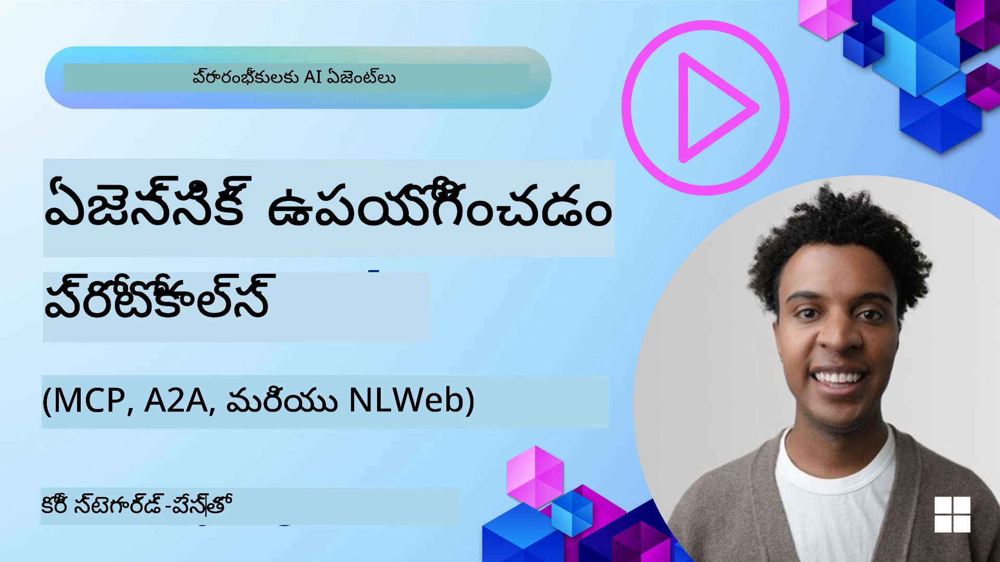
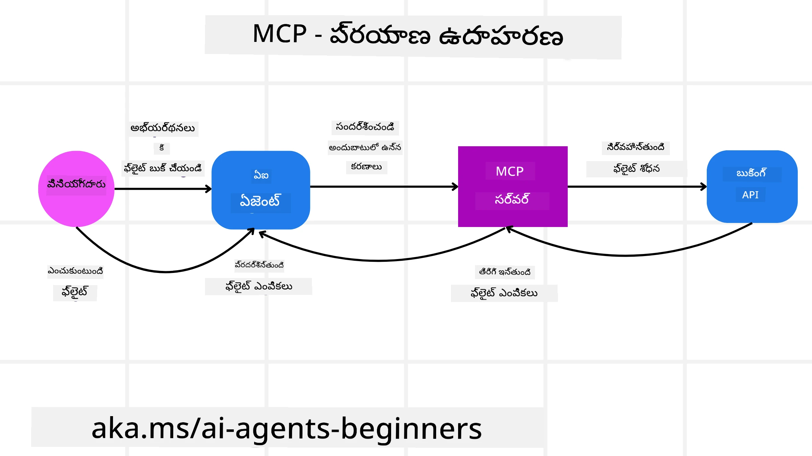
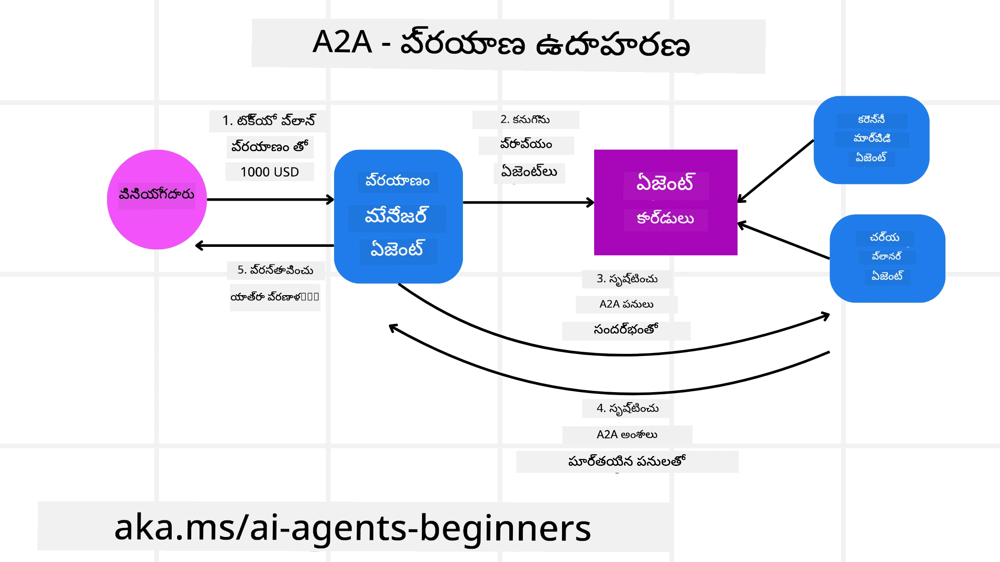
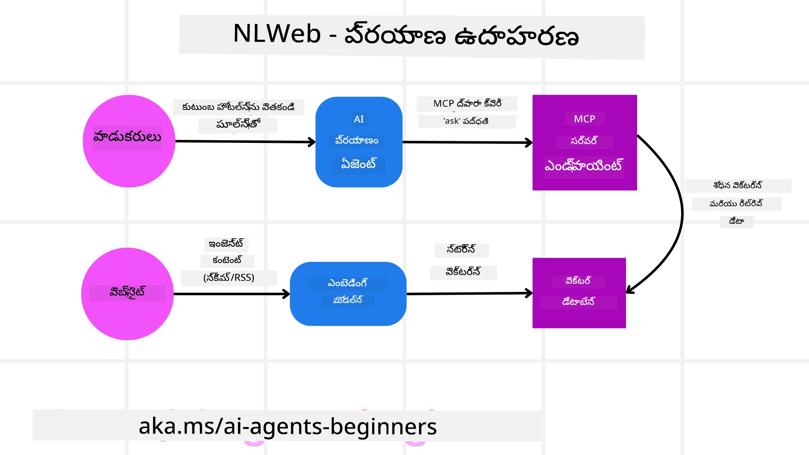

# ఏజెంటిక్ ప్రోటోకాల్‌ల (MCP, A2A మరియు NLWeb) ఉపయోగం  

  

> _(ఈ పాఠం యొక్క వీడియోను చూడటానికి పై చిత్రం క్లిక్ చేయండి)_  

AI ఏజెంట్ల ఉపయోగం పెరుగుతున్న కొద్దీ, ప్రమాణీకరణ, భద్రత మరియు మేఘ ప్రయోగాభివృద్ధి కోసం ప్రోటోకాల్‌ల అవసరం కూడా పెరుగుతోంది. ఈ పాఠంలో, మోడల్ కాంటెక్స్ట్ ప్రోటోకాల్ (MCP), ఏజెంట్ టూ ఏజెంట్ (A2A) మరియు నేచురల్ భాష వెబ్ (NLWeb) అనే మూడు ప్రోటోకాల్‌లను మనం చర్చించబోతున్నాము.  

## పరిచయం  

ఈ పాఠంలో మనం చూడబోతున్నవి:  

• ఏ విధంగా **MCP** AI ఏజెంట్లు బాహ్య సాధనాలు, డేటాకు ప్రాప్తి పొందిన తర్వాత వినియోగదారుల పనులను పూర్తిచేయగలదో.  

• ఏ విధంగా **A2A** వేరువేరు AI ఏజెంట్ల మధ్య సంభాషణ మరియు సహకారానికి అనుమతిస్తుంది.  

• ఏ విధంగా **NLWeb** నేచురల్ భాషా ఇంటర్ఫేస్‌లు ఏ వెబ్‌సైట్లలో అయినా అందించి AI ఏజెంట్లకు కంటెంట్‌ను కనుగొనడం మరియు ఆ ఇంటరాక్షన్ ఆచరించడం సాధ్యమవుతుంది.  

## నేర్చుకునే లక్ష్యాలు  

• AI ఏజెంట్ల పరిభాషలో MCP, A2A మరియు NLWeb యొక్క ప్రధాన విధులు మరియు ప్రయోజనాలను **గుర్తించండి**.  

• ప్రతి ప్రోటోకాల్ ఎలా LLMలు, సాధనాలు మరియు ఇతర ఏజెంట్ల మధ్య సంభాషణ మరియు ఇంటరాక్షన్ సాధ్యమవుతుందో **వివరిం చండి**.  

• సంక్లిష్ట ఏజెంటిక్ సిస్టమ్‌లు నిర్మాణంలో ప్రతి ప్రోటోకాల్ యొక్క ప్రత్యేక పాత్రను **గుర్తించండి**.  

## మోడల్ కాంటెక్స్ట్ ప్రోటోకాల్  

**మోడల్ కాంటెక్స్ట్ ప్రోటోకాల్ (MCP)** ఒక ఓపెన్ స్టాండర్డ్, ఇది అప్లికేషన్‌లు LLMలకు కాంటెక్స్ట్ మరియు సాధనాలు అందించడానికి ప్రమాణీకృత మార్గం. ఇది వివిధ డేటా వనరులు మరియు సాధనాలకు AI ఏజెంట్లు ఒక సహజ, ప్రామాణిక ప్రోటోకాల్ ద్వారా కనెక్ట్ కావడానికి "సర్వత్ర అనువర్తక"ను అందిస్తుంది.  

MCP యొక్క భాగాలు, ప్రత్యక్ష API ఉపయోగంతో పోల్చిన ప్రయోజనాలు, మరియు AI ఏజెంట్లు MCP సర్వర్‌ను ఎలా ఉపయోగించవచ్చో ఒక ఉదాహరణ చూద్దాము.  

### MCP ప్రాథమిక భాగాలు  

MCP **క్లయింట్-సర్వర్ ఆర్కిటెక్చర్** పై పనిచేస్తుంది మరియు ప్రాథమిక భాగాలు:  

• **హోస్ట్‌లు** LLM అప్లికేషన్‌లు (ఉదాహరణకు VSCode వంటి కోడ్ ఎడిటర్) ఇవి MCP సర్వర్‌కు కనెక్షన్లు ప్రారంభిస్తాయి.  

• **క్లయింట్లు** హోస్ట్ అప్లికేషన్‌లోని భాగాలు, ఇవి సర్వర్‌లతో ఓ-ఒకటి సంబంధాలు నిర్వహిస్తాయి.  

• **సర్వర్‌లు** స్పెసిఫిక్ సామర్థ్యాలను బయటపెడతాయి, తేలికపాటి ప్రోగ్రామ్స్.  

ప్రోటోకాల్‌లో మూడు ప్రాథమిక మూలకాలు ఉన్నాయి: MCP సర్వర్ సామర్థ్యాలు:  

• **సాధనాలు (Tools)**: AI ఏజెంట్ చేయగల కర్మలు లేదా ఫంక్షన్లు. ఉదాహరణకు, వాతావరణ సేవ “వాతావరణాన్ని పొందు” సాధనాన్ని అందించవచ్చు, లేదా ఇ-కామర్స్ సర్వర్ “ఉత్పత్తిని కొనుగోలు చేయి” సాధనాన్ని అందిస్తుంది. MCP సర్వర్ గల టూల్‌ల ప్రత్తేక వివరాలు, వివరాలు, ఇన్‌పుట్/ఔట్‌పుట్ ప్యాటర్న్లు సామర్థ్యాల్లో ఉంటాయి.  

• **వనరులు (Resources)**: చదవగలిగే డేటా అంశాలు లేదా డాక్యుమెంట్స్, క్లయింట్లు కావలసినప్పుడు ఈ డేటా పొందగలుగుతారు. ఉదాహరణకు ఫైల్ కంటెంట్లు, డేటాబేస్ రికార్డులు లేదా లాగ్ ఫైల్‌లు. వనరులు టెక్స్ట్ (కోడ్/JSON వంటి) లేదా బైనరీ (చిత్రాలు/ PDFs వంటి) రూపంలో ఉండవచ్చు.  

• **ప్రాంప్ట్‌లు (Prompts)**: ముందుగా నిర్వచించిన టెంప్లేట్లు, ఇవి సూచిత ప్రాంప్ట్‌లు అందించి క్లిష్టమైన వర్క్‌ఫ్లోలను అనుమతిస్తాయి.  

### MCP ప్రయోజనాలు  

MCP AI ఏజెంట్లు కోసం ముఖ్యమైన ప్రయోజనాలు ఇస్తుంది:  

• **డైనమిక్ టూల్ డిస్కవరీ**: ఏజెంట్లు ఒక సర్వర్ నుండి అందుబాటులో ఉన్న సాధనల జాబితాను, వాటి వివరాలతో, స్థానికంగా పొందగలుగుతారు. ఇది సంప్రదాయ APIsతో భిన్నం, వీటిలో ఏదైనా API మార్పు కోసం కోడ్ అప్‌డేట్లు అవసరం. MCP యొక్క "ఒకసారి ఇంటిగ్రేట్ చేయండి" విధానం ఎక్కువ అనుకూలతను అందిస్తుంది.  

• **LLMల మధ్య అంతరసమ్మతం**: MCP వివిధ LLMలతో పనిచేస్తుంది, మెచ్చుకోదగిన పనితనం కోసం మార్పులను అనుమతిస్తుంది.  

• **ప్రామాణీకృత భద్రత**: MCP లో ప్రామాణీకరణ ఒక ప్రమాణ మethodeతో ఉంటుంది, అదనపు MCP సర్వర్లు జోడించడంలో మెరుగైన సామర్ధ్యాన్ని ఇస్తుంది. ఇది పాత APIs కోసం వేరువేరు కీలు మరియు authentication రకాలను నిర్వహించడంకంటే సులభం.  

### MCP ఉదాహరణ  

  

ఒక వినియోగదారు MCP ఆధారిత AI సహాయకంతో విమానం బుక్ చేయాలని అనుకోండి.  

1. **కనెక్షన్**: AI సహాయకుడు (MCP క్లయింట్) విమానాశ్రయ సంస్థ ఇచ్చిన MCP సర్వర్‌కు కనెక్ట్ అవుతుంది.  

2. **టూల్ డిస్కవరీ**: క్లయింట్ ఎయిర్లైన్స్ MCP సర్వర్‌ను అడుగుతుంది, "మీ దగ్గర ఎలాంటి సాధనాలు ఉన్నాయి?" సర్వర్ "ఫ్లైట్‌లు శోధించు" మరియు "ఫ్లైట్ బుక్ చేయి" వంటి సాధనాలను అందిస్తుంది.  

3. **సాధన ఆహ్వానం**: మీరు AI సహాయకుడికి "పోర్ట్‌లాండ్ నుంచి హోనోలోవుకు ఫ్లైట్ శోధించు" అంటారు. AI సహాయకుడు LLM ఉపయోగించి "ఫ్లైట్ శోధన" సాధన పిలవాలి అని తెలుసుకుని MCP సర్వర్‌కు సంబంధిత ఆర్గుమెంట్లు అందిస్తుంది.  

4. **నిర్వహణ మరియు స్పందన**: MCP సర్వర్, ఒక ఈటలాగా, విమానాశ్రయం బుకింగ్ APIకి కాల్ చేసి ఫ్లైట్ సమాచారం (జేసన్ డేటా) పొందుతుంది మరియు AI సహాయకునికి పంపుతుంది.  

5. **మరింత ఇంటరాక్షన్**: AI సహాయకుడు ఫ్లైట్ ఎంపికలను చూపిస్తుంది. మీరు ఒక ఫ్లైట్ ఎంచుకున్న తరువాత, సహಾಯಕుడు అదే MCP సర్వర్‌లోని "ఫ్లైట్ బుక్ చేయి" సాధనాన్ని పిలవవచ్చు, బుకింగ్ పూర్తి చేయడానికి.  

## ఏజెంట్-టూ-ఏజెంట్ ప్రోటోకాల్ (A2A)  

MCP LLMలను సాధనాలకు కలపడంపై దృష్టి పెడితే, **ఏజెంట్-టూ-ఏజెంట్ (A2A) ప్రోటోకాల్** వేరే దశలో పాటు వుంటుంది, భిన్న AI ఏజెంట్ల మధ్య సంభాషణ మరియు సహకారానికి అవకాశాన్ని ఇస్తుంది. A2A వేరువేరు సంస్థలు, వాతావరణాలు మరియు టెక్ స్టాక్‌ల AI ఏజెంట్లను కలిపి పంచుకున్న పని పూర్తి చేయించడానికి అనుమతిస్తుంది.  

మన ప్రయాణ అప్లికేషన్ లో దాన్ని ఎలా ఉపయోగించవచ్చో భాగాలు, ప్రయోజనాలు మరియు ఉదాహరణ చూడబోతున్నాము.  

### A2A ప్రాథమిక భాగాలు  

A2A ఏజెంట్ల మధ్య సంభాషణను సాధ్యం చేసుకొని, వినియోగదారుల ఉపపని పూర్తిచేయడానికి పురోగమనం చేస్తుంది. ప్రోటోకాల్ యొక్క ప్రతి భాగం ఈ విషయానికి సహకరిస్తుంది:  

#### ఏజెంట్ కార్డ్  

MCP సర్వర్ టూల్స్ జాబితా షేర్ చేయడానికి తోటి, ఏజెంట్ కార్డ్ లో:  
- ఏజెంట్ పేరు.  
- అది పూర్తి చేసే సాధారణ పనుల **వివరణ**.  
- ఇతర ఏజెంట్లు (లేదా మానవ వినియోగదారులు) ఏజెంట్‌ను ఎప్పుడు ఎందుకు పిలవాలో అర్థం చేసుకునేందుకు సహాయపడే **ప్రత్యేక నైపుణ్యాల జాబితా** వివరణలతో.  
- ఏజెంట్ యొక్క **ప్రస్తుత ఎండ్పాయింట్ URL**.  
- స్ట్రీమింగ్ స్పందనలు మరియు పుష్ నోటిఫికేషన్ల వంటి ఏజెంట్ యొక్క **వెర్షన్** మరియు **సామర్థ్యాలు**.  

#### ఏజెంట్ ఎగ్జిక్యూటర్  

ఏజెంట్ ఎగ్జిక్యూటర్ **వినియోగదార్ చాట్ కాంటెక్స్ట్‌ను రిమోట్ ఏజెంట్‌కు పంపడం** బాధ్యత వహిస్తుంది. రిమోట్ ఏజెంట్ పని పూర్తి చేయడానికి వివరణను అర్థం చేసుకోవాలి. A2A సర్వర్‌లో ఏజెంట్ తన-తన లార్జ్ లాంగ్వేజ్ మోడల్ (LLM) ఉపయోగించి రిక్వెస్ట్‌లను ప解析చేసి అంతర్గత సాధనాలతో పనులు పూర్తి చేస్తుంది.  

#### ఆర్టిఫాక్ట్  

రిమోట్ ఏజెంట్ అభ్యర్థించిన పనిని పూర్తిచేసినపుడు, దాని ఫలితాన్ని ఆర్టిఫాక్ట్‌గా సృష్టిస్తారు. ఆర్టిఫాక్ట్ లో ఏజెంట్ పని ఫలితాలు, పూర్తయిన పనుల వివరణ, మరియు ప్రోటోకాల్ ద్వారా పంపిన పాఠ్య సందర్భం ఉంటుంది. ఆర్టిఫాక్ట్ పంపిన తర్వాత రిమోట్ ఏజెంట్‌తో కనెక్షన్ మూసివేయబడుతుంది, అవసరమైతే తిరిగి తెరవబడుతుంది.  

#### ఈవెంట్ క్యూ  

ఈ భాగం **అప్‌డెట్లు మరియు సందేశాలను నిర్వహించడానికి** ఉపయోగిస్తారు. ఏజెంట్ల మధ్య కనెక్షన్ పనుల సమయానికి మూసిపోదు నిరోధించడానికి ఇదే ప్రాముఖ్యం, ప్రత్యేకించి పొడవైన ప్రక్రియలలో.  

### A2A ప్రయోజనాలు  

• **మంచి సహకారం**: వేరు వేరు విక్రేతలు, ప్లాట్‌ఫారమ్‌ల AI ఏజెంట్ల మధ్య సంభాషణ, సందర్భ పంచుకోవడం మరియు కలసి పని చేయడం సాధ్యం చేస్తుంది, సాంప్రదాయంగా వేరవ apart అమర్చిన సిస్టమ్‌లను అనుసంధానిస్తుంది.  

• **మోడల్ ఎంచుకునే స్వేచ్ఛ**: ప్రతి A2A ఏజెంట్ తన రిక్వెస్ట్‌లను సేవ్ చేయడానికి ఏ LLMను ఉపయోగించాలో నిర్ణయించవచ్చు, MCPలోని ఏకైక LLM కనెక్షన్ కంటే తానూ అనुकूलన లేదా శ్రద్ధ తీసుకున్న మోడల్స్ అనుమతిస్తుంది.  

• **ఆంతరంగిక ప్రామాణీకరణ**: A2A ప్రోటోకాల్‌లో ప్రామాణీకరణ నేరుగా ఉంటాయి, ఏజెంట్ ఇంటరాక్షన్‌లకు గట్టి భద్రతా అడుగు.  

### A2A ఉదాహరణ  

  

మన ట్రావెల్ బుకింగ్ పరిస్థితిని A2Aతో విస్తరిద్దాం.  

1. **యూజర్ రిక్వెస్ట్ మల్టీ-ఏజెంట్‌కి**: వినియోగదారు "ట్రావెల్ ఏజెంట్" A2A క్లయింట్/ఏజెంట్‌తో మాట్లాడి, "దయచేసి వచ్చే వారానికి హోనోలో కు ఇంకొన్ని ప్లైట్‌లు, హోటల్, అద్దె కారు సహా మొత్తం ప్రయాణాన్ని బుక్ చేయ్" అంటారు.  

2. **ట్రావెల్ ఏజెంట్ ఆర్చెస్ట్రేషన్**: ట్రావెల్ ఏజెంట్ ఈ క్లిష్ట అభ్యర్థనను అందుకుంటుంది. పని గురించి ఆలోచించి, ప్రత్యేక ఏజెంట్లతో ఇంటరాక్ట్ కావాల్సిందని నిర్ణయిస్తుంది.  

3. **ఏజెంట్‌ల మధ్య కమ్యూనికేషన్**: ట్రావెల్ ఏజెంట్ A2A ప్రోటోకాల్ ఉపయోగించి downstream ఏజెంట్లతో (ఉదా: "ఎయిర్లైన్ ఏజెంట్", "హోటల్ ఏజెంట్", "కారు అద్దె" ఏజెంట్) సంబంధం కల్పిస్తుంది, ఇవి వేర్వేరు కంపెనీలవే.  

4. **పని అప్పగింపు**: ట్రావెల్ ఏజెంట్ downstream ఏజెంట్లకు ప్రత్యేక పనులను పంపిస్తుంది (ఉదా: "హోనోలోకు ఫ్లైట్‌లు కనుగొను", "హోటల్ బుక్ చేయు", "కారు అద్దెకు తీసుకో"). ఇంతకీ ప్రతీ ఏజెంట్ తన LLM మరియు సాధనాలను (వీటిలో MCP సర్వర్ కూడా ఉండొచ్చు) ఉపయోగించి తన భాగాన్ని పూర్తిచేస్తుంది.  

5. **సంకలిత స్పందన**: downstream ఏజెంట్లు పనులు పూర్తిచేసిన తర్వాత, ట్రావెల్ ఏజెంట్ ఫలితాలను (ఫ్లైట్ వివరాలు, హోటల్ నిర్ధారణ, కారు అద్దె బుకింగ్) సమాహరించి వినియోగదారుకు చాట్ శైలిలో సమగ్ర సమాధానాన్ని పంపిస్తుంది.  

## నేచురల్ లాంగ్వేజ్ వెబ్ (NLWeb)  

వెబ్‌సైట్లు ఎన్నడూ ప్రధాన మార్గం కావడంతో వినియోగదారులు ఇంటర్నెట్‌లో సమాచారానికి, డేటాకు ప్రాప్తి పొందుతారు.  

NLWeb భాగాలు, ప్రయోజనాలు, మరియు మన ట్రావెల్ అప్లికేషన్ ద్వారా NLWeb ఎలా పనిచేస్తుంది అనే దానిని చూద్దాం.  

### NLWeb భాగాలు  

- **NLWeb అప్లికేషన్ (కోర్ సర్వీస్ కోడ్)**: నేచురల్ లాంగ్వేజ్ ప్రశ్నలను ప్రాసెస్ చేసే సిస్టమ్. ఇది ప్లాట్‌ఫారమ్ భాగాలను కలిపి ప్రతిస్పందనలు సృష్టిస్తుంది. మీరు దీనిని వెబ్‌సైట్ యొక్క **నేచురల్ లాంగ్వేజ్ ఫీచర్ల ఇంజిన్** గా భావించవచ్చు.  

- **NLWeb ప్రోటోకాల్**: ఇది వెబ్‌సైట్ తో నేచురల్ లాంగ్వేజ్ ఇంటరాక్షన్ కోసం **మూల నియమాల సెట్**. ఇది JSON ఫార్మాట్‌లో (సాధారణంగా Schema.org ఉపయోగించి) ప్రతిస్పందనలు పంపుతుంది. దీని ఉదేశ్యం "AI వెబ్" కోసం సులభమైన పునాది కల్పించడం, HTML డాక్యుమెంట్ల భాగస్వామ్యం కోసం అవకాశం ఇచ్చిన విధంగా.  

- **MCP సర్వర్ (మోడల్ కాంటెక్స్ట్ ప్రోటోకాల్ ఎండ్పాయింట్)**: ప్రతి NLWeb అమరిక కూడా ఒక **MCP సర్వర్** గా పనిచేస్తుంది. అంటే ఇది ఇతర AI సిస్టమ్‌లతో **సాధనాలు (ఉదా: “ask” పద్ధతి) మరియు డేటాను పంచుకుంటుంది**. ఇది వెబ్‌సైట్ కంటెంట్, సామర్థ్యాలను AI ఏజెంట్లు ఉపయోగించడానికి అనుమతిస్తుంది, వెబ్సైట్ విస్తృతమైన "ఏజెంట్ ఎకోసిస్టమ్" భాగం అవుతుంది.  

- **ఎంబెడింగ్ మోడల్స్**: ఇవి వెబ్‌సైట్ కంటెంట్‌ను **సంఖ్యాత్మక ప్రతినిధులైన వెక్టర్లుగా (ఎంబెడింగ్‌లు)** మార్చడానికి ఉపయోగిస్తారు. ఈ వెక్టర్లు కంప్యూటర్లకు అర్థం చేసుకునేలా అర్థం మరియు వెతుకును అందిస్తాయి. వీటిని ప్రత్యేక డేటాబేస్‌లో నిల్వ చేస్తారు, వినియోగదారులు ఎంబెడింగ్ మోడల్ ఎంచుకోవచ్చు.  

- **వెక్టర్ డేటాబేస్ (రిట్రీవల్ సదుపాయం)**: ఈ డేటాబేస్ వెబ్‌సైట్ కంటెంట్ యొక్క ఎంబెడింగ్‌లను భద్రపరుస్తుంది. యెడల ఎవరు ప్రశ్న అడిగితే, NLWeb సముచిత సమాచారం కోసం వెక్టర్ డేటాబేస్‌ను త్వ‌రాగతంగా తనిఖీ చేస్తుంది. ఇది Qdrant, Snowflake, Milvus, Azure AI Search, Elasticsearch వంటి వేరే వేరే వెక్టర్ స్టోరేజ్ సిస్టమ్‌లతో పనిచేస్తుంది.  

### ఉదాహరణగా NLWeb  

  

మన ట్రావెల్ బుకింగ్ వెబ్‌సైట్ మళ్లీ పరిగణలోకి తీసుకోండి, కానీ ఈసారి అది NLWeb ఆధారంగా పనిచేస్తుంది.  

1. **డేటా ఇంగెస్టెన్**: ట్రావెల్ వెబ్‌సైట్ లో ఉన్న ఉత్పత్తి కేటలాగ్‌లు (ఫ్లైట్ జాబితాలు, హోటల్ వివరణలు, టూర్ ప్యాకేజీలు) Schema.org ద్వారా ఫార్మాట్ చేసి లేదా RSS ఫీడ్స్ ద్వారా లోడ్ అవుతాయి. NLWeb టూల్స్ ఈ సారూప్య డేటాను ఇంగెస్ట్ చేసి ఎంబెడింగ్స్ సృష్టించి స్థానిక లేదా దూర వెక్టర్ డాటాబేస్‌లో నిల్వ చేస్తుంది.  

2. **నేచురల్ లాంగ్వేజ్ ప్రశ్న (మానవుడు)**: ఒక వినియోగదారు వెబ్‌సైట్ సందర్శించి, మెనూలు నావిగేట్ చేయకుండా చాట్ ఇంటర్‌ఫేస్‌లో “తరువాత వారం హోనొలోలో ఒక ఫ్యామిలీ-హිතకర హోటల్, పూల్ తో వెతకండి” అని టైప్ చేస్తారు.  

3. **NLWeb ప్రాసెసింగ్**: NLWeb అప్లికేషన్ ఈ ప్రశ్నను అందుకుంటుంది. అది LLMకి అర్థం చేసుకోవడానికి పంపి అదే సమయంలో వెక్టర్ డేటాబేస్‌లో సంబంధిత హోటల్ జాబితాలను శోధిస్తుంది.  

4. **నిజమైన ఫలితాలు**: LLM డేటాబేస్ నుండి శోధన ఫలితాలను వ్యాఖ్యా సూత్రం చేయడంలో సహాయపడుతుంది, "ఫ్యామిలీ-హితకర", "పూల్", మరియు "హోనొలో" క్రైటీరియాల ఆధారంగా ఉత్తమ మ్యాచ్‌లను గుర్తించి నేచురల్ లాంగ్వేజ్ స్పందనను సృష్టిస్తుంది. ముఖ్యంగా, ప్రతిస్పందన వెబ్‌సైట్ కేటలాగ్ లోని అసలు హోటల్స్‌ను సూచిస్తుంది, ఆచ్రమాలు నివారిస్తుంది.  

5. **AI ఏజెంట్ ఇంటరాక్షన్**: NLWeb MCP సర్వర్‌గా పనిచేసేందున, బాహ్య AI ట్రావెల్ ఏజెంట్ ఈ వెబ్‌సైట్ యొక్క NLWeb ఇన్‌స్టాన్సుతో కనెక్ట్ అయ్యి, `ask("హోనొలో ప్రాంతంలో హోటల్ ద్వారా సిఫార్సు చేయబడిన వెగన్-ఫ్రెండ్‌లీ రెస్టారెంట్లు లేవా?")` వంటి ప్రశ్న అడగవచ్చు. NLWeb ఈ ప్రశ్న ప్రాసెస్ చేసి, రెస్టారెంట్ సమాచారం (లోడ్ అయి ఉంటే) యొక్క డేటాబేస్ ఆధారంగా నిర్మిత JSON ప్రతిస్పందన పంపుతుంది.  

### MCP/A2A/NLWeb గురించి మరిన్ని ప్రశ్నలు ఉన్నాయా?  

ఇతర ఆలోచనకారులతో ముఖాముఖి కుసురుకుంటూ, ఆఫీస్ అవర్స్‌కు హాజరై, మీ AI ఏజెంట్లు సంబంధించిన ప్రశ్నలకు సమాధానాలు పొందేందుకు [Microsoft Foundry Discord](https://discord.com/invite/ATgtXmAS5D) లో చేరండి.  

## వనరులు  

- [MCP for Beginners](https://aka.ms/mcp-for-beginners)  
- [MCP Documentation](https://learn.microsoft.com/python/api/overview/azure/ai-projects-readme)  
- [NLWeb Repo](https://github.com/nlweb-ai/NLWeb)  
- [Microsoft Agent Framework](https://aka.ms/ai-agents-beginners/agent-framework)  

---

<!-- CO-OP TRANSLATOR DISCLAIMER START -->
**అస్వీకరణ**:
ఈ పత్రం AI అనువాద సేవ [Co-op Translator](https://github.com/Azure/co-op-translator) ఉపయోగించి అనువదించబడింది. మేము ఖచ్చితత్వానికి ప్రయత్నిస్తున్నప్పటికీ, ఆటోమేటెడ్ అనువాదాలు తప్పులు లేదా అసమగ్రతలను కలిగి ఉండవచ్చు. దాని స్వదేశ భాషలో ఉన్న అసలు పత్రాన్ని అధికారం కలిగిన మూలంగా పరిగణించాలి. కీలకమైన సమాచారం కోసం, ప్రొఫెషనల్ మానవ అనువాదాన్ని సిఫారసు చేస్తాము. ఈ అనువాదం ఉపయోగం వల్ల కలిగే ఏవైనా అపార్థాలు లేదా తప్పుదారులు కోసం మేము బాధ్యత వహించము.
<!-- CO-OP TRANSLATOR DISCLAIMER END -->