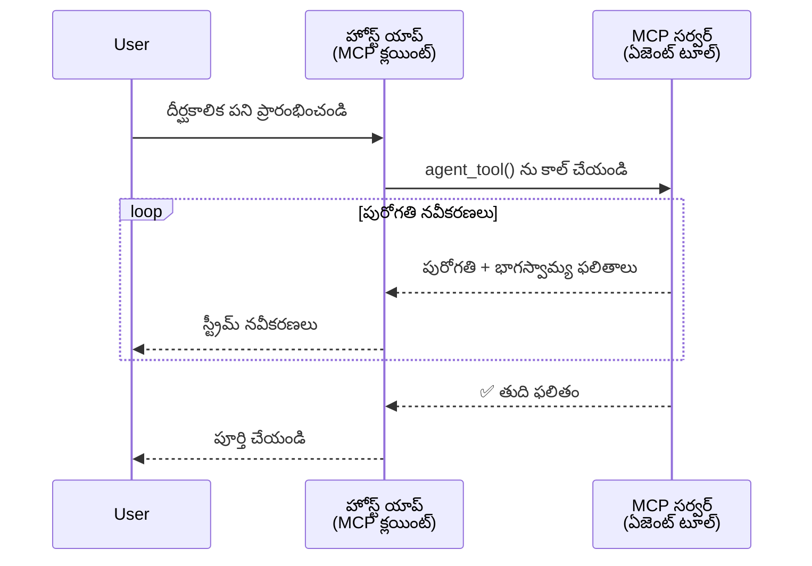
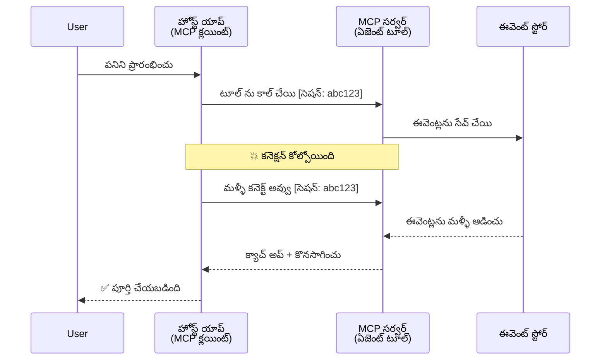
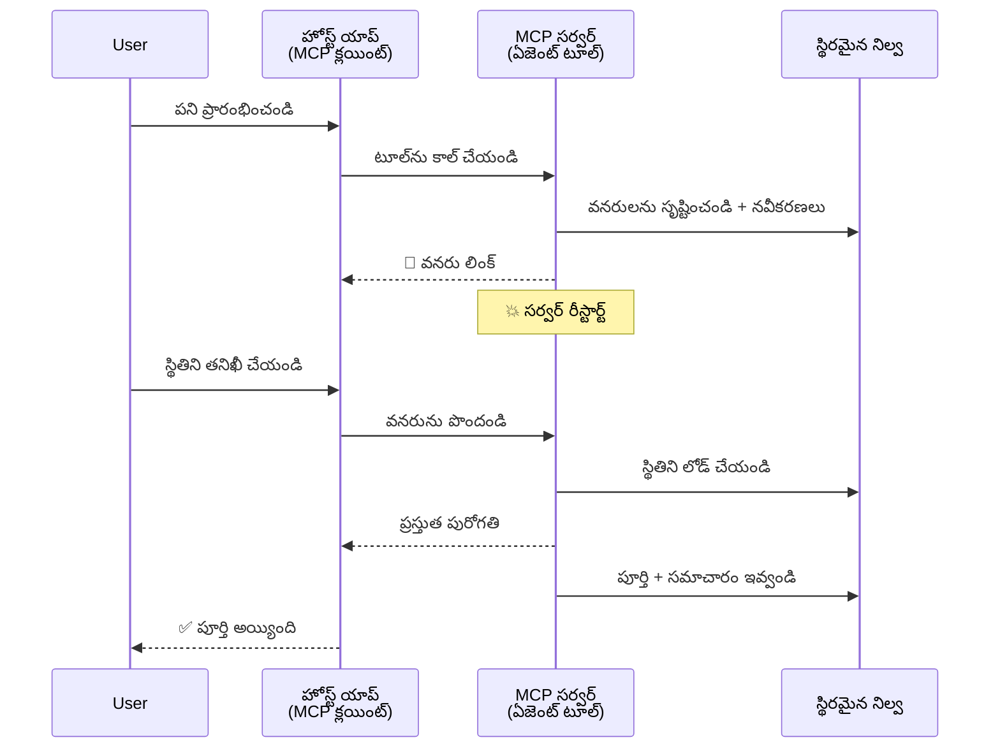
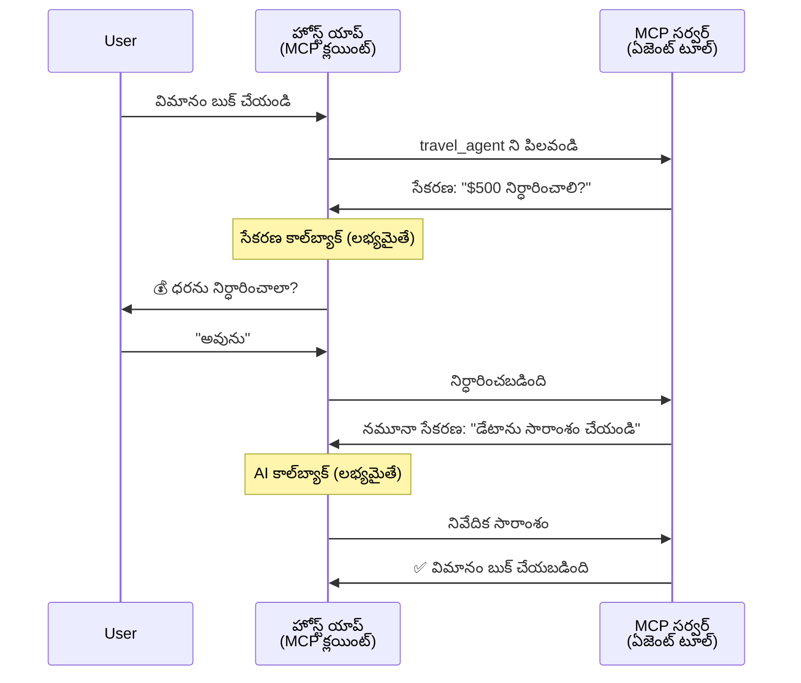
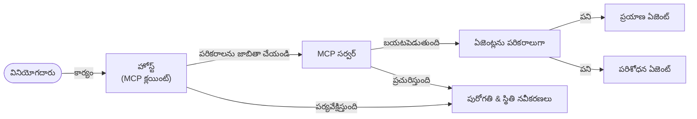

# MCPతో ఏజెంట్ నుండి ఏజెంట్ కమ్యూనికేషన్ వ్యవస్థలను నిర్మించడం

> సారాంశం - మీరు MCPలో Agent2Agent కమ్యూనికేషన్‌ను నిర్మించగలరా? అవును!

MCP తన ప్రాథమిక లక్ష్యం "LLMs కు సందర్భం అందించడం" కంటే చాలా ఎక్కువగా అభివృద్ధి పొందింది. [రిస్యూమబుల్ స్ట్రీమ్స్](https://modelcontextprotocol.io/docs/concepts/transports#resumability-and-redelivery), [ఎలిసిటేషన్](https://modelcontextprotocol.io/specification/2025-06-18/client/elicitation), [సాంప్లింగ్](https://modelcontextprotocol.io/specification/2025-06-18/client/sampling), మరియు నోటిఫికేషన్లు ([ప్రోగ్రెస్](https://modelcontextprotocol.io/specification/2025-06-18/basic/utilities/progress) మరియు [రిసోర్సెస్](https://modelcontextprotocol.io/specification/2025-06-18/schema#resourceupdatednotification)) వంటి తాజా అభివృద్ధులతో, MCP ఇప్పుడు సంక్లిష్టమైన ఏజెంట్ నుండి ఏజెంట్ కమ్యూనికేషన్ వ్యవస్థలను నిర్మించడానికి బలమైన మౌలికస్తంభాన్ని అందిస్తుంది.

## ఏజెంట్/టూల్ గురించి తప్పుదోషం

మరిన్ని డెవలపర్లు ఏజంటిక్ ప్రవర్తనలు ఉన్న టూల్స్‌ని (దీర్ఘకాలం పనిచేసే, మధ్యవేళ అదనపు ఇన్‌పుట్ అవసరం కావచ్చు, మొదలైనవి) అన్వేషించగా, ఒక సాధారణ తప్పుదోషం ఉంది: MCP అనేది అనుకూలం కాదు అని అనుకోవడం ఎందుకంటే ప్రారంభ ఉదాహరణలు సాధారణ రిక్వెస్ట్-రిస్పాన్స్ నమూనాలపై కేంద్రీకృతమయ్యాయి.

ఈ అభిప్రాయం పాతది. MCP స్పెసిఫికేషన్ గడచిన కొన్ని నెలల్లో భారీగా అభివృద్ధి చేయబడింది, దీని ద్వారా దీర్ఘకాలం ఏజంటిక్ ప్రవర్తన నిర్మించడానికి వెనుకబడిన గ్యాప్‌ను తీర్చగల సామర్థ్యాలు ఉన్నాయి:

- **స్ట్రీమింగ్ & భాగస్వామ్య ఫలితాలు**: అమలు సమయంలో వాస్తవ కాల ప్రగతి నవీకరణలు
- **రిస్యూమబిలిటీ**: క్లయింట్లు డిస్కనెక్ట్ అయిన తర్వాత పునఃకనెక్ట్ చేసి కొనసాగగలరు
- **దృఢత్వం**: ఫలితాలు సర్వర్ రీస్టార్ట్ లను తట్టుకుంటాయి (ఉదా: రిసోర్సు లింకుల ద్వారా)
- **మల్టీ-టర్న్**: ఎలిసిటేషన్ మరియు సాంప్లింగ్ ద్వారా మధ్యవేళ అంతర్గత ఇన్‌పుట్

ఈ లక్షణాలను కలిపి సంక్లిష్ట ఏజంటిక్ మరియు బహుళ-ఏజెంట్ అప్లికేషన్లను సృష్టించవచ్చు, ఇవన్నీ MCP ప్రోటోకాల్పై అమలు చేయబడ్డాయి.

ఉదాహరణకు, ఏజెంట్ అనేది MCP సర్వర్‌పై అందుబాటులో ఉన్న "టూల్" అని పిలువబడుతుంది. అంటే, హోస్ట్ అప్లికేషన్ ఉన్నది, ఇది MCP క్లయింట్‌ని అమలు చేసి MCP సర్వర్‌తో సెషన్‌ని స్థాపించి ఏజెంట్‌ను పిలవగలదు.

## MCP టూల్‌ను "ఏజంటిక్"గా చేసినది ఏమిటి?

అమలు గురించి చెప్పక ముందే, దీర్ఘకాలం పనిచేసే ఏజెంట్లకు అవసరమైన ఇన్ఫ్రాస్ట్రక్చర్ సామర్థ్యాలను మనం నిర్ణయించుకుందాం.

> ఏజెంట్ అంటే స్వతంత్రంగా పొడిగిన కాలం సంబంధించి పని చేయగలనిది, సంక్లిష్ట పనుల నిర్వహణ చేస్తూ, విభిన్న ఇంటరాక్షన్లు లేదా ప్రత్యక్ష అభిప్రాయం ఆధారంగా సవరించబడగలిగేది అని నిర్వచిస్తాము.

### 1. స్ట్రీమింగ్ & భాగస్వామ్య ఫలితాలు

సాంప్రదాయ రిక్వెస్ట్-రిస్పాన్స్ నమూనాలు దీర్ఘకాలం పనులకు పనిచేయవు. ఏజెంట్లు అందించాల్సినవి:

- వాస్తవ కాల ప్రగతి నవీకరణలు
- అంతర్భాగ ఫలితాలు

**MCP సపోర్టు**: రిసోర్స్ అప్‌డేట్ నోటిఫికేషన్లు పార్టియల్ ఫలితాల స్ట్రీమింగ్‌ను అందిస్తాయి, కానీ ఇది JSON-RPC యొక్క 1:1 రిక్వెస్ట్/రిస్పాన్స్ నమూనాతో కలగకూడదు అని జాగ్రత్త అవసరం.

| ఫీచర్                  | వినియోగం                                                                                                                                                 | MCP సపోర్టు                                                                                |
| ------------------------ | -------------------------------------------------------------------------------------------------------------------------------------------------------- | ------------------------------------------------------------------------------------------ |
| వాస్తవ కాల ప్రగతి నవీకరణలు | యూజర్ కోడ్‌బేస్ మైగ్రేషన్ టాస్క్ అభ్యర్థన. ఏజెంట్ స్ట్రీము చేస్తుంది: "10% - ఆధారాలను విశ్లేషిస్తున్నాం... 25% - టైప్‌స్క్రిప్ట్ ఫైళ్లకు మారుస్తున్నాం... 50% - దిగుమతులను నవీకరిస్తున్నాం..." | ✅ ప్రోగ్రెస్ నోటిఫికేషన్లు                                                                  |
| భాగస్వామ్య ఫలితాలు         | "ఒక పుస్తకం రూపొందించు" టాస్క్ భాగస్వామ్య ఫలితాలను స్ట్రీం చేస్తుంది, ఉదా: 1) కథా రేఖాంశం, 2) అధ్యాయాల జాబితా, 3) ప్రతి అధ్యాయం పూర్తయినప్పుడు. హోస్ట్ ఎప్పుడైనా తనిఖీ, క్యాన్సిల్ లేదా మార్చొచ్చు. | ✅ నోటిఫికేషన్లు "విస్తరించి" భాగస్వామ్య ఫలితాలను కలిగి ఉండగలవు, PR 383, 776లో ప్రతిపాదనలు చుడండి        |

<div align="center" style="font-style: italic; font-size: 0.95em; margin-bottom: 0.5em;">
<strong>ఆకృతి 1:</strong> దీని ద్వారా MCP ఏజెంట్ ఎలానో దీర్ఘకాల పనిలో వాస్తవ కాల ప్రగతి నవీకరణలు మరియు భాగస్వామ్య ఫలితాలను హోస్ట్ అప్లికేషన్‌కు స్ట్రీం చేస్తుంది, యూజర్ కి అమలు ని రిజిస్టర్ చేయునట్లు వీలు కల్పిస్తుంది.
</div>



### 2. రిస్యూమబిలిటీ

ఏజెంట్లు నెట్‌వర్క్ అవాంతరాలను సౌమ్యంగా నిర్వహించాలి:

- (క్లయింట్) డిస్కనెక్ట్ అయిన తర్వాత పునఃకనెక్ట్ కావడం
- విడిచిన చోటుంచి కొనసాగించడం (సందేశ రీడెలివరీ)

**MCP సపోర్టు**: MCP StreamableHTTP రవాణా ఈ రోజుల్లో సెషన్ రిజూమ్ మరియు సందేశ రీడెలివరీని సెషన్ IDలు మరియు చివరి ఈవెంట్ IDలతో మద్దతు ఇస్తుంది. ముఖ్యంగా సర్వర్ ఇవెంట్స్‌ను తిరిగి ప్లే చేయగల EventStore అమలు చేయాలి.  
సమాజ ప్రతిపాదన (PR #975) ట్రాన్స్‌పోర్ట్-అగ్నాస్టిక్ రిస్యూమబుల్ స్ట్రీమ్స్ గురించి పరిశీలిస్తోంది.

| ఫీచర్     | వినియోగం                                                                                                                              | MCP సపోర్టు                                                         |
| ---------- | ------------------------------------------------------------------------------------------------------------------------------------- | ------------------------------------------------------------------- |
| రిస్యూమబిలిటీ | క్లయింట్ దీర్ఘకాల టాస్క్ సమయంలో డిస్కనెక్ట్ అవుతుంది. పునఃకనెక్ట్ అయినప్పుడు, సెషన్ మిస్సయ్యిన ఈవెంట్ల ప్లేతో తిరిగి ప్రారంభమవుతుంది, మధ్యలో ఉన్న ప్రగతి కోల్పోవకుండా కొనసాగుతుంది. | ✅ StreamableHTTP రవాణా సెషన్ IDలు, ఈవెంట్ రీ ప్లే, EventStoreతో      |

<div align="center" style="font-style: italic; font-size: 0.95em; margin-bottom: 0.5em;">
<strong>ఆకృతి 2:</strong> MCP యొక్క StreamableHTTP రవాణా మరియు ఈవెంట్ స్టోర్ ద్వారా ఎలా సెషన్ నిరంతరత్వం సాధించబడుతుంది, క్లయింట్ డిస్కనెక్ట్ అయితే ప్రశ్నించిన ఈవెంట్లను పునః ప్లే చేసి టాస్క్‌ను నమోదు లేకుండా కొనసాగించగలదని ఇది చూపిస్తుంది.
</div>



### 3. దృఢత్వం

దీర్ఘకాల ఏజెంట్లకు శాశ్వత స్థితి అవసరం:

- ఫలితాలు సర్వర్ రీస్టార్ట్‌లను తట్టుకుంటాయి
- స్థితిని బ్యాండ్‌బ్యాండ్ వెలుపల నుండి పొందవచ్చు
- సెషన్‌ల మధ్య ప్రగతి ట్రాకింగ్

**MCP సపోర్టు**: MCP ఇప్పుడు టూల్ కాల్స్ కోసం రిసోర్స్ లింక్ రిటర్న్ టైపు మద్దతిస్తుంది. సాధారణంగా టూల్ ఒక రిసోర్స్ సృష్టించి వెంటనే ఆ రిసోర్స్ లింక్ అందిస్తుంది. టూల్ బ్యాక్‌గ్రౌండ్‌లో టాస్క్‌ను కొనసాగించి ఆ రిసోర్స్‌ను అప్‌డేట్ చేస్తుంది. క్లయింట్ ఆ రిసోర్స్ స్థితిని పోలింగ్ చేసి పాక్షిక లేదా పూర్తి ఫలితాలను పొందవచ్చు లేదా అప్డేట్ నోటిఫికేషన్ల కోసం సబ్‌స్క్రైబ్ అవ్వవచ్చు.

ఒక పరిమితి ఏమిటంటే, రిసోర్స్ పోలింగ్ లేదా నోటిఫికేషన్ల కోసం సబ్‌స్క్రిప్షన్ స్కేల్‌పై రిసోర్సులను వాడుకోవచ్చు. ఓ సమాజ ప్రతిపాదన (#992 సహా) వెబ్‌హుక్స్ లేదా ట్రిగ్గర్లు కలుపుతూ సర్వర్ క్లయింట్/హోస్ట్ అప్లికేషన్‌కు అప్‌డేట్స్ पुంఛడానికి చర్చిస్తోంది.

| ఫీచర్      | వినియోగం                                                                                                                             | MCP సపోర్టు                                                |
| ----------- | ----------------------------------------------------------------------------------------------------------------------------------- | ------------------------------------------------------------ |
| దృఢత్వం     | డేటా మైగ్రేషన్ టాస్క్ సమయంలో సర్వర్ క్రాష్ అవుతుంది. ఫలితాలు మరియు ప్రగతి రీస్టార్ట్‌ని తట్టుకుంటాయి, క్లయింట్ స్థితిని తనిఖీ చేసి నిలుపు రిసోర్స్ నుండి కొనసాగవచ్చు. | ✅ దృఢమైన నిల్వతో రిసోర్స్ లింకులు మరియు స్థితి నోటిఫికేషన్లు    |

ఇప్పటికీ సాధారణ నమూనా ఒక రిసోర్స్ సృష్టించిన వెంటనే ఆ రిసోర్సుకు లింక్‌ను తిరిగి ఇవ్వడం. టూల్ బ్యాక్‌గ్రౌండ్‌లో టాస్క్ చేయడం కొనసాగించి, రిసోర్స్ నోటిఫికేషన్లతో ప్రగతి నవీకరణలు లేదా పార్టియల్ ఫలితాలు అందించగలదు, మరియు అవసరమైతే కంటెంట్‌ను నవీకరిస్తుంది.

<div align="center" style="font-style: italic; font-size: 0.95em; margin-bottom: 0.5em;">
<strong>ఆకృతి 3:</strong> MCP ఏజెంట్లు శాశ్వత రిసోర్సులు మరియు స్థితి నోటిఫికేషన్లను ఎలా ఉపయోగించి దీర్ఘకాల టాస్క్‌లు సర్వర్ రీస్టార్ట్లను తట్టుకుంటాయో, క్లయింట్లు ప్రగతిని తనిఖీ చేసి ఫలితాలు పొందగలరో ఈ ఆదర్శ రూపం చూపిస్తుంది.
</div>



### 4. బహుళ-టర్న్ ఇంటరాక్షన్స్

ఏజెంట్లు తరచుగా అమలు మధ్యలో అదనపు ఇన్‌పుట్ అవసరమవుతుంది:

- మానవ స్పష్టం లేదా ఆమోదం
- సంక్లిష్ట నిర్ణయాలకు AI సహాయం
- డైనమిక్ పారామీటర్ సర్దుబాటు

**MCP సపోర్టు**: సంపూర్ణ మద్దతు సాంప్లింగ్ (AI ఇన్‌పుట్ కోసం) మరియు ఎలిసిటేషన్ (మానవ ఇన్‌పుట్ కోసం).

| ఫీచర్          | వినియోగం                                                                                                                                            | MCP సపోర్టు                                               |
| ---------------- | --------------------------------------------------------------------------------------------------------------------------------------------------- | ----------------------------------------------------------- |
| బహుళ-టర్న్ ఇంటరాక్షన్లు | ట్రావెల్ బుకింగ్ ఏజెంట్ ధర నిర్ధారణ కోసం యూజర్‌కు అడుగుతుంది, ఆ తరువాత బుకింగ్ ముగించేముందు AIని ట్రావెల్ డేటా సారాంశాలు ఇవ్వమని అడుగుతుంది. | ✅ మానవ ఇన్‌పుట్ కోసం ఎలిసిటేషన్, AI ఇన్‌పుట్ కోసం సాంప్లింగ్ |

<div align="center" style="font-style: italic; font-size: 0.95em; margin-bottom: 0.5em;">
<strong>ఆకృతి 4:</strong> MCP ఏజెంట్లు ఎలా ఇంటరాక్టివ్‌గా మానవ ఇన్‌పుట్‌ను లేదా అమలు మధ్యలో AI సహాయాన్ని కోరగలరో, సంక్లిష్ట బహుళ-టర్న్ వర్క్‌ఫ్లోలను (నిర్ధారణలు, డైనమిక్ నిర్ణయాలు) మద్దతు ఇస్తున్నారో ఇది చూపిస్తుంది.
</div>



## MCPపై దీర్ఘకాల ఏజెంట్ల అమలు - కోడ్ అవలోకనం

ఈ వ్యాసంలో భాగంగా, MCP Python SDKతో StreamableHTTP రవాణా ఉపయోగించి సెషన్ రిజూమ్ మరియు సందేశ రీడెలివరీతో దీర్ఘకాల ఏజెంట్ల పూర్తి అమలును కలిగిన [కోడ్ రిపాజిటరీ](https://github.com/victordibia/ai-tutorials/tree/main/MCP%20Agents) ను అందిస్తున్నాము. ఈ అమలు MCP సామర్థ్యాలను సంక్లిష్ట agent వంటి ప్రవర్తనలను సాధించడానికి ఎలా కలిపి ఉపయోగించవచ్చో చూపిస్తుంది.

స్పష్టంగా, రెండు ప్రధాన ఏజెంట్ టూల్స్‌తో సర్వర్‌ని అమలు చేస్తున్నాము:

- **ట్రావెల్ ఏజెంట్** - ఎലిసిటేషన్ ద్వారా ధర నిర్ధారణతో ట్రావెల్ బుకింగ్ సేవను అనుకరిస్తుంది
- **రిసెర్చ్ ఏజెంట్** - సాంప్లింగ్ ద్వారా AI-సహాయ సారాంశాలతో పరిశోధన పనులు నిర్వహిస్తుంది

రెండు ఏజెంట్లు రియల్-టైమ్ ప్రగతి నవీకరణలు, ఇంటరాక్టివ్ నిర్ధారణలు, మరియు పూర్తిస్థాయి సెషన్ రిజూమ్షన్ సామర్థ్యాలను ప్రదర్శిస్తాయి.

### కీలక అమలుకల్పనలు

ప్రతి సామర్థ్యానికి సర్వర్-పాక్షిక agent అమలు మరియు క్లయింట్-పాక్షిక హోస్ట్ హ్యాండ్లింగ్ ఎలా ఉన్నాయో తరువాతి విభాగాలు చూపిస్తాయి:

#### స్ట్రీమింగ్ & ప్రగతి నవీకరణలు - వాస్తవ కాల టాస్క్ స్థితి

స్ట్రీమింగ్ ఏజెంట్లకు దీర్ఘకాల టాస్క్‌ సమయంలో వాస్తవకాల ప్రగతి నవీకరణలు అందించి యూజర్లకు టాస్క్ స్థితి మరియు అంతర్గత ఫలితాల గురించి తెలుసుకునే అవకాశాన్ని ఇస్తుంది.

**సర్వర్ అమలు (ఏజెంట్ ప్రగతి నోటిఫికేషన్లు పంపిస్తుంది):**

```python
# server/server.py నుండి - ప్రయాణ ఏజెంట్ ప్రగతి నవీకరణలను పంపిస్తుంది
for i, step in enumerate(steps):
    await ctx.session.send_progress_notification(
        progress_token=ctx.request_id,
        progress=i * 25,
        total=100,
        message=step,
        related_request_id=str(ctx.request_id)
    )
    await anyio.sleep(2)  # పని అనుకరించండి

# ప్రత్యామ్నాయం: వివరమైన దశలవారీ నవీకరణలకు లాగ్ సందేశాలు
await ctx.session.send_log_message(
    level="info",
    data=f"Processing step {current_step}/{steps} ({progress_percent}%)",
    logger="long_running_agent",
    related_request_id=ctx.request_id,
)
```

**క్లయింట్ అమలు (హోస్ట్ ప్రగతి నవీకరణలు అందుకుంటుంది):**

```python
# client/client.py నుండి - క్లయింట్ రియల్ టైమ్ నోటిఫికేషన్లను నిర్వహిస్తోంది
async def message_handler(message) -> None:
    if isinstance(message, types.ServerNotification):
        if isinstance(message.root, types.LoggingMessageNotification):
            console.print(f"📡 [dim]{message.root.params.data}[/dim]")
        elif isinstance(message.root, types.ProgressNotification):
            progress = message.root.params
            console.print(f"🔄 [yellow]{progress.message} ({progress.progress}/{progress.total})[/yellow]")

# సెషన్ సృష్టించే సమయంలో మెసేజ్ హ్యాండ్లర్‌ను నమోదు చేయండి
async with ClientSession(
    read_stream, write_stream,
    message_handler=message_handler
) as session:
```

#### ఎలిసిటేషన్ - యూజర్ ఇన్‌పుట్ అభ్యర్థన

ఎలిసిటేషన్ ఏజెంట్లకు అమలు మధ్యలో యూజర్ ఇన్‌పుట్ కోరటానికి అవకాశం ఇస్తుంది. దీర్ఘకాల టాస్క్‌లలో నిర్ధారణలు, స్పష్టీకరణలు లేదా ఆమోదాల అవసరమైనప్పుడు ఇది అవసరం.

**సర్వర్ అమలు (ఏజెంట్ నిర్ధారణ అభ్యర్థిస్తుంది):**

```python
# సర్వర్/server.py నుండి - ట్రావెల్ ఏజెంట్ ధర ధృవీకరణ అభ్యర్థిస్తోంది
elicit_result = await ctx.session.elicit(
    message=f"Please confirm the estimated price of $1200 for your trip to {destination}",
    requestedSchema=PriceConfirmationSchema.model_json_schema(),
    related_request_id=ctx.request_id,
)

if elicit_result and elicit_result.action == "accept":
    # బుకింగ్‌తో కొనసాగించండి
    logger.info(f"User confirmed price: {elicit_result.content}")
elif elicit_result and elicit_result.action == "decline":
    # బుకింగ్ రద్దు చేయండి
    booking_cancelled = True
```

**క్లయింట్ అమలు (హోస్ట్ ఎలిసిటేషన్ కాల్‌బ్యాక్ అందిస్తుంది):**

```python
# client/client.py నుండి - క్లయింట్ హ్యాండ్లింగ్ elicitation అభ్యర్థనలు
async def elicitation_callback(context, params):
    console.print(f"💬 Server is asking for confirmation:")
    console.print(f"   {params.message}")

    response = console.input("Do you accept? (y/n): ").strip().lower()

    if response in ['y', 'yes']:
        return types.ElicitResult(
            action="accept",
            content={"confirm": True, "notes": "Confirmed by user"}
        )
    else:
        return types.ElicitResult(
            action="decline",
            content={"confirm": False, "notes": "Declined by user"}
        )

# సెషన్ రూపొందించినప్పుడు కాల్‌బ్యాక్‌ను రిజిస్టర్ చేయండి
async with ClientSession(
    read_stream, write_stream,
    elicitation_callback=elicitation_callback
) as session:
```

#### సాంప్లింగ్ - AI సహాయం అభ్యర్థన

సాంప్లింగ్ ఏజెంట్లకు సంక్లిష్ట నిర్ణయాలు లేదా కంటెంట్ సృష్టికల్పన కోసం LLM సహాయాన్ని కోరడానికి అనుమతిస్తుంది, ఇది మానవ-AI హైబ్రిడ్ వర్క్‌ఫ్లోలను సాధ్యంచేస్తుంది.

**సర్వర్ అమలు (ఏజెంట్ AI సహాయం కోరుతుంది):**

```python
# server/server.py నుండి - పరిశోధనా ఏజెంట్ AI సారాంశం కోరుతుంది
sampling_result = await ctx.session.create_message(
    messages=[
        SamplingMessage(
            role="user",
            content=TextContent(type="text", text=f"Please summarize the key findings for research on: {topic}")
        )
    ],
    max_tokens=100,
    related_request_id=ctx.request_id,
)

if sampling_result and sampling_result.content:
    if sampling_result.content.type == "text":
        sampling_summary = sampling_result.content.text
        logger.info(f"Received sampling summary: {sampling_summary}")
```

**క్లయింట్ అమలు (హోస్ట్ సాంప్లింగ్ కాల్‌బ్యాక్ అందిస్తుంది):**

```python
# client/client.py నుండి - క్లయింట్ శాంప్లింగ్ అభ్యర్ధనలను నిర్వహిస్తోంది
async def sampling_callback(context, params):
    message_text = params.messages[0].content.text if params.messages else 'No message'
    console.print(f"🧠 Server requested sampling: {message_text}")

    # ఒక నిజమైన అనువర్తనంలో, ఇది LLM API ని పిలవవచ్చు
    # డెమోకు, మేము ఒక మాక్ ప్రతిస్పందనను అందిస్తున్నాము
    mock_response = "Based on current research, MCP has evolved significantly..."

    return types.CreateMessageResult(
        role="assistant",
        content=types.TextContent(type="text", text=mock_response),
        model="interactive-client",
        stopReason="endTurn"
    )

# సెషన్ సృష్టించినప్పుడు కాల్ బాక్ ను నమోదు చేయండి
async with ClientSession(
    read_stream, write_stream,
    sampling_callback=sampling_callback,
    elicitation_callback=elicitation_callback
) as session:
```

#### రిస్యూమబిలిటీ - డిస్కనెక్షన్ల తర్వాత సెషన్ నిరంతరత్వం

రిస్యూమబిలిటీ దీర్ఘకాల ఏజెంట్ టాస్క్‌లు క్లయింట్ డిస్కనెక్షన్లను తట్టుకుని పునఃకనెక్షన్ తర్వాత సజావుగా కొనసాగిస్తాయని నిర్ధారిస్తుంది. ఈ అమలుకు ఈవెంట్ స్టోర్స్ మరియు రిస్యూమ్ టోక్నెన్లు ఉపయోగిస్తారు.

**ఈవెంట్ స్టోర్ అమలు (సర్వర్ సెషన్ స్టేట్ నిల్వ):**

```python
# server/event_store.py నుండి - సాదా మెమరీలో ఇవెంట్ స్టోర్
class SimpleEventStore(EventStore):
    def __init__(self):
        self._events: list[tuple[StreamId, EventId, JSONRPCMessage]] = []
        self._event_id_counter = 0

    async def store_event(self, stream_id: StreamId, message: JSONRPCMessage) -> EventId:
        """Store an event and return its ID."""
        self._event_id_counter += 1
        event_id = str(self._event_id_counter)
        self._events.append((stream_id, event_id, message))
        return event_id

    async def replay_events_after(self, last_event_id: EventId, send_callback: EventCallback) -> StreamId | None:
        """Replay events after the specified ID for resumption."""
        start_index = None
        stream_id = None
        for index, (event_stream_id, event_id, _) in enumerate(self._events):
            if event_id == last_event_id:
                start_index = index + 1
                stream_id = event_stream_id
                break

        if start_index is None:
            return None

        # సెషన్ యొక్క మౌలిక స్ట్రీమ్లోని లేటెస్ట్ ఇవెంట్ లను మాత్రమే మళ్లీ ప్లే చేయండి.
        for event_stream_id, event_id, message in self._events[start_index:]:
            if event_stream_id != stream_id:
                continue
            await send_callback(EventMessage(message, event_id))

        return stream_id

# server/server.py నుండి - సెషన్ మేనేజర్ కు ఇవెంట్ స్టోర్ పంపించడం
def create_server_app(event_store: Optional[EventStore] = None) -> Starlette:
    server = ResumableServer()

    # రికవరీ కోసం ఇవెంట్ స్టోర్ తో సెషన్ మేనేజర్ తయారు చేయండి
    session_manager = StreamableHTTPSessionManager(
        app=server,
        event_store=event_store,  # ఇవెంట్ స్టోర్ సెషన్ రికవరీని సులభతరం చేస్తుంది
        json_response=False,
        security_settings=security_settings,
    )

    return Starlette(routes=[Mount("/mcp", app=session_manager.handle_request)])

# ఉపయోగం: ఇవెంట్ స్టోర్ తో ప్రారంభించండి
event_store = SimpleEventStore()
app = create_server_app(event_store)
```

**రిస్యూమ్ టోకెన్‌తో క్లయింట్ మెటాడేటా (స్టోర్డ్ స్టేట్ ఉపయోగించి క్లయింట్ పునఃకనెక్షన్):**

```python
# client/client.py నుండి - మెటాడేటాతో క్లయింట్ పునరారంభం
if existing_tokens and existing_tokens.get("resumption_token"):
    # మేము ఆగిపోయిన చోటు నుండి కొనసాగించడానికి ఉన్న పునరారంభ టోకెన్ ఉపయోగించండి
    metadata = ClientMessageMetadata(
        resumption_token=existing_tokens["resumption_token"],
    )
else:
    # అందినప్పుడు పునరారంభ టోకెన్ నిల్వ చేయడానికి కాల్‌బ్యాక్ సృష్టించండి
    def enhanced_callback(token: str):
        protocol_version = getattr(session, 'protocol_version', None)
        token_manager.save_tokens(session_id, token, protocol_version, command, args)

    metadata = ClientMessageMetadata(
        on_resumption_token_update=enhanced_callback,
    )

# పునరారంభ మెటాడేటాతో అభ్యర్థన పంపండి
result = await session.send_request(
    types.ClientRequest(
        types.CallToolRequest(
            method="tools/call",
            params=types.CallToolRequestParams(name=command, arguments=args)
        )
    ),
    types.CallToolResult,
    metadata=metadata,
)
```

హోస్ట్ అప్లికేషన్ సెషన్ IDలు మరియు రిస్యూమ్ టోకెన్లను స్థానికంగా నిర్వహిస్తుంది, తద్వారా అది ప్రగతి లేదా స్థితి కోల్పోకుండా ప్రస్తుత సెషన్లకు పునఃకనెక్ట్ అవుతుంది.

### కోడ్ సంస్థాగతం

<div align="center" style="font-style: italic; font-size: 0.95em; margin-bottom: 0.5em;">
<strong>ఆకృతి 5:</strong> MCP ఆధారిత ఏజెంట్ సిస్టమ్ ఆర్కిటెక్చర్
</div>



**కీలక ఫైళ్లు:**

- **`server/server.py`** - ఎలిసిటేషన్, సాంప్లింగ్, మరియు ప్రగతి నవీకరణలతో ట్రావెల్ మరియు రిసెర్చ్ ఏజెంట్లను కలిగిన రిస్యూమబుల్ MCP సర్వర్
- **`client/client.py`** - రిజూమ్ మద్దతు, కాల్‌బ్యాక్ హ్యాండ్లర్లు, మరియు టోకెన్ నిర్వహణతో ఇంటరాక్టివ్ హోస్ట్ అప్లికేషన్
- **`server/event_store.py`** - సెషన్ రిజూమ్ మరియు సందేశ రీడెలివరీని సాధించే ఈవెంట్ స్టోర్ అమలు

## MCPపై బహుళ-ఏజెంట్ కమ్యూనికేషన్‌ను విస్తరించడం

పై అమలు హోస్ట్ అప్లికేషన్ యొక్క బుద్ధి మరియు పరిధిని పెంచి బహుళ-ఏజెంట్ సిస్టమ్‌లకు విస్తరించవచ్చు:

- **మేధోపరమైన టాస్క్ విభజన**: హోస్ట్ సంక్లిష్ట వినియోగదారు అభ్యర్థనలను విశ్లేషించి ప్రత్యేక ఏజెంట్‌లకు ఉప-టాస్క్‌లుగా విభజిస్తుంది
- **బహుళ-సర్వర్ సమన్వయం**: హోస్ట్ అనేక MCP సర్వర్‌లను కలిగి ఉంటుంది, ప్రతి సర్వర్ వేర్వేరు ఏజెంట్ సామర్థ్యాలను చూపిస్తుంది
- **టాస్క్ స్థితి నిర్వహణ**: హోస్ట్ అనేక ఏజెంట్ టాస్క్‌ల ప్రగతిని పర్యవేక్షించి, ఆధారిత స్టేట్స్ మరియు సీక్వెన్సింగ్‌ను నిర్వహిస్తుంది
- **ప్రతిఘటికలు & పునఃప్రయత్నాలు**: హోస్ట్ వైఫల్యాలను నిర్వహించి, రీట్రై లాజిక్ అమలు చేసి, ఏజెంట్‌లు అందుబాటులో లేకపోతే టాస్క్‌లను మార్గం మార్చుతుంది
- **ఫలితాల సమన్వయం**: హోస్ట్ బహుళ ఏజెంట్ల నుండి అవుట్‌పుట్‌లను సమన్వయించి సారాంశ ఫలితాలుగా మార్చుతుంది

హోస్ట్ సాధారణ క్లయింట్ లా కాకుండా మేధోపరమైన సమన్వయకర్తగా అభివృద్ధి చెందుతుంది, పంపిణీ చేసిన ఏజెంట్ సామర్థ్యాల సమన్వయాన్ని MCP ప్రోటోకాల్ ఆధారంగా నిర్వహిస్తుంది.

## ముగింపు

MCP యొక్క అభివృద్ధి చెందిన సామర్థ్యాలు - రిసోర్స్ నోటిఫికేషన్లు, ఎలిసిటేషన్/సాంప్లింగ్, రిస్యూమబుల్ స్ట్రీమ్స్, మరియు శాశ్వత రిసోర్సులు - సంక్లిష్ట agent నుండి agent పరస్పర చర్యలను సాధించగలవు, ప్రోటోకాల్ని సరళత్వంలో ఉంచుతూ.

## ప్రారంభించటం

మీ స్వంత agent2agent వ్యవస్థను నిర్మించుకోవడానికి సిద్ధంగా ఉన్నారా? ఈ దశలను అనుసరించండి:

### 1. డెమోను నడపండి

```bash
# పునరారంభానికి ఈవెంట్ స్టోర్‌తో సర్వర్‌ను ప్రారంభించండి
python -m server.server --port 8006

# మరొక టెర్మినల్‌లో, ఇంటరాక్టివ్ క్లయింట్‌ను 실행ించండి
python -m client.client --url http://127.0.0.1:8006/mcp
```

**ఇంటరాక్టివ్ మోడ్‌లో అందుబాటులో ఉన్న కమాండ్లు:**

- `travel_agent` - ఎలిసిటేషన్ ద్వారా ధర నిర్ధారణతో ట్రావెల్ బుక్ చేయండి
- `research_agent` - సాంప్లింగ్ ద్వారా AI-సహాయ సారాంశాలతో పరిశోధన చేయండి
- `list` - అందుబాటులో ఉన్న అన్ని టూల్స్ చూపించు
- `clean-tokens` - రిస్యూమ్ టోకెన్లను క్లియర్ చేయండి
- `help` - విపులమైన కమాండ్ సహాయం చూపించు
- `quit` - క్లయింట్ నుండి బయటకు వెళ్లండి

### 2. రిస్యూమ్ సామర్థ్యాలను పరీక్షించండి

- దీర్ఘకాల agent ప్రారంభించండి (ఉదా: `travel_agent`)
- అమలు సమయంలో క్లయింట్‌ను విఘటించండి (Ctrl+C)
- క్లయింట్‌ను రీస్టార్ట్ చేయండి - ఇది విడిచిన చోటుంచి ఆటోమేటిక్‌గా కొనసాగుతుంది

### 3. అన్వేషించండి మరియు విస్తరించండి

- **ఉదాహరణలను అన్వేషించండి**: ఈ [mcp-agents](https://github.com/victordibia/ai-tutorials/tree/main/MCP%20Agents) చూడండి
- **సమాజంలో చేరండి**: GitHub పై MCP చర్చల్లో పాల్గొనండి
- **ప్రయోగించండి**: ఒక సాధారణ దీర్ఘకాల టాస్క్‌తో ప్రారంభించి, దశండి స్ట్రీమింగ్, రిస్యూమబిలిటీ, మరియు బహుళ-ఏజెంట్ కోఆర్డినేషన్ జత చేయండి

ఇది MCP ఎలా మేధోపరమైన agent ప్రవర్తనలను సాధించడానికి సహాయపడుతుందో చూపిస్తుంది, టూల్ ఆధారిత సరళతను కాపాడుతూ.

మొత్తం, MCP ప్రోటోకాల్ స్పెక్ వేగంగా అభివృద్ధి చెందుతోంది; తాజా అప్‌డేట్ల కోసం అధికారిక డాక్యుమెంటేషన్ వెబ్‌సైట్‌ను సమీక్షించమని పాఠకుడు ప్రేరేపించబడతారు - https://modelcontextprotocol.io/introduction

---

<!-- CO-OP TRANSLATOR DISCLAIMER START -->
**అస్వీకరణ**:
ఈ పత్రం AI అనువాద సేవ [Co-op Translator](https://github.com/Azure/co-op-translator) ఉపయోగించి అనువదించబడింది. మేము ఖచ్చితత్వానికి ప్రయత్నిస్తున్నప్పటికీ, ఆటోమేటెడ్ అనువాదాలు తప్పులు లేదా అసమగ్రతలను కలిగి ఉండవచ్చు. దాని స్వదేశ భాషలో ఉన్న అసలు పత్రాన్ని అధికారం కలిగిన మూలంగా పరిగణించాలి. కీలకమైన సమాచారం కోసం, ప్రొఫెషనల్ మానవ అనువాదాన్ని సిఫారసు చేస్తాము. ఈ అనువాదం ఉపయోగం వల్ల కలిగే ఏవైనా అపార్థాలు లేదా తప్పుదారులు కోసం మేము బాధ్యత వహించము.
<!-- CO-OP TRANSLATOR DISCLAIMER END -->