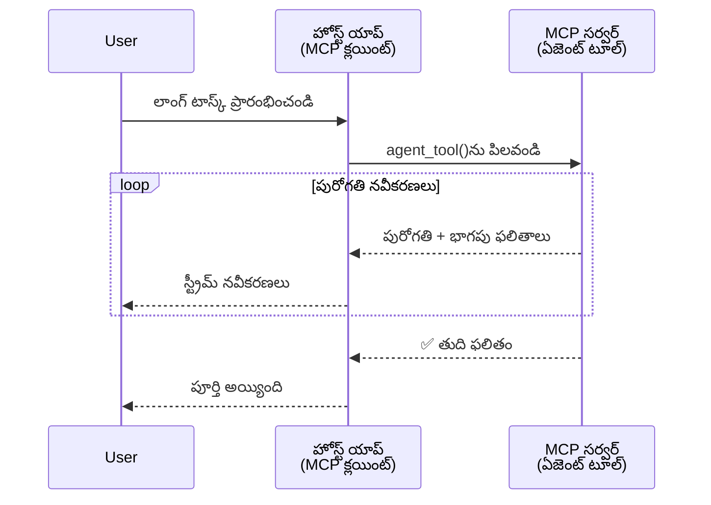
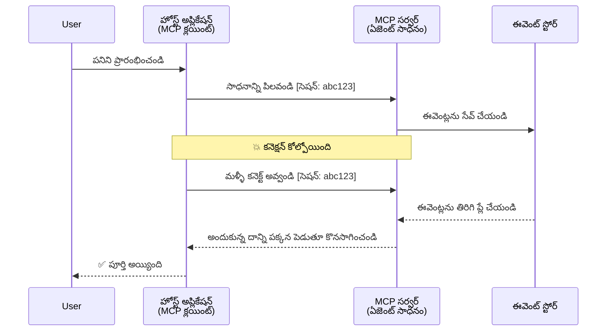
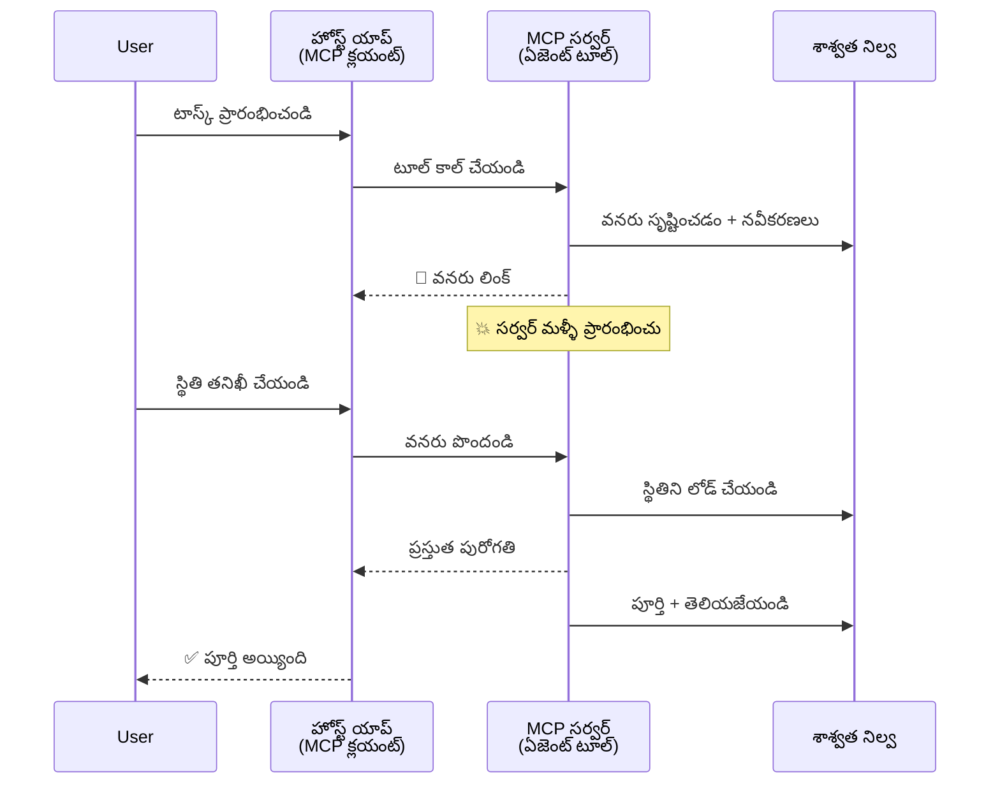
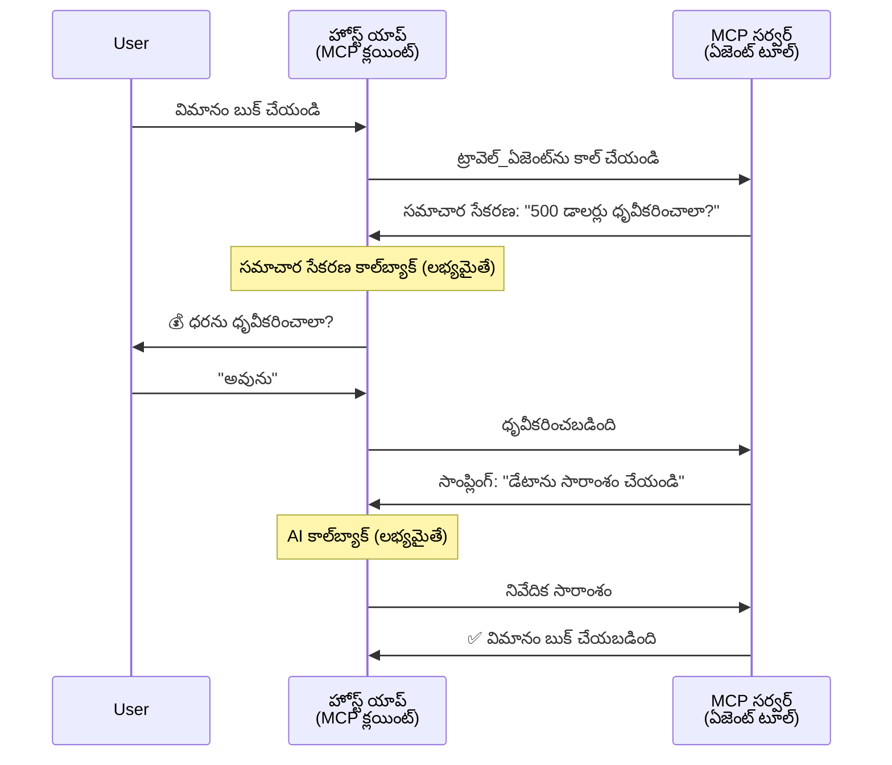
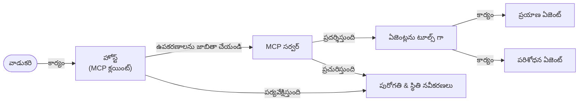

# MCPతో ఏజెంట్-టు-ఏజెంట్ కమ్యూనికేషన్ సిస్టమ్స్ నిర్మాణం

> TL;DR - మీరు MCPపై ఏజెంట్2ఏజెంట్ కమ్యూనికేషన్‌ని నిర్మించగలరా? అవును!

MCP "LLMలకు సందర్భం అందించడం" అనే ఆరంభ లక్ష్యాన్ని దాటి విపులంగా అభివృద్ధి అయింది. [రీసూమబుల్ స్ట్రీమ్స్](https://modelcontextprotocol.io/docs/concepts/transports#resumability-and-redelivery), [ఎలిసిటేషన్](https://modelcontextprotocol.io/specification/2025-06-18/client/elicitation), [సాంప్లింగ్](https://modelcontextprotocol.io/specification/2025-06-18/client/sampling), మరియు నోటిఫికేషన్స్ ([ప్రోగ్రెస్](https://modelcontextprotocol.io/specification/2025-06-18/basic/utilities/progress) మరియు [సంసంధన](https://modelcontextprotocol.io/specification/2025-06-18/schema#resourceupdatednotification)) వంటి తాజా మెరుగుదలలతో, MCP జటిలమైన ఏజెంట్-టు-ఏజెంట్ కమ్యూనికేషన్ సిస్టమ్స్ నిర్మాణానికి బలమైన పునాది అందిస్తుంది.

## ఏజెంట్/టూల్ యొక్క తప్పుదృష్టి

ఏజెంటిక్ ప్రవర్తనలు (దీర్ఘకాలం నడిచే, మధ్యలో అదనపు ఇన్‌పుట్ అవసరం కావచ్చు మొదలైనవి) ఉన్న టూల్స్ పరిశీలించగల గుర్తింపు పెరుగుతున్నప్పటికీ, MCP అసమర్ధమైనదని భావించడం సాధారణ తప్పుదృష్టి, ఎందుకంటే ప్రారంభ టూల్ నమూనాలు సులభమైన అభ్యర్థన-PRస్పాన్స్ నమూనాలపై కేంద్రీకృతమైనవి.

ఈ అభిప్రాయం పాతది. MCP స్పెసిఫికేషన్ గత కొన్ని నెలల్లో దీర్ఘకాల ఏజెంటిక్ ప్రవర్తన నిర్మాణానికి విరామాలను మూసే సామర్థ్యాలతో విస్తృతంగా మెరుగుపడింది:

- **స్ట్రీమింగ్ & పార్టియల్ ఫలితాలు**: అమలు సమయంలో రియల్-టైమ్ ప్రగతి నవీకరణలు
- **రీసూమబిలిటీ**: క్లయింట్లు విచ్ఛిన్నం తర్వాత తిరిగి కనెక్ట్ అవ్వగలవు మరియు కొనసాగగలరు
- **దురబిలిటీ**: ఫలితాలు సర్వర్ రీస్టార్ట్‌లను దాటి నిలవగలవు (ఉదా: రిసోర్స్ లింక్స్ ద్వారా)
- **మల్టీ-టర్న్**: ఎలిసిటేషన్ మరియు సాంప్లింగ్ ద్వారా అమలు మధ్యలో పరస్పర ఇన్‌పుట్

ఈ ఫీచర్లను సంయోజించి సంక్లిష్ట ఏజెంటిక్ మరియు మల్టీ-ఏజెంట్ అప్లికేషన్‌లను MCP ప్రోటోకాల్ మీద అమలు చేయవచ్చు.

సూచనకు, ఏజెంట్ను MCP సర్వర్‌పై అందుబాటులో ఉన్న "టూల్"గా పిలుస్తాము. దీని అర్థం MCP సర్వర్‌తో సెషన్‌ను స్థాపించి ఏజెంట్ను కాల్ చేసుకునే MCP క్లయింట్ ను అమలు చేసే హోస్ట్ అప్లికేషన్ ఉండటం.

## MCP టూల్‌ను "ఏజెంటిక్" గా చేసే విషయం ఏమిటి?

అమలు ప్రారంభించే ముందు, దీర్ఘకాలం నడిచే ఏజెంట్లకు కావాల్సిన సరంజామా సామర్థ్యాలను స్థాపిద్దామని పరిశీలిద్దాం.

> దీర్ఘకాలం స్వతంత్రంగా పనిచేసే, బహుళ పరస్పర చర్యలు లేదా రియల్-టైమ్ ఫీడ్‌బ్యాక్ ఆధారంగా సవరణలు చేసుకునే సామర్థ్యం ఉన్న ఏజెంట్నే ఏజెంట్ అని నిర్వచిస్తాము.

### 1. స్ట్రీమింగ్ & పార్టియల్ ఫలితాలు

సాంప్రదాయ అభ్యర్థన-ప్రతిస్పందన నమూనాలు దీర్ఘకాల టాస్కులకు సరియైనవి కావు. ఏజెంట్లు అందించవలసిన వాటి:

- రియల్-టైమ్ ప్రగతి నవీకరణలు
- మధ్యంతర ఫలితాలు

**MCP మద్దతు**: రిసోర్స్ అప్‌డేట్ నోటిఫికేషన్స్ స్ట్రీమింగ్ పార్టియల్ ఫలితాలను అనుమతిస్తాయి, కాని JSON-RPC 1:1 అభ్యర్థన/ప్రతిస్పందన మోడల్‌తో సంకర్షణ నివారించేందుకు జాగ్రత్త అవసరం.

| ఫీచర్                    | వాడుక సందర్భం                                                                                                                                                                         | MCP మద్దతు                                                                              |
| ------------------------- | -------------------------------------------------------------------------------------------------------------------------------------------------------------------------------------- | ---------------------------------------------------------------------------------------- |
| రియల్-టైమ్ ప్రగతి నవీకరణలు | యూజరు కోడ్‌బేస్ మైగ్రేషన్ టాస్క్‌ని అభ్యర్థిస్తాడు. ఏజెంట్ ప్రగతిని స్ట్రీమ్ చేస్తుంది: "10% - డిపెండెన్సీల విశ్లేషణ... 25% - టైప్‌ స్క్రిప్ట్ ఫైళ్ళ మార్పిడి... 50% - ఇంపోర్ట్స్ నవీకరణ..."        | ✅ ప్రగతి నోటిఫికేషన్స్                                                                  |
| పార్టియల్ ఫలితాలు          | "బుక్ తయారీ" టాస్క్ పార్టియల్ ఫలితాలను స్ట్రీమ్ చేస్తుంది, ఉదా: 1) కథ సారాంశ రూపరేఖ, 2) అధ్యాయాల జాబితా, 3) ప్రతి అధ్యాయం పూర్తైనట్లు. హోస్ట్ ఎటువంటి దశలోనైనా పరిశీలించవచ్చు, రద్దు చేయవచ్చు లేదా మార్గదర్శనం చేయవచ్చు. | ✅ నోటిఫికేషన్స్‌ను "ఎక్స్‌టెండ్" చేసి పార్టియల్ ఫలితాలను చేర్చవచ్చు PR 383, 776 ప్రపోజల్స్ చూడండి    |

<div align="center" style="font-style: italic; font-size: 0.95em; margin-bottom: 0.5em;">
<strong>ఫిగర్ 1:</strong> ఈ చార్ట్ MCP ఏజెంట్ దీర్ఘకాల టాస్క్ నిర్వహణ సమయంలో హోస్ట్ అప్లికేషన్‌కు రియల్-టైమ్ ప్రగతి నవీకరణలు మరియు పార్టియల్ ఫలితాలను స్ట్రీమ్ చేసే విధానాన్ని చూపుతుంది, తద్వారా యూజరు అమలును ప్రత్యక్షంగా పర్యవేక్షించగలడు.
</div>



### 2. రీసూమబిలిటీ

ఏజెంట్లు నెట్‌వర్క్ అంతరాయాలను జాగ్రత్తగా నిర్వహించాలి:

- (క్లయింట్) విచ్ఛిన్నం తర్వాత తిరిగి కనెక్ట్ కావడం
- విరామం వచ్చిన చోట నుండి కొనసాగడం (మెసేజ్ రీడెలివరీ)

**MCP మద్దతు**: MCP StreamableHTTP ట్రాన్స్‌పోర్ట్ ఈరోజు సెషన్ రీసంప్షన్ మరియు సెషన్ IDలు మరియు లాస్ట్ ఈవెంట్ IDలతో మెసేజ్ రీడెలివరీని మద్దతు ఇస్తుంది. ముఖ్యంగా సర్వర్ ఈవెంట్ రీప్లేలను క్లయింట్ రీకనెక్ట్ సమయంలో సాధ్యమయ్యేలా EventStoreని అమలు చేయాలి.
ఒక కమ్యూనిటీ ప్రతిపాదన (PR #975) ట్రాన్స్‌పోర్ట్ అగ్నాస్టిక్ రీసూమబుల్ స్ట్రీమ్స్‌ను పరిశీలిస్తోంది.

| ఫీచర్       | వాడుక సందర్భం                                                                                                                                                        | MCP మద్దతు                                                            |
| ------------ | ------------------------------------------------------------------------------------------------------------------------------------------------------------------- | -------------------------------------------------------------------- |
| రీసూమబిలిటీ | క్లయింట్ దీర్ఘకాల టాస్క్ సమయంలో విచ్ఛిన్నమవుతాడు. తిరిగి కనెక్ట్ అయినప్పుడు, సెషన్ రీసుమ్ అవుతుంది, మిస్సయిన ఈవెంట్లు పునఃప్రదర్శించబడతాయి, వంతరిది అక్కడినుండి నిరవధికంగా కొనసాగుతుంది. | ✅ సెషన్ IDలు, ఈవెంట్ రీప్లే మరియు EventStoreతో StreamableHTTP ట్రాన్స్‌పోర్ట్ |

<div align="center" style="font-style: italic; font-size: 0.95em; margin-bottom: 0.5em;">
<strong>ఫిగర్ 2:</strong> ఈ చార్ట్ MCP స్ట్రీమబుల్HTTP ట్రాన్స్‌పోర్ట్ మరియు ఈవెంట్ స్టోర్ ఎలా సజావుగా సెషన్ రీసుప్షన్‌ను అందిస్తాయో చూపిస్తుంది: క్లయింట్ డిస్కనెక్ట్ అయితే, తిరిగి కనెక్ట్ అయి మిస్సయిన ఈవెంట్లను పునఃప్రదర్శించుకొని టాస్క్‌ను కొనసాగిస్తుంది.
</div>



### 3. దురబిలిటీ

దీర్ఘకాల ఏజెంట్లు దీర్ఘకాల స్థితిని కోరుకుంటారు:

- ఫలితాలు సర్వర్ రీస్టార్ట్‌లని దాటిపోతాయి
- స్థితిని బ్యాండ్ బహిష్కరణలో పొందవచ్చు
- సెషన్లు వ్యాపించి ప్రగతి ట్రాకింగ్

**MCP మద్దతు**: MCP ఇప్పుడు టూల్ కాల్స్ కోసం రిసోర్స్ లింక్ రిటర్న్ రకం మద్దతు ఇస్తుంది. సాధారణ నమూనా ఒక టూల్ రిసోర్స్ సృష్టించి వెంటనే రిసోర్స్ లింక్ ఇచ్చే విధంగా రూపకల్పన చేయడం. టూల్ నేపధ్యంలో టాస్క్‌ను కొనసాగించి, ఆ రిసోర్స్‌ను నవీకరిస్తుంది. క్లయింట్ ఆ రిసోర్స్ స్థితిని పల్లింగ్ చేసి పార్టియల్ లేదా పూర్తి ఫలితాలు (సర్వర్ అందించే రిసోర్స్ అప్‌డేట్ల ఆధారంగా) పొందడమో లేదా అప్‌డేట్ నోటిఫికేషన్స్ కోసం రిసోర్స్‌కు సభ్యత్వం తీసుకోవడమో ఎంచుకోవచ్చు.

ఇక్కడ ఒక పరిమితి ఏమిటంటే, రిసోర్సులను పల్లింగ్ చేయడం లేదా అప్‌డేట్ల కోసం సభ్యత్వం తీసుకోడం పెద్ద ఎత్తున వనరులను వినియోగించవచ్చు. కమ్యూనిటీ ప్రతిపాదన (ప్రతి #992 సహా) వెబ్‌హుక్స్ లేదా ట్రిగర్స్ సర్వర్ వాటిని కాల్ చేసి క్లయింట్/హోస్ట్ అప్లికేషన్‌ను నవీకరిస్తేనా అనే విషయాన్ని పరిశీలిస్తోంది.

| ఫీచర్     | వాడుక సందర్భం                                                                                                                              | MCP మద్దతు                                                      |
| ---------- | ----------------------------------------------------------------------------------------------------------------------------------------- | ---------------------------------------------------------------- |
| దురబిలిటీ  | డేటా మైగ్రేషన్ టాస్క్ సమయంలో సర్వర్ క్రాష్ అవుతుంది. ఫలితాలు మరియు ప్రగతి రీస్టార్టును దాటి నిలుస్తాయి, క్లయింట్ స్థితిని తనిఖీ చేసి నిరవధిక రిసోర్స్ నుంచి కొనసాగుతుంది. | ✅ పర్సిస్టెంట్ నిల్వ మరియు స్థితి నోటిఫికేషన్స్‌తో రిసోర్స్ లింకులు |

ఈ రోజు సాధారణ నమూనా ఒక టూల్ రిసోర్స్ సృష్టించి వెంటనే రిసోర్స్ లింక్ ఇస్తుంది. టూల్ నేపథ్యంలో టాస్క్‌ను కొనసాగించి, రిసోర్స్ నోటిఫికేషన్స్ ద్వారా ప్రగతి నవీకరణలు లేదా పార్టియల్ ఫలితాలను అస్సలు చేస్తుంది, అవసరమైతే రిసోర్స్ కంటెంట్‌ను నవీకరిస్తుంది.

<div align="center" style="font-style: italic; font-size: 0.95em; margin-bottom: 0.5em;">
<strong>ఫిగర్ 3:</strong> ఈ చార్ట్ MCP ఏజెంట్‌లు దీర్ఘకాల టాస్కులు సర్వర్ రీస్టార్ట్‌లు దాటేలా నిరంతర వనరులు మరియు స్థితి నోటిఫికేషన్లను ఎలా ఉపయోగిస్తాయో వివరించబడింది, క్లయింట్లు ప్రగతిని తనిఖీ చేసి విఫలాల తర్వాత కూడా ఫలితాలు పొందగలుగుతారు.
</div>



### 4. మల్టీ-టర్న్ పరస్పర చర్యలు

ఏజెంట్లు తరచుగా అమలు మధ్య అదనపు ఇన్‌పుట్ అవసరం పడుతుంది:

- మానవ స్పష్టీకరణ లేదా ఆమోదం
- కాంప్లెక్స్ నిర్ణయాల కోసం AI సాయం
- డయనమిక్ పారామీటర్ సర్దుబాటు

**MCP మద్దతు**: సాంప్లింగ్ (AI ఇన్‌పుట్ కోసం) మరియు ఎలిసిటేషన్ (మానవ ఇన్‌పుట్ కోసం) ద్వారా పూర్తి మద్దతు.

| ఫీచర్                 | వాడుక సందర్భం                                                                                                                                    | MCP మద్దతు                                              |
| ----------------------- | ------------------------------------------------------------------------------------------------------------------------------------------------- | --------------------------------------------------------- |
| మల్టీ టర్న్ పరస్పర చర్యలు | ట్రావెల్ బుకింగ్ ఏజెంట్ యూజర్ నుంచి ధర నిర్ధారణ కోరుతుంది, తరువాత ఆ ట్రావెల్ డేటా సారాంశం తయారుచేయమని AI కి అడుగుతుంది, ఆ తరువాత బుకింగ్ పూర్తిచేస్తుంది. | ✅ మానవ ఇన్‌పుట్ కోసం ఎలిసిటేషన్, AI ఇన్‌పుట్ కోసం సాంప్లింగ్ |

<div align="center" style="font-style: italic; font-size: 0.95em; margin-bottom: 0.5em;">
<strong>ఫిగర్ 4:</strong> ఈ చార్ట్ MCP ఏజెంట్‌లు ఎలా ఇంటరాక్టివ్ మానవ ఇన్‌పుట్ లేదా అమలు మధ్య AI సహాయాన్ని కోరగలరో, కాంప్లెక్స్ మల్టీ-టర్న్ వర్క్‌ఫ్లోలను (ధృవీకరణలు మరియు డైనమిక్ నిర్ణయాల వంటి) మద్దతు ఇస్తుందో చూపిస్తుంది.
</div>



## MCPపై దీర్ఘకాల ఏజెంట్ల అమలు - కోడ్ అవలోకనం

ఈ వ్యాస భాగంగా, MCP పython SDK మరియు StreamableHTTP ట్రాన్స్‌పోర్ట్‌తో సెషన్ రీసంప్షన్ మరియు మెసేజ్ రీడెలివరీ కలిగి దీర్ఘకాల ఏజెంట్ల పూర్తి అమలు ఉన్న [కోడ్ రిపోజిటరీ](https://github.com/victordibia/ai-tutorials/tree/main/MCP%20Agents)ని అందిస్తున్నాము. ఈ అమలు MCP సామర్థ్యాలను సంయోజించి నిపుణ ఏజెంట్‌ల వంటి ప్రవర్తనలు సాధ్యమయ్యే విధంగా చూపిస్తుంది.

ప్రత్యేకంగా, మేము రెండు ప్రధాన ఏజెంట్ టూల్స్ ఉన్న సర్వర్‌ను అమలు చేస్తాము:

- **ట్రావెల్ ఏజెంట్** - ఎలిసిటేషన్ ద్వారా ధర నిర్ధారణతో ట్రావెల్ బుకింగ్ సేవను అనుకరిస్తుంది
- **రిసెర్చ్ ఏజెంట్** - సాంప్లింగ్ ద్వారా AI సహాయంతో పరిశోధన పనులు నిర్వహిస్తుంది

ఈ రెండు ఏజెంట్‌లు రియల్-టైమ్ ప్రగతి నవీకరణలు, ఇంటరాక్టివ్ ధృవీకరణలు మరియు పూర్తి సెషన్ రీసంప్షన్ సామర్థ్యాలను ప్రదర్శిస్తాయి.

### ముఖ్య అమలు భావనలు

క్రింది సెభ్‌లు ప్రతి సామర్థ్యానికి సర్వర్-పక్ష ఏజెంట్ అమలు మరియు క్లయింట్-పక్ష హోస్ట్ నిర్వహణను చూపుతున్నాయి:

#### స్ట్రీమింగ్ & ప్రగతి నవీకరణలు - రియల్-టైమ్ టాస్క్ స్థితి

స్ట్రీమింగ్ ఏజెంట్‌లకు దీర్ఘకాల టాస్క్‌లు సందర్భంగా రియల్-టైమ్ ప్రగతి నవీకరణలు అందించడానికి అనుమతిస్తుంది, యూజర్లను టాస్క్ స్థితి మరియు మధ్యంతర ఫలితాలపై అప్డేట్ చేస్తూ.

**సర్వర్ అమలు (ఏజెంట్ ప్రగతి నోటిఫికేషన్లు పంపడం):**

```python
# server/server.py నుండి - ప్రయాణ ఏజెంట్ ప్రగతి అప్‌డేట్లను పంపుతుంది
for i, step in enumerate(steps):
    await ctx.session.send_progress_notification(
        progress_token=ctx.request_id,
        progress=i * 25,
        total=100,
        message=step,
        related_request_id=str(ctx.request_id)
    )
    await anyio.sleep(2)  # పనిని అనుకరించు

# ప్రత్యామ్నాయం: వివరమైన దశల వారీ అప్‌డేట్‌ల కోసం సందేశాలను లాగ్ చేయండి
await ctx.session.send_log_message(
    level="info",
    data=f"Processing step {current_step}/{steps} ({progress_percent}%)",
    logger="long_running_agent",
    related_request_id=ctx.request_id,
)
```

**క్లయింట్ అమలు (హోస్ట్ ప్రగతి నవీకరణలు అందుకోవడం):**

```python
# client/client.py నుండి - తక్షణ సమాచారం నిర్వహించే క్లయింట్
async def message_handler(message) -> None:
    if isinstance(message, types.ServerNotification):
        if isinstance(message.root, types.LoggingMessageNotification):
            console.print(f"📡 [dim]{message.root.params.data}[/dim]")
        elif isinstance(message.root, types.ProgressNotification):
            progress = message.root.params
            console.print(f"🔄 [yellow]{progress.message} ({progress.progress}/{progress.total})[/yellow]")

# సెషన్ సృష్టించినప్పుడు సందేశ హ్యాండ్లర్‌ను నమోదు చేయండి
async with ClientSession(
    read_stream, write_stream,
    message_handler=message_handler
) as session:
```

#### ఎలిసిటేషన్ - యూజర్ ఇన్‌పుట్ అడగడం

ఎలిసిటేషన్ ఏజెంట్‌లకు అమలు మధ్య యూజర్ ఇన్‌పుట్ కోరడానికి అనుమతిస్తుంది. దీర్ఘకాల టాస్కులు సమయంలో ధృవీకరణలు, స్పష్టతలు లేదా ఆమోదాలకు ఇది అవసరం.

**సర్వర్ అమలు (ఏజెంట్ ధృవీకరణ కోరడం):**

```python
# సర్వర్/server.py నుండి - ప్రయాణ ఏజెంట్ ధర నిర్ధారణను అభ్యర్థిస్తోంది
elicit_result = await ctx.session.elicit(
    message=f"Please confirm the estimated price of $1200 for your trip to {destination}",
    requestedSchema=PriceConfirmationSchema.model_json_schema(),
    related_request_id=ctx.request_id,
)

if elicit_result and elicit_result.action == "accept":
    # బుకింగ్‌తో కొనసాగించండి
    logger.info(f"User confirmed price: {elicit_result.content}")
elif elicit_result and elicit_result.action == "decline":
    # బుకింగ్ రద్దు చేయండి
    booking_cancelled = True
```

**క్లయింట్ అమలు (హోస్ట్ ఎలిసిటేషన్ కాల్‌బ్యాక్ అందించడం):**

```python
# client/client.py నుండి - క్లయింట్ హ్యాండ్లింగ్ elicitation రిక్వెస్టులు
async def elicitation_callback(context, params):
    console.print(f"💬 Server is asking for confirmation:")
    console.print(f"   {params.message}")

    response = console.input("Do you accept? (y/n): ").strip().lower()

    if response in ['y', 'yes']:
        return types.ElicitResult(
            action="accept",
            content={"confirm": True, "notes": "Confirmed by user"}
        )
    else:
        return types.ElicitResult(
            action="decline",
            content={"confirm": False, "notes": "Declined by user"}
        )

# సేషను సృష్టించినప్పుడు కాల్‌బ్యాక్‌ను నమోదు చేయండి
async with ClientSession(
    read_stream, write_stream,
    elicitation_callback=elicitation_callback
) as session:
```

#### సాంప్లింగ్ - AI సహాయం అడగడం

సాంప్లింగ్ ఏజెంట్‌లకు అమలు సమయంలో కాంప్లెక్స్ నిర్ణయాలు లేదా కంటెంట్ సృష్టికి LLM సహాయం కోరడానికి అనుమతిస్తుంది. ఇది మానవ-AI మిశ్రమ వర్క్‌ఫ్లోలను సాధ్యమే చేస్తుంది.

**సర్వర్ అమలు (ఏజెంట్ AI సహాయం కోరడం):**

```python
# సర్వర్/server.py నుండి - పరిశోధన ఏజెంట్ AI సారాంశం కోరుకుంటున్నారు
sampling_result = await ctx.session.create_message(
    messages=[
        SamplingMessage(
            role="user",
            content=TextContent(type="text", text=f"Please summarize the key findings for research on: {topic}")
        )
    ],
    max_tokens=100,
    related_request_id=ctx.request_id,
)

if sampling_result and sampling_result.content:
    if sampling_result.content.type == "text":
        sampling_summary = sampling_result.content.text
        logger.info(f"Received sampling summary: {sampling_summary}")
```

**క్లయింట్ అమలు (హోస్ట్ సాంప్లింగ్ కాల్‌బ్యాక్ అందించడం):**

```python
# client/client.py నుండి - క్లయింట్ శాంప్లింగ్ అభ్యర్థనలను నిర్వహించడం
async def sampling_callback(context, params):
    message_text = params.messages[0].content.text if params.messages else 'No message'
    console.print(f"🧠 Server requested sampling: {message_text}")

    # వాస్తవ అప్లికేషన్‌లో, ఇది LLM APIని పిలవవచ్చు
    # డెమో ఉద్దేశ్యాల కోసం, మేము ఒక మాక్ రెస్పాన్స్‌ను అందిస్తున్నాము
    mock_response = "Based on current research, MCP has evolved significantly..."

    return types.CreateMessageResult(
        role="assistant",
        content=types.TextContent(type="text", text=mock_response),
        model="interactive-client",
        stopReason="endTurn"
    )

# సెషన్ సృష్టించడం సమయంలో కాల్బ్యాక్‌ను నమోదు చేయండి
async with ClientSession(
    read_stream, write_stream,
    sampling_callback=sampling_callback,
    elicitation_callback=elicitation_callback
) as session:
```

#### రీసూమబిలిటీ - డిస్కనెక్షన్ల తర్వాత సెషన్ సతతత్వం

రీసూమబిలిటీ దీర్ఘకాల ఏజెంట్ టాస్కులు క్లయింట్ డిస్కనెక్షన్లను నిరబ్బంది తట్టుకుని తిరిగి కనెక్ట్ అయినపుడు సజావుగా కొనసాగడానికి సహాయపడుతుంది. ఇది ఈవెంట్ స్టోర్స్ మరియు రీసంప్షన్ టోకెన్ల ద్వారా అమలు అవుతుంది.

**ఈవెంట్ స్టోర్ అమలు (సర్వర్ సెషన్ స్థితి నిల్వ):**

```python
# server/event_store.py నుండి - సులభమైన మెమరీలో ఈవెంట్ స్టోర్
class SimpleEventStore(EventStore):
    def __init__(self):
        self._events: list[tuple[StreamId, EventId, JSONRPCMessage]] = []
        self._event_id_counter = 0

    async def store_event(self, stream_id: StreamId, message: JSONRPCMessage) -> EventId:
        """Store an event and return its ID."""
        self._event_id_counter += 1
        event_id = str(self._event_id_counter)
        self._events.append((stream_id, event_id, message))
        return event_id

    async def replay_events_after(self, last_event_id: EventId, send_callback: EventCallback) -> StreamId | None:
        """Replay events after the specified ID for resumption."""
        # చివరి తెలిసిన ఈవెంట్ తరువాత ఈవెంట్లను కనని మరియు మళ్ళీ ఆడండి
        for _, event_id, message in self._events[start_index:]:
            await send_callback(EventMessage(message, event_id))

# server/server.py నుండి - ఈవెంట్ స్టోర్‌ని సెషన్ మేనేజర్‌కు పంపించడం
def create_server_app(event_store: Optional[EventStore] = None) -> Starlette:
    server = ResumableServer()

    # సెషన్ పునఃప్రారంభానికి ఈవెంట్ స్టోర్‌తో సెషన్ మేనేజర్ సృష్టించండి
    session_manager = StreamableHTTPSessionManager(
        app=server,
        event_store=event_store,  # ఈవెంట్ స్టోర్ సెషన్ పునఃప్రారంభానికి సహాయపడుతుంది
        json_response=False,
        security_settings=security_settings,
    )

    return Starlette(routes=[Mount("/mcp", app=session_manager.handle_request)])

# ఉపయోగం: ఈవెంట్ స్టోర్‌తో ప్రారంభించండి
event_store = SimpleEventStore()
app = create_server_app(event_store)
```

**క్లయింట్ మెటాడేటా రీసంప్షన్ టోకెన్‌తో (సేవ్ చేసిన రాష్ట్రంతో తిరిగి కనెక్ట్ అవుతుంది):**

```python
# client/client.py నుండి - మెటాడేటాతో క్లయింట్ రిసంప్షన్
if existing_tokens and existing_tokens.get("resumption_token"):
    # మిగిలిన కార్యాచరణను కొనసాగించేందుకు ఉన్న రిసంప్షన్ టోకెన్ ఉపయోగించండి
    metadata = ClientMessageMetadata(
        resumption_token=existing_tokens["resumption_token"],
    )
else:
    # రిసంప్షన్ టోకెన్ అందినప్పుడు దాన్ని సేవ్ చేయడానికి కాల్‌బ్యాక్ సృష్టించండి
    def enhanced_callback(token: str):
        protocol_version = getattr(session, 'protocol_version', None)
        token_manager.save_tokens(session_id, token, protocol_version, command, args)

    metadata = ClientMessageMetadata(
        on_resumption_token_update=enhanced_callback,
    )

# రిసంప్షన్ మెటాడేటాతో అభ్యర్థన పంపండి
result = await session.send_request(
    types.ClientRequest(
        types.CallToolRequest(
            method="tools/call",
            params=types.CallToolRequestParams(name=command, arguments=args)
        )
    ),
    types.CallToolResult,
    metadata=metadata,
)
```

హోస్ట్ అప్లికేషన్ సెషన్ IDలు మరియు రీసంప్షన్ టోకెన్లను లోకల్‌గా నిర్వహించి ప్రగతి లేదా స్థితి కోల్పోకుండా ఉన్న సెషన్‌లకు తిరిగి కనెక్ట్ అవుతుంది.

### కోడ్ సంస్ధానం

<div align="center" style="font-style: italic; font-size: 0.95em; margin-bottom: 0.5em;">
<strong>ఫిగర్ 5:</strong> MCP ఆధారిత ఏజెంట్ సిస్టమ్ నిర్మాణం
</div>



**ప్రధాన ఫైళ్లు:**

- **`server/server.py`** - ట్రావెల్ మరియు రిసెర్చ్ ఏజెంట్‌లతో రీసూమబుల్ MCP సర్వర్, ఎలిసిటేషన్, సాంప్లింగ్, ప్రగతి నవీకరణలను ప్రదర్శించే
- **`client/client.py`** - రీసంప్షన్ మద్దతు, కాల్‌బ్యాక్ హ్యాండ్లర్‌లు మరియు టోకెన్ నిర్వహణతో ఇంటరాక్టివ్ హోస్ట్ అప్లికేషన్
- **`server/event_store.py`** - సెషన్ రీసంప్షన్ మరియు మెసేజ్ రీడెలివరీని సహాయపడే ఈవెంట్ స్టోర్ అమలు

## MCPపై మల్టీ-ఏజెంట్ కమ్యూనికేషన్‌కు విస్తరణ

పై అమలు హోస్ట్ అప్లికేషన్ యొక్క బుద్ధిమత్తను మరియు పరిధిని పెంచడం ద్వారా మల్టీ-ఏజెంట్ సిస్టమ్స్‌కు విస్తరించవచ్చు:

- **బుద్ధిమత్పూర్వక టాస్క్ విడదీయడం**: హోస్ట్ సంక్లిష్ట యూజర్ అభ్యర్థనలను విశ్లేషించి వివిధ నైపుణ్యాల ఏజెంట్లకు ఉపటాస్కులుగా విభజిస్తుంది
- **మల్టీ-సర్వర్ సమన్వయం**: హోస్ట్ అనేక MCP సర్వర్లకు కనెక్ట్ అయి వాటిలో వేర్వేరు ఏజెంట్ సామర్థ్యాలను ప్రదర్శిస్తుంది
- **టాస్క్ స్థితి నిర్వహణ**: హోస్ట్ అనేక ఏజెంట్ టాస్కుల ప్రగతిని ట్రాక్ చేసి ఆధారాలు మరియు శ్రేణీకరణ నిర్వహిస్తుంది
- **దృఢత్వం & రీట్రైలు**: ఏజెంట్లు అందుబాటులో లేకపోతే విఫలాలను నిర్వహించి, తిరిగి ప్రయత్నాలు అమలు చేసి, టాస్కులను మళ్లీ మార్గదర్శనం చేస్తుంది
- **ఫలితాల సంకలనం**: అనేక ఏజెంట్ల నుండి వచ్చిన అవుట్‌పుట్లను సమగ్రమైన తుది ఫలితాలుగా కలుపుతుంది

హోస్ట్ సాదా క్లయింట్ నుండి బుద్ధిమంత నిర్వహణకారుడిగా మారి వ్యాప్తి జరిగిన ఏజెంట్ సామర్థ్యాలను సమన్వయపరుచుకుంటూ అదే MCP ప్రోటోకాల్ ఆధ్యాత్మికతను పాటిస్తుంది.

## ముగింపు

MCP వినియోగాల మెరుగుదలలు - రిసోర్స్ నోటిఫికేషన్స్, ఎలిసిటేషన్/సాంప్లింగ్, రీసూమబుల్ స్ట్రీమ్స్ మరియు పర్సిస్టెంట్ రిసోర్స్‌లు - ప్రోటోకాల్ సరళతను ఉంచుకుని సంక్లిష్ట ఏజెంట్-టు-ఏజెంట్ పరస్పర చర్యలను అనుమతిస్తుంది.

## ప్రారంభించడం

మీ స్వంత ఏజెంట్2ఏజెంట్ సిస్టమ్ నిర్మించడానికి సిద్ధంగా ఉన్నారా? ఈ దశలను అనుసరించండి:

### 1. డెమో అమలు చేయండి

```bash
# రిజంప్షన్ కోసం ఈవెంట్ స్టోర్‌తో సర్వర్ ప్రారంభించండి
python -m server.server --port 8006

# మరో టెర్మినల్‌లో, ఇంటరాక్టివ్ కస్టమర్‌ను నడపండి
python -m client.client --url http://127.0.0.1:8006/mcp
```

**ఇంటరాక్టివ్ మోడ్‌లో అందుబాటులో ఉన్న కమాండ్లు:**

- `travel_agent` - ఎలిసిటేషన్ ద్వారా ధర నిర్ధారణతో ట్రావెల్ బుక్ చేయండి
- `research_agent` - సాంప్లింగ్ ద్వారా AI సహాయంతో పరిశోధన అంశాలు
- `list` - అందుబాటులో ఉన్న అన్ని టూల్‌లను చూపించు
- `clean-tokens` - రీసంప్షన్ టోకెన్లను క్లీన్ చేయండి
- `help` - వివరణాత్మక కమాండ్ సహాయం చూపించు
- `quit` - క్లయింట్‌ను వదిలివేయండి

### 2. రీసంప్షన్ సామర్థ్యాలను పరీక్షించండి

- దీర్ఘకాల ఏజెంట్‌ను ప్రారంభించండి (ఉదా: `travel_agent`)
- అమలు సమయంలో క్లయింట్‌ను విరమించండి (Ctrl+C)
- క్లయింట్‌ను రీస్టార్ట్ చేయండి - ఇది ఆటోమేటిక్‌గా మధ్యలో నుంచి కొనసాగుతుంది

### 3. అన్వేషించండి మరియు విస్తరించండి

- **ఉదాహరణలను అన్వేషించండి**: ఈ [mcp-agents](https://github.com/victordibia/ai-tutorials/tree/main/MCP%20Agents) చూడండి
- **కమ్యూనిటీలో చేరండి**: GitHubలో MCP చర్చల్లో పాల్గొనండి
- **ప్రయోగం చేయండి**: ఒక సాధారణ దీర్ఘకాల టాస్క్‌తో ప్రారంభించి స్ట్రీమింగ్, రీసూమబిలిటీ, మల్టీ-ఏజెంట్ సమన్వయాన్ని దశలవారీగా జోడించండి

ఇది MCP టూల్ ఆధారిత సరళతను ఉంచుకుని తెలివైన ఏజెంట్ ప్రవర్తనలను ఎలా సాధ్యమవుతాయో చూపిస్తుంది.

మొత్తం MCP ప్రోటోకాల్ స్పెసిఫికేషన్ వేగంగా అభివృద్ధి చెందుతోంది; చదివే వారు తాజా అప్‌డేట్ల కోసం అధికారిక డాక్యుమెంటేషన్ వెబ్సైట్‌ను సరిచూసుకోవాలని సూచన.

---

<!-- CO-OP TRANSLATOR DISCLAIMER START -->
**అస్వీకరణ**:
ఈ పత్రం AI అనువాద సేవ [Co-op Translator](https://github.com/Azure/co-op-translator) ఉపయోగించి అనువదించబడింది. మేము ఖచ్చితత్వానికి ప్రయత్నిస్తున్నప్పటికీ, ఆటోమేటెడ్ అనువాదాలు తప్పులు లేదా అసమగ్రతలను కలిగి ఉండవచ్చు. దాని స్వదేశ భాషలో ఉన్న అసలు పత్రాన్ని అధికారం కలిగిన మూలంగా పరిగణించాలి. కీలకమైన సమాచారం కోసం, ప్రొఫెషనల్ మానవ అనువాదాన్ని సిఫారసు చేస్తాము. ఈ అనువాదం ఉపయోగం వల్ల కలిగే ఏవైనా అపార్థాలు లేదా తప్పుదారులు కోసం మేము బాధ్యత వహించము.
<!-- CO-OP TRANSLATOR DISCLAIMER END -->