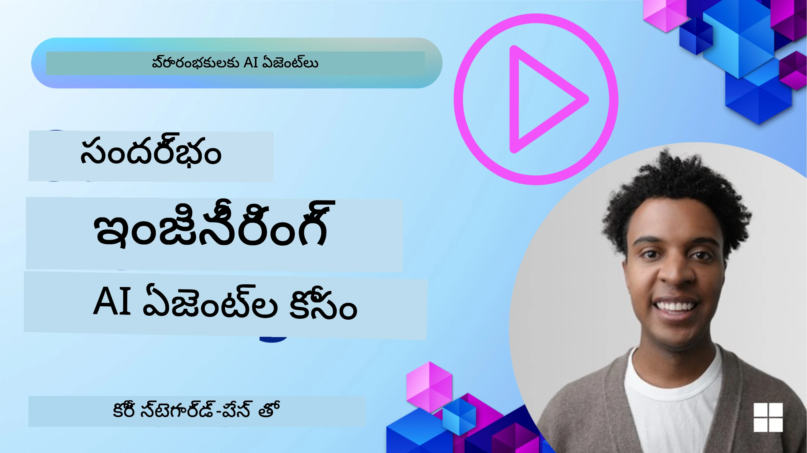
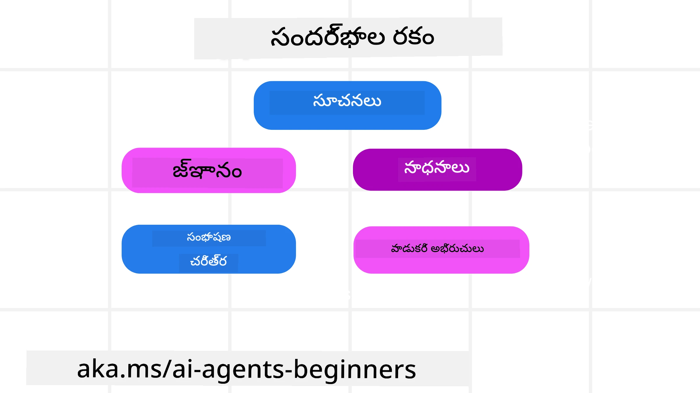
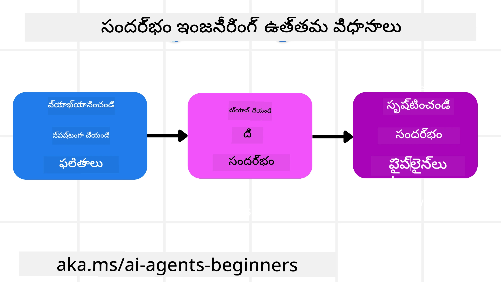

# AI ఏజెంట్స్ కోసం కంటెక్స్ట్ ఇంజనీరింగ్

> _(ఈ పాఠం వీడియోను చూడటానికి పై చిత్రాన్ని క్లిక్ చేయండి)_

మీరు ఒక AI ఏజెంట్ కోసం నిర్మిస్తున్న అప్లికేషన్ యొక్క సంక్లిష్టతను అర్థం చేసుకోవడం ఒక నమ్మదగిన ఏజెంట్‌ను తయారుచేసుకోవడానికి ముఖ్యం. ప్రాంప్ట్ ఇంజనీరింగ్ కంటే ఎందుకు ఎక్కువ అవసరాలున్నాయో ఆధారంగా సమాచారాన్ని సమర్థవంతంగా నిర్వహించే AI ఏజెంట్లను నిర్మించాలి.

ఈ పాఠంలో, మేము కంటెక్స్ట్ ఇంజనీరింగ్ అంటే ఏమిటి మరియు AI ఏజెంట్లు తయారీలో ఇది ఎంత ఉపయోగప్రదమో చూడబోతున్నాం.

## పరిచయం

ఈ పాఠం కవర్ చేయబోతుంది:

• **కంటెక్స్ట్ ఇంజనీరింగ్ అంటే ఏమిటి** మరియు ఇది ప్రాంప్ట్ ఇంజనీరింగ్ నుండి ఎందుకు భిన్నంగా ఉంటుందో.

• **సమర్థవంతమైన కంటెక్స్ట్ ఇంజనీరింగ్ కోసం వ్యూహాలు**, అందులో సమాచారాన్ని ఎలా రాయాలో, ఎలా ఎంపిక చేసుకోవాలో, ఎలా సంకుచితం చేయాలో, మరియు ఎలా విడదీయాలో వివరాలు.

• **సాధారణ కంటెక్స్ట్ వైఫల్యాలు** ఇవి మీ AI ఏజెంట్‌ను ఎలా దిరదరిస్తాయో మరియు వాటిని ఎలా పరిష్కరించాలో.

## నేర్చుకునే లక్ష్యాలు

ఈ పాఠం పూర్తి చేసిన తర్వాత, మీరు ఈ క్రిందివి ఎలా చేయాలో అర్థం చేసుకుంటారు:

• **కంటెక్స్ట్ ఇంజనీరింగ్‌ను నిర్వచించటం** మరియు దాన్ని ప్రాంప్ట్ ఇంజనీరింగ్ నుండి వేరుచేయటం.

• **LLM అప్లికేషన్లలో కంటెక్స్ట్ యొక్క కీలక భాగాలను గుర్తించడం.**

• **ఏజెంట్ పనితీరును మెరుగుపరిచేందుకు రాయడం, ఎంపిక చేయడం, సంకుచితం చేయడం, మరియు విడదీయడం వంటి కంటెక్స్ట్ వ్యూహాలను వర్తింపచేయడం.**

• **పాయిజనింగ్, దృష్టి విసుగు, గందరగోళం, మరియు ఘర్షణ వంటి సాధారణ కాంటెక్స్ట్ వైఫల్యాలను గుర్తించడం మరియు వాటిని తగ్గించే సాంకేతికతలను అమలు చేయడం.**

## కంటెక్స్ట్ ఇంజనీరింగ్ అంటే ఏమిటి?

AI ఏజెంట్ల కోసం, కంటెక్స్ట్ అనేది ఏజెంట్ నిర్దిష్ట చర్యలు తీసుకునే ప్లానింగ్‌ను నడిపే దాని. కంటెక్స్ట్ ఇంజనీరింగ్ అనేది ఏజెంట్‌కు ఆ పనిలో తదుపరి దశను పూర్తి చేయడానికి సరైన సమాచారం ఉందని నిర్ధారించే ప్రాక్టీస్. కంటెక్స్ట్ విండో పరిమిత పరిమాణంలో ఉంటుంది, కాబట్టి ఏజెంట్ బిల్డర్లుగా మనం కంటెక్స్ట్ విండోలో సమాచారాన్ని జోడించడం, తొలగించడం మరియు సంగ్రహించడం నిర్వహించడానికి సిస్టమ్స్ మరియు ప్రక్రియలను రూపొందించాలి.

### ప్రాంప్ట్ ఇంజనీరింగ్ vs కంటెక్స్ట్ ఇంజనీరింగ్

ప్రాంప్ట్ ఇంజనీరింగ్ ఒక స్థిరమైన set of instructions పై దృష్టి పెట్టి AI ఏజెంట్లను నియమాలతో సమర్థవంతంగా గైడ్ చేయడంపై ఎక్కువగా ఉండగా, కంటెక్స్ట్ ఇంజనీరింగ్ ఒక డైనమిక్ సమాచార సముదాయాన్ని, ప్రారంభ ప్రాంప్ట్ సహా, ఎలా నిర్వహించాలో చూపుతుంది ताकि AI ఏజెంట్‌కు కాలక్రమేణా అవసరమైన విషయం అందుబాటులో ఉందో లేదో ఖచ్చితంగా ఉండేది. కంటెక్స్ట్ ఇంజనీరింగ్ గురించి ప్రధాన ఆలోచన ఈ ప్రక్రియను పునరావృతం చేయగలిగే మరియు నమ్మకమైనదిగా చేసుకోవడం.

### కంటెక్స్ట్ రకాలు

కంటెక్స్ట్ ఒక్కటి మాత్రమే కాదు అనుకోకోవడం ముఖ్యము. ఏజెంట్‌కు అవసరమైన సమాచారం వివిధ మూలాల నుండి వచ్చే అవకాశముంది మరియు ఏజెంట్‌కు ఈ మూలాలకు యాక్సెస్ ఉండేలా చేయడం మన పని:

AI ఏజెంట్ నిర్వహించాల్సిన కంటెక్స్ట్ రకాలలో ఇవి ఉంటాయి:

• **సూచనలు:** ఇవి ఏజెంట్ యొక్క "నియమాల్లా" ఉంటాయి – ప్రాంప్టులు, సిస్టమ్ సందేశాలు, few-shot ఉదాహరణలు (ఏజెంట్‌ను ఎలా చేయాలో చూపించటం), మరియు అది ఉపయోగించగల సాధనాల వివరణలు. ఈ స్థలం ప్రాంప్ట్ ఇంజనీరింగ్ ధ్యాస మరియు కంటెక్స్ట్ ఇంజనీరింగ్ రెండింటి సమ్మిళితం చెయ్యబడే చోటు.

• **జ్ఞానం:** ఇది వాస్తవాలు, డేటాబేస్‌ల నుంచి తీసిన సమాచారము, లేదా ఏజెంట్ సేకరించిన దీర్ఘకాలిక గుర్తింపుల్ని కవర్ చేస్తుంది. ఇందులో ఏజెంట్‌కు వివిధ నుల(Store)లు మరియు డేటాబేస్‌లకు యాక్సెస్ అవసరమైతే Retrieval Augmented Generation (RAG) సిస్టమ్ ని ఒకటిగా చేర్చటం కూడా వస్తుంది.

• **సాధనాలు:** ఇవి ఏజెంటు పిలవగల బాహ్య ఫంక్షన్ల, APIలు మరియు MCP సర్వర్ల నిర్వచనాలు, వాటిని ఉపయోగించడం ద్వారా పొందిన ఫీడ్‌బ్యాక్ (ఫలితాలు) తో సహా ఉంటాయి.

• ** సంభాషణ చరిత్ర:** యూజర్‌తో జరుగుతున్న పరస్పర సంభాషణ. కాలంతో, ఈ సంభాషణలు ఎక్కువగా మరియు సంక్లిష్టంగా మారతాయి, అందువల్ల అవి కంటెక్స్ట్ విండోలో స్థలాన్ని తీసుకుంటాయి.

• **యూజర్ ప్రిఫరెన్సులు:** సమయానుసరణంగా యూజర్ యొక్క ఇష్టాలు లేదా ద్వేషాల గురించి తెలిసిన సమాచారం. కీలక నిర్ణయాలు తీసుకునేటప్పుడు ఇవి ఉపయోగపడటానికి నిల్వ చేయబడవచ్చు మరియు పిలవబడవచ్చు.

## సమర్థవంతమైన కంటెక్స్ట్ ఇంజనీరింగ్ కోసం వ్యూహాలు

### ప్లానింగ్ వ్యూహాలు

మంచి కంటెక్స్ట్ ఇంజనీరింగ్ మంచి ప్లానింగ్‌తో మొదలవుతుంది. కంటెక్స్ట్ ఇంజనీరింగ్ భావనను ఎట్లా వర్తింపచేసాలో యోచించడంలో మీకు సహాయపడే ఒక దృష్టికోణం ఇక్కడ ఉంది:

1. **స్పష్టమైన ఫలితాలను నిర్వచించండి** - AI ఏజెంట్లకు అప్పగించే పనుల ఫలితాలు స్పష్టంగా నిర్వచించబడాలి. ప్రశ్నకు జవాబు చెప్పండి - "ఏజెంట్ పని పూర్తి చేసిన తర్వాత ప్రపంచం ఎలా కనిపించాలి?" అంటే, యూజర్ AI ఏజెంట్‌తో పరస్పర చర్య చేసిన తర్వాత ఏ మార్పు, సమాచారం, లేదా ప్రతిస్పందన ఉండాలి.

2. **కంటెక్స్ట్‌ని మ్యాప్ చేయండి** - ఒకసారి మీరు ఏజెంట్ ఫలితాలను నిర్వచించిన తర్వాత, "ఈ పని పూర్తి చేయడానికి ఏజెంట్‌కు ఏ సమాచారం అవసరమ?" అన్న ప్రశ్నకు జవాబు చెప్పాలి. ఇలా చేసేటప్పుడు ఆ సమాచారం ఏల్లా ఉండొచ్చో కంటెక్స్ట్ మ్యాప్ చేయచ్చును.

3. **కంటెక్స్ట్ పైప్లైన్‌లు సృష్టించండి** - ఇప్పుడు సమాచారం ఎక్కడుందో తెలుసుకున్నట్లయితే, "ఏజెంట్ ఆ సమాచారాన్ని ఎలా పొందుతుంది?" అన్న ప్రశ్నకు సమాధానం ఇవ్వాలి. ఇది RAG ఉపయోగించడం, MCP సర్వర్స్ మరియు ఇతర సాధనాల వినియోగం వంటి వివిధ మార్గాల్లో చేయవచ్చు.

### ప్రయోగాత్మక వ్యూహాలు

ప్లానింగ్ ముఖ్యమైనదని కాదు, కానీ ఒకసారి సమాచారం ఏజెంట్ యొక్క కంటెక్స్ట్ విండోలో ప్రవహించడం ప్రారంభమైన తర్వాత, దాన్ని నిర్వహించడానికి ప్రయోగాత్మక వ్యూహాలు అవసరం:

#### కంటెక్స్ట్ నిర్వహణ

కొన్ని సమాచారాన్ని కంటెక్స్ట్ విండోకు ఆటోమేటిగ్గా జోడిస్తే, కాబట్టి కంటెక్స్ట్ ఇంజనీరింగ్ ఆ సమాచారంపై మరింత క్రియాశీలక పాత్ర పోశే విధంగా చేయాలి, ఇది కొన్ని వ్యూహాల ద్వారా సాధ్యమవుతుంది:

 1. **Agent Scratchpad**
 ఇది ఏజెంట్‌కు ప్రస్తుత పనులు మరియు ఒకే సెషన్‌లో యూజర్ ఇంటరాక్షన్‌ల గురించి సంబంధిత నోట్స్ తీసుకోవడానికి అనుమతిస్తుంది. ఇది కంటెక్స్ట్ విండో బయట ఒక ఫైల్ లేదా రన్‌టైమ్ ఆబ్జెక్ట్‌గా ఉండాలి, అవసరమైతే ఆ సెషన్‌లో ఏజెంట్ తర్వాతి సమయంలో తిరిగి పొందగలుగుతుంది.

 2. **Memories**
 Scratchpads ఒకే సెషన్ కంటెక్స్ట్ విండో బయట సమాచారాన్ని నిర్వహించడానికి మంచివే. మెమొరీలు ఏజెంట్‌లకు అనేక సెషన్‌లుగా సంబంధిత సమాచారాన్ని నిల్వ చేసి తిరిగి తీసుకొనడానికి సహాయపడతాయి. దీని మీద సమ్మరీలు, యూజర్ ప్రిఫరెన్సులు మరియు భవిష్యత్ మెరుగుదలల కోసం ఫీడ్‌బ్యాక్ ఉండవచ్చు.

 3. **Compressing Context**
  ఒకసారి కంటెక్స్ట్ విండో పెరుగుతూ దాని పరిమితికి చేరుతున్నప్పుడు, సంగ్రహణ మరియు త్రిమ్మింగ్ వంటి సాంకేతికతలను ఉపయోగించవచ్చు. ఇందులో అత్యంత సంబంధిత సమాచారాన్ని మాత్రమే ఉంచటం లేదా పాత సందేశాలను తొలగించడం ఉంటుంది.

 4. **Multi-Agent Systems**
  బహుళ-ఏజెంట్ వ్యవస్థలను అభివృద్ధి చేయడం కూడా ఒక రూపంలో కంటెక్స్ట్ ఇంజనీరింగ్ ఎందుకంటే ప్రతి ఏజెంట్‌కు స్వంత కంటెక్స్ట్ విండో ఉంటాయి. ఆ కంటెక్స్ట్ ఎలా పంచబడుతుంది మరియు వేర్వేరు ఏజెంట్లకు ఎలా పంపబడుతుంది అన్నది ఈ వ్యవస్థలు నిర్మించేటప్పుడు ప్లాన్ చేసుకోవాల్సిన విషయం.

 5. **Sandbox Environments**
  ఏజెంట్ కొంత కోడ్ నడపాలి లేదా ఒక డాక్యుమెంట్‌లో పెద్ద పరిమాణంలో సమాచారాన్ని ప్రాసెస్ చేయాలి అంటే, ఫలితాలను ప్రాసెస్ చేయడానికి చాలా టోకెన్స్ అవసరం అవుతుంది. ఈ మొత్తం సమాచారాన్ని కంటెక్స్ట్ విండోలో ఉంచటం yerine, ఏజెంట్ ఈ కోడ్ నడిపే సామర్థ్యం గల ఒక సాండ్బాక్స్ పరిసరాన్ని ఉపయోగించి ఫలితాలను మాత్రమే చదవగలదు మరియు ఇతర సంబంధిత సమాచారాన్ని తీసుకోవచ్చు.

 6. **Runtime State Objects**
   ఇది ఏజెంట్‌కు నిర్దిష్ట సమాచారం యాక్సెస్ అవసరం ఉన్నప్పుడు పరిస్థితులను నిర్వహించడానికి సమాచార కలరెయిన కంటైనర్లు సృష్టించడం ద్వారా చేయబడుతుంది. ఒక సంక్లిష్ట పనికి, ఇది ఏజెంట్‌కు ప్రతి ఉపకార్యపు ఫలితాలను దశల వారీగా నిల్వ చేయడానికి సహాయపడుతుంది, అదే సమయంలో కంటెక్స్ట్ ఆ నిర్దిష్ట ఉపకార్యంతో మాత్రమే సంబంధం ఉంచేలా చేస్తుంది.

### కంటెక్స్ట్ ఇంజనీరింగ్ ఉదాహరణ

Let's say we want an AI agent to **"నన్ను ప్యారిస్‌కు ప్రయాణం బుక్ చేయండి."**

• A simple  agent using only prompt engineering might just respond: **"సరే, మీరు ఎప్పుడు ప్యారిస్‌కు వెళ్లాలనుకుంటున్నారు?"**. It only processed your direct question at the time that the user asked.

• An agent using  the context engineering strategies covered would do much more. Before even responding, its system might:

  ◦ **మీ క్యాలెండర్‌ను తనిఖీ చేయండి** (రియల్-టైమ్ డేటా తీసుకోవడం).

  ◦ **గత ప్రయాణ ఇష్టాలను గుర్తుచేసుకోండి** (దీర్ఘకాలిక మెమరీ నుండి) — మీ ఇష్టపడ్డ ఎయిర్లైన్, బడ్జెట్, లేదా ప్రత్యక్ష ఫ్లైట్‌లను ఇష్టపడుతుందా వంటి వివరాలు.

  ◦ **ఫ్లైట్ మరియు హోటల్ బుకింగ్ కోసం అందుబాటులో ఉన్న సాధనాలను గుర్తించండి.**

- Then, an example response could be:  "హే [మీ పేరు]! నేను చూస్తున్నాను మీరు అక్టోబర్ మొదటి వారం ఖాళీగా ఉన్నారు. నేను మీ ఇష్టపడ్డ ఎయిర్‌లైన్‌లో మీ సాధారణ బడ్జెట్ [బడ్జెట్]లో ప్యారిస్‌కు ప్రత్యక్ష విమానాలను చూడవచ్చా?" . This richer, context-aware response demonstrates the power of context engineering.

## సాధారణ కంటెక్స్ట్ విఫలతలు

### కంటెక్స్ట్ పాయిజనింగ్

**ఇది ఏమిటి:** LLM చదివించి కల్పించే హాలుసినేషన్(తప్పు సమాచారం) లేదా లోపం ఒకసారి కంటెక్స్ట్‌లోకి ప్రవేశించి పునరావృతంగా సూచించబడినప్పుడు, ఇది ఏజెంట్‌ను సాధ్యంకాని లక్ష్యాలను అడుగుతూ లేదా అబద్ధ మార్గాల్ని అభివృద్ధి చేయించడంకి కారణమవుతుంది.

**ఏం చేయాలి:** **కంటెక్స్ట్ ధృవీకరణ** మరియు **క్వారంటైన్** అమలు చేయండి. లాంగ్-టర్మ్ మెమరీలో జోడించక ముందు సమాచారాన్ని ధృవీకరించండి. పాయిజనింగ్ గుర్తిస్తే, చెడు సమాచారాన్ని వ్యాప్తి చెందకుండా కొత్త కంటెక్స్ట్ థ్రెడ్‌లు ప్రారంభించండి.

**ట్రావెల్ బుకింగ్ ఉదాహరణ:** మీ ఏజెంట్ ఒక చిన్న స్థానిక ఎయిర్‌పోర్ట్ నుంచి దూర అంతర్జాతీయ నగరానికి ప్రత్యక్ష విమానముందున్నదని హాలుసినేట్ చేస్తుంది, కాని ఆ ఎయిర్‌పోర్ట్ వాస్తవానికి అంతర్జాతీయ విమానాలను అందించదు. ఈ ఉండని విమాన వివరాలు కంటెక్స్ట్‌లో సేవ్ అవుతాయి. తరువాత మీరు బుక్ చేయమని అడిగినప్పుడు, ఇది ఆ సాధ్యంకాని రూట్ కోసం టికెట్స్ కనుగొనడానికి ప్రయత్నిస్తూ పునరావృతంగా లోపాలు చేసుకుంటుంది.

**పరిష్కారం:** ఏజెంట్ యొక్క పని కంటెక్స్ట్‌లో విమాన వివరాన్ని జోడించడానికి _ముందు_ ఓ రియల్-టైమ్ APIతో విమాన్ ఉనికిని మరియు రూట్లను ధృవీకరించే ఒక దశను అమలు చేయండి. ధృవీకరణ నిరఫలమైతే, తప్పు సమాచారాన్ని "క్వారంటైన్" చేసి తదుపరి‌లో ఉపయోగించకండి.

### కంటెక్స్ట్ డిస్ట్రాక్షన్

**ఇది ఏమిటి:** కంటెక్స్ట్ అంతగా పెరిగినప్పుడు మోడల్ సేకరించిన చరిత్రపై ఎక్కువ దృష్టి పెట్టి శిక్షణ సమయంలో నేర్చుకున్నటిని ఉపయోగించకపోవడం వల్ల పునరావృతమైన లేదా ఉపయోగకరంగా లేని చర్యలు జరగవచ్చు. కంటెక్స్ట్ విండో పూర్తయ్యే ముందు కూడా చిన్న మోడల్స్ తప్పులు చేయడం ప్రారంభించవచ్చు.

**ఏం చేయాలి:** **కంటెక్స్ట్ సంగ్రహణ (summarization)** ఉపయోగించండి. సేకరించిన సమాచారాన్ని కాలక్రమేణా చిన్న సంక్షిప్త సూచనల్లోకి సంకుచితం చేయండి, ముఖ్య వివరాలను నిలబెట్టుకుని పునరావృత చరిత్రను తొలగించండి. ఇది దృష్టిని "రిసెట్" చేయడంలో సహాయపడుతుంది.

**ట్రావెల్ బుకింగ్ ఉదాహరణ:** మీరు చాలా కాలం పాటు అనేక కలల ప్రయాణ గమ్యస్థానాల గురించి మాట్లాడటం జరిగింది, అందులో రెండు సంవత్సరాల క్రితం మీ బ్యాక్‌పాకింగ్ ప్రయాణం గురించి విస్తృత వర్ణన కూడా ఉంది. మీరు చివరికి **"తరవాతే నెలకి నాకు ఒక చౌకైన విమానం కనుగొనండి"** అని అడిగినప్పుడు, ఏజెంట్ పాత, సంబంధం లేని వివరాలలో చిక్కుకుని మీ బ్యాక్‌పాకింగ్ గేర్ లేదా గత ప్రయాణాల గురించి అడుగుతూ మీ ప్రస్తుత అభ్యర్థనను నిర్లక్ష్యం చేస్తుంది.

**పరిష్కారం:** ఒక నిర్దిష్ట تعدادTurns తర్వాత లేదా కంటెక్స్ట్ పెద్దదిగా పెరిగినప్పుడు, ఏజెంట్ ఇటీవల మరియు సంబంధిత భాగాల సంభాషణను **సారాంశం చేయాలి** – మీ ప్రస్తుత ప్రయాణ తేదీలు మరియు గమ్యస్థానంపై దృష్టి పెట్టి – తదుపరి LLM కాల్ కోసం ఆ సంక్షిప్త సారాంశాన్ని ఉపయోగించి తక్కువ సంబంధం ఉన్న చాట్‌ను నిష్కాసించాలి.

### కంటెక్స్ట్ గందరగోళం

**ఇది ఏమిటి:** తరచుగా అవసరమైన సాధనాల సంఖ్య చాలా ఎక్కువగా ఉన్నప్పుడు, అనవసర కంటెక్స్ట్ (చాలా సాధనాల రూపంలో) మోడల్‌ను చెడు స్పందనలు ఉత్పత్తి చేయించడంలో లేదా సంబంధం లేని సాధనాలను పిలవడంలో కారణమవుతుంది. చిన్న మోడల్స్ దీనికి ఎక్కువగా బలపడి ఉంటాయి.

**ఏం చేయాలి:** RAG సాంకేతికతలను ఉపయోగించి **సాధన లోడ్‌ఔట్ నిర్వహణ** అమలు చేయండి. సాధన వివరణలను వెక్టర్ డేటాబేస్‌లో నిల్వ చేసి ప్రతి నిర్దిష్ట పనికి _కేవలం_ అత్యంత సంబంధిత సాధనాలను ఎంపిక చేయండి. పరిశోధన సూచిస్తుంది సాధన ఎంపికలను 30 కన్నా తక్కువగా పరిమితం చేయడం మంచిది.

**ట్రావెల్ బుకింగ్ ఉదాహరణ:** మీ ఏజెంట్‌కు పది వేర్వేరు సాధనాల యాక్సెస్ ఉంది: `book_flight`, `book_hotel`, `rent_car`, `find_tours`, `currency_converter`, `weather_forecast`, `restaurant_reservations`, etc. మీరు అడిగినప్పుడు, **"ప్యారిస్‌లో చుట్టుముట్టి తిరగటానికి బాగున్న మార్గం ఏది?"** కొంతకాలం తర్వాత సాధనాల భారీ సంఖ్య కారణంగా ఏజెంట్ Confused అవుతుంది మరియు ప్యారిస్ లోపల `book_flight` ని పిలవడానికి లేదా మీరు ప్రజా రవాణాను వస్తిస్తారని చెప్పినప్పటికీ `rent_car` పిలవడానికి ప్రయత్నిస్తుంది, కారణం సాధన వివరణలు оవర్లాప్ అవ్వటం లేదా సరైనది ఏదో నిర్ణయించలేకపోవడంతో വേ olabilir.

**పరిష్కారం:** సాధన వివరణలపై **RAG** ఉపయోగించండి. మీరు ప్యారిస్‌లో సర్కులేట్ చేయటంపై అడిగినప్పుడు, సిస్టమ్ డైనమిక్గా మీ ప్రశ్న ఆధారంగా `rent_car` లేదా `public_transport_info` వంటి _కేవలం_ అత్యంత సంబంధిత సాధనాలను తీసుకువచ్చి LLM కు ఒక ఫోకస్డ్ "లోడౌట్" ను అందిస్తుంది.

### కంటెక్స్ట్ ఘర్షణ

**ఇది ఏమిటి:** కాంటెక్స్ట్‌లో విరోధाभాస సమాచారంఉంటే, అవి కలిగించే అసంపూర్ణ తర్కం లేదా చెడ్డ చివరి స్పందనలకు దారితీయవచ్చు. ఇది తరుచుగా సమాచారం దశల వారీగా వస్తే మరియు తొలిసారి వచ్చిన తప్పు ఊహలూ కంటెక్స్ట్‌లో బాగా ఇవి ఉండిపోవడంతో జరుగుతుంది.

**ఏం చేయాలి:** **కంటెక్స్ట్ ప్రూనింగ్** మరియు **ఆఫ్‌లోడింగ్** ఉపయోగించండి. ప్రూనింగ్ అంటే కొత్త వివరాలు వచ్చేశాక పాత లేదా విరోధ భరితమైన సమాచారాన్ని తొలగించడం. ఆఫ్‌లోడింగ్ అంటే మోడల్‌కు ప్రధాన కంటెక్స్ట్‌ను గందరగోళం చేయకుండా ప్రాసెస్ చేయడానికి వేరే "స్క్రాచ్‌ప్యాడ్" పనిచేసే కార్యస్థలాన్ని ఇవ్వడం.

**ట్రావెల్ బుకింగ్ ఉదాహరణ:** మీరు ప్రారంభంలో ఏజెంట్‌కి **"నేను ఎకానమీ క్లాస్‌లో ప్రయాణించాలనుకుంటున్నాను."** అని చెప్పారు. తర్వాత సంభాషణలో మీరు అభిప్రాయాన్ని మార్చి **"ఈ ప్రయాణానికి బిజినెస్ క్లాస్ నేచ్చుకుందాం."** అని చెప్పారు. రెండు సూచనలు కూడా కంటెక్స్ట్‌లో ఉంటే, ఏజెంట్ అన్వేషణలలో విరోధ భావాల వల్ల లేదా ఏ ప్రాధాన్యాన్ని అనుసరించాలో గందరగోళం చెందవచ్చు.

**పరిష్కారం:** **కంటెక్స్ట్ ప్రూనింగ్** అమలు చేయండి. కొత్త సూచన పాతదిని విరోధించినపుడు, పాత సూచనను తొలగించడం లేదా స్పష్టంగా ఓవర్రైడ్ చేయడం జరుగుతాయి. ప్రత్యామ్నాయంగా, ఏజెంట్ ఒక **స్క్రాచ్‌ప్యాడ్** ఉపయోగించి విరోధాభాస ప్రిఫరెన్సుల్ని సర్దుబాటు చేసి నిర్ణయం తీసుకోవచ్చు, తద్వారా కేవలం తుడి, సुसంగతమైన సూచనే దాని చర్యలను గైడ్ చేస్తుంది.

## కంటెక్స్ట్ ఇంజనీరింగ్ గురించి ఇంకా ప్రశ్నలున్నాయా?

Join the [Microsoft Foundry Discord](https://aka.ms/ai-agents/discord) to meet with other learners, attend office hours and get your AI Agents questions answered.

---

<!-- CO-OP TRANSLATOR DISCLAIMER START -->
నిరాకరణ:
ఈ పత్రాన్ని AI అనువాద సేవ Co-op Translator (https://github.com/Azure/co-op-translator) ఉపయోగించి అనువదించబడింది. మేము ఖచ్చితత్వానికి ప్రయత్నించినప్పటికీ, ఆటోమేటెడ్ అనువాదాల్లో తప్పిదాలు లేదా తప్పుడు అర్థాలు ఉండే అవకాశం ఉందని దయచేసి గమనించండి. మూల పత్రాన్ని దాని స్థానిక భాషలో ఉన్నది అధికారిక మూలంగా పరిగణించాలి. కీలకమైన సమాచారానికి వృత్తిపరమైన మానవ అనువాదం అవసరమని సిఫార్సు చేయబడుతుంది. ఈ అనువాదాన్ని ఉపయోగించడం వలన కలిగే ఏవైనా అపార్థాలు లేదా తప్పుగా అర్థమయ్యే విషయాలకి మేము బాధ్యులు కాదని స్పష్టం చేస్తున్నాము.
<!-- CO-OP TRANSLATOR DISCLAIMER END -->