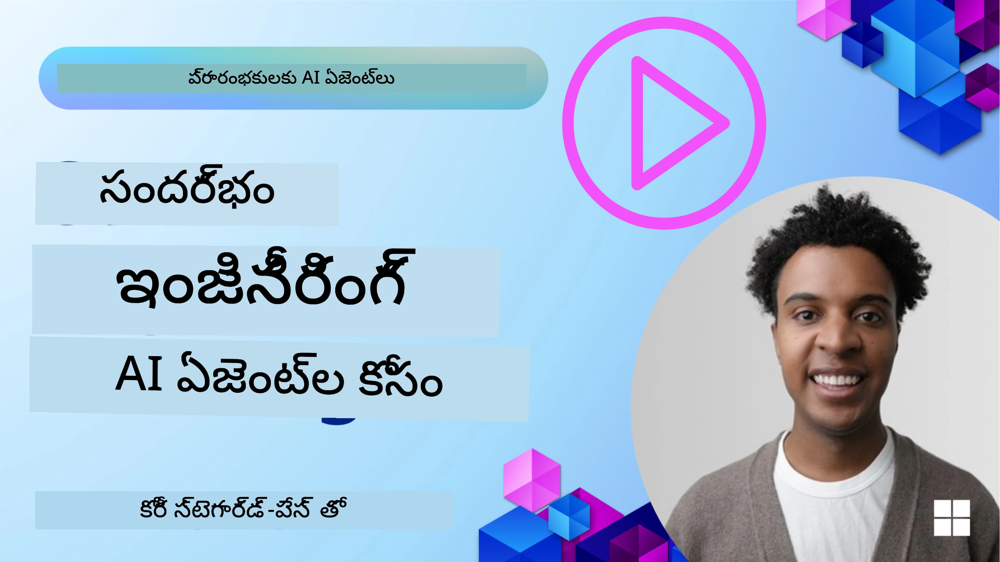
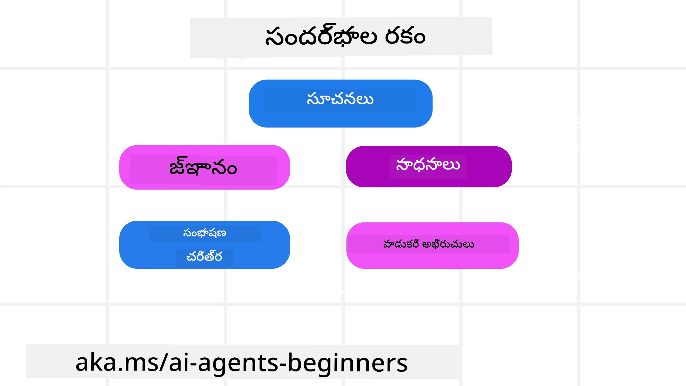
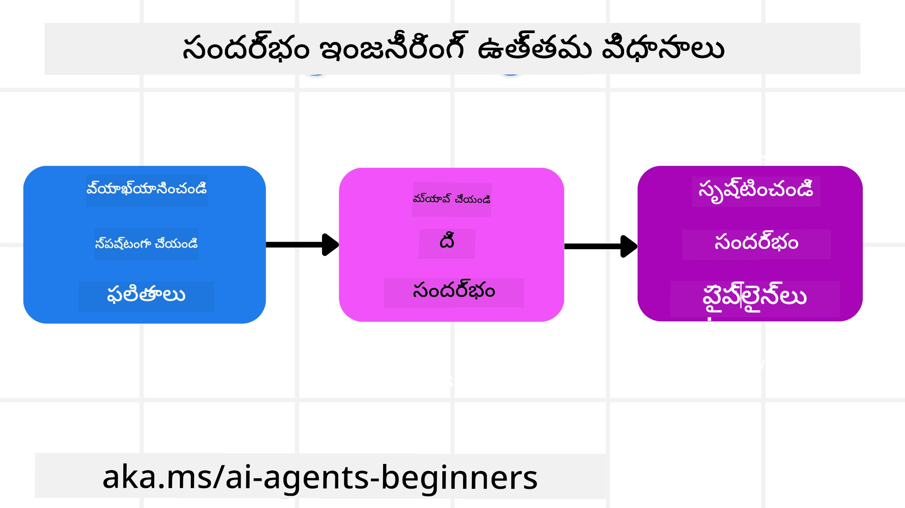

# AI ఏజెంట్ల కోసం కంటెక్స్ట్ ఇంజనీరింగ్  

  

> _(ఈ పాఠ్య వీడియోను చూడడానికి పై చిత్రం క్లిక్ చేయండి)_  

మీరు రూపొందిస్తున్న AI ఏజెంట్ యొక్క అప్లికేషన్ సంక్లిష్టతను అర్థం చేసుకోవడం విశ్వసనీయమైన ఏజెంట్‌ను తయారుచేసుకోవడానికి ముఖ్యమైనది. ప్రాంప్ట్ ఇంజనీరింగ్ కంటే పైగా క్లిష్ట అవసరాలను తీర్చడానికి సమర్థవంతంగా సమాచారాన్ని నిర్వహించే AI ఏజెంట్లు నిర్మించాలి.  

ఈ పాఠ్యంలో, కంటెక్స్ట్ ఇంజనీరింగ్ అంటే ఏమిటి మరియు AI ఏజెంట్ల నిర్మాణంలో దాని పాత్రను మనం చూడబోతున్నాము.  

## పరిచయం  

ఈ పాఠ్యం కిప్పంది:  

• **కంటెక్స్ట్ ఇంజనీరింగ్ అంటే ఏమిటి** మరియు ఇది ప్రాంప్ట్ ఇంజనీరింగ్ నుండి ఎందుకు వేరుగా ఉంటుంది.  

• **సమర్థవంతమైన కంటెక్స్ట్ ఇంజనీరింగ్ కు వ్యూహాలు**, అందులో ఎలా రచించాలి, ఎంచుకోవాలి, సంకుచితం చేయాలి, మరియు సమాచారాన్ని వేరుపరుచుకోవాలి అనే అంశాలు ఉంటాయి.  

• **సాధారణ కంటెక్స్ట్ వైఫల్యాలు** ఏజెంట్ ను దారితప్పుడు చేయగలవు మరియు వాటిని ఎలా పరిష్కరించాలో.  

## నేర్చుకునే లక్ష్యాలు  

ఈ పాఠ్యం పూర్తిచేసిన తర్వాత, మీరు ఎలా చేయాలో తెలుసుకుంటారు:  

• **కంటెక్స్ట్ ఇంజనీరింగ్ నిర్వచించుకోవడం** మరియు దానిని ప్రాంప్ట్ ఇంజనీరింగ్ నుండి విడగొట్టడం.  

• **విస్తృత భాషా మోడల్ (LLM) అప్లికేషన్స్‌లో కంటెక్స్ట్ యొక్క కీలక భాగాలను గుర్తించడం.**  

• **కంటెక్స్ట్ రాయడం, ఎంచుకోవడం, సంకుచితం చేయడం, వేరుపరచడం కోసం వ్యూహాలు అన్వయించడం** ఏజెంట్ పనితీరును మెరుగుపరచడానికి.  

• **వినియోగించిన కాంటెక్స్ట్ వైఫల్యాలు గుర్తించడం** - విషపోisonం, అడ్డుపడటం, గందరగోళం, మరియు ఘర్షణ వంటి, మరియు పరిష్కారమైన రూపాలు చేయడం.  

## కంటెక్స్ట్ ఇంజనీరింగ్ అంటే ఏమిటి?  

AI ఏజెంట్లకు, కంటెక్స్ట్ అనేది ఏజెంట్ కొన్ని చర్యలు తీసుకునేందుకు ప్రణాళికను నడిపే అంశం. కంటెక్స్ట్ ఇంజనీరింగ్ అనేది AI ఏజెంటుకు తదుపరి దశ పనిని పూర్తిచేయడానికి సరైన సమాచారం కలిగి ఉండనిచ్చే ఆచరణ. కంటెక్స్ట్ విండో పరిమితమైనది కనుక, ఏజెంట్ నిర్మాణదారులు అదనపు, తొలగింపు, మరియు సంకుచనం సమాచారాన్ని నిర్వహించే సిస్టమ్స్ మరియు ప్రక్రియలను తయారు చేయాలి.  

### ప్రాంప్ట్ ఇంజనీరింగ్ వర్సెస్ కంటెక్స్ట్ ఇంజనీరింగ్  

ప్రాంప్ట్ ఇంజనీరింగ్ ఒక స్థిరమైన setstatic సూచనలు సెట్ పై దృష్టి పెట్టి AI ఏజెంట్లను నియంత్రించేందుకు నియమాలను అందిస్తుంది. కంటెక్స్ట్ ఇంజనీరింగ్ అనేది ప్రారంభ ప్రాంప్ట్ సహా డైనమిక్ సమాచార సమూహాన్ని నిర్వహించడం, దీని ద్వారా AI ఏజెంట్ సమయం కలుగువరకు అవసరమైన సమాచారం అందుబాటులో ఉంచుతుంది. కంటెక్స్ట్ ఇంజనీరింగ్ గురించి ప్రధాన భావన ఈ ప్రక్రియను పునరావృతం చేయగలిగే మరియు విశ్వసనీయంగా చేయడం.  

### కంటెక్స్ట్ రకాలు  

  

కంటెక్స్ట్ ఒక్క అంశం మాత్రమే కాదు అనే విషయం గుర్తుపెట్టుకోవడం ముఖ్యం. AI ఏజెంట్ అవసరమైన సమాచారం విభిన్న వనరుల నుంచి రావచ్చు మరియు ఏజెంట్ అందిన వనరులకు యాక్సెస్ కలిగి ఉండటం మన బాధ్యత.  

AI ఏజెంట్ నిర్వహించవలసిన కంటెక్స్ట్ రకాలు:  

• **సూచనలు:** ఇవి ఏజెంట్ యొక్క "నియమాలు" లాంటివి – ప్రాంప్ట్లు, సిస్టమ్ సందేశాలు, ఫ్యూ-షాట్ ఉదాహరణలు (ఏఐకి ఎలా చేయాలో చూపించడం), మరియు దాని ఉపయోగించే పరికరాల వివరణలు. ఇక్కడే ప్రాంప్ట్ ఇంజనీరింగ్ దృష్టి కంటెక్స్ట్ ఇంజనీరింగ్ తో కలుస్తుంది.  

• **విజ్ఞానం:** డాటాబేస్‌ల నుండి తీసుకున్న వాస్తవాలు, సమాచారాలు లేదా ఏజెంట్ సేకరించిన దీర్ఘకాలిక జ్ఞాపకాలు. ఇది ఏజెంట్ వివిధ జ్ఞాన సందూషణలు మరియు డేటాబేస్‌లకు యాక్సెస్ కావలసినప్పుడు Retrieval Augmented Generation (RAG) విధానాన్ని సమీకరించడం కలిగి ఉంటుంది.  

• **పరికరాలు:** అవి బాహ్య ఫంక్షన్లు, API లు మరియు MCP సర్వర్‌లు నిర్వచనలు, అలాగే వాటి ఉపయోగం నుండి పొందిన ఫీడ్బ్యాక్ (ఫలితాలు).  

• **సంభాషణ చరిత్ర:** వినియోగదారుతో ముద్రంగ సాగుతున్న సంభాషణ. కాలం గడిచే కొద్దీ ఈ సంభాషణలు పొడవుగా మరియు క్లిష్టంగా మారి కంటెక్స్ట్ విండోలో స్థలాన్ని ఆక్రమిస్తాయి.  

• **వినియోగదారు అభిరుచులు:** కాలం గడిచే కొద్దీ వినియోగదారుడి ఇష్టం లేదా అస్వీకారం గురించి వనరు పొందిన సమాచారాలు. ఇవి కీలక నిర్ణయాలు తీసేటప్పుడు ఉపయోగపడేందుకు భద్రపరచబడవచ్చు.  

## సమర్థవంతమైన కంటెక్స్ట్ ఇంజనీరింగ్ వ్యూహాలు  

### ప్రణాళిక వ్యూహాలు  

  

మంచి కంటెక్స్ట్ ఇంజనీరింగ్ మంచి ప్రణాళికతో మొదలవుతుంది. కంటెక్స్ట్ ఇంజనీరింగ్ భావనను అన్వయించే విధానం గురించి ఆలోచించడంలో ఇది సహాయపడుతుంది:  

1. **స్పష్టమైన ఫలితాలు నిర్వచించండి** - AI ఏజెంట్‌లకు అసైన్ చేయబోయే పనుల ఫలితాలు స్పష్టంగా నిర్వచించాలి. "AI ఏజెంట్ పని పూర్తయిన తర్వాత ప్రపంచం ఎలా కనిపిస్తుంది?" అనే ప్రశ్నకు సమాధానం ఇవ్వండి. అంటే, AI ఏజెంట్ చేత ఇన్టరాక్ట్ చేసిన తర్వాత వినియోగదారుడికి ఏ మార్పు, సమాచారం లేదా ప్రతిస్పందన ఉండాలి.  
2. **కంటెక్స్ట్‌ను మ్యాప్ చేయండి** - AI ఏజెంట్ ఫలితాలను నిర్వచించాక, "ఈ పని పూర్తి చేయడానికి ఏ సమాచారాన్ని AI ఏజెంట్ అవసరం?" అన్న ప్రశ్నకు సమాధానం ఇవ్వాలి. ఇలా మీరు ఆ సమాచారం ఎక్కడ నుంచో కంటెక్స్ట్ మ్యాప్ చేయవచ్చు.  
3. **కంటెక్స్ట్ పైప్‌లైన్లు సృష్టించండి** - ఇప్పుడు మీరు సమాచారం ఎక్కడ ఉందో తెలుసుకుందని, "ఏజెంట్ ఆ సమాచారాన్ని ఎలా పొందుతుంది?" అన్న ప్రశ్నకు సమాధానం ఇవ్వాలి. ఇది RAG, MCP సర్వర్ల వాడకం మరియు ఇతర పరికరాల సహాయంతో చేయవచ్చు.  

### ప్రాక్టికల్ వ్యూహాలు  

ప్రణాళిక ముఖ్యం అయినా ఒకసారి సమాచారం ఏజెంట్ యొక్క కంటెక్స్ట్ విండోలో ప్రవహించాక, దాన్ని నిర్వహించడానికీ ప్రాక్టికల్ వ్యూహాలు అవసరం:  

#### కంటెక్స్ట్ నిర్వహణ  

కొన్నిసార్లు సమాచారం ఆటోమేటిగానే కంటెక్స్ట్ విండోలో జతచేస్తారు, కాని కంటెక్స్ట్ ఇంజనీరింగ్ దాని పైన ఎక్కువగా చర్య తీసుకోవడం గురించి, ఇది కొద్దినాటా నిర్ణయాల ద్వారా సాధించవచ్చు:  

 1. **ఏజెంట్ స్క్రాచ్ప్యాడ్**  
 ఇది ఒక AI ఏజెంట్ ప్రస్తుత పనులు మరియు వినియోగదారు ఇంటరాక్షన్ గురించి సంబంధించిన సమాచారం నోట్స్ తీసుకునేందుకు అనుమతిస్తుంది ఒక సెషన్ లో. ఇది కంటెక్స్ట్ విండో బయట ఒక ఫైల్ లేదా రన్‌టైమ్ ఆబ్జెక్ట్ లో ఉండాలి, అవసరమైతే ఏజెంట్ ఈ సెషన్ సమయంలో తిరిగి తెచ్చుకోగలదు.  

 2. **జ్ఞాపకాలు**  
 స్క్రాచ్ప్యాడ్లు ఒక సింగిల్ సెషన్ కంటెక్స్ట్ విండోకు బయట సమాచార నిర్వహణకు మంచివి. జ్ఞాపకాలు ఏజెంట్లు అనేక సెషన్లలో సంబంధించిన సమాచారం భద్రపరచుకొని తిరిగి పొందటానికి సహాయపడతాయి. దీనిలో సారాంశాలు, వినియోగదారు అభిరుచులు, భవిష్యత్తు మెరుగుదల కోసం ఫీడ్బ్యాక్ ఉంటాయి.  

 3. **కంటెక్స్ట్ సంకుచితం చేయడం**  
  కంటెక్స్ట్ విండో పెరిగి పరిమితిని చేరువైతే, సారాంశం మరియు చాపడం వంటి సాంకేతిక పద్ధతులు ఉపయోగించవచ్చు. ఇందులో అత్యంత సంబంధిత సమాచారాన్ని మాత్రమే ఉంచడం లేదా పాత సందేశాలను తొలగించడం ఉన్నది.  
  
 4. **బహుళ ఏజెంట్ సిస్టమ్స్**  
  బహుళ ఏజెంట్ వ్యవస్థలను అభివృద్ధి చేయడం కంటెక్స్ట్ ఇంజనీరింగ్ రూపం, ఎందుకంటే ప్రతి ఏజెంట్ కు స్వంత కంటెక్స్ట్ విండో ఉంటుంది. ఆ కంటెక్స్ట్ ఎలా పంచుకోవాలి మరియు ఇతర ఏజెంట్‌లకు ఎలా పంపించాలి అనే దాని ప్రణాళిక ఇదే.  
  
 5. **సాండ్‌బాక్స్ వాతావరణాలు**  
  ఏజెంట్ కొంత కోడ్ ను నడపాలి లేదా పెద్ద డాక్యుమెంట్ లో పెద్ద మొత్తంలో సమాచారాన్ని ప్రాసెస్ చేయాలి అంటే ఫలితాల ప్రాసెసింగ్ కోసం ఎప్పుడూ టోకెన్ల పెరుగుదల ఉంటుంది. ఈ మొత్తాన్ని కంటెక్స్ట్ విండోలో ఉంచక, ఏజెంట్ కోడ్ నడిపే సాండ్‌బాక్స్ వాతావరణాన్ని ఉపయోగించి ఫలితాలను మరియు ఇతర సంబంధిత సమాచారాన్ని మాత్రమే చదవవచ్చు.  
  
 6. **రన్‌టైమ్ స్టేట్ ఆబ్జెక్ట్స్**  
   ఇది ఏజెంట్ కొరకు కొన్ని సమాచార కంటైనర్లు సృష్టించడం ద్వారా జరుగుతుంది, యాజమాన్యం అవసరమైనప్పుడు యాక్సెస్ కలిగి ఉండేందుకు. క్లిష్ట పనులకు దీనివల్ల ఏజెంట్ ప్రతి ఉపపనిని సరళి చేర్చుకొని ఫలితాలు భద్రపరచవచ్చు, కంటెక్స్ట్ ఆ ఉపపనికి మాత్రమే సంబంధించినదిగా నిర్ధారిస్తుంది.  

#### కంటెక్స్ట్ తనిఖీ  

మీరు ఈ వ్యూహాలలో ఒకదాన్ని అన్వయించిన తర్వాత, తదుపరి మోడల్ కాల్ నిజంగా ఏం స్వీకరించింది అని తనిఖీ చేయడం మంచిది. ఉపయోగకరమైన డీబగ్గింగ్ ప్రశ్న:  

> ఏజెంట్ చాలా కంటెక్స్ట్, తప్పుకున్న కంటెక్స్ట్ లేదా అవసరమైన కంటెక్స్ట్ లోపించినదా లోడ్ చేసిందా?  

ఆ ప్రశ్నకు సమాధానాల కోసం మీరు రా ప్రాంప్ట్‌లు, పరికర అవుట్‌పుట్‌లు లేదా జ్ఞాపక కంటెంట్ లాగ్ చేయాల్సిన అవసరం లేదు. ప్రొడక్షన్ లో, చిన్న కంటెక్స్ట్ తనిఖీ రికార్డులను ప్రాధాన్యం ఇవ్వండి, అవి కౌంట్స్, IDs, హ్యాష్ లు మరియు పాలసీ లేబుల్స్ ను పట్టుకోవాలి:  

- **ఎంపిక:** ఎన్ని అభ్యర్థి భాగాలు, పరికరాలు లేదా జ్ఞాపకాలు పరిగణించబడ్డాయి, ఎన్ని ఎంపిక చేశాయి, మరియు ఏ నియమం లేదా స్కోరు ఇతరులను తొలగించిందో ట్రాక్ చేయండి.  
- **సంకుచితం:** మూల రేంజ్ లేదా ట్రేస్ ID, సారాంశ ID, సంకుచితమయ్యే ముందు మరియు తర్వాత అంచనా టోకెన్ లెక్క, మరియు వచ్చే కాల్ నుండి రా కంటెంట్ తప్పించబడినా అని నమోదు చేయండి.  
- **వేరుగా ఉంచడం:** ఏ ఉపపని భిన్న ఏజెంట్, సెషన్ లేదా సాండ్‌బాక్స్ లో నడిచిందో, ఏమి పరిమిత సారాంశం వచ్చిందో, మరియు పెద్ద పరికర అవుట్‌పుట్ మూల ఏజెంట్ కంటెక్స్ట్ వెలుపల కనిపించిందో నోట్ చేయండి.  
- **జ్ఞాపకం మరియు RAG:** రిట్రీవల్ డాక్యుమెంట్ IDs, జ్ఞాపక IDs, స్కోర్లు, ఎంపిక చేసిన IDs మరియు సంపాదన స్థితిని పూర్తి రిట్రీవ్డ్ టెక్ట్స్ బదులు నిల్వ చేయండి.  
- **భద్రత మరియు గోప్యత:** సున్నితమైన ప్రాంప్ట్ టెక్ట్స్, పరికర ఆర్గుమెంట్లు, పరికర ఫలితాలు లేదా వినియోగదారు జ్ఞాపకం బాడీల బదులుగా హ్యాషులు, IDs, టోకెన్ బకెట్లు, పాలసీ లేబుల్స్ లను ప్రాధాన్యం ఇవ్వండి.  

లక్ష్యం మరింత కంటెక్స్ట్ నిల్వ చేయడం కాదు. ఒక డెవలపర్ ఏ కంటెక్స్ట్ వ్యూహం నడిచిందో, తదుపరి మోడల్ కాల్ లక్ష్యంగా మారిందో తెలియజేయగల రికార్డులను ఉంచడం.  

### కంటెక్స్ట్ ఇంజనీరింగ్ ఉదాహరణ  

మనం AI ఏజెంట్ ను తలచుకుందాం **"పారిస్‌కి ఒక ప్రయాణం బుక్ చేయండి."**  

• ప్రాంప్ట్ ఇంజనీరింగ్ మాత్రమే ఉపయోగించే సాదా ఏజెంట్ సమాధానం ఇస్తుంది: **"సరే, మీరు పారిస్‌కి ఎప్పుడు వెళ్లాలనుకుంటున్నారు?"**. ఇది యూజర్ అడిగినప్పుడు తక్షణమే మీ ప్రత్యక్ష ప్రశ్నను ప్రాసెస్ చేసింది.  

• కంటెక్స్ట్ ఇంజనీరింగ్ వ్యూహాలు ఉపయోగించే ఏజెంట్ ఇంకా ఎక్కువ చేస్తుంది. సమాధానం ఇవ్వక ముందే, దాని వ్యవస్థ ఇలా చేయవచ్చు:  

  ◦ అందుబాటులో ఉన్న తేదీల కోసం **మీ క్యాలెండర్‌ను తనిఖీ చేయడం** (రియల్ టైం డేటాను తీసుకోవడం).  

 ◦ గత ప్రయాణ అభిరుచులను **మరచిపోకుండా గుర్తించడం** (దీర్ఘకాలపు జ్ఞాపకం నుంచి), మీ ఇష్టమైన ఎయిర్లైన్, బడ్జెట్ లేదా నేరుగా విమానాలు ఇష్టపడే వివరాలు వంటి.  

 ◦ విమానాలు మరియు హోటల్ బుకింగ్ కోసం **అందుబాటులో ఉన్న పరికరాలను గుర్తించడం**.  

- అప్పుడు, ఉదాహరణ స్పందన ఇలా ఉండవచ్చు: "హాయ్ [మీ పేరు]! మీరు అక్టోబర్ మొదటి వారం ఖాళీగా ఉన్నట్లుంది. మీ సాధారణ బడ్జెట్ [బడ్జెట్] లో [ఇష్టమైన ఎయిర్లైన్] పై పారిస్‌కి నేరుగా విమానాలు చూడాలనుకుంటున్నారా?" ఈ సంపూర్ణ, కంటెక్స్ట్-జ్ఞానంతో కూడిన సమాధానం కంటెక్స్ట్ ఇంజనీరింగ్ శక్తిని చూపిస్తుంది.  

## సాధారణ కంటెక్స్ట్ వైఫల్యాలు  

### కంటెక్స్ట్ విషపోisonం (Context Poisoning)  

**అర్థం:** ఒక హల్యూసినేషన్ (LLM ఉత్పత్తి చేసిన తప్పుడు సమాచారం) లేదా లోపం కంటెక్స్ట్‌లో ప్రవేశించి పునరావృతంగా సూచించబడినప్పుడు, ఇది ఏజెంట్‌ను అసాధ్యమైన లక్ష్యాలపై నడిపించటం లేదా అర్థం కాని వ్యూహాలు అభివృద్ధి చేయటానికి దారితీస్తుంది.  

**చేయవలసినది:** **కంటెక్స్ట్ ధృవీకరణ** మరియు **క్వారంటైన్** అమలు చేయండి. సమాచారాన్ని దీర్ఘకాలిక జ్ఞాపకంలో చేర్పించేముందు ధృవీకరించండి. విషపోison్ సూచనలు వస్తే కొత్త కంటెక్స్ట్ థ్రెడ్లను ప్రారంభించి చెడు సమాచారం వ్యాప్తిని ఆపండి.  

**ప్రయాణ బుకింగ్ ఉదాహరణ:** ఏజెంట్ ఒక **చిన్న స్థానిక విమానాశ్రయం నుండి దూర అంతర్జాతీయ నగరం దాకా నేరుగా ప్రయాణం** అంటే వాస్తవానికి అంతర్జాతీయ విమానాలు లేని దారి గురించి హల్యూసినేషన్ చేస్తుంది. ఈ అసత్య వివరాలు కంటెక్స్ట్‌లో భద్రపరుస్తుంది. తరువాత బుకింగ్ అడిగితే, ఆ అసాధ్య మార్గం కోసం టికెట్స్ కోసం ప్రయత్నిస్తూ తప్పులు మళ్ళీ మళ్ళీ వస్తాయి.  

**పరిష్కారం:** ఏజెంట్ పనిచేసే కంటెక్స్ట్ కి విమానాలు ఉన్నాయా, మార్గాలు సరైనవా అని **రియల్ టైం API ద్వారా ధృవీకరణ** చేయడం మొదట. ధృవీకరణ విఫలమైతే చెల్లని సమాచారాన్ని "క్వారంటైన్" చేసి ఉపయోగించకూడదు.  

### కంటెక్స్ట్ అడ్డుపడటం (Context Distraction)  

**అర్థం:** కంటెక్స్ట్ చాలా పెద్దదైతే మోడల్ చదివిన గతాన్ని బాగా దృష్టి పెట్టి ట్రైనింగ్ సేపు నేర్చుకున్న విషయాల కన్నా ఎక్కువ ప్రాధాన్యం ఇస్తుంది, దీని వలన పునరావృతం అయ్యే లేదా ఉపయోగపడని చర్యలు రావచ్చు. కంటెక్స్ట్ విండో పూర్తి కాకముందే కూడా చిన్న తప్పులు చేయవచ్చు.  

**చేయవలసినది:** **కంటెక్స్ట్ సారాంశం**ని ఉపయోగించండి. సారాంశాలుగా సమకూరిన సమాచారాన్ని సంకుచితం చేయండి, ముఖ్యమైన వివరాలు ఉంచి పునరావృత చరిత్రలను తీసేయండి. ఇది దృష్టిని "రిసెట్" చేయడంలో సహాయపడుతుంది.  

** ప్రయాణ బుకింగ్ ఉదాహరణ:** రెండు సంవత్సరాల క్రితం మీ బ్యాక్‌ప్యాకింగ్ ట్రిప్ వివరంగా చర్చిస్తూ మీరు ఓ చాలా సమయం పాటు వివిధ స్వప్న ప్రయాణ గమ్యస్థానాల గురించి చెప్పిన తర్వాత, మీరు **"అదే తర్వాత నెలకు సस्ता ఫ్లైట్ కనుక్కోచేయండి"** అని అడిగినప్పుడు, ఏజెంట్ పురాతన, సంబంధం లేని వివరాల్లో తప్పుతుంది మరియు మీ బ్యాక్‌ప్యాకింగ్ పరికరము లేదా గత ప్రణాళికలను అడుగుతూ ప్రస్తుత అభ్యర్థనని పట్టించుకోకపోవచ్చు.  

**పరిష్కారం:** కొన్ని తాళాల తర్వాత లేదా కాంటెక్స్ట్ పెద్దదిగా పెరిగినపుడు, ఏజెంట్ సంభాషణ యొక్క తాజా మరియు సంబంధిత భాగాలను **సారాంశం చేసుకోవాలి** – ప్రస్తుత ప్రయాణ తేదీలు మరియు గమ్యస్థానం పై దృష్టి సారించి, తక్కువ సంబంధమున్న చర్చని వదిలేస్తుంది.  

### కంటెక్స్ట్ గందరగోళం (Context Confusion)  

**అర్థం:** అవసరంలేని కంటెక్స్ట్, ముఖ్యంగా చాలా పరికరాలు అందుబాటులో ఉన్నప్పుడు, మోడల్ చెడు సమాధానాలు ఇవ్వగలదు లేదా సంబంధం లేని పరికరాలను వాడిపెట్టగలదు. చిన్న మోడల్స్‌కు ఇది ఎక్కువ సంభవం.  

**చేయవలసినది:** RAG సాంకేతికాలను ఉపయోగించి **పరికర లొడౌట్ నిర్వహణ** అమలు చేయండి. పరికర వివరణలను వెక్టర్ డేటాబేస్లో నిల్వ చేసి, ప్రతీ ప్రత్యేక పనికి అవసరమైన పరికరాలను మాత్రమే ఎంచుకోండి. పరిశోధనలు 30 కంటే తక్కువ పరికరాలు తీసుకోవాలని సూచిస్తున్నాయి.  

**ప్రయాణ బుకింగ్ ఉదాహరణ:** మీ ఏజెంట్‌కు పలు పరికరాలు అందుబాటులో ఉన్నాయి: `book_flight`, `book_hotel`, `rent_car`, `find_tours`, `currency_converter`, `weather_forecast`, `restaurant_reservations` మొదలైనవి. మీరు అడుగుతారు, **"పారిస్‌ లో చుట్టూ తిరుగుటకు ఉత్తమ మార్గం ఏది?"** పరికరాల సంఖ్య ఎక్కువగా ఉండటం వలన, ఏజెంట్ గందరగోళానికి లోనవుతుంది, రెండుసార్లు `book_flight` ను పారిస్ లోనే పిలవటానికి లేదా మీరు ప్రజా రవాణాను ఇష్టపడినా `rent_car` పిలవడానికి ప్రయత్నిస్తుంది, పరికర వివరణలు ఒకరితో ఒకటిఒడిపోయినట్లుగా లేదా సరైనది ఎంచుకోవడంలో అసమర్థంగా ఉంటుంది.  

**పరిష్కారం:** పరికర వివరణలపై **RAG ఉపయోగించండి**. మీరు పారిస్ లో చుట్టూ తిరగడం గురించి అడుగుతున్నప్పుడు, సిస్టమ్ మీ క్వెరీ ఆధారంగా సంబంధిత పరికరాలు మాత్రమే (ఉదా: `rent_car` లేదా `public_transport_info`) డైనమిక్‌గా రిట్రీవ్ చేస్తుంది, LLM కి ఫోకస్ "లొడౌట్" చూపిస్తుంది.  

### కంటెక్స్ట్ ఘర్షణ (Context Clash)  

**అర్థం:** కాంటెక్స్ట్ లో విరుద్ధ సమాచారాలు కలిగినప్పుడు, అవి అసంపూర్ణ తార్కికత లేదా చెడు తుది సమాధానాలకు దారితీస్తాయి. ఇది తరచుగా సమాచారం దశల వారీగా వస్తున్నప్పుడు, మొదటి తప్పు ఊహాగానాలు కంటెక్స్ట్ లో నిలిచిపోవడం వల్ల జరుగుతుంది.  

**చేయవలసినది:** **కాంటెక్స్ట్ ప్రూనింగ్** మరియు **ఆఫ్‌లోడింగ్**ను ఉపయోగించండి. ప్రూనింగ్ అంటే కొత్త వివరాలు వచ్చినప్పుడు పాత లేదా విరుద్ధ సమాచారాన్ని తొలగించడం. ఆఫ్‌లోడింగ్ మోడల్ కు ఒక ప్రత్యేక "స్క్రాచ్ప్యాడ్" పనిముట్లు ప్రాసెస్ చేయడానికి ఇవ్వడం, ప్రధాన కంటెక్స్ట్ ను అజ్ఞాతంగా ఉంచకుండా పనిచేయటం.  

**ప్రయాణ బుకింగ్ ఉదాహరణ:** మీరు ప్రారంభంలో మీ ఏజెంట్‌కు, **"నేను ఎకానమీ క్లాస్‌లో ప్రయాణించాలనుకుంటున్నాను."** అని చెప్తారు. తరువాత సంభాషణలో, మీరు మీ అభిప్రాయాన్ని మార్చి, **"నిజానికి, ఈ ప్రయాణానికి బిజినెస్ క్లాస్‌లో వెళ్దాం."** అని చెప్తారు. రెండు సూచనలు సందర్భంలో ఉన్నప్పుడు, ఏజెంట్ విరుద్ధమైన శోధన ఫలితాలు పొందవచ్చు లేదా ఏ ప్రాధాన్యత ఇవ్వాలో సందేహంగా ఉండవచ్చు.

**పరిష్కారం:** **సందర్భం చిట్టచివరి చేయడం** (context pruning)ని అమలు చేయండి. కొత్త సూచన పాత దానిని విరోధించినప్పుడు, పాత సూచనను తొలగించడం లేదా స్పష్టంగా దాటవేయడం జరుగుతుంది. మరో విధంగా, ఏజెంట్ ఒక **scratchpad** ఉపయోగించి విరుద్ధమైన ప్రాధాన్యతలను సమన్వయం చేసి, చివరి మరియు సुसంపన్న సూచన ఆధారంగా దాని చర్యలను నిర్దేశిస్తుంది.

## కాంటెక్స్ట్ ఇంజనీరింగ్ గురించి మరిన్ని ప్రశ్నలున్నాయా?

ఇతర నేర్చుకునేవారిని కలుసుకోవడానికి, ఆఫీస్ గంటల్లో పాల్గొనడానికి మరియు మీ AI ఏజెంట్ ప్రశ్నలకు సమాధానాలు పొందడానికి [Microsoft Foundry Discord](https://discord.com/invite/ATgtXmAS5D)లో చేరండి.

---

<!-- CO-OP TRANSLATOR DISCLAIMER START -->
**అస్వీకరణ**:
ఈ పత్రం AI అనువాద సేవ [Co-op Translator](https://github.com/Azure/co-op-translator) ఉపయోగించి అనువదించబడింది. మేము ఖచ్చితత్వానికి ప్రయత్నిస్తున్నప్పటికీ, ఆటోమేటెడ్ అనువాదాలు తప్పులు లేదా అసమగ్రతలను కలిగి ఉండవచ్చు. దాని స్వదేశ భాషలో ఉన్న అసలు పత్రాన్ని అధికారం కలిగిన మూలంగా పరిగణించాలి. కీలకమైన సమాచారం కోసం, ప్రొఫెషనల్ మానవ అనువాదాన్ని సిఫారసు చేస్తాము. ఈ అనువాదం ఉపయోగం వల్ల కలిగే ఏవైనా అపార్థాలు లేదా తప్పుదారులు కోసం మేము బాధ్యత వహించము.
<!-- CO-OP TRANSLATOR DISCLAIMER END -->