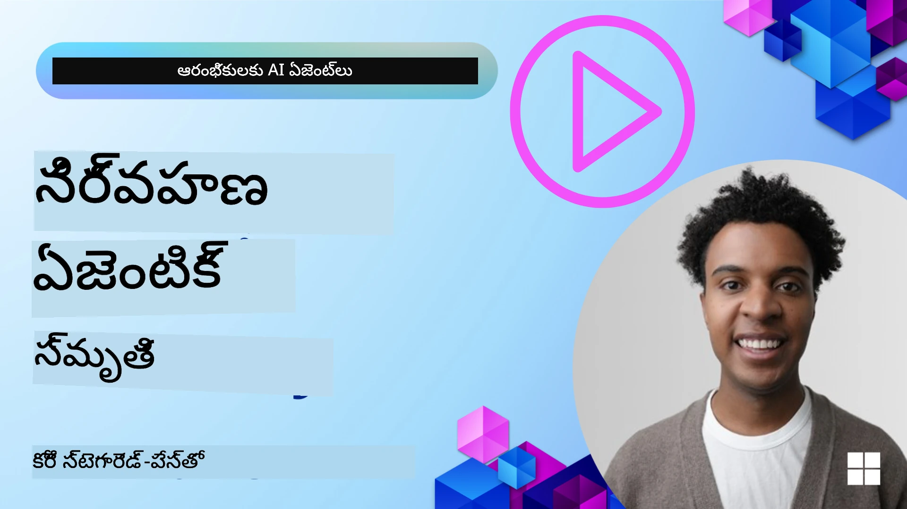

# AI ఏజెంట్ల కోసం మెమరీ 

AI ఏజెంట్లను రూపొందించడం యొక్క ప్రత్యేక లాభాలను చర్చిస్తున్నప్పుడు, ప్రధానంగా రెండు విషయాలు చర్చించబడతాయి: పనులను పూర్తి చేయడానికి టూల్స్‌ను పిలవగల సామర్థ్యం మరియు సమయానుకూలంగా మెరుగుదల పొందగల సామర్థ్యం. స్వీయ-మెరుగుదల పొందేటటువంటి ఏజెంట్‌లను సృష్టించడం‌లో మెమరీ మూలస్తంభంగా ఉంటుంది, ఇది మన వినియోగదారులకు మెరుగైన అనుభవాలను అందిస్తుంది.

ఈ పాఠంలో, AI ఏజెంట్ల కోసం మెమరీ అంటే ఏమిటి మరియు మన అప్లికేషన్ల ప్రయోజనానికి దాన్ని ఎలా నిర్వహించాలో మరియు ఉపయోగించి చేయాలో చూద్దాం.

## పరిచయం

ఈ పాఠం హెచ్చరిస్తుంది:

• **AI ఏజెంట్ మెమరీని అర్థం చేసుకోవడం**: మెమరీ ఏమిటి మరియు ఏజెంట్లకు ఇది ఎందుకు కీలకమో.

• **మెమరీ అమలు చేయడం మరియు నిల్వ చేయడం**: మీ AI ఏజెంట్లకు షార్ట్-టర్మ్ మరియు లాంగ్-టర్మ్ మెమరీ సామర్ధ్యాలను చేర్చడానికి వినియోగించదగిన ప్రాక్టికల్ పద్ధతులు.

• **AI ఏజెంట్లను స్వీయ-మెరుగుదల చేయడం**: గత పరస్పర చర్యల నుండి నేర్చుకొని సమయాన్నిబట్టి ఏజెంట్లు ఎలా మెరుగుపడతాయో.

## అందుబాటులో ఉన్న అమలు వివరాలు

ఈ పాఠం రెండు సమగ్ర నోట్‌బుక్ ట్యుటోరియల్స్‌ను కలిగి ఉంటుంది:

• **[13-agent-memory.ipynb](./13-agent-memory.ipynb)**: Implements memory using Mem0 and Azure AI Search with Microsoft Agent Framework

• **[13-agent-memory-cognee.ipynb](./13-agent-memory-cognee.ipynb)**: Implements structured memory using Cognee, automatically building knowledge graph backed by embeddings, visualizing graph, and intelligent retrieval

## నేర్చుకోవాల్సిన లక్ష్యాలు

ఈ పాఠాన్ని పూర్తిచేశాక, మీరు తెలుసుకుంటారు:

• **వివిధ రకాల AI ఏజెంట్ మెమరీ మధ్య తేడాలను గుర్తించగలడం**, వర్కింగ్, షార్ట్-టర్మ్ మరియు లాంగ్-టర్మ్ మెమరీలతోపాటు వ్యక్తిగత (persona) మరియు ఎపిసోడిక్ మెమరీ లాంటి ప్రత్యేక రూపాలును.

• **Microsoft Agent Framework ఉపయోగించి AI ఏజెంట్లకు షార్ట్-టర్మ్ మరియు లాంగ్-టర్మ్ మెమరీలను అమలు చేసి నిర్వహించడం**, Mem0, Cognee, Whiteboard memory వంటి టూల్స్‌ను వినియోగించడం మరియు Azure AI Searchతో సమగ్రపరచడం.

• **స్వీయ-మెరుగుతున్న AI ఏజెంట్ల ఆవరణలను అర్థం చేసుకోవడం** మరియు బలమైన మెమరీ నిర్వహణ వ్యవస్థలు నిరంతర అభ్యాసం మరియు అనుకూలతకు ఎలా సహాయపడతాయో.

## AI ఏజెంట్ మెమరీని అర్థం చేసుకోవడం

మూలంగా, **AI ఏజెంట్ల కోసం మెమరీ అంటే వాళ్లు సమాచారాన్ని నిలుపు చేసుకోవడానికి మరియు గుర్తు చేసుకోవడానికి ఉపయోగించే యంత్రాంగాలను సూచిస్తుంది**. ఈ సమాచారం సంభాషణ గురించి నిర్దిష్ట వివరాలు, వినియోగదారుల ప్రాధాన్యాలు, గత చర్యలు లేదా నేర్చుకున్న నమూనాలు కావచ్చు.

మెమరీ లేకపోతే, AI అప్లికేషన్లు ఎక్కువగా స్టేట్‌లెస్‌గా ఉంటాయి, అంటే ప్రతి పరస్పర చర్య కొత్తగా మొదలవుతుంది. ఇది ఏజెంట్ గత సందర్భం లేదా ప్రాధాన్యాలను "మరిచిపోయే" నియమం వల్ల పునరావృతమైన మరియు నిరుత్సాహకరమైన వినియోగదార అనుభవానికి దారితీస్తుంది.

### మెమరీ ఎందుకు ముఖ్యం?

ఏజెంట్ యొక్క బుద్ధి దాని గత సమాచారాన్ని గుర్తు పెట్టుకోవడం మరియు వినియోగించుకోవడంపై బలంగా ఆధారపడి ఉంటుంది. మెమరీ ఏజెంట్లను ఈ విధంగా చేయిస్తుంది:

• **సూచనాత్మకమైనవి**: గత చర్యలు మరియు ఫలితాల నుండి నేర్చుకోవడం.

• **ఇంటరాక్టివ్**: కొనసాగుతున్న సంభాషణపై సందర్భాన్ని నిలుపుకోవడం.

• **ప్రాక్టోగా మరియు రియాక్టివ్**: చరిత్ర ఆధారంగా అవసరాలను ఊహించడం లేదా తగినట్లుగా స్పందించడం.

• **స్వతంత్రంగా**: నిల్వ చేయబడిన జ్ఞానాన్ని ఆధారంగా పెట్టుకొని మరింత స్వతంత్రంగా పనిచేయడం.

మెమరీ అమలు యొక్క లక్ష్యం ఏజెంట్లను మరింత **నమ్మదగిన మరియు సామర్థ్యవంతులుగా** చేయడం.

### మెమరీ రకాలవి

#### పని చేస్తున్న మెమరీ (Working Memory)

దీనిని ఏజెంట్ ఒకటి పని చేస్తున్న లేదా కొనసాగుతున్న టాస్క్ లేదా ఆలోచనా ప్రక్రియ సమయంలో ఉపయోగించే స్క్రాచ్ పేపర్ భాగంగా ఆలోచించండి. ఇది తర్వాతి దశని లెక్కించడానికి అవసరమైన తక్షణ సమాచారం నిల్వ చేస్తుంది.

AI ఏజెంట్ల కోసం, పని చేస్తున్న మెమరీ ఎక్కువగా సంభాషణ మొత్తం చరిత్ర ఉన్నా లేదా ట్రంకేట్ చేసినా సంబంధిత సమాచారం ను పట్టివేస్తుంది. అది అవసరాలూ, ప్రతిపాదనలు, నిర్ణయాలు మరియు చర్యలు వంటి కీలక అంశాలను ఆధ్యాయంగా తీసివుంటుంది.

**వర్కింగ్ మెమరీ ఉదాహరణ**

ఒక ప్రయాణ బుకింగ్ ఏజెంట్‌లో, పని చేస్తున్న మెమరీ వినియోగదారుడి ప్రస్తుత అభ్యర్థనను, ఉదాహరణకు "నేను ప్యారిస్‌కు ట్రిప్ బుక్ చేయాలనుకుంటున్నాను" ను పట్టుకొని ప్రస్తుత పరస్పర చర్యను మార్గనిర్దేశనం చేస్తుంది.

#### షార్ట్ టర్మ్ మెమరీ

ఈ రకం మెమరీ ఒక సంభాషణ లేదా సెషన్ వ్యవధి కోసం సమాచారాన్ని నిల్వ చేస్తుంది. ఇది ప్రస్తుత చాట్ యొక్క సందర్భం, ఏజెంట్ కు సంభాషణలోని పూర్వ టర్లను గుర్తు చేసుకోవడానికీ అనుమతిస్తుంది.

**షార్ట్ టర్మ్ మెమరీ ఉదాహరణ**

ఒక వినియోగదారు అడిగితే, "ప్యారిస్‌కు ఫ్లైట్ ఎంత విలువకు ఉంటుంది?" తర్వాత "అక్కడ బస గురించి ఏమిటి?" అని అడిగితే, షార్ట్-టర్మ్ మెమరీ ఏజెంట్‌కు అదే సంభాషణలో "అక్కడ" అంటే "ప్యారిస్" అని తెలుసుకునేలా చేస్తుంది.

#### లాంగ్ టర్మ్ మెమరీ

ఇది బహుళ సంభాషణలు లేదా సెషన్లలో కొనసాగించే సమాచారం. ఇది ఏజెంట్లకు వినియోగదారుల ప్రాధాన్యాలు, చారిత్రక పరస్పర చర్యలు లేదా విశేష జ్ఞానాన్ని ఎక్కువ కాలం వరకు గుర్తుంచుకోగలదు. ఇది వ్యక్తిగతీకరణకు ముఖ్యమైంది.

**లాంగ్ టర్మ్ మెమరీ ఉదాహరణ**

లాంగ్-టర్మ్ మెమరీలో "బెన్ స్కీయింగ్ మరియు ఓపెన్-ఎయిర్ చర్యల్ని ఇష్టపడతాడు, కొట్టె వీక్షణతో కాఫీ ఇష్టపడతాడు, గత గాయంతో ఉన్నందున అడ్వాన్స్‌డ స్కీ దారులను నివారించాలని కోరుతాడు" అని నిల్వ చేయవచ్చు. గత పరస్పర చర్యల నుంచి నేర్చుకున్న ఈ సమాచారం భవిష్యత్ ప్రయాణ ప్రణాళికలలో సిఫార్సులను వ్యక్తిగతీకరించడంలో ప్రభావితం చేస్తుంది.

#### వ్యাক্তిత్వ (Persona) మెమరీ

ఈ ప్రత్యేక మెమరీ రకం ఏజెంట్‌కు స్థిరమైన "వ్యక్తిత్వం" లేదా "పర్సోనా"ని అభివృద్ధి చేయడంలో సహాయపడుతుంది. ఇది ఏజెంట్ తన గురించి లేదా దాని ఉద్దేశ్య పాత్ర గురించి వివరాలను గుర్తుంచుకోవడానికి అనుమతిస్తుంది, పరస్పర చర్యలను మరింత సురలమైన మరియు కేంద్రీకృతంగా చేస్తుంది.

**పర్సోనా మెమరీ ఉదాహరణ**
ప్రయాణ ఏజెంట్‌ను ఒక "నిపుణుడైన స్కీ ప్లానర్" గా రూపొందించినట్లయితే, పర్సోనా మెమరీ ఈ పాత్రను దృఢపరిచవచ్చు, దీని ప్రతిస్పందనలను నిపుణుడి టోన్ మరియు జ్ఞానానికి అనుగుణంగా ప్రభావితం చేస్తుంది.

#### వర్క్‌ఫ్లో/ఎపిసోడిక్ మెమరీ

ఈ మెమరీ ఒక సంక్లిష్ట పనిని నిర్వహించేటప్పుడు ఏజెంట్ తీసుకునే దశల శ్రేణిని, విజయాలు మరియు వైఫల్యాలను నిల్వ చేస్తుంది. ఇది గత అనుభవాల ప్రత్యేక "ఎపిసోడ్స్" ను గుర్తున్నట్లే ఉంటుంది, వాటి నుండి నేర్చుకోవడానికి.

**ఎపిసోడిక్ మెమరీ ఉదాహరణ**

ఏజెంట్ ఒక నిర్దిష్ట ఫ్లైట్ బుక్ చేయడానికి ప్రయత్నించి అది అందుబాటులో లేకపోవడం వల్ల విఫలమైతే, ఎపిసోడిక్ మెమరీ ఆ విఫలతను రికార్డ్ చేయవచ్చు, తద్వారా తరువాత మరో ప్రయత్నంలో ఏజెంట్ ప్రత్యామ్నాయ ఫ్లైట్లను ప్రయత్నించగలదు లేదా వినియోగదారుని సమస్య గురించి మరింత సమాచారం ఇవ్వగలదు.

#### ఎంటిటీ మెమరీ

ఇది సంభాషణల నుంచి నిర్దిష్ట యూనిట్స్ (వ్యక్తులు, ప్రదేశాలు లేదా వస్తువులు) మరియు సంఘటనలను ఎక్స్‌ట్రాక్ట్ చేసి గుర్తుంచుకోవడాన్ని కలిగి ఉంది. ఇది ఏజెంట్‌కు చర్చించిన కీలక అంశాల యొక్క నిర్మిత అవగాహనను నిర్మించడంలో సహాయపడుతుంది.

**ఎంటిటీ మెమరీ ఉదాహరణ**

గత ట్రిప్ గురించి సంభాషణ నుండి, ఏజెంట్ "Paris," "Eiffel Tower," మరియు "dinner at Le Chat Noir restaurant" వంటి ఎంటిటీలను తీసుకోవచ్చు. భవిష్యత్ పరస్పర చర్యలో, ఏజెంట్ "Le Chat Noir" ను గుర్తుచేసి అక్కడా కొత్త రిజర్వేషన్ చేసేందుకు సూచన ఇవ్వవచ్చు.

#### నిర్మిత RAG (Structured RAG)

RAG ఒక విస్తృత సాంకేతికత కాగా, "Structured RAG" ఒక శక్తివంతమైన మెమరీ సాంకేతికంగా హైలైట్ చేయబడింది. ఇది సంభాషణలు, ఇమెయిల్స్, చిత్రాలు వంటి వివిధ వనరుల నుంచి సాంద్ర, నిర్మిత సమాచారాన్ని ఎక్స్‌ట్రాక్ట్ చేసి, ప్రతిస్పందనలలో ఖచ్చితత్వం, రికాల్ మరియు వేగాన్ని మెరుగుపరచడానికి ఉపయోగిస్తుంది. సంప్రదాయ RAG సారాంశ సామ్యం మాత్రమే ఆధారపడి పనిచేసే విధానానికి భిన్నంగా, Structured RAG సమాచారం యొక్క స్వభావ నిర్మాణంతో పని చేస్తుంది.

**Structured RAG ఉదాహరణ**

కేవలం కీవర్డ్‌ల సరిపోలిక కాకుండా, Structured RAG ఇమెయిల్ నుంచి ఫ్లైట్ వివరాలు (గమ్యం, తేదీ, సమయం, ఎయిర్లైన్) పార్స్ చేసి వాటిని నిర్మిత రూపంలో నిల్వ చేయవచ్చు. ఇది "నేను మంగళవారం ప్యారిస్‌కు ఏ ఫ్లైట్ బుక్ చేసుకున్నా?" వంటి ఖచ్చిత ప్రశ్నలకు అనువుగా ఉంటుంది.

## మెమరీ అమలు చేయడం మరియు నిల్వ చేయడం

AI ఏజెంట్లకు మెమరీ అమలు చేయడం అనేది సిస్టమాటిక్ ప్రాసెస్—**మెమరీ నిర్వహణ**—ను కలిగి ఉంటుంది, ఇందులో జనరేట్ చేయడం, నిల్వ చేయడం, తిరిగి పొందడం, సమీకరించడం, అప్డేట్ చేయడం మరియు అవసరమైతే "మర్చిపోవడం" (లేదా తొలగించడం) కూడా ఉండవచ్చు. retrieval (తిరిగి పొందడం) ముఖ్యమైన భాగంగా ఉంటుంది.

### ప్రత్యేక మెమరీ టూల్స్

#### Mem0

ఏజెంట్ మెమరీని నిల్వ చేసి నిర్వహించడానికి ఒక విధానం Mem0 వంటి ప్రత్యేకమైన టూల్స్‌ను ఉపయోగించడం. Mem0 ఒక స్థిరమైన మెమరీ లేయర్‌గా పని చేస్తుంది, ఏజెంట్లు సంబంధిత పరస్పర చర్యలను గుర్తుంచుకోవడానికి, వినియోగదారు ప్రాధాన్యాలు మరియు వాస్తవ సందర్భాన్ని నిల్వ చేసుకోవడానికి మరియు కాలక్రమేణా విజయాలు మరియు వైఫల్యాల నుంచి నేర్చుకోవడానికి అనుమతిస్తుంది. భావన ఏది అంటే స్టేట్‌లెస్ ఏజెంట్లు స్టేట్‌ఫుల్‌గా మారతాయి.

ఇది **రెండు దశల మెమరీ పైప్‌లైన్: ఎక్స్‌ట్రాక్షన్ మరియు అప్డేట్** ద్వారా పనిచేస్తుంది. మొదట, ఏజెంట్ థ్రెడ్‌కి చేర్చబడిన సందేశాలు Mem0 సర్వీస్‌కి పంపబడతాయి, ఇది లార్జ్ లాంగ్వేజ్ మోడల్ (LLM) ను ఉపయోగించి సంభాషణ చరిత్రను సమ్మరైజ్ చేసి కొత్త ఛాయాలను తీసివేస్తుంది. తదుపరి, LLM-నిర్వహిత అప్డేట్ దశ ఈ మెమరీలను జోడించాలా, సవరిచేదా లేదా తొలగించాలా అని నిర్ణయిస్తుంది, మరియు వాటిని వెక్టర్, గ్రాఫ్, కీ-వెల్ల్యూ డేటాబేస్‌లను కలిగిన హైబ్రిడ్ డేటా స్టోర్‌లో నిల్వ చేస్తుంది. ఈ వ్యవస్థ వివిధ మెమరీ రకాల్ని మద్దతిస్తుంది మరియు ఎంటిటీల మధ్య సంబంధాలను నిర్వహించడానికి గ్రాఫ్ మెమరీని కూడా సమీకరించగలదు.

#### Cognee

మరొక శక్తివంతమైన దృక్పథం **Cognee** ఉపయోగించడం, ఇది ఓపెన్-సోర్స్ సెమాంటిక్ మెమరీ సిస్టమ్‌గా నిర్మిత మరియు నిర్మితం కాని డేటాని embeddings తో మద్దతుగా ఉన్న queryable knowledge graphs గా మారుస్తుంది. Cognee ఒక **dual-store ఆర్కిటెక్చర్** అందిస్తుంది, ఇది వెక్టర్ సామ్యాన్ని శోధనతో గ్రాఫ్ సంబంధాలను కలిపి, ఏజెంట్లకు ఏమి ఒకేలా ఉన్నదనే మాత్రమే కాదు, కాన్సెప్ట్స్ ఒకదానికి మరొకటి ఎలా సంబంధించాయో కూడా అర్థం చేసుకునే సామర్థ్యాన్ని ఇస్తుంది.

ఇది వెక్టర్ సామ్యం, గ్రాఫ్ నిర్మాణం మరియు LLM తర్కాన్ని కలిపిన **హైబ్రిడ్ రిట్రీవల్**లో ప్రతిభవంతంగా పనిచేస్తుంది—రా చంక్ లుకప్ నుండి గ్రాఫ్-అవేర్ ప్రశ్నా-సమాధానానికి. వ్యవస్థ జీవంతమైన మెమరీని నిర్వహిస్తుంది, ఇది అభివృద్ధి చెందుతూ పెరుగుతుంది మరియు ఒక కnectెడ్ గ్రాఫ్‌గా ప్రశ్నలకు అందుబాటులో ఉంటుంది, షార్ట్-టర్మ్ సెషన్ సందర్భాన్ని మరియు లాంగ్-టర్మ్ స్థిరమైన మెమరీని రెండింటినీ మద్దతు ఇస్తుంది.

Cognee నోట్‌బుక్ ట్యుటోరియల్ ([13-agent-memory-cognee.ipynb](./13-agent-memory-cognee.ipynb)) ఈ ఏకీకృత మెమరీ లేయర్‌ని నిర్మించడం చూపిస్తుంది, వివిధ డేటా మూలాలను ఇంజెస్ట్ చేయడం, నలుగురి జ్ఞాన గ్రాఫ్‌ను విజువలైజ్ చేయడం మరియు నిర్దిష్ట ఏజెంట్ అవసరాలకు అనుగుణమైన వివిధ శోధనా వ్యూహాలతో క్యూరీస్ చేయడంలా ప్రాక్టికల్ ఉదాహరణలను కలిగి ఉంది.

### RAG తో మెమరీ నిల్వ చేయడం

Mem0 వంటి ప్రత్యేక మెమరీ టూల్స్‌ను మించిపోతే, మీరు మెమరీలను నిల్వ చేసి తిరిగి పొందడానికి బ్యాకెండ్‌గా **Azure AI Search** వంటి బలమైన శోధన సేవలను ఉపయోగించవచ్చు, ముఖ్యంగా Structured RAG కోసం.

ఇది మీ ఏజెంట్ యొక్క ప్రతిస్పందనలను మీ స్వంత డేటాతో గ్రౌండ్ చేయడానికి అనుమతిస్తుంది, తద్వారా మరింత సంబంధిత మరియు ఖచ్చితమైన జవాబులను అందిస్తుంది. Azure AI Search వినియోగదారుడు-నిర్దిష్ట ప్రయాణ మెమరీలు, ఉత్పత్తి క్యాటలాగ్‌లు లేదా ఎటువంటి డొమెయిన్-నిర్దిష్ట జ్ఞానాన్ని నిల్వ చేయడానికి ఉపయోగించవచ్చు.

Azure AI Search **Structured RAG** వంటి సామర్థ్యాలను మద్దతు చేస్తుంది, ఇది సంభాషణ చరిత్రలు, ఇమెయిల్స్ లేదా చిత్రాలు వంటి పెద్ద డేటాసెట్స్ నుండి సాంద్ర, నిర్మిత సమాచారాన్ని ఎక్స్‌ట్రాక్ట్ చేసి తిరిగి పొందడంలో చక్కదనం చూపిస్తుంది. ఇది సంప్రదాయక టెక్స్ట్ చంకింగ్ మరియు ఎంబెడ్డింగ్ పద్ధతులతో పోలిస్తే "వివరాత్మక ఖచ్చితత్వం మరియు రికాల్" ను అందిస్తుంది.

## AI ఏజెంట్లను స్వీయంగా మెరుగుపర్చడం

స్వీయ-మెరుగుదల పొందే ఏజెంట్లకు సాధారణ నమూనా ఒకటి ఉంది: ఒక **"జ్ఞాన ఏజెంట్"** ని పరిచయం చేయడం. ఈ వేరే ఏజెంట్ ప్రధాన వినియోగదారుని మరియు ప్రాథమిక ఏజెంట్ మధ్య జరుగుతున్న సంభాషణను పరిశీలిస్తుంది. దీని పాత్ర:

1. **దబ్బైనా విలువైన సమాచారాన్ని గుర్తించడం**: సంభాషణలోని ఏ భాగాన్ని సాధారణ జ్ఞానంగా లేదా ఒక నిర్దిష్ట వినియోగదారు ప్రాధాన్యంగా నిల్వ చేయవలసిందో నిర్ణయించటం.

2. **ఎక్స్‌ట్రాక్ట్ చేయడం మరియు సారాంశం చేయడం**: సంభాషణ నుండి ముఖ్యమైన అభ్యాసం లేదా ప్రాధాన్యాన్ని సారాంశంగా తీసుకోవడం.

3. **జ్ఞాన బేస్‌లో నిల్వ చేయడం**: ఈ ఎక్స్‌ట్రాక్ట్ చేసిన సమాచారాన్ని తరచుగా వెక్టర్ డేటాబేస్‌లో నిల్వ చేయడం, తద్వారా అది తర్వాత తిరిగి పొందవచ్చు.

4. **భవిష్యత్ కోరికల్ని బలంగా చేయడం**: వినియోగదారు కొత్త ప్రశ్నను మొదలెత్తినప్పుడు, జ్ఞాన ఏజెంట్ సంబంధిత నిల్వ చేయబడిన సమాచారాన్ని తీసుకుని వినియోగదారుని ప్రాంప్ట్‌కు జోడిస్తుంది, ప్రధాన ఏజెంట్‌కు కీలక సందర్భాన్ని అందించడం (RAGకి సమానంగా).

### మెమరీ కోసం ఆప్టిమైజేషన్లు

• **లేటెన్సీ నిర్వహణ**: వినియోగదారుల పరస్పర చర్యలను మందగించే ప్రమాదాన్ని తగ్గించడానికి, ముందుగా ఒక తక్కువ ధరైన, వేగవంతమైన మోడల్‌ను ఉపయోగించి త్వరగా ఒక సమాచారాన్ని నిల్వ చేయవచ్చా లేదా తిరిగి పొందవచ్చా అన్నదానిని తనిఖీ చేయవచ్చు, అవసరమైతే మాత్రమే క్లిష్టమైన ఎక్స్‌ట్రాక్షన్/రిట్రీవల్ ప్రాసెస్‌ను আহ్వానించడం.

• **జ్ఞాన బేస్ నిర్వహణ**: పెరుగుతున్న జ్ఞాన బేస్ కోసం, తక్కువగా ఉపయోగించే సమాచారాన్ని ఖర్చు పరిమాణం నిర్వహణ కోసం "కొల్డ్ స్టోరేజ్" కు మార్చవచ్చు.

## ఏజెంట్ మెమరీ గురించి ఇంకా ప్రశ్నలు ఉన్నాయా?

మరింత నేర్చుకోవడానికి, [Microsoft Foundry Discord](https://aka.ms/ai-agents/discord) లో చేరండి — ఇతర నేర్చుకునే వారికి చేరండి, ఆఫీసు గంటల్లో పాల్గొనండి మరియు మీ AI ఏజెంట్లకి సంబంధించిన ప్రశ్నలకు సమాధానాలు పొందండి.

---

<!-- CO-OP TRANSLATOR DISCLAIMER START -->
అస్వీకరణ:

ఈ డాక్యుమెంట్‌ను AI అనువాద సేవ [Co-op Translator](https://github.com/Azure/co-op-translator) ఉపయోగించి అనువదించారు. మేము ఖచ్చితత్వానికి శ్రద్ధ చూపుదామոయినప్పటికీ, ఆటోమెటెడ్ అనువాదాలలో పొరపాట్లు లేదా అసమర్థతలు ఉండవచ్చు. మూల భాషలో ఉన్న ఒరిజినల్ డాక్యుమెంట్‌ను అధికారిక మూలంగా పరిగణించండి. కీలకమైన సమాచారానికి ప్రొఫెషనల్ మానవ అనువాదం చేయించుకోవడం ఉత్తమం. ఈ అనువాదాన్ని ఉపయోగించడం వల్ల కలిగే ఏవైనా అపార్థతలు లేదా తప్పుగా అర్థం చేసుకోవడాలకు మేము బాధ్యత వహించ固.
<!-- CO-OP TRANSLATOR DISCLAIMER END -->