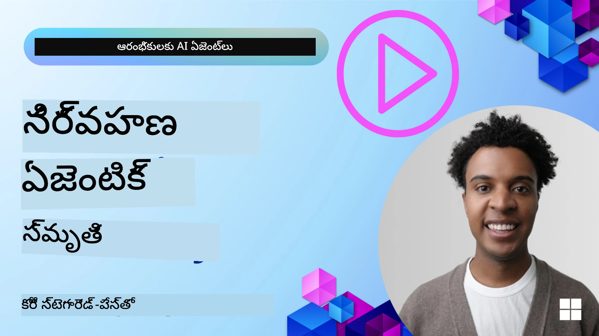

# AI ఏజెంట్ల కోసం జ్ఞాపకం  

AI ఏజెంట్లను సృష్టించడంలో ఉన్న ప్రత్యేక ప్రయోజనాలపై చర్చ చేస్తున్నప్పుడు, రెండు విషయాలు ప్రధానంగా చర్చించే అంశాలు ఉంటాయి: పనులను పూర్తి చేయడానికి టూల్స్‌ని పిలవగల సామర్థ్యం మరియు కాలక్రమేణా మెరుగుపడే సామర్థ్యం. మెమరీ అనేది ఆటోమెటిక్గా మెరుగుపడే ఏజెంట్‌ను సృష్టించడంలో మూలాధారం, ఇది మన వినియోగదారులకు మెరుగైన అనుభవాలను సృష్టిస్తుంది.

ఈ పాఠంలో, AI ఏజెంట్ల కోసం మెమరీ అంటే ఏమిటి, దాన్ని ఎలా నిర్వహించుకోవచ్చో మరియు మన అప్లికేషన్ల లాభాల కోసం దాన్ని ఎలా ఉపయోగించుకోవచ్చో చూసుకుందాం.

## పరిచయం

ఈ పాఠం కిందివి కవరుచేస్తుంది:

• **AI ఏజెంట్ మెమరీని అర్థం చేసుకోవడం**: మెమరీ అంటే ఏమిటి మరియు ఏజెంట్లు కోసమే అది అవసరమని ఎందుకు.

• **మెమరీ అమలు మరియు నిల్వ**: మీ AI ఏజెంట్లకు మెమరీ సామర్థ్యాలను జోడించేందుకు ప్రాక్టికల్ పద్ధతులు, ముఖ్యంగా షార్ట్-టర్మ్ మరియు లాంగ్-టర్మ్ మెమరీపై.

• **AI ఏజెంట్లు స్వయం మెరుగుపడేలా కావడం**: గత సంభాషణలనుంచి ఏజెంట్లు నేర్చుకోవటం మరియు కాలక్రమేణా మెరుగవటం ఎలా ఉందో.

## అందుబాటులో ఉన్న అమలు విధానాలు

ఈ పాఠంలో రెండు విస్తృతమైన నోట్‌బుక్ ట్యుటోరియల్స్ ఉన్నాయి:

• **[13-agent-memory.ipynb](./13-agent-memory.ipynb)**: Microsoft Agent Frameworkతో Mem0 మరియు Azure AI Search ఉపయోగించి మెమరీని అమలు చేస్తుంది  

• **[13-agent-memory-cognee.ipynb](./13-agent-memory-cognee.ipynb)**: Cognee ఉపయోగించి నిర్మాణాత్మక మెమరీని అమలు చేస్తుంది, ఎంబెడింగ్స్ ద్వారా కనిపించే జ్ఞాన గ్రాఫ్‌ను ఆటోమేటిక్‌గా ఏర్పాటు చేసి, గ్రాఫ్‌ను విజువలైజ్ చేసి, తెలివైన రిట్రీవల్ అందిస్తుంది  

## అభ్యాస లక్ష్యాలు

ఈ పాఠం పూర్తి చేసిన తర్వాత, మీరు ఎలా చేయాలో తెలుసుకుంటారు:

• **వివిధ రకాల AI ఏజెంట్ మెమరీల మధ్య తేడా గుర్తించటం**, ఇందులో వర్కింగ్, షార్ట్-టర్మ్, లాంగ్-టర్మ్ మెమరీ, అలాగే వ్యక్తిగతంగా మరియు ఎపిసోడియిక్ మెమరీ వంటి ప్రత్యేక రూపాలు ఉన్నాయి.  

• **Microsoft Agent Framework ఉపయోగించి AI ఏజెంట్ల కొరకు షార్ట్-టర్మ్ మరియు లాంగ్-టర్మ్ మెమరీని అమలు చేయడం మరియు నిర్వహించడం**, Mem0, Cognee, Whiteboard memory వంటి టూల్స్‌ను ఉపయోగించడం, Azure AI Searchతో సమన్వయం చేయడం.  

• **స్వయం మెరుగుపడే AI ఏజెంట్లు ఉన్న ప్రిన్సిపల్స్ అర్థం చేసుకోవడం** మరియు సుస్థిరమైన మెమరీ నిర్వహణ వ్యవస్థలు నిరంతర అభ్యాసానికి మరియు అనుకూలతకు ఎలా దోహదపడతాయో తెలుసుకోవడం.  

## AI ఏజెంట్ మెమరీని అర్థం చేసుకోవడం  

మౌలికంగా, **AI ఏజెంట్ల కోసం మెమరీ అంటే వారికి సమాచారం నిలుపుకోవటం మరియు గుర్తుపెట్టుకునేందుకు అనుమతించే యంత్రాంగాలు**. ఈ సమాచారం సంభాషణ గురించి ప్రత్యేక వివరాలు, వినియోగదారుల ఇష్టాలు, గత చర్యలు లేదా నేర్చుకున్న నమూనాలు కావచ్చు.  

మెమరీ లేకపోతే, AI అప్లికేషన్లు సాధారణంగా స్థితిలేని (stateless)వి, అంటే ప్రతి చర్యను మొదటిదినుంచి ప్రారంభిస్తాయి. ఇది పునరావృతమైన మరియు విసుగైన వినియోగదారుల అనుభవానికి దారితీస్తుంది, అప్పుడు ఏజెంట్ "గత సందర్భం లేదా ఇష్టాలను మర్చిపోయినట్లు" ఉంటాడు.  

### మెమరీ ఎందుకు ముఖ్యము?  

ఒక ఏజెంట్ యొక్క మేధస్సు దాని గత సమాచారాన్ని గుర్తు చేసుకోవటం మరియు వినియోగించుకోవటంపై గట్టిగా ఆధారపడి ఉంటుంది. మెమరీ ఏజెంట్లను ఇలా ఉండేలా చేస్తుంది:  

• **పునర్రిప్పణాత్మక**: గత చర్యలనుంచి నేర్చుకోవడం.  

• **ఆంతర్రాష్ట్రక**: కొనసాగుతున్న సంభాషణలో సందర్భాన్ని నిర్వహించడం.  

• **ప్రాథమిక మరియు ప్రతిస్పందనాత్మక**: చరిత్రాత్మక డేటాపై ఆధారపడి అవసరాలను ముందుగానే ఊహించడం లేదా సరైన సమాధానం ఇవ్వడం.  

• **స్వతంత్రం**: నిల్వ చేసిన జ్ఞానాన్ని ఉపయోగించి మరింత స్వతంత్రంగా పని చేయడం.  

మెమరీ అమలు లక్ష్యం ఏజెంట్లను మరింత **నమ్మదగిన మరియు సామర్థ్యవంతులుగా** మార్చటం.  

### మెమరీ రకాలు  

#### వర్కింగ్ మెమరీ  

ఇది ఏజెంట్ ఒక ప్రస్తుత, కొనసాగుతున్న పని లేదా ఆలోచనా ప్రక్రియలో ఉపయోగించే స్క్రాచ్ పేపర్‌లాగా భావించండి. ఇది తదుపరి దశను గణించడానికి అవసరమైన తక్షణ సమాచారం నిల్వ చేస్తుంది.  

AI ఏజెంట్లకు, వర్కింగ్ మెమరీ సాధారణంగా సంభాషణ నుండి అత్యంత సంబంధిత సమాచారాన్ని క్యాప్చర్ చేస్తుంది, ఇవి పూర్తి చాట్ చరిత్ర పొడవుగా ఉన్నా లేదా తగిలినట్టుగా ఉన్నా కూడా. ఇది అవసరాలు, ప్రతిపాదనలు, నిర్ణయాలు మరియు చర్యల వంటి ముఖ్య అంశాలను తీసుకోవడంపై దృష్టి సారిస్తుంది.  

**వర్కింగ్ మెమరీ ఉదాహరణ**  

ఒక ప్రయాణ బుకింగ్ ఏజెంట్‌లో, వర్కింగ్ మెమరీ వినియోగదారు ప్రస్తుత అభ్యర్థనను క్యాప్చర్ చేయవచ్చు, ఉదా: "నేను పారిస్‌కు ప్రయాణం బుక్ చేయదలిచాను". ఈ నిర్దిష్ట అవసరం ఏజెంట్ సమీప సందర్భంలో ఉంచబడుతుంది ప్రస్తుత సంభాషణకు మార్గనిర్దేశం చేయడానికి.  

#### షార్ట్ టర్మ్ మెమరీ  

ఈమెమరీ ఒకే సంభాషణ లేదా సెషన్ వ్యవధి కొరకు సమాచారం నిలుపుకుంటుంది. ఇది ప్రస్తుత చాట్ యొక్క సందర్భం, ఏజెంట్ డైలాగ్‌లో గత టర్న్లను.html గమనించడానికి అనుమతిస్తుంది.  

[Microsoft Agent Framework](https://github.com/microsoft/agent-framework) Python SDK నమూనాల్లో, ఇది `AgentSession`కు అనుగుణంగా ఉంటుంది, ఇది `agent.create_session()` తో సృష్టించబడుతుంది. సెషన్ ఫ్రేమ్‌వర్క్‌లో అంతర్గతంగా శార్ట్-టర్మ్ మెమరీ: అదే సెషన్ పునఃఉపయోగించే సమయంలో సంభాషణ సందర్భాన్ని అందిస్తుంది, కానీ సెషన్ ముగిసినప్పుడు లేదా అప్లికేషన్ రీస్టార్ట్ అయినప్పుడు ఆ సందర్భం నిల్వ చేయబడదు. నిజాలు మరియు ఇష్టాలను అనేక సెషన్‌ల మధ్య నిలుపుకోవడానికి సాధారణంగా డేటాబేస్, వెక్టర్ సూచిక లేదా మరొక స్థిర నిల్వ ఉపయోగించి లాంగ్-టర్మ్ మెమరీ వినియోగించండి.  

**షార్ట్ టర్మ్ మెమరీ ఉదాహరణ**  

వినియోగదారు "పారిస్ మీద విమాన ప్రయాణం ఎంత ఖర్చవుతుందో?" అని అడిగిన తరువాత "అక్కడ ఉండటానికి ఎట్లా ఉంటుందో?" అని అడిగితే, షార్ట్-టర్మ్ మెమరీ ఏజెంట్ "అక్కడ" అనేది అదే సంభాషణలో "పారిస్"కు సంబంధించిందని తెలుసుకోవడాన్ని నిర్ధారిస్తుంది.  

#### లాంగ్ టర్మ్ మెమరీ  

ఇది అనేక సంభాషణలు లేదా సెషన్‌లలో నిలిచిపోతున్న సమాచారం. ఇది ఏజెంట్లు వినియోగదారుల ఇష్టాలు, చరిత్రాత్మక సంభాషణలు, లేదా సాధారణ జ్ఞానాన్ని విస్తృత కాలం పాటు గుర్తుపెట్టుకోవడానికి అనుమతిస్తుంది. ఇది వ్యక్తిగతికరణ కొరకు ముఖ్యంగా ఉపయోగపడుతుంది.  

**లాంగ్ టర్మ్ మెమరీ ఉదాహరణ**  

ఒక లాంగ్-టర్మ్ మెమరీ "బెన్ స్కీయింగ్ మరియు బయట గేమ్స్‌ను ఇష్టపడుతాడు, ఎత్తైన పర్వతం వీక్షణతో కాఫీ ఇష్టపడుతాడు, గత గాయము కారణంగా అడ్వాన్స్డ్ స్కీ ట్రైల్స్‌ నుండి తప్పించుకోవాలనుకుంటాడు" అని నిల్వ చేయవచ్చు. ఈ సమాచారం గత సంభాషణల నుండి నేర్చుకున్నది, భవిష్యత్ ట్రావెల్ ప్లానింగ్ సెషన్‌లలో highly personalized సిఫార్సులకు ప్రభావం చూపుతుంది.  

#### పర్సోనా మెమరీ  

ఈ ప్రత్యేకమైన మెమరీ రకం ఏజెంట్‌కు స్థిరమైన "వ్యక్తిత్వం" లేదా "పర్సోనా" అభివృద్ధి చేయడంలో సహాయం చేస్తుంది. ఇది ఏజెంట్ తన గురించి లేదా దాని అభిప్రాయ రోల్ఆయింది వివరాలను గుర్తు పెట్టుకోవడానికి అనుమతిస్తుంది, సంభాషణలను మరింత సహజ మరియు లక్ష్యంతో నడిపిస్తుంది.  

**పర్సోనా మెమరీ ఉదాహరణ**  
ప్రయాణ ఏజెంట్ "నిపుణ స్కీ ప్లానర్"గా రూపకల్పన చేయబడినట్లయితే, పర్సోనా మెమరీ ఈ పాత్రను బలోపేతం చేస్తుంది, ప్రాతినిధ్య వచన ధోరణి మరియు జ్ఞానంతో సమాధానాలను ప్రభావితం చేస్తుంది.  

#### వర్క్‌ఫ్లో/ఎపిసోడియిక్ మెమరీ  

ఈ మెమరీ ఏజెంట్ ఒక సంక్లిష్ట పనిని చేస్తూ తీసుకున్న దశల క్రమాన్ని నిల్వ చేస్తుంది, విజయాలు మరియు విఫలతలతో సహా. ఇది గత "ఎపిసోడ్‌లు" లేదా అనుభవాలను గుర్తుపెట్టుకొని వాటి నుండి నేర్చుకోవటానికి లాంటిది.  

**ఎపిసోడియిక్ మెమరీ ఉదాహరణ**  

ఏజెంట్ ఒక ప్రత్యేక విమానాన్ని బుక్ చేయాలని ప్రయత్నించి అది అందుబాటులో లేకపోవడం వల్ల విఫలం అయితే, ఎపిసోడియిక్ మెమరీ ఈ విఫలతను నమోదు చేసి, తదుపరి ప్రయత్నంలో ప్రత్యామ్నాయ విమానాలను ప్రయత్నించడానికి లేదా యూజర్‌కు సమస్య గురించి సరైన సమాచారం ఇవ్వడానికి సహాయపడుతుంది.  

#### ఎంటిటీ మెమరీ  

ఇది సంభాషణల నుండి నిర్దిష్ట ఎంటిటీలను (వ్యక్తులు, ప్రదేశాలు, లేదా వస్తువులు) మరియు సంఘటనలను తీసుకుని గుర్తు పెట్టుకోవడమని సూచిస్తుంది. ఇది ఏజెంట్ ప్రధాన అంశాలను నిర్మాణాత్మకంగా అర్థం చేసుకోవడానికి అనుమతిస్తుంది.  

**ఎంటిటీ మెమరీ ఉదాహరణ**  

గత ప్రయాణ గురించి సంభాషణలో, ఏజెంట్ "పారిస్", "ఏఫిల్ టవర్", మరియు "Le Chat Noir రెస్టారెంట్‌లో డిన్నర్" వంటి ఎంటిటీలను తీసుకుని గుర్తుపెట్టుకోవచ్చు. భవిష్యత్ ఇంటరాక్షన్‌లో, ఆ ఏజెంట్ "Le Chat Noir"ని గుర్తుపెట్టి కొత్త బుకింగ్ చేయడానికీ సూచించవచ్చు.  

#### నిర్మాణాత్మక RAG (రిట్రీవల్ ఆగ్మెంటెడ్ జన‌రేషన్)  

RAG అనేది విస్తృతమైన పద్ధతి అయినప్పటికీ, "Structured RAG" ఒక శక్తివంతమైన మెమరీ సాంకేతికతగా ఉన్నది. ఇది వివిధ మూలాల నుండి (సంభాషణలు, ఇమెయిల్స్, చిత్రాలు) సాంద్ర, నిర్మాణాత్మక సమాచారాన్ని తీయడం మరియు దానిని ప్రతిస్పందనల్లో ప్రిసిషన్, రీకాల్ మరియు వేగాన్ని పెంచడానికి ఉపయోగిస్తుంది. క్లాసిక్ RAG semantic సమానత్వంపై ఆధారపడితే, Structured RAG సమాచారం యొక్క అంతర్నిహిత నిర్మాణంతో పనిచేస్తుంది.  

**Structured RAG ఉదాహరణ**  

కీవర్డ్లు మాత్రమే సరిపోయే బదులు, Structured RAG ఎమైల్ నుంచి ఫ్లైట్ వివరాలను (గమ్యం, తేదీ, సమయం, ఎయిర్‌లైన్) పార్స్ చేసి, నిర్మాణాత్మకంగా నిల్వ చేయవచ్చు. ఇది "నేను మంగళవారం పారిస్‌కు ఏ ఫ్లైట్ బుక్ చేశానో?" వంటి ఖచ్చితమైన ప్రశ్నల కోసం అనుమతిస్తుంది.  

## మెమరీ అమలు మరియు నిల్వ  

AI ఏజెంట్ల కోసం మెమరీ అమలు **మెమరీ నిర్వహణ** అనే వ్యస్థత క్రియల సమాహారాన్ని సూచిస్తుంది, దీనిలో ఉత్పత్తి, నిల్వ, పొందడం, సంయోజనం, నవీకరణ మరియు "మర్చిపోవడం" (లేదా తొలగించడం) కూడా ఉంటుంది. రిట్రీవల్ ముఖ్యమైన అంశం.  

### ప్రత్యేకమైన మెమరీ టూల్స్  

#### Mem0  

ఏజెంట్ మెమరీని నిల్వ చేయటానికి మరియు నిర్వహించడానికి ఒక మార్గం Mem0 వంటి ప్రత్యేక టూల్స్‌ను ఉపయోగించడం. Mem0 ఒక నిలువస్థితి మెమరీ లేయర్‌గా పని చేస్తుంది, ఏజెంట్లకు సంబంధిత ఇంటరాక్షన్లను గుర్తు చేసుకోవడానికి, వినియోగదారుల ఇష్టాలను మరియు వాస్తవ సందర్భాన్ని నిల్వ చేయడానికి మరియు విజయాలకు మరియు విఫలతలకు ఆధారంగా నేర్చుకోవడానికి అనుమతిస్తుంది. ఇక్కడ ఆలోచన ఏమిటంటే, స్థితిలేని ఏజెంట్లు స్థితిస్థాపకాయులుగా మారతాయి.  

ఇది **రెండు దశల మెమరీ పైప్‌లైన్: ఎక్స్‌ట్రాక్షన్ మరియు నవీకరణ** ద్వారా పనిచేస్తుంది. మొదట, ఏజెంట్ త్రెడ్‌కి జోడించిన సందేశాలు Mem0 సర్వీస్‌కు పంపబడతాయి, ఇది లార్జ్ లాంగ్వేజ్ మోడల్ (LLM) ఉపయోగించి సంభాషణ చరిత్రను సారాంశం చేసి కొత్త మెమరీలను తీసుకుంటుంది. ఆ తర్వాత, LLM ఆధారిత నవీకరణ దశ ఈ మెమరీలను జోడించాలా, మార్చాలా లేదా తొలగించాలా అన్నది నిర్ణయించి, వాటిని వెక్టర్, గ్రాఫ్, కీ-వెల్యూ డేటాబేస్‌లతో కూడిన హైబ్రిడ్ డేటా స్టోర్‌లో నిల్వ చేస్తుంది. ఈ వ్యవస్థ వివిధ మెమరీ రకాలనూ మద్దతు ఇస్తుంది, అలాగే ఎంటిటీల మధ్య సంబంధాల నిర్వహణ కోసం గ్రాఫ్ మెమరీని కూడా చేర్చుకోవచ్చు.  

#### Cognee  

మరో శక్తివంతమైన దృష్టికోణం **Cognee** అనే, AI ఏజెంట్ల కొరకు ఓపెన్-సోర్స్ సెమాంటిక్ మెమరీని ఉపయోగించడం, ఇది నిర్మాణాత్మక మరియు నిర్మాణాత్మక డేటాను ఎంబెడింగ్స్‌ ద్వారా బ్యాక్ చేసిన క్వేరియబుల్ జ్ఞాన గ్రాఫ్‌లుగా మారుస్తుంది. Cognee ఒక **డ్యూయల్-స్టోర్ ఆర్కిటెక్చర్**ని అందిస్తుంది, ఇది వెక్టర్ సమానత శోధనతో పాటు గ్రాఫ్ రిలేషన్షిప్‌లను కలుపుతుంది, ఏజెంట్లు సమాచారాలు సాదృశ్యంగా ఏవే కాకుండా అవి పరస్పరం ఎలా సంబంధించి ఉన్నాయో అర్థం చేసుకోవడానికీ సహాయపడుతుంది.  

ఇది **వెక్టార్ సమానత, గ్రాఫ్ నిర్మాణం, LLM తర్కం కలిపిన హైబ్రిడ్ రిట్రీవల్**లో ఉత్తమంగా ఉంటుంది - దృఢమైన చంక్ లుక్-అప్ నుండి గ్రాఫ్-అవేర్ ప్రశ్నల సమాధానం వరకు. వ్యవస్థ **జీవంత మెమరీ**ని నిర్వహిస్తుంది, ఇది అభివృద్ధి చెందుతూ మరియు పెరుగుతూ ఉంటుంది, ఒకటిగా అనుసంధానించిన గ్రాఫ్‌గా ఉండి, షార్ట్-టర్మ్ సెషన్ సందర్భం మరియు దీర్ఘకాల పద్మానం మేమరీ ఇద్దరినీ మద్దతు ఇస్తుంది.  

Cognee నోట్‌బుక్ ట్యుటోరియల్ ([13-agent-memory-cognee.ipynb](./13-agent-memory-cognee.ipynb)) ఈ ఏకీకృత మెమరీ లేయర్ తయారీలో ఉపయోగించినదాన్ని ప్రదర్శిస్తుంది, విభిన్న డేటా మూలాలను తీసుకోవడం, జ్ఞాన గ్రాఫ్‌ను విజువలైజ్ చేయడం, మరియు ఏజెంట్ అవసరాలకి తగిన వివిధ శోధన వ్యూహాలతో క్వరీలు చేయడం వంటి ప్రాక్టికల్ ఉదాహరణలతో.  

### RAGతో మెమరీ నిల్వ  

Mem0 వంటి ప్రత్యేకమైన మెమరీ టూల్స్ తో పాటు, మీరు **Azure AI Search ను మెమరీని నిల్వ చేయడానికి మరియు పొందడానికి బ్యాక్‌ఎండ్‌గా ఉపయోగించవచ్చు**, ముఖ్యంగా నిర్మాణాత్మక RAG కొరకు.  

ఇది మీ ఏజెంట్ల సమాధానాలను మీ స్వంత డేటాతో స్థిరపరచేందుకు అనుమతిస్తుంది, మరింత సంబంధిత మరియు ఖచ్చితమైన సమాధానాలను అందిస్తుంది. Azure AI Search వినియోగదారుల ప్రయాణ మెమరీలు, ఉత్పత్తి కాటలాగులు లేదా మరేదైనా డొమైన్-నిర్దిష్ట జ్ఞానాన్ని నిల్వ చేయటానికి ఉపయోగించవచ్చు.  

Azure AI Search **Structured RAG** వంటి సామర్థ్యాలను మద్దతు ఇస్తుంది, ఇది సంభాషణ చరిత్రలు, ఇమెయిల్స్, లేదా చిత్రాలు వంటి పెద్ద డాటాసెట్‌ల నుండి సాంద్ర, నిర్మాణాత్మక సమాచారాన్ని తీసుకుని ప్రతిస్పందనలలో "సూపర్‌హ్యూమన్ ప్రిసిషన్ మరియు రీకాల్" అందిస్తుంది, సాధారణ టెక్స్ట్ చంకింగ్ మరియు ఎంబెడింగ్ పద్ధతులతో పోలిస్తే.  

## AI ఏజెంట్లను స్వయం మెరుగుపర్చడం  

స్వయం మెరుగుపడే ఏజెంట్ల సాధారణ నమూనా ఒక **"జ్ఞాన ఏజెంట్"**ను పరిచయం చేయడాన్ని కలిగి ఉంటుంది. ఈ వేరుపడిన ఏజెంట్ యూజర్ మరియు ప్రాథమిక ఏజెంట్ మధ్య ప్రధాన సంభాషణను పరిశీలిస్తుంది. దీని పాత్ర:  

1. **విలువైన సమాచారాన్ని గుర్తించడం**: సంభాషణలో ఏ భాగం సాధారణ జ్ఞానంగా లేదా ప్రత్యేక వినియోగదారుల ఇష్టంగా సేవ్ చేయదచ్చు అని నిర్ణయించడం.  

2. **తీయడం మరియు సారాంశం చేయడం**: సంభాషణ నుండి ముఖ్యమైన పాఠం లేదా ఇష్టం తీసుకోవడం.  

3. **జ్ఞాన ఆధారంలో నిల్వ చేయడం**: తరచుగా వెక్టర్ డేటాబేస్‌లో ఈ తీసుకున్న సమాచారాన్ని నిల్వ చేయడం, తద్వారా తరువాత పొందగలగడం.  

4. **భవిష్యత్ ప్రశ్నలకు అదనం చేయడం**: యూజర్ కొత్త ప్రశ్న అడిగినప్పుడు, జ్ఞాన ఏజెంట్ సంబంధిత నిల్వ సమాచారాన్ని తెచ్చి యూజర్ ప్రాంప్ట్‌కు జత చేస్తుంది, ప్రాథమిక ఏజెంట్‌కు కీలకమైన సందర్భాన్ని అందిస్తుంది (RAG లాంటిది).  

### మెమరీ కోసం ఆప్టిమైజేషన్లు  

• **లేటెన్సీ నిర్వహణ**: వినియోగదారుల ఇంటరాక్షన్లను మందగింపచేయకుండా ఉండేందుకు, మొదట అసలు స్వల్ప ఖర్చు, వేగవంతమైన మోడల్ ఉపయోగించి సమాచారాన్ని నిల్వ చేయడం లేదా పొందడం విలువైనదో లేదో త్వరగా తనిఖీ చేసి, అవసరమైనప్పుడు మాత్రమే సంక్లిష్టమైన ఎక్స్‌ట్రాక్షన్/రిట్రీవల్ ప్రక్రియను ఆహ్వానించడం.  

• **జ్ఞాన ఆధారం నిర్వహణ**: పెరుగుతున్న జ్ఞాన ఆధారానికి, తక్కువగా వాడే సమాచారాన్ని ఖర్చులను నిర్వహించేందుకు "కోల్డ్ స్టోరేజ్"కి తరలించడం.  

## ఏజెంట్ మెమరీ గురించి ఇంకా ప్రశ్నలు ఉన్నాయా?  

[Microsoft Foundry Discord](https://discord.com/invite/ATgtXmAS5D)లో చేరండి, మరిన్ని అభ్యాసకులతో కలుసుకునేందుకు, ఆఫీసు గంటల్లో పాల్గొనడానికి మరియు మీ AI ఏజెంట్ల ప్రశ్నలకు సమాధానాలు పొందడానికి.  

---

<!-- CO-OP TRANSLATOR DISCLAIMER START -->
**అస్వీకరణ**:
ఈ పత్రం AI అనువాద సేవ [Co-op Translator](https://github.com/Azure/co-op-translator) ఉపయోగించి అనువదించబడింది. మేము ఖచ్చితత్వానికి ప్రయత్నిస్తున్నప్పటికీ, ఆటోమేటెడ్ అనువాదాలు తప్పులు లేదా అసమగ్రతలను కలిగి ఉండవచ్చు. దాని స్వదేశ భాషలో ఉన్న అసలు పత్రాన్ని అధికారం కలిగిన మూలంగా పరిగణించాలి. కీలకమైన సమాచారం కోసం, ప్రొఫెషనల్ మానవ అనువాదాన్ని సిఫారసు చేస్తాము. ఈ అనువాదం ఉపయోగం వల్ల కలిగే ఏవైనా అపార్థాలు లేదా తప్పుదారులు కోసం మేము బాధ్యత వహించము.
<!-- CO-OP TRANSLATOR DISCLAIMER END -->