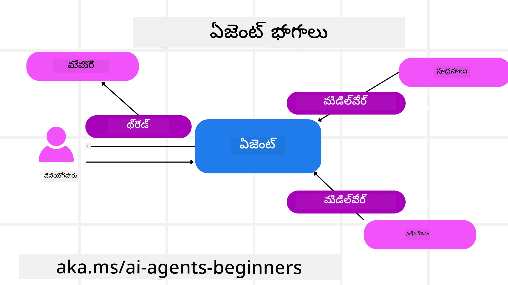

# Microsoft Agent Framework అన్వేషణ


### పరిచయం

ఈ పాఠం ఇవి గురించి కవర్ చేస్తుంది:

- Microsoft Agent Framework ను అర్థం చేసుకోవడం: ముఖ్య ఫీచర్లు మరియు విలువ  
- Microsoft Agent Framework యొక్క ముఖ్య కాన్సెప్ట్స్ ను అన్వేషించడం
- ఉన్నత MAF నమూనాలు: వర్క్‌ఫ్లోలు, మధ్యంతర సాఫ్ట్‌వేర్, మరియు మెమరీ

## అధ్యయన లక్ష్యాలు

ఈ పాఠం పూర్తయిన తర్వాత, మీరు తెలుసుకుంటారు:

- Microsoft Agent Framework ను ఉపయోగించి ప్రొడక్షన్ రెడీ AI ఏజెంట్లను నిర్మించడం  
- Microsoft Agent Framework యొక్క ప్రధాన ఫీచర్లను మీ ఏజెంటిక్ వినియోగ కేసులకు వర్తించుట  
- వర్క్‌ఫ్లోలు, మధ్యంతర సాఫ్ట్‌వేర్, మరియు ఆబ్జర్వబిలిటీ సహా ఉన్నత నమూనాలను ఉపయోగించడం

## కోడ్ నమూనాలు

[Microsoft Agent Framework (MAF)](https://aka.ms/ai-agents-beginners/agent-framewrok) కొరకు కోడ్ నమూనాలు ఈ రిపాజిటరీలో `xx-python-agent-framework` మరియు `xx-dotnet-agent-framework` ఫైళ్లలో పొందుపరచబడ్డాయి.

## Microsoft Agent Framework అర్థం చేసుకోవడం


[Microsoft Agent Framework (MAF)](https://aka.ms/ai-agents-beginners/agent-framewrok) అనేది AI ఏజెంట్లను నిర్మించడానికి Microsoft యొక్క ఏకైక ఫ్రేమ్‌వర్క్. ఇది ప్రొడక్షన్ మరియు పరిశోధనా వాతావరణాలలో కనిపించే విస్తృత రకముల ఏజెంటిక్ వినియోగకేసుల కోసం అనువైన సరళతను అందిస్తుంది, అందులో:

- దశలవారీ వర్క్‌ఫ్లోలు అవసరమైన సందర్భాలలో **సీక్వెన్షియల్ ఏజెంట్ ఆర్కెస్ట్రేషన్**  
- ఏజెంట్లు ఒకేసారి పనులు పూర్తి చేయాల్సిన సందర్భాలలో **కంకరెంట్ ఆర్కెస్ట్రేషన్**  
- ఏజెంట్లు ఒక పనిపై కలసి పనిచేసే సందర్భాలలో **గ్రూప్ చాట్ ఆర్కెస్ట్రేషన్**  
- ఉపపనుల పూర్తి అయినప్పుడు ఏజెంట్లు పనిని ఒకరినుంచి మరొకరికి పాసు చేసే సందర్భాలలో **హ్యాండ్ ఆఫ్ ఆర్కెస్ట్రేషన్**  
- మేనేజర్ ఏజెంట్ పనుల జాబితాను సృష్టించి సవరించే మరియు ఉపఏజెంట్ల సమన్వయాన్ని నిర్వహించే సందర్భాలలో **మాగ్నెటిక్ ఆర్కెస్ట్రేషన్**

ప్రొడక్షన్‌లో AI ఏజెంట్లను అందించడానికి, MAF క్రింది ఫీచర్లను కూడా కలిగి ఉంది:

- ప్రతీ AI ఏజెంట్ చర్య, టూల్ పిలుపు, ఆర్కెస్ట్రేషన్ దశలు, తర్కప్రవాహాలు మరియు Microsoft Foundry డాష్‌బోర్డ్స్ ద్వారా పనితీరు నిరীক্ষణ హోదలుగా, **OpenTelemetry వలన ఆబ్జర్వబిలిటీ**  
- Microsoft Foundryలో స్థానికంగా ఏజెంట్లను హోస్ట్ చేయడం ద్వారా **భద్రత**; ఇందులో పాత్ర ఆధారిత యాక్సెస్, ప్రైవేట్ డేటా నిర్వహణ, మరియు బిల్ట్-ఇన్ కంటెంట్ సేఫ్టీ ఉంటాయి  
- ఏజెంట్ థ్రెడ్లు మరియు వర్క్‌ఫ్లోలు తప్పులు వచ్చినప్పుడు పాజ్, రీస్యూమ్ మరియు రికవరీ చేయగలవు కాబట్టి **దృఢత్వం**  
- హ్యూమన్ ఇన్ ది లూప్ వర్క్‌ఫ్లోలను మద్దతు దొరకడం వలన **నియంత్రణ**; పనులు మానవ ఆమోదం అవసరమని గుర్తించబడతాయి

Microsoft Agent Framework ను అంతర సంబంధీయంగా చేయడం కూడా లక్ష్యం:

- **క్లౌడ్-అగ్నాస్టిక్** - ఏజెంట్లు కంటెయినర్లు, ఆన్-ప్రెమిస్ మరియు బహుళ క్లౌడ్‌లలో నడపబడవచ్చు  
- **ప్రొవైడర్-అగ్నాస్టిక్** - Azure OpenAI మరియు OpenAI సహా మీ ఇష్టమైన SDK ద్వారా ఏజెంట్లు సృష్టించుకోవచ్చు  
- **ఓపెన్ స్టాండర్డ్స్ ఇంటిగ్రేషన్** - Agent-to-Agent(A2A) మరియు Model Context Protocol (MCP) వంటి ప్రోటోకాల్స్ ఉపయోగించి ఇతర ఏజెంట్లు మరియు టూల్స్ కనుగొనడం మరియు ఉపయోగించడం  
- **ప్లగిన్లు మరియు కనెక్టర్లు** - Microsoft Fabric, SharePoint, Pinecone మరియు Qdrant వంటి డేటా మరియు మెమరీ సేవలకు కనెక్షన్లు చేయడం

ఇప్పుడు ఈ ఫీచర్లు Microsoft Agent Framework యొక్క కొన్ని ముఖ్య కాన్సెప్ట్‌లలో ఎలా వర్తించబడుతున్నాయో పరిశీలిద్దాం.

## Microsoft Agent Framework యొక్క ముఖ్య కాన్సెప్ట్‌లు

### ఏజెంట్లు



**ఏజెంట్లు సృష్టించుట**

ఏజెంట్ సృష్టి అనేది ఇన్ఫరెన్స్ సర్వీస్ (LLM ప్రొవైడర్), AI ఏజెంట్ అనుసరించాల్సిన సూచనల సమితి, మరియు కేటాయించిన `name` ను నిర్వచించడం ద్వారా జరుగుతుంది:

```python
agent = AzureOpenAIChatClient(credential=AzureCliCredential()).create_agent( instructions="You are good at recommending trips to customers based on their preferences.", name="TripRecommender" )
```
  
పై ఉదాహరణ `Azure OpenAI` ను ఉపయోగిస్తోంది కాని ఏజెంట్లు వివిధ సర్వీసుల ఉపయోగంతో కూడా సృష్టించవచ్చు ఉదా: `Microsoft Foundry Agent Service`:

```python
AzureAIAgentClient(async_credential=credential).create_agent( name="HelperAgent", instructions="You are a helpful assistant." ) as agent
```
  
OpenAI `Responses`, `ChatCompletion` APIs

```python
agent = OpenAIResponsesClient().create_agent( name="WeatherBot", instructions="You are a helpful weather assistant.", )
```
  
```python
agent = OpenAIChatClient().create_agent( name="HelpfulAssistant", instructions="You are a helpful assistant.", )
```
  
లేదా A2A ప్రోటోకాల్ ఉపయోగించి రిమోట్ ఏజెంట్లను:

```python
agent = A2AAgent( name=agent_card.name, description=agent_card.description, agent_card=agent_card, url="https://your-a2a-agent-host" )
```
  
**ఏజెంట్లను నడపడం**

ఏజెంట్లు `.run` లేదా `.run_stream` మెథడ్స్ ద్వారా నడిపించబడతాయి, అవి స్ట్రీమింగ్ లేదా నాన్-స్ట్రీమింగ్ రెస్పాన్సెస్ కోసం ఉన్నాయి.

```python
result = await agent.run("What are good places to visit in Amsterdam?")
print(result.text)
```
  
```python
async for update in agent.run_stream("What are the good places to visit in Amsterdam?"):
    if update.text:
        print(update.text, end="", flush=True)

```
  
ప్రతి ఏజెంట్ నడపడానికి `max_tokens`, ఏజెంట్ పిలవగల `tools`, మరియు ఏజెంట్ కోసం ఉపయోగించే `model` వంటి పరామితులు అనుకూలీకరించవచ్చు.

ఇది యూజర్ పనిని పూర్తి చేయడానికి నిర్దిష్ట మోడళ్లు లేదా టూల్స్ అవసరమైన సందర్భాలలో ఉపయోగపడుతుంది.

**టూల్స్**

టూల్స్ ను ఏజెంట్ నిర్వచించే సమయంలో నిర్వచించవచ్చు:

```python
def get_attractions( location: Annotated[str, Field(description="The location to get the top tourist attractions for")], ) -> str: """Get the top tourist attractions for a given location.""" return f"The top attractions for {location} are." 


# సత్వరమే ChatAgent సృష్టించినప్పుడు

agent = ChatAgent( chat_client=OpenAIChatClient(), instructions="You are a helpful assistant", tools=[get_attractions]

```
  
అలాగే ఏజెంట్ నడిపే సమయంలో కూడా:

```python

result1 = await agent.run( "What's the best place to visit in Seattle?", tools=[get_attractions] # ఈ రన్ కోసం మాత్రమే అందించిన సాధనం )
```
  
**ఏజెంట్ థ్రెడ్లు**

ఏజెంట్ థ్రెడ్లు బహుళ-టర్న్ సంభాషణలను నిర్వహించేందుకు ఉపయోగిస్తారు. థ్రెడ్లు క్రింది విధంగా సృష్టించవచ్చు:

- `get_new_thread()` ఉపయోగించి, ఇది సమయంతో పాటు థ్రెడ్‌ను సేవ్ చేయగలదు  
- ఏజెంట్ నడిపేటప్పుడు ఆటోమేటిక్‌గా థ్రెడ్ సృష్టించడం, ఇది ప్రస్తుత పరుగులో మాత్రమే స్థిరంగా ఉంచుతుంది

థ్రెడ్ సృష్టించడానికి కోడ్ ఇలాగే ఉంటుంది:

```python
# కొత్త థ్రెడ్‌ను సృష్టించండి.
thread = agent.get_new_thread() # ఆ థ్రెడ్‌తో ఏజెంట్‌ను నడపండి.
response = await agent.run("Hello, I am here to help you book travel. Where would you like to go?", thread=thread)

```
  
మరి తర్వాత థ్రెడ్‌ని తర్వాత ఉపయోగంచుకోవడానికి సిరియలైజ్ చేసుకోవచ్చు:

```python
# కొత్త థ్రెడ్‌ను సృష్టించండి.
thread = agent.get_new_thread() 

# ఆ థ్రెడ్‌తో ఏజెంట్‌ను నడపండి.

response = await agent.run("Hello, how are you?", thread=thread) 

# నిల్వ కోసం థ్రెడ్‌ను సీరియలైజ్ చేయండి.

serialized_thread = await thread.serialize() 

# నిల్వ నుండి లోడ్ చేసిన తర్వాత థ్రెడ్ స్థితిని డీసీరియలైజ్ చేయండి.

resumed_thread = await agent.deserialize_thread(serialized_thread)
```
  
**ఏజెంట్ మధ్యంతర సాఫ్ట్‌వేర్**

ఏజెంట్లు టూల్స్ మరియు LLMs తో ఇంటరాక్ట్ అవుతూ యూజర్ పనిని పూర్తి చేస్తాయి. కొన్ని సందర్భాల్లో, ఈ ఇంటరాక్షన్‌ల మధ్య చర్యలను సరళీకృతం లేదా ట్రాక్ చేయాలనుకుంటాం. ఏజెంట్ మధ్యంతర సాఫ్ట్‌వేర్ దీన్ని సాధించడానికి అవకాశం ఇస్తుంది:

*ఫంక్షన్ middleware*

ఈ middleware ఏజెంట్ మరియు అది పిలిచే ఫంక్షన్/టూల్ మధ్య చర్యను అమలు చేస్తుంది. ఉదాహరణకు, మీరు ఫంక్షన్ పిలుపుపై లాగింగ్ చేయాలనుకునే సందర్భంలో ఇది ఉపయోగిస్తుంది.

క్రింది కోడ్‌లో `next` పై middleware లేదా అసలైన ఫంక్షన్ పిలవాలి అన్నది నిర్ణయిస్తుంది.

```python
async def logging_function_middleware(
    context: FunctionInvocationContext,
    next: Callable[[FunctionInvocationContext], Awaitable[None]],
) -> None:
    """Function middleware that logs function execution."""
    # ప్రీ-ప్రాసెసింగ్: ఫంక్షన్ అమలున ముందు లాగ్ చేయండి
    print(f"[Function] Calling {context.function.name}")

    # తదుపరి మిడిల్‌వేర్ లేదా ఫంక్షన్ అమలుకి కొనసాగండి
    await next(context)

    # పోస్ట్-ప్రాసెసింగ్: ఫంక్షన్ అమలుకి తర్వాత లాగ్ చేయండి
    print(f"[Function] {context.function.name} completed")
```
  
*చాట్ middleware*

ఈ middleware ఏజెంట్ మరియు LLM మధ్య అడిగే అభ్యర్థనల మధ్య చర్యను అమలు లేదా లాగ్ చేయడానికి ఉపయోగపడుతుంది.  

ఇది AI సర్వీస్‌కు పంపబడుతున్న `messages` వంటి ముఖ్యమైన సమాచారాన్ని కలిగి ఉంటుంది.

```python
async def logging_chat_middleware(
    context: ChatContext,
    next: Callable[[ChatContext], Awaitable[None]],
) -> None:
    """Chat middleware that logs AI interactions."""
    # ముందస్తు ప్రాసెసింగ్: AI కాల్‌కు ముందు లాగ్
    print(f"[Chat] Sending {len(context.messages)} messages to AI")

    # తదుపరి మిడిల్వేర్ లేదా AI సేవకు కొనసాగించండి
    await next(context)

    # తరువాత ప్రాసెసింగ్: AI స్పందన తర్వాత లాగ్
    print("[Chat] AI response received")

```
  
**ఏజెంట్ మెమరీ**

`Agentic Memory` పాఠంలో కవర్ చేసినట్లుగా, మెమరీ ఏజెంట్ వివిధ సందర్భాలపై పనిచేయడానికీ ముఖ్య అంశం. MAF వివిధ రకాల మెమరీలు అందిస్తుంది:

*ఇన్-మెమరీ స్టోరేజ్*

అప్లికేషన్ రన్‌టైంలో థ్రెడ్లలో నిల్వ చేసిన మెమరీ.

```python
# కొత్త థ్రెడ్ సృష్టించండి.
thread = agent.get_new_thread() # ఆ థ్రెడ్‌తో ఏజెంట్‌ని నడపండి.
response = await agent.run("Hello, I am here to help you book travel. Where would you like to go?", thread=thread)
```
  
*పర్సిస్టెంట్ సందేశాలు*

విభిన్న సెషన్ల మాడల వారి సంభాషణ చరిత్ర నిల్వ కోసం ఉపయోగించే మెమరీ. ఇది `chat_message_store_factory` ఉపయోగించి నిర్వచించబడుతుంది:

```python
from agent_framework import ChatMessageStore

# ఒక కస్టమ్ మెసేజ్ స్టోర్ సృష్టించండి
def create_message_store():
    return ChatMessageStore()

agent = ChatAgent(
    chat_client=OpenAIChatClient(),
    instructions="You are a Travel assistant.",
    chat_message_store_factory=create_message_store
)

```
  
*డైనమిక్ మెమరీ*

ఏజెంట్లు నడపడముందు కంటెక్స్ట్‌కు జోడించిన మెమరీ. ఇవి mem0 వంటి బాహ్య సేవల్లో నిల్వ చేయబడవచ్చు:

```python
from agent_framework.mem0 import Mem0Provider

# మెమరీ యొక్క ప్రగతి సామర్ధ్యాల కోసం Mem0 ఉపయోగించడం
memory_provider = Mem0Provider(
    api_key="your-mem0-api-key",
    user_id="user_123",
    application_id="my_app"
)

agent = ChatAgent(
    chat_client=OpenAIChatClient(),
    instructions="You are a helpful assistant with memory.",
    context_providers=memory_provider
)

```
  
**ఏజెంట్ ఆబ్జర్వబిలิตี้**

ఆబ్జర్వబిలిటీ విశ్వసనీయమైన మరియు నిర్వహించదగిన ఏజెంటిక్ సిస్టమ్స్ నిర్మాణానికి కీలకం. MAF tracing మరియు మెటర్ల కొరకై OpenTelemetryతో సమగ్రీకరణ కలిగి ఉంది.

```python
from agent_framework.observability import get_tracer, get_meter

tracer = get_tracer()
meter = get_meter()
with tracer.start_as_current_span("my_custom_span"):
    # ఏదైనా చేయండి
    pass
counter = meter.create_counter("my_custom_counter")
counter.add(1, {"key": "value"})
```
  
### వర్క్‌ఫ్లోలు

MAF వర్క్‌ఫ్లోలు ఒక పని పూర్తి చేయాలన్న ముందస్తుగా నిర్వచించిన దశల సమాహారం, వాటిలో AI ఏజెంట్లు భాగాలుగా ఉంటాయి.

వర్క్‌ఫ్లోలు మెరుగైన నియంత్రణ ప్రవాహానికి అనుమతించే అనేక భాగాలతో నిర్మించబడ్డాయి. వర్క్‌ఫ్లోలు **బహుళ ఏజెంట్ ఆర్కెస్ట్రేషన్** మరియు వర్క్‌ఫ్లో యొక్క స్థితులను సేవ్ చేసే **checkpointing** ని కూడా అనుమతిస్తాయి.

వర్క్‌ఫ్లో యొక్క ప్రాథమిక భాగాలు:

**ఎగ్జిక్యూటర్లు**

ఎగ్జిక్యూటర్లు ఇన్‌పుట్ సందేశాలు పొందుతారు, వారి కేటాయింపు పనులు చేస్తారు, మరియు అవుట్‌పుట్ సందేశాన్ని ఉత్పత్తి చేస్తారు. ఇది వర్క్‌ఫ్లోని పెద్ద పనిని పూర్తి చేబడడానికి ముందుకెళ్తుంది. ఎగ్జిక్యూటర్లు AI ఏజెంట్ లేదా కస్టమ్ లాజిక్ తయారవచ్చు.

**ఎడ్జెస్**

వర్క్‌ఫ్లోలో సందేశాల ప్రవాహాన్ని నిర్వచించడానికి ఎడ్జెస్ ఉపయోగిస్తారు. ఇవి:

*నేరుగా సంబంధం (Direct Edges)* - ఎగ్జిక్యూటర్ల మధ్య సరళమైన ఒకటి నుండి ఒకటికి కనెక్షన్లు:

```python
from agent_framework import WorkflowBuilder

builder = WorkflowBuilder()
builder.add_edge(source_executor, target_executor)
builder.set_start_executor(source_executor)
workflow = builder.build()
```
  
*నిబంధన ఆధారిత ఎడ్జెస్* - కొన్ని నిబంధనలు తీరిన తర్వాత ఎనేబుల్ అవుతాయి. ఉదా. హోటల్ గది లభించకపోవడం సందర్భంలో, ఎగ్జిక్యూటర్ వేరే ఆప్షన్లు సూచిస్తుంది.

*స్విచ్-కేస్ ఎడ్జెస్* - నిర్వచించిన నిబంధనల ఆధారంగా సందేశాలను వివిధ ఎగ్జిక్యూటర్లకు పంపడం. ఉదా. ప్రయాణ కస్టమర్‌కు ప్రాధాన్యత యాక్సెస్ ఉంటే, వారి పనులు వేరే వర్క్‌ఫ్లో ద్వారా నిర్వహించబడతాయి.

*ఫ్యాన్-అవుట్ ఎడ్జెస్* - ఒక సందేశాన్ని అనేక లక్ష్యాలకి పంపించడం.

*ఫ్యాన్-ఇన్ ఎడ్జెస్* - వివిధ ఎగ్జిక్యూటర్ల నుంచి బహుళ సందేశాలు సేకరించి ఒక్కో లక్ష్యానికి పంపించడం.

**సంఘటనలు (Events)**

MAF వర్క్‌ఫ్లోలలో మెరుగైన ఆబ్జర్వబిలిటీకి, ఎగ్జిక్యూషన్‌కు సంబంధించిన లోకల్ ఈవెంట్లను అందిస్తుంది:

- `WorkflowStartedEvent`  - వర్క్‌ఫ్లో ప్రారంభం
- `WorkflowOutputEvent` - వర్క్‌ఫ్లో అవుట్‌పుట్ ఉత్పత్తి చేస్తోంది
- `WorkflowErrorEvent` - వర్క్‌ఫ్లో లోపం ఎదుర్కొంటోంది
- `ExecutorInvokeEvent`  - ఎగ్జిక్యూటర్ ప్రాసెసింగ్ మొదలుపెట్టింది
- `ExecutorCompleteEvent`  -  ఎగ్జిక్యూటర్ ప్రాసెసింగ్ పూర్తిచేసింది
- `RequestInfoEvent` - అభ్యర్థన జారీ చేయబడింది

## ఉన్నత MAF నమూనాలు

పై విభాగాలు Microsoft Agent Framework యొక్క ముఖ్య కాన్సెప్ట్‌లను మండుటాయి. మీరు మరింత సంక్లిష్ట agentలను నిర్మించేటప్పుడు, పరిగణనలోకి తీసుకోవాల్సిన ఉన్నత నమూనాలు:

- **మధ్యంతర (middleware) సమకూర్పు**: ఫంక్షన్ మరియు చాట్ మధ్యంతరంలను చైనింగ్ చేయడం (లాగింగ్, ఆథ్, రేట్-లిమిటింగ్) ద్వారా ఏజెంట్ ప్రవర్తనపై మరింత నియంత్రణ.  
- **వర్క్‌ఫ్లో checkpointing**: వర్క్‌ఫ్లో ఈవెంట్లు మరియు సిరియలైజేషన్ ఉపయోగించి పొడుగ్గా నడిచే ఏజెంట్ ప్రక్రియలను సేవ్ చేసి తిరిగి ప్రారంభించడం.  
- **డైనమిక్ టూల్ ఎంపిక**: MAF యొక్క టూల్ నమోదు తో కలిసి RAG ని టూల్ వివరణలపై ఉపయోగించి, చొరవైన ప్రశ్నకు మాత్రమే సంబంధిత టూల్స్ చూపించడం.  
- **బహుళ ఏజెంట్ హ్యాండ్‌ఆఫ్**: వర్క్‌ఫ్లో ఎడ్జెస్ మరియు నిబంధన ఆధారిత రౌటింగ్ ఉపయోగించి ప్రత్యేక ఏజెంట్ల మధ్య హ్యాండ్‌ఆఫ్ ఆర్కెస్ట్రేట్ చేయడం.

## కోడ్ నమూనాలు 

Microsoft Agent Framework కొరకు కోడ్ నమూనాలు ఈ రిపాజిటరీలో `xx-python-agent-framework` మరియు `xx-dotnet-agent-framework` ఫైళ్లలో అందుబాటులో ఉన్నాయి.

## Microsoft Agent Framework గురించి మరిన్ని ప్రశ్నలు ఉన్నాయా?

ఇతర అభ్యాసకులతో కలుస్తూ, ఆఫీస్ అవర్స్ అటెండ్ చేస్తూ, మీ AI ఏజెంట్ల ప్రశ్నలకు సమాధానాలు పొందడానికి [Microsoft Foundry Discord](https://aka.ms/ai-agents/discord) లో చేరండి.

---

<!-- CO-OP TRANSLATOR DISCLAIMER START -->
**అస్పష్టత**:  
ఈ పత్రం AI అనువాద సేవ [Co-op Translator](https://github.com/Azure/co-op-translator) ఉపయోగించి అనువదించబడింది. మేము ఖచ్చితత్వాన్ని లక్ష్యంగా పెట్టుకున్నప్పటికీ, ఆటోమేటిక్ అనువాదాల్లో పొరపాట్లు లేదా లోపాలు ఉండగలవంటివి. మాతృభాషలోని మౌలిక పత్రాన్ని అధికారిక మూలం గా పరిగణించాలి. కీలకమైన సమాచారం కోసం, ప్రొఫెషనల్ మానవ అనువాదం చేయించుకోవడం ఉత్తమం. ఈ అనువాదం వలన వచ్చే ఏవైనా అవగాహన లోపాలు లేదా తప్పుల కోసం మేము బాధ్యత వహించము.
<!-- CO-OP TRANSLATOR DISCLAIMER END -->