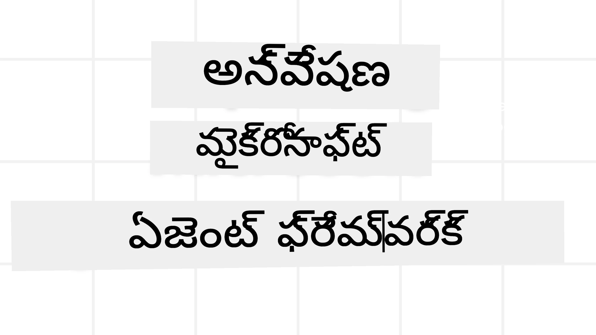
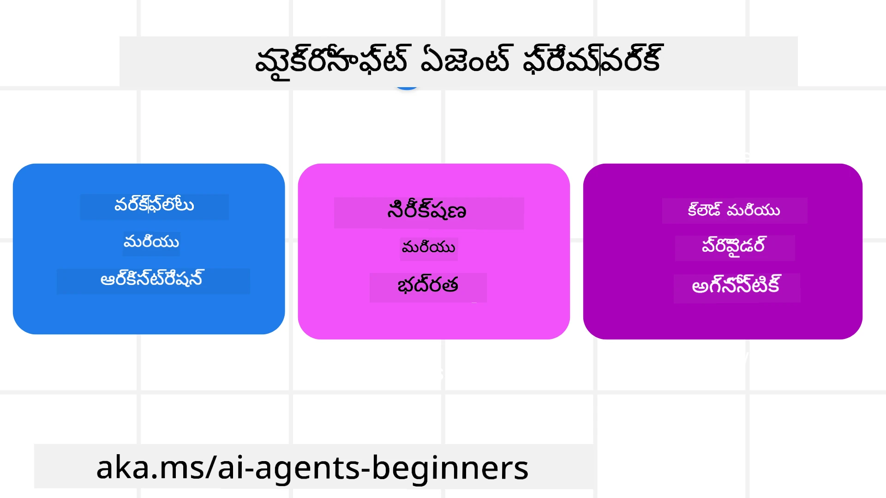
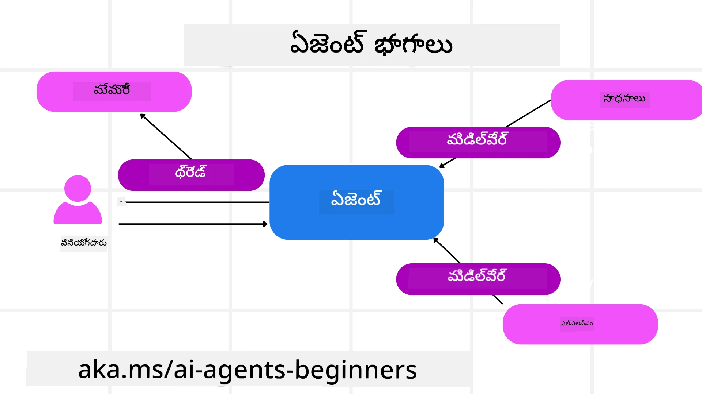

# మైక్రోసాఫ్ట్ ఏజెంట్ ఫ్రేమ్‌వర్క్ అన్వేషణ



### పరిచయం

ఈ పాఠం కవర్ చేస్తుంది:

- మైక్రోసాఫ్ట్ ఏజెంట్ ఫ్రేమ్‌వర్క్: ముఖ్య లక్షణాలు మరియు విలువ ను అర్ధం చేసుకోవడం  
- మైక్రోసాఫ్ట్ ఏజెంట్ ఫ్రేమ్‌వర్క్ యొక్క కీలక సిద్ధాంతాలను అన్వేషించడం
- ఆధునిక MAF నమూనాలు: వర్క్‌ఫ్లోలు, మిడిల్‌వేర్, మరియు మెమరీ

## నేర్చుకునే లక్ష్యాలు

ఈ పాఠం పూర్తి చేసిన తరువాత, మీరు తెలుసుకుంటారు:

- మైక్రోసాఫ్ట్ ఏజెంట్ ఫ్రేమ్‌వర్క్ ఉపయోగించి ప్రొడక్షన్ రెడీ AI ఏజెంట్ల నిర్మాణం
- మీ ఏజెంటిక్ సందర్భాలకు మైక్రోసాఫ్ట్ ఏజెంట్ ఫ్రేమ్‌వర్క్ యొక్క మూల లక్షణాలను అన్వయించడం
- వర్క్‌ఫ్లోలు, మిడిల్‌వేర్, మరియు పరిశీలన సహా అధునిక నమూనాలను ఉపయోగించడం

## కోడ్ నమూనాలు 

[Microsoft Agent Framework (MAF)](https://learn.microsoft.com/en-us/agent-framework/overview/?wt.mc_id=youtube_26688_organicsocial_reactor&pivots=programming-language-python) కోసం కోడ్ నమూనాలు ఈ రిపోజిటరీలో `xx-python-agent-framework` మరియు `xx-dotnet-agent-framework` ఫైళ్లలో కనుగొనవచ్చు.

## మైక్రోసాఫ్ట్ ఏజెంట్ ఫ్రేమ్‌వర్క్ అర్థం చేసుకోవడం



[Microsoft Agent Framework (MAF)](https://learn.microsoft.com/en-us/agent-framework/overview/?wt.mc_id=youtube_26688_organicsocial_reactor&pivots=programming-language-python) అనేది AI ఏజెంట్లను నిర్మించడానికి మైక్రోసాఫ్ట్ యొక్క ఏకీకృత ఫ్రేమ్‌వర్క్. ఇది ప్రొడక్షన్ మరియు పరిశోధనా వాతావరణాలలో కనిపించే విస్తృత ఏజెంటిక్ ఉపయోగ సందర్భాలను పరిష్కరించడానికి అనువైన అనుకూలతను అందిస్తుంది, వీటిలో ఉన్నాయి:

- **సక్రమ దశలవారీ ఏజెంట్ ఆర్కెస్ట్రేషన్** ఆ వాతావరణాలలో, దశలవారీకి వైల్డ్ వర్క్‌ఫ్లో అవసరం.
- **సమకాలీన ఆర్కెస్ట్రేషన్** ఆ వాతావరణాలలో, ఏజెంట్లు ఒకేసారి పనులు పూర్తి చేయాలి.
- **గ్రూప్ చాట్ ఆర్కెస్ట్రేషన్** ఇక్కడ ఏజెంట్లు ఒకే పనిపై కలిసి పని చేయగలరు.
- **హ్యాండాఫ్ ఆర్కెస్ట్రేషన్** ఇక్కడ ఏజెంట్లు ఉప పనులు పూర్తయిన తరువాత ఒకరికి పనిని హస్తాంతరం చేస్తారు.
- **మాగ్నెటిక ఆర్కెస్ట్రేషన్** ఇక్కడ మేనేజర్ ఏజెంట్ ఒక పనితాలిక రూపంలో సృష్టించి, సబ్ ఏజెంట్ల సమన్వయం నిర్వహిస్తుంది.

AI ఏజెంట్లను ప్రొడక్షన్‌లో అందించడానికి, MAF క్రింది లక్షణాలను కూడా కలిగి ఉంది:

- **పరిశీలన (Observability)**: AI ఏజెంట్ యొక్క ప్రతి చర్యకు, టూల్ కాల్, ఆర్కెస్ట్రేషన్ దశలు, కారణం ప్రవాహాలు, మరియు Microsoft Foundry డ్యాష్‌బోర్డ్ల ద్వారా పనితీరు పర్యవేక్షణతో OpenTelemetry ఉపయోగించడం.
- **సెక్యూరిటీ**: Microsoft Foundryలో సహజంగా ఏజెంట్లను హోస్ట్ చేయడం, ఇందులో పాత్ర ఆధారిత ప్రవేశ నియంత్రణ, ప్రైవేట్ డేటా నిర్వహణ మరియు బిల్ట్-ఇన్ కంటెంట్ సేఫ్టీ ఉంటాయి.
- **ధృఢత్వం**: ఏజెంట్ థ్రెడ్లు మరియు వర్క్‌ఫ్లోలు ఎరర్లు వచ్చినప్పుడు ఆపి, పునఃప్రారంభం చేయగలవు, దీని వల్ల పెద్దకాలం అమలు చేసే ప్రాసెస్‌లు చేయగలవు.
- **కంట్రోల్**: మానవ ఒప్పుదల అవసరమయ్యే పనులు గుర్తింపు స్తాయిలో మానవ నిమగ్నత వర్క్‌ఫ్లోలను మద్దతిస్తుంది.

మైక్రోసాఫ్ట్ ఏజెంట్ ఫ్రేమ్‌వర్క్ అంతరప్రవాహాన్ని (ఇంటరోపరేబిలిటీ) లక్ష్యంగా పెట్టుకుంది:

- **క్లౌడ్-నిర్పేధకత** - ఏజెంట్లు కంటిunerలలో, ఆన్-ప్రెమిస్, మరియు అనేక క్లౌడ్లలో నడవవచ్చు.
- **ప్రముఖ SDK లకు మద్దతు** - ఏజెంట్లను మీ ఇష్టమైన SDKల avulla సృష్టించవచ్చు, Azure OpenAI మరియు OpenAI సహా
- **ఓపెన్ ప్రమాణాలతో సమగ్రపరచడం** - Agent-to-Agent(A2A) మరియు Model Context Protocol (MCP) వంటి ప్రోటకాల్న ఉపయోగించి ఇతర ఏజెంట్లు మరియు టూల్‌లను కనుగొని ఉపయోగించవచ్చు.
- **ప్లగిన్లు మరియు కనెక్టర్లు** - Microsoft Fabric, SharePoint, Pinecone మరియు Qdrant వంటి డేటా మరియు మెమరీ సేవలతో కనెక్షన్లు లభించవచ్చు.

ఈ లక్షణాలు మైక్రోసాఫ్ట్ ఏజెంట్ ఫ్రేమ్‌వర్క్ యొక్క కొన్ని మూలసిద్ధాంతాలకు ఎలా వర్తిస్తాయో చూద్దాం.

## మైక్రోసాఫ్ట్ ఏజెంట్ ఫ్రేమ్‌వర్క్ యొక్క కీలక సూత్రాలు

### ఏజెంట్లు



**ఏజెంట్లు సృష్టించడం**

ఏజెంట్ సృష్టి LLM ప్రొవైడర్ అనే ఇన్ఫరెన్స్ సేవను నిర్వచించడం ద్వారా, ఏజెంట్ అనుసరించవలసిన సూచనల శ్రేణిని, మరియు ప్రదాత `name` ను అప్పగించడం చేస్తారు:


```python
agent = AzureOpenAIChatClient(credential=AzureCliCredential()).create_agent( instructions="You are good at recommending trips to customers based on their preferences.", name="TripRecommender" )
```

పైకు `Azure OpenAI` ఉపయోగిస్తున్నారు కానీ ఏజెంట్లు వివిధ సేవల ఆధారంగా సృష్టించవచ్చు, ఉదాహరణకు `Microsoft Foundry Agent Service`:

```python
AzureAIAgentClient(async_credential=credential).create_agent( name="HelperAgent", instructions="You are a helpful assistant." ) as agent
```

OpenAI `Responses`, `ChatCompletion` APIs

```python
agent = OpenAIResponsesClient().create_agent( name="WeatherBot", instructions="You are a helpful weather assistant.", )
```

```python
agent = OpenAIChatClient().create_agent( name="HelpfulAssistant", instructions="You are a helpful assistant.", )
```

లేదా [MiniMax](https://platform.minimaxi.com/), ఇది OpenAI అనుకూల APIని పెద్ద కంటెక్ట్ విండోస్ (204K టోకెన్ల వరకు) తో అందిస్తుంది:

```python
agent = OpenAIChatClient(base_url="https://api.minimax.io/v1", api_key=os.environ["MINIMAX_API_KEY"], model_id="MiniMax-M3").create_agent( name="HelpfulAssistant", instructions="You are a helpful assistant.", )
```

లేదా A2A ప్రోటోకాల్ ఉపయోగించి రిమోట్ ఏజెంట్లు:

```python
agent = A2AAgent( name=agent_card.name, description=agent_card.description, agent_card=agent_card, url="https://your-a2a-agent-host" )
```

**ఏజెంట్లు నడపడం**

ఏజెంట్లు `.run` లేదా `.run_stream` పద్ధతులతో స్ర్తామ్ లేని లేదా స్ట్రీమింగ్ ప్రతిస్పందనలకు నడిపించబడతాయి.

```python
result = await agent.run("What are good places to visit in Amsterdam?")
print(result.text)
```

```python
async for update in agent.run_stream("What are the good places to visit in Amsterdam?"):
    if update.text:
        print(update.text, end="", flush=True)

```

ప్రతి ఏజెంట్ రన్ లో `max_tokens`, ఏజెంట్ పిలవగల `tools`, మరియు ఏజెంట్ కోసం ఉపయోగించే `model` వంటి అమరికలను కస్టమైజ్ చేయవచ్చు.

ఇది నిర్దిష్ట మోడళ్ళు లేదా టూల్స్ అవసరమయ్యే సందర్భాలలో ఉపయోగకరం.

**సాధనాలు (Tools)**

సాధనాలను ఏజెంట్ నిర్వచనం సమయంలో:

```python
def get_attractions( location: Annotated[str, Field(description="The location to get the top tourist attractions for")], ) -> str: """Get the top tourist attractions for a given location.""" return f"The top attractions for {location} are." 


# ChatAgent ను నేరుగా సృష్టించే సమయంలో

agent = ChatAgent( chat_client=OpenAIChatClient(), instructions="You are a helpful assistant", tools=[get_attractions]

```

మరియు ఏజెంట్ నడపడానికి కూడా నిర్వచించవచ్చు:

```python

result1 = await agent.run( "What's the best place to visit in Seattle?", tools=[get_attractions] # ఈ రన్ కోసం మాత్రమే అందించబడిన సాధనం )
```

**ఏజెంట్ థ్రెడ్స్**

ఏజెంట్ థ్రెడ్లు బహుళ-తిరుగుడు సంభాషణలను నిర్వహించడానికి ఉపయోగిస్తారు. థ్రెడ్లు క్రింది విధంగా సృష్టించవచ్చు:

- `get_new_thread()` ఉపయోగించి, ఇది థ్రెడ్‌ను సమయక్రమంలో నిల్వ చేయడాన్ని అనుమతిస్తుంది
- ఏజెంట్ నడపగానే ఆటోమేటిక్‌గా థ్రెడును సృష్టించి, ప్రస్తుత రన్ సమయంలో మాత్రమే ఉండేలా చేయడం.

థ్రెడును సృష్టించేందుకు కోడ్ ఇలా ఉంటుంది:

```python
# కొత్త థ్రెడ్‌ను సృష్టించండి.
thread = agent.get_new_thread() # థ్రెడ్‌తో ఏజెంట్‌ను నడపండి.
response = await agent.run("Hello, I am here to help you book travel. Where would you like to go?", thread=thread)

```

తర్వాత మీరు దీన్ని నిల్వచేయడానికి సీరియలైజ్ చేయవచ్చు:

```python
# కొత్త థ్రెడ్ సృష్టించండి.
thread = agent.get_new_thread() 

# థ్రెడ్‌తో ఏజెంట్‌ను నడపండి.

response = await agent.run("Hello, how are you?", thread=thread) 

# నిల్వ కోసం థ్రెడ్‌ను సీరియలైజ్ చేయండి.

serialized_thread = await thread.serialize() 

# నిల్వ నుండి లోడ్ చేసిన తర్వాత థ్రెడ్ స్థితిని డిసీరియలైజ్ చేయండి.

resumed_thread = await agent.deserialize_thread(serialized_thread)
```

**ఏజెంట్ మిడిల్‌వేర్**

ఏజెంట్లు సాధనాలు మరియు LLMలతో పరస్పర చర్య చేయడానికి ఉపయోగిస్తారు. కొన్ని సందర్భాలలో, ఈ పరస్పర చర్యల మధ్యలో ఎగ్జిక్యూట్ చేయలసి లేదా ట్రాక్ చేయలసి వస్తుంది. ఏజెంట్ మిడిల్‌వేర్ ఈ అవకాశాన్ని ఇస్తుంది:

*ఫంక్షన్ మిడిల్‌వేర్*

ఈ మిడిల్‌వేర్ ఏజెంట్ మరియు పిలవబడే ఫంక్షన్/సాధనం మధ్య మధ్యంతర చర్యను ఎగ్జిక్యూట్ చేసే అవకాశం ఇస్తుంది. ఉదాహరణకు, ఫంక్షన్ కాల్ పై లాగ్ చేసుకోవడం అవసరమైతే.

క్రింది కోడ్‌లో `next` అంటే తదుపరి మిడిల్‌వేర్ లేదా అసలు ఫంక్షన్ పిలవాలా అని నిర్ణయిస్తుంది.

```python
async def logging_function_middleware(
    context: FunctionInvocationContext,
    next: Callable[[FunctionInvocationContext], Awaitable[None]],
) -> None:
    """Function middleware that logs function execution."""
    # ముందస్తు ప్రాసెసింగ్: ఫంక్షన్ అమలు మునుపు లాగ్ చేయండి
    print(f"[Function] Calling {context.function.name}")

    # తదుపరి మిడిల్వేర్ లేదా ఫంక్షన్ అమలుకి కొనసాగించండి
    await next(context)

    # తరువాత ప్రాసెసింగ్: ఫంక్షన్ అమలు అనంతరం లాగ్ చేయండి
    print(f"[Function] {context.function.name} completed")
```

*చాట్ మిడ్‌ల‌వేర్*

ఈ మిడిల్‌వేర్ ఏజెంట్ మరియు LLM మధ్య అభ్యర్థనలు మధ్య చర్యను ఎగ్జిక్యూట్ లేదా లాగ్ చేయడానికి ఉపయోగిస్తారు.

ఇందులో AI సేవకు పంపబడుతున్న `messages` వంటి ముఖ్యమైన సమాచారముంటుంది.

```python
async def logging_chat_middleware(
    context: ChatContext,
    next: Callable[[ChatContext], Awaitable[None]],
) -> None:
    """Chat middleware that logs AI interactions."""
    # ముందస్తు ప్రాసెసింగ్: AI కాల్ మునుపు లాగ్
    print(f"[Chat] Sending {len(context.messages)} messages to AI")

    # తదుపరి మిడిల్‌వేర్ లేదా AI సేవకు కొనసాగించండి
    await next(context)

    # తర్వాతి ప్రాసెసింగ్: AI ప్రతిస్పందన తరువాత లాగ్
    print("[Chat] AI response received")

```

**ఏజెంట్ మెమరీ**

`Agentic Memory` పాఠంలో చెప్పినట్లుగా, మెమరీ ఏజెంట్ వివిధ సందర్భాల్లో పనిచేయడానికి ముఖ్య భాగం. MAF వివిధ రకాల మెమరీలను అందిస్తుంది:

*ఇన్-మెమరీ స్టోరేజ్*

ఇది అప్లికేషన్ రంటైమ్‌లో థ్రెడ్లలో నిల్వ చేసే మెమరీ.

```python
# ఒక కొత్త థ్రెడ్‌ను సృష్టించండి.
thread = agent.get_new_thread() # ఆ ఏజెంట్‌ను ఆ థ్రెడ్‌తో నడపండి.
response = await agent.run("Hello, I am here to help you book travel. Where would you like to go?", thread=thread)
```

*పర్సిస్ట్ మెసేజెస్*

ఇది వేర్వేరు సెషన్లలో సంభాషణ చరిత్ర నిల్వ కోసం ఉపయోగిస్తారు. `chat_message_store_factory` ఉపయోగించి నిర్వచించబడుతుంది:

```python
from agent_framework import ChatMessageStore

# ఒక కస్టమ్ సందేశ స్టోర్ సృష్టించండి
def create_message_store():
    return ChatMessageStore()

agent = ChatAgent(
    chat_client=OpenAIChatClient(),
    instructions="You are a Travel assistant.",
    chat_message_store_factory=create_message_store
)

```

*డైనమిక్ మెమరీ*

ఇది ఏజెంట్లు నడపడంముందు సందర్భానికి జత చేయబడుతుంది. mem0 వంటి బాహ్య సేవలలో నిల్వ చేయవచ్చు:

```python
from agent_framework.mem0 import Mem0Provider

# మెమోరీ యొక్క అధునాతన సామర్థ్యాల కోసం Mem0 ఉపయోగించడం
memory_provider = Mem0Provider(
    api_key="your-mem0-api-key",
    user_id="user_123",
    application_id="my_app"
)

agent = ChatAgent(
    chat_client=OpenAIChatClient(),
    instructions="You are a helpful assistant with memory.",
    context_providers=memory_provider
)

```

**ఏజెంట్ పరిశీలన (Observability)**

పరిశీలన ఔత్సాహిక, విశ్వసనీయమైన ఏజెంటిక్ వ్యవస్థలను నిర్మించడంలో ముఖ్యం. MAF OpenTelemetry తో సమగ్రపరచబడింది, ట్రేసింగ్ మరియు మీటర్లను అందిస్తుంది.

```python
from agent_framework.observability import get_tracer, get_meter

tracer = get_tracer()
meter = get_meter()
with tracer.start_as_current_span("my_custom_span"):
    # ఏదైనా చేయండి
    pass
counter = meter.create_counter("my_custom_counter")
counter.add(1, {"key": "value"})
```

### వర్క్‌ఫ్లోలు

MAF వర్క్‌ఫ్లోలను అందిస్తుంది, ఇవి ప్రీ-డిఫైన్డ్ దశల సమూహం, పూర్తిచేసే పనికి మరియు AI ఏజెంట్లు వాటి భాగాలు.

వర్క్‌ఫ్లో వివిధ భాగాలతో తయారవుతాయి, ఇవి మెరుగైన కంట్రోల్ ఫ్లోను అనుమతిస్తాయి. వర్క్‌ఫ్లోలు **బహుళ ఏజెంట్ ఆర్కెస్ట్రేషన్** మరియు **చెక్‌పాయింటింగ్** ద్వారా వర్క్‌ఫ్లో స్థితులను కాపాడు చేస్తాయి.

వర్క్‌ఫ్లో యొక్క ప్రాతినిధ్య భాగాలు:

**ఎగ్జిక్యూటర్లు**

ఎగ్జిక్యూటర్లు ఇన్‌పుట్ సందేశాలను స్వీకరించి, కేటాయించిన పనులు చేస్తాయి, తదుపరి అవుట్‌పుట్ సందేశాన్ని ఉత్పత్తి చేస్తాయి. ఈ విధంగా వర్క్‌ఫ్లో పెద్ద పనిని పూర్తిచేస్తుంది. ఎగ్జిక్యూటర్లు AI ఏజెంట్లు లేదా కస్టమ్ లాజిక్ కావచ్చు.

**ఎడ్జిలు (Edges)**

వర్క్‌ఫ్లోలో సందేశ ప్రవాహాన్ని నిర్వచించడానికి ఎడ్జిలను ఉపయోగిస్తారు. ఇవి:

*ప్రత్యక్ష ఎడ్జిలు* - ఎగ్జిక్యూటర్ల మధ్య సింపుల్ 1:1 కనెక్షన్లు:

```python
from agent_framework import WorkflowBuilder

builder = WorkflowBuilder()
builder.add_edge(source_executor, target_executor)
builder.set_start_executor(source_executor)
workflow = builder.build()
```

*నిబంధనాత్మక ఎడ్జిలు* - కొన్ని షరతు నెరవేరిన తర్వాత చురుకుగా ఉంటాయి. ఉదా, హోటల్ గదులు లభ్యం కానప్పుడు, ఎగ్జిక్యూనర్ ఎంపికలు సూచించవచ్చు.

*స్విచ్-కేస్ ఎడ్జిలు* - షరతుల ఆధారంగా సందేశాలను వేరువేరు ఎగ్జిక్యూటర్లకు మార్గదర్శనం చేస్తాయి. ఉదా, ప్రయాణ కస్టమర్‌కు ప్రాధాన్య ప్రవేశం ఉంటే, వారి పనులు వేరే వర్క్‌ఫ్లో ద్వారా నిర్వహించబడతాయి.

*ఫ్యాన్-అవుట్ ఎడ్జిలు* - ఒక సందేశాన్ని బహుళ లక్ష్యాలకు పంపడం.

*ఫ్యాన్-ఇన్ ఎడ్జిలు* - వేర్వేరు ఎగ్జిక్యూటర్ల నుండి బహుళ సందేశాలను సేకరించి ఒక లక్ష్యానికి పంపడం.

**ఈవెంట్లు**

వర్క్‌ఫ్లోలు మరింత పరిశీలనకు, MAF ఎగ్జిక్యూషన్ కోసం బిల్ట్-ఇన్ ఈవెంట్లను అందిస్తుంది, వీటిలో:

- `WorkflowStartedEvent`  - వర్క్‌ఫ్లో అమలు ప్రారంభమవుతుంది
- `WorkflowOutputEvent` - వర్క్‌ఫ్లో అవుట్‌పుట్ ఉత్పత్తి చేస్తుంది
- `WorkflowErrorEvent` - వర్క్‌ఫ్లోలో లోపం సంభవిస్తుంది
- `ExecutorInvokeEvent`  - ఎగ్జిక్యూటర్ పని ప్రారంభం
- `ExecutorCompleteEvent`  - ఎగ్జిక్యూటర్ పని ముగింపు
- `RequestInfoEvent` - ఒక అభ్యర్థన జారీ

## అధునాతన MAF నమూనాలు

పై భాగంలో మైక్రోసాఫ్ట్ ఏజెంట్ ఫ్రేమ్‌వర్క్ యొక్క ముఖ్యమైన సూత్రాలు అందించబడ్డాయి. మీరు మరింత సంక్లిష్ట ఏజెంట్లు నిర్మిస్తున్నప్పుడు, కొన్ని అధునాతన నమూనాలు పరిగణించవచ్చు:

- **మిడిల్‌వేర్ కంపోజిషన్**: ఫంక్షన్ మరియు చాట్ మిడిల్‌వేర్ ఉపయోగించి వివిధ మిడిల్‌వేర్ హ్యాండ్లర్లను (లాగింగ్, ఆథ్, రేట్-లిమిటింగ్) చైన్ చేయడం, ఏజెంట్ ప్రవర్తనపై సూక్ష్మ నియంత్రణకు.
- **వర్క్‌ఫ్లో చెక్‌పాయింటింగ్**: వర్క్‌ఫ్లో ఈవెంట్లు మరియు సీరియలైజేషన్ ఉపయోగించి దీర్ఘకాలిక ఏజెంట్ ప్రాసెస్‌లను నిల్వ చేసి పునఃప్రారంభించడం.
- **డైనమిక్ టూల్ సెలెక్షన్**: MAF యొక్క టూల్ రిజిస్ట్రేషన్ సమర్పణతో RAG టూల్ వివరణలపై కలిపి, ప్రతి ప్రశ్నకు సంబంధిత టూల్‌లను మాత్రమే చూపించడం.
- **బహుళ ఏజెంట్ హ్యాండాఫ్**: వర్క్‌ఫ్లో ఎడ్జిలు మరియు నిబంధనాత్మక మార్గదర్శకం ఉపయోగించి ప్రత్యేక ఏజెంట్‌ల మధ్య హ్యాండాఫ్ ఆర్కెస్ట్రేషన్ చేయడం.

## మైక్రోసాఫ్ట్ Foundryలో LangChain / LangGraph ఏజెంట్లు హోస్టింగ్

మైక్రోసాఫ్ట్ ఏజెంట్ ఫ్రేమ్‌వర్క్ **ఫ్రేమ్‌వర్క్ అంతరప్రేవాహం** కలిగి ఉంది — మీరు MAFతో రాసిన ఏజెంట్లలో మాత్రమే పరిమితులు ఉండవు. మీరు ఇప్పటికే **LangChain** లేదా **LangGraph** తో ఏజెంట్ రూపొందించిందేనా, దాన్ని **Microsoft Foundry హోస్టెడ్ ఏజెంట్** గా నడిపించుకోవచ్చు, అప్పుడు Foundry రన్‌టైమ్, సెషన్లు, స్కేలు, గుర్తింపు మరియు ప్రోటోకాల్ ఎండ్‌పాయింట్లను నిర్వహిస్తుంది, మీ ఏజెంట్ లాజిక్ LangGraphలోనే ఉంటుంది.

ఇది `langchain_azure_ai.agents.hosting` ప్యాకేజీతో చేస్తారు, ఇది Foundry హోస్టెడ్ ఏజెంట్ల ఉపయోగించే ప్రోటోకాల్లపై కంపైల్ చేసిన LangGraph గ్రాఫ్‌ను మాపిస్తుంది.

**1. హోస్టింగ్ ఎక్స్‌ట్రా ఇన్‌స్టాల్ చేయండి:**

```bash
pip install -U "langchain-azure-ai[hosting]>=1.2.4" azure-identity
```

`hosting` ఎక్స్‌ట్రా Foundry ప్రోటోకాల్ లైబ్రరీలను ఇన్‌స్టాల్ చేస్తుంది: `azure-ai-agentserver-responses` (OpenAI అనుకూల `/responses` ఎండ్ పాయింట్) మరియు `azure-ai-agentserver-invocations` (సాధారణ `/invocations` ఎండ్ పాయింట్).

**2. ఒక హోస్టింగ్ ప్రోటోకాల్ ఎంచుకోండి:**

| ప్రోటోకాల్ | హోస్ట్ క్లాస్ | ఎండ్‌పాయింట్ | ఈ సందర్భంలో ఉపయోగించండి |
|----------|-----------|----------|----------|
| **Responses** | `ResponsesHostServer` | `/responses` | మీరు OpenAI అనుకూల చాట్, స్ట్రీమింగ్, ప్రతిస్పందన చరిత్ర, మరియు సంభాషణ థ్రెట్టింగ్ కోరుకుంటే — సంభాషణ ఏజెంటులకు సిఫార్సు చేయబడిన డిఫాల్ట్. |
| **Invocations** | `InvocationsHostServer` | `/invocations` | మీరు కస్టమ JSON ఆకారం, webhook-శైలి ఎండ్‌పాయింట్, లేదా అసంఖ్యాక ప్రక్రియ కోరుకుంటే. |

ఎందుకంటే **Responses API Foundryలో ఏజెంట్-శైలి అభివృద్ధికి ప్రాథమిక API**, ఎక్కువ ఏజెంట్లకు `ResponsesHostServer` తో ప్రారంభించండి.

**3. పర్యావరణ చరాలను కాన్ఫిగర్ చేయండి** (`az login` మొదట, అందువల్ల `DefaultAzureCredential` ప్రామాణీకరణ చేయగలదు):

```bash
export FOUNDRY_PROJECT_ENDPOINT="https://<resource>.services.ai.azure.com/api/projects/<project>"
export FOUNDRY_MODEL_NAME="gpt-5-mini"
```

ఏజెంట్ తరువాత Foundryలో హోస్టెడ్ ఏజెంట్ గా నడిచేటప్పుడు, ప్లాట్‌ఫారమ్ `FOUNDRY_PROJECT_ENDPOINT` ను ఆటోమాటిక్ గా ఇన్జెక్ట్ చేస్తుంది.

**4. Responses ప్రోటోకాల్ పై LangGraph ఏజెంట్ ను ఎక్స్‌పోస్ చేయండి:**

```python
import os

from azure.ai.projects import AIProjectClient
from azure.identity import DefaultAzureCredential, get_bearer_token_provider
from langchain.agents import create_agent
from langchain_openai import ChatOpenAI
from langchain_azure_ai.agents.hosting import ResponsesHostServer

_AZURE_AI_SCOPE = "https://ai.azure.com/.default"


def build_chat_model() -> ChatOpenAI:
    project_endpoint = os.environ["FOUNDRY_PROJECT_ENDPOINT"].rstrip("/")
    deployment = os.environ.get("FOUNDRY_MODEL_NAME", "gpt-5-mini")
    credential = DefaultAzureCredential()
    project = AIProjectClient(endpoint=project_endpoint, credential=credential)
    openai_client = project.get_openai_client()
    token_provider = get_bearer_token_provider(credential, _AZURE_AI_SCOPE)

    # ChatOpenAI ఇక్కడ Foundry ప్రాజెక్టు యొక్క OpenAI-అనుకూల (పასუხాలు) ఎండ్‌పాయింట్‌ను లక్ష్యంగా తీసుకుంటుంది.
    return ChatOpenAI(
        model=deployment,
        base_url=str(openai_client.base_url),
        api_key=token_provider,
    )


def main() -> None:
    graph = create_agent(build_chat_model(), tools=[])
    port = int(os.environ.get("PORT", "8088"))
    ResponsesHostServer(graph).run(port=port)


if __name__ == "__main__":
    main()
```

స్థానికంగా `python main.py` తో నడిపించండి, తరువాత Responses అభ్యర్థనను `http://localhost:8088/responses` కు పంపండి.

**ప్రధాన ప్రవర్తనలు:**

- **సంభాషణలు**: క్లైయింట్లు `previous_response_id` లేదా `conversation` ID ని పంపించి సంభాషణ కొనసాగిస్తారు. మీ గ్రాఫ్ LangGraph చెక్‌పాయింటర్ తో కంపైల్ అయితే, Foundry సంభాషణ స్థితిని చెక్‌పాయింట్ కి కీ చేస్తుంది (ప్రొడక్షన్ లో ధృఢమైన చెక్‌పాయింటర్ ఉపయోగించండి; స్థానిక పరీక్షకు `MemorySaver` సరిపోతుంది).
- **హ్యూమన్-ఇన్-ది-లూప్**: మీ గ్రాఫ్ LangGraph `interrupt()` ఉపయోగిస్తే, `ResponsesHostServer` పెండింగ్ విరామాన్ని Responses `function_call` / `mcp_approval_request` అంశంగా చూపిస్తుంది, మరియు క్లైయెంట్లు సరిపడిన `function_call_output` / `mcp_approval_response` తో కొనసాగుతారు.
- **Foundryకి పంపండి**: Azure Developer CLI ఉపయోగించండి — `azd ext install azure.ai.agents`, `azd ai agent init -m <manifest>`, `azd ai agent run` (స్థానిక, Docker అవసరం), తరువాత `azd provision` మరియు `azd deploy`. హోస్టెడ్-ఏజెంట్ మోపె ఈవెంట్లో **Foundry Project Manager** పాత్ర అవసరం.

ఈ ఉదాహరణ యొక్క నడిచే వెర్షన్ [code-samples/14-langchain-hosted-agent.py](../../../14-microsoft-agent-framework/code-samples/14-langchain-hosted-agent.py)లో ఉంది. పూర్తి వాకుతున్న (Invocations ప్రోటోకాల్, కస్టమ్ అభ్యర్థన స్కీమాలు, మరియు సమస్య పరిష్కారం) కోసం [Foundry హోస్టెడ్ ఏజెంట్లుగా LangGraph ఏజెంట్లను హోస్ట్ చేయడం](https://learn.microsoft.com/azure/foundry/how-to/develop/langchain-hosted-agents) చూడండి.

## కోడ్ నమూనాలు 

మైక్రోసాఫ్ట్ ఏజెంట్ ఫ్రేమ్‌వర్క్‌కు సంబంధించిన కోడ్ నమూనాలు ఈ రిపోజిటరీ లో `xx-python-agent-framework` మరియు `xx-dotnet-agent-framework` ఫైల్స్ లో ఉన్నాయి.

## మైక్రోసాఫ్ట్ ఏజెంట్ ఫ్రేమ్‌వర్క్ గురించి ఇంకా ప్రశ్నలున్నాయా?

[Microsoft Foundry Discord](https://discord.com/invite/ATgtXmAS5D)లో చేరండి, ఇతర అభ్యాసకులతో కలుసుకోండి, పాఠశాల సమయాల్లో పాల్గొనండి మరియు మీ AI ఏజెంట్ల ప్రశ్నలకు సమాధానాలు పొందండి.
## గత పాఠం

[AI ఏజెంట్ల కోసం మెమరీ](../13-agent-memory/README.md)

## తదుపరి పాఠం

[కంప్యూటర్ వినియోగ ఏజెంట్ల నిర్మాణం (CUA)](../15-browser-use/README.md)

---

<!-- CO-OP TRANSLATOR DISCLAIMER START -->
**అస్వీకరణ**:
ఈ పత్రం AI అనువాద సేవ [Co-op Translator](https://github.com/Azure/co-op-translator) ఉపయోగించి అనువదించబడింది. మేము ఖచ్చితత్వానికి ప్రయత్నిస్తున్నప్పటికీ, ఆటోమేటెడ్ అనువాదాలు తప్పులు లేదా అసమగ్రతలను కలిగి ఉండవచ్చు. దాని స్వదేశ భాషలో ఉన్న అసలు పత్రాన్ని అధికారం కలిగిన మూలంగా పరిగణించాలి. కీలకమైన సమాచారం కోసం, ప్రొఫెషనల్ మానవ అనువాదాన్ని సిఫారసు చేస్తాము. ఈ అనువాదం ఉపయోగం వల్ల కలిగే ఏవైనా అపార్థాలు లేదా తప్పుదారులు కోసం మేము బాధ్యత వహించము.
<!-- CO-OP TRANSLATOR DISCLAIMER END -->