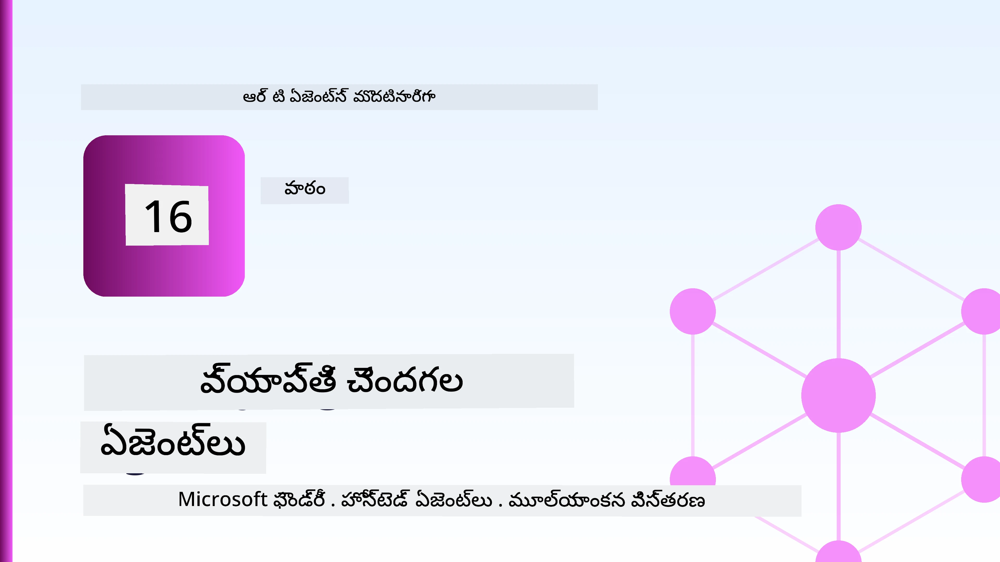
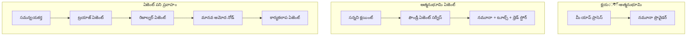
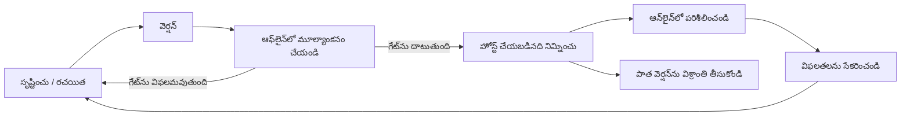
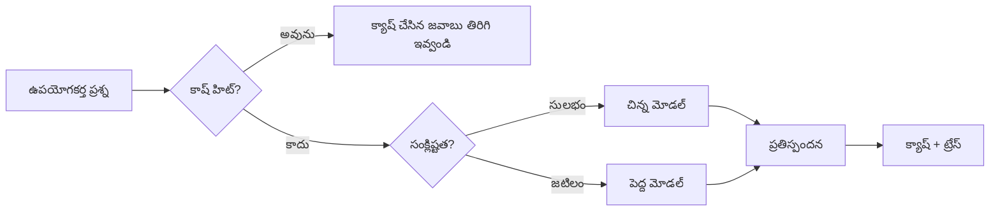
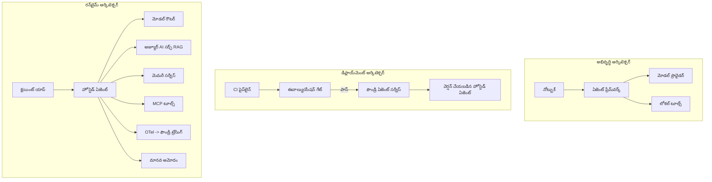

# Microsoft Foundryతో స్కేలబుల్ ఏజెంట్లను ప్రదర్శించడం



ఈ కోర్సులో ఇప్పటివరకు మీరు ల్యాప్‌టాప్‌లో, ఒక నోట్‌బుక్లో, `az login` మరియు కొన్ని పర్యావరణ చారాలను ఉపయోగించి నడిచే ఏజెంట్లను నిర్మించారు. ఇది నేర్చుకునేందుకు సరైన విధానం. కానీ ఉదయం 3 గంటలకు వందలాది కస్టమర్లపై ఆధారపడే ఏజెంట్ను నడపడానికి ఇది సరైన విధానం కాదు.

ఈ పాఠం "ఇది నా యంత్రంలో పనిచేస్తుంది" మరియు "ఇది ఉత్పత్తిలో నమ్మకంగా మరియు ఆర్ధికంగా పనిచేస్తుంది" మధ్య ఉన్న గ్యాప్ గురించి. మేము ఆ గ్యాప్‌ని **Microsoft Foundry** మరియు **Microsoft Foundry Agent Service** ఉపయోగించి మూసివేస్తాము, మరియు మేము ఒక నిజమైన కస్టమర్ సపోర్ట్ ఏజెంట్ను నిర్మించడం ద్వారా చేస్తాము, ఇది టూల్స్, రిట్రీవల్, మెమొరీ, మూల్యాంకనం మరియు నిఘా కలదు.

## పరిచయం

ఈ పాఠం కింద పేర్కొన్న విషయాలను కవర్ చేస్తుంది:

- **ప్రోటోటైపు ఏజెంట్** మరియు **డిప్లాయ్ చేసిన ఏజెంట్** మధ్య వ్యత్యాసం, మరియు మార్పు ఎక్కువగా మోడల్ చుట్టూ ఉన్న ప్రతి దానినీ టచ్ చేస్తుంది.
- ఏజెంట్లకు **డిప్లాయ్‌మెంట్ నమూనాలు**: క్లయింట్-హోస్టెడ్, సర్వీస్-హోస్టెడ్ (హోస్టెడ్ ఏజెంట్లు), మరియు వర్క్‌‌ఫ్లో-ఆర్కెస్ట్‌రేటెడ్.
- Microsoft Foundryలోకి **ఏజెంట్ జీవనచక్రం** — సృష్టించడం, వెర్షన్ ఇవ్వడం, డిప్లాయ్ చేయడం, మూల్యాంకనం, గమనించడం, రీటైర్ చేయడం.
- **స్కేలింగ్ వ్యూహాలు**: మోడల్ రూటింగ్, క్యాశింగ్, సమకాలీకరణ, మరియు స్టేట్‌లెస్ డిజైన్.
- OpenTelemetry మరియు Foundry ట్రేసింగ్‌తో **ఆబ్జర్వబిలిటీ**.
- మోడల్ ఎంపిక, రూటింగ్ మరియు మూల్యాంకనం గేట్ల ద్వారా **ఖర్చు ఆప్టిమైజేషన్**.
- **ఎంటర్‌ప్రైజ్ పరికల్పనలు**: పాలన, మానవ అనుమతి, మరియు ప్రొడక్షన్‌లో MCP సర్వర్లను సురక్షితంగా నడపడం.

## అభ్యాస లక్ష్యాలు

ఈ పాఠం పూర్తి చేసిన తరువాత మీరు తెలుసుకుంటారు:

- నిర్దిష్ట ఏజెంట్ పనితీరు కోసం సరైన డిప్లాయ్‌మెంట్ నమూనాను ఎంచుకోవడం.
- ఏజెంట్ను Microsoft Foundry Agent Serviceలో డిప్లాయ్ చేయడం, కాంతి వేస్తూ, పాలన వహించేలా మరియు గమనించదగినట్లుగా.
- ట్రేసింగ్ కోసం ఏజెంట్లను ఇన్స్ట్రుమెంట్ చేయడం మరియు ప్రతి వదిలివేతకు ముందు నడిచే మూల్యాంకన పైప్లైన్‌ను వైర్ చేయడం.
- స్కేలింగ్ సమయంలో లేటెన్సీ మరియు ఖర్చు నియంత్రణ కోసం మోడల్ రూటింగ్ మరియు క్యాషింగ్‌ను వర్తింపజేయడం.
- అధిక రిస్క్ చర్యలకు మానవ అనుమతి గేటును జోడించడం మరియు ప్రొడక్షన్ సురక్షిత పద్ధతిలో MCP సర్వర్‌ను సమగ్రపరచడం.

## ముందస్తు అర్హతలు

ఈ పాఠం మీరు క్రింద పేర్కొన్న ముందస్తు పాఠాలు పూర్తయి మరియు ఈ విషయాలలో సౌకర్యవంతంగా ఉన్నారని భావిస్తుంది:

- [Microsoft Agent Framework](../14-microsoft-agent-framework/README.md)తో ఏజెంట్లను నిర్మించడం (పాఠం 14).
- [టూల్ ఉపయోగం](../04-tool-use/README.md) (పాఠం 4) మరియు [ఏజెంటిక్ RAG](../05-agentic-rag/README.md) (పాఠం 5).
- [ఏజెంట్ మెమొరీ](../13-agent-memory/README.md) (పాఠం 13) మరియు [ఏజెంటిక్ ప్రోటోకాల్స్ / MCP](../11-agentic-protocols/README.md) (పాఠం 11).
- [ఆబ్జర్వబిలిటీ మరియు మూల్యాంకనం](../10-ai-agents-production/README.md) (పాఠం 10) — ఇది ఉంచిన పాఠం.

మీరు అవసరం: 

- కనీసం ఒక డిప్లాయ్ చేసిన చాట్ మోడల్‌తో కూడిన **Azure సబ్స్క్రిప్షన్** మరియు **Microsoft Foundry ప్రాజెక్ట్**.
- **Azure CLI** అతిథిత్వం (`az login`).
- Python 3.12+ మరియు రిపాజిటరీలో ఉన్న ప్యాకేజీలు [`requirements.txt`](../../../requirements.txt).

## ప్రోటోటైప్ నుండి ప్రొడక్షన్: నిజంగా ఏమి మారుతుంది

ప్రోటోటైప్ ఏజెంట్ మరియు ప్రొడక్షన్ ఏజెంట్ ఒకే కోర్ లూప్‌ను పంచుకుంటాయి — తర్కం, టూల్స్‌కు కాల్, ప్రతిస్పందన. మారేది ఆ లూప్ చుట్టూ ఉన్న ప్రతిదీ. మోడల్ ప్రొడక్షన్ ఏజెంట్‌లో సుమారు 20% ఉండవచ్చు; మిగతా 80% ఆపరేషనల్ కంకాళ్.

| ఆందోళన | ప్రోటోటైప్ | ప్రొడక్షన్ |
| --- | --- | --- |
| **హోస్టింగ్** | మీ నోట్‌బుక్‌లో నడుస్తుంది | హోస్టెడ్ సర్వీస్‌గా నడుస్తుంది, వెర్షన్ చేయబడుతుంది మరియు విడుదల అవుతుంది |
| **గతీగతిం** | మీ `az login` టోకెన్ | స్కోప్ చేసిన RBACతో మేనేజ్డ్ ఐడెంటిటీ |
| **స్టేట్** | మెమరీలో, రీస్టార్ట్ చేసినప్పుడు పోగొట్టబడుతుంది | బాహ్యీకృతం (థ్రెడ్ స్టోర్, మెమొరీ సర్వీస్) |
| **ఫెయిల్యూర్** | మీరు ట్రేస్‌బ్యాక్‌ను చూస్తారు | రిట్రైలు, ఫాల్‌బాక్స్, డెడ్-లెటర్, అలర్ట్లు |
| **ఖర్చు** | "కొన్ని సెంట్లు మాత్రమే" | ప్రతి అభ్యర్థన కోసం ట్రాక్ చేయబడుతుంది, రూట్ చేయబడుతుంది, క్యాష్ చేయబడుతుంది, బడ్జెట్ చేయబడుతుంది |
| **నాణ్యత** | మీరు అవుట్‌పుట్‌ను ఎయిబాల్ చేస్తారు | ప్రతి విడుదలకు ముందే ఆపరమాటిక్‌గా మూల్యాంకనం చేస్తారు |
| **నమ్మకం** | మీరు ప్రతి చర్యను ఆమోదిస్తారు | పాలసీ + మానవ-ఇన్-ది-లూప్ అధిక రిస్క్ చర్యల కోసం |

ఈ పట్టికను గమనించండి. కింద ఉన్న ప్రతి విభాగం ఈ వరుసలలో ఒకదానికైతే సరిపోతుంది.

## ఏజెంట్ డిప్లాయ్‌మెంట్ నమూనాలు

మీరు మూడు నమూనాలు ఎక్కువగా లేదా కలిపి ఉపయోగిస్తారు.

### 1. క్లయింట్-హోస్టెడ్ ఏజెంట్లు

ఏజెంట్ ఆబ్జెక్ట్ *మీ* యాప్లికేషన్ ప్రాసెస్ లో ఉంటాయి. మీ కోడ్ మోడల్ ప్రొవైడర్‌ను నేరుగా పిలుస్తుంది; తర్కం లూప్ మీ సర్వీస్‌లో నడుస్తుంది. ఇది పూర్వపు పాఠాలు చేసిన విధానం.

- **ఇది ఉపయోగించండి** మీరు లూప్ పై పూర్తి నియంత్రణ కావాలంటే, కస్టమ్ మిడిల్వేర్ కావాలంటే, లేదా మీరు ఏజెంట్ను ఇప్పటికే ఉన్న బ్యాక్‌‌ఎండ్‌లో చేర్చాలని ఉన్నప్పుడు.
- **ట్రేడ్-ఆఫ్**: స్కేలింగ్, స్టేట్, మరియు రెసిలియన్స్ మీకే ఉండాలి.

### 2. హోస్టెడ్ ఏజెంట్లు (Foundry Agent Service)

ఏజెంట్ Microsoft Foundryలో *ఒక వనరుగా నమోదు* అవుతుంది. Foundry తర్కం లూప్‌ను హోస్ట్ చేస్తుంది, థ్రెడ్లు భద్రపరుస్తుంది, కంటెంట్ సేఫ్టీ మరియు RBAC అమలు చేస్తుంది, మరియు ఏజెంట్‌ను Foundry పోర్టల్‌లో కనిపించేలా చేస్తుంది. మీ యాప్ త్రీన్ క్లయింట్ అవుతుంది, థ్రెడ్లను సృష్టిస్తుంది మరియు ప్రతిస్పందనలు చదువుతుంది.

- **ఇది ఉపయోగించండి** మీరు దృఢత్వం, మౌలిక ఆబ్జర్వబిలిటీ, పాలన మరియు తక్కువ ఆపరేషనల్ ఉపరితలాన్ని కోరుకున్నప్పుడు.
- **ట్రేడ్-ఆఫ్**: ఒక నిర్వహిత రన్‌టైమ్ వాతావరణానికి బదులుగా తక్కువ స్థాయి నియంత్రణ.

### 3. ఏజెంట్ వర్క్‌ఫ్లోలు

పలు ఏజెంట్లు (మరియు టూల్స్) స్వతంత్ర నియంత్రణ ప్రవాహంతో గ్రాఫ్‌గా కలిపి అమర్చబడతాయి — అనుక్రమిక దశలు, బ్రాంచింగ్, మానవ అనుమతి నోడ్‌లు, మరియు నిలిచిపోయి మళ్లీ ప్రారంభించగలిగే దృఢమైన చెక్బాయింట్లు. ఇది Microsoft Agent Framework **వర్క్‌‌ఫ్లో** సామర్థ్యం డిప్లాయ్‌మెంట్ స్కేల్‌లో అమలు చేయడం.

- **ఇది ఉపయోగించండి** ఒకే పనికి అనేక ప్రత్యేక ఏజెంట్లు లేదా మధ్యలో అనుమతి దశ అవసరమైనప్పుడు.
- **ట్రేడ్-ఆఫ్**: మరిన్ని కదింపు భాగాలు; ఆర్కెస్ట్‌రేషన్ స్థాయి ఆబ్జర్వబిలిటీ అవసరం.



## Microsoft Foundryలో ఏజెంట్ జీవనచక్రం

ఏజెంట్‌ను డిప్లాయ్ చేయడం ఒక్క సారీ `push` చేయడం కాదు. ఇది ఒక లూప్, ఇది సాఫ్ట్‌వేర్ రిలీజ్ చక్రం ఎంత మాత్రానికి పోలి ఉంటుంది, ఎందుకంటే అదే అది.



[పాఠం 10](../10-ai-agents-production/README.md) నుండి తీసుకున్న ముఖ్య ఆలోచన: **ఆఫ్‌లైన్ మూల్యాంకనం ఒక గేట్, ఆపిన విషయము కాదు.** ఒక కొత్త ఏజెంట్ వెర్షన్ మీ మూల్యాంకన ప్రమాణాలను తీరని వరకు పంపబడదు. ఆన్‌లైన్ ఆబ్జర్వబిలిటీ వాస్తవ లోకంలో జరిగే వైఫల్యాలను ఆఫ్‌లైన్ టెస్ట్ సెట్‌కు ఫీడ్ చేస్తుంది. అది మొత్తంగా ఆ లూప్.

## స్కేలింగ్ వ్యూహాలు

ఏజెంట్‌ను స్కేలు చేయడం స్టేట్‌లెస్ వెబ్ API స్కేలింగ్ కన్నా వేరు, ఎందుకంటే ప్రతి అభ్యర్థన బహుళ ఖరీదైన మోడల్ మరియు టూల్ కాల్స్ ట్రిగ్గర్ చేయవచ్చు. నాలుగు సాంకేతికతలు ప్రధానంగా లోడ్‌కు దారితీస్తాయి.

**స్టేట్‌లెస్ అభ్యర్థన నిర్వహణ.** మీ ప్రాసెస్ మెమరీలో ప్రతి-యూజర్ స్టేట్ ఉంచకండి. సంభాషణ థ్రెడ్లను Foundry థ్రెడ్ స్టోర్ లేదా మెమరీ సర్వీస్‌లో నిల్వ చేయండి, అందువల్ల ఏ ఉదాహరణ ఒక అభ్యర్థనను నిర్వహించగలదు. ఇదే మీరు హరిజాంటల్‌గా స్కేలు చేయగలుగుతారు — ఉదాహరణలు జోడించండి, స్టికీ సెషన్లు లేవు.

**మోడల్ రూటింగ్.** ప్రతి అభ్యర్థనకు మీ అత్యంత సామర్థ్యవంతమైన (మరియు అత్యంత ఖరీదైన) మోడల్ అవసరం అనేది కాదు. సాధారణ అభ్యర్థనలను — ఉద్దేశ్య వర్గీకరణ, చిన్న వాస్తవసంపర్క జవాబులు — చిన్న, వేగవంతమైన మోడల్‌కు రూట్ చేయండి, మరియు పెద్ద మోడల్‌ను నిజమైన తర్కానికి ఉంచండి. Foundry యొక్క **మోడల్ రౌటర్** మీ కోసం ఇది చేయగలదు, లేకపోతే మీరు స్వయంగా ఒక లైట్వెయిట్ క్లాసిఫైయర్ అమలు చేయవచ్చు. మీరు ల్యాబ్‌లో DIY వెర్షన్ తయారుచేయవద్దు.

**ప్రతిస్పందన క్యాషింగ్.** అనేక మద్దతు ప్రశ్నలు సమీపంగా దొరకే ("నేను నా పాస్‌వర్డ్‌ను ఎలా పునఃసెట్ చేయాలి?"). సాధారణ ప్రశ్నలకు జవాబులను క్యాష్ చేసి ఎలాంటి మోడల్ హిట్ లేకుండా అందించండి. తక్కువ క్యాష్ హిట్ రేటు కూడా ఖర్చు మరియు లేటెన్సీని గణనీయంగా తగ్గిస్తుంది.

**ఏకకాల నిర్వహణ మరియు బ్యాక్‌ప్రెషర్.** మోడల్ ప్రొవైడర్లు రేటు పరిమితులు కలవు. మీ ఏకకాలాన్ని పరిమితం చేయండి, ఎక్స్‌పోనెన్షియల్ బ్యాక్‌ఆఫ్‌తో రిట్రైలు ఉపయోగించండి, మరియు సున్నితమైన విఫలతతో (సీక్వెన్స్ "మేము పని చేస్తున్నాం" ప్రతిస్పందన 500 కంటే మంచిది) నిర్వహించండి.



## ప్రొడక్షన్‌లో ఆబ్జర్వబిలిటీ

మీరు చూడలేని వనరును మీరు నడపలేరు. పాఠం 10లో కవర్ చేసిన విధంగా, Microsoft Agent Framework మాదిరిగా **OpenTelemetry** ట్రేస్‌లు సొంతంగా విడుదల చేస్తుంది — ప్రతి మోడల్ కాల్, టూల్ ఆపరేషన్, మరియు ఆర్కెస్ట్‌రేషన్ దశ ఒక స్పాన్ అవుతుంది. ప్రొడక్షన్‌లో మీరు ఆ స్పాన్లను Microsoft Foundry (లేదా ఏదైనా OTel-అనుకూల బ్యాక్‌ఎండ్)కు ఎగుమతిస్తారు, దీనివల్ల మీరు:

- ఒకే కస్టమర్ ఫిర్యాదు మొదటి నుండి చివరి దశ వరకు ప్రతి మోడల్ మరియు టూల్ కాల్ క్రాస్ చేస్తూ ట్రేస్ చేయవచ్చు.
- సమయంతో పిఅం50/పిఅం95 లేటెన్సీ మరియు ఖర్చును చూస్తారు.
- తప్పిద రేటు పీకులు మరియు ఖర్చు అసాధారణతలపై మీ యూజర్లు (లేదా మీ ఆర్థిక బృందం) గమనించే ముందు అలర్ట్ ఇవ్వండి.

```python
from agent_framework.observability import get_tracer

tracer = get_tracer()

with tracer.start_as_current_span("support_request") as span:
    span.set_attribute("customer.tier", "enterprise")
    span.set_attribute("routed.model", "gpt-5-nano")
    # ఏజెంట్ అమలు స్వయంచాలకంగా ఈ స్పాన్ లో ట్రేస్ చేయబడుతుంది
```

`customer.tier` మరియు `routed.model` వంటి లక్షణాలు ట్రేస్ కట్టును సమాధానీయమైన ప్రశ్నలలోకి మార్చతాయి ("ఎంటర్‌ప్రైజ్ కస్టమర్లు చిన్న మోడల్ వైపు బహుళసార్లు రూట్ అవుతున్నారా?").

## ఖర్చు ఆప్టిమైజేషన్

ప్రొడక్షన్ ఏజెంట్లలో ఖర్చు ప్రధానంగా టోకెన్లపై ఆధారపడి ఉంటుంది. మూడు లివర్లు, ప్రభావం నుండి క్రమంగా:

1. **మోడల్ పరిమాణాన్ని సరిచేయండి.** మీ మూల్యాంకన గేట్ను దాటే చిన్న మోడల్ పెద్దదీ కంటే ఎక్కువ సందర్భాల్లో వృద్ధిభావంతో సొమ్ము తక్కువ ఉంటుంది. పెద్ద మోడల్ డిఫాల్ట్‌గా తీసుకోవడానికి బదులు, చిన్న మోడల్ మంచి పనితీరు చూపుతుందనే దాని మీద ఆధారపడండి.
2. **సంక్లిష్టత ప్రకారం రూట్ చేయండి.** పై విధంగా — పెద్ద మోడల్ తర్కానికి మాత్రమే పెద్ద మోడల్ ధరలు చెల్లించండి.
3. **ఆగ్రెసివ్గా క్యాష్ చేయండి.** ఎవడూ మాదిరి చేయని మోడల్ కాల్ సబજેస్టయైనది.

మూల్యాంకన గేట్లు మరియు ఖర్చు నియంత్రణ రెండు కోణాల నుండి చూసిన ఒకటే అనుష్ఠానం: మూల్యాంకనం మీరు *నాణ్యత పర్యంతం* చెప్తుంది, రూటింగ్ మరియు క్యాషింగ్ మీరు ఆ పర్యంతం యొక్క *ఖర్చు* కన్నా దగ్గరగా ఉంచుతాయి.

## ఎంటర్‌ప్రైజ్ డిప్లాయ్‌మెంట్ పరికల్పనలు

**పాలన.** హోస్టెడ్ ఏజెంట్లు Foundry యొక్క RBAC, కంటెంట్ సేఫ్టీ మరియు ఆడిట్ లాగింగ్‌ను వారసత్వం పొందుతాయి. ప్రతి ఏజెంట్‌కు అది అవసరం భావించిన తక్కువ అయిన ప్రివిలేజ్‌తో మేనేజ్డ్ ఐడెంటిటీ ఇవ్వండి — కేవలం చదవగలిగే యాక్సెస్ జ్ఞానాధారం కోసం, టికెటింగ్ API‌కి స్కోప్ యాక్సెస్ మాత్రమే, అదనపు ఏమీ లేదు.

**మానవ-ఇన్-ది-లూప్.** కొన్ని చర్యలు పూర్తిగా ఆటోమేట్ చేయడానికి చాలా ప్రాముఖ్యమైనవి — రీఫండ్ ఇచ్చడం, అకౌంట్ తొలగించడం, న్యాయ బృందం దిశగా ఎస్కలేట్ చేయడం. Microsoft Agent Framework **అనుమతి-అవసరం** టూల్స్‌ను మద్దతిచ్చుతుంది: ఏజెంట్ ఆ చర్యను సూచిస్తుంది, అమలు ఆపి, మానవుడి ఆమోదం లేదా తిరస్కారం అందిన తర్వాత, వర్క్‌‌ఫ్లో కొనసాగుతుంది. మీరు ముందు [పాఠం 6](../06-building-trustworthy-agents/README.md)లో ఈ ప్రిమిటివ్‌ను చూశారు; ఇక్కడ మీరు దీన్ని డిప్లాయ్ చేస్తారు.

**ప్రొడక్షన్‌లో MCP.** [MCP](../11-agentic-protocols/README.md) మీ ఏజెంట్తో బయటి టూల్స్‌ను ఒక ప్రమాణిత ఇంటర్‌ఫేస్ ద్వారా ఉపయోగించడానికి అనుమతిస్తుంది. ప్రొడక్షన్‌లో ప్రతి MCP సర్వర్‌ను అప్రమత్తమైన సరిహద్దుగా పరిగణించండి: సర్వర్ వెర్షన్‌ను పిన్ చేయండి, స్కోప్ ఐడెంటిటీతో నడపండి, అవుట్‌పుట్లను పరిశీలించండి, మరియు దానితో రహస్యాలను ఎప్పుడూ పంచుకోకండి. MCP సర్వర్ ఒక ఆధారపడ్డది, మరియు ఆధారపడినవి అప్డేట్‌లు, ఆడిట్‌లు మరియు రేట్ పరిమితులతో ఉంటాయి.



ఆ మూడు చిత్రాలు — అభివృద్ధి, డిప్లాయ్‌మెంట్, రన్‌టైమ్ — ఒకే ఏజెంట్ జీవితం యొక్క మూడు దశలు. తరువాతి ల్యాబ్ మీరు దీన్ని నిర్మించే విధానం చూపిస్తుంది.

## హ్యాండ్-ఆన్ ల్యాబ్: ఒక ప్రొడక్షన్-సిద్ధ కస్టమర్ సపోర్ట్ ఏజెంట్

[`code_samples/16-python-agent-framework.ipynb`](./code_samples/16-python-agent-framework.ipynb)ని తెరిచి దానిని పూర్తిగా ఆధార పరచండి. మీరు ఒక **కాంటోసో కస్టమర్ సపోర్ట్ ఏజెంట్** ని అమర్చుతారు, అందులో ప్రతి ప్రొడక్షన్ ఆందోళన కలదు:

1. **టూల్ కాలింగ్** — ఆర్డర్ స్థితిని చూడండి మరియు సపోర్ట్ టికెట్లను తెరవండి.
2. **RAG** — జ్ఞానాధారంతో పాలసీ ప్రశ్నలకు సమాధానం ఇవ్వండి (Azure AI Search, ఒక మెమరీలో ఫాల్‌బ్యాక్ తో, తద్వారా నోట్‌బుక్ Search వనరుపైన ఒకటి లేకుండా నడుస్తుంది).
3. **మెమొరీ** — సంభాషణలో కస్టమర్‌ను గుర్తుంచుకోండి.
4. **మోడల్ రూటింగ్** — సంక్లిష్టత వర్గీకరణి ప్రతి అభ్యర్థనను చిన్న లేదా పెద్ద మోడల్‌కి రూట్ చేస్తుంది.
5. **ప్రతిస్పందన క్యాషింగ్** — పునరావృత ప్రశ్నలను క్యాష్ నుండి అందించండి.
6. **మానవ అనుమతి** — ఒక పరిమితిని మించిన రీఫండ్లు మానవ సంతకం కోసం ఆగిపోతాయి.
7. **మూల్యాంకన పైప్లైన్** — ఒక చిన్న ఆఫ్‌లైన్ టెస్ట్ సెట్ ఏజెంట్ని స్కోర్ చేసి విడుదల గేట్‌గా పని చేస్తుంది.
8. **ఆబ్జర్వబిలిటీ** — ప్రతి అభ్యర్థన చుట్టూ OpenTelemetry ట్రేసింగ్.

### గమనిక

నోట్బుక్ ఇలా క్రమబద్ధీకరించబడింది: ప్రతి ప్రొడక్షన్ ఆందోళన స్వతంత్రం, నడచగలవు విభాగం. దాని గుండె భాగం రూటింగ్ మరియు క్యాషింగ్ కలిపిన అభ్యర్థన హ్యాండ్లర్:

```python
async def handle_support_request(query: str, customer_id: str) -> str:
    # 1. మనం చేయగలిగినప్పుడు కాషే నుంచి సేవించండి.
    cached = response_cache.get(normalize(query))
    if cached:
        return cached

    # 2. ఖర్చును నియంత్రించడానికి క్లిష్టత ఆధారంగా రూట్ చేయండి.
    model = "gpt-5-nano" if is_simple(query) else "gpt-5-mini"

    # 3. గమనించగలిగేలా ఏజెంట్‌ను ట్రేస్ స్పాన్ లోపల నడపండి.
    with tracer.start_as_current_span("support_request") as span:
        span.set_attribute("routed.model", model)
        span.set_attribute("customer.id", customer_id)
        response = await support_agent.run(query, model=model)

    # 4. కాషే చేసి తిరిగి అందించండి.
    response_cache.set(normalize(query), response.text)
    return response.text
```

విడుదలకు గార్డింగ్ చేసే మూల్యాంకన గేట్ ఈ విధంగా ఉంటుంది:

```python
async def evaluation_gate(agent, test_cases, threshold: float = 0.8) -> bool:
    passed = 0
    for case in test_cases:
        result = await agent.run(case["input"])
        if score_response(result.text, case["expected"]) >= 0.8:
            passed += 1
    pass_rate = passed / len(test_cases)
    print(f"Evaluation pass rate: {pass_rate:.0%} (gate: {threshold:.0%})")
    return pass_rate >= threshold  # గేట్ పాస్ అయితేనే మాత్రమే డిప్లాయ్ చేయండి
```

ప్రతి పంక్తిని చదవండి — నోట్బుక్ ప్రిమిటివ్స్ ను ఉద్దేశపూర్వకంగా చిన్నదిగా ఉంచుతుంది కాబట్టి ఏదీ ఫ్రేమ్‌వర్క్ కాల్ వెనుక దాచబడకుండా ఉంటుంది.

## డిప్లాయ్ అయిన ఏజెంట్‌ను స్మోక్ టెస్టులతో ధ్రువీకరించడం

పై మూల్యాంకన గేట్ ఆఫ్‌లైన్‌గా మీ ఏజెంట్ ఆబ్జెక్టుపై నడుస్తుంది. ఒక Hosted Agentగా ఏజెంట్ డిప్లాయ్ అయిన వెంటనే, మీరు మరొక తక్కువ ఖర్చుతో కూడిన తనిఖీ అవసరం: **డిప్లాయ్డ్ ఏండ్‌పాయింట్ నిజంగా స్పందిస్తున్నదా?**

"విజయవంతంగా" డిప్లాయ్ చేయడం కేవలం కంట్రోల్ ప్లేన్ నిర్వచనాన్ని అంగీకరించినట్లు సూచిస్తుంది — ఇది ఏజెంట్ తిరిగి స్పందిస్తునట్లు నిరూపించదు. ఒక లాపడిపోవడం, చెడ్డ మోడల్ రూటింగ్, లేదా ఒక ఎక్స్‌పైర్డ్ కనెక్షన్ ఒక ఆకుపచ్చ డిప్లాయ్‌మెంట్‌కి కారణమవుతుంది, కానీ అది ఏమి తీసుకోదు. ఒక **స్మోక్ టెస్ట్** దానిని కొన్ని సెకన్లలో, ప్రతి డిప్లాయ్‌లో, పూర్తి మూల్యాంకన ఖర్చు లేకుండా పట్టేస్తుంది.

ఈ రిపాజిటరీ [AI స్మోక్ టెస్ట్](https://github.com/marketplace/actions/ai-smoke-test) GitHub యాక్షన్ ఆధారంగా తక్షణ వాడుకకు సిద్ధమైన స్మోక్-టెస్ట్ పైప్లైన్‌ను పంపిణీ చేస్తుంది:

- **కాటలాగ్** — [`tests/lesson-16-smoke-tests.json`](../../../tests/lesson-16-smoke-tests.json)లో కాంటోసో సపోర్ట్ ఏజెంట్ కోసం ప్రాంప్ట్‌లు మరియు నిర్ధారణలు ఉన్నాయి (అడిగిన పాలసీ జవాబులు, ఆర్డర్ లుకప్, విషయం దిశలో ఉండటం మరియు బహుళ దశల థ్రెడ్ కంటిన్యూయిటీ). ఇతర పాఠాల ఏజెంట్ల కాటలాగ్‌లు ఇక్కడి పక్కన ఉంటాయి — చూడండి [`tests/README.md`](../tests/README.md).
- **వర్క్‌ఫ్లో** — [`.github/workflows/smoke-test.yml`](../../../.github/workflows/smoke-test.yml) లో Azure OIDCతో లాగిన్ అవుతుంది మరియు ప్రతి ప్రాంప్ట్‌ను ఏజెంట్ యొక్క Responses ఎండ్‌పాయింట్‌కు POST చేస్తుంది, ఏ నిర్ధారణ తప్పితే పని విఫలమవుతుంది.

```yaml
- name: Smoke-test hosted agent
  uses: JFolberth/ai-smoketest@v1
  with:
    project_endpoint: ${{ inputs.project_endpoint }}
    agent_name: ContosoSupportAgent
    tests_file: tests/lesson-16-smoke-tests.json
```


మీ ఏజెంట్ డిప్లాయ్ చేసిన తర్వాత, **Actions** ట్యాబ్ నుండి అది నడిపించండి, మీ Foundry ప్రాజెక్ట్ ఎండ్‌పాయింట్ మరియు ఏజెంట్ పేరును అందజేస్తూ. ఫెడరేటెడ్ ఐడెంటిటీకి Foundry ప్రాజెక్ట్ స్థాయి వద్ద **Azure AI User** పాత్ర అవసరం. లేయర్స్‌ని ఒక మ్యాచ్‌పిరమిడ్ లాగా ఆలోచించండి: స్మోక్ టెస్టులు (ప్రాప్యమైన మరియు స్పందిస్తున్నవా?) ప్రతి డిప్లాయ్‌లో నడుస్తాయి, ఆఫ్‌లైన్ ఈవాల్యుయేషన్ (పెట్టడానికి తగినది?) ప్రమోషన్‌కు ముందు నడుస్తుంది, మరియు ఆన్‌లైన్ ఈవాల్యుయేషన్ (వైద్యంలో ఎలా పనిచేస్తోంది?) స్థిరంగా నడుస్తుంది.

## జ్ఞాన పరీక్ష

అసైన్‌మెంట్ ప్రారంభించుకునే ముందు మీ అవగాహనను పరీక్షించండి.

**1. ఉత్పత్తి ఏజెంట్‌లో “మోడల్” సుమారుగా ఎంత భాగం ఉంటుంది, మిగతా భాగం ఏమిటి?**

<details>
<summary>సమాధానం</summary>

మోడల్ సిస్టమ్‌లో ఒక అల్పభాగం — సాధారణంగా సుమారు 20% గా చెప్పబడుతుంది. మిగతా భాగం ఆపరేషనల్ కంకాలం: హోస్టింగ్ మరియు వెర్షనింగ్, ఐడెంటిటీ మరియు RBAC, బాహ్య స్థితి, వైఫల్య నిర్వహణ, ఖర్చు ట్రాకింగ్, ఈవాల్యుయేషన్, మరియు మానవ-ఇన్-ది-లూప్ నియంత్రణలు. ఉత్పత్తికి వెళ్ళడం ఎక్కువగా కారణాత్మక లూప్ చుట్టూ సర్వం నిర్మించడం గురించి.
</details>

**2. మీరు ఎప్పుడు ఒక హోస్టెడ్ ఏజెంట్‌ని క్లయింట్-హోస్టెడ్ ఏజెంట్ కంటే ఎంపిక చేయాలి?**

<details>
<summary>సమాధానం</summary>

మీరు బిల్ట్-ఇన్ ధృఢత్వం (పిఎర్సిస్టయింగ్ కంటిన్యూ చేసే థ్రెడ్స్), ఆబ్జర్వబిలిటీ, కంటెంట్ సురక్షత మరియు RBAC ఉన్న నిర్వహించబడే రన్‌టైమ్ అవసరం ఉంచుకున్నప్పుడు, మరియు మీరు తక్కువ ఆపరేషనల్ సర్ఫేస్ ఏరియాకు కారణాత్మక లూప్ మీద కొంత తక్కువ స్థాయి నియంత్రణ ఇచ్చేందుకు సిద్ధంగా ఉన్నప్పుడు. క్లయింట్-హోస్టెడ్ ఉత్తమం అవుతుంది మీరు పూర్తి నియంత్రణ అవసరం ఉన్నప్పుడు లేదా ఏజెంట్‌ను ఇప్పటికే ఉన్న బ్యాక్‌ఎండ్‌లో ఎంబెడ్ చేస్తున్నప్పుడు.
</details>

**3. ఒక స్కేలబుల్ ఏజెంట్ తన స్వంత ప్రాసెస్ మెమరీలో స్టేట్‌లెస్ గా ఉండాలి ఎందుకు?**

<details>
<summary>సమాధానం</summary>

যাতে ఏదైనా ఉదాహరణ ఏదైనా అభ్యర్థనను నిర్వహించగలదు, ఇది స్టికీ సెషన్ల లేకుండా హారిజాంటల్ స్కేలింగ్‌ని అనుమతిస్తుంది. యూజర్-ప్రతి సంభాషణ స్థితిని బాహ్య థ్రెడ్స్ స్టోర్ లేదా మెమరీ సర్వీస్‌కు బదిలీ చేస్తారు. స్థితి ప్రాసెస్ మెమరీలో ఉంటే, మీరు రీస్టార్ట్‌పై దాన్ని కోల్పోతారు మరియు లోడును స్వేచ్ఛగా పంపిణీ చేయలేరు.
</details>

**4. మోడల్ రౌటింగ్ ఏ సమస్యను పరిష్కరిస్తుంది, మరియు ఇది ఈవాల్యుయేషన్‌తో ఎలా సంబంధం కలిగి ఉంటుంది?**

<details>
<summary>సమాధానం</summary>

రౌటింగ్ సరళ అభ్యర్థనలను ఒక చిన్న, చవకైన, వేగవంతమైన మోడల్‌కు పంపించి, పెద్ద మోడల్‌ను నిజమైన కారణాత్మకత కోసం కాపాడుతుంది, దీనివల్ల లేటెన్సీ మరియు ఖర్చును నియంత్రిస్తుంది. ఇది ఈవాల్యుయేషన్‌కు సంబంధించి ఉంటుంది ఎందుకంటే ఈవాల్యుయేషన్ ఈ చిన్న మోడల్ ఒక తరహా అభ్యర్థనలకు తగినదని నిరూపిస్తుంది — ఈవాల్యుయేషన్ లేకుండా రౌటింగ్ ఊహించడం మాత్రమే.
</details>

**5. "ఈవాల్యుయేషన్ గేట్" అంటే ఏమిటి మరియు ఇది జీవన చక్రంలో ఎక్కడ స్థితి కలిగి ఉంటుంది?**

<details>
<summary>సమాధానం</summary>

ఒక ఈవాల్యుయేషన్ గేట్ కొత్త ఏజెంట్ వెర్షన్‌పై ఆఫ్‌లైన్ టెస్ట్ సెట్ నడిపించి, పాస్ రేట్ తగిన సరిహద్దు దాటకపోతే డిప్లాయ్‌మెంట్‌ను నిరోధిస్తుంది. ఇది "వర్షన్" మరియు "డిప్లాయ్" మధ్య జీవన చక్రంలో ఉంటుంది, విడుదలకు నాణ్యతను షిప్పింగ్ తర్వాత తనిఖీ చేయడం కంటే ముందుగా పూర్వ-అవసరంగా చేస్తుంది.
</details>

**6. ఉత్పత్తిలో MCP సర్వర్‌ను నమ్మకమైన సరిహద్దుగా పరిగణించాల్సిన కారణం ఏమిటి?**

<details>
<summary>సమాధానం</summary>

ఇది మీ ఏజెంట్ కాల్ చేసే బాహ్య ఆధారపడిక. మీరు దాని వెర్షన్‌ని పిన్ చేయాలి, ఒక స్కోప్డ్ ఐడెంటిటీతో నడపాలి, దాని అవుట్‌పుట్‌లను ధృవీకరించాలి, రేట్-లిమిట్ చేయాలి, దానికి ఎప్పుడూ సీక్రెట్స్‌ని మరచిపోకూడదు — మీరు ఏదైనా థర్డ్-పార్టీ ఆధారపడికకు అనుసరిస్తున్న డిసిప్లిన్ ఇది. దాని అవుట్‌పుట్‌లు మీ ఏజెంట్ కారణాత్మకంలో ప్రవహిస్తాయి, అందువల్ల ధృవీకరించని నమ్మకం భద్రతా ప్రమాదం.
</details>

**7. సాధారణంగా ఉత్పత్తి ఏజెంట్ ఖర్చుపై అత్యధిక ప్రభావం చూపే ఏ ఒక్క మార్పు ఏమిటి, మరియు ఎందుకు?**

<details>
<summary>సమాధానం</summary>

సరైన పరిమాణంలో మోడల్‌ని ఎంచుకోవడం — మీ ఈవాల్యుయేషన్ గేట్‌ను ఇంకా పాస్ చేసే చిన్న బేస్ మోడల్ ఉపయోగించడం. ఖర్చు టోకెన్ల ఆధీనంలో ఉంది, మరియు నాణ్యత ప్రమాణం తీర్చే చిన్న మోడల్ పెద్ద మోడల్ కంటే చిరకిచేరా సరికి తక్కువ ఖర్చుతో ఉంటుంది. కాషింగ్ మరియు రౌటింగ్ ఖర్చును మరింత తగ్గిస్తాయి, కానీ సరైన బేస్ మోడల్ ఎంపిక మొదటి స్థాయి ప్రభావాన్ని కలిగి ఉంటుంది.
</details>

**8. `customer.tier` మరియు `routed.model` వంటి స్పాన్ గుణాలు ఆబ్జర్వబిలిటీలో ఏమి పాత్ర పోషిస్తాయి?**

<details>
<summary>సమాధానం</summary>

అవి రోజువారీ ట్రేస్‌లను జవాబునిచ్చే వ్యాపార ప్రశ్నలుగా మార్చడం. గుణాలు లేకుండా మీ వద్ద స్పాన్ల దివారం ఉంటుంది; గుణాలతో మీరు అడగవచ్చు "ఎంటర్‌ప్రైజ్ కస్టమర్లు చిన్న మోడల్‌కు చాలా సార్లు మార్పించారు కాదా?" లేదా "మనం యొక్క అత్యంత నెమ్మదిగా ఉన్న అభ్యర్థనలను ఏ మోడల్ నిర్వహిస్తోంది?" గుణాలు మీ ఆపరేషన్‌కు అవసరమైన కొలమానాల ద్వారా టెలిమెట్రీని విభజించే విధానం.
</details>

## అసైన్‌మెంట్

ల్యాబ్ నుండి కస్టమర్ సపోర్ట్ ఏజెంట్ తీసుకుని దాన్ని ప్రత్యేక సందర్భానికి సరిపోయేలా బలోపేతం చేయండి: **SaaS కంపెనీ కోసం ఒక సబ్స్క్రిప్షన్ బిల్లింగ్ సపోర్ట్ ఏజెంట్.**

మీ సమర్పణలో ఉండాలి:

1. బిల్లింగ్ సంబంధిత టూల్స్‌తో **పరికరాలను మార్చండి**: `get_subscription_status`, `get_invoice`, మరియు `issue_credit` (50 డాలర్ల పై సెకండ్ క్రెడిట్లు మానవ ఆమోదం అవసరం).
2. సంస్థ యొక్క రీఫండ్ పాలసీ, బిల్లింగ్ సైకిల్, మరియు క్యాన్సిలేషన్ పాలసీ ని కవర్ చేసే **మూడు RAG డాక్యుమెంట్లను జోడించండి**.
3. కనీసం ఎనిమిది కేసులు ఉన్న **ఈవాల్యుయేషన్ సెట్‌ను విస్తరించండి**, అందులో కనీసం రెండు మానవ ఆమోద మార్గాన్ని ప్రారంభించాల్సినవి ఉంటాయని నిర్ధారించండి, మరియు మీ ఈవాల్యుయేషన్ గేట్ సరిగా పాస్ లేదా ఫెయిలవడం నిర్ధారించండి.
4. **ఒక ఖర్చు నివేదిక జోడించండి**: ఏజెంట్ ద్వారా పది మిక్స్‌చర్డ్ క్వెరీస్ నడిపించిన తర్వాత, ఎంత సంఖ్య చిన్న మోడల్‌కు పోయిందో, ఎంత పెద్ద మోడల్‌కు పోయిందో, మరియు ఎంత క్యాష్ నుండి సేవచేసిందో ముద్రించండి.

మీరు ఎంచుకున్న మోడల్-రౌటింగ్ నియమాన్ని మరియు నిజమైన ట్రాఫిక్‌తో దానిని ఎలా ధృవీకరిస్తారో (షార్ట్ ప్యారాగ్రాఫ్‌ను markdown సెల్‌లో) వ్రాయండి. ఒకే సరైన సమాధానం లేదు — ఉత్పత్తి దృష్టికోణాలు గౌరవంగా కలిపి ఉన్నాయా అన్నదే మీరు మదింపు చేయబడతారు.

## సారాంశం

ఈ పాఠంలో మీరు ఏజెంట్‌ను ప్రోటోటైప్ నుండి Microsoft Foundry ఉపయోగించి ఉత్పత్తికి తీసుకువెళ్లారు:

- ఉత్పత్తికి జంప్ ఎక్కువగా మోడల్ చుట్టూ ఉన్న **ఆపరేషనల్ కంకాలం**కి సంబంధించినది — హోస్టింగ్, ఐడెంటిటీ, స్థితి, వైఫల్య నిర్వహణ, ఖర్చు, నాణ్యత, మరియు నమ్మకం.
- మీరు ముగ్గురు **డిప్లాయ్‌మెంట్ నమూనాలు** నేర్చుకున్నారంటే — క్లయింట్-హోస్టెడ్, హోస్టెడ్ ఏజెంట్లు, మరియు ఏజెంట్ వర్క్‌ఫ్లోలు — మరియు ఎప్పుడు ఏది సరిపోతుందో.
- మీరు **ఏజెంట్ జీవిత చక్రం** చూసారు, అక్కడ ఆఫ్‌లైన్ **ఈవాల్యుయేషన్ విడుదల గేట్‌గా పనిచేస్తుంది** మరియు ఆన్‌లైన్ ఆబ్జర్వబిలిటీ వైఫల్యాలను టెస్ట్ సెట్‌కు తిరిగి పంపుతుంది.
- మీరు **స్కేలింగ్ వ్యూహాలు** వర్తింపజేశారు — స్టేట్‌లెస్ డిజైన్, మోడల్ రౌటింగ్, కాషింగ్, మరియు పరిమిత కాంకరెన్సీ — మరియు వాటిని **ఖర్చు ఆప్టిమైజేషన్**కు కలిపారు.
- మీరు **ఎంటర్‌ప్రైజ్ నియంత్రణలు** కలిపారు: RBAC, మానవ-ఇన్-ది-లూప్ ఆమోదం, మరియు ఉత్పత్తికి సురక్షిత MCP ఇంటిగ్రేషన్.
- మీరు **ఉత్పత్తి-తయారైన కస్టమర్ సపోర్ట్ ఏజెంట్** రూపొందించారు, ఇది ఈ అన్ని అంశాలను నడిపే కోడ్‌లో కలిపిస్తుంది.

తదుపరి పాఠం విరుద్ధ ప్రయాణం చేస్తుంది: ఏజెంట్లను క్లౌడ్‌కి స్కేలు చేయడం కాకుండా, మీరు వాటిని ఒకే డెవలపర్ మెషీన్‌పైకి తీసుకొని పూర్తిగా లోకల్‌గా నడిపుతారు.

## అదనపు వనరులు

- <a href="https://learn.microsoft.com/azure/ai-foundry/what-is-azure-ai-foundry" target="_blank">Microsoft Foundry డాక్యుమెంటేషన్</a>
- <a href="https://learn.microsoft.com/azure/ai-foundry/agents/overview" target="_blank">Microsoft Foundry Agent Service అవలోకనం</a>
- <a href="https://learn.microsoft.com/en-us/agent-framework/overview/?wt.mc_id=youtube_26688_organicsocial_reactor&pivots=programming-language-python" target="_blank">Microsoft Agent Framework</a>
- <a href="https://learn.microsoft.com/azure/ai-foundry/concepts/model-router" target="_blank">Microsoft Foundryలో Model Router</a>
- <a href="https://learn.microsoft.com/azure/search/search-what-is-azure-search" target="_blank">Azure AI Search</a>
- <a href="https://opentelemetry.io/" target="_blank">OpenTelemetry</a>
- <a href="https://github.com/marketplace/actions/ai-smoke-test" target="_blank">AI Smoke Test GitHub Action</a>
- <a href="https://modelcontextprotocol.io/" target="_blank">Model Context Protocol (MCP)</a>

## గత పాఠం

[Building Computer Use Agents (CUA)](../15-browser-use/README.md)

## తదుపరి పాఠం

[Creating Local AI Agents](../17-creating-local-ai-agents/README.md)

---

<!-- CO-OP TRANSLATOR DISCLAIMER START -->
**అస్వీకరణ**:
ఈ పత్రం AI అనువాద సేవ [Co-op Translator](https://github.com/Azure/co-op-translator) ఉపయోగించి అనువదించబడింది. మేము ఖచ్చితత్వానికి ప్రయత్నిస్తున్నప్పటికీ, ఆటోమేటెడ్ అనువాదాలు తప్పులు లేదా అసమగ్రతలను కలిగి ఉండవచ్చు. దాని స్వదేశ భాషలో ఉన్న అసలు పత్రాన్ని అధికారం కలిగిన మూలంగా పరిగణించాలి. కీలకమైన సమాచారం కోసం, ప్రొఫెషనల్ మానవ అనువాదాన్ని సిఫారసు చేస్తాము. ఈ అనువాదం ఉపయోగం వల్ల కలిగే ఏవైనా అపార్థాలు లేదా తప్పుదారులు కోసం మేము బాధ్యత వహించము.
<!-- CO-OP TRANSLATOR DISCLAIMER END -->