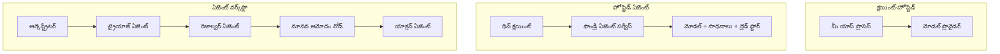
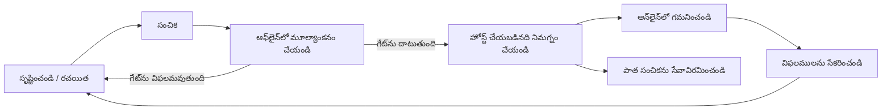
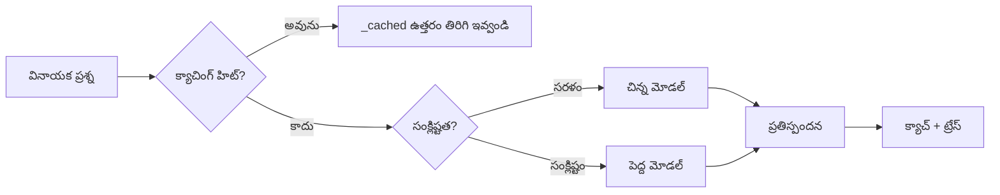
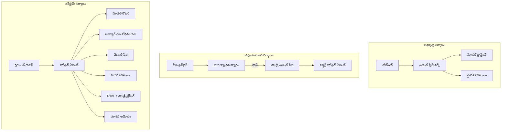

# మైక్రోసాఫ్ట్ ఫౌండ్రితో స్తంభించగల ఏజెంట్ల‌ను మిళితం చేయడం


ఈ కోర్సు వరకు మీరు లాప్‌టాప్‌లో, ఒక నోట్‌బుక్ లో, `az login` మరియు కొంత పర్యావరణ మార్పిడి చిహ్నాలతో నడిచే ఏజెంట్లను నిర్మించారు. ఇది నేర్చుకోవడానికి సరైన మార్గం. కానీ వేలాది కస్టమర్లు ఆధారపడే ఏజెంట్‌ను రాత్రి 3 గంటలకు నడపడం కోసం ఇది సరైన మార్గం కాదు.

ఈ పాఠం "నా యంత్రంలో ఇది పనిచేస్తుంది" మరియు "ఇది ఉత్పత్తిలో విశ్వసనీయంగా మరియు తగిన ధరలో పనిచేస్తుంది" మధ్య గేటును గురించి. మేము ఆ గేటును **Microsoft Foundry** మరియు **Microsoft Foundry Agent Service** ఉపయోగించి మూసివేస్తాము, మరియు ఒక నిజమైన కస్టమర్ సపోర్ట్ ఏజెంట్‌ను నిర్మిస్తున్నప్పుడు ఏజెంట్లో సాధనాలు, రీట్రైవల్, జ్ఞాపకం, మదింపు మరియు పర్యవేక్షణ ఉంటాయి.

## పరిచయం

ఈ పాఠం కిందింటిని కవర్ చేస్తుంది:

- **ప్రోటోటైప్ ఏజెంట్** మరియు **మిళితం అయ్యిన ఏజెంట్** మధ్య తేడా, మరియు ఈ మార్పు ప్రధానంగా మోడల్ చుట్టూ ఉన్న ప్రతిదాన్నీ గురించి.
- ఏజెంట్ల **మిళితం విధానాలు**: క్లయింట్-హోస్టెడ్, సర్వీస్-హోస్టెడ్ (Hosted Agents), మరియు వర్క్‌ఫ్లో-ఆర్గనైజ్డ్.
- Microsoft Foundry లో **ఏజెంట్ జీవితచక్రం** — సృష్టించడం, వెర్షన్ చేయడం, మిళితం చేయడం, మదించడం, గమనించడం, రిటైర్ చేయడం.
- **ప్రమాణం పెంచే రంగనాలు**: మోడల్ రూటింగ్, క్యాచింగ్, సహకారం, మరియు స్టేట్‌లెస్ డిజైన్.
- **పర్యవేక్షణ** OpenTelemetry మరియు Foundry ట్రేసింగ్ తో.
- **కోస్టు ఆప్టిమైజేషన్** మోడల్ ఎంపిక, రూటింగ్, మరియు మదింపు గేట్ల ద్వారా.
- **ఎంటర్ప్రైజ్ పరిగణన**: పాలన, మానవ పరిమితి అంగీకారం, మరియు MCP సర్వర్‌లు ఉత్పత్తిలో భద్రంగా నడపడం.

## నేర్చుకునే లక్ష్యాలు

ఈ పాఠం పూర్తి చేసిన తర్వాత, మీరు తెలుసుకుంటారు:

- ఇచ్చిన ఏజెంట్ వర్క్‌లోడ్‌కు సరైన మిళితం విధానం ఎంచుకోవడం.
- ఏజెంట్‌ను Microsoft Foundry Agent Service కి మిళితం చేయడం ఇది వెర్షన్ చేయబడటం, పాలించబడటం, మరియు గమనించబడటం.
- ట్రేసింగ్‌కి ఏజెంట్‌ను ఇన్స్ట్రుమెంట్ చేయడం మరియు ప్రతి విడుదలకి ముందు నడిచే మదింపు పైప్‌లైన్ కనెక్ట్ చేయడం.
- ప్రమాణం పెంచే సమయంలో తక్షణత మరియు ఖర్చును నియంత్రించడానికి మోడల్ రూటింగ్ మరియు క్యాచింగ్ వర్తించటం.
- హై-రిస్క్ చర్యలకు మానవ అనుమతి గేటును జోడించడం మరియు MCP సర్వర్‌ను ప్రొడక్షన్ భద్రతా మార్గంలో ఇన్టిగ్రేట్ చేయడం.

## అవసరమైన పూర్వపాఠాలు

ఈ పాఠం మీరు క్రిందటి పాఠాలను పూర్తి చేసి, మరింత సౌకర్యంగా ఉన్నారని భావిస్తుంది:

- [Microsoft Agent Framework](../14-microsoft-agent-framework/README.md)తో ఏజెంట్లను నిర్మించడం (పాఠం 14).
- [Tool Use](../04-tool-use/README.md) (పాఠం 4) మరియు [Agentic RAG](../05-agentic-rag/README.md) (పాఠం 5).
- [Agent Memory](../13-agent-memory/README.md) (పాఠం 13) మరియు [Agentic Protocols / MCP](../11-agentic-protocols/README.md) (పాఠం 11).
- [Observability and Evaluation](../10-ai-agents-production/README.md) (పాఠం 10) — ఈ పాఠం దానిపై నేరుగా ఆధారపడుతుంది.

మీరు కూడా అవసరమవుతుంది:

- కనీసం ఒక deployed చాట్ మోడల్‌తో **Azure సబ్‌స్క్రిప్షన్** మరియు **Microsoft Foundry ప్రాజెక్ట్**.
- **Azure CLI** నిర్ధారిత(`az login`).
- Python 3.12+ మరియు రిపోజిటరీలో ఉన్న ప్యాకేజీలు [`requirements.txt`](../../../requirements.txt).

## ప్రోటోటైప్ నుండి ప్రొడక్షన్: అసలు మార్పులు ఏమిటి

ప్రోటోటైప్ ఏజెంట్ మరియు ప్రొడక్షన్ ఏజెంట్ ఒకే కోర్ లూప్ పంచుకుంటాయి — కారణం చెబుతా, సాధనాలు పిలిస్తాను, స్పందిస్తాను. మార్పు ఆ లూప్ చుట్టూ ఉన్న ప్రతిదాంట్లో ఉంటుంది. మోడల్ ప్రొడక్షన్ ఏజెంట్‌లో సుమారు 20% మాత్రమే; మిగిలిన 80% ఆపరేషన్ కంకాళ శరీరం.

| ఆందోళన  | ప్రోటోటైప్ | ప్రొడక్షన్ |
| --- | --- | --- |
| **హోస్టింగ్** | మీ నోట్‌బుక్‌లో నడుస్తుంది | హోస్టెడ్ సర్వీస్ గా నడుస్తుంది, వెర్షన్ చేయబడింది మరియు విడుదల చేయబడింది |
| **పరిచయం** | మీ `az login` టోకెన్ | స్కోప్డ్ RBAC తో మేనేజ్డ్ గుర్తింపు |
| **స్థితి** | ఇన్-మెమరీ, రీస్టార్ట్ పై పోతుంది | బాహ్యీకృతం (థ్రెడ్ స్టోర్, మెమరీ సర్వీస్) |
| **విఫలము** | మీరు ట్రేస్‌బ్యాక్‌ను చూస్తారు | మళ్లీ ప్రయత్నాలు, బ్యాకప్‌లు, డెడ్-లెటర్, అలెర్ట్‌లు |
| **ఖర్చు** | "కొంత సెంట్లు మాత్రమే" | ప్రతి అభ్యర్థనకు ట్రాక్ చేయబడుతుంది, రూట్ చేయబడుతుంది, క్యాచ్ చేయబడుతుంది, బడ్జెట్ ఉంది |
| **గुणాత్మకం** | మీరు అవుట్పుట్ ను పరిశీలిస్తారు | ప్రతి విడుదలకి ముందు ఆటోమేటిక్ గా అవలీల చేయబడుతుంది |
| **నమ్మకం** | మీరు ప్రతి చర్యను ఆమోదిస్తారు | పొలసీ + హై-రిస్క్ చర్యలకు మానవ-ఇన్-ది-లూప్ |

ఈ పట్టిక మీ మనసులో ఉంచుకోండి. కింది ప్రతి విభాగం ఈ الصفలను అనుగుణంగా మ్యాప్ చేస్తుంది.

## ఏజెంట్ మిళితం విధానాలు

మీరు ఉపయోగించే మూడు విధానాలు ఉన్నాయి, ప్రాయశః సమ్మిళితంగా ఉంటాయి.

### 1. క్లయింట్-హోస్టెడ్ ఏజెంట్లు

ఏజెంట్ ఆబ్జెక్ట్ మీ అప్లికేషన్ ప్రాసెస్ లో ఉంటుంది. మీ కోడ్ నేరుగా మోడల్ ప్రొవైడర్‌ని పిలుస్తుంది; కారణం లూప్ మీ సర్వీస్ లో నడుస్తుంది. ఇది గత పాఠాలు చేసిన విధానం.

- **వాడుకోవాలి** మీరు లూప్ పైన పూర్తి నియంత్రణ, కస్టమ్ మిడిల్వేర్ అవసరం లేదా ఏజెంట్‌ను ఒకున్న బ్యాక్‌ఎండ్ లో జత చేయవలసిన సందర్భంలో.
- **వ్యापారాలు**: మిమ్మల్ని ప్రమాణం పెరుగుదల, స్థితి, మరియు సహనం మీ స్వంతం.

### 2. హోస్టెడ్ ఏజెంట్లు (Foundry Agent Service)

ఏజెంట్ Microsoft Foundry లో *రిసోర్స్‌గా నమోదవుతుంది*. Foundry కారణం లూప్‌ని నిర్వహిస్తుంది, థ్రెడ్స్ నిల్వ చేస్తుంది, కంటెంటు భద్రత మరియు RBACని అమలు చేస్తుంది మరియు ఏజెంట్ Foundry పోర్టల్ లో కనిపిస్తుంది. మీ యాప్ ఒక సన్న జతదారు అవుతుంది, థ్రెడ్స్ సృష్టిస్తుంది మరియు స్పందనలను చదువుతుంది.

- **వాడుకోవాలి** మీరు దీర్ఘకాలికత, అంతర్గత పర్యవేక్షణ, పాలన మరియు తక్కువ ఆపరేషన్ బాధ్యత కోరినపుడు.
- **వ్యాపారం**: నిర్వహించిన రన్‌టైమ్ కోసం తక్కువ స్థాయి నియంత్రణ.

### 3. ఏజెంట్ వర్క్‌ఫ్లోలు

అనేక ఏజెంట్లు (మరియు సాధనాలు) గ్రాఫ్‌గా అనుసంధానించబడతాయి స్పష్టమైన నియంత్రణ ప్రవాహంతో — నిరంతర దశలు, శాఖల, మానవ అంగీకార నోడ్లు, మరియు నిలిచిపోవగల మరియు పునఃప్రారంభించగల సురక్షిత చెక్‌పాయింట్‌లు. ఇది Microsoft Agent Framework **Workflows** సామర్థ్యం మిళితం స్కేల్ పై వర్తించబడింది.

- **వాడుకోవాలి** ఒకే పనిని అనేక నిపుణ ఏజెంట్లు లేదా మధ్యలో ఒక అంగీకారం దశ అవసరమైతే.
- **వ్యాపారం**: మరింత భాగాలు కదులుతున్నవి; ఆర్గనైజేషన్ స్థాయి పర్యవేక్షణ అవసరం.



## Microsoft Foundry లో ఏజెంట్ జీవితచక్రం

ఏజెంట్ మిళితం ఒక సారి చేసిన `push` మాత్రమే కాదు. ఇది ఒక లూప్, మరియు ఇది సాఫ్ట్వేర్ విడుదల చక్రంలా కనిపిస్తుంది ఎందుకంటే అది అసలే.



ప్రముఖ ఆలోచన, [పాఠం 10](../10-ai-agents-production/README.md) నుంచి తీసుకున్నది: **ఆఫ్‌లైన్ మదింపు ఒక గేటు, చివరన వదిలివేయదగిన విషయం కాదు.** కొత్త ఏజెంట్ వెర్షన్ మీ మదింపు స్టాండర్డ్స్‌ను పాసవ్వకపోతే విడుదల అవదు. ఆన్‌లైన్ పర్యవేక్షణ నిజ జీవిత విఫలాలను మీ ఆఫ్‌లైన్ పరీక్ష సెట్ కి ఫీడ్ చేస్తుంది. అదే మొత్తం లూప్.

## ప్రమాణం పెంచే రంగనాలు

ఏజెంట్‌ను ప్రమాణం పెంచటం స్టేట్‌లెస్ వెబ్ API పెంచటం కంటే వేరు, ఎందుకంటే ప్రతి అభ్యర్థన అనేక ఖరీదయిన మోడల్ మరియు సాధన పిలుపులను ప్రేరేపించవచ్చు. నాలుగు సాంకేతికతలు బరువు ఎక్కువ భాగాన్ని తీసుకుంటాయి.

**స్టేట్‌లెస్ అభ్యర్థన నిర్వహణ.** మీ ప్రాసెస్ మెమరీలో ప్రతి వినియోగదారుని స్థితిని ఉంచవద్దు. సంభాషణ థ్రెడ్స్ Foundry థ్రెడ్ స్టోర్ లేదా మెమరీ సర్వీస్‌లో నిల్వ చేయండి కనుక ఏ యుఐన్స్టెన్స్‌ అయినా ఏ అభ్యర్థనను నిర్వహించగలదు. ఇదే దిశలో మీరు ఆక్రమణగా పెరుగుదలకు అనుమతిస్తుంది — ఇన్స్టెన్సులు జోడించండి, స్టికీ సెషన్లు ఉండవు.

**మోడల్ రూటింగ్.** ప్రతి అభ్యర్థనకు మీ అత్యంత సామర్థ్యవంతమైన (మరియు అత్యంత ఖరీదైన) మోడల్ అవసరం లేదు. సులువు అభ్యర్థనలను — ఆలోచన వర్గీకరణ, చిన్న వాస్తవాత్మక సమాధానాలు — చిన్న, వేగవంతమైన మోడల్ కి రూట్ చేయండి మరియు పెద్ద మోడల్‌ను నిజమైన కారణం కోసం రిజర్వ్ చేయండి. Foundry యొక్క **మోడల్ రౌటర్** మీకోసం ఇది చేయగలదు, లేదా మీరు తేలికపాటి వర్గీకరణ సాధనాన్ని మీకే అమలు చేయవచ్చు. మీరు లాబ్లో DIY వెర్షన్ తయారుచేస్తారు.

**స్పందన క్యాచింగ్.** అనేక మద్దతు ప్రశ్నలు సమీప-నకిలీలు ("నేను నా పాస్వర్డ్ ఎలా రీసెట్ చేయాలి?"). సాధారణ ప్రశ్నలకు సమాధానాలను క్యాచ్ చేసి, వాటిని మోడల్‌ను తాకకుండా ఇవ్వండి. సన్నాహిత క్యాచ్ హిట్ రేటు కూడా ఖర్చు మరియు తక్షణతను గణనీయంగా తగ్గిస్తుంది.

**సహకారం మరియు బ్యాక్‌ప్రెషర్.** మోడల్ ప్రొవైడర్‌లకు రేటు పరిమితులు ఉంటాయి. మీ సహకారాన్ని పరిమితం చేయండి, ఎక్స్‌పోనెన్షియల్ బ్యాక్ ఆఫ్ తో మళ్లీ ప్రయత్నాలు చేయండి, మరియు సున్నితంగా విఫలమయ్యేలా చేయండి (క్యూయుక్కు చేసిన "మేము దీన్ని చూస్తున్నాము" స్పందన 500 కంటే మంచి).



## ఉత్పత్తిలో పర్యవేక్షణ

మీరు చూడలేని దానిని నడిపించలేరు. పాఠం 10 లో వివరించినట్లు, Microsoft Agent Framework ప్రాథమికంగా **OpenTelemetry** ట్రేసులను విడుదల చేస్తుంది — ప్రతి మోడల్ పిలుపు, సాధన ఆహ్వానం, మరియు ఆర్గనైజేషన్ దశ స్పాన్‌గా మారుతుంది. ఉత్పత్తిలో మీరు ఆ స్పాన్లను Microsoft Foundry (లేదా ఏ OTel-కు అనుగుణమైన బ్యాక్‌ఎండ్)కి ఎగుమతి చేస్తారు కాబట్టి మీరు:

- ఒక్క కస్టమర్ కంప్లెయిన్ ను ప్రతి మోడల్ మరియు సాధన పిలుపు అంతటా ట్రేస్ చేయండి.
- p50/p95 తక్షణత మరియు ఖర్చును సమయంతో గమనించండి.
- యూజర్లు (లేదా మీ ఫైనాన్స్ జట్టు) గమనించే ముందే లోపాల పెరుగుదల మరియు ఖర్చు అసాధారణాలపై అలెర్ట్ చేయండి.

```python
from agent_framework.observability import get_tracer

tracer = get_tracer()

with tracer.start_as_current_span("support_request") as span:
    span.set_attribute("customer.tier", "enterprise")
    span.set_attribute("routed.model", "gpt-5-nano")
    # కార్యాచరణ అమలు స్వయంచాలకంగా ఈ సాంపులో గుర్తించబడుతుంది
```

`customer.tier` మరియు `routed.model` వంటి లక్షణాలు భిత్తి ట్రేస్లను సమాధానాలైన ప్రశ్నలుగా మార్చుతాయి ("ఎంటర్ప్రైజ్ కస్టమర్లు ఎక్కువగా చిన్న మోడల్ కి రూట్ అవుతున్నారా?").

## ఖర్చు optimisation

ఉత్పత్తి ఏజెంట్‌లలో ఖర్చు టోకన్లు అధికంగా ఉంటుంది. ప్రభావం క్రమంలో మూడు లీవర్లు:

1. **మోడల్‌ను సరైన పరిమాణంలో తీసుకోండి.** మీ మదింపు గేటును పాసయ్యే చిన్న మోడల్ ఎక్కువ సార్లు పెద్దదాని కన్నా తక్కువ ఖర్చుతో ఉంటుంది. మదింపుతో చిన్న మోడల్ సరిపోతుందని నిరూపించండి, మోస్తరు జాగ్రత్తతో పెద్ద మోడల్‌కు వెళ్లడం టాలివ్ చేయండి.
2. **సంక్లిష్టత ఆధారంగా రూట్ చేయండి.** పైనివిధంగా — పెద్ద మోడల్ ధరను కేవలం పెద్ద మోడల్ కారణం అవసరంఉన్న అభ్యర్థనలకు మాత్రమే చెల్లించండి.
3. **తీవ్రంగా క్యాచ్ చేయండి.** మీరు చేయని మోడల్ పిలుపు అత్యంత తక్కువ ఖర్చు.

మదింపు గేట్లు మరియు ఖర్చు నియంత్రణ రెండు కోణాల నుండి చూసిన ఒకే నిబంధన: మదింపు మీకు *గుణాత్మక స్థాయి* తెలియజేస్తుంది, రూటింగ్ మరియు క్యాచింగ్ ఖర్చును ఆ స్థాయి *ఫ్లోర్* కి దగ్గరగా ఉంచుతుంది.

## ఎంటర్ప్రైజ్ మిళితం పరిగణనలు

**పాలన.** హోస్టెడ్ ఏజెంట్లు Foundry యొక్క RBAC, కంటెంటు భద్రత మరియు ఆడిట్ లాగింగ్ ను పొందుతాయి. ప్రతి ఏజెంట్ కు అవసరమైన గరిష్ట మున్ముఖ్యతలతో మేనేజ్డ్ గుర్తింపునిచ్చండి — జ్ఞానాశాలకి మాత్రమే చదవేందుకు, టికెటింగ్ API కి స్కోప్ చేసిన యాక్సెస్, ఇతరమే కాదు.

**మానవ-ఇన్-ది-లూప్.** కొంత చర్యలు పూర్తిగా ఆటోమేటెడ్ కాకూడదు — రీఫండ్ ఇచ్చడం, ఖాతాను డిలీట్ చెయ్యడం, లీగల్ టీంకు ఎస్కలేట్ చెయ్యడం. Microsoft Agent Framework **అంగీకారం-అవసరం** సాధనాలను మద్దతు ఇస్తుందిః ఏజెంట్ చర్యను ప్రతిపాదిస్తారు, అమలు ఆగిపోతుంది, మానవుడు అంగీకరిస్తాడు లేదా తిరస్కరిస్తాడు, మరియు వర్క్‌ఫ్లో తిరిగి ప్రారంభమవుతుంది. మీరు [పాఠం 6](../06-building-trustworthy-agents/README.md) లో దీనిని చూశారు; ఇక్కడ మీరు దీన్ని మిళితం చేసారు.

**ప్రొడక్షన్ లో MCP.** [MCP](../11-agentic-protocols/README.md) మీ ఏజెంట్‌ను బాహ్య సాధనాలచే ఒక సాధారణ ఇంటర్‌ఫేస్ ద్వారా ఉపయోగించేందుకు అనుమతిస్తుంది. ఉత్పత్తిలో ప్రతి MCP సర్వర్ ను అనధ్యాత్మిక సరిహద్దుగా పరిగణించండి: సర్వర్ వెర్షన్‌ను పిన్ చేయండి, స్కోప్డ్ గుర్తింపుతో నడపండి, దాని అవుట్‌పుట్లను ధృవీకరించండి, మరియు ఎప్పుడూ దానికి రహస్యాలను మోపవద్దు. MCP సర్వర్ అనేది ఒక ఆధారపడి ఉన్నది, మరియు ఆధారపడే వస్తువులు ప్యాచ్ చెయ్యబడతాయి, ఆడిట్ చేస్తారు, మరియు రేటు పరిమితం చేస్తారు.



ఆ మూడు చిత్రాలు — అభివృద్ధి, మిళితం, రన్‌టైమ్ — ఏజెంట్ యొక్క జీవితంలోని మూడు దశలు. తరువాతి లాబ్ మీరు దీన్ని నిర్మించడంలో గైడ్ చేస్తుంది.

## చేతులను కలిపే ప్రయోగశాల: ప్రొడక్షన్-సిద్ధ కస్టమర్ సపోర్ట్ ఏజెంట్

[`code_samples/16-python-agent-framework.ipynb`](./code_samples/16-python-agent-framework.ipynb) ఓపెన్ చేసి, చివరి వరకు పని చేయండి. మీరు ఒక **కాంటోసో కస్టమర్ సపోర్ట్ ఏజెంట్** ను ఏర్పరుస్తారు ప్రతి ప్రొడక్షన్ ఆందోళన తో పాటు:

1. **సాధన పిలుపులు** — ఆర్డర్ స్థితిని చూడండి మరియు సపోర్ట్ టికెట్లను తెరవండి.
2. **RAG** — జ్ఞానాశాల నుండి పాలసీ ప్రశ్నలకు సమాధానం ఇవ్వండి (Azure AI Search, ఒక ఇన్-మెమరీ బ్యాక్షాప్‌తో కాబట్టి నోట్‌బుక్ కి Search వనరు అవసరం లేదు).
3. **జ్ఞాపకం** — సంభాషణ గమ్యాలను దాటి కస్టమర్‌ను గుర్తుంచుకోండి.
4. **మోడల్ రూటింగ్** — ఒక సంక్లిష్టత వర్గీకర్త ప్రతి అభ్యర్థనను చిన్న లేదా పెద్ద మోడల్ కి రూట్ చేస్తుంది.
5. **స్పందన క్యాచింగ్** — పునరావృత ప్రశ్నలకు క్యాచుండి సేవ చేయడం.
6. **మానవ అనుమతి** — ఒక నిర్ధిష్ట పరిమితి ముప్పు పై రీఫండ్‌లు మానవ సంతకం కోసం ఆగిపోతాయి.
7. **మదింపు పైప్‌లైన్** — ఒక చిన్న ఆఫ్‌లైన్ టెస్ట్ సెట్ ఏజెంట్‌ను స్కోరు చేస్తుంది మరియు విడుదల గేటుగా పనిచేస్తుంది.
8. **పర్యవేక్షణ** — ప్రతి అభ్యర్థన చుట్టూ OpenTelemetry ట్రేసింగ్.

### దృష్టాంతం

నోట్‌బుక్ ప్రతి ప్రొడక్షన్ ఆందోళన స్వతంత్ర, నడిపించదగిన సెక్షన్లుగా ఏర్పాటు చేస్తుంది. దాని హృదయం రూటింగ్ మరియు క్యాచింగ్ అభ్యర్థన హ్యాండ్లర్:

```python
async def handle_support_request(query: str, customer_id: str) -> str:
    # 1. మనం చేసుకోగలిగినప్పుడు క్యాషే నుండి సర్వ్ చేయండి.
    cached = response_cache.get(normalize(query))
    if cached:
        return cached

    # 2. ఖర్చును నియంత్రించడానికి సమీకరణం ద్వారా రూట్ చేయండి.
    model = "gpt-5-nano" if is_simple(query) else "gpt-5-mini"

    # 3. పరిశీలన కోసం ఏజెంట్‌ను ట్రేస్ స్పాన్ లోపల నడపండి.
    with tracer.start_as_current_span("support_request") as span:
        span.set_attribute("routed.model", model)
        span.set_attribute("customer.id", customer_id)
        response = await support_agent.run(query, model=model)

    # 4. క్యాషే చేయండి మరియు తిరిగి ఇవ్వండి.
    response_cache.set(normalize(query), response.text)
    return response.text
```

విడుదలను తాలూకు మదింపు గేట్ ఇలాగే ఉంటుంది:

```python
async def evaluation_gate(agent, test_cases, threshold: float = 0.8) -> bool:
    passed = 0
    for case in test_cases:
        result = await agent.run(case["input"])
        if score_response(result.text, case["expected"]) >= 0.8:
            passed += 1
    pass_rate = passed / len(test_cases)
    print(f"Evaluation pass rate: {pass_rate:.0%} (gate: {threshold:.0%})")
    return pass_rate >= threshold  # గేట్ ఉత్తీర్ణమైతే మాత్రమే అమలు చేయండి
```

ప్రతి లైన్ చదవండి — నోట్‌బుక్ ప్రిమిటివ్స్‌ను ఉద్దేశపూర్వకంగా చిన్నగా ఉంచుతుంది కాబట్టి ఏమీ ఫ్రేమ్‌వర్క్ కాల్ వెనుక దూరు కాదు.

## మిళితం చేయబడిన ఏజెంట్‌ను స్మోక్ టెస్టులతో ధృవీకరించడం

పై మదింపు గేట్ మీ ఏజెంట్ ఆబ్జెక్ట్ పై *ఆఫ్‌లైన్* నడుస్తుంది. Hosted Agent‌గా ఏజెంట్ మిళితం అయిన తర్వాత, మిమ్మల్ని మరొకటి అవసరం, మరింత తక్కువ ఖర్చుతో కూడుకున్న చెక్: **మిళిత ఎండ్‌పాయింట్ అసలు సమాధానం ఇస్తుందా?**

"విజయవంతంగా" మిళితం చేయడం మీ నియంత్రణ ప్లేన్ నిర్వచనాన్ని అంగీకరించినదే నిరూపిస్తుంది — అది ఏజెంట్ స్పందిస్తుందనే ధృవీకరించదు. ఒక మిస్ అయిన ఆధారపడి ఉండండి, ఒక తప్పుగా మోడల్ రూటింగ్, లేదా ఒక ఎక్స్పైర్డ్ కనెక్షన్ హరితంగా ఉన్న మిళితాన్ని తిరిగి ఏమితోనూ రాలేదని ఉంచవచ్చు. ఒక **స్మోక్ టెస్ట్** ఇది కొన్ని సెకన్లలో, ప్రతి మిళితం సమయంలో, పూర్తి మదింపు ఖర్చు లేకుండా పట్టుకుంటుంది.

ఈ రిపోజిటరీకు సిద్ధంగా వాడుకునే స్మోక్-టెస్ట్ పైప్‌లైన్ ఉంది, ఇది [AI Smoke Test](https://github.com/marketplace/actions/ai-smoke-test) GitHub Action పై నిర్మించబడింది:

- **క్యాటలాగ్** — [`tests/lesson-16-smoke-tests.json`](../../../tests/lesson-16-smoke-tests.json) కాంటోసో సపోర్ట్ ఏజెంట్ కోసం ప్రాంప్ట్‌లు మరియు దావాలు కలిగి ఉంది (స్థిరమైన పాలసీ సమాధానాలు, ఆర్డర్ లుక్‌‌అప్, పరిపాటిపై నిలవడం, మరియు బహుళ-తిరుగు థ్రెడ్ నిరంతరత్వం). ఇతర పాఠాల ఏజెంట్ల క్యాటలాగ్‌లూ అదే చోట ఉంటాయి — చూడండి [`tests/README.md`](../tests/README.md).
- **వర్క్‌ఫ్లో** — [`.github/workflows/smoke-test.yml`](../../../.github/workflows/smoke-test.yml) Azure OIDC తో లాగిన్ అవుతూ ప్రతి ప్రాంప్ట్‌ను ఏజెంట్ యొక్క Responses ఎండ్‌పాయింట్ కి POST చేస్తూ, ఏదైనా దావా తప్పినప్పుడు జాబ్‌ను విఫలంగా చేస్తుంది.

```yaml
- name: Smoke-test hosted agent
  uses: JFolberth/ai-smoketest@v1
  with:
    project_endpoint: ${{ inputs.project_endpoint }}
    agent_name: ContosoSupportAgent
    tests_file: tests/lesson-16-smoke-tests.json
```


మీ ఏజెంట్ అమరవేశారు అయిన తర్వాత, **Actions** టాబ్ నుండి దాన్ని నడపండి, మీ Foundry ప్రాజెక్ట్ ఎండ్పాయింట్ మరియు ఏజెంట్ పేరు ఇవ్వడం ద్వారా. ఫెడెరేట్ చేసిన ఐడెంటిటీకి Foundry ప్రాజెక్ట్ స్కోప్ వద్ద **Azure AI User** పాత్ర అవసరం. లేయర్లు ఒక పిరమిడ్ లాంటివిగా భావించండి: స్మోక్ టెస్టులు (సాధ్యం మరియు స్పందిస్తున్నదా?) ప్రతి అమర్పులో నడుస్తాయి, ఆఫ్‌లైన్ మూల్యాంకనం (పంపిణీకి సరిపోతుందా?) ప్రమోషన్ ముందు నడుస్తుంది, మరియు ఆన్‌లైన్ మూల్యాంకనం (వెల్‌డ్లో ఇది ఎలా పనిచేస్తోంది?) ఎల్లప్పుడూ నడుస్తుంది.

## జ్ఞాన పరీక్ష

అసైన్‌మెంట్‌కు ముందుగా మీ అవగాహనను పరీక్షించుకోండి.

**1. ఒక ప్రొడక్షన్ ఏజెంట్‌లో "మోడల్" ఎంత భాగం మరియు మిగిలిన భాగం ఏమిటి?**

<details>
<summary>సమాధానం</summary>

మోడల్ సిస్టమ్‌లో స్వల్ప భాగం — సాధారణంగా సుమారు 20%గా భావిస్తున్నారు. మిగిలినది ఆపరేషన్ సంరచన: హోస్టింగ్ మరియు వెర్షనింగ్, ఐడెంటిటీ మరియు RBAC, బయటి స్థితి, విఫలం నిర్వహణ, ఖర్చు ట్రాకింగ్, మూల్యాంకనం, మరియు మానవ-ఇన్-ది-లూప్ నియంత్రణలు. ప్రొడక్షన్‌కు మార్చడం ప్రధానంగా ఆలోచనా లూప్ చుట్టూ ప్రతిది నిర్మించడం.
</details>

**2. మీరు ఎప్పుడు క్లయింట్-హోస్టెడ్ ఏజెంట్ కంటే Hosted Agent ని ఎంచుకుంటారు?**

<details>
<summary>సమాధానం</summary>

మీరు నిర్వహించబడిన రన్‌టైమ్ కావాలనుకున్నప్పుడు, ఇందులో బిల్ట్-ఇన్ టిక్కట్ల (నిలువుకొన్న థ్రెడ్లు మళ్లీ ఆరంభించగలిగే), పరిశీలన, కంటెంట్ సేఫ్టీ, మరియు RBAC ఉంటాయి, మరియు reasoning లూప్ పై కొంత తక్కువ స్థాయి నియంత్రణను నష్టపర్చడానికి సిద్ధంగా ఉన్నప్పుడు. క్లయింట్-హోస్టెడ్ మెరుగ్గా ఉంటుంది మీకు పూర్తి నియంత్రణ కావాలంటే లేదా ఏజెంట్‌ను ఉన్న బ్యాకెండ్‌లో సమ్మిళితం చేస్తుంటే.
</details>

**3. ఒక స్కేలబుల్ ఏజెంట్ తన ప్రాసెస్ మెమరీలో స్టేట్‌లెస్‌గా ఉండాలి ఎందుకు?**

<details>
<summary>సమాధానం</summary>

ఏ సందర్భంలోనైనా ఏ ఇనిషియేటివ్ ఏ అభ్యర్థనను హ్యాండిల్ చేయగలగాలి, ఇది స్థిర సెషన్ల లేకుండా హోరిజాన్టల్ స్కేలింగ్‌కి అనుమతిస్తుంది. వినియోగదారు సంభాషణ స్థితి థ్రెడ్ స్టోర్ లేదా మెమరీ సర్వీస్‌కు బయటి చేయబడుతుంది. స్థితి ప్రాసెస్ మెమరీలో ఉంటే, రీస్టార్ట్ సమయంలో మీరు దాన్ని కోల్పోతారు మరియు లోడ్ ని స్వేచ్ఛగా పంపిణీ చేయలేం.
</details>

**4. మోడల్ రౌటింగ్ ఏ సమస్యను పరిష్కరిస్తుంది, మరియు అది మూల్యాంకనంతో ఎలా సంబంధించి ఉంది?**

<details>
<summary>సమాధానం</summary>

రౌటింగ్ సాధారణ అభ్యర్థనలను చిన్న, చౌక, వేగమైన మోడల్‌కు పంపిస్తుంది మరియు పెద్ద మోడల్‌ని అసలు reasoning కొరకు రిజర్వ్ చేస్తుంది, లాటెన్సీ మరియు ఖర్చును నియంత్రిస్తుంది. ఇది మూల్యాంకనతో సంబంధించింది ఎందుకంటే మూల్యాంకనం చిన్న మోడల్ ఒక క్లాస్ అభ్యర్థనలకు సరిపోతుందనే విషయం నిరూపిస్తుంది — మూల్యాంకన లేకుండా రౌటింగ్ ఊహాగానమే.
</details>

**5. "ఎవాల్యుయేషన్ గేట్" అంటే ఏమిటి మరియు అది జీవిత చక్రంలో ఎక్కడ ఉంటుంది?**

<details>
<summary>సమాధానం</summary>

ఒక ఎవాల్యుయేషన్ గేట్ కొత్త ఏజెంట్ వెర్షన్‌పై ఆఫ్‌లైన్ టెస్ట్ సెట్ అమలు చేసి, పాస్ రేట్ ఒక సరిహద్దు దాటకపోతే అమరికను బ్లాక్ చేస్తుంది. ఇది జీవిత చక్రంలో "వర్షన్" మరియు "డిప్లాయ్" మద్య ఉంటుంది, విడుదలకు నాణ్యత ఒక ముందస్తు షరతుగా చేస్తుంది, పంపిన తర్వాత పర్యవేక్షించడం కాకుండా.
</details>

**6. MCP సర్వర్‌ను ప్రొడక్షన్‌లో ఎందుకు అన్వయించని సరిహద్దుగా చూడాలి?**

<details>
<summary>సమాధానం</summary>

ఇది మీ ఏజెంట్ పిలిచే బయటి ఆధారపడి ఉన్నది. దాని వెర్షన్ ను పిన్ చేయాలి, ఇది స్కోప్ చేసిన ఐడెంటిటీతో నడపాలి, దాని అవుట్‌పుట్‌లను ధృవీకరించాలి, రేట్-లిమిట్ చేయాలి, మరియు ఎప్పుడూ దానికి రహస్యాలు ఉంచకూడదు — మీరు మూడవ పక్ష ఆధారంపై పాటించే అదే క్రమశిక్షణ. దాని అవుట్‌పుట్లు మీ ఏజెంట్ reasoning లో ప్రవహిస్తాయి, కాబట్టి ధృవీకరించని విశ్వాసం భద్రతా ప్రమాదం.
</details>

**7. ఏ ఒక్క మార్పు సాధారణంగా ప్రొడక్షన్ ఏజెంట్ ఖర్చుపై పెద్ద ప్రభావం చూపిస్తుంది, మరియు ఎందుకు?**

<details>
<summary>సమాధానం</summary>

మోడల్‌ను సరిపడుగా ఎంచుకోవడం — మీరు ఇంకా మీ ఎవాల్యుయేషన్ గేట్ దాటే చిన్న మోడల్‌ను ఉపయోగించడం. ఖర్చు టోకెన్ల ఆధారంగా నియంత్రించబడుతుంది, మరియు నాణ్యత ప్రమాణానికి సరిపోతున్న చిన్న మోడల్ పెద్ద మోడల్ కంటే చాలా చౌకగా ఉంటుంది. క్యాషింగ్ మరియు రౌటింగ్ అప్పుడు ఖర్చును మరింత తగ్గిస్తాయి, కానీ సరైన బేస్ మోడల్ ఎంచుకోవడమే మొదటి-స్థాయి ప్రభావం చూపుతుంది.
</details>

**8. `customer.tier` మరియు `routed.model` వంటి స్పాన్ లక్షణాలు పరిశీలనలో ఎలాంటి పాత్రలు పోషిస్తాయి?**

<details>
<summary>సమాధానం</summary>

అవి ముడి ట్రేస్‌లను సమాధానానీకరించదగిన వ్యాపార ప్రశ్నలుగా మార్చతాయి. లక్షణాలు లేకపోతే మీరు మూడు-మూడు స్పాన్లతో ఎదురంటవలసి ఉంటుంది; లక్షణాలతో మీరు అడగవచ్చు "ఎంటర్ప్రైజ్ కస్టమర్లు చిన్న మోడల్‌కు చాలా సార్లు రూట్ అవుతున్నారా?" లేదా "మనం నెమ్మదైన అభ్యర్థనలను ఏ మోడల్ హ్యాండిల్ చేస్తోంది?" లక్షణాలు టెలిమెట్రీని మీరు నిర్వహించే కొవ్వక దిక్కుతో వేరుచేస్తాయి.
</details>

## అసైన్‌మెంట్

ల్యాబ్ నుండి కస్టమర్ సపోర్ట్ ఏజెంట్ తీసుకుని ఒక నిర్దిష్ట సందర్భానికి దాన్ని మెరుగుపరచండి: **SaaS కంపెనీ కి సభ్యత్వ బిల్లింగ్ సపోర్ట్ ఏజెంట్.**

మీ సమర్పణ:

1. బిల్లింగ్ సంబంధిత టూల్స్ తో **పరికరాలను మార్చండి**: `get_subscription_status`, `get_invoice`, మరియు `issue_credit` (`$50 పైగా క్రెడిట్‌కి మానవ అనుమతి అవసరం).
2. సంస్థ యొక్క రిఫండ్ పాలసీ, బిల్లింగ్ సైకిల్, మరియు క్యాన్సిలేషన్ పాలసీ ని కవర్ చేసే మూడు RAG డాక్యుమెంట్లు **జోడించండి**.
3. **ఎవాల్యుయేషన్ సెట్** ను కనీసం ఎనిమిది కేసుల వరకు విస్తరించండి, అందులో కనీసం రెండు మానవ-అనుమతి మార్గాన్ని ఉద్దీపన చేసే వాటి ఉండాలి, మరియు మీ ఎవాల్యుయేషన్ గేట్ సరైన పాస్ లేదా ఫెయిల్‌ను నిర్ధారించాలి.
4. పది మిశ్రమ ప్రశ్నలను ఏజెంట్ ద్వారా నడిపించిన తర్వాత, ఒక ఖర్చు నివేదిక **చేరవచండి**: ఎంతమంది చిన్న మోడల్ కి వెళ్ళిందో, ఎంతమంది పెద్ద మోడల్ కి వెళ్ళిందో, మరియు ఎంతమంది క్యాష్ నుండి సేవలందించబడిందో ముద్రించండి.

మీరు ఎంచుకున్న మోడల్-రౌటింగ్ నియమం మరియు దాన్ని నిజమైన ట్రాఫిక్ తో ఎలా ధృవీకరించేవారని (మార్క్‌డౌన్ సెల్ లో) చిన్న పేరాగ్రాఫ్ రాయండి. ఏకైక సరైన సమాధానం లేదు — ప్రొడక్షన్ ఇబ్బందులు సుసంబంధంగా ఉంటాయా అన్నదానిపై మీరు మూల్యాంకించబడ్డారు.

## సారాంశం

ఈ పాఠంలో మీరు Microsoft Foundry తో ఏజెంట్‌ను ప్రోటోటైప్ నుండి ప్రొడక్షన్కు తీసుకెళ్లారు:

- ప్రొడక్షన్‌కి మార్పు సాధారణంగా మోడల్ చుట్టూ ఉన్న **ఆపరేషన్ సంరచన** పై ఉంటుంది — హోస్టింగ్, ఐడెంటిటీ, స్థితి, విఫలం నిర్వహణ, ఖర్చు, నాణ్యత, మరియు విశ్వాసం.
- మీరు మూడు **డిప్లాయ్‌మెంట్ నమూనాలు** నేర్చుకున్నారు — క్లయింట్-హోస్టెడ్, Hosted Agents, మరియు Agent Workflows — మరియు అవి ఎప్పుడు సరిపోతాయో.
- మీరు **ఏజెంట్ జీవిత చక్రాన్ని** అనుసరించారు, ఇక్కడ ఆఫ్‌లైన్ **ఎవాల్యుయేషన్ విడుదల గేట్**గా పనిచేస్తుంది మరియు ఆన్‌లైన్ పరిశీలన విఫలాలను టెస్ట్ సెట్‌కు తిరిగి పంపిస్తుంది.
- మీరు **స్కేలింగ్ వ్యూహాలను** అనుసరించారు — స్టేట్‌లెస్ డిజైన్, మోడల్ రౌటింగ్, క్యాషింగ్, మరియు పరిమిత పొదుపు — మరియు వాటిని **ఖర్చు ఉత్పాదకతతో** అనుసంధానం చేశారు.
- మీరు **ఎంటర్ప్రైజ్ నియంత్రణలను** అమలు చేసారు: RBAC, మానవ-ఇన్-ది-లూప్ అనుమతి, మరియు ప్రొడక్షన్-సురక్షిత MCP సమ్మేళనం.
- మీరు ఒక **ప్రొడక్షన్-తయారు కస్టమర్ సపోర్ట్ ఏజెంట్** ని నిర్మించారు, ఇది ఈ అన్ని అంశాలను ఒక రన్ చేయగల కోడులో కలిసివుంటుంది.

తదుపరి పాఠం ఎడమ వైపు ప్రయాణం చేస్తుంది: క్లౌడ్‌లో ఏజెంట్లను స్కేలు చేయడం కాకుండా, మీరు వాటిని ఒకే డెవలపర్ యంత్రంపై తీసుకుని పూర్తిగా లోకల్ లో నడిపుతారు.

## అదనపు వనరులు

- <a href="https://learn.microsoft.com/azure/ai-foundry/what-is-azure-ai-foundry" target="_blank">Microsoft Foundry డాక్యుమెంటేషన్</a>
- <a href="https://learn.microsoft.com/azure/ai-foundry/agents/overview" target="_blank">Microsoft Foundry Agent సర్వీస్ అవలోకనం</a>
- <a href="https://learn.microsoft.com/en-us/agent-framework/overview/?wt.mc_id=youtube_26688_organicsocial_reactor&pivots=programming-language-python" target="_blank">Microsoft Agent Framework</a>
- <a href="https://learn.microsoft.com/azure/ai-foundry/concepts/model-router" target="_blank">Microsoft Foundry లో మోడల్ రౌటర్</a>
- <a href="https://learn.microsoft.com/azure/search/search-what-is-azure-search" target="_blank">Azure AI Search</a>
- <a href="https://opentelemetry.io/" target="_blank">OpenTelemetry</a>
- <a href="https://github.com/marketplace/actions/ai-smoke-test" target="_blank">AI Smoke Test GitHub Action</a>
- <a href="https://modelcontextprotocol.io/" target="_blank">Model Context Protocol (MCP)</a>

## గత పాఠం

[కంప్యూటర్ వాడకం ఏజెంట్లు నిర్మించడం (CUA)](../15-browser-use/README.md)

## తదుపరి పాఠం

[లోకల్ AI ఏజెంట్ల సృష్టి](../17-creating-local-ai-agents/README.md)

---

<!-- CO-OP TRANSLATOR DISCLAIMER START -->
**అస్వీకరణ**:
ఈ పత్రం AI అనువాద సేవ [Co-op Translator](https://github.com/Azure/co-op-translator) ఉపయోగించి అనువదించబడింది. మేము ఖచ్చితత్వానికి ప్రయత్నిస్తున్నప్పటికీ, ఆటోమేటెడ్ అనువాదాలు తప్పులు లేదా అసమగ్రతలను కలిగి ఉండవచ్చు. దాని స్వదేశ భాషలో ఉన్న అసలు పత్రాన్ని అధికారం కలిగిన మూలంగా పరిగణించాలి. కీలకమైన సమాచారం కోసం, ప్రొఫెషనల్ మానవ అనువాదాన్ని సిఫారసు చేస్తాము. ఈ అనువాదం ఉపయోగం వల్ల కలిగే ఏవైనా అపార్థాలు లేదా తప్పుదారులు కోసం మేము బాధ్యత వహించము.
<!-- CO-OP TRANSLATOR DISCLAIMER END -->