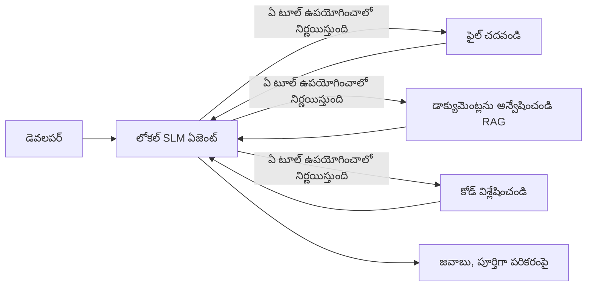
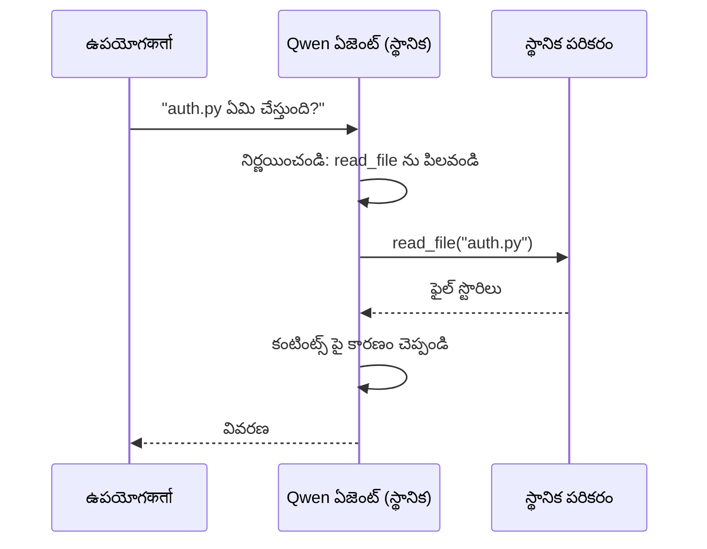
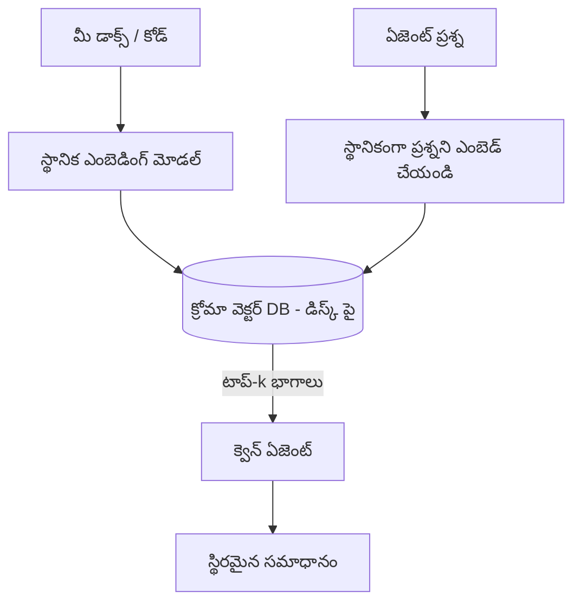
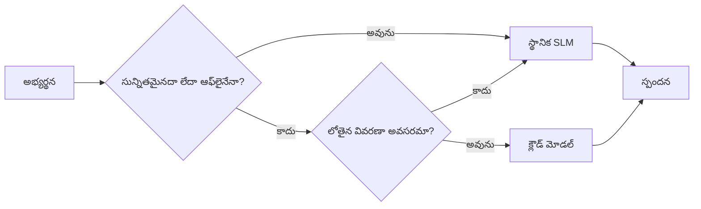

# Microsoft Foundry Local మరియు Qwen ఉపయోగించి లోకల్ AI ఏజెంట్లను సృష్టించడం


గత పాఠం ఏజెంట్లను మేఘంలో *పెంపొందించింది*. ఈ పాఠం వాటిని ఒకే ఒక యంత్రంపై *తరలిస్తుంది*. చివరకు మీరు ఒక పని చేసే ఇంజనీర్ అసిస్టెంట్‌ను కలిగి ఉంటారు, ఇది ఆలోచిస్తుంది, టూల్స్‌ను పిలుస్తుంది, మీ ఫైళ్లను చదుతుంది, మరియు మీ డాక్యుమెంటేషన్‌ను శోధిస్తుంది — **ఒక మేఘ ఇండ్రెన్స్ కాల్ లేని సుదీర్ఘ వ్యవస్థ.**

మీరు దీన్ని ఎందుకు కోరుకుంటారు? నిజమైన ఇంజనీరింగ్ పని లో తరచూ వచ్చే మూడు కారణాలు:

- **గోప్యత.** కోడ్ మరియు డాక్యుమెంట్లు యంత్రం బయటకు పోవు. prompt లేదా snippet లేదా కస్టమర్ డేటా నెట్‌వర్క్ సరిహద్దు దాటి పోవు.
- **ఖర్చు.** లోకల్ ఇండ్రెన్స్‌కు ప్రతి టోకెన్ బిల్ లేదు. మీరు రోజు మొత్తం iteration చేయవచ్చు విద్యుత్ ఖర్చుతో.
- **ఆఫ్లైన్.** విమానంలో, సురక్షిత సదస్సులో, లేదా outage సమయంలో, ఏజెంట్ ఇంకా పనిచేస్తుంది.

ఈ లోపంలో మీరు ఒక ఫ్రంట్‌యేర్ క్లౌడ్ మోడల్ ను **స్మాల్ లాంగ్వేజ్ మోడల్ (SLM)** తో మార్చుకోకుండా ఉంటారు, ఇది మీ CPU, GPU, లేదా NPU లో నడుస్తుంది. ఈ పాఠం ఆ పరిస్థితిలో *మంచి* ఏజెంట్లను అందించే విషయంలో ఉంది, ఆ పరిస్థితి లేనిట్లు భావించకుండా.

## పరిచయం

ఈ పాఠం కవర్ చేస్తుంది:

- **స్మాల్ లాంగ్వేజ్ మోడల్స్ (SLMs)** — అవి ఏమిటి, ఎక్కడ బాగా పనిచేస్తాయి, ఎక్కడ పనిచేయవు.
- **Microsoft Foundry Local** — ఒక runtime ఇది మోడల్స్ డౌన్లోడ్ చేసి డివైస్‌లో సేవ్ చేస్తుంది ఒక **OpenAI-అనుకూల API** ద్వారా.
- **Qwen ఫంక్షన్-కాలింగ్ మోడల్స్** — SLM లు విశ్వసనీయంగా టూల్ కాల్‌లను ఉత్పత్తి చేస్తాయి, ఇది లోకల్ *ఏజెంట్ల* (చాట్ కాకుండా) స్థానంలో ఉంటుంది.
- **లోకల్ టూల్స్, లోకల్ RAG, మరియు లోకల్ MCP** — ఏజెంట్లకు క్లౌడ్ లేకుండా సామర్థ్యం ఇవ్వడం.
- **హైబ్రిడ్ నమూనాలు** — ఎప్పుడు లోకల్ ఉంచాలి, ఎప్పుడు క్లౌడ్‌ని చేరుకోవాలి.

## నేర్చుకునే లక్ష్యాలు

ఈ పాఠం పూర్తయిన తరువాత, మీరు తెలుసుకుంటారు:

- SLMల ట్రేడ్-ఆఫ్స్ వివరించడం మరియు సరైన లోకల్ ఏజెంట్ సందర్భాలను ఎంచుకోవడం.
- Foundry Local ద్వారా Qwen మోడల్‌ను లోకల్ గా సేవ్ చేయడం మరియు OpenAI-అనుకూల endpoint ద్వారా కనెక్ట్ చేయడం.
- మీ వర్క్‌స్టేషన్లో పూర్తిగా నడిచే టూల్-కాలింగ్ ఏజెంట్‌ను నిర్మించడం.
- మీ స్వంత డాక్యుమెంట్లపై లోకల్ RAG ను స్థానిక వెక్టర్ డేటాబేస్ (Chroma) ఉపయోగించి చేర్చడం.
- ఏజెంట్‌ను లోకల్ MCP సర్వర్‌కు కనెక్ట్ చేయడం మరియు హైబ్రిడ్ లోకల్/క్లౌడ్ డిజైన్లపై తర్కం చేయడం.

## ముందస్తు సూచనలు

ఈ పాఠం మీరు పూర్వపు పాఠాలు పూర్తిచేసి సౌకర్యంగా ఉన్నారు అని భావిస్తుంది:

- [టూల్ ఉపయోగం](../04-tool-use/README.md) (పాఠం 4) మరియు [ఏజెంటిక్ RAG](../05-agentic-rag/README.md) (పాఠం 5).
- [ఏజెంటిక్ ప్రోటోకాళ్లు / MCP](../11-agentic-protocols/README.md) (పాఠం 11).
- [Microsoft ఏజెంట్ ఫ్రేమ్‌వర్క్](../14-microsoft-agent-framework/README.md) (పాఠం 14).

ఈ క్రింది వాటి కూడా అవసరం:

- డెవలపర్ వర్క్‌స్టేషన్. **8 GB RAM కనీసం అవసరం**; 16 GB+ సౌఖ్యంగా ఉంటుంది. GPU లేదా NPU సహాయపడుతుంది కాని తప్పనిసరి కాదు.
- **Microsoft Foundry Local** ఇన్‌స్టాల్ చేయబడింది (కింద సెటప్ విభాగం చూడండి).
- Python 3.12+ మరియు ఈ పాఠం కోసం రిపాజిటరీలోని [`requirements.txt`](../../../requirements.txt) లోని ప్యాకేజీలు, అలాగే `foundry-local-sdk`, `openai`, మరియు `chromadb`.

## స్మాల్ లాంగ్వేజ్ మోడల్స్: లోకల్ పని కోసం సరైన టూల్

ఒక ఫ్రంట్‌యేర్ క్లౌడ్ మోడలుకు కోట్ల కోట్ల పరిమాణాల పరామితులు ఉంటాయి మరియు ఒక డేటా సెంటర్ ఉంటుంది. ఒక SLM కు కొన్ని బిలియన్ల పరిమాణాల పరామితులు మాత్రమే ఉంటాయి మరియు మీ ల్యాప్టాప్ RAM లోకి సరిపోతుంది. ఈ వ్యత్యాసం స్పష్టమైన అభ్యాసాలు సృష్టిస్తుంది.

**SLMs బాగా చేస్తాయి:**

- నిర్మిత, సీతల పనులు — వర్గీకరణ, ఎక్స్‌ట్రాక్షన్, తెలిసిన డాక్యుమెంట్ సారాంశం.
- **టూల్ కాలింగ్** — ఏ ఫంక్షన్ పిలవాలో మరియు ఏ ఆర్గ్యుమెంట్లు ఇవ్వాలో నిర్ణయించడం.
- మీ స్వంత డేటా పై త్వరిత, అందరూ, ప్రైవేట్ iteration.

**SLMs బలహీనంగా ఉంటాయి:**

- పెద్ద, ఎండ్లెస్ reasoning మరియు multi-hop reasoning.
- విస్తృత ప్రపంచ శాస్త్ర విజ్ఞానం (అవును తక్కువ చూసారు, మరచిపోతారు ఎక్కువ).

లోకల్ ఏజెంట్ల విజేత వ్యూహం: **SLM ఆదేశిస్తాడు, టూల్స్ భారం తీసుకుంటాయి.** మోడల్ మీ కోడ్ను *తెలిసుకోవలసిన* అవసరం లేదు — `read_file` మరియు `search_docs` పిలవాల్సినపుడు తెలిసినా సరిపోతుంది. ఇది SLM దౌర్జన్యానికి సరిపోయే విధానం.



## Microsoft Foundry Local

**Microsoft Foundry Local** ఒక లైట్‌వెయిట్ runtime, ఇది మోడల్స్‌ని మీ యంత్రంలో పూర్తిగా డౌన్లోడ్ చేసి నిర్వహించి, సేవ్ చేస్తుంది. ముఖ్యంగా ఇది **OpenAI-అనుకూల HTTP endpoint** అందిస్తుంది — దీని ద్వారా OpenAI SDK మరియు Microsoft ఏజెంట్ ఫ్రేమ్‌వర్క్ యొక్క OpenAI క్లయింట్ దానిపై `base_url` మార్చి నడుస్తాయి. ఏజెంట్ నిర్మాణం పై మీరు నేర్చుకున్నది నేరుగా ఈ మాడ్యూల్లో పనిచేస్తుంది; కేవలం endpoint మేఘం నుండి `localhost` కు మారుతుంది.

Foundry Local మీ హార్డ్వేర్‌కి సరైన మోడల్ బిల్డ్(auto selection) ఎంచుకుంటుంది — CPU build, CUDA/GPU build లేదా NPU build — అందువల్ల మీరు ప్రతి యంత్రానికి హ్యాండ్-ఆప్టిమైజ్ చేయాల్సిన అవసరం లేదు.

### సెటప్

Foundry Localని ఇన్‌స్టాల్ చేయండి (మీ OS కోసం [డాక్యుమెంటేషన్](https://learn.microsoft.com/azure/ai-foundry/foundry-local/) చూడండి), తరువాత అది పనిచేస్తుందా నిర్ధారించండి:

```bash
# ఇన్స్‌టాల్ చేయండి (ఉదాహరణ; మీ వేదిక కోసం డాక్యుమెంట్లను అనుసరించండి)
winget install Microsoft.FoundryLocal      # విండోస్
# brew install microsoft/foundrylocal/foundrylocal   # మాక్‌ఓఎస్

# ఒక Qwen మోడల్ డౌన్‌లోడ్ చేసి నడిపించండి, ఆపై స్థానిక సర్వీస్‌ను ప్రారంభించండి
foundry model run qwen2.5-7b-instruct
foundry service status
```

సర్వీస్ నడుస్తున్నప్పుడు మీకు లోకల్, OpenAI-అనుకూల endpoint (సాధారణంగా `http://localhost:PORT/v1`) లభిస్తుంది. నోట్బుక్ `foundry-local-sdk` ఉపయోగించి endpoint ఆటోమేటిక్ కనుగొంటుంది, కాబట్టి మీరు పోర్ట్ హార్డ్ కోడ్ చేయాల్సిన అవసరం లేదు.

## Qwen ఫంక్షన్ కాలింగ్: ఇది ఎందుకు ముఖ్యం

ఏజెంట్ అంటే టూల్స్ పిలవగలిగే వారే. చాలా SLMలు చాట్ చేయగలవు కానీ నమ్మదగిన, సరైన టూల్-కాల్స్ ఇవ్వవు. Qwen మోడల్లు ఫంక్షన్ కాలింగ్ కోసం శిక్షణ పొందబడినవి మరియు సరైన టూల్-కాల్స్ నిర్మాణాలను నిరంతరం ఉత్పత్తి చేస్తాయి — ఇదే లోకల్ చాట్ మోడల్‌ని లోకల్ *ఏజెంట్* గా మార్చేస్తుంది.

ఫ్లో మీకు తెలుసిన పద్ధతి టూల్-కాలింగ్ లూప్, కేవలం యంత్రంలో నడుస్తోంది:



## లోకల్ RAG

డాక్యుమెంటేషన్ శోధనలో లోకల్ ఏజెంట్లు తమ ప్రాముఖ్యాన్ని పొందుతారు. SLM మీ ఫ్రేమ్‌వర్క్ డాక్యుమెంట్లను జ్ఞాపకం వేశిందని ఆశించునప్పుడు బదులు, మీరు ఆ డాక్యుమెంట్లను **లోకల్ వెక్టర్ డేటాబేస్** లో నిచ్చెన చేసుకుని ఏజెంట్ డిమాండ్ ప్రకారం సంభంధిత భాగాలను తీసుకుంటుంది.

మేము **Chroma** అనే embedded వెక్టర్ స్టోర్ ఉపయోగిస్తున్నాము, ఇది సర్వర్ అవసరం లేకుండా ప్రాసెస్‌లో నడుస్తుంది. ప్రాసెస్ అన్ని లోకల్: లోకల్ embedding మోడల్ → లోకల్ వెక్టర్స్ → లోకల్ రిట్రీవల్ → లోకల్ SLM.



ఇది పాఠం 5 లోని Agentic RAG నమూనానే — కేవలం ప్రతి కాంపోనెంట్ మీ యంత్రంలో నడుస్తుంది.

## లోకల్ MCP సర్వర్లు

[MCP](../11-agentic-protocols/README.md) ఒక ట్రాన్స్పోర్ట్, క్లౌడ్ సేవ కాదు. MCP సర్వర్ ఒక లోకల్ ప్రాసెస్‌గా `stdio`పై నడుస్తుంది, ఇది మిమ్మల్ని టూల్స్ కు సాధారణ ప్రోటోకాల్ ద్వారా అందిస్తుంది. ఇది MCP సర్వర్ల పెరుగుతున్న ఎకోసిస్టంను — ఫైల్‌సిస్టమ్ యాక్సెస్, git ఆపరేషన్లు, డేటాబేస్ క్వెరీస్ — పూర్తిగా ఆఫ్లైన్ లో పునఃవినియోగం చేయడానికి అనుమతిస్తుంది.

భద్రతా స్థానం క్లౌడ్ నుండి వేరుగా ఉంటాయి కానీ లేని కాదు: లోకల్ MCP సర్వర్ మీ యూజర్ అనుమతులతో నడుస్తుంది, కాబట్టి అది స్పష్టమైన పరిధిలో మాత్రమే పని చేయాలి (ఒక ప్రాజెక్ట్ డైరెక్టరీ, మీ మొత్తం హోం ఫోల్డర్ కాదు) మరియు దాని ఔట్‌పుట్‌లను ఇన్పుట్‌లుగా పరిగణించి ధృవీకరించాలి.

## హైబ్రిడ్ క్లౌడ్ మరియు లోకల్ నమూనాలు

లోకల్-మొదట అనగా లోకల్ మాత్రమే అనిపించకూడదు. సంపన్నమైన వ్యవస్థలు సెన్సిటివిటీ మరియు కఠినత మీద ఆధారపడి మార్గనిర్దేశం చేస్తాయి:

| పరిస్థితి | ఎక్కడ నడుస్తుంది |
| --- | --- |
| సెన్సిటివ కోడ్ / డేటా, లేదా ఆఫ్లైన్ | **లోకల్ SLM** |
| సులభ, పరిమితం పనులు | **లోకల్ SLM** (చాలా తక్కువ ఖర్చు, త్వరిత) |
| కఠిన multi-hop reasoning, సెన్సిటివ్గా కాని డేటా పై | **క్లౌడ్ మోడల్** |
| outage సమయంలో అన్ని | **లోకల్ SLM** (నివారణాత్మక degration) |

ఇది పాఠం 16లో ఉన్న **మోడల్ రౌటింగ్** ఆలోచనను ప్రతిబింబిస్తుంది — ఒక "మోడల్స్" ఇప్పుడు మీ సొంత యంత్రంని కూడా కలిగి ఉంటుంది. ఒక బలమైన డిజైన్ క్లౌడ్ అందుబాటులో లేనప్పుడు లోకల్ వైపు fallback అవుతుంది, కాబట్టి ఏజెంట్ నగదు కాకుండా నాణ్యత తగ్గుతుంది.



## చేతితో చేయు ప్రయోగం: లోకల్ ఇంజనీరింగ్ అసిస్టెంట్

[`code_samples/17-local-agent-foundry-local.ipynb`](./code_samples/17-local-agent-foundry-local.ipynb) తెరవండి మరియు అందులో పనిచేయండి. మీరు ఒక **లోకల్ ఇంజనీరింగ్ అసిస్టెంట్** ను నిర్మించబోతున్నారు, ఇది పూర్తిగా మీ వర్క్‌స్టేషన్‌పై నడుస్తుంది మరియు చేయగలదు:

1. **టూల్స్ పిలవడం** — Foundry Local ద్వారా Qwen ఫంక్షన్ కాలింగ్ ద్వారా.
2. **లోకల్ ఫైల్ ఆపరేషన్లు చేయడం** — ప్రాజెక్ట్ ఫోల్డర్‌లో ఫైళ్ళను లిస్ట్ చేయడం మరియు చదవడం.
3. **కోడ్ విశ్లేషించడం** — ఒక మూల ఫైలు పై ప్రాథమిక గుణాలు పర్యవేక్షించడం.
4. **డాక్యుమెంటేషన్ శోధన** — Chroma తో డాక్యుమెంట్స్ ఫోల్డర్ మీద లోకల్ RAG.
5. **MCP ఉపయోగించడం** — లోకల్ MCP సర్వర్‌తో కనెక్ట్ అవటం (అన్ని కాన్ఫిగర్ కాని సందర్భంలో graceful skip తో).

ఒకటి కూడా క్లౌడ్ ఇండ్రెన్స్ ఉపయోగించబడదు.

### నడిచే విధానం

అసిస్టెంట్ Foundry Localతో OpenAI-అనుకూల endpoint ద్వారా కనెక్ట్ అవుతుంది, కాబట్టి ఏజెంట్ కోడ్ క్లౌడ్ పాఠాల దానితో చాలా ఇమిడిపోయినట్లుగా ఉంటుంది — కేవలం క్లయింట్ మారుతుంది:

```python
from foundry_local import FoundryLocalManager
from openai import OpenAI

# Foundry Local మోడల్‌ను కనుగొని/డౌన్‌లోడ్ చేసి మాకు స్థానిక ఎండ్పాయింట్ ఇస్తుంది.
manager = FoundryLocalManager(\"qwen2.5-7b-instruct\")
client = OpenAI(base_url=manager.endpoint, api_key=manager.api_key)  # api_key ఒక స్థానిక ప్లేస్‌హోల్డర్.
```

టూల్స్ ప్రాజెక్ట్ డైరెక్టరీకు సంబంధించిన సాధారణ Python ఫంక్షన్లే:

```python
def read_file(path: str) -> str:
    \"\"\"Read a file, but only inside the sandboxed project directory.\"\"\"
    full = (PROJECT_ROOT / path).resolve()
    if PROJECT_ROOT not in full.parents and full != PROJECT_ROOT:
        return \"Access denied: path is outside the project directory.\"
    return full.read_text(encoding=\"utf-8\")
```

సాండ్‌బాక్స్ తనిఖీ గమనించండి — లోకాలాగా, ఒక టూల్ ఎటువంటి arbitrary పాథ్ చదివితే అది బాధ్యత. నోట్బుక్ ప్రతి టూల్‌ను ఒకే ప్రాజెక్ట్ రూట్ కు పరిమితం చేస్తుంది.

## జ్ఞాన తనిఖీ

అసైన్‌మెంట్ ముందుగా మీ అర్థాన్ని పరీక్షించుకోండి.

**1. ఏజెంట్ ని లోకల్‌లో నడపడానికి మేఘంలో కాకుండా రెండూ కారణాలు చెప్పండి.**

<details>
<summary>ఉత్తరం</summary>

ఈ రెండలో ఏదైనా: **గోప్యత** (కోడ్ మరియు డేటా యంత్రం బయటకు పోవదు), **ఖర్చు** (ప్రతి టోకెన్ ఇన్ఫరెన్స్ బిల్ లేదు), మరియు **ఆఫ్లైన్ సామర్థ్యం** (నెట్‌వర్క్ లేకుండా కూడా పనిచేస్తుంది — విమానంలో, సురక్షిత సదస్సులో, లేదా outage సమయంలో). డేటాను డివైస్ నుంచి పంపడం నిషేధించే నియంత్రణ/అనుకూలత కారణం గోప్యతకు ప్రేరణ.
</details>

**2. లోకల్ ఏజెంట్ లో SLM మరియు దాని టూల్స్ మధ్య పనిభాగం ఎలా ఉండాలి, ఎందుకు?**

<details>
<summary>ఉత్తరం</summary>

SLM **ఆదేశించాలి** (ఏ టూల్ పిలవాలో మరియు ఏ ఆర్గ్యుమెంట్లతో), టూల్స్ **భారీ పనులు** చేయాలి (ఫైళ్ళను చదవడం, డాక్స్ తీసుకురావడం, ఫలితాలు లెక్కించడం). SLMలు నిర్దిష్ట నిర్ణయాలలో బలంగా ఉండగా, విస్తృత జ్ఞానం మరియు పొడవైన reasoning లో బలహీనంగా ఉంటాయి, కాబట్టి టూల్స్ పైన ఆధారపడటం వాళ్ల బలాలకు సరిపోతుంది.
</details>

**3. Foundry Local తో క్లౌడ్ ఏజెంట్ కోడ్ పునఃవినియోగం సాధ్యం చేసే కారణం ఏమిటి?**

<details>
<summary>ఉత్తరం</summary>

Foundry Local ఒక **OpenAI-అనుకూల HTTP endpoint** అందిస్తుంది. OpenAI SDK మరియు ఏజెంట్ ఫ్రేమ్‌వర్క్ యొక్క OpenAI క్లయింట్ దానిపై `base_url` మార్చడం మాత్రమే చేస్తుంది (లోకల్ placeholder API కీతో). ఏజెంట్ కోడ్ లో తనిఖీ లేకుండా పనిచేస్తుంది.
</details>

**4. ఏదైనా SLM కాకుండా Qwen ఫంక్షన్-కాలింగ్ మోడల్ ఉపయోగించడానికి ముఖ్య కారణం ఏమిటి?**

<details>
<summary>ఉత్తరం</summary>

ఏజెంట్ నమ్మదగిన, సరైన **టూల్ కాల్స్** ఇవ్వాలి. చాలా SLMలు చాట్ చేయగలవు కానీ అపరిపక్వ లేదా అస్పష్ట టూల్-కాల్స్ ఇస్తాయి. Qwen మోడల్లు ఫంక్షన్ కాలింగ్‌ కోసం శిక్షణ పొందై, కన్సిస్టెంట్ టూల్ కాల్స్ ఇస్తాయి, ఇది లోకల్ చాట్ మోడల్‌ను పని చేసే లోకల్ ఏజెంట్‌గా మార్చుతుంది.
</details>

**5. లోకల్ RAG పైప్లైన్లో ఏ కాంపోనెంట్లు యంత్రంలో నడుస్తాయి?**

<details>
<summary>ఉత్తరం</summary>

అన్ని: embedding మోడల్, వెక్టర్ డేటాబేస్ (Chroma, డిస్క్‌పై), రిట్రీవల్, మరియు SLM. డాక్యుమెంట్లు స్థానికంగా embed చేయబడతాయి, నిల్వ చేయబడతాయి, తిరిగి తెచ్చబడతాయి, మరియు లోకల్ మోడల్ ఇచ్చిన తర్కం చేస్తుంది — క్లౌడ్‌లో ఎలాంటి భాగము ముట్టదు.
</details>

**6. ఒక లోకల్ MCP సర్వర్ మీ యంత్రంలో నడుస్తుంది. అది ఆటోమాటిక్ గా భద్రం కాదా? మీరు ఇంకా ఏ రక్షణలు తీసుకోవాలి?**

<details>
<summary>ఉత్తరం</summary>

కాదు. లోకల్ MCP సర్వర్ మీ యూజర్ అనుమతులతో నడుస్తుంది, అందువల్ల అది మీ చేయగలిగిన ఏదైనా స్పర్శించవచ్చు. దాని పరిధిని అవసరం అయిన కాగలం (ఉదాహరణకు, ఒక ప్రాజెక్ట్ డైరెక్టరీ, మీ మొత్తం హోం ఫోల్డర్ కాకుండా) కి పరిమితం చేసి, దాని అవుట్పుట్‌లను ఇన్పుట్‌లుగా భావించి validate చేయాలి.
</details>

**7. లోకల్ మోడల్ ఒక భాగంగా ఉండే ఒక సరైన హైబ్రిడ్ రౌటింగ్ నియమాన్ని వివరించండి.**

<details>
<summary>ఉత్తరం</summary>

సెన్సిటివ్ లేదా ఆఫ్లైన్ అభ్యర్థనలను లోకల్ SLMకి పంపండి; సులభ, పరిమిత పనులను లోకల్ SLM కు వేగం మరియు ఖర్చు కారణంగా పంపండి; కఠిన multi-hop reasoning , సెన్సిటివ్ కాని డేటా కోసం క్లౌడ్ మోడల్ ఉపయోగించండి; క్లౌడ్ అందుబాటులో లేనప్పుడు లోకల్ SLMకి fallback అవ్వండి, అటువంటి పక్షంలో ఏజెంట్ నాణ్యత తగ్గుతుంది కానీ పూర్తిగా విఫలం కాకుండా ఉంటుంది. ఇది పాఠం 16 లోని మోడల్ రౌటింగ్, ఇప్పుడు లోకల్ యంత్రం ఒక మోడల్.
</details>

**8. ఈ పాఠంలో లోకల్ ఏజెంట్ నడపడానికి వాస్తవిక కనీస RAM ఎంత, ఎక్కువ RAM ఇచ్చే ప్రయోజనాలు ఏవి?**

<details>
<summary>ఉత్తరం</summary>

సుమారు **8 GB** కనీసం అవసరం; 16 GB+ సౌకర్యంగా ఉంటుంది. ఎక్కువ RAM మరింత పెద్ద, ప్రతిభావంతమైన మోడల్స్ నడపడానికి మరియు మరింత కంటెక్స్ట్ మెమరీలో ఉంచడానికి సహాయకం. GPU లేదా NPU inference వేగవంతం చేస్తుంది కానీ అవసరం లేదు — Foundry Local accelerator లేని సీ పీయూ బిల్డ్ ఎంచుకుంటుంది.
</details>

## అసైన్‌మెంట్

లోకల్ ఇంజనీరింగ్ అసిస్టెంట్ ని మీ ఎంచుకునే చిన్న ప్రాజెక్ట్ కోసం **లోకల్ డాక్యుమెంటేషన్ రివ్యూవర్** గా విస్తరించండి (మీకు ఇష్టం ఉంటే ఈ రిపో యొక్క పాఠాల ఫోల్డర్ లలో ఒకటి ఉపయోగించండి).

మీ సమర్పణ:

1. **నిజమైన డాక్స్/కోడ్ ఫోల్డర్‌ను Chroma లో ఇండెక్స్ చేయండి** (కనీసం ఐదు ఫైల్‌లు).
2. **`find_todos` టూల్ జోడించండి** ఇది ప్రాజెక్ట్ లో `TODO`/`FIXME` కామెంట్లను స్కాన్ చేసి, ఫైల్ మరియు లైన్ సంఖ్యతో వాటిని తిరిగి ఇస్తుంది — `read_file` లాంటి సాండ్‌బాక్స్ తనిఖీ అలాగే ఉంచాలి.

3. **ఏజెంటుకి మూడు ప్రశ్నలు అడగండి** అవి టూల్స్‌ని కలుపుకునేందుకు బలవంతం చేస్తాయి: ఒక чистం RAG ప్రశ్న, ఒకటి ప్రత్యేక ఫైల్‌ని చదవాలని అవసరం పెడుతుంది, మరొకటి TODOs కనుగొనడం కోసం.
4. **దీనిని కొలవండి**: మూడు ప్రతిస్పందనల సమయాన్ని కొలవండి మరియు వాటిని markdown సెల్‌లో నమోదు చేయండి. మీ అనుకున్న వర్క్‌ఫ్లోకి ఈ లేటెన్సీ అనుకూలమై ఉందో లేదో వ్యాఖ్యానించండి.

తరువాత ఈ రివ్యూ కొరకు **మీరేం క్లౌడ్‌లో మార్చతారు మరియు ఎటు స్థానికంగా ఉంచతారు** అనే విషయమై ఒక చిన్న పేరాగ్రాఫ్ రాయండి, మరియు ఎందుకు. స్థానిక భాగాలు సరిగ్గా కనెక్ట్ అయ్యాయనే మరియు మీ హైబ్రిడ్ రీజనింగ్ సబబుగా ఉందనే దానిపై మిమ్మల్ని అంచనా వేయబడతారు — మోడల్ నాణ్యతపై కాదు.

## సారాంశం

ఈ పాఠంలో మీరు మీ స్వంత యంత్రమే మీద పూర్ణంగా పనిచేసే ఏజెంట్ను నిర్మించుకున్నారు:

- **SLMs** గోచరం కోసం ప్రైవసీ, ఖర్చు, మరియు ఆఫ్‌లైన్ ఆపరేషన్ కోసం ట్రేడ్ ఆఫ్ చేస్తాయి — మరియు అవి **టూల్స్ ను ఆర్కెస్ట్రేట్** చేసినప్పుడు మెరుగుపడతాయి, తమలోనే అన్ని జ్ఞానాన్ని కలిగి ఉండటం కాకుండా.
- **Foundry Local** ఓపెన్‌ఏఐ-సమానమైన ఎండ్పాయింట్ వెనుక డివైస్‌పై మోడల్స్‌ను అందిస్తుంది, కాబట్టి మీ క్లౌడ్ ఏజెంట్ కోడ్ ఒక లైనులో మార్పుతో బదిలీ అవుతుంది.
- **Qwen ఫంక్షన్-కాలింగ్ మోడల్స్** నమ్మదగిన స్థానిక టూల్ కాలింగ్‌ను — కాబట్టి స్థానిక *ఏజెంట్స్* కు సేతు పరిచే అవకాశాన్ని — సాధ్యం చేస్తాయి.
- **స్థానిక RAG** (Chroma) మరియు **స్థానిక MCP** యంత్రం విడిచిపెట్టకుండానే ఏజెంట్ సామర్ధ్యాన్ని ఇస్తాయి.
- **హైబ్రిడ్ నమూనాలు** మీకు సున్నితత్వం మరియు కష్టం ఆధారంగా మార్గదర్శనం అందిస్తాయి, స్థానికంగా అందుబాటులో graceful fallback గా ఉంటాయి.

ఇది డిప్లొయ్‌మెంట్ చక్రాన్ని పూర్తి చేస్తుంది: పాఠం 16 Microsoft Foundry లో ఏజెంట్లను స్కేలింగ్ చేసి, ఈ పాఠం వాటిని ఒక్క వర్క్‌స్టేషన్లో తగ్గించింది. తదుపరి పాఠం డిప్లొయ్ చేసిన ఏజెంట్ల భద్రతపై మారుతుంది.

## అదనపు వనరులు

- <a href="https://learn.microsoft.com/azure/ai-foundry/foundry-local/" target="_blank">Microsoft Foundry Local డాక్యుమెంటేషన్</a>
- <a href="https://learn.microsoft.com/azure/ai-foundry/what-is-azure-ai-foundry" target="_blank">Microsoft Foundry డాక్యుమెంటేషన్</a>
- <a href="https://learn.microsoft.com/en-us/agent-framework/overview/?wt.mc_id=youtube_26688_organicsocial_reactor&pivots=programming-language-python" target="_blank">Microsoft Agent Framework</a>
- <a href="https://qwen.readthedocs.io/en/latest/framework/function_call.html" target="_blank">Qwen ఫంక్షన్ కాలింగ్ డాక్యుమెంటేషన్</a>
- <a href="https://modelcontextprotocol.io/" target="_blank">Model Context Protocol (MCP)</a>
- <a href="https://docs.trychroma.com/" target="_blank">Chroma వెక్టర్ డేటాబేస్</a>

## మునుపటి పాఠం

[Deploying Scalable Agents](../16-deploying-scalable-agents/README.md)

## తదుపరి పాఠం

[Securing AI Agents](../18-securing-ai-agents/README.md)

---

<!-- CO-OP TRANSLATOR DISCLAIMER START -->
**అస్వీకరణ**:
ఈ పత్రం AI అనువాద సేవ [Co-op Translator](https://github.com/Azure/co-op-translator) ఉపయోగించి అనువదించబడింది. మేము ఖచ్చితత్వానికి ప్రయత్నిస్తున్నప్పటికీ, ఆటోమేటెడ్ అనువాదాలు తప్పులు లేదా అసమగ్రతలను కలిగి ఉండవచ్చు. దాని స్వదేశ భాషలో ఉన్న అసలు పత్రాన్ని అధికారం కలిగిన మూలంగా పరిగణించాలి. కీలకమైన సమాచారం కోసం, ప్రొఫెషనల్ మానవ అనువాదాన్ని సిఫారసు చేస్తాము. ఈ అనువాదం ఉపయోగం వల్ల కలిగే ఏవైనా అపార్థాలు లేదా తప్పుదారులు కోసం మేము బాధ్యత వహించము.
<!-- CO-OP TRANSLATOR DISCLAIMER END -->