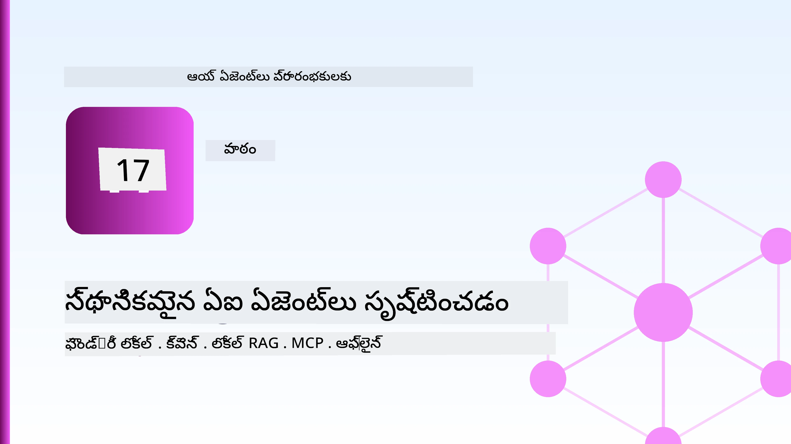
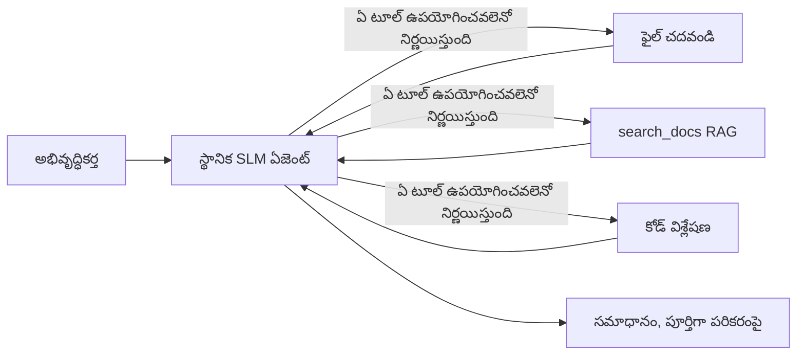
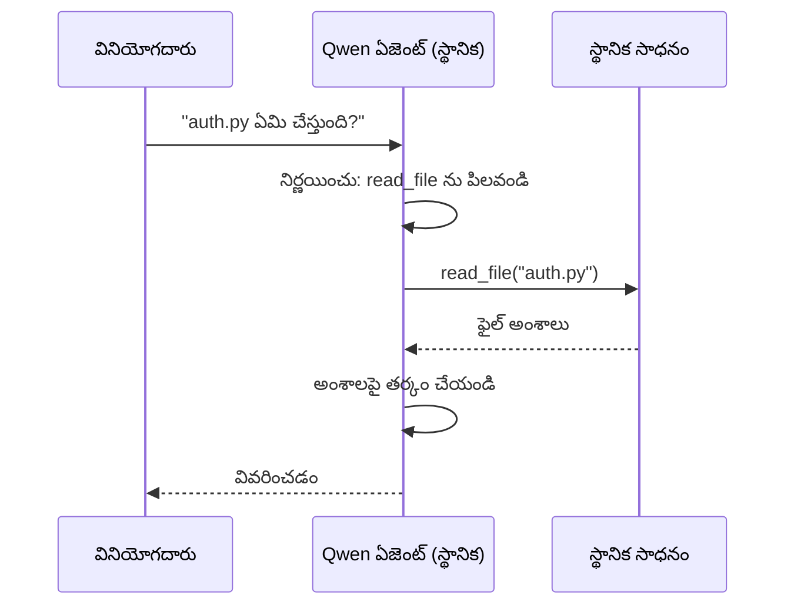
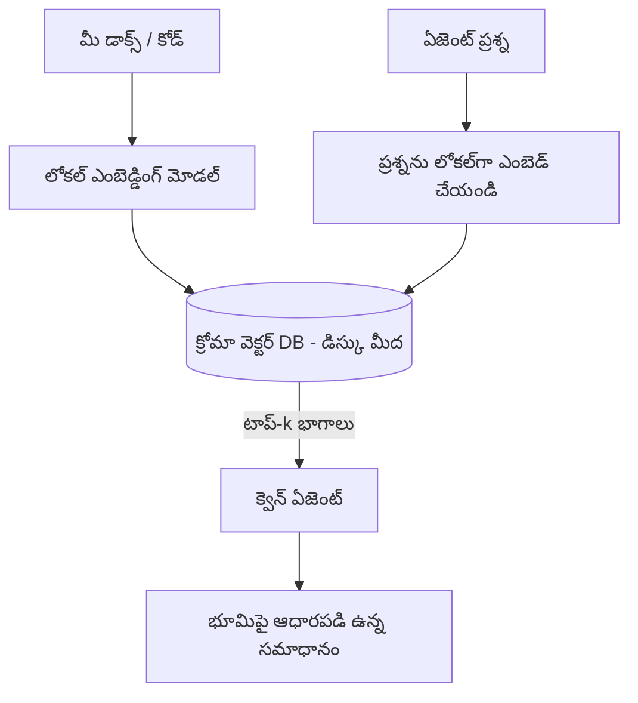
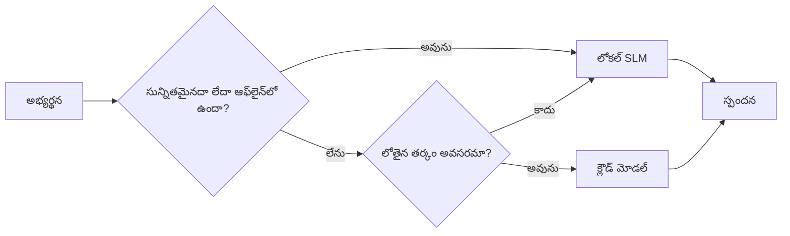

# Microsoft Foundry Local మరియు Qwen ఉపయోగించి లోకల్ AI ఏజెంట్లను సృష్టించడం



మునుపటి పాఠం ఏజెంట్లను మేఘంలో *పెంచబడింది*. ఇది వాటిని ఒకే యంత్రంపై *తగ్గిస్తుంది*. చివరిదాకా మీరు ఒక వర్కింగ్ ఇంజనీరింగ్ అసిస్టెంట్ పొందుతారు, ఇది తర్కం చెయగలదు, టూల్స్‌ను కాల్ చేస్తుంది, మీ ఫైళ్ళను చదవగలదు, మరియు మీ డాక్యుమెంటేషన్‌ను సెర్చ్ చేస్తుంది — **ఏ ఒక్క మేఘ సూచనా కాల్ లేకుండా.**

మీరు దీనిని ఏమి కావాలనుకుంటారు? నిజమైన ఇంజనీరింగ్ పనిలో తరచుగా ఎదురయ్యే మూడు కారణాలు:

- **ప్రైవసీ.** కోడ్ మరియు డాక్యుమెంట్లు యంత్రం నుండి ఎవరూ బయటకు పంపరు. ఏ ప్రాంప్ట్, స్నిపెట్, లేదా కస్టమర్ డేటా నెట్‌వర్క్ సరిహద్దు దాటి పోవదు.
- **ఖర్చు.** లోకల్ సూచనకు ప్రతీ టోకెన్‌కు బిల్లు ఉండదు. మీరు ఎలక్ట్రిసిటీ ధరకు రోజు మొత్తం తిరగవచ్చు.
- **ఆఫ్‌లైన్.** విమానం పై, ఒక సురక్షిత సౌకర్యంలో, లేదా అవుటేజ్ సమయంలో కూడా ఏజెంట్ పనిచేస్తుంది.

సమస్య ఏమిటంటే మీరు ఫ్రంటియర్ క్లౌడ్ మోడల్ కి బదులు **స్మాల్ లాంగ్వేజ్ మోడల్ (SLM)** ను మీ CPU, GPU, లేదా NPU పై నడుపుతారు. ఈ పాఠం ఆ పరిమితి లో *మంచిగా* పనిచేసే ఏజెంట్లను నిర్మించడం గురించి ఉండి, పరిమితి లేనట్టుగా నటించడం గురించి కాదు.

## పరిచయం

ఈ పాఠం ఇక్కడ నూతనం పొందుతుంది:

- **స్మాల్ లాంగ్వేజ్ మోడల్స్ (SLMs)** — అవి ఏమిటి, ఎక్కడ మెరుగ్గా పనిచేస్తాయి, ఎక్కడ తిరస్కరించబడతాయి.
- **Microsoft Foundry Local** — ఒక రన్‌టైమ్, ఇది మోడల్స్‌ను డౌన్‌లోడ్ చేసి డివైస్ పై సేవ్ చేస్తుంది, **OpenAI-అనుకూల API** ద్వారా అందిస్తుంది.
- **Qwen ఫంక్షన్ కాలింగ్ మోడల్స్** — SLMs, ఇవి సాధారణంగా టూల్ కాల్స్ ఉత్పత్తి చేస్తాయి, ఇది లోకల్ *ఏజెంట్లకు* (సాధారణ చాట్ కాదు) కారణం.
- **లోకల్ టూల్స్, లోకల్ RAG, మరియు లోకల్ MCP** — ఏజెంట్ సామర్థ్యాన్ని మేఘం లేకుండానే ఇస్తూ.
- **హైబ్రిడ్ నమూనాలు** — ఎప్పుడు లోకల్ ఉంచాలి మరియు ఎప్పుడు మేఘాన్ని చేరుకోవాలి.

## నేర్చుకునే లక్ష్యాలు

ఈ పాఠం పూర్తి చేసిన తర్వాత, మీరు తెలుసుకోగలుగుతారు:

- SLMs యొక్క వ్యాపారాలు వివరణ చేయడం మరియు సరైన లోకల్ ఏజెంట్ ఉపయోగకేసులను ఎంచుకోవడం.
- Foundry Local తో స్థానికంగా Qwen మోడల్‌ను సర్వ్ చేయడం మరియు OpenAI-అనుకూల ఎండ్పాయింట్ ద్వారా కనెక్ట్ కావడం.
- పూర్తిగా మీ వర్క్‌స్టేషన్ మీద నడిచే టూల్-కాల్ చేసే ఏజెంట్ని నిర్మించడం.
- స్థానిక వెక్టర్ డేటాబేస్ (Chroma) ఉపయోగించి మీ స్వంత డాక్యుమెంట్లపై లోకల్ RAG జోడించడం.
- లోకల్ MCP సర్వర్‌కు ఏజెంట్ని కనెక్ట్ చేసి హైబ్రిడ్ లోకల్/క్లౌడ్ డిజైన్లపై తర్కించడం.

## ముందస్తు అర్హతలు

ఈ పాఠం assumes మీరు క్రింద సూచించిన పాఠాలు పూర్తి చేసి ఉంటారు మరియు వీటిలో సౌకర్యంగా ఉంటారు:

- [టూల్ వినియోగం](../04-tool-use/README.md) (పాఠం 4) మరియు [ఏజెంటిక్ RAG](../05-agentic-rag/README.md) (పాఠం 5).
- [ఏజెంటిక్ ప్రోటోకాల్స్ / MCP](../11-agentic-protocols/README.md) (పాఠం 11).
- [Microsoft Agent Framework](../14-microsoft-agent-framework/README.md) (పాఠం 14).

మీరు కూడా అవసరం:

- ఒక డెవలపర్ వర్క్‌స్టేషన్. **8 GB RAM కనీసం నిజమైనది**; 16 GB+ అనేది సౌకర్యవంతం. GPU లేదా NPU ఉంటుంది అయితే మంచిది, లేకపోతే అనివార్యం కాదు.
- **Microsoft Foundry Local** సంస్థాపించబడాలి (కింది సెటప్ భాగంలో చూడండి).
- Python 3.12+, రెపొలో ఉన్న ప్యాకేజీలు [`requirements.txt`](../../../requirements.txt), మరియు ఈ పాఠానికి `foundry-local-sdk`, `openai`, మరియు `chromadb`.

## స్మాల్ లాంగ్వేజ్ మోడల్స్: లోకల్ పనికి సరైన టూల్

ఒక ఫ్రంటియర్ క్లౌడ్ మోడల్ వేల కోట్ల పారామితులు కలిగి ఉంటుంది మరియు డేటా సెంటర్ ఉంటుంది. ఒక SLM కొద్దికిది బిలియన్ల పారామితులు కలిగి ఉంటూ ల్యాప్‌టాప్ RAMలో సరిపోయుతుంది. ఆ తేడా స్పష్టమైన అంచనాలను సృష్టిస్తుంది.

**SLMs బాగుంటాయి:**

- నిర్మిత, పరిమిత పనులు — శ్రేణీకరణ, వెలికితీయటం, ఓపెన్ డాక్యుమెంట్ సారాంశం.
- **టూల్ కాలింగ్** — ఏ ఫంక్షన్ కాల్ చేయాలో మరియు ఏ ఆర్గుమెంట్స్‌తో అన్నదాన్ని నిర్ణయించడం.
- త్వరితగతిన, తక్కువ ఖర్చుతో, వ్యక్తిగత డేటాపై ఇటిక్కు.

**SLMs బలహీనతలు:**

- విస్తృతమైన, బహుళ హాప్ తర్కం పెద్ద సందర్భంలో.
- విస్తృతమైన ప్రపంచ జ్ఞానం (తక్కువ చూసారు, మరచిపోతారు ఎక్కువ).

లోకల్ ఏజెంట్లకు విజయం వ్యూహం: **SLM నిర్వహించనివ్వండి, టూల్స్ భారాన్ని చేయనివ్వండి.** మోడల్ మీ కోడ్ బేస్ తెలిసి ఉండాల్సిన అవసరం లేదు — `read_file` మరియు `search_docs` కాల్ ఎప్పుడు చేయాలో తెలుసుకోవాలి. ఇది SLM యొక్క బలాలు సరిగా ఉపయోగించుట.



## Microsoft Foundry Local

**Microsoft Foundry Local** ఒక తేలికపాటి రన్‌టైమ్, ఇది పూర్తిగా మీ యంత్రంలో మోడల్స్‌ను డౌన్‌లోడ్, నిర్వహించి, సేవ్ చేస్తుంది. మనకు ముఖ్యమైన ఫీచర్ ఇది **OpenAI-అనుకూల HTTP ఎండ్పాయింట్** అందించడం — అంటే OpenAI SDK మరియు Microsoft Agent Framework యొక్క OpenAI క్లయింట్ `base_url` మార్చడం తప్ప ఎవరూ మార్చాల్సిన అవసరం లేదు. ఏజెంట్ల నిర్మించడంలో నేర్చుకున్న ప్రతీది నేరుగా తెలుసుకోగలం; ఎండ్పాయింట్ మాత్రమే మేఘం నుండి `localhost` కు మారుతుంది.

Foundry Local మీ హార్డ్‌వేర్ కి ఉత్తమ మోడల్ బిల్డ్‌ను ఆటోమాటిగ్గా ఎంచుకుంటుంది — CPU బిల్డ్, CUDA/GPU బిల్డ్ లేదా NPU బిల్డ్ — అందువల్ల మీరు ప్ర‌తి యంత్రానికి చేతితో ఆప్టిమైజ్ చేయాల్సిన అవసరం లేదు.

### సెటప్

Foundry Local సంస్థాపించండి (మీ OS కోసం [డాక్యుమెంటేషన్](https://learn.microsoft.com/azure/ai-foundry/foundry-local/) చూడండి), ఆపై అది పనిచేస్తుందా లేదో నిర్ధారించండి:

```bash
# ఇన్స్టాల్ చేయండి (ఉదాహరణ; మీ ప్లాట్‌ఫారమ్ కోసం డాక్యుమెంట్లను అనుసరించండి)
winget install Microsoft.FoundryLocal      # విండోస్
# brew install microsoft/foundrylocal/foundrylocal   # macOS

# ఒక Qwen మోడల్ డౌన్లోడ్ చేసి నడపండి, ఆపై లోకల్ సერვీస్ ప్రారంభించండి
foundry model run qwen2.5-7b-instruct
foundry service status
```

సర్విస్ పనిచేస్తున్న తర్వాత మీరు ఉన్నతముగా OpenAI-అనుకూల ఎండ్పాయింట్ (సాధారణంగా `http://localhost:PORT/v1`) పొందుతారు. నోట్‌బుక్ `foundry-local-sdk` ఉపయోగించి ఆ ఎండ్పాయింట్ ఆటోమాటిగ్గా కనుగొంటుంది, అందుకే మీరు పోర్ట్‌ను హార్డ్‌కోడ్ చేయాల్సిన అవసరం లేదు.

## Qwen ఫంక్షన్ కాలింగ్: ఎందుకు ముఖ్యం

ఏజెంట్ అంటే టూల్స్‌ను కాల్ చేయగలడు. చాలా SLMs చాట్ చేయగలరు కానీ అపరిశుద్ధమైన, తప్పు టూల్ కాల్స్ ప్రస్తావిస్తాయి. **Qwen** మోడల్స్ ఫంక్షన్ కాలింగ్ కోసం శిక్షణ పొందినవి మరియు సక్రమంగా టూల్-కాల్ స్ట్రక్చర్లు ఇవ్వగలవు — ఇది లోకల్ చాట్ మోడల్‌ను లోకల్ *ఏజెంట*గా మార్చేవి.

ఫ్లో మీరు ఇప్పటికే తెలుసుకున్న సాధారణ టూల్-కాలింగ్ లూప్, కేవలం డివైస్ పై నడుస్తున్నది:



## లోకల్ RAG

డాక్యుమెంటేషన్ సెర్చ్ లోకల్ ఏజెంట్లు ప్రాముఖ్యాన్ని పొందుతారు. SLM మీ ఫ్రేమ్‌వర్క్ డాక్స్ మెమొరైజ్ చేసిందని ఆశించడం కంటే, మీరు ఆ డాక్స్ను **లోకల్ వెక్టర్ డేటాబేస్**లో ఏంబెడ్ చేస్తారు మరియు ఏజెంట్ ఆ డాక్స్‌ను డిమాండ్ పై తెచ్చుకుంటుంది.

మనం **Chroma** ని ఉపయోగిస్తాం, ఇది ఎంబెడ్డెడ్ వెక్టర్ స్టోర్, అది ప్రాసెస్ లోపల నడుస్తుంది మరియు సర్వర్ అవసరం లేదు. పైప్‌లైన్ పూర్తిగా లోకల్: లోకల్ ఎంబెడ్డింగ్ మోడల్ → లోకల్ వెక్టార్స్ → లోకల్ రిట్రీవల్ → లోకల్ SLM.



ఇది Lesson 5 నుండి Agentic RAG నమూనానే, మార్పు ఏమీ లేదు కేవలం ప్రతీ భాగం మీ యంత్రంలో నడుస్తుంది.

## లోకల్ MCP సర్వర్స్

[MCP](../11-agentic-protocols/README.md) అనేది ఒక ట్రాన్స్పోర్ట్, క్లౌడ్ సర్విస్ కాదు. MCP సర్వర్ ఒక లోకల్ ప్రాసెస్‌గా `stdio`పై నడవవచ్చు, సాధారణ ప్రోటోకాల్ ద్వారా మీ ఏజెంట్‌కు టూల్స్ అందిస్తుంది. ఇది పెరుగుతున్న MCP సర్వర్స్ ఎకోసిస్టాన్ని వాడడానికి అనువుగా ఉంటుంది — ఫైల్ సిస్టమ్ యాక్సెస్, గిట్ ఆపరేషన్లు, డేటాబేస్ క్వెరీలు — అన్నీ ఆఫ్‌లైన్‌లో ఉంటాయి.

సెక్యూరిటీ పరిస్థితి మేఘానికి భిన్నం కానీ లేని విషయం కాదు: లోకల్ MCP సర్వర్ మీ యూజర్ అనుమతులతో నడుస్తుంది, కాబట్టి అది తగిన పరిమితుల్లోనే (ఒక ప్రాజెక్ట్ డైరెక్టరీ, మీ హోమ్ ఫోల్డర్ కాకుండా) వాడాలి మరియు దాని అవుట్పుట్లను పనిలోకి తీసుకోవడానికి ముందు ధృవీకరించాలి.

## హైబ్రిడ్ క్లౌడ్-అండ్-లోకల్ నమూనాలు

లోకల్-ఫస్ట్ అంటే లోకల్ మాత్రమే కాదు. పరిపక్వ సిస్టమ్స్ సున్నితత్వం మరియు కష్టతను బట్టి మార్గం వేరు చేస్తాయి:

| పరిస్థితి | ఎక్కడ నడుస్తుంది |
| --- | --- |
| సున్నితమైన కోడ్/డేటా, లేదా ఆఫ్‌లైన్ | **లోకల్ SLM** |
| సులభ, పరిమిత పని | **లోకల్ SLM** (తక్కువ ఖర్చు, వేగవంతం) |
| కఠినమైన బహుళ హాప్ తర్కం నాన్-సెన్సిటివ్ డేటా పై | **క్లౌడ్ మోడల్** |
| ప్రతీది, అవుటేజ్ సమయంలో | **లోకల్ SLM** (సహజంగా క్షీణత) |

ఇది Lesson 16 నుండి **మోడల్ రౌటింగ్** భావనను పునరావృతం చేస్తుంది — మోడల్స్‌లో ఒకటి ఇప్పుడు మీ స్వంత యంత్రం. ఒక బలమైన డిజైన్ క్లౌడ్ అందుబాటులో లేకపోతే లోకల్ కు fallback అవుతుంది తద్వారా ఏజెంట్ నాణ్యత తగ్గిపోతుంది కానీ పూర్తిగా వైఫల్యం కాదు.



## ప్రాక్టికల్ ల్యాబ్: ఒక లోకల్ ఇంజనీరింగ్ అసిస్టెంట్

[`code_samples/17-local-agent-foundry-local.ipynb`](./code_samples/17-local-agent-foundry-local.ipynb) ఓపెన్ చేసి దాన్ని అనుసరించండి. మీరు ఒక **లోకల్ ఇంజనీరింగ్ అసిస్టెంట్** ని తయారు చేయబోతున్నారో, ఇది పూర్తిగా మీ వర్క్‌స్టేషన్ మీద నడుస్తుంది మరియు ఇవి చేస్తుంది:

1. **టూల్స్‌ను కాల్ చేయడం** — Foundry Local ద్వారా Qwen ఫంక్షన్ కాలింగ్ ద్వారా.
2. **లోకల్ ఫైల్ ఆపరేషన్లు చేయడం** — ప్రాజెక్ట్ డైరెక్టరీలో ఫైళ్లను జాబితా చేయడం మరియు చదవడం.
3. **కోడ్ విశ్లేషణ** — సోర్స్ ఫైల్ పై ప్రాథమిక గణాంకాలను నివేదించడం.
4. **డాక్యుమెంటేషన్ సెర్చ్** — Chroma తో ఒక డాక్స్ ఫోల్డర్ పైన లోకల్ RAG.
5. **MCP ఉపయోగించడం** — లోకల్ MCP సర్వర్ కి కనెక్ట్ అవ్వడం (ఏదైనా కాన్ఫిగర్ చేయకపోతే సున్నితమైన స్కిప్).

ఏ ఒక్క సమయంలో కూడా మేఘ సూచన ఉపయోగించదు.

### గమనిక

అసిస్టెంట్ Foundry Local కు OpenAI-అనుకూల ఎండ్పాయింట్ ద్వారా కనెక్ట్ అవుతుంది, కాబట్టి ఏజెంట్ కోడ్ చాలా దగ్గరగా మేఘ పాఠాలతో పోలిక ఉంటుంది — కేవలం క్లయింట్ మారుతుంది:

```python
from foundry_local import FoundryLocalManager
from openai import OpenAI

# ఫౌండ్రీ లోకల్ మోడల్‌ను కనుగొనుతోంది/డౌన్‌లోడ్ చేయుతోంది మరియు మాకు లోకల్ ఎండ్‌పాయింట్‌ను ఇస్తోంది.
manager = FoundryLocalManager(\"qwen2.5-7b-instruct\")
client = OpenAI(base_url=manager.endpoint, api_key=manager.api_key)  # api_key అనేది లోకల్ ప్లేస్‌హోల్డర్.
```

టూల్స్ సాధారణ Python ఫంక్షన్లు, అవి ప్రాజెక్ట్ డైరెక్టరీకి పరిమితం:

```python
def read_file(path: str) -> str:
    \"\"\"Read a file, but only inside the sandboxed project directory.\"\"\"
    full = (PROJECT_ROOT / path).resolve()
    if PROJECT_ROOT not in full.parents and full != PROJECT_ROOT:
        return \"Access denied: path is outside the project directory.\"
    return full.read_text(encoding=\"utf-8\")
```

సూక్ష్మ పరిశీలన గమనించండి — లోకల్ ఉన్నా కూడా, ఏ టూల్ ఏదైనా మార్గాలను చదవడం ప్రమాదం. నోట్‌బుక్ ప్రతీ టూల్‌ను ఒకే ప్రాజెక్ట్ రూట్‌కు పరిమితం చేస్తుంది.

## పరిజ్ఞాన పరీక్ష

అసైన్మెంట్కు ముందుగా మీ అవగాహనను పరీక్షించండి.

**1. ఏజెంట్ ను లోకల్‌లో నడపడానికి రెండు స్పష్టమైన కారణాలు చెప్పండి, మేఘంలో కాకుండా.**

<details>
<summary>మొత్తము</summary>

ఏ రెండు: **గోప్యత** (కోడ్ మరియు డేటా యంత్రం నుంచి బయటకి వెళ్లదు), **ఖర్చు** (ప్రతి టోకెన్ సూచన బిల్లు లేదు), మరియు **ఆఫ్‌లైన్ సామర్థ్యం** (నెట్‌వర్క్ లేకపోయినా పని చేస్తుంది — విమానం, సెక్యూర్ సౌకర్యం లేదా అవుటేజ్ సమయంలో). నియంత్రణ/అనుగుణత పరిమితులు డేటాను డివైస్ నుండి పంపడానికి నిషేధిస్తాయి, ఇది గోప్యతకు కారణం.
</details>

**2. లోకల్ ఏజెంట్‌లో SLM మరియు దాని టూల్స్ మధ్య శ్రేష్ఠంగా శ్రామిక విభజన ఏమిటి మరియు ఎందుకు?**

<details>
<summary>మొత్తము</summary>

SLM **నిర్వహించనివ్వండి** (ఏ టూల్ కాల్ చేయాలో, ఏ ఆర్గ్యుమెంట్స్ తో నిర్ణయించడం) మరియు **టూల్స్ భారాన్ని చేయనివ్వండి** (ఫైళ్ళను చదవడం, డాక్యుమెంట్ తెప్పించడం, ఫలితాలు లెక్కించడం). SLMs పరిమిత నిర్ణయాలలో బలమైనవి (టూల్ ఎంపిక) కానీ వ్యాప్తి జ్ఞానంలో మరియు బహుళ హాప్ తర్కంలో బలహీనమై ఉంటాయి, అందువల్ల టూల్స్ మీద ఆధారపడటం ఆ బలాల్లో కొన్ని ఉపయోగపడుతుంది.
</details>

**3. ఎందుకు Foundry Local తో క్లౌడ్ ఏజెంట్ కోడ్ తిరిగి ఉపయోగించగలుగుతాము?**

<details>
<summary>మొత్తము</summary>

Foundry Local **OpenAI-అనుకూల HTTP ఎండ్పాయింట్** అందిస్తుంది. OpenAI SDK మరియు Agent Framework యొక్క OpenAI క్లయింట్ `base_url` మార్చడం మాత్రమె చేస్తూ దీనిపై పనిచేస్తాయి (స్థానిక ప్లేస్హోల్డర్ API కీ వాడుతాయి). ఏజెంట్ కోడ్ లోని మిగతావి అంతే మారదు.
</details>

**4. ఎందుకు మేము సాధారణ SLM కాకుండా Qwen ఫంక్షన్-కాలింగ్ మోడల్ ఉపయోగిస్తాము?**

<details>
<summary>మొత్తము</summary>

ఎందుకంటే ఏజెంట్ విశ్వసనీయమైన, సక్రమమైన **టూల్ కాల్స్** ఉత్పత్తి చేయాలి. బహుళ SLMs చాట్ చేయగలరు కానీ తప్పా లేదా అసంగతమైన టూల్-కాల్స్ ఇస్తారు. Qwen మోడల్స్ ఫంక్షన్ కాలింగ్ కోసం శిక్షణ పొందినవి మరియు స్థిరమైన టూల్ కాల్స్ ఉత్పత్తి చేస్తాయి, ఇది లోకల్ చాట్ మోడల్‌ను వర్కింగ్ లోకల్ ఏజెంట్‌గా మార్చుతుంది.
</details>

**5. లోకల్ RAG పైప్‌లైన్‌లో, ఏ భాగాలు యంత్రం మీద నడుస్తాయి?**

<details>
<summary>మొత్తము</summary>

ప్రతీది: ఎంబెడ్డింగ్ మోడల్, వెక్టర్ డేటాబేస్ (Chroma, డిస్క్ పై), రిట్రీవల్ దశ మరియు SLM. డాక్యుమెంట్లు లోకల్‌గా ఏంబెడ్, నిల్వ, తెచ్చుకునే మరియు లోకల్ మోడల్ ద్వారా తర్కం చేయబడతాయి — ఏ భాగం కూడా క్లౌడ్‌ను తాకదు.
</details>

**6. ఒక లోకల్ MCP సర్వర్ మీ యంత్రం పై నడుస్తోంది. అర్థం అది ఆటోమాటిగ్గా సురక్షితం అని? మీరు ఏ జాగ్రత్త తీసుకోవాలి?**

<details>
<summary>మొత్తము</summary>

కాదు. ఒక లోకల్ MCP సర్వర్ మీ యూజర్ అనుమతులతో నడుస్తుంది, అందువల్ల మీరు తాకగల ఏదైనా భాగాన్ని తాకవచ్చు. దాన్ని అవసరమైనదాకే పరిమితం చేయండి (ఉదా: ఒక ప్రాజెక్ట్ డైరెక్టరీ మీ మొత్తం హోమ్ ఫోల్డర్ కాకుండా) మరియు దాని అవుట్పుట్లను పనిలో పెట్టుకునే ముందు ధ్రువీకరించండి.
</details>

**7. లోకల్ మోడల్ ను కలిగిన ఒక అర్థవంతమైన హైబ్రిడ్ రౌటింగ్ నియమాన్ని వర్ణించండి.**

<details>
<summary>మొత్తము</summary>

సున్నితమైన లేదా ఆఫ్‌లైన్ అభ్యర్ధనలు లోకల్ SLM కు మార్గం ఇవ్వండి; సులభ పరిమిత పనులు గడువు మరియు ఖర్చు కోసం లోకల్ SLM కు మార్గం; కఠినమైన బహుళ హాప్ తర్కం నాన్-సెన్సిటివ్ డేటాపై క్లౌడ్ మోడల్ కు మార్గం ఇవ్వండి; మరియు క్లౌడ్ అందుబాటులో లేకపోతే లోకల్ SLM కు fallback ఇచ్చి ఏజెంట్ నాణ్యత తగ్గిపోతుంది కానీ పూర్తిగా fails కాకుండా చేయండి. ఇది మోడల్ రౌటింగ్ (పాఠం 16) లో లోకల్ యంత్రం ఒక మోడల్ అయింది.
</details>

**8. ఈ పాఠంలో లోకల్ ఏజెంట్ నడపడానికి నిజమైన కనీస RAM ఎట్లాంటిది, ఎక్కువ RAM తీసుకుంటే ఏమి లభిస్తుంది?**

<details>
<summary>మొత్తము</summary>

సుమారు **8 GB** కనీసం నిజమైనది; 16 GB+ సౌకర్యవంతం. ఎక్కువ RAM పెద్ద, సామర్థ్యవంతమైన మోడల్స్ నడిపించడానికి మరియు మరింత సందర్భాన్ని మెమరీలో ఉంచడానికి సహాయపడుతుంది. GPU లేదా NPU సూచన వేగవంతం చేస్తాయి కానీ అనివార్యం కాదు — Foundry Local టూల్ accelerator లేకపోతే CPU బిల్డ్ ఎంచుకుంటుంది.
</details>

## అసైన్మెంట్

లోకల్ ఇంజనీరింగ్ అసిస్టెంట్‌ని విస్తరించి మీరు ఎంచుకున్న ఒక చిన్న ప్రాజెక్ట్ కోసం **లోకల్ డాక్యుమెంటేషన్ రివ్యూ** తయారుచేయండి (ఈ రెపోలో ఉన్న పాఠాల ఫోల్డర్ లో ఒకటి వాడవచ్చు).

మీ సమర్పణలో ఉండవలసింది:

1. నిజమైన డాక్స్/కోడ్ని Chroma లో ఇండెక్స్ చేయండి (కనీసం ఐదు ఫైళ్లు).
2. `TODO`/`FIXME` కామెంట్లను స్కాన్ చేసి వాటిని ఫైల్ మరియు లైన్ నంబర్లతో తిరిగి ఇచ్చే `find_todos` టూల్ జత చేయండి — `read_file` లాగా అదే సాండ్‌బాక్స్ పరీక్ష పాటించాలి.

3. **ఏజెంట్‌ను మూడు ప్రశ్నలు అడగండి** వాటిని టూల్స్‌ను కాంబైన్ చేయమని బలవంతం చేస్తాయి: ఒక ప్యూర్ RAG ప్రశ్న, ఒకటి నిర్దిష్ట ఫైల్ చదవాల్సిన ప్రశ్న, మరియు ఒకటి TODOs కనుగొనాల్సిన ప్రశ్న.
4. **దీన్ని కొలవండి**: మూడు ప్రతిస్పందనల కోసం సమయాన్ని కొలిచి వాటిని ఒక మార్క్డౌన్ సెల్‌లో గమనించండి. మీ ఉద్దేశించిన వర్క్‌ఫ్లో కోసం లేటెన్సీ అనుకూలమై ఉందో లేదో వ్యాఖ్యానించండి.

ఆ తర్వాత, ఈ సమీక్షకుడి కోసం **మీరు ఏమి క్లౌడ్‌లోకి తరలిస్తారో, ఏమి స్థానికంగా ఉంచుతారో** మరియు ఎందుకు అని ఒక చిన్న ప్యారాగ్రాఫ్ రాయండి. మీరు స్థానిక భాగాలు సరైన విధంగా కలపడంలోని మరియు మీ హైబ్రిడ్ తార్కికత సరిగ్గా ఉన్నదో లేదో పరిగణించబడతారు — మోడల్ నాణ్యతపై కాదు.

## సారాంశం

ఈ పాఠంలో మీరు పూర్తిగా మీ స్వంత మెషీన్‌లో నడిచే ఏజెంట్ ని నిర్మించారు:

- **SLMs** వ్యక్తిగత గోప్యత, ఖర్చు మరియు ఆఫ్లైన్ ఆపరేషన్ కోసం విస్తృతి ఎగుమతి చేస్తాయి — మరియు అవి **టూల్స్‌ను ఆర్డినేట్** చేస్తున్నప్పుడు మెరిసిపోతాయి, తమలో అన్ని జ్ఞానాన్ని కలిగి ఉండటం కంటే.
- **Foundry Local** మోడల్స్‌ను డివైస్‌పై ఒక **OpenAI-సమ్మత ఎండ్‌పాయింట్** వెనుక సర్వ్ చేస్తుంది, కాబట్టి మీ క్లౌడ్ ఏజెంట్ కోడ్ ఒకే వాక్య మార్పుతో బదిలీ అవుతుంది.
- **Qwen ఫంక్షన్-కాల్ మోడల్స్** నమ్మకమైన స్థానిక టూల్ కాలింగ్— అందువలన స్థానిక *ఏజెంట్ల*ను—సాధ్యం చేస్తాయి.
- **స్థానిక RAG** (Chroma) మరియు **స్థానిక MCP** ఏజెంట్‌ను మెషీన్ వదిలించకుండా సామర్థ్యం ఇస్తాయి.
- **హైబ్రిడ్ ప్యాటర్న్లు** మీకు సెన్సిటివిటీ మరియు కఠినతా ప్రకారం రూట్ చేయడానికి అనుమతిస్తాయి, స్థానిక సేవ చాలా చక్కగా ఫ్యాల్బ్యాక్ అవుతుంది.

ఇది డిప్లాయ్‌మెంట్ అర్క్‌ను పూర్తి చేస్తుంది: పాఠం 16 ఏజెంట్స్ ను మైక్రోసాఫ్ట్ Foundry లో పెంచింది, ఈ పాఠం వాటిని ఒకే వర్క్‌స్టేషన్ మీద లేకుండా తగ్గించింది. తదుపరి పాఠం డిప్లాయ్ చేసిన ఏజెంట్లను సురక్షితంగా ఉంచడంపై దృష్టి సారిస్తుంది.

## అదనపు వనరులు

- <a href="https://learn.microsoft.com/azure/ai-foundry/foundry-local/" target="_blank">Microsoft Foundry Local డాక్యుమెంటేషన్</a>
- <a href="https://learn.microsoft.com/azure/ai-foundry/what-is-azure-ai-foundry" target="_blank">Microsoft Foundry డాక్యుమెంటేషన్</a>
- <a href="https://learn.microsoft.com/en-us/agent-framework/overview/?wt.mc_id=youtube_26688_organicsocial_reactor&pivots=programming-language-python" target="_blank">Microsoft Agent Framework</a>
- <a href="https://qwen.readthedocs.io/en/latest/framework/function_call.html" target="_blank">Qwen ఫంక్షన్ కాలింగ్ డాక్యుమెంటేషన్</a>
- <a href="https://modelcontextprotocol.io/" target="_blank">Model Context Protocol (MCP)</a>
- <a href="https://docs.trychroma.com/" target="_blank">Chroma వెక్టర్ డేటాబేస్</a>

## గత పాఠం

[స్కేలబుల్ ఏజెంట్లను డిప్లాయ్ చేయడం](../16-deploying-scalable-agents/README.md)

## తదుపరి పాఠం

[AI ఏజెంట్లను సురక్షితం చేయడం](../18-securing-ai-agents/README.md)

---

<!-- CO-OP TRANSLATOR DISCLAIMER START -->
**అస్వీకరణ**:
ఈ పత్రం AI అనువాద సేవ [Co-op Translator](https://github.com/Azure/co-op-translator) ఉపయోగించి అనువదించబడింది. మేము ఖచ్చితత్వానికి ప్రయత్నిస్తున్నప్పటికీ, ఆటోమేటెడ్ అనువాదాలు తప్పులు లేదా అసమగ్రతలను కలిగి ఉండవచ్చు. దాని స్వదేశ భాషలో ఉన్న అసలు పత్రాన్ని అధికారం కలిగిన మూలంగా పరిగణించాలి. కీలకమైన సమాచారం కోసం, ప్రొఫెషనల్ మానవ అనువాదాన్ని సిఫారసు చేస్తాము. ఈ అనువాదం ఉపయోగం వల్ల కలిగే ఏవైనా అపార్థాలు లేదా తప్పుదారులు కోసం మేము బాధ్యత వహించము.
<!-- CO-OP TRANSLATOR DISCLAIMER END -->