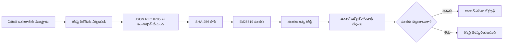
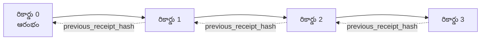

[పాఠ్య వీడియోను చూడండి: క్రిప్టోగ్రఫిక్ రసీదులతో AI ఏజెంట్లను సురక్షితం చేయడం](https://youtu.be/PLACEHOLDER_VIDEO_ID)

> _(పాఠ్య వీడియో మరియు థంబ్‌నెయిల్‌ను Microsoft కంటెంట్ బృందం విలీనం అనంతరం, పాఠ్యం 14 / 15 నమూనాను అనుగుణంగా జోడిస్తుంది.)_

# క్రిప్టోగ్రఫిక్ రసీదులతో AI ఏజెంట్లను సురక్షితం చేయడం

## పరిచయం

ఈ పాఠ్యం కవర్ చేస్తుంది:

- అనుపాలన, డీబగ్గింగ్, మరియు నమ్మకానికి AI ఏజెంట్ల కోసం ఆడిట్ ట్రైల్స్ ఎందుకు ముఖ్యం.
- క్రిప్టోగ్రఫిక్ రసీదు అంటే ఏమిటి మరియు ఇది సంతకం కాని లాగ్ లైన్ నుండి ఎలా భిన్నం.
- సాదారణ Python లో ఏజెంట్ టూల్ కాల్ కోసం సంతకమైన రసీదును ఎలా ఉత్పత్తి చేయాలి.
- ఆఫ్‌లైన్‌లో రసీదును ఎలా సరిచూడాలి మరియు మార్పులు ఎలా గుర్తించాలి.
- రసీదులను ఎలా చైన్ చేయాలి తద్వారా ఒకటి తీసివేయడం లేదా పునఃసంస్కరణ చైన్‌ను పాడుచేస్తుంది.
- రసీదులు ఏమి సాక్ష్యం ఇస్తాయో మరియు అవి స్పష్టంగా ఏమి సాక్ష్యం ఇవ్వవు.

## నేర్చుకునే లక్ష్యాలు

ఈ పాఠ్యం పూర్తి చేసిన తర్వాత, మీరు తెలుసుకుంటారు ఎలా:

- ఏజెంట్ చర్యలకు క్రిప్టోగ్రఫిక్ ఆధారం అవసరమయ్యే విఫలత మోడ్‌లను గుర్తించాలి.
- ఒక canonical JSON లోడ్‌పై Ed25519 సంతకం చేసిన రసీదును ఉత్పత్తి చేయాలి.
- కేవలం సంతకదారుడి పబ్లిక్ కీ ఉపయోగించి స్వతంత్రంగా రసీదును ధృవీకరించాలి.
- సవరించిన రసీదుపై మళ్లీ ధృవీకరణ నిర్వహించి మార్పుల గుర్తింపును చేయాలి.
- రసీదుల హాష్-చెయిన్ క్రమాన్ని నిర్మించి చైన్ ముఖ్యతను వివరిస్తారు.
- రసీదులు ఏమి సాక్ష్యం ఇస్తాయో (అట్రిబ్యూషన్, అసలు, క్రమం) మరియు ఏమి ఇవ్వవు (చర్య సరైనదా, విధానం నిర్ధారితమా) అన్న సరిహద్దును గుర్తించాలి.

## సమస్య: మీ ఏజెంట్ ఆడిట్ ట్రైలు

మీకు Contoso Travel కోసం ఒక AI ఏజెంట్ నియమించినట్లు ఊహించుకోండి. ఏజెంట్ కస్టమర్ అభ్యర్థనలు చదివి, విమానాల API ని పిలువ గాను ఎంపికలను వెతికి, కస్టమర్ తరపున సీట్లను బుక్ చేసుకుంటుంది. గత త్రైమాసికంలో ఏజెంట్ 50,000 బుకింగ్‌లు ప్రాసెస్ చేసింది.

ఈరోజు ఒక ఆడిటర్ వచ్చాడు. అతను అడుగుతాడు: "మీ ఏజెంట్ ఏమి చేశిందో చూపించండి."

మీరు లాగ్ ఫైల్స్ ఇవ్వగలుగుతారు. ఆడిటర్ వాటిని చూస్తాడు మరియు కఠిన ప్రశ్న అడుగుతాడు: "ఈ లాగ్‌లు సవరించబడలేదు అని నేను ఎలా తెలుసుకోగలను?"

ఇది ఆడిట్-ట్రైలు సమస్య. ఈ రోజు చాలా ఏజెంట్ అమరికలు ఆధారపడి ఉంటాయి:

- **అనువర్తన లాగ్స్**: ఏజెంట్ తానే రాస్తుంది, ఫైల్-సిస్టమ్ యాక్సెస్ ఉన్న ఎవరైనా సవరించగలరు.
- **క్లౌడ్ లాగింగ్ సర్వీసులు**: ప్లాట్‌ఫామ్ స్థాయిలో టాంపర్-ఎవిడెంట్, కానీ ఆడిటర్ ప్లాట్‌ఫామ్ ఆపరేటర్‌ని నమ్మితే మాత్రమే.
- **డేటాబేస్ ట్రాన్సాక్షన్ లాగ్స్**: డేటాబేస్ మార్పులకు సరిపోతాయి కానీ యాదృచ్ఛిక టూల్ కాల్స్‌కు కాదు.

ఈవాటిలో ఎటువంటి పద్ధతి ఆడిటర్ ప్రశ్నకు సమాధానం ఇవ్వటానికి వారిని నమ్మకుండా ఉండదు (మీరు, మీ క్లౌడ్ ప్రొవైడర్, లేదా డేటాబేస్ విక్రేత). అంతర్గత ఉపయోగానికి ఆ నమ్మకం సరిపోతుంది. కానీ నియంత్రిత వర్తింపుల కోసం (నిధులు, ఆరోగ్య సంరక్షణ, EU AI అభియానం వంటి), అది సరిపోదు.

క్రిప్టోగ్రఫిక్ రసీదులు ప్రతి ఏజెంట్ చర్యను స్వతంత్రంగా ధృవీకరించదగినవిగా చేస్తాయి. ఆడిటర్ మీను నమ్మాల్సిన అవసరం లేదు. వారికి మీ పబ్లిక్ కీ మరియు రసీదు మాత్రమే కావాలి.

## క్రిప్టోగ్రఫిక్ రసీదు అంటే ఏమిటి?

రసీదు అనేది ఏజెంట్ చేసినది రికార్డ్ చేసే JSON ఆబ్జెక్ట్, డిజిటల్ సంతకంతో సంతకం చేయబడింది.


  
సర్వసాధారణ రసీదు ఇలా ఉంటుంది:

```json
{
  "type": "agent.tool_call.v1",
  "agent_id": "contoso-travel-bot",
  "tool_name": "lookup_flights",
  "tool_args_hash": "sha256:a3f9c1...",
  "result_hash": "sha256:7b2e1d...",
  "policy_id": "contoso-travel-policy-v3",
  "timestamp": "2026-04-25T14:30:00Z",
  "sequence": 47,
  "previous_receipt_hash": "sha256:9d4e6a...",
  "signature": {
    "alg": "EdDSA",
    "sig": "c5af83...",
    "public_key": "8f3b2c..."
  }
}
```
  
మూడు లక్షణాలు పని చేస్తుంటాయి:

1. **సంతకం**: రసీదు ఏజెంట్ గేట్వే Ed25519 ప్రైవేట్ కీతో సంతకం చేస్తుంది. సంబంధిత పబ్లిక్ కీతో ఎవరికైనా ఆఫ్లైన్‌లో సంతకం ధృవీకరించవచ్చు. ఏ ఫీల్డ్‌లో మార్పు సంతకాన్ని చెల్లనివారుగా చేస్తుంది.

2. **కానానికల్ ఎన్‌కోడింగ్**: సంతకం చేసే ముందు, రసీదు JSON కానానికలైజేషన్ స్కీమ్ (JCS, RFC 8785) ఉపయోగించి సీరియలైజ్ చేయబడుతుంది. ఇది రెండు అమలులు ఒకే లాజికల్ రసీదు ఉత్పత్తి చేసినప్పుడు బైట్-అభినిదీ అవుట్‌పుట్ ఇవ్వాలని నిర్ధారిస్తుంది. కానానికలైజేషన్ లేకపోతే, JSON సీరియలైజర్ల వేర్వేరు సంతకాలను ఉత్పత్తి చేస్తాయి.

3. **హాష్ చెయినింగ్**: `previous_receipt_hash` ఫీల్డ్ ప్రతి రసీదును దాని ముందరి రసీదుతో లింక్ చేస్తుంది. ఒక రసీదును తీసేసినట్లయితే లేదా పునఃసంచిక చేయబడితే అన్ని ఆ తర్వాత రసీదులు పాడవుతాయి. మార్పులు వ్యక్తిగత సంతకాలు దాటిపోతే కూడా చెయిన్ స్థాయిలో కనబడతాయి.

ఈ లక్షణాలు కలిపి మూడు హామీలను ఇస్తాయి:

- **అట్రిబ్యూషన్**: ఈ కీ ఈ కంటెంట్‌ను సంతకం చేసింది.
- **అసలు**: సంతకం తర్వాత కంటెంట్ మారలేదు.
- **క్రమం**: ఈ రసీదు ఆ రసీదు తరువాత వచ్చిందని చెపుతుంది.

## Python లో రసీదు ఉత్పత్తి చేయడం

రసీదు ఉత్పత్తి చేయటానికి ప్రత్యేక లైబ్రరీ అవసరం లేదు. క్రిప్టోగ్రఫిక్ ప్రిమిటివ్స్ విస్తృతంగా అందుబాటులో ఉన్నాయి మరియు లాజిక్ కొన్ని దశాబ్దాలైన Python కోడ్ మాత్రమే.

`code_samples/18-signed-receipts.ipynb` లో హ్యాండ్స్-ఆన్ వ్యాయామాలు పూర్తి విధానాన్ని చూపుతాయి. సంక్షిప్త వర్షన్:

```python
import json
import hashlib
import base64
from nacl import signing
from jcs import canonicalize  # RFC 8785 కనానికల్ JSON

def b64url_nopad(data: bytes) -> str:
    return base64.urlsafe_b64encode(data).decode("ascii").rstrip("=")

def sha256_canonical(obj) -> str:
    """SHA-256 of a Python object's JCS-canonical JSON form."""
    return f"sha256:{hashlib.sha256(canonicalize(obj)).hexdigest()}"

# సైనింగ్ కీని ఉత్పత్తి చేయండి లేదా లోడ్ చేయండి (ఉత్పత్తిలో, కీ వాల్ట్‌లో నిల్వ చేయండి)
signing_key = signing.SigningKey.generate()
verify_key = signing_key.verify_key

# రసీదు పేపలోడ్‌ను రూపొందించండి (ఇంకా సంతకం లేదు)
tool_args = {"origin": "SYD", "destination": "LAX"}
tool_result = [{"flight": "QF11", "price": 1850, "stops": 0}]

payload = {
    "type": "agent.tool_call.v1",
    "agent_id": "contoso-travel-bot",
    "tool_name": "lookup_flights",
    "tool_args_hash": sha256_canonical(tool_args),
    "result_hash": sha256_canonical(tool_result),
    "policy_id": "contoso-travel-policy-v3",
    "timestamp": "2026-04-25T14:30:00Z",
    "sequence": 0,
    "previous_receipt_hash": None,
}

# కానానికలైజ్ చేయండి, హాష్ చేయండి, సంతకం చేయండి.
canonical_bytes = canonicalize(payload)
message_hash = hashlib.sha256(canonical_bytes).digest()
signature_bytes = signing_key.sign(message_hash).signature

# ఒక నిర్మాణాత్మక సంతకం ఆబ్జెక్టును జత చేయండి.
receipt = {
    **payload,
    "signature": {
        "alg": "EdDSA",
        "sig": b64url_nopad(signature_bytes),
        "public_key": b64url_nopad(bytes(verify_key)),
    },
}
```
  
ఇది మొత్తం సంతకం పద్ధతి. నోట్‌బుక్‌లో వ్యాయామాలు ప్రతి దశను వివరిస్తాయి.

## రసీదు ధృవీకరణ మరియు మార్పుల గుర్తింపు

ధృవీకరణ వ్యతిరేక చర్య:

```python
import base64
import hashlib
from nacl import signing
from nacl.exceptions import BadSignatureError
from jcs import canonicalize

def b64url_decode(s: str) -> bytes:
    padding = "=" * ((4 - len(s) % 4) % 4)
    return base64.urlsafe_b64decode(s + padding)

def verify_receipt(receipt: dict) -> bool:
    # సంతకం ఒక నిర్మిత వస్తువు: {"alg", "sig", "public_key"}.
    sig_obj = receipt.get("signature")
    if not sig_obj or sig_obj.get("alg") != "EdDSA":
        return False

    # నిజంగా సంతకమయ్యిన పేలోడును పునర్నిర్మించండి (సంతకాన్ని మినహాయించి అన్ని).
    payload = {k: v for k, v in receipt.items() if k != "signature"}

    canonical_bytes = canonicalize(payload)
    message_hash = hashlib.sha256(canonical_bytes).digest()

    try:
        verify_key = signing.VerifyKey(b64url_decode(sig_obj["public_key"]))
        verify_key.verify(message_hash, b64url_decode(sig_obj["sig"]))
        return True
    except BadSignatureError:
        return False
```
  
ఈ ఫంక్షన్ ఒక రసీదును తీసుకుని సంతకం సరైనదాయితే `True` తిరిగిస్తుంది, లేనివుంటే `False`. ఏనెట్‌వర్క్ కాల్ లేదు, ఎటువంటి సేవ ఆధారితత లేదు, ఎవరినైనా నమ్మాల్సిన అవసరం లేదు.

మార్పుల గుర్తింపును చూడటానికి నోట్‌బుక్ ఇలానే చూపిస్తుంది:

1. సరైన రసీదును ఉత్పత్తి చేసి ధృవీకరణ చూపించడం.
2. `tool_args_hash` ఫీల్డ్ లో ఒక్క బైట్ సవరించడం.
3. మళ్లీ ధృవీకరణ నడిపించి విఫలమవడం.

ఇది రసీదులు టాంపర్-ఎవిడెంట్ అని చెప్తుంది: ఏ చిన్న మార్పు అయినా సంతకాన్ని బ్రేక్ చేస్తుంది.

## బహుళ దశ ఏజెంట్ల కోసం రసీదుల చెయినింగ్

ఒకే సంతక రసీదు ఒక చర్యని కాపాడుతుంది. ఒక చెయిన్ రసీదులు క్రమాన్ని కాపాడతాయి.


  
ప్రతి రసీదు ముందటి రసీదు యొక్క హాష్‌ను నమోదు చేస్తుంది. రసీదు 2 ను సైలెంట్‌గా తీసివేయాలంటే దొంగచాతకుడు:

- రసీదు 3 యొక్క `previous_receipt_hash` ఫీల్డ్‌ను మార్చాలి (ఇది రసీదు 3 సంతకాన్ని పాడుచేస్తుంది), లేదా  
- సవరించిన రసీదు 3 పై కొత్త సంతకాన్ని తయారు చేయాలి (ఏజెంట్ ప్రైవేట్ కీ అవసరం).

ప్రైవేట్ కీ హార్డ్వేర్ కీ వాల్ట్‌లో ఉంటే మరియు ప్రతి రసీదుతో పబ్లిక్ కీ ప్రచురించినట్లయితే, వారి ద్వంద్వ దాడి గుర్తుబడకుండా సాధ్యంకాదు.

నోట్‌బుక్ ఇట్లు చూపిస్తుంది:

1. మూడు రసీదు చెయిన్ నిర్మించడం.
2. ప్రతి రసీదు యొక్క `previous_receipt_hash` నిజమైన హాష్‌తో సరిపోలుతుందో ధృవీకరించడం.
3. మధ్య రసీదులలో ఒకదానిని సవరించి వలయపు చెయిన్ బ్రేక్ అయ్యే దృశ్యం.

ఇలా మీరు ఆడిటర్ ఎటువంటి నమ్మకం లేకుండా ఆడిట్ ట్రైలు అందించగలుగుతారు.

## రసీదులు ఏమి సాక్ష్యం ఇస్తాయి (మరియు ఏమి ఇవ్వవు)

ఈ పాఠ్యంలో అత్యంత ముఖ్య భాగం ఇది. రసీదులు శక్తివంతమైనవ, కానీ వారి శక్తి పరిమితం.

**రసీదులు త్రి విషయాలను సాక్ష్యం ఇస్తాయి:**

1. **అట్రిబ్యూషన్**: ఒక నిర్దిష్ట కీ ఒక payload ను సంతకం చేసింది.  
2. **అసలు**: సంతకం అయిన తరువాత payload మారలేదు.  
3. **క్రమం**: ఈ రసీదు ఆ రసీదు తర్వాత చైన్‌లో వచ్చింది.

**రసీదులు సాక్ష్యం ఇవ్వవు:**

1. **సరైనత**: ఏజెంట్ చర్య సరైనదేనా అనేది కాదు. తప్పు జవాబు కోసం కూడా రసీదు సాఫీగా సంతకం చేయవచ్చు.  
2. **విధాన అనుగుణత**: `policy_id` లో పేర్కొన్న విధానం నిజంగా అంచనా వేయబడింది లేదా ఈ చర్య అనుమతించబడిందా అన్నది కాదు. రసీదు పేర్కొనేది ఏమి చెప్పబడిందో, ఏమి అమలు చేయబడిందో కాదు.  
3. **కీలకానికి అతిరేకంగా గుర్తింపు**: రసీదు "ఈ కీ సంతకం చేసింది" అంటుంది. ఇది "ఈ వ్యక్తి అనుమతించాడు" అని కాదు. వ్యక్తి/సంస్థకు కీ కేటాయించేందుకు వేరే గుర్తింపు వ్యవస్థ అవసరం.  
4. **ఇన్‌పుట్‌ల నిజమైనత**: ఏజెంట్ మార్పిడి చేసిన ప్రాంప్ట్‌ను అందుకుంటే, చర్యను ఫెయిత్‌ఫుల్గా రికార్డ్ చేస్తుంది. రసీదు ఇన్‌పుట్ ధృవీకరణకు ప్రత్యామ్నాయంకాదు.

ఈ సరిహద్దు రెండు కారణాలకోసం ముఖ్యంగా ఉంటుంది:

- ఇది రసీదులు ఏ పనికి ఉపయోగపడతాయో చెప్తుంది: ఏజెంట్ ప్రవర్తన ఆడిటబుల్, టాంపర్-ఎవిడెంట్ చేయడం, సంస్థల మధ్య కూడా.  
- ఇంకా ఏ అదనపు పొరల అవసరమో చెప్తుంది: ఇన్‌పుట్ ధృవీకరణ (పాఠ్యం 6), విధాన అమలు (క్రింద వివరించబడింది), గుర్తింపు వ్యవస్థ (ఈ పాఠ్యంలో కాదు).

పరమార్థం ఏంటంటే: "మీకుంది రసీదులు" అంటే "మీలాగే పాలన ఉంది" కాదు. రసీదులు పునాదిగా ఉంటాయి. పాలన మీరు నిర్మించేది.

## ఉత్పత్తి ఉదాహరణలు

ఈ పాఠ్యంలో Python కోడ్ ఉద్దేశపూర్వకంగా మినిమల్, ప్రతీ లైనును చదిగి అర్థం చేసుకునేందుకు. ప్రొడక్షన్‌లో రెండు ఎంపికలు ఉన్నాయి:

1. **క్రిప్టోగ్రఫిక్ ప్రిమిటివ్స్ పై నేరుగా నిర్మించండి.** పై చూపిన 50 లైన్లు చాలా సందర్భాలకు సరిపోతున్నాయి. PyNaCl (Ed25519) మరియు `jcs` ప్యాకేజీ (కానానికల్ JSON) మంచి నిర్వహణార్థమైన, ఆడిట్ చేసిన లైబ్రరీలు.

2. **ప్రొడక్షన్ రసీదు లైబ్రరీ వాడండి.** అనేక ఓపెన్ సోర్స్ ప్రాజెక్టులే అదనపు ఫీచర్లతో (కీ రోటేషన్, బ్యాచ్ ధృవీకరణ, JWK సెట్ పంపిణీ, విధాన ఇంజిన్ ఇంటిగ్రేషన్) ఇదే మాదిరి అమలు:
   - ఈ పాఠ్యంలో ఉపయోగించిన రసీదు ఫార్మాట్ IETF ఇంటర్నెట్-డ్రాఫ్ట్ (`draft-farley-acta-signed-receipts`) ఇందులో భాగం.
   - Microsoft Agent Governance Toolkit సిడార్ ఆధారిత విధాన నిర్ణయాలతో రసీదులను కలుపుతుంది; ఆ రిపాజిటరీలో ట్యుటోరియల్ 33 ఒక మొదలు నుంచి చివరకు ఉదాహరణను ఇస్తుంది.
   - `protect-mcp` (npm) మరియు `@veritasacta/verify` (npm) ప్యాకేజీలు Node ఆధారిత రసీదు సంతకం మరియు ఆఫ్‌లైన్ ధృవీకరణ ఇంప్లిమెంటేషన్లు ఇస్తాయి, MCP సర్వర్‌కు టాంపర్-ఎవిడెంట్ ఆడిట్ ట్రైలు కప్పడానికి.
   - **[nobulex](https://github.com/arian-gogani/nobulex)** Python SDK (`pip install nobulex`) Python లో Ed25519 + JCS సంతకం నమూనాతో LangChain మరియు CrewAI ఇంటిగ్రేషన్లు కలిగి, ప్రచురించిన క్రాస్-వాలిడేషన్ టెస్ట్ వెక్టర్లుతో పాటు [OWASP PR #2210](https://github.com/OWASP/CheatSheetSeries/pull/2210) മുഖಾಂತರ కాంప్లయిన్స్ మ్యాపింగ్ అందిస్తుంది.

తనిఖీలు నిర్మించడం లేదా లైబ్రరీ వాడటం నిర్ణయం మీ JWT లైబ్రరీ రాయడం లేదా అసలు పరీక్షించిన JWT వాడుతున్నందుకు ఒకటే: రెండు సరైనవి; లైబ్రరీ సమయం ఆదా చేస్తుంది మరియు ఆడిట్ వ్యాప్తిని తగ్గిస్తుంది; స్వయంగా తయారీ మీరు ప్రతీ ప్రిమిటివ్ అర్థం చేసుకోవాలి. పాఠ్యం స్వంతంగా తయారుచేసే దారిని నేర్పుతుంది, కనుక మీరు రెండు దారులు తీసుకోడానికి సిద్ధంగా ఉంటారు.

## జ్ఞాన సరిదిద్దు

ప్రాక్టీస్ వ్యాయామానికి ముందుగా మీ అవగాహనను పరీక్షించుకోండి.

**1. ఏజెంట్ ప్రైవేట్ Ed25519 కీతో ఒక రసీదు సంతకం చేస్తారు. ఆడిటర్ వద్ద కేవలం పబ్లిక్ కీ ఉంది. ఆడిటర్ ఆఫ్‌లైన్‌లో రసీదును ధృవీకరించగలడా?**

<details>
<summary>సమాధానం</summary>

అవును. Ed25519 ధృవీకరణకు కేవలం పబ్లిక్ కీ మరియు సంతకం చేసిన బైట్లు అవసరం. ఏ నెట్‌వర్క్ కాల్, ఏ సేవ ఆధారితత అవసరం లేదు. ఈ లక్షణం రసీదులను వాయు-గ్యాప్, బహుళ సంస్థల, తక్కువ నమ్మకం ఆడిట్ సందర్భాల్లో ఉపయోగకరంగా చేస్తుంది.
</details>

**2. దొంగ `policy_id` ఫీల్డ్‌ను సవరించి మరింత అనుమతించే విధానంగా పేర్కొన్నాడు. సంతకం అసలు లోడ్పై ఇది అయింది. ధృవీకరణలో ఏమవుతుంది?**

<details>
<summary>సమాధానం</summary>

ధృవీకరణ విఫలమవుతుంది. సంతకం అసలు లోడ్ యొక్క కానానికల్ బైట్లపై ఉంది; ఏ ఫీల్డ్ మార్పు అయినా కనానికల్ బైట్లు మారుతాయి, SHA-256 హాష్ మారుతుంది, సంతకం చెల్లనివా అవుతుంది. దొంగకు నూతన చెల్లుబాటు సంతకం చేయడానికి ప్రైవేట్ కీ ఉండాలి, అది లేదు.
</details>

**3. రా ఆర్గ్యుమెంట్స్ మరియు ఫలితాలకు బదులుగా రసీదు `tool_args_hash` మరియు `result_hash` ఎందుకు ఉంచబడింది?**

<details>
<summary>సమాధానం</summary>

రెండు కారణాలు. మొదటి, రసీదు ఆర్కైవ్ చేయవలసి లేదా లీకవకుండా తరలించవలసి ఉండొచ్చు (PII, వ్యాపార డేటా). హాష్ చేయడం రసీదును చిన్నగా ఉంచుతుంది మరియు కంటెంట్ గోప్యంగా ఉంటుంది; ఆడిటర్ నిజమైన కంటెంట్ వేరుగా నిల్వ ఉన్న ప్రతిపై హాష్ సరిపోతుందని ధృవీకరిస్తాడు. రెండవది, హాష్‌ల పరిమాణం స్థిరంగా ఉంటుంది; రసీదులో హాష్‌లు ఉంటే ఎన్ని ఇన్‌పుట్-ఆట్పుట్ ఉన్నా పరిమితిచే ఉంటుంది.
</details>

**4. `previous_receipt_hash` ఫీల్డ్ ప్రతీ రసీదును ముందరి రసీదుతో లింక్ చేస్తుంది. సైలు మధ్యలో ఒక రసీదును దొంగ సైలెంట్‌గా తీసివేస్తే, ఏమవుతుంది?**

<details>
<summary>సమాధానం</summary>

తీసివేయబడిన తర్వాత వచ్చిన ప్రతి రసీదు అవాస్తవంగా మారుతుంది. వారి `previous_receipt_hash`లు నిజమైన చెయిన్‌ను సూచించవు (వారు సూచించిన రసీదు ఇక లేదని లేదా చెయిన్ వేరే ముందరి వైపు సంకేతం సూచిస్తుంది). తీసివేతను దాచడానికి, దొంగ ప్రతీ తర్వాతి రసీదును మళ్లీ సంతకం చేయాల్సి ఉంటుంది, అది ప్రైవేట్ కీ అవసరం.
</details>

**5. ఒక రసీదు ఆరోగ్యంగా ధృవీకరించబడింది. అంది ఏజెంట్ చర్య సరైనదా, నిబంధనకు అనుగుణమా అని ఇది సాక్ష్యం?**

<details>
<summary>సమాధానం</summary>

కాదు. చెల్లుబాటు రసీదు మూడు విషయాలను మాత్రమే సాక్ష్యం ఇస్తుంది: అట్రిబ్యూషన్ (ఈ కీ ఈ కంటెంట్ సంతకం చేసింది), అసలు (కంటెంట్ మారలేదు), క్రమం (ఈ రసీదు ఆ రసీదు తర్వాతది). ఇది చాదడితిన పనిలేదని, `policy_id` లో ఉన్న విధానాన్ని నిజంగా అమలు చేశాడో లేదో, ఏజెంట్ అన్ని నియమాలను పాటించాడో కాదు. రసీదులు ఏజెంట్ ప్రవర్తన ఆడిటబుల్ చేస్తాయి, తప్పనిసరిగా సరైనదిలేనని. ఇది పాఠ్యంలో అత్యంత ముఖ్యమైన సరిహద్దు.
</details>

## ప్రాక్టీస్ వ్యాయామం

`code_samples/18-signed-receipts.ipynb` ని తెరచి అన్ని నాలుగు విభాగాలను పూర్తి చేయండి:

1. **విభాగం 1**: మీ మొదటి రసీదుని సంతకం చేసి ధృవీకరించండి.  
2. **విభాగం 2**: రసీదును సవరించి ధృవీకరణ విఫలమవ్వడం గమనించండి.  
3. **విభాగం 3**: మూడు రసీదు చైన్ కట్టి ఆ చెయిన్ అసలు పరిశీలన చేయండి.  
4. **విభాగం 4**: Microsoft Agent ఫ్రేమ్‌వర్క్‌తో నిర్మించిన ఏజెంట్‌కు నమూనాను వర్తింపజేసి: టూల్ కాల్‌ను రసీదు-సంతకం చేయడం, ఆ రసీదును స్వతంత్రంగా ధృవీకరించడం.
**స్ట్రెచ్ చెలెంజ్ 1:** రిసీప్ట్ స్కీమాను మీ ఇష్టమైన అదనపు ఫీల్డ్‌తో (ఉదాహరణకు, ట్రేసింగ్ కోసం అభ్యర్థన ID) విస్తరించండి, దీనిని కలిగించే కేనానికల్ సైన్ లాజిక్‌ను నవీకరించండి, మరియు రిసీప్ట్ వెరిఫికేషన్ ద్వారా తిరిగి రౌండ్-ట్రిప్ అవుతుంది అని నిర్ధారించండి. ఆ తర్వాత సైన్ చేసిన తర్వాత ఆ ఫీల్డ్‌ను మార్చి వెరిఫికేషన్ విఫలమవుతుంది అని నిర్ధారించండి. ఇది మీరు కేనానికల్ ఎన్‌కోడింగ్ యొక్క ప్రతి బైట్ సంతకంపై ఎలా ప్రభావితం చేస్తుందో అర్థం చేసుకునేందుకు ఇబ్బంది పడుతుంది.

**స్ట్రెచ్ చెలెంజ్ 2:** మీ రెండు రిసీప్ట్‌లను SHA-256తో హ్యాష్ చేసి (వారి కేనానికల్ బైట్లను నిర్ణయాత్మక క్రమంలో కలపండి) ఆ హ్యాష్‌ను మూడవ రిసీప్ట్‌పై కొత్త ఫీల్డ్‌గా పొందించి సైన్ చేయండి. అన్ని మూడు రిసీప్ట్‌లు ఇంకా రౌండ్-ట్రిప్ అవుతాయని నిర్ధారించండి. మీరు ఇప్పుడు ఒక స్టెప్ ఇన్క్లూజన్ ప్రూఫ్ రಚించారు: మూడవ రిసీప్ట్‌ను కలిగి ఉన్న వారు, మొదటి రెండు సైన్ అయిన సమయంలో ఉన్నాయి అని వారి కంటెంట్లను బయటపెట్టకుండా నిరూపించవచ్చు. ఇది సెలెక్టివ్-డిస్క్లోజర్ రిసీప్ట్‌లు స్థిరత్వంతో ఉపయోగించే నమూనా (మర్కిల్ కమిట్‌మెంట్‌లు, RFC 6962).

## ముగింపు

క్రిప్టోగ్రాఫిక్ రిసీప్ట్‌లు AI ఏజెంట్లకు ఈ విధమైన ఆడిట్ ట్రైల్ ఇస్తాయి:

- **స్వతంత్రంగా ధ్రువీకరించదగినది**: పబ్లిక్ కీ ఉన్న ఏ పార్టీ అయినా ధ్రువీకరించొచ్చు, సేవపై ఆధారపడదు.
- **టాంపర్-ఇవిడెంట్**: ఎలాంటి మార్పు సంతకాన్ని చెల్లనిది చేస్తుంది.
- **పోర్టబుల్**: రిసీప్ట్ ఒక చిన్న JSON ఫైల్; అది ఆర్చైవ్ చేయవచ్చు, ప్రసారం చేయవచ్చు, మరియు ఎక్కడైనా ధృవీకరించవచ్చు.
- **స్టాండర్డ్స్‌కు అనుగుణంగా**: Ed25519 (RFC 8032), JCS (RFC 8785), మరియు SHA-256 పై నిర్మించబడింది, ఇవన్నీ విస్తృతంగా ఉపయోగించే ప్రిమిటివ్‌లు.

వీటిని ఇన్‌పుట్ వెరిఫికేషన్, పాలసీ అమలు, లేదా ఐడెంటిటీ ఇన్ఫ్రాస్ట్రక్చర్‌కు ప్రత్యామ్నాయంగా తీసుకోకూడదు. అవి ఆ సంస్కరణల కోసం స్థూపం. మీరు నియంత్రించే వర్క్‌లోడ్‌లలో, బహుళ సంస్థ వర్క్‌ఫ్లోలో, లేదా భవిష్యత్ ఆడిటర్‌ను మీపై నమ్మకముండదని భావించే ఏ సందర్భంలో అయినా ఏజెంట్‌లను అమలు చేస్తున్నప్పుడు, రిసీప్ట్‌లతో మీరు ఆడిట్ ట్రైల్ను సత్యంగా ఉంచవచ్చు.

ముఖ్యమైన విషయం: రిసీప్ట్‌లు ఎవరు ఏం అన్నారు, ఎప్పుడు అన్నారు అనే విషయాన్ని నిరూపిస్తాయి. వారు ఏమి చెప్పబడింది అది నిజమో లేదా సరియైనదో నిరూపించవు. ఆ భేదాన్ని కచ్చితంగా పట్టుకోండి. అది ఒక నిజమైన మూలస్తంభ వ్యవస్థ మరియు తప్పుదారి చూపే ఒక వ్యవస్థ మధ్య తేడా.

## ప్రొడక్షన్ చెక్లిస్ట్

ఈ పాఠం నుండి రిసీప్ట్-సైన్ చేసిన ఏజెంట్‌లను వాస్తవ వాతావరణంలో అమలు చేయడానికి సిద్ధంగా ఉన్నప్పుడు:

- [ ] **సైన్ కీని డెవలపర్ ల్యాప్‌టాప్ నుండి తరలించండి.** Azure Key Vault, AWS KMS, లేదా హార్డ్వేర్ సెక్యూరిటీ మాడ్యూల్ ఉపయోగించండి. మీ రిసీప్ట్‌లపై సంతకం చేసే ప్రైవేట్ కీ సోర్స్ కంట్రోల్ లేదా అప్లికేషన్ యంత్రాలలో ప్లెయిన్టెక్స్ట్‌లో ఎప్పుడూ ఉంచకూడదు.
- [ ] **వెరిఫికేషన్ పబ్లిక్ కీని ప్రచురించండి.** ఆడిటర్లు ఆఫ్‌లైన్‌లో ధృవీకరించడానికి దీనిని అవసరం వారికి. సాధారణ నమూనా JWK సెట్ ఒక ప్రసిద్ధ URL (RFC 7517) వద్ద ఉంటుంది, ఉదా: `https://your-org.example.com/.well-known/agent-keys.json`.
- [ ] **లింకును బయటి స్థాయిలో యాంకర్ చేయండి.** అప్‌డేట్ అయిన చైన్ హెడ్ హాష్‌ను తరచుగా ట్రాన్స్‌పరెన్సీ లాగ్ (Sigstore Rekor, RFC 3161 టైమ్‌స్టాంప్ అధికారి, లేదా రెండో అంతర్గత వ్యవస్థ) కి రాయండి, తద్వారా బయట ఉన్న వ్యక్తి “ఈ చైన్ ఈ సమయానికి ఉంది” అని నిర్ధారించగలగాలి.
- [ ] **రిసీప్ట్‌లను అమరమయ్యేలా నిల్వ చేయండి.** ఎప్పటికప్పుడు చేర్చే బ్లాబ్ స్టోరేజ్ (Azure స్టోరేజ్ అమరత్వ విధానాలతో, AWS S3 ఆబ్జెక్ట్ లాక్) ఒక అంతర్గత వ్యక్తి స్టోరేజ్ లేయర్‌లో చరిత్రను తిరగరాయకుండా రోధిస్తుంది.
- [ ] **నిల్వ నిర్ణయించండి.** చాలా అనుగుణత నియమావళులు బహుళ సంవత్సరాల నిల్వను అవసరం చేస్తాయి. రిసీప్ట్ ప్రగతిని ప్రణాళిక చేయండి (ప్రతి రిసీప్ట్ ~500 బైట్లుగా ఉంటుంది; రోజుకు 10K కాల్‌లు చేసే ఏజెంట్ సంవత్సరానికి ~1.8 GB ఉత్పత్తి చేస్తుంది).
- [ ] **రిసీప్ట్‌లు ఏవి కవర్ చేయవు అనేదాన్ని డాక్యూమెంట్ చెయ్యండి.** రిసీప్ట్‌లు ఏప్రూవల్, ప్రమాణ్యత, మరియు క్రమాన్ని నిరూపిస్తాయి. మీ రన్‌బుక్‌లో ఎలాంటి అదనపు నియంత్రణలు (ఇన్‌పుట్ వెరిఫికేషన్, పాలసీ అమలు, రేట్ లిమిటింగ్, ఐడెంటిటీ ఇన్‌ఫ్రాస్ట్ర‌క్చర్) రిసీప్ట్‌ల పక్కన మీ పాలన దృక్పథంలో ఉంటాయో స్పష్టంగా జాబితా చేయండి.

### AI ఏజెంట్‌ల భద్రతపై మరిన్ని ప్రశ్నలున్నారా?

[Microsoft Foundry Discord](https://aka.ms/ai-agents/discord)లో చేరి ఇతర అభ్యాసకులతో చర్చించండి, ఆఫీస్ అవర్స్‌లో పాల్గొనండి, మరియు మీ AI ఏజెంట్‌ల ప్రశ్నలకు సమాధానాలు పొందండి.

## ఈ పాఠం మించి

ఈ పాఠం ఒకే రిసీప్ట్ సంతకం మరియు హాష్-చెయిన్డ్ సీక్వెన్స్‌లను కవరిస్తుంది. అదే ప్రిమిటివ్‌లు మీరు పాలన దృక్పథం అభివృద్ధి చెందుతున్న కొద్దీ కలుపుకుని మరెన్నో అధునాతన నమూనాలు సృష్టిస్తాయి:

- **సెలెక్టివ్ డిస్క్లోజర్.** ఒక రిసీప్ట్ ఫీల్డ్‌లు స్వతంత్రంగా కమిట్ చేయబడి ఉంటే (RFC 6962-శైలి మర్కిల్ ట్రీ), మీరు నిర్దిష్ట ఫీల్డ్‌లను నిర్దిష్ట ఆడిటర్లకు గోప్యంగా ప్రదర్శించవచ్చు మరియు మిగతా ఫీల్డ్‌లను మారకుండా ఉన్నాయని నిరూపించవచ్చు. ఇది ఒకే రిసీప్ట్ ద్వారా సమగ్ర ఆడిట్ (పూర్తి కావాలని కోరుకునే) మరియు డేటా-న్యూనీకరణ నియమావళులు (GDPR వంటి, ఆడిటర్_VISIBLE_చాలా తక్కువగా చూడాలని కోరుకునే) రెండింటినీ సపోర్ట్ చేసేటప్పుడు ఉపయోగపడుతుంది.
- **రిసీప్ట్ రివోకేషన్.** ఒక సైన్ కీ చిలిపి అయితే, ఆ కీతో సంతకం చేసిన అన్ని రిసీప్ట్‌లను ఒక నిర్దిష్ట సమయం నుండి నమ్మకమില്ലని గుర్తించడానికి మార్గం అవసరం. సాధారణ నమూనాలు: తక్కువ కాలం పనిచేసే సైన్ కీలు మరియు ప్రచురించబడిన రివోకేషన్ జాబితా, లేదా రివోకేషన్ ఎంట్రీలతో ట్రాన్స్‌పరెన్సీ లాగ్.
- **బిలాటరల్ / స్ప్లిట్-సిగ్నేచర్ రిసీప్ట్‌లు.** కొన్ని అమలు విదులు సంతకం చేసిన లోడ్ను ప్రీ-ఎక్సిక్యూషన్ (`authorization_*`) మరియు పోస్ట్-ఎక్సిక్యూషన్ (`result_*`) అర్థకాలాలుగా విభజించి స్వతంత్ర సంతకాలు కలిపి సరళతరం చేస్తాయి; ఇది ఉత్తర్వు నిర్ణయం మరియు ప్రదర్శన ఫలితం వేర్వేరు వ్యక్తులు లేదా సమయాల్లో తయారయ్యే సందర్భంలో ఉపయోగకరం. ఇది ఈ పాఠంలో నేర్పించిన రిసీప్ట్ ఫార్మాట్‌పై అదనంగా అమలు చేయవచ్చు.
- **లోడ్ కలయిక.** రిసీప్ట్ మీరు `result_hash`లో పెట్టిన ఏ bytes అయినా సీలింగ్ చేస్తుంది. వాస్తవ ప్రపంచ లోడ్‌లు ఒక్కటే సాధనం ఫలితానికి కంటే ఎక్కువగా ఉండవచ్చు: ముందస్తు నిర్ణయ కారణాలు (మోడల్ పూర్వా అనుమానం, పరిగణించబడిన ఎంపికలు, సాక్ష్యాలు మరియు వాటి సంపూర్ణత, ప్రమాద స్థితి, బాధ్యత గొలుసు, గేటు ఫలితం) మొత్తం లోడ్‌లో ఉండవచ్చు, ఒకే రిసీప్ట్ ద్వారా సీల్డ్. ఇది రిసీప్ట్ ఫార్మాట్‌ను అంత స్వల్పంగా ఉంచి లోడ్ స్కీమాలు విభాగాలవారీగా పదును పెరిగేలా చేస్తుంది.
- **అమలు మధ్య కలిపి నిర్దిష్టత.** ఒకే రిసీప్ట్ ఫార్మాట్ యొక్క బహుళ స్వతంత్ర అమలులు (Python, TypeScript, Rust, Go) పంచుకున్న టెస్ట్ వెక్టర్లతో క్రాస్-వెరిఫై చేస్తాయి. మీరు మీ స్వంత అమలును నిర్మిస్తే, ప్రచురించబడిన వెక్టర్లను ఉపయోగించి ధృవీకరించడం వైర్ అనుకూలతను నిరూపిస్తుంది.
- **పోస్ట్-క్వాంటమ్ మార్పిడి.** Ed25519 ప్రస్తుతం విస్తృతంగా ఉపయోగించబడుతోంది కానీ క్వాంటమ్-ప్రతిరోధకమే కాదు. రిసీప్ట్ ఫార్మాట్ అల్గోరిథమ్-అజైల్: `signature.alg` ఫీల్డ్‌లో మీరు మార్పిడి అవసరం ఉన్నప్పుడు `ML-DSA-65` (NIST పోస్ట్-క్వాంటమ్ సిగ్నేచర్ స్టాండర్డ్) ను ఉపయోగించవచ్చు. డ్యూయల్-సైన్ సమయం ఉన్న మార్పు కాలం కోసం ప్రణాళిక వేయండి.

## అదనపు వనరులు

- <a href="https://datatracker.ietf.org/doc/draft-farley-acta-signed-receipts/" target="_blank">IETF ఇంటర్నెట్-డ్రాఫ్ట్: మెషీన్-టు-మెషీన్ యాక్సెస్ కంట్రోల్ కోసం సైన్ చేసిన నిర్ణయ రిసీప్ట్‌లు</a>
- <a href="https://learn.microsoft.com/azure/ai-studio/responsible-use-of-ai-overview" target="_blank">అత్యవసర AI అవలోకనం (Azure AI)</a>
- <a href="https://datatracker.ietf.org/doc/html/rfc8032" target="_blank">RFC 8032: ఎడ్వర్డ్స్-కర్వ్ డిజిటల్ సిగ్నేచర్ అల్గోరిథమ్ (EdDSA)</a>
- <a href="https://datatracker.ietf.org/doc/html/rfc8785" target="_blank">RFC 8785: JSON కనానికలైజేషన్ స్కీం (JCS)</a>
- <a href="https://datatracker.ietf.org/doc/html/rfc6962" target="_blank">RFC 6962: సర్టిఫికెట్ ట్రాన్స్‌పరెన్సీ</a> (సెలెక్టివ్-డిస్క్లోజర్ రిసీప్ట్‌లు ఉపయోగించే మర్కిల్-ట్రీ నిర్మాణం)
- <a href="https://github.com/microsoft/agent-governance-toolkit/blob/main/docs/tutorials/33-offline-verifiable-receipts.md" target="_blank">Microsoft ఏజెంట్ పాలన టూల్‌కిట్, ట్యూటోరియల్ 33: ఆఫ్‌లైన్-వెరిఫైయబుల్ నిర్ణయ రిసీప్ట్‌లు</a>
- <a href="https://github.com/ScopeBlind/agent-governance-testvectors" target="_blank">ఈ పాఠంలో ఉపయోగించిన రిసీప్ట్ ఫార్మాట్ కోసం క్రాస్-అమలు నిర్ధారిత పరీక్ష వెక్టర్లు</a> (Apache-2.0)
- <a href="https://pynacl.readthedocs.io/" target="_blank">PyNaCl డాక్యుమెంటేషన్</a> (Pythonలో Ed25519)

## ఇంతకు మునుపటి పాఠం

[కంప్యూటర్ యూజ్ ఏజెంట్‌లు నిర్మించడం (CUA)](../15-browser-use/README.md)

## తదుపరి పాఠం

_(పాఠ్యక్రమం నిర్వహకులు నిర్ణయించాలి)_

---

<!-- CO-OP TRANSLATOR DISCLAIMER START -->
**అస్వీకరణ**:
ఈ పత్రం AI అనువాద సేవ [Co-op Translator](https://github.com/Azure/co-op-translator) ఉపయోగించి అనువదించబడింది. మేము ఖచ్చితత్వానికి ప్రయత్నిస్తున్నప్పటికీ, ఆటోమేటెడ్ అనువాదాలు తప్పులు లేదా అసమగ్రతలను కలిగి ఉండవచ్చు. దాని స్వదేశ భాషలో ఉన్న అసలు పత్రాన్ని అధికారం కలిగిన మూలంగా పరిగణించాలి. కీలకమైన సమాచారం కోసం, ప్రొఫెషనల్ మానవ అనువాదాన్ని సిఫారసు చేస్తాము. ఈ అనువాదం ఉపయోగం వల్ల కలిగే ఏవైనా అపార్థాలు లేదా తప్పుదారులు కోసం మేము బాధ్యత వహించము.
<!-- CO-OP TRANSLATOR DISCLAIMER END -->