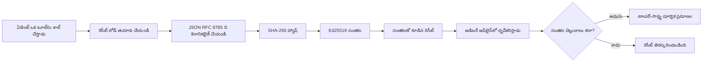
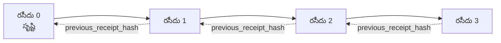

[పాఠం వీడియో చూడండి: క్రిప్టోగ్రాఫిక్ రసీదులతో AI ఏజెంట్లను రక్షించడం](https://youtu.be/PLACEHOLDER_VIDEO_ID)

> _(Microsoft కంటెంట్ బృందం విలీనం తర్వాత పాఠం వీడియో మరియు థంబ్నెయిల్ జతచేయబడతాయి, పాఠం 14 / 15 నమూనాతో సరిపోతుంది.)_

# క్రిప్టోగ్రాఫిక్ రసీదులతో AI ఏజెంట్లను రక్షించడం

## పరిచయం

ఈ పాఠం ఇందులో తెలుగు చేస్తుంది:

- అనుభవాలు, డీబగ్గింగ్ మరియు విశ్వాసం కోసం AI ఏజెంట్ల ఆడిట్ ట్రెయిల్స్ ఎందుకు ముఖ్యమే.
- క్రిప్టోగ్రాఫిక్ రసీదు అంటే ఏమిటి మరియు అవి సంతకం కాని లాగ్ లైన్ల నుండి ఎలా భిన్నంగా ఉంటాయి.
- ఏజెంట్ టూల్ కాల్‌ కోసం సాధారణ Python లో సంతకం చేసిన రసీదును ఎలా ఉత్పత్తి చేసుకోవచ్చు.
- ఆఫ్‌లైన్‌లో రసీదును ఎలా ధ్రువీకరించాలి మరియు మార్పిడి గుర్తించాలి.
- ఒక రసీదును తీసేయడం లేదా పునఃఆర్డర్ చేయడం ద్వారా చైన్ ఎలా తెగిపోతుంది.
- రసీదులు ఏమి సాక్ష్యం ఇస్తాయి మరియు అవి స్పష్టంగా ఏమి సాక్ష్యం ఇవ్వవు.

## నేర్చుకునే లక్ష్యాలు

ఈ పాఠం పూర్తిచేసిన తర్వాత, మీరు ఎలా చేయాలో తెలుసుకుంటారు:

- ఏజెంట్ చర్యలకు క్రిప్టోగ్రాఫిక్ ఊతాలు అవసరమైన విఫలమైన పద్ధతులను గుర్తించడం.
- ఒక సమ్మతమైన JSON పేటీలో Ed25519 సంతకం చేసిన రసీదు ఉత్పత్తి చేయడం.
- సంతకం చేసిన వ్యక్తి పబ్లిక్ కీ ద్వారా స్వతంత్రంగా రసీదును ధృవీకరించడం.
- మార్పిడి గుర్తింపును సవరించిన రసీదుపై ధృవీకరణను మళ్ళీ నడుపుతూ గుర్తించటం.
- రసీదుల హ్యాష్-చెయిన్ క్రమాన్ని నిర్మించి, ఆ క్రమం ఎందుకు ముఖ్యమో వివరణ చేయడం.
- రసీదులు ఏ విషయాలను సాక్ష్యం ఇస్తాయో (సంబంధింపు, సమగ్రత, క్రమం) మరియు ఏవి ఇస్తున్నట్లేదు (చర్య యొక్క సరి/తప్పు, విధాన ధృడత్వం) గుర్తించడం.

## సమస్య: మీ ఏజెంట్ ఆడిట్ ట్రెయిల్

మీరు Contoso Travel కోసం AI ఏజెంట్ ని అమలు చేసారని ఊహించుకోండి. ఏజెంట్ కస్టమర్ అభ్యర్థనలు చదివి, ఫ్లైట్స్ API ద్వారా ఎంపికలను చూస్తుంది మరియు కస్టమర్ తరఫున సీట్లను బుక్ చేస్తుంది. గత త్రైమాసికంలో, ఏజెంట్ 50,000 బుకింగ్‌లను ప్రాసెస్ చేశాడు.

ఈరోజు ఓ ఆడిటర్ వచ్చారు. వారు అడుగుతారు: "మీ ఏజెంట్ ఏం చేసిందో చూపించండి."

మీరు మీ లాగ్ ఫైల్స్ అందిస్తారు. ఆడిటర్ వాటిని చూసి కష్టం గల ప్రశ్న అడుగుతారు: "నేను ఎలా తెలుసుకోగలను ఈ లాగులు సవరించబడలేదని?"

ఇది ఆడిట్-ట్రెయిల్ సమస్య. ఈ రోజుతో చాలా ఏజెంట్ అమ్లనా:

- **అప్లికేషన్ లాగులు**: ఏజెంట్ స్వయంగా వ్రాస్తుంది, ఫైల్-సిస్టమ్ యాక్సెస్ ఉన్న ఎవరికైనా మార్చుకోవచ్చు.
- **క్లౌడ్ లాగింగ్ సర్వీస్‌లు**: ప్లాట్‌ఫాం స్థాయిలో మార్పును గుర్తించేలా ఉంటాయి కానీ ఆడిటర్ ప్లాట్‌ఫాం ఆపరేటర్ పై నమ్మకముంటే మాత్రమే.
- **డేటాబేస్ ట్రాన్సాక్షన్ లాగ్లు**: డేటాబేస్ మార్పులకు అనుకూలం కానీ ఏదైనా టూల్ కాల్‌లకు కాదు.

ఈ లాగులు ఆడిటర్ ప్రశ్నకు జవాబు ఇవ్వలేవు ఏదైనా ఒకరిపై (మీ, క్లౌడ్ ప్రొవైడర్, డేటాబేస్ విక్రేత) నమ్మకం అవలంబించవలసి ఉంటుంది. అంతర్గత వాడుక కోసం అది గమనించద్రువమైనది, నియంత్రిత లోడ్‌ల (ఫైనాన్స్, ఆరోగ్యం, EU AI చట్టం కోసం) కోసం అవును కాదు.

క్రిప్టోగ్రాఫిక్ రసీదులు ఈ సమస్యను పరిష్కరిస్తాయి, ప్రతి ఏజెంట్ చర్యను స్వతంత్రంగా ధృవీకరించగలుగుతున్నది. ఆడిటర్ మీమీద నమ్మకము అవసరం లేదు. వారికి మీ పబ్లిక్ కీ మరియు రసీదు మాత్రమే కావాలి.

## క్రిప్టోగ్రాఫిక్ రసీదు అంటే ఏమిటి?

ఒక రసీదు అనేది ఏజెంట్ చేసిన దాన్ని రికార్డ్ చేసే JSON ఆబ్జెక్ట్, డిజిటల్ సంతకంతో సంతకం చేయబడింది.


  
కనిష్ట రసీదు ఇలా ఉంటుంది:

```json
{
  "type": "agent.tool_call.v1",
  "agent_id": "contoso-travel-bot",
  "tool_name": "lookup_flights",
  "tool_args_hash": "sha256:a3f9c1...",
  "result_hash": "sha256:7b2e1d...",
  "policy_id": "contoso-travel-policy-v3",
  "timestamp": "2026-04-25T14:30:00Z",
  "sequence": 47,
  "previous_receipt_hash": "sha256:9d4e6a...",
  "signature": {
    "alg": "EdDSA",
    "sig": "c5af83...",
    "public_key": "8f3b2c..."
  }
}
```
  
మూడు గుణాలు పనులు చేస్తున్నాయి:

1. **సంతకం**. ఈ రసీదు ఏజెంట్ గేట్వే ద్వారా Ed25519 ప్రైవేట్ కీతో సంతకం చేయబడింది. సంబంధిత పబ్లిక్ కీ ఉన్న ఎవరు అయినా ఆన్‌లైన్ కాని ఆఫ్‌లైన్ ధృవీకరించవచ్చు. ఏ ఫీల్డ్ లోని మార్పు సంతకాన్ని అవాస్తవం చేస్తుంది.

2. **కెనానికల్ ఎంకోడింగ్**. సంతకం ముందు రసీదు JSON కెనానికలైజేషన్ స్కీమ్ (JCS, RFC 8785) తో సీరియలైజ్ చేయబడుతుంది. ఇది రెండు అమలేల ఒకే లాజికల్ రసీదు సృష్టించినప్పుడు బైట్-సరసన అవుట్‌పుట్ ఇస్తుందని నిర్ధారిస్తుంది. కెనానికలైజేషన్ లేకుంటే వేరే JSON సీరియలైజర్లు వేర్వేరు సంతకాలు ఉత్పత్తి చేస్తాయి.

3. **హ్యాష్ చెయినింగ్**. `previous_receipt_hash` ఫీల్డ్ ప్రతి రసీదును మునుపటి రసీదు తో లింక్ చేస్తుంది. ఒక రసీదును తీసేయడం లేదా పునఃఆర్డర్ చేయడం తరువాత వచ్చిన ప్రతి రసీదును పాడుచేస్తుంది. మార్పిడి చెయిన్ స్థాయిలో కనిపిస్తుంది, ఎIndividual signatures ఆపేయబడినప్పటికీ.

ఈ లక్షణాలు కలిసి మూడు హామీలు ఇస్తాయి:

- **సంబంధింపు**: ఈ కీ ఈ కంటెంట్‌ను సంతకం చేసింది.
- **సమగ్రత**: సంతకం తర్వాత కంటెంట్ మారలేదు.
- **క్రమం**: ఈ రసీదు ఆ రసీదు తర్వాత మాత్రమే వచ్చింది.

## Python లో రసీదు ఉత్పత్తి చేయడం

రసీదు చేర్చడానికి ప్రత్యేక లైబ్రరీ అవసరం లేదు. క్రిప్టోగ్రాఫిక్ ప్రిమిటివ్లు విస్తృతంగా అందుబాటులో ఉంటాయి, లాజిక్ కొన్ని పాఠాల Python కోడ్ మాత్రమే.

`code_samples/18-signed-receipts.ipynb` లో హ్యాండ్-ఆన్ వ్యాయామాలు పూర్తి సహాయంగా ఉంటాయి. సంక్షిప్తం:

```python
import json
import hashlib
import base64
from nacl import signing
from jcs import canonicalize  # RFC 8785 క్యానానికల్ JSON

def b64url_nopad(data: bytes) -> str:
    return base64.urlsafe_b64encode(data).decode("ascii").rstrip("=")

def sha256_canonical(obj) -> str:
    """SHA-256 of a Python object's JCS-canonical JSON form."""
    return f"sha256:{hashlib.sha256(canonicalize(obj)).hexdigest()}"

# సంతకం కోసం కీని ఉత్పత్తి చేయండి లేదా లోడ్ చేయండి (ఉత్పత్తిలో, కీ వాల్ట్‌లో నిల్వ చేయండి)
signing_key = signing.SigningKey.generate()
verify_key = signing_key.verify_key

# రసీదు లోడ payloadని నిర్మించండి (ఇప్పుడిగానీ సంతకం లేదు)
tool_args = {"origin": "SYD", "destination": "LAX"}
tool_result = [{"flight": "QF11", "price": 1850, "stops": 0}]

payload = {
    "type": "agent.tool_call.v1",
    "agent_id": "contoso-travel-bot",
    "tool_name": "lookup_flights",
    "tool_args_hash": sha256_canonical(tool_args),
    "result_hash": sha256_canonical(tool_result),
    "policy_id": "contoso-travel-policy-v3",
    "timestamp": "2026-04-25T14:30:00Z",
    "sequence": 0,
    "previous_receipt_hash": None,
}

# క్యానానికలైజ్ చేయండి, హ్యాష్ చేయండి, సంతకం చేయండి.
canonical_bytes = canonicalize(payload)
message_hash = hashlib.sha256(canonical_bytes).digest()
signature_bytes = signing_key.sign(message_hash).signature

# ఘటనా సంతకం ఆబ్జెక్టును జతచేయండి.
receipt = {
    **payload,
    "signature": {
        "alg": "EdDSA",
        "sig": b64url_nopad(signature_bytes),
        "public_key": b64url_nopad(bytes(verify_key)),
    },
}
```
  
ఇది మొత్తం సంతకం పైప్లైన్. నోట్బుక్里的 ప్రయోగాలు ప్రతి దశను స్పష్టంగా చూపిస్తాయి.

## రసీదు ధృవీకరణ మరియు మార్పిడి గుర్తింపు

ధృవీకరణ వ్యతిరేక చర్య:

```python
import base64
import hashlib
from nacl import signing
from nacl.exceptions import BadSignatureError
from jcs import canonicalize

def b64url_decode(s: str) -> bytes:
    padding = "=" * ((4 - len(s) % 4) % 4)
    return base64.urlsafe_b64decode(s + padding)

def verify_receipt(receipt: dict) -> bool:
    # సంతకం ఒక నిర్మాణాత్మక αντικరం: {"alg", "sig", "public_key"}.
    sig_obj = receipt.get("signature")
    if not sig_obj or sig_obj.get("alg") != "EdDSA":
        return False

    # వాస్తవానికి సంతకం చేయబడిన పేమెంట్‌ను పునర్నిర్మించండి (సంతకాన్ని తప్పించి అన్ని).
    payload = {k: v for k, v in receipt.items() if k != "signature"}

    canonical_bytes = canonicalize(payload)
    message_hash = hashlib.sha256(canonical_bytes).digest()

    try:
        verify_key = signing.VerifyKey(b64url_decode(sig_obj["public_key"]))
        verify_key.verify(message_hash, b64url_decode(sig_obj["sig"]))
        return True
    except BadSignatureError:
        return False
```
  
ఈ ఫంక్షన్ రసీదును తీసుకుంటుంది మరియు సంతకం సరైనదైతే `True` ని, కాదైతే `False` ని ఇస్తుంది. నెట్‌వర్క్ కాల్, సర్వీస్ ఆధారితం అవసరం లేదు.

మార్పిడిని ప్రదర్శించడానికి నోట్బుక్ లో:

1. సరైన రసీదు ఉత్పత్తి చేసి ధృవీకరణ అయినది ధృవీకరించే పద్దతిని.
2. `tool_args_hash` ఫీల్డ్‌లో ఒక్క బైట్ మార్చడం.
3. మరోసారి ధృవీకరణ నిర్వహించి అసफलమవడం చూడడం.

ఇది రసీదులు మార్పులు గమనించగలిగినవి అన్న ఆచరణాత్మక నిరూపణ.

## బహుళ దశ ఏజెంట్లకు రసీదు చైన్ చేయడం

ఒకే ఒక్క సంతకం చేసిన రసీదు ఒక చర్యను రక్షిస్తుంది. రసీదుల చెయిన్ శ్రేణిని రక్షిస్తుంది.


  
ప్రతి రసీదు గత రసీదు యొక్క హ్యాష్‌ను రికార్డు చేస్తుంది. మద్యలో 2వ రసీదును నిశ్శబ్దంగా తీసేసేందుకు, దొంగ ఈ క్రింది రెండు పనులు చేయవలసి ఉంటుంది:

- రసీదు 3 యొక్క `previous_receipt_hash` ఫీల్డ్ ని మార్చడం (రసీదు 3 సంతకం తిరస్కరించబడుతుంది), లేదా
- మార్చిన రసీదు 3 పైన కొత్త సంతకాన్ని ముక్కుతీయడం (ఏజెంట్ ప్రైవేట్ కీ అవసరం).

ప్రైవేట్ కీ హార్డ్‌వేర్ కీ వాల్ట్‌లో ఉంటే మరియు ప్రతి రసీదుతో పబ్లిక్ కీ ప్రచురిస్తే, ఎటువంటి దాడి గుర్తింపు లేకుండా సాధ్యం కాదు.

నోట్బుక్ లో:

1. మూడు రసీదుల చెయిన్ రూపొందించడం.
2. ప్రతి రసీదులో `previous_receipt_hash` నిజమైన హ్యాష్ కి సరిపోతుందో ధృవీకరించడం.
3. మధ్యలో ఒక్క రసీదును మార్చి ఆ పాయింట్ వద్ద చెయిన్ తెగిపోవడం చూడటం.

ఇలా మీరు మీ మీద ఆధారపడకుండా బాహ్య ఆడిటర్ ధృవీకరించగల ఆడిట్ ట్రెయిల్ సృజించవచ్చు.

## రసీదులు సాక్ష్యం ఇస్త కలిగే విషయాలు (మరియు సాక్ష్యం ఇవ్వనిది)

ఈ భాగం ఈ పాఠంలోని అత్యంత ముఖ్యమైనది. రసీదులు శక్తివంతమైనవి కాబట్టి శక్తి పరిమితమైనది.

**రసీదులు మూడు విషయాలను సాక్ష్యం ఇస్తాయి:**

1. **సంబంధింప‌:** ఒక నిర్దిష్ట కీ నిర్దిష్ట పేటిన సంతకం చేసింది.
2. **సమగ్రత**: సంతకం నుండి పేటీ మార్చబడలేదు.
3. **క్రమం**: ఈ రసీదు ఆ రసీదు తర్వాత వచ్చింది.

**రసీదులు సాక్ష్యం ఇస్తూ లేవు:**

1. **సరైనత**: ఏజెంట్ చర్య సరైనదని కాదు. తప్పు జవాబు కోసం కూడా రసీదు త్వరగా సంతకం చేయవచ్చు.
2. **విధాన అనుగుణత**: `policy_id`లో పేర్కొన్న విధానం పరిశీలించబడిందా లేదా అది ఆచరణలో ఉంటే ఈ చర్య అనుమతిస్తుందా అని కాదు. రసీదు క్లెయిమ్ చేసినది మాత్రమే రికార్డ్ చేస్తుంది, అమలు చేసినదే కాదు.
3. **కీ మించి గుర్తింపు**: రసీదు "ఈ కీ ఈ కంటెంట్ సంతకం చేసింది" అంటుంది. "ఈ మనిషి అనుమతించాడు" అని కాదు. కీని వ్యక్తి లేదా సంస్థకు కనెక్ట్ చేయడం విభిన్న గుర్తింపు మౌలవసరాలు (డైరెక్టరీ, పబ్లిక్ కీ రిజిస్ట్రీ) కోరుతుంది.
4. **ఇన్పుట్‌ల నిజాయితీ**: ఏజెంట్ మాన్‌ప్యులేట్ చేయబడిన ప్రాంప్ట్‌ను తీసుకున్నా కూడా రసీదు చరిత్రను నిజాయితీగా రికార్డు చేస్తుంది. రసీదు ఇన్పుట్ ధృవీకరణలోని క్ర‌మ‌మైనది కాదు.

ఈ భేదాలు రెండు కారణాలతో ముఖ్యం:

- రసీదులు ఏజెంట్ ప్రవర్తనను ఆడిటబుల్ మరియు మార్పులు గుర్తించేలా చేస్తాయనే ఉద్దేశ్యం.
- మీరు ఇంకా అవలంబించవలసిన అదనపు పొరలు: ఇన్పుట్ ధృవీకరణ (పాఠం 6), విధాన అమలు (కింద సంక్షిప్త వివరణ), మరియు గుర్తింపు మౌలవసరాలు (ఈ పాఠం పరిధి వెలుపల).

"మన কাছে రసీదులు ఉన్నాయంటే మనం గవర్న్ అవుతున్నాం" అన్నది సాధారణ తప్పు. అదేమిటంటే రసీదులు ఒక పునాది మాత్రమే. గవర్నెన్స్ మేం నిర్మించే వ్యవస్థ.

## ఉత్పత్తి సూచనలు

ఈ పాఠంలోని Python కోడ్ చాలా క్లిష్టతరంగా లేదు, ప్రతి పంక్తిని చదవడం మరియు సంఘటనల్ని అర్థం చేసుకోవడానికి. ఉత్పత్తిలో, రెండు ఎంపికలు:

1. **ప్రత్యక్షంగా క్రిప్టోగ్రాఫిక్ ప్రిమిటివ్స్ పై నిర్మించండి.** పై చూపిన 50 పంక్తులు అనేక ఉపయోగాలకు సరిపోతాయి. PyNaCl (Ed25519) మరియు `jcs` ప్యాకేజీ (కెనానికల్ JSON) పరిశుభ్రంగా నిర్వహింపబడుతున్న ఆయుధాలు.

2. **ఉత్పత్తి రసీదు లైబ్రరీ ఉపయోగించండి.** కొన్ని ఓపెన్ సోర్సు ప్రాజెక్టులు అదనపు ఫీచర్లతో ఇదే నమూనాను అమలు చేస్తాయి (కీ రొటేషన్, బ్యాచ్ ధృవీకరణ, JWK సెట్ పంపిణీ, విధాన యంత్రాలతో ఇంటిగ్రేషన్):
   - ఈ పాఠంలో ఉపయోగించే రసీదు ఫార్మాట్ IETF ఇంటర్నెట్-డ్రాఫ్ట్ (`draft-farley-acta-signed-receipts`) లో ప్రస్తుతం ప్రమాణాల ప్రక్రియలో ఉంది.
   - Microsoft Agent Governance Toolkit సీడర్ ఆధారిత విధాన నిర్ణయాలతో రసీదులను మిళితం చేస్తుంది; ఆ రిపోజిటరీ లో ట్యూటోరియల్ 33 చూడండి.
   - `protect-mcp` (npm) మరియు `@veritasacta/verify` (npm) ప్యాకేజీలు Node ఆధారిత సంతకం మరియు ఆఫ్‌లైన్ ధృవీకరణ అమలు చేస్తాయి, ఏ MCP సర్వర్‌ను టాంపర్-ఎవిడెంట్ ఆడిట్ ట్రెయిల్‌తో ర్యాప్ చేయడానికి.

మీరు స్వయంగా JWT లైబ్రరీ వ్రాయడం మరియు ఓ పరీక్షించబడినది ఉపయోగించడం మధ్య నిర్ణయం తీసుకోవటంతో ఇది పోలికగా ఉంటుంది: రెండూ న్యాయమైనవి; లైబ్రరీ సమయాన్ని ఆదా చేస్తుంది మరియు ఆడిట్ పరిమాణాన్ని తగ్గిస్తుంది; స్క్రాచ్ నుండి సృష్టించడం ప్రతి ప్రిమిటివ్ను అర్థం చేసుకోవాలని బాధిస్తుంది. ఈ పాఠం స్క్రాచ్ మార్గం నేర్పుతుంది కాబట్టి మీకు ఇరువైపునూ ప్రాథమిక జ్ఞానం ఉంటుంది.

## జ్ఞాన పరీక్ష

అభ్యాస వ్యాయామానికి ముందు మీ అర్థం పరీక్షించుకోండి.

**1. రసీదు ఏజెంట్ ప్రైవేట్ Ed25519 కీతో సంతకం చేయబడింది. ఆడిటర్ వద్ద కేవలం పబ్లిక్ కీ మాత్రమే ఉంది. ఆడిటర్ ఆఫ్‌లైన్‌లో రసీదును ధృవీకరించగలవా?**

<details>
<summary>సమాధానం</summary>

అవును. Ed25519 ధృవీకరణకు కేవలం పబ్లిక్ కీ మరియు సంతకం చేయబడిన బైట్లే కావాలి. నెట్‌వర్క్ కాల్ లేదా సర్వీస్ ఆధారత లేదు. ఇది రసీదులను ఎయిర్-గ్యాప్డ్, బహుళ సంస్థల, తక్కువ నమ్మకం ఉన్న ఆడిట్ వాతావరణాల్లో ఉపయోగించడానికి వీలుగా చేస్తుంది.
</details>

**2. దొంగ రసీదు `policy_id` ఫీల్డ్‌ను మరింత అనుమతించే విధానంగా మార్చి క్లెయిమ్ చేశాడు. సంతకం అసలు పేటీపై మాత్రమే ఉంది. ధృవీకరణ సమయంలో ఏమవుతుంది?**

<details>
<summary>సమాధానం</summary>

ధృవీకరణ విఫలమవుతుంది. సంతకం అసలు పేటీ యొక్క కెనానికల్ బైట్లపై గణించబడింది; ఏ ఫీల్డ్ మార్పిడినైనా కెనానికల్ బైట్లు మారతాయి, దాంతో SHA-256 హ్యాష్ మారుతుంది, సంతకం తప్పు అవుతుంది. దొంగకు సరికొత్త చెల్లుబాటు అయ్యే సంతకం ఉత్పత్తి చేయడానికి ప్రైవేట్ కీ అవసరం, అది లేదు.
</details>

**3. రసీదులో రా ఆర్గుమెంట్లు మరియు ఫలితానికి బదులు `tool_args_hash` మరియు `result_hash` చేర్చడం ఎందుకు?**

<details>
<summary>సమాధానం</summary>

రెండు కారణాలు: మొదటిది, రసీదు నిల్వ చేయబడే లేదా ప్రస్తావించగల వాతావరణాల్లో (PII, వ్యాపార డేటా లీకువటం) సమస్య ఉంటే; హ్యాషింగ్ రసీదును చిన్నదిగా మరియు కంటెంట్‌ను ખાન గుప్తంగా ఉంచుతుంది; ఆడిటర్ హ్యాష్ అనుకూలంగా వేరే నిల్వలో ఉన్న కంటెంట్‌తో సరిపోల్చుతాడు. రెండవది, హ్యాష్‌ల పరిమాణం స్థిరంగా ఉంటుంది; ఇన్పుట్స్ మరియు ఔట్‌పుట్స్ ఎంత పెద్దయినా హ్యాష్‌లు నిబంధనతో పరిమితం చేయబడతాయి.
</details>

**4. `previous_receipt_hash` ప్రతి రసీదును ముందున్నదికి లింక్ చేస్తుంది. దొంగ ఒక రసీదును మధ్యలో నిశ్శబ్దంగా తీసేసినట్లయితే ఏది అనుచితమవుతుంది?**

<details>
<summary>సమాధానం</summary>

తీసేసిన తరువాత వచ్చిన ప్రతి రసీదు. వాళ్ల `previous_receipt_hash` నిజమైన చెయిన్ కి సరిపోదు (ఆరు సూచించిన రసీదు ఇక లేదు లేదా చెయిన్ వేరే పూర్వ వర్గానికి ఉంది). తొలగింపును దాచాలంటే, దొంగ ప్రతి తర్వాత రసీదును మళ్లీ సంతకం చేయాలి, ఇది ప్రైవేట్ కీ అవసరం.
</details>

**5. రసీదు సరిగ్గా ధృవీకరించబడింది. అంటే ఏజెంట్ చర్య సరైనది, శబ్దంగా లేదా విధానానికి అనుగుణంగా ఉందని అర్థమా?**

<details>
<summary>సమాధానం</summary>

లేదు. చెల్లుబాటు అయ్యే రసీదు మూడు విషయాలను సాక్ష్యం ఇస్తుంది: సంబంధింపు (ఈ కీ ఈ కాంటెంట్ ను సంతకం చేసింది), సమగ్రత (కాంటెంట్ మారలేదు), క్రమం (ఈ రసీదు ఆ రసీదు తర్వాత వచ్చింది). ఇది చర్య సరైనదని, `policy_id`లో ఉండే విధానం సరిగ్గా మూల్యాంకనం చేయబడిందని, ఏజెంట్ ప్రతి నియమాన్ని అనుసరించిందని సాక్ష్యం చేయదు. రసీదులు ఏజెంట్ ప్రవర్తనను ఆడిట్ చేయడానికి ఉన్నాయి, తప్ప ఎప్పుడూ సరైనదిగా చేయడానికి కాదు. ఇది పాఠంలోని అత్యంత ముఖ్యమైన భేదం.
</details>

## అభ్యాసం

`code_samples/18-signed-receipts.ipynb` ని తెరిచి నాలుగు విభాగాలు పూర్తిచేయండి:

1. **విభాగం 1**: మీ మొదటి రసీదును సంతకం చేయండి మరియు ధృవీకరించండి.
2. **విభాగం 2**: రసీదుతో మార్పులు చేసి ధృవీకరణ పరాజయాన్ని గమనించండి.
3. **విభాగం 3**: మూడు రసీదుల చెయిన్ నిర్మించి చెయిన్ సమగ్రతను ధృవీకరించండి.
4. **విభాగం 4**: Microsoft Agent Framework తో నిర్మించిన ఏజెంట్ పై నమూనాను వర్తింపజేసి: టూల్ కాల్‌ను రసీదు-సంతకం చేయండి, ఆ తర్వాత స్వతంత్రంగా రసీదును ధృవీకరించండి.

**విస్తృత సవాలు 1:** మీరు ఎంచుకునే అదనపు ఫీల్డ్‌తో రసీదు స్కీంను విస్తరించండి (ఉదాహరణకి ట్రేసింగ్ కోసం రిక్వెస్ట్ ID), సంతకం లాజిక్‌ను అందులో చేర్చండి, మరియు రసీదు మళ్ళీ ధృవీకరణకు చక్రం తిరుగుతుందో నిర్ధారించండి. తర్వాత సంతకం తర్వాత ఆ ఫీల్డ్‌ను మార్చి ధృవీకరణ విఫలమయ్యేలా ధృవీకరించండి. ఇది కెనానికల్ ఎంకోడింగ్ ప్రతి బైట్ సంతకం పైన ఎలా ప్రభావం చూపుతుందో అర్థం చేసుకోవడానికి సహాయపడుతుంది.
**స్ట్రెచ్ ఛాలెంజ్ 2:** మీ రెసీట్లు రెండు SHA-256-హ్యాష్ చేయండి (వారి కానానికల్ బైట్స్‌ను నిర్ణీత క్రమంలో కలపండి) మరియు ఉత్పన్నమైన డైజెస్ట్‌ను సంతకం చేయడానికి ముందు మూడవ రెసీట్లో కొత్త ఫీల్డ్‌గా చేర్చండి. అన్ని మూడు రెసీట్లు ఇంకా సరైన రిటర్న్ చేస్తాయో నిర్ధారించండి. మీరు ఒక-దశగా చేర్చిన నిరూపణను కేవలం నిర్మించారు: మూడవ రెసీటును కలిగిన వాడు తొలి రెండు ఉన్నాయి అని నిర్ధారించవచ్చు, సంతకం చేసిన సమయంలో, వాటి కంటెంట్‌లు వెల్లడించాల్సిన అవసరం లేకుండా. ఇది ఎంపిక-ప్రకటన రెసీట్లు పెద్ద ఎత్తున ఉపయోగించే నమూనా (Merkle కమిట్మెంట్లు, RFC 6962).

## ముగింపు

క్రిప్టోగ్రాఫిక్ రెసీట్లు AI ఏజెంట్లకు ఆడిట్ ట్రైల్ ఇస్తాయి:

- **స్వతంత్రంగా ధృవీకరించదగినవి**: పబ్లిక్ కీతో ఉన్న ఏ పార్టీ అయినా ధృవీకరించవచ్చు, ఏ సేవ మీద ఆధారపడదు.
- **టాంపర్-స్పష్టమైనవి**: ఏ మార్పు అయినా సంతకాన్ని చెల్లని చేస్తుంది.
- **పోర్టబుల్**: రెసీటు ఒక చిన్న JSON ఫైల్; దాన్ని ఆర్కైవ్ చేయవచ్చు, పంపించవచ్చు, ఎక్కడైనా ధృవీకరించవచ్చు.
- **స్టాండర్డులకు అనుగుణంగా**: Ed25519 (RFC 8032), JCS (RFC 8785), మరియు SHA-256 పై నిర్మితం, వీటన్నీ విస్తృతంగా ఉపయోగించే ప్రిమిటివ్స్.

ఇవి ఇన్‌పుట్ ధృవీకరణ, పాలసీ అమలు, లేదా గుర్తింపు మౌలిక వసతుల స్థానంలో ఉండవు. అవి ఆ లేయర్ల కోసం పునాది. మీరు నియంత్రిత వర్క్‌లోడ్స్, బహుళ-సంఘ ఆపరేషన్లలో లేదా భవిష్యత్ ఆడిటర్ నమ్మకం ఉంటుందని అనుకోలేని పరిస్థితుల్లో ఏజెంట్లను నిర్వర్తిస్తున్నపుడు, రెసీట్లు ఆడిట్ ట్రైల్ను నిజాయితీగా ఉంచడానికి మార్గం.

ముఖ్యమైన పాఠం: రెసీట్లు ఎవరు ఏమన్నారు, ఎప్పుడు చెప్పారు నిరూపిస్తాయి. వారు చెప్పినది నిజమో సరియో అనేది నిరూపించవు. ఆ తేడాను గట్టిగా పట్టుకోండి. ఇది నిజాయితీగా ఉన్న మూలం వ్యవస్థ మరియు గోప్యంగా మార్చే వ్యవస్థ మధ్య తేడా.

## ఉత్పత్తి చెక్లిస్ట్

ఈ పాఠం నుండి రెసీట్లు-సంతకం చేసిన ఏజెంట్లను నిజమైన వాతావరణంలో చేయడానికి సిద్ధంగా ఉన్నపుడు:

- [ ] **డెవలపర్ ల్యాప్టాప్ నుంచీ సంతక కీని తరలించండి.** Azure Key Vault, AWS KMS లేదా హార্ড్వేర్ సెక్యూరిటీ మాడ్యూల్ ఉపయోగించండి. మీ రెసీట్లకు సంతకం చేసే ప్రైవేట్ కీ సోర్స్ కంట్రోల్‌లో లేదా అప్లికేషన్ యంత్రాలలో సాదాసీదాగా ఉండాలి కాదు.
- [ ] **ధృవీకరణ పబ్లిక్ కీని ప్రచురించండి.** ఆడిటర్లు ఆఫ్లైన్ ధృవీకరణ కోసం దీన్ని అవసరం పడతారు. సాధారణ నమూనా JWK సెట్ ఒక ప్రసిద్ధ URL వద్ద (RFC 7517), ఉదా: `https://your-org.example.com/.well-known/agent-keys.json`.
- [ ] **చెయిన్‌ను బయటి విధంగా నిలుపండి.** ఇటీవల చెయిన్ హెడ్స్‌ హ్యాష్‌ను పరిచారిక లాగ్ (Sigstore Rekor, RFC 3161 టైంపస్టాంప్ అథారిటీ, లేదా రెండవ అంతర్గత వ్యవస్థ) లో కాలానుగుణంగా వ్రాయండి, తద్వారా బయటి పార్టీ "ఈ చెయిన్ ఈ కాలంలో ఉంది" అని ధృవీకరించవచ్చు.
- [ ] **రెసీట్లను అమృతంలో నిల్వ చేయండి.** మాత్రమే జోడించదగిన బ్లాబ్ స్టోరేజ్ (Azure స్టోరేజ్ అమృత విధానాలతో, AWS S3 ఆబ్జెక్ట్ లాక్) లో చట్టవిరుద్ధంగా చరిత్ర సవరించారనే అవకాశాన్ని ఆపుతుంది.
- [ ] **నిల్వ నిర్ణయించండి.** చాలానే అనుగుణ నియమావళులు బహుళ సంవత్సరాల నిల్వ అవసరం. రెసీట్ల వృద్ధికి ప్లాన్ చేయండి (ప్రతి రెసీటు సుమారు 500 బైట్స్; ఒక ఏజెంట్ రోజుకు 10,000 కాల్స్ చేస్తే సుమారు 1.8 GB సంవత్సరానికి).
- [ ] **రెసీట్లు కవర్ చేయని విషయాలను లిఖించండి.** రెసీట్లు అధికారులు, సమగ్రత మరియు ఆర్డరింగ్ నిరూపిస్తాయి. మీరు ఒక రన్‌బుక్‌లో స్పష్టంగా వ్రాయాలి ఏ అదనపు నియంత్రణలు (ఇన్‌పుట్ ధృవీకరణ, పాలసీ అమలు, రేటు పరిమితి, గుర్తింపు మౌలిక వసతులు) రెసీట్లతో కలిసి మీ పాలనలో ఉన్నాయో.

### AI ఏజెంట్ల భద్రతపై మరిన్ని ప్రశ్నలూ ఉన్నాయా?

ఇతర అభ్యాసకులతో కలసి మాట్లాడటానికి, కార్యాలయ సమయాల్లో పాల్గొనటానికి మరియు మీ AI ఏజెంట్ల ప్రశ్నలకు సమాధానాలు పొందడానికి [Microsoft Foundry Discord](https://aka.ms/ai-agents/discord) లో చేరండి.

## ఈ పాఠం తరువాత

ఈ పాఠం ఒక్క రెసీట్లు సంతకం మరియు హ్యాష్-చెయిన్ క్రమాలపై కేంద్రీకరణ. అదే ప్రిమిటివ్స్ మరికొన్ని మునుపటి సాంకేతిక నమూనాల్లో కలిసిపోతాయి:

- **ఎంపిక-ప్రకటన.** ఒక రెసీటు ఫీల్డ్స్ స్వతంత్రంగా కమిట్ అయినట్లు ఉన్నప్పుడు (RFC 6962-శైలి మర్కిల్ ట్రీ), మీరు నిర్దిష్ట ఫీల్డ్స్‌ను నిర్దిష్ట ఆడిటర్లకు వెల్లడించవచ్చు మరియు మిగిలినవి బదిలీ కాకుండా ఉన్నట్లు నిరూపించవచ్చు. అదే రెసీటు సమగ్ర ఆడిట్ (పూర్తితనం కోరుకునేది) మరియు GDPR వంటి డేటా-లిమిటేషన్ నియమాలకు ఎంతో ఉపయోగకరము.
- **రెసీటు రద్దు.** ఒక సంతక కీ దొంగిలినట్లయితే, ఆ కీతో సంతకం చేసిన అన్ని రెసీట్లను నిర్దిష్ట కాలం నుంచి అనవసరం అని గుర్తించాల్సి ఉంటుంది. సాధారణ పనితీరు: తక్కువ కాలం వర్తించే సంతక కీలు + ప్రచురించిన రద్దు జాబితా లేదా రద్దు ఎంట్రీలతో కూడిన పారదర్శక లాగ్.
- ** ద్విపాక్షిక / వేరుగా-సంతకం రెసీట్లు.** కొంత అమలు సంతకింపబడిన పేపలోడ్‌ను ప్రీ-ఎగ్జిక్యూషన్ (`authorization_*`) మరియు పోస్ట్-ఎగ్జిక్యూషన్ (`result_*`) అర్ధాలుగా విడగొట్టుతుంది స్వతంత్ర సంతకాలతో, ఇది మార్గనిర్ణయం మరియు ఫలితాన్ని వేరు వ్యవహారకులు లేదా వేరు సమయంలో ఉత్పత్తి చేసినపుడు ఉపయోగపడుతుంది. ఇది ఈ పాఠంలో నేర్పిన రెసీట్లు ఫార్మాట్ పై అదనంగా అమలు అవుతుంది.
- **పేపలోడ్ నిర్మాణం.** ఒక రెసీటు మీరు `result_hash` లో ఉంచిన బైట్లను సీల్ చేస్తుంది. వాస్తవ ప్రపంచ పేప్లోడ్లు సాధారణంగా ఒకే టూల్ కాల్ ఫలితం కన్నా సమృద్ధిగా ఉంటాయి: ముందున జారీ తర్కం (మోడల్ అంచనా, పరిగణించిన ఎంపికలు, సాక్ష్యాలు మరియు అవి పూర్తిగా ఉన్నాయా, ప్రమాద స్థితి, బాధ్యతా గొలుసు, తలంపు ఫలితం) అన్నీ పేప్లోడ్ లో ఉండి ఒకే రెసీటు ద్వారా సీల్ చేసుకోవచ్చు. ఇది రెసీటు ఫార్మాట్‌ను సూక్ష్మంగా ఉంచుతూనే పేప్లోడ్ స్కీమాలు వేరువేరు డొమైంలను అనుసరిస్తుంటాయి.
- **అమలులో ప్రత్యక్ష సారూప్యత.** అదే రెసీట్లు ఫార్మాట్‌కి బహుళ స్వతంత్ర అమలులు (Python, TypeScript, Rust, Go) పంచుకున్న టెస్టు వెక్టర్లతో దొరికించే ధ్రువీకరణ. మీరు మీరే ఒక అమలు తయారుచేసినపుడు, ప్రచురించిన వెక్టర్లతో అమలు ధ్రువీకరించడం వైర్ అనుకూలతను నిర్ధారిస్తుంది.
- ** పోస్ట్-క్వాంటమ్ మార్పిడి.** Ed25519 ఈ రోజున విస్తృతంగా ఉపయోగించబడుతోంది కానీ క్వాంటమ్-ప్రతిబంధకంగా లేదు. రెసీట్లు ఫార్మాట్ అల్గోరిథం-ఆజిల్లో ఉంది: మీరు మార్పు అవసరం పెట్టుకున్నపుడు `signature.alg` ఫీల్డ్ `ML-DSA-65` (NIST పోస్ట్-క్వాంటమ్ సంతకం ప్రమాణం) ను తీసుకువెళుతుంది. రెసీట్లు రెండు సంతకాలు పొందిన కాలం కొనసాగించడానికి ప్రణాళిక చేసుకోండి.

## అదనపు వనరులు

- <a href="https://datatracker.ietf.org/doc/draft-farley-acta-signed-receipts/" target="_blank">IETF ఇంటర్నెట్-డ్రాఫ్ట్: మెషీన్-టు-మెషీన్ యాక్సెస్ కంట్రోల్ కోసం సంతకంపెడు నిర్ణయ రెసీట్లు</a>
- <a href="https://learn.microsoft.com/azure/ai-studio/responsible-use-of-ai-overview" target="_blank">జవాబుదారీతనం AI అవలోకనం (Azure AI)</a>
- <a href="https://datatracker.ietf.org/doc/html/rfc8032" target="_blank">RFC 8032: ఎడ్వర్డ్స్-కर्व్ డిజిటల్ సంతకం అల్గోరిథం (EdDSA)</a>
- <a href="https://datatracker.ietf.org/doc/html/rfc8785" target="_blank">RFC 8785: JSON కానానికలైజేషన్ స్కీమ్ (JCS)</a>
- <a href="https://datatracker.ietf.org/doc/html/rfc6962" target="_blank">RFC 6962: సర్టిఫికేట్ పారదర్శకత</a> (ఎంపిక-ప్రకటన రెసీట్లు ఉపయోగించే మర్కిల్-ట్రీ నిర్మాణం)
- <a href="https://github.com/microsoft/agent-governance-toolkit/blob/main/docs/tutorials/33-offline-verifiable-receipts.md" target="_blank">Microsoft ఏజెంట్ పాలన టూల్‌కిట్, పాఠం 33: ఆఫ్లైన్-ధృవీకరించదగిన నిర్ణయ రెసీట్లు</a>
- <a href="https://github.com/ScopeBlind/agent-governance-testvectors" target="_blank">ఈ పాఠంలో ఉపయోగించిన రెసీట్లు ఫార్మాట్‌కు సారూప్యత టెస్ట్ వెక్టర్లు</a> (Apache-2.0)
- <a href="https://pynacl.readthedocs.io/" target="_blank">PyNaCl డాక్యుమెంటేషన్</a> (Python లో Ed25519)

## గత పాఠం

[కంప్యూటర్ ఉపయోగ ఏజెంట్లు (CUA) నిర్మాణం](../15-browser-use/README.md)

## తదుపరి పాఠం

_(పాఠ్యక్రమ నిర్వహణదారుల ద్వారా నిర్ణయించబడుతుంది)_

---

<!-- CO-OP TRANSLATOR DISCLAIMER START -->
**అస్వీకరణ**:
ఈ పత్రం AI అనువాద సేవ [Co-op Translator](https://github.com/Azure/co-op-translator) ఉపయోగించి అనువదించబడింది. మేము ఖచ్చితత్వానికి ప్రయత్నిస్తున్నప్పటికీ, ఆటోమేటెడ్ అనువాదాలు తప్పులు లేదా అసమగ్రతలను కలిగి ఉండవచ్చు. దాని స్వదేశ భాషలో ఉన్న అసలు పత్రాన్ని అధికారం కలిగిన మూలంగా పరిగణించాలి. కీలకమైన సమాచారం కోసం, ప్రొఫెషనల్ మానవ అనువాదాన్ని సిఫారసు చేస్తాము. ఈ అనువాదం ఉపయోగం వల్ల కలిగే ఏవైనా అపార్థాలు లేదా తప్పుదారులు కోసం మేము బాధ్యత వహించము.
<!-- CO-OP TRANSLATOR DISCLAIMER END -->