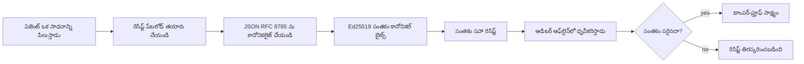
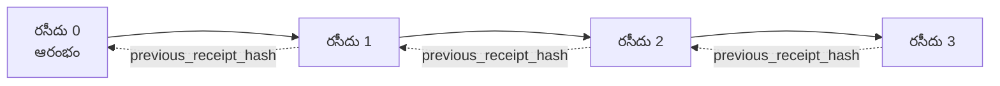

[పాఠం వీడియోను చూడండి: క్రిప్టోగ్రాఫిక్ రసీదులతో AI ఏజెంట్లను సురక్షితం చేయడం](https://youtu.be/PLACEHOLDER_VIDEO_ID)

> _(మైక్రోసాఫ్ట్ కంటెంట్ టీమ్ అంమిళితమైన తర్వాత పాఠం వీడియో మరియు థంబ్‌నెయిల్‌ను చేర్చుతుంది, పాఠం 14 / 15 నమూనాపరంగా.)_

# క్రిప్టోగ్రఫిక్ రసీదులతో AI ఏజెంట్లను సురక్షితం చేయడం

## పరిచయం

ఈ పాఠం కవర్ చేస్తుంది:

- AI ఏజెంట్లకు ఆడిట్ ట్రయిల్స్ ఎందుకు కంప్లెయిన్స్, డీబగింగ్ మరియు నమ్మకానికి ముఖ్యం.
- క్రిప్టోగ్రాఫిక్ రసీదు ఏమిటి మరియు అది సంతకంకాని లాగ్ లైన్ నుండి ఎలా భిన్నం.
- ఏజెంట్ల టూల్ కాల్‌కు సంతకం చేసిన రసీదును సాధారణ Python లో ఎలా ఉత్పత్తి చేయాలి.
- రసీదును ఆఫ్‌లైన్ ఎలా ధృవీకరించాలి మరియు చెల్ట్ ఎలా గుర్తించాలి.
- రసీదులను ఎలా చైన్ చేయాలో, ఒకదాని తొలగింపు లేదా మార్పు చైన్‌ను ఎలా బ్రేక్ చేస్తుంది.
- రసీదులు ఏమి సాక్ష్యంగా నిరూపిస్తాయ్ మరియు ఏమి స్పష్టంగా నిరూపించవు.

## అభ్యాస లక్ష్యాలు

ఈ పాఠం పూర్తిచేసిన తర్వాత, మీరు తెలుసుకుంటారు:

- ఏజెంట్ చర్యల క్రిప్టోగ్రాఫిక్ మూలాన్ని ప్రేరేపించే వైఫల్య పరిస్థితులను గుర్తించడం.
- కినోనికల్ JSON పేఢ్‌లో Ed25519 సంతకం చేసిన రసీదు ఉత్పత్తి చేయడం.
- సంతకం చేసిన వ్యక్తి యొక్క పబ్లిక్ కీ మాత్రమే ఉపయోగించి స్వతంత్రంగా రసీదును ధృవీకరించడం.
- మార్పుతో రసీదును తిరిగి ధృవీకరించి చెల్ట్ గుర్తించడం.
- హాష్-చెయిన్ చేయబడిన రసీదుల వరుసను నిర్మించడం మరియు చైన్ ఎందుకు ముఖ్యం అని వివరణ.
- రసీదులు నిరూపించే వాటి సరిహద్దును మరియు నిరూపించని వాటిని తెలుసుకోవడం (కార్యాచరణ సరైనదా, విధాన ధృడత్వం).

## సమస్య: మీ ఏజెంట్ యొక్క ఆడిట్ ట్రెయిల్

మీరు Contoso ట్రావెల్ కోసం ఒక AI ఏజెంట్‌ను అమలు చేశారని ఊహించండి. ఆ ఏజెంట్ కస్టమర్ అభ్యర్థనలను చదివి, ఫ్లైట్స్ API కాల్ చేసి ఎంపికలను చూస్తుంది, మరియు కస్టమర్ తరఫున సీట్లు బుక్ చేస్తుంది. గత త్రైమాసికంలో, ఏజెంట్ 50,000 బుకింగులను ప్రాసెస్ చేసింది.

ఈ రోజు ఒక ఆడిటర్ వచ్చాడు. వారు ఒక సాధారణ ప్రశ్న అడుగుతున్నారు: "మీ ఏజెంట్ ఏమి చేశిందో చూపించండి."

మీరు మీ లాగ్ ఫైళ్ళను అందిస్తున్నారు. ఆడిటర్ వాటిని చూస్తూ కాస్త కఠినమైన ప్రశ్న అడుగుతారు: "నేను ఎలా తెలుసుకోగలను ఈ లాగ్లు ఎడిట్ చేయబడలేదు?"

ఇదే ఆడిట్-ట్రయిల్ సమస్య. ప్రస్తుతం చాలా ఏజెంట్ అమలులు ఈ వాటిపై ఆధారపడి ఉంటాయి:

- **అప్లికేషన్ లాగ్లు**: ఏజెంట్ స్వయంగా రాస్తుంది, ఫైల్-సిస్టమ్ యాక్సెస్ ఉన్న ఏవ్వరైనా మార్పు చేయగలరు.
- **క్లౌడ్ లాగింగ్ సేవలు**: ప్లాట్‌ఫాం స్థాయిలో చెల్ట్-స్పష్టమైనవి, కానీ ఆడిటర్ ప్లాట్‌ఫాం ఆపరేటర్ పై నమ్మకం ఉంచితే మాత్రమే.
- **డేటాబేస్ లావాదేవీ లాగ్లు**: డేటాబేస్ మార్పులకు అనుకూలం, కానీ సర్వ సాధారణ టూల్ కాల్లకు కాదు.

ఆడిటర్ ప్రశ్నకు ఎవరినైనా (మీself, మీ క్లౌడ్ ప్రొవైడర్, మీ డేటాబేస్ వ్యాపారి) నమ్మకం పెట్టుకోవలసిన అవసరం లేకుండా ఈ సమాచారాలు సమాధానం ఇవ్వలేవు. అంతర్గత ఉపయోగానికి అది సరే. నియంత్రిత పనుల (ఆర్థిక, ఆరోగ్య సంరక్షణ, EU AI చట్టానికి అర్జెంటుగా వచ్చినవి) కోసం కాదు.

క్రిప్టోగ్రాఫిక్ రసీదులు ఈ సమస్యని పరిష్కరిస్తాయి, ప్రతి ఏజెంట్ చర్య స్వతంత్రంగా ధృవీకరించదగినదిగా తయారు చేయడం ద్వారా. ఆడిటర్ మీపై ఆధారపడాల్సిన అవసరం లేదు. వారు కేవలం మీ పబ్లిక్ కీ మరియు ఆ రసీదును మాత్రమే అవసరం.

## క్రిప్టోగ్రఫిక్ రసీదు అంటే ఏమిటి?

రసీదు అనేది ఏజెంట్ ఏమి చేశాడో నమోదు చేసే JSON ఆబ్జెక్ట్, దాన్ని డిజిటల్ సంతకంతో సంతకం చేయబడుతుంది.


```mermaid
flowchart LR
    A[ఏజెంట్ ఒక సాధనాన్ని పిలుస్తాడు] --> B[రెసిప్ట్ పేటలోడ్ తయారు చేయండి]
    B --> C[JSON RFC 8785 ను కానోనికలైజ్ చేయండి]
    C --> E[Ed25519 సంతకం కానోనికల్ బైట్స్]
    E --> F[సంతకం సహా రెసిప్ట్]
    F --> G[ఆడిటర్ ఆఫ్‌లైన్‌లో ధృవీకరిస్తాడు]
    G --> H{సంతకం సరైనదా?}
    H -- yes --> I[టాంపర్-ప్రూఫ్ సాక్ష్యం]
    H -- no --> J[రెసిప్ట్ తిరస్కరించబడింది]
```

ఒక కనిష్ట రసీదు ఇలా ఉంటుంది:

```json
{
  "type": "agent.tool_call.v1",
  "agent_id": "contoso-travel-bot",
  "tool_name": "lookup_flights",
  "tool_args_hash": "sha256:a3f9c1...",
  "result_hash": "sha256:7b2e1d...",
  "policy_id": "contoso-travel-policy-v3",
  "timestamp": "2026-04-25T14:30:00Z",
  "sequence": 47,
  "previous_receipt_hash": "sha256:9d4e6a...",
  "signature": {
    "alg": "EdDSA",
    "sig": "c5af83...",
    "public_key": "8f3b2c..."
  }
}
```

మూడు లక్షణాలు పని చేస్తున్నాయి:

1. **సంతకం**. ఈ రసీదు ఏజెంట్ గేట్‌వే ద్వారా Ed25519 ప్రైవేట్ కీతో సంతకం చేయబడుతుంది. అనుగుణమైన పబ్లిక్ కీ ఉన్నవారు ఆ సంతకాన్ని ఆఫ్‌లైన్ ధృవీకరించవచ్చు. ఏ ఫీల్డ్‌తో అయినా చెల్ట్ ఉంటే సంతకం సరికాదిగా మారుతుంది.

2. **కినోనికల్ కోడింగ్**. సంతకం ముందు, రసీదును JSON క్యానానికలైజేషన్ స్కీమ్ (JCS, RFC 8785) ఉపయోగించి సీరియలైజ్ చేస్తారు. ఇది రెండు అమలుకై సమానమైన లాజికల్ రసీదు ఒకే బైట్లతో ఫలితం ఇస్తుంది. క్యానానికలైజేషన్ లేకపోతే, వేరే వేరే JSON సీరియలైజర్లు భిన్నమైన సంతకాలు ఇవ్వవచ్చు.

3. **హాష్ చైనింగ్**. `previous_receipt_hash` ఫీల్డ్ ప్రతి రసీదును కంటే ముందు ఉన్నదికి లింక్ చేస్తుంది. ఒక రసీదును తొలగించడం లేదా మారుస్తే ఆ తర్వాతి ప్రతి రసీదు పాడైపోతుంది. సంతకం తప్పిపోయినా కూడా చైన్ స్థాయిలో చెల్ట్ స్పష్టమవుతుంది.

ఈ లక్షణాలు కలిపి మూడు హామీలను ఇస్తాయి:

- **అట్రిబ్యూట్**: ఈ కీ ఈ కంటెంట్ సంతకం చేసింది.
- **సామగ్రి**: సంతకంపై ఉన్నప్పటి నుండి కంటెంట్ మారలేదు.
- **క్రమం**: ఈ రసీదు ఆ రసీదు తర్వాత చైన్‌లో వచ్చింది.

## Python లో రసీదు ఉత్పత్తి చేయడం

రసీдәను ఉత్పత్తి చేయడానికి ప్రత్యేక లైవ్రరీ అవసరం లేదు. క్రిప్టోగ్రఫిక్ ప్రిమిటివ్స్ అందుబాటులో ఉన్నాయి మరియు లాజిక్ కొన్ని పంక్తుల Python కోడ్ మాత్రమే.

`code_samples/18-signed-receipts.ipynb`లో హ్యాండ్స్-ఆన్ వ్యాయామాలు పూర్తి ప్రాసెస్ చూపుతాయి. సారాంశ వెర్షన్:

```python
import json
import hashlib
import base64
from nacl import signing
from jcs import canonicalize  # RFC 8785 కానానికల్ JSON

def b64url_nopad(data: bytes) -> str:
    return base64.urlsafe_b64encode(data).decode("ascii").rstrip("=")

def sha256_canonical(obj) -> str:
    """SHA-256 of a Python object's JCS-canonical JSON form."""
    return f"sha256:{hashlib.sha256(canonicalize(obj)).hexdigest()}"

# సైన్ చేయుటకు కీని సృష్టించండి లేదా లోడ్ చేయండి (ప్రొడక్షన్‌లో, కీ వాల్ట్‌లో భద్రపరచండి)
signing_key = signing.SigningKey.generate()
verify_key = signing_key.verify_key

# రసీది పేలొడ్‌ను నిర్మించండి (ఈ వరకు సంతకం లేదు)
tool_args = {"origin": "SYD", "destination": "LAX"}
tool_result = [{"flight": "QF11", "price": 1850, "stops": 0}]

payload = {
    "type": "agent.tool_call.v1",
    "agent_id": "contoso-travel-bot",
    "tool_name": "lookup_flights",
    "tool_args_hash": sha256_canonical(tool_args),
    "result_hash": sha256_canonical(tool_result),
    "policy_id": "contoso-travel-policy-v3",
    "timestamp": "2026-04-25T14:30:00Z",
    "sequence": 0,
    "previous_receipt_hash": None,
}

# JCS బైట్లను కేంద్రీకరించి నేరుగా సంతకం చేయండి. PureEdDSA అంతర్గతంగా హ్యాష్ చేస్తుంది.
canonical_bytes = canonicalize(payload)
signature_bytes = signing_key.sign(canonical_bytes).signature

# ఒక నిర్మిత సంతకం వಸ್ತువును జోడించండి.
receipt = {
    **payload,
    "signature": {
        "alg": "EdDSA",
        "sig": b64url_nopad(signature_bytes),
        "public_key": b64url_nopad(bytes(verify_key)),
    },
}
```

అంతా సంతకం చేసే పైప్‌లైన్ ఇది. నోట్బుక్‌లో ప్రతి దశలో ప్రయాణం ఉంటుంది.

## రసీదు ధృవీకరణ మరియు చెల్ట్ గుర్తింపు

ధృవీకరణ ఎక్రొఫిక్ క్రియ.

```python
import base64
import hashlib
from nacl import signing
from nacl.exceptions import BadSignatureError
from jcs import canonicalize

def b64url_decode(s: str) -> bytes:
    padding = "=" * ((4 - len(s) % 4) % 4)
    return base64.urlsafe_b64decode(s + padding)

def verify_receipt(receipt: dict) -> bool:
    # సంతకం ఒక నిర్మాణాత్మక వస్తువు: {"alg", "sig", "public_key"}.
    sig_obj = receipt.get("signature")
    if not sig_obj or sig_obj.get("alg") != "EdDSA":
        return False

    # వాస్తవంగా సంతకం చేసిన లోడ్‌ను పునఃనిర్మించండి (సంతకం తప్ప అన్ని).
    payload = {k: v for k, v in receipt.items() if k != "signature"}

    canonical_bytes = canonicalize(payload)

    try:
        verify_key = signing.VerifyKey(b64url_decode(sig_obj["public_key"]))
        verify_key.verify(canonical_bytes, b64url_decode(sig_obj["sig"]))
        return True
    except BadSignatureError:
        return False
```

ఈ ఫంక్షన్ ఒక రసీదును తీసుకుని సంతకం సరైనదైతే `True`, కాకుంటే `False` ను ఇస్తుంది. నెట్‌వర్క్ కాల్ లేదా సేవపై ఆధారపడటం లేదు, ఎవరైనా పక్షంపై నమ్మకం అవసరం లేదు.

చెల్ట్ గుర్తింపును శ్రద్ధగా చూడటానికి, నోట్బుక్ ఇలా చూపిస్తుంది:

1. సరైన రసీదు ఉత్పత్తి చేసి ధృవీకరణ సరి అయినట్టు నిర్ధారించడం.
2. `tool_args_hash` ఫీల్డ్‌లో ఒక బైట్ మార్చడం.
3. verification తిరిగి జరిపి విఫలమయ్యేదాన్ని చూడటం.

ఇది రసీదులు చెల్ట్-స్పష్టమైనవి అన్న ప్రాథమిక నిరూపణ: ఏ చిన్న మార్పూ సంతకాన్ని పాడుస్తుంది.

## బహుళ దశ ఏజెంట్లకు రసీదు చైన్ చేయడం

ఒకే సంతకం చేసిన రసీదు ఒక చర్యను రక్షిస్తుంది. ఒక వరుస రసీదులు వరుసను రక్షిస్తాయి.


```mermaid
flowchart LR
    R0[రసీదు 0<br/>ఆరంభం] --> R1[రసీదు 1]
    R1 --> R2[రసీదు 2]
    R2 --> R3[రసీదు 3]
    R1 -. previous_receipt_hash .-> R0
    R2 -. previous_receipt_hash .-> R1
    R3 -. previous_receipt_hash .-> R2
```

ప్రతి రసీదు దాని ముందు ఉన్న రసీదు యొక్క హాష్‌ను నమోదు చేస్తుంది. 2వ రసీదును నిశ్శబ్దంగా తొలగించడానికి, దాడి వీరు ఈ కింది రెండు దారుల్లో ఒకదాన్ని పాటించాలి:

- రసీదు 3 యొక్క `previous_receipt_hash` ఫీల్డ్ మార్పు చేయడం (రసీదు 3 సంతకాన్ని పాడుచేస్తుంది), లేదా
- మార్చబడిన రసీదు 3పై కొత్త సంతకం తయారు చేయడం (ఏజెంట్ యొక్క ప్రైవేట్ కీ అవసరం).

ప్రైవేట్ కీ హార్డ్‌వేర్ కీ వాల్ట్‌లో ఉంటే మరియు మీరు ప్రతి రసీదుతో పబ్లిక్ కీని ప్రచురిస్తే, రెండు దాడులు కూడా గుర్తించకుండా సాధ్యం కాదు.

నోట్బుక్ ఇలా చూపిస్తుంది:

1. మూడు రసీదుల చైన్ నిర్మించడం.
2. ప్రతి రసీదు యొక్క `previous_receipt_hash` గత రసీదు హాష్‌కు సరిపోతుందనే ధృవీకరించడం.
3. మధ్యలో ఒక రసీదును చెల్ట్ చేసి, చైన్ ఆ పాయింట్ వద్దనే బ్రేక్ అయ్యేలా చూడటం.

ఇది పరిశీలకుడు మీరు మీద ఆధారపడకుండా ధృవీకరించగల ఆడిట్ ట్రయిల్‌ను ఎలా రూపొందించాలో చూపిస్తుంది.

## రసీదులు ఏమి నిరూపిస్తాయి (మరియు ఏమి చేయవు)

ఇది ఈ పాఠంలోని అత్యంత ముఖ్యమైన భాగం. రసీదులు శక్తివంతమైనవి కానీ వారి శక్తి పరిమితి కలదు.

**రసీదులు మూడు విషయాలు నిరూపిస్తాయి:**

1. **అట్రిబ్యూషన్**: ఒక ప్రత్యేక కీ ఒక ప్రత్యేక పేఢ్ సంతకం చేసింది.
2. **సామగ్రి**: పేఢ్ సంతకం అయినప్పటి నుండి మారలేదు.
3. **క్రమం**: ఈ రసీదు చైన్లో ఆ రసీదు తర్వాత వచ్చింది.

**రసీదులు నిరూపించవు:**

1. **చేయలి తప్పకుండా సరి అయిన చర్య**: ఏజెంట్ చర్య సరి అయినదా అని కాదు. తప్పు సమాధానం కోసం కూడా ఒక రసీదు సమానంగా సిగ్న్ చేయబడవచ్చు.
2. **పాలసీ అనువర్తనం**: `policy_id` లో సూచించిన పాలసీ నిజంగా అమలు కాబడిందా లేదా ఇది ఆచరణలోకి దారి తీస్తుందా అని కాదు. రసీదు ఎటువంటి హక్కుతో ఏమి వివరించబడిందో నమోదు చేస్తుంది, కాదు ఏమి అమలైంది.
3. **కీ మించిన వ్యక్తి గుర్తింపు**: రసీదు "ఈ కీ ఈ కంటెంట్ సంతకం చేసింది" అంటుంది. "ఈ వ్యక్తి లేదా సంస్థ అనుమతిచేసింది" అంటే కాదు. వ్యక్తి లేదా సంస్థ కలిగి ఉన్న అదనపు గుర్తింపు వ్యవస్థ అవసరం.
4. **ఇన్‌పుట్స్ నిజాయితీ**: ఏజెంట్ మోసపూరిత ప్రాంప్ట్ పొందితే, చర్యను దానిని నిశితంగా రికార్డు చేస్తుంది. రసీదులు ఇన్‌పుట్ ధృవీకరణకు ప్రత్యామ్నాయం కాదు.

ఈ పరిమితి రెండు కారణాలకోసం ముఖ్యం:

- రసీదులు ఏమీ ఉపయోగకరమని కనిపిస్తుంది: ఏజెంట్ ప్రవర్తనను ఆడిట్ చేయదగినది, చెల్ట్-స్పష్టమైనది చేసి, సంస్థల సరిహద్దులను దాటినపటికీ.
- మీరు ఇంకా ఏ అదనపు స్థాయిలు అవసరం ఆలోచించాలి: ఇన్‌పుట్ ధృవీకరణ (పాఠం 6), పాలసీ అమలు (కింద చర్చించబడింది), మరియు గుర్తింపు వ్యవస్థ (ఈ పాఠములో భాగం కాదు).

ఒక సాధారణ పొరపాటు "మన దగ్గర రసీదులు ఉన్నాయ్" అంటే "మనం పరిపాలితులం" అనుకోవడం. అలా కాదు. రసీదులు ఒక పునాది. పరిపాలన అంటే మీరు నిర్మించే వ్యవస్థ.

## ఒక వ్యక్తి ఆ సముచిత చర్యను ఆమోదించిందని నిరూపించడం

పై అంశం 3కి ప్రత్యేక సెక్షన్ అవసరం: చర్య రసీదు "ఈ కీ ఈ కంటెంట్ సంతకం చేసింది" అంటుంది, కానీ "ఈ వ్యక్తి అనుమతిచేసింది" కాదు. అధిక ప్రమాద చర్యల (రీఫండ్‌లు, తొలగింపులు, వేర్ ట్రాన్స్ఫర్స్) కోసం, పరిపాలనా మాదిరులు ఆ కోరకో తెలుసుకోవాలి, అదే ఈ పాఠంలో మీరు చేసిన ప్రాథమిక పద్ధతులతో సాధ్యమే.

అనుసరించబోయే నోట్బుక్ `code_samples/human-authorization-receipts.ipynb` రెండో రసీదు రకాన్ని జోడిస్తుంది, `human.approval.v1`, అదే డాక్యుమెంట్ ఆకారంలో ఉన్నట్లు (ఎడ25519 తో సంతకం చేసిన టైపు చేయబడిన పేఢ్, సంతకం ఆబ్జెక్ట్ సంతకం బైట్ల బయట). ఒక పేరుపొందిన ఆమోదదారు **సంపూర్ణ కినోనికల్ చర్యను మరియు దాని డైజెస్ట్‌ను** చర్య నిర్వాహణకు ముందు సంతకం చేస్తారు; ఏజెంట్ చర్య రసీదు **అదే చర్య డైజెస్ట్ ను** మరియు ఒక `parent_approval_ref` ను, ఆమోదం యొక్క `receipt_hash`, `previous_receipt_hash` లో ఉన్న విధమైన సంప్రదాయం ఫాలో చేస్తుంది. ఒక `verify_chain` రెండు ఆర్టిఫాక్ట్స్‌ను వేర్వేరు కీ రిజిస్ట్రీల కింద పరీక్షిస్తుంది (ఆమోదదారు కీలు వర్సెస్ ఏజెంట్ కీలు), కాబట్టి కోడ్ మార్గం పంచుకుంటుంది కానీ అధికారాలు ఎప్పుడూ పంచుకోబడవు.

జాగ్రత్తగా చెప్పబడిన ఈ లక్షణం: *వ్యక్తి ఈ ఖచ్చితమైన చర్యను ఆమోదించాడు, మరియు ఏజెంట్ ఖచ్చితంగా ఆ ఆమోదించబడిన చర్యను అమలు చేశాడు.* నోట్బుక్ తిరస్కరణ ఫిక్చర్స్ ఈ లక్షణాన్ని ప్రాక్టికల్‌గా నిరూపిస్తాయి:

- సాధారణ సమస్యలు: చెల్ట్, గందరగోళం, రిప్లే, ఎటువంటి వైపులోనైనా కీలు forgeries, తప్పు ఇన్‌పుట్;
- **తేడాలు అధికారంలో**: సరైన సంతకం అయినా, పాలసీ వెర్షన్ మార్పు, ఆమోదదారు కీ రోటేట్, లేదా ఆమోదం కాలం ముగిసిపోయి తిరస్కరించబడింది;
- **డైజెస్ట్ మార్పిడి**: సరైన సంతకం చేసిన చర్య రసీదు ఒక *వేరే* కినోనికల్ చర్యకు సంబంధించిన ఒక నిజమైన ఆమోదాన్ని సూచిస్తుంది.

ప్రతి వైఫల్యం ప్రత్యేక కారణంతో తిరస్కరించబడుతుంది, అందువల్ల ఆడిటర్ ఒక తిరస్కరణ చదివేటప్పుడు అధికారపు అవధి పోతుందా లేదా అమలు చేసిన చర్య మారిందా అని గుర్తించగలుగుతారు. నోట్బుక్ బోధించే నియమం: సంతకం చేసిన ఆమోదం ఒక్కటే అధికారమెలా కాదు. అధికారం ఉండాలి మాత్రం రెండు రసీదులు ఒకే కినోనికల్ చర్యతో تړబడ్డప్పుడు ఆ అమలు సమయంలో మాత్రమే. హ్యూమన్-అప్రూవల్ రసీదు ఈ పాఠం ద్వారా నిర్వచించబడిన విద్యాసంబంధమైన తయారీ, `draft-farley-acta-signed-receipts` నిర్వచించిన రసీదు రకం కాదు.

## ఉత్పత్తి సూచనలు

ఈ పాఠంలోని Python కోడ్ ఉద్దేశ్యపూర్వకంగా తక్కువగా ఉంటుంది, మీరు ప్రతి పంక్తిని చదివి ఏమి జరుగుతుందో అర్థం చేసుకోవడానికి. ఉత్పత్తిలో, మీకు రెండు ఎంపికలు ఉన్నాయి:

1. **సెక్యూరిటీ ప్రిమిటివ్స్‌పై నేరుగా నిర్మించండి.** మీరు పై 50 పంక్తులు అనేక వినియోగాలకు సరిపోతాయి. PyNaCl (Ed25519) మరియు `jcs` ప్యాకేజీ (కినోనికల్ JSON) పర్యవేక్షించబడిన, సమీక్షించిన లైబ్రరీలు.

2. **ఉత్పత్తి రసీదు లైబ్రరీ ఉపయోగించండి.** పలు ఓపెన్ సోర్స్ ప్రాజెక్ట్లు అదే నమూనాను సాధిస్తాయి, అదనపు ఫీచర్లతో (కీ రొటేషన్, బ్యాచ్ ధృవీకరణ, JWK సెట్ పంపిణీ, పాలసీ ఇంజన్లతో సమీకరణ):
   - సంతకం పైప్‌లైన్ JCS మరియు సంతకం పరిధి సంప్రదాయాలను స్వతంత్ర IETF ఇంటర్నెట్-డ్రాఫ్ట్ ([`draft-farley-acta-signed-receipts`](https://datatracker.ietf.org/doc/draft-farley-acta-signed-receipts/), సవరణ 02) లో ఉపయోగిస్తుంది. ఈ పాఠం యొక్క పతనం విద్యాసంబంధ రసీదు డ్రాఫ్ట్ యొక్క `{payload, signature}` లేఖనానికి భిన్నంగా ఉంటుంది, మరియు అనుకూల అమలుగా చేపట్టబడలేదు. డ్రాఫ్ట్ నిర్వహించే సాధారణ అనుసరణ సంచిక ([agent-governance-testvectors](https://github.com/ScopeBlind/agent-governance-testvectors)) అమలుకు టార్గెట్ చేసే వేర్ ఫార్మాట్ కోసం.
   - మైక్రోసాఫ్ట్ ఏజెంట్ గవర్నెన్స్ టూల్‌కిట్ రసీదులను Cedar ఆధారిత పాలసీ నిర్ణయాలతో కలిపి నిర్మిస్తుంది; ఆ రిపాజిటరీలో ట్యుటోరియల్ 33 పూర్తిగా చూపిస్తుంది.
   - `protect-mcp` (npm) మరియు `@veritasacta/verify` (npm) ప్యాకేజీలు Node ఆధారిత రసీదు సంతకం మరియు ఆఫ్‌లైన్ ధృవీకరణ ఇంప్లిమెంటేషన్ ను అందిస్తాయి. MCP సర్వర్‌ను టాంపర్-స్పష్టమైన ఆడిట్ ట్రయిల్‌తో ర్యాప్ చేయడానికీ, వాటి సరదాగా ఉంచిన చర్య ప్రత్యామ్నాయాన్ని కూడా కలిగి ఉంటాయి (డెస్క్‌టాప్ లో WebAuthn-మద్దతు), హ్యూమన్-అథరైజేషన్ నోట్బుక్‌లో చూపించినది అదే పద్ధతి.
   - **[nobulex](https://github.com/arian-gogani/nobulex)** Python SDK (`pip install nobulex`) Ed25519 + JCS సంతకం నమూనాను Python లో LangChain మరియు CrewAI ఇంటిగ్రేషన్‌లతో అందిస్తుంది, ప్రచురించబడి ఉన్న క్రాస్-వాలిడేషన్ టెస్ట్ వెక్టర్లు మరియు OWASP PR #2210 ద్వారా సమర్పించబడిన కంప్లయిన్స్ మ్యాపింగ్ తో.

స్వంతంగా తయారుచేసుకోవడం మరియు లైబ్రరీ ఉపయోగించడం మధ్య నిర్ణయం, JWT లైబ్రరీ కూడా వ్రాస్తూ నిర్ణయంతో పోలిక ఉంటుంది: రెండూ సరైనవి; లైబ్రరీ సమయం ఆదా చేస్తుంది మరియు ఆడిట్ ఉపరితలాన్ని తగ్గిస్తుంది; స్వయంగా చోర్స్ చేస్తే ప్రతి ప్రిమిటివ్ అర్థం అవుతుంది. ఈ పాఠం మొత్తం నుండి నేర్పిస్తుంది కాబట్టి మీరు ఎలాంటి ఎంపిక తీసుకోవచ్చు.

## జ్ఞాన తనిఖీ

ప్రాక్టీస్ వ్యాయామానికి వెళ్ళేముందు మీ అర్థం తనిఖీ చేసుకోండి.

**1. రసీదు ఏజెంట్ ప్రైవేట్ Ed25519 కీతో సంతకం చేయబడింది. ఆడిటర్ దగ్గర కేవలం పబ్లిక్ కీ మాత్రమే ఉంది. ఆడిటర్ ఆఫ్‌లైన్ లో రసీదును ధృవీకరించగలడా?**

<details>
<summary>జవాబు</summary>

అవును. Ed25519 ధృవీకరణకు కేవలం పబ్లిక్ కీ మరియు సంతకం చేసిన బైట్లే అవసరం. నెట్‌వర్క్ కాల్ లేదు, సేవ ఆధారపడటం లేదు. ఇది ఆఫ్టర్-గ్యాప్, బహుళ సంస్థలు, లేదా తక్కువ నమ్మక ఆడిట్ వాతావరణాల్లో రసీదులను ఉపయోగకరంగా చేసేది.
</details>

**2. దాడితో రసీదు యొక్క `policy_id` ఫీల్డ్ మార్పు చేసి ఇది మరింత అనుమతిస్తూ పాలసీ అడగడం వాదన చేశారు. సంతకం ఒరిజినల్ పేఢ్‌పై ఉంది. ధృవీకరణలో ఏమవుతుంది?**

<details>
<summary>జవాబు</summary>


ధృవీకరణ విఫలమైంది. ముద్రణ అసలు పేటలోడ్ యొక్క కనానికల్ బైట్లపై లెక్కింపబడింది; ఏ ఫీల్డ్‌ను మార్చినా ఆ బైట్లు మార్చబడతాయి, దీని వల్ల ముద్రణ అమాన్యంగా మారుతుంది. దాడి వ్యక్తి తాజా చెలామణీచేయగలిగే ముద్రణను రూపొందించడానికి ప్రైవేట్ కీ అవసరం అవుతుంది, దాని వద్ద అది ఉండదు.
</details>

**3. రసీదు ఎందుకు `tool_args_hash` మరియు `result_hash` ను కేవలం ముడి arguments మరియు ఫలితం కాకుండా కలిగి ఉంటుంది?**

<details>
<summary>జవాబు</summary>

రెండు కారణాలు. మొదటిది, రసీదు రవాణా లేదా ఆర్కైవ్ చేయాల్సిన సందర్భాల్లో ముడి విషయాన్ని (PII, వ్యాపార డేటా) లీక్ చేయడం సమస్య కావచ్చు. హ్యాషింగ్ రసీదును చిన్నది మరియు విషయం గోప్యంగా ఉంచుతుంది; ఆడిటర్ హ్యాష్ నిజమైన విషయముతో వేరుగా నిల్వ చేయబడిన ఒక కాపీకి సరిపోతుందనే విషయం నిర్ధారిస్తుంది. రెండవది, హ్యాష్‌లు ఒక స్థిర పరిమాణం కలిగి ఉంటాయి; హ్యాష్‌తో కూడిన రసీదు బహుళ వారి మరియు ఫలితాలు ఎంత పెద్దవైనా పరిమిత పరిమాణంలో ఉంటుంది.
</details>

**4. `previous_receipt_hash` ఫీల్డ్ ప్రతి రసీదును దాని పుర్వవర్చులతో లింక్ చేస్తుంది. దాడి వ్యక్తి సృష్టించిన గొలుసులో మధ్యలో ఒక రసీదును నిశ్శబ్దంగా తొలగిస్తే ఏది అమాన్యంగా మారుతుంది?**

<details>
<summary>జవాబు</summary>

తీసివేయబడిన రసీదు తర్వాత వచ్చిన ప్రతి రసీదు. వారి `previous_receipt_hash` ఫీల్డ్స్ వాస్తవ గొలుసుతో సరిపోదు (ఎందుకంటే వారు సూచించిన రసీదు ఇక ఉండదు లేదా గొలుసు ఇప్పుడు ఇతర పుర్వవర్చుకు సూచిస్తుంటుంది). తొలగింపును దాచేందుకు, దాడి వ్యక్తి తర్వాత ఉన్న ప్రతి రసీదును మళ్లీ సంతకం చేయవలసి ఉంటుంది, దీని కోసం ప్రైవేట్ కీ అవసరం.
</details>

**5. ఒక రసీదు సూటిగా ధృవీకరించబడింది. అది ఏజెంట్ చర్య సరిగా ఉండిందని, సరైనదని, లేదా విధానం పాటించిందని నిరూపిస్తుందా?**

<details>
<summary>జవాబు</summary>

కాదు. ఒక చెలామణీచేయగల లేదా సరైన రసీదు మూడు విషయాలను నిరూపిస్తుంది: కేటాయింపు (ఈ కీ ఈ విషయం సంతకం చేసింది), సమగ్రత (విషయం మారలేదు), ఆర్డరింగ్ (ఈ రసీదు ఆ రసీదుకు తర్వాత వచ్చింది). ఇది చర్య సరిగా ఉందని, `policy_id` లో పేర్కొన్న విధానం నిజంగా పరిశీలించబడిందని, లేదా ఏజెంట్ ప్రతి నిబంధనను అనుసరించిందని నిరూపించదు. రసీదులు ఏజెంట్ ప్రవర్తనను ఆడిట్ చేయగలిగేటటువంటి అర్థంలో చేయగా, తప్పనిసరిగా సరిగ్గా ఉండడం కాదు. ఇదే పాఠంలో అత్యంత ముఖ్యమైన సరిహద్దు.
</details>

## ప్రాక్టీస్ వ్యాయామం

`code_samples/18-signed-receipts.ipynb` ని తెరవండి మరియు అన్ని 4 విభాగాలను పూర్తి చేయండి:

1. **విభాగం 1**: మీ మొదటి రసీదును సంతకం చేసి దాన్ని ధృవీకరించండి.
2. **విభాగం 2**: రసీదును మున్నంగా మార్చి ధృవీకరణ విఫలమయ్యే ప్రక్రియను పరిశీలించండి.
3. **విభాగం 3**: మూడు రసీదు గొలుసును నిర్మించి గొలుసు సమగ్రతను ధృవీకరించండి.
4. **విభాగం 4**: Microsoft Agent Framework తో నిర్మించిన ఏజెంట్‌కు ఈ వస్తువును అనుసంధానించండి: ఒక సాధనం కాల్‌ను రసీదు సంతకంతో చుట్టండి, అప్పుడు రసీదును స్వతంత్రంగా ధృవీకరించండి.

**విస్తృత సవాలు 1:** మీ స్వంత ఎంచుకున్న అదనపు ఫీల్డ్‌తో రసీదు స్కీమాను విస్తరించండి (ఉదాహరణకు ట్రేసింగ్ కోసం అడిగి ID), కనానికల్ సంతకం లాజిక్‌ను దానిని కూడా చేర్చడానికి నవీకరించండి, మరియు రసీదు ధృవీకరణ ద్వారా ఇంకా సరిగా రౌండ్-ట్రిప్ అవుతోందని నిర్ధారించండి. అప్పుడు సంతకానికి తర్వాత ఫీల్డ్‌ను మార్చి ధృవీకరణ విఫలమయ్యేలా నిర్ధారించండి. దీని వల్ల కనానికల్ కోడింగ్ యొక్క ప్రతి బైట్ సంతకానికి ఎలా సహకరిస్తుందో మీరు అర్థం చేసుకుంటారు.

**విస్తృత సవాలు 2:** మీ రెండు రసీదులను SHA-256 హ్యాష్ చేయండి (ఆవిధంగా వారి కనానికల్ బైట్లను నిర్ణీత క్రమంలో కలపడం) మరియు సంతకం చేయడానికి ముందు మూడవ రసీదులో కొత్త ఫీల్డ్‌గా ఫలిత హాష్‌ను ఎంబెడ్ చేయండి. మూడు రసీదు అన్ని రౌండ్-ట్రిప్ అవుతున్నాయా అని ధృవీకరించండి. మీరు ఒక ఎటువంటి స్టెప్ অন্তర్భాగాన్ని నిర్మించారు: మూడో రసీదు కలిగి ఉన్న ఎవరైనా మొదటి రెండు సంతకాలు ఉన్నాయని నిరూపించవచ్చు అందులో వారి విషయాలను వెల్లడి చేయించకుండానే. ఇది సెలెక్టివ్-డిస్లోజర్ రసీదులు పరిమాణంలో ఉపయోగించే నమూనా (Merkle కమిట్‌మెంట్‌లు, RFC 6962).

## ముగింపు

క్రిప్టోగ్రాఫిక్ రసీదులు AI ఏజెంట్స్‌కు ఆడిట్ ట్రైల్ ఇస్తాయి, ఇది:

- **స్వతంత్రంగా ధృవీకరించదగినది**: పబ్లిక్ కీ కలిగిన ఏ పార్టీ అయినా ధృవీకరించవచ్చు, ఏ సర్వీస్ ఆధారపడదు.
- **ముట్టడినట్లు స్పష్టమైనది**: ఏ మార్పైనా సంతకాన్ని అమాన్యంగా చేస్తుంది.
- **పోర్టబుల్**: రసీదు చిన్న JSON ఫైల్; దాన్ని ఆర్కైవ్ చేయవచ్చు, రవాణా చేయవచ్చు, ఎక్కడైనా ధృవీకరించవచ్చు.
- **ప్రామాణికాలకు అనుపూర్వకం**: Ed25519 (RFC 8032), JCS (RFC 8785), మరియు SHA-256 పై నిర్మింపబడినవి, అన్ని విస్తృతంగా ఉపయోగపడుతున్న ప్రామాణికాలు.

అవి ఇన్‌పుట్ ధృవీకరణ, విధాన అమలు లేదా గుర్తింపు మౌలిక సదుపాయం ప్రతిస్థాపనకు ప్రత్యామ్నాయం కావు. అవి ఆ లేయర్లకు పునాది. మీరు నియంత్రిత ఉపాధిభాగాల్లో ఏజెంట్లను అమలు చేస్తున్నప్పుడు, బహుళ సంస్థాల వర్క్‌ఫ్లోలలో, లేదా భవిష్యత్తు ఆడిటర్ మీపై విశ్వసించలేని పరిస్థితుల్లో, రసీదులు మీ ఆడిట్ ట్రైల్‌ను న్యూట్రల్‌గా ఉంచుతాయి.

అత్యంత ముఖ్యమైన పాఠం: రసీదులు ఏ వ్యక్తి ఎప్పుడు ఏమి చెప్పాడో నిరూపిస్తాయి. వాళ్ళు చెప్పిన విషయం నిజమో సరైనదో నిరూపించవు. ఆ విభేదాన్ని కచ్చితంగా పట్టుకోండి. ఇది నిజమైన మూలస్థాన వ్యవస్థ మరియు అబద్ధపరిచే వ్యవస్థ మధ్య తేడా.

## ఉత్పత్తి చెక్లిస్ట్

మీరు ఈ పాఠం నుండి ఉత్పత్తి వాతావరణంలో రసీదు-సంతకాలైన ఏజెంట్లను అమలు చేయడానికి సిద్ధంగా ఉన్నప్పుడు:

- [ ] **డెవలపర్ ల్యాప్‌టాప్ నుండి సంతక కీని తరలించండి.** Azure కీ వాల్ట్, AWS KMS లేదా హార్డ్వేర్ సెక్యూరిటీ మాడ్యూల్ ఉపయోగించండి. మీ రసీదులను సంతకం చేసే ప్రైవేట్ కీ సోర్స్ కంట్రోల్ లేదా అప్లికేషన్ యంత్రాలపై ప్లెయిన్టెక్స్‌గా ఉండకూడదు.
- [ ] **ధృవీకరణ పబ్లిక్ కీని ప్రచురించండి.** ఆడిటర్లు ఆఫ్‌లైన్ ధృవీకరణకు దీనిని అవసరం పడతారు. ప్రామాణిక నమూనా ఒక JWK సెట్ ని ప్రసిద్ధి చెందిన URL వద్ద ఉంచడం (RFC 7517), ఉదాహరణకు `https://your-org.example.com/.well-known/agent-keys.json`.
- [ ] **గొలుసును బాహ్యంగా యాంకర్ చేయండి.** అసలు గొలుసు హ్యాష్‌ను పీరియాడిక్‌గా ట్రాన్స్‌పరెన్సీ లాగ్ (Sigstore Rekor, RFC 3161 టైంస్టాంప్ అథారిటీ లేదా రెండవ అంతర్గత వ్యవస్థ) లో వ్రాయండి, తద్వారా బాహ్య పార్టీ "ఈ గొలుసు ఈ సమయంలో ఉన్నది" అని ధృవీకరించగలదు.
- [ ] **రసీదులను అమరఙ్యంగా నిల్వ చేయండి.** అప్\u200cఆన్లీ బ్లాబ్ స్టోరేజ్ (Azure Storage అమరఙ్యత విధానాలతో, AWS S3 ఆబ్జెక్ట్ లాక్) ఒక ఇన్సైడర్ స్టోరేజ్ లేయర్ వద్ద చరిత్ర మార్చకుండా నిరోధిస్తుంది.
- [ ] **నిర్వచనం నిర్ణయించండి.** చాలా అనుసరణా విధానాలు బహుళ సంవత్సరాల నిల్వను కోరుకుంటాయి. రసీదు వృద్ధికి ప్రణాళిక సిద్దం చేయండి (ప్రతి రసీదు సుమారు 500 బైట్ల; ఒక ఏజెంట్ రోజుకు 10K కాల్స్ చేస్తే వార్షికంగా సుమారు 1.8 GB).
- [ ] **ఏ రసీదులు కవర్ చేయవు అన్నది డాక్యుమెంట్ చేయండి.** రసీదులు కేటాయింపు, సమగ్రత మరియు ఆర్డరింగ్ను నిరూపిస్తాయి. మీ రన్‌బుక్ స్పష్టంగా నమోదు చేయాలి మరింత నియంత్రణలు (ఇన్‌పుట్ ధృవీకరణ, విధాన అమలు, రేటు పరిమితి, గుర్తింపు మౌలిక సదుపాయం) మీ పాలన సమ్మతి వద్ద రసీదులు మరియు వాటి సమీపంలో ఉండటం.

### AI ఏజెంట్లను భద్రపర్చుకోవడంపై మరిన్ని ప్రశ్నలూ ఉన్నదా?

[Microsoft Foundry Discord](https://aka.ms/ai-agents/discord) లో చేరండి, ఇతర అభ్యసకులతో కలవండి, ఆఫీస్ గంటల్లో పాల్గొనండి, మీ AI ఏజెంట్ల ప్రశ్నలకు సమాధానం పొందండి.

## ఈ పాఠం తర్వాత

ఈ పాఠం ఒకే రసీదు సంతకం మరియు హ్యాష్-గొలుసు వరుసలను కవరుచేస్తుంది. అదే ప్రిమిటివ్స్ మరెన్ని అధునాతన నమూనాలతో మండిపడుతాయి, అవి మీ పాలనా స్థితి పెరిగినప్పుడు మీరు ఎదుర్కొనవచ్చు:

- **ఎంపికాత్మక వెల్లడింపు.** రసీదు ఫీల్డ్స్ వేరుగా కమిట్ చేయబడినప్పుడు (RFC 6962 శైలి Merkle చెట్టు), మీరు నిర్దిష్ట ఫీల్డ్స్‌ను నిర్దిష్ట ఆడిటర్లకు మాత్రమే వెలికి తీయవచ్చును మరియు మిగతాను మార్చలేదని నిరూపించవచ్చు, వాటిని ప్రదర్శించకుండా. ఇది అదే రసీదు విస్తృత ఆడిట్ (పూర్తి కావాల్సిన) మరియు డేటా తక్కువ చేసే నియమావళి (GDPR వంటి) రెండు సంతృప్టులు అవసరమైనప్పుడు ఉపయోగకరం.
- **రసీదు రద్దు.** సంతక కీ దుర్వినియోగమైనట్లయితే, ఆ కీతో సంతకమై అన్ని రసీదులను ఒక నిర్దిష్ట సమయం నుండి అనవసరంగా గుర్తు చేయలేని విధంగా గుర్తించాల్సి ఉంటుంది. ప్రామాణిక నమూనాలు: తక్కువ జీవితకాలం గల సంతక కీలు మరియు ప్రచురిత రద్దు జాబితా, లేదా రద్దు ఎంట్రీలతో ట్రాన్స్‌పరెన్సీ లాగ్.
- **బైలాటరల్ / విడివిడిగా-సంతకం రసీదు.** కొన్ని అమలులో సంతక లెక్కింపును ముందస్తు అమలు (`authorization_*`) మరియు తరువాత ఉత్పత్తి (`result_*`) భాగాలుగా విడగొట్టి వేరే సంతకాలతో చేయడం, ఇది వివిధ నటకులు లేదా వివిధ సమయాల్లో అంగీకారం నిర్ణయం మరియు పర్యవేక్షిత ఫలితాన్ని ఉత్పత్తి చేసేటప్పుడు ఉపయోగపడుతుంది. ఇది ఈ పాఠంలో నేర్పిన రసీదు ఫార్మాట్ మీద జోడించబడుతాయి.
- **పేట్లోడ్ సంయోగం.** రసీదు మీరు `result_hash` లో పెట్టిన ఏ బైట్లను సీలింగ్ చేస్తుంది. వాస్తవ ప్రపంచ పేట్లోడ్లు సాధారణంగా ఒక్క సాధన కాల్ ఫలితం కన్నా ఎక్కువగా ఉంటాయి: ముందస్తు నిర్ణయం అవగాహన (మోడల్ అంచనా, ఆప్షన్లు పరిశీలన, సాక్ష్యం మరియు దాని పూర్తిగా ఉండటం, ప్రమాద స్థితి, బాధ్యత గొలుసు, గేట్ ఫలితం) అన్నీ పేట్లోడ్‌లో ఉండవచ్చు, ఒకే రసీదుతో సీలింగ్ చేయబడును. ఇది రసీదు ఫార్మాట్‌ను కనిష్టంగా ఉంచుతుంది కానీ పేట్లోడ్ స్కీమాలు డొమైన్-ప్రాంతాలవారీగా అభివృద్ధి చెందుతాయి.
- **ఇంప్లిమెంటేషన్ మధ్య సరిపోలిక.** అదే రసీదు ఫార్మాట్ యొక్క ఒనేటివ స్వతంత్ర అమలులు (Python, TypeScript, Rust, Go) పంచుకున్న టెస్ట్ వెక్టర్లతో పరస్పర ధృవీకరించడం చేస్తాయి. మీరు మీ స్వంత అమలును నిర్మిస్తే, ప్రచురిత వెక్టర్లతో ధృవీకరించడం వైర్ అనుకూలతను నిర్ధారిస్తుంది.
- **पोస్ట్-క్వాంటం మార్పిడి.** Ed25519 ఇప్పుడు విస్తృతంగా ఉపయోగపడుతోంది కానీ ఇది క్వాంటం-ప్రతిఘటకంగా లేదు. రసీదు ఫార్మాట్ అల్గోరిథం-అజిల్: మీరు మార్పిడి అవసరమైనప్పుడు `signature.alg` ఫీల్డ్ `ML-DSA-65` (NIST పోస్ట్-క్వాంటం సంతకం ప్రమాణం) ను కలిగి ఉంటుంది. ఒక రకమైన కాలపరిమితి ప్లాన్ చేసుకోండి, అందులో రసీదులు డ్యువల్-సంతకం చేయబడతాయి.

## అదనపు వనరులు

- <a href="https://datatracker.ietf.org/doc/draft-farley-acta-signed-receipts/" target="_blank">IETF ఇంటర్నెట్-డ్రాఫ్ట్: యంత్రం-తొలగింపు యాక్సెస్ కంట్రోల్ కోసం సంతక డిసిషన్ రసీదులు</a>
- <a href="https://learn.microsoft.com/azure/ai-studio/responsible-use-of-ai-overview" target="_blank">దాయానుకూల AI సమీక్ష (Azure AI)</a>
- <a href="https://datatracker.ietf.org/doc/html/rfc8032" target="_blank">RFC 8032: ఎడ్వర్డ్స్-కర్వ్ డిజిటల్ సంతకం అల్గోరిథం (EdDSA)</a>
- <a href="https://datatracker.ietf.org/doc/html/rfc8785" target="_blank">RFC 8785: JSON కనానికలైజేషన్ స్కీమ్ (JCS)</a>
- <a href="https://datatracker.ietf.org/doc/html/rfc6962" target="_blank">RFC 6962: సర్టిఫికెట్ ట్రాన్స్‌పరెన్సీ</a> (Merkle-ట్రీ నిర్మాణం సెలెక్టివ్-డిస్లోజర్ రసీదులకు ఉపయోగించబడుతుంది)
- <a href="https://github.com/microsoft/agent-governance-toolkit/blob/main/docs/tutorials/33-offline-verifiable-receipts.md" target="_blank">Microsoft Agent Governance Toolkit, ట్యుటోరియల్ 33: ఆఫ్‌లైన్-ధృవీకరించదగిన డిసిషన్ రసీదులు</a>
- <a href="https://github.com/ScopeBlind/agent-governance-testvectors" target="_blank">ఈ పాఠంలో ఉపయోగించిన రసీదు ఫార్మాట్ కోసం క్రాస్-అమల పరీక్ష వెక్టర్లు</a> (Apache-2.0)
- <a href="https://pynacl.readthedocs.io/" target="_blank">PyNaCl డాక్యుమెంటేషన్</a> (Pythonలో Ed25519)

## గత పాఠం

[స్థానిక AI ఏజెంట్లను సృష్టించడం](../17-creating-local-ai-agents/README.md)

---

<!-- CO-OP TRANSLATOR DISCLAIMER START -->
**అస్వీకరణ**:
ఈ పత్రం AI అనువాద సేవ [Co-op Translator](https://github.com/Azure/co-op-translator) ఉపయోగించి అనువదించబడింది. మేము ఖచ్చితత్వానికి ప్రయత్నిస్తున్నప్పటికీ, ఆటోమేటెడ్ అనువాదాలు తప్పులు లేదా అసమగ్రతలను కలిగి ఉండవచ్చు. దాని స్వదేశ భాషలో ఉన్న అసలు పత్రాన్ని అధికారం కలిగిన మూలంగా పరిగణించాలి. కీలకమైన సమాచారం కోసం, ప్రొఫెషనల్ మానవ అనువాదాన్ని సిఫారసు చేస్తాము. ఈ అనువాదం ఉపయోగం వల్ల కలిగే ఏవైనా అపార్థాలు లేదా తప్పుదారులు కోసం మేము బాధ్యత వహించము.
<!-- CO-OP TRANSLATOR DISCLAIMER END -->