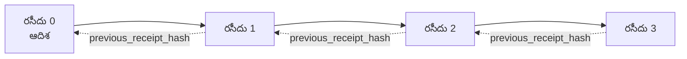

[పాఠం వీడియోను చూడండి: క్రిప్టోగ్రాఫిక్ రిసిప్ట్స్‌తో AI ఏజెంట్లను సురక్షితం చేయడం](https://youtu.be/PLACEHOLDER_VIDEO_ID)

> _(Microsoft కంటెంట్ టీమ్ విలీనం తర్వాత పాఠం వీడియో మరియు థంబ్‌నెయిల్‌ను జోడిస్తుంది, పాఠం 14 / 15 నమూనాను అనుసరించి.)_

# క్రిప్టోగ్రాఫిక్ రిసిప్ట్స్‌తో AI ఏజెంట్లను సురక్షితం చేయడం

## పరిచయం

ఈ పాఠం కవర్ చేస్తుంది:

- క్షమత, డీబగ్గింగ్ మరియు నమ్మకానికి AI ఏజెంట్ల కోసం ఆడిట్ ట్రెయిల్స్ ఎందుకు ముఖ్యం.
- క్రిప్టోగ్రాఫిక్ రిసిప్ట్ అంటే ఏమిటి మరియు అది సంతకం చేయని లాగ్ లైన్ నుండి ఎలా భిన్నంగా ఉంటుంది.
- ఏజెంట్ యొక్క టూల్ కాల్ కోసం సంతకం చేసిన రిసిప్ట్ ని సాధారణ Python లో ఎలా ఉత్పత్తి చేయాలి.
- ఆఫ్‌లైన్‌లో రిసిప్ట్‌ని ఎలా ధృవీకరించాలి మరియు దుర్వినియోగాన్ని ఎలా గుర్తించాలి.
- రిసిప్ట్స్ ని ఎలా చైన్ చేయాలి తద్వారా ఒకదాన్ని తీసేయడం లేదా పునఃఆర్డరింగ్ చేయడం చైన్ ని విరిగించే విధంగా ఉంటుంది.
- రిసిప్ట్స్ ఏమి సాక్ష్యం ఇస్తాయో మరియు అవి స్పష్టంగా ఏమి సాక్ష్యం ఇవ్వవు.

## నేర్చుకునే లక్ష్యాలు

ఈ పాఠం పూర్తి చేసిన తర్వాత, మీరు తెలుసుకుంటారు:

- ఏజెంట్ చర్యల కోసం క్రిప్టోగ్రాఫిక్ మూల ప్రకంపనలను ప్రేరేపించే విఫలమయ్యే పరిస్థితులను గుర్తించడం.
- కెనానికల్ JSON పలోడ్ పై Ed25519 సంతకం చేసిన రిసిప్ట్ ఉత్పత్తి చేయడం.
- సంతకం దారు యొక్క పబ్లిక్ కీ ను ఉపయోగించి రిసిప్ట్ ను స్వతంత్రంగా ధృవీకరించడం.
- మార్పు గుర్తింపు కోసం సవరించిన రిసిప్ట్ మీద ధృవీకరణను మళ్లీ నడపడం.
- హాష్-చైండెడ్ రిసిప్ట్స్ సీక్వెన్స్ తయారు చేయడం మరియు చైన్ ఎందుకు ముఖ్యం అనేది వివరించడం.
- రిసిప్ట్స్ ఏమి సాక్ష్యం ఇస్తాయో (ఆట్రిబ్యూషన్, సమగ్రత, ఆర్డరింగ్) మరియు ఏమి ఇవ్వవు (చర్య యొక్క సరైనత, విధాన సౌండ్‌నెస్) మధ్య సరిహద్దును గుర్తించడం.

## సమస్య: మీ ఏజెంట్ యొక్క ఆడిట్ ట్రైల్

Contoso ట్రావెల్ కోసం మీరు ఒక AI ఏజెంట్ను నియమించారని ఊహించండి. ఏజెంట్ కస్టమర్ అభ్యర్థనలను చదువుతుంది, ఫ్లైట్స్ API ని కాల్ చేసి ఎంపికలను చూస్తుంది, మరియు కస్టమర్ తరఫున సీట్లను బుక్ చేస్తుంది. గత త్రైమాసికంలో, ఏజెంట్ 50,000 బుకింగ్‌లు ప్రాసెస్ చేసింది.

ఈ రోజు ఒక ఆడిటర్ వచ్చారు. వారు ఒక సాదాసీదా ప్రశ్న అడుగుతారు: "మీ ఏజెంట్ ఏం చేశాడో నాకు చూపించండి."

మీరు మీ లాగ్ ఫైళ్లను అందజేస్తారు. ఆడిటర్ వాటిని చూస్తాడు మరియు కఠిన ప్రశ్న అడుగుతాడు: "నేను ఎలా తెలుసుకోవాలి ఈ లాగ్‌లు ఎడిట్ చేయబడలేదు?"

ఇదే ఆడిట్-ట్రైల్ సమస్య. ఈ రోజుల్లో ఎక్కువ ఏజెంట్ వినియోగాలు ఇక్కడ ఆధారపడతాయి:

- **అప్లికేషన్ లాగ్స్**: ఏజెంట్ స్వయంగా వ్రాసి, ఫైల్-సిస్టమ్ యాక్సెస్ ఉన్న ఎవరికయినా మార్చుకోగలిగేది.
- **క్లౌడ్ లాగింగ్ సర్వీసులు**: ప్లాట్‌‌ఫారమ్ స్థాయిలో టాంపర్-ఎవిడెంట్ కానీ ఆడిటర్ ప్లాట్‌‌ఫారమ్ ఆపరేటర్‌పై నమ్మకం ఉంచినప్పుడు మాత్రమే.
- **డేటాబేస్ ట్రాన్సాక్షన్ లాగ్స్**: డేటాబేస్ మార్పుల కోసం బాగా సరిపోతాయి కానీ ఏదైనా టూల్ కాల్స్ కోసం కాదు.

ఏదైనా ఆడిటర్ నమ్మకం అవసరం లేకుండా ఆడిటర్ ప్రశ్నకి ఏది జవాబు చెప్పలేకపోతుంది (మీరు, మీ క్లౌడ్ ప్రొవైడర్, డేటాబేస్ విక్రేత) అంటే. అంతర్గత ఉపయోగం కోసం ఆ నమ్మకం సాధారణంగా చెల్లుబాటు అవుతుంది. నియంత్రిత పనికి (ఫైనాన్స్, ఆరోగ్య సంరక్షణ, EU AI చట్టానికి లోబడి ఏదైనా) ఇది కాదు.

క్రిప్టోగ్రాఫిక్ రిసిప్ట్స్ ప్రతి ఏజెంట్ చర్యను స్వతంత్రంగా ధృవీకరించదగినదిగా చేస్తూ దీన్ని పరిష్కరిస్తాయి. ఆడిటర్ మీపై నమ్మకం పెట్టాల్సిన అవసరం లేదు. వారికి మీ పబ్లిక్ కీ మరియు రిసిప్ట్ మాత్రమే అవసరం.

## క్రిప్టోగ్రాఫిక్ రిసిప్ట్ అంటే ఏమిటి?

ఒక రిసిప్ట్ అనేది ఏజెంట్ చేసిన దాన్ని రికార్డు చేసే JSON ఆబ్జెక్ట్, డిజిటల్ సంతకంతో సంతకం చేయబడినది.


```mermaid
flowchart LR
    A[ఏజెంట్ ఒక సాధనాన్ని పిలుస్తాడు] --> B[రసీదు పేలోడ్ను నిర్మించు]
    B --> C[JSON RFC 8785 ని సాంప్రదాయీకరించు]
    C --> D[SHA-256 హ్యాష్]
    D --> E[Ed25519 చేత సంతకం చేయండి]
    E --> F[సంతకం ఉన్న రసీదు]
    F --> G[ఆడిటర్ ఆఫ్‌లైన్‌లో నిర్ధారిస్తుంది]
    G --> H{సంతకం చెల్లేదా?}
    H -- yes --> I[టాంపర్-ఎविडెంట్ ప్రూఫ్]
    H -- no --> J[రసీదు తిరస్కరించబడింది]
```

ఒక లూస్ట్ రిసిప్ట్ ఇలా ఉంటుంది:

```json
{
  "type": "agent.tool_call.v1",
  "agent_id": "contoso-travel-bot",
  "tool_name": "lookup_flights",
  "tool_args_hash": "sha256:a3f9c1...",
  "result_hash": "sha256:7b2e1d...",
  "policy_id": "contoso-travel-policy-v3",
  "timestamp": "2026-04-25T14:30:00Z",
  "sequence": 47,
  "previous_receipt_hash": "sha256:9d4e6a...",
  "signature": {
    "alg": "EdDSA",
    "sig": "c5af83...",
    "public_key": "8f3b2c..."
  }
}
```

మూడు లక్షణాలు ఈ పని చేస్తాయి:

1. **సంతకం**. రిసిప్ట్ ఏజెంట్ గేట్వే ద్వారా Ed25519 ప్రైవేట్ కీ తో సంతకం చేయబడింది. సహజీకృత పబ్లిక్ కీ ఉన్న ఎవరికైనా ఆఫ్‌లైన్‌లో సంతకం ధృవీకరించవచ్చు. ఏదైనా ఫీల్డ్‌ను మార్చడం సంతకాన్ని చెల్లనిదిగా చేస్తుంది.

2. **కెనానికల్ ఎన్‌కోడింగ్**. సంతకం ముందు, రిసిప్ట్ JSON కెనానికలైజేషన్ స్కీము (JCS, RFC 8785) ఉపయోగించి సీరియలైజ్ చేయబడుతుంది. ఇది రెండు అమలు చేసే విధానాలు ఒకే లాజికల్ రిసిప్ట్ కోసం బైట్-ఇడెంటికల్ అవుట్పుట్ ఉత్పత్తి చేయాలని నిర్ధారిస్తుంది. కెనానికలైజేషన్ లేకపోతే, వేర్వేరు JSON సీరియలైజర్లు ఒకే కంటెంట్ కోసం వేర్వేరు సంతకాలు ఉత్పత్తి చేస్తాయి.

3. **హాష్ చైనింగ్**. `previous_receipt_hash` ఫీల్డ్ ప్రతి రిసిప్ట్‌ను దానికుపూర్వపు రిసిప్ట్‌కు లింక్ చేస్తుంది. ఒక రిసిప్ట్ తీసివేయడం లేదా పునఃఆర్డర్ చేయడం దాని తరువాత వచ్చిన ప్రతి రిసిప్ట్ ని బిగిస్తుంది. వ్యక్తిగత సంతకాలు దాటిపోయినా కూడా టాంపరింగ్ చైన్ స్థాయిలో కనిపిస్తుంది.

ఈ లక్షణాలు కలిసి మూడు హామీలు ఇస్తాయి:

- **ఆట్రిబ్యూషన్**: ఈ కీ ఈ కంటెంట్‌ను సంతకం చేసింది.
- **సమగ్రత**: సంతకం తర్వాత కంటెంట్ మారలేదు.
- **ఆర్డరింగ్**: ఈ రిసిప్ట్ ఆ రిసిప్ట్ తరువాత చైన్ లో వచ్చింది.

## Python లో రిసిప్ట్ ఉత్పత్తి చేయడం

రిసిప్ట్ ఉత్పత్తి కోసం ప్రత్యేక లైబ్రరీ అవసరం లేదు. క్రిప్టోగ్రాఫిక్ ప్రిమిటివ్స్ విస్తృతంగా అందుబాటులో ఉన్నాయి మరియు లాజిక్ కొన్ని దశాబ్దాలైన Python పంక్తులే.

`code_samples/18-signed-receipts.ipynb` లో హ్యాండ్స్-ఆన్ వ్యాయామాలు పూర్తి ప్రవాహాన్ని చూపిస్తాయి. సారాంశం:

```python
import json
import hashlib
import base64
from nacl import signing
from jcs import canonicalize  # RFC 8785 కానానికల్ JSON

def b64url_nopad(data: bytes) -> str:
    return base64.urlsafe_b64encode(data).decode("ascii").rstrip("=")

def sha256_canonical(obj) -> str:
    """SHA-256 of a Python object's JCS-canonical JSON form."""
    return f"sha256:{hashlib.sha256(canonicalize(obj)).hexdigest()}"

# సైన్ చేసే కీని జెనరేట్ చేయండి లేదా లోడ్ చేయండి (ఉత్పత్తిలో, కీ వాల్ట్‌లో నిల్వ చేయండి)
signing_key = signing.SigningKey.generate()
verify_key = signing_key.verify_key

# రసీదు పేలోడ్ను తయారు చేయండి (ఇప్పుడే సంతకం లేదు)
tool_args = {"origin": "SYD", "destination": "LAX"}
tool_result = [{"flight": "QF11", "price": 1850, "stops": 0}]

payload = {
    "type": "agent.tool_call.v1",
    "agent_id": "contoso-travel-bot",
    "tool_name": "lookup_flights",
    "tool_args_hash": sha256_canonical(tool_args),
    "result_hash": sha256_canonical(tool_result),
    "policy_id": "contoso-travel-policy-v3",
    "timestamp": "2026-04-25T14:30:00Z",
    "sequence": 0,
    "previous_receipt_hash": None,
}

# కానానికలైజ్ చేసి, హ్యాష్ చేసి, సంతకం చేయండి.
canonical_bytes = canonicalize(payload)
message_hash = hashlib.sha256(canonical_bytes).digest()
signature_bytes = signing_key.sign(message_hash).signature

# నిర్మిత సంతకం ఆబ్జెక్టును జత చేయండి.
receipt = {
    **payload,
    "signature": {
        "alg": "EdDSA",
        "sig": b64url_nopad(signature_bytes),
        "public_key": b64url_nopad(bytes(verify_key)),
    },
}
```

ఇది మొత్తం సంతకం పైప్‌లైన్. నోట్‌బుక్ లోని వ్యాయామాలు ప్రతి దాన్ని వివరంగా చూపిస్తాయి.

## రిసిప్ట్ ధృవీకరణ మరియు టాంపర్ గుర్తింపు

ధృవీకరణ పర్యవేక్షణ చర్య:

```python
import base64
import hashlib
from nacl import signing
from nacl.exceptions import BadSignatureError
from jcs import canonicalize

def b64url_decode(s: str) -> bytes:
    padding = "=" * ((4 - len(s) % 4) % 4)
    return base64.urlsafe_b64decode(s + padding)

def verify_receipt(receipt: dict) -> bool:
    # సంతకం ఒక నిర్మించబడిన ఆబ్జెక్ట్: {"alg", "sig", "public_key"}.
    sig_obj = receipt.get("signature")
    if not sig_obj or sig_obj.get("alg") != "EdDSA":
        return False

    # నిజంగా సంతకం చేయబడిన పేలొడ్‌ను మళ్లీ నిర్మించండి (సంతకాన్ని తప్ప అన్ని).
    payload = {k: v for k, v in receipt.items() if k != "signature"}

    canonical_bytes = canonicalize(payload)
    message_hash = hashlib.sha256(canonical_bytes).digest()

    try:
        verify_key = signing.VerifyKey(b64url_decode(sig_obj["public_key"]))
        verify_key.verify(message_hash, b64url_decode(sig_obj["sig"]))
        return True
    except BadSignatureError:
        return False
```

ఈ ఫంక్షన్ ఒక రిసిప్ట్ తీసుకుని సంతకం సరైనదేనేమో `True` అంటుంది, కాదంటే `False`. నెట్‌వర్క్ కాల్, సర్వీస్ ఆధారపడటం లేదా ఎవరినీ నమ్మాల్సిన అవసరం లేదు.

టాంపర్ గుర్తింపు క్రియాశీలత చూడటానికి, నోట్‌బుక్:

1. సరైన రిసిప్ట్ ఉత్పత్తి చేసి ధృవీకరణ నిర్ధారించడం.
2. `tool_args_hash` ఫీల్డ్ లో ఒక బిట్ మార్చడం.
3. ధృవీకరణను మళ్లీ నడపడం మరియు విఫలమయ్యే చూడటం.

ఇది రిసిప్ట్స్ టాంపర్-ఎవిడెంట్ అనేది ప్రాక్టికల్ డెమో: చిన్న మార్పు కూడా సంతకం పాడవేస్తుంది.

## బహుళ-దశా ఏజెంట్ల కోసం రిసిప్ట్స్ చెయిన్ చేయడం

ఒక్క సంతకం చేసిన రిసిప్ట్ ఒకే చర్యను రక్షిస్తుంది. రిసిప్ట్ చైన్ ఒక సీక్వెన్స్‌ని రక్షిస్తుంది.


```mermaid
flowchart LR
    R0[రసీదు 0<br/>ఆదిశ] --> R1[రసీదు 1]
    R1 --> R2[రసీదు 2]
    R2 --> R3[రసీదు 3]
    R1 -. previous_receipt_hash .-> R0
    R2 -. previous_receipt_hash .-> R1
    R3 -. previous_receipt_hash .-> R2
```

ప్రతి రిసిప్ట్ తనకు ముందటి రిసిప్ట్ హాష్ ని రికార్డ్ చేస్తుంది. రిసిప్ట్ 2 ను మౌనంగా తీసేయడానికి దాడికారి:

- రిసిప్ట్ 3 లో `previous_receipt_hash` ఫీల్డ్ మార్చాలి (రిసిప్ట్ 3 సంతకం పాడవుతుంది), లేదా
- మార్చిన రిసిప్ట్ 3 పై కొత్త సంతకం తయారు చేయాలి (ఏజెంట్ ప్రైవేట్ కీ అవసరం).

ప్రైవేట్ కీ హార్డ్వేర్ కీ వాల్ట్ లో ఉంటే మరియు ప్రతి రిసిప్ట్ తో పబ్లిక్ కీ ప్రచురిస్తే ఈ ఇద్దరు దాడులు గుర్తింపుతో పాటుపడతాయి.

నోట్‌బుక్ చూస్తే:

1. మూడు రిసిప్ట్స్ చైన్‌ను నిర్మించడం.
2. ప్రతి రిసిప్ట్ యొక్క `previous_receipt_hash` నిజమైన ముందు రిసిప్ట్ హాష్ కి మిల్ అవుతుందా అనే ధృవీకరణ.
3. మధ్యలో ఒక రిసిప్ట్ తో టాంపరింగ్ చేసి చైన్ ఆ పాయింట్ లో విరిగిపోవడం చూడటం.

ఇది మీరు బహిరంగ ఆడిటర్ నమ్మకం లేకుండా ధృవీకరించగల ఆడిట్ ట్రైల్ తయారు చేసే విధానం.

## రిసిప్ట్‌లు ఏమి సాక్ష్యం ఇస్తాయి (మరియు ఏమి ఇవ్వవు)

ఈ పాఠంలో ఈ భాగం అత్యంత ముఖ్యమైనది. రిసిప్ట్‌లు శక్తివంతమైనవి కానీ వారి శక్తికి పరిమితి ఉంటుంది.

**రిసిప్ట్‌లు మూడు విషయాలను నిరూపిస్తాయి:**

1. **ఆట్రిబ్యూషన్**: ఒక నిర్దిష్ట కీ ఒక నిర్దిష్ట పలోడ్ సంతకం చేసింది.
2. **సమగ్రత**: పలోడ్ సంతకం తరువాత మారలేదు.
3. **ఆర్డరింగ్**: ఈ రిసిప్ట్ ఆ రిసిప్ట్ తరువాత చైన్ లో వచ్చింది.

**రిసిప్ట్‌లు ఇది నిరూపించవు:**

1. **సరైనత**: ఏజెంట్ చర్య సరైనది అని. సరైన జవాబు కంటే తప్పు జవాబు కోసం కూడా రిసిప్ట్ సంతకం చేయవచ్చు.
2. **పాలసీ అనుసరణ**: `policy_id` లో ఉల్లేఖించబడిన పాలసీ నిజంగా పరిశీలించబడిందా, లేదా అది ఈ చర్యను అనుమతించిందా. రిసిప్ట్ మాట్లాడుతూ ఏమి కోరిక చేశాయో, ఆజ్ఞానుసారం ఏమి అమలు చేయబడిందో కాదు.
3. **కీ దాటి గుర్తింపు**: రిసిప్ట్ "ఈ కీ ఈ కంటెంట్ సంతకం చేసింది" అంటుంది. "ఈ వ్యక్తి దీనిని ఆహ్వానించాడు" అని కాదు. కీ ని వ్యక్తి లేదా సంస్థకు అనుసంధానం చేయడం ప్రత్యేక గుర్తింపు మౌలిక సదుపాయాలు అవసరం (డైరెక్టరీ, పబ్లిక్ కీ రిజిస్ట్రీ).
4. **ఇన్‌పుట్ల నిజాయితీ**: ఏజెంట్ మోసపూరిత డిమాండ్ అందుకొని దానిపై చర్య తీసుకుంటే, రిసిప్ట్ చర్యను నిజంగా నమోదు చేస్తుంది. రిసిప్ట్‌లు ఇన్‌పుట్ ధృవీకరణ దాని దిగువన ఉన్నాయి, విమర్శల ప్రత్యామ్నాయం కాదు.

ఈ సరిహద్దు కారణాలు రెండు ఉన్నాయి:

- ఏ రిసిప్ట్‌లు ఉపయోగకరమే: ఏజెంట్ ప్రవర్తన ఆడిటబుల్ మరియు టాంపర్-ఎవిడెంట్ చేయడం, సంస్థాభిమాన భిన్నాల వరకు కూడా.
- ఇంకా అవసరమైన అదనపు పొరలను తెలియజేస్తుంది: ఇన్‌పుట్ ధృవీకరణ (పాఠం 6), పాలసీ అమలు (కింద చిట్కా లో), మరియు గుర్తింపు మౌలిక సదుపాయాలు (ఈ పాఠం పరిధి తప్పు).

సాధారణ తప్పుదోవ "మన దగ్గర రిసిప్ట్‌లు ఉన్నాయ్" అంటే "మనం పాలితులం" అని భావించడం మాత్రమే కాదు. రిసిప్ట్‌లు ఒక మౌలికం. పాలన మీరు పైన నిర్మించుకునే వ్యవస్థ.

## ఉత్పత్తి సూచనలు

ఈ పాఠంలోని Python కోడ్ జాగ్రత్తగా చాలా సూక్ష్మం, మీరు ప్రతి పంక్తిని చదవగలరు మరియు ఏమి జరుగుతుందో అర్థం చేసుకోవచ్చు. ఉత్పత్తిలో, మీకు రెండు ఎంపికలు ఉన్నాయి:

1. **క్రిప్టోగ్రాఫిక్ ప్రిమిటివ్స్‌పై నేరుగా నిర్మించండి.** మీరు చూసిన 50 పంక్తులు చాలా వినియోగాలకె సరిపోతాయి. PyNaCl (Ed25519) మరియు `jcs` ప్యాకేజ్ (కెనానికల్ JSON) బాగా నిర్వహించబడిన, ఆడిట్ అయ్యిన లైబ్రరీలు.

2. **ఉత్పత్తి రిసిప్ట్ లైబ్రరీ ఉపయోగించండి.** కొన్ని ఓపెన్-సోర్స్ ప్రాజెక్టులు ఇదే నమూనాను అదనపు లక్షణాలతో అమలు చేస్తాయి (కీ రొటేషన్, బ్యాచ్ ధృవీకరణ, JWK సెట్ పంపిణీ, పాలసీ ఇంజన్లతో సమీకరణ):
   - ఈ పాఠంలో ఉపయోగించే రిసిప్ట్ ఫార్మాట్ IETF ఇంటర్నెట్-డ్రాఫ్ట్ (`draft-farley-acta-signed-receipts`)లో ఉంది, ప్రస్తుతమ మাপক్రమంలో ఉంది.
   - Microsoft Agent Governance Toolkit రిసిప్ట్స్ ని Cedar ఆధారిత పాలసీ నిర్ణయాలతో కలిపి పనిచేస్తుంది; ఆ రిపోజిటరీలో ట్యుటోరియల్ 33 లో ఒక పూర్తి ఉదాహరణ చూడండి.
   - `protect-mcp` (npm) మరియు `@veritasacta/verify` (npm) ప్యాకేజులు రిసిప్ట్ సంతకం మరియు ఆఫ్‌లైన్ ధృవీకరణకు Node ఆధారిత అమలు అందిస్తాయి, ఏ MCP సర్వర్‌కి టాంపర్-ఎవిడెంట్ ఆడిట్ ట్రైల్ వ్రాపింగ్ కు.
   - **[nobulex](https://github.com/arian-gogani/nobulex)** Python SDK (`pip install nobulex`) అదే Ed25519 + JCS సంతకం నమూనాను Python లో LangChain మరియు CrewAI సమీకరణలతో అందిస్తుంది, ప్రచురించిన క్రాస్-వాలిడేషన్ పరిక్షా వెక్టర్లు మరియు [OWASP PR #2210](https://github.com/OWASP/CheatSheetSeries/pull/2210) ద్వారా ఒక కాంప్లయిన్స్ మ్యాపింగ్ తో.

మీ స్వంత JWT లైబ్రరీ రాయడం మరియు ఆడిట్డ్ లైబ్రరీ వాడటం మధ్య నిర్ణయం మెటఫారికల్‌గా ఈ లైబ్రరీ వాడటం మరియు స్వయంగా రాయటం మధ్య నిర్ణయాన్ని సూచిస్తుంది: రెండూ సరైనవి; లైబ్రరీ సమయాన్ని ఆదా చేస్తుంది మరియు ఆడిట్ సాంపుటాన్ని తగ్గిస్తుంది; స్వయంగా రాయడం ప్రతి ప్రిమిటివ్‌ని అర్థం చేసుకోవాల్సిన అవసరం ఉంది. ఈ పాఠం మొదటిది నేర్పిస్తుంది కాబట్టి మీరు రెండింటిలోనైనా దారి ఎంచుకోవచ్చు.

## జ్ఞాన పరీక్ష

ఆచరణ వ్యాయామానికి వెళ్లేముందు మీ అర్థం పరీక్షించండి.

**1. ఏజెంట్ ప్రైవేట్ Ed25519 కీతో రిసిప్ట్ సంతకం చేయబడుతుంది. ఆడిటర్ వద్ద కేవలం పబ్లిక్ కీ ఉంటుంది. ఆడిటర్ ఆఫ్‌లైన్‌లో రిసిప్ట్ ధృవీకరించగలడా?**

<details>
<summary>జవాబు</summary>

అవును. Ed25519 ధృవీకరణకు కేవలం పబ్లిక్ కీ మరియు సంతకం చేయబడిన బైట్స్ అవసరం. నెట్‌వర్క్ కాల్, సర్వీస్ ఆధారపడటం లేదు. ఇది రిసిప్ట్స్‌ను ఎయిర్-గ్యాప్డ్, బహుళ సంస్థల, తక్కువ నమ్మకం ఆడిట్ పరిసరాల్లో ఉపయోగపడే లక్షణం.
</details>

**2. దాడి చేయేవారి ఒక రిసిప్ట్ యొక్క `policy_id` ఫీల్డ్ మార్చి, అది మరింత అనుమతిపరమైన పాలసీతో పాలితమైందని క్లెయిమ్ చేస్తారు. సంతకం ప్రాథమిక పలోడ్ పై జరిగింది. ధృవీకరణ సమయంలో ఏమ జరుగుతుంది?**

<details>
<summary>జవాబు</summary>

ధృవీకరణ విఫలమవుతుంది. సంతకం కేనానికల్ బైట్స్ పై తయారయ్యింది; ఏదైనా ఫీల్డ్ మార్చడం కేనానికల్ బైట్స్ మార్చగలదు, SHA-256 హాష్ మారుతుంది, ఆ సంతకం చెల్లనిదిగా మారుతుంది. దాడి చేయేవారి దగ్గర ప్రైవేట్ కీ లేకపోవడం miatt తాజా చెల్లుబాటు అయ్యే సంతకం చేయలేరు.
</details>

**3. రిసిప్ట్ `tool_args_hash` మరియు `result_hash` ని సాకార వాదనలు మరియు ఫలితం బదులుగా ఎందుకు కలిగి ఉంటుంది?**

<details>
<summary>జవాబు</summary>

రెండు కారణాలు. మొదటిగా, రిసిప్ట్‌ను భద్రపరచడం లేదా ప్రసారం చేయాల్సిన వాతావరణాల్లో అనవసరంగా వాస్తవ కంటెంట్ (PII, వ్యాపార డేటా) లీకవడం సమస్య. హాషింగ్ రిసిప్ట్‌ను చిన్నదిగా మరియు కంటెంట్‌ను ప్రైవేట్ గా ఉంచుతుంది; ఆడిటర్ తగిన ప్రతిని హాష్‌తో సరిపోల్చి ధృవీకరిస్తాడు. రెండవది, హాష్‌లకు స్థిర పరిమాణం ఉంటుంది; హాష్‌లతో రిసిప్ట్ ఇన్‌పుట్‌లు ఎంత పెద్దవైనా పరిమితి కలిగి ఉంటుంది.
</details>

**4. `previous_receipt_hash` ఫీల్డ్ ప్రతి రిసిప్ట్ ని దాని ముందు ఉన్న రిసిప్ట్ కి లింక్ చేస్తుంది. దాడి చేయేవారు మధ్యలోని ఒక రిసిప్ట్ ఆవిర్భావం లేకుండా తీసివేస్తే ఏమి చెల్లుగా ఉండదు?**

<details>
<summary>జవాబు</summary>

తీసేయబడిన తర్వాత వచ్చిన ప్రతి రిసిప్ట్. వారి `previous_receipt_hash` ఫీల్డ్స్ నిజమైన చైన్‌కు సరిపోలవు (వారు సూచించిన రిసిప్ట్ ఇప్పుడున్నది లేదా చైన్ ఇప్పుడు వేరే పూర్వీకుడిని సూచిస్తుంది). తీసివేత దాచడానికి దాడి చేయేవారు ప్రతి తర్వాతి రిసిప్ట్‌ను మళ్లీ సంతకం చేయాలి, ఇది ప్రైవేట్ కీ అవసరం.
</details>

**5. ఒక రిసిప్ట్ స్వచ్ఛంగా ధృవీకరించబడింది. అది ఏజెంట్ చర్య సరైనదని, శబ్దమైనదని లేదా పాలసీకి అనుగుణమని నిరూపిస్తుందా?**

<details>
<summary>జవాబు</summary>

కాదు. చెల్లుబాటు అయ్యే రిసిప్ట్ మూడు విషయాలు నిరూపిస్తుంది: ఆట్రిబ్యూషన్ (ఈ కీ ఈ కంటెంట్ సంతకం చేసింది), సమగ్రత (కంటెంట్ మారలేదు), మరియు ఆర్డరింగ్ (ఈ రిసిప్ట్ ఆ రిసిప్ట్ తరువాత వచ్చింది). ఇది చర్య సరైనదని, `policy_id` లో పేర్కొన్న పాలసీ పరిశీలించబడ్డదాని లేదా ఏజెంట్ ప్రతి నిబంధన అనుసరించినదాని నిరూపణ కాదు. రిసిప్ట్స్ ఏజెంట్ ప్రవర్తన ఆడిటబుల్ చేయబడింది, తప్ప తప్పనిసరులేదు. ఇది పాఠంలో అత్యంత ముఖ్యమైన సరిహద్దు.
</details>

## ఆచరణ వ్యాయామం

`code_samples/18-signed-receipts.ipynb` ని తెరిచి మన నాలుగు విభాగాలను పూర్తిచేయండి:

1. **విభాగం 1**: మీ మొదటి రిసిప్ట్ సంతకం చేసి ధృవీకరించండి.
2. **విభాగం 2**: రిసిప్ట్ తో టాంపర్ చేయండి మరియు ధృవీకరణ విఫలమవ్వడం గమనించండి.
3. **విభాగం 3**: మూడు రిసిప్ట్ చైన్ నిర్మించి చైన్ సమగ్రత ధృవీకరించండి.
4. **విభాగం 4**: Microsoft Agent Framework తో నిర్మిత ఏజెంట్ పై ఈ నమూనాను వర్తించండి: టూల్ కాల్‌ని రిసిప్ట్-సంతకం చేసి, తర్వాత స్వతంత్రంగా రిసిప్ట్ ధృవీకరించండి.


**సాందర్భిక సవాలు 1:** మీరు మీ ఇష్టానికి అనువైన అదనపు ఫీల్డ్‌తో రిసిప్ట్ స్కీమాను విస్తరించండి (ఉదాహరణకు, ట్రేసింగ్ కోసం రిక్వెస్ట్ ID), దానిని కలిగి ఉండేలా కెనానికల్ సైన్ చేయడం లాజిక్‌ను సవరించండి, మరియు రిసిప్ట్ ఇంకా సరిగా వేరిఫికేషన్ ద్వారా తిరుగుతున్నందున మీరు ధృవీకరించండి. అప్పుడు సైన్ చేసిన తర్వాత ఆ ఫీల్డ్‌ను మార్చి, వేరిఫికేషన్ విఫలమవుతున్నదని నిర్ధారించండి. ఇది కెనానికల్ ఎన్కోడింగ్ యొక్క ప్రతి బైట్ సిగ్నేచర్‌కు ఎలా దోహదం చేస్తుందో మీరు అర్థం చేసుకునేలా చేస్తుంది.

**సాందర్భిక సవాలు 2:** మీ రెండు రిసిప్ట్లను SHA-256 హాష్ చేయండి (అవిచ్ఛిన్నంగా వారి కెనానికల్ బైట్లు కలుపుతూ) మరియు సైన్ చేసే ముందు ఫలితాల్లో తయారైన డైజెస్ట్‌ను మూడవ రిసిప్ట్‌లో కొత్త ఫీల్డ్‌గా చేర్చండి. అన్నీ మూడు రిసిప్ట్లు ఇంకా సరిగా తిరుగుతున్నాయో ధృవీకరించండి. మీరు ఒక మెట్లు కూడిన ఇన్‌క్లూజన్ ప్రూఫ్‌ను తయారు చేశారు: మూడవ రిసిప్ట్ పక్కన ఉన్నవారు మొదటి రెండు రిసిప్ట్లు సైన్ అయిన సమయంలో ఉన్నాయని నిరూపించవచ్చు, వాటి సంగతులను వెల్లడించకుండానే. ఇది పెద్ద స్థాయిలో సెలెక్టివ్-డిస్క్లోజర్ రిసిప్ట్లు ఉపయోగించే నమూనా (Merkle commitments, RFC 6962).

## ముగింపు

క్రిప్టోగ్రాఫిక్ రిసిప్ట్లు AI ఏజెంట్స్‌కి క్రింది విధంగా ఆడిట్ ట్రైల్ అందిస్తాయి:

- **స్వతంత్రంగా పరిశీలించదగినవి**: పబ్లిక్ కీ ఉన్న ఎవరికైనా వేరిఫై చేయవచ్చు, ఏ సేవ ఆధారపడదు.
- **తవ్వుబాటు-సూచనాత్మకమైనవి**: ఏవైనా మార్పులు సిగ్నేచర్‌ను చెల్లదు.
- **పోర్టబుల్**: ఒక రిసిప్ట్ చిన్న JSON ఫైల్; దాన్ని ఆర్చైవ్ చేయవచ్చు, పంపించవచ్చు, ఎక్కడైన వేరిఫై చేయవచ్చు.
- **స్టాండర్డ్స్‌కు అనుగుణమైనవి**: Ed25519 (RFC 8032), JCS (RFC 8785), SHA-256 వంటి విస్తృతంగా ఉపయోగించే ప్రిమిటివ్స్‌పై నిర్మించబడ్డవి.

అవి ఇన్‌పుట్ చెల్లింపునిర్ధారణ, పాలసీ అమలు, లేదా గుర్తింపు మౌలిక సదుపాయాలకు ప్రత్యామ్నాయాలు కావు. అవి ఆ స్థాయిలకు మౌలికమైనవి. మీరు ఏజెంట్స్‌ను నియంత్రింత పనులలో, బహుళ-సంస్థల వర్క్‌ఫ్లోలో, లేదా భవిష్యత్తు ఆడిటర్ మిమ్మల్ని విశ్వసించకుండా ఉండే ఏ పరిస్థితిలో అయినా ఉపయోగిస్తున్నప్పుడు, రిసిప్ట్లు ఆడిట్ ట్రైల్‌ను నిజాయతీగా నిలబెట్టే మార్గం.

ముఖ్యమైన విషయమేమిటంటే: రిసిప్ట్లు ఎవరు ఏది అన్న మాటను, ఎప్పుడు అన్నదాన్ని నిరూపిస్తాయి. సంభాషణ సత్యమో సరియైనదో కాదు అని వారు నిరూపించవు. ఆ తేడాను బాగా పట్టికొనండి. ఇది నిజాయితీ ప్రామాణిక వ్యవస్థ మరియు తప్పుదారితీసే వ్యవస్థ మధ్య తేడా.

## ఉత్పత్తి చెక్‌లిస్ట్

మీరు ఈ పాఠం నుండి నిజమైన వాతావరణంలో రిసిప్ట్-సైన్ చేసిన ఏజెంట్లను అమలు చేయడానికి సిద్ధంగా ఉన్నప్పుడు:

- [ ] **డెవలపర్ ల్యాప్‌టాప్ నుండి సైన్ కీని తరలించండి.** Azure Key Vault, AWS KMS లేదా హార్డ్‌వేర్ సెక్యూరిటీ మాడ్యూల్ ఉపయోగించండి. మీ రిసిప్ట్లను సైన్ చేసే ప్రైవేట్ కీ ఎప్పుడూ సోర్స్ కంట్రోల్‌లో లేదా అప్లికేషన్ యంత్రాల్లో స్పష్టమైనుగా ఉంచరాదు.
- [ ] **వెరిఫికేషన్ పబ్లిక్ కీని ప్రచురించండి.** ఆడిటర్లు ఆఫ్‌లైన్‌లో వేరిఫైచేసేందుకు దాన్ని అవసరం పడతారు. ప్రామాణిక నమూనా JWK సెట్ను ప్రసిద్ధ URL వద్ద ఉంచడం (RFC 7517), ఉదాహరణకి `https://your-org.example.com/.well-known/agent-keys.json`.
- [ ] **చెయిన్‌ను బాహ్యంగా యాంకర్ చేయండి.** నిరంతరం తాజా చెైన్ హెడ్ హాష్‌ను ట్రాన్స్పరెన్సీ లాగ్‌కు (Sigstore Rekor, RFC 3161 టైమ్‌స్టాంప్ అధికారి లేదా రెండవ అంతర్గత వ్యవస్థ) రాయండి, తద్వారా బయటి పార్టీ “ఈ చెయిన్ ఈ సమయంలో ఉన్నది” అని ధృవీకరించవచ్చు.
- [ ] **రిసిప్ట్లను మార్పు లేని విధంగా నిల్వ చేయండి.** మాత్రమే జోడించే బ్లాబ్ స్టోరేజ్ (Azure స్టోరేజ్ తో ఇమ్మ్యూటబిలిటీ విధానాలు, AWS S3 ఆబ్జెక్ట్ లాక్) మూలగామి స్టోరేజ్ స్థాయిలో చరిత్రను మార్చడం నివారిస్తుంది.
- [ ] **రికార్డుల నిలుపుదలపై నిర్ణయం తీసుకోండి.** అనేక కంప్లయెన్స్ నియమాలు బహుళ సంవత్సరాల నిలుపుదల అవసరం చేస్తాయి. రిసిప్ట్ పెరుగుదల కోసం ప్రణాళిక చేయండి (ప్రతి రిసిప్ట్ సుమారు 500 బైట్లు; ఒక ఏజెంట్ రోజుకు 10 వేల కాల్స్ చేస్తే సంవత్సరానికి సుమారు 1.8 GB ఉత్పత్తి).
- [ ] **రిసిప్ట్లు ఏమి కవర్ చేయవు అని డాక్యుమెంట్ చేయండి.** రిసిప్ట్లు అట్రిబ్యూషన్, ఇన్‌tegrిటీ మరియు ఆర్డరింగ్‌ను నిరూపిస్తాయి. మీ రన్‌బుక్ ప్రత్యేకంగా ఏ అదనపు నియంత్రణలు (ఇన్‌పుట్ వాలిడేషన్, పాలసీ అమలు, రేట్ లిమిటింగ్, గుర్తింపు మౌలిక సదుపాయాలు) రిసిప్ట్లతో కలిసి మీ గవర్నెన్స్ ధోరణిలో ఉన్నాయో విమర్శనాత్మకంగా జాబితా చేయాలి.

### AI ఏజెంట్ల సెక్యూరిటీ గురించి మరిన్ని ప్రశ్నలు ఉండంటారా?

[Microsoft Foundry Discord](https://aka.ms/ai-agents/discord)లో చేరండి, ఇతర అభ్యాసకులతో కలుసుకోండి, ఆఫీస్ గడియారాలకు హాజరవండి, మరియు మీ AI ఏజెంట్ల ప్రశ్నలకు జవాబులు పొందండి.

## ఈ పాఠం తరువాత

ఈ పాఠం ఒంటి రిసిప్ట్ సైన్ చేయడం మరియు హాష్-చైన్ క్రమాల covering చేస్తుంది. పర్యవేక్షణ ధోరణి అభివృద్ధి చేస్తుండగా మీరు ఎదుర్కొనే మరిన్ని ఆధునిక నమూనాలు కూడా ఇదే ప్రిమిటివ్స్‌తో సమ్మిశ్రమంగా ఉంటాయి:

- **ఎంపిక చేసిన వెల్లడింపు.** ఒక రిసిప్ట్ ఫీల్డ్స్ స్వతంత్రంగా కమీటెడ్ (RFC 6962-శైలి Merkle ట్రీ) ఉంటే, మీరు నిర్దిష్ట ఫీల్డ్స్‌ను నిర్దిష్ట ఆడిటర్లకు చూపించవచ్చు మరియు మిగిలినవి మార్చబడలేదు అని నిరూపించవచ్చు, వాటిని బయటపెట్టకుండా. ఇది ఒక సమగ్రమైన ఆడిట్ (పూర్తి కావ్యాన్ని కోరుకునే) మరియు GDPR వంటి డేటా-తగ్గింపు నియమాలు ఉండే సందర్భాల్లో ఉపయోగకరం.
- **రిసిప్ట్ రద్దు.** సైన్ కీ దుర్వినియోగమయ్యితే, ఆ కీతో సైన్ చేసిన అన్ని రిసిప్ట్లను untrusted గా గుర్తించడానికి ఒక విధానం అవసరం. ప్రామాణిక నమూనాలు: షార్ట్‌లైవ్డ్ సైన్ కీలు మరియు ప్రచురించబడిన రద్దు జాబితా, లేదా రద్దు ఎంట్రీలతో ట్రాన్స్పరెన్సీ లాగ్.
- **ద్విపాక్షిక / విభజన-సంతకం రిసిప్ట్లు.** కొంత అమలులో సంతకం చేయబడిన పమ్ఫ్లెట్‌ను ముందునిష్పత్తి (`authorization_*`) మరియు తర్వాతి నిష్పత్తి (`result_*`)భాగాలుగా విభజించి వేరువేరు సంతకాలు కలిగి ఉంటాయి. ఇది అనుమతి నిర్ణయము మరియు పరిశీలన ఫలితము వేర్వేరు పాత్రలతో లేదా సమయాల్లో తయారయ్యేటప్పుడు ఉపయోగకరంగా ఉంటుంది. ఇది ఈ పాఠంలో నేర్పించిన రిసిప్ట్ ఫార్మాట్ పై అదనంగా ఉంటుంది.
- **పేలోడు పరిమాణం.** ఒక రిసిప్ట్ లో మీరు `result_hash` లో ఉంచిన బైట్లన్ని ముద్రిస్తుంది. వాస్తవ పేలోడులు సాధారణంగా ఒకే టూల్ కాల్ ఫలితం కంటే పూర్తి: ముందునిష్పత్తి తర్కం (మోడల్ అంచనా, పరిశీలించిన ఎంపికలు, సాక్ష్యాలు మరియు వాటి సంపూర్ణత, ప్రమాద ధోరణి, నిర్దేశక శ్రేణి, గేటు ఫలితం) అందరూ ఒకే పీలోడులో చేరవచ్చు, ఒక్క రిసిప్ట్ ముద్రించి. ఇది రిసిప్ట్ ఫార్మాట్‌ను సులభంగా ఉంచుతుంది కాని పేలోడు స్కీమాలను ప్రతి రంగం ప్రక్కన అభివృద్ది చేయగలదు.
- **పోలుస అమలులో అనుకూలత.** అదే రిసిప్ట్ ఫార్మాట్ యొక్క బహుళ స్వతంత్ర అమలులు (Python, TypeScript, Rust, Go) పంచుకున్న పరీక్ష వెక్టర్లపై పరస్పరం ధృవీకరిస్తాయి. మీరు మీ స్వంత అమలును తయారు చేస్తే, ప్రచురించబడిన వెక్టర్లతో ధృవీకరించడం వైర్ అనుకూలతను నిరూపిస్తుంది.
- **పోస్ట్-క్వాంటమ్ మార్పిడి.** Ed25519 ఈ రోజు విస్తృతంగా ఉపయోగంలో ఉంది కానీ ఇది క్వాంటమ్-ప్రతిఘటకము కాదు. రిసిప్ట్ ఫార్మాట్ అల్గోరిథం-అగ్సీల్: మీరు మార్పిడి అవసరం ఉన్నప్పుడు `signature.alg` ఫీల్డ్ `ML-DSA-65` (NIST పోస్ట్-క్వాంటమ్ సంతకం ప్రమాణం)ను కలిగి ఉంటుంది. రిసిప్ట్లు డ్యూయల్-సైన్ చేయబడే బదులింపు కాలాన్ని ప్లాన్ చేయండి.

## అదనపు వనరులు

- <a href="https://datatracker.ietf.org/doc/draft-farley-acta-signed-receipts/" target="_blank">IETF ఇంటర్నెట్-డ్రాఫ్ట్: మెషిన్-టు-మెషిన్ యాక్సెస్ కంట్రోల్ కోసం సైన్ చేసిన డిసిషన్ రిసిప్ట్స్</a>
- <a href="https://learn.microsoft.com/azure/ai-studio/responsible-use-of-ai-overview" target="_blank">책임 있는 AI అవలోకనం (Azure AI)</a>
- <a href="https://datatracker.ietf.org/doc/html/rfc8032" target="_blank">RFC 8032: ఎడ్వర్డ్స్-కర్వ్ డిజిటల్ సిగ్నేచర్ ఆల్గోరిథమ్ (EdDSA)</a>
- <a href="https://datatracker.ietf.org/doc/html/rfc8785" target="_blank">RFC 8785: JSON కనానికలైజేషన్ స్కీమ్ (JCS)</a>
- <a href="https://datatracker.ietf.org/doc/html/rfc6962" target="_blank">RFC 6962: సర్టిఫికేట్ ట్రాన్స్పరెన్సీ</a> (సెలెక్టివ్-డిస్క్లోజర్ రిసిప్ట్స్ ఉపయోగించే Merkle-ట్రీ నిర్మాణం)
- <a href="https://github.com/microsoft/agent-governance-toolkit/blob/main/docs/tutorials/33-offline-verifiable-receipts.md" target="_blank">Microsoft ఏజెంట్ గవర్నెన్స్ టూల్‌కిట్, ట్యుటోరియల్ 33: ఆఫ్‌లైన్-వెరిఫైయబుల్ డిసిషన్ రిసిప్ట్స్</a>
- <a href="https://github.com/ScopeBlind/agent-governance-testvectors" target="_blank">ఈ పాఠంలో ఉపయోగించిన రిసిప్ట్ ఫార్మాట్‌కు క్రాస్ అమలు అనుకూలత పరీక్ష వెక్టర్లు</a> (Apache-2.0)
- <a href="https://pynacl.readthedocs.io/" target="_blank">PyNaCl డాక్యుమెంటేషన్</a> (Python‌లో Ed25519)

## గత పాఠం

[కంప్యూటర్ వినియోగ ఏజెంట్స్ నిర్మాణం (CUA)](../15-browser-use/README.md)

---

<!-- CO-OP TRANSLATOR DISCLAIMER START -->
**అస్వీకరణ**:
ఈ పత్రం AI అనువాద సేవ [Co-op Translator](https://github.com/Azure/co-op-translator) ఉపయోగించి అనువదించబడింది. మేము ఖచ్చితత్వానికి ప్రయత్నిస్తున్నప్పటికీ, ఆటోమేటెడ్ అనువాదాలు తప్పులు లేదా అసమగ్రతలను కలిగి ఉండవచ్చు. దాని స్వదేశ భాషలో ఉన్న అసలు పత్రాన్ని అధికారం కలిగిన మూలంగా పరిగణించాలి. కీలకమైన సమాచారం కోసం, ప్రొఫెషనల్ మానవ అనువాదాన్ని సిఫారసు చేస్తాము. ఈ అనువాదం ఉపయోగం వల్ల కలిగే ఏవైనా అపార్థాలు లేదా తప్పుదారులు కోసం మేము బాధ్యత వహించము.
<!-- CO-OP TRANSLATOR DISCLAIMER END -->