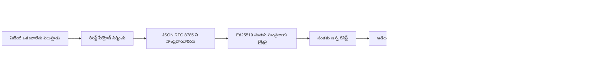
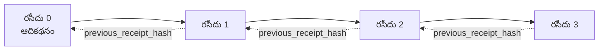

[పాఠం వీడియోను చూడండి: క్రిప్టోగ్రాఫిక్ రిసిప్టులతో AI ఏజెంట్లను భద్రపరచడం](https://youtu.be/PLACEHOLDER_VIDEO_ID)

> _(పాఠం వీడియో మరియు థంబ్‌నెయిల్‌ను Microsoft కంటెంట్ టీమ్ విలీనం తర్వాత జోడిస్తారు, పాఠం 14 / 15 నమూనాతో సరిపోతుంది.)_

# క్రిప్టోగ్రాఫిక్ రిసిప్టులతో AI ఏజెంట్లను భద్రపరచడం

## పరిచయం

ఈ పాఠం కవర్ చేస్తుంది:

- AI ఏజెంట్ల కోసం ఆడిట్ ట్రైల్స్ ఎందుకు కంప్లయెన్స్, డీబగ్గింగ్ మరియు విశ్వాసానికి ముఖ్యం.
- క్రిప్టోగ్రాఫిక్ రిసిప్ట్ అంటే ఏమిటి మరియు అది సంతకం కాని లాగ్ లైన్ నుండి ఎలా విభిన్నం.
- ఏజెంట్ టూల్ కాల్ కోసం సంతకంతో కూడిన రిసిప్టును సాధారణ Pythonలో ఎలా ఉత్పత్తి చేయటం.
- ఆఫ్‌లైన్‌లో రిసిప్ట్‌ను ఎలాగూ ధ్రువీకరించడం మరియు లోపం గుర్తించడం.
- రిసిప్టులను ఎలా చైన్ చేయాలి మరియు ఒకదానిని తీసివేస్తే లేదా తిరగరాయగలిగితే చైన్ ఎలా కెలుగుతుంది.
- రిసిప్టులు ఏమి నిరూపిస్తాయో మరియు స్పష్టంగా ఏమి నిరూపించుకోదు.

## నేర్చుకునే లక్ష్యాలు

ఈ పాఠం పూర్తి చేసిన తర్వాత, మీరు తెలుసుకుంటారు:

- ఏజెంట్ చర్యలకు క్రిప్టోగ్రాఫిక్ ప్రావెనెన్స్‌ను ప్రేరేపించే వైఫల్య మోడ్‌లను గుర్తించడం.
- సాధారణ JSON పేట్లోడ్‌పై Ed25519-సంతకం చేసిన రిసిప్ట్ ఉత్పత్తి చేయడం.
- కేవలం సంతకం చేసిన వ్యక్తి పబ్లిక్ కీ ఉపయోగించి రిసిప్ట్‌ను స్వతంత్రంగా ధ్రువీకరించడం.
- ఒక సవరించిన రిసిప్ట్‌పై ధ్రువీకరణను మళ్లీ నడుపుతూ లోపం గుర్తించడం.
- రిసిప్టుల యొక్క హ్యాష్-చెయిన్ క్రమాన్ని నిర్మించడం మరియు చైన్ ఎందుకు ముఖ్యం అనేది వివరించడం.
- రిసిప్టులు నిరూపించే వాటి మధ్య సరిహద్దును గుర్తించడం (అట్రిబ్యూషన్, సమగ్రత, క్రమబద్దత) మరియు అవి నిరూపించనివి (చర్య సరిగా ఉండటం, విధాన సౌండ్‌నెస్).

## సమస్య: మీ ఏజెంట్ యొక్క ఆడిట్ ట్రయిల్

మీరు Contoso ట్రావెల్ కోసం ఒక AI ఏజెంట్‌ను డిప్లాయ్ చేశారని ఊహించుకోండి. ఏజెంట్ వినియోగదారుల అభ్యర్థనలను చదువుతుంది, ఫ్లైట్స్ APIని కాల్ చేసి ఎంపికలను కనుగొంటుంది, మరియు వినియోగదారుడి తరఫున సీట్లు బుక్ చేస్తుంది. గత త్రైమాసికంలో, ఏజెంట్ 50,000 బుకింగ్స్ ప్రాసెస్ చేసింది.

ఈ రోజు ఒక ఆడిటర్ వస్తారు. వారు సరళమైన ప్రశ్న అడుగుతారు: "మీ ఏజెంట్ ఏమి చేశిందో చూపించండి."

మీరు మీ లాగ్ ఫైళ్ళను అందజేస్తారు. ఆడిటర్ వాటిని చూస్తూ కఠినమైన ప్రశ్న అడుగుతారు: "నేను ఎలా తెలుసుకుంటాను ఈ లాగ్స్ ఎడిట్ కాలేదని?"

ఇది ఆడిట్-ట్రయిల్ సమస్య. ఈరోజు ఎక్కువ ఏజెంట్ డిప్లాయ్‌మెంట్‌లు ఆధారపడతాయి:

- **అప్లికేషన్ లాగ్స్**: ఏజెంట్ ద్వారా తానే వ్రాయబడతాయి, ఫైల్ సిస్టమ్ యాక్సెస్ ఉన్న ఎవరైనా ఎడిట్ చేయవచ్చు.
- **క్లౌడ్ లాగింగ్ సర్వీసులు**: ప్లాట్‌ఫారమ్ స్థాయిలో టాంపర్-ఎవిడెంట్, కానీ ఆడిటర్ ప్లాట్‌ఫారమ్ ఆపరేటర్‌పై నమ్మకం ఉంచితే మాత్రమే.
- **డేటాబేస్ ట్రాన్జాక్షన్ లాగ్స్**: డేటాబేస్ మార్పులకు అనుకూలం కాని సాధారణ టూల్ కాల్స్ కోసం కాదు.

వీటిలో ఎటువంటి వాటి నుండి ఆడిటర్ ప్రశ్నకు సమాధానం ఇవ్వలదు ఎవరైనా (మీరు, మీ క్లౌడ్ ప్రొవైడర్, మీ డేటాబేస్ వెండర్) నమ్మకాన్ని అవసరం లేకుండా. అంతర్గత ఉపయోగానికి ఆ నమ్మకం తగినది. నియంత్రిత వర్క్‌లోడ్స్ (నిధులు, ఆరోగ్యం, లేదా EU AI చట్టానికి సబ్జెక్ట్ అయినవి) కోసం కాదు.

క్రిప్టోగ్రాఫిక్ రిసిప్టులు ప్రతీ ఏజెంట్ చర్యను స్వతంత్రంగా ధ్రువీకరించగలవి కావడంతో ఈ సమస్యను పరిష్కరిస్తాయి. ఆడిటర్ మీపై నమ్మకాన్ని పెట్టుకోవాలనే అవసరం లేదు. తప్పక మీ పబ్లిక్ కీ మరియు రిసిప్ట్ మాత్రమే అవసరం.

## క్రిప్టోగ్రాఫిక్ రిసిప్ట్ అంటే ఏమిటి?

ఒక రిసిప్ట్ అనేది ఏజెంట్ చేసినదానిని నమోదు చేసే JSON వస్తువు, డిజిటల్ సంతకం తో సంతకం చేయబడినది.


```mermaid
flowchart LR
    A[ఏజెంట్ ఒక టూల్‌ను పిలుస్తాడు] --> B[రిసిప్ట్ పేయ్లోడ్ నిర్మించు]
    B --> C[JSON RFC 8785 ని సాంప్రదాయీకరణ]
    C --> E[Ed25519 సంతకం సాంప్రదాయ బైట్లపై]
    E --> F[సంతకం ఉన్న రిసిప్ట్]
    F --> G[ఆడిటర్ ఆఫ్లైన్‌లో తనిఖీ చేస్తాడు]
    G --> H{సంతకం చెల్లుబాటు అవుతుందా?}
    H -- yes --> I[తడబడని సాక్ష్యం]
    H -- no --> J[రిసిప్ట్ నిరాకరించబడింది]
```

ఒక కనిష్ట రిసిప్ట్ ఇలా ఉంటుంది:

```json
{
  "type": "agent.tool_call.v1",
  "agent_id": "contoso-travel-bot",
  "tool_name": "lookup_flights",
  "tool_args_hash": "sha256:a3f9c1...",
  "result_hash": "sha256:7b2e1d...",
  "policy_id": "contoso-travel-policy-v3",
  "timestamp": "2026-04-25T14:30:00Z",
  "sequence": 47,
  "previous_receipt_hash": "sha256:9d4e6a...",
  "signature": {
    "alg": "EdDSA",
    "sig": "c5af83...",
    "public_key": "8f3b2c..."
  }
}
```

మూడు లక్షణాలు పని చేస్తూనే ఉన్నాయి:

1. **సంతకం**. రిసిప్ట్‌ను ఏజెంట్ గేట్వే Ed25519 ప్రైవేట్ కీతో సంతకం చేస్తుంది. సంబంధిత పబ్లిక్ కీ కలిగిన ఎవరైనా ఆన్‌లైన్ కాకుండానే సంతకాన్ని ధ్రువీకరించగలరు. ఏ ఫీల్డ్ సరిచేయడం సంతకాన్ని అమాన్యంగా చేస్తుంది.

2. **కనానికల్ ఎంకోడింగ్**. సంతకం చేయక ముందే, రిసిప్ట్ JSON కనానికలైజేషన్ స్కీమ్ (JCS, RFC 8785) ఉపయోగించి సీరియలైజ్ చేయబడుతుంది. ఇది రెండు అమలింపులు ఒకే లాజికల్ రిసిప్ట్‌కు బైట్-ఐడెంటికల్ అవుట్‌పుట్ ఉత్పత్తి చేస్తాయనే దానిని నిర్ధారిస్తుంది. కనానికలైజేషన్ లేకపోతే, వేరు JSON సీరియలైజర్లు వేరే సంతకాలు కలిగిన అవుట్‌పుట్ ఇస్తాయి.

3. **హ్యాష్ చైనింగ్**. `previous_receipt_hash` ఫీల్డ్ ప్రతీ రిసిప్ట్‌ను దాని ముందు ఉన్నదాన్ని లింక్ చేస్తుంది. ఒక రిసిప్ట్ తీసివేయడం లేదా తిరగరాయడం అన్ని తరువాత రిసిప్టులను బ్రేక్ చేస్తుంది. వ్యక్తిగత సంతకాలు దాటించినా చైన్ స్థాయిలో లోపం కనబడుతుంది.

ఈ లక్షణాలు కలిపి మూడు హామీలను అందిస్తాయి:

- **అట్రిబ్యూషన్**: ఈ కీ ఈ కంటెంట్‌ను సంతకం చేసింది.
- **సమగ్రత**: సంతకం నుండి కంటెంట్ మారలేదు.
- **క్రమబద్ధత**: ఈ రిసిప్ట్ ఆ చైన్‌లో ఆ రిసిప్ట్ తరువాత వచ్చింది.

## Pythonలో రిసిప్ట్ ఉత్పత్తి చేయటం

రిసిప్ట్ ఉత్పత్తి కోసం మీరు ప్రత్యేక లైబ్రరీ అవసరం లేదు. క్రిప్టోగ్రాఫిక్ ప్రిమిటివ్స్ విస్తృతంగా అందుబాటులో ఉన్నాయి మరియు లాజిక్ కొద్దిదేప్పుడు Python లైన్లలోనే ఉంటుంది.

`code_samples/18-signed-receipts.ipynb` లో హ్యాండ్-ఆన్ వ్యాయామాలు పూర్తి ఫ్లో చూపిస్తాయి. సారాంశ వర్షన్:

```python
import json
import hashlib
import base64
from nacl import signing
from jcs import canonicalize  # RFC 8785 కెనానికల్ JSON

def b64url_nopad(data: bytes) -> str:
    return base64.urlsafe_b64encode(data).decode("ascii").rstrip("=")

def sha256_canonical(obj) -> str:
    """SHA-256 of a Python object's JCS-canonical JSON form."""
    return f"sha256:{hashlib.sha256(canonicalize(obj)).hexdigest()}"

# సంతకం కీలను ఉత్పత్తి చేయండి లేదా లోడ్ చేయండి (ఉత్పత్తిలో దీన్ని కీ వాల్ట్‌లో నిల్వ చేయండి)
signing_key = signing.SigningKey.generate()
verify_key = signing_key.verify_key

# రసీదు లోడు నిర్మించండి (ఇంకా సంతకం లేదు)
tool_args = {"origin": "SYD", "destination": "LAX"}
tool_result = [{"flight": "QF11", "price": 1850, "stops": 0}]

payload = {
    "type": "agent.tool_call.v1",
    "agent_id": "contoso-travel-bot",
    "tool_name": "lookup_flights",
    "tool_args_hash": sha256_canonical(tool_args),
    "result_hash": sha256_canonical(tool_result),
    "policy_id": "contoso-travel-policy-v3",
    "timestamp": "2026-04-25T14:30:00Z",
    "sequence": 0,
    "previous_receipt_hash": None,
}

# JCS బైట్లను నేరుగా కెనానికలైజ్ చేసి సంతకం చేయండి. ప్యూర్EdDSA అంతర్గతంగా హ్యాష్ చేస్తుంది.
canonical_bytes = canonicalize(payload)
signature_bytes = signing_key.sign(canonical_bytes).signature

# ఒక నిర్మిత సంతకం ఆబ్జెక్టును జోడించండి.
receipt = {
    **payload,
    "signature": {
        "alg": "EdDSA",
        "sig": b64url_nopad(signature_bytes),
        "public_key": b64url_nopad(bytes(verify_key)),
    },
}
```

ఇది పూర్తి సంతక_pipeline_. నోటుబుక్ లో ఉన్న వ్యాయామాలు ప్రతి దశని వివరంగా చూపిస్తాయి.

## రిసిప్ట్ ధ్రువీకరణ మరియు లోపం గుర్తించడం

ధ్రువీకరణ వ్యతిరేక చర్య:

```python
import base64
import hashlib
from nacl import signing
from nacl.exceptions import BadSignatureError
from jcs import canonicalize

def b64url_decode(s: str) -> bytes:
    padding = "=" * ((4 - len(s) % 4) % 4)
    return base64.urlsafe_b64decode(s + padding)

def verify_receipt(receipt: dict) -> bool:
    # ఓ సంతకం ఒక నిర్మాణమైన వస్తువు: {"alg", "sig", "public_key"}.
    sig_obj = receipt.get("signature")
    if not sig_obj or sig_obj.get("alg") != "EdDSA":
        return False

    # వాస్తవంలో సంతకం చేయబడిన పేడ్లోడ్‌ను పునర్నిర్మించండి (సంతకం తప్ప అంతం).
    payload = {k: v for k, v in receipt.items() if k != "signature"}

    canonical_bytes = canonicalize(payload)

    try:
        verify_key = signing.VerifyKey(b64url_decode(sig_obj["public_key"]))
        verify_key.verify(canonical_bytes, b64url_decode(sig_obj["sig"]))
        return True
    except BadSignatureError:
        return False
```

ఈ ఫంక్షన్ ఒక రిసిప్ట్ తీసుకుని సంతకం సరియైనది అయితే `True` తిరిగి ఇస్తుంది, లేకపోతే `False`. ఎటువంటి నెట్‌వర్క్ కాల్, సర్వీస్ ఆధారపడి ఉండదు లేదా మూడవ పక్షంపై నమ్మకం అవసరం లేదు.

లోపం గుర్తింపును ప్రదర్శించటానికి, నోటుబుక్ ఈ క్రింది దశలను చూపిస్తుంది:

1. సరైన రిసిప్ట్ ఉత్పత్తి చేసి ధృవీకరణ చూసుకోవడం.
2. `tool_args_hash` ఫీల్డ్ లో ఒక బైట్ సవరించడం.
3. ధృవీకరణను మళ్లీ నడిపించి విఫలమవడం వీక్షించడం.

ఇది రిసిప్టులు టాంపర్-ఎవిడెంట్ అవుతాయని ప్రాథమిక ప్రదర్శన: తక్కువ సవరించడం కూడా సంతకాన్ని బ్రేక్ చేస్తుంది.

## బహుళ దశల ఏజెంట్లకు రిసిప్టుల చైనింగ్

ఒక్క సంతక రిసిప్ట్ ఒక చర్యను రక్షిస్తుంది. రిసిప్టుల చైన్ ఒక క్రమాన్ని రక్షిస్తుంది.


```mermaid
flowchart LR
    R0[రసీదు 0<br/>ఆదికథనం] --> R1[రసీదు 1]
    R1 --> R2[రసీదు 2]
    R2 --> R3[రసీదు 3]
    R1 -. previous_receipt_hash .-> R0
    R2 -. previous_receipt_hash .-> R1
    R3 -. previous_receipt_hash .-> R2
```

ప్రతి రిసిప్ట్ ముందటి రిసిప్ట్ హ్యాష్‌ను నమోదు చేస్తుంది. 2వ రిసిప్ట్‌ను మౌనంగా తీసివేయాలంటే దాడిబాదు ఎవరు:

- 3వ రిసిప్ట్ యొక్క `previous_receipt_hash` ఫీల్డ్ సవరించాలి (3వ రిసిప్ట్ సంతకము తుడిచిపోతుంది), లేదా
- సవరించిన 3వ రిసిప్ట్‌పై కొత్త సంతకాన్ని కల్పించాలి (ఏజెంట్ ప్రైవేట్ కీ అవసరం).

ప్రైవేట్ కీ హార్డ్‌వేర్ కీ వాల్ట్‌లో ఉంటే మరియు మీరు ప్రతి రిసిప్ట్‌తో పబ్లిక్ కీ ప్రచురిస్తే, ఈ దాడులు గుర్తింపు లేకుండా జరగవు.

నోటుబుక్ చూపిస్తుంది:

1. మూడు రిసిప్టుల చైన్ నిర్మించడం.
2. ప్రతి రిసిప్ట్ యొక్క `previous_receipt_hash` పూర్వపు రిసిప్ట్ యొక్క నిజమైన హ్యాష్‌కు సరిపోలుట ధృవీకరించడం.
3. మధ్యలో ఒక రిసిప్ట్‌తో లోపం చేసి చైన్ అისిగ్నల్ అవడం.

ఇది మీరు ఒక ఆడిట్ ట్రయిల్‌ను ఉత్పత్తి చేసే విధానం, బాహ్య ఆడిటర్ మీతో నమ్మకం లేకుండా ధృవీకరించగలిగేలా.

## రిసిప్టులు నిరూపించే విషయాలు (మరియు నిరూపించని విషయాలు)

ఇది ఈ పాఠంలో అత్యంత ముఖ్యమైన భాగం. రిసిప్టులు శక్తివంతంగా ఉంటాయి, కానీ వారి శక్తి పరిమితం.

**రిసిప్టులు మూడు విషయాలను నిరూపిస్తాయి:**

1. **అట్రిబ్యూషన్**: ఒక ప్రత్యేక కీ ఒక ప్రత్యేక పేట్లోడ్ సంతకం చేసింది.
2. **సమగ్రత**: సంతకం నుండి పేట్లోడ్ మారలేదు.
3. **క్రమబద్ధత**: ఈ రిసిప్ట్ ఆ రిసిప్ట్ తర్వాత హ్యాష్ చైన్‌లో వచ్చింది.

**రిసిప్టులు నిరూపించవు:**

1. **సరైనదా?** ఏజెంట్ చర్య సరైనది అనే విషయాన్ని కాదు. తప్పు సమాధానానికి కూడా సరిగా సంతకం చేయవచ్చు.
2. **పాలసీ అనుబంధం**: `policy_id` లో ఉన్న పాలసీ నిజంగా పరీక్షించబడిందా లేదా ఈ చర్య ఆ పాలసీలో అనుమతించబడుతుందా అనేది కాదు. రిసిప్ట్ అంటేది ఏమి చెప్పబడిందో మాత్రమే, ఎం వరకు అమలైంది కాదు.
3. **కీలకు పైగా గుర్తింపు**: రిసిప్ట్ "ఈ కీ ఈ కంటెంట్‌ను సంతకం చేసింది" అంటుంది. "ఈ వ్యక్తి అనుమతించాడు" కాదు. కీని వ్యక్తికి లేదా సంస్థకు అనుసంధానం చేయడానికి వేరే గుర్తింపు మౌలిక సదుపాయం అవసరం.
4. **ఇన్‌పుట్ల నిజాయితీ**: ఏజెంట్ ఒక మ్యానిపులేటెడ్ ప్రాంప్ట్‌ను అందుకున్నా, చర్య సరిగ్గా సూచించడం రికార్డు చేయబడుతుంది. రిసిప్టులు ఇన్‌పుట్ తనిఖీకి భేదమయం, ప్రత్యామ్నాయం కాదు.

ఈ సరిహద్దు రెండు కారణాల కోసం ముఖ్యం:

- ఇది రిసిప్టులు ఉపయోగపడే విషయం చెబుతుంది: ఏజెంట్ ప్రవర్తనను ఆడిట్ చేయదగిన మరియు టాంపర్-ఎవిడెంట్‌గా చేయటం, సంస్థా గడువులు దాటినా.
- ఇంకా ఏ అదనపు పొరలు అవసరమో చెప్పుతుంది: ఇన్‌పుట్ డేటా సరైనదని తనిఖీ (పాఠం 6), పాలసీ అమలు (క్రింద సంక్షిప్తంగా), గుర్తింపు మౌలిక సదుపాయం (ఈ పాఠం పరిధి కాద).

సాధారణ తప్పు "మా వద్ద రిసిప్టులు ఉన్నాయి" అంటే "మాకు పాలన ఉంది" అని అనుకోవడం. అలెలేదు. రిసిప్టులు ఒక పునాది. పాలన మీరు నిర్మించేది ఆ పునాది పై ఉంటుంది.

## ఒక మనిషి నిర్ధారించిన నిర్దిష్ట చర్యను నిరూపించడం

పై ఐటెమ్ 3కి ప్రత్యేక భాగం ఉంది: చర్య రిసిప్ట్ "ఈ కీ ఈ కంటెంట్‌ను సంతకం చేసింది" అంటుంది, "ఈ మానవుడు అనుమతించాడు" కాదు. ఎక్కువ ప్రమాదం ఉన్న చర్యలకు (ఫండ్ రిఫండ్‌లు, తొలగింపులు, వయర్ ట్రాన్ఫర్స్), పాలన వ్యవస్థలు పెరుగుతున్నాయి అచ్చట missing స్టేట్‌‌మెంట్ కోసం, ఇది మీ పాఠంలో మీరు ఇప్పటికే నిర్మించిన ప్రిమిటివ్స్ తో ఉత్పత్తి చేయవచ్చు.

తరువాతి నోటుబుక్ `code_samples/human-authorization-receipts.ipynb` రెండు రిసిప్ట్ రకాలని కలిపి ఇస్తుంది, `human.approval.v1`, అదే లిఫాఫ్ ఆకారంలో, పాఠం రిసిప్టుల మాదిరిగా (ఎడ25519తో సంతకం చేసిన టైప్డ్ పేట్లోడ్, `signature` ఆబ్జెక్ట్ సంతకం చేసిన బైట్ల వెలుపల). ఒక పేరుగల అనుమతებელი ప్రదర్శన చొప్పున పూర్తి కనానికల్ చర్యను మరియు దాని డైజెస్ట్‌ను సంతకం చేస్తాడు; ఏజెంట్ చర్య రిసిప్ట్ అదే చర్య డైజెస్ట్‌ను అలాగే `parent_approval_ref` - అనగా ఆ అనుమతి యొక్క `receipt_hash` ను కలిగి ఉంటుంది, మీరు పైగా నిర్మించిన చైన్ లోని `previous_receipt_hash` లాగా. ఒక `verify_chain` రెండు ఆర్టిఫాక్ట్స్‌ను వేరు వేరు పిన్ చేసిన కీ రిజిస్ట్రీలు (అనుమతింపబడ్డ కీలు వర్సెస్ ఏజెంట్ కీలు) క్రింద పరీక్షిస్తుంది, కాబట్టి కోడ్ మార్గం పంచుకుంటుంది కాని అధికారాలు వేరువేరు ఉంటాయి.

ఇది సరాసరి భాగం, జాగ్రత్తగా చెప్పబడింది: *మానవుడు ఈ నిజమైన చర్యకు అనుమతి ఇచ్చాడు, ఏజెంట్ నిజంగా ఆ అనుమతించిన చర్యనే అమలు చేసాడు.* నోటుబుక్ యొక్క నిరాకరణ కిట్లు ఈ లక్షణాన్ని నిజంగా మార్చడానికి అవసరమయ్యింది:

- క్లాసిక్ సెట్టు: టాంపరింగ్, గందరగోళం, రీప్లే, రెండు వైపులా నకిలీ కీలు, లోపం ఉన్న ఇన్‌పుట్;
- **పాతాధికారం**: సంతకం ఇంకా ధృవీకరించగలదు, అయినా కూడా నిరాకరించబడింది ఎందుకంటే పాలసీ వెర్షన్ మారింది, అనుమతించే కీ రిజిస్ట్రీ నుండి తీసివేయబడింది లేదా అనుమతి అమలు ముందు గడువు తీరింది;
- **డైజెస్ట్ మార్పిడి**: చెల్లుబాటు అయ్యే సంతకం చేసిన చర్య రిసిప్ట్, నిజమైన ఒక *వేరే* కనానికల్ చర్యకి అనుమతి ఇచ్చింది.

ప్రతీ వైఫలం వేరే కారణంతో నిరాకరించబడుతుంది, కాబట్టి ఆడిటర్ నిరాకరణ చదివేటప్పుడు అధికారం పాతపడిందా లేదా అమలుచేసిన చర్య మార్చిందా అని తెలుసుకోవచ్చు. నోటిబుక్ నేర్పే నియమం: సంతకం చేసిన అనుమతి ఒకటే అధికారంలేదు. అధికారమె ఉండాలంటే రెండు రిసిప్టులు అమలు సమయంలో ఒకే కనానికల్ చర్యతో బైండ్ కావాలి. మానవ-అనుమతి రిసిప్ట్ ఈ పాఠం ద్వారా నిర్వచించబడిన శిక్షణాత్మక సమ్మేళనం, `draft-farley-acta-signed-receipts` ద్వారా నిర్వచించబడిన రిసిప్ట్ రకం కాదు.

## ఉత్పత్తి సూచనలు

ఈ పాఠంలో Python కోడ్ ఉద్దేశ్యపూర్వకంగా కనిష్టంగా ఉంటే మీరు ప్రతి లైన్ చదవగలుగుతారు మరియు అసలైన దాని అర్థం తెలుసుకొనగలుగుతారు. ఉత్పత్తిలో, మీరు రెండు ఎంపికలు కలిగారు:

1. **క్రిప్టోగ్రాఫిక్ ప్రిమిటివ్స్‌పై నేరుగా నిర్మించండి.** మీరు పైగా చూసిన 50 లైన్లు చాలా కేసులకు సరిపోతాయి. PyNaCl (Ed25519) మరియు `jcs` ప్యాకేజీ (కనానికల్ JSON) బాగానే నిర్వహింపబడుతున్న మరియు ఆడిట్ చేయబడిన లైబ్రరీలు.

2. **ఉత్పత్తి రిసిప్ట్ లైబ్రరీ ఉపయోగించండి.** కొన్ని ఓపెన్-సోర్స్ ప్రాజెక్టులు అదనపు లక్షణాలతో అదే నమూనా అమలు చేస్తాయి (కీ రొటేషన్, బ్యాచ్ ధ్రువీకరణ, JWK సెట్ పంపిణీ, పాలసీ ఇంజన్లతో సమన్వయం):
   - సంతక pipeline లో JCS మరియు సంతకం - స్కోప్-conventions స్వాతంత్ర IETF ఇంటర్నెట్-డ్రాఫ్ట్ ([`draft-farley-acta-signed-receipts`](https://datatracker.ietf.org/doc/draft-farley-acta-signed-receipts/), సంస్కరణ 02) ఉపయోగిస్తారు. ఈ పాఠం యొక్క సాదారణ శిక్షణ రిసిప్ట్ డ్రాఫ్ట్ యొక్క `{payload, signature}` లిఫాఫ్ నుండి భిన్నం మరియు సరిపోలే అమలు గాను పేసుకోబడలేదు. డ్రాఫ్ట్ దాని వైర్ ఫార్మాట్ లక్ష్యం చేసే అమలుల కోసం సాధారణ బహిరంగ ప్రమాణ సెట్ ప్రచురిస్తుంది ([agent-governance-testvectors](https://github.com/ScopeBlind/agent-governance-testvectors)).
   - Microsoft Agent Governance Toolkit receipts ను Cedar ఆధారిత పాలసీ నిర్ణయాలతో కలిపి రూపొందిస్తుంది; ఆ రిపోజిటరీలో ట్యుటోరియల్ 33 లో పూర్తిసారి ఉదాహరణ చూడండి.
   - `protect-mcp` (npm) మరియు `@veritasacta/verify` (npm) ప్యాకేజీలు Node ఆధారిత రిసిప్ట్ సంతకం మరియు ఆఫ్‌లైన్ ధృవీకరణ అమలు చేస్తాయి, ఏ MCP సర్వర్‌ని టాంపర్-ఎవిడెంట్ ఆడిట్ ట్రయిల్‌తో కప్పించే ఉద్దేశ్యంతో, ఇందులో నిలిపివేత చర్య ఒక అనుమతి రిసిప్ట్‌ను తయారుచేసే లేదా హోల్డ్-ఫర్-కో-సైన్ ఫ్లో (డెస్క్‌టాప్ వెబాథ్‌న్తో బ్యాక్ చేసిన)నుండి.
   - **[nobulex](https://github.com/arian-gogani/nobulex)** Python SDK (`pip install nobulex`) Python లో అదే Ed25519 + JCS సంతక నమూనాను LangChain మరియు CrewAI ఇంటిగ్రేషన్లతో అందిస్తుంది, ప్రచురిత క్రాస్-వాలిడేషన్ టెస్ట్ వెక్టర్లు మరియు [OWASP PR #2210](https://github.com/OWASP/CheatSheetSeries/pull/2210) ద్వారా కమ్యూనిటీ పొందిక కూడా ఉన్నాయి.

మీ చేతితో రాయటం లేదా లైబ్రరీ ఉపయోగించడం అంటే JWT లైబ్రరీ వ్రాసుకోటం లేదా ముందే పరీక్షించబడినది ఉపయోగించడం మాదిరిగా: రెండు సరైనవి; లైబ్రరీ సమయాన్ని ఆదా చేస్తుంది మరియు ఆడిట్ సాఫ్ట్‌ను తగ్గిస్తుంది; మీరే చేయటం ప్రతి ప్రిమిటివ్‌ని అర్థం చేసుకోవడానికి ఉత్తమ మార్గం. ఈ పాఠం మీకు రెండు ఎంపికలకు పునాది ఇస్తుంది.

## జ్ఞాన తనిఖీ

ప్రాక్టీస్ వ్యాయామానికి ముందే మీ అర్థం పరీక్షించండి.

**1. ఒక రిసిప్ట్ ఏజెంట్ యొక్క ప్రైవేట్ Ed25519 కీతో సంతకం చేయబడింది. ఆడిటర్ వద్ద కేవలం పబ్లిక్ కీ మాత్రమే ఉంది. ఆడిటర్ ఆఫ్‌లైన్‌లో రిసిప్ట్ ధృవీకరించగలడా?**

<details>
<summary>సమాధానం</summary>

అవును. Ed25519 ధృవీకరణకు పబ్లిక్ కీ మరియు సంతకం చేసిన బైట్లు మాత్రమే అవసరం. ఎటువంటి నెట్‌వర్క్ కాల్, సర్వీస్ ఆధారపడటం లేదు. ఇది టాంపర్-ఎవిడెంట్, బహుళ సంస్థల, తక్కువ నమ్మక ఆడిట్ సెట్టింగ్లలో రిసిప్టులను ఉపయోగకరంగా చేసే లక్షణం.
</details>

**2. దాడిష్టుడు రిసిప్ట్ యొక్క `policy_id` ఫీల్డ్‌ను మరచి ఒక అనుమతించే పాలసీగా మారుస్తే, సంతకం అసలు పేట్లోడ్ మీద ఉన్నది. ధృవీకరణ సమయంలో ఏమవుతుంది?**

<details>
<summary>సమాధానం</summary>


ధృవీకరణ విఫలం అవుతుంది. సంతకం అసలు పేలొడ్ యొక్క కానానికల్ బైట్లు మీద లెక్కించబడింది; ఏ ఫీల్డ్ ను మార్చడం ఆ బైట్లు మారుస్తుంది, ఇది సంతకాన్ని చెల్లనిది చేస్తుంది. దాడి యంత్రి తాజాగా చెల్లని సరైన సంతకాన్ని ఉత్పత్తి చేసుకోవడానికి ప్రైవేట్ కీ అవసరం, ఇది వారి వద్ద లేదు.
</details>

**3. ర‌సీదు కాకు الخام (tool_args_hash) మరియు ఫలితం హాష్ (result_hash) ఎందుకు ఉంచబడింది, అసలు ఆర్గ్యుమెంట్స్ మరియు ఫలితాలు కాకుండా?**

<details>
<summary>సమాధానం</summary>

రెండు కారణాలు ఉన్నాయి. మొదటగా, రసీదును ఆర్చివ్ లేదా ప్రసారం చేయవలసిన పరిసరాల్లో అసలు కంటెంట్ (PII, వ్యాపార డేటా) లీక్ అయిపోకూడదు. హాషింగ్ రసీదును చిన్నదిగా మరియు కంటెంట్ ను ప్రైవేట్ గా ఉంచుతుంది; ఆడిటర్ హాష్ నిజమైన కంటెంట్ యొక్క వేరే నిల్వలో ఉన్న కాపీకి సరిపోతుందని ధృవీకరిస్తాడు. రెండవది, హాష్ లకు స్థిర పరిమాణం ఉంటుంది; హాష్ లతో రసీదు పరిమిత పరిమాణంలో ఉంటుంది, ఇన్‌పుట్లు మరియు అవుట్‌పుట్లు ఎంత పెద్దదైనా సరే.
</details>

**4. `previous_receipt_hash` ఫీల్డ్ ప్రతి రసీదును తన ముందరి రసీదుతో లింక్ చేస్తుంది. దాడి యంత్ ఒక రసీదును సిలెంట్లే సరిగా కాలువలో మధ్యలో తీసివేస్తే, ఏమి చెల్లనిది అవుతుంది?**

<details>
<summary>సమాధానం</summary>

తీసివేసిన రసీదును తర్వాత వచ్చిన ప్రతి రసీదు. అవి `previous_receipt_hash` ఫీల్డ్ లు అసలు తార్కెట్ చైన్ కు సరిపోలవు (ఎందుకంటే వారు సూచించిన రసీదు ఇక లేదు లేదా చైన్ ఇప్పుడు వేరే ముందరి దానిని చూపుతోంది). తీసివేతను దాచడానికి, దాడి యంత్ ప్రతి తరువాత రసీదును మళ్ళీ సంతకం చేయాలి, దీనికి ప్రైవేట్ కీ అవసరం.
</details>

**5. ఒక రసీదు సరిగ్గా ధృవీకరించబడింది. అది ఏజెంట్ చర్య సరైనదిగా, శబ్దంగా లేదా విధానానికి అనుగుణంగా ఉందని నిరూపిస్తుందా?**

<details>
<summary>సమాధానం</summary>

కాదు. చెల్లనిది రసీదు మూడు విషయాలను నిరూపిస్తుంది: ఆధారితత్వం (ఈ కీ ఈ కంటెంట్ ను సంతకం చేసింది), సమగ్రత (కంటెంట్ మార్చబడలేదు), మరియు క్రమపరచడం (ఈ రసీదు ఆ రసీదు తర్వాత వచ్చింది). ఇది చర్య సరైనదని, `policy_id` లో పేర్కొన్న విధానం నిజంగా అమలు చేయబడిందని లేదా ఏజెంట్ ప్రతి నియమాన్ని అనుసరించిందని నిరూపించదు. రసీదులు ఏజెంట్ ప్రవర్తన ను ఆడిట్ చేయదగినవిగా చేస్తాయి, తప్ప తప్పకుండా సరైనవిగా కాదు. ఇది పాఠంలో అత్యంత ముఖ్యమైన సరిహద్దు.
</details>

## ప్రాక్టీస్ వ్యాయామం

`code_samples/18-signed-receipts.ipynb` ను తెరవండి మరియు అన్ని నలుగురు సెక్షన్లను పూర్తి చేయండి:

1. **సెక్షన్ 1**: మీ మొదటి రసీదును సంతకం చేసి ధృవీకరించండి.
2. **సెక్షన్ 2**: రసీదుతో మోసం చేసి ధృవీకరణ విఫలమవుతుంది చూడండి.
3. **సెక్షన్ 3**: మూడు రసీదు కలపబడిన చైన్ ను నిర్మించి చైన్ సమగ్రతను ధృవీకరించండి.
4. **సెక్షన్ 4**: మైక్రోసాఫ్ట్ ఏజెంట్ ఫ్రేమ్‌వర్క్‌తో కుచ్చబడిన ఏజెంట్ ని వాడుకుని, సాధనం పిలుపును రసీదు-సంతకం తో చుట్టి, రసీదును స్వತంత్రంగా ధృవీకరించండి.

**స్ట్రెచ్ ఛాలెంజ్ 1:** మీ స్వంత ఎంపిక చేసిన అదనపు ఫీల్డ్ తో రసీదు స్కీమాను విస్తరించండి (ఉదాహరణకు, ట్రేసింగ్ కొరకు ఒక అభ్యర్థన ID), కానానికల్ సంతకం లాజిక్ ను దానిని చేర్చండి, మరియు రసీదు ఇంకా ధ్రువీకరించబడుతుందో నిర్ధారించండి. సంతకం తర్వాత ఫీల్డ్ మార్చి ధృవీకరణ విఫలమవుతుంది అని నిర్ధారించండి. ఇది కానానికల్ ఎంకోడింగ్ యొక్క ప్రతి బైట్ సంతకం పై ఎలా ప్రభావం చూపుతుంది అర్థం చేసుకోవడం కోరుతుంది.

**స్ట్రెచ్ ఛాలెంజ్ 2:** రెండు రసీదులను SHA-256 హాష్ చేసి (తీగదారంగా వాటి కానానికల్ బైట్లను కలుపుతూ), ఫలితమైన డైజెస్ట్‌ను మూడో రసీదులో కొత్త ఫీల్డ్‌గా చేర్చి సంతకం చేయండి. మూడు రసీదులు ఇంకా ధృవీకరించబడుతాయో చూడండి. మీరు కేవలం ఒక-దశ చేర్పు సాక్ష్యాన్ని నిర్మించారు: మూడో రసీదును పట్టుకున్నవారు మొదటి రెండు సంతకం సమయంలో ఉన్నాయని నిరూపించవచ్చు, వారి కంటెంట్ బయటపెట్టకుండా. ఇది ఎంచుకున్న-ప్రకటన రసీదు స్కేల్‌లో ఉపయోగించే ప్యాటర్న్ (Merkle కమిట్మెంట్లు, RFC 6962).

## ముగింపు

క్రిప్టోగ్రాఫిక్ రసీదు AI ఏజెంట్లకు ఒక ఆడిట్ ట్రెయిల్ ఇస్తాయి, అది:

- **స్వతంత్రంగా ధృవీకరించదగినది**: ఏ పార్టీకి పబ్లిక్ కీ ఉంటే ధృవీకరించవచ్చు, సేవా ఆధారపడటం లేదు.
- **తప్పు-స్పష్టమైనది**: ఏ మార్పు అయినా సంతకాన్ని చెల్లనిది చేస్తుంది.
- **పోరాటబుల్**: రసీదు ఒక చిన్న JSON ఫైల్; దీనిని ఆర్చివ్ చేయవచ్చు, ప్రసారం చేయవచ్చు మరియు ఎక్కడైనా ధృవీకరించవచ్చు.
- **ప్రామాణిక-అనుగుణం**: Ed25519 (RFC 8032), JCS (RFC 8785), మరియు SHA-256 పైన నిర్మించబడింది, ఇవి విస్తృతంగా అమలు చేసే ప్రామాణికాలు.

ఇవి ఇన్‌పుట్ ధృవీకరణ, విధాన అమలు లేదా గుర్తింపు మౌలిక సదుపాయాలకు ప్రత్యామ్నాయాలు కావు. అవి ఆ లేయర్లకు పునాది. మీరు నియంత్రిత వర్క్‌లోడ్‌లు, బహుళ-సంస్థల పని ప్రవాహాలు, లేదా భవిష్యత్ ఆడిటర్ మీకు నమ్మకం లేకపోవచ్చని భావించే ఏదైనా వాతావరణంలో ఏజెంట్లను అమలు చేస్తున్నప్పుడు, రసీదులు ఆడిట్ ట్రైల్ని నిజాయితీగా చేస్తాయి.

ముఖ్యమైన విషయం: రసీదు ఎవరు ఏమి చెప్పారు మరియు ఎప్పుడు చెప్పారు అనేది నిరూపిస్తుంది. ఏమి చెప్పారో అది సత్యమా లేదా సరైనదో కాదు. ఆ భేదాన్ని గట్టిగా పట్టుకోండి. ఇది నిజాయితీతో కూడిన మూలం మరియు అపమానకరమైన వ్యవస్థల మధ్య తేడా.

## ఉత్పత్తి చెక్లిస్ట్

మీరు ఈ పాఠం నుండి సంతకం చేసిన రసీదు-ఏజెంట్లను వాస్తవ వాతావరణంలో అమలు చేయడానికి సిద్ధమైతే:

- [ ] **సంతకం కీని డెవలపర్ లాప్‌టాప్ నుండి తరలించండి.** Azure Key Vault, AWS KMS లేదా హార్డ్వేర్ సెక్యూరిటీ మాడ్యూల్ ఉపయోగించండి. మీ రసీదులకు సంతకం చేసే ప్రైవేట్ కీ ఎప్పుడూ సోర్స్ కంట్రోల్‌లో లేదా అప్లికేషన్ యంత్రాలలో సాదాసీదాగా ఉండకూడదు.
- [ ] **ధృవీకరణ పబ్లిక్ కీని ప్రచురించండి.** ఆడిటర్లకు ఆఫ్‌లైన్‌లో ధృవీకరించడానికి ఇది అవసరం. ప్రామాణిక నమూనా జేబ్ల్ట్ సెట్‌ను ఒక ప్రముఖ URL వద్ద ఉంచడం (RFC 7517), ఉదా., `https://your-org.example.com/.well-known/agent-keys.json`.
- [ ] **చైన్‌ను బాహ్యంగా యాంకర్ చేయండి.** తరచూ తాజా చైన్ హెడ్ హాష్‌ను ట్రాన్స్పరెన్సీ లాగ్ లో రాయండి (Sigstore Rekor, RFC 3161 టైంలో అధ్యాప్తి స్థలం లేదా రెండవ అంతర్గత వ్యవస్థ) తద్వారా ఒక బాహ్య పార్టీ "ఈ చైన్ ఈ సమయంలో ఉన్నదని" నిర్ధారించగలదు.
- [ ] **రసీదులను అపరిమితంగా నిల్వ చేయండి.** పెట్టుబడి మాత్రమే బ్లాబ్ నిల్వ (Azure నిల్వతో అపర్యాయ విధానాలు, AWS S3 ఆబ్జెక్ట్ లాక్) స్తోరేజ్ స్థలంలో ఇన్సైడర్ చరిత్రను తిరగరాయడం నిరోధిస్తుంది.
- [ ] **నిల్వ నిర్ణయం తీసుకోండి.** అనేక అనుగుణత నియమాలు బహుళ సంవ‌త్స‌రాల నిల్వను కోరుకొంటాయి. రసీదు వృద్ధి కోసం ప్రణాళికా సిద్ధం చేసుకోండి (ఒక రసీదు సుమారు 500 బైట్లు; ఏజెంట్ రోజుకు 10 వేల కాల్స్ చేస్తే సుమారు 1.8 జీబి సంవత్సరానికి ఉత్పత్తి అవుతుంది).
- [ ] **రసీదుల పరిమితులను డాక్యుమెంటు చేయండి.** రసీదులు ఆధారితత్వం, సమగ్రత, క్రమపరచడాన్ని నిరూపిస్తాయి. మీ రన్‌బుక్ క్లుప్తంగా ఏ అదనపు నియంత్రణలు (ఇన్‌పుట్ ధృవీకరణ, విధాన అమలు, రేటు పరిమితి, గుర్తింపు మౌలిక సదుపాయాలు) రసీదులతో ఒకటిగా మీ పాలనలో ఉంటాయో స్పష్టం చేయాలి.

### AI ఏజెంట్లను రక్షించుకోవడంపై మరిన్ని ప్రశ్నలున్నాయా?

మరియూ ఇతర అభ్యర్థులతో కలవడానికి, ఆఫీస్ గంటలకు హాజరంకానీ, మీ AI ఏజెంట్ల ప్రశ్నలకు సమాధానం పొందడానికి [Microsoft Foundry Discord](https://aka.ms/ai-agents/discord) లో చేరండి.

## ఈ పాఠం మించి

ఈ పాఠం ఒక్కడైన రసీదు సంతకం మరియు హాష్-చైన్ క్రమాలను కవర‍్ చేస్తుంది. అదే ప్రాథమికాలు మరిన్ని ఆధునిక నమూనాలు కంటె వచ్చి మీ పాలనా స్థితిలో పెరిగినప్పుడు ఉపయోగపడతాయి:

- **ఎంచుకున్న-ప్రకటన.** ఒక రసీదులో ఫీల్డులు స్వతంత్రంగా కట్టుబడినప్పుడు (RFC 6962-శైలి మర్కెల్ చెట్టు), మీరు నిర్దిష్ట ఫీల్డులను నిర్దిష్ట ఆడిటర్లకు వెల్లడించి, మిగిలినవి మారకుండా ఉన్నాయని నిరూపించవచ్చు, అవి బయటపెట్టకుండా. ఒకే రసీదు సమగ్ర ఆడిట్ (పూర్తితనం కోరింది) మరియు డేటా-సంక్షేమ నియమాలు (ఉదా., GDPR) రెండూ తీర్చుకోవాల్సినప్పుడు ఇది పనికివస్తుంది.
- **రసీదు రద్దు.** సంతకం కీ ఉల్లంఘించబడితే, ఆ కీతో సంతకం చేసిన అన్ని రసీదులను ఒక నిశిత సమయానికి తర్వాత నమ్మకంగా కాకుండా గుర్తించే మార్గం అవసరం. ప్రామాణిక నమూనాలు: తక్కువ కాలం జరిపే సంతకం కీలు మరియు ప్రచురించిన రద్దు జాబితా, లేదా ట్రాన్స్పరెన్సీ లాగ్ రద్దు ఎంట్రీలతో.
- ** ద్విపాక్షీయ / విభజిత-సంతకం రసీదులు.** కొన్ని అమలు ముక్కలు సంతక బహిర్గతాన్ని ముందునేం-నిర్వహణ (`authorization_*`) మరియు అనంతరం-నిర్వహణ (`result_*`) సెగ్మెంట్లుగా విభజించి స్వతంత్ర సంతకాలు ఉంచుతాయి, ఇది అధికార నిర్ణయం మరియు గమనించిన ఫలితం వేర్వేరు నటి ము లేదా సమయాల్లో ఉత్పత్తి అయినప్పుడు ఉపయోగపడుతుంది. ఇది ఈ పాఠంలో నేర్పించిన రసీదు ఫార్మాట్ మీద అదనంగా కలపబడుతుంది.
- **పేలోడు సంయోజన.** మీరు `result_hash` లో పెట్టే ఏ బైట్లను అయినా రసీదు సీల్ చేస్తుంది. వాస్తవ ప్రపంచ పేలోడ్లు ఒకే సాధనం పిలుపు ఫలితం కంటే ఎక్కువ సమృద్ధిగా ఉంటాయి: ముందున నిర్ణయ తర్కం (మోడల్ అంచనా, పరిగణించబడిన ఎంపికలు, సాక్ష్యాలు మరియు అవి సమగ్రత, రిస్క్ స్థితి, బాధ్యత చైన్, గేట్ ఫలితం) అన్నీ ఒకే రసీదుతో సీల్ చేస్తూ వుంటాయి. ఇది రసీదు ఫార్మాట్‌ను క్షుణ్ణంగా ఉంచుతూనే పేలోడు స్కీమాలు విభాగం-వారీగా అభివృద్ధి చెందడానికి అవకాశం ఇస్తుంది.
- **అమ్మకరిస్తున్న అమలు దృఢత్వం.** అదే రసీదు ఫార్మాట్ పై బహుళ స్వతంత్ర అమలు (Python, TypeScript, Rust, Go) పరస్పరం పరీక్ష vectors తో ధృవీకరిస్తాయి. మీరు స్వంత అమలు చేయిస్తే, ప్రచురించిన వాటి తో సరిపోల్చడం వైర్ అనుకూలతను నిర్ధారిస్తుంది.
- **పర్యవేక్షణాంతర మార్పిడి.** Ed25519 నేటితో విస్తృతంగా అమలులో ఉన్నా, అది క్వాంటమ్ నిరోధకత లేదు. రసీదు ఫార్మాట్ అల్గోరిథం-ధారకమైనది: మీరు మార్పిడి అవసరం ఉన్నప్పుడు `signature.alg` ఫీల్డ్ లో `ML-DSA-65` (NIST పర్యవేక్షణాంతర సంతకం ప్రమాణం) ఉండచ్చు. డ్యుయల్-సంతకం ఉన్నతంకు ఒక ట్రాన్సిషన్ కాలం యోచించండి.

## అదనపు వనరులు

- <a href="https://datatracker.ietf.org/doc/draft-farley-acta-signed-receipts/" target="_blank">IETF ఇంటర్నెట్-డ్రాఫ్ట్: మెషీన్ టు మెషీన్ యాక్సెస్ కంట్రోల్ కోసం సంతక నిర్ణయ రసీదులు</a>
- <a href="https://learn.microsoft.com/azure/ai-studio/responsible-use-of-ai-overview" target="_blank">భద్రమైన AI అవలోకనం (Azure AI)</a>
- <a href="https://datatracker.ietf.org/doc/html/rfc8032" target="_blank">RFC 8032: ఎడ్వర్డ్స్-కర్వ్ డిజిటల్ సంతకం అల్గోరిథం (EdDSA)</a>
- <a href="https://datatracker.ietf.org/doc/html/rfc8785" target="_blank">RFC 8785: JSON కానానికలైజేషన్ స్కీమ్ (JCS)</a>
- <a href="https://datatracker.ietf.org/doc/html/rfc6962" target="_blank">RFC 6962: సర్టిఫికెట్ ట్రాన్స్పరెన్సీ</a> (ఎంచుకున్న-ప్రకటన రసీదులు ఉపయోగించే మర్కెల్-ట్రీ నిర్మాణం)
- <a href="https://github.com/microsoft/agent-governance-toolkit/blob/main/docs/tutorials/33-offline-verifiable-receipts.md" target="_blank">Microsoft Agent Governance Toolkit, ట్యుటోరియల్ 33: ఆఫ్‌లైన్-ధృవీకరించదగిన నిర్ణయ రసీదులు</a>
- <a href="https://github.com/ScopeBlind/agent-governance-testvectors" target="_blank">ఈ పాఠంలో ఉపయోగించే రసీదు ఫార్మాట్ కొరకు క్రాస్-అమలు దృఢత్వ పరీక్ష వెక్టర్ల (Apache-2.0)</a>
- <a href="https://pynacl.readthedocs.io/" target="_blank">PyNaCl డాక్యుమెంటేషన్</a> (Python లో Ed25519)

## గత పాఠం

[లోకల్ AI ఏజెంట్లు సృష్టించడం](../17-creating-local-ai-agents/README.md)

---

<!-- CO-OP TRANSLATOR DISCLAIMER START -->
**అస్వీకరణ**:
ఈ పత్రం AI అనువాద సేవ [Co-op Translator](https://github.com/Azure/co-op-translator) ఉపయోగించి అనువదించబడింది. మేము ఖచ్చితత్వానికి ప్రయత్నిస్తున్నప్పటికీ, ఆటోమేటెడ్ అనువాదాలు తప్పులు లేదా అసమగ్రతలను కలిగి ఉండవచ్చు. దాని స్వదేశ భాషలో ఉన్న అసలు పత్రాన్ని అధికారం కలిగిన మూలంగా పరిగణించాలి. కీలకమైన సమాచారం కోసం, ప్రొఫెషనల్ మానవ అనువాదాన్ని సిఫారసు చేస్తాము. ఈ అనువాదం ఉపయోగం వల్ల కలిగే ఏవైనా అపార్థాలు లేదా తప్పుదారులు కోసం మేము బాధ్యత వహించము.
<!-- CO-OP TRANSLATOR DISCLAIMER END -->