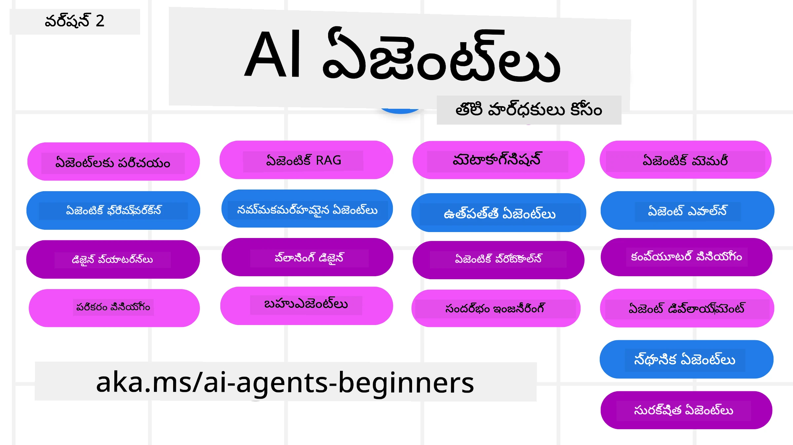

# ప్రారంభికులకు AI ఏజెంట్లు - కోర్సు



## AI ఏజెంట్లు నిర్మించటం ప్రారంభించడానికి మీరు తెలుసుకోవలసిన ప్రతిదీ నేర్పించే కోర్సు

[](https://github.com/microsoft/ai-agents-for-beginners/blob/master/LICENSE?WT.mc_id=academic-105485-koreyst)
[](https://GitHub.com/microsoft/ai-agents-for-beginners/graphs/contributors/?WT.mc_id=academic-105485-koreyst)
[](https://GitHub.com/microsoft/ai-agents-for-beginners/issues/?WT.mc_id=academic-105485-koreyst)
[](https://GitHub.com/microsoft/ai-agents-for-beginners/pulls/?WT.mc_id=academic-105485-koreyst)
[](http://makeapullrequest.com?WT.mc_id=academic-105485-koreyst)

### 🌐 బహుభాషా మద్దతు

#### GitHub Action ద్వారా మద్దతు (ఆటోమేటెడ్ & ఎప్పటికప్పుడు సరికొత్తగా ఉంటుంది)

<!-- CO-OP TRANSLATOR LANGUAGES TABLE START -->
[Arabic](../ar/README.md) | [Bengali](../bn/README.md) | [Bulgarian](../bg/README.md) | [Burmese (Myanmar)](../my/README.md) | [Chinese (Simplified)](../zh-CN/README.md) | [Chinese (Traditional, Hong Kong)](../zh-HK/README.md) | [Chinese (Traditional, Macau)](../zh-MO/README.md) | [Chinese (Traditional, Taiwan)](../zh-TW/README.md) | [Croatian](../hr/README.md) | [Czech](../cs/README.md) | [Danish](../da/README.md) | [Dutch](../nl/README.md) | [Estonian](../et/README.md) | [Finnish](../fi/README.md) | [French](../fr/README.md) | [German](../de/README.md) | [Greek](../el/README.md) | [Hebrew](../he/README.md) | [Hindi](../hi/README.md) | [Hungarian](../hu/README.md) | [Indonesian](../id/README.md) | [Italian](../it/README.md) | [Japanese](../ja/README.md) | [Kannada](../kn/README.md) | [Korean](../ko/README.md) | [Lithuanian](../lt/README.md) | [Malay](../ms/README.md) | [Malayalam](../ml/README.md) | [Marathi](../mr/README.md) | [Nepali](../ne/README.md) | [Nigerian Pidgin](../pcm/README.md) | [Norwegian](../no/README.md) | [Persian (Farsi)](../fa/README.md) | [Polish](../pl/README.md) | [Portuguese (Brazil)](../pt-BR/README.md) | [Portuguese (Portugal)](../pt-PT/README.md) | [Punjabi (Gurmukhi)](../pa/README.md) | [Romanian](../ro/README.md) | [Russian](../ru/README.md) | [Serbian (Cyrillic)](../sr/README.md) | [Slovak](../sk/README.md) | [Slovenian](../sl/README.md) | [Spanish](../es/README.md) | [Swahili](../sw/README.md) | [Swedish](../sv/README.md) | [Tagalog (Filipino)](../tl/README.md) | [Tamil](../ta/README.md) | [Telugu](./README.md) | [Thai](../th/README.md) | [Turkish](../tr/README.md) | [Ukrainian](../uk/README.md) | [Urdu](../ur/README.md) | [Vietnamese](../vi/README.md)

> **స్థానికంగా క్లోనింగ్ చేయాలనుకుంటున్నారా?**
>
> ఈ రిపాజిటరీలో 50+ భాషా అనువాదాలు ఉన్నాయి, ఇవి డౌన్లోడ్ పరిమాణాన్ని గణనీయంగా పెంచుతాయి. అనువాదాలు లేకుండా క్లోన్ చేసుకోవడానికి sparse checkout ఉపయోగించండి:
>
> **Bash / macOS / Linux:**
> ```bash
> git clone --filter=blob:none --sparse https://github.com/microsoft/ai-agents-for-beginners.git
> cd ai-agents-for-beginners
> git sparse-checkout set --no-cone '/*' '!translations' '!translated_images'
> ```
>
> **CMD (Windows):**
> ```cmd
> git clone --filter=blob:none --sparse https://github.com/microsoft/ai-agents-for-beginners.git
> cd ai-agents-for-beginners
> git sparse-checkout set --no-cone "/*" "!translations" "!translated_images"
> ```
>
> దీనితో మీరు కోర్సును పూర్తి చేయడానికి కావలసిన అన్నీ అధిక వేగంగా డౌన్లోడ్ చేసుకోవచ్చు.
<!-- CO-OP TRANSLATOR LANGUAGES TABLE END -->

**మీకు అదనపు భాషా అనువాదాల మద్దతు కావాలనుకుంటే అవి ఇక్కడ [ఇక్కడ](https://github.com/Azure/co-op-translator/blob/main/getting_started/supported-languages.md) జాబితా చేయబడ్డాయి**

[](https://GitHub.com/microsoft/ai-agents-for-beginners/watchers/?WT.mc_id=academic-105485-koreyst)
[](https://GitHub.com/microsoft/ai-agents-for-beginners/network/?WT.mc_id=academic-105485-koreyst)
[](https://GitHub.com/microsoft/ai-agents-for-beginners/stargazers/?WT.mc_id=academic-105485-koreyst)

[](https://discord.gg/nTYy5BXMWG)


## 🌱 ప్రారంభించడం

ఈ కోర్సు AI ఏజెంట్లు ఎలా నిర్మించాలో ప్రాథమిక అంశాలను కవర్ చేస్తుంది. ప్రతి పాఠం దాని స్వంత అంశాన్ని అందిస్తుంది కాబట్టి మీరు ఇష్టమైన చోట ప్రారంభించండి!

ఈ కోర్సుకు బహুভాషా మద్దతు ఉంది. మా [అందుబాటులో ఉన్న భాషల তালికా](../..) చూడండి.

మీరు మొదటిసారి జనరేటివ్ AI మోడల్స్‌తో పనిచేస్తున్నట్లయితే, మా [ప్రారంభికులకు జనరేటివ్ AI](https://aka.ms/genai-beginners) కోర్సు చూడండి, దీనిలో జనరేటివ్ AI తో నిర్మించుటపై 21 పాఠాలు ఉన్నాయి.

దయచేసి ఈ రిపోజిటరీను [⭐ స్టార్ చేయడం (🌟)](https://docs.github.com/en/get-started/exploring-projects-on-github/saving-repositories-with-stars?WT.mc_id=academic-105485-koreyst) మరియు [ఫోর্ক్ చేయండి](https://github.com/microsoft/ai-agents-for-beginners/fork) కోడును నడపడానికి.

### ఇతర అభ్యాసకులను కలవండి, మీ ప్రశ్నలకు సమాధానాలు పొందండి

మీరు ఇబ్బంది పడితే లేదా AI ఏజెంట్లు గూర్చి ఏదైనా ప్రశ్నలు ఉంటే, Microsoft Foundry Discord లోని మా ప్రత్యేక Discord చానెల్‌లో చేరండి: [Microsoft Foundry Discord](https://aka.ms/ai-agents/discord)

### అవసరమైనవి

ఈ కోర్సులో ప్రతి పాఠంలో కోడ్ ఉదాహరణలు ఉంటాయి, అవి code_samples ఫోల్డర్‌లో ఉన్నాయి. మీరు మీ స్వంత కాపీని సృష్టించడానికి [ఈ రిపోను ఫోర్క్ చేయవచ్చు](https://github.com/microsoft/ai-agents-for-beginners/fork).

ఈ వ్యాయామాలలోని కోడ్ ఉదాహరణలు Microsoft Agent Framework ని Azure AI Foundry Agent సర్వీస్ V2 తో ఉపయోగిస్తాయి:

- [Microsoft Foundry](https://aka.ms/ai-agents-beginners/ai-foundry) - Azure ఖాతా అవసరం

ఈ కోర్సు Microsoft నుండి ఈ క్రింది AI ఏజెంట్ ఫ్రేమ్‌వర్క్‌లు మరియు సర్వీస్‌లను ఉపయోగిస్తుంది:

- [Microsoft Agent Framework (MAF)](https://aka.ms/ai-agents-beginners/agent-framewrok)
- [Azure AI Foundry Agent Service V2](https://aka.ms/ai-agents-beginners/ai-agent-service)


ఈ కోర్సు కోసం కోడ్ నడిపించుటకు మరిన్ని సమాచారం కావాలంటే, [కోర్స్ సెటప్](./00-course-setup/README.md) చూడండి.

## 🙏 సహాయం చేయాలనుకుంటున్నారా?

మీకు సూచనలు ఉంటే లేదా వ్రాయుటలో తప్పులు లేదా కోడ్ లో తప్పులు కనుగొన్నట్లయితే, [సమస్యను రైజ్ చేయండి](https://github.com/microsoft/ai-agents-for-beginners/issues?WT.mc_id=academic-105485-koreyst) లేదా [పుల్-రేక్వెస్ట్ సృష్టించండి](https://github.com/microsoft/ai-agents-for-beginners/pulls?WT.mc_id=academic-105485-koreyst)


## 📂 ప్రతి పాఠం లో ఉంటాయి

- README లో ఒక వ్రాత పాఠం మరియు ఒక చిన్న వీడియో
- Microsoft Agent Framework తో Azure AI Foundry ఉపయోగించి Python కోడ్ నమూనాలు
- మీ అభ్యాసాన్ని కొనసాగించడానికి అదనపు వనరులకు లింకులు


## 🗃️ పాఠాలు

| **పాఠం**                                      | **వ్రాత & కోడ్**                                     | **వీడియో**                                                 | **అతిరేక అధ్యయనం**                                                                 |
|----------------------------------------------|----------------------------------------------------|------------------------------------------------------------|----------------------------------------------------------------------------------------|
| AI ఏజెంట్లు మరియు ఏజెంట్ ఉపయోగకారక ఛరిత్రల పరిచయం | [లింక్](./01-intro-to-ai-agents/README.md)          | [వీడియో](https://youtu.be/3zgm60bXmQk?si=z8QygFvYQv-9WtO1)  | [లింక్](https://aka.ms/ai-agents-beginners/collection?WT.mc_id=academic-105485-koreyst) |
| AI ఏజెంటిక్ ఫ్రేమ్‌వర్క్‌లు అన్వేషణ            | [లింక్](./02-explore-agentic-frameworks/README.md)  | [వీడియో](https://youtu.be/ODwF-EZo_O8?si=Vawth4hzVaHv-u0H)  | [లింక్](https://aka.ms/ai-agents-beginners/collection?WT.mc_id=academic-105485-koreyst) |
| AI ఏజెంటిక్ డిజైన్ ప్యాటర్న్ల అర్థం చేసుకోవడం   | [లింక్](./03-agentic-design-patterns/README.md)     | [వీడియో](https://youtu.be/m9lM8qqoOEA?si=BIzHwzstTPL8o9GF)  | [లింక్](https://aka.ms/ai-agents-beginners/collection?WT.mc_id=academic-105485-koreyst) |
| టూల్ వినియోగ డిజైన్ ప్యాటర్న్                  | [లింక్](./04-tool-use/README.md)                    | [వీడియో](https://youtu.be/vieRiPRx-gI?si=2z6O2Xu2cu_Jz46N)  | [లింక్](https://aka.ms/ai-agents-beginners/collection?WT.mc_id=academic-105485-koreyst) |
| ఏజెంటిక్ RAG                                  | [లింక్](./05-agentic-rag/README.md)                 | [వీడియో](https://youtu.be/WcjAARvdL7I?si=gKPWsQpKiIlDH9A3)  | [లింక్](https://aka.ms/ai-agents-beginners/collection?WT.mc_id=academic-105485-koreyst) |
| నమ్మకమైన AI ఏజెంట్లు నిర్మించడం                 | [లింక్](./06-building-trustworthy-agents/README.md) | [వీడియో](https://youtu.be/iZKkMEGBCUQ?si=jZjpiMnGFOE9L8OK ) | [లింక్](https://aka.ms/ai-agents-beginners/collection?WT.mc_id=academic-105485-koreyst) |
| ప్లానింగ్ డిజైన్ ప్యాటర్న్                      | [లింక్](./07-planning-design/README.md)             | [వీడియో](https://youtu.be/kPfJ2BrBCMY?si=6SC_iv_E5-mzucnC)  | [లింక్](https://aka.ms/ai-agents-beginners/collection?WT.mc_id=academic-105485-koreyst) |
| బహుఎజెంట్ డిజైన్ ప్యాటర్న్                    | [లింక్](./08-multi-agent/README.md)                 | [వీడియో](https://youtu.be/V6HpE9hZEx0?si=rMgDhEu7wXo2uo6g)  | [లింక్](https://aka.ms/ai-agents-beginners/collection?WT.mc_id=academic-105485-koreyst) |
| మెటాకాగ్నిషన్ డిజైన్ ప్యాటర్న్                  | [లింక్](./09-metacognition/README.md)               | [వీడియో](https://youtu.be/His9R6gw6Ec?si=8gck6vvdSNCt6OcF)  | [లింక్](https://aka.ms/ai-agents-beginners/collection?WT.mc_id=academic-105485-koreyst) |
| ఉత్పత్తిలో AI ఏజెంట్లు                      | [లింక్](./10-ai-agents-production/README.md)        | [వీడియో](https://youtu.be/l4TP6IyJxmQ?si=31dnhexRo6yLRJDl)  | [లింక్](https://aka.ms/ai-agents-beginners/collection?WT.mc_id=academic-105485-koreyst) |
| ఏజెంటిక్ ప్రోటోకాల్‌లు ఉపయోగించడం (MCP, A2A మరియు NLWeb) | [లింక్](./11-agentic-protocols/README.md)           | [వీడియో](https://youtu.be/X-Dh9R3Opn8)                                 | [లింక్](https://aka.ms/ai-agents-beginners/collection?WT.mc_id=academic-105485-koreyst) |
| AI ఏజెంట్లు కోసం సందర్భ ఇంజనీరింగ్            | [లింక్](./12-context-engineering/README.md)         | [వీడియో](https://youtu.be/F5zqRV7gEag)                                 | [లింక్](https://aka.ms/ai-agents-beginners/collection?WT.mc_id=academic-105485-koreyst) |
| ఏజెంటిక్ మెమరీ నిర్వహణ                      | [లింక్](./13-agent-memory/README.md)     |      [వీడియో](https://youtu.be/QrYbHesIxpw?si=vZkVwKrQ4ieCcIPx)                                                      |                                                                                        |
| Microsoft ఏజెంట్ ఫ్రేమ్‌వర్క్ అన్వేషణ                         | [లింక్](./14-microsoft-agent-framework/README.md)                            |                                                            |                                                                                        |
| కంప్యూటర్ యూజ్ ఏజెంట్ల నిర్మాణం (CUA)           | త్వరలో రాబోతోంది                            |                                                            |                                                                                        |
| స్కేలబుల్ ఏజెంట్ల వినియోగం                   | త్వరలో రాబోతోంది                            |                                                            |                                                                                        |
| లోకల్ AI ఏజెంట్ల సృష్టి                     | త్వరలో రాబోతోంది                               |                                                            |                                                                                        |
| AI ఏజెంట్ల భద్రత                           | త్వరలో రాబోతోంది                               |                                                            |                                                                                        |

## 🎒 ఇతర కోర్సులు

మన బృందం ఇతర కోర్సులను తయారుచేస్తోంది! పరిశీలించండి:

<!-- CO-OP TRANSLATOR OTHER COURSES START -->
### లాంగ్‌చెయిన్
[](https://aka.ms/langchain4j-for-beginners)
[](https://aka.ms/langchainjs-for-beginners?WT.mc_id=m365-94501-dwahlin)
[](https://github.com/microsoft/langchain-for-beginners?WT.mc_id=m365-94501-dwahlin)
---

### అజ్యూర్ / ఎడ్జ్ / MCP / ఏజెంట్లు
[](https://github.com/microsoft/AZD-for-beginners?WT.mc_id=academic-105485-koreyst)
[](https://github.com/microsoft/edgeai-for-beginners?WT.mc_id=academic-105485-koreyst)
[](https://github.com/microsoft/mcp-for-beginners?WT.mc_id=academic-105485-koreyst)
[](https://github.com/microsoft/ai-agents-for-beginners?WT.mc_id=academic-105485-koreyst)

---
 
### జనరేటివ్ AI సిరీస్
[](https://github.com/microsoft/generative-ai-for-beginners?WT.mc_id=academic-105485-koreyst)
[-9333EA?style=for-the-badge&labelColor=E5E7EB&color=9333EA)](https://github.com/microsoft/Generative-AI-for-beginners-dotnet?WT.mc_id=academic-105485-koreyst)
[-C084FC?style=for-the-badge&labelColor=E5E7EB&color=C084FC)](https://github.com/microsoft/generative-ai-for-beginners-java?WT.mc_id=academic-105485-koreyst)
[-E879F9?style=for-the-badge&labelColor=E5E7EB&color=E879F9)](https://github.com/microsoft/generative-ai-with-javascript?WT.mc_id=academic-105485-koreyst)

---
 
### కోర్ లెర్నింగ్
[](https://aka.ms/ml-beginners?WT.mc_id=academic-105485-koreyst)
[](https://aka.ms/datascience-beginners?WT.mc_id=academic-105485-koreyst)
[](https://aka.ms/ai-beginners?WT.mc_id=academic-105485-koreyst)
[](https://github.com/microsoft/Security-101?WT.mc_id=academic-96948-sayoung)
[](https://aka.ms/webdev-beginners?WT.mc_id=academic-105485-koreyst)
[](https://aka.ms/iot-beginners?WT.mc_id=academic-105485-koreyst)
[](https://github.com/microsoft/xr-development-for-beginners?WT.mc_id=academic-105485-koreyst)

---
 
### కోపైలట్ సిరీస్
[](https://aka.ms/GitHubCopilotAI?WT.mc_id=academic-105485-koreyst)
[](https://github.com/microsoft/mastering-github-copilot-for-dotnet-csharp-developers?WT.mc_id=academic-105485-koreyst)
[](https://github.com/microsoft/CopilotAdventures?WT.mc_id=academic-105485-koreyst)
<!-- CO-OP TRANSLATOR OTHER COURSES END -->

## 🌟 కమ్యూనిటీ ధన్యవాదాలు

Agentic RAG ని సూచించే ముఖ్యమైన కోడ్ నమూనాలను ఇవ్వడానికి [శివం గోయల్](https://www.linkedin.com/in/shivam2003/) కు ధన్యవాదాలు.

## సహకారం

ఈ ప్రాజెక్ట్ లో సహకారం మరియు సూచనలను స్వాగతిస్తారు. ఎక్కువ సహకారాలకు మీరు Contributor License Agreement (CLA) కి అంగీకరించాల్సి ఉంటుంది, మీరు మీ సహకారాన్ని ఉపయోగించుకునే హక్కులు కలిగి ఉన్నారని మరియు నిజంగా వాటిని మాకు ఇచ్చాయని ప్రకటించేలా. వివరాలకి చూడండి <https://cla.opensource.microsoft.com>.

మీరు ఒక పుల్ రిక్వెస్ట్ పంపినప్పుడు, CLA బాట్ స్వయంచాలకంగా మీరు CLA అందించాల్సిన అవసరం ఉందని నిర్ణయించి, PRను అవసరమైన విధంగా (ఉదా: స్థితి చెక్, వ్యాఖ్య) అలంకరించును. బాట్ ఇచ్చే సూచనలను పాటించండి. మా CLA ఉపయోగించే అన్ని రెపోలలో మీరు ఈ దశను ఒకసారి మాత్రమే చేయాలి.

ఈ ప్రాజెక్ట్ Microsoft Open Source Code of Conduct ను ఏకీకృతం చేసుకుంది (<https://opensource.microsoft.com/codeofconduct/>). మరింత సమాచారం కోసం ఆ కోడ్ ఆఫ్ కెండెక్ట్ FAQ(<https://opensource.microsoft.com/codeofconduct/faq/>) చూడండి లేదా [opencode@microsoft.com](mailto:opencode@microsoft.com) కి ఏవైనా అదనపు ప్రశ్నలు లేదా వ్యాఖ్యల కోసం సంప్రదించండి.

## ట్రేడ్‌మార్కులు

ఈ ప్రాజెక్ట్ లో ప్రాజెక్టులు, ఉత్పత్తులు లేదా సేవల ట్రేడ్‌మార్కులు లేదా లోగోలు ఉండవచ్చు. Microsoft ట్రేడ్‌మార్కులకు అనుమతి పొందిన వాడుక [Microsoft ట్రేడ్‌మార్క్ & బ్రాండ్ మార్గదర్శకాలు](https://www.microsoft.com/legal/intellectualproperty/trademarks/usage/general) ను పాటించాల్సినది. ఈ ప్రాజెక్ట్ సవరించిన సంస్కరణలలో Microsoft ట్రేడ్‌మార్కులు లేదా లోగోల వాడుక Microsoft స్పాన్సర్షిప్ బట్టి కల్పన కలగకూడదు. మూడవ పక్ష ట్రేడ్‌మార్కులు లేదా లోగోల వాడుక ఆ మూడవ పక్షాల విధానాల ఆధీనంలో ఉంటుంది.

## సహాయాన్ని పొందడం

AI అప్లికేషన్లు నిర్మించే విషయంలో మీరు ఇబ్బంది పడితే లేదా ఏవైనా ప్రశ్నలు ఉంటే:

[](https://aka.ms/foundry/discord)

ఉత్పత్తి అభిప్రాయం లేదా నిర్మాణ సమయంలో లోపాల గురించి సందేశాలు ఉంటే సందర్శించండి:

[](https://aka.ms/foundry/forum)

---

<!-- CO-OP TRANSLATOR DISCLAIMER START -->
**డిస్క్లెయిమర్**:  
ఈ దస్త్రాన్ని AI అనువాద సేవ [Co-op Translator](https://github.com/Azure/co-op-translator) ఉపయోగించి అనువదించబడింది. మేము సరిగ్గా అనువదించడానికి ప్రయత్నించినప్పటికీ, ఆటోమేటెడ్ అనువాదాల్లో పొరపాట్లు లేదా తప్పిదాలు ఉండే అవకాశం ఉంది. మూల భాషలో ఉన్న అసలు దస్త్రం అధికారికమైన వనరుగా పరిగణించాలి. ముఖ్యమైన సమాచారం కోసం వృత్తిపరమైన మానవ అనువాదాన్ని సిఫార్సు చేస్తాము. ఈ అనువాదం ఉపయోగంలో వచ్చే ఏదైనా అవగాహన లోపాలు లేదా తప్పుదోషాల కోసం మేము బాధ్యతను కోరుకోమేము.
<!-- CO-OP TRANSLATOR DISCLAIMER END -->