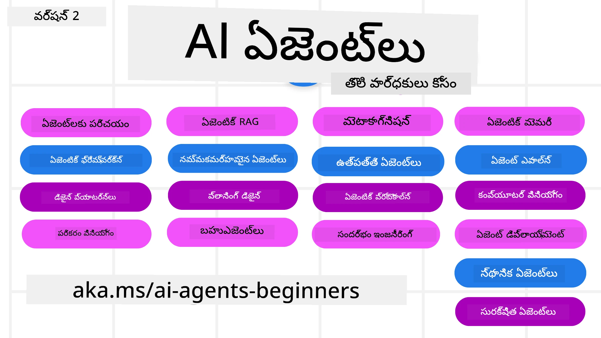

# ప్రారంభకులకు AI ఏజెంట్లు - కోర్సు



## AI ఏజెంట్లను నిర్మించడం ప్రారంభించడానికి అవసరమైన అన్ని విషయాలను నేర్పించే కోర్సు

[](https://github.com/microsoft/ai-agents-for-beginners/blob/master/LICENSE?WT.mc_id=academic-105485-koreyst)
[](https://GitHub.com/microsoft/ai-agents-for-beginners/graphs/contributors/?WT.mc_id=academic-105485-koreyst)
[](https://GitHub.com/microsoft/ai-agents-for-beginners/issues/?WT.mc_id=academic-105485-koreyst)
[](https://GitHub.com/microsoft/ai-agents-for-beginners/pulls/?WT.mc_id=academic-105485-koreyst)
[](http://makeapullrequest.com?WT.mc_id=academic-105485-koreyst)

### 🌐 బహుభాషా మద్దతు

#### GitHub చర్య ద్వారా మద్దతు (ఆటోమేటెడ్ & ఎల్లప్పుడూ తాజా)

<!-- CO-OP TRANSLATOR LANGUAGES TABLE START -->
[Arabic](../ar/README.md) | [Bengali](../bn/README.md) | [Bulgarian](../bg/README.md) | [Burmese (Myanmar)](../my/README.md) | [Chinese (Simplified)](../zh-CN/README.md) | [Chinese (Traditional, Hong Kong)](../zh-HK/README.md) | [Chinese (Traditional, Macau)](../zh-MO/README.md) | [Chinese (Traditional, Taiwan)](../zh-TW/README.md) | [Croatian](../hr/README.md) | [Czech](../cs/README.md) | [Danish](../da/README.md) | [Dutch](../nl/README.md) | [Estonian](../et/README.md) | [Finnish](../fi/README.md) | [French](../fr/README.md) | [German](../de/README.md) | [Greek](../el/README.md) | [Hebrew](../he/README.md) | [Hindi](../hi/README.md) | [Hungarian](../hu/README.md) | [Indonesian](../id/README.md) | [Italian](../it/README.md) | [Japanese](../ja/README.md) | [Kannada](../kn/README.md) | [Khmer](../km/README.md) | [Korean](../ko/README.md) | [Lithuanian](../lt/README.md) | [Malay](../ms/README.md) | [Malayalam](../ml/README.md) | [Marathi](../mr/README.md) | [Nepali](../ne/README.md) | [Nigerian Pidgin](../pcm/README.md) | [Norwegian](../no/README.md) | [Persian (Farsi)](../fa/README.md) | [Polish](../pl/README.md) | [Portuguese (Brazil)](../pt-BR/README.md) | [Portuguese (Portugal)](../pt-PT/README.md) | [Punjabi (Gurmukhi)](../pa/README.md) | [Romanian](../ro/README.md) | [Russian](../ru/README.md) | [Serbian (Cyrillic)](../sr/README.md) | [Slovak](../sk/README.md) | [Slovenian](../sl/README.md) | [Spanish](../es/README.md) | [Swahili](../sw/README.md) | [Swedish](../sv/README.md) | [Tagalog (Filipino)](../tl/README.md) | [Tamil](../ta/README.md) | [Telugu](./README.md) | [Thai](../th/README.md) | [Turkish](../tr/README.md) | [Ukrainian](../uk/README.md) | [Urdu](../ur/README.md) | [Vietnamese](../vi/README.md)

> **స్తానికంగా క్లోన్ చేయడాన్ని ఇష్టపడతారా?**
>
> ఈ రిపోజిటరీలో 50+ భాషా అనువాదాలు ఉన్నాయి, ఇవి డౌన్‌లోడ్ పరిమాణాన్ని గణనీయంగా పెంచుతాయి. అనువాదాలు లేకుండా క్లోన్ చేయడానికి, స్పార్స్ చెకౌట్ ఉపయోగించండి:
>
> **బాష్ / macOS / లినక్స్:**
> ```bash
> git clone --filter=blob:none --sparse https://github.com/microsoft/ai-agents-for-beginners.git
> cd ai-agents-for-beginners
> git sparse-checkout set --no-cone '/*' '!translations' '!translated_images'
> ```
>
> **CMD (విండోస్):**
> ```cmd
> git clone --filter=blob:none --sparse https://github.com/microsoft/ai-agents-for-beginners.git
> cd ai-agents-for-beginners
> git sparse-checkout set --no-cone "/*" "!translations" "!translated_images"
> ```
>
> ఇది కోర్సును పూర్తి చేయడానికి అవసరమైన అన్ని విషయాలను కావాలసిన వేగవంతమైన డౌన్‌లోడ్‌తో ఇస్తుంది.
<!-- CO-OP TRANSLATOR LANGUAGES TABLE END -->

**మీకు అదనపు అనువాద భాషల మద్దతు కావాలంటే, అవి [ఇక్కడ](https://github.com/Azure/co-op-translator/blob/main/getting_started/supported-languages.md) అందుబాటులో ఉన్నాయి.**

[](https://GitHub.com/microsoft/ai-agents-for-beginners/watchers/?WT.mc_id=academic-105485-koreyst)
[](https://GitHub.com/microsoft/ai-agents-for-beginners/network/?WT.mc_id=academic-105485-koreyst)
[](https://GitHub.com/microsoft/ai-agents-for-beginners/stargazers/?WT.mc_id=academic-105485-koreyst)

[](https://discord.com/invite/ATgtXmAS5D)


## 🌱 ప్రారంభించండి

ఈ కోర్సులో AI ఏజెంట్లను నిర్మించడానికి మూలాంశాలపై పాఠాలు ఉన్నాయి. ప్రతి పాఠం తన స్వంత విషయాన్ని కవర్ చేస్తుంది కాబట్టి మీరు మీ ఇష్టమైన చోట ఎక్కడైనా మొదలు పెట్టండి!

ఈ కోర్సుకు బహుభాషా మద్దతు ఉంది. మా [అందుబాటులో ఉన్న భాషల ](#-multi-language-support)వైపు వెళ్లండి.

ఇది మీ మొదటి సారి జనరేటివ్ AI మోడల్స్‌తో నిర్మించడం అయితే, మా [Generative AI For Beginners](https://aka.ms/genai-beginners) కోర్సును చూడండి, ఇందులో GenAIతో నిర్మించడానికి 21 పాఠాలు ఉన్నాయి.

ఈ రిపోను [నక్షత్రం (🌟) పెట్టడం](https://docs.github.com/en/get-started/exploring-projects-on-github/saving-repositories-with-stars?WT.mc_id=academic-105485-koreyst) మరియు కోడ్ నడపడానికి [ఫోర్క్ చేయడం](https://github.com/microsoft/ai-agents-for-beginners/fork) మరువవద్దు.

### ఇతర అభ్యసకులను కలవండి, మీ ప్రశ్నలకు సమాధానాలు పొందండి

మీరు చిక్కుకున్నట్లయితే లేదా AI ఏజెంట్ల నిర్మాణంపై ఏవైనా ప్రశ్నలు ఉంటే, మా ప్రత్యేక Discord ఛానల్ లో చేరండి [Microsoft Foundry Discord](https://aka.ms/ai-agents/discord).

### మీకు అవసరం ఏమి ఉంది

ఈ కోర్సులోని ప్రతి పాఠంలో కోడ్ ఉదాహరణలు ఉంటాయి, అవి code_samples ఫోల్డర్‌లో లభ్యమవుతాయి. మీరు [ఈ రిపోను ఫోర్క్](https://github.com/microsoft/ai-agents-for-beginners/fork) చేయవచ్చు మీ స్వంత కాపీ సృష్టించడానికి.

ఈ వ్యాయామాలలోని కోడ్ ఉదాహరణలు Microsoft Agent Framework ని Microsoft Foundry Agent Service V2 తో ఉపయోగిస్తున్నాయి:

- [Microsoft Foundry](https://aka.ms/ai-agents-beginners/ai-foundry) - Azure ఖాతా అవసరం

ఈ కోర్సులో క్రింది Microsoft AI ఏజెంట్ ఫ్రేమ్‌వర్క్‌లు మరియు సేవలను ఉపయోగిస్తారు:

- [Microsoft Agent Framework (MAF)](https://aka.ms/ai-agents-beginners/agent-framework)
- [Microsoft Foundry Agent Service V2](https://aka.ms/ai-agents-beginners/ai-agent-service)

కొన్ని కోడ్ నమూనాలు [MiniMax](https://platform.minimaxi.com/) వంటి OpenAI-పాటుగా ఉన్న ప్రత్యామ్నాయ ప్రొవైడర్లను కూడా మద్దతు ఇస్తాయి, ఇది పెద్ద కంటెంట్ మోడల్స్ (204K టోకెన్ల వరకు) అందిస్తుంది. కాన్ఫిగరేషన్ వివరాలకు [Course Setup](./00-course-setup/README.md) చూడండి.

ఈ కోర్సు కోసం కోడ్ నడపడానికి మరిన్ని సమాచారం కోసం [Course Setup](./00-course-setup/README.md) చూడండి.

## 🙏 సహాయం చేయాలా?

మీకు సలహాలు ఉన్నాయా లేదా ఎటువంటి స్ఫెల్లింగ్ లేదా కోడ్ లో తప్పులు కనుగొన్నారా? [సమస్య వేయండి](https://github.com/microsoft/ai-agents-for-beginners/issues?WT.mc_id=academic-105485-koreyst) లేదా [పుల్ రిక్వెస్ట్ సృష్టించండి](https://github.com/microsoft/ai-agents-for-beginners/pulls?WT.mc_id=academic-105485-koreyst)


## 📂 ప్రతి పాఠం ఇంతే ఉంటుంది

- README లో వ్రాత పాఠం మరియు చిన్న వీడియో
- Microsoft Agent Framework తో Microsoft Foundry ఉపయోగించి Python కోడ్ ఉదాహరణలు
- మీ నేర్చుకునే పనిని కొనసాగించడానికి అదనపు వనరులకు లింకులు


## 🗃️ పాఠాలు

| **పాఠం**                                    | **వ్రాత & కోడ్**                                     | **వీడియో**                                                   | **అదనపు నేర్పు**                                                                       |
|----------------------------------------------|----------------------------------------------------|------------------------------------------------------------|----------------------------------------------------------------------------------------|
| AI ఏజెంట్లు మరియు ఏజెంట్ వినియోగ సందర్భాలకు పరిచయం       | [లింక్](./01-intro-to-ai-agents/README.md)           | [వీడియో](https://youtu.be/3zgm60bXmQk?si=z8QygFvYQv-9WtO1)    | [లింక్](https://aka.ms/ai-agents-beginners/collection?WT.mc_id=academic-105485-koreyst) |
| AI ఏజెంటిక్ ఫ్రేమ్‌వర్క్స్ అన్వేషణ                    | [లింక్](./02-explore-agentic-frameworks/README.md)     | [వీడియో](https://youtu.be/ODwF-EZo_O8?si=Vawth4hzVaHv-u0H)    | [లింక్](https://aka.ms/ai-agents-beginners/collection?WT.mc_id=academic-105485-koreyst) |
| AI ఏజెంటిక్ డిజైన్ ప్యాటర్న్స్ అర్థం చేసుకోవడం           | [లింక్](./03-agentic-design-patterns/README.md)        | [వీడియో](https://youtu.be/m9lM8qqoOEA?si=BIzHwzstTPL8o9GF)      | [లింక్](https://aka.ms/ai-agents-beginners/collection?WT.mc_id=academic-105485-koreyst) |
| టూల్ ఉపయోగ డిజైన్ ప్యాటర్న్                              | [లింక్](./04-tool-use/README.md)                       | [వీడియో](https://youtu.be/vieRiPRx-gI?si=2z6O2Xu2cu_Jz46N)    | [లింక్](https://aka.ms/ai-agents-beginners/collection?WT.mc_id=academic-105485-koreyst) |
| ఏజెంటిక్ RAG                                                | [లింక్](./05-agentic-rag/README.md)                    | [వీడియో](https://youtu.be/WcjAARvdL7I?si=gKPWsQpKiIlDH9A3)    | [లింక్](https://aka.ms/ai-agents-beginners/collection?WT.mc_id=academic-105485-koreyst) |
| నమ్మదగిన AI ఏజెంట్లను నిర్మించడం                           | [లింక్](./06-building-trustworthy-agents/README.md)    | [వీడియో](https://youtu.be/iZKkMEGBCUQ?si=jZjpiMnGFOE9L8OK )   | [లింక్](https://aka.ms/ai-agents-beginners/collection?WT.mc_id=academic-105485-koreyst) |
| ప్రణాళిక డిజైన్ ప్యాటర్న్                                  | [లింక్](./07-planning-design/README.md)                | [వీడియో](https://youtu.be/kPfJ2BrBCMY?si=6SC_iv_E5-mzucnC)    | [లింక్](https://aka.ms/ai-agents-beginners/collection?WT.mc_id=academic-105485-koreyst) |
| బహుఏజెంట్ డిజైన్ ప్యాటర్న్                                | [లింక్](./08-multi-agent/README.md)                    | [వీడియో](https://youtu.be/V6HpE9hZEx0?si=rMgDhEu7wXo2uo6g)    | [లింక్](https://aka.ms/ai-agents-beginners/collection?WT.mc_id=academic-105485-koreyst) |

| మెటాకాగ్నిషన్ డిజైన్ ప్యాటర్న్                 | [లింక్](./09-metacognition/README.md)               | [వీడియో](https://youtu.be/His9R6gw6Ec?si=8gck6vvdSNCt6OcF)  | [లింక్](https://aka.ms/ai-agents-beginners/collection?WT.mc_id=academic-105485-koreyst) |
| ఉత్పాదనలో AI ఏజెంట్స్                      | [లింక్](./10-ai-agents-production/README.md)        | [వీడియో](https://youtu.be/l4TP6IyJxmQ?si=31dnhexRo6yLRJDl)  | [లింక్](https://aka.ms/ai-agents-beginners/collection?WT.mc_id=academic-105485-koreyst) |
| ఏజెంటిక్ ప్రోటోకాళ్లను ఉపయోగించడం (MCP, A2A మరియు NLWeb) | [లింక్](./11-agentic-protocols/README.md)           | [వీడియో](https://youtu.be/X-Dh9R3Opn8)                                 | [లింక్](https://aka.ms/ai-agents-beginners/collection?WT.mc_id=academic-105485-koreyst) |
| AI ఏజెంట్స్ కోసం కాంటెక్స్ట్ ఇంజనీరింగ్            | [లింక్](./12-context-engineering/README.md)         | [వీడియో](https://youtu.be/F5zqRV7gEag)                                 | [లింక్](https://aka.ms/ai-agents-beginners/collection?WT.mc_id=academic-105485-koreyst) |
| ఏజెంటిక్ మెమరీ నిర్వహణ                      | [లింక్](./13-agent-memory/README.md)     |      [వీడియో](https://youtu.be/QrYbHesIxpw?si=vZkVwKrQ4ieCcIPx)                                                      |                                                                                        |
| మైక్రోసాఫ్ట్ ఏజెంట్ ఫ్రేమ్‌వర్క్ ను అన్వేషణ                        | [లింక్](./14-microsoft-agent-framework/README.md)                            |                                                            |                                                                                        |
| కంప్యూటర్ ఉపయోగం ఏజెంట్స్ (CUA) నిర్మాణం           | [లింక్](./15-browser-use/README.md)     |                                                            | [లింక్](https://docs.browser-use.com/examples/templates/playwright-integration)         |
| స్కేలబుల్ ఏజెంట్స్ ను అమలు చేయడం                    | సత్వరం రాబోతోంది                            |                                                            |                                                                                        |
| స్థానిక AI ఏజెంట్స్ సృష్టించడం                     | సత్వరం రాబోతోంది                               |                                                            |                                                                                        |
| AI ఏజెంట్స్ సురక్షితం చేయడం                           | [లింక్](./18-securing-ai-agents/README.md)  |                                                            | [లింక్](https://aka.ms/ai-agents-beginners/collection?WT.mc_id=academic-105485-koreyst) |

## 🎒 ఇతర కోర్సులు

మా జట్టు ఇతర కోర్సులను తయారుచేస్తోంది! చూడండి:

<!-- CO-OP TRANSLATOR OTHER COURSES START -->
### లాంగ్ చైన్
[](https://aka.ms/langchain4j-for-beginners)
[](https://aka.ms/langchainjs-for-beginners?WT.mc_id=m365-94501-dwahlin)
[](https://github.com/microsoft/langchain-for-beginners?WT.mc_id=m365-94501-dwahlin)
---

### అజ్యూల్ / ఎడ్జ్ / MCP / ఏజెంట్స్
[](https://github.com/microsoft/AZD-for-beginners?WT.mc_id=academic-105485-koreyst)
[](https://github.com/microsoft/edgeai-for-beginners?WT.mc_id=academic-105485-koreyst)
[](https://github.com/microsoft/mcp-for-beginners?WT.mc_id=academic-105485-koreyst)
[](https://github.com/microsoft/ai-agents-for-beginners?WT.mc_id=academic-105485-koreyst)

---
 
### జనరేటివ్ AI సిరీస్
[](https://github.com/microsoft/generative-ai-for-beginners?WT.mc_id=academic-105485-koreyst)
[-9333EA?style=for-the-badge&labelColor=E5E7EB&color=9333EA)](https://github.com/microsoft/Generative-AI-for-beginners-dotnet?WT.mc_id=academic-105485-koreyst)
[-C084FC?style=for-the-badge&labelColor=E5E7EB&color=C084FC)](https://github.com/microsoft/generative-ai-for-beginners-java?WT.mc_id=academic-105485-koreyst)
[-E879F9?style=for-the-badge&labelColor=E5E7EB&color=E879F9)](https://github.com/microsoft/generative-ai-with-javascript?WT.mc_id=academic-105485-koreyst)

---
 
### కోర్ లెర్నింగ్
[](https://aka.ms/ml-beginners?WT.mc_id=academic-105485-koreyst)
[](https://aka.ms/datascience-beginners?WT.mc_id=academic-105485-koreyst)
[](https://aka.ms/ai-beginners?WT.mc_id=academic-105485-koreyst)
[](https://github.com/microsoft/Security-101?WT.mc_id=academic-96948-sayoung)
[](https://aka.ms/webdev-beginners?WT.mc_id=academic-105485-koreyst)
[](https://aka.ms/iot-beginners?WT.mc_id=academic-105485-koreyst)
[](https://github.com/microsoft/xr-development-for-beginners?WT.mc_id=academic-105485-koreyst)

---
 
### కోపైలట్ సిరీస్
[](https://aka.ms/GitHubCopilotAI?WT.mc_id=academic-105485-koreyst)
[](https://github.com/microsoft/mastering-github-copilot-for-dotnet-csharp-developers?WT.mc_id=academic-105485-koreyst)
[](https://github.com/microsoft/CopilotAdventures?WT.mc_id=academic-105485-koreyst)
<!-- CO-OP TRANSLATOR OTHER COURSES END -->

## 🌟 కమ్యూనిటీ ధన్యవాదాలు

Agentic RAG ని ప్రదర్శించే ముఖ్యమైన కోడ్ నమూనాలు సహకరించినందుకు [Shivam Goyal](https://www.linkedin.com/in/shivam2003/) కు ధన్యవాదాలు.

## సహకారం

ఈ ప్రాజెక్టుకు సహకారాలు మరియు సూచనలు స్వాగతం. ఎక్కువగా సహకారాలు, మీరు నిజంగా హక్కు కలిగి ఉన్నారని మరియు మాకు
మీరు సహకపు హక్కులను వేరుగా ఇవ్వాలని ఒప్పుకునే
కంటి లైసెన్స్ ఒప్పందం (Contributor License Agreement - CLA) అవసరం. వివరాలకు, <https://cla.opensource.microsoft.com> ను సందర్శించండి.

మీరు పుల్ రిక్వెస్ట్ సమర్పించినప్పుడు, CLA బోట్ ఆటోమేటిక్‌గా మీకు డిక్లియర్ చేయాలిసిన అవసరాన్ని నిర్ణయించి
సరైనలా(ఉదాహరణకు, స్థితి తనిఖీ, వ్యాఖ్య) పుల్ రిక్వెస్టును అలంకరిస్తుంది. బోట్ అందించే నిర్వాహకాలను అనుసరించండి. మా
CLA ఉపయోగించే అన్ని రిపోస్ లో ఇది ఒకసారి చేయాల్సి ఉంటుంది.

ఈ ప్రాజెక్టు [Microsoft Open Source Code of Conduct](https://opensource.microsoft.com/codeofconduct/) ను అమలు చేసింది.
మరింత సమాచారం కోసం [Code of Conduct FAQ](https://opensource.microsoft.com/codeofconduct/faq/) ను చూడండి లేదా
[opencode@microsoft.com](mailto:opencode@microsoft.com) కు ప్రశ్నలు లేదా వ్యాఖ్యల కోసం సంప్రదించండి.

## ట్రేడ్‌మార్కులు

ఈ ప్రాజెక్ట్ లో ప్రాజెక్టులు, ఉత్పత్తులు లేదా సర్వీసులకు సంబంధించిన ట్రేడ్‌మార్కులు లేదా లోగోలు ఉండవచ్చు. మైక్రోసాఫ్ట్
ట్రేడ్‌మార్కులు లేదా లోగోలకు అంగీకృత వినియోగం, ఈ
[Microsoft's Trademark & Brand Guidelines](https://www.microsoft.com/legal/intellectualproperty/trademarks/usage/general) ను అనుసరించాలి.
ఈ ప్రాజెక్ట్ తగిలించబడిన సంస్కరణలలో Microsoft ట్రేడ్‌మార్కులు లేదా లోగోలు వాడకం గందరగోళానికి కారకమാകకూడదు లేదా Microsoft ప్రాయోజకత్వాన్ని సూచించకూడదు.
మూడవ పక్ష ట్రేడ్‌మార్కులు లేదా లోగోల వాడకం ఆ పక్ష సంస్థల విధానాలపై ఆధారపడి ఉంటుంది.

## సహాయం పొందడం


మీరు చిక్కుకున్నట్లయితే లేదా AI యాప్స్ తయారీలో ఏవైనా ప్రశ్నలు ఉంటే, చేరండి:

[](https://aka.ms/foundry/discord)

ఉత్పత్తి ఫీడ్బ్యాక్ లేదా బిల్డింగ్ సమయంలో వచ్చిన లోపాల కోసం సందర్శించండి:

[](https://aka.ms/foundry/forum)

---

<!-- CO-OP TRANSLATOR DISCLAIMER START -->
**అస్వీకరణ**:
ఈ పత్రం AI అనువాద సేవ [Co-op Translator](https://github.com/Azure/co-op-translator) ఉపయోగించి అనువదించబడింది. మేము ఖచ్చితత్వానికి ప్రయత్నిస్తున్నప్పటికీ, ఆటోమేటెడ్ అనువాదాలు తప్పులు లేదా అసమగ్రతలను కలిగి ఉండవచ్చు. దాని స్వదేశ భాషలో ఉన్న అసలు పత్రాన్ని అధికారం కలిగిన మూలంగా పరిగణించాలి. కీలకమైన సమాచారం కోసం, ప్రొఫెషనల్ మానవ అనువాదాన్ని సిఫారసు చేస్తాము. ఈ అనువాదం ఉపయోగం వల్ల కలిగే ఏవైనా అపార్థాలు లేదా తప్పుదారులు కోసం మేము బాధ్యత వహించము.
<!-- CO-OP TRANSLATOR DISCLAIMER END -->