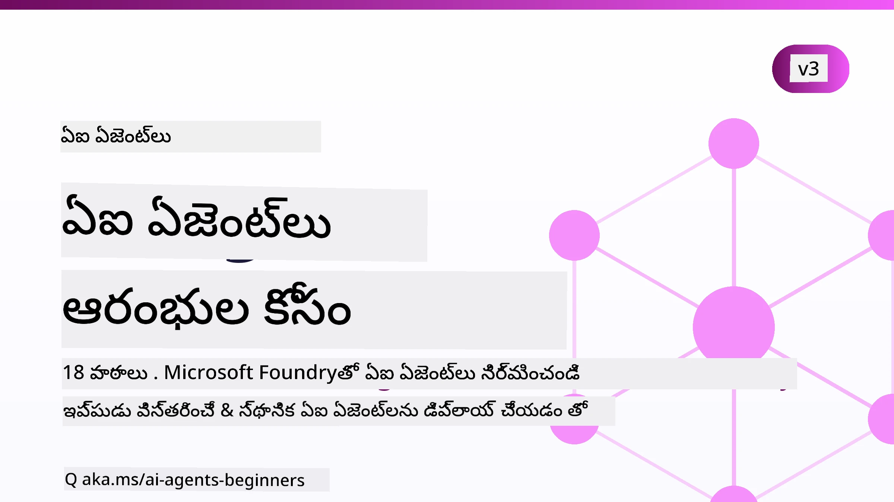

# బిగినర్స్‌ కోసం AI ఏజెంట్లు - ఒక కోర్సు



## AI ఏజెంట్లు నిర్మించడం ప్రారంభించడానికి మీకు కావలసిన అన్ని విషయాలు నేర్పించే ఒక కోర్సు

[](https://github.com/microsoft/ai-agents-for-beginners/blob/master/LICENSE?WT.mc_id=academic-105485-koreyst)
[](https://GitHub.com/microsoft/ai-agents-for-beginners/graphs/contributors/?WT.mc_id=academic-105485-koreyst)
[](https://GitHub.com/microsoft/ai-agents-for-beginners/issues/?WT.mc_id=academic-105485-koreyst)
[](https://GitHub.com/microsoft/ai-agents-for-beginners/pulls/?WT.mc_id=academic-105485-koreyst)
[](http://makeapullrequest.com?WT.mc_id=academic-105485-koreyst)

### 🌐 బహుభాషా మద్దతు

#### GitHub యాక్షన్ ద్వారా మద్దతు (ఆటోమేటెడ్ & ఎప్పుడూ అప్‌డేట్)

<!-- CO-OP TRANSLATOR LANGUAGES TABLE START -->
[ఆరబిక్](../ar/README.md) | [బెంగాలీ](../bn/README.md) | [బల్గేరియన్](../bg/README.md) | [బర్మీస్ (మ్యాన్మార్)](../my/README.md) | [చైనా (సరళీకృత)](../zh-CN/README.md) | [చైనా (సాంప్రదాయ, హాంగ్ కొంగ్)](../zh-HK/README.md) | [చైనా (సాంప్రదాయ, మాకావు)](../zh-MO/README.md) | [చైనా (సాంప్రదాయ, తైవాన్)](../zh-TW/README.md) | [క్రోవ్యాటియన్](../hr/README.md) | [చెక్](../cs/README.md) | [డానిష్](../da/README.md) | [డచ్](../nl/README.md) | [ఎస్టోనియన్](../et/README.md) | [ఫిన్నిష్](../fi/README.md) | [ఫ్రెంచ్](../fr/README.md) | [జర్మన్](../de/README.md) | [గ్రీకు](../el/README.md) | [హేబ్రూ](../he/README.md) | [హిందీ](../hi/README.md) | [హంగేరియన్](../hu/README.md) | [ఇండోనేషియన్](../id/README.md) | [ఇటాలియన్](../it/README.md) | [జపనీస్](../ja/README.md) | [కన్నడ](../kn/README.md) | [ఖ్మేర్](../km/README.md) | [కొరియన్](../ko/README.md) | [లిథువేనియన్](../lt/README.md) | [మలయాళం](../ms/README.md) | [మలయాళం](../ml/README.md) | [మరాఠీ](../mr/README.md) | [నేపాలీ](../ne/README.md) | [నైజీరియన్ పిడ్గిన్](../pcm/README.md) | [నార్వేజియన్](../no/README.md) | [ఫార్సీ (పర్షియన్)](../fa/README.md) | [పోలిష్](../pl/README.md) | [పోర్చుగీస్ (బ్రెజిల్)](../pt-BR/README.md) | [పోర్చుగీస్ (పోర్చుగల్)](../pt-PT/README.md) | [పంజాబీ (గుర్ముఖీ)](../pa/README.md) | [రోమేనియన్](../ro/README.md) | [రష్యన్](../ru/README.md) | [సెర్బియన్ (సిరిల్లిక్)](../sr/README.md) | [స్లోవాక్](../sk/README.md) | [స్లోవేనియన్](../sl/README.md) | [స్పానిష్](../es/README.md) | [స్వాహిలి](../sw/README.md) | [స్వీడిష్](../sv/README.md) | [టాగలాగ్ (ఫిలిపినో)](../tl/README.md) | [తమిళ్](../ta/README.md) | [తెలుగు](./README.md) | [థಾಯಿ](../th/README.md) | [టర్కిష్](../tr/README.md) | [ఉక్రెయిన్](../uk/README.md) | [ఉర్దూ](../ur/README.md) | [వియత్నామీస్](../vi/README.md)

> **స్థానికంగా క్లోన్ చేసుకోవాలని ఉంటే?**
>
> ఈ రిపోజిటరీలో 50+ భాషా అనువాదాలు ఉన్నాయి, వీటివల్ల డౌన్లోడ్ పరిమాణం గణనీయంగా పెరుగుతుంది. అనువాదాల లేకుండా క్లోన్ చేసుకోవడానికి స్పార్స్ చెకౌట్ ఉపయోగించండి:
>
> **Bash / macOS / Linux:**
> ```bash
> git clone --filter=blob:none --sparse https://github.com/microsoft/ai-agents-for-beginners.git
> cd ai-agents-for-beginners
> git sparse-checkout set --no-cone '/*' '!translations' '!translated_images'
> ```
>
> **CMD (Windows):**
> ```cmd
> git clone --filter=blob:none --sparse https://github.com/microsoft/ai-agents-for-beginners.git
> cd ai-agents-for-beginners
> git sparse-checkout set --no-cone "/*" "!translations" "!translated_images"
> ```
>
> ఇది కోర్సు పూర్తి చేయడానికి అవసరమైన అన్ని అంశాలను చాలా వేగంగా డౌన్లోడ్ చేసే అవకాశం ఇస్తుంది.
<!-- CO-OP TRANSLATOR LANGUAGES TABLE END -->

**మీకు అదనపు అనువాద భాషలు కావాలంటే, అవి [ఇక్కడ](https://github.com/Azure/co-op-translator/blob/main/getting_started/supported-languages.md) పొందుపరచబడ్డాయి.**

[](https://GitHub.com/microsoft/ai-agents-for-beginners/watchers/?WT.mc_id=academic-105485-koreyst)
[](https://GitHub.com/microsoft/ai-agents-for-beginners/network/?WT.mc_id=academic-105485-koreyst)
[](https://GitHub.com/microsoft/ai-agents-for-beginners/stargazers/?WT.mc_id=academic-105485-koreyst)

[](https://discord.com/invite/ATgtXmAS5D)


## 🌱 ప్రారంభించడం

ఈ కోర్సు లో AI ఏజెంట్లు నిర్మాణం యొక్క మూలభూతాంశాలు ఉన్న పాఠాలు ఉన్నాయి. ప్రతి పాఠం దాని స్వంత విషయం మీద ఉండగా మీరు ఇక్కడ ఎక్కడ నుండి ప్రారంభించవచ్చు!

ఈ కోర్సుకు బహుభాషా మద్దతు ఉంది. మా [అందుబాటులో ఉన్న భాషలు ఇక్కడ](#-multi-language-support) చూడండి.

మీరు తొలి సారి జనరేటివ్ AI మోడల్స్‌తో పని చేస్తున్నట్లయితే, మా [జనరేటివ్ AI ప్రారంభకుల కోర్సు](https://aka.ms/genai-beginners) చూడండి, ఇందులో GenAI తో పని చేసే 21 పాఠాలు ఉన్నాయి.

కోడ్ నడపడానికి, ఈ రిపోకు [స్టార్ (🌟) ఇవ్వడం](https://docs.github.com/en/get-started/exploring-projects-on-github/saving-repositories-with-stars?WT.mc_id=academic-105485-koreyst) మర్చిపోకండి మరియు [ఫార్క్ చేయండి](https://github.com/microsoft/ai-agents-for-beginners/fork).

### ఇతర అభ్యర్థులతో కలవండి, మీ ప్రశ్నలకి సమాధానాలు పొందండి

మీరు ఇబ్బంది పడితే లేదా AI ఏజెంట్లు నిర్మించడంపై ఏవైనా ప్రశ్నలుంటే, మా ప్రత్యేక డిస్కార్డ్ చానెల్‌లో చేరండి [Microsoft Foundry Discord](https://aka.ms/ai-agents/discord).

### మీకు కావలసింది ఏమిటి

ఈ కోర్సులో ప్రతి పాఠం కోడ్ ఉదాహరణలను కలిగి ఉంటుంది, వీటిని code_samples ఫోల్డర్‌లో చూడవచ్చు. మీరు ఈ రిపోను [ఫార్క్ చేయవచ్చు](https://github.com/microsoft/ai-agents-for-beginners/fork) మరియు మీ సొంత కాపీ సృష్టించండి.

ఈ వ్యాయామాలలో ఉన్న కోడ్ ఉదాహరణలు Microsoft Foundry Agent Service V2 తో Microsoft Agent Framework ను ఉపయోగిస్తాయి:

- [Microsoft Foundry](https://aka.ms/ai-agents-beginners/ai-foundry) - Azure అకౌంట్ అవసరం

ఈ కోర్సు Microsoft నుండి క్రింది AI ఏజెంట్ ఫ్రేమ్‌వర్క్‌లు మరియు సేవలను ఉపయోగిస్తుంది:

- [Microsoft Agent Framework (MAF)](https://learn.microsoft.com/agent-framework/overview/)
- [Microsoft Foundry Agent Service V2](https://aka.ms/ai-agents-beginners/ai-agent-service)

కొన్ని కోడ్ సాంపళ్లు [MiniMax](https://platform.minimaxi.com/) వంటి OpenAI-అనుకూల ప్రొవైడర్లను మద్దతు ఇస్తాయి, ఇవి పెద్ద కంటెక్ట్స్ మోడల్స్‌ను (204K టోకెన్స్ వరకు) అందిస్తాయి. కాన్ఫిగరేషన్ వివరాలకు [కోర్సు సెటప్](./00-course-setup/README.md) చూడండి.

ఈ కోర్సు కోడ్ నడపడం గురించి ఎక్కువ సమాచారం కోసం [కోర్సు సెటప్](./00-course-setup/README.md) చూడండి.

## 🙏 సహాయం చేయాలనుకుంటున్నారా?

మీకు సూచనలు లేదా స్పెల్లింగ్, కోడ్ లో తప్పులుంటే [ఇష్యూ రైజ్ చేయండి](https://github.com/microsoft/ai-agents-for-beginners/issues?WT.mc_id=academic-105485-koreyst) లేదా [పుల్ రిక్వెస్ట్ క్రియేట్ చేయండి](https://github.com/microsoft/ai-agents-for-beginners/pulls?WT.mc_id=academic-105485-koreyst)


## 📂 ప్రతి పాఠం లో ఉంది

- README లో ఉన్న రచన పాఠం మరియు చిన్న వీడియో
- Microsoft Agent Framework మరియు Microsoft Foundry తో Python కోడ్ ఉదాహరణలు
- పాఠం కొనసాగించే అదనపు వనరులకు లింకులు


## 🗃️ పాఠాలు

| **పాఠం**                                   | **పాఠం & కోడ్**                                    | **వీడియో**                                                  | **అదనపు నేర్చుకోవడం**                                                                     |
|----------------------------------------------|----------------------------------------------------|------------------------------------------------------------|----------------------------------------------------------------------------------------|
| AI ఏజెంట్లకు పరిచయం మరియు ఏజెంట్ ఉపయోగాల కేసులు       | [లింకు](./01-intro-to-ai-agents/README.md)          | [వీడియో](https://youtu.be/3zgm60bXmQk?si=z8QygFvYQv-9WtO1)  | [లింకు](https://aka.ms/ai-agents-beginners/collection?WT.mc_id=academic-105485-koreyst) |
| AI ఏజెంటిక్ ఫ్రేమ్‌వర్క్‌ల అన్వేషణ              | [లింకు](./02-explore-agentic-frameworks/README.md)  | [వీడియో](https://youtu.be/ODwF-EZo_O8?si=Vawth4hzVaHv-u0H)  | [లింకు](https://aka.ms/ai-agents-beginners/collection?WT.mc_id=academic-105485-koreyst) |
| AI ఏజెంటిక్ డిజైన్ ప్యాటర్న్ల అర్థం చేసుకోవడం     | [లింకు](./03-agentic-design-patterns/README.md)     | [వీడియో](https://youtu.be/m9lM8qqoOEA?si=BIzHwzstTPL8o9GF)  | [లింకు](https://aka.ms/ai-agents-beginners/collection?WT.mc_id=academic-105485-koreyst) |
| టూల్ ఉపయోగం డిజైన్ ప్యాటర్న్                      | [లింకు](./04-tool-use/README.md)                    | [వీడియో](https://youtu.be/vieRiPRx-gI?si=2z6O2Xu2cu_Jz46N)  | [లింకు](https://aka.ms/ai-agents-beginners/collection?WT.mc_id=academic-105485-koreyst) |
| ఏజెంటిక్ RAG                                  | [లింకు](./05-agentic-rag/README.md)                 | [వీడియో](https://youtu.be/WcjAARvdL7I?si=gKPWsQpKiIlDH9A3)  | [లింకు](https://aka.ms/ai-agents-beginners/collection?WT.mc_id=academic-105485-koreyst) |
| నమ్మదగిన AI ఏజెంట్లు నిర్మించడం               | [లింకు](./06-building-trustworthy-agents/README.md) | [వీడియో](https://youtu.be/iZKkMEGBCUQ?si=jZjpiMnGFOE9L8OK ) | [లింకు](https://aka.ms/ai-agents-beginners/collection?WT.mc_id=academic-105485-koreyst) |
| ప్రణాళిక డిజైన్ ప్యాటర్న్                      | [లింకు](./07-planning-design/README.md)             | [వీడియో](https://youtu.be/kPfJ2BrBCMY?si=6SC_iv_E5-mzucnC)  | [లింకు](https://aka.ms/ai-agents-beginners/collection?WT.mc_id=academic-105485-koreyst) |
| బహుఏజెంట్ డిజైన్ ప్యాటర్న్                   | [లింకు](./08-multi-agent/README.md)                 | [వీడియో](https://youtu.be/V6HpE9hZEx0?si=rMgDhEu7wXo2uo6g)  | [లింకు](https://aka.ms/ai-agents-beginners/collection?WT.mc_id=academic-105485-koreyst) |

| మెటాకాగ్నిషన్ డిజైన్ ప్యాటర్న్                  | [లింక్](./09-metacognition/README.md)               | [వీడియో](https://youtu.be/His9R6gw6Ec?si=8gck6vvdSNCt6OcF)  | [లింక్](https://aka.ms/ai-agents-beginners/collection?WT.mc_id=academic-105485-koreyst) |
| ఉత్పత్తిలో AI ఏజెంట్లు                         | [లింక్](./10-ai-agents-production/README.md)        | [వీడియో](https://youtu.be/l4TP6IyJxmQ?si=31dnhexRo6yLRJDl)  | [లింక్](https://aka.ms/ai-agents-beginners/collection?WT.mc_id=academic-105485-koreyst) |
| ఏజెంటిక్ ప్రోటోకాల్స్ ఉపయోగించడం (MCP, A2A మరియు NLWeb) | [లింక్](./11-agentic-protocols/README.md)           | [వీడియో](https://youtu.be/X-Dh9R3Opn8)                                 | [లింక్](https://aka.ms/ai-agents-beginners/collection?WT.mc_id=academic-105485-koreyst) |
| AI ఏజెంట్ల కోసం సందర్భ ఇంజినీరింగ్            | [లింక్](./12-context-engineering/README.md)         | [వీడియో](https://youtu.be/F5zqRV7gEag)                                 | [లింక్](https://aka.ms/ai-agents-beginners/collection?WT.mc_id=academic-105485-koreyst) |
| ఏజెంటిక్ మెమొరీ నిర్వహణ                      | [లింక్](./13-agent-memory/README.md)     |      [వీడియో](https://youtu.be/QrYbHesIxpw?si=vZkVwKrQ4ieCcIPx)                                                      |                                                                                        |
| మైక్రోసాఫ్ట్ ఏజెంట్ ఫ్రేమ్‌వర్క్ అన్వేషణ       | [లింక్](./14-microsoft-agent-framework/README.md)                            |                                                            |                                                                                        |
| కంప్యూటర్ ఉపయోగించే ఏజెంట్లను నిర్మించడం (CUA) | [లింక్](./15-browser-use/README.md)     |                                                            | [లింక్](https://docs.browser-use.com/examples/templates/playwright-integration)         |
| స్కేలబుల్ ఏజెంట్లను అమలు చేయడం                    | [లింక్](./16-deploying-scalable-agents/README.md) |                                                    | [లింక్](https://learn.microsoft.com/azure/ai-foundry/agents/overview)                   |
| లొకల్ AI ఏజెంట్లు సృష్టించడం                    | [లింక్](./17-creating-local-ai-agents/README.md)  |                                                    | [లింక్](https://learn.microsoft.com/azure/ai-foundry/foundry-local/)                    |
| AI ఏజెంట్లను భద్రపరచడం                           | [లింక్](./18-securing-ai-agents/README.md)  |                                                            | [లింక్](https://aka.ms/ai-agents-beginners/collection?WT.mc_id=academic-105485-koreyst) |

## 🎒 ఇతర కోర్సులు

మా బృందం ఇతర కోర్సులు తయారు చేస్తోంది! చూడండి:

<!-- CO-OP TRANSLATOR OTHER COURSES START -->
### లాంగ్‌చైన్
[](https://aka.ms/langchain4j-for-beginners)
[](https://aka.ms/langchainjs-for-beginners?WT.mc_id=m365-94501-dwahlin)
[](https://github.com/microsoft/langchain-for-beginners?WT.mc_id=m365-94501-dwahlin)
---

### అజ్యూర్ / ఎజ్ / MCP / ఏజెంట్లు
[](https://github.com/microsoft/AZD-for-beginners?WT.mc_id=academic-105485-koreyst)
[](https://github.com/microsoft/edgeai-for-beginners?WT.mc_id=academic-105485-koreyst)
[](https://github.com/microsoft/mcp-for-beginners?WT.mc_id=academic-105485-koreyst)
[](https://github.com/microsoft/ai-agents-for-beginners?WT.mc_id=academic-105485-koreyst)

---
 
### జనరేటివ్ AI శ్రేణి
[](https://github.com/microsoft/generative-ai-for-beginners?WT.mc_id=academic-105485-koreyst)
[-9333EA?style=for-the-badge&labelColor=E5E7EB&color=9333EA)](https://github.com/microsoft/Generative-AI-for-beginners-dotnet?WT.mc_id=academic-105485-koreyst)
[-C084FC?style=for-the-badge&labelColor=E5E7EB&color=C084FC)](https://github.com/microsoft/generative-ai-for-beginners-java?WT.mc_id=academic-105485-koreyst)
[-E879F9?style=for-the-badge&labelColor=E5E7EB&color=E879F9)](https://github.com/microsoft/generative-ai-with-javascript?WT.mc_id=academic-105485-koreyst)

---
 
### ప్రాథమిక అనుభవం
[](https://aka.ms/ml-beginners?WT.mc_id=academic-105485-koreyst)
[](https://aka.ms/datascience-beginners?WT.mc_id=academic-105485-koreyst)
[](https://aka.ms/ai-beginners?WT.mc_id=academic-105485-koreyst)
[](https://github.com/microsoft/Security-101?WT.mc_id=academic-96948-sayoung)
[](https://aka.ms/webdev-beginners?WT.mc_id=academic-105485-koreyst)
[](https://aka.ms/iot-beginners?WT.mc_id=academic-105485-koreyst)
[](https://github.com/microsoft/xr-development-for-beginners?WT.mc_id=academic-105485-koreyst)

---
 
### కోపైలట్ శ్రేణి
[](https://aka.ms/GitHubCopilotAI?WT.mc_id=academic-105485-koreyst)
[](https://github.com/microsoft/mastering-github-copilot-for-dotnet-csharp-developers?WT.mc_id=academic-105485-koreyst)
[](https://github.com/microsoft/CopilotAdventures?WT.mc_id=academic-105485-koreyst)
<!-- CO-OP TRANSLATOR OTHER COURSES END -->

## 🌟 కమ్యూనిటీ కృతజ్ఞతలు

ఏజెంటిక్ RAGని ప్రదర్శించే ముఖ్యమైన కోడ్ నమూనాలు అందించినందుకు [Shivam Goyal](https://www.linkedin.com/in/shivam2003/)కు ధన్యవాదాలు.

## సహకారం

ఈ ప్రాజెక్టు సహకారాలు మరియు సూచనలను స్వాగతిస్తుంది. ఎక్కువ భాగం సహకారాలకు మీరు
ఒక కాంట్రిబ్యూటర్ లైసెన్స్ ఒప్పందం (CLA)కు అంగీకరిస్తారని నిర్ధారించాలి, ఇది మీకు హక్కులు ఉన్నాయని,
మీరు నిజంగా మీ సహకారాన్ని వాడటానికి హక్కులు ఇస్తున్నారని ప్రకటిస్తాయి. వివరాలకు <https://cla.opensource.microsoft.com> సందర్శించండి.

మీరు ఒక పుల్ రిక్వెస్ట్ సమర్పించినప్పుడు, CLA బాట్ ఆటోమేటిక్ గా మీరు CLA అందించాలా లేదా అని నిర్ణయించి
PRను తగిన విధంగా అలంకరిస్తుంది (ఉదాహరణకు, స్థితి తనిఖీ, వ్యాఖ్య). బాట్ ఇచ్చే సూచనలను అనుసరించండి.
మీరు మా CLA ఉపయోగించే అన్ని రిపోజిటరీలు అంతటా ఇది ఒక్కసారి మాత్రమే చేయాలి.

ఈ ప్రాజెక్టు [Microsoft Open Source Code of Conduct](https://opensource.microsoft.com/codeofconduct/)ని స్వీకరించింది.
మరిన్ని వివరాలకు [Code of Conduct FAQ](https://opensource.microsoft.com/codeofconduct/faq/) చూడండి లేదా
ఏవైనా అదనపు ప్రశ్నలు లేదా వ్యాఖ్యలకు [opencode@microsoft.com](mailto:opencode@microsoft.com) తో సంప్రదించండి.

## ట్రేడ్మార్కులు

ఈ ప్రాజెక్టు ప్రాజెక్టులు, ఉత్పత్తులు లేదా సేవల కోసం ట్రేడ్మార్కులు లేదా లోగోలు కలిగి ఉండవచ్చు. Microsoft
ట్రేడ్మార్కులు లేదా లోగోల అధికార యైన ఉపయోగం
[Microsoft యొక్క ట్రేడ్మార్క్ & బ్రాండ్ మార్గదర్శకాలు](https://www.microsoft.com/legal/intellectualproperty/trademarks/usage/general) ను అనుసరించాలి.
ఈ ప్రాజెక్టులో మార్చిన సంస్కరణలలో Microsoft ట్రేడ్మార్కులు లేదా లోగోలు వాడకం గందరగోళం కలిగించకూడదు లేదా Microsoft తనిఖీ అని సూచించకూడదు.
మూడవ పక్ష ట్రేడ్మార్కులు లేదా లోగోల ఉపయోగం ఆ మూడవ పక్ష నीतులపైన ఆధారపడి ఉంటుంది.

## సహాయం పొందడం


మీరు అడ్డుకున్నా లేదా AI యాప్స్ నిర్మించడంపై ఏవైనా ప్రశ్నలు ఉన్నా, దిగువకు చేరండి:

[](https://aka.ms/foundry/discord)

మీరు ఉత్పత్తి సంబంధమైన అభిప్రాయాలు లేదా నిర్మాణంలో లోపాలు ఉన్పడితే సందర్శించండి:

[](https://aka.ms/foundry/forum)

---

<!-- CO-OP TRANSLATOR DISCLAIMER START -->
**అస్వీకరణ**:
ఈ పత్రం AI అనువాద సేవ [Co-op Translator](https://github.com/Azure/co-op-translator) ఉపయోగించి అనువదించబడింది. మేము ఖచ్చితత్వానికి ప్రయత్నిస్తున్నప్పటికీ, ఆటోమేటెడ్ అనువాదాలు తప్పులు లేదా అసమగ్రతలను కలిగి ఉండవచ్చు. దాని స్వదేశ భాషలో ఉన్న అసలు పత్రాన్ని అధికారం కలిగిన మూలంగా పరిగణించాలి. కీలకమైన సమాచారం కోసం, ప్రొఫెషనల్ మానవ అనువాదాన్ని సిఫారసు చేస్తాము. ఈ అనువాదం ఉపయోగం వల్ల కలిగే ఏవైనా అపార్థాలు లేదా తప్పుదారులు కోసం మేము బాధ్యత వహించము.
<!-- CO-OP TRANSLATOR DISCLAIMER END -->