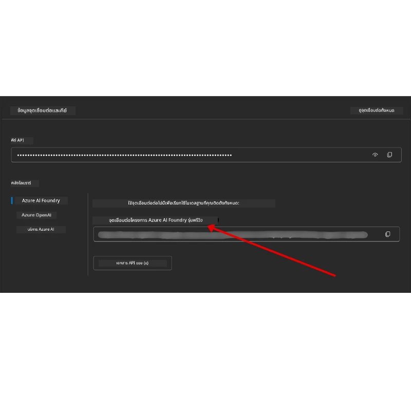

# การตั้งค่าหลักสูตร

## บทนำ

บทเรียนนี้จะครอบคลุมวิธีการรันตัวอย่างโค้ดของหลักสูตรนี้

## เข้าร่วมกับผู้เรียนคนอื่นและขอความช่วยเหลือ

ก่อนที่คุณจะเริ่มโคลนรีโปของคุณ กรุณาเข้าร่วมที่ [AI Agents For Beginners Discord channel](https://aka.ms/ai-agents/discord) เพื่อขอความช่วยเหลือในการตั้งค่า คำถามใด ๆ เกี่ยวกับหลักสูตร หรือเชื่อมต่อกับผู้เรียนคนอื่น ๆ

## โคลนหรือฟอร์กรีโปนี้

เพื่อเริ่มต้น กรุณาโคลนหรือฟอร์ก GitHub Repository นี้ จะช่วยให้คุณมีเวอร์ชันของตัวเองของเนื้อหาหลักสูตรเพื่อที่คุณจะได้รัน ทดสอบ และปรับแต่งโค้ด!

ซึ่งสามารถทำได้โดยการคลิกที่ลิงก์เพื่อ <a href="https://github.com/microsoft/ai-agents-for-beginners/fork" target="_blank">fork the repo</a>

ตอนนี้คุณควรมีเวอร์ชันฟอร์กของหลักสูตรนี้ในลิงก์ต่อไปนี้:


### Shallow Clone (แนะนำสำหรับเวิร์กช็อป / Codespaces)

  >รีโปเต็มอาจมีขนาดใหญ่ (~3 GB) เมื่อคุณดาวน์โหลดประวัติทั้งหมดและไฟล์ทั้งหมด หากคุณเข้าร่วมแค่เวิร์กช็อปหรือแค่ต้องการโฟลเดอร์บทเรียนบางส่วน การโคลนแบบตื้น (shallow clone) หรือโคลนแบบเลือกบางส่วน (sparse clone) จะช่วยหลีกเลี่ยงการดาวน์โหลดส่วนใหญ่โดยการตัดประวัติและ/หรือข้ามบล็อบ

#### โคลนตื้นอย่างรวดเร็ว — ประวัติน้อยที่สุด, ไฟล์ทั้งหมด

แทนที่ `<your-username>` ในคำสั่งด้านล่างด้วย URL ฟอร์กของคุณ (หรือ URL ของต้นทางหากคุณต้องการ)

เพื่อโคลนเฉพาะประวัติการคอมมิตล่าสุด (ดาวน์โหลดเล็ก):

```bash|powershell
git clone --depth 1 https://github.com/<your-username>/ai-agents-for-beginners.git
```

เพื่อโคลนสาขาเฉพาะ:

```bash|powershell
git clone --depth 1 --branch <branch-name> https://github.com/<your-username>/ai-agents-for-beginners.git
```

#### โคลนบางส่วน (sparse) — บล็อบน้อยที่สุด + โฟลเดอร์ที่เลือกเท่านั้น

วิธีนี้ใช้ partial clone และ sparse-checkout (ต้องใช้ Git 2.25+ และแนะนำให้ใช้ Git สมัยใหม่ที่รองรับ partial clone):

```bash|powershell
git clone --depth 1 --filter=blob:none --sparse https://github.com/<your-username>/ai-agents-for-beginners.git
```

เปลี่ยนเข้าไปในโฟลเดอร์รีโป:

```bash|powershell
cd ai-agents-for-beginners
```

แล้วกำหนดว่าอยากได้โฟลเดอร์อะไรบ้าง (ตัวอย่างแสดงสองโฟลเดอร์):

```bash|powershell
git sparse-checkout set 00-course-setup 01-intro-to-ai-agents
```

หลังจากโคลนและตรวจสอบไฟล์แล้ว หากคุณต้องการแค่ไฟล์และอยากคืนพื้นที่ (ไม่มีประวัติ git) กรุณาลบเมตาดาต้ารีโป (💀 ไม่สามารถย้อนกลับ — คุณจะสูญเสียฟังก์ชันการทำงาน Git ทั้งหมด: ไม่มีคอมมิต, ดึง, ผลัก, หรือเข้าถึงประวัติ)

```bash
# zsh/bash
rm -rf .git
```

```powershell
# PowerShell
Remove-Item -Recurse -Force .git
```

#### การใช้ GitHub Codespaces (แนะนำเพื่อหลีกเลี่ยงการดาวน์โหลดขนาดใหญ่ในเครื่อง)

- สร้าง Codespace ใหม่สำหรับรีโปนี้ผ่าน [GitHub UI](https://github.com/codespaces)  

- ในเทอร์มินัลของ Codespace ที่สร้างใหม่ รันคำสั่งโคลนแบบตื้นหรือแบบเลือกบางส่วนด้านบนเพื่อดึงเฉพาะโฟลเดอร์บทเรียนที่คุณต้องการมาที่ workspace ของ Codespace
- ตัวเลือกเสริม: หลังจากโคลนใน Codespaces แล้ว ลบ .git เพื่อคืนพื้นที่เพิ่มเติม (ดูคำสั่งการลบด้านบน)
- หมายเหตุ: หากคุณต้องการเปิดรีโปโดยตรงใน Codespaces (โดยไม่ต้องโคลนเพิ่ม) โปรดทราบว่า Codespaces จะสร้างสภาพแวดล้อม devcontainer และอาจเตรียมทรัพยากรมากกว่าที่คุณต้องการ การโคลนสำเนาตื้นภายใน Codespace ใหม่ให้คุณควบคุมการใช้ดิสก์ได้มากขึ้น

#### เคล็ดลับ

- แทนที่ URL โคลนด้วย URL ฟอร์กของคุณเสมอหากต้องการแก้ไข/คอมมิต
- หากภายหลังคุณต้องการประวัติหรือไฟล์มากขึ้น คุณสามารถดึงข้อมูล (fetch) หรือปรับ sparse-checkout เพื่อรวมโฟลเดอร์เพิ่มได้

## การรันโค้ด

หลักสูตรนี้มีชุด Jupyter Notebooks ที่คุณสามารถรันเพื่อฝึกปฏิบัติสร้าง AI Agents

ตัวอย่างโค้ดใช้ **Microsoft Agent Framework (MAF)** กับ `AzureAIProjectAgentProvider` ซึ่งเชื่อมต่อกับ **Azure AI Agent Service V2** (API ตอบกลับ) ผ่าน **Microsoft Foundry**

โน้ตบุ๊ก Python ทั้งหมดถูกติดป้าย `*-python-agent-framework.ipynb`

## ความต้องการ

- Python 3.12+
  - **หมายเหตุ**: หากคุณยังไม่มี Python3.12 ให้ติดตั้ง จากนั้นสร้าง venv โดยใช้ python3.12 เพื่อให้แน่ใจว่าติดตั้งเวอร์ชันที่ถูกต้องจากไฟล์ requirements.txt

    >ตัวอย่าง

    สร้างไดเรกทอรี Python venv:

    ```bash|powershell
    python -m venv venv
    ```

    จากนั้นเปิดใช้งานสภาพแวดล้อม venv สำหรับ:

    ```bash
    # zsh/bash
    source venv/bin/activate
    ```
  
    ```dos
    # Command Prompt for Windows
    venv\Scripts\activate
    ```

- .NET 10+: สำหรับตัวอย่างโค้ดที่ใช้ .NET ให้แน่ใจว่าคุณติดตั้ง [.NET 10 SDK](https://dotnet.microsoft.com/download/dotnet/10.0) หรือใหม่กว่า จากนั้นตรวจสอบเวอร์ชัน .NET SDK ที่ติดตั้ง:

    ```bash|powershell
    dotnet --list-sdks
    ```

- **Azure CLI** — จำเป็นสำหรับการตรวจสอบสิทธิ์ ติดตั้งได้จาก [aka.ms/installazurecli](https://aka.ms/installazurecli)
- **Azure Subscription** — เพื่อเข้าถึง Microsoft Foundry และ Azure AI Agent Service
- **Microsoft Foundry Project** — โปรเจกต์ที่มีโมเดลปรับใช้แล้ว (เช่น `gpt-4o`) ดู [ขั้นตอนที่ 1](../../../00-course-setup) ด้านล่าง

เราได้แนบไฟล์ `requirements.txt` ไว้ที่โฟลเดอร์รากของรีโปนี้ ซึ่งมีรายการแพ็คเกจ Python ที่จำเป็นสำหรับรันตัวอย่างโค้ดทั้งหมด

คุณสามารถติดตั้งได้โดยรันคำสั่งต่อไปนี้ในเทอร์มินัลที่โฟลเดอร์รากของรีโป:

```bash|powershell
pip install -r requirements.txt
```

เราแนะนำให้สร้างสภาพแวดล้อมเสมือน Python (virtual environment) เพื่อหลีกเลี่ยงปัญหาและข้อขัดแย้งต่าง ๆ

## ตั้งค่า VSCode

ตรวจสอบให้แน่ใจว่าคุณใช้เวอร์ชัน Python ที่ถูกต้องใน VSCode


## ตั้งค่า Microsoft Foundry และ Azure AI Agent Service

### ขั้นตอนที่ 1: สร้างโปรเจกต์ Microsoft Foundry

คุณต้องมี Azure AI Foundry **hub** และ **project** ที่มีโมเดลปรับใช้เพื่อรันโน้ตบุ๊ก

1. ไปที่ [ai.azure.com](https://ai.azure.com) และลงชื่อเข้าใช้ด้วยบัญชี Azure ของคุณ
2. สร้าง **hub** (หรือใช้ตัวที่มีอยู่แล้ว) ดูที่: [Hub resources overview](https://learn.microsoft.com/azure/ai-foundry/concepts/ai-resources)
3. ภายใน hub สร้าง **project**
4. ปรับใช้โมเดล (ตัวอย่างเช่น `gpt-4o`) จาก **Models + Endpoints** → **Deploy model**

### ขั้นตอนที่ 2: ดึง Endpoint โปรเจกต์และชื่อการปรับใช้โมเดล

จากโปรเจกต์ของคุณในพอร์ทัล Microsoft Foundry:

- **Project Endpoint** — ไปที่หน้า **Overview** และคัดลอก URL ของ endpoint



- **Model Deployment Name** — ไปที่ **Models + Endpoints** เลือกโมเดลที่ปรับใช้แล้ว และจดจำ **Deployment name** (เช่น `gpt-4o`)

### ขั้นตอนที่ 3: ลงชื่อเข้าใช้ Azure ด้วย `az login`

โน้ตบุ๊กทั้งหมดใช้ **`AzureCliCredential`** สำหรับการตรวจสอบสิทธิ์ — ไม่มีการจัดการ API key ใด ๆ ซึ่งต้องลงชื่อผ่าน Azure CLI

1. **ติดตั้ง Azure CLI** หากยังไม่มี: [aka.ms/installazurecli](https://aka.ms/installazurecli)

2. **ลงชื่อเข้าใช้** โดยรัน:

    ```bash|powershell
    az login
    ```

    หรือถ้าคุณอยู่ในสภาพแวดล้อมระยะไกล/Codespace ที่ไม่มีเบราว์เซอร์:

    ```bash|powershell
    az login --use-device-code
    ```

3. **เลือก subscription** หากถูกถาม — เลือกอันที่มีโปรเจกต์ Foundry ของคุณ

4. **ตรวจสอบ** ว่าคุณลงชื่อเข้าใช้แล้ว:

    ```bash|powershell
    az account show
    ```

> **ทำไมต้อง `az login`?** โน้ตบุ๊กตรวจสอบสิทธิ์ด้วย `AzureCliCredential` จากแพ็กเกจ `azure-identity` ซึ่งหมายความว่าการเข้าสู่ระบบผ่าน Azure CLI ของคุณจะเป็นผู้ให้สิทธิ์ — ไม่มีคีย์ API หรือความลับในไฟล์ `.env` นี่เป็น [แนวทางปฏิบัติด้านความปลอดภัยที่ดีที่สุด](https://learn.microsoft.com/azure/developer/ai/keyless-connections)

### ขั้นตอนที่ 4: สร้างไฟล์ `.env` ของคุณ

คัดลอกไฟล์ตัวอย่าง:

```bash
# zsh/bash
cp .env.example .env
```

```powershell
# PowerShell
Copy-Item .env.example .env
```

เปิด `.env` และกรอกค่าสองค่าต่อไปนี้:

```env
AZURE_AI_PROJECT_ENDPOINT=https://<your-project>.services.ai.azure.com/api/projects/<your-project-id>
AZURE_AI_MODEL_DEPLOYMENT_NAME=gpt-4o
```

| ตัวแปร | หาได้จากที่ไหน |
|----------|-----------------|
| `AZURE_AI_PROJECT_ENDPOINT` | พอร์ทัล Foundry → โปรเจกต์ของคุณ → หน้า **Overview** |
| `AZURE_AI_MODEL_DEPLOYMENT_NAME` | พอร์ทัล Foundry → **Models + Endpoints** → ชื่อการปรับใช้โมเดลของคุณ |

แค่นี้สำหรับส่วนใหญ่ของบทเรียน! โน้ตบุ๊กจะตรวจสอบสิทธิ์โดยอัตโนมัติผ่านเซสชัน `az login` ของคุณ

### ขั้นตอนที่ 5: ติดตั้ง Dependencies ของ Python

```bash|powershell
pip install -r requirements.txt
```

เราแนะนำให้รันในสภาพแวดล้อมเสมือนที่คุณสร้างไว้ก่อนหน้า

## การตั้งค่าเพิ่มเติมสำหรับบทเรียน 5 (Agentic RAG)

บทเรียน 5 ใช้ **Azure AI Search** สำหรับการสร้างแบบดึงข้อมูลเสริม หากคุณตั้งใจจะรันบทเรียนนั้น ให้เพิ่มตัวแปรเหล่านี้ในไฟล์ `.env` ของคุณ:

| ตัวแปร | หาได้จากที่ไหน |
|----------|-----------------|
| `AZURE_SEARCH_SERVICE_ENDPOINT` | Azure portal → แหล่งทรัพยากร **Azure AI Search** ของคุณ → **Overview** → URL |
| `AZURE_SEARCH_API_KEY` | Azure portal → แหล่งทรัพยากร **Azure AI Search** ของคุณ → **Settings** → **Keys** → primary admin key |

## การตั้งค่าเพิ่มเติมสำหรับบทเรียน 6 และ 8 (GitHub Models)

โน้ตบุ๊กบางส่วนในบทเรียน 6 และ 8 ใช้ **GitHub Models** แทน Azure AI Foundry หากคุณตั้งใจจะรันตัวอย่างเหล่านั้น ให้เพิ่มตัวแปรเหล่านี้ในไฟล์ `.env` ของคุณ:

| ตัวแปร | หาได้จากที่ไหน |
|----------|-----------------|
| `GITHUB_TOKEN` | GitHub → **Settings** → **Developer settings** → **Personal access tokens** |
| `GITHUB_ENDPOINT` | ใช้ `https://models.inference.ai.azure.com` (ค่าเริ่มต้น) |
| `GITHUB_MODEL_ID` | ชื่อโมเดลที่ใช้ (เช่น `gpt-4o-mini`) |

## การตั้งค่าเพิ่มเติมสำหรับบทเรียน 8 (Bing Grounding Workflow)

โน้ตบุ๊ก workflow มีเงื่อนไขในบทเรียน 8 ใช้ **Bing grounding** ผ่าน Azure AI Foundry หากคุณตั้งใจจะรันตัวอย่างนี้ ให้เพิ่มตัวแปรนี้ในไฟล์ `.env` ของคุณ:

| ตัวแปร | หาได้จากที่ไหน |
|----------|-----------------|
| `BING_CONNECTION_ID` | พอร์ทัล Azure AI Foundry → โปรเจกต์ของคุณ → **Management** → **Connected resources** → การเชื่อมต่อ Bing ของคุณ → คัดลอก ID การเชื่อมต่อ |

## การแก้ไขปัญหา

### ข้อผิดพลาดการตรวจสอบใบรับรอง SSL บน macOS

หากคุณใช้ macOS และเจอข้อผิดพลาดแบบนี้:

```plaintext
ssl.SSLCertVerificationError: [SSL: CERTIFICATE_VERIFY_FAILED] certificate verify failed: self-signed certificate in certificate chain
```

นี่เป็นปัญหาที่รู้จักใน Python บน macOS ที่ใบรับรอง SSL ของระบบไม่ได้รับการเชื่อถือโดยอัตโนมัติ ลองแก้ปัญหาต่อไปนี้ตามลำดับ:

**ตัวเลือก 1: รันสคริปต์ติดตั้งใบรับรองของ Python (แนะนำ)**

```bash
# แทนที่ 3.XX ด้วยเวอร์ชัน Python ที่คุณติดตั้ง (เช่น 3.12 หรือ 3.13):
/Applications/Python\ 3.XX/Install\ Certificates.command
```

**ตัวเลือก 2: ใช้ `connection_verify=False` ในโน้ตบุ๊กของคุณ (เฉพาะโน้ตบุ๊ก GitHub Models เท่านั้น)**

ในโน้ตบุ๊กของบทเรียน 6 (`06-building-trustworthy-agents/code_samples/06-system-message-framework.ipynb`), มีการแก้ไขแบบคอมเมนต์ไว้แล้ว ให้ยกเลิกคอมเมนต์ `connection_verify=False` เมื่อตัวสร้าง client:

```python
client = ChatCompletionsClient(
    endpoint=endpoint,
    credential=AzureKeyCredential(token),
    connection_verify=False,  # ปิดการตรวจสอบ SSL หากคุณพบข้อผิดพลาดของใบรับรอง
)
```

> **⚠️ เตือน:** การปิดการตรวจสอบ SSL (`connection_verify=False`) ลดความปลอดภัยโดยข้ามการตรวจสอบใบรับรอง ใช้เฉพาะเป็นการแก้ไขชั่วคราวในสภาพแวดล้อมพัฒนา หลีกเลี่ยงใช้ในสภาพแวดล้อมผลิตจริง

**ตัวเลือก 3: ติดตั้งและใช้ `truststore`**

```bash
pip install truststore
```

จากนั้นเพิ่มบรรทัดนี้ไว้บนสุดของโน้ตบุ๊กหรือสคริปต์ก่อนเรียกใช้งานเครือข่าย:

```python
import truststore
truststore.inject_into_ssl()
```

## ติดขัดตรงไหน?

หากคุณมีปัญหาในการรันการตั้งค่านี้ เข้าร่วมที่ <a href="https://discord.gg/kzRShWzttr" target="_blank">Azure AI Community Discord</a> หรือ <a href="https://github.com/microsoft/ai-agents-for-beginners/issues?WT.mc_id=academic-105485-koreyst" target="_blank">สร้าง issue</a>

## บทเรียนถัดไป

ตอนนี้คุณพร้อมที่จะรันโค้ดสำหรับหลักสูตรนี้แล้ว ขอให้สนุกกับการเรียนรู้เพิ่มเติมเกี่ยวกับโลกของ AI Agents!

[Introduction to AI Agents and Agent Use Cases](../01-intro-to-ai-agents/README.md)

---

<!-- CO-OP TRANSLATOR DISCLAIMER START -->
**คำปฏิเสธความรับผิดชอบ**:  
เอกสารนี้ได้รับการแปลโดยใช้บริการแปลภาษา AI [Co-op Translator](https://github.com/Azure/co-op-translator) แม้ว่าเราจะพยายามให้ความถูกต้องสูงสุด โปรดทราบว่าการแปลอัตโนมัติอาจมีข้อผิดพลาดหรือความไม่ถูกต้อง เอกสารต้นฉบับในภาษาต้นฉบับควรถือเป็นแหล่งข้อมูลหลัก สำหรับข้อมูลสำคัญ ขอแนะนำให้ใช้การแปลโดยมืออาชีพที่เป็นมนุษย์ เราจะไม่รับผิดชอบต่อความเข้าใจผิดหรือการตีความผิดที่เกิดขึ้นจากการใช้การแปลนี้
<!-- CO-OP TRANSLATOR DISCLAIMER END -->