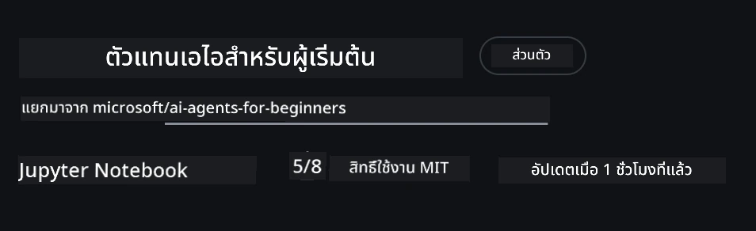
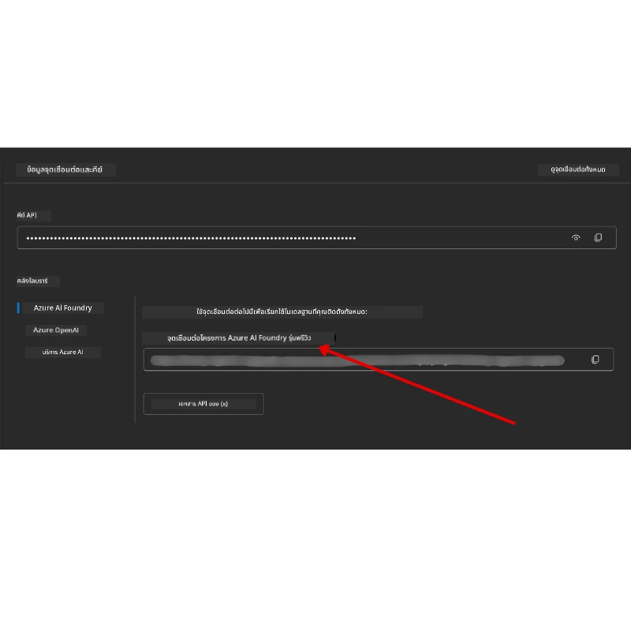

# การตั้งค่าเรียน

## บทนำ

บทเรียนนี้จะสอนวิธีรันตัวอย่างโค้ดของคอร์สนี้

## เข้าร่วมกับผู้เรียนคนอื่นและขอความช่วยเหลือ

ก่อนที่คุณจะเริ่มโคลนรีโปของคุณ เข้าร่วม [ช่อง Discord AI Agents For Beginners](https://aka.ms/ai-agents/discord) เพื่อขอความช่วยเหลือเกี่ยวกับการตั้งค่า คำถามเกี่ยวกับคอร์ส หรือเชื่อมต่อกับผู้เรียนคนอื่นๆ

## โคลนหรือฟอร์ครีโปนี้

เพื่อเริ่มต้น กรุณาโคลนหรือฟอร์ค GitHub Repository นี้ ซึ่งจะทำให้คุณมีเวอร์ชันของวัสดุคอร์สเอาไว้เอง เพื่อที่คุณจะได้รัน ทดสอบ และปรับแต่งโค้ดได้!

ทำได้โดยการคลิกที่ลิงก์เพื่อ <a href="https://github.com/microsoft/ai-agents-for-beginners/fork" target="_blank">ฟอร์ครีโป</a>

ตอนนี้คุณควรมีรีโปฟอร์คของคอร์สนี้ในลิงก์ต่อไปนี้:



### การโคลนแบบตื้น (แนะนำสำหรับ workshop / Codespaces)

  >รีโปเต็มอาจมีขนาดใหญ่ (~3 GB) เมื่อดาวน์โหลดประวัติทั้งหมดและไฟล์ทั้งหมด หากคุณเข้าร่วมแค่ workshop หรือต้องการแค่โฟลเดอร์บทเรียนบางส่วน การโคลนแบบตื้น (หรือโคลนแบบบางส่วน) จะลดขนาดการดาวน์โหลดโดยตัดประวัติและ/หรือข้ามบล็อบส่วนใหญ่

#### การโคลนแบบตื้นอย่างรวดเร็ว — ประวัติน้อยที่สุด, ไฟล์ทั้งหมด

แทนที่ `<your-username>` ในคำสั่งด้านล่างด้วย URL ฟอร์คของคุณ (หรือ URL อัพสตรีมถ้าคุณต้องการ)

เพื่อโคลนด้วยประวัติ commit ล่าสุดเท่านั้น (ดาวน์โหลดเล็ก):

```bash|powershell
git clone --depth 1 https://github.com/<your-username>/ai-agents-for-beginners.git
```

เพื่อโคลนสาขาเฉพาะ:

```bash|powershell
git clone --depth 1 --branch <branch-name> https://github.com/<your-username>/ai-agents-for-beginners.git
```

#### การโคลนแบบบางส่วน (sparse clone) — บล็อบน้อยที่สุด + มีเฉพาะโฟลเดอร์ที่เลือก

ใช้การโคลนบางส่วนและ sparse-checkout (ต้องใช้ Git 2.25+ และแนะนำใช้ Git เวอร์ชันใหม่ที่รองรับ partial clone):

```bash|powershell
git clone --depth 1 --filter=blob:none --sparse https://github.com/<your-username>/ai-agents-for-beginners.git
```

เข้าไปในโฟลเดอร์รีโป:

```bash|powershell
cd ai-agents-for-beginners
```

จากนั้นระบุว่าอยากได้โฟลเดอร์ไหน (ตัวอย่างแสดงสองโฟลเดอร์):

```bash|powershell
git sparse-checkout set 00-course-setup 01-intro-to-ai-agents
```

หลังจากโคลนและตรวจสอบไฟล์แล้ว หากคุณต้องการแค่ไฟล์และต้องการเพิ่มพื้นที่ (ไม่มีประวัติ git) กรุณาลบเมตาดาต้ารีโป (💀 ไม่สามารถย้อนกลับ — คุณจะสูญเสียฟังก์ชัน Git ทั้งหมด: ไม่มี commit, pull, push หรือเข้าถึงประวัติได้)

```bash
# zsh/bash
rm -rf .git
```

```powershell
# PowerShell
Remove-Item -Recurse -Force .git
```

#### ใช้ GitHub Codespaces (แนะนำเพื่อหลีกเลี่ยงการดาวน์โหลดขนาดใหญ่ในเครื่อง)

- สร้าง Codespace ใหม่สำหรับรีโปนี้ผ่าน [GitHub UI](https://github.com/codespaces)  

- ในเทอร์มินัลของ Codespace ที่สร้างใหม่ ให้รันคำสั่งโคลนแบบตื้น/แบบบางที่กล่าวถึงด้านบนเพื่อดึงเฉพาะโฟลเดอร์บทเรียนที่คุณต้องการมาไว้ใน workspace ของ Codespace
- ทางเลือก: หลังโคลนเสร็จภายใน Codespaces ลบโฟลเดอร์ .git เพื่อคืนพื้นที่เพิ่มเติม (ดูคำสั่งลบด้านบน)
- หมายเหตุ: ถ้าคุณต้องการเปิดรีโปใน Codespaces โดยตรง (โดยไม่โคลนซ้ำ) ให้เข้าใจว่า Codespaces จะตั้ง environment devcontainer และอาจติดตั้งมากกว่าที่คุณต้องการ การโคลนแบบตื้นใน Codespace ใหม่จะทำให้คุณควบคุมการใช้ดิสก์ได้มากขึ้น

#### เคล็ดลับ

- แทนที่ URL สำหรับโคลนด้วยฟอร์คของคุณหากต้องการแก้ไข/commit
- ถ้าคุณต้องการประวัติหรือไฟล์เพิ่มเติมในภายหลัง คุณสามารถ fetch หรือปรับ sparse-checkout เพื่อรวมโฟลเดอร์เพิ่มได้

## การรันโค้ด

คอร์สนี้มีชุด Jupyter Notebooks ที่คุณสามารถรันเพื่อฝึกปฏิบัติการสร้าง AI Agents

ตัวอย่างโค้ดใช้ **Microsoft Agent Framework (MAF)** กับ `FoundryChatClient` ซึ่งเชื่อมต่อกับ **Microsoft Foundry Agent Service V2** (Responses API) ผ่าน **Microsoft Foundry**

โน้ตบุ๊ก Python ทั้งหมดถูกติดป้ายชื่อ `*-python-agent-framework.ipynb`

## ความต้องการ

- Python 3.12+
  - **หมายเหตุ**: หากคุณยังไม่มี Python 3.12 ให้ติดตั้ง จากนั้นสร้าง venv โดยใช้ python3.12 เพื่อให้แน่ใจว่าใช้เวอร์ชันถูกต้องตามที่ระบุในไฟล์ requirements.txt

    >ตัวอย่าง

    สร้างไดเรกทอรี Python venv:

    ```bash|powershell
    python -m venv venv
    ```

    จากนั้นเปิดใช้งานสภาพแวดล้อม venv สำหรับ:

    ```bash
    # zsh/bash
    source venv/bin/activate
    ```
  
    ```dos
    # Command Prompt for Windows
    venv\Scripts\activate
    ```

- .NET 10+: สำหรับโค้ดตัวอย่างที่ใช้ .NET ให้ติดตั้ง [.NET 10 SDK](https://dotnet.microsoft.com/download/dotnet/10.0) หรือเวอร์ชันใหม่กว่า แล้วตรวจสอบเวอร์ชัน SDK .NET ที่ติดตั้ง:

    ```bash|powershell
    dotnet --list-sdks
    ```

- **Azure CLI** — จำเป็นสำหรับการรับรองตัวตน ติดตั้งจาก [aka.ms/installazurecli](https://aka.ms/installazurecli)
- **Azure Subscription** — สำหรับเข้าถึง Microsoft Foundry และ Microsoft Foundry Agent Service
- **โปรเจกต์ Microsoft Foundry** — โปรเจกต์ที่มีโมเดลปรับใช้แล้ว (เช่น `gpt-4o`) ดู [ขั้นตอนที่ 1](#ขั้นตอนที่-1-สร้างโปรเจกต์-microsoft-foundry) ด้านล่าง

เราได้แนบไฟล์ `requirements.txt` ไว้ในรูทของรีโปนี้ ซึ่งประกอบด้วยแพ็กเกจ Python ที่จำเป็นทั้งหมดสำหรับรันตัวอย่างโค้ด

คุณสามารถติดตั้งโดยรันคำสั่งต่อไปนี้ในเทอร์มินัลที่รูทของรีโป:

```bash|powershell
pip install -r requirements.txt
```

เราขอแนะนำให้สร้างสภาพแวดล้อม Python virtual environment เพื่อหลีกเลี่ยงข้อขัดแย้งและปัญหา

## ตั้งค่า VSCode

ตรวจสอบให้แน่ใจว่าคุณใช้เวอร์ชัน Python ที่ถูกต้องใน VSCode


## ตั้งค่า Microsoft Foundry และ Microsoft Foundry Agent Service

### ขั้นตอนที่ 1: สร้างโปรเจกต์ Microsoft Foundry

คุณต้องมี **hub** และ **project** ใน Microsoft Foundry ที่มีโมเดลปรับใช้สำหรับรันโน้ตบุ๊ก

1. ไปที่ [ai.azure.com](https://ai.azure.com) แล้วเข้าสู่ระบบด้วยบัญชี Azure ของคุณ
2. สร้าง **hub** (หรือใช้ที่มีอยู่แล้ว) ดูเพิ่มเติมที่: [ภาพรวมทรัพยากร Hub](https://learn.microsoft.com/azure/ai-foundry/concepts/ai-resources)
3. ภายใน hub สร้าง **project**
4. ปรับใช้โมเดล (เช่น `gpt-4o`) จาก **Models + Endpoints** → **Deploy model**

### ขั้นตอนที่ 2: รับ URL Endpoint โปรเจกต์และชื่อการปรับใช้โมเดลของคุณ

จากโปรเจกต์ในพอร์ทัล Microsoft Foundry:

- **Project Endpoint** — ไปที่หน้า **Overview** แล้วคัดลอก URL endpoint



- **Model Deployment Name** — ไปที่ **Models + Endpoints**, เลือกโมเดลที่ปรับใช้แล้ว และจดชื่อ **Deployment name** (เช่น `gpt-4o`)

### ขั้นตอนที่ 3: ลงชื่อเข้าสู่ระบบ Azure ด้วย `az login`

โน้ตบุ๊กทั้งหมดใช้ **`AzureCliCredential`** สำหรับการรับรองตัวตน — ไม่ต้องจัดการ API key ซึ่งต้องลงชื่อเข้าใช้ผ่าน Azure CLI

1. **ติดตั้ง Azure CLI** ถ้ายังไม่ได้ติดตั้ง: [aka.ms/installazurecli](https://aka.ms/installazurecli)

2. **ลงชื่อเข้าใช้** ด้วยการรัน:

    ```bash|powershell
    az login
    ```

    หรือถ้าอยู่ในสภาพแวดล้อม remote/Codespace ที่ไม่มีเบราว์เซอร์:

    ```bash|powershell
    az login --use-device-code
    ```

3. **เลือก subscription** หากถูกถาม — เลือก subscription ที่มีโปรเจกต์ Foundry ของคุณ

4. **ตรวจสอบ** ว่าคุณลงชื่อเข้าใช้แล้ว:

    ```bash|powershell
    az account show
    ```

> **ทำไมต้อง `az login`?** โน้ตบุ๊กรับรองตัวตนโดยใช้ `AzureCliCredential` จากแพ็กเกจ `azure-identity` ซึ่งหมายความว่า session Azure CLI ของคุณจะให้ข้อมูลรับรอง — ไม่มี API key หรือความลับอยู่ในไฟล์ `.env` นี่คือ [แนวทางปฏิบัติด้านความปลอดภัยที่ดี](https://learn.microsoft.com/azure/developer/ai/keyless-connections)

### ขั้นตอนที่ 4: สร้างไฟล์ `.env` ของคุณ

คัดลอกไฟล์ตัวอย่าง:

```bash
# zsh/bash
cp .env.example .env
```

```powershell
# PowerShell
Copy-Item .env.example .env
```

เปิด `.env` แล้วกรอกค่าสองค่าต่อไปนี้:

```env
AZURE_AI_PROJECT_ENDPOINT=https://<your-project>.services.ai.azure.com/api/projects/<your-project-id>
AZURE_AI_MODEL_DEPLOYMENT_NAME=gpt-4o
```

| ตัวแปร | หาได้ที่ไหน |
|----------|-----------------|
| `AZURE_AI_PROJECT_ENDPOINT` | พอร์ทัล Foundry → โปรเจกต์ของคุณ → หน้า **Overview** |
| `AZURE_AI_MODEL_DEPLOYMENT_NAME` | พอร์ทัล Foundry → **Models + Endpoints** → ชื่อโมเดลที่ปรับใช้ |

แค่นี้สำหรับบทเรียนส่วนใหญ่! โน้ตบุ๊กจะรับรองตัวตนโดยอัตโนมัติผ่าน session `az login` ของคุณ

### ขั้นตอนที่ 5: ติดตั้ง Dependencies ของ Python

```bash|powershell
pip install -r requirements.txt
```

แนะนำให้รันใน virtual environment ที่คุณสร้างไว้ก่อนหน้า

## การตั้งค่าเพิ่มเติมสำหรับบทเรียนที่ 5 (Agentic RAG)

บทเรียนที่ 5 ใช้ **Azure AI Search** สำหรับการสร้างข้อความโดยเพิ่มการค้นคืนข้อมูล หากคุณจะรันบทเรียนนี้ ให้เพิ่มตัวแปรเหล่านี้ลงในไฟล์ `.env` ของคุณ:

| ตัวแปร | หาได้ที่ไหน |
|----------|-----------------|
| `AZURE_SEARCH_SERVICE_ENDPOINT` | พอร์ทัล Azure → ทรัพยากร **Azure AI Search** ของคุณ → **Overview** → URL |
| `AZURE_SEARCH_API_KEY` | พอร์ทัล Azure → ทรัพยากร **Azure AI Search** ของคุณ → **Settings** → **Keys** → กุญแจผู้ดูแลหลัก |

## การตั้งค่าเพิ่มเติมสำหรับบทเรียนที่เรียกใช้ Azure OpenAI โดยตรง (บทเรียน 6 และ 8)

บางโน้ตบุ๊กในบทเรียน 6 และ 8 เรียกใช้ **Azure OpenAI** โดยตรง (ผ่าน **Responses API**) แทนการผ่านโปรเจกต์ Microsoft Foundry ตัวอย่างเหล่านี้เคยใช้ GitHub Models ซึ่งเลิกใช้แล้ว (จะยุติในเดือนกรกฎาคม 2026) และไม่รองรับ Responses API หากคุณมีแผนจะรันตัวอย่างเหล่านี้ ให้เพิ่มตัวแปรเหล่านี้ในไฟล์ `.env` ของคุณ:

| ตัวแปร | หาได้ที่ไหน |
|----------|-----------------|
| `AZURE_OPENAI_ENDPOINT` | พอร์ทัล Azure → ทรัพยากร **Azure OpenAI** ของคุณ → **Keys and Endpoint** → Endpoint (เช่น `https://<your-resource>.openai.azure.com`) |
| `AZURE_OPENAI_DEPLOYMENT` | ชื่อโมเดลที่ปรับใช้แล้ว (เช่น `gpt-4o-mini`) ที่รองรับ Responses API |
| `AZURE_OPENAI_API_KEY` | ตัวเลือก — ใช้ถ้าคุณใช้การรับรองแบบกุญแจแทน `az login` / Entra ID |

> Responses API ใช้ endpoint `/openai/v1/` ที่เสถียร ดังนั้นไม่ต้องใส่ `api-version` ลงชื่อเข้าใช้ด้วย `az login` เพื่อใช้การรับรองแบบ Entra ID ที่ไม่ต้องใช้กุญแจ

## ผู้ให้บริการทางเลือก: MiniMax (รองรับ OpenAI)

[MiniMax](https://platform.minimaxi.com/) ให้บริการโมเดลบริบทใหญ่ (สูงสุด 204K tokens) ผ่าน API ที่เข้ากันได้กับ OpenAI เนื่องจาก Microsoft Agent Framework `OpenAIChatClient` ทำงานได้กับ endpoint ที่เข้ากันได้กับ OpenAI ใดๆ คุณจึงใช้ MiniMax เป็นทางเลือกแทน Azure OpenAI หรือ OpenAI ได้ทันที

เพิ่มตัวแปรเหล่านี้ในไฟล์ `.env` ของคุณ:

| ตัวแปร | หาได้ที่ไหน |
|----------|-----------------|
| `MINIMAX_API_KEY` | [MiniMax Platform](https://platform.minimaxi.com/) → API Keys |
| `MINIMAX_BASE_URL` | ใช้ `https://api.minimax.io/v1` (ค่าปริยาย) |
| `MINIMAX_MODEL_ID` | ชื่อโมเดลที่ใช้ (เช่น `MiniMax-M3`) |

**โมเดลตัวอย่าง**: `MiniMax-M3` (แนะนำ), `MiniMax-M2.7`, `MiniMax-M2.7-highspeed` (ตอบสนองเร็วกว่า) ชื่อโมเดลและความพร้อมใช้งานอาจเปลี่ยนแปลงตามเวลา และการเข้าถึงโมเดลอาจขึ้นกับบัญชีหรือภูมิภาคของคุณ — ตรวจสอบรายชื่อปัจจุบันที่ [MiniMax Platform](https://platform.minimaxi.com/) หาก `MiniMax-M3` ไม่สามารถใช้ได้กับบัญชีคุณ ให้ตั้งค่า `MINIMAX_MODEL_ID` เป็นโมเดลที่คุณเข้าถึงได้ (เช่น `MiniMax-M2.7`)

ตัวอย่างโค้ดที่ใช้ `OpenAIChatClient` (เช่น บทเรียน 14 ระบบจองโรงแรม) จะตรวจจับและใช้การตั้งค่า MiniMax ของคุณโดยอัตโนมัติเมื่อกำหนดค่าตัวแปร `MINIMAX_API_KEY`

## ผู้ให้บริการทางเลือก: Foundry Local (รันโมเดลบนอุปกรณ์)

[Foundry Local](https://foundrylocal.ai) เป็นรันไทม์น้ำหนักเบาที่ดาวน์โหลด จัดการ และให้บริการโมเดลภาษา **ทั้งหมดบนเครื่องของคุณเอง** ผ่าน API ที่เข้ากันได้กับ OpenAI — ไม่ต้องใช้คลาวด์, ไม่ต้องมี subscription Azure และไม่ต้องใช้ API keys เหมาะสำหรับการพัฒนาแบบออฟไลน์ ทดลองโดยไม่ต้องเสียค่าใช้จ่ายคลาวด์ หรือเก็บข้อมูลไว้บนอุปกรณ์เอง

เนื่องจาก Microsoft Agent Framework `OpenAIChatClient` ทำงานกับ endpoint ที่เข้ากันได้กับ OpenAI ใดๆ Foundry Local จึงเป็นทางเลือกแบบ local แทน Azure OpenAI

**1. ติดตั้ง Foundry Local**

```bash
# วินโดวส์
winget install Microsoft.FoundryLocal

# แมคโอเอส
brew install foundrylocal
```

**2. ดาวน์โหลดและรันโมเดล** (ซึ่งจะเริ่มบริการ local ด้วย):

```bash
foundry model list          # ดูโมเดลที่มีอยู่
foundry model run phi-4-mini
```

**3. ติดตั้ง Python SDK** ที่ใช้ค้นหา endpoint local:

```bash
pip install foundry-local-sdk
```

**4. ชี้ Microsoft Agent Framework ไปที่โมเดล local ของคุณ:**

```python
from foundry_local import FoundryLocalManager
from agent_framework.openai import OpenAIChatClient

# ดาวน์โหลด (ถ้าจำเป็น) และให้บริการโมเดลในเครื่อง จากนั้นค้นพบจุดสิ้นสุด/พอร์ต
manager = FoundryLocalManager("phi-4-mini")

chat_client = OpenAIChatClient(
    base_url=manager.endpoint,      # ตัวอย่างเช่น http://localhost:<port>/v1
    api_key=manager.api_key,        # เสมอเป็น "ไม่จำเป็น" สำหรับ Foundry Local
    model_id=manager.get_model_info("phi-4-mini").id,
)

agent = chat_client.as_agent(
    name="LocalAgent",
    instructions="You are a helpful assistant running fully on-device.",
)
```

> **หมายเหตุ:** Foundry Local เปิดให้บริการ endpoint แบบ OpenAI-compatible **Chat Completions** ใช้สำหรับการพัฒนา local และใช้งานแบบออฟไลน์ สำหรับฟีเจอร์เต็มรูปแบบของ **Responses API** (การสนทนาแบบ stateful, การจัดการเครื่องมือเชิงลึก และการพัฒนาแบบเอเจนต์) ให้ใช้ **Azure OpenAI** หรือโปรเจกต์ **Microsoft Foundry** ตามที่แสดงในบทเรียน ดูเอกสาร [Foundry Local](https://foundrylocal.ai) สำหรับแคตตาล็อกโมเดลและการรองรับแพลตฟอร์มปัจจุบัน

## การตั้งค่าเพิ่มเติมสำหรับบทเรียน 8 (Bing Grounding Workflow)
สมุดบันทึกเวิร์กโฟลว์มีเงื่อนไขในบทเรียนที่ 8 ใช้ **การเชื่อมต่อ Bing** ผ่าน Microsoft Foundry หากคุณวางแผนที่จะรันตัวอย่างนั้น ให้เพิ่มตัวแปรนี้ลงในไฟล์ `.env` ของคุณ:

| ตัวแปร | วิธีค้นหา |
|--------|-----------|
| `BING_CONNECTION_ID` | พอร์ทัล Microsoft Foundry → โครงการของคุณ → **การจัดการ** → **ทรัพยากรที่เชื่อมต่อ** → การเชื่อมต่อ Bing ของคุณ → คัดลอก ID การเชื่อมต่อ |

## การแก้ไขปัญหา

### ข้อผิดพลาดการตรวจสอบใบรับรอง SSL บน macOS

หากคุณใช้ macOS และเจอข้อผิดพลาดดังนี้:

```plaintext
ssl.SSLCertVerificationError: [SSL: CERTIFICATE_VERIFY_FAILED] certificate verify failed: self-signed certificate in certificate chain
```

นี่คือปัญหาที่ทราบกันกับ Python บน macOS ซึ่งใบรับรอง SSL ของระบบจะไม่ได้รับการเชื่อถือโดยอัตโนมัติ ลองแก้ไขตามลำดับดังนี้:

**ตัวเลือกที่ 1: รันสคริปต์ติดตั้งใบรับรองของ Python (แนะนำ)**

```bash
# แทนที่ 3.XX ด้วยเวอร์ชัน Python ที่คุณติดตั้ง (เช่น 3.12 หรือ 3.13):
/Applications/Python\ 3.XX/Install\ Certificates.command
```

**ตัวเลือกที่ 2: ใช้ `connection_verify=False` ในสมุดบันทึกของคุณ (สำหรับสมุดบันทึก GitHub Models เท่านั้น)**

ในสมุดบันทึกบทเรียนที่ 6 (`06-building-trustworthy-agents/code_samples/06-system-message-framework.ipynb`) มีวิธีแก้ไขแบบคอมเมนต์ไว้แล้ว ให้ยกเลิกคอมเมนต์ `connection_verify=False` เมื่อสร้างไคลเอนต์:

```python
client = ChatCompletionsClient(
    endpoint=endpoint,
    credential=AzureKeyCredential(token),
    connection_verify=False,  # ปิดการตรวจสอบ SSL หากคุณพบข้อผิดพลาดเกี่ยวกับใบรับรอง
)
```

> **⚠️ คำเตือน:** การปิดการตรวจสอบ SSL (`connection_verify=False`) จะลดความปลอดภัยโดยข้ามการตรวจสอบใบรับรอง ใช้เฉพาะเป็นวิธีแก้ชั่วคราวในสภาพแวดล้อมการพัฒนาเท่านั้น หลีกเลี่ยงการใช้ในสภาพแวดล้อมการผลิต

**ตัวเลือกที่ 3: ติดตั้งและใช้ `truststore`**

```bash
pip install truststore
```

จากนั้นเพิ่มบรรทัดนี้ไว้บนสุดของสมุดบันทึกหรือสคริปต์ก่อนเรียกใช้งานเครือข่ายใดๆ:

```python
import truststore
truststore.inject_into_ssl()
```

## ติดขัดตรงไหน?

หากคุณพบปัญหาใด ๆ ในการตั้งค่านี้ เข้าร่วมกับเราได้ที่ <a href="https://discord.gg/kzRShWzttr" target="_blank">Discord ชุมชน Azure AI</a> หรือ <a href="https://github.com/microsoft/ai-agents-for-beginners/issues?WT.mc_id=academic-105485-koreyst" target="_blank">สร้างปัญหา</a>.

## บทเรียนต่อไป

ตอนนี้คุณพร้อมที่จะรันโค้ดสำหรับหลักสูตรนี้แล้ว ขอให้สนุกกับการเรียนรู้เพิ่มเติมเกี่ยวกับโลกของ AI Agents!

[บทนำสู่ AI Agents และกรณีการใช้งาน Agent](../01-intro-to-ai-agents/README.md)

---

<!-- CO-OP TRANSLATOR DISCLAIMER START -->
**ปฏิเสธความรับผิดชอบ**:
เอกสารนี้ได้รับการแปลโดยใช้บริการแปลภาษา AI [Co-op Translator](https://github.com/Azure/co-op-translator) ขณะที่เราพยายามให้ความถูกต้อง โปรดทราบว่าการแปลโดยอัตโนมัติอาจมีข้อผิดพลาดหรือความไม่ถูกต้อง เอกสารต้นฉบับในภาษาต้นทางควรถูกพิจารณาเป็นแหล่งข้อมูลที่เชื่อถือได้ สำหรับข้อมูลที่สำคัญ แนะนำให้ใช้การแปลโดยมนุษย์มืออาชีพ เราไม่รับผิดชอบต่อความเข้าใจผิดหรือการตีความที่ผิดพลาดที่เกิดขึ้นจากการใช้การแปลนี้
<!-- CO-OP TRANSLATOR DISCLAIMER END -->