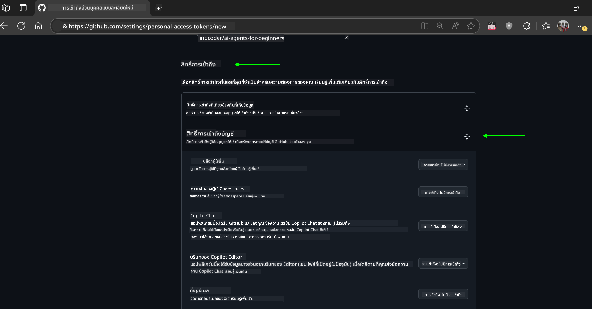

<!--
CO_OP_TRANSLATOR_METADATA:
{
  "original_hash": "76945069b52a49cd0432ae3e0b0ba22e",
  "translation_date": "2025-07-12T07:50:58+00:00",
  "source_file": "00-course-setup/README.md",
  "language_code": "th"
}
-->
ในบัญชี GitHub ของคุณ

เลือกตัวเลือก `Fine-grained tokens` ที่ด้านซ้ายของหน้าจอ

    จากนั้นเลือก `Generate new token`

    

ระบบจะให้คุณกรอกชื่อสำหรับโทเค็นของคุณ เลือกวันหมดอายุ (แนะนำ: 30 วัน) และเลือกขอบเขตสำหรับโทเค็นของคุณ (Public Repositories)

1. จำกัดสิทธิ์ของ token: ภายใต้ **Permissions** ให้เปิด **Account Permissions** ไปที่ **Models** และเปิดใช้งานเฉพาะการเข้าถึงแบบอ่านที่จำเป็นสำหรับ GitHub Models

    

    

คัดลอก token ใหม่ที่คุณเพิ่งสร้างขึ้น คุณจะเพิ่ม token นี้ลงในไฟล์ `.env` ที่รวมอยู่ในคอร์สนี้

### ขั้นตอนที่ 2: สร้างไฟล์ `.env` ของคุณ

ในการสร้างไฟล์ `.env` ให้รันคำสั่งต่อไปนี้ใน terminal ของคุณ

```bash
cp .env.example .env
```

คำสั่งนี้จะคัดลอกไฟล์ตัวอย่างและสร้าง `.env` ในไดเรกทอรีของคุณ ซึ่งคุณจะเติมค่าตัวแปรสภาพแวดล้อม

เมื่อคุณคัดลอกโทเค็นแล้ว ให้เปิดไฟล์ `.env` ในโปรแกรมแก้ไขข้อความที่คุณชื่นชอบ และวางโทเค็นของคุณลงในช่อง `GITHUB_TOKEN`

คุณควรจะสามารถรันตัวอย่างโค้ดในคอร์สนี้ได้แล้ว

## การตั้งค่าสำหรับตัวอย่างที่ใช้ Azure AI Foundry และ Azure AI Agent Service

### ขั้นตอนที่ 1: ดึง Azure Project Endpoint ของคุณ

ทำตามขั้นตอนการสร้าง hub และ project ใน Azure AI Foundry ได้ที่นี่: [Hub resources overview](https://learn.microsoft.com/en-us/azure/ai-foundry/concepts/ai-resources)

เมื่อคุณสร้าง project แล้ว คุณจะต้องดึง connection string สำหรับ project ของคุณ

สามารถทำได้โดยไปที่หน้า **Overview** ของ project ใน Azure AI Foundry portal


### ขั้นตอนที่ 2: สร้างไฟล์ `.env` ของคุณ

ในการสร้างไฟล์ `.env` ให้รันคำสั่งต่อไปนี้ใน terminal ของคุณ

```bash
cp .env.example .env
```

คำสั่งนี้จะคัดลอกไฟล์ตัวอย่างและสร้าง `.env` ในไดเรกทอรีของคุณ ซึ่งคุณจะเติมค่าตัวแปรสภาพแวดล้อม

เมื่อคุณคัดลอกสตริงการเชื่อมต่อแล้ว ให้เปิดไฟล์ `.env` ในโปรแกรมแก้ไขข้อความที่คุณชื่นชอบ และวางสตริงการเชื่อมต่อในช่อง `PROJECT_ENDPOINT`

### ขั้นตอนที่ 3: ลงชื่อเข้าใช้ Azure

เพื่อความปลอดภัยที่ดีที่สุด เราจะใช้ [keyless authentication](https://learn.microsoft.com/azure/developer/ai/keyless-connections?tabs=csharp%2Cazure-cli?WT.mc_id=academic-105485-koreyst) เพื่อยืนยันตัวตนกับ Azure OpenAI ด้วย Microsoft Entra ID

จากนั้นเปิด terminal และรัน `az login --use-device-code` เพื่อเข้าสู่บัญชี Azure ของคุณ

เมื่อคุณเข้าสู่ระบบแล้ว ให้เลือก subscription ของคุณใน terminal

## ตัวแปรสภาพแวดล้อมเพิ่มเติม - Azure Search และ Azure OpenAI 

สำหรับบทเรียน Agentic RAG - บทเรียนที่ 5 - มีตัวอย่างที่ใช้ Azure Search และ Azure OpenAI

หากคุณต้องการรันตัวอย่างเหล่านี้ คุณจะต้องเพิ่มตัวแปรสภาพแวดล้อมต่อไปนี้ลงในไฟล์ `.env` ของคุณ:

### หน้า Overview (Project)

- `AZURE_SUBSCRIPTION_ID` - ตรวจสอบ **Project details** ในหน้า **Overview** ของ project ของคุณ

- `AZURE_AI_PROJECT_NAME` - ดูที่ด้านบนของหน้า **Overview** สำหรับ project ของคุณ

- `AZURE_OPENAI_SERVICE` - ค้นหานี้ในแท็บ **Included capabilities** สำหรับ **Azure OpenAI Service** ในหน้า **Overview**

### Management Center

- `AZURE_OPENAI_RESOURCE_GROUP` - ไปที่ **Project properties** ในหน้า **Overview** ของ **Management Center**

- `GLOBAL_LLM_SERVICE` - ภายใต้ **Connected resources** หา ชื่อการเชื่อมต่อ **Azure AI Services** หากไม่มี ให้ตรวจสอบใน **Azure portal** ภายใต้กลุ่มทรัพยากรของคุณสำหรับชื่อทรัพยากร AI Services

### หน้า Models + Endpoints

- `AZURE_OPENAI_EMBEDDING_DEPLOYMENT_NAME` - เลือกรุ่น embedding ของคุณ (เช่น `text-embedding-ada-002`) และจดชื่อ **Deployment name** จากรายละเอียดของรุ่น

- `AZURE_OPENAI_CHAT_DEPLOYMENT_NAME` - เลือกรุ่น chat ของคุณ (เช่น `gpt-4o-mini`) และจดชื่อ **Deployment name** จากรายละเอียดของรุ่น

### Azure Portal

- `AZURE_OPENAI_ENDPOINT` - ค้นหา **Azure AI services** คลิกที่มัน จากนั้นไปที่ **Resource Management**, **Keys and Endpoint**, เลื่อนลงไปที่ "Azure OpenAI endpoints" และคัดลอก endpoint ที่ระบุว่า "Language APIs"

- `AZURE_OPENAI_API_KEY` - จากหน้าจอเดียวกัน คัดลอก KEY 1 หรือ KEY 2

- `AZURE_SEARCH_SERVICE_ENDPOINT` - ค้นหา resource **Azure AI Search** ของคุณ คลิกที่มัน และดูที่ **Overview**

- `AZURE_SEARCH_API_KEY` - จากนั้นไปที่ **Settings** และ **Keys** เพื่อคัดลอก admin key หลักหรือรอง

### หน้าเว็บภายนอก

- `AZURE_OPENAI_API_VERSION` - เยี่ยมชมหน้า [API version lifecycle](https://learn.microsoft.com/en-us/azure/ai-services/openai/api-version-deprecation#latest-ga-api-release) ภายใต้ **Latest GA API release**

### ตั้งค่าการยืนยันตัวตนแบบไม่ใช้คีย์

แทนที่จะเขียนข้อมูลรับรองของคุณลงในโค้ด เราจะใช้การเชื่อมต่อแบบไม่ใช้คีย์กับ Azure OpenAI โดยนำเข้า `DefaultAzureCredential` และเรียกใช้ฟังก์ชัน `DefaultAzureCredential` เพื่อรับข้อมูลรับรอง

```python
from azure.identity import DefaultAzureCredential, InteractiveBrowserCredential
```

## ติดปัญหาที่ไหน?

หากคุณมีปัญหาในการตั้งค่านี้ เข้าร่วมใน

## บทเรียนถัดไป

คุณพร้อมที่จะรันโค้ดสำหรับคอร์สนี้แล้ว ขอให้สนุกกับการเรียนรู้เพิ่มเติมเกี่ยวกับโลกของ AI Agents!

[Introduction to AI Agents and Agent Use Cases](../01-intro-to-ai-agents/README.md)

**ข้อจำกัดความรับผิดชอบ**:  
เอกสารนี้ได้รับการแปลโดยใช้บริการแปลภาษาอัตโนมัติ [Co-op Translator](https://github.com/Azure/co-op-translator) แม้เราจะพยายามให้ความถูกต้องสูงสุด แต่โปรดทราบว่าการแปลอัตโนมัติอาจมีข้อผิดพลาดหรือความไม่ถูกต้อง เอกสารต้นฉบับในภาษาต้นทางถือเป็นแหล่งข้อมูลที่เชื่อถือได้ สำหรับข้อมูลที่สำคัญ ขอแนะนำให้ใช้บริการแปลโดยผู้เชี่ยวชาญมนุษย์ เราไม่รับผิดชอบต่อความเข้าใจผิดหรือการตีความผิดใด ๆ ที่เกิดจากการใช้การแปลนี้