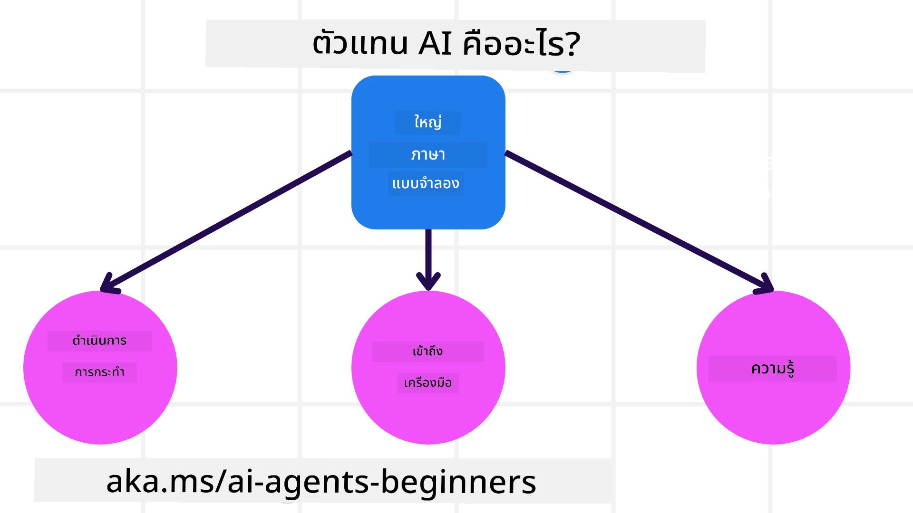
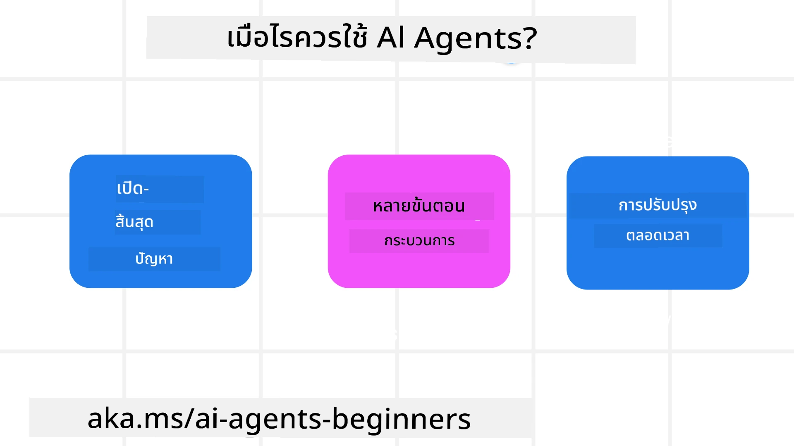

> _(คลิกที่ภาพด้านบนเพื่อดูวิดีโอของบทเรียนนี้)_

# บทนำสู่เอเย่นต์ AI และกรณีการใช้งานเอเย่นต์

ยินดีต้อนรับสู่คอร์ส "AI Agents for Beginners"! คอร์สนี้ให้ความรู้พื้นฐานและตัวอย่างการใช้งานสำหรับการสร้างเอเย่นต์ AI

เข้าร่วม <a href="https://discord.gg/kzRShWzttr" target="_blank">ชุมชน Azure AI Discord</a> เพื่อพบปะผู้เรียนและผู้สร้างเอเย่นต์ AI คนอื่น ๆ และสอบถามคำถามเกี่ยวกับคอร์สนี้

เพื่อเริ่มต้นคอร์สนี้ เราจะเริ่มจากทำความเข้าใจให้ดียิ่งขึ้นว่าเอเย่นต์ AI คืออะไรและเราจะใช้มันในแอปพลิเคชันและเวิร์กโฟลว์ที่เราสร้างได้อย่างไร

## บทนำ

บทเรียนนี้ครอบคลุม:

- เอเย่นต์ AI คืออะไรและประเภทของเอเย่นต์มีอะไรบ้าง?
- กรณีการใช้งานใดบ้างที่เหมาะสมที่สุดสำหรับเอเย่นต์ AI และพวกมันช่วยเราได้อย่างไร?
- องค์ประกอบพื้นฐานบางอย่างในการออกแบบโซลูชันแบบเอเย่นต์คืออะไร?

## เป้าหมายการเรียนรู้
หลังจากจบบทเรียนนี้ คุณควรจะสามารถ:

- เข้าใจแนวคิดเอเย่นต์ AI และความแตกต่างจากโซลูชัน AI อื่น ๆ
- ใช้เอเย่นต์ AI อย่างมีประสิทธิภาพสูงสุด
- ออกแบบโซลูชันแบบเอเย่นต์อย่างมีประสิทธิผลทั้งสำหรับผู้ใช้และลูกค้า

## การนิยามเอเย่นต์ AI และประเภทของเอเย่นต์ AI

### เอเย่นต์ AI คืออะไร?

เอเย่นต์ AI คือ **ระบบ** ที่ช่วยให้ **Large Language Models(LLMs)** สามารถ **ดำเนินการ** โดยการขยายความสามารถของพวกมันด้วยการให้อินพุตแก่ LLMs เพื่อเข้าถึง **เครื่องมือ** และ **ความรู้**

มาทำความเข้าใจคำจำกัดความนี้เป็นส่วนย่อย ๆ:

- **ระบบ** - สิ่งสำคัญคือการคิดถึงเอเย่นต์ไม่ใช่แค่ส่วนประกอบเดียว แต่เป็นระบบของหลายส่วนประกอบ ในระดับพื้นฐาน ส่วนประกอบของเอเย่นต์ AI ประกอบด้วย:
  - **สภาพแวดล้อม** - พื้นที่ที่กำหนดไว้ที่เอเย่นต์ AI กำลังทำงานอยู่ ตัวอย่างเช่น หากเรามีเอเย่นต์จองท่องเที่ยว สภาพแวดล้อมอาจเป็นระบบจองท่องเที่ยวที่เอเย่นต์ AI ใช้เพื่อทำงานให้สำเร็จ
  - **เซ็นเซอร์** - สภาพแวดล้อมมีข้อมูลและให้ฟีดแบ็ก เอเย่นต์ AI ใช้เซ็นเซอร์เพื่อรวบรวมและตีความข้อมูลเกี่ยวกับสถานะปัจจุบันของสภาพแวดล้อม ในตัวอย่างเอเย่นต์จองท่องเที่ยว ระบบจองท่องเที่ยวสามารถให้ข้อมูล เช่น ความพร้อมของโรงแรมหรือราคาตั๋วเครื่องบิน
  - **แอกชูเอเตอร์** - เมื่อเอเย่นต์ AI ได้รับสถานะปัจจุบันของสภาพแวดล้อม สำหรับงานปัจจุบันเอเย่นต์จะกำหนดว่าควรทำอะไรเพื่อเปลี่ยนแปลงสภาพแวดล้อม ในเอเย่นต์จองท่องเที่ยว อาจหมายถึงการจองห้องที่ว่างให้กับผู้ใช้

**Large Language Models** – แนวคิดของเอเย่นต์มีมาก่อนการสร้าง LLMs ข้อดีของการสร้างเอเย่นต์ AI ด้วย LLM คือความสามารถในการตีความภาษามนุษย์และข้อมูล ความสามารถนี้ทำให้ LLM สามารถตีความข้อมูลจากสภาพแวดล้อมและกำหนดแผนเพื่อเปลี่ยนแปลงสภาพแวดล้อมได้

**ดำเนินการ** - นอกเหนือจากระบบเอเย่นต์ AI แล้ว LLM จะถูกจำกัดในสถานการณ์ที่การดำเนินการคือการสร้างเนื้อหาหรือข้อมูลตามคำสั่งของผู้ใช้ ภายในระบบเอเย่นต์ AI LLM สามารถทำงานต่าง ๆ โดยการตีความคำขอของผู้ใช้และใช้เครื่องมือที่มีในสภาพแวดล้อมของพวกมัน

**การเข้าถึงเครื่องมือ** - เครื่องมือที่ LLM เข้าถึงได้ถูกกำหนดโดย 1) สภาพแวดล้อมที่มันทำงาน และ 2) นักพัฒนาของเอเย่นต์ AI สำหรับเอเย่นต์จองท่องเที่ยว เครื่องมือของเอเย่นต์ถูกจำกัดโดยฟังก์ชันที่มีในระบบจอง และ/หรือ นักพัฒนาสามารถจำกัดการเข้าถึงเครื่องมือของเอเย่นต์ให้เฉพาะกับเที่ยวบินได้

**ความจำ+ความรู้** - ความจำอาจเป็นแบบระยะสั้นในบริบทของการสนทนาระหว่างผู้ใช้กับเอเย่นต์ ในระยะยาว นอกเหนือจากข้อมูลที่ให้โดยสภาพแวดล้อม เอเย่นต์ AI ยังสามารถดึงความรู้จากระบบ บริการ เครื่องมือ และแม้แต่เอเย่นต์อื่น ๆ ได้อีกด้วย ในตัวอย่างเอเย่นต์จองท่องเที่ยว ความรู้นี้อาจเป็นข้อมูลเกี่ยวกับความชอบการเดินทางของผู้ใช้ที่เก็บไว้ในฐานข้อมูลลูกค้า

### ประเภทของเอเย่นต์ต่าง ๆ

ตอนนี้เราเข้าใจคำจำกัดความทั่วไปของเอเย่นต์ AI แล้ว มาดูประเภทเอเย่นต์ที่เฉพาะเจาะจงและวิธีที่พวกมันจะถูกใช้ในตัวอย่างเอเย่นต์จองท่องเที่ยวกัน

| **ประเภทเอเย่นต์**             | **คำอธิบาย**                                                                                                                         | **ตัวอย่าง**                                                                                                                                                                                                              |
| ----------------------------- | ------------------------------------------------------------------------------------------------------------------------------------- | --------------------------------------------------------------------------------------------------------------------------------------------------------------------------------------------------------------------------- |
| **Simple Reflex Agents**      | ดำเนินการทันทีตามกฎที่กำหนดไว้ล่วงหน้า                                                                                           | เอเย่นต์จองท่องเที่ยวตีความเนื้อหาของอีเมลและส่งเรื่องร้องเรียนการเดินทางไปยังฝ่ายบริการลูกค้า                                                                                                                     |
| **Model-Based Reflex Agents** | ดำเนินการตามแบบจำลองของโลกและการเปลี่ยนแปลงในแบบจำลองนั้น                                                                           | เอเย่นต์จองท่องเที่ยวจัดลำดับความสำคัญเส้นทางที่มีการเปลี่ยนแปลงราคาอย่างมีนัยสำคัญ โดยอิงจากข้อมูลราคาประวัติศาสตร์                                                                                               |
| **Goal-Based Agents**         | สร้างแผนเพื่อบรรลุเป้าหมายเฉพาะ โดยตีความเป้าหมายและกำหนดการกระทำเพื่อบรรลุเป้าหมาย                                                     | เอเย่นต์จองท่องเที่ยวจองการเดินทางโดยกำหนดการเตรียมการเดินทางที่จำเป็น (รถยนต์ ขนส่งสาธารณะ เที่ยวบิน) จากที่ตั้งปัจจุบันไปยังจุดหมาย                                                                                 |
| **Utility-Based Agents**      | พิจารณาความชอบและเปรียบเทียบผลประโยชน์เชิงจำนวนตัวเลขเพื่อกำหนดวิธีบรรลุเป้าหมาย                                                     | เอเย่นต์จองท่องเที่ยวปรับสมดุลผลประโยชน์โดยชั่งน้ำหนักความสะดวกสบายเทียบกับค่าใช้จ่ายเมื่อจองการเดินทาง                                                                                                              |
| **Learning Agents**           | พัฒนาได้ดีขึ้นตามเวลาตอบสนองต่อข้อเสนอแนะและปรับเปลี่ยนการกระทำตามนั้น                                                                  | เอเย่นต์จองท่องเที่ยวพัฒนาด้วยการใช้ข้อเสนอแนะจากแบบสำรวจหลังการเดินทางเพื่อปรับปรุงการจองในอนาคต                                                                                                                   |
| **Hierarchical Agents**       | มีหลายเอเย่นต์ในระบบแบบบันได โดยเอเย่นต์ระดับสูงจะแบ่งงานเป็นงานย่อยให้เอเย่นต์ระดับต่ำทำให้สำเร็จ                                      | เอเย่นต์จองท่องเที่ยวยกเลิกทริปโดยแบ่งงานเป็นงานย่อย (เช่น ยกเลิกการจองเฉพาะ) และให้เอเย่นต์ระดับต่ำทำงานนั้นเสร็จและรายงานกลับไปยังเอเย่นต์ระดับสูง                                                                    |
| **Multi-Agent Systems (MAS)** | เอเย่นต์ทำงานได้อย่างอิสระ ทั้งแบบร่วมมือหรือแข่งขันกัน                                                                             | ร่วมมือ: หลายเอเย่นต์จองบริการท่องเที่ยวเฉพาะ เช่น โรงแรม เที่ยวบิน และความบันเทิง แข่งขัน: หลายเอเย่นต์จัดการและแข่งขันบนปฏิทินจองโรงแรมร่วมกันเพื่อจองลูกค้าเข้าโรงแรม                                           |

## เมื่อใดควรใช้เอเย่นต์ AI

ในส่วนก่อนหน้านี้ เราใช้กรณีการใช้งานเอเย่นต์จองท่องเที่ยวเพื่ออธิบายว่าเอเย่นต์ประเภทต่าง ๆ สามารถใช้ในสถานการณ์การจองท่องเที่ยวที่ต่างกันได้อย่างไร เราจะใช้แอปพลิเคชันนี้ต่อเนื่องตลอดคอร์ส

มาดูกรณีการใช้งานที่เหมาะสมที่สุดสำหรับเอเย่นต์ AI:

- **ปัญหาที่เปิดกว้าง** - อนุญาตให้ LLM กำหนดขั้นตอนที่จำเป็นเพื่อทำงานให้สำเร็จเนื่องจากไม่สามารถเขียนโค้ดทุกขั้นตอนได้ในเวิร์กโฟลว์เดียว
- **กระบวนการหลายขั้นตอน** - งานที่มีความซับซ้อนซึ่งเอเย่นต์ AI จำเป็นต้องใช้เครื่องมือหรือข้อมูลผ่านหลายรอบ แทนที่จะดึงข้อมูลเพียงครั้งเดียว  
- **การพัฒนาอย่างต่อเนื่อง** - งานที่เอเย่นต์สามารถพัฒนาขึ้นตามเวลาหลังจากรับข้อเสนอแนะจากสภาพแวดล้อมหรือผู้ใช้เพื่อให้บริการได้ดีขึ้น

เราจะครอบคลุมการพิจารณาเพิ่มเติมเกี่ยวกับการใช้เอเย่นต์ AI ในบทเรียนการสร้างเอเย่นต์ AI ที่น่าเชื่อถือ

## พื้นฐานของโซลูชันแบบเอเย่นต์

### การพัฒนาเอเย่นต์

ขั้นตอนแรกในการออกแบบระบบเอเย่นต์ AI คือการกำหนดเครื่องมือ การกระทำ และพฤติกรรม ในคอร์สนี้ เราจะเน้นที่การใช้ **Azure AI Agent Service** เพื่อกำหนดเอเย่นต์ของเรา ซึ่งให้คุณสมบัติดังนี้:

- การเลือกโมเดลเปิด เช่น OpenAI, Mistral และ Llama
- การใช้ข้อมูลที่ได้รับอนุญาตผ่านผู้ให้บริการ เช่น Tripadvisor
- การใช้เครื่องมือ OpenAPI 3.0 มาตรฐาน

### รูปแบบเอเย่นต์

การสื่อสารกับ LLM ผ่านคำสั่ง (prompts) เนื่องจากเอเย่นต์ AI มีลักษณะกึ่งอัตโนมัติ จึงไม่สามารถหรือไม่จำเป็นต้องพิมพ์คำสั่งซ้ำด้วยตนเองหลังจากการเปลี่ยนแปลงในสภาพแวดล้อม เราใช้ **รูปแบบเอเย่นต์** ที่ช่วยให้สามารถส่งคำสั่ง LLM หลายขั้นตอนในวิธีที่สามารถขยายได้

คอร์สนี้แบ่งออกเป็นรูปแบบเอเย่นต์ยอดนิยมปัจจุบันบางส่วน

### เฟรมเวิร์กแบบเอเย่นต์

เฟรมเวิร์กแบบเอเย่นต์ช่วยให้นักพัฒนาสามารถนำรูปแบบเอเย่นต์มาใช้ผ่านโค้ด เฟรมเวิร์กเหล่านี้มีแม่แบบ ปลั๊กอิน และเครื่องมือสำหรับการทำงานร่วมกับเอเย่นต์ AI ที่ดีขึ้น ซึ่งช่วยให้สามารถตรวจสอบและแก้ปัญหาระบบเอเย่นต์ AI ได้ดีขึ้น

ในคอร์สนี้ เราจะสำรวจ Microsoft Agent Framework (MAF) สำหรับการสร้างเอเย่นต์ AI ที่พร้อมใช้งานจริงในผลิตภัณฑ์

## ตัวอย่างโค้ด

- Python: [Agent Framework](./code_samples/01-python-agent-framework.ipynb)
- .NET: [Agent Framework](./code_samples/01-dotnet-agent-framework.md)

## มีคำถามเพิ่มเติมเกี่ยวกับเอเย่นต์ AI หรือไม่?

เข้าร่วม [Microsoft Foundry Discord](https://aka.ms/ai-agents/discord) เพื่อพบกับผู้เรียนคนอื่น ๆ เข้าร่วมประชุมช่วงเวลาสำนักงานและรับคำตอบคำถามเกี่ยวกับเอเย่นต์ AI ของคุณ

## บทเรียนก่อนหน้า

[การตั้งค่าคอร์ส](../00-course-setup/README.md)

## บทเรียนถัดไป

[สำรวจเฟรมเวิร์กแบบเอเย่นต์](../02-explore-agentic-frameworks/README.md)

---

<!-- CO-OP TRANSLATOR DISCLAIMER START -->
**ข้อจำกัดความรับผิดชอบ**:  
เอกสารฉบับนี้ถูกแปลโดยใช้บริการแปลภาษาด้วย AI [Co-op Translator](https://github.com/Azure/co-op-translator) แม้ว่าเราจะพยายามให้ความถูกต้องสูงสุด โปรดทราบว่าการแปลอัตโนมัติอาจมีข้อผิดพลาดหรือความคลาดเคลื่อน เอกสารฉบับต้นฉบับในภาษาต้นฉบับถือเป็นแหล่งข้อมูลที่เชื่อถือได้ที่สุด สำหรับข้อมูลที่สำคัญ ขอแนะนำให้ใช้บริการแปลโดยผู้เชี่ยวชาญมนุษย์ เราไม่มีความรับผิดชอบต่อความเข้าใจผิดหรือการตีความผิดใด ๆ ที่เกิดจากการใช้การแปลนี้
<!-- CO-OP TRANSLATOR DISCLAIMER END -->